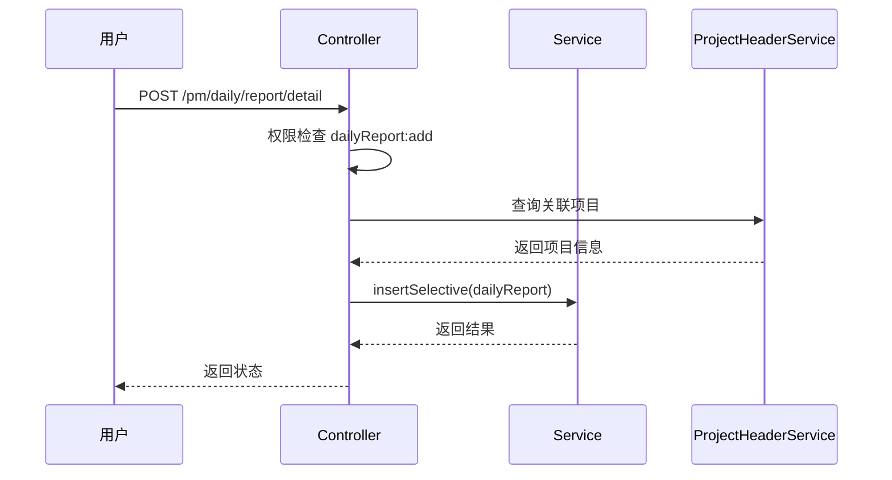
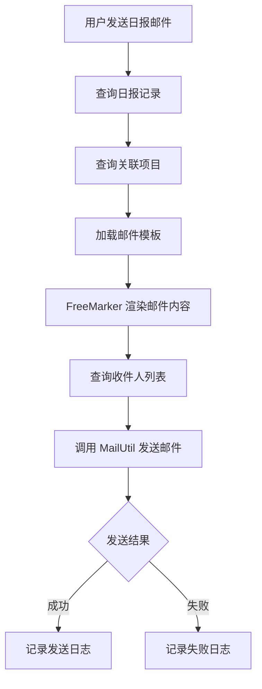

# 日报管理模块文档

> 本文档详细分析 PMS-springmvc 日报管理模块。
> 源码：`com.dp.plat.pms.springmvc.controller.DailyReportController`

---

## 1. 模块概述

日报管理模块负责项目日报的创建、查询、更新、删除，以及日报导出和邮件通知功能。

### 1.1 涉及的类

| 类型 | 类名 | 职责 |
|------|------|------|
| Controller | `DailyReportController` | 日报请求处理 |
| Service | `IDailyReportService` / `DailyReportService` | 日报业务逻辑 |
| DAO | `DailyReportMapper` | 数据访问 |
| Entity | `DailyReport` | 日报实体 |
| VO | `DailyReportVO` | 日报视图对象 |

### 1.2 涉及的数据库表

| 表名 | 说明 |
|------|------|
| `pm_daily_report` | 日报主表 |
| `pm_project_header` | 项目头信息（关联查询） |

### 1.3 依赖的其他模块

- 项目管理模块（`IProjectHeaderService`）：查询项目信息
- 邮件服务（`MailUtil`）：日报邮件通知
- 通知模板服务（`NotifyTemplateService`）：邮件模板

---

## 2. Controller 方法说明

### 2.1 类定义

```java
@Controller
@RequestMapping(ProjectConstant.URLPath.PROJECT_MANAGER + "/daily/report")
public class DailyReportController 
    extends AbstractController<IDailyReportService, DailyReport, DailyReportVO> {
```

- **URL 命名空间**：`/pm/daily/report`
- **初始化**：`viewModel=dailyReport`、`useTemplate=true`

### 2.2 方法列表

| 方法 | URL | HTTP 方法 | 功能 | 权限 |
|------|-----|----------|------|------|
| `home` | `/pm/daily/report/` | GET | 日报管理首页 | `dailyReport:list` |
| `list` | `/pm/daily/report/list` | GET | 日报列表查询 | `dailyReport:list` |
| `findOne` | `/pm/daily/report/{id}` | GET | 日报详情查询 | `dailyReport:detail` |
| `detail` | `/pm/daily/report/detail` | GET | 打开日报详情页面 | `dailyReport:detail` |
| `create` | `/pm/daily/report/detail` | POST | 新增日报 | `dailyReport:add` |
| `update` | `/pm/daily/report/{id}` | PUT | 更新日报 | `dailyReport:edit` |
| `delete` | `/pm/daily/report/{id}` | DELETE | 删除日报 | `dailyReport:delete` |
| `exportDailyReport` | `/pm/daily/report/{id}/export` | POST | 导出日报 | `dailyReport:detail` |
| `sendDailyReportMail` | `/pm/daily/report/{id}/sendMail` | POST | 发送日报邮件 | `dailyReport:detail` |

### 2.3 核心方法详解

#### `list` - 日报列表查询

- **业务逻辑**:
  1. 权限检查（`dailyReport:list`）
  2. 设置过滤条件：`disabled=false`
  3. 项目关联查询：设置 `transferProjectFlag=1`，查询核销项目的关联日报
  4. 角色判断：非管理员限制项目类型、办事处、成员
  5. 分页查询

#### `exportDailyReport` - 导出日报

- **业务逻辑**:
  1. 查询日报记录
  2. 查询关联项目信息
  3. 使用 FreeMarker 模板生成 Word 文档
  4. 下载文件

#### `sendDailyReportMail` - 发送日报邮件

- **业务逻辑**:
  1. 查询日报记录
  2. 查询关联项目信息
  3. 加载邮件模板（`NotifyTemplateService`）
  4. 使用 FreeMarker 渲染邮件内容
  5. 调用 `MailUtil` 发送邮件

---

## 3. 权限控制

### 3.1 权限编码

| 权限编码 | 说明 |
|----------|------|
| `dailyReport:list` | 查看日报列表 |
| `dailyReport:detail` | 查看日报详情 |
| `dailyReport:add` | 新增日报 |
| `dailyReport:edit` | 编辑日报 |
| `dailyReport:delete` | 删除日报 |

### 3.2 角色控制

| 角色 | 权限范围 |
|------|---------|
| `ROLE_ADMIN` | 所有权限 |
| `ROLE_PM_ADMIN` | 项目管理员，所有日报权限 |
| `ROLE_PM_SUB_ADMIN` | 子项目管理员，限制项目类型 |
| 其他角色 | 限制项目类型、办事处、成员 |

---

## 4. 业务流程

### 4.1 日报创建流程



### 4.2 日报邮件通知流程



---

## 5. 数据模型

### 5.1 DailyReport 实体

| 字段名 | 类型 | 说明 |
|--------|------|------|
| `id` | Integer | 主键 ID |
| `projectId` | Integer | 项目 ID |
| `reportDate` | Date | 日报日期 |
| `reportContent` | String | 日报内容 |
| `workProgress` | String | 工作进度 |
| `planContent` | String | 计划内容 |
| `issues` | String | 存在问题 |
| `createBy` | String | 创建人 |
| `createTime` | Date | 创建时间 |
| `disabled` | Boolean | 是否禁用 |
| `customInfo` | Map | 自定义扩展信息 |

### 5.2 DailyReportVO 视图对象

继承 `DailyReport`，增加：

| 字段名 | 类型 | 说明 |
|--------|------|------|
| `projectTypes` | String | 允许访问的项目类型 |
| `officeCodes` | String | 允许访问的办事处 |
| `memberCode` | String | 成员工号 |
| `transferProjectFlag` | Integer | 核销项目关联标记 |

---

## 6. 邮件通知

### 6.1 邮件模板

日报邮件使用 FreeMarker 模板渲染，模板存储在数据库（`NotifyTemplate`）或文件系统。

### 6.2 邮件发送

```java
// 使用 StringTemplateLoader 动态加载模板
StringTemplateLoader templateLoader = new StringTemplateLoader();
templateLoader.putTemplate("dailyReportMail", templateContent);

Configuration cfg = new Configuration(Configuration.VERSION_2_3_30);
cfg.setTemplateLoader(templateLoader);
Template template = cfg.getTemplate("dailyReportMail");

// 渲染邮件内容
String mailContent = FreeMarkerTemplateUtils.processTemplateIntoString(template, dataModel);

// 发送邮件
MailUtil.sendMail(toAddresses, subject, mailContent);
```

---

## 附录：相关文档

- [项目管理](project-management.md)
- [Controller 方法参考](controller-methods-reference.md)
