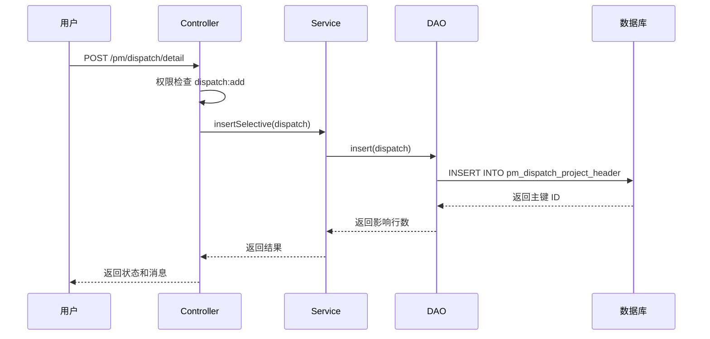
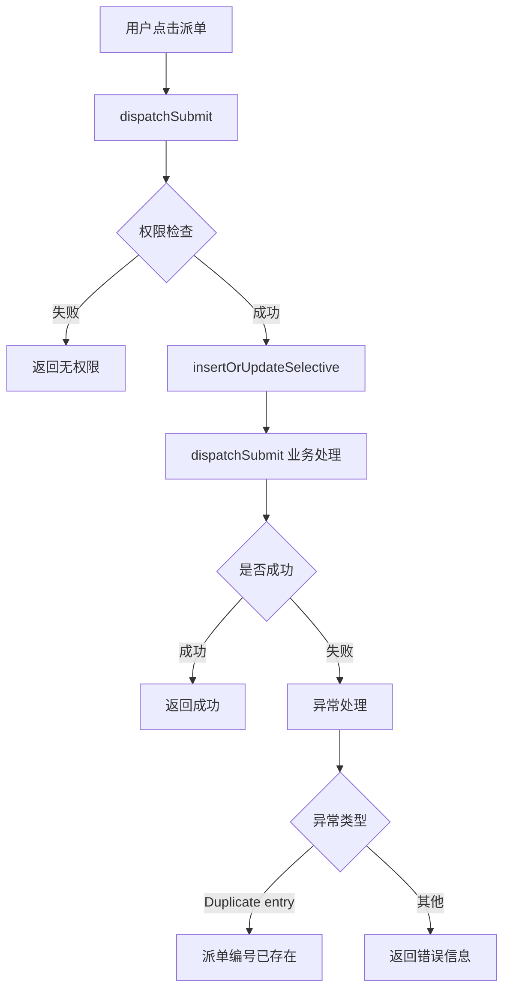
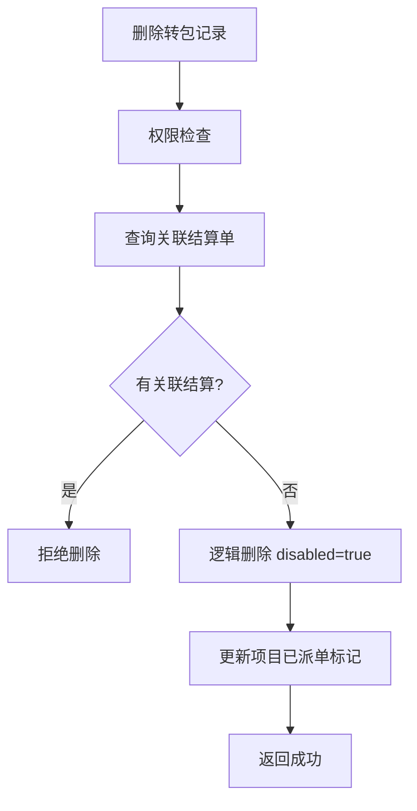

# 转包项目管理模块文档

> 本文档详细分析 PMS-springmvc 转包项目管理模块，包括 DispatchProjectController 的完整方法说明、业务流程和权限控制。
> 源码：`com.dp.plat.pms.springmvc.controller.DispatchProjectController`

---

## 1. 模块概述

转包项目管理模块负责项目转包（外派）的全生命周期管理，包括转包记录创建、派单、查询、删除、外派单导出等功能。

### 1.1 涉及的类

| 类型 | 类名 | 包路径 | 职责 |
|------|------|--------|------|
| Controller | `DispatchProjectController` | `com.dp.plat.pms.springmvc.controller` | 转包项目请求处理 |
| Service | `IDispatchProjectService` / `DispatchProjectService` | `com.dp.plat.pms.springmvc.service` | 转包项目业务逻辑 |
| DAO | `DispatchProjectMapper` | `com.dp.plat.pms.springmvc.dao` | 数据访问 |
| Entity | `DispatchProject` | `com.dp.plat.pms.springmvc.entity` | 转包项目实体 |
| VO | `DispatchVO` | `com.dp.plat.pms.springmvc.vo` | 转包项目视图对象 |

### 1.2 涉及的数据库表

| 表名 | 说明 |
|------|------|
| `pm_dispatch_project_header` | 转包项目主表 |
| `pm_dispatch_project_settlement` | 转包结算表（关联查询） |
| `pm_project_header` | 项目头信息（关联查询） |
| `pm_project_manage_user` | 项目管理用户（责任人电话查询） |
| `pm_common_related_data` | 关联数据（工作内容查询） |

### 1.3 依赖的其他模块

- 转包结算模块（`IDispatchSettlementService`）：查询关联结算
- 项目管理模块（`IProjectHeaderService`）：查询项目头信息
- 项目管理用户模块（`IProjectManageUserService`）：查询责任人电话
- 老系统转包模块（`SubcontractService`）：查询多维度信息

---

## 2. Controller 方法详细说明

### 2.1 类定义

```java
@Controller
@RequestMapping(ProjectConstant.URLPath.PROJECT_MANAGER + "dispatch")
public class DispatchProjectController 
    extends AbstractController<IDispatchProjectService, DispatchProject, DispatchVO> {
```

- **URL 命名空间**：`/pm/dispatch`
- **继承**：`AbstractController`，自动获得通用 CRUD 方法
- **初始化**：`@PostConstruct init()` 设置 `viewModel=dispatch`、`useTemplate=true`

### 2.2 方法列表

| 方法 | URL | HTTP 方法 | 功能 | 权限 |
|------|-----|----------|------|------|
| `list` | `/pm/dispatch/list` | GET | 转包记录列表查询 | `dispatch:list` |
| `findOne` | `/pm/dispatch/{id}` | GET | 转包详情查询 | `dispatch:detail` |
| `detail` | `/pm/dispatch/detail` | GET | 打开转包详情页面 | `dispatch:detail` |
| `create` | `/pm/dispatch/detail` | POST | 新增转包记录 | `dispatch:add` |
| `update` | `/pm/dispatch/{id}` | PUT | 更新转包记录 | `dispatch:edit` |
| `delete` | `/pm/dispatch/{id}` | DELETE | 删除转包记录 | `dispatch:delete` |
| `dispatchSubmit` | `/pm/dispatch/submit` | POST | 派单提交 | `dispatch:submit` |
| `dispatchPayment` | `/pm/dispatch/modals/payment` | GET | 派单付款弹窗 | - |
| `exportProjectInfoDoc` | `/pm/dispatch/{id}/{exportType}/info` | POST | 导出外派单 Word | `dispatch:detail` |
| `generateDispatchSeq` | `/pm/dispatch/generateDispatchSeq` | GET | 生成派单编号 | - |
| `multiDimsInfo` | `/pm/dispatch/{id}/multiDimInfos` | GET | 多维度信息查询 | `dispatch:detail` |
| `listWithSettleInfo` | `/pm/dispatch/listWithSettleInfo` | GET | 查询带结算信息的列表 | - |

### 2.3 核心方法详解

#### `list` - 转包记录列表查询

- **URL**: `/pm/dispatch/list`
- **业务逻辑**:
  1. 权限检查（`dispatch:list`）
  2. 设置过滤条件：`disabled=false`、`effectiveFrom/To=当前时间`
  3. 角色判断：
     - 非项目管理员/系统管理员：限制项目类型（`projectTypes`）
     - 非子项目管理员/财务AP：限制办事处（`officeCodes`）、添加指派成员（`memberCode`）
     - 项目外派结算人员：仅查看已外派项目（`dispatched=true`）
  4. 分页查询：`countBySelectivePageable` + `selectBySelectivePageable`
  5. 返回列表视图

#### `create` - 新增转包记录

- **URL**: `/pm/dispatch/detail`（POST）
- **业务逻辑**:
  1. 权限检查（`dispatch:add`）
  2. 调用 `dispatchProjectService.insertSelective(dispatch)`
  3. 异常处理：`Duplicate entry` 转换为"派单编号已存在"

#### `delete` - 删除转包记录

- **URL**: `/pm/dispatch/{id}`（DELETE）
- **业务逻辑**:
  1. 权限检查（`dispatch:delete`）
  2. 查询关联结算单数量
  3. 若有关联结算单：返回错误"不允许删除关联结算单的派单记录"
  4. 逻辑删除：`disabled=true`、`effectiveTo=当前时间`
  5. 更新项目的已派单标记（`PROJECT_DISPATCHED_KEY`）

#### `dispatchSubmit` - 派单提交

- **URL**: `/pm/dispatch/submit`（POST）
- **业务逻辑**:
  1. 权限检查（`dispatch:submit`）
  2. 调用 `insertOrUpdateSelective` 保存
  3. 调用 `dispatchSubmit` 执行派单业务逻辑
  4. 异常处理：`Duplicate entry` 转换为"派单编号已存在"

#### `exportProjectInfoDoc` - 导出外派单

- **URL**: `/pm/dispatch/{id}/{exportType}/info`（POST）
- **业务逻辑**:
  1. 查询转包记录
  2. 校验：仅框架协议（`FRAMEWORK_AGREEMENT`）有外派单
  3. 查询责任人电话（`projectManageUserService.selectBySelective`）
  4. 查询工作内容（`commonRelatedDataService.selectBySelective`）
  5. 使用 FreeMarker 模板生成 Word 文档（`安服框架协议外派单.ftl`）
  6. 下载文件

#### `generateDispatchSeq` - 生成派单编号

- **URL**: `/pm/dispatch/generateDispatchSeq`
- **业务逻辑**:
  1. 根据服务商编号生成派单编号（`generateDispatchSeq`）
  2. 根据日期和序号生成派单合同号（`generateDispatchNo`）

---

## 3. 权限控制

### 3.1 权限检查方法

`DispatchProjectController` 重写了 `checkPermission` 方法，实现细粒度权限控制：

```java
public boolean checkPermission(DispatchVO dispatch, Model model, String... permissions) {
    // 1. 调用父类权限检查
    if (!super.checkPermission(dispatch, model, permissions)) {
        return false;
    }
    // 2. 项目级权限检查
    if (!UserContext.checkPermission("project:*") && dispatch != null) {
        PermissionResult projectPermit = projectHeaderService.checkPermission(project, permissions);
        // 3. 角色交集计算
        String[] allPermitRoles = PermissionUtils.getRetainAllRoles(...);
        PermissionResult checkPermit = new PermissionUtils(...).checkPermit(...);
        return checkPermit.isPermit();
    }
    return true;
}
```

### 3.2 权限编码

| 权限编码 | 说明 |
|----------|------|
| `dispatch:list` | 查看转包列表 |
| `dispatch:detail` | 查看转包详情 |
| `dispatch:add` | 新增转包记录 |
| `dispatch:edit` | 编辑转包记录 |
| `dispatch:delete` | 删除转包记录 |
| `dispatch:submit` | 派单提交 |
| `project:*` | 项目所有权限（管理员） |

### 3.3 角色控制

| 角色 | 权限范围 |
|------|---------|
| `ROLE_ADMIN` | 所有权限 |
| `ROLE_PM_ADMIN` | 项目管理员，所有转包权限 |
| `ROLE_PM_SUB_ADMIN` | 子项目管理员，限制项目类型 |
| `ROLE_FINANCIAL_AP` | 财务AP，限制项目类型 |
| `ROLE_PM_DISPATCH_SETTLE_STAFF` | 项目外派结算人员，仅查看已外派项目 |

---

## 4. 业务流程

### 4.1 转包记录创建流程



### 4.2 派单提交流程



### 4.3 删除转包记录流程



---

## 5. 数据模型

### 5.1 DispatchProject 实体

| 字段名 | 类型 | 说明 |
|--------|------|------|
| `id` | Integer | 主键 ID |
| `dispatchSeq` | String | 派单编号 |
| `dispatchNo` | String | 派单合同号 |
| `dispatchName` | String | 派单名称 |
| `projectIds` | String | 关联项目 ID（逗号分隔） |
| `projectId` | Integer | 项目 ID |
| `type` | String | 转包类型（框架协议等） |
| `dispatched` | Boolean | 是否已派单 |
| `disabled` | Boolean | 是否禁用 |
| `effectiveFrom` | Date | 生效开始时间 |
| `effectiveTo` | Date | 生效结束时间 |
| `dutyPerson` | String | 责任人 |
| `officeDutyPerson` | String | 办事处责任人 |
| `profitDepCode` | String | 利润部门编码 |
| `customInfo` | Map | 自定义扩展信息 |

### 5.2 DispatchVO 视图对象

继承 `DispatchProject`，增加以下字段：

| 字段名 | 类型 | 说明 |
|--------|------|------|
| `projectTypes` | String | 允许访问的项目类型 |
| `officeCodes` | String | 允许访问的办事处 |
| `memberCode` | String | 成员工号 |
| `project` | ProjectVO | 关联项目信息 |
| `multiDimInfos` | Map | 多维度信息 |

---

## 6. 异常处理

| 异常类型 | 触发条件 | 处理方式 |
|---------|---------|---------|
| `Duplicate entry` | 派单编号重复 | 返回"派单编号已存在" |
| `Exception` | 其他异常 | 记录异常 ID，返回错误信息 |

---

## 7. 配置说明

### 7.1 转包类型常量

```java
public class ProjectConstant {
    public class DispatchType {
        public static final String FRAMEWORK_AGREEMENT = "frameworkAgreement"; // 框架协议
    }
}
```

### 7.2 已派单标记

```java
public class ProjectConstant {
    public class Common {
        public static final String PROJECT_DISPATCHED_KEY = "projectDispatched";
    }
}
```

---

## 附录：相关文档

- [转包结算管理](dispatch-settlement.md)
- [项目管理](project-management.md)
- [工作流管理](workflow.md)
- [Controller 方法参考](controller-methods-reference.md)
