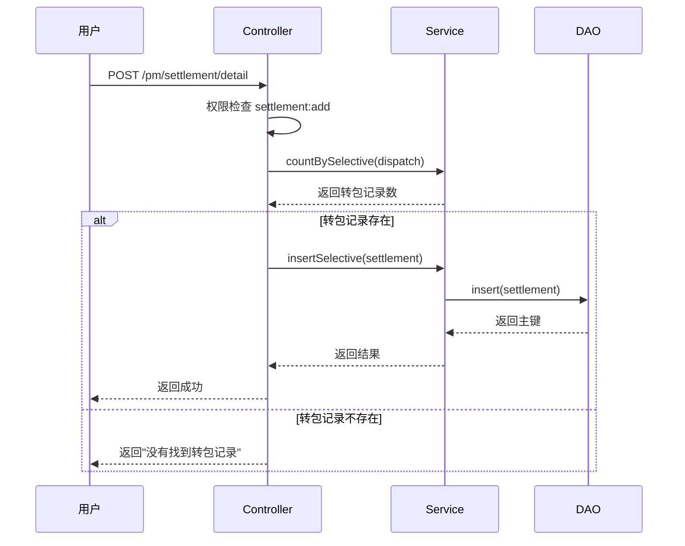
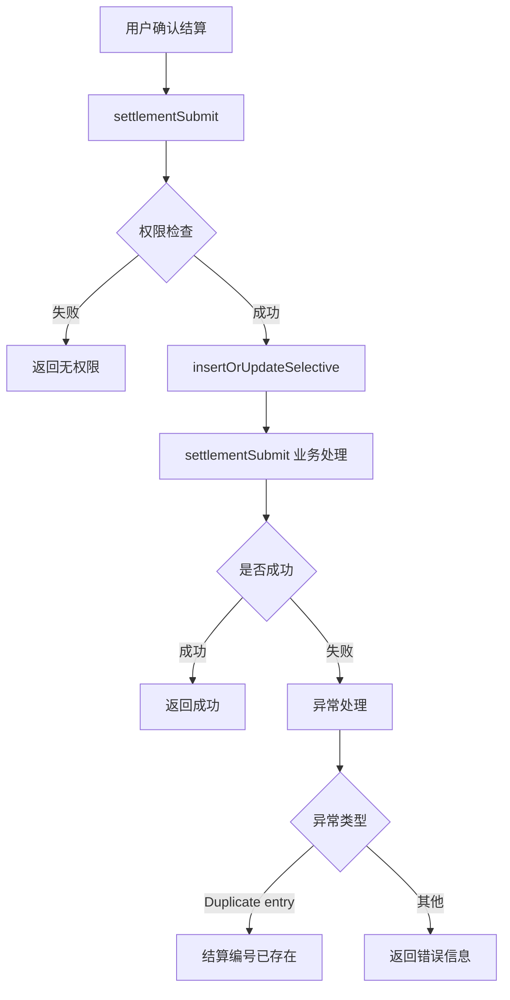
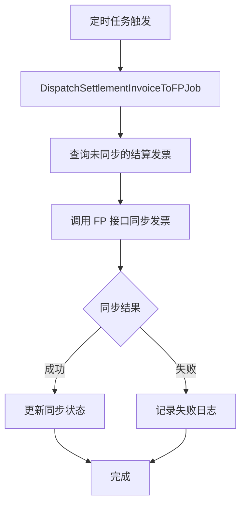

# 转包结算管理模块文档

> 本文档详细分析 PMS-springmvc 转包结算管理模块，包括 DispatchSettlementController 和 DispatchSettlementService 的完整方法说明、业务流程和权限控制。
> 源码：`com.dp.plat.pms.springmvc.controller.DispatchSettlementController`、`com.dp.plat.pms.springmvc.service.DispatchSettlementService`

---

## 1. 模块概述

转包结算管理模块负责转包项目的结算全流程管理，包括结算记录创建、确认结算、发票管理、项目信息单导出、付款同步等功能。

### 1.1 涉及的类

| 类型 | 类名 | 包路径 | 职责 |
|------|------|--------|------|
| Controller | `DispatchSettlementController` | `com.dp.plat.pms.springmvc.controller` | 转包结算请求处理 |
| Service | `IDispatchSettlementService` / `DispatchSettlementService` | `com.dp.plat.pms.springmvc.service` | 转包结算业务逻辑 |
| DAO | `DispatchSettlementMapper` | `com.dp.plat.pms.springmvc.dao` | 数据访问 |
| Entity | `DispatchSettlement` | `com.dp.plat.pms.springmvc.entity` | 转包结算实体 |
| VO | `SettlementVO` | `com.dp.plat.pms.springmvc.vo` | 转包结算视图对象 |
| Aspect | `DispatchSettlementUpdateAspect` | `com.dp.plat.pms.aop` | 发运结算更新切面 |
| Job | `DispatchSettlementInvoiceToFPJob` | `com.dp.plat.pms.springmvc.job` | 发票同步到 FP |
| Job | `DispatchSettlementSEEPaymentJob` | `com.dp.plat.pms.springmvc.job` | 付款同步 |

### 1.2 涉及的数据库表

| 表名 | 说明 |
|------|------|
| `pm_dispatch_project_settlement` | 转包结算主表 |
| `pm_dispatch_project_header` | 转包项目表（关联查询） |
| `pm_project_header` | 项目头信息（关联查询） |
| `file_info` | 文件信息表（发票附件） |

### 1.3 依赖的其他模块

- 转包项目模块（`IDispatchProjectService`）：查询转包记录
- 项目管理模块（`IProjectHeaderService`）：查询项目头信息
- 文件服务（`IFileInfoService`）：发票文件管理
- FP 集成（`DispatchSettlementInvoiceToFPJob`）：发票同步

---

## 2. Controller 方法详细说明

### 2.1 类定义

```java
@Controller
@RequestMapping(ProjectConstant.URLPath.PROJECT_MANAGER + "settlement")
public class DispatchSettlementController 
    extends AbstractController<IDispatchSettlementService, DispatchSettlement, SettlementVO> {
```

- **URL 命名空间**：`/pm/settlement`
- **继承**：`AbstractController`
- **初始化**：`viewModel=settlement`、`useTemplate=true`

### 2.2 方法列表

| 方法 | URL | HTTP 方法 | 功能 | 权限 |
|------|-----|----------|------|------|
| `list` | `/pm/settlement/list` | GET | 结算列表查询 | `settlement:list` |
| `findOne` | `/pm/settlement/{id}` | GET | 结算详情查询 | `settlement:detail` |
| `detail` | `/pm/settlement/detail` | GET | 打开结算页面 | `settlement:detail` |
| `create` | `/pm/settlement/detail` | POST | 新增结算记录 | `settlement:add` |
| `update` | `/pm/settlement/{id}` | PUT | 更新结算记录 | `settlement:edit` |
| `delete` | `/pm/settlement/{id}` | DELETE | 删除结算记录 | `settlement:delete` |
| `settlementSubmit` | `/pm/settlement/submit` | POST | 确认结算 | `settlement:submit` |
| `exportProjectInfoDoc` | `/pm/settlement/{id}/projectInfoDoc` | POST | 生成项目信息单 | `settlement:detail` |
| `settlementInvoiceDetails` | `/pm/settlement/{id}/invoice` | GET | 发票明细查询 | `settlement:detail` |
| `verifySettlementInvoice` | `/pm/settlement/{id}/invoice/verify` | GET | 发票验证 | `settlement:detail` |
| `syncSettlementPayment` | `/pm/settlement/syncPayment` | GET | 同步付款信息 | - |

### 2.3 核心方法详解

#### `list` - 结算列表查询

- **URL**: `/pm/settlement/list`
- **业务逻辑**:
  1. 权限检查（`settlement:list`）
  2. 设置过滤条件：`dispatched=true`
  3. 角色判断：
     - 非项目管理员/系统管理员：限制项目类型（`projectTypes`）
     - 非子项目管理员/财务AP：限制办事处（`officeCodes`）、添加成员（`memberCode`）
  4. 分页查询：`countSettlementWidthDispatchPageable` + `selectSettlementWidthDispatchPageable`

#### `findOne` - 结算详情查询

- **URL**: `/pm/settlement/{id}`
- **业务逻辑**:
  1. JSON 请求：查询结算记录
  2. 权限检查（`settlement:detail`）
  3. 查询关联转包记录（`selectDispatchVOWithAmountBySelective`）
  4. 设置 `dispatch` 到 VO
  5. 查询表单字段、按钮、导航标签

#### `create` - 新增结算记录

- **URL**: `/pm/settlement/detail`（POST）
- **业务逻辑**:
  1. 权限检查（`settlement:add`）
  2. 校验转包记录是否存在（`countBySelective`）
  3. 调用 `insertSelective` 插入结算记录
  4. 异常处理：`Duplicate entry` 转换为"结算编号已存在"

#### `settlementSubmit` - 确认结算

- **URL**: `/pm/settlement/submit`（POST）
- **业务逻辑**:
  1. 权限检查（`settlement:submit`）
  2. 调用 `insertOrUpdateSelective` 保存
  3. 调用 `settlementSubmit` 执行结算业务逻辑
  4. 异常处理：`Duplicate entry` 转换为"结算编号已存在"

#### `delete` - 删除结算记录

- **URL**: `/pm/settlement/{id}`（DELETE）
- **业务逻辑**:
  1. 权限检查（`settlement:delete`）
  2. 状态校验：已结算（`settled=true`）或流程中（`hasTask=true`）的不允许删除
  3. 逻辑删除：`disabled=true`

#### `exportProjectInfoDoc` - 生成项目信息单

- **URL**: `/pm/settlement/{id}/projectInfoDoc`（POST）
- **业务逻辑**:
  1. 查询结算记录
  2. 权限检查（`settlement:detail`）
  3. 查询关联转包记录
  4. 查询发票清单（`selectDispatchSettlementInvoiceDetails`）
  5. 使用 FreeMarker 模板生成 Word 文档（`项目信息单.ftl` 或 `项目信息单带发票.ftl`）
  6. 下载文件

#### `settlementInvoiceDetails` - 发票明细查询

- **URL**: `/pm/settlement/{id}/invoice`
- **业务逻辑**:
  1. 查询结算记录
  2. 权限检查（`settlement:detail`）
  3. 查询发票文件信息（`selectDispatchSettlementInvoiceDetails`）
  4. 返回发票列表

#### `syncSettlementPayment` - 同步付款信息

- **URL**: `/pm/settlement/syncPayment`
- **业务逻辑**:
  1. 创建 `DispatchSettlementSEEPaymentJob` 实例
  2. 调用 `execute()` 执行付款同步

---

## 3. Service 方法说明

### 3.1 IDispatchSettlementService 核心方法

| 方法签名 | 功能 | 事务类型 |
|----------|------|----------|
| `int insertSelective(DispatchSettlement t)` | 选择性插入结算记录 | 事务 |
| `int updateByPrimaryKeySelective(DispatchSettlement t)` | 选择性更新 | 事务 |
| `int insertOrUpdateSelective(DispatchSettlement t)` | 插入或更新 | 事务 |
| `void settlementSubmit(Integer id, SettlementVO settlement)` | 确认结算 | 事务 |
| `List<FileInfo> selectDispatchSettlementInvoiceDetails(SettlementVO settlement)` | 查询发票明细 | 无事务 |
| `Result verifySettlementInvoice(DispatchSettlement settlement)` | 发票验证 | 事务 |
| `long countSettlementWidthDispatchPageable(PageParam<?> pageParam)` | 分页计数 | 无事务 |
| `List<Object> selectSettlementWidthDispatchPageable(PageParam<?> pageParam)` | 分页查询 | 无事务 |

---

## 4. 权限控制

### 4.1 权限检查方法

`DispatchSettlementController` 重写了 `checkPermission` 方法：

```java
public boolean checkPermission(SettlementVO v, Model model, String... permissions) {
    // 1. 调用父类权限检查
    if (!super.checkPermission(v, model, permissions)) {
        return false;
    }
    // 2. 项目级权限检查
    if (!UserContext.checkPermission("project:*") && v != null) {
        PermissionResult permissionResult = dispatchProjectService.checkPermission(...);
        // 3. 项目转包结算人员特殊处理
        if (permissionResult.isPermit() && UserContext.hasAnyRoles(ROLE_PM_DISPATCH_SETTLE_STAFF)) {
            permissionResult.setPermissionType("edit");
        }
        // 4. 已结算只读控制
        if ("1".equals(readOnlyWhenSettled) && (v.getSettled() || v.hasTask())) {
            model.addAttribute("permissionType", "view");
        }
        return permissionResult.isPermit();
    }
    return true;
}
```

### 4.2 权限编码

| 权限编码 | 说明 |
|----------|------|
| `settlement:list` | 查看结算列表 |
| `settlement:detail` | 查看结算详情 |
| `settlement:add` | 新增结算记录 |
| `settlement:edit` | 编辑结算记录 |
| `settlement:delete` | 删除结算记录 |
| `settlement:submit` | 确认结算 |

### 4.3 已结算只读控制

通过系统参数 `pm.dispatch.settlement.settled.readonly` 控制：

| 值 | 行为 |
|-----|------|
| `1`（默认） | 已结算或流程中的记录只读 |
| `0` | 已结算记录可编辑 |

---

## 5. AOP 切面

### 5.1 DispatchSettlementUpdateAspect

`DispatchSettlementUpdateAspect` 切面拦截结算更新操作，处理：

- 发票文件同步
- 发票金额计算
- 发票识别状态检查
- 发票验证状态更新

### 5.2 切面方法

| 方法 | 功能 |
|------|------|
| `getFileInvoiceType()` | 获取发票文件类型 |
| `checkFileInvoiceStatus(Map)` | 检查发票文件状态 |

---

## 6. 定时任务

### 6.1 DispatchSettlementInvoiceToFPJob

- **功能**：将结算发票同步到 FP 系统
- **触发**：`0 10 8,13 * * ?`（每天 8:10 和 13:10）
- **配置**：`quartz-job.xml`

### 6.2 DispatchSettlementSEEPaymentJob

- **功能**：同步 SSE 系统的付款信息
- **触发**：`0 30 5 * * ?`（每天 5:30）
- **配置**：`quartz-job.xml`

---

## 7. 业务流程

### 7.1 结算创建流程



### 7.2 确认结算流程



### 7.3 发票同步流程



---

## 8. 数据模型

### 8.1 DispatchSettlement 实体

| 字段名 | 类型 | 说明 |
|--------|------|------|
| `id` | Integer | 主键 ID |
| `dispatchId` | Integer | 转包记录 ID |
| `dispatchSeq` | String | 转包编号 |
| `settleSeq` | String | 结算编号 |
| `projectId` | Integer | 项目 ID |
| `settled` | Boolean | 是否已结算 |
| `disabled` | Boolean | 是否禁用 |
| `customInfo` | Map | 自定义扩展信息（含发票文件 ID 等） |

### 8.2 SettlementVO 视图对象

继承 `DispatchSettlement`，增加：

| 字段名 | 类型 | 说明 |
|--------|------|------|
| `dispatch` | DispatchVO | 关联转包记录 |
| `projectTypes` | String | 允许访问的项目类型 |
| `officeCodes` | String | 允许访问的办事处 |
| `memberCode` | String | 成员工号 |
| `dispatchSeq` | String | 转包编号 |

---

## 9. 异常处理

| 异常类型 | 触发条件 | 处理方式 |
|---------|---------|---------|
| `Duplicate entry` | 结算编号重复 | 返回"结算编号已存在" |
| `Exception` | 其他异常 | 记录异常 ID，返回错误信息 |

---

## 10. 配置说明

### 10.1 系统参数

| 参数 | 默认值 | 说明 |
|------|--------|------|
| `pm.dispatch.settlement.settled.readonly` | `1` | 已结算记录是否只读 |
| `af.export.settlement.projectInfo` | `02项目信息单-%s.doc` | 项目信息单文件名模板 |

### 10.2 FreeMarker 模板

| 模板文件 | 用途 |
|---------|------|
| `项目信息单.ftl` | 项目信息单（不含发票） |
| `项目信息单带发票.ftl` | 项目信息单（含发票清单） |

---

## 附录：相关文档

- [转包项目管理](dispatch-project.md)
- [定时任务](quartz-jobs.md)
- [Controller 方法参考](controller-methods-reference.md)
