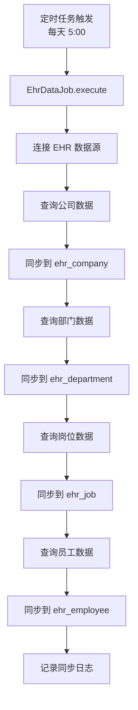

# EHR 人力资源集成模块文档

> 本文档详细分析 PMS-springmvc EHR 人力资源集成模块，包括组织架构同步、员工查询、用户初始化等功能。
> 源码：`com.dp.plat.ehr.controller.EHRDataController`、`com.dp.plat.ehr.job.EhrDataJob`

---

## 1. 模块概述

EHR 人力资源集成模块负责从 EHR 系统同步组织架构数据（公司、部门、岗位、员工）到本地，并提供查询接口供其他模块使用。

### 1.1 涉及的类

| 类型 | 类名 | 包路径 | 职责 |
|------|------|--------|------|
| Controller | `EHRDataController` | `com.dp.plat.ehr.controller` | EHR 数据请求处理 |
| Job | `EhrDataJob` | `com.dp.plat.ehr.job` | EHR 数据定时同步 |
| Service | `IEhrCompanyService` | `com.dp.plat.ehr.service` | 公司服务 |
| Service | `IEhrDepartmentService` | `com.dp.plat.ehr.service` | 部门服务 |
| Service | `IEmployeeService` | `com.dp.plat.ehr.service` | 员工服务 |
| Service | `IJobService` | `com.dp.plat.ehr.service` | 岗位服务 |
| Service | `IEhrSynchronizeService` | `com.dp.plat.ehr.service` | 数据同步服务 |
| Service | `IEHRLoginAccountService` | `com.dp.plat.ehr.service` | 登录账号服务 |
| Service | `IEhrEmpPowerService` | `com.dp.plat.ehr.service` | 员工权限服务 |
| Service | `IHolidayService` | `com.dp.plat.ehr.service` | 假期服务 |

### 1.2 涉及的数据库表

| 表名 | 说明 |
|------|------|
| `ehr_company` | 公司表 |
| `ehr_department` | 部门表 |
| `ehr_employee` | 员工表 |
| `ehr_job` | 岗位表 |
| `ehr_login_account` | 登录账号表 |
| `ehr_emp_power` | 员工权限表 |
| `ehr_holiday` | 假期表 |
| `ehr_synchronize` | 数据同步记录表 |

### 1.3 数据源

EHR 模块使用独立的 SQL Server 数据源（`dataSourceEHR`），通过 `RoutingDataSource` 动态切换。

---

## 2. Controller 方法说明

### 2.1 类定义

```java
@RequestMapping(UrlPrefixConstant.EHR_DATA_URL)
@Controller
public class EHRDataController {
```

- **URL 命名空间**：`/ehr/`（由 `UrlPrefixConstant.EHR_DATA_URL = "/ehr/"` 定义，详见 `com.dp.plat.ehr.constants.UrlPrefixConstant:12`）
- **注意**：方法级 `@RequestMapping` 的路径直接拼接在 `/ehr/` 之后，例如 `/company/list` → 完整 URL 为 `/ehr/company/list`（不是 `/ehr/data/...`，旧版文档描述有误，已修正）

### 2.2 方法列表

| 方法 | URL | HTTP 方法 | 功能 |
|------|-----|----------|------|
| `listView` | `/ehr/` | GET | EHR 数据首页（返回公司列表视图） |
| `findCompanies` | `/ehr/company/list` | GET | 公司列表查询 |
| `findCompany` | `/ehr/company/{id}` | GET | 公司详情查询 |
| `findCompaniesTree` | `/ehr/company/tree` | GET | 公司树形数据 |
| `findDepartments` | `/ehr/department/list` | GET | 部门列表查询 |
| `findDepartment` | `/ehr/department/{id}` | GET | 部门详情查询 |
| `findDepartmentTree` | `/ehr/department/tree` | GET | 部门树形数据 |
| `findJobs` | `/ehr/job/list` | GET | 岗位列表查询 |
| `findJob` | `/ehr/job/{id}` | GET | 岗位详情查询 |
| `findEmployees` | `/ehr/employee/list` | GET | 员工列表查询 |
| `findEmployee` | `/ehr/employee/{id}` | GET | 员工详情查询 |
| `listEmployeeSelect2Data` | `/ehr/employeeDataList` | GET | 员工 Select2 数据 |
| `initUser` | `/ehr/initUser` | GET | 初始化用户 |
| `syncData` | `/ehr/syncData` | GET | 手动触发同步 |

### 2.3 核心方法详解

#### `findEmployees` - 员工列表查询

- **业务逻辑**:
  1. 分页查询员工数据
  2. 支持懒加载（`isLazyLoad`）
  3. 支持简化模式（`isSimple=true` 返回 `SimpleEmployeeVO`）
  4. 返回员工列表（工号、姓名、公司、部门、岗位）

#### `listEmployeeSelect2Data` - 员工 Select2 数据

- **业务逻辑**:
  1. 查询匹配的员工数据
  2. 若员工为空，查询 Activiti 候选组
  3. 返回 Select2 格式数据（id、text、info）

#### `initUser` - 初始化用户

- **业务逻辑**:
  1. 设置员工状态：`empStatus=1`、`empType=1`
  2. 读取系统参数 `pm.sync.user.empParams`
  3. 若有 `empParams`：按组合条件同步
  4. 若无 `empParams`：
     - 按部门同步（`pm.sync.user.officeCodes`、`pm.sync.user.depIDs`）
     - 按岗位同步（`pm.sync.user.jobIDs`、`pm.sync.user.jobCodes`）
  5. 调用 `employeeService.initUser(employeeList)` 初始化用户

#### `syncData` - 手动触发同步

- **业务逻辑**:
  1. 创建 `EhrDataJob` 实例
  2. 调用 `execute()` 执行同步

---

## 3. 定时同步任务

### 3.1 EhrDataJob

- **功能**：定时同步 EHR 组织架构数据
- **触发**：`0 0 5 * * ?`（每天 5:00）
- **配置**：`quartz-job.xml`

### 3.2 同步内容

| 同步对象 | 源表（EHR） | 目标表（本地） |
|---------|------------|--------------|
| 公司 | EHR 公司表 | `ehr_company` |
| 部门 | EHR 部门表 | `ehr_department` |
| 岗位 | EHR 岗位表 | `ehr_job` |
| 员工 | EHR 员工表 | `ehr_employee` |
| 登录账号 | EHR 账号表 | `ehr_login_account` |

### 3.3 同步流程



---

## 4. 数据源切换

EHR 模块通过 `RoutingDataSource`（`com.dp.plat.core.config.RoutingDataSource`）实现多数据源动态切换。数据源路由在 `src/main/resources/spring.xml:137-154` 中配置：

```xml
<bean id="dataSource" class="com.dp.plat.core.config.RoutingDataSource">
    <property name="targetDataSources">
        <map key-type="java.lang.String">
            <entry key="${jdbc.key1}" value-ref="dataSourceLocal"/>
            <entry key="${jdbc.key2}" value-ref="dataSourcePMS"/>
            <entry key="${jdbc.key3}" value-ref="dataSourceSMS"/>
            <entry key="${jdbc.key4}" value-ref="dataSourceEHR"/>   <!-- EHR 数据源 -->
            <entry key="${jdbc.key5}" value-ref="dataSourceD365"/>
            <entry key="${jdbc.key6}" value-ref="dataSourceCRM"/>
        </map>
    </property>
    <property name="defaultTargetDataSource" ref="dataSourceLocal"/>
</bean>
```

### 4.1 切换机制（注解驱动 + AOP）

core 模块提供 `@DataSource` 注解（`com.dp.plat.core.annotation.DataSource`）+ `DataSourceAspect` 切面（`com.dp.plat.core.aop.DataSourceAspect`）实现注解驱动的数据源切换：

- 切点：`@within(DataSource) || @annotation(DataSource)` — 类级或方法级注解均可触发
- 切面逻辑：
  - `@Before`：读取注解 `value()` → `DataSourceHolder.setDataSourceType(value)` → 路由到对应数据源
  - `@After`：`DataSourceHolder.setDataSourceType("")` → 清空 ThreadLocal 回到默认数据源

```java
// 用法示例（注解可标注在类或方法上；类级注解会被方法级注解覆盖）
@DataSource("ehr")     // value 应为 spring.xml 中 targetDataSources 的 key
public List<Employee> selectFromEhr() {
    return employeeMapper.selectAll();
}
```

> ⚠️ **重要事实校正**：旧版文档示例中 `@DataSource("ehr")` 仅为示意用法。实际 `EmployeeServiceImpl`（`com.dp.plat.ehr.service.impl.EmployeeService`）并未标注 `@DataSource` 注解 — 它依赖默认数据源 `dataSourceLocal`（MySQL/PMS）。EHR 原始数据通过 `view_ehr_employee` 视图（位于 `dataSourceLocal`）暴露，该视图由 `EhrDataJob` 定时从 `dataSourceEHR` 同步而来。如需直接访问 `dataSourceEHR`，需在 Service 方法上显式添加 `@DataSource("ehr")` 注解（`ehr` 为 `${jdbc.key4}` 解析后的字符串值）。

### 4.2 数据源路由

| 操作 | 数据源 | 说明 |
|------|--------|------|
| 查询 EHR 同步后数据 | `dataSourceLocal`（默认） | MySQL，本地 `view_ehr_employee` 视图 |
| 查询 EHR 原始数据 | `dataSourceEHR` | SQL Server，需 `@DataSource("ehr")` 注解显式切换 |
| 同步数据 | `EhrDataJob` 跨数据源操作 | 先读 `dataSourceEHR`，再写 `dataSourceLocal` |

---

## 5. 树形数据结构

### 5.1 公司树

```java
@RequestMapping("/company/tree")
public String findCompaniesTree(Company company, Model model) throws Exception {
    List<TreeNode> companyList = ehrCompanyService.getTreeData(company);
    model.addAttribute("data", companyList);
    return null;
}
```

### 5.2 部门树

```java
@RequestMapping("/department/tree")
public String findDepartmentTree(DepartmentVO department, Model model) throws Exception {
    List<DepartmentVO> departmentList = ehrDepartmentService.selectVOBySelective(department);
    List<TreeNode> treeList = TreeNodeUtils.constructTreeNodeData(departmentList, null);
    model.addAttribute("data", treeList);
    return UrlPrefixConstant.PERFORMANCE_MANAGER + "department_tree";
}
```

### 5.3 TreeNode 结构

```java
public class TreeNode {
    private String id;
    private String text;
    private String parentId;
    private List<TreeNode> children;
    private Map<String, Object> data;
}
```

---

## 6. 数据模型

### 6.1 Employee 实体

| 字段名 | 类型 | 说明 |
|--------|------|------|
| `empID` | Integer | 员工 ID |
| `workNo` | String | 工号 |
| `name` | String | 姓名 |
| `compID` | Integer | 公司 ID |
| `compName` | String | 公司名称 |
| `depID` | Integer | 部门 ID |
| `depName` | String | 部门名称 |
| `depAllName` | String | 部门全称 |
| `jobID` | Integer | 岗位 ID |
| `jobName` | String | 岗位名称 |
| `empStatus` | Integer | 员工状态（1=在职） |
| `empType` | Integer | 员工类型（1=正式） |
| `mobile` | String | 手机号 |
| `email` | String | 邮箱 |

### 6.2 Department 实体

| 字段名 | 类型 | 说明 |
|--------|------|------|
| `depID` | Integer | 部门 ID |
| `depName` | String | 部门名称 |
| `depAllName` | String | 部门全称 |
| `parentDepID` | Integer | 父部门 ID |
| `depGrade` | Integer | 部门层级 |
| `compID` | Integer | 所属公司 ID |

### 6.3 Company 实体

| 字段名 | 类型 | 说明 |
|--------|------|------|
| `compID` | Integer | 公司 ID |
| `compName` | String | 公司名称 |
| `compCode` | String | 公司编码 |
| `parentCompID` | Integer | 父公司 ID |

---

## 7. 系统参数

EHR 模块使用以下系统参数控制用户同步：

| 参数 | 说明 | 示例 |
|------|------|------|
| `pm.sync.user.empParams` | 员工同步组合条件 | `{"depCodes":"001","jobCodes":"J001"}` |
| `pm.sync.user.officeCodes` | 办事处编码 | `001,002,003` |
| `pm.sync.user.depIDs` | 部门 ID | `101,102,103` |
| `pm.sync.user.jobIDs` | 岗位 ID | `201,202,203` |
| `pm.sync.user.jobCodes` | 岗位编码 | `J001,J002,J003` |

---

## 8. Activiti 集成

### 8.1 候选组查询

`listEmployeeSelect2Data` 方法在员工查询为空时，查询 Activiti 候选组：

```java
if (employeeDataList.isEmpty()) {
    List<Group> groups = identityService.createGroupQuery()
        .groupNameLike("%" + select2Data.getText() + "%")
        .list();
    for (Group group : groups) {
        Select2Data data = new Select2Data();
        data.setId("候选组");
        data.setText("候选组-" + group.getName());
        employeeDataList.add(data);
    }
}
```

### 8.2 用途

在工作流审批人选择时，支持选择员工或候选组作为审批人。

---

## 9. 绩效考评人关系（AppraiserRelationship + EmployeeAppraiserVO）

> 源码：`com.dp.plat.ehr.entity.AppraiserRelationship`、`com.dp.plat.ehr.vo.EmployeeAppraiserVO`
> 用途：维护员工与其考评人之间的关系，用于绩效评价流程（考评人选择、权重计算、并行/串行多级审批）

### 9.1 AppraiserRelationship 实体

**类定义**：`com.dp.plat.ehr.entity.AppraiserRelationship extends BaseEntity`（`AppraiserRelationship.java:5`）

```java
public class AppraiserRelationship extends BaseEntity {
    private Integer appraiseeId;        // 被评估人 userId
    private String  appraiseeName;      // 被评估人 username
    private Integer appraiserId;        // 评估人 userId
    private String  appraiserName;      // 评估人 username
    private Boolean isDirectSupervisor; // 是否为直接主管
    private String  type;              // 评估人类型（上级/同事/下属/自评）
    private Byte    typeWeight;        // 评估人类型权重，0~100
    private Byte    personalWeight;    // 评估人类型权重占比，0~100；weight=typeWeight*personalWeight/100
    private Byte    priority;          // 评估人优先级别，越大优先级越高，越后评估
    private Boolean state;             // 启用状态
}
```

**字段说明**：

| 字段 | 类型 | 说明 |
|------|------|------|
| `appraiseeId` | `Integer` | 被评估人 userId |
| `appraiseeName` | `String` | 被评估人 username |
| `appraiserId` | `Integer` | 评估人 userId |
| `appraiserName` | `String` | 评估人 username |
| `isDirectSupervisor` | `Boolean` | 是否为直接主管 |
| `type` | `String` | 评估人类型（上级/同事/下属/自评） |
| `typeWeight` | `Byte` | 评估人类型权重（0~100） |
| `personalWeight` | `Byte` | 评估人类型权重占比（0~100）；最终权重 `weight = typeWeight * personalWeight / 100` |
| `priority` | `Byte` | 评估人优先级别，越大优先级越高，越后评估 |
| `state` | `Boolean` | 启用状态 |

### 9.2 EmployeeAppraiserVO 视图对象

**类定义**：`com.dp.plat.ehr.vo.EmployeeAppraiserVO extends EmployeeVO`（`EmployeeAppraiserVO.java:8`）

```java
public class EmployeeAppraiserVO extends EmployeeVO {
    List<AppraiserRelationship> appraiserRelationshipList;
    Map<String, AppraiserRelationship> appraiserRelationshipMap;
}
```

**字段说明**：

| 字段 | 类型 | 说明 |
|------|------|------|
| `appraiserRelationshipList` | `List<AppraiserRelationship>` | 员工的考评人关系列表 |
| `appraiserRelationshipMap` | `Map<String, AppraiserRelationship>` | 按类型分组的考评人映射（用于快速查找） |

### 9.3 数据库表

| 表名 | 说明 |
|------|------|
| `perf_appraiser_relationship` | 考评人关系表 — 字段映射：`appraiseeId` → `appraiseeId`、`appraiserId` → `appraiserId`、`priority` → `priority`、`state` → `state`（仅 `state=1` 的记录视为启用） |
| `view_ehr_employee` | EHR 员工视图（`dataSourceLocal` MySQL），与 `perf_appraiser_relationship` 通过 `empID = appraiseeId` 关联 |

### 9.4 Service / DAO 方法

| 层级 | 方法签名 | 说明 |
|------|----------|------|
| `IEmployeeService` | `List<EmployeeAppraiserVO> selectEmployeeAppraiserBySelectivePageableVO(PageParam<EmployeeVO> pageParam)` | 接口声明（`IEmployeeService.java:62`） |
| `EmployeeService` | `List<EmployeeAppraiserVO> selectEmployeeAppraiserBySelectivePageableVO(PageParam<EmployeeVO> pageParam)` | 实现：直接委托 DAO（`EmployeeService.java:221-223`） |
| `EmployeeMapper` | `List<EmployeeAppraiserVO> selectEmployeeAppraiserBySelectivePageableVO(PageParam<EmployeeVO> pageParam)` | MyBatis Mapper 方法（`EmployeeMapper.java:42`） |

### 9.5 ResultMap 映射

`EmployeeMapper.xml:1226-1238` 定义 `EmployeeAppraiserVOMap`：

```xml
<resultMap type="com.dp.plat.ehr.vo.EmployeeAppraiserVO" id="EmployeeAppraiserVOMap">
    <id column="empID" jdbcType="INTEGER" property="empID" />
    <result column="workNo" jdbcType="VARCHAR" property="workNo" />
    <result column="name" jdbcType="VARCHAR" property="name" />
    <result column="compName" jdbcType="VARCHAR" property="compName" />
    <result column="depAllName" jdbcType="VARCHAR" property="depAllName" />
    <result column="jobName" jdbcType="VARCHAR" property="jobName" />
    <collection property="appraiserRelationshipList" ofType="com.dp.plat.ehr.entity.AppraiserRelationship">
        <result column="appraiser_priority" property="priority"/>
        <result column="appraiser_name" property="appraiserName"/>
    </collection>
</resultMap>
```

### 9.6 查询 SQL

`EmployeeMapper.xml:1239-1255` 定义 `selectEmployeeAppraiserBySelectivePageableVO`：

```sql
SELECT
    e.*,
    par.priority AS appraiser_priority,
    CASE
        WHEN e2.workNo IS NOT NULL
        THEN GROUP_CONCAT(CONCAT(e2.workNo, '-', par.appraiserName))
        ELSE par.appraiserName
    END AS appraiser_name
FROM
    view_ehr_employee e
    LEFT JOIN perf_appraiser_relationship par
        ON e.empID = par.appraiseeId
        AND par.state = 1
    LEFT JOIN view_ehr_employee e2
        ON par.appraiserId = e2.empID
<where>
    <!-- 按 empID / workNo / name / eName / compID / depID / jobID 动态条件 -->
</where>
```

**SQL 关键点**：
- 通过 `view_ehr_employee`（员工视图）LEFT JOIN `perf_appraiser_relationship`（考评人关系）获取关系数据
- 仅关联 `state=1` 的启用关系
- 二次 LEFT JOIN `view_ehr_employee`（别名 e2）取评估人工号，用 `GROUP_CONCAT` 拼接为 `"工号-姓名"` 字符串
- 支持按 `empID / workNo / name / eName / compID / depID / jobID` 等多条件动态过滤

### 9.7 使用现状

⚠️ **死代码警示**：`selectEmployeeAppraiserBySelectivePageableVO` 方法在 Service/DAO 层已声明并实现，但**全代码库中没有任何 Controller 或其他 Service 调用此方法**（Grep 验证：`PMS/PMS-springmvc/src/main/java` 下仅有 3 处出现，全部分布在接口、实现类、Mapper 接口三处声明位置）。

推测此方法为预留接口或已被其他考评流程替代。如需启用，建议：
- 在 Controller 层（如 `EHRDataController` 或绩效模块 Controller）添加 `/employee/appraiser/list` 端点
- 或在工作流监听器中调用，替代遗留的 `PlanObjectiveAppraiserRelationship`（已注释，见 `QualityApproveTrackListener.java:494-716` 等）

### 9.8 与遗留代码 PlanObjectiveAppraiserRelationship 的关系

工作流监听器（`SubcontractInspectionListener`、`QualityApproveTrackListener`、`QualityApproveTrackListener2`、`PmWorkFlowService`）中存在大量**已注释**的 `PlanObjectiveAppraiserRelationship` 引用 — 这是早期绩效目标审批模块遗留的代码：

- `PlanObjectiveAppraiserRelationship`：旧版"目标考评人关系"实体（疑似已删除或迁移到其他模块）
- `AppraiserRelationship`：当前 EHR 模块的"员工考评人关系"实体（本节所述）

两者**不是同一个类**，不应混淆。新代码应使用 `AppraiserRelationship` + `EmployeeAppraiserVO`。

---

## 附录：相关文档

- [定时任务](quartz-jobs.md)
- [多数据源架构](../01-architecture/multi-datasource.md)
- [工作流管理](workflow.md)
- [SAP 合同实体同步](sap-contract.md)
