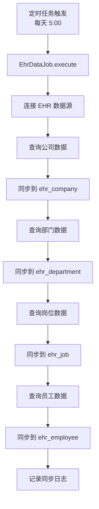

# EHR 人力资源集成模块文档

> 本文档详细分析 PMS-springmvc EHR 人力资源集成模块，包括组织架构同步、员工查询、用户初始化等功能。
> 源码：`com.dp.plat.ehr.controller.EHRDataController`、`com.dp.plat.ehr.job.EhrDataJob`

---

## 1. 模块概述

EHR 人力资源集成模块负责从 EHR 系统同步组织架构数据（公司、部门、岗位、员工）到本地，并提供查询接口供其他模块使用。

### 1.1 涉及的类

| 类型 | 类名 | 包路径 | 职责 |
|------|------|--------|------|
| Controller | `EHRDataController` | `com.dp.plat.ehr.controller` | EHR 数据请求处理 |
| Job | `EhrDataJob` | `com.dp.plat.ehr.job` | EHR 数据定时同步 |
| Service | `IEhrCompanyService` | `com.dp.plat.ehr.service` | 公司服务 |
| Service | `IEhrDepartmentService` | `com.dp.plat.ehr.service` | 部门服务 |
| Service | `IEmployeeService` | `com.dp.plat.ehr.service` | 员工服务 |
| Service | `IJobService` | `com.dp.plat.ehr.service` | 岗位服务 |
| Service | `IEhrSynchronizeService` | `com.dp.plat.ehr.service` | 数据同步服务 |
| Service | `IEHRLoginAccountService` | `com.dp.plat.ehr.service` | 登录账号服务 |
| Service | `IEhrEmpPowerService` | `com.dp.plat.ehr.service` | 员工权限服务 |
| Service | `IHolidayService` | `com.dp.plat.ehr.service` | 假期服务 |

### 1.2 涉及的数据库表

| 表名 | 说明 |
|------|------|
| `ehr_company` | 公司表 |
| `ehr_department` | 部门表 |
| `ehr_employee` | 员工表 |
| `ehr_job` | 岗位表 |
| `ehr_login_account` | 登录账号表 |
| `ehr_emp_power` | 员工权限表 |
| `ehr_holiday` | 假期表 |
| `ehr_synchronize` | 数据同步记录表 |

### 1.3 数据源

EHR 模块使用独立的 SQL Server 数据源（`dataSourceEHR`），通过 `RoutingDataSource` 动态切换。

---

## 2. Controller 方法说明

### 2.1 类定义

```java
@RequestMapping(UrlPrefixConstant.EHR_DATA_URL)
@Controller
public class EHRDataController {
```

- **URL 命名空间**：`/ehr/data`（由 `UrlPrefixConstant.EHR_DATA_URL` 定义）

### 2.2 方法列表

| 方法 | URL | HTTP 方法 | 功能 |
|------|-----|----------|------|
| `listView` | `/ehr/data` | GET | EHR 数据首页 |
| `findCompanies` | `/ehr/data/company/list` | GET | 公司列表查询 |
| `findCompany` | `/ehr/data/company/{id}` | GET | 公司详情查询 |
| `findCompaniesTree` | `/ehr/data/company/tree` | GET | 公司树形数据 |
| `findDepartments` | `/ehr/data/department/list` | GET | 部门列表查询 |
| `findDepartment` | `/ehr/data/department/{id}` | GET | 部门详情查询 |
| `findDepartmentTree` | `/ehr/data/department/tree` | GET | 部门树形数据 |
| `findJobs` | `/ehr/data/job/list` | GET | 岗位列表查询 |
| `findJob` | `/ehr/data/job/{id}` | GET | 岗位详情查询 |
| `findEmployees` | `/ehr/data/employee/list` | GET | 员工列表查询 |
| `findEmployee` | `/ehr/data/employee/{id}` | GET | 员工详情查询 |
| `listEmployeeSelect2Data` | `/ehr/data/employeeDataList` | GET | 员工 Select2 数据 |
| `initUser` | `/ehr/data/initUser` | GET | 初始化用户 |
| `syncData` | `/ehr/data/syncData` | GET | 手动触发同步 |

### 2.3 核心方法详解

#### `findEmployees` - 员工列表查询

- **业务逻辑**:
  1. 分页查询员工数据
  2. 支持懒加载（`isLazyLoad`）
  3. 支持简化模式（`isSimple=true` 返回 `SimpleEmployeeVO`）
  4. 返回员工列表（工号、姓名、公司、部门、岗位）

#### `listEmployeeSelect2Data` - 员工 Select2 数据

- **业务逻辑**:
  1. 查询匹配的员工数据
  2. 若员工为空，查询 Activiti 候选组
  3. 返回 Select2 格式数据（id、text、info）

#### `initUser` - 初始化用户

- **业务逻辑**:
  1. 设置员工状态：`empStatus=1`、`empType=1`
  2. 读取系统参数 `pm.sync.user.empParams`
  3. 若有 `empParams`：按组合条件同步
  4. 若无 `empParams`：
     - 按部门同步（`pm.sync.user.officeCodes`、`pm.sync.user.depIDs`）
     - 按岗位同步（`pm.sync.user.jobIDs`、`pm.sync.user.jobCodes`）
  5. 调用 `employeeService.initUser(employeeList)` 初始化用户

#### `syncData` - 手动触发同步

- **业务逻辑**:
  1. 创建 `EhrDataJob` 实例
  2. 调用 `execute()` 执行同步

---

## 3. 定时同步任务

### 3.1 EhrDataJob

- **功能**：定时同步 EHR 组织架构数据
- **触发**：`0 0 5 * * ?`（每天 5:00）
- **配置**：`quartz-job.xml`

### 3.2 同步内容

| 同步对象 | 源表（EHR） | 目标表（本地） |
|---------|------------|--------------|
| 公司 | EHR 公司表 | `ehr_company` |
| 部门 | EHR 部门表 | `ehr_department` |
| 岗位 | EHR 岗位表 | `ehr_job` |
| 员工 | EHR 员工表 | `ehr_employee` |
| 登录账号 | EHR 账号表 | `ehr_login_account` |

### 3.3 同步流程



---

## 4. 数据源切换

EHR 模块通过 `RoutingDataSource` 切换到 EHR 数据源：

```java
// Service 层切换数据源
@DataSource("ehr")
public List<Employee> selectFromEhr() {
    return employeeMapper.selectAll();
}
```

### 4.1 数据源路由

| 操作 | 数据源 | 说明 |
|------|--------|------|
| 查询 EHR 原始数据 | `dataSourceEHR` | SQL Server，EHR 系统 |
| 查询本地同步数据 | `dataSourceLocal` | MySQL，本地缓存 |
| 同步数据 | 先读 `dataSourceEHR`，再写 `dataSourceLocal` | 跨数据源操作 |

---

## 5. 树形数据结构

### 5.1 公司树

```java
@RequestMapping("/company/tree")
public String findCompaniesTree(Company company, Model model) throws Exception {
    List<TreeNode> companyList = ehrCompanyService.getTreeData(company);
    model.addAttribute("data", companyList);
    return null;
}
```

### 5.2 部门树

```java
@RequestMapping("/department/tree")
public String findDepartmentTree(DepartmentVO department, Model model) throws Exception {
    List<DepartmentVO> departmentList = ehrDepartmentService.selectVOBySelective(department);
    List<TreeNode> treeList = TreeNodeUtils.constructTreeNodeData(departmentList, null);
    model.addAttribute("data", treeList);
    return UrlPrefixConstant.PERFORMANCE_MANAGER + "department_tree";
}
```

### 5.3 TreeNode 结构

```java
public class TreeNode {
    private String id;
    private String text;
    private String parentId;
    private List<TreeNode> children;
    private Map<String, Object> data;
}
```

---

## 6. 数据模型

### 6.1 Employee 实体

| 字段名 | 类型 | 说明 |
|--------|------|------|
| `empID` | Integer | 员工 ID |
| `workNo` | String | 工号 |
| `name` | String | 姓名 |
| `compID` | Integer | 公司 ID |
| `compName` | String | 公司名称 |
| `depID` | Integer | 部门 ID |
| `depName` | String | 部门名称 |
| `depAllName` | String | 部门全称 |
| `jobID` | Integer | 岗位 ID |
| `jobName` | String | 岗位名称 |
| `empStatus` | Integer | 员工状态（1=在职） |
| `empType` | Integer | 员工类型（1=正式） |
| `mobile` | String | 手机号 |
| `email` | String | 邮箱 |

### 6.2 Department 实体

| 字段名 | 类型 | 说明 |
|--------|------|------|
| `depID` | Integer | 部门 ID |
| `depName` | String | 部门名称 |
| `depAllName` | String | 部门全称 |
| `parentDepID` | Integer | 父部门 ID |
| `depGrade` | Integer | 部门层级 |
| `compID` | Integer | 所属公司 ID |

### 6.3 Company 实体

| 字段名 | 类型 | 说明 |
|--------|------|------|
| `compID` | Integer | 公司 ID |
| `compName` | String | 公司名称 |
| `compCode` | String | 公司编码 |
| `parentCompID` | Integer | 父公司 ID |

---

## 7. 系统参数

EHR 模块使用以下系统参数控制用户同步：

| 参数 | 说明 | 示例 |
|------|------|------|
| `pm.sync.user.empParams` | 员工同步组合条件 | `{"depCodes":"001","jobCodes":"J001"}` |
| `pm.sync.user.officeCodes` | 办事处编码 | `001,002,003` |
| `pm.sync.user.depIDs` | 部门 ID | `101,102,103` |
| `pm.sync.user.jobIDs` | 岗位 ID | `201,202,203` |
| `pm.sync.user.jobCodes` | 岗位编码 | `J001,J002,J003` |

---

## 8. Activiti 集成

### 8.1 候选组查询

`listEmployeeSelect2Data` 方法在员工查询为空时，查询 Activiti 候选组：

```java
if (employeeDataList.isEmpty()) {
    List<Group> groups = identityService.createGroupQuery()
        .groupNameLike("%" + select2Data.getText() + "%")
        .list();
    for (Group group : groups) {
        Select2Data data = new Select2Data();
        data.setId("候选组");
        data.setText("候选组-" + group.getName());
        employeeDataList.add(data);
    }
}
```

### 8.2 用途

在工作流审批人选择时，支持选择员工或候选组作为审批人。

---

## 附录：相关文档

- [定时任务](quartz-jobs.md)
- [多数据源架构](../01-architecture/multi-datasource.md)
- [工作流管理](workflow.md)
