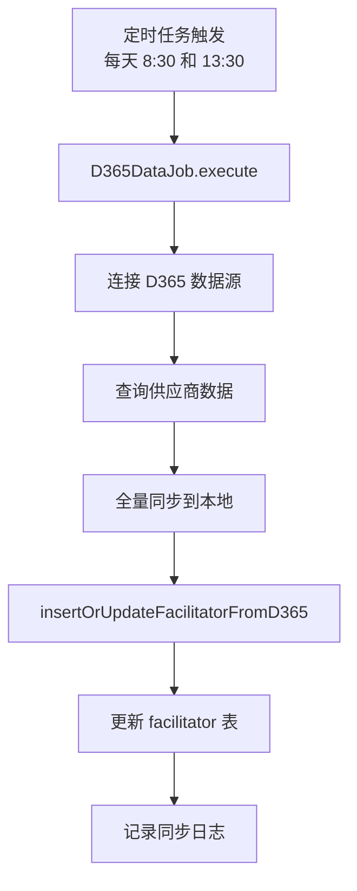
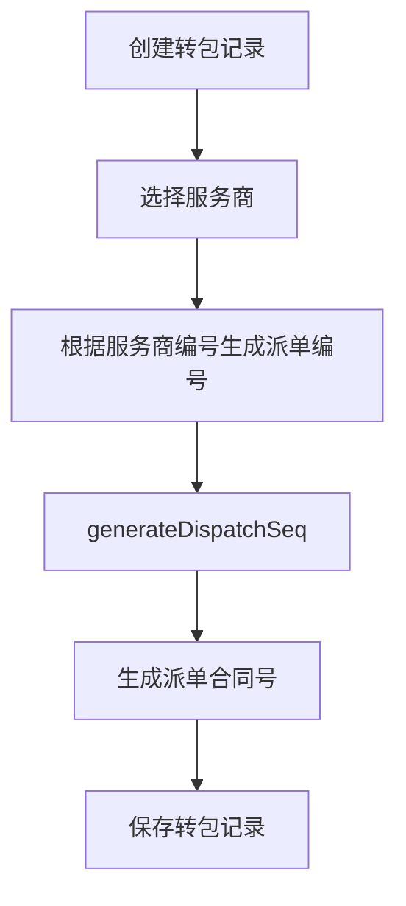
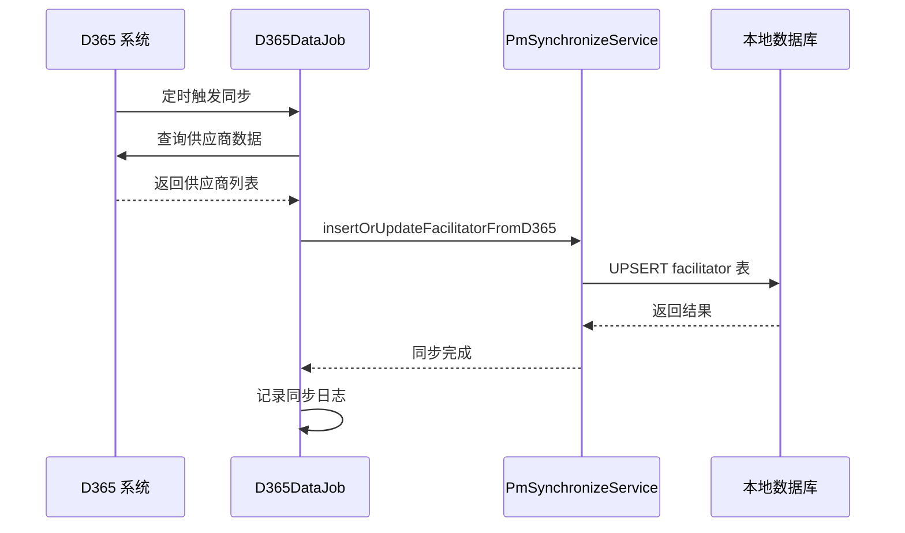

# 服务商管理模块文档

> 本文档详细分析 PMS-springmvc 服务商管理模块。
> 源码：`com.dp.plat.pms.springmvc.controller.FacilitatorController`

---

## 1. 模块概述

服务商管理模块负责转包项目服务商（供应商）的维护，包括服务商信息查询、更新，以及从 D365 系统同步服务商数据。

### 1.1 涉及的类

| 类型 | 类名 | 职责 |
|------|------|------|
| Controller | `FacilitatorController` | 服务商请求处理 |
| Service | `IFacilitatorService` / `FacilitatorService` | 服务商业务逻辑 |
| DAO | `FacilitatorMapper` | 数据访问 |
| Entity | `Facilitator` | 服务商实体 |
| VO | `FacilitatorVO` | 服务商视图对象 |
| Job | `D365DataJob` | D365 数据同步（含服务商） |

### 1.2 涉及的数据库表

| 表名 | 说明 |
|------|------|
| `pm_facilitator` | 服务商主表 |

---

## 2. Controller 方法说明

### 2.1 类定义

```java
@Controller
@RequestMapping(ProjectConstant.URLPath.PROJECT_MANAGER + "facilitator")
public class FacilitatorController 
    extends AbstractController<IFacilitatorService, Facilitator, FacilitatorVO> {
```

- **URL 命名空间**：`/pm/facilitator`

### 2.2 方法列表

| 方法 | URL | HTTP 方法 | 功能 | 权限 |
|------|-----|----------|------|------|
| `home` | `/pm/facilitator/` | GET | 服务商管理首页 | `facilitator:list` |
| `list` | `/pm/facilitator/list` | GET | 服务商列表查询 | `facilitator:list` |

> **注意**：`FacilitatorController` 方法数较少（2个），主要继承 `AbstractController` 的通用 CRUD 方法。服务商数据主要通过 D365 定时任务同步，前端主要用于查询。

---

## 3. D365 数据同步

### 3.1 同步机制

服务商数据通过 `D365DataJob` 定时从 D365 系统同步：

```java
public class D365DataJob extends SynchronizeJob {
    public D365DataJob() {
        super(SyncType.FULL_SYNC, new Class<?>[] {
            Facilitator.class,
            PurchaseReceiptSettlement.class
        }, "D365", "PMS");
    }
    
    @Override
    public void execute() {
        // 1. 全量同步 D365 数据
        super.execute(params);
        // 2. 插入/更新供应商信息
        pmSynchronizeService.insertOrUpdateFacilitatorFromD365();
    }
}
```

### 3.2 同步流程



---

## 4. 数据模型

### 4.1 Facilitator 实体

| 字段名 | 类型 | 说明 |
|--------|------|------|
| `id` | Integer | 主键 ID |
| `facilitatorCode` | String | 服务商编码 |
| `facilitatorName` | String | 服务商名称 |
| `facilitatorType` | String | 服务商类型 |
| `contactPerson` | String | 联系人 |
| `contactPhone` | String | 联系电话 |
| `address` | String | 地址 |
| `bankAccount` | String | 银行账号 |
| `bankName` | String | 开户行 |
| `disabled` | Boolean | 是否禁用 |
| `customInfo` | Map | 自定义扩展信息 |

### 4.2 FacilitatorVO 视图对象

继承 `Facilitator`，增加查询辅助字段。

---

## 5. 业务流程

### 5.1 服务商在转包业务中的使用



### 5.2 服务商数据维护流程



---

## 6. 权限控制

### 6.1 权限编码

| 权限编码 | 说明 |
|----------|------|
| `facilitator:list` | 查看服务商列表 |
| `facilitator:detail` | 查看服务商详情 |
| `facilitator:edit` | 编辑服务商 |

---

## 附录：相关文档

- [转包项目管理](dispatch-project.md)
- [定时任务](quartz-jobs.md)
- [Controller 方法参考](controller-methods-reference.md)
