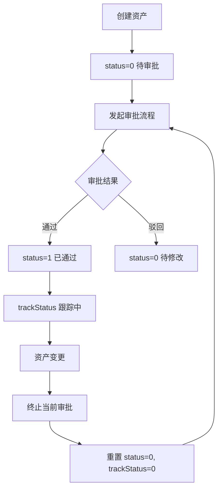
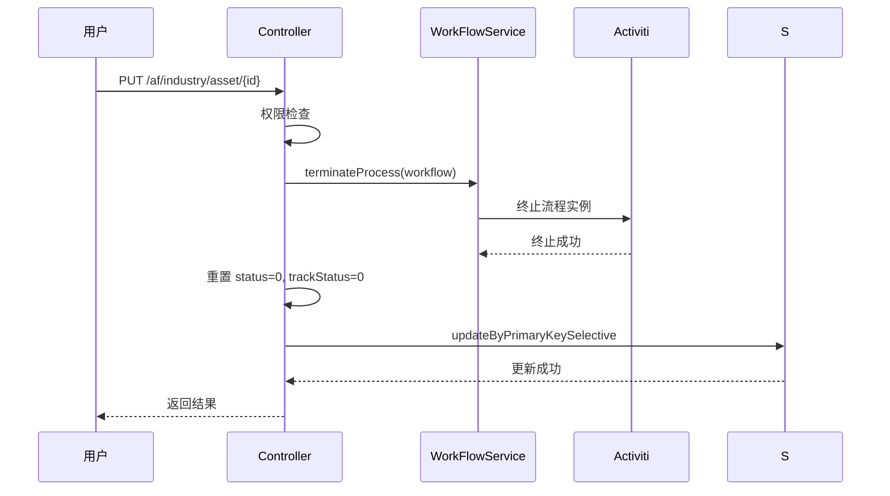
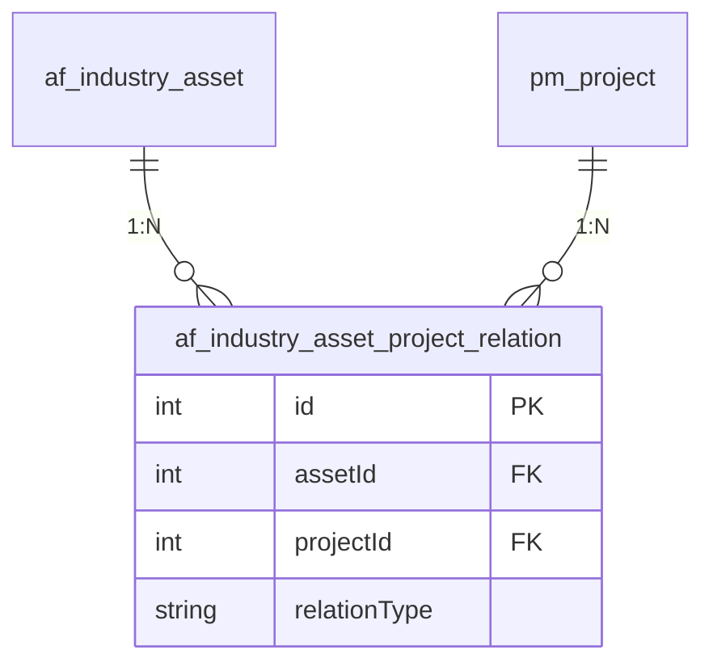
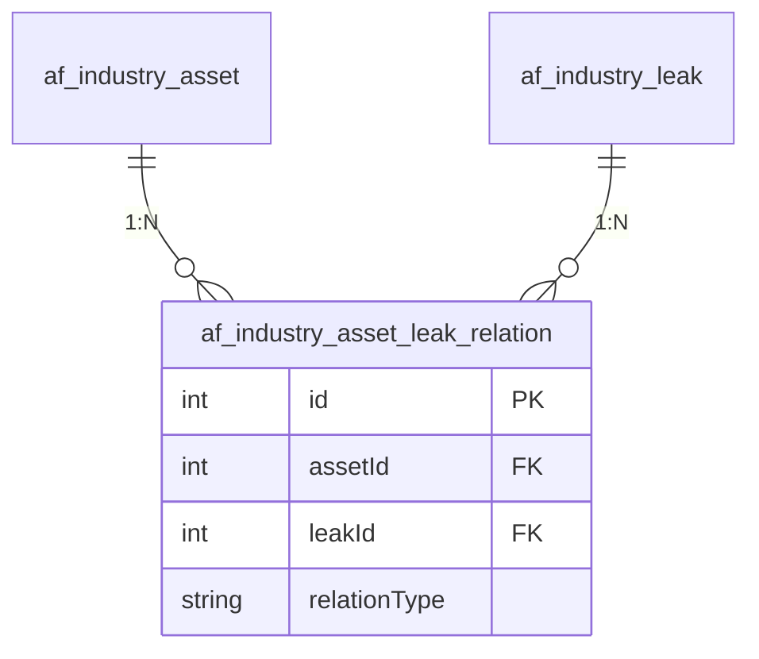

# 行业资产管理模块文档

> 本文档详细分析 PMS-springmvc 行业资产管理模块。
> 源码：`com.dp.plat.pms.springmvc.controller.IndustryAssetController`

---

## 1. 模块概述

行业资产管理模块负责安全行业资产的全生命周期管理，包括资产登记、查询、更新、删除，以及与项目、漏洞的关联管理。

### 1.1 涉及的类

| 类型 | 类名 | 职责 |
|------|------|------|
| Controller | `IndustryAssetController` | 行业资产请求处理 |
| Service | `IIndustryAssetService` / `IndustryAssetService` | 行业资产业务逻辑 |
| Service | `IIndustryAssetProjectRelationService` | 资产项目关联服务 |
| Service | `IIndustryAssetLeakRelationService` | 资产漏洞关联服务 |
| DAO | `IndustryAssetMapper` | 数据访问 |
| Entity | `IndustryAsset` | 行业资产实体 |
| VO | `IndustryAssetVO` | 行业资产视图对象 |

### 1.2 涉及的数据库表

| 表名 | 说明 |
|------|------|
| `af_industry_asset` | 行业资产主表 |
| `af_industry_asset_project_relation` | 资产项目关联表 |
| `af_industry_asset_leak_relation` | 资产漏洞关联表 |

---

## 2. Controller 方法说明

### 2.1 类定义

```java
@Controller
@RequestMapping(ProjectConstant.URLPath.AF_MANAGER + "/industry/asset")
public class IndustryAssetController 
    extends AbstractController<IIndustryAssetService, IndustryAsset, IndustryAssetVO> {
```

- **URL 命名空间**：`/af/industry/asset`
- **视图命名空间**：`industry/asset/`
- **初始化**：`viewModel=industryAsset`、`useTemplate=true`、`viewNameSpace=industry/asset/`

### 2.2 方法列表

| 方法 | URL | HTTP 方法 | 功能 | 权限 |
|------|-----|----------|------|------|
| `home` | `/af/industry/asset/` | GET | 资产管理首页 | `industryAsset:list` |
| `list` | `/af/industry/asset/list` | GET | 资产列表查询 | `industryAsset:list` |
| `findOne` | `/af/industry/asset/{id}` | GET | 资产详情查询 | `industryAsset:detail` |
| `detail` | `/af/industry/asset/detail` | GET | 打开资产详情页面 | `industryAsset:detail` |
| `create` | `/af/industry/asset/detail` | POST | 新增资产 | `industryAsset:add` |
| `update` | `/af/industry/asset/{id}` | PUT | 更新资产 | `industryAsset:edit` |
| `delete` | `/af/industry/asset/{id}` | DELETE | 删除资产 | `industryAsset:delete` |

### 2.3 核心方法详解

#### `list` - 资产列表查询

- **业务逻辑**:
  1. 权限检查（`industryAsset:list`）
  2. 设置过滤条件：`disabled=false`
  3. 角色判断：
     - 非项目管理员/系统管理员：限制项目类型、办事处、成员
     - 子项目管理员且项目类型包含安服：放宽限制
  4. 分页查询

#### `update` - 更新资产

- **业务逻辑**:
  1. 权限检查（`industryAsset:edit`）
  2. **终止正在进行中的审批任务**：
     ```java
     PmWorkFlowVO workflow = new PmWorkFlowVO();
     workflow.setDataId(id);
     workflow.setDataType(DataType.INDUSTRY_ASSET);
     workflow.setStatus(PmWorkFlowVO.PENDING);
     pmWorkFlowService.terminateProcess(workflow, "审批内容发生变更！");
     ```
  3. 重置状态：`status=0`、`trackStatus=0`
  4. 调用父类 `update` 方法

#### `delete` - 删除资产

- **业务逻辑**:
  1. 权限检查（`industryAsset:delete`）
  2. **终止正在进行中的审批任务**
  3. 逻辑删除：`disabled=true`

---

## 3. 权限控制

### 3.1 自定义权限检查

`IndustryAssetController` 重写了 `checkPermission` 方法，实现基于权限编码的细粒度控制：

```java
public boolean checkPermission(IndustryAssetVO v, Model model, String... permissions) {
    // 1. 检查权限编码
    if (!UserContext.checkPermission(permissions)) {
        return false;
    }
    // 2. 计算权限类型（all/edit/view）
    boolean isAll = false, isEdit = false, isView = false;
    for (String permission : permissionList) {
        if (permission.indexOf(":*") > -1) isAll = true;
        else if (permission.indexOf(":edit") > -1) isEdit = true;
        else if (permission.indexOf(":list") > -1 || permission.indexOf(":detail") > -1) isView = true;
    }
    String permissionType = isAll ? "all" : (isEdit ? "edit" : "view");
    model.addAttribute("permissionType", permissionType);
    return true;
}
```

### 3.2 权限类型

| 权限类型 | 说明 | 可执行操作 |
|---------|------|----------|
| `all` | 拥有 `:*` 权限 | 所有操作 |
| `edit` | 拥有 `:edit` 权限 | 查看 + 编辑 |
| `view` | 仅拥有 `:list`/`:detail` 权限 | 仅查看 |

---

## 4. 业务流程

### 4.1 资产审批流程



### 4.2 资产更新与审批终止

当资产内容变更时，系统自动终止正在进行中的审批任务，确保审批内容的一致性：



---

## 5. 数据模型

### 5.1 IndustryAsset 实体

| 字段名 | 类型 | 说明 |
|--------|------|------|
| `id` | Integer | 主键 ID |
| `assetName` | String | 资产名称 |
| `assetType` | String | 资产类型 |
| `status` | String | 审批状态（0=待审批, 1=已通过） |
| `trackStatus` | Integer | 跟踪状态 |
| `disabled` | Boolean | 是否禁用 |
| `customInfo` | Map | 自定义扩展信息 |

### 5.2 IndustryAssetVO 视图对象

继承 `IndustryAsset`，增加：

| 字段名 | 类型 | 说明 |
|--------|------|------|
| `projectTypes` | String | 允许访问的项目类型 |
| `officeCodes` | String | 允许访问的办事处 |
| `memberCode` | String | 成员工号 |
| `checkProject` | Boolean | 是否检查项目权限 |

---

## 6. 关联关系

### 6.1 资产-项目关联

通过 `af_industry_asset_project_relation` 表建立资产与项目的多对多关系：



### 6.2 资产-漏洞关联

通过 `af_industry_asset_leak_relation` 表建立资产与漏洞的关联：



---

## 附录：相关文档

- [行业漏洞管理](industry-leak.md)
- [工作流管理](workflow.md)
- [项目管理](project-management.md)
