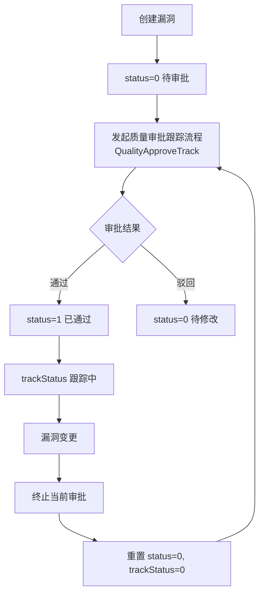
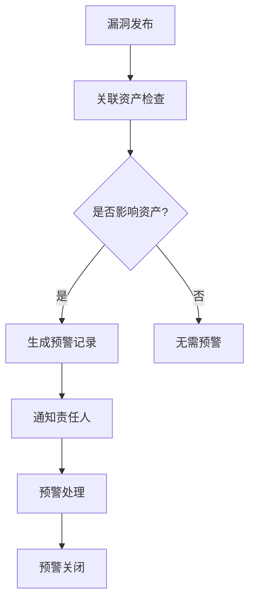
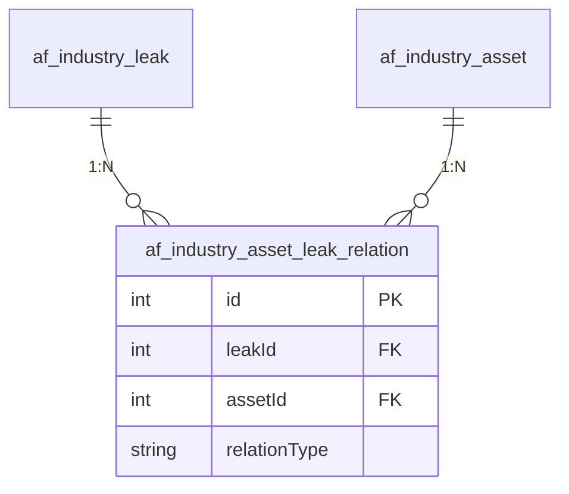
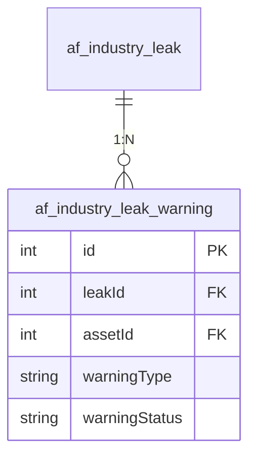

# 行业漏洞管理模块文档

> 本文档详细分析 PMS-springmvc 行业漏洞管理模块，包括漏洞管理和漏洞预警两个子模块。
> 源码：`com.dp.plat.pms.springmvc.controller.IndustryLeakController`、`IndustryLeakWarningController`

---

## 1. 模块概述

行业漏洞管理模块负责安全行业漏洞的全生命周期管理，包括漏洞登记、查询、审批，以及漏洞预警管理。该模块与行业资产模块通过关联表建立关系。

### 1.1 涉及的类

| 类型 | 类名 | 职责 |
|------|------|------|
| Controller | `IndustryLeakController` | 行业漏洞请求处理 |
| Controller | `IndustryLeakWarningController` | 漏洞预警请求处理 |
| Service | `IIndustryLeakService` / `IndustryLeakService` | 漏洞业务逻辑 |
| Service | `IIndustryLeakWarningService` / `IndustryLeakWarningService` | 预警业务逻辑 |
| Service | `IIndustryAssetLeakRelationService` | 资产漏洞关联服务 |
| DAO | `IndustryLeakMapper` | 漏洞数据访问 |
| DAO | `IndustryLeakWarningMapper` | 预警数据访问 |
| Entity | `IndustryLeak` | 漏洞实体 |
| Entity | `IndustryLeakWarning` | 预警实体 |
| VO | `IndustryLeakVO` | 漏洞视图对象 |
| VO | `LeakWarningVO` | 预警视图对象 |

### 1.2 涉及的数据库表

| 表名 | 说明 |
|------|------|
| `af_industry_leak` | 行业漏洞主表 |
| `af_industry_leak_warning` | 漏洞预警表 |
| `af_industry_asset_leak_relation` | 资产漏洞关联表 |

---

## 2. IndustryLeakController 方法说明

### 2.1 类定义

```java
@Controller
@RequestMapping(ProjectConstant.URLPath.AF_MANAGER + "/industry/leak")
public class IndustryLeakController 
    extends AbstractController<IIndustryLeakService, IndustryLeak, IndustryLeakVO> {
```

- **URL 命名空间**：`/af/industry/leak`

### 2.2 方法列表

| 方法 | URL | HTTP 方法 | 功能 | 权限 |
|------|-----|----------|------|------|
| `home` | `/af/industry/leak/` | GET | 漏洞管理首页 | `industryLeak:list` |
| `list` | `/af/industry/leak/list` | GET | 漏洞列表查询 | `industryLeak:list` |
| `findOne` | `/af/industry/leak/{id}` | GET | 漏洞详情查询 | `industryLeak:detail` |
| `detail` | `/af/industry/leak/detail` | GET | 打开漏洞详情页面 | `industryLeak:detail` |
| `create` | `/af/industry/leak/detail` | POST | 新增漏洞 | `industryLeak:add` |
| `update` | `/af/industry/leak/{id}` | PUT | 更新漏洞 | `industryLeak:edit` |
| `delete` | `/af/industry/leak/{id}` | DELETE | 删除漏洞 | `industryLeak:delete` |

### 2.3 核心业务逻辑

#### 漏洞列表查询

- 设置过滤条件：`disabled=false`
- 角色判断：非管理员限制项目类型、办事处、成员
- 分页查询

#### 漏洞更新

- 终止正在进行中的审批任务（`DataType.INDUSTRY_LEAK`）
- 重置状态：`status=0`、`trackStatus=0`

#### 漏洞删除

- 终止正在进行中的审批任务
- 逻辑删除：`disabled=true`

---

## 3. IndustryLeakWarningController 方法说明

### 3.1 类定义

```java
@Controller
@RequestMapping(ProjectConstant.URLPath.AF_MANAGER + "/industry/warning")
public class IndustryLeakWarningController 
    extends AbstractController<IIndustryLeakWarningService, IndustryLeakWarning, LeakWarningVO> {
```

- **URL 命名空间**：`/af/industry/warning`

### 3.2 方法列表

> ⚠️ 注：实际源码中 `IndustryLeakWarningController` 仅显式定义了 `home`/`list`/`delete`/`warningAsset` 4 个方法。下表中 `findOne`/`detail`/`create`/`update` 4 个方法实际由父类 `AbstractController` 提供通用实现，URL 行为以父类默认映射为准。

| 方法 | URL | HTTP 方法 | 功能 | 权限 |
|------|-----|----------|------|------|
| `home` | `/af/industry/warning/` | GET | 预警管理首页 | `industryLeakWarning:list` |
| `list` | `/af/industry/warning/list` | GET | 预警列表查询 | `industryLeakWarning:list` |
| `findOne` | `/af/industry/warning/{id}` | GET | 预警详情查询 | `industryLeakWarning:detail` |
| `detail` | `/af/industry/warning/detail` | GET | 打开预警详情页面 | `industryLeakWarning:detail` |
| `create` | `/af/industry/warning/detail` | POST | 新增预警 | `industryLeakWarning:add` |
| `update` | `/af/industry/warning/{id}` | PUT | 更新预警 | `industryLeakWarning:edit` |
| `delete` | `/af/industry/warning/{id}` | DELETE | 删除预警 | `industryLeakWarning:delete` |
| `warningAsset` | `/af/industry/warning/asset` 或 `/af/industry/warning/asset/list` | GET | 预警关联资产查询 | `industryLeakWarning:list` |

---

## 4. 权限控制

### 4.1 权限编码

| 权限编码 | 说明 |
|----------|------|
| `industryLeak:list` | 查看漏洞列表 |
| `industryLeak:detail` | 查看漏洞详情 |
| `industryLeak:add` | 新增漏洞 |
| `industryLeak:edit` | 编辑漏洞 |
| `industryLeak:delete` | 删除漏洞 |
| `industryLeakWarning:list` | 查看预警列表 |
| `industryLeakWarning:detail` | 查看预警详情 |
| `industryLeakWarning:add` | 新增预警 |
| `industryLeakWarning:edit` | 编辑预警 |
| `industryLeakWarning:delete` | 删除预警 |

### 4.2 权限类型判断

与行业资产模块一致，根据权限编码后缀判断权限类型：
- `:*` → `all`
- `:edit` → `edit`
- `:list`/`:detail` → `view`

---

## 5. 业务流程

### 5.1 漏洞审批流程



### 5.2 漏洞预警流程



---

## 6. 数据模型

### 6.1 IndustryLeak 实体

| 字段名 | 类型 | 说明 |
|--------|------|------|
| `id` | Integer | 主键 ID |
| `leakName` | String | 漏洞名称 |
| `leakType` | String | 漏洞类型 |
| `severity` | String | 严重等级 |
| `status` | String | 审批状态（0=待审批, 1=已通过） |
| `trackStatus` | Integer | 跟踪状态 |
| `disabled` | Boolean | 是否禁用 |
| `customInfo` | Map | 自定义扩展信息 |

### 6.2 IndustryLeakWarning 实体

| 字段名 | 类型 | 说明 |
|--------|------|------|
| `id` | Integer | 主键 ID |
| `leakId` | Integer | 关联漏洞 ID |
| `assetId` | Integer | 关联资产 ID |
| `warningType` | String | 预警类型 |
| `warningStatus` | String | 预警状态 |
| `disabled` | Boolean | 是否禁用 |
| `customInfo` | Map | 自定义扩展信息 |

---

## 7. 关联关系

### 7.1 漏洞-资产关联

通过 `af_industry_asset_leak_relation` 表建立漏洞与资产的多对多关系：



### 7.2 漏洞-预警关联

漏洞预警通过 `leakId` 直接关联到漏洞：



---

## 8. 工作流集成

### 8.1 质量审批跟踪流程

漏洞审批使用 `QualityApproveTrack` 流程：

```java
// 流程类型常量
public class ProjectConstant {
    public class ProcessType {
        public static final String QUALITY_APPROVE_TRACK = "QualityApproveTrack";
    }
    public class DataType {
        public static final String INDUSTRY_LEAK = "industryLeak";
    }
}
```

### 8.2 审批监听器

| 监听器 | 功能 |
|--------|------|
| `QualityApproveTrackListener` | 质量审批跟踪监听器 |
| `QualityApproveTrackListener2` | 质量审批跟踪监听器（备选） |

---

## 附录：相关文档

- [行业资产管理](industry-asset.md)
- [工作流管理](workflow.md)
- [Controller 方法参考](controller-methods-reference.md)
