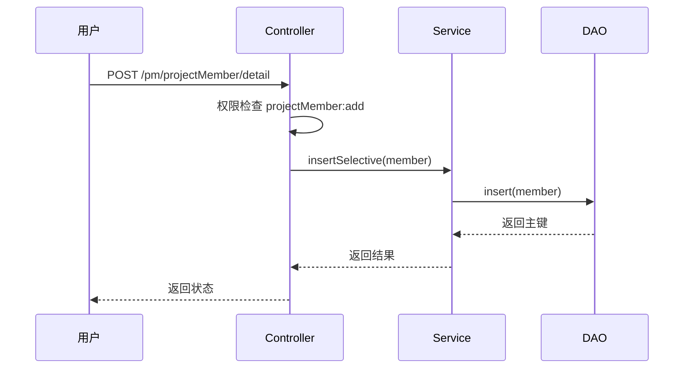
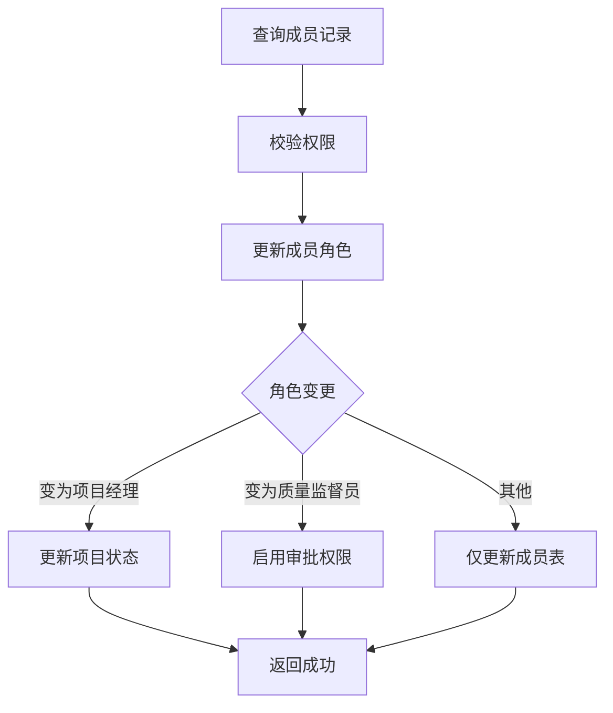

# 项目成员管理模块文档

> 本文档详细分析 PMS-springmvc 项目成员管理模块。
> 源码：`com.dp.plat.pms.springmvc.controller.ProjectMemberController`

***

## 1. 模块概述

项目成员管理模块负责项目成员的维护，包括成员添加、查询、角色分配等功能。项目成员通过角色常量区分不同职责。

### 1.1 涉及的类

| 类型         | 类名                                               | 职责       |
| ---------- | ------------------------------------------------ | -------- |
| Controller | `ProjectMemberController`                        | 项目成员请求处理 |
| Service    | `IProjectMemberService` / `ProjectMemberService` | 项目成员业务逻辑 |
| DAO        | `ProjectMemberMapper`                            | 数据访问     |
| Entity     | `ProjectMember`                                  | 项目成员实体   |
| VO         | `MemberVO`                                       | 项目成员视图对象 |

### 1.2 涉及的数据库表

| 表名                  | 说明    |
| ------------------- | ----- |
| `pm_project_member` | 项目成员表 |

***

## 2. Controller 方法说明

### 2.1 类定义

```java
@Controller
@RequestMapping(ProjectConstant.URLPath.PROJECT_MANAGER + "projectMember")
public class ProjectMemberController 
    extends AbstractController<IProjectMemberService, ProjectMember, MemberVO> {
```

- **URL 命名空间**：`/pm/projectMember`

### 2.2 方法列表

| 方法        | URL                      | HTTP 方法 | 功能     | 权限                     |
| --------- | ------------------------ | ------- | ------ | ---------------------- |
| `home`    | `/pm/projectMember/`     | GET     | 成员管理首页 | `projectMember:list`   |
| `list`    | `/pm/projectMember/list` | GET     | 成员列表查询 | `projectMember:list`   |
| `findOne` | `/pm/projectMember/{id}` | GET     | 成员详情查询 | `projectMember:detail` |

> **注意**：`ProjectMemberController` 主要继承 `AbstractController` 的通用 CRUD 方法，方法数较少（3个）。

***

## 3. 角色常量

### 3.1 项目成员角色（MemberRole）

| 常量名                      | 值    | 说明      |
| ------------------------ | ---- | ------- |
| `MEMBER_SALESMAN`        | `10` | 销售人员    |
| `MEMBER_SM`              | `20` | 服务经理    |
| `MEMBER_PM`              | `30` | 项目经理    |
| `MEMBER_PARTY`           | `40` | 团队成员    |
| `MEMBER_SERVICE_CHANNEL` | `50` | 服务渠道工程师 |
| `MEMBER_CUSTOMER`        | `60` | 最终客户    |
| `MEMBER_TECH_MANMER`     | `70` | 技术经理    |
| `MEMBER_QC`              | `80` | 质量监督员   |

### 3.2 角色权限映射

| 角色        | 权限范围           |
| --------- | -------------- |
| 销售人员（10）  | 查看项目、查看成员      |
| 服务经理（20）  | 查看项目、管理成员      |
| 项目经理（30）  | 管理项目、管理成员、管理任务 |
| 团队成员（40）  | 查看项目、查看任务      |
| 质量监督员（80） | 查看项目、审批任务      |

***

## 4. 数据模型

### 4.1 ProjectMember 实体

| 字段名          | 类型      | 说明          |
| ------------ | ------- | ----------- |
| `id`         | Integer | 主键 ID       |
| `projectId`  | Integer | 项目 ID       |
| `memberCode` | String  | 成员工号        |
| `memberName` | String  | 成员姓名        |
| `memberRole` | String  | 成员角色（见角色常量） |
| `memberType` | String  | 成员类型        |
| `disabled`   | Boolean | 是否禁用        |
| `customInfo` | Map     | 自定义扩展信息     |

### 4.2 MemberVO 视图对象

继承 `ProjectMember`，增加查询辅助字段。

***

## 5. 业务流程

### 5.1 成员添加流程



### 5.2 成员角色变更流程



***

## 附录：相关文档

- [项目管理](project-management.md)
- [项目任务管理](project-task.md)
- [Controller 方法参考](controller-methods-reference.md)

