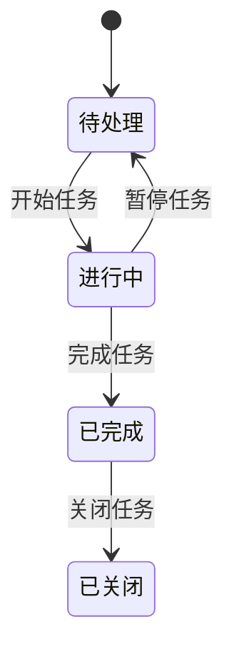
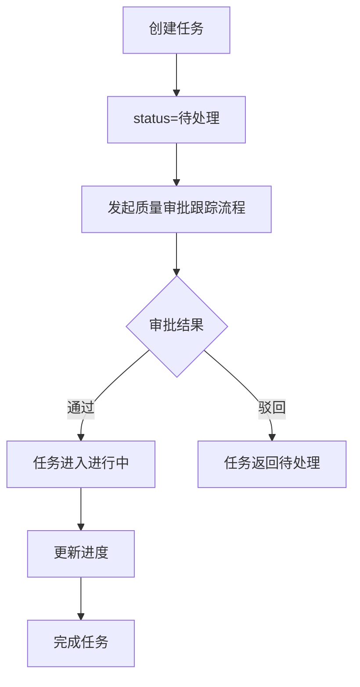

# 项目任务管理模块文档

> 本文档详细分析 PMS-springmvc 项目任务管理模块。
> 源码：`com.dp.plat.pms.springmvc.controller.ProjectTaskController`

---

## 1. 模块概述

项目任务管理模块负责项目任务的创建、查询、更新、删除，以及任务进度跟踪和审批。任务可通过工作流进行审批跟踪。

### 1.1 涉及的类

| 类型 | 类名 | 职责 |
|------|------|------|
| Controller | `ProjectTaskController` | 项目任务请求处理 |
| Service | `IProjectTaskService` / `ProjectTaskService` | 项目任务业务逻辑 |
| DAO | `ProjectTaskMapper` | 数据访问 |
| Entity | `ProjectTask` | 项目任务实体 |
| VO | `TaskVO` | 项目任务视图对象 |

### 1.2 涉及的数据库表

| 表名 | 说明 |
|------|------|
| `pm_project_task` | 项目任务表 |
| `pm_workflow` | 工作流数据表（任务审批） |

---

## 2. Controller 方法说明

### 2.1 类定义

```java
@Controller
@RequestMapping(ProjectConstant.URLPath.PROJECT_MANAGER + "projectTask")
public class ProjectTaskController 
    extends AbstractController<IProjectTaskService, ProjectTask, TaskVO> {
```

- **URL 命名空间**：`/pm/projectTask`

### 2.2 方法列表

| 方法 | URL | HTTP 方法 | 功能 | 权限 |
|------|-----|----------|------|------|
| `home` | `/pm/projectTask/` | GET | 任务管理首页 | `projectTask:list` |
| `list` | `/pm/projectTask/list` | GET | 任务列表查询 | `projectTask:list` |
| `findOne` | `/pm/projectTask/{id}` | GET | 任务详情查询 | `projectTask:detail` |
| `detail` | `/pm/projectTask/detail` | GET | 打开任务详情页面 | `projectTask:detail` |
| `create` | `/pm/projectTask/detail` | POST | 新增任务 | `projectTask:add` |
| `update` | `/pm/projectTask/{id}` | PUT | 更新任务 | `projectTask:edit` |
| `delete` | `/pm/projectTask/{id}` | DELETE | 删除任务 | `projectTask:delete` |

---

## 3. 任务状态

### 3.1 任务状态（TaskStatus）

| 状态 | 说明 | 可执行操作 |
|------|------|----------|
| 待处理 | 任务已创建，未开始 | 开始任务 |
| 进行中 | 任务已开始 | 完成任务、更新进度 |
| 已完成 | 任务已完成 | 关闭任务 |
| 已关闭 | 任务已关闭 | 无 |

### 3.2 任务状态转换



---

## 4. 工作流集成

### 4.1 质量审批跟踪流程

项目任务可通过 `QualityApproveTrack` 流程进行审批：

```java
// 数据类型常量
public class ProjectConstant {
    public class ProcessType {
        public static final String QUALITY_APPROVE_TRACK = "QualityApproveTrack";
    }
    public class DataType {
        public static final String PROJECT_TASK = "projectTask";
    }
}
```

### 4.2 任务审批流程



---

## 5. 数据模型

### 5.1 ProjectTask 实体

| 字段名 | 类型 | 说明 |
|--------|------|------|
| `taskId` | Integer | 任务 ID |
| `projectId` | Integer | 项目 ID |
| `taskName` | String | 任务名称 |
| `taskTypeCode` | String | 任务类型编码 |
| `status` | String | 任务状态 |
| `planStartTime` | Date | 计划开始时间 |
| `planEndTime` | Date | 计划结束时间 |
| `actualStartTime` | Date | 实际开始时间 |
| `actualEndTime` | Date | 实际结束时间 |
| `progress` | Integer | 进度百分比（0-100） |
| `assignee` | String | 指派人 |
| `disabled` | Boolean | 是否禁用 |
| `customInfo` | Map | 自定义扩展信息 |

### 5.2 TaskVO 视图对象

继承 `ProjectTask`，增加查询辅助字段。

---

## 6. 权限控制

### 6.1 权限编码

| 权限编码 | 说明 |
|----------|------|
| `projectTask:list` | 查看任务列表 |
| `projectTask:detail` | 查看任务详情 |
| `projectTask:add` | 新增任务 |
| `projectTask:edit` | 编辑任务 |
| `projectTask:delete` | 删除任务 |

---

## 附录：相关文档

- [项目管理](project-management.md)
- [项目成员管理](project-member.md)
- [工作流管理](workflow.md)
