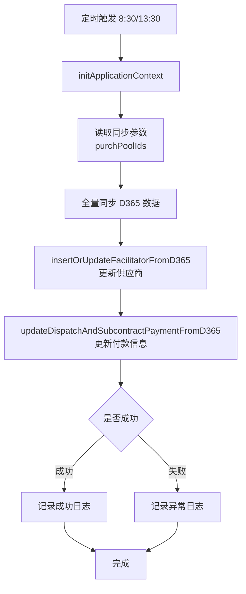
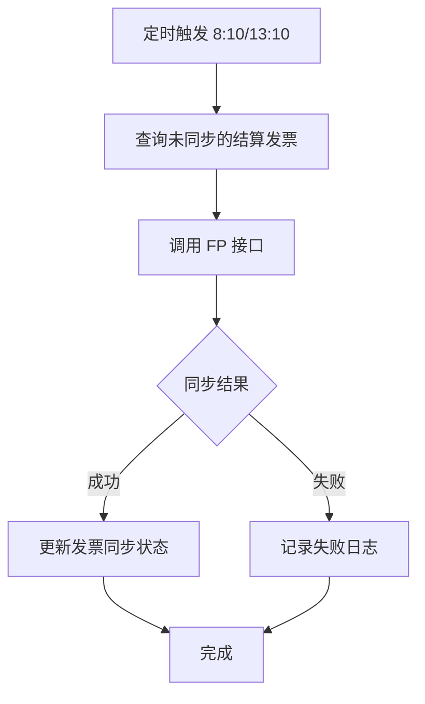

# 定时任务模块文档

> 本文档详细分析 PMS-springmvc 定时任务模块，包括 D365 数据同步、SMS 数据同步、EHR 数据同步、转包结算发票同步等定时任务。
> 配置文件：`src/main/resources/quartz-job.xml`、`src/main/resources/profiles/{env}/quartz-job.xml`

---

## 1. 模块概述

PMS-springmvc 模块通过 Spring Quartz 实现定时任务调度，负责各外部系统（D365、SMS、EHR、SSE）的数据同步和业务处理。

### 1.1 定时任务清单

| Job 类 | Bean ID | 功能 | Cron 表达式 | 触发时间 |
|--------|---------|------|------------|---------|
| `MailerJob` | `mailJob` | 邮件发送 | `0 0/5 8-20 * * ?` | 8:00-20:00 每5分钟 |
| `EhrDataJob` | `ehrDataJob` | EHR 数据同步 | `0 0 5 * * ?` | 每天 5:00 |
| `DispatchSettlementSEEPaymentJob` | `sseDispatchPaymentJob` | SSE 付款同步 | `0 30 5 * * ?` | 每天 5:30 |
| `SMSDataJob` | `smsDataJob` | SMS 数据同步 | `0 0 6 * * ?` | 每天 6:00 |
| `D365DataJob` | `d365DataJob` | D365 数据同步 | `0 30 8,13 * * ?` | 每天 8:30 和 13:30 |
| `DispatchSettlementInvoiceToFPJob` | `dispatchSettlementInvoiceToFPJob` | 发票同步到 FP | `0 10 8,13 * * ?` | 每天 8:10 和 13:10 |

---

## 2. Quartz 配置

### 2.1 SchedulerFactoryBean

```xml
<bean id="startQuartz" lazy-init="false" autowire="no"
    class="org.springframework.scheduling.quartz.SchedulerFactoryBean">
    <property name="triggers">
        <list>
            <!-- dev 环境：触发器列表为空（不启用定时任务） -->
            <!-- release/pms3 环境：启用所有触发器 -->
        </list>
    </property>
</bean>
```

### 2.2 触发器配置模式

每个定时任务采用统一的三段式配置：

```xml
<!-- 1. Job 实例 -->
<bean id="xxxJob" class="com.dp.plat.xxx.JobClass"></bean>

<!-- 2. JobDetail（方法调用） -->
<bean id="xxxTask"
    class="org.springframework.scheduling.quartz.MethodInvokingJobDetailFactoryBean">
    <property name="targetObject"><ref bean="xxxJob"/></property>
    <property name="targetMethod"><value>execute</value></property>
    <property name="concurrent" value="false"/>  <!-- 单线程执行 -->
</bean>

<!-- 3. Trigger（Cron 触发器） -->
<bean id="xxxTrigger" 
    class="org.springframework.scheduling.quartz.CronTriggerFactoryBean">
    <property name="jobDetail"><ref bean="xxxTask"/></property>
    <property name="cronExpression"><value>0 0 5 * * ?</value></property>
</bean>
```

### 2.3 并发控制

所有定时任务设置 `concurrent=false`，确保：
- 上次任务未执行完时，下次任务不会启动
- 避免数据同步并发冲突

---

## 3. D365DataJob 详解

### 3.1 功能

从 D365（Dynamics 365）系统同步以下数据：
- 供应商信息（Facilitator）
- 采购收货结算信息（PurchaseReceiptSettlement）
- 项目转包付款信息

### 3.2 源码分析

```java
public class D365DataJob extends SynchronizeJob {
    @Autowired
    private IPmSynchronizeService pmSynchronizeService;
    
    public D365DataJob() {
        super(SyncType.FULL_SYNC, new Class<?>[] {
            Facilitator.class,
            PurchaseReceiptSettlement.class
        }, "D365", "PMS");
    }
    
    @Override
    public void execute() {
        this.initApplicationContext("spring.xml");
        
        // 同步参数
        List<String> purchPoolIds = JSON.parseArray(
            SystemConfig.systemVariables.getOrDefault(
                "pm.sync.purch.settlement.purchPoolIds", "[]"), String.class);
        Map<String, Object> params = new HashMap<>();
        params.put("purchPoolIds", purchPoolIds);
        
        // 全量同步
        super.execute(params);
        
        // 后置处理
        SyncLog syncLog = new SyncLog(...);
        try {
            pmSynchronizeService.insertOrUpdateFacilitatorFromD365();
            pmSynchronizeService.updateDispatchAndSubcontractPaymentFromD365(params);
            syncLog.setIsSuccess(true);
        } catch (Exception e) {
            syncLog.setException(ExceptionUtils.getStackTrace(e));
        } finally {
            synchronizeService.insertSyncLog(syncLog);
        }
    }
}
```

### 3.3 同步流程



---

## 4. SMSDataJob 详解

### 4.1 功能

从 SMS（短信服务）系统同步短信服务相关数据到本地。

### 4.2 触发时间

- **Cron**：`0 0 6 * * ?`
- **说明**：每天 6:00 执行

---

## 5. EhrDataJob 详解

### 5.1 功能

从 EHR 系统同步组织架构数据（公司、部门、岗位、员工）。

### 5.2 触发时间

- **Cron**：`0 0 5 * * ?`
- **说明**：每天 5:00 执行

### 5.3 详细说明

详见 [EHR 人力资源集成](ehr-integration.md) 第 3 节。

---

## 6. DispatchSettlementInvoiceToFPJob 详解

### 6.1 功能

将转包结算的发票信息同步到 FP（发票平台）系统。

### 6.2 触发时间

- **Cron**：`0 10 8,13 * * ?`
- **说明**：每天 8:10 和 13:10 执行

### 6.3 同步流程



---

## 7. DispatchSettlementSEEPaymentJob 详解

### 7.1 功能

从 SSE 系统同步转包结算的付款信息。

### 7.2 触发时间

- **Cron**：`0 30 5 * * ?`
- **说明**：每天 5:30 执行

### 7.3 手动触发

支持通过 Controller 手动触发：

```java
// DispatchSettlementController.syncSettlementPayment()
@RequestMapping("/syncPayment")
public void syncSettlementPayment(Model model) {
    DispatchSettlementSEEPaymentJob job = new DispatchSettlementSEEPaymentJob();
    job.execute();
}
```

---

## 8. MailerJob 详解

### 8.1 功能

定时发送待发送的邮件。

### 8.2 触发时间

- **Cron**：`0 0/5 8-20 * * ?`
- **说明**：8:00-20:00 期间每 5 分钟执行一次

---

## 9. 环境差异

### 9.1 dev 环境

```xml
<!-- dev 环境的 quartz-job.xml：triggers 列表为空 -->
<bean id="startQuartz" lazy-init="false" autowire="no"
    class="org.springframework.scheduling.quartz.SchedulerFactoryBean">
    <property name="triggers">
        <list>
            <!-- 所有触发器被注释，不启用定时任务 -->
        </list>
    </property>
</bean>
```

### 9.2 release/pms3 环境

```xml
<!-- release/pms3 环境的 quartz-job.xml：启用所有触发器 -->
<bean id="startQuartz" lazy-init="false" autowire="no"
    class="org.springframework.scheduling.quartz.SchedulerFactoryBean">
    <property name="triggers">
        <list>
            <ref bean="smsDataTrigger"/>
            <ref bean="sseDispatchPaymentTrigger"/>
            <ref bean="ehrDataTrigger"/>
            <ref bean="d365DataTrigger"/>
            <ref bean="dispatchSettlementInvoiceToFPTrigger"/>
            <ref bean="mailTrigger"/>
        </list>
    </property>
</bean>
```

### 9.3 环境差异说明

| 环境 | 定时任务状态 | 说明 |
|------|------------|------|
| `dev` | ❌ 不启用 | 避免开发环境同步数据 |
| `test` | ❌ 不启用 | 测试环境手动触发 |
| `release` | ✅ 启用 | 生产环境自动执行 |
| `pms3` | ✅ 启用 | PMS3 版本自动执行 |

---

## 10. SynchronizeJob 基类

### 10.1 基类功能

`SynchronizeJob` 是定时任务的基类，提供通用同步功能：

```java
public abstract class SynchronizeJob {
    protected ISynchronizeService synchronizeService;
    protected SyncType syncType;
    protected Class<?>[] entityClasses;
    protected String dataFrom;
    protected String dataTo;
    
    public void execute(Map<String, Object> params) {
        // 1. 初始化应用上下文
        // 2. 连接源数据源
        // 3. 查询源数据
        // 4. 同步到目标数据源
        // 5. 记录同步日志
    }
}
```

### 10.2 SyncType 同步类型

| 同步类型 | 说明 |
|---------|------|
| `FULL_SYNC` | 全量同步（删除目标表数据后重新插入） |
| `INCREMENTAL_SYNC` | 增量同步（仅同步变更数据） |

---

## 11. 同步日志

### 11.1 SyncLog 实体

| 字段名 | 类型 | 说明 |
|--------|------|------|
| `id` | Integer | 主键 ID |
| `jobName` | String | 任务名称 |
| `syncType` | String | 同步类型 |
| `dataFrom` | String | 数据源 |
| `dataTo` | String | 目标源 |
| `isSuccess` | Boolean | 是否成功 |
| `exception` | String | 异常信息 |
| `startTime` | Date | 开始时间 |
| `endTime` | Date | 结束时间 |

### 11.2 日志记录

所有定时任务执行后都会记录同步日志，便于问题排查：

```java
SyncLog syncLog = new SyncLog(...);
syncLog.setDataFrom("OuterDataSource");
syncLog.setDataTo("Local");
try {
    // 同步操作
    syncLog.setIsSuccess(true);
} catch (Exception e) {
    syncLog.setException(ExceptionUtils.getStackTrace(e));
} finally {
    synchronizeService.insertSyncLog(syncLog);
}
```

---

## 附录：Cron 表达式速查

| Cron 表达式 | 说明 |
|------------|------|
| `0 0 5 * * ?` | 每天 5:00 |
| `0 30 5 * * ?` | 每天 5:30 |
| `0 0 6 * * ?` | 每天 6:00 |
| `0 10 8,13 * * ?` | 每天 8:10 和 13:10 |
| `0 30 8,13 * * ?` | 每天 8:30 和 13:30 |
| `0 0/5 8-20 * * ?` | 8:00-20:00 每 5 分钟 |

---

## 相关文档

- [EHR 人力资源集成](ehr-integration.md)
- [转包结算管理](dispatch-settlement.md)
- [多数据源架构](../01-architecture/multi-datasource.md)
- [Profile 机制](../01-architecture/profile-mechanism.md)
