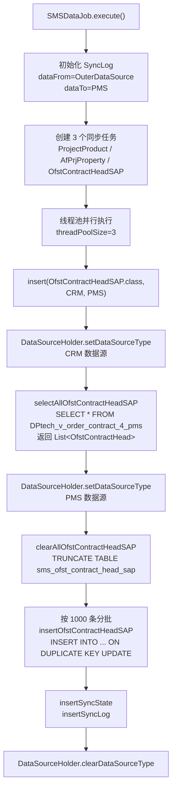

# SAP 合同实体同步模块文档

> 本文档详细分析 PMS-springmvc 模块中 SAP 合同头实体（OfstContractHead / OfstContractHeadSAP）的定义、数据库映射及同步流程。
> 源码：
> - `com.dp.plat.pms.springmvc.entity.OfstContractHead`（父实体）
> - `com.dp.plat.pms.springmvc.entity.OfstContractHeadSAP`（同步专用子类）
> - `com.dp.plat.pms.springmvc.service.IPmSynchronizeService`（同步服务）
> - `com.dp.plat.pms.springmvc.job.SMSDataJob`（同步定时任务）
> - `com.dp.plat.pms.springmvc.mapping.PmSynchronizeMapper`（MyBatis 映射）

---

## 1. 模块概述

SAP 合同实体用于将 CRM 系统中的 SAP 销售订单合同数据同步到本地 PMS 数据库，供合同执行跟踪、回款监控、应收账款分析等业务模块查询使用。同步采用"清空-批量插入"全量替换策略，由 `SMSDataJob` 定时触发。

### 1.1 涉及的类

| 类型 | 类名 | 包路径 | 职责 |
|------|------|--------|------|
| Entity（父） | `OfstContractHead` | `com.dp.plat.pms.springmvc.entity` | SAP 合同头实体定义（30+ 字段） |
| Entity（子） | `OfstContractHeadSAP` | `com.dp.plat.pms.springmvc.entity` | 同步专用空继承子类，用于泛型识别 |
| Service | `IPmSynchronizeService` | `com.dp.plat.pms.springmvc.service` | 数据同步服务接口 |
| Service Impl | `PmSynchronizeService` | `com.dp.plat.pms.springmvc.service.impl` | 同步服务实现 |
| DAO | `PmSynchronizeMapper` | `com.dp.plat.pms.springmvc.dao` | MyBatis Mapper 接口 |
| Job | `SMSDataJob` | `com.dp.plat.pms.springmvc.job` | 全量同步定时任务 |

### 1.2 涉及的数据库表

| 表名 | 数据源 | 类型 | 说明 |
|------|--------|------|------|
| `DPtech_v_order_contract_4_pms` | `dataSourceCRM` | SQL Server 视图 | **源表** — CRM 系统中按 PMS 需求定制的订单合同视图 |
| `sms_ofst_contract_head_sap` | `dataSourceLocal`（PMS） | MySQL 表 | **目标表** — 本地同步落地表，命名带 `sms_` 前缀（历史遗留，与实际同步源 CRM 无关） |

> ⚠️ **命名陷阱**：目标表 `sms_ofst_contract_head_sap` 虽带 `sms_` 前缀，但实际位于 PMS 本地数据库（`dataSourceLocal`），并非 SMS 短信系统数据源。前缀来自早期同步实现遗留，建议在新代码中通过注释明确说明，避免误解。

---

## 2. 实体类定义

### 2.1 OfstContractHead（父实体）

**类定义**：`com.dp.plat.pms.springmvc.entity.OfstContractHead`（`OfstContractHead.java:14`）

- 普通Java类，无继承关系，未标注 JPA `@Entity`
- 主键字段标注 `@javax.persistence.Id`（`id` 字段，`OfstContractHead.java:16`）
- 金额、比率、日期等字段使用 `@JsonSerialize(using = JsonSerializer.class)` 自定义序列化

```java
public class OfstContractHead {
    @Id
    private Integer id;
    private String  contractNum;            // 合同号
    private String  batchCode;              // 批次号
    private String  projectName;             // 项目名称
    private String  orderNum;               // 订单号
    private String  clientSupplierCode;    // 客户/供应商编码
    private String  clientSupplierName;     // 客户/供应商名称
    @JsonSerialize(using = JsonSerializer.class)
    private BigDecimal contractMoneyAmount;        // 合同总金额
    @JsonSerialize(using = JsonSerializer.class)
    private BigDecimal deliveredMoneyAmount;       // 已发货金额
    @JsonSerialize(using = JsonSerializer.class)
    private BigDecimal collectedMoneyAmount;       // 已回款金额
    @JsonSerialize(using = JsonSerializer.class)
    private Double     collectedMoneyRatio;        // 回款比例
    @JsonSerialize(using = JsonSerializer.class)
    private BigDecimal receivablesMoneyAmount;     // 应收金额
    @JsonSerialize(using = JsonSerializer.class)
    private BigDecimal overDueMoneyAmount;         // 逾期金额
    private String  maketingDepartmentName;        // 营销部门名称（注意：源码拼写为 maketing）
    private String  officeName;                    // 办事处名称
    private String  industryName;                  // 行业名称
    private String  marketingRepresentativeName;   // 营销代表名称
    private String  currencyName;                  // 币种名称
    private String  createBy;                      // 创建人
    @JsonSerialize(using = JsonSerializer.class)
    private Date    createTime;                    // 创建时间
    private String  updateBy;                      // 更新人
    @JsonSerialize(using = JsonSerializer.class)
    private Date    updateTime;                    // 更新时间
    @JsonSerialize(using = JsonSerializer.class)
    private Date    effectiveFrom;                 // 生效日期起
    @JsonSerialize(using = JsonSerializer.class)
    private Date    effectiveTo;                   // 生效日期止
    private String  importBatchNum;                // 导入批次号
    @JsonSerialize(using = JsonSerializer.class)
    private Date    contractCreateDate;            // 合同创建日期
    private String  projectcode;                   // 项目编码（注意：源码全小写）
    private String  marketcode;                    // 营销编码（注意：源码全小写）
    private Integer systemid;                      // 系统ID（注意：源码全小写）
    private Integer industryid;                    // 行业ID（注意：源码全小写）
    private String  officecode;                    // 办事处编码（注意：源码全小写）
    private Integer expendid;                      // 支出ID（注意：源码全小写）
    private String  usernamec;                     // 用户名1
    @DateTimeFormat(iso = ISO.DATE)
    private Date    latestShipDate;                // 最迟发货日期
    private String  usernamec2;                    // 用户名2
    private Integer systemidO;                    // 系统ID（原始）
    private Integer expendidO;                    // 支出ID（原始）
    private String  industryNameO;                // 行业名称（原始）
}
```

### 2.2 OfstContractHeadSAP（同步子类）

**类定义**：`com.dp.plat.pms.springmvc.entity.OfstContractHeadSAP extends OfstContractHead`（`OfstContractHeadSAP.java:3`）

```java
public class OfstContractHeadSAP extends OfstContractHead {
    // 空类，仅用于泛型识别
}
```

**设计意图**：
- 父类 `OfstContractHead` 用作**查询返回类型**（`selectAllOfstContractHeadSAP()` 返回 `List<OfstContractHead>`）
- 子类 `OfstContractHeadSAP` 用作**插入入参类型**（`insertOfstContractHeadSAP(List<OfstContractHeadSAP>)`）
- 通过父子类区分查询和写入场景，便于在 `SMSDataJob` 的反射调用中识别同步目标（`selectAll{ClassName}` / `insert{ClassName}` / `clearAll{ClassName}` 模式匹配）

### 2.3 字段命名陷阱

⚠️ **字段命名不规范**（源码现状，文档需如实记录）：

| 字段名 | 命名风格 | 期望命名 | 说明 |
|--------|----------|----------|------|
| `maketingDepartmentName` | 拼写错误 | `marketingDepartmentName` | "marketing" 误拼为 "maketing" |
| `projectcode` | 全小写 | `projectCode` | 不符合 camelCase 规范 |
| `marketcode` | 全小写 | `marketCode` | 不符合 camelCase 规范 |
| `systemid` | 全小写 | `systemId` | 不符合 camelCase 规范 |
| `industryid` | 全小写 | `industryId` | 不符合 camelCase 规范 |
| `officecode` | 全小写 | `officeCode` | 不符合 camelCase 规范 |
| `expendid` | 全小写 | `expendId` | 不符合 camelCase 规范 |

这些命名与 CRM 视图列名（混合 snake_case 与 camelCase）一一对应，无法在不动数据库的前提下修改，使用时需注意保持一致。

---

## 3. ResultMap 映射

`PmSynchronizeMapper.xml:213-252` 定义 `OfstContractHead` ResultMap，完整映射 39 列：

```xml
<resultMap id="OfstContractHead" type="com.dp.plat.pms.springmvc.entity.OfstContractHead">
    <id column="id" jdbcType="INTEGER" property="id" />
    <result column="contract_num" jdbcType="VARCHAR" property="contractNum" />
    <result column="batch_code" jdbcType="VARCHAR" property="batchCode" />
    <result column="project_name" jdbcType="VARCHAR" property="projectName" />
    <result column="order_num" jdbcType="VARCHAR" property="orderNum" />
    <result column="client_supplier_code" jdbcType="VARCHAR" property="clientSupplierCode" />
    <result column="client_supplier_name" jdbcType="VARCHAR" property="clientSupplierName" />
    <result column="contract_money_amount" jdbcType="DECIMAL" property="contractMoneyAmount" />
    <result column="delivered_money_amount" jdbcType="DECIMAL" property="deliveredMoneyAmount" />
    <result column="collected_money_amount" jdbcType="DECIMAL" property="collectedMoneyAmount" />
    <result column="collected_money_ratio" jdbcType="DOUBLE" property="collectedMoneyRatio" />
    <result column="receivables_money_amount" jdbcType="DECIMAL" property="receivablesMoneyAmount" />
    <result column="over_due_money_amount" jdbcType="DECIMAL" property="overDueMoneyAmount" />
    <result column="maketing_department_name" jdbcType="VARCHAR" property="maketingDepartmentName" />
    <result column="office_name" jdbcType="VARCHAR" property="officeName" />
    <result column="industry_name" jdbcType="VARCHAR" property="industryName" />
    <result column="marketing_representative_name" jdbcType="VARCHAR" property="marketingRepresentativeName" />
    <result column="currency_name" jdbcType="VARCHAR" property="currencyName" />
    <result column="create_by" jdbcType="VARCHAR" property="createBy" />
    <result column="create_time" jdbcType="TIMESTAMP" property="createTime" />
    <result column="update_by" jdbcType="VARCHAR" property="updateBy" />
    <result column="update_time" jdbcType="TIMESTAMP" property="updateTime" />
    <result column="effective_from" jdbcType="TIMESTAMP" property="effectiveFrom" />
    <result column="effective_to" jdbcType="TIMESTAMP" property="effectiveTo" />
    <result column="import_batch_num" jdbcType="VARCHAR" property="importBatchNum" />
    <result column="contract_create_date" jdbcType="TIMESTAMP" property="contractCreateDate" />
    <result column="projectCode" jdbcType="VARCHAR" property="projectcode" />
    <result column="marketCode" jdbcType="VARCHAR" property="marketcode" />
    <result column="systemId" jdbcType="INTEGER" property="systemid" />
    <result column="industryId" jdbcType="INTEGER" property="industryid" />
    <result column="officeCode" jdbcType="VARCHAR" property="officecode" />
    <result column="expendId" jdbcType="INTEGER" property="expendid" />
    <result column="usernamec" jdbcType="VARCHAR" property="usernamec" />
    <result column="latest_ship_date" jdbcType="TIMESTAMP" property="latestShipDate" />
    <result column="usernamec2" jdbcType="VARCHAR" property="usernamec2" />
    <result column="systemid_o" jdbcType="INTEGER" property="systemidO" />
    <result column="expendid_o" jdbcType="INTEGER" property="expendidO" />
    <result column="industry_name_o" jdbcType="VARCHAR" property="industryNameO" />
</resultMap>
```

⚠️ **CRM 视图列名混合 snake_case 与 camelCase**（源表设计不规范）：

| 列风格 | 列示例 |
|--------|--------|
| snake_case | `contract_num`、`batch_code`、`create_time` |
| camelCase | `projectCode`、`marketCode`、`systemId`、`industryId`、`officeCode`、`expendId` |

ResultMap 中 column 名称与 CRM 视图列名严格一一对应，不可修改。

---

## 4. 同步流程

### 4.1 同步任务 SMSDataJob

**类定义**：`com.dp.plat.pms.springmvc.job.SMSDataJob`（`SMSDataJob.java:40`）

- **触发方式**：定时任务（`quartz-job.xml` 中配置 cron）+ 手动触发（`main` 方法）
- **同步类型**：全量同步（`SYNC_TYPE = 1`）
- **批次大小**：`BATCH_INSERT_NUMBER = 1000`
- **线程池**：`Executors.newFixedThreadPool(threadPoolSize)`，默认 3 线程并行同步 3 个实体（ProjectProduct、AfPrjProperty、OfstContractHeadSAP）

### 4.2 同步流程图



### 4.3 反射调用机制

`SMSDataJob.insert()` 通过反射动态调用 Service 方法，命名约定如下：

| 调用阶段 | 方法名模式 | 实际调用 | 返回/入参 |
|----------|-----------|---------|----------|
| 查询源数据 | `selectAll{ClassName}` | `selectAllOfstContractHeadSAP()` | `List<OfstContractHead>` |
| 清空目标表 | `clearAll{ClassName}` | `clearAllOfstContractHeadSAP()` | void |
| 批量插入 | `insert{ClassName}(List)` | `insertOfstContractHeadSAP(List<OfstContractHeadSAP>)` | `int` |

```java
// SMSDataJob.java:148-158（反射查询源数据）
String methodName = objectClass.getSimpleName();  // "OfstContractHeadSAP"
method = clazz.getMethod("selectAll" + methodName);  // selectAllOfstContractHeadSAP
objects = (List<?>) method.invoke(pmSynchronizeService);

// SMSDataJob.java:195-196（反射清空目标表）
method = clazz.getMethod("clearAll" + methodName);  // clearAllOfstContractHeadSAP
method.invoke(pmSynchronizeService);

// SMSDataJob.java:210-211（反射批量插入）
method = clazz.getMethod("insert" + methodName, List.class);  // insertOfstContractHeadSAP
method.invoke(pmSynchronizeService, list);
```

### 4.4 主键识别

`SMSDataJob.insert()` 通过反射识别实体类中标注 `@Primary`（注意：是 `com.dp.plat.core.annotation.Primary`，非 JPA `@Id`）的字段作为主键，用于记录同步状态 `SyncState`（`SMSDataJob.java:170-181`）：

```java
for (Field field : fields) {
    Boolean hasId = field.isAnnotationPresent(Primary.class);  // 注意：实际查询 @Primary 注解
    if (hasId) {
        String pkName = field.getName();
        method = objClazz.getMethod("get" + pkName.substring(0, 1).toUpperCase() + pkName.substring(1));
        Object id = method.invoke(obj);
        lastId = String.valueOf(id == null ? "0" : id);
        break;
    }
}
```

⚠️ **Bug 提示**：`OfstContractHead` 实体在 `id` 字段上标注的是 `@javax.persistence.Id`（`OfstContractHead.java:16`），而非 `@com.dp.plat.core.annotation.Primary`。这导致 `SMSDataJob` 反射识别主键时**无法找到主键字段**，`lastId` 将保持为 `null`，最终写入 `SyncState` 时使用 `"0"` 兜底。此问题不会阻断同步流程，但 `SyncState` 中的 `lastId` 信息不准确。

---

## 5. SQL 详解

### 5.1 selectAllOfstContractHeadSAP（查询源数据）

`PmSynchronizeMapper.xml:303-306`：

```xml
<select id="selectAllOfstContractHeadSAP" resultMap="OfstContractHead">
    <!-- select * from ofst_contract_head_sap -->
    select * from DPtech_v_order_contract_4_pms
</select>
```

- **数据源**：`dataSourceCRM`（SQL Server）
- **查询表**：`DPtech_v_order_contract_4_pms`（CRM 视图，按 PMS 需求定制）
- **返回类型**：`List<OfstContractHead>`（父类）
- **注释说明**：注释掉的 `select * from ofst_contract_head_sap` 表明历史上曾从本地表自同步，后改为 CRM 视图

### 5.2 clearAllOfstContractHeadSAP（清空目标表）

`PmSynchronizeMapper.xml:308-310`：

```xml
<select id="clearAllOfstContractHeadSAP">
    truncate table sms_ofst_contract_head_sap
</select>
```

- **数据源**：`dataSourceLocal`（PMS MySQL）
- **清空表**：`sms_ofst_contract_head_sap`
- **方式**：`TRUNCATE`（DDL，无法回滚，速度快于 DELETE）
- ⚠️ 用 `<select>` 标签包裹 `TRUNCATE` 是不规范写法，应为 `<update>` 或 `<delete>`，MyBatis 容忍此用法但语义混淆

### 5.3 insertOfstContractHeadSAP（批量插入）

`PmSynchronizeMapper.xml:254-301`：

```xml
<insert id="insertOfstContractHeadSAP" parameterType="java.util.List">
    insert into sms_ofst_contract_head_sap (
        id, contract_num, batch_code, project_name, order_num, 
        client_supplier_code, client_supplier_name, contract_money_amount, 
        delivered_money_amount, collected_money_amount, collected_money_ratio, 
        receivables_money_amount, over_due_money_amount, maketing_department_name, 
        office_name, industry_name, marketing_representative_name, currency_name, 
        create_by, create_time, update_by, update_time, effective_from, effective_to, 
        import_batch_num, contract_create_date, projectCode, marketCode, systemId, 
        industryId, officeCode, expendId, usernamec, latest_ship_date, usernamec2, 
        systemid_o, expendid_o, industry_name_o
    )
    values 
    <foreach collection="list" item="item" index="index" separator="," >
        (#{item.id,jdbcType=INTEGER}, #{item.contractNum,jdbcType=VARCHAR}, ...)
    </foreach>
    ON DUPLICATE KEY UPDATE 
        contract_num = VALUES(contract_num), batch_code = VALUES(batch_code), 
        project_name = VALUES(project_name), order_num = VALUES(order_num),
        <!-- ... 其余 36 列 ... -->
        industry_name_o = VALUES(industry_name_o)
</insert>
```

**SQL 关键点**：
- 批量插入使用 `<foreach>` 拼接 VALUES，单 SQL 一次性插入 1000 条
- 使用 `ON DUPLICATE KEY UPDATE` 处理主键冲突（按 `id` 判定）— 即使 TRUNCATE 已清空表，仍保留此机制以应对极端情况
- 列名混合 snake_case（多数）与 camelCase（`projectCode`、`marketCode`、`systemId`、`industryId`、`officeCode`、`expendId`），与 CRM 视图列名严格对应
- 列名 `maketing_department_name` 保留了源码中的拼写错误（"maketing"）

---

## 6. Service / DAO 方法

### 6.1 IPmSynchronizeService 接口

`IPmSynchronizeService.java:8-9, 41-43`：

```java
import com.dp.plat.pms.springmvc.entity.OfstContractHead;
import com.dp.plat.pms.springmvc.entity.OfstContractHeadSAP;

public interface IPmSynchronizeService extends ISynchronizeService {
    int  insertOfstContractHeadSAP(List<OfstContractHeadSAP> record);
    List<OfstContractHead> selectAllOfstContractHeadSAP();
    void clearAllOfstContractHeadSAP();
    // ... 其他方法
}
```

### 6.2 PmSynchronizeService 实现

`PmSynchronizeService.java:14-15, 69-82`：

```java
@Override
public int insertOfstContractHeadSAP(List<OfstContractHeadSAP> record) {
    return perfSynchronizeMapper.insertOfstContractHeadSAP(record);
}

@Override
public List<OfstContractHead> selectAllOfstContractHeadSAP() {
    return perfSynchronizeMapper.selectAllOfstContractHeadSAP();
}

@Override
public void clearAllOfstContractHeadSAP() {
    perfSynchronizeMapper.clearAllOfstContractHeadSAP();
}
```

### 6.3 方法签名对照

| 方法 | 入参 | 返回 | 数据源 | 操作 |
|------|------|------|--------|------|
| `selectAllOfstContractHeadSAP()` | 无 | `List<OfstContractHead>` | `dataSourceCRM` | SELECT `DPtech_v_order_contract_4_pms` |
| `clearAllOfstContractHeadSAP()` | 无 | `void` | `dataSourceLocal` | TRUNCATE `sms_ofst_contract_head_sap` |
| `insertOfstContractHeadSAP(List<OfstContractHeadSAP>)` | `List<OfstContractHeadSAP>` | `int`（影响行数） | `dataSourceLocal` | INSERT `sms_ofst_contract_head_sap` ON DUPLICATE KEY UPDATE |

---

## 7. 数据源切换

`SMSDataJob` 通过 `DataSourceHolder.setDataSourceType()` 显式切换数据源（`SMSDataJob.java:23, 153, 186, 219`）：

```java
// 查询源数据：切换到 CRM 数据源
DataSourceHolder.setDataSourceType(dataSource[0]);  // "CRM"
List<?> objects = (List<?>) method.invoke(pmSynchronizeService);  // selectAll...

// 写入目标：切换到 PMS 数据源
DataSourceHolder.setDataSourceType(dataSource[1]);  // "PMS"
method.invoke(pmSynchronizeService);  // clearAll...
method.invoke(pmSynchronizeService, list);  // insert...

// 清理：恢复默认数据源
DataSourceHolder.clearDataSourceType();
```

⚠️ **关键注意**：`IPmSynchronizeService` / `PmSynchronizeService` 实现类**未标注 `@DataSource` 注解**，完全依赖 `SMSDataJob` 在调用前显式切换数据源。如果在 `SMSDataJob` 之外直接调用这些 Service 方法，将使用默认数据源 `dataSourceLocal`，导致：
- `selectAllOfstContractHeadSAP()` 会查 PMS 本地表而非 CRM 视图（数据可能为空或过期）
- `clearAllOfstContractHeadSAP()` / `insertOfstContractHeadSAP()` 仍操作本地表（行为正确）

---

## 8. 字段含义与业务字段说明

### 8.1 金额类字段（BigDecimal）

| 字段 | 含义 | 业务用途 |
|------|------|----------|
| `contractMoneyAmount` | 合同总金额 | 合同基础金额 |
| `deliveredMoneyAmount` | 已发货金额 | 履约进度衡量 |
| `collectedMoneyAmount` | 已回款金额 | 现金流分析 |
| `receivablesMoneyAmount` | 应收金额 | 财务对账 |
| `overDueMoneyAmount` | 逾期金额 | 风险预警 |

### 8.2 比率字段

| 字段 | 含义 | 计算逻辑 |
|------|------|----------|
| `collectedMoneyRatio` | 回款比例 | `collectedMoneyAmount / contractMoneyAmount` |

### 8.3 关联字段（与项目/营销/行业维度关联）

| 字段 | 含义 | 关联表 |
|------|------|--------|
| `projectcode` / `projectName` | 项目编码 / 项目名称 | `pm_project` |
| `marketcode` / `marketingRepresentativeName` | 营销编码 / 营销代表 | `ehr_employee` |
| `systemid` / `systemidO` | 系统ID（同步前/后） | 系统维度表 |
| `industryid` / `industryName` / `industryNameO` | 行业ID / 行业名称 / 原始行业名称 | 行业维度表 |
| `officecode` / `officeName` | 办事处编码 / 名称 | 办事处维度表 |
| `expendid` / `expendidO` | 支出ID（同步前/后） | 支出维度表 |

### 8.4 日期字段

| 字段 | 含义 |
|------|------|
| `createTime` / `updateTime` | CRM 记录创建/更新时间 |
| `effectiveFrom` / `effectiveTo` | 合同生效起止日期 |
| `contractCreateDate` | 合同实际签订日期 |
| `latestShipDate` | 最迟发货日期（`@DateTimeFormat(iso = ISO.DATE)`，仅日期无时间） |

### 8.5 其他字段

| 字段 | 含义 |
|------|------|
| `batchCode` / `importBatchNum` | 批次号 / 导入批次号（用于追踪同步批次） |
| `clientSupplierCode` / `clientSupplierName` | 客户/供应商编码与名称（同一字段同时承载客户和供应商角色，取决于业务上下文） |
| `usernamec` / `usernamec2` | 用户名1 / 用户名2（含义不明，疑似业务负责人） |
| `orderNum` | 订单号 |
| `currencyName` | 币种名称 |

---

## 9. 注意事项

### 9.1 命名陷阱汇总

1. **目标表前缀**：`sms_ofst_contract_head_sap` 位于 PMS 本地库，与 SMS 短信系统无关，前缀为历史遗留
2. **字段拼写错误**：`maketingDepartmentName`（"marketing" 误拼为 "maketing"），数据库列名 `maketing_department_name` 同步保留错误
3. **字段命名风格混杂**：`projectcode`/`marketcode`/`systemid`/`industryid`/`officecode`/`expendid` 为全小写，不符合 Java camelCase 规范，且与数据库列名 `projectCode`/`marketCode` 等的 camelCase 形式不一致（ResultMap 中显式映射）
4. **CRM 视图列名混杂**：源表 `DPtech_v_order_contract_4_pms` 列名同时存在 snake_case（`contract_num`）和 camelCase（`projectCode`），不规范

### 9.2 同步流程风险

1. **TRUNCATE 不可回滚**：清空目标表使用 `TRUNCATE`（DDL），无事务保护。如果 TRUNCATE 成功但 INSERT 失败，将导致目标表为空，业务查询返回空结果。建议在生产环境启用前确认 CRM 源数据可用性
2. **`ON DUPLICATE KEY UPDATE` 冗余**：因已 TRUNCATE，理论上无主键冲突，`ON DUPLICATE KEY UPDATE` 为冗余保险
3. **主键识别 Bug**：`SMSDataJob` 反射查找 `@Primary` 注解，但 `OfstContractHead` 实际标注 `@javax.persistence.Id`，导致 `SyncState.lastId` 始终为 `"0"`（不影响同步，仅影响同步状态记录准确性）
4. **无增量同步**：当前为全量同步，每次清空重灌，对大表性能不友好。如需增量，需扩展 `SyncState` 机制并新增按 `updateTime > lastSyncTime` 过滤的查询

### 9.3 使用建议

1. **查询本地已同步数据**：直接调用 `selectAllOfstContractHeadSAP()`（注意会查默认数据源，需确保已切换到 PMS 数据源或使用默认 `dataSourceLocal`）
2. **新增业务字段**：如需扩展字段，需同步修改：
   - `OfstContractHead` 实体（添加字段 + getter/setter）
   - `PmSynchronizeMapper.xml` 的 `OfstContractHead` ResultMap（添加 `<result>` 映射）
   - `PmSynchronizeMapper.xml` 的 `insertOfstContractHeadSAP` SQL（添加列名 + VALUES 占位 + ON DUPLICATE KEY UPDATE 子句）
   - CRM 视图 `DPtech_v_order_contract_4_pms`（由 DBA 协调添加列）
3. **不要直接调用 Service 方法**：在 `SMSDataJob` 之外调用 Service 方法时，务必先 `DataSourceHolder.setDataSourceType("CRM")` 切换到 CRM 数据源，否则查询将失败

---

## 10. 调用链路

```
quartz-job.xml (cron 触发)
    ↓
SMSDataJob.execute()                          [SMSDataJob.java:53]
    ├─ 创建 SyncLog
    ├─ 线程池提交 3 个同步任务
    │       ↓
    │   SMSDataJob.insert(OfstContractHeadSAP.class, "CRM", "PMS")  [SMSDataJob.java:143]
    │       ├─ DataSourceHolder.setDataSourceType("CRM")
    │       ├─ pmSynchronizeService.selectAllOfstContractHeadSAP()
    │       │       └─ PmSynchronizeMapper.selectAllOfstContractHeadSAP()
    │       │               └─ SELECT * FROM DPtech_v_order_contract_4_pms
    │       ├─ DataSourceHolder.setDataSourceType("PMS")
    │       ├─ pmSynchronizeService.clearAllOfstContractHeadSAP()
    │       │       └─ PmSynchronizeMapper.clearAllOfstContractHeadSAP()
    │       │               └─ TRUNCATE TABLE sms_ofst_contract_head_sap
    │       └─ for (batch : batches):
    │              pmSynchronizeService.insertOfstContractHeadSAP(batch)
    │                  └─ PmSynchronizeMapper.insertOfstContractHeadSAP(batch)
    │                          └─ INSERT INTO sms_ofst_contract_head_sap ... ON DUPLICATE KEY UPDATE
    ├─ pmSynchronizeService.splitAfProjectByProductCode()  (后续项目拆分)
    └─ pmSynchronizeService.insertSyncLog(syncLog)
```

---

## 附录：相关文档

- [定时任务配置](quartz-jobs.md)
- [多数据源架构](../01-architecture/multi-datasource.md)
- [Service 方法参考](service-methods-reference.md)
- [EHR 人力资源集成](ehr-integration.md)
