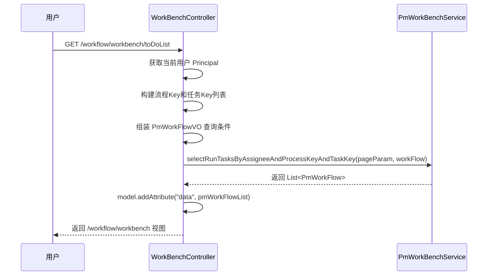
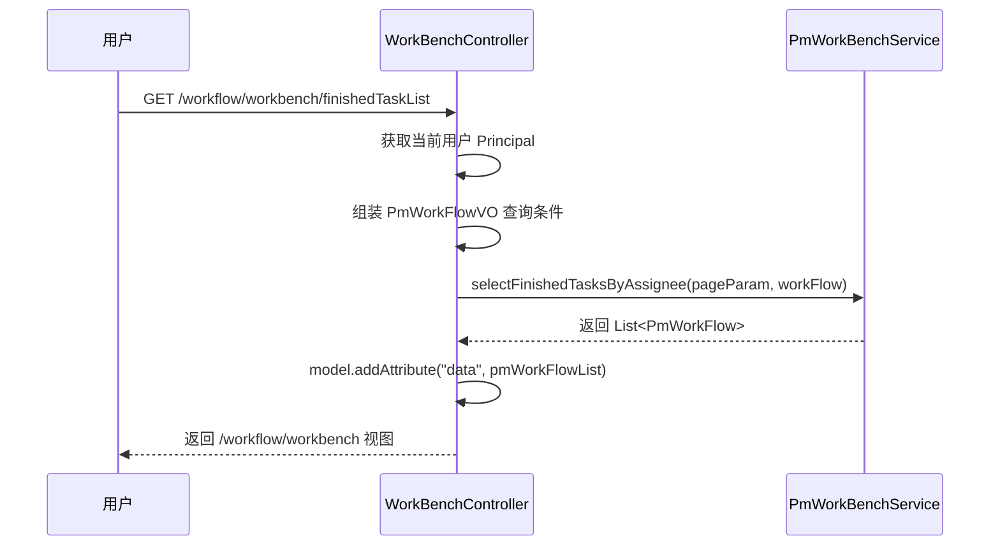

# 工作台模块文档

> 本文档详细分析 PMS-springmvc 工作台模块。
> 源码：`com.dp.plat.pms.springmvc.controller.WorkBenchController`

---

## 1. 模块概述

工作台模块为用户提供工作流任务的处理入口，展示当前用户的待办任务、他人待办任务、已办任务列表，主要服务于质量审批跟踪（QualityApproveTrack）和分包验收（SubcontractInspection）两类流程。

### 1.1 涉及的类

| 类型 | 类名 | 职责 |
|------|------|------|
| Controller | `WorkBenchController` | 工作台请求处理 |
| Service | `IPmWorkBenchService` / `PmWorkBenchService` | 工作台业务逻辑（待办/已办查询） |
| Service | `IPmWorkFlowService` / `PmWorkFlowService` | 工作流服务（注入但未直接调用） |
| DAO | `PmWorkBenchMapper` | 数据访问 |

### 1.2 涉及的数据库表

| 表名 | 说明 |
|------|------|
| `pm_workflow` | 工作流业务表（待办/已办任务查询） |
| `ACT_RU_TASK` | Activiti 运行时任务表（关联查询） |
| `ACT_RU_IDENTITYLINK` | Activiti 任务参与者表（关联查询） |
| `ACT_HI_TASKINST` | Activiti 历史任务表（已办查询） |
| `ACT_RE_PROCDEF` | Activiti 流程定义表（关联查询） |

> 注：`pm_workbench` 表不存在，`PmWorkBenchMapper` 实际通过关联查询 `pm_workflow` 与 Activiti 引擎表获取待办/已办数据。

---

## 2. Controller 方法说明

### 2.1 类定义

```java
@Controller
@RequestMapping(URLPath.WORKFLOW_MANAGER + "workbench")
public class WorkBenchController {
```

- **URL 命名空间**：`/workflow/workbench`
- **继承**：无继承（不继承 `BaseController` 或 `AbstractController`）
- **注入依赖**：`IPmWorkBenchService`、`IPmWorkFlowService`

### 2.2 方法列表

| 方法 | URL | HTTP 方法 | 功能 |
|------|-----|----------|------|
| `listView` | `/workflow/workbench` | GET | 工作台首页视图 |
| `listToDoTask` | `/workflow/workbench/toDoList` | GET | 当前用户待办任务列表 |
| `listOthersTask` | `/workflow/workbench/listOthersTask` | GET | 他人待办任务列表 |
| `finishedTask` | `/workflow/workbench/finishedTaskList` | GET | 当前用户已办任务列表 |

### 2.3 方法详解

#### `listView()`

- **功能**：返回工作台首页视图
- **返回值**：视图名称 `/workflow/workbench`
- **业务逻辑**：仅返回视图，不查询数据

#### `listToDoTask(PageParam<PmWorkFlow> pageParam, Model model)`

- **功能**：查询当前用户的待办任务
- **业务逻辑**：
  1. 获取当前登录用户（`UserContext.getCurrentPrincipal()`）
  2. 构建流程 Key 列表：`QUALITY_APPROVE_TRACK`、`SUBCONTRACT_INSPECTION`
  3. 构建任务 Key 列表：`AF_APPROVE_TASK`、`YF_APPROVE_TASK`、`TRACK_TASK`、`ACCEPTANCE_TASK`
  4. 组装查询条件 `PmWorkFlowVO`（assignee、processKey、taskKey、status=PENDING、areaPower）
  5. 调用 `pmWorkBenchService.selectRunTasksByAssigneeAndProcessKeyAndTaskKey()` 查询
  6. 将结果放入 model 的 `data` 属性

#### `listOthersTask(PageParam<PmWorkFlow> pageParam, Model model)`

- **功能**：查询他人待办任务（不含当前用户）
- **业务逻辑**：与 `listToDoTask` 类似，查询条件相同

#### `finishedTask(PageParam<PmWorkFlow> pageParam, Model model)`

- **功能**：查询当前用户的已办任务
- **业务逻辑**：
  1. 获取当前登录用户
  2. 组装查询条件 `PmWorkFlowVO`（assignee、areaPower）
  3. 调用 `pmWorkBenchService.selectFinishedTasksByAssignee()` 查询
  4. 将结果放入 model 的 `data` 属性

---

## 3. 业务流程

### 3.1 待办任务加载流程



### 3.2 已办任务加载流程



---

## 4. 流程与任务类型常量

工作台模块涉及的流程 Key 和任务 Key 定义在 `ProjectConstant` 中：

### 4.1 流程 Key（ProcessType）

| 常量 | 说明 |
|------|------|
| `QUALITY_APPROVE_TRACK` | 质量审批跟踪流程 |
| `SUBCONTRACT_INSPECTION` | 分包验收流程 |

### 4.2 任务 Key（ProcessType.TaskType）

| 常量 | 说明 |
|------|------|
| `AF_APPROVE_TASK` | 安服审批任务 |
| `YF_APPROVE_TASK` | 研发审批任务 |
| `TRACK_TASK` | 跟踪任务 |
| `ACCEPTANCE_TASK` | 验收任务 |

---

## 5. 权限控制

工作台通过 `UserContext.getCurrentPrincipal()` 获取当前用户信息：
- `userCustom4`：用户关联的 Activiti assignee ID
- `userInfo.custom5`：区域权限（逗号分隔的区域编码列表）

区域权限查询时会自动追加 `all`，确保用户可查看全局数据。

---

## 附录：相关文档

- [工作流管理](workflow.md)
- [项目管理](project-management.md)
