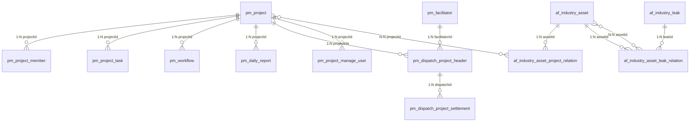

# PMS-springmvc 完整数据字典

> 数据库：dppms_d365 (MySQL)
> 本文档包含 PMS-springmvc 模块涉及的所有数据库表的完整字段定义、索引信息和业务规则。
> 数据来源：Entity 类、Mapper XML 文件、代码注释。

---

## 表清单

| 序号 | 表名 | 说明 | 字段数 |
|------|------|------|--------|
| 1 | pm_project | 项目主表 | 16 |
| 2 | pm_project_header | 项目头信息（视图） | 30 |
| 3 | pm_project_member | 项目成员表 | 15 |
| 4 | pm_project_task | 项目任务表 | 25 |
| 5 | pm_workflow | 工作流数据表 | 12 |
| 6 | pm_daily_report | 日报表 | 30 |
| 7 | pm_dispatch_project_header | 发运项目表 | 25+ |
| 8 | pm_dispatch_project_settlement | 发运结算表 | 26 |
| 9 | af_industry_asset | 行业资产表 | 30 |
| 10 | af_industry_leak | 行业泄露表 | 19 |
| 11 | af_industry_leak_warning | 行业泄露预警表 | 18 |
| 12 | af_industry_asset_project_relation | 资产项目关联表 | 10 |
| 13 | af_industry_asset_leak_relation | 资产泄露关联表 | 11 |
| 14 | facilitator | 协调员/服务商表 | 18 |
| 15 | common_related_data | 关联数据表 | 7 |
| 16 | pm_project_manage_user | 项目管理用户表 | 6 |
| 17 | data_field_relation | 数据字段关联表 | 10 |
| 18 | pm_workbench | 工作台数据表 | - |
| 19 | pm_synchronize | 数据同步表 | - |
| 20 | excel_analysis | Excel分析表 | - |

---

## 1. pm_project（项目主表）

> 实体类：`com.dp.plat.pms.springmvc.entity.Project`（712行）
> Mapper：`ProjectMapper.xml`
> 说明：项目核心信息表，存储项目的基本属性和动态字段。

| 字段名 | 类型 | 约束 | 默认值 | 业务含义 | 代码属性名 |
|--------|------|------|--------|----------|-----------|
| `id` | int(11) | PK, AUTO_INCREMENT | - | 项目ID | id |
| `projectCode` | varchar(45) | NOT NULL, UNIQUE | - | 项目编码（系统自动生成） | projectCode |
| `projectName` | varchar(200) | - | NULL | 项目名称 | projectName |
| `projectState` | varchar(11) | - | NULL | 项目状态编码，关联 fnd_basic_data(dataTypeCode=02) | projectState |
| `projectType` | varchar(45) | NOT NULL | '10' | 项目类型（10=用服售后, afss=安服售后, afxx=安服先行） | projectType |
| `customerName` | varchar(200) | - | NULL | 客户名称 | customerName |
| `createTime` | datetime | NOT NULL | CURRENT_TIMESTAMP | 创建时间 | createTime |
| `createBy` | varchar(45) | NOT NULL | - | 创建人 | createBy |
| `updateTime` | datetime | - | - | 更新时间 | updateTime |
| `updateBy` | varchar(45) | - | - | 更新人 | updateBy |
| `customInfo` | json | - | NULL | 自定义扩展信息（JSON格式） | customInfo |
| `customConfig` | json | - | NULL | 自定义配置信息（JSON格式） | customConfig |
| `disabled` | bit(1) | - | b'0' | 是否禁用（0=有效, 1=禁用） | disabled |
| `effectiveFrom` | datetime | - | NULL | 生效开始时间 | effectiveFrom |
| `effectiveTo` | datetime | - | NULL | 生效结束时间（NULL表示有效） | effectiveTo |

**索引**：
| 索引名 | 字段 | 类型 | 说明 |
|--------|------|------|------|
| PRIMARY | id | 主键 | 自增主键 |
| uk_project_code | projectCode | 唯一索引 | 项目编码唯一 |

**业务规则**：
- projectCode 由系统自动生成，格式：`PRJ + yyyyMMdd + 序号`
- projectState 取值范围见项目状态编码表
- disabled=1 的记录为逻辑删除，不参与业务查询
- effectiveTo 为 NULL 表示记录当前有效

---

## 2. pm_project_header（项目头信息视图）

> 注意：pm_project_header 是基于 pm_project 表的 VIEW，非独立表。
> 实体类：`com.dp.plat.pms.springmvc.entity.ProjectHeader`（774行）
> 说明：项目扩展信息视图，包含泛化字段（column001-column014）。

| 字段名 | 类型 | 约束 | 默认值 | 业务含义 | 泛化字段映射 |
|--------|------|------|--------|----------|-------------|
| `projectId` | int(11) | PK | - | 项目ID | - |
| `projectType` | varchar(45) | NOT NULL | '10' | 项目类型 | - |
| `projectCode` | varchar(45) | NOT NULL | - | 项目编码 | - |
| `projectName` | varchar(200) | - | NULL | 项目名称 | - |
| `projectState` | varchar(11) | - | NULL | 项目状态 | - |
| `isback` | varchar(11) | - | '30' | 回退标志（30=创建, 32=指派PM, 34=填写渠道, 40=工程管理部不予跟踪, 42=项目经理不予跟踪） | - |
| `column001` | varchar(255) | - | NULL | 办事处编码 | officeCode |
| `column002` | varchar(255) | - | NULL | 客户编码（ERP） | customerCode |
| `column003` | varchar(255) | - | NULL | 客户名称（ERP） | customerName |
| `column004` | varchar(255) | - | NULL | 市场部编码 | marketDeptCode |
| `column005` | varchar(255) | - | NULL | 系统部ID | systemDeptId |
| `column006` | varchar(255) | - | NULL | 拓展部ID | extendDeptId |
| `column007` | varchar(255) | - | NULL | 子行业ID | subIndustryId |
| `column008` | varchar(255) | - | NULL | 不予跟踪原因 | notGrantTailCause |
| `column009` | datetime | - | NULL | 订单创建时间 | orderCreateTime |
| `column010` | varchar(10) | - | NULL | 项目类型/等级 | projectCategory |
| `column011` | varchar(10) | - | NULL | 项目分类 | projectClassify |
| `column012` | varchar(2) | - | NULL | 项目实施方式 | serviceType |
| `columno12_readonly` | int(2) | - | -1 | 实施方式只读值（-1=可修改） | columno12_readonly |
| `column013` | varchar(255) | - | NULL | 最终客户名称 | finalCustomerName |
| `column014` | text | - | NULL | 回退说明 | backCause |
| `customerProjectName` | varchar(255) | - | NULL | 客户项目名称 | customerProjectName |
| `salesType` | varchar(25) | - | '01' | 销售类型 | salesType |
| `majorProjectLevel` | varchar(255) | - | NULL | 重大项目级别 | majorProjectLevel |
| `compId` | int(2) | - | 0 | 公司ID | compId |
| `projectStartTime` | datetime | - | NULL | 项目开始时间 | projectStartTime |
| `projectRefreshTime` | datetime | - | NULL | 项目刷新时间 | projectRefreshTime |
| `projectCloseTime` | datetime | - | NULL | 项目关闭时间 | projectCloseTime |
| `customInfo` | json | - | NULL | 自定义扩展信息 | customInfo |
| `customConfig` | json | - | NULL | 自定义配置信息 | customConfig |

**泛化字段与语义化字段映射表**：

| 泛化字段 | 语义化名称 | 实际类型 | 业务含义 |
|----------|-----------|---------|----------|
| column001 | officeCode | varchar(255) | 办事处编码 |
| column002 | customerCode | varchar(255) | 客户编码（ERP） |
| column003 | customerName | varchar(255) | 客户名称（ERP） |
| column004 | marketDeptCode | varchar(255) | 市场部编码 |
| column005 | systemDeptId | varchar(255) | 系统部ID |
| column006 | extendDeptId | varchar(255) | 拓展部ID |
| column007 | subIndustryId | varchar(255) | 子行业ID |
| column008 | notGrantTailCause | varchar(255) | 不予跟踪原因 |
| column009 | orderCreateTime | datetime | 订单创建时间 |
| column010 | projectCategory | varchar(10) | 项目类型/等级 |
| column011 | projectClassify | varchar(10) | 项目分类 |
| column012 | serviceType | varchar(2) | 项目实施方式 |
| column013 | finalCustomerName | varchar(255) | 最终客户名称 |
| column014 | backCause | text | 回退说明 |

---

## 3. pm_project_member（项目成员表）

> 实体类：`com.dp.plat.pms.springmvc.entity.ProjectMember`（298行）
> Mapper：`ProjectMemberMapper.xml`

| 字段名 | 类型 | 约束 | 默认值 | 业务含义 | 代码属性名 |
|--------|------|------|--------|----------|-----------|
| `id` | int(11) | PK, AUTO_INCREMENT | - | 成员ID | id |
| `projectId` | int(11) | FK → pm_project.id | - | 项目ID | projectId |
| `projectType` | varchar(25) | - | '10' | 项目类型 | projectType |
| `memberRole` | varchar(45) | - | NULL | 成员角色编码 | memberRole |
| `memberCode` | varchar(45) | - | NULL | 成员编码（工号） | memberCode |
| `memberName` | varchar(45) | - | NULL | 成员姓名 | memberName |
| `phoneNum` | varchar(20) | - | NULL | 联系电话 | phoneNum |
| `email` | varchar(45) | - | NULL | 电子邮箱 | email |
| `fromFlag` | varchar(2) | - | '0' | 来源标志（0=默认, 1=项目信息, 2=成员信息） | fromFlag |
| `createTime` | datetime | NOT NULL | CURRENT_TIMESTAMP | 创建时间 | createTime |
| `createBy` | varchar(45) | NOT NULL | - | 创建人 | createBy |
| `updateTime` | datetime | - | - | 更新时间 | updateTime |
| `updateBy` | varchar(15) | - | - | 更新人 | updateBy |
| `effectiveFrom` | datetime | - | NULL | 生效开始时间 | effectiveFrom |
| `effectiveTo` | datetime | - | NULL | 失效时间（设置后表示该成员已变更） | effectiveTo |

**成员角色编码表**：

| 编码 | 说明 |
|------|------|
| 10 | 销售人员（Salesman） |
| 20 | 服务经理（SM） |
| 30 | 项目经理（PM） |
| 40 | 团队成员 |
| 50 | 出货代理商/服务渠道工程师 |
| 60 | 最终客户 |
| 70 | 技术经理 |
| 80 | 质量监督员（QC） |

---

## 4. pm_project_task（项目任务表）

> 实体类：`com.dp.plat.pms.springmvc.entity.ProjectTask`（621行）
> Mapper：`ProjectTaskMapper.xml`

| 字段名 | 类型 | 约束 | 默认值 | 业务含义 | 代码属性名 |
|--------|------|------|--------|----------|-----------|
| `taskId` | int(11) | PK, AUTO_INCREMENT | - | 任务ID | taskId |
| `projectId` | int(11) | FK → pm_project.id | - | 项目ID | projectId |
| `projectType` | varchar(50) | - | NULL | 项目类型 | projectType |
| `contractNo` | varchar(50) | - | NULL | 合同编号 | contractNo |
| `taskTypeCode` | varchar(50) | - | NULL | 任务类型编码 | taskTypeCode |
| `taskTypeId` | varchar(50) | - | NULL | 任务类型ID | taskTypeId |
| `taskName` | varchar(200) | NOT NULL | - | 任务名称 | taskName |
| `eventPlanHappenDate` | datetime | - | NULL | 计划发生日期 | eventPlanHappenDate |
| `eventPlanHappenDateENG` | datetime | - | NULL | 计划发生日期（工程） | eventPlanHappenDateENG |
| `planStartTime` | datetime | - | NULL | 计划开始时间 | planStartTime |
| `planEndTime` | datetime | - | NULL | 计划结束时间 | planEndTime |
| `actualStartTime` | datetime | - | NULL | 实际开始时间 | actualStartTime |
| `eventActualFinishDate` | datetime | - | NULL | 实际完成日期 | eventActualFinishDate |
| `priority` | varchar(20) | - | NULL | 优先级 | priority |
| `progress` | int(11) | - | 0 | 进度百分比（0-100） | progress |
| `progressDesc` | varchar(500) | - | NULL | 进度描述 | progressDesc |
| `status` | varchar(20) | - | NULL | 任务状态 | status |
| `parentId` | int(11) | - | NULL | 父任务ID（支持任务树） | parentId |
| `createTime` | datetime | NOT NULL | CURRENT_TIMESTAMP | 创建时间 | createTime |
| `createBy` | varchar(50) | NOT NULL | - | 创建人 | createBy |
| `updateTime` | datetime | - | - | 更新时间 | updateTime |
| `updateBy` | varchar(50) | - | - | 更新人 | updateBy |
| `effectiveFrom` | datetime | - | NULL | 生效开始时间 | effectiveFrom |
| `effectiveTo` | datetime | - | NULL | 生效结束时间 | effectiveTo |
| `visibleFlag` | varchar(10) | - | NULL | 可见标志 | visibleFlag |
| `deliverFileIds` | varchar(500) | - | NULL | 交付文件ID（逗号分隔） | deliverFileIds |
| `customInfo` | json | - | NULL | 自定义扩展信息 | customInfo |
| `remark` | text | - | NULL | 备注 | remark |

---

## 5. pm_workflow（工作流数据表）

> 实体类：`com.dp.plat.pms.springmvc.entity.PmWorkFlow`（544行）
> Mapper：`PmWorkFlowMapper.xml`

| 字段名 | 类型 | 约束 | 默认值 | 业务含义 | 代码属性名 |
|--------|------|------|--------|----------|-----------|
| `id` | int(11) | PK, AUTO_INCREMENT | - | 工作流ID | id |
| `procInstId` | varchar(100) | - | NULL | Activiti流程实例ID | procInstId |
| `processKey` | varchar(100) | - | NULL | 流程定义Key | processKey |
| `dataType` | varchar(50) | - | NULL | 数据类型（project/task/dispatch/settlement等） | dataType |
| `dataId` | int(11) | - | NULL | 关联业务数据ID | dataId |
| `objType` | varchar(50) | - | NULL | 对象类型（project等） | objType |
| `objId` | int(11) | - | NULL | 对象ID | objId |
| `taskId` | varchar(100) | - | NULL | 当前任务ID | taskId |
| `taskKey` | varchar(100) | - | NULL | 任务定义Key | taskKey |
| `title` | varchar(200) | - | NULL | 流程标题 | title |
| `createTime` | datetime | NOT NULL | CURRENT_TIMESTAMP | 创建时间 | createTime |
| `createBy` | varchar(50) | NOT NULL | - | 创建人 | createBy |

---

## 6. pm_daily_report（日报表）

> 实体类：`com.dp.plat.pms.springmvc.entity.DailyReport`（623行）
> Mapper：`DailyReportMapper.xml`

| 字段名 | 类型 | 约束 | 默认值 | 业务含义 | 代码属性名 |
|--------|------|------|--------|----------|-----------|
| `id` | int(11) | PK, AUTO_INCREMENT | - | 日报ID | id |
| `projectId` | int(11) | FK → pm_project.id | - | 项目ID | projectId |
| `projectType` | varchar(50) | - | NULL | 项目类型 | projectType |
| `projectCode` | varchar(50) | - | NULL | 项目编码 | projectCode |
| `projectName` | varchar(200) | - | NULL | 项目名称 | projectName |
| `contractNo` | varchar(50) | - | NULL | 合同编号 | contractNo |
| `officeCode` | varchar(20) | - | NULL | 办事处编码 | officeCode |
| `type` | varchar(50) | - | NULL | 日报类型 | type |
| `category` | varchar(50) | - | NULL | 分类 | category |
| `subCategory` | varchar(50) | - | NULL | 子分类 | subCategory |
| `processTime` | datetime | - | NULL | 处理时间 | processTime |
| `processDesc` | varchar(1000) | - | NULL | 处理描述 | processDesc |
| `processStep` | varchar(200) | - | NULL | 处理步骤 | processStep |
| `remainProblem` | varchar(500) | - | NULL | 遗留问题 | remainProblem |
| `customerInteraction` | varchar(500) | - | NULL | 客户交互记录 | customerInteraction |
| `transitHour` | float | - | 0 | 出差工时 | transitHour |
| `processHour` | float | - | 0 | 处理工时 | processHour |
| `itemModel` | varchar(100) | - | NULL | 设备型号 | itemModel |
| `softVersion` | varchar(50) | - | NULL | 软件版本 | softVersion |
| `enabledFeatures` | varchar(500) | - | NULL | 启用功能 | enabledFeatures |
| `customTos` | varchar(500) | - | NULL | 自定义收件人 | customTos |
| `customCcs` | varchar(500) | - | NULL | 自定义抄送人 | customCcs |
| `projectExecutionState` | varchar(50) | - | NULL | 项目执行状态 | projectExecutionState |
| `hasReport` | bit(1) | - | b'0' | 是否有报告 | hasReport |
| `quesnaireId` | int(11) | - | NULL | 问卷ID | quesnaireId |
| `deliverFileIds` | varchar(500) | - | NULL | 交付文件ID | deliverFileIds |
| `remark` | varchar(500) | - | NULL | 备注 | remark |
| `isReported` | bit(1) | - | b'0' | 是否已上报 | isReported |
| `qualityFactor` | float | - | 1.0 | 质量系数 | qualityFactor |
| `status` | varchar(20) | - | NULL | 状态 | status |
| `disabled` | bit(1) | - | b'0' | 是否禁用 | disabled |
| `createTime` | datetime | NOT NULL | CURRENT_TIMESTAMP | 创建时间 | createTime |
| `createBy` | varchar(50) | NOT NULL | - | 创建人 | createBy |
| `updateTime` | datetime | - | - | 更新时间 | updateTime |
| `updateBy` | varchar(50) | - | - | 更新人 | updateBy |
| `customInfo` | json | - | NULL | 自定义扩展信息 | customInfo |

---

## 7. pm_dispatch_project_header（发运项目表）

> 实体类：`com.dp.plat.pms.springmvc.entity.DispatchProject`（794行）
> Mapper：`DispatchProjectMapper.xml`

| 字段名 | 类型 | 约束 | 默认值 | 业务含义 | 代码属性名 |
|--------|------|------|--------|----------|-----------|
| `id` | int(11) | PK, AUTO_INCREMENT | - | 发运ID | id |
| `dispatchName` | varchar(200) | - | NULL | 外派名称 | dispatchName |
| `dispatchNo` | varchar(100) | UNIQUE | - | 外派合同号 | dispatchNo |
| `dispatchSeq` | varchar(50) | - | NULL | 外派编号 | dispatchSeq |
| `contractNos` | varchar(500) | - | NULL | 项目合同号（逗号分隔） | contractNos |
| `projectIds` | varchar(500) | - | NULL | 外派的项目ID（逗号分隔） | projectIds |
| `type` | varchar(50) | - | NULL | 外派类型（frameworkAgreement/thirdPartyServices） | type |
| `state` | int(11) | - | 0 | 外派状态 | state |
| `peopleNum` | int(11) | - | NULL | 外派人数 | peopleNum |
| `callbackState` | int(11) | - | 0 | 回访状态 | callbackState |
| `facilitatorId` | int(11) | FK → pm_facilitator.id | - | 服务商ID | facilitatorId |
| `facilitatorCode` | varchar(50) | - | NULL | 服务商编码 | facilitatorCode |
| `facilitatorName` | varchar(100) | - | NULL | 服务商名 | facilitatorName |
| `bankInfo` | varchar(500) | - | NULL | 服务商开户地址 | bankInfo |
| `bankAccount` | varchar(100) | - | NULL | 服务商收款账户 | bankAccount |
| `officeCode` | varchar(50) | - | NULL | 办事处部门 | officeCode |
| `profitDepCode` | varchar(50) | - | NULL | 收益部门 | profitDepCode |
| `dutyPerson` | varchar(50) | - | NULL | 项目总接口人 | dutyPerson |
| `officeDutyPerson` | varchar(50) | - | NULL | 办事处接口人 | officeDutyPerson |
| `isAccrued` | bit(1) | - | b'0' | 是否计提 | isAccrued |
| `isInvoiced` | bit(1) | - | b'0' | 是否提供发票 | isInvoiced |
| `dispatchAmount` | varchar(50) | - | NULL | 外派价 | dispatchAmount |
| `prepaidInfo` | varchar(500) | - | NULL | 预付信息（比例、金额） | prepaidInfo |
| `prepaidRule` | varchar(500) | - | NULL | 预付遵循原则 | prepaidRule |
| `acceptanceInfo` | varchar(500) | - | NULL | 验收要求 | acceptanceInfo |
| `reason` | varchar(500) | - | NULL | 外派原因 | reason |
| `remark` | varchar(500) | - | NULL | 备注 | remark |
| `dispatchTime` | datetime | - | NULL | 派单时间 | dispatchTime |
| `smsProjectCode` | varchar(50) | - | NULL | SMS项目编码 | smsProjectCode |
| `smsSubmitTime` | datetime | - | NULL | SMS项目提交时间 | smsSubmitTime |
| `createTime` | datetime | NOT NULL | CURRENT_TIMESTAMP | 创建时间 | createTime |
| `createBy` | varchar(50) | NOT NULL | - | 创建人 | createBy |
| `updateTime` | datetime | - | - | 更新时间 | updateTime |
| `updateBy` | varchar(50) | - | - | 更新人 | updateBy |
| `disabled` | bit(1) | - | b'0' | 是否禁用 | disabled |
| `customInfo` | json | - | NULL | 自定义扩展信息 | customInfo |

---

## 8. pm_dispatch_project_settlement（发运结算表）

> 实体类：`com.dp.plat.pms.springmvc.entity.DispatchSettlement`（589行）
> Mapper：`DispatchSettlementMapper.xml`

| 字段名 | 类型 | 约束 | 默认值 | 业务含义 | 代码属性名 |
|--------|------|------|--------|----------|-----------|
| `id` | int(11) | PK, AUTO_INCREMENT | - | 结算ID | id |
| `settleSeq` | varchar(50) | - | NULL | 结算序号 | settleSeq |
| `dispatchId` | int(11) | FK → pm_dispatch_project_header.id | - | 关联发运ID | dispatchId |
| `dispatchSeq` | varchar(50) | - | NULL | 发运序号 | dispatchSeq |
| `progressDesc` | varchar(200) | - | NULL | 进度描述 | progressDesc |
| `progressRatio` | float | - | 0 | 进度比例（0-1） | progressRatio |
| `acceptanceDesc` | varchar(200) | - | NULL | 验收描述 | acceptanceDesc |
| `acceptanceRatio` | varchar(50) | - | NULL | 验收比例 | acceptanceRatio |
| `ratio` | varchar(50) | - | NULL | 结算比例 | ratio |
| `amount` | varchar(50) | - | NULL | 结算金额 | amount |
| `memo` | varchar(500) | - | NULL | 备忘录 | memo |
| `confirmTime` | datetime | - | NULL | 确认时间 | confirmTime |
| `paymentTime` | datetime | - | NULL | 付款时间 | paymentTime |
| `remark` | varchar(500) | - | NULL | 备注 | remark |
| `state` | int(11) | - | 0 | 状态（0=待确认, 1=已确认, 2=已付款） | state |
| `sseId` | int(11) | - | NULL | SSE ID | sseId |
| `year` | int(11) | - | NULL | 年份 | year |
| `quarter` | int(11) | - | NULL | 季度 | quarter |
| `month` | int(11) | - | NULL | 月份 | month |
| `customInfo` | json | - | NULL | 自定义扩展信息 | customInfo |
| `createTime` | datetime | NOT NULL | CURRENT_TIMESTAMP | 创建时间 | createTime |
| `createBy` | varchar(50) | NOT NULL | - | 创建人 | createBy |
| `updateTime` | datetime | - | - | 更新时间 | updateTime |
| `updateBy` | varchar(50) | - | - | 更新人 | updateBy |
| `disabled` | bit(1) | - | b'0' | 是否禁用 | disabled |
| `settled` | bit(1) | - | b'0' | 是否已结算 | settled |

---

## 9. af_industry_asset（行业资产表）

> 实体类：`com.dp.plat.pms.springmvc.entity.IndustryAsset`（651行）
> Mapper：`IndustryAssetMapper.xml`

| 字段名 | 类型 | 约束 | 默认值 | 业务含义 | 代码属性名 |
|--------|------|------|--------|----------|-----------|
| `id` | int(11) | PK, AUTO_INCREMENT | - | 资产ID | id |
| `assetNum` | varchar(50) | - | NULL | 资产编号 | assetNum |
| `assetName` | varchar(200) | NOT NULL | - | 资产名称 | assetName |
| `assetCategory` | varchar(50) | - | NULL | 资产分类 | assetCategory |
| `assetType` | varchar(50) | - | NULL | 资产类型 | assetType |
| `assetHost` | varchar(100) | - | NULL | 资产主机 | assetHost |
| `assetOpenPorts` | varchar(500) | - | NULL | 开放端口 | assetOpenPorts |
| `assetDeployInfo` | varchar(500) | - | NULL | 部署信息 | assetDeployInfo |
| `assetUsage` | varchar(500) | - | NULL | 资产用途 | assetUsage |
| `customerName` | varchar(100) | - | NULL | 客户名称 | customerName |
| `industryCode` | varchar(50) | - | NULL | 行业编码 | industryCode |
| `assetAS` | varchar(100) | - | NULL | 应用系统（AS） | assetAS |
| `assetASVersion` | varchar(50) | - | NULL | AS版本号 | assetASVersion |
| `assetASIdentify` | varchar(100) | - | NULL | AS识别途径 | assetASIdentify |
| `assetASFramework` | varchar(100) | - | NULL | AS架构 | assetASFramework |
| `middlewareName` | varchar(100) | - | NULL | 中间件名称 | middlewareName |
| `middlewareVersion` | varchar(50) | - | NULL | 中间件版本 | middlewareVersion |
| `developerBrand` | varchar(100) | - | NULL | 开发商品牌 | developerBrand |
| `assetOS` | varchar(100) | - | NULL | 操作系统 | assetOS |
| `assetOSVersion` | varchar(50) | - | NULL | 操作系统版本 | assetOSVersion |
| `assetDB` | varchar(100) | - | NULL | 数据库 | assetDB |
| `assetDBVersion` | varchar(50) | - | NULL | 数据库版本 | assetDBVersion |
| `customInfo` | json | - | NULL | 自定义扩展信息 | customInfo |
| `status` | varchar(20) | - | NULL | 状态 | status |
| `trackStatus` | int(11) | - | 0 | 跟踪状态 | trackStatus |
| `trackedTime` | datetime | - | NULL | 跟踪时间 | trackedTime |
| `disabled` | bit(1) | - | b'0' | 是否禁用 | disabled |
| `createBy` | varchar(50) | NOT NULL | - | 创建人 | createBy |
| `createTime` | datetime | NOT NULL | CURRENT_TIMESTAMP | 创建时间 | createTime |
| `updateBy` | varchar(50) | - | - | 更新人 | updateBy |
| `updateTime` | datetime | - | - | 更新时间 | updateTime |

---

## 10. af_industry_leak（行业泄露表）

> 实体类：`com.dp.plat.pms.springmvc.entity.IndustryLeak`（378行）
> Mapper：`IndustryLeakMapper.xml`

| 字段名 | 类型 | 约束 | 默认值 | 业务含义 | 代码属性名 |
|--------|------|------|--------|----------|-----------|
| `id` | int(11) | PK, AUTO_INCREMENT | - | 泄露ID | id |
| `leakCode` | varchar(50) | UNIQUE | - | 泄露编码 | leakCode |
| `leakName` | varchar(200) | NOT NULL | - | 泄露名称 | leakName |
| `leakType` | varchar(50) | - | NULL | 泄露类型 | leakType |
| `leakLevel` | varchar(20) | - | NULL | 泄露等级（高/中/低） | leakLevel |
| `leakDesc` | varchar(1000) | - | NULL | 泄露描述 | leakDesc |
| `industryCode` | varchar(50) | - | NULL | 行业编码 | industryCode |
| `leakSourceInfo` | varchar(500) | - | NULL | 泄露来源信息 | leakSourceInfo |
| `remark` | varchar(500) | - | NULL | 备注 | remark |
| `status` | varchar(20) | - | NULL | 状态 | status |
| `trackStatus` | int(11) | - | 0 | 跟踪状态 | trackStatus |
| `trackedTime` | datetime | - | NULL | 跟踪时间 | trackedTime |
| `disabled` | bit(1) | - | b'0' | 是否禁用 | disabled |
| `assetIds` | varchar(500) | - | NULL | 关联资产ID列表（逗号分隔） | assetIds |
| `customInfo` | json | - | NULL | 自定义扩展信息 | customInfo |
| `createBy` | varchar(50) | NOT NULL | - | 创建人 | createBy |
| `createTime` | datetime | NOT NULL | CURRENT_TIMESTAMP | 创建时间 | createTime |
| `updateBy` | varchar(50) | - | - | 更新人 | updateBy |
| `updateTime` | datetime | - | - | 更新时间 | updateTime |

---

## 11. af_industry_leak_warning（行业泄露预警表）

> 实体类：`com.dp.plat.pms.springmvc.entity.IndustryLeakWarning`（475行）
> Mapper：`IndustryLeakWarningMapper.xml`

| 字段名 | 类型 | 约束 | 默认值 | 业务含义 | 代码属性名 |
|--------|------|------|--------|----------|-----------|
| `id` | int(11) | PK, AUTO_INCREMENT | - | 预警ID | id |
| `leakName` | varchar(200) | - | NULL | 漏洞名称 | leakName |
| `assetAS` | varchar(100) | - | NULL | 应用系统 | assetAS |
| `assetASVersion` | varchar(50) | - | NULL | 应用系统版本号 | assetASVersion |
| `assetASIdentify` | varchar(100) | - | NULL | 应用系统识别途径 | assetASIdentify |
| `assetASFramework` | varchar(100) | - | NULL | 应用系统架构 | assetASFramework |
| `middlewareName` | varchar(100) | - | NULL | 中间件名称 | middlewareName |
| `middlewareVersion` | varchar(50) | - | NULL | 中间件版本 | middlewareVersion |
| `developerBrand` | varchar(100) | - | NULL | 开发商品牌 | developerBrand |
| `assetOS` | varchar(100) | - | NULL | 操作系统 | assetOS |
| `assetOSVersion` | varchar(50) | - | NULL | 操作系统版本 | assetOSVersion |
| `assetDB` | varchar(100) | - | NULL | 数据库类型 | assetDB |
| `assetDBVersion` | varchar(50) | - | NULL | 数据库版本 | assetDBVersion |
| `ports` | varchar(500) | - | NULL | 风险端口 | ports |
| `customInfo` | json | - | NULL | 自定义信息 | customInfo |
| `status` | int(11) | - | 0 | 状态 | status |
| `trackStatus` | int(11) | - | 0 | 入库状态 | trackStatus |
| `trackedTime` | datetime | - | NULL | 入库时间 | trackedTime |
| `disabled` | bit(1) | - | b'0' | 删除状态 | disabled |
| `createBy` | varchar(50) | - | - | 创建人 | createBy |
| `createTime` | datetime | - | CURRENT_TIMESTAMP | 创建时间 | createTime |
| `updateBy` | varchar(50) | - | - | 更新人 | updateBy |
| `updateTime` | datetime | - | - | 更新时间 | updateTime |

---

## 12. af_industry_asset_project_relation（资产项目关联表）

> 实体类：`com.dp.plat.pms.springmvc.entity.IndustryAssetProjectRelation`（200行）
> Mapper：`IndustryAssetProjectRelationMapper.xml`

| 字段名 | 类型 | 约束 | 默认值 | 业务含义 | 代码属性名 |
|--------|------|------|--------|----------|-----------|
| `id` | int(11) | PK, AUTO_INCREMENT | - | 关联ID | id |
| `projectId` | int(11) | FK → pm_project.id | - | 项目ID | projectId |
| `assetId` | int(11) | FK → af_industry_asset.id | - | 资产ID | assetId |
| `effectiveFrom` | datetime | - | NULL | 生效时间 | effectiveFrom |
| `effectiveTo` | datetime | - | NULL | 失效时间 | effectiveTo |
| `disabled` | bit(1) | - | b'0' | 是否禁用 | disabled |
| `createBy` | varchar(50) | - | - | 创建人 | createBy |
| `createTime` | datetime | - | CURRENT_TIMESTAMP | 创建时间 | createTime |
| `updateBy` | varchar(50) | - | - | 更新人 | updateBy |
| `updateTime` | datetime | - | - | 更新时间 | updateTime |

---

## 13. af_industry_asset_leak_relation（资产泄露关联表）

> 实体类：`com.dp.plat.pms.springmvc.entity.IndustryAssetLeakRelation`（220行）
> Mapper：`IndustryAssetLeakRelationMapper.xml`

| 字段名 | 类型 | 约束 | 默认值 | 业务含义 | 代码属性名 |
|--------|------|------|--------|----------|-----------|
| `id` | int(11) | PK, AUTO_INCREMENT | - | 关联ID | id |
| `projectId` | int(11) | FK → pm_project.id | - | 项目ID | projectId |
| `assetId` | int(11) | FK → af_industry_asset.id | - | 资产ID | assetId |
| `leakId` | int(11) | FK → af_industry_leak.id | - | 泄露ID | leakId |
| `effectiveFrom` | datetime | - | NULL | 生效时间 | effectiveFrom |
| `effectiveTo` | datetime | - | NULL | 失效时间 | effectiveTo |
| `disabled` | bit(1) | - | b'0' | 是否禁用 | disabled |
| `createBy` | varchar(50) | - | - | 创建人 | createBy |
| `createTime` | datetime | - | CURRENT_TIMESTAMP | 创建时间 | createTime |
| `updateBy` | varchar(50) | - | - | 更新人 | updateBy |
| `updateTime` | datetime | - | - | 更新时间 | updateTime |

---

## 14. facilitator（协调员/服务商表）

> 实体类：`com.dp.plat.pms.springmvc.entity.Facilitator`（464行）
> Mapper：`FacilitatorMapper.xml`

| 字段名 | 类型 | 约束 | 默认值 | 业务含义 | 代码属性名 |
|--------|------|------|--------|----------|-----------|
| `id` | int(11) | PK, AUTO_INCREMENT | - | 服务商ID | id |
| `code` | varchar(50) | - | NULL | 服务商编号 | code |
| `account` | varchar(50) | - | NULL | 服务商账号 | account |
| `name` | varchar(100) | - | NULL | 服务商名 | name |
| `type` | varchar(50) | - | NULL | 合作类型 | type |
| `bankInfo` | varchar(500) | - | NULL | 开户行信息 | bankInfo |
| `bankAccount` | varchar(100) | - | NULL | 收款账户 | bankAccount |
| `cnapsCode` | varchar(50) | - | NULL | 联行号 | cnapsCode |
| `contacts` | varchar(50) | - | NULL | 联系人 | contacts |
| `tel` | varchar(20) | - | NULL | 联系电话 | tel |
| `email` | varchar(100) | - | NULL | 联系邮箱 | email |
| `state` | bit(1) | - | b'1' | 状态（1=启用, 0=禁用） | state |
| `needApprove` | bit(1) | - | b'0' | 是否评审 | needApprove |
| `approveStatus` | int(11) | - | 0 | 审批结果 | approveStatus |
| `deliveryIds` | varchar(500) | - | NULL | 附件材料 | deliveryIds |
| `relateType` | varchar(50) | - | NULL | 关联类型 | relateType |
| `effectiveFrom` | datetime | - | NULL | 生效时间 | effectiveFrom |
| `effectiveTo` | datetime | - | NULL | 失效时间 | effectiveTo |
| `createBy` | varchar(50) | - | - | 创建人 | createBy |
| `createTime` | datetime | - | CURRENT_TIMESTAMP | 创建时间 | createTime |
| `updateBy` | varchar(50) | - | - | 更新人 | updateBy |
| `updateTime` | datetime | - | - | 更新时间 | updateTime |
| `customInfo` | json | - | NULL | 自定义信息 | customInfo |

---

## 15. common_related_data（关联数据表）

> 实体类：`com.dp.plat.pms.springmvc.entity.CommonRelatedData`（395行）
> Mapper：`CommonRelatedDataMapper.xml`

| 字段名 | 类型 | 约束 | 默认值 | 业务含义 | 代码属性名 |
|--------|------|------|--------|----------|-----------|
| `id` | int(11) | PK, AUTO_INCREMENT | - | 关联数据ID | id |
| `dataType` | varchar(50) | NOT NULL | - | 数据类型 | dataType |
| `dataId` | int(11) | NOT NULL | - | 数据ID | dataId |
| `relatedType` | varchar(50) | NOT NULL | - | 关联类型 | relatedType |
| `relatedId` | int(11) | NOT NULL | - | 关联ID | relatedId |
| `createTime` | datetime | NOT NULL | CURRENT_TIMESTAMP | 创建时间 | createTime |
| `createBy` | varchar(50) | NOT NULL | - | 创建人 | createBy |

---

## 16. pm_project_manage_user（项目管理用户表）

> Mapper：`ProjectManageUserMapper.xml`

| 字段名 | 类型 | 约束 | 默认值 | 业务含义 |
|--------|------|------|--------|----------|
| `id` | int(11) | PK, AUTO_INCREMENT | - | 记录ID |
| `projectId` | int(11) | FK → pm_project.id | - | 项目ID |
| `userId` | varchar(50) | NOT NULL | - | 用户ID |
| `userType` | varchar(20) | - | NULL | 用户类型 |
| `createTime` | datetime | NOT NULL | CURRENT_TIMESTAMP | 创建时间 |
| `createBy` | varchar(50) | NOT NULL | - | 创建人 |

---

## 17. data_field_relation（数据字段关联表）

> 实体类：`com.dp.plat.pms.springmvc.entity.DataFieldRelation`（732行）
> Mapper：`DataFieldRelationMapper.xml`

| 字段名 | 类型 | 约束 | 默认值 | 业务含义 |
|--------|------|------|--------|----------|
| `id` | int(11) | PK, AUTO_INCREMENT | - | 记录ID |
| `dataType` | varchar(50) | NOT NULL | - | 数据类型 |
| `fieldName` | varchar(100) | NOT NULL | - | 字段名称 |
| `fieldType` | varchar(50) | - | NULL | 字段类型 |
| `fieldLabel` | varchar(200) | - | NULL | 字段标签 |
| `fieldOrder` | int(11) | - | 0 | 字段排序 |
| `required` | bit(1) | - | b'0' | 是否必填 |
| `readonly` | bit(1) | - | b'0' | 是否只读 |
| `disabled` | bit(1) | - | b'0' | 是否禁用 |
| `createTime` | datetime | NOT NULL | CURRENT_TIMESTAMP | 创建时间 |

---

## ER 关系图

---

## 状态编码定义

### 项目状态（projectState）

| 编码 | 说明 |
|------|------|
| 10 | 待创建 |
| 30 | 已创建 |
| 31 | 待指派SM |
| 32 | 已指派PM |
| 34 | 填写渠道信息 |
| 36 | SM回退 |
| 38 | PM回退 |
| 40 | 实施中 |
| 42 | PM回退（实施） |
| 100 | 已闭环 |

### 回退标志（isback）

| 编码 | 说明 |
|------|------|
| 30 | 创建项目 |
| 32 | 指定项目经理 |
| 34 | 填写渠道信息 |
| 40 | 工程管理部不予跟踪 |
| 42 | 项目经理不予跟踪 |

### 流程类型（processKey）

| 编码 | 说明 |
|------|------|
| QualityApproveTrack | 质量审批跟踪流程 |
| SubcontractInspection | 转包检验流程 |

### 数据类型（dataType）

| 编码 | 说明 |
|------|------|
| project | 项目 |
| projectTask | 项目任务 |
| projectOpportunity | 项目机会点 |
| dispatch | 项目外派 |
| settlement | 项目外派结算 |
| industryAsset | 行业资产 |
| industryLeak | 行业漏洞 |

### 外派类型（type）

| 编码 | 说明 |
|------|------|
| frameworkAgreement | 框架协议 |
| thirdPartyServices | 第三方服务 |
