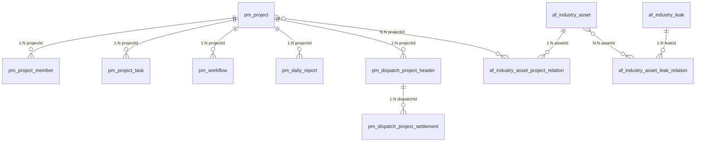

# PMS-springmvc 数据库文档

## 1. 数据库表概览

PMS-springmvc 模块涉及以下数据库表：

> 表名来源：以 Mapper XML 中实际查询的表名为准（已交叉验证）。

| 表名 | 说明 | 主要字段 | 关联 Mapper |
|------|------|----------|-------------|
| `pm_project` | 项目主表 | id, projectCode, projectName, projectState | ProjectHeaderMapper |
| `pm_project_header` | 项目头信息 | projectId, projectType, column001-column014 | ProjectHeaderMapper |
| `pm_project_member` | 项目成员 | id, projectId, memberRole, memberCode | ProjectMemberMapper |
| `pm_project_task` | 项目任务 | taskId, projectId, taskName, status | ProjectTaskMapper |
| `pm_project_manage_user` | 项目管理用户 | projectId, userId | （通过 core 模块 User/UserInfo 表实现） |
| `pm_workflow` | 工作流数据 | id, projectId, processInstanceId | PmWorkFlowMapper / PmWorkBenchMapper |
| `pm_daily_report` | 日报数据 | id, projectId, processDesc | DailyReportMapper |
| `pm_dispatch_project_header` | 发运项目（派单头表） | id, dispatchCode, dispatchState | DispatchProjectMapper |
| `pm_dispatch_project_settlement` | 发运结算 | id, settleSeq, amount | DispatchSettlementMapper |
| `af_industry_leak` | 行业泄露 | id, leakCode, leakName | IndustryLeakMapper |
| `af_industry_leak_warning` | 行业泄露预警 | warningId, leakId | IndustryLeakWarningMapper |
| `af_industry_asset` | 行业资产 | id, assetNum, assetName | IndustryAssetMapper |
| `af_industry_asset_project_relation` | 资产项目关联 | assetId, projectId | IndustryAssetProjectRelationMapper |
| `af_industry_asset_leak_relation` | 资产泄露关联 | assetId, leakId | IndustryAssetLeakRelationMapper |
| `pm_facilitator` | 服务商 | id, code, name, tel, bankAccount | FacilitatorMapper |
| `pm_common_related_data` | 通用关联数据 | id, objType, objId, type | CommonRelatedDataMapper |
| `pm_project_property_af_from_sms` | SMS 同步暂存表 | id, syncType, syncTime | PmSynchronizeMapper |
| `ar_report_data_column_mapping` | 报表数据列映射（Excel 分析） | id, fileName, analysisResult | ExcelAnalysisMapper |
| `data_field_relation` | 数据字段关联 | id, fieldName, fieldType | DataFieldRelationMapper |
| `ehr_login_account` | EHR 登录账号 | id, empId, account | EHRLoginAccountMapper |

> 注：`pm_workbench` 表不存在，`PmWorkBenchMapper` 实际查询 `pm_workflow` 表。
> 注：`excel_analysis` 表名错误，`ExcelAnalysisMapper` 实际操作 `ar_report_data_column_mapping`。
> 注：EHR 相关表（`ehr_company`、`ehr_department`、`ehr_employee`、`ehr_job`、`ehr_login_account` 等）详见 EHR 集成文档。

---

## 2. 核心表详细字段

### 2.1 pm_project（项目主表）

| 字段名 | 数据类型 | 约束 | 业务含义 |
|--------|----------|------|----------|
| `id` | INT | PK, 自增 | 项目ID |
| `projectCode` | VARCHAR(50) | UNIQUE, NOT NULL | 项目编码 |
| `projectName` | VARCHAR(200) | NOT NULL | 项目名称 |
| `projectState` | VARCHAR(20) | NOT NULL | 项目状态 |
| `officeCode` | VARCHAR(20) | - | 办事处编码 |
| `customerCode` | VARCHAR(50) | - | 客户编码 |
| `customerName` | VARCHAR(100) | - | 客户名称 |
| `projectType` | VARCHAR(50) | - | 项目类型 |
| `projectCategory` | VARCHAR(50) | - | 项目分类 |
| `implType` | VARCHAR(50) | - | 实施类型 |
| `createTime` | DATETIME | NOT NULL | 创建时间 |
| `createBy` | VARCHAR(50) | NOT NULL | 创建人 |
| `updateTime` | DATETIME | - | 更新时间 |
| `updateBy` | VARCHAR(50) | - | 更新人 |
| `customInfo` | JSON | - | 自定义扩展信息 |

### 2.2 pm_project_task（项目任务表）

| 字段名 | 数据类型 | 约束 | 业务含义 |
|--------|----------|------|----------|
| `taskId` | INT | PK, 自增 | 任务ID |
| `projectId` | INT | FK, NOT NULL | 关联项目ID |
| `projectType` | VARCHAR(50) | - | 项目类型 |
| `contractNo` | VARCHAR(50) | - | 合同编号 |
| `taskTypeCode` | VARCHAR(50) | - | 任务类型编码 |
| `taskName` | VARCHAR(200) | NOT NULL | 任务名称 |
| `planStartTime` | DATETIME | - | 计划开始时间 |
| `planEndTime` | DATETIME | - | 计划结束时间 |
| `actualStartTime` | DATETIME | - | 实际开始时间 |
| `eventActualFinishDate` | DATETIME | - | 实际完成时间 |
| `priority` | VARCHAR(20) | - | 优先级 |
| `progress` | INT | - | 进度百分比 |
| `status` | VARCHAR(20) | - | 任务状态 |
| `parentId` | INT | - | 父任务ID |
| `createTime` | DATETIME | NOT NULL | 创建时间 |
| `createBy` | VARCHAR(50) | NOT NULL | 创建人 |

### 2.3 af_industry_asset（行业资产表）

| 字段名 | 数据类型 | 约束 | 业务含义 |
|--------|----------|------|----------|
| `id` | INT | PK, 自增 | 资产ID |
| `assetNum` | VARCHAR(50) | - | 资产编号 |
| `assetName` | VARCHAR(200) | NOT NULL | 资产名称 |
| `assetCategory` | VARCHAR(50) | - | 资产分类 |
| `assetType` | VARCHAR(50) | - | 资产类型 |
| `assetHost` | VARCHAR(100) | - | 资产主机 |
| `assetOpenPorts` | VARCHAR(500) | - | 开放端口 |
| `assetDeployInfo` | VARCHAR(500) | - | 部署信息 |
| `assetUsage` | VARCHAR(500) | - | 资产用途 |
| `customerName` | VARCHAR(100) | - | 客户名称 |
| `industryCode` | VARCHAR(50) | - | 行业编码 |
| `assetOS` | VARCHAR(100) | - | 操作系统 |
| `assetDB` | VARCHAR(100) | - | 数据库 |
| `status` | VARCHAR(20) | - | 状态 |
| `createTime` | DATETIME | NOT NULL | 创建时间 |

### 2.4 pm_dispatch_project_settlement（发运结算表）

| 字段名 | 数据类型 | 约束 | 业务含义 |
|--------|----------|------|----------|
| `id` | INT | PK, 自增 | 结算ID |
| `settleSeq` | VARCHAR(50) | - | 结算序号 |
| `dispatchId` | INT | FK | 关联发运ID |
| `dispatchSeq` | VARCHAR(50) | - | 发运序号 |
| `progressDesc` | VARCHAR(200) | - | 进度描述 |
| `progressRatio` | FLOAT | - | 进度比例 |
| `acceptanceDesc` | VARCHAR(200) | - | 验收描述 |
| `amount` | VARCHAR(50) | - | 结算金额 |
| `state` | INT | - | 状态 |
| `year` | INT | - | 年份 |
| `quarter` | INT | - | 季度 |
| `month` | INT | - | 月份 |
| `createTime` | DATETIME | NOT NULL | 创建时间 |

---

## 3. ER 关系图



---

## 4. 索引分析

### 4.1 已确认索引

| 表名 | 索引名 | 索引类型 | 字段 |
|------|--------|----------|------|
| `pm_project` | PRIMARY | 主键 | id |
| `pm_project` | uk_project_code | 唯一 | projectCode |
| `pm_project_task` | PRIMARY | 主键 | taskId |
| `pm_project_task` | idx_project_id | 普通 | projectId |
| `af_industry_asset` | PRIMARY | 主键 | id |
| `af_industry_leak` | PRIMARY | 主键 | id |

### 4.2 索引优化建议

```sql
-- 为常用查询字段添加索引
CREATE INDEX idx_project_state ON pm_project(projectState);
CREATE INDEX idx_project_customer ON pm_project(customerName);
CREATE INDEX idx_task_status ON pm_project_task(status);
CREATE INDEX idx_asset_category ON af_industry_asset(assetCategory);
CREATE INDEX idx_settlement_dispatch ON pm_dispatch_project_settlement(dispatchId);
```
