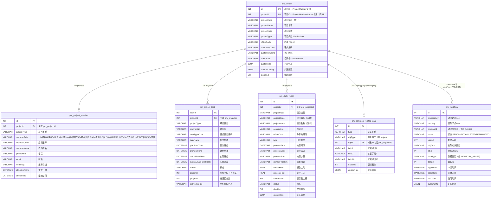
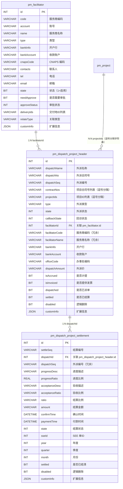
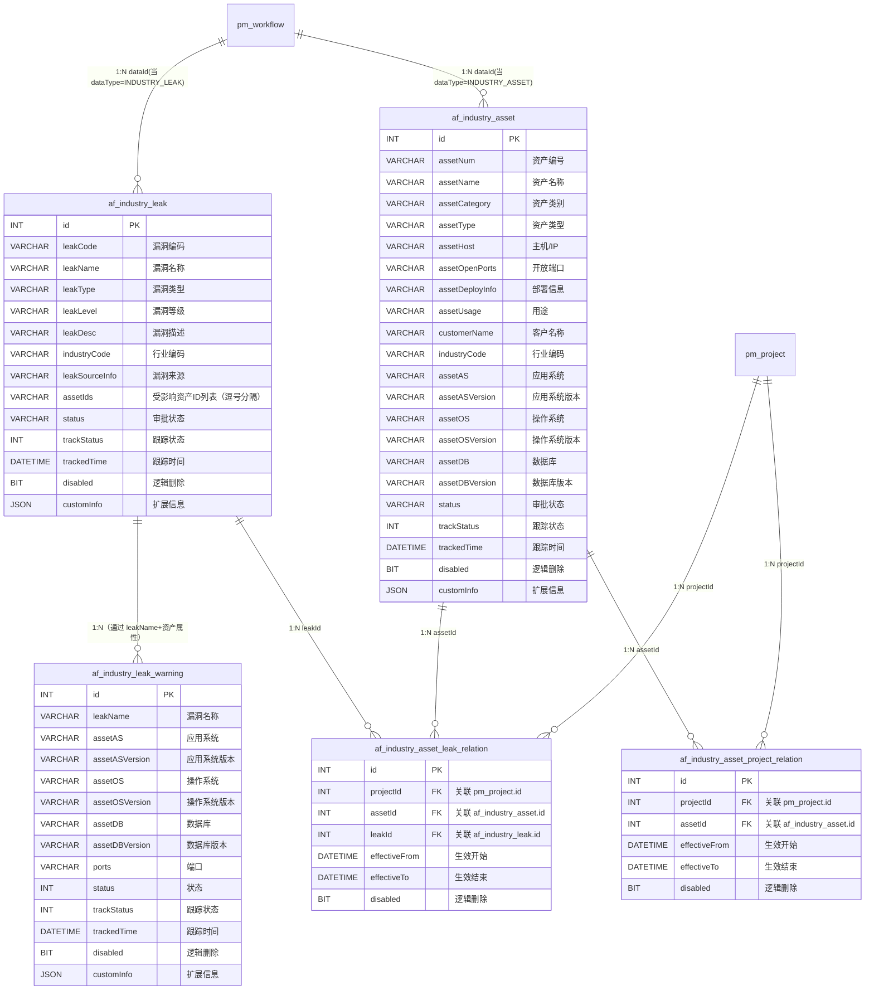
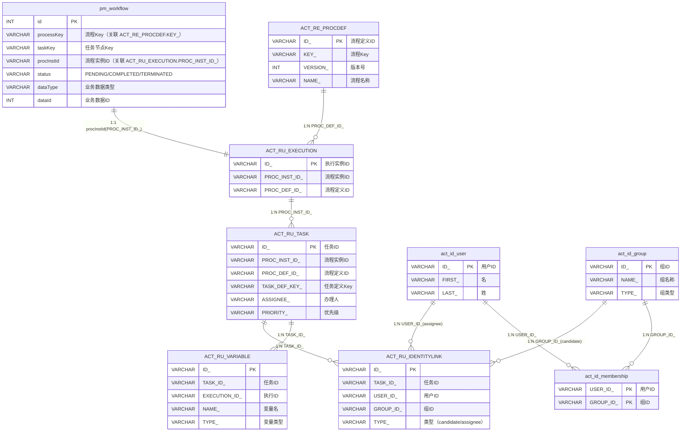
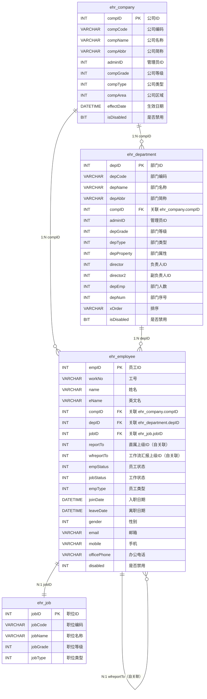
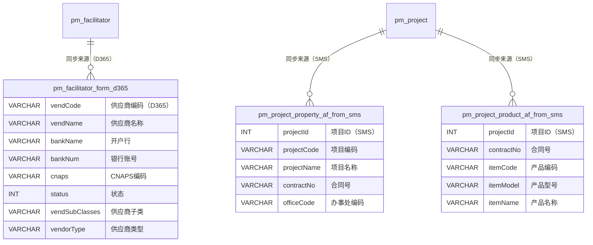
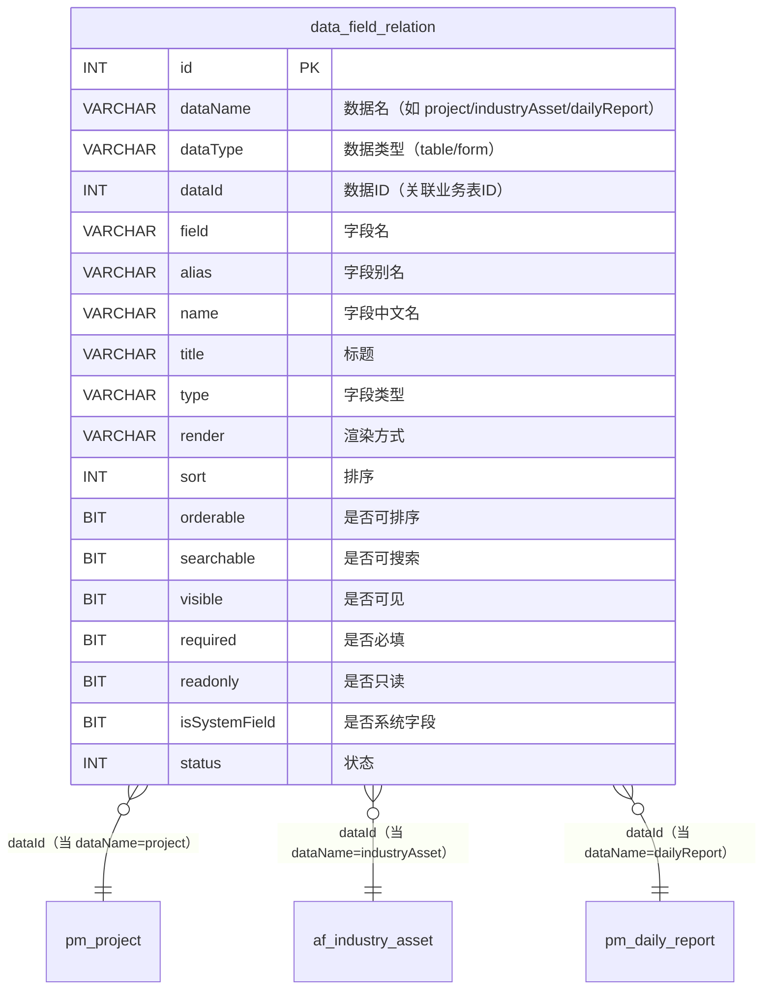
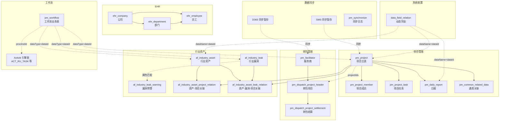

# PMS-springmvc ER 关系图

> 数据库：dppms_d365 (MySQL 8.0.16)
> 本文档基于 PMS-springmvc 模块的 MyBatis Mapper XML 映射文件、Entity 实体类与 Service 实现梳理而成。
> 使用 Mermaid `erDiagram` 语法绘制核心实体关系图。

---

## 一、表清单与业务域划分

PMS-springmvc 模块涉及的数据库表按业务域划分为以下 6 组：

| 业务域 | 表前缀 | 表名 | 说明 | Mapper |
|--------|--------|------|------|--------|
| 项目管理 | pm_ | pm_project | 项目主表（含 header 视图字段） | ProjectMapper / ProjectHeaderMapper |
| 项目管理 | pm_ | pm_project_member | 项目成员表 | ProjectMemberMapper |
| 项目管理 | pm_ | pm_project_task | 项目任务表 | ProjectTaskMapper |
| 项目管理 | pm_ | pm_daily_report | 日报表 | DailyReportMapper |
| 项目管理 | pm_ | pm_common_related_data | 通用关联数据表 | CommonRelatedDataMapper |
| 项目管理 | pm_ | data_field_relation | 数据字段关系表（动态表单字段） | DataFieldRelationMapper |
| 转包管理 | pm_ | pm_dispatch_project_header | 转包项目表 | DispatchProjectMapper |
| 转包管理 | pm_ | pm_dispatch_project_settlement | 转包结算表 | DispatchSettlementMapper |
| 转包管理 | pm_ | pm_facilitator | 服务商表 | FacilitatorMapper |
| 行业资产 | af_ | af_industry_asset | 行业资产表 | IndustryAssetMapper |
| 行业资产 | af_ | af_industry_leak | 行业漏洞表 | IndustryLeakMapper |
| 行业资产 | af_ | af_industry_leak_warning | 行业漏洞预警表 | IndustryLeakWarningMapper |
| 行业资产 | af_ | af_industry_asset_project_relation | 资产-项目关联表 | IndustryAssetProjectRelationMapper |
| 行业资产 | af_ | af_industry_asset_leak_relation | 资产-漏洞-项目关联表 | IndustryAssetLeakRelationMapper |
| 工作流 | pm_ | pm_workflow | 工作流业务表 | PmWorkFlowMapper |
| 工作流 | ACT_ | ACT_RU_TASK / ACT_RE_PROCDEF 等 | Activiti 引擎表 | PmWorkBenchMapper（只读） |
| EHR 集成 | ehr_ | ehr_company / ehr_department / ehr_employee / ehr_job 等 | 人力资源数据 | ehr.*Mapper |
| 数据同步 | pm_ | pm_project_property_af_from_sms / pm_facilitator_form_d365 等 | 外部系统同步暂存表 | PmSynchronizeMapper |

---

## 二、项目核心关系网

**关系说明：**
- `pm_project` 是核心实体，`id` 与 `projectId` 指向同一字段（ProjectMapper 使用 `id`，ProjectHeaderMapper 使用 `projectId`）。
- `pm_project_member`、`pm_project_task`、`pm_daily_report` 通过 `projectId` 外键关联到项目。
- `pm_common_related_data` 是通用关联表，通过 `objType` + `objId` 多态关联到任意业务对象。
- `pm_workflow` 通过 `dataType` + `dataId` 多态关联到业务对象（如 INDUSTRY_ASSET、PROJECT_TASK 等）。
- `pm_project_task.parentId` 自关联实现任务层级。

---

## 三、转包项目-结算-服务商关系

**关系说明：**
- `pm_dispatch_project_header` 与 `pm_project` 是多对多关系，通过 `projectIds`（逗号分隔的字符串）和 `contractNos` 关联，**非外键约束**，需在应用层解析。
- `pm_dispatch_project_settlement` 通过 `dispatchId` 外键关联到转包项目。
- `pm_facilitator` 与 `pm_dispatch_project_header` 是一对多关系，转包项目冗余存储了 `facilitatorCode` 和 `facilitatorName`。
- `pm_dispatch_project_settlement` 的 `sseId` 关联到 SEE 系统（外部系统）的付款单。

---

## 四、行业资产-漏洞-预警关系

**关系说明：**
- `af_industry_asset` 与 `pm_project` 通过 `af_industry_asset_project_relation` 关联表实现多对多关系。
- `af_industry_asset` 与 `af_industry_leak` 通过 `af_industry_asset_leak_relation` 关联表实现多对多关系，该表同时包含 `projectId`，表示资产-漏洞-项目的三方关联。
- `af_industry_leak_warning` 是基于资产属性（应用系统、操作系统、数据库等）与漏洞匹配后生成的预警记录，通过 `leakName` 和资产属性字段软关联到 `af_industry_leak` 和 `af_industry_asset`，**非外键约束**。
- `af_industry_leak.assetIds` 是冗余的逗号分隔字符串，存储受影响资产ID列表，用于快速查询，**非外键约束**。
- `pm_workflow` 通过 `dataType`（如 `INDUSTRY_ASSET`、`INDUSTRY_LEAK`）+ `dataId` 多态关联到资产/漏洞的审批流程。

---

## 五、工作流与 Activiti 引擎关系

**关系说明：**
- `pm_workflow` 是业务层工作流表，通过 `procInstId` 关联到 Activiti 引擎的 `ACT_RU_EXECUTION`。
- `PmWorkBenchMapper` 直接查询 Activiti 引擎表（`ACT_RU_TASK`、`ACT_RU_IDENTITYLINK`、`ACT_RE_PROCDEF` 等）获取待办任务。
- `ACT_RU_TASK.ASSIGNEE_` 存储办理人ID，关联 `act_id_user.ID_`。
- `ACT_RU_IDENTITYLINK` 通过 `TYPE_='candidate'` 实现候选组/候选人机制，关联 `act_id_group` 和 `act_id_user`。
- `act_id_membership` 维护用户与组的归属关系。

---

## 六、EHR 人力资源关系

**关系说明：**
- `ehr_company`、`ehr_department`、`ehr_employee` 是 EHR 系统的核心三表，通过 `compID`、`depID` 建立层级关系。
- `ehr_employee.reportTo` 和 `wfreportTo` 自关联到同表的 `empID`，分别表示行政汇报线和工作流汇报线。
- EHR 数据通过 `EhrDataJob` 定时从外部 EHR 系统同步，PMS-springmvc 只读使用。
- `EHRDataController` 提供树形查询接口，通过 `TreeNodeUtils.constructTreeNodeData` 构建公司-部门-员工树。

---

## 七、数据同步暂存表关系

**关系说明：**
- `pm_facilitator_form_d365` 是 D365 系统供应商数据的同步暂存表，由 `D365DataJob` 定时全量同步，再由 `pmSynchronizeService.insertOrUpdateFacilitatorFromD365()` 更新到 `pm_facilitator` 主表。
- `pm_project_property_af_from_sms` 和 `pm_project_product_af_from_sms` 是 SMS 系统安服项目数据的同步暂存表，由 `SMSDataJob` 定时同步。
- 同步暂存表通过 `truncate` 清空后重新写入，不维护外键约束。

---

## 八、动态表单字段关系

**关系说明：**
- `data_field_relation` 是动态表单字段配置表，通过 `dataName` + `dataId` 多态关联到业务对象。
- `dataName` 取值包括：`project`（项目）、`industryAsset`（行业资产）、`industryLeak`（行业漏洞）、`dailyReport`（日报）等。
- `dataType` 区分字段用途：`table`（列表列配置）、`form`（表单字段配置）。
- `AbstractController.findColumnList()` 和 `findFieldList()` 方法通过此表实现动态列表列和表单字段的渲染。

---

## 九、跨业务域关系总览

**图例说明：**
- 实线箭头 `→`：表示外键关联或强关联（有明确字段约束）。
- 虚线箭头 `-.->`：表示弱关联（通过字符串字段、多态字段或应用层逻辑关联，无外键约束）。
- 跨业务域的关联主要通过以下方式实现：
  1. **多态外键**：`pm_workflow.dataType+dataId`、`pm_common_related_data.objType+objId`、`data_field_relation.dataName+dataId`。
  2. **字符串关联**：`pm_dispatch_project_header.projectIds`（逗号分隔）。
  3. **属性匹配**：`af_industry_leak_warning` 通过应用系统、操作系统等属性字段匹配 `af_industry_leak` 和 `af_industry_asset`。
  4. **数据同步**：外部系统数据通过暂存表同步到主表。

---

## 十、关键关系约束说明

### 10.1 外键约束情况

PMS-springmvc 模块的数据库表**普遍没有数据库层的外键约束**，所有关联关系都在应用层维护。主要原因：

1. **多数据源架构**：PMS-springmvc 使用 RoutingDataSource 动态切换 6 个数据源（Local/PMS/SMS/EHR/D365/CRM），跨数据源无法建立外键。
2. **分库分表**：部分表分布在不同的数据库实例上。
3. **历史遗留**：PMS-struts 模块使用 iBATIS，PMS-springmvc 使用 MyBatis，两套 ORM 共享同一数据库，外键约束会增加维护复杂度。

### 10.2 逻辑删除约定

所有业务表均采用 `disabled` 字段（BIT 类型）实现逻辑删除：

| 取值 | 含义 |
|------|------|
| 0 (b'0') | 有效记录 |
| 1 (b'1') | 已删除记录 |

查询时需显式添加 `WHERE disabled = 0` 条件，MyBatis Mapper 的 `selectBySelective` 方法已内置此条件。

### 10.3 时间有效期约定

部分表（如 `pm_project_member`、`af_industry_asset_project_relation`）使用 `effectiveFrom` 和 `effectiveTo` 字段管理记录有效期：

| effectiveTo 取值 | 含义 |
|------------------|------|
| NULL | 记录当前有效 |
| 非 NULL 日期 | 记录已失效，该日期为失效时间 |

### 10.4 customInfo JSON 扩展字段

大部分业务表包含 `customInfo`（JSON 类型）字段，用于存储动态扩展属性，避免频繁加列。常见存储内容：

| 表 | customInfo 存储内容 |
|----|---------------------|
| pm_project | 办事处名称、系统部名称、行业名称等冗余字段 |
| pm_dispatch_project_header | 项目详情、合同详情等 |
| pm_daily_report | 项目信息、创建人姓名等 |
| af_industry_asset | 资产扩展属性 |
| pm_workflow | 审批意见、流程变量等 |

JSON 字段通过 `FastjsonTypeHandler` 处理器与 Java `Map<String, Object>` 互转，详见 [mybatis-ibatis-coexistence.md](../01-architecture/mybatis-ibatis-coexistence.md)。
