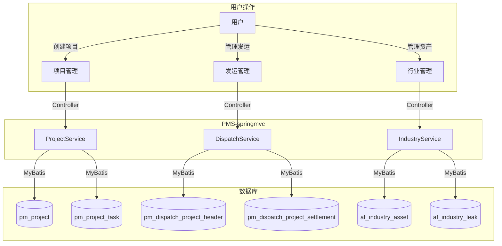

# PMS-springmvc 模块-表CRUD映射矩阵

> 数据库：dppms_d365 (MySQL)
> C=创建(Create) R=读取(Read) U=更新(Update) D=删除(Delete)
> 频率：高(>100次/天) / 中(10-100次/天) / 低(<10次/天)
> 量级：大(>1万条) / 中(1千-1万条) / 小(<1千条)

---

## 1. 完整模块-表CRUD矩阵

> 表名以 Mapper XML 实际查询为准（已交叉验证）。

### 1.1 项目管理模块

| 数据表 | C | R | U | D | 操作频率 | 数据量级 | 说明 |
|--------|---|---|---|---|----------|----------|------|
| pm_project | ✓ | ✓ | ✓ | ✓ | R:高 C:中 U:高 D:低 | 大 | 项目主表CRUD |
| pm_project_header | ✓ | ✓ | ✓ | | R:高 C:中 U:高 | 大 | 项目头信息 |
| pm_project_member | ✓ | ✓ | ✓ | ✓ | R:高 C:中 U:中 D:低 | 大 | 项目成员CRUD |
| pm_project_task | ✓ | ✓ | ✓ | | R:高 C:中 U:高 | 大 | 项目任务 |
| pm_project_manage_user | ✓ | ✓ | ✓ | ✓ | R:高 C:中 U:中 D:低 | 中 | 项目管理用户 |
| pm_workflow | ✓ | ✓ | ✓ | | R:高 C:中 U:中 | 中 | 工作流数据（PmWorkBenchMapper 也查询此表） |
| pm_daily_report | ✓ | ✓ | ✓ | ✓ | R:高 C:中 U:中 D:低 | 大 | 日报数据 |

### 1.2 发运管理模块

| 数据表 | C | R | U | D | 操作频率 | 数据量级 | 说明 |
|--------|---|---|---|---|----------|----------|------|
| pm_dispatch_project_header | ✓ | ✓ | ✓ | | R:高 C:中 U:中 | 大 | 发运项目（派单头表） |
| pm_dispatch_project_settlement | ✓ | ✓ | ✓ | | R:中 C:中 U:高 | 大 | 发运结算 |

### 1.3 行业管理模块

| 数据表 | C | R | U | D | 操作频率 | 数据量级 | 说明 |
|--------|---|---|---|---|----------|----------|------|
| af_industry_leak | ✓ | ✓ | ✓ | ✓ | R:中 C:低 U:中 D:低 | 中 | 行业泄露 |
| af_industry_leak_warning | ✓ | ✓ | ✓ | | R:中 C:低 U:高 | 中 | 行业泄露预警 |
| af_industry_asset | ✓ | ✓ | ✓ | ✓ | R:高 C:低 U:中 D:低 | 中 | 行业资产 |
| af_industry_asset_project_relation | ✓ | ✓ | ✓ | ✓ | R:高 C:中 U:低 D:中 | 中 | 资产项目关联 |
| af_industry_asset_leak_relation | ✓ | ✓ | ✓ | ✓ | R:中 C:低 U:低 D:低 | 小 | 资产泄露关联 |

### 1.4 辅助模块

| 数据表 | C | R | U | D | 操作频率 | 数据量级 | 说明 |
|--------|---|---|---|---|----------|----------|------|
| pm_facilitator | ✓ | ✓ | ✓ | ✓ | R:中 C:低 U:低 D:低 | 小 | 协调员/服务商 |
| pm_common_related_data | ✓ | ✓ | ✓ | ✓ | R:高 C:中 U:中 D:中 | 中 | 通用关联数据 |
| pm_project_property_af_from_sms | ✓ | ✓ | | | C:高 R:低 | 大 | SMS 同步暂存表 |
| ar_report_data_column_mapping | ✓ | ✓ | | | C:中 R:中 | 中 | 报表数据列映射（ExcelAnalysisMapper） |
| data_field_relation | | ✓ | | | R:高 | 小 | 数据字段关联 |
| ehr_login_account | ✓ | ✓ | ✓ | | R:中 C:低 U:低 | 中 | EHR 登录账号 |

> 已修正：`pm_dispatch_project` → `pm_dispatch_project_header`，`facilitator` → `pm_facilitator`，`common_related_data` → `pm_common_related_data`，`excel_analysis` → `ar_report_data_column_mapping`，`pm_synchronize` → `pm_project_property_af_from_sms`，删除不存在的 `pm_workbench` 表。

---

## 2. 数据流向图



---

## 3. 数据转换规则

### 3.1 项目状态转换

| 原状态 | 目标状态 | 触发条件 | 转换规则 |
|--------|----------|----------|----------|
| 30 | 31 | 指定服务经理 | projectState 更新 |
| 31 | 32 | 指定项目经理 | projectState 更新 |
| 32 | 40 | 项目实施中 | projectState 更新 |
| 40 | 100 | 项目闭环 | projectState 更新 |

### 3.2 任务状态转换

| 原状态 | 目标状态 | 触发条件 | 转换规则 |
|--------|----------|----------|----------|
| 待处理 | 进行中 | 开始任务 | status 更新 |
| 进行中 | 已完成 | 完成任务 | status + progress 更新 |
| 已完成 | 已关闭 | 关闭任务 | status 更新 |

---

## 4. 数据校验机制

### 4.1 前端校验

- 必填字段验证
- 数据格式验证（邮箱、手机号、日期）
- 长度限制验证
- 范围验证

### 4.2 后端校验

```java
// Service 层校验
public void validateProject(Project project) {
    if (StringUtils.isBlank(project.getProjectName())) {
        throw new BusinessException("项目名称不能为空");
    }
    if (project.getProjectName().length() > 100) {
        throw new BusinessException("项目名称不能超过100个字符");
    }
}
```

### 4.3 数据库约束

- 主键约束
- 唯一约束
- 外键约束
- 非空约束
- 默认值约束
