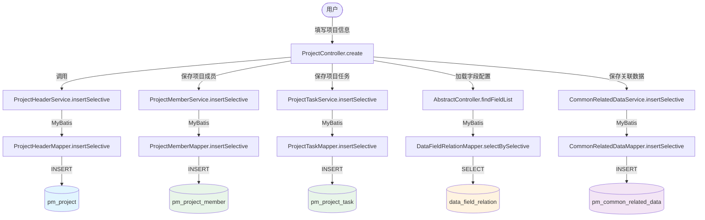
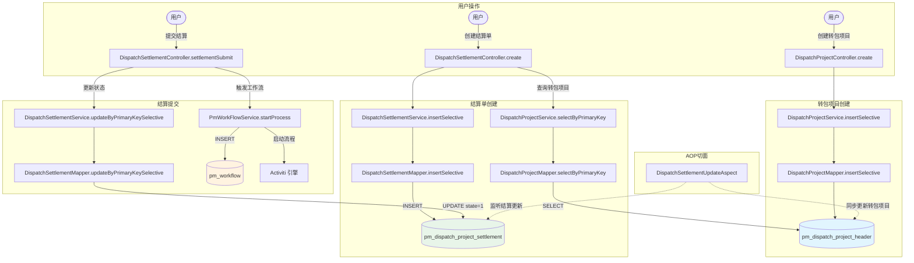
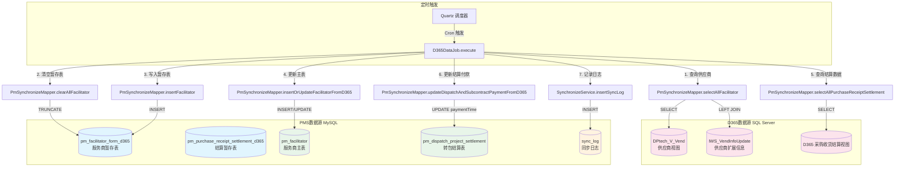
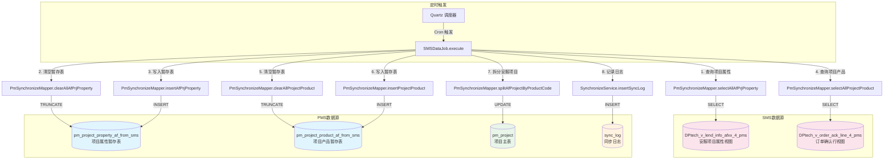
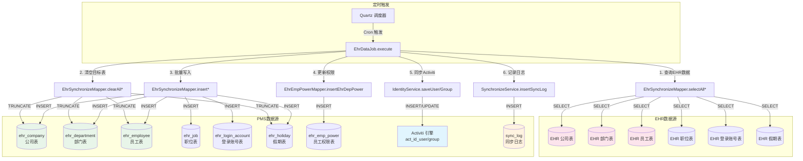
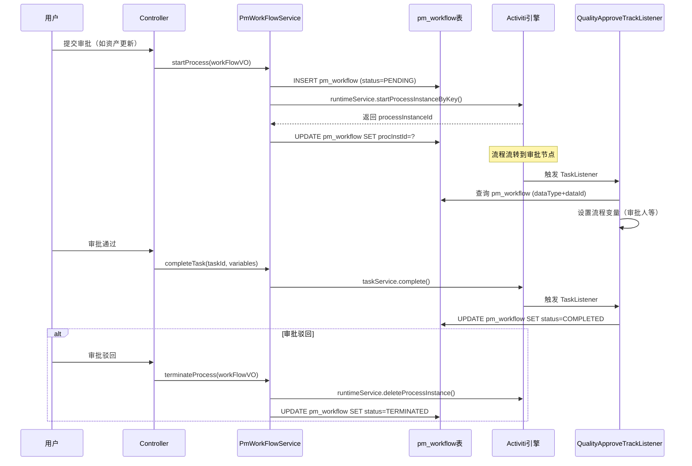
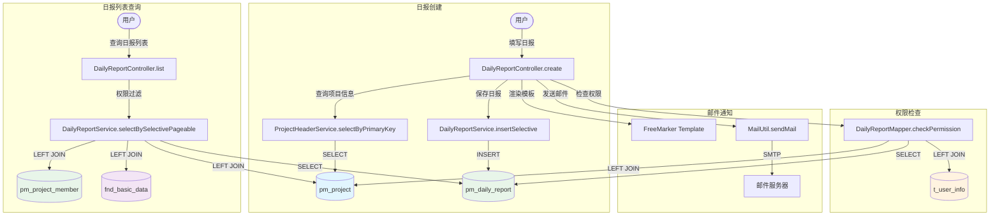
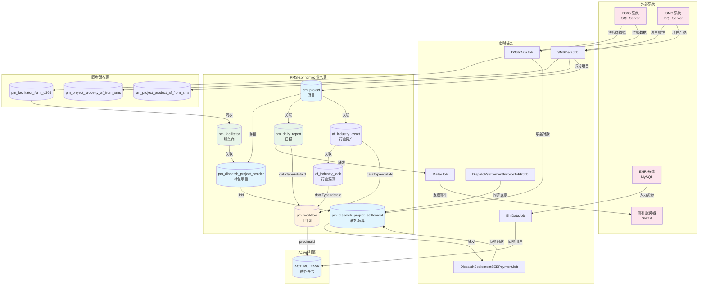

# PMS-springmvc 数据流向图

> 本文档描述 PMS-springmvc 模块核心业务场景的数据流向，包括数据创建、同步、审批等流程。
> 使用 Mermaid 流程图和时序图绘制。

---

## 一、数据流概览

PMS-springmvc 模块的数据流按业务场景分为以下 7 类：

| 数据流类型 | 触发方式 | 涉及表 | 说明 |
|-----------|---------|--------|------|
| 项目创建 | 用户操作 | pm_project, pm_project_member, pm_project_task, data_field_relation | 项目主数据创建 |
| 转包结算 | 用户操作 + 定时任务 | pm_dispatch_project_header, pm_dispatch_project_settlement, pm_facilitator | 转包项目与结算管理 |
| D365 数据同步 | 定时任务（D365DataJob） | D365 视图, pm_facilitator, pm_dispatch_project_settlement | 供应商和付款信息同步 |
| SMS 数据同步 | 定时任务（SMSDataJob） | SMS 视图, pm_project_property_af_from_sms, pm_project | 安服项目属性同步 |
| EHR 数据同步 | 定时任务（EhrDataJob） | EHR 源表, ehr_company, ehr_department, ehr_employee | 人力资源数据同步 |
| 工作流审批 | 用户操作 + Activiti 引擎 | pm_workflow, ACT_RU_TASK, ACT_RU_IDENTITYLINK | 审批流程处理 |
| 日报管理 | 用户操作 | pm_daily_report, pm_project | 日报创建与邮件通知 |

---

## 二、项目创建数据流

**数据流说明：**

1. **项目主表**：`ProjectController.create` 调用 `ProjectHeaderService.insertSelective` 向 `pm_project` 表插入项目主记录，`customInfo` JSON 字段存储扩展属性。
2. **项目成员**：项目创建时同步保存项目成员（项目经理、技术负责人等），写入 `pm_project_member` 表。
3. **项目任务**：项目创建时根据模板生成初始任务节点，写入 `pm_project_task` 表。
4. **字段配置**：`AbstractController.findFieldList` 从 `data_field_relation` 表加载动态表单字段配置，用于前端渲染。
5. **关联数据**：项目的扩展关联信息写入 `pm_common_related_data` 表（`objType='project'`）。

---

## 三、转包结算数据流

**数据流说明：**

1. **转包项目创建**：`DispatchProjectController.create` 向 `pm_dispatch_project_header` 插入转包项目记录，`projectIds` 字段存储关联的项目ID列表（逗号分隔）。
2. **结算单创建**：结算单通过 `dispatchId` 外键关联到转包项目，写入 `pm_dispatch_project_settlement` 表。
3. **结算提交**：提交结算时更新结算状态（`state=1`），并启动 Activiti 工作流审批流程，在 `pm_workflow` 表创建审批记录。
4. **AOP 切面**：`DispatchSettlementUpdateAspect` 监听结算单变更，自动更新转包项目的 `settled` 状态。

---

## 四、D365 数据同步数据流

**数据流说明：**

1. **定时触发**：`D365DataJob` 由 Quartz 调度器按 Cron 表达式定时触发（生产环境每日执行）。
2. **供应商同步**：
   - 从 D365 数据源（SQL Server）的 `DPtech_V_Vend` 视图查询供应商数据。
   - 清空 MySQL 中的 `pm_facilitator_form_d365` 暂存表。
   - 将 D365 数据写入暂存表。
   - 调用 `insertOrUpdateFacilitatorFromD365()` 将暂存数据同步到 `pm_facilitator` 主表（存在则更新，不存在则插入）。
3. **结算付款同步**：
   - 从 D365 查询采购收货结算数据。
   - 调用 `updateDispatchAndSubcontractPaymentFromD365()` 更新 `pm_dispatch_project_settlement` 表的付款信息（`paymentTime` 等字段）。
4. **日志记录**：同步完成后向 `sync_log` 表插入同步日志，记录成功/失败状态和异常信息。

---

## 五、SMS 数据同步数据流

**数据流说明：**

1. **项目属性同步**：从 SMS 数据源查询安服先行项目属性，写入 `pm_project_property_af_from_sms` 暂存表。
2. **项目产品同步**：从 SMS 查询订单确认行数据，写入 `pm_project_product_af_from_sms` 暂存表。
3. **项目拆分**：调用 `splitAfProjectByProductCode()` 按产品编码拆分安服项目，更新 `pm_project` 表。
4. **日志记录**：同步完成后记录同步日志。

---

## 六、EHR 数据同步数据流

**数据流说明：**

1. **全量同步**：`EhrDataJob` 采用全量同步策略，先清空目标表再批量写入。
2. **数据范围**：同步公司、部门、员工、职位、登录账号、假期 6 类数据。
3. **权限同步**：同步完成后调用 `EhrEmpPowerMapper.insertEhrDepPower()` 和 `insertEhrEmpPower()` 重建员工权限数据。
4. **Activiti 同步**：通过 `IdentityService` 将用户和组信息同步到 Activiti 引擎的 `act_id_user`、`act_id_group`、`act_id_membership` 表，用于工作流候选人查询。
5. **系统参数控制**：通过 `SystemConfig.systemVariables.get("ehr.sync.user")` 参数控制是否同步用户数据。

---

## 七、工作流审批数据流

**数据流说明：**

1. **流程启动**：用户提交审批时，`PmWorkFlowService.startProcess()` 在 `pm_workflow` 表创建审批记录（`status=PENDING`），并调用 Activiti 引擎启动流程实例。
2. **流程实例关联**：获取 Activiti 返回的 `processInstanceId` 后，更新 `pm_workflow` 表的 `procInstId` 字段，建立业务表与引擎表的关联。
3. **任务监听**：`QualityApproveTrackListener` 监听 Activiti 任务节点事件，查询 `pm_workflow` 表获取业务上下文，设置流程变量（如审批人、区域权限等）。
4. **审批完成**：用户审批通过后，`PmWorkFlowService.completeTask()` 调用 Activiti 完成任务，监听器更新 `pm_workflow` 状态为 `COMPLETED`。
5. **流程终止**：审批驳回或业务数据变更时，调用 `terminateProcess()` 删除 Activiti 流程实例，更新 `pm_workflow` 状态为 `TERMINATED`。

---

## 八、日报管理与邮件通知数据流

**数据流说明：**

1. **日报创建**：
   - 用户填写日报时，`DailyReportController.create` 先查询 `pm_project` 表获取项目信息（项目名称、办事处、合同号等）。
   - 将项目信息冗余到日报记录中，插入 `pm_daily_report` 表。
   - `customInfo` JSON 字段存储项目详情、创建人姓名等扩展信息。

2. **权限检查**：
   - `DailyReportMapper.checkPermission` 通过日报ID查询所属项目，再关联 `t_user_info` 表检查用户权限。
   - 权限检查逻辑：用户是否为项目管理员、是否为项目成员、是否有所属办事处权限。

3. **邮件通知**：
   - 日报创建后，使用 FreeMarker 模板引擎渲染邮件内容。
   - 通过 `MailUtil.sendMail()` 发送邮件通知相关人员。

4. **列表查询**：
   - 日报列表查询涉及多表 JOIN：`pm_daily_report` + `pm_project` + `pm_project_member` + `fnd_basic_data`。
   - 权限过滤条件包括：项目类型（`FIND_IN_SET`）、办事处（`FIND_IN_SET`）、项目成员（`memberCode`）、创建人（`createBy`）。

---

## 九、跨模块数据流总览

**图例说明：**
- 粉色节点：外部系统数据源
- 蓝色节点：项目相关业务表
- 绿色节点：服务商、日报等业务表
- 橙色节点：工作流相关表
- 浅蓝色节点：Activiti 引擎表

**关键数据流：**
1. **D365 → 服务商**：D365 供应商数据通过暂存表同步到服务商主表。
2. **D365 → 转包结算**：D365 付款数据直接更新转包结算表的付款信息。
3. **SMS → 项目**：SMS 项目属性和产品数据同步后，触发安服项目拆分。
4. **EHR → Activiti**：EHR 用户数据同步到 Activiti 引擎，用于工作流候选人查询。
5. **日报 → 邮件**：日报创建后触发邮件通知。
6. **业务表 → 工作流**：行业资产、行业漏洞、日报等业务数据通过 `dataType+dataId` 多态关联到工作流审批。
