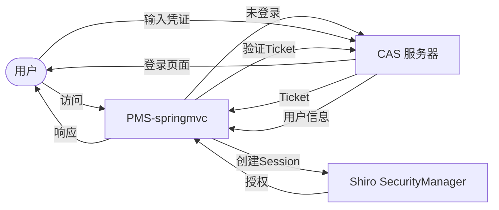

# PMS-springmvc 安全实践指南

> 本文档总结 PMS-springmvc 模块的安全防护策略与最佳实践，涵盖认证授权、输入验证、数据安全等方面。

---

## 一、认证与授权

### 1.1 Shiro 认证架构

PMS-springmvc 使用 Shiro 1.8.0 + CAS 3.2.2 实现认证与单点登录：



### 1.2 权限控制

#### 1.2.1 基于角色的权限控制（RBAC）

```java
@Controller
@RequestMapping("/project")
public class ProjectController extends AbstractController {
    
    @RequestMapping("/list")
    public String list(PageParam<Object> pageParam, ProjectVO v, Model model) {
        // 检查权限：需要 project:list 权限
        if (!checkPermission(v, model, getDataName() + ":list")) {
            model.addAttribute("data", Collections.emptyList());
            return Consts.VIEW_UNAUTHORIZED;
        }
        // 业务逻辑
    }
}
```

#### 1.2.2 权限粒度

PMS-springmvc 的权限粒度分为三级：

| 权限类型 | 编码格式 | 说明 |
|---------|---------|------|
| 全部权限 | `module:*` | 拥有模块所有操作权限 |
| 编辑权限 | `module:edit` | 可编辑数据 |
| 查看权限 | `module:list` / `module:detail` | 仅可查看数据 |

```java
// IndustryAssetController 的权限检查示例
@Override
public boolean checkPermission(IndustryAssetVO v, Model model, String... permissions) {
    if (!UserContext.checkPermission(permissions)) {
        model.addAttribute("status", false);
        model.addAttribute("message", "没有权限进行该操作！");
        return false;
    }
    
    boolean isAll = false, isEdit = false, isView = false;
    Collection<String> permissionList = UserContext.getCurrentPrincipal().getPermissions();
    for (String requiredPerm : permissions) {
        String type = requiredPerm.split(":")[0] + ":";
        for (String permission : permissionList) {
            if (permission.startsWith(type)) {
                if (permission.indexOf(":*") > -1) {
                    isAll = true;
                } else if (permission.indexOf(":edit") > -1) {
                    isEdit = true;
                } else if (permission.indexOf(":list") > -1 || permission.indexOf(":detail") > -1) {
                    isView = true;
                }
            }
        }
    }
    String permissionType = isAll ? "all" : (isEdit ? "edit" : "view");
    model.addAttribute("permissionType", permissionType);
    return true;
}
```

### 1.3 数据权限控制

#### 1.3.1 项目类型权限

```java
// 根据用户允许访问的项目类型过滤
Principal user = UserContext.getCurrentPrincipal();
if (!UserContext.hasAnyRoles(ROLE_PM_ADMIN, ROLE_ADMIN)) {
    String projectTypes = StringUtils.defaultString(user.getUserInfo().getCustom4(), "-1");
    v.setProjectTypes(projectTypes);  // 设置允许访问的项目类型
}
```

#### 1.3.2 办事处权限

```java
// 非子项目管理员，添加允许访问的办事处权限
String officeCodes = StringUtils.defaultString(user.getUserInfo().getCustom5(), "-1");
if (!UserContext.hasRole(ROLE_PM_SUB_ADMIN)) {
    v.setOfficeCodes(officeCodes);  // 设置允许访问的办事处
}
```

#### 1.3.3 项目成员权限

```java
// 添加指派的项目成员权限
v.setUserPower(user.getUserName());      // 用户名
v.setUserIdPower(user.getUserInfoId());  // 用户信息ID
```

---

## 二、输入验证

### 2.1 XSS 防护

#### 2.1.1 全局 XSS 过滤

PMS-springmvc 通过 Web 过滤器实现全局 XSS 防护，详见 [web-filter-servlet.md](../01-architecture/web-filter-servlet.md)。

#### 2.1.2 输入参数过滤

```java
// 使用 StringUtils 进行安全处理
String projectName = StringUtils.trimToEmpty(v.getProjectName());
String remark = StringEscapeUtils.escapeHtml4(v.getRemark());
```

### 2.2 SQL 注入防护

#### 2.2.1 使用 MyBatis 参数化查询

```xml
<!-- ✅ 推荐：使用 #{} 参数化查询 -->
<select id="selectByPrimaryKey">
    SELECT * FROM pm_project WHERE id = #{id}
</select>

<!-- ❌ 禁止：使用 ${} 字符串拼接（存在 SQL 注入风险） -->
<select id="selectByTableName">
    SELECT * FROM ${tableName} WHERE id = #{id}
</select>
```

#### 2.2.2 动态表名安全处理

Excel 导入功能使用动态表名，需进行白名单校验：

```java
public void createTempTable(String tempTableName, String sourceTableName) {
    // 校验表名格式（只允许字母、数字、下划线）
    if (!tempTableName.matches("^[a-zA-Z_][a-zA-Z0-9_]*$")) {
        throw new IllegalArgumentException("非法表名");
    }
    excelAnalysisMapper.createTempTable(tempTableName, sourceTableName);
}
```

### 2.3 文件上传安全

#### 2.3.1 文件类型限制

```java
private static final Set<String> ALLOWED_TYPES = Set.of(
    "application/vnd.ms-excel",
    "application/vnd.openxmlformats-officedocument.spreadsheetml.sheet"
);

public void uploadFile(MultipartFile file) {
    String contentType = file.getContentType();
    if (!ALLOWED_TYPES.contains(contentType)) {
        throw new BusinessException("不支持的文件类型");
    }
}
```

#### 2.3.2 文件大小限制

```xml
<!-- spring-mvc.xml -->
<bean id="multipartResolver" class="org.springframework.web.multipart.commons.CommonsMultipartResolver">
    <property name="maxUploadSize" value="10485760" />  <!-- 10MB -->
    <property name="maxInMemorySize" value="40960" />    <!-- 40KB -->
</bean>
```

---

## 三、数据安全

### 3.1 敏感数据保护

#### 3.1.1 密码加密

PMS-springmvc 使用 Shiro 的密码加密机制：

```java
// 密码加密（注册/修改密码时）
String hashedPassword = new SimpleHash(
    "MD5",              // 哈希算法
    password,           // 原始密码
    salt,               // 盐值
    2                   // 迭代次数
).toString();
```

#### 3.1.2 数据脱敏

```java
// 手机号脱敏
public static String maskPhone(String phone) {
    if (StringUtils.length(phone) >= 11) {
        return phone.substring(0, 3) + "****" + phone.substring(7);
    }
    return phone;
}

// 邮箱脱敏
public static String maskEmail(String email) {
    int atIndex = email.indexOf("@");
    if (atIndex > 2) {
        return email.substring(0, 2) + "***" + email.substring(atIndex);
    }
    return email;
}
```

### 3.2 日志安全

#### 3.2.1 敏感信息脱敏

```java
// ❌ 禁止：日志中输出敏感信息
log.info("用户登录: username={}, password={}", username, password);

// ✅ 推荐：脱敏处理
log.info("用户登录: username={}, password=******", username);
```

#### 3.2.2 操作日志审计

PMS-springmvc 使用 `@SystemControllerLog` 注解记录操作日志：

```java
@RequestMapping(value = "/detail", method = RequestMethod.POST)
@SystemControllerLog(description = "新增[$v.customInfo.createName$][$v.processTime$]日报")
public String create(DailyReportVO v, Model model) {
    // 业务逻辑
}
```

### 3.3 JSON 数据安全

#### 3.3.1 防止 JSON 反序列化漏洞

```java
// Fastjson 类型处理器安全配置
ParserConfig.getGlobalInstance().setAutoTypeSupport(false);  // 禁用 AutoType
```

#### 3.3.2 JSON 字段过滤

```java
// 使用 @JsonIgnore 过滤敏感字段
public class UserVO {
    private String username;
    
    @JsonIgnore
    private String password;  // 不序列化到 JSON
    
    @JsonProperty("realName")
    private String realName;
}
```

---

## 四、会话安全

### 4.1 Session 管理

```properties
# Session 超时时间（分钟）
server.session.timeout=30

# Cookie 安全配置
server.session.cookie.http-only=true   # 禁止 JS 访问 Cookie
server.session.cookie.secure=true      # 仅 HTTPS 传输
```

### 4.2 CSRF 防护

PMS-springmvc 通过 CSRF 拦截器实现防护：

```java
public class CsrfInterceptor implements HandlerInterceptor {
    @Override
    public boolean preHandle(HttpServletRequest request, HttpServletResponse response, Object handler) {
        if ("POST".equalsIgnoreCase(request.getMethod()) || 
            "PUT".equalsIgnoreCase(request.getMethod()) || 
            "DELETE".equalsIgnoreCase(request.getMethod())) {
            String token = request.getHeader("X-CSRF-TOKEN");
            String sessionToken = (String) request.getSession().getAttribute("CSRF_TOKEN");
            if (!StringUtils.equals(token, sessionToken)) {
                response.setStatus(HttpServletResponse.SC_FORBIDDEN);
                return false;
            }
        }
        return true;
    }
}
```

### 4.3 并发登录控制

```java
// Shiro 配置：同一账号只允许一个会话
DefaultWebSecurityManager securityManager = new DefaultWebSecurityManager();
securityManager.setSessionMode(DefaultWebSecurityManager.NATIVE_SESSION_MODE);
Collection<SessionListener> listeners = new ArrayList<>();
listeners.add(new SimpleSessionListener());
```

---

## 五、接口安全

### 5.1 接口鉴权

所有 Controller 方法必须进行权限检查：

```java
@RequestMapping("/list")
public String list(PageParam<Object> pageParam, ProjectVO v, Model model) {
    // 必须检查权限
    if (!checkPermission(v, model, getDataName() + ":list")) {
        model.addAttribute("data", Collections.emptyList());
        return Consts.VIEW_UNAUTHORIZED;
    }
    // 业务逻辑
}
```

### 5.2 数据越权防护

```java
// 查询时必须添加用户权限过滤条件
public String list(PageParam<Object> pageParam, DailyReportVO v, Model model) {
    Principal user = UserContext.getCurrentPrincipal();
    if (!UserContext.hasAnyRoles(ROLE_PM_ADMIN, ROLE_ADMIN)) {
        // 非管理员只能查看自己有权限的数据
        v.setProjectTypes(user.getUserInfo().getCustom4());
        v.setOfficeCodes(user.getUserInfo().getCustom5());
        v.setUserPower(user.getUserName());
    }
    // 业务逻辑
}
```

### 5.3 接口限流

```java
// 使用 Guava RateLimiter 进行接口限流
private final RateLimiter rateLimiter = RateLimiter.create(100);  // 每秒 100 个请求

@RequestMapping("/list")
public String list(PageParam<Object> pageParam, Model model) {
    if (!rateLimiter.tryAcquire()) {
        model.addAttribute("message", "系统繁忙，请稍后重试");
        return "error/429";
    }
    // 业务逻辑
}
```

---

## 六、定时任务安全

### 6.1 任务执行权限

定时任务使用独立的 ApplicationContext，避免与 Web 上下文冲突：

```java
public class D365DataJob extends SynchronizeJob {
    @Override
    public void execute() {
        // 初始化独立 Spring 上下文
        this.initApplicationContext("spring.xml");
        // 执行同步逻辑
    }
}
```

### 6.2 异常处理

```java
@Override
public void execute() {
    SyncLog syncLog = new SyncLog(...);
    try {
        // 同步逻辑
        syncLog.setIsSuccess(true);
    } catch (Exception e) {
        syncLog.setException(ExceptionUtils.getStackTrace(e));
        log.error("D365 数据同步失败", e);
    } finally {
        synchronizeService.insertSyncLog(syncLog);
    }
}
```

---

## 七、安全检查清单

### 7.1 开发阶段

- [ ] 所有 Controller 方法是否进行权限检查？
- [ ] SQL 查询是否使用参数化查询（#{}）？
- [ ] 是否避免了 ${} 字符串拼接？
- [ ] 文件上传是否限制类型和大小？
- [ ] 敏感数据是否脱敏处理？
- [ ] 日志是否避免输出敏感信息？
- [ ] JSON 序列化是否过滤敏感字段？

### 7.2 测试阶段

- [ ] 是否进行 SQL 注入测试？
- [ ] 是否进行 XSS 测试？
- [ ] 是否进行越权访问测试？
- [ ] 是否进行 CSRF 测试？
- [ ] 是否进行文件上传漏洞测试？

### 7.3 上线阶段

- [ ] 是否配置 HTTPS？
- [ ] 是否配置 Session 超时？
- [ ] 是否启用 CSRF 防护？
- [ ] 是否配置接口限流？
- [ ] 是否启用操作日志审计？
- [ ] 是否定期更新依赖库（修复已知漏洞）？
