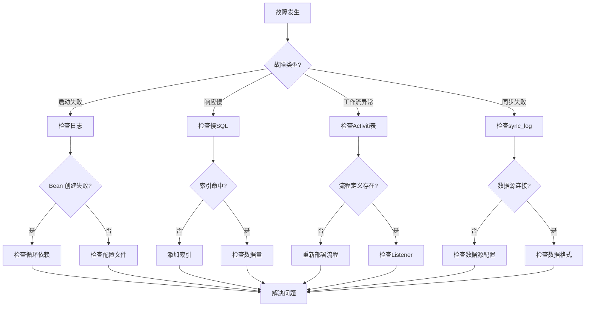

# PMS-springmvc 故障排查指南

> 本文档总结 PMS-springmvc 模块常见问题的排查方法与解决方案，涵盖启动、数据库、工作流、定时任务等方面。

---

## 一、启动故障

### 1.1 Spring 容器启动失败

#### 问题：Bean 创建循环依赖

**现象**：
```
org.springframework.beans.factory.BeanCurrentlyInCreationException: 
    Error creating bean with name 'xxxService': 
    Requested bean is currently in creation: Is there an unresolvable circular reference?
```

**排查步骤**：
1. 检查 Service 之间的相互依赖关系。
2. 使用 `@Lazy` 注解延迟加载打破循环依赖。

**解决方案**：
```java
@Service
public class DispatchSettlementService {
    @Autowired
    @Lazy  // 延迟加载打破循环依赖
    private DispatchProjectService dispatchProjectService;
}
```

#### 问题：Mapper 扫描失败

**现象**：
```
org.apache.ibatis.binding.BindingException: 
    Invalid bound statement (not found): com.dp.plat.pms.springmvc.dao.ProjectMapper.selectByPrimaryKey
```

**排查步骤**：
1. 检查 `spring-mybatis.xml` 中的 `mapperLocations` 配置是否包含 Mapper XML 文件。
2. 检查 Mapper XML 的 `namespace` 是否与接口全限定名一致。
3. 检查 Mapper XML 文件是否在 `src/main/java` 目录下（非 `src/main/resources`）。

**解决方案**：
```xml
<!-- spring-mybatis.xml -->
<bean id="sqlSessionFactory" class="org.mybatis.spring.SqlSessionFactoryBean">
    <property name="mapperLocations" value="classpath*:com/dp/plat/**/mapping/*.xml" />
</bean>
<bean class="org.mybatis.spring.mapper.MapperScannerConfigurer">
    <property name="basePackage" value="com.dp.plat.**.dao" />
</bean>
```

### 1.2 数据源连接失败

#### 问题：RoutingDataSource 路由错误

**现象**：查询 EHR 数据时报错"表不存在"或查询到错误的数据。

**排查步骤**：
1. 检查 `RoutingDataSource` 的数据源路由配置。
2. 检查 Service 方法是否添加了正确的数据源切换注解或编程式切换。

**解决方案**：
```java
// 确保查询 EHR 数据前切换数据源
// 注意：实际类名为 DataSourceHolder（com.dp.plat.core.config.DataSourceHolder），非 DynamicDataSourceContextHolder
DataSourceHolder.setDataSourceType("ehr");
try {
    List<Employee> employees = employeeService.selectBySelective(null);
} finally {
    DataSourceHolder.clearDataSourceType();
}
```

---

## 二、数据库故障

### 2.1 慢查询

#### 问题：列表查询响应慢

**现象**：项目列表、日报列表等查询接口响应时间超过 3 秒。

**排查步骤**：
1. 开启 Druid 慢 SQL 监控，查看 `/druid/sql.html`。
2. 使用 `EXPLAIN` 分析查询执行计划。

```sql
EXPLAIN SELECT * FROM pm_daily_report dr
LEFT JOIN pm_project ph ON dr.projectId = ph.projectId
WHERE dr.disabled = 0 AND dr.projectType IN ('10', 'afss')
ORDER BY dr.createTime DESC
LIMIT 0, 20;
```

**常见原因与解决方案**：

| 原因 | 解决方案 |
|------|---------|
| 缺少索引 | 添加 `idx_disabled_type_office (disabled, projectType, officeCode)` 索引 |
| FIND_IN_SET 查询 | 改为 IN 查询 |
| JSON 字段查询 | 使用生成列 + 索引 |
| 深分页 | 使用游标分页 |
| SELECT * | 只查询必要字段 |

### 2.2 死锁

#### 问题：并发更新导致死锁

**现象**：
```
com.mysql.jdbc.exceptions.jdbc4.MySQLTransactionRollbackException: 
    Deadlock found when trying to get lock; try restarting transaction
```

**排查步骤**：
1. 执行 `SHOW ENGINE INNODB STATUS` 查看死锁信息。
2. 检查是否有长事务持有锁。
3. 检查更新顺序是否一致。

**解决方案**：
- 统一更新顺序，避免交叉更新。
- 缩小事务范围，减少锁持有时间。
- 使用乐观锁替代悲观锁。

### 2.3 连接池耗尽

#### 问题：获取数据库连接超时

**现象**：
```
com.alibaba.druid.pool.GetConnectionTimeoutException: 
    wait millis 60000, active 50, maxActive 50
```

**排查步骤**：
1. 查看 Druid 监控页面，检查连接池使用情况。
2. 检查是否有连接泄漏（未关闭的 Connection）。
3. 检查是否有长事务持有连接。

**解决方案**：
- 增大 `maxActive` 连接数。
- 排查并修复连接泄漏。
- 优化长事务，缩短事务时间。

---

## 三、工作流故障

### 3.1 流程启动失败

#### 问题：Activiti 流程实例创建失败

**现象**：
```
org.activiti.engine.ActivitiException: 
    no processes deployed with key 'xxx'
```

**排查步骤**：
1. 检查流程定义是否已部署：`SELECT * FROM ACT_RE_PROCDEF WHERE KEY_ = 'xxx'`。
2. 检查 `processKey` 参数是否正确。
3. 检查流程定义 BPMN 文件是否正确部署。

**解决方案**：
```java
// 重新部署流程定义
repositoryService.createDeployment()
    .addClasspathResource("processes/qualityApproveTrack.bpmn")
    .deploy();
```

### 3.2 流程审批卡住

#### 问题：审批任务无法完成

**现象**：用户点击"审批通过"后，任务状态未更新。

**排查步骤**：
1. 检查 `pm_workflow` 表的 `status` 字段是否为 `PENDING`。
2. 检查 `ACT_RU_TASK` 表中是否存在对应任务。
3. 检查 `QualityApproveTrackListener` 是否抛出异常。

**解决方案**：
```java
// 手动终止卡住的流程
PmWorkFlowVO workflow = new PmWorkFlowVO();
workflow.setDataId(dataId);
workflow.setDataType(DataType.INDUSTRY_ASSET);
workflow.setStatus(PmWorkFlowVO.PENDING);
pmWorkFlowService.terminateProcess(workflow, "手动终止卡住的流程");
```

### 3.3 流程实例与业务数据不一致

#### 问题：Activiti 流程已结束，但 pm_workflow 状态未更新

**排查步骤**：
1. 检查 `QualityApproveTrackListener` 是否正确监听了任务完成事件。
2. 检查 `pm_workflow.procInstId` 是否与 `ACT_RU_EXECUTION.PROC_INST_ID_` 一致。

**解决方案**：
```sql
-- 查找不一致的记录
SELECT pw.* FROM pm_workflow pw
LEFT JOIN ACT_RU_EXECUTION e ON pw.procInstId = e.PROC_INST_ID_
WHERE pw.status = 'PENDING' AND e.ID_ IS NULL;

-- 手动更新状态
UPDATE pm_workflow SET status = 'COMPLETED', endTime = NOW()
WHERE id = ?;
```

---

## 四、定时任务故障

### 4.1 任务未执行

#### 问题：定时任务未按预期执行

**排查步骤**：
1. 检查 Quartz 配置是否正确（`quartz-job.xml`）。
2. 检查当前环境 Profile 是否启用了定时任务（dev 环境可能未启用）。
3. 检查 Quartz 调度器是否正常启动。

**解决方案**：
```xml
<!-- 检查 quartz-job.xml 中 Cron 表达式 -->
<trigger>
    <cron>
        <name>D365DataJobTrigger</name>
        <cron-expression>0 0 1 * * ?</cron-expression>  <!-- 每天凌晨 1 点 -->
    </cron>
</trigger>
```

### 4.2 同步任务失败

#### 问题：D365/EHR 数据同步失败

**排查步骤**：
1. 查看 `sync_log` 表的同步日志。
2. 检查外部数据源连接是否正常。
3. 检查同步参数是否正确。

```sql
-- 查看最近的同步日志
SELECT * FROM sync_log 
ORDER BY createTime DESC 
LIMIT 10;
```

**常见原因与解决方案**：

| 原因 | 解决方案 |
|------|---------|
| 外部数据源不可用 | 检查网络连接和数据源配置 |
| SQL 执行超时 | 调整 `maxQueryTimeout` 参数 |
| 数据格式不匹配 | 检查字段映射关系 |
| 主键冲突 | 使用 `INSERT ON DUPLICATE KEY UPDATE` |

### 4.3 任务并发执行

#### 问题：同一任务被多次并发执行

**排查步骤**：
1. 检查 Quartz 的 `concurrent` 配置是否为 `false`。
2. 检查是否有多个 Quartz 实例同时运行。

**解决方案**：
```xml
<!-- 确保配置了不允许并发 -->
<job-detail>
    <job-class>com.dp.plat.pms.springmvc.job.D365DataJob</job-class>
    <concurrent>false</concurrent>
</job-detail>
```

---

## 五、前端故障

### 5.1 页面白屏

#### 问题：访问页面显示空白

**排查步骤**：
1. 检查浏览器控制台是否有 JS 错误。
2. 检查 Network 请求是否返回 404 或 500。
3. 检查视图解析器配置是否正确。

**解决方案**：
- 检查 JSP/FreeMarker 模板文件路径。
- 检查 `AbstractController.getRealViewNameSpace()` 返回的视图路径。

### 5.2 列表数据不显示

#### 问题：列表页面无数据

**排查步骤**：
1. 检查 AJAX 请求是否返回数据。
2. 检查权限过滤条件是否过严。
3. 检查 `disabled = 0` 条件是否正确添加。

**解决方案**：
```java
// 检查权限过滤
Principal user = UserContext.getCurrentPrincipal();
if (!UserContext.hasAnyRoles(ROLE_PM_ADMIN, ROLE_ADMIN)) {
    // 非管理员的过滤条件
    String projectTypes = user.getUserInfo().getCustom4();
    if ("-1".equals(projectTypes)) {
        // 用户没有配置允许访问的项目类型
        model.addAttribute("message", "请联系管理员配置项目类型权限");
    }
}
```

---

## 六、日志排查

### 6.1 日志文件位置

| 环境 | 日志路径 | 说明 |
|------|---------|------|
| 开发 | `logs/pms-springmvc.log` | 本地开发日志 |
| 测试 | `/var/log/pms/test/` | 测试环境日志 |
| 生产 | `/var/log/pms/release/` | 生产环境日志 |

### 6.2 日志级别调整

```xml
<!-- logback.xml -->
<logger name="com.dp.plat.pms.springmvc" level="DEBUG" />
<logger name="com.dp.plat.ehr" level="INFO" />
<logger name="org.activiti" level="WARN" />
<logger name="org.mybatis" level="DEBUG" />
```

### 6.3 关键日志关键字

| 关键字 | 说明 | 排查场景 |
|--------|------|---------|
| `Exception` | 异常信息 | 查找错误 |
| `syncLog` | 同步日志 | 定时任务排查 |
| `permission` | 权限检查 | 权限问题排查 |
| `processInstanceId` | 流程实例ID | 工作流排查 |
| `RoutingDataSource` | 数据源切换 | 多数据源排查 |

---

## 七、常用排查命令

### 7.1 数据库排查

```sql
-- 查看当前连接数
SHOW PROCESSLIST;

-- 查看锁等待
SELECT * FROM information_schema.INNODB_LOCKS;
SELECT * FROM information_schema.INNODB_LOCK_WAITS;

-- 查看慢查询
SELECT * FROM mysql.slow_log ORDER BY start_time DESC LIMIT 100;

-- 查看表状态
SHOW TABLE STATUS FROM dppms_d365 LIKE 'pm_%';

-- 查看索引使用情况
SELECT * FROM sys.schema_unused_indexes WHERE object_schema = 'dppms_d365';
```

### 7.2 Activiti 排查

```sql
-- 查看运行中的流程实例
SELECT * FROM ACT_RU_EXECUTION;

-- 查看待办任务
SELECT * FROM ACT_RU_TASK;

-- 查看流程定义
SELECT * FROM ACT_RE_PROCDEF;

-- 查看历史任务
SELECT * FROM ACT_HI_TASKINST;
```

### 7.3 JVM 排查

```bash
# 查看 JVM 进程
jps -l

# 查看堆内存使用
jmap -heap <pid>

# 查看线程堆栈
jstack <pid> > thread_dump.txt

# 生成堆转储
jmap -dump:format=b,file=heap.hprof <pid>

# 查看 GC 情况
jstat -gcutil <pid> 1000 10
```

---

## 八、故障排查流程



---

## 九、紧急联系

| 故障等级 | 响应时间 | 处理方式 |
|---------|---------|---------|
| P0（系统不可用） | 15 分钟 | 立即电话通知，全员投入 |
| P1（核心功能不可用） | 30 分钟 | 即时通讯通知，优先处理 |
| P2（部分功能异常） | 2 小时 | 工单系统提交，工作时间内处理 |
| P3（体验问题） | 1 个工作日 | 工单系统提交，排期处理 |
