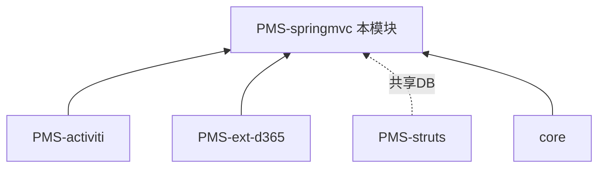

# PMS-springmvc 模块知识库

> DPtech PMS **Spring MVC 扩展模块**。承载项目管理扩展（日报/发运/资产）、工作流管理、行业资产管理、EHR 组织同步及 Struts API 兼容层。本知识库独立维护。

---

## 模块定位

| 项 | 值 |
|----|----|
| 目录 | `PMS/PMS-springmvc/` |
| artifactId | `pms-springmvc` |
| 基础包 | `com.dp.plat.pms`（业务）/ `com.dp.plat.ehr`（EHR）/ `com.dp.plat.activiti.unifytask`（工作流）/ `com.dp.plat.core.handlers`（异常） |
| 技术栈 | **Spring MVC 5.3.19** + MyBatis 3.5.9 + Shiro + Activiti 5.23.0 |
| JDK | 1.8 |
| 规模 | 20 Controller / 28 Service / 20 数据库表 |
| 角色扩展 | 项目管理扩展（日报/发运结算/资产）、行业资产管理（af_industry*）、EHR 同步、统一工作流、Struts API 桥接 |

### 依赖关系

> PMS-springmvc 依赖 core（基础框架）+ PMS-activiti（工作流）+ PMS-ext-d365（D365集成）；与 PMS-struts 通过共用 pm_project* 表关联，不直接 Maven 依赖。`StrutsApiController` 提供兼容桥接。

---

## 功能模块一览

| 功能模块 | 文档 | 核心 Controller | 主要表 |
|----------|------|----------------|--------|
| 项目管理扩展 | [project-management.md](02-modules/project-management.md) | ProjectController, ProjectMemberController, ProjectTaskController | pm_project*, pm_project_manage_user |
| 日报管理 | (含于项目管理) | DailyReportController | pm_daily_report |
| 发运结算 | (含于项目管理) | DispatchProjectController, DispatchSettlementController | pm_dispatch_project_header, pm_dispatch_project_settlement |
| 工作流 | [workflow.md](02-modules/workflow.md) | WorkFlowController, WorkBenchController | pm_workflow |
| 行业资产管理 | (含于项目管理) | IndustryAssetController, IndustryLeakController | af_industry* |
| EHR 人力资源集成 | [ehr-integration.md](02-modules/ehr-integration.md) | EHRDataController | ehr_*, perf_appraiser_relationship |
| SAP 合同实体同步 | [sap-contract.md](02-modules/sap-contract.md) | （无 Controller，SMSDataJob 触发） | DPtech_v_order_contract_4_pms, sms_ofst_contract_head_sap |
| Struts API 桥接 | (含于项目) | StrutsApiController | 复用 Struts 数据 |

### EHR 组织同步
- Controller：`EHRDataController`（ehr 包）
- Service：`IEhrSynchronizeService` / `IEmployeeService` / `IJobService` / `IEhrDepartmentService` / `IEhrCompanyService` 等
- 数据库：`ehr_company`, `ehr_department`, `ehr_employee`, `ehr_job`, `ehr_login_account`, `ehr_holiday`, `ehr_emp_power`
- 功能：定时同步 EHR 组织架构数据到本地

---

## 文档目录

| 章节 | 内容 |
|------|------|
| [01-architecture](01-architecture/) | 系统架构（20 Controller/28 Service/20 表）、多数据源、安全架构、AOP、定时任务 |
| [02-modules](02-modules/) | 项目管理、工作流功能说明 + Action/Service 方法全量参考 |
| [03-database](03-database/) | 数据字典（20表）、数据库概览 |
| [04-mapping](04-mapping/) | 功能-表 CRUD 矩阵 |
| [05-standards](05-standards/) | 编码规范 |
| [06-reference](06-reference/) | 代码示例 |
| [audit](audit/) | 深度分析标准 |

---

## 快速导航

**新成员**：[系统架构](01-architecture/system-architecture.md) → [项目管理](02-modules/project-management.md)

**开发者**：[Action 方法参考](02-modules/action-methods-reference.md) → [Service 方法参考](02-modules/service-methods-reference.md)

**DBA**：[数据字典](03-database/complete-data-dictionary.md) → [CRUD 矩阵](04-mapping/crud-matrix.md)

---

## 跨库知识共享

- 共用项目管理表：PMS-struts 的 [database_dict final.md](../../PMS-struts/docs/03-database/database_dict%20final.md) 为 pm_project* 等表的权威字典
- EHR 组织表（ehr_*）：本库 [03-database](03-database/complete-data-dictionary.md)
- 工作流引擎：[PMS-activiti](../../PMS-activiti/docs/README.md)
- 基础框架：[core](../../core/docs/README.md)
- D365 集成：[PMS-ext-d365](../../PMS-ext-d365/docs/README.md)

---

## 文档维护

- 业务变更须同步 02-modules 对应文档
- 表结构变更须同步本库 03-database + PMS-struts 共用表字典
- 修改后对照 [审核标准](../../docs/知识库质量审核标准.md) 自检
