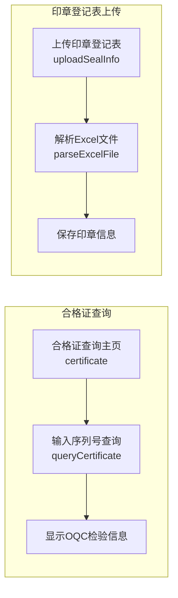
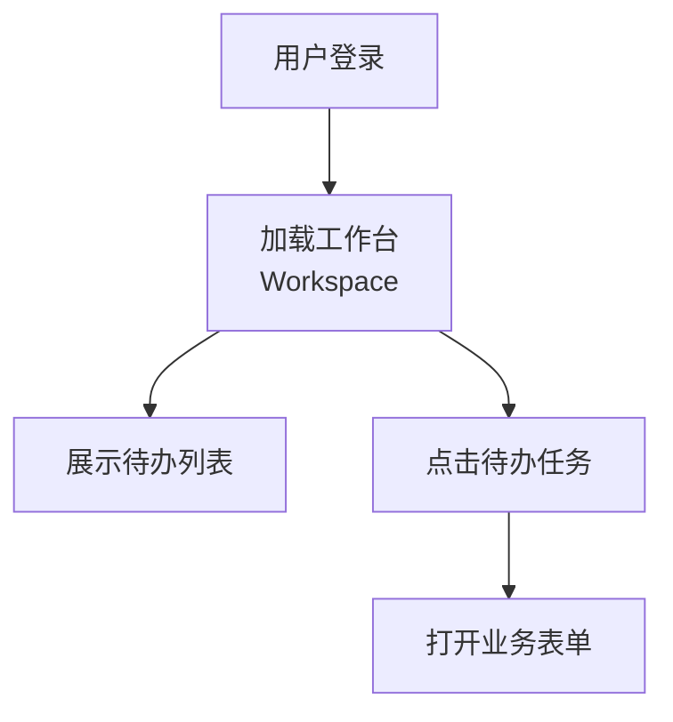
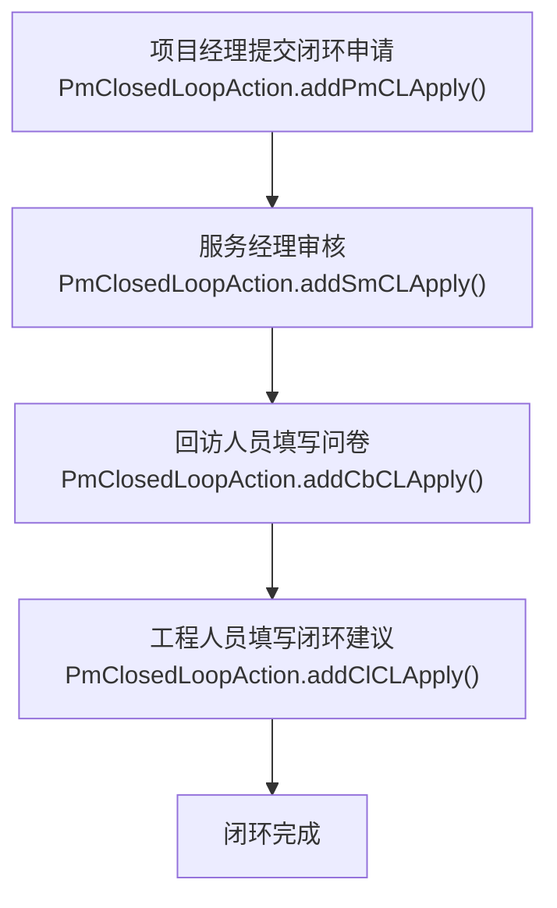
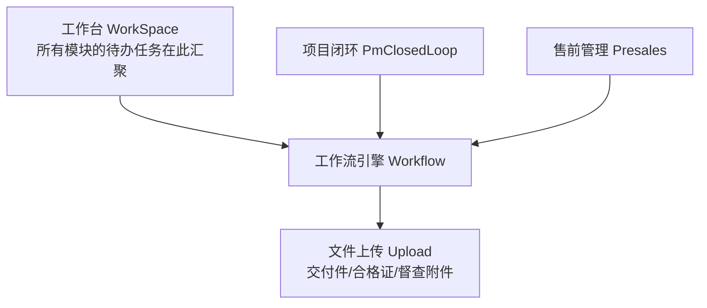

# 其他辅助模块功能说明文档

## 1. 模块概述

辅助模块为PMS系统提供各类支撑性功能，包括合格证查询与上传、项目督查管理、文件上传下载、工作台（用户首页）、项目闭环管理等。这些模块虽非核心业务流程，但为系统日常运行和用户体验提供不可或缺的基础能力。

### 涉及的Action类列表

| Action类 | 包路径 | 职责 |
|----------|--------|------|
| `CertificateAction` | `com.dp.plat.plus.certificate.action` | 合格证查询、印章登记表上传 |
| `SupervisionAction` | `com.dp.plat.supervision.action` | 项目督查记录CRUD和问卷管理 |
| `UploadAction` | `com.dp.plat.action` | 文件上传、下载、删除、富文本图片上传 |
| `WorkSpaceAction` | `com.dp.plat.action` | 工作台（待办/已办任务列表、日常跟踪、通知公告） |
| `PmClosedLoopAction` | `com.dp.plat.action` | 项目闭环管理（闭环申请/审批/回访/问卷） |

### 涉及的Service类列表

| Service类 | 依赖DAO | 说明 |
|-----------|---------|------|
| `CertificateServiceImpl` | `CertificateDao` | 合格证查询与Excel解析 |
| `ProjectService` | `ProjectDao` | 督查模块无独立Service，直接使用ProjectService |
| `BasicDataService` | `BasicDataDao` | 文件信息管理、基础数据查询 |
| `WorkSpaceService` | - | 工作台待办任务查询 |
| `PmClosedLoopService` | `PmClosedLoopDao` | 闭环流程管理 |
| `PmClosedLoopQuesnaireService` | `PmClosedLoopQuesnaireDao` | 闭环问卷模板管理 |

### 涉及的数据库表列表

| 表名 | 说明 |
|------|------|
| `mes_oqc_info` | OQC检验信息表（合格证查询数据源） |
| `pm_project_supervision` | 督查记录主表 |
| `pm_cl_quesnaire_result_header` | 问卷结果头表（督查/闭环共用） |
| `pm_cl_quesnaire_result_line` | 问卷结果行表（督查/闭环共用） |
| `pm_cl_evaluation_header` | 闭环评价头表 |
| `pm_cl_closed_loop_quesnaire` | 闭环问卷模板表 |
| `fnd_files` | 文件信息表 |
| `fnd_mails` | 邮件记录表 |

### 依赖的其他模块

- 系统管理模块（用户信息、基础数据）
- 工作流模块（闭环审批流程）
- 项目管理模块（项目信息关联）

---

## 2. 合格证查询模块（Certificate）

### 2.1 模块概述

合格证查询模块管理产品合格证信息的查询与印章登记表上传，支持按设备序列号查询OQC检验信息，并支持批量上传印章登记表Excel文件。

### 2.2 业务流程



### 2.3 接口文档

#### 2.3.1 合格证查询主页

| 项目 | 说明 |
|------|------|
| URL | /module/certificate.action |
| HTTP方法 | GET |
| 功能描述 | 合格证查询主页，显示查询表单 |
| 权限要求 | 已登录用户 |

**返回结果**：SUCCESS → /certificate/index.jsp

**处理逻辑**：判断用户是否有上传权限（角色ID=1），设置canUpload标志。

#### 2.3.2 查询合格证

| 项目 | 说明 |
|------|------|
| URL | /module/sub/queryCertificate.action |
| HTTP方法 | GET |
| 功能描述 | 根据设备序列号查询OQC检验信息 |
| 权限要求 | 已登录用户 |

**输入参数**：

| 参数名 | 类型 | 必填 | 校验规则 | 默认值 | 业务含义 |
|--------|------|------|----------|--------|----------|
| barcode | String | 是 | 非空 | 无 | 设备序列号 |

**返回结果**：

| result名 | 类型 | 跳转页面 | 说明 |
|----------|------|----------|------|
| SUCCESS | String | /certificate/show.jsp | 查询成功（含results: oqcNo, productionDate） |
| SUCCESS | String | /certificate/show.jsp | 查询无结果（含errmsg） |

**处理逻辑**：
1. 校验序列号非空
2. 查询OQC信息 → `certificateService.queryOQCInfo(barcode)`
3. 从OQC信息的info字段提取检验编号（正则匹配数字）
4. 根据序列号生成生产日期（序列号第10-12位解析年月）
5. 返回oqcNo和productionDate

#### 2.3.3 上传印章登记表

| 项目 | 说明 |
|------|------|
| URL | /module/uploadSealInfo.action |
| HTTP方法 | POST（multipart/form-data） |
| 功能描述 | 上传印章登记表Excel文件并解析 |
| 权限要求 | 已登录用户（角色ID=1） |

**输入参数**：

| 参数名 | 类型 | 必填 | 校验规则 | 默认值 | 业务含义 |
|--------|------|------|----------|--------|----------|
| file | File | 是 | 非空 | 无 | Excel文件 |

**返回结果**：

| result名 | 类型 | 跳转页面 | 说明 |
|----------|------|----------|------|
| SUCCESS | String | 重定向到certificate.action | 上传成功 |
| ERROR | String | /error.jsp | 解析失败 |

### 2.4 Service层详解

#### CertificateServiceImpl.queryOQCInfo(String)

- **功能描述**：根据序列号查询OQC检验信息
- **调用的DAO方法**：`certificateDao.queryOQCInfo()`

#### CertificateServiceImpl.parseExcelFile(File)

- **功能描述**：解析印章登记表Excel文件
- **调用的DAO方法**：`certificateDao.parseExcelFile()`

### 2.5 数据操作

| 表名 | CREATE | READ | UPDATE | DELETE |
|------|--------|------|--------|--------|
| mes_oqc_info | - | queryOQCInfo | - | - |

### 2.6 业务规则

| 规则编号 | 规则描述 | 触发条件 | 执行逻辑 |
|----------|----------|----------|----------|
| CT-001 | 生产日期解析 | 查询合格证时 | 从序列号第10-12位解析：第10-11位为年份，第12位为月份（16进制） |
| CT-002 | OQC编号提取 | 查询合格证时 | 从OQC信息的info字段中正则提取第一个数字序列 |
| CT-003 | 上传权限控制 | 进入主页时 | 角色ID=1的用户才有上传权限 |

### 2.7 配置项

| 配置项 | 配置Key | 默认值 | 说明 |
|--------|---------|--------|------|
| 上传权限角色 | 硬编码 | 1 | 角色ID=1有上传权限 |

---

## 3. 项目督查模块（Supervision）

### 3.1 模块概述

项目督查模块管理项目督查记录和督查问卷，支持督查人员对项目执行过程进行监督检查，记录督查结果和问题，并通过问卷形式收集项目质量反馈。督查模块无独立Service，直接使用ProjectService处理数据操作。

### 3.2 业务流程

```mermaid
flowchart LR
    A["督查列表<br/>execute()"] --> B["创建督查<br/>create()"]
    B --> C["填写督查问卷"]
    C --> D["保存督查记录<br/>redirect"]
    D --> E["督查列表"]
    E --> F["删除督查<br/>delete()"]

### 3.3 接口文档

#### 3.3.1 督查列表查询

| 项目 | 说明 |
|------|------|
| URL | /module/supervision_execute.action |
| HTTP方法 | GET |
| 功能描述 | 督查记录列表页，支持分页查询与筛选 |
| 权限要求 | 项目经理/服务经理/管理员/工程管理部/回访员/区域负责人/项目管理员/项目查看者 |

**输入参数**：

| 参数名 | 类型 | 必填 | 校验规则 | 默认值 | 业务含义 |
|--------|------|------|----------|--------|----------|
| displayParam | DisplayParam | 否 | - | 默认分页 | 分页参数 |
| projectSupervision.projectName | String | 否 | - | 无 | 项目名称筛选 |
| projectSupervision.officeCode | String | 否 | - | 无 | 办事处筛选 |
| projectSupervision.projectId | Integer | 否 | - | 无 | 关联项目ID |

**返回结果**：

| result名 | 类型 | 跳转页面 | 说明 |
|----------|------|----------|------|
| SUCCESS | String | /sys/supervision/supervision_execute.jsp | 查询成功 |
| ERROR | String | /sys/error.jsp | 权限不足 |

#### 3.3.2 创建/编辑督查记录

| 项目 | 说明 |
|------|------|
| URL | /module/sub/supervision_createProjectSupervision.action |
| HTTP方法 | GET(进入创建页) / POST(提交) |
| 功能描述 | 创建或编辑督查记录，支持问卷填写 |
| 权限要求 | 管理员/工程管理部/项目管理员/服务经理(区域权限)/项目经理(区域权限)/项目相关人员 |

**输入参数**：

| 参数名 | 类型 | 必填 | 校验规则 | 默认值 | 业务含义 |
|--------|------|------|----------|--------|----------|
| project.projectId | int | 是 | 非空 | 无 | 关联项目ID |
| projectSupervision.id | Integer | 否 | - | 无 | 督查ID（编辑时传入） |
| projectSupervision.type | String | 否 | - | 无 | 任务性质 |
| projectSupervision.channel | String | 否 | - | 无 | 代理商/服务商 |
| projectSupervision.processTime | Date | 否 | - | 无 | 处理时间 |
| projectSupervision.remark | String | 否 | - | 无 | 备注 |
| pmClosedLoopQuesnaire | PmClosedLoopQuesnaire | 否 | - | 无 | 问卷模板 |
| pmClQuesnaireResultHeader | PmClQuesnaireResultHeader | 否 | - | 无 | 问卷结果头 |
| pmClQuesnaireResultLineList | List | 否 | - | 无 | 问卷结果行列表 |

**返回结果**：

| result名 | 类型 | 跳转页面 | 说明 |
|----------|------|----------|------|
| SUCCESS | String | /sys/supervision/sub/createProjectSupervision.jsp | 进入创建/编辑页面 |
| redirect | String | /sys/sub/redirect.jsp | 保存成功 |
| ERROR | String | /sys/sub/error.jsp | 权限不足或非法操作 |

**处理逻辑**：
1. 校验关联项目存在且用户有权限
2. 若projectSupervision.projectId为空（进入创建页面）：
   - 加载问卷模板（quesType="projectSupervision"）
   - 加载督查类型列表
3. 若projectSupervision.projectId不为空（提交表单）：
   - 处理问卷提交（status=1时计算分数）
   - 设置项目关联信息
   - 保存督查记录 → `projectService.insertOrUpdateProjectSupervision()`

#### 3.3.3 删除督查记录

| 项目 | 说明 |
|------|------|
| URL | /ajax/supervisionAjax_deleteProjectSupervision.action |
| HTTP方法 | POST |
| 功能描述 | 逻辑删除督查记录（设置isDelete=true） |
| 返回格式 | JSON |

**输入参数**：

| 参数名 | 类型 | 必填 | 校验规则 | 默认值 | 业务含义 |
|--------|------|------|----------|--------|----------|
| projectSupervision.id | Integer | 是 | 非空 | 无 | 督查ID |

**返回结果**：JSON `{ result: "success"/"error", message: 错误信息 }`

**删除权限**：仅创建人本人或工程管理部/工程管理部负责人可删除，且督查状态必须为未完成(state=false)。

#### 3.3.4 查询权限用户

| 项目 | 说明 |
|------|------|
| URL | /ajax/supervisionAjax_queryPowerUser.action |
| HTTP方法 | GET |
| 功能描述 | 查询有权限的服务经理和项目经理列表 |
| 返回格式 | JSON |

**返回结果**：JSON格式的用户列表（服务经理+项目经理，去重）

### 3.4 Service层详解

督查模块无独立Service类，所有业务逻辑通过Action直接调用ProjectService实现。

#### ProjectService.insertOrUpdateProjectSupervision(ProjectSupervisionVO)

- **功能描述**：新增或更新督查记录
- **调用的DAO方法**：`projectDao.insertProjectSupervision()` / `projectDao.updateProjectSupervision()`

#### ProjectService.selectProjectSupervisionMapList(ProjectSupervisionVO, DisplayParam)

- **功能描述**：分页查询督查记录列表（Map形式返回）
- **调用的DAO方法**：`projectDao.selectProjectSupervisionMapList()`, `projectDao.countProjectSupervisionList()`

#### ProjectService.selectProjectSupervisionById(int)

- **功能描述**：根据ID查询督查记录详情
- **调用的DAO方法**：`projectDao.selectProjectSupervisionById()`

### 3.5 数据操作

| 表名 | CREATE | READ | UPDATE | DELETE |
|------|--------|------|--------|--------|
| pm_project_supervision | insertProjectSupervision | selectProjectSupervisionById / selectProjectSupervisionMapList | updateProjectSupervision | 逻辑删除(isDelete=true) |
| pm_cl_quesnaire_result_header | addPmClQuesResultHeader | - | - | - |
| pm_cl_quesnaire_result_line | addPmClQuesResultLineList | - | - | - |

### 3.6 业务规则

| 规则编号 | 规则描述 | 触发条件 | 执行逻辑 |
|----------|----------|----------|----------|
| SV-001 | 督查记录关联项目 | 创建督查时 | 必须关联有效售后项目 |
| SV-002 | 督查删除权限 | 删除督查时 | 仅创建人或工程管理部可删除，且state必须为false |
| SV-003 | 问卷模板加载 | 进入创建页面时 | 加载quesType="projectSupervision"的问卷 |
| SV-004 | 问卷提交评分 | 提交问卷时(status=1) | 通过QuestionnarieUtil.queryQuesnaireScore()计算分数 |
| SV-005 | 数据权限过滤 | 查询督查列表时 | 非管理员/工程管理部/回访员/项目管理员设置areaPower和userPower |

### 3.7 配置项

| 配置项 | 配置Key | 默认值 | 说明 |
|--------|---------|--------|------|
| 问卷类型 | 硬编码 | projectSupervision | 督查问卷模板的quesType |
| 督查类型基础数据 | dataTypeCode=supervisionType | - | 督查任务性质的基础数据类型编码 |

---

## 4. 文件上传模块（Upload）

### 4.1 模块概述

文件上传模块提供统一的文件上传与下载能力，支持多文件上传、文件类型校验、文件大小限制等功能。被交付件、合格证、督查附件等模块调用。

### 4.2 业务流程

```mermaid
graph LR
    A["选择文件<br/>browser"] --> B["保存文件到磁盘<br/>disk"]
    B --> C["记录数据库<br/>fnd_files"]
    C --> D["返回文件IDs"]
```

### 4.3 接口文档

#### 4.3.1 文件上传

| 项目 | 说明 |
|------|------|
| URL | /module/sub/upload.action |
| HTTP方法 | POST（multipart/form-data） |
| 功能描述 | 上传文件，保存到磁盘并记录数据库 |
| 权限要求 | 已登录用户 |

**输入参数**：

| 参数名 | 类型 | 必填 | 校验规则 | 默认值 | 业务含义 |
|--------|------|------|----------|--------|----------|
| upload | File[] | 是 | 非空 | 无 | 上传文件数组 |
| uploadFileName | String | 是 | - | 无 | 文件名 |
| uploadFileType | String | 否 | - | 无 | 文件类型 |

**返回结果**：

| result名 | 类型 | 跳转页面 | 说明 |
|----------|------|----------|------|
| SUCCESS | String | /sys/success.jsp | 上传成功（fileIds为文件ID列表） |
| INPUT | String | /sys/file/upload.jsp | 未选择文件 |

#### 4.3.2 文件下载

| 项目 | 说明 |
|------|------|
| URL | /module/download.action |
| HTTP方法 | GET |
| 功能描述 | 下载文件 |
| 权限要求 | 已登录用户 |

**输入参数**：

| 参数名 | 类型 | 必填 | 校验规则 | 默认值 | 业务含义 |
|--------|------|------|----------|--------|----------|
| fileId | int | 是 | 非空 | 无 | 文件ID |

**返回结果**：SUCCESS → 文件流（Stream结果类型） / ERROR → 错误页

#### 4.3.3 文件删除

| 项目 | 说明 |
|------|------|
| URL | /ajax/deleteFile.action |
| HTTP方法 | POST |
| 功能描述 | 删除文件记录 |
| 返回格式 | JSON |

**输入参数**：

| 参数名 | 类型 | 必填 | 校验规则 | 默认值 | 业务含义 |
|--------|------|------|----------|--------|----------|
| fileId | int | 是 | 非空 | 无 | 文件ID |

**返回结果**：JSON `{ message: "删除成功!"/"删除失败!" }`

#### 4.3.4 查询文件列表

| 项目 | 说明 |
|------|------|
| URL | /ajax/queryFile.action |
| HTTP方法 | GET |
| 功能描述 | 根据文件ID列表查询文件信息 |

**输入参数**：

| 参数名 | 类型 | 必填 | 校验规则 | 默认值 | 业务含义 |
|--------|------|------|----------|--------|----------|
| fileIds | String | 是 | 非空 | 无 | 文件ID列表(逗号分隔) |

**返回结果**：SUCCESS → fileList / ERROR → 错误页

#### 4.3.5 富文本图片上传

| 项目 | 说明 |
|------|------|
| URL | /ajax/uploadImage.action |
| HTTP方法 | POST（multipart/form-data） |
| 功能描述 | 上传富文本编辑器图片（MD5去重） |
| 返回格式 | JSON |

**输入参数**：

| 参数名 | 类型 | 必填 | 校验规则 | 默认值 | 业务含义 |
|--------|------|------|----------|--------|----------|
| upload | File[] | 是 | 非空 | 无 | 图片文件 |
| uploadFileName | String | 是 | - | 无 | 文件名 |

**返回结果**：JSON `{ message: "完整URL路径;URL路径2;..." }`

### 4.4 Service层详解

#### BasicDataServiceImpl.insertFileInfo(String, String)

- **功能描述**：插入文件信息，返回文件ID列表
- **调用的DAO方法**：`basicDataDao.insertFileInfo()`

#### BasicDataServiceImpl.deleteFile(int)

- **功能描述**：删除文件记录
- **调用的DAO方法**：`basicDataDao.deleteFile()`

#### BasicDataServiceImpl.queryFileInfo(int)

- **功能描述**：查询文件信息
- **调用的DAO方法**：`basicDataDao.queryFileInfo()`

#### BasicDataServiceImpl.queryFileList(String)

- **功能描述**：根据文件ID列表查询文件信息
- **调用的DAO方法**：`basicDataDao.queryFileList()`

### 4.5 数据操作

| 表名 | CREATE | READ | UPDATE | DELETE |
|------|--------|------|--------|--------|
| fnd_files | insertFileInfo | queryFileInfo / queryFileList | - | deleteFile |

### 4.6 业务规则

| 规则编号 | 规则描述 | 触发条件 | 执行逻辑 |
|----------|----------|----------|----------|
| UP-001 | 文件命名规则 | 上传文件时 | 随机数 + 原始扩展名 |
| UP-002 | 富文本图片MD5去重 | 上传图片时 | 相同MD5的图片不重复存储 |
| UP-003 | 文件存储路径 | 保存文件时 | UPLOAD_PATH/file/随机数/ |

### 4.7 配置项

| 配置项 | 配置Key | 默认值 | 说明 |
|--------|---------|--------|------|
| 文件上传路径 | UploadFileUtil.UPLOAD_PATH | - | 文件存储根路径 |
| 富文本图片路径 | UPLOAD_PATH/file/images | - | 富文本编辑器图片存储目录 |

---

## 5. 工作台模块（WorkSpace）

### 5.1 模块概述

工作台模块是用户登录后的首页，提供日常项目跟踪、业务流程待办、通知公告、已办任务、技术公告、项目转包任务等功能。用户可在工作台快速查看和处理待办事项，导航到各业务模块。

### 5.2 业务流程



### 5.3 接口文档

#### 5.3.1 工作台主页

| 项目 | 说明 |
|------|------|
| URL | /module/Workspace.action |
| HTTP方法 | GET |
| 功能描述 | 工作台主页，加载日常项目跟踪列表 |
| 权限要求 | 已登录用户 |

**返回结果**：SUCCESS → /work/workspacelist.jsp

**处理逻辑**：
1. prepare()预加载办事处列表、选项卡列表，根据用户角色过滤选项卡
2. 默认显示日常项目跟踪 → `workspaceService.queryPmTaskList()`

#### 5.3.2 业务流程待办

| 项目 | 说明 |
|------|------|
| URL | /module/Workspace!task.action |
| HTTP方法 | GET |
| 功能描述 | 业务流程待办任务列表，合并展示多种流程类型 |
| 权限要求 | 已登录用户 |

**输入参数**：

| 参数名 | 类型 | 必填 | 校验规则 | 默认值 | 业务含义 |
|--------|------|------|----------|--------|----------|
| queryParams.procKey | String | 否 | - | 全部 | 流程类型过滤 |

**返回结果**：SUCCESS → /work/workspacelist.jsp

**待办任务来源**：

| procKey | 来源 | 说明 |
|---------|------|------|
| PmClosedLoop | workspaceService.queryPmCLTaskList() | 闭环流程待办 |
| CallBack | workspaceService.queryCallBackTaskList() | 回访申请待办 |
| ProjectBack | workspaceService.queryProjectBackTaskList() | 项目回退确认 |
| ProjectTrack | workspaceService.queryProjectTrackTaskList() | 项目不予跟踪确认 |
| ProjectSupervision | workspaceService.queryProjectSupervisionTask() | 项目督查任务（仅工程管理部） |
| Presales | workspaceService.queryPresalesTaskList() | 售前流程待办 |

#### 5.3.3 日常项目跟踪

| 项目 | 说明 |
|------|------|
| URL | /module/Workspace!dailyTask.action |
| HTTP方法 | GET |
| 功能描述 | 日常项目跟踪列表 |

**返回结果**：SUCCESS → /work/workspacelist.jsp

#### 5.3.4 通知公告

| 项目 | 说明 |
|------|------|
| URL | /module/Workspace!notice.action |
| HTTP方法 | GET |
| 功能描述 | 系统通知公告列表 |

**返回结果**：SUCCESS → /work/workspacelist.jsp

#### 5.3.5 已办任务

| 项目 | 说明 |
|------|------|
| URL | /module/Workspace!hisselftask.action |
| HTTP方法 | GET |
| 功能描述 | 查看自己已办理的任务 |
| 权限要求 | 回访员角色 |

**返回结果**：SUCCESS → /work/workspacelist.jsp

#### 5.3.6 技术公告

| 项目 | 说明 |
|------|------|
| URL | /module/Workspace!probTask.action |
| HTTP方法 | GET |
| 功能描述 | 技术公告待办任务 |
| 权限要求 | 问题管理员/技术支持/研发角色 |

**返回结果**：SUCCESS → /work/workspacelist.jsp

#### 5.3.7 项目转包任务

| 项目 | 说明 |
|------|------|
| URL | /module/Workspace!subcontractTask.action |
| HTTP方法 | GET |
| 功能描述 | 项目转包待办任务 |
| 权限要求 | 工程管理部/服务经理/区域负责人/财务人员 |

**返回结果**：SUCCESS → /work/workspacelist.jsp

### 5.4 选项卡权限控制

| 选项卡ID | 选项卡名称 | 可见角色 |
|----------|----------|----------|
| dailyTask | 日常项目跟踪 | 所有用户 |
| task | 业务流程办理 | 所有用户 |
| notice | 通知 | 所有用户 |
| hisselftask | 已办任务 | 仅回访员(ROLE_CALLBACKPER) |
| probTask | 技术公告 | 仅问题管理员/技术支持/研发 |
| subcontractTask | 项目转包 | 工程管理部/服务经理/区域负责人/财务人员 |

### 5.5 业务规则

| 规则编号 | 规则描述 | 触发条件 | 执行逻辑 |
|----------|----------|----------|----------|
| WS-001 | 选项卡权限过滤 | 加载工作台时 | 根据用户角色动态过滤可见选项卡 |
| WS-002 | 待办任务合并展示 | 查看业务流程待办时 | 合并闭环、回访、项目回退、项目跟踪、督查、售前等多种待办 |
| WS-003 | 督查任务权限 | 查看督查待办时 | 仅工程管理部/工程管理部负责人可见 |

---

## 6. 项目闭环管理模块（PmClosedLoop）

### 6.1 模块概述

项目闭环管理模块管理项目从执行到验收的闭环流程，支持闭环申请、服务经理审核、回访问卷填写、工程人员闭环建议、闭环审批等功能。模块通过Activiti工作流驱动闭环审批流程，并集成回访问卷收集客户满意度反馈。

### 6.2 业务流程



### 6.3 闭环流程状态（pmClosedLoopResultType）

| 值 | 含义 | 说明 |
|----|------|------|
| 0 | 查看模式 | 显示流程状态和流程图 |
| 30 | 回访人员选择问卷 | 回访人员选择问卷模板 |
| 40 | 回访人员提交问卷结果 | 闭环建议问卷填写 |
| 41 | 回访人员保存问卷草稿 | 保存草稿不提交 |
| 42 | 回访人员提交问卷 | 提交问卷并计算分数 |
| 50 | 工程人员填写问题 | 工程人员填写闭环建议 |
| 51 | 工程人员提交问题 | 工程人员提交闭环建议 |

### 6.4 接口文档

| URL | 方法 | 说明 |
|-----|------|------|
| /module/PmClosedLoop.action | GET | 闭环管理主页（查看模式） |
| /module/PmClosedLoop_addPmCLApply.action | POST | 项目经理提交闭环申请 |
| /module/PmClosedLoop_addSmCLApply.action | POST | 服务经理审核闭环 |
| /module/PmClosedLoop_addCbCLApply.action | POST | 回访人员填写/提交问卷 |
| /module/PmClosedLoop_cantCB.action | POST | 回访人员无法回访 |
| /module/PmClosedLoop_addClCLApply.action | POST | 工程人员填写/提交闭环建议 |
| /module/PmClosedLoop_pmSeeCbCl.action | GET | 查看回访/闭环问卷结果 |
| /module/sub/PmClosedLoopSub_* | GET/POST | 闭环子页面操作 |
| /ajax/pmCLoopAjax_* | GET/POST | 闭环AJAX请求 |

### 6.5 闭环评价类型（PmClosedLoopConstant）

| 常量 | 值 | 含义 |
|------|-----|------|
| CL_EVALU_TYPE_PM | - | 项目经理申请 |
| CL_EVALU_TYPE_CB | - | 回访人员评价 |
| CL_EVALU_TYPE_CL | - | 工程人员闭环建议 |

### 6.6 闭环评价结果

| 常量 | 值 | 含义 |
|------|-----|------|
| CL_EVALU_RESULT_AGREE | 1 | 同意/通过 |
| CL_EVALU_RESULT_REJECT | -1 | 驳回 |
| CL_EVALU_RESULT_CANTCB | - | 无法回访 |

### 6.7 问卷评分规则

问卷评分通过PmClosedLoopMarkFactory根据markIndexs配置动态加载评分规则。评分结果：
- quesMarkResult=1：通过
- quesMarkResult=-1：不通过（有关键项不达标）

### 6.8 权限控制

| 操作 | 权限要求 |
|------|----------|
| 查看闭环详情 | 项目经理(PM)或服务经理(SM)或回访员(CB)或工程管理部(CL)或管理员 |
| 提交闭环申请 | 项目经理(PM)且为项目指定PM |
| 服务经理审核 | 服务经理(SM)且为项目指定SM |
| 回访问卷 | 回访员(CB)角色 |
| 无法回访 | 回访员(CB)角色 |
| 闭环建议 | 工程管理部(CL)角色 |

---

## 7. 模块间依赖关系


