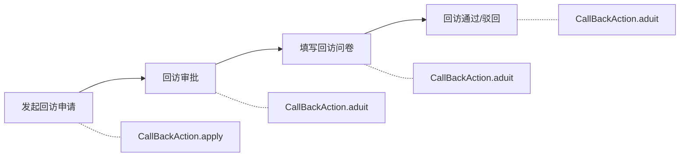
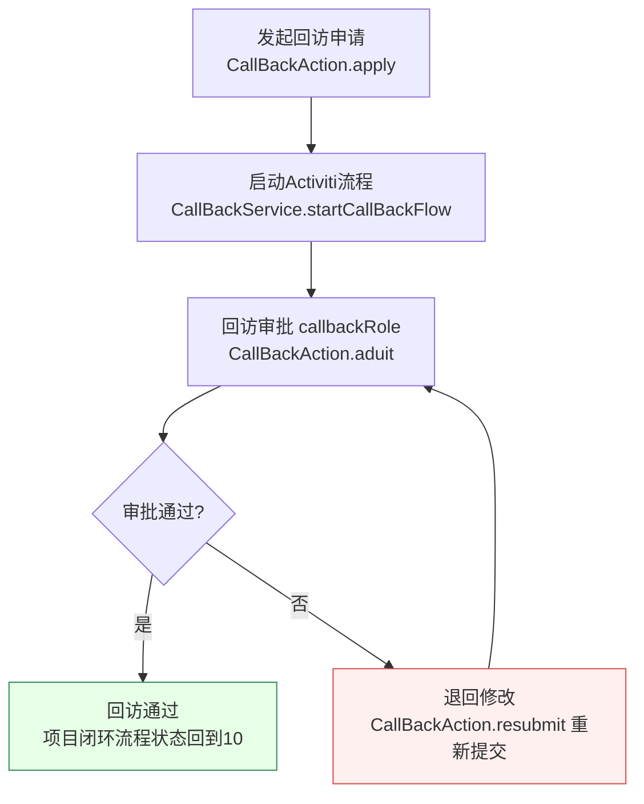
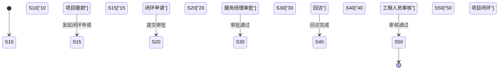
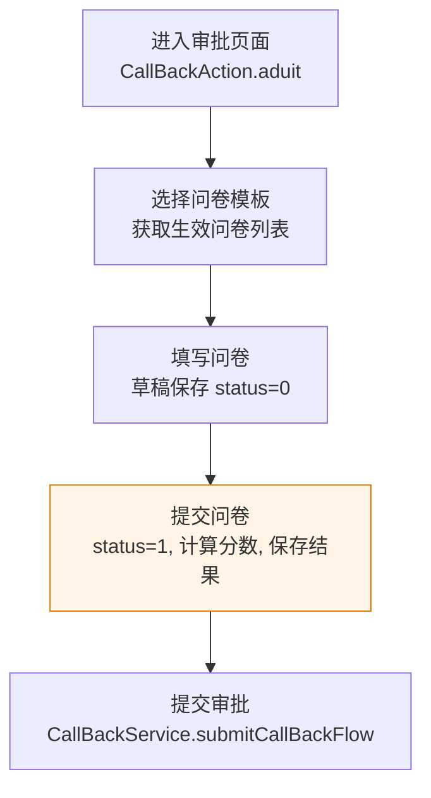

# 回访管理功能说明文档

## 1. 模块概述

回访管理模块负责项目交付后的客户回访流程管理，包括回访申请发起、回访问卷填写与提交、回访审批流程。该模块与项目闭环管理紧密关联，回访是项目闭环流程的重要环节。回访通过Activiti工作流驱动审批流程，支持回访问卷模板选择、问卷草稿保存与提交、问卷评分计算等功能。

### 涉及的Action类列表

| Action类 | 包路径 | 职责 |
|----------|--------|------|
| `CallBackAction` | `com.dp.plat.action` | 回访流程管理（申请/查看/审批/问卷/重新提交） |

### 涉及的Service类列表

| Service类 | 依赖DAO | 依赖Service |
|-----------|---------|-------------|
| `CallBackServiceImpl` | `CallBackDao`, `PmClosedLoopDao` | `WorkFlowService`, `ProjectService`, `PmClosedLoopService` |

### 涉及的数据库表列表

| 表名 | 说明 |
|------|------|
| `pm_cl_callback` | 回访申请主表 |
| `pm_cl_callback_quesnaire` | 回访问卷关联表 |
| `pm_cl_quesnaire_result_header` | 问卷结果头表（与闭环模块共用） |
| `pm_cl_quesnaire_result_line` | 问卷结果行表（与闭环模块共用） |
| `pm_cl_evaluation_header` | 评价头表 |
| `fnd_act_hi_comment` | 自定义审批意见表 |
| `fnd_basic_data` | 基础数据表 |
| `fnd_user_info` | 用户信息表 |

### 依赖的其他模块

- 项目管理模块（项目信息、项目成员、项目闭环流程状态）
- 闭环管理模块（问卷模板、问卷评分）
- 工作流模块（Activiti审批流程）
- 系统管理模块（用户信息、基础数据）

## 2. 业务流程

### 2.1 回访管理流程

### 2.2 回访审批流程

### 2.3 回访与闭环流程状态关联

回访流程与项目闭环流程状态（`closeProcessState`）紧密关联：

> **闭环状态码**：`10`项目跟踪 → `15`闭环申请 → `20`服务经理审批 → `30`回访 → `40`工程人员审核 → `50`项目闭环。

### 2.4 回访问卷流程

## 3. 接口文档

### 3.1 发起回访申请

| 项目 | 说明 |
|------|------|
| URL | /module/sub/callback_input.action |
| HTTP方法 | GET |
| 功能描述 | 进入回访申请页面 |
| 权限要求 | 已登录用户 |

**输入参数**：

| 参数名 | 类型 | 必填 | 校验规则 | 默认值 | 业务含义 |
|--------|------|------|----------|--------|----------|
| project.projectId | int | 是 | 非空 | 无 | 关联项目ID |

**返回结果**：

| result名 | 类型 | 跳转页面 | 说明 |
|----------|------|----------|------|
| input | String | /sys/callback/callback_input.jsp | 进入申请页面 |

**处理逻辑**：
1. 获取项目信息 → `projectService.queryProjectById()`
2. 获取项目成员列表 → `projectService.queryProjectMembers()`

### 3.2 提交回访申请

| 项目 | 说明 |
|------|------|
| URL | /module/sub/callback_apply.action |
| HTTP方法 | POST |
| 功能描述 | 提交回访申请并启动审批流程 |
| 权限要求 | 已登录用户 |

**输入参数**：

| 参数名 | 类型 | 必填 | 校验规则 | 默认值 | 业务含义 |
|--------|------|------|----------|--------|----------|
| callBack.projectId | int | 是 | 非空 | 无 | 关联项目ID |
| callBack.remark | String | 否 | - | 无 | 回访备注 |

**返回结果**：

| result名 | 类型 | 跳转页面 | 说明 |
|----------|------|----------|------|
| success | String | /sys/sub/addsuccess.jsp | 提交成功，重定向到项目详情 |
| error | String | /sys/error.jsp | 提交失败 |

**处理逻辑**：
1. 启动回访流程 → `callBackService.startCallBackFlow()`
2. 重定向到项目详情页

### 3.3 查看回访详情

| 项目 | 说明 |
|------|------|
| URL | /module/sub/callback_read.action |
| HTTP方法 | GET |
| 功能描述 | 查看回访详细信息 |
| 权限要求 | 已登录用户 |

**输入参数**：

| 参数名 | 类型 | 必填 | 校验规则 | 默认值 | 业务含义 |
|--------|------|------|----------|--------|----------|
| callBack.callBackId | int | 是 | 非空 | 无 | 回访ID |
| callBack.taskId | String | 否 | - | 无 | 当前任务ID |

**返回结果**：

| result名 | 类型 | 跳转页面 | 说明 |
|----------|------|----------|------|
| read | String | /sys/callback/callback_read.jsp | 查看成功 |

**处理逻辑**：
1. 获取项目信息和成员列表
2. 获取回访流程信息 → `callBackService.queryCallBackById()`
3. 获取审批意见列表 → `callBackService.queryCallBackComment()`

### 3.4 回访审批/问卷填写

| 项目 | 说明 |
|------|------|
| URL | /module/sub/callback_aduit.action |
| HTTP方法 | GET(进入审批页) / POST(提交问卷或审批) |
| 功能描述 | 回访审批与问卷填写（合并页面） |
| 权限要求 | 当前审批节点审批人 |

**输入参数**：

| 参数名 | 类型 | 必填 | 校验规则 | 默认值 | 业务含义 |
|--------|------|------|----------|--------|----------|
| callBack.callBackId | int | 是 | 非空 | 无 | 回访ID |
| callBack.projectId | int | 是 | 非空 | 无 | 关联项目ID |
| callBack.taskId | String | 否 | - | 无 | 当前任务ID |
| pmClQuesnaireResultHeader | PmClQuesnaireResultHeader | 否 | - | 无 | 问卷结果头(提交问卷时) |
| pmClQuesnaireResultLineList | List | 否 | - | 无 | 问卷结果行列表(提交问卷时) |
| param.instId | String | 否 | - | 无 | 流程实例ID(提交审批时) |
| param.outcome | String | 否 | - | 无 | 审批结果(提交审批时) |
| param.comment | String | 否 | - | 无 | 审批意见(提交审批时) |

**返回结果**：

| result名 | 类型 | 跳转页面 | 说明 |
|----------|------|----------|------|
| aduit | String | /sys/callback/callback_aduit.jsp | 进入审批页面 |
| success | String | /sys/sub/addsuccess.jsp | 问卷提交或审批成功 |

**处理逻辑**：
1. 若有问卷提交(pmClQuesnaireResultHeader.status != 0)：
   - 计算问卷分数
   - 保存问卷 → `callBackService.insertCallBackQuesnaire()`
   - 若问卷状态非1(非已提交)，返回成功
2. 若有审批提交(param.instId != null)：
   - 提交审批 → `callBackService.submitCallBackFlow()`
   - 返回成功
3. 否则进入审批页面：
   - 获取项目信息和成员列表
   - 获取回访流程信息
   - 获取生效的问卷模板列表
   - 若有已填写的问卷，获取问卷内容

### 3.5 重新提交回访申请

| 项目 | 说明 |
|------|------|
| URL | /module/sub/callback_resubmit.action |
| HTTP方法 | GET(进入重新提交页) / POST(提交) |
| 功能描述 | 驳回后重新提交回访申请 |
| 权限要求 | 申请人 |

**输入参数**：

| 参数名 | 类型 | 必填 | 校验规则 | 默认值 | 业务含义 |
|--------|------|------|----------|--------|----------|
| callBack.callBackId | int | 是 | 非空 | 无 | 回访ID |
| callBack.projectId | int | 是 | 非空 | 无 | 关联项目ID |
| callBack.taskId | String | 否 | - | 无 | 当前任务ID |
| param.instId | String | 否(进入页面时) / 是(提交时) | 非空 | 无 | 流程实例ID |
| param.outcome | String | 否(进入页面时) / 是(提交时) | 非空 | 无 | 审批结果 |
| param.comment | String | 否 | - | 无 | 审批意见 |

**返回结果**：

| result名 | 类型 | 跳转页面 | 说明 |
|----------|------|----------|------|
| resubmit | String | /sys/callback/callback_resubmit.jsp | 进入重新提交页面 |
| success | String | /sys/sub/addsuccess.jsp | 重新提交成功 |

### 3.6 查看回访问卷

| 项目 | 说明 |
|------|------|
| URL | /module/sub/callback_seeQuesnaire.action |
| HTTP方法 | GET |
| 功能描述 | 查看已填写的回访问卷 |
| 权限要求 | 已登录用户 |

**输入参数**：

| 参数名 | 类型 | 必填 | 校验规则 | 默认值 | 业务含义 |
|--------|------|------|----------|--------|----------|
| quesnaireId | int | 是 | 非空 | 无 | 问卷ID |

**返回结果**：

| result名 | 类型 | 跳转页面 | 说明 |
|----------|------|----------|------|
| seeQuesnaire | String | /sys/callback/callback_seeQuesnaire.jsp | 查看问卷 |

## 4. Service层详解

### 4.1 CallBackServiceImpl.startCallBackFlow(CallBack)

- **功能描述**：启动回访流程
- **核心逻辑**：
  1. 保存回访申请内容到pm_cl_callback
  2. 启动Activiti流程，设置流程变量(programManager, callbackManager, projectId)
  3. 流程Key为CallBack.class.getSimpleName()
  4. 回写instId到pm_cl_callback，设置applyState=1(流程运行中)
  5. 办理当前任务（发起申请）
  6. 添加审批意见(COMMENT_APPLY=0)
  7. 更新项目闭环流程状态为30(回访)
- **调用的DAO方法**：`callBackDao.insertCallBack()`, `callBackDao.updateCallBackInstId()`

### 4.2 CallBackServiceImpl.submitCallBackFlow(WorkflowCommonParam, CallBack)

- **功能描述**：提交回访审批
- **核心逻辑**：
  1. 设置流程变量(callbackManager, result)
  2. 查找当前任务（先按callbackRole角色查找，再按当前用户查找）
  3. 办理流程任务
  4. 添加审批意见
  5. 更新项目闭环流程状态为10(项目跟踪)
- **调用的DAO方法**：无直接DAO调用（通过WorkFlowService操作）

### 4.3 CallBackServiceImpl.reSubmitCallBackFlow(WorkflowCommonParam, CallBack)

- **功能描述**：重新提交回访申请
- **核心逻辑**：
  1. 更新回访申请表单信息
  2. 查找当前任务（按当前用户查找）
  3. 办理流程任务，设置流程变量(result)
  4. 添加审批意见
  5. 更新项目闭环流程状态为30(回访)
- **调用的DAO方法**：`callBackDao.updateCallBack()`

### 4.4 CallBackServiceImpl.insertCallBackQuesnaire(CallBack, PmClQuesnaireResultHeader, List<PmClQuesnaireResultLine>)

- **功能描述**：保存回访问卷
- **核心逻辑**：
  1. 插入问卷结果头(evaluationHeaderId=0)
  2. 插入问卷结果行列表
  3. 查询是否已有回访问卷记录，有则更新，无则新增
- **调用的DAO方法**：`pmClosedLoopDao.addPmClQuesResultHeader()`, `pmClosedLoopDao.addPmClQuesResultLineList()`, `callBackDao.queryCallBackQuesnaireId()`, `callBackDao.updateCallBackQuesnaire()`, `callBackDao.insertCallBackQuesnaire()`

### 4.5 CallBackServiceImpl.queryCallBackById(int)

- **功能描述**：根据ID查询回访信息
- **核心逻辑**：查询pm_cl_callback表，关联pm_cl_callback_quesnaire获取最新问卷ID和任务ID
- **调用的DAO方法**：`callBackDao.queryCallBackById()`

### 4.6 CallBackServiceImpl.queryCallBackComment(int)

- **功能描述**：查询回访审批意见列表
- **核心逻辑**：查询fnd_act_hi_comment表，关联fnd_basic_data获取审批结果名称，关联fnd_user_info获取审批人姓名，关联pm_cl_callback_quesnaire获取问卷ID
- **调用的DAO方法**：`callBackDao.queryCallBackComment()`

### 4.7 其他方法

| 方法 | 功能描述 |
|------|----------|
| queryCbQuesnaire(int) | 根据ID查询回访问卷关联信息 |
| queryQuesnaireTemplateId(int) | 根据问卷ID查询问卷模板ID |
| updateCallBackApplyState(int, int) | 更新回访申请状态 |

## 5. 数据操作

### 5.1 本模块涉及的数据库表及CRUD操作

| 表名 | CREATE | READ | UPDATE | DELETE |
|------|--------|------|--------|--------|
| pm_cl_callback | insert_callback_info | query_callback_byId | update_callback_instid / update_callback_applyState / update_callback | - |
| pm_cl_callback_quesnaire | insert_callback_quesnaire | query_cb_quesnaire_version / query_callback_quesnaire / query_callbackQuesnaireId / query_is_callback | update_callback_quesnaire | - |
| pm_cl_quesnaire_result_header | pmClosedLoopDao.addPmClQuesResultHeader | query_quesnaire_template_id | update_EvaluationHeaderId_byId / update_EvaluationHeader_NextAcceptPerson | - |
| pm_cl_quesnaire_result_line | pmClosedLoopDao.addPmClQuesResultLineList | - | - | - |
| fnd_act_hi_comment | workFlowService.addSelfActComment | query_callback_comment | - | - |

### 5.2 数据校验规则

| 数据对象 | 校验字段 | 校验规则 | 说明 |
|----------|----------|----------|------|
| CallBack | projectId | 非空 | 关联项目必须指定 |
| CallBackAction | pmClQuesnaireResultHeader.status | 0=草稿, 1=已提交 | 问卷状态控制 |
| CallBackAction | param.instId | 非空(提交审批时) | 流程实例ID |

### 5.3 数据生命周期

| 数据对象 | 创建 | 修改 | 归档 | 删除 |
|----------|------|------|------|------|
| CallBack | 发起回访申请时创建 | 重新提交时更新备注 | 审批完成后applyState=2 | 不物理删除 |
| CallBackQuesnaire | 保存问卷时创建 | 问卷更新时先查后更/插 | 随回访归档 | 不删除 |
| PmClQuesnaireResultHeader | 保存问卷时创建 | 问卷更新时重新创建 | 随回访归档 | 不删除 |

### 5.4 数据转换规则

| 转换场景 | 源格式 | 目标格式 | 说明 |
|----------|--------|----------|------|
| 回访申请状态 | 数字编码 | applyState=0待提交, 1流程运行中, 2流程结束 | ActivityMessage常量 |
| 问卷状态 | 数字编码 | status=0草稿, 1已提交 | pmClQuesnaireResultHeader.status |
| 审批结果 | 数字编码 | 通过fnd_basic_data(dataTypeCode=26)关联查询中文名 | 审批意见结果 |
| 闭环流程状态 | 数字编码 | 10=项目跟踪, 30=回访等 | closeProcessState字段 |

## 6. 业务规则

| 规则编号 | 规则描述 | 触发条件 | 执行逻辑 |
|----------|----------|----------|----------|
| CB-001 | 回访流程启动 | 发起回访申请时 | 保存申请内容，启动Activiti流程(流程Key=CallBack)，更新项目闭环流程状态为30(回访) |
| CB-002 | 回访审批 | 审批人提交审批时 | 查找callbackRole角色的任务办理，更新项目闭环流程状态为10(项目跟踪) |
| CB-003 | 重新提交 | 驳回后重新提交时 | 更新申请表单，办理流程任务，更新项目闭环流程状态为30(回访) |
| CB-004 | 问卷草稿与提交 | 保存/提交问卷时 | status=0为草稿，status=1为已提交；提交时计算问卷分数 |
| CB-005 | 问卷版本管理 | 保存问卷时 | 每次保存问卷生成新版本，版本号递增；若已有同任务问卷则更新 |
| CB-006 | 问卷评分计算 | 提交问卷时 | 根据问卷模板选项计算总分，根据评分规则(markIndexs)判定通过/不通过 |
| CB-007 | 闭环流程状态联动 | 回访流程各环节 | 发起回访→状态30(回访)；审批通过/驳回→状态10(项目跟踪)；重新提交→状态30(回访) |

## 7. 配置项

| 配置项 | 配置Key | 默认值 | 说明 |
|--------|---------|--------|------|
| 回访审批流程定义 | Activiti BPMN | `CallBack` | 流程Key为CallBack.class.getSimpleName() |
| 审批角色 | 流程变量callbackManager | callbackRole | 回访审批节点的角色标识 |
| 审批意见数据类型 | dataTypeCode=26 | - | 回访审批意见结果的基础数据类型编码 |
| 问卷问题类型 | PmClosedLoopConstant.CL_QUESNAIRE_LINEID | - | 问卷问题分类的基础数据类型编码 |
| 问卷状态-草稿 | 硬编码 | 0 | pmClQuesnaireResultHeader.status=0 |
| 问卷状态-已提交 | 硬编码 | 1 | pmClQuesnaireResultHeader.status=1 |
| 申请状态-流程运行中 | ActivityMessage.FLOW_RUNING | 1 | applyState=1 |
| 申请状态-流程结束 | ActivityMessage.FLOW_PASS | 2 | applyState=2 |
