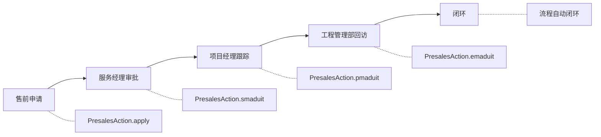
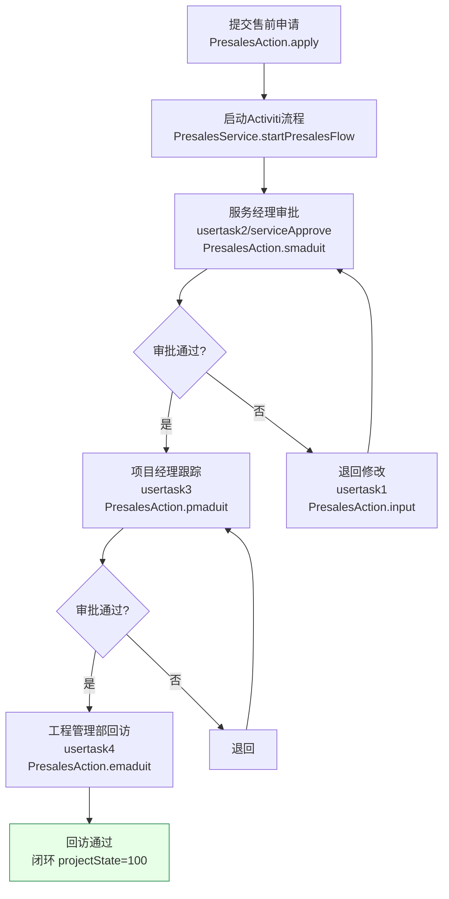
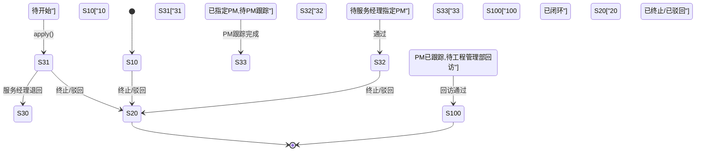

# 售前管理功能说明文档

## 1. 模块概述

售前管理模块负责售前测试的全生命周期管理，包括售前测试申请、审批、执行跟踪和回访闭环。售前测试是项目创建的前置环节，测试通过后可闭环。模块通过Activiti工作流驱动审批流程，支持回访问卷管理、发货信息查询、借转销/核销信息查询等功能。

### 涉及的Action类列表

| Action类 | 包路径 | 职责 |
|----------|--------|------|
| `PresalesAction` | `com.dp.plat.action` | 售前测试全生命周期管理（列表/申请/审批/回访/交付件/发货/导出） |

### 涉及的Service类列表

| Service类 | 依赖DAO | 依赖Service |
|-----------|---------|-------------|
| `PresalesServiceImpl` | `PresalesDao`, `PmClosedLoopDao`, `ProjectDao`, `UserManageDao` | `WorkFlowService`, `BasicDataService` |

### 涉及的数据库表列表

| 表名 | 说明 |
|------|------|
| `pm_presales_project_header` | 售前测试信息主表 |
| `pm_presales_project_product_line` | 售前测试产品明细表 |
| `pm_presales_project_callback` | 售前回访问卷关联表 |
| `pm_presales_project_duration` | 售前各阶段耗时统计表 |
| `pm_presales_project_rma_info` | 售前项目RMA信息表（退货授权数据） |
| `pm_project_member` | 项目成员表（售前与项目共用） |
| `pm_project_task` | 项目任务/工程计划表（售前与项目共用） |
| `pm_basic_deliver_detail` | 交付件明细表 |
| `fnd_department` | 部门信息表 |
| `fnd_basic_data` | 基础数据表 |
| `fnd_user_info` | 用户信息表 |
| `act_ru_task` | Activiti运行时任务表 |
| `act_hi_taskinst` | Activiti历史任务表 |
| `view_presales_project_duration` | 售前耗时统计视图 |

### 依赖的其他模块

- 系统管理模块（用户信息、部门信息、基础数据）
- 工作流模块（Activiti审批流程）
- 闭环管理模块（回访问卷模板与评分）
- 邮件服务模块（审批通知邮件）
- SMS/OA外部系统（发货信息、借货信息同步）

## 2. 业务流程

### 2.1 售前测试全生命周期流程



### 2.2 售前审批流程（Activiti 驱动）



### 2.3 售前测试状态机转换图



> **状态码速查**：`10`待开始 → `31`待SM指定PM → `32`已指定PM待PM跟踪 → `33`PM已跟踪待回访 → `100`已闭环；退回态 `30`服务经理退回；终止态 `20`已终止/驳回。

状态值说明（projectState字段，存储于`pm_presales_project_header`表）：

| 状态值 | 含义 | 对应MessageUtil常量 |
|--------|------|---------------------|
| 10 | 待开始 | PROJECT_STATE_CREATING |
| 20 | 已终止/已驳回 | PROJECT_STATE_DENY |
| 30 | 服务经理退回 | PROJECT_STATE_30 |
| 31 | 待服务经理指定项目经理 | PROJECT_STATE_31 |
| 32 | 已指定项目经理，待PM跟踪 | PROJECT_STATE_32 |
| 33 | PM已跟踪，待工程管理部回访 | PROJECT_STATE_33 |
| 100 | 已闭环 | PROJECT_STATE_CLOSEDLOOP |

### 2.4 售前回访问卷流程

```
[工程管理部回访] ──> PresalesAction.emaduit()
      |
[填写回访问卷] ──> PresalesAction.callback()
      |
[问卷草稿/提交] ──> PresalesService.insertPresalesQuesnaire()
      |
[保存到pm_presales_project_callback表]
```

## 3. 接口文档

### 3.1 售前列表查询

| 项目 | 说明 |
|------|------|
| URL | /module/presales_list.action |
| HTTP方法 | GET |
| 功能描述 | 分页查询售前测试列表，支持多条件筛选与导出 |
| 权限要求 | 已登录用户（按角色权限过滤：工程管理部/管理员看全部，服务经理看自己相关的，项目经理看自己相关的） |

**输入参数**：

| 参数名 | 类型 | 必填 | 校验规则 | 默认值 | 业务含义 |
|--------|------|------|----------|--------|----------|
| displayParam | DisplayParam | 否 | - | 默认分页(每页50条) | 分页参数 |
| presales.projectName | String | 否 | - | 无 | 项目名称模糊搜索 |
| presales.presalesCode | String | 否 | - | 无 | 项目编码精确搜索 |
| presales.projectState | String | 否 | - | 无 | 单个状态过滤 |
| presales.projectStates | String | 否 | - | 无 | 多状态过滤(逗号分隔，FIND_IN_SET) |
| presales.serviceManager | String | 否 | - | 无 | 服务经理过滤 |
| presales.projectManager | String | 否 | - | 无 | 项目经理过滤 |
| presales.officeCode | String | 否 | - | 无 | 办事处过滤 |
| presales.projectType | String | 否 | - | 无 | 项目类型过滤 |
| presales.hasTransfer | String | 否 | - | 无 | 是否有借转销 |
| presales.hasRma | String | 否 | - | 无 | 是否有退货 |

**返回结果**：

| result名 | 类型 | 跳转页面 | 说明 |
|----------|------|----------|------|
| list | String | /sys/presales/presales_list.jsp | 查询成功 |

**处理逻辑**：
1. prepareList()预加载办事处列表、项目状态列表、项目类型列表
2. 根据用户角色设置默认状态过滤
3. 若导出标记为true，查询全部数据用于导出
4. 查询售前列表 → `presalesService.queryPresalesList()`

### 3.2 发起售前流程申请

| 项目 | 说明 |
|------|------|
| URL | /module/presales_input.action |
| HTTP方法 | GET |
| 功能描述 | 进入发起售前流程申请页面（新建或重新申请） |
| 权限要求 | 工程管理部角色(ROLE_ENGINEEMANAGER)或售前专员角色(ROLE_PRESALES_STAFF) |

**输入参数**：

| 参数名 | 类型 | 必填 | 校验规则 | 默认值 | 业务含义 |
|--------|------|------|----------|--------|----------|
| presales.presalesId | int | 是 | 非空 | 无 | 售前ID |

**返回结果**：

| result名 | 类型 | 跳转页面 | 说明 |
|----------|------|----------|------|
| input | String | /sys/presales/presales_input.jsp | 进入申请表单 |
| success | String | 重定向到read页面 | 项目查看者角色跳转 |
| error | String | /sys/error.jsp | 权限不足 |

### 3.3 提交售前流程

| 项目 | 说明 |
|------|------|
| URL | /module/presales_apply.action |
| HTTP方法 | POST |
| 功能描述 | 提交售前流程申请并启动审批流程 |
| 权限要求 | 工程管理部角色或售前专员角色 |

**输入参数**：

| 参数名 | 类型 | 必填 | 校验规则 | 默认值 | 业务含义 |
|--------|------|------|----------|--------|----------|
| presales.presalesId | int | 是 | 非空 | 无 | 售前ID |
| presales.projectType | String | 否 | - | 无 | 项目分类 |
| presales.serviceManager | String | 否 | - | 无 | 服务经理 |
| presales.projectManager | String | 否 | - | 无 | 项目经理 |
| param.taskId | String | 否 | - | 无 | 任务ID(为空表示首次申请) |
| param.result | int | 是 | 非空 | 无 | 审批结果(1=通过, -1=驳回, 2=直接指定PM) |
| param.message | String | 否 | - | 无 | 审批意见 |

**返回结果**：

| result名 | 类型 | 跳转页面 | 说明 |
|----------|------|----------|------|
| success | String | /sys/presales/sub/redirect.jsp | 提交成功，重定向到列表 |
| error | String | /sys/error.jsp | 提交失败 |

**处理逻辑**：
1. 若param.taskId为空 → `presalesService.startPresalesFlow()` 首次申请
2. 若param.taskId不为空 → `presalesService.submitReApply()` 重新申请

### 3.4 查看售前详情

| 项目 | 说明 |
|------|------|
| URL | /module/presales_read.action |
| HTTP方法 | GET |
| 功能描述 | 查看售前测试详细信息 |
| 权限要求 | 已登录用户 |

**输入参数**：

| 参数名 | 类型 | 必填 | 校验规则 | 默认值 | 业务含义 |
|--------|------|------|----------|--------|----------|
| presales.presalesId | int | 是 | 非空 | 无 | 售前ID |

**返回结果**：

| result名 | 类型 | 跳转页面 | 说明 |
|----------|------|----------|------|
| read | String | /sys/presales/presales_read.jsp | 查看成功 |
| error | String | /sys/error.jsp | 查询失败 |

### 3.5 审批任务路由

| 项目 | 说明 |
|------|------|
| URL | /module/presales_aduit.action |
| HTTP方法 | GET |
| 功能描述 | 根据当前审批节点(taskDefKey)路由到对应的审批页面 |
| 权限要求 | 当前审批节点审批人 |

**输入参数**：

| 参数名 | 类型 | 必填 | 校验规则 | 默认值 | 业务含义 |
|--------|------|------|----------|--------|----------|
| presales.presalesId | int | 是 | 非空 | 无 | 售前ID |

**返回结果**：

| result名 | 类型 | 跳转页面 | 说明 |
|----------|------|----------|------|
| success | String | /sys/presales/sub/redirect.jsp | 重定向到对应审批页面 |

**路由规则**：

| taskDefKey | 重定向到 | 说明 |
|------------|----------|------|
| usertask2 / serviceApprove | presales_smaduit.action | 服务经理审批 |
| usertask3 | presales_pmaduit.action | 项目经理跟踪 |
| usertask4 | presales_emaduit.action | 工程管理部回访 |
| usertask1 | presales_input.action | 重新申请 |

### 3.6 服务经理审批

| 项目 | 说明 |
|------|------|
| URL | /module/presales_smaduit.action |
| HTTP方法 | GET(进入审批页) / POST(提交审批) |
| 功能描述 | 服务经理审批售前测试，指定项目经理 |
| 权限要求 | 服务经理角色 |

**输入参数**：

| 参数名 | 类型 | 必填 | 校验规则 | 默认值 | 业务含义 |
|--------|------|------|----------|--------|----------|
| presales.presalesId | int | 是 | 非空 | 无 | 售前ID |
| presales.projectManager | String | 否 | - | 无 | 指定的项目经理 |
| param.instId | String | 是(提交时) | 非空 | 无 | 流程实例ID |
| param.result | int | 是(提交时) | 非空 | 无 | 审批结果(1=通过, -1=驳回) |
| param.message | String | 否 | - | 无 | 审批意见 |

**返回结果**：

| result名 | 类型 | 跳转页面 | 说明 |
|----------|------|----------|------|
| smaduit | String | /sys/presales/presales_smaduit.jsp | 进入审批页面 |
| success | String | /sys/presales/sub/redirect.jsp | 审批成功 |
| error | String | /sys/error.jsp | 审批失败 |

### 3.7 项目经理跟踪

| 项目 | 说明 |
|------|------|
| URL | /module/presales_pmaduit.action |
| HTTP方法 | GET(进入审批页) / POST(提交审批) |
| 功能描述 | 项目经理跟踪售前测试项目 |
| 权限要求 | 项目经理角色 |

**输入参数**：

| 参数名 | 类型 | 必填 | 校验规则 | 默认值 | 业务含义 |
|--------|------|------|----------|--------|----------|
| presales.presalesId | int | 是 | 非空 | 无 | 售前ID |
| param.instId | String | 是(提交时) | 非空 | 无 | 流程实例ID |
| param.result | int | 是(提交时) | 非空 | 无 | 审批结果(1=通过, -1=驳回) |
| param.message | String | 否 | - | 无 | 审批意见 |

**返回结果**：

| result名 | 类型 | 跳转页面 | 说明 |
|----------|------|----------|------|
| pmaduit | String | /sys/presales/presales_pmaduit.jsp | 进入审批页面 |
| success | String | /sys/presales/sub/redirect.jsp | 审批成功 |
| error | String | /sys/error.jsp | 审批失败 |

### 3.8 工程管理部回访

| 项目 | 说明 |
|------|------|
| URL | /module/presales_emaduit.action |
| HTTP方法 | GET(进入审批页) / POST(提交审批) |
| 功能描述 | 工程管理部回访售前测试项目 |
| 权限要求 | 售前专员角色(ROLE_PRESALES_STAFF) |

**输入参数**：

| 参数名 | 类型 | 必填 | 校验规则 | 默认值 | 业务含义 |
|--------|------|------|----------|--------|----------|
| presales.presalesId | int | 是 | 非空 | 无 | 售前ID |
| presales.projectType | String | 否 | - | 无 | 项目分类 |
| param.instId | String | 是(提交时) | 非空 | 无 | 流程实例ID |
| param.result | int | 是(提交时) | 非空 | 无 | 审批结果(1=通过, -1=驳回) |
| param.message | String | 否 | - | 无 | 审批意见 |

**返回结果**：

| result名 | 类型 | 跳转页面 | 说明 |
|----------|------|----------|------|
| emaduit | String | /sys/presales/presales_emaduit.jsp | 进入审批页面 |
| success | String | /sys/presales/sub/redirect.jsp | 审批成功 |
| error | String | /sys/error.jsp | 审批失败 |

### 3.9 回访问卷

| 项目 | 说明 |
|------|------|
| URL | /module/sub/presales_callback.action |
| HTTP方法 | GET(进入问卷页) / POST(提交问卷) |
| 功能描述 | 售前测试回访问卷填写与提交 |
| 权限要求 | 工程管理部角色 |

**输入参数**：

| 参数名 | 类型 | 必填 | 校验规则 | 默认值 | 业务含义 |
|--------|------|------|----------|--------|----------|
| presales.presalesId | int | 是 | 非空 | 无 | 售前ID |
| pmClQuesnaireResultHeader | PmClQuesnaireResultHeader | 否 | - | 无 | 问卷结果头(提交时) |
| pmClQuesnaireResultLineList | List | 否 | - | 无 | 问卷结果行列表(提交时) |

**返回结果**：

| result名 | 类型 | 跳转页面 | 说明 |
|----------|------|----------|------|
| callback | String | /sys/presales/presales_callback.jsp | 进入问卷页面 |
| success | String | /sys/success.jsp | 问卷提交成功 |

### 3.10 更新项目计划完成时间

| 项目 | 说明 |
|------|------|
| URL | /ajax/updatePresalesTask.action |
| HTTP方法 | POST |
| 功能描述 | 更新售前项目计划任务的完成时间 |
| 返回格式 | JSON |

**输入参数**：

| 参数名 | 类型 | 必填 | 校验规则 | 默认值 | 业务含义 |
|--------|------|------|----------|--------|----------|
| presalesTaskId | int | 是 | 非空 | 无 | 任务ID |
| taskFinshedTime | Date | 否 | - | 无 | 完成时间 |
| remark | String | 否 | - | 无 | 备注 |

**返回结果**：JSON `{ message: "更新成功!" / "更新失败!" }`

### 3.11 终止流程直接关闭

| 项目 | 说明 |
|------|------|
| URL | /ajax/terminate2Close.action |
| HTTP方法 | POST |
| 功能描述 | 批量终止售前流程并直接关闭 |
| 返回格式 | JSON |

**输入参数**：

| 参数名 | 类型 | 必填 | 校验规则 | 默认值 | 业务含义 |
|--------|------|------|----------|--------|----------|
| presalesIds | String | 是 | 非空 | 无 | 售前ID列表(逗号分隔) |
| message | String | 否 | - | "终止流程直接关闭" | 关闭原因 |

**返回结果**：JSON `{ message: "success" / 错误信息 }`

### 3.12 查询发货信息

| 项目 | 说明 |
|------|------|
| URL | /module/sub/presales_shipmentInfo.action |
| HTTP方法 | GET |
| 功能描述 | 查询售前测试项目发货信息 |

**输入参数**：

| 参数名 | 类型 | 必填 | 校验规则 | 默认值 | 业务含义 |
|--------|------|------|----------|--------|----------|
| presalesCode | String | 是 | 非空 | 无 | 项目编码 |
| containRma | boolean | 否 | - | false | 是否包含退货设备 |

**返回结果**：

| result名 | 类型 | 跳转页面 | 说明 |
|----------|------|----------|------|
| shipmentInfo | String | /sys/presales/presales_shipmentInfo.jsp | 查询成功 |

### 3.13 查询借转销/核销/临时授权信息

| 项目 | 说明 |
|------|------|
| URL | /module/sub/presales_lend2SaleInfo.action |
| 功能描述 | 查询借转销信息 |

| 项目 | 说明 |
|------|------|
| URL | /module/sub/presales_lend2RmaInfo.action |
| 功能描述 | 查询核销信息 |

| 项目 | 说明 |
|------|------|
| URL | /module/sub/presales_tempAuthInfo.action |
| 功能描述 | 查询临时授权数据 |

### 3.14 上传工程交付件

| 项目 | 说明 |
|------|------|
| URL | /module/sub/presales_upload.action |
| HTTP方法 | POST |
| 功能描述 | 上传售前项目工程交付件 |

### 3.15 删除/更新交付件

| 项目 | 说明 |
|------|------|
| URL | /module/sub/presales_deleteDeliverById.action |
| 功能描述 | 删除指定交付件 |

| 项目 | 说明 |
|------|------|
| URL | /module/sub/presales_updateDeliverById.action |
| 功能描述 | 更新指定交付件 |

### 3.16 同步OA数据

| 项目 | 说明 |
|------|------|
| URL | /module/presales_syncOaData.action |
| 功能描述 | 从OA系统同步售前测试数据 |

### 3.17 售前数据导出

| 项目 | 说明 |
|------|------|
| URL | /module/presales_exportPresales.action |
| 功能描述 | 导出售前测试数据（支持基于项目/基于设备/基于回访三种模式） |

## 4. Service层详解

### 4.1 PresalesServiceImpl.startPresalesFlow(Presales, PresalesComment)

- **功能描述**：启动售前流程
- **核心逻辑**：
  1. 读取系统参数pm.presales.workflow.pmTaskNextRole（项目经理审批后的下一步角色，默认em）
  2. 更新售前项目分类和项目编码
  3. 更新产品明细表关联presalesId
  4. 添加/更新项目成员（服务经理memberRole=20，项目经理memberRole=30）
  5. 更新项目状态：param.result=2时设为32(已指定PM)，否则设为31(待指定PM)
  6. 若result=2，创建工程计划任务
  7. 启动Activiti流程，设置流程变量(presalesId, applyBy, pmTaskNextRole)
  8. 回写instId到pm_presales_project_header
  9. 办理当前任务，设置流程走向(result, sm, pm)
  10. 添加审批意见（result=-1时为-20直接驳回，否则为0申请）
  11. 发送邮件通知下一步审批人
  12. 异步更新各阶段耗时
- **调用的DAO方法**：`presalesDao.updatePresaleHeader()`, `presalesDao.updatePresalesProduct()`, `presalesDao.updatePresalesState()`, `presalesDao.insertPresaleTasks()`, `presalesDao.updatePresalesCode()`

### 4.2 PresalesServiceImpl.submitSmAduit(Presales, PresalesComment)

- **功能描述**：服务经理审批
- **核心逻辑**：
  1. 添加项目经理成员(memberRole=30)
  2. 创建工程计划任务（若不存在）
  3. 根据taskDefKey判断是否为usertask2/serviceApprove节点
  4. 审批通过：状态设为32(已指定PM)；驳回：状态设为30(服务经理退回)
  5. 办理流程任务，设置流程变量(pm, result, emRole)
  6. 添加审批意见，发送邮件通知
  7. 异步更新各阶段耗时
- **调用的DAO方法**：`presalesDao.updatePresalesState()`

### 4.3 PresalesServiceImpl.submitpmAduit(Presales, PresalesComment)

- **功能描述**：项目经理审批
- **核心逻辑**：
  1. 更新确认文件ID
  2. 读取流程变量pmTaskNextRole判断下一步角色
  3. 审批通过：若nextRole=sm则状态设为34，否则设为33(待工程管理部回访)；驳回：状态设为31
  4. 办理流程任务，设置流程变量(em, emRole, sm, result, nextRole)
  5. 添加审批意见，发送邮件通知
  6. 异步更新各阶段耗时
- **调用的DAO方法**：`presalesDao.updatePresaleHeader()`, `presalesDao.updatePresalesState()`

### 4.4 PresalesServiceImpl.submitEmAduit(Presales, PresalesComment)

- **功能描述**：工程管理部审批
- **核心逻辑**：
  1. 更新售前项目分类
  2. 驳回时状态设为32(已指定PM)
  3. 办理流程任务，设置流程变量(em, emRole, result)
  4. 添加审批意见，发送邮件通知
  5. 异步更新各阶段耗时
- **调用的DAO方法**：`presalesDao.updatePresaleHeader()`, `presalesDao.updatePresalesState()`

### 4.5 PresalesServiceImpl.submitReApply(Presales, PresalesComment)

- **功能描述**：重新提交申请
- **核心逻辑**：
  1. 更新售前项目分类和成员信息
  2. 非驳回时更新状态(result=2设为32，否则设为31)
  3. 办理流程任务，设置流程变量(sm, result, pm, emRole)
  4. 添加审批意见，发送邮件通知
  5. 异步更新各阶段耗时
- **调用的DAO方法**：`presalesDao.updatePresaleHeader()`, `presalesDao.updatePresalesState()`

### 4.6 PresalesServiceImpl.queryPresalesList(Presales, DisplayParam)

- **功能描述**：分页查询售前列表
- **核心逻辑**：根据用户角色过滤数据（工程管理部/管理员/售前专员看全部，服务经理看自己相关的，项目经理看自己相关的），构建查询条件 + 分页查询
- **调用的DAO方法**：`presalesDao.queryPresalesList()`

### 4.7 PresalesServiceImpl.queryPresalesById(int)

- **功能描述**：根据ID查询售前详情
- **核心逻辑**：
  1. 权限校验（角色权限或区域权限或相关人员）
  2. 查询售前基本信息
  3. 组装文件信息（SMS借货交付件、OA附件、新交付件、历史交付件）
- **调用的DAO方法**：`presalesDao.queryPresalesById()`

### 4.8 PresalesServiceImpl.insertPresalesQuesnaire(Presales, PmClQuesnaireResultHeader, List<PmClQuesnaireResultLine>)

- **功能描述**：保存回访问卷
- **核心逻辑**：
  1. 插入问卷结果头
  2. 插入问卷结果行列表
  3. 查询是否已有回访问卷记录，有则更新，无则新增
- **调用的DAO方法**：`pmClosedLoopDao.addPmClQuesResultHeader()`, `pmClosedLoopDao.addPmClQuesResultLineList()`, `presalesDao.queryCallBackQuesnaireId()`, `presalesDao.updateCallBackQuesnaire()`, `presalesDao.insertCallBackQuesnaire()`

### 4.9 PresalesServiceImpl.terminate2Close(String, String)

- **功能描述**：终止流程直接关闭
- **事务类型**：@Transactional
- **核心逻辑**：
  1. 遍历presalesIds
  2. 删除流程实例
  3. 添加审批意见
  4. 更新状态为20(已终止)
  5. 更新关闭原因
  6. 异步更新各阶段耗时
- **调用的DAO方法**：`presalesDao.updatePresaleHeader()`

### 4.10 PresalesServiceImpl.updateEndingPresalesProject(int)

- **功能描述**：结束售前项目（闭环）
- **核心逻辑**：更新applyState=2(流程通过)，projectState=100(已闭环)，endTime=当前时间

### 4.11 PresalesServiceImpl.updateEnding20PresalesProject(int)

- **功能描述**：直接闭环售前项目（终止）
- **核心逻辑**：更新applyState=2(流程通过)，projectState=20(已终止)，endTime=当前时间

### 4.12 PresalesServiceImpl.uploadFile(ProjectDeliver, String, File[], String)

- **功能描述**：上传工程交付件
- **核心逻辑**：
  1. 检查文件扩展名白名单
  2. 重命名上传文件
  3. 保存文件到服务器
  4. 批量插入交付件记录
  5. 更新任务完成状态

### 4.13 其他方法

| 方法 | 功能描述 |
|------|----------|
| queryPresalesProductByPresalesId(int) | 查询售前产品明细 |
| queryPresalesCommentList(int) | 查询售前流程审批意见 |
| queryPresalesQuesnaireId(Presales) | 查询当前任务保存的问卷ID |
| queryPresalesTaskList(int, int) | 查询项目任务列表（含交付件信息） |
| updatePresalesTaskDeliverFiles(int, String) | 更新项目计划的交付件 |
| updatePresalesTask(Date, int) | 更新计划完成时间 |
| updatePresalesTask(Date, String, int) | 更新计划完成时间和备注 |
| updatePresalesConfirmFileIds(int, String) | 更新交付件信息到项目主表 |
| updatePrealesFileIds(int, int, int) | 删除指定交付件ID |
| queryPresaleShipmentInfo(String) | 查询发货信息（不含退货） |
| queryPresaleShipmentInfo(String, boolean) | 查询发货信息（可选含退货） |
| queryPresalesExportData(Presales) | 查询导出数据 |
| queryProjectDeliverList(ProjectDeliver) | 查询交付件列表 |
| deleteDeliverById(int) | 删除交付件（置为失效） |
| updateProjectDeliverById(ProjectDeliver) | 更新交付件 |
| queryPresaleLend2SaleInfo(String) | 查询借转销信息 |
| queryPresaleLend2RmaInfo(String) | 查询核销信息 |
| selectPresalesTempAuthInfo(Map) | 查询临时授权数据 |

## 5. 数据操作

### 5.1 本模块涉及的数据库表及CRUD操作

| 表名 | CREATE | READ | UPDATE | DELETE |
|------|--------|------|--------|--------|
| pm_presales_project_header | - | query_presales_byid / query_presales_list / queryPresalesExportData | update_presales_header / update_presales_state / update_presales_code / update_presales_confirmfiles / update_presales_confirmfiles_delete | - |
| pm_presales_project_product_line | - | query_presalesproduct_by_presalesid | update_presales_product | - |
| pm_presales_project_callback | insert_presales_quesnaire | query_presales_callbackId / query_presales_quesnaireId / query_presales_version | update_presales_quesnaire | - |
| pm_presales_project_duration | updatePresalesDuration(INSERT ON DUPLICATE KEY UPDATE) | - | - | - |
| pm_project_member | insertProjectMember(Servlet注入) | query_presales_list(关联查询) | update_invalid_member_bymemberRole | - |
| pm_project_task | insert_presales_tasks | query_presales_en_task / query_presales_task_size | update_presales_task_finshedtime / update_presales_task_files / update_presales_task_deliverFileIds_delete | - |
| pm_basic_deliver_detail | batchInsertDeliverFiles(Servlet注入) | queryDeliverDetailByProjectIdAndProjectType | updateProjectDeliverById | deleteDeliverById(置为失效) |

### 5.2 数据校验规则

| 数据对象 | 校验字段 | 校验规则 | 说明 |
|----------|----------|----------|------|
| Presales | presalesId | 非空 | 操作售前记录时必须指定 |
| PresalesAction | param.result | 非空 | 审批结果必须指定 |
| PresalesAction | param.instId | 非空(提交审批时) | 流程实例ID |
| PresalesAction | file upload | 文件扩展名白名单 | 通过sys.upload.ext.whitelist系统参数配置 |
| PresalesService | 权限校验 | 角色+区域权限 | queryPresalesById中校验用户是否有权查看 |

### 5.3 数据生命周期

| 数据对象 | 创建 | 修改 | 归档 | 删除 |
|----------|------|------|------|------|
| Presales | OA同步或手动创建 | 审批/编辑时更新 | 闭环后状态为100 | 不物理删除 |
| PresalesProduct | OA同步创建 | 更新presalesId关联 | 随售前归档 | effectiveTo置为失效 |
| PresalesCallback | 问卷保存时创建 | 问卷更新时先查后更/插 | 随售前归档 | 不删除 |
| ProjectMember | 审批流程中创建 | 失效旧成员再新增 | effectiveTo置为失效 | 不物理删除 |
| ProjectTask | 审批通过时批量创建 | 更新完成时间/交付件 | effectiveTo置为失效 | 不物理删除 |

### 5.4 数据转换规则

| 转换场景 | 源格式 | 目标格式 | 说明 |
|----------|--------|----------|------|
| 售前编号 | 自动生成 | projectCode + '-' + 序号 | 如XX202605-1 |
| 售前状态 | 数字编码 | 中文显示 | 通过fnd_basic_data(dataTypeCode=27)关联查询 |
| 项目类型 | 数字编码 | 中文显示 | 通过fnd_basic_data(dataTypeCode=presalesType)关联查询 |
| 成员角色 | 数字编码 | 角色含义 | 20=服务经理(SM), 30=项目经理(PM) |
| 各阶段耗时 | 毫秒时间差 | X天X时X分X秒 | 通过updatePresalesDuration计算并格式化 |

## 6. 业务规则

| 规则编号 | 规则描述 | 触发条件 | 执行逻辑 |
|----------|----------|----------|----------|
| PS-001 | 售前编号自动生成 | 启动售前流程时 | projectCode + '-' + 同projectCode下非状态10的记录数 |
| PS-002 | 售前审批流程 | 提交售前测试时 | usertask1(申请) → usertask2/serviceApprove(SM审批) → usertask3(PM跟踪) → usertask4(EM回访)，Activiti流程驱动 |
| PS-003 | 项目经理审批后下一步角色可配置 | PM审批时 | 通过系统参数pm.presales.workflow.pmTaskNextRole配置，默认em(工程管理部)，可选sm(服务经理) |
| PS-004 | 审批意见编码 | 添加审批意见时 | result=-1时编码为-20(直接驳回)，否则为0(申请)或1(同意)或-1(驳回) |
| PS-005 | 工程计划自动创建 | SM审批通过或首次申请指定PM时 | 若不存在工程计划则从fnd_basic_data(dataTypeCode=29)批量创建任务 |
| PS-006 | 成员管理策略 | 更新成员时 | 先失效原有成员(effectiveTo=NOW())，再插入新成员 |
| PS-007 | 角色权限数据过滤 | 查询售前列表时 | 工程管理部/管理员/售前专员看全部；服务经理看自己相关的；项目经理看自己相关的；项目查看者按区域权限 |
| PS-008 | 审批通知邮件 | 提交审批/审批完成时 | 通过NotificationTemplateUtil.keepMail()发送，模板编码27 |
| PS-009 | 终止流程直接关闭 | 管理员操作时 | 删除流程实例，状态设为20，记录关闭原因 |
| PS-010 | 问卷版本管理 | 保存问卷时 | 每次保存问卷生成新版本，版本号递增 |
| PS-011 | 交付件上传白名单 | 上传文件时 | 通过sys.upload.ext.whitelist系统参数校验文件扩展名 |
| PS-012 | 各阶段耗时异步更新 | 每次审批操作后 | 新线程异步执行updatePresalesDuration |

## 7. 配置项

| 配置项 | 配置Key | 默认值 | 说明 |
|--------|---------|--------|------|
| 售前审批流程定义 | Activiti BPMN | `Presales` | 流程Key为Presales.class.getSimpleName() |
| PM审批后下一步角色 | pm.presales.workflow.pmTaskNextRole | em | 项目经理审批后的下一步角色，em=工程管理部，sm=服务经理 |
| 工程管理部邮箱 | gongcheng.mail | - | 审批退回时通知工程管理部的邮箱 |
| 项目状态基础数据 | dataTypeCode=27 | - | 售前项目状态的基础数据类型编码 |
| 项目类型基础数据 | dataTypeCode=presalesType | - | 售前项目类型的基础数据类型编码 |
| 工程计划任务类型 | dataTypeCode=29 | - | 售前工程计划任务的基础数据类型编码(BASIC_DATA_PROJECT_TYPE) |
| 文件上传扩展名白名单 | sys.upload.ext.whitelist | - | 允许上传的文件扩展名 |
| OA文件URL | pm.presales.oa.file.url | - | OA系统附件的访问URL前缀 |
| 项目类型编码 | PROJECT_TYPE_PRESALES | 20 | 售前项目类型编码 |
| 列表每页条数 | 硬编码 | 50 | 售前列表每页显示条数 |
