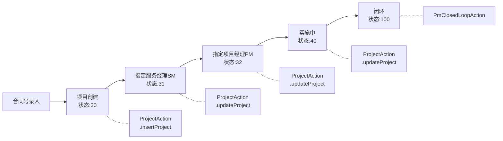
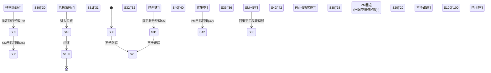
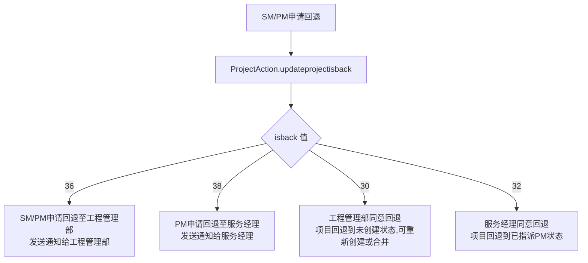

# 项目管理功能说明文档

## 1. 模块概述

项目管理模块是PMS系统的核心业务模块，负责项目全生命周期管理，包括项目创建、服务经理指派、项目经理指派、实施跟踪、工程计划、周报管理、交付件管理、合同合并拆分、项目回退、闭环申请等。该模块基于Struts2框架，通过Spring注入Service层实现业务逻辑，不使用Activiti工作流（项目状态通过数字编码直接管理）。

### 涉及的Action类列表

| Action类 | 包路径 | 职责 |
|----------|--------|------|
| `ProjectAction` | `com.dp.plat.action` | 项目全生命周期管理（创建/编辑/回退/周报/交付件/成员/合同合并拆分等） |
| `PmClosedLoopAction` | `com.dp.plat.action` | 项目闭环管理（闭环申请/审批/回访） |

### 涉及的Service类列表

| Service类 | 事务代理Bean | 依赖DAO |
|-----------|-------------|---------|
| `ProjectServiceImpl` | `projectServiceAgent` | `ProjectDao` |
| `PmClosedLoopServiceImpl` | `pmClosedLoopServiceAgent` | `PmClosedLoopDao` |

### 涉及的数据库表列表

| 表名 | 说明 |
|------|------|
| `pm_project` | 项目信息主表（视图名 pm_project_header） |
| `pm_project_state` | 项目状态表 |
| `pm_project_member` | 项目成员表 |
| `pm_project_contract` | 项目合同关联表 |
| `pm_project_product_line` | 项目产品线表 |
| `pm_project_product_line_real` | 项目实际产品线表 |
| `pm_project_soft_version` | 项目软件版本表 |
| `pm_project_weekly` | 项目周报表 |
| `pm_project_weekly_content` | 项目周报内容表 |
| `pm_project_weekly_feedback` | 项目周报反馈表 |
| `pm_project_log` | 项目日志表 |
| `pm_project_task` | 项目工程计划表 |
| `pm_project_instruction` | 项目批示表 |
| `pm_project_related_party` | 项目相关方表（渠道商/代理商/服务商） |
| `pm_project_notification` | 项目通知表 |
| `pm_project_notification_state` | 通知状态表 |
| `pm_project_deliver` | 项目交付件表 |
| `pm_column_of_relationship` | 列关系配置表 |
| `pm_project_group` | 项目组信息表 |
| `pm_project_group_relationship` | 项目组与项目关联表 |

### 依赖的其他模块

- 系统管理模块（用户信息 `UserManageService`、部门信息 `DepartmentManageService`、基础数据 `BasicDataService`）
- 邮件服务模块（`SendMailService`，审批/周报通知邮件）
- 工程计划模块（`ProjectPlanService`，财务收款计划）
- 闭环管理模块（`PmClosedLoopService`、`CallBackService`）

## 2. 业务流程

### 2.1 项目全生命周期流程

### 2.2 项目状态转换图

项目状态使用数字编码（`isback` 字段），定义在 `MessageUtil` 中：

> **状态码速查**：`30`已创建 → `31`待指派SM → `32`已指派PM → `40`实施中 → `100`已闭环；回退分支 `36`SM回退 / `38`PM回退至服务经理 / `42`PM回退实施；终止态 `20`不予跟踪。

### 2.3 项目回退流程

### 2.4 项目闭环流程

闭环流程状态（`closeProcessState`）：

| 编码 | 名称 |
|------|------|
| 10 | 项目跟踪 |
| 15 | 闭环申请 |
| 20 | 服务经理审批 |
| 30 | 回访 |
| 40 | 工程人员审核 |
| 50 | 项目闭环 |

## 3. 接口文档

### 3.1 项目列表查询

| 项目 | 说明 |
|------|------|
| URL | /module/ProjectManage.action |
| HTTP方法 | GET |
| 功能描述 | 查询项目列表，支持多条件筛选，按权限过滤 |
| 权限要求 | 已登录用户（工程管理部/管理员/财务/项目管理员查全部，其他按权限过滤） |

**输入参数**：

| 参数名 | 类型 | 必填 | 校验规则 | 默认值 | 业务含义 |
|--------|------|------|----------|--------|----------|
| displayParam | DisplayParam | 否 | - | 默认分页 | 分页参数 |
| project.projectName | String | 否 | - | 无 | 项目名称模糊搜索 |
| project.projectCode | String | 否 | - | 无 | 项目编号搜索 |
| project.projectState | String | 否 | - | 30,31,32 | 项目状态过滤 |
| project.contractNo | String | 否 | - | 无 | 合同号搜索 |
| project.column001 | String | 否 | - | 无 | 办事处编码过滤 |
| project.column010 | String | 否 | - | 无 | 项目类别(10=普通类,20=工程类) |

**返回结果**：

| result名 | 类型 | 跳转页面 | 说明 |
|----------|------|----------|------|
| SUCCESS | String | /sys/module/projectlist.jsp | 查询成功 |
| ERROR | String | /error.jsp | 查询失败 |

**处理逻辑**：
1. 初始化项目查询条件（`initProject()`）
2. 工程管理部/管理员/财务/项目管理员 → `projectService.queryProjectList()`
3. 服务经理/项目经理/普通用户 → `projectService.queryProjectListByPower()`
4. 查询市场关系数据 → `projectService.queryMarketRelations()`

### 3.2 创建项目

| 项目 | 说明 |
|------|------|
| URL | /module/ProjectCreate.action |
| HTTP方法 | GET（表单页）/ POST（提交） |
| 功能描述 | 根据合同号创建项目 |
| 权限要求 | 已登录用户 |

**输入参数**：

| 参数名 | 类型 | 必填 | 校验规则 | 默认值 | 业务含义 |
|--------|------|------|----------|--------|----------|
| project.contractNo | String | 是 | 非空 | 无 | 合同号 |
| project.validateFlag | String | 是 | MD5校验 | 无 | 安全标识 |
| project.column010 | String | 否 | - | 无 | 项目类别(10=普通类,20=工程类) |
| project.serviceManagerCode | String | 否 | - | 无 | 服务经理编码 |
| project.programManagerCode | String | 否 | - | 无 | 项目经理编码 |

**返回结果**：

| result名 | 类型 | 跳转页面 | 说明 |
|----------|------|----------|------|
| SUCCESS | String | 重定向到ProjectModify | 创建成功 |
| INPUT | String | /sys/module/projectcreate.jsp | 进入表单/查询合同信息 |
| ERROR | String | /error.jsp | 合同号不存在或已创建 |

**处理逻辑**：
1. 校验合同号是否已创建项目 → `projectService.queryProjectContractCountByContractNo()`
2. 保存项目 → `projectService.insertProject()`
3. 根据服务经理/项目经理是否为空设置项目状态（30/31/32）
4. 发送立项通知邮件 → `sendMailForApproval()`

### 3.3 修改项目

| 项目 | 说明 |
|------|------|
| URL | /module/ProjectModify.action |
| HTTP方法 | GET（查看）/ POST（修改） |
| 功能描述 | 查看/修改项目详细信息 |
| 权限要求 | 项目相关人员（工程管理部/服务经理/项目经理） |

**输入参数**：

| 参数名 | 类型 | 必填 | 校验规则 | 默认值 | 业务含义 |
|--------|------|------|----------|--------|----------|
| project.paramId | String | 是 | Base64编码 | 无 | 项目ID的Base64编码 |
| project.validateFlag | String | 是 | MD5校验 | 无 | 安全标识（修改时需要） |

**返回结果**：

| result名 | 类型 | 跳转页面 | 说明 |
|----------|------|----------|------|
| INPUT | String | /sys/module/projectmodify.jsp | 查看项目详情 |
| SUCCESS | String | 重定向到ProjectModify | 修改成功 |
| ERROR | String | /error.jsp | 无权限 |
| invalid | String | 重定向到ProjectManage | 项目作废 |

**处理逻辑**：
1. 权限校验（非管理员需验证项目访问权限）
2. 查看模式：加载项目详情、周报列表、工程计划、交付件、成员、批示、回访等
3. 修改模式：根据角色和状态执行不同更新逻辑
   - 工程管理部：`projectService.updateProjectByProjectId()`
   - 服务经理指定项目经理：`projectService.updateProjectProgramManagerByProjectId()`
   - 项目经理更新实施方式和最终客户：`projectService.updateChannel()` + `projectService.updateProjectImplByProjectId()`

### 3.4 项目回退

| 项目 | 说明 |
|------|------|
| URL | /updateprojectisback.action |
| HTTP方法 | POST |
| 功能描述 | 项目回退操作（SM/PM申请回退、工程管理部/服务经理审批回退） |
| 权限要求 | 当前项目的服务经理/项目经理/工程管理部 |

**输入参数**：

| 参数名 | 类型 | 必填 | 校验规则 | 默认值 | 业务含义 |
|--------|------|------|----------|--------|----------|
| projectId | int | 是 | 非空 | 无 | 项目ID |
| isback | String | 是 | 30/32/36/38 | 无 | 回退状态编码 |
| backCause | String | 否 | - | 无 | 回退原因 |
| notbackCause | String | 否 | - | 无 | 驳回原因 |
| pm | String | 否 | - | 无 | 重新指定的项目经理 |

**返回结果**：JSON `result` 字段

| result值 | 说明 |
|----------|------|
| 1 | SM申请回退至工程管理部成功 |
| 2 | PM申请回退至服务经理成功 |
| 3 | 工程管理部同意回退 |
| 4 | 服务经理同意回退 |
| -1 | 工程管理部使项目回退到未创建状态 |
| -3 | 工程管理部驳回回退申请 |
| -4 | 服务经理驳回回退申请 |
| 0 | 失败 |

### 3.5 项目状态回退到上一步

| 项目 | 说明 |
|------|------|
| URL | /backToLastStep.action |
| HTTP方法 | POST |
| 功能描述 | 项目状态回退到上一步 |
| 权限要求 | 已登录用户 |

**输入参数**：

| 参数名 | 类型 | 必填 | 校验规则 | 默认值 | 业务含义 |
|--------|------|------|----------|--------|----------|
| projectId | int | 是 | 非空 | 无 | 项目ID |
| projectState | String | 是 | 非空 | 无 | 目标状态 |
| isback | String | 是 | 非空 | 无 | 回退标识 |
| column012 | String | 否 | - | 无 | 实施方式 |
| channelName | String | 否 | - | 无 | 渠道名称 |
| column013 | String | 否 | - | 无 | 最终客户 |
| isupdate | int | 否 | - | 0 | 是否做更新操作 |

**返回结果**：JSON `result` = 201

### 3.6 项目周报

#### 创建周报

| 项目 | 说明 |
|------|------|
| URL | /module/sub/CreateWeekly.action |
| HTTP方法 | GET |
| 功能描述 | 进入创建周报页面 |
| 权限要求 | 已登录用户 |

**处理逻辑**：
1. 计算周报时间（上周六到本周五）
2. 查询上次周报内容作为模板
3. 查询项目工程计划列表

#### 保存周报

| 项目 | 说明 |
|------|------|
| URL | /SaveWeekly.action |
| HTTP方法 | POST |
| 功能描述 | 保存周报草稿 |
| 权限要求 | 已登录用户 |

**返回结果**：JSON `result` = 周报ID（成功）/ 0（失败）

#### 提交周报

| 项目 | 说明 |
|------|------|
| URL | /SubmitWeekly.action |
| HTTP方法 | POST |
| 功能描述 | 提交周报，生成Excel附件并发送邮件通知 |
| 权限要求 | 已登录用户 |

**处理逻辑**：
1. 保存周报内容
2. 生成周报Excel附件 → `projectService.createProjectWeeklyExecl()`
3. 发送邮件通知（主送服务经理+工程管理部，抄送项目成员+周报中填写的邮箱）
4. 添加系统通知

#### 编辑周报

| 项目 | 说明 |
|------|------|
| URL | /module/sub/EditWeekly.action |
| HTTP方法 | GET |
| 功能描述 | 编辑已有周报 |
| 权限要求 | 已登录用户 |

#### 周报回复

| 项目 | 说明 |
|------|------|
| URL | /Feedback.action |
| HTTP方法 | POST |
| 功能描述 | 周报回复 |
| 权限要求 | 已登录用户 |

**输入参数**：

| 参数名 | 类型 | 必填 | 校验规则 | 默认值 | 业务含义 |
|--------|------|------|----------|--------|----------|
| weeklyId | int | 是 | 非空 | 无 | 周报ID |
| feedback | String | 是 | 非空 | 无 | 回复内容 |
| projectId | int | 是 | 非空 | 无 | 项目ID |

**返回结果**：JSON `result` = 302

### 3.7 项目成员管理

#### 创建项目成员

| 项目 | 说明 |
|------|------|
| URL | /createMember.action |
| HTTP方法 | POST |
| 功能描述 | 创建项目成员 |
| 权限要求 | 已登录用户 |

**输入参数**：

| 参数名 | 类型 | 必填 | 校验规则 | 默认值 | 业务含义 |
|--------|------|------|----------|--------|----------|
| projectId | int | 是 | 非空 | 无 | 项目ID |
| memberCode | String | 是 | 非空 | 无 | 成员编码 |
| memberName | String | 是 | 非空 | 无 | 成员姓名 |
| memberRole | String | 是 | 非空 | 无 | 成员角色编码 |
| phoneNum | String | 否 | - | 无 | 电话号码 |
| email | String | 否 | - | 无 | 邮箱 |
| memberEffectiveFrom | Date | 否 | - | 当前日期 | 生效起始日期 |

**返回结果**：JSON `result` = 成员ID（成功）/ 0（失败）

#### 更新项目成员

| 项目 | 说明 |
|------|------|
| URL | /updateMember.action |
| HTTP方法 | POST |
| 功能描述 | 更新项目成员信息（设置失效日期） |
| 权限要求 | 已登录用户 |

**输入参数**：

| 参数名 | 类型 | 必填 | 校验规则 | 默认值 | 业务含义 |
|--------|------|------|----------|--------|----------|
| memberId | int | 是 | 非空 | 无 | 成员记录ID |
| memberEffectiveTo | Date | 否 | - | 无 | 生效截止日期 |
| projectId | int | 是 | 非空 | 无 | 项目ID |

**返回结果**：JSON `result` = 成员ID（成功）/ 0（失败）

### 3.8 工程计划

| 项目 | 说明 |
|------|------|
| URL | /module/ProjectPlanEdit.action |
| HTTP方法 | POST |
| 功能描述 | 制定或修改工程计划 |
| 权限要求 | 已登录用户 |

**输入参数**：

| 参数名 | 类型 | 必填 | 校验规则 | 默认值 | 业务含义 |
|--------|------|------|----------|--------|----------|
| project.projectId | int | 是 | 非空 | 无 | 项目ID |
| project.contractNo | String | 是 | 非空 | 无 | 合同号 |
| projectTask | ProjectTask | 是 | 非空 | 无 | 工程计划数据 |

**返回结果**：重定向到ProjectModify，`result` = 305

**处理逻辑**：
1. 保存工程计划 → `projectService.editProjectPlan()`
2. 首次制定计划时更新项目计划状态 → `projectService.insertOrUpdateProjectState()`
3. 添加系统通知

### 3.9 交付件管理

#### 上传交付件

| 项目 | 说明 |
|------|------|
| URL | /module/sub/UploadDeliverableFile.action |
| HTTP方法 | POST |
| 功能描述 | 上传工程交付件 |
| 权限要求 | 已登录用户 |

**返回结果**：重定向到ProjectModify

#### 删除交付件

| 项目 | 说明 |
|------|------|
| URL | /deleteDeliverById.action |
| HTTP方法 | POST |
| 功能描述 | 删除工程交付件 |
| 权限要求 | 已登录用户 |

**输入参数**：

| 参数名 | 类型 | 必填 | 校验规则 | 默认值 | 业务含义 |
|--------|------|------|----------|--------|----------|
| deliverid | int | 是 | 非空 | 无 | 交付件ID |

**返回结果**：JSON `result` = 309（成功）

### 3.10 项目批示

| 项目 | 说明 |
|------|------|
| URL | /instruction.action |
| HTTP方法 | POST |
| 功能描述 | 保存项目批示 |
| 权限要求 | 已登录用户 |

**输入参数**：

| 参数名 | 类型 | 必填 | 校验规则 | 默认值 | 业务含义 |
|--------|------|------|----------|--------|----------|
| projectId | int | 是 | 非空 | 无 | 项目ID |
| instructionsInfo | String | 是 | 非空 | 无 | 批示内容 |
| instructionId | int | 否 | - | 0 | 批示ID（修改时传入） |

**返回结果**：JSON `result` = 301

### 3.11 安装地址保存

| 项目 | 说明 |
|------|------|
| URL | /SaveInstallAdress.action |
| HTTP方法 | POST |
| 功能描述 | 保存设备安装地址 |
| 权限要求 | 已登录用户 |

**输入参数**：

| 参数名 | 类型 | 必填 | 校验规则 | 默认值 | 业务含义 |
|--------|------|------|----------|--------|----------|
| projectId | int | 是 | 非空 | 无 | 项目ID |
| selected | String | 是 | 非空 | 无 | 选中的序列号 |
| installAddress | String | 是 | 非空 | 无 | 安装地址 |

**返回结果**：JSON `result` = 303

### 3.12 合同合并拆分

#### 进入合并拆分页面

| 项目 | 说明 |
|------|------|
| URL | /module/sub/MergeOrBranchContract_toMergeOrBranch.action |
| HTTP方法 | GET |
| 功能描述 | 进入合同拆分合并页面 |
| 权限要求 | 已登录用户 |

#### 查询合并合同

| 项目 | 说明 |
|------|------|
| URL | /checkMergeContract.action |
| HTTP方法 | POST |
| 功能描述 | 查询要合并的合同信息 |
| 权限要求 | 已登录用户 |

#### 合同合并

| 项目 | 说明 |
|------|------|
| URL | /module/MergeContract.action |
| HTTP方法 | POST |
| 功能描述 | 合并合同 |
| 权限要求 | 已登录用户 |

#### 项目拆分

| 项目 | 说明 |
|------|------|
| URL | /module/BranchContract.action |
| HTTP方法 | POST |
| 功能描述 | 项目拆分 |
| 权限要求 | 已登录用户 |

### 3.13 设备转移

| 项目 | 说明 |
|------|------|
| URL | /module/sub/transferShipment.action |
| HTTP方法 | GET/POST |
| 功能描述 | 转移设备到其他项目 |
| 权限要求 | 已登录用户 |

#### 查询可转移项目

| 项目 | 说明 |
|------|------|
| URL | /module/sub/projectSub_transferProject.action |
| HTTP方法 | GET |
| 功能描述 | 查询可转移到的目标项目列表（设备转移时选择目标项目） |
| 权限要求 | 已登录用户 |

**输入参数**：

| 参数名 | 类型 | 必填 | 校验规则 | 默认值 | 业务含义 |
|--------|------|------|----------|--------|----------|
| project.contractNo | String | 是 | 非空 | 无 | 合同号（按合同号查询可转移的项目） |

**返回结果**：INPUT → /sys/module/sub/transferProject.jsp

**处理逻辑**：
1. 根据合同号查询可转移的项目列表 → `projectService.queryTransferProjectList()`
2. 若合同号为空则返回空列表

### 3.14 软件版本管理

#### 查询软件版本

| 项目 | 说明 |
|------|------|
| URL | /module/sub/checkSoftVersion.action |
| HTTP方法 | GET |
| 功能描述 | 查询项目设备软件版本信息 |
| 权限要求 | 已登录用户 |

#### 更新软件版本

| 项目 | 说明 |
|------|------|
| URL | /updateSoftVersion.action |
| HTTP方法 | POST |
| 功能描述 | 更新设备软件版本 |
| 权限要求 | 已登录用户 |

#### 查询历史版本

| 项目 | 说明 |
|------|------|
| URL | /module/sub/checkhistsoftversion.action |
| HTTP方法 | GET |
| 功能描述 | 获取软件版本历史变更数据 |
| 权限要求 | 已登录用户 |

### 3.15 其他查询接口

| URL | 方法 | 说明 |
|-----|------|------|
| /module/sub/checkOrderData.action | checkOrderData | 查询设备清单 |
| /module/sub/checkRealOrderData.action | checkRealOrderData | 查询实施发货设备清单 |
| /module/sub/projectLeaseLine.action | projectLeaseLine | 查询租赁配置清单 |
| /module/sub/projectProductConfigLevelInfo.action | projectProductConfigLevelInfo | 查询配置关系清单 |
| /module/sub/checkShipmentInfo.action | checkShipmentInfo | 查询发货序列号 |
| /module/sub/queryProjectNotification.action | queryProjectNotification | 获取项目系统通知 |
| /module/sub/projectSub_problemTicket.action | problemTicket | 获取项目工单记录 |
| /module/sub/projectSub_projectMaintenance.action | projectMaintenance | 获取项目维护记录 |
| /module/sub/projectSub_createProjectMaintenance.action | createProjectMaintenance | 创建项目维护记录 |
| /module/exportSpotCheck.action | exportSpotCheck | 现场验货单下载 |
| /module/exportOverWarrantyRemind.action | exportOverWarrantyRemind | 过保提醒单下载 |
| /module/sub/importSpotCheckIgnoreItem.action | importSpotCheckIgnoreItem | 导入现场验货单忽略序列号明细的item |
| /module/DownloadFile.action | downloadFile | 文件下载 |
| /queryalluser.action | queryalluser | 按角色查询用户 |
| /queryperson.action | queryperson | 查询项目干系人 |
| /queryDpNoRoleUser.action | queryDpNoRoleUser | 按角色和部门查询用户 |
| /importProject.action | importProject | 批量创建/关闭项目（管理员） |
| /module/clearProject.action | clearProject | 批量作废/删除项目 |
| /module/BatchChangeProjectMember.action | batchChangeMember | 批量变更服务经理/项目经理 |
| /module/sub/projectSub_deleteShipmentInfo.action | deleteShipmentInfo | 删除发货安装信息 |
| /module/sub/projectSub_updateProjectExecutionState.action | updateProjectExecutionState | 更新项目实施状态 |
| /module/createCHProject.action | createCHProject | 创建串货项目 |
| /projectAjax_*.action | 动态方法 | 项目管理Ajax请求 |
| /module/sub/ToUploadFile.action | toUploadFile | 周报附件上传页面 |
| /module/sub/ToUploadDeliverableFile.action | toUploadDeliverableFile | 交付件上传页面 |
| /module/sub/UploadFile.action | UploadFile | 周报附件上传 |
| /DeleteFile.action | deleteFile | 删除附件 |

> **URL映射规则说明**：
> - `/module/` 前缀：Struts 配置中 `basepackage` 命名空间下的标准页面请求
> - 无前缀的 `/*.action`：Struts 配置中 `ajax` 包（无命名空间）下的 JSON 格式请求，如 `/SaveWeekly.action`、`/updateprojectisback.action` 等
> - `/ajax/` 前缀：Struts 配置中 `ajaxJSON` 包（namespace="/ajax"）下的 JSON 格式请求，仅包含 `/ajax/upload.action` 和 `/ajax/queryFile.action`
> - `/module/sub/` 前缀：Struts 配置中 `projectSub` 命名空间下的子模块请求
> - `!method` 格式：Struts2 DMI（动态方法调用），如 `/SaveWeekly.action` 等同于调用 `ProjectAction.SaveWeekly()` 方法
> - `_*` 通配符格式：如 `/projectAjax_*.action`，通过 Struts 通配符映射到 `ProjectAjaxAction` 的对应方法

## 4. Service层详解

### 4.1 ProjectServiceImpl 公共方法列表

#### 项目CRUD

| 方法签名 | 功能描述 |
|----------|----------|
| `List<Project> queryProjectList(Project, DisplayParam)` | 查询项目列表（全部） |
| `List<Project> queryProjectListByPower(Project, DisplayParam)` | 按权限查询项目列表 |
| `Project queryProjectById(int projectId)` | 根据ID查询项目 |
| `Project queryProjectByPowerId(Project)` | 按权限查询项目 |
| `Project queryProjectSimplifyByProjectId(Integer)` | 查询项目简要信息 |
| `Project queryProjectByContractNo(String)` | 根据合同号查询项目 |
| `Project queryProjectByContractNoAndType(String, String)` | 根据合同号和类型查询项目 |
| `int insertProject(Project)` | 创建项目 |
| `void insertBatchProject(Project, int)` | 批量创建项目 |
| `void updateProjectByProjectId(Project)` | 工程管理部更新项目 |
| `int updateProjectByProjectIdSelective(Project)` | 选择性更新项目 |
| `boolean updateProjectProgramManagerByProjectId(Project)` | 服务经理指定项目经理 |
| `boolean updateProjectProgramManagerByProjectId(Project, String)` | 指定项目经理（含B角） |
| `void updateProjectDetailByProjectId(Project)` | 更新项目详情 |
| `void updateProjectImplByProjectId(Project)` | 更新项目实施方式和最终客户 |
| `void updateProjectStatus(int, String)` | 更新项目状态 |
| `void updateProjectExecutionState(int, String)` | 更新项目实施状态 |
| `void updateProjectExecutionState(Project, String)` | 更新项目实施状态 |
| `void updateProjectCloseProcessState(int, String)` | 更新闭环流程状态 |
| `void updateProjectCloseProcessState(Project, String)` | 更新闭环流程状态 |
| `void insertOrUpdateProjectState(Project)` | 插入或更新项目状态 |
| `void invalidProject(int)` | 作废项目 |
| `int batchDeleteProject(List<Project>)` | 批量删除项目 |
| `int batchInvalidProject(List<Project>)` | 批量作废项目 |
| `String queryProjectCode(Project)` | 生成项目编号 |
| `Integer queryProjectContractCountByContractNo(String)` | 查询合同号已创建项目数 |
| `Integer queryProjectContractCountByContractNoAndType(String, String)` | 查询合同号+类型已创建项目数 |
| `boolean queryProjectPlanState(int)` | 查询项目是否已制定计划 |
| `String queryProjectCurrentPlan(int)` | 查询项目当前计划阶段 |
| `String queryProjectStateByProjectId(Project)` | 查询项目当前状态 |
| `int queryProjectShipment(int)` | 查询项目已安装数量 |
| `int queryHistoryProjectShipmentSize(int)` | 查询历史项目发货数量 |
| `boolean updateProjectMember(Project, String, String)` | 更新项目服务经理/项目经理 |
| `void updateProjectIsbackByProjectId(int, String, String, String, int, String)` | 更新项目回退状态 |
| `void updateProjectIsbackByProjectId(int, String, String, String, int)` | 更新项目回退状态（无驳回原因） |
| `void updateProjectLastRefreshTime(int)` | 更新项目最后刷新时间 |
| `void updateProjectCloseTime(int)` | 更新项目闭环时间 |
| `void updateProjectDirectCloseTime(int)` | 直接更新项目闭环时间 |
| `void updateProjectPlanStateToClose(int)` | 更新项目计划状态为已闭环 |
| `void updateServiceProject(Map)` | 更新服务项目信息 |
| `int canCloseLoop(Project)` | 判断项目是否可以闭环 |
| `int queryCallBackingSize(int)` | 查询正在回访中的数量 |
| `int queryProjectIdBycloseId(int)` | 根据闭环ID查询项目ID |

#### 项目成员

| 方法签名 | 功能描述 |
|----------|----------|
| `List<ProjectMember> queryProjectMembers(int)` | 查询项目成员列表 |
| `int insertProjectMember(ProjectMember)` | 创建项目成员 |
| `void updateProjectMember(ProjectMember)` | 更新项目成员 |

#### 项目周报

| 方法签名 | 功能描述 |
|----------|----------|
| `List<ProjectWeekly> queryProjectWeeklyList(int, int)` | 查询项目周报列表 |
| `ProjectWeekly queryPorjectWeekly(int)` | 查询周报详情 |
| `int insertPorjectWeekly(ProjectWeekly, List, List, List, List, List, List)` | 创建周报 |
| `void updatePorjectWeekly(ProjectWeekly, List, List, List, List, List, List)` | 更新周报 |
| `void insertWeeklyFiles(List, int)` | 保存周报附件 |
| `int queryLastWeeklyId(int)` | 查询最近一次周报ID |
| `String createProjectWeeklyExecl(ProjectWeekly, List, List, List, List, List)` | 生成周报Excel |
| `String queryMemberAddress(int)` | 查询项目成员邮箱地址 |

#### 周报内容

| 方法签名 | 功能描述 |
|----------|----------|
| `List<WeeklyContent> queryWeeklyContentList(int, int)` | 查询周报内容列表 |
| `List<WeeklyFeedback> queryFeedbackList(int)` | 查询周报反馈列表 |
| `void saveWeeklyFeedback(Object...)` | 保存周报反馈 |

#### 项目工程计划

| 方法签名 | 功能描述 |
|----------|----------|
| `void editProjectPlan(ProjectTask)` | 制定/修改工程计划 |
| `List<ProjectTask> queryProjectTaskByProjectId(int)` | 查询项目工程计划列表 |
| `List<ProjectPlanEvent> queryProjectPlanEventByProject(Project)` | 查询项目计划事件节点 |

#### 交付件

| 方法签名 | 功能描述 |
|----------|----------|
| `List<ProjectDeliver> queryProjectDeliverList(ProjectDeliver)` | 查询交付件下拉列表 |
| `List<ProjectDeliver> queryDeliverDetailByProjectId(int)` | 查询交付件明细 |
| `List<ProjectDeliver> queryDeliverDetailByProjectIdAndProjectType(int, String)` | 按类型查询交付件 |
| `List<ProjectDeliver> queryDeliverDetailByProjectIdAndDeliverType(int, String)` | 按交付类型查询 |
| `boolean uploadFile(ProjectDeliver, String, ProjectDeliver)` | 上传交付件 |
| `boolean uploadFile(ProjectDeliver, String, File[], String)` | 上传交付件（文件数组） |
| `int deleteDeliverById(int)` | 删除交付件 |
| `int queryNeededUndelivedCount(Project)` | 查询未上传必传交付件数量 |

#### 设备/发货

| 方法签名 | 功能描述 |
|----------|----------|
| `List<OrderDataFromSap> queryOrderDataListByProjectId(int)` | 查询设备清单 |
| `List<OrderDataFromSap> queryOrderDataDetailListByProjectId(int)` | 查询设备清单明细 |
| `List<OrderDataFromSap> queryRmaOrderDataByContractNo(String)` | 查询RMA退货数据 |
| `List<RealProductLineBean> queryRealOrderDataListByProjectId(int)` | 查询实施发货设备清单 |
| `int queryRealOrderDataSizeByProjectId(int)` | 查询实施发货设备数量 |
| `List<ShipmentInfo> queryShipmentInfoByContractNo(String, int)` | 查询发货序列号 |
| `List<ShipmentInfo> queryShipmentInfoByContractNo(String, int, String)` | 查询发货序列号（含利润中心） |
| `int queryShipmentInfoSizeByContractNo(String)` | 查询发货数量 |
| `int queryShipmentInfoSizeByContractNo(String, String)` | 查询发货数量（含利润中心） |
| `void deleteShipmentInstallInfoByProjectId(int)` | 删除发货安装信息 |
| `void insertInstallAddress(String, int, String, String)` | 保存安装地址 |
| `void insertInstallAddress(String, int, String, String, String)` | 保存安装地址（含利润中心） |
| `List<ShipmentInfo> queryTransferShipmentInfoByContractNo(Project, int)` | 查询转移设备信息 |
| `List<ShipmentInfo> queryTransferShipmentInfoByContractNo(Project, int, String)` | 查询转移设备信息（含利润中心） |
| `void insertTransferShipment(String, Project, Project)` | 转移设备 |
| `void insertTransferShipment(String, Project, Project, String)` | 转移设备（含利润中心） |
| `List<Project> queryTransferProjectList(Project)` | 查询可转移项目列表 |

#### 软件版本

| 方法签名 | 功能描述 |
|----------|----------|
| `List<ProjectSoftVersion> querySoftversionList(String, int)` | 查询软件版本列表 |
| `List<ProjectSoftVersion> querySoftversionList(String, int, String)` | 查询软件版本列表（含利润中心） |
| `List<ProjectSoftVersion> querySoftversionList(String, int, Map)` | 查询软件版本列表（含参数） |
| `void updateSoftversion(List, SoftChangeLog)` | 更新软件版本 |
| `List<SoftChangeLog> queryHistSoftChangeLog(int)` | 查询软件版本变更历史 |
| `List<ProjectSoftVersion> queryHistSoftVersionList(SoftChangeLog)` | 查询历史版本详情 |
| `SoftChangeLog queryOneSoftChangeLog(int)` | 查询单条变更记录 |

#### 合同合并拆分

| 方法签名 | 功能描述 |
|----------|----------|
| `void insertMergeContract(String, int)` | 合并合同 |
| `int insertNewProject(int, String, List, String)` | 项目拆分创建新项目 |
| `List<Contract> queryContractList(Map)` | 查询合同列表 |

#### 项目批示

| 方法签名 | 功能描述 |
|----------|----------|
| `void insertInstruction(Instruction)` | 插入批示 |
| `void saveInstruction(Object...)` | 保存批示 |
| `List<Instruction> queryInstructionList(int)` | 查询批示列表 |

#### 回访

| 方法签名 | 功能描述 |
|----------|----------|
| `List<CallBack> queryCallBackList(int)` | 查询回访流程列表 |

#### 通知

| 方法签名 | 功能描述 |
|----------|----------|
| `List<Notification> queryNotifyList(int)` | 查询项目通知列表 |
| `NotificationTemplate queryNotificationTemplate(String)` | 查询通知模板 |
| `void addFixedNotification(String, int)` | 添加固定通知 |
| `void addDynamicNotification(String, int, String)` | 添加动态通知 |
| `void addDynamicNotification(String, int, HashMap)` | 添加动态通知（含参数） |

#### 租赁/配置

| 方法签名 | 功能描述 |
|----------|----------|
| `int queryProjectLeaseLineSizeByProjectCode(String)` | 查询租赁清单数量 |
| `List<?> queryProjectLeaseLineByProjectCode(String)` | 查询租赁配置清单 |
| `int queryProjectProductConfigLevelInfoSizeByProjectCode(String)` | 查询配置关系数量 |
| `List<?> queryProjectProductConfigLevelInfoByProjectCode(String)` | 查询配置关系清单 |

#### 其他

| 方法签名 | 功能描述 |
|----------|----------|
| `List<Person> queryPersonList()` | 查询项目干系人列表 |
| `String getMails(String)` | 根据用户名获取邮箱 |
| `String getMails(int)` | 根据角色ID获取邮箱 |
| `String queryMailByUserNameFromOA(String)` | 从OA查询用户邮箱 |
| `String getUploadFileRename(String)` | 获取上传文件重命名 |
| `void deleteFileById(int)` | 删除附件 |
| `int insertLog(String, String, Integer)` | 插入项目日志 |
| `void updateLog(int, int)` | 更新日志状态 |
| `Map<String, String> exportSpotCheckList(Project)` | 导出现场验货单 |
| `Map<String, String> exportOverWarrantyRemindList(Project)` | 导出过保提醒单 |
| `void importSpotCheckIgnoreItem(List)` | 导入忽略序列号明细的item |
| `List<Map<String, Object>> queryMarketRelations()` | 查询市场关系 |
| `List<Map<String, Object>> selectProblemTicket(Map)` | 查询工单记录 |
| `List<Map<String, Object>> selectProblemTicketByProject(Project)` | 按项目查询工单 |
| `ProjectMaintenanceVO selectProjectMaintenanceById(Integer)` | 查询项目维护记录 |
| `Integer insertOrUpdateProjectMaintenance(ProjectMaintenance)` | 插入/更新项目维护记录 |
| `List<Map<String, Object>> selectProjectMaintenanceMapList(ProjectMaintenanceVO)` | 查询项目维护记录列表 |
| `List<Map<String, Object>> selectProjectMaintenanceMapList(ProjectMaintenanceVO, DisplayParam)` | 查询项目维护记录列表（分页） |
| `void updateSoleAgentLendProject()` | 更新总代借货项目 |

## 5. 数据操作

### 5.1 本模块涉及的数据库表及CRUD操作

| 表名 | CREATE | READ | UPDATE | DELETE |
|------|--------|------|--------|--------|
| pm_project | insertProject / insertBatchProject / insertNewProject | queryProjectList / queryProjectById / queryProjectByContractNo | updateProjectByProjectId / updateProjectStatus / updateProjectImplByProjectId / insertOrUpdateProjectState | invalidProject / batchDeleteProject / batchInvalidProject |
| pm_project_member | insertProjectMember | queryProjectMembers | updateProjectMember / updateProjectMember(批量) | - |
| pm_project_task | editProjectPlan | queryProjectTaskByProjectId | editProjectPlan | - |
| pm_project_weekly | insertPorjectWeekly | queryProjectWeeklyList / queryPorjectWeekly | updatePorjectWeekly | - |
| pm_project_weekly_content | insertPorjectWeekly(含) | queryWeeklyContentList | updatePorjectWeekly(含) | - |
| pm_project_weekly_feedback | saveWeeklyFeedback | queryFeedbackList | - | - |
| pm_project_instruction | saveInstruction | queryInstructionList | - | - |
| pm_project_contract | insertProjectContract | queryProjectContractCountByContractNo | insertMergeContract | - |
| pm_project_group | insertProjectGroup | queryMaxProjectGroupCode | - | - |
| pm_project_group_relationship | insertProjectGroupRelationship | - | - | - |
| pm_project_state | insertOrUpdateProjectState | queryProjectStateByProjectId | insertOrUpdateProjectState | - |
| pm_project_soft_version | updateSoftversion | querySoftversionList / queryHistSoftVersionList | updateSoftversion | - |
| pm_project_log | insertLog | - | updateLog | - |
| pm_project_deliver | uploadFile | queryProjectDeliverList / queryDeliverDetailByProjectId | - | deleteDeliverById |

### 5.2 状态编码定义

#### projectState（项目状态）

| 编码 | 含义 | MessageUtil常量 |
|------|------|-----------------|
| 10 | 创建中 | PROJECT_STATE_CREATING |
| 20 | 不予跟踪 | PROJECT_STATE_DENY |
| 30 | 已创建 | PROJECT_STATE_30 |
| 31 | 待指派SM | PROJECT_STATE_31 |
| 32 | 已指派PM | PROJECT_STATE_32 |
| 33 | - | PROJECT_STATE_33 |
| 100 | 已闭环 | PROJECT_STATE_CLOSEDLOOP |

#### memberRole（项目成员角色）

| 编码 | 含义 | MessageUtil常量 |
|------|------|-----------------|
| 10 | 销售 | MEMBER_SALESMAN |
| 20 | 服务经理(SM) | MEMBER_SM |
| 30 | 项目经理(PM) | MEMBER_PM |
| 40 | 团队成员 | MEMBER_PARTY |
| 50 | 服务渠道 | MEMBER_SERVICE_CHANNEL |
| 60 | 最终客户 | MEMBER_CUSTOMER |
| 70 | 技术经理 | MEMBER_TECH_MANMER |

#### isback（回退标识）

| 编码 | 含义 | MessageUtil常量 |
|------|------|-----------------|
| 30 | 已创建（未回访） | PROJECT_CREATE_STATE30 |
| 32 | 已指派PM | PROJECT_CREATE_STATE32 |
| 34 | - | PROJECT_CREATE_STATE34 |
| 36 | SM回退 | PROJECT_CREATE_STATE36 |
| 38 | PM回退 | PROJECT_CREATE_STATE38 |
| 40 | 工程管理部不予跟踪 | PROJECT_CREATE_STATE40 |
| 42 | PM回退(实施) | PROJECT_CREATE_STATE42 |
| 50 | 不予跟踪 | PROJECT_CREATE_STATE50 |

#### closeProcessState（闭环流程状态）

| 编码 | 含义 | MessageUtil常量 |
|------|------|-----------------|
| 10 | 项目跟踪 | PROJECT_CLOSE_PROCESS_STATE_10 |
| 15 | 闭环申请 | PROJECT_CLOSE_PROCESS_STATE_15 |
| 20 | 服务经理审批 | PROJECT_CLOSE_PROCESS_STATE_20 |
| 30 | 回访 | PROJECT_CLOSE_PROCESS_STATE_30 |
| 40 | 工程人员审核 | PROJECT_CLOSE_PROCESS_STATE_40 |
| 50 | 项目闭环 | PROJECT_CLOSE_PROCESS_STATE_50 |

#### weeklyState（周报状态）

| 编码 | 含义 | MessageUtil常量 |
|------|------|-----------------|
| 0 | 草稿 | WEEKLY_STATE_RAFT |
| 1 | 已提交 | WEEKLY_STATE_SUBMIT |
| -1 | 全部 | WEEKLY_STATE_ALL |

#### column010（项目类别）

| 编码 | 含义 | MessageUtil常量 |
|------|------|-----------------|
| 10 | 普通类 | PROJECT_TYPE_NORMAL |
| 20 | 工程类 | PROJECT_TYPE_ENGINEE |

#### projectType（项目类型）

| 编码 | 含义 | MessageUtil常量 |
|------|------|-----------------|
| 10 | 售后项目 | PROJECT_TYPE_AFTERSALES |
| 20 | 售前项目 | PROJECT_TYPE_PRESALES |

### 5.3 数据生命周期

| 数据对象 | 创建 | 修改 | 归档 | 删除 |
|----------|------|------|------|------|
| Project | 创建项目时创建，projectState=30/31/32 | 编辑/回退/状态变更时更新 | 闭环后归档(state=100) | 可作废(invalidProject)/批量删除 |
| ProjectMember | 创建成员时插入 | 设置失效日期(effectiveTo) | 随项目归档 | 不物理删除 |
| ProjectWeekly | 创建周报时创建 | 保存/提交时更新 | 随项目归档 | 不删除 |
| ProjectTask | 制定工程计划时创建 | 修改工程计划时更新 | 随项目归档 | 不删除 |
| ProjectDeliver | 上传交付件时创建 | - | 随项目归档 | 可删除(deleteDeliverById) |

## 6. 业务规则

| 规则编号 | 规则描述 | 触发条件 | 执行逻辑 |
|----------|----------|----------|----------|
| PJ-001 | 项目编号自动生成 | 创建项目时 | 由queryProjectCode()生成 |
| PJ-002 | 合同号唯一校验 | 创建项目时 | 同一合同号不能重复创建项目 |
| PJ-003 | 项目状态控制编辑权限 | 编辑项目时 | 工程管理部可编辑所有状态；服务经理可编辑30/32/38/40/42状态；项目经理可编辑32/34/40/42状态 |
| PJ-004 | 服务经理指定项目经理 | 服务经理编辑项目时 | 调用updateProjectProgramManagerByProjectId，项目状态从31变为32 |
| PJ-005 | 项目回退需审批 | SM/PM申请回退时 | isback=36回退至工程管理部，isback=38回退至服务经理，需发送通知邮件 |
| PJ-006 | 闭环前置条件 | 发起闭环时 | 必传交付件上传完毕、安装数量与发货数量一致、最终客户和服务渠道已维护、无正在进行的回访 |
| PJ-007 | 项目成员角色控制 | 项目成员管理时 | PM和SM角色从项目信息中指定，不在成员列表中显示 |
| PJ-008 | 区域权限数据过滤 | 查询项目列表时 | 非管理员/工程管理部按用户区域权限过滤项目数据 |
| PJ-009 | 立项通知邮件 | 创建项目时 | 根据项目类别（普通类/工程类）选择不同邮件模板，主送服务经理 |
| PJ-010 | 周报提交通知 | 提交周报时 | 生成Excel附件，发送邮件给服务经理+工程管理部，抄送项目成员 |
| PJ-011 | 首次制定工程计划 | 首次制定计划时 | 更新项目计划状态，添加系统通知 |
| PJ-012 | 项目作废 | 工程管理部编辑项目时 | 若服务经理为空，可作废项目(invalidProject) |
| PJ-013 | 闭环流程状态自动推进 | 查看项目详情时 | 必传交付件上传完毕自动推进到闭环申请状态(15) |
| PJ-014 | 总代借货项目特殊处理 | 查询发货/软件版本时 | 总代借货项目(salesType=14)需传入利润中心(profitCenter)参数 |

## 7. 配置项

| 配置项 | 配置Key | 说明 |
|--------|---------|------|
| 基础数据-项目分类 | BasicDataTypeCode="02" | 项目分类基础数据 |
| 基础数据-成员角色 | BasicDataTypeCode="03" (BASIC_DATA_MEMBER_ROLE) | 项目成员角色 |
| 基础数据-导航选项卡 | BasicDataTypeCode="10" (BASIC_DATA_NAV_TAB) | 项目维护页面选项卡 |
| 基础数据-合同合并选项卡 | BasicDataTypeCode="16" (BASIC_DATA_NAV_MERGE_TAB) | 合同合并页面选项卡 |
| 基础数据-实施方式 | BasicDataTypeCode="15" (BASIC_DATA_SERVICE_TYPE) | 实施方式集合 |
| 基础数据-项目类型划分 | BasicDataTypeCode="05" (BASIC_DATA_PRORANK) | 项目类型划分 |
| 基础数据-发货状态 | BasicDataTypeCode="20" (BASIC_DATA_DELIVERSTATE) | 发货状态集合 |
| 基础数据-工程计划状态 | BasicDataTypeCode="22" (BASIC_DATA_ENGINEERSTATE) | 工程计划状态 |
| 基础数据-项目时间点 | BasicDataTypeCode="24" (BASIC_DATA_PORJECT_TIME) | 项目查询条件时间点 |
| 基础数据-重大项目级别 | BasicDataTypeCode="majorProjectLevel" | 重大项目级别 |
| 基础数据-项目实施状态 | BasicDataTypeCode="projectExecutionState" | 项目实施状态 |
| 基础数据-闭环流程状态 | BasicDataTypeCode="projectCloseProcessState" | 闭环流程状态 |
| 基础数据-维护类型 | BasicDataTypeCode="maintenanceType" | 项目维护类型 |
| 系统参数-工程管理部邮箱 | GCGLB | 工程管理部邮箱地址 |
| 系统参数-周报CSS地址 | weekly.css.address | 周报样式表地址 |
| 系统参数-上传白名单 | sys.upload.ext.whitelist | 文件上传扩展名白名单 |
| 系统参数-重大项目级别映射 | pm.project.majorProjectLevel2projectCategory | 重大项目级别到项目类别的映射JSON |
| 系统参数-ITR工单基础URL | itr.problemTicket.base.url | ITR工单系统基础地址 |
