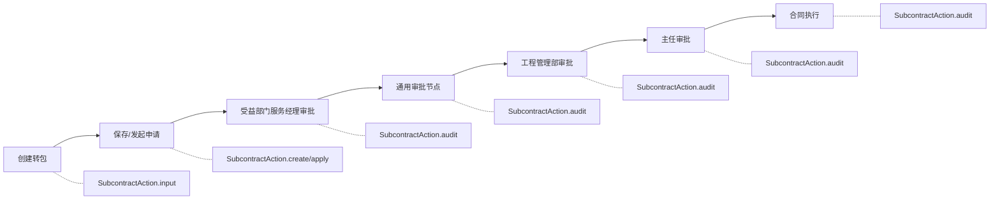

# 项目转包管理功能说明文档

## 1. 模块概述

项目转包管理模块（Subcontract）负责项目转包申请、审批、合同执行、付款、回访、验收等全生命周期管理。支持转包项目关联、服务商管理、付款审批流程、回访问卷、发票识别、D365采购订单对接等功能，是项目转包业务管控的核心模块。

### 涉及的Action类列表

| Action类 | 包路径 | 职责 |
|----------|--------|------|
| `SubcontractAction` | `com.dp.plat.subcontract.action` | 项目转包全生命周期管理（列表/创建/审批/闭环/回访/付款/附件/服务商） |

### 涉及的Service类列表

| Service类 | 包路径 | 依赖DAO |
|-----------|---------|---------|
| `SubcontractServiceImpl` | `com.dp.plat.subcontract.service.impl` | `SubcontractDao` |

### 涉及的DAO类列表

| DAO类 | 包路径 |
|-------|--------|
| `SubcontractDaoImpl` | `com.dp.plat.subcontract.dao` |

### 涉及的数据库表列表

| 表名 | 说明 |
|------|------|
| `pm_subcontract_project_header` | 转包项目主表 |
| `pm_subcontract_project_line` | 转包项目设备清单表 |
| `pm_subcontract_project_payment` | 转包项目付款信息表 |
| `pm_subcontract_project_payment_sse` | 转包项目付款SSE视图表 |
| `pm_subcontract_project_price` | 转包项目价格表 |
| `pm_subcontract_project_callback` | 转包项目回访记录表 |
| `pm_subcontract_deliver_files` | 转包项目交付件/附件表 |
| `pm_subcontract_facilitator` | 服务商信息表 |

### 涉及的流程监听器

| 监听器类 | 包路径 | 职责 |
|----------|--------|------|
| `SubcontractInspectionListener` | `com.dp.plat.subcontract.listener` | 转包流程任务监听（办理人指派、D365采购订单推送、采购收货推送） |

### 依赖的其他模块

- 项目管理模块（项目信息、项目成员查询）
- 系统管理模块（用户信息、基础数据、部门信息）
- 工作流引擎（Activiti流程审批）
- 邮件服务模块（审批通知邮件）
- D365接口模块（采购订单/采购收货推送）
- 发票识别模块（发票OCR识别验证）

## 2. 业务流程

### 2.1 转包申请流程



### 2.2 转包状态机转换图

```mermaid
stateDiagram-v2
    [*] --> S0
    S0["0 草稿"] --> S10: apply() 发起申请
    S10["10 待审批"] --> S15: 受益部门服务经理审批通过
    S15["15 受益部门服务经理审批"] --> S20: 通用审批节点通过
    S20["20 工程管理部审批通过"] --> S30: 主任审批通过
    S30["30 办事处主任审批通过"] --> S40: 生成合同
    S40["40 合同执行中"] --> S100: 闭环审批通过
    S100["100 已闭环"]
    S100 --> [*]

    S10 --> S15R: 受益部门服务经理驳回
    S15R["-15 受益部门服务经理驳回"] --> S10: 修改后重新提交
    S20 --> S20R: 工程管理部驳回
    S20R["-20 工程管理部驳回"] --> S10: 修改后重新提交
    S30 --> S30R: 办事处主任驳回
    S30R["-30 办事处主任驳回"] --> S10: 修改后重新提交
    S40 --> S100R: 闭环驳回
    S100R["-100 闭环驳回"]
```

> **状态码速查**：`0`草稿 → `10`待审批 → `15`服务经理审批 → `20`工程管理部审批 → `30`主任审批 → `40`合同执行 → `100`已闭环；驳回态为对应正值的负数（`-15`/`-20`/`-30`/`-100`），修改后重新提交回到 `10`。

### 2.3 付款审批流程

```
[合同执行中(40)] ──> [服务经理提交付款] ──> [付款签收审批] ──> [验收确认] ──> [付款完成]
       |                    |                      |                |             |
  generateContractTask  applyPaymentTask    approvePaymentTask  acceptanceTask  闭环
```

### 2.4 回访流程

```
[发起回访] ──> [回访任务] ──> [填写问卷] ──> [回访审批]
      |              |             |              |
 startCallBackFlow callbackTask  问卷提交      审批通过/驳回

回访状态:
  10 → 回访通过
  20 → 无法回访
 -10 → 回访不通过
```

## 3. 接口文档

### 3.1 转包项目列表查询

| 项目 | 说明 |
|------|------|
| URL | /module/subcontract_list.action |
| HTTP方法 | GET |
| 功能描述 | 分页查询转包项目列表，支持多条件筛选和导出 |
| 权限要求 | 服务经理/管理员/工程管理部/财务人员/回访员/办事处主任 |

**输入参数**：

| 参数名 | 类型 | 必填 | 校验规则 | 默认值 | 业务含义 |
|--------|------|------|----------|--------|----------|
| displayParam | DisplayParam | 否 | - | 默认分页 | 分页参数 |
| subcontractVO | SubcontractProjectVO | 否 | - | 空 | 查询条件 |
| subcontractVO.state | Integer | 否 | - | 无 | 转包状态过滤 |
| subcontractVO.type | Integer | 否 | - | 无 | 转包类型过滤 |
| subcontractVO.callbackState | Integer | 否 | - | 无 | 回访状态过滤 |

**返回结果**：

| result名 | 类型 | 跳转页面 | 说明 |
|----------|------|----------|------|
| list | String | /sys/subcontract/subcontract_list.jsp | 查询成功 |
| ERROR | String | /sys/error.jsp | 无权限或查询失败 |

### 3.2 进入创建/编辑页面

| 项目 | 说明 |
|------|------|
| URL | /module/subcontract_input.action |
| HTTP方法 | GET |
| 功能描述 | 进入转包项目创建或编辑页面 |
| 权限要求 | 服务经理/管理员/工程管理部/财务人员/回访员/办事处主任 |

**输入参数**：

| 参数名 | 类型 | 必填 | 校验规则 | 默认值 | 业务含义 |
|--------|------|------|----------|--------|----------|
| subcontract.id | Integer | 否 | - | 空 | 转包ID（空=新建，非空=编辑） |
| tabIndex | int | 否 | - | 0 | 选项卡索引 |

**返回结果**：INPUT → /sys/subcontract/subcontract_input.jsp

### 3.3 快速查看

| 项目 | 说明 |
|------|------|
| URL | /module/subcontract_view.action |
| HTTP方法 | GET |
| 功能描述 | 快速查看转包项目，若只有一条记录则直接进入详情页 |
| 权限要求 | 同list |

**返回结果**：若唯一记录则跳转input页面，否则显示列表

### 3.4 创建/保存转包项目

| 项目 | 说明 |
|------|------|
| URL | /module/subcontract_create.action |
| HTTP方法 | POST |
| 功能描述 | 创建或更新转包项目信息 |
| 权限要求 | 服务经理/管理员 |

**输入参数**：

| 参数名 | 类型 | 必填 | 校验规则 | 默认值 | 业务含义 |
|--------|------|------|----------|--------|----------|
| subcontract.id | Integer | 否 | - | 空 | 转包ID（空=新建，非空=更新） |
| subcontract.subcontractName | String | 是 | 非空 | 无 | 转包名称 |
| subcontract.contractNos | String | 是 | 非空 | 无 | 关联合同号 |
| subcontract.type | Integer | 是 | 非空 | 无 | 转包类型（10/20/30） |
| subcontract.facilitatorId | Integer | 是 | 非空 | 无 | 服务商ID |
| subcontract.subcontractAmount | String | 是 | 非空 | 无 | 转包价 |
| subcontract.profitDepCode | String | 是 | 非空 | 无 | 受益部门编码 |
| subcontract.officeCode | String | 是 | 非空 | 无 | 办事处编码 |
| subcontract.reason | String | 是 | 非空 | 无 | 转包原因 |
| uploadDeliverList | List\<SubcontractDeliverVO\> | 否 | - | 无 | 上传的交付件列表 |
| selected | String[] | 否 | - | 无 | 选中的项目ID |

**返回结果**：create → 重定向到subcontract_input

**处理逻辑**：
1. 创建/更新转包项目 → `subcontractService.createSubcontractProject()` / `updateSubcontractProject()`
2. 保存交付件 → `subcontractService.saveDeliverFiles()`
3. 如有回访标记则启动回访流程 → `subcontractService.startCallBackFlow()`

### 3.5 发起转包申请

| 项目 | 说明 |
|------|------|
| URL | /module/subcontract_apply.action |
| HTTP方法 | POST |
| 功能描述 | 发起转包审批流程 |
| 权限要求 | 服务经理 |

**输入参数**：同3.4

**返回结果**：create → 重定向到subcontract_input / ERROR

**处理逻辑**：
1. 先保存转包内容（同create）
2. 启动转包审批流程 → `subcontractService.startSubcontractFlow()`

### 3.6 审批转包申请

| 项目 | 说明 |
|------|------|
| URL | /module/subcontract_audit.action |
| HTTP方法 | POST |
| 功能描述 | 审批转包申请（通过/驳回），录入转包价 |
| 权限要求 | 审批节点办理人 |

**输入参数**：

| 参数名 | 类型 | 必填 | 校验规则 | 默认值 | 业务含义 |
|--------|------|------|----------|--------|----------|
| workflowCommonParam | WorkflowCommonParam | 是 | 非空 | 无 | 流程参数 |
| workflowCommonParam.taskId | String | 是 | 非空 | 无 | 任务ID |
| workflowCommonParam.outcome | String | 是 | 非空 | 无 | 审批结果（approveTask/approveZRTask） |
| workflowCommonParam.flag | int | 否 | - | 0 | 1=提交 |
| subcontract.id | Integer | 是 | 非空 | 无 | 转包ID |
| subcontractPriceList | List\<SubcontractPrice\> | 否 | - | 无 | 转包价列表 |

**返回结果**：audit → 重定向到subcontract_input / ERROR

**处理逻辑**：
1. 审批任务（approveTask）→ `subcontractService.auditNormalApproveSubcontractFlow()`
2. 主任审批（approveZRTask）→ `subcontractService.approveSubcontractFlow()`

### 3.7 审批转包闭环

| 项目 | 说明 |
|------|------|
| URL | /module/subcontract_close.action |
| HTTP方法 | POST |
| 功能描述 | 审批转包闭环 |
| 权限要求 | 闭环节点办理人 |

**输入参数**：workflowCommonParam（必填）、subcontract.id（必填）

**返回结果**：redirect → 重定向到subcontract_input / ERROR

### 3.8 发起回访流程

| 项目 | 说明 |
|------|------|
| URL | /ajax/subcontractAjax_startCallBackFlow.action |
| HTTP方法 | POST |
| 功能描述 | 发起转包回访流程 |
| 权限要求 | 已登录用户 |

**输入参数**：

| 参数名 | 类型 | 必填 | 校验规则 | 默认值 | 业务含义 |
|--------|------|------|----------|--------|----------|
| subcontract.id | Integer | 是 | 非空 | 无 | 转包ID |
| subcontractComment | SubcontractComment | 否 | - | 无 | 审批意见 |

**返回结果**：SUCCESS → JSON `{success: true/false, data: 回访记录, message: 错误信息}`

### 3.9 回访问卷

| 项目 | 说明 |
|------|------|
| URL | /module/sub/querySubcontractCallback.action |
| HTTP方法 | GET/POST |
| 功能描述 | 查询/提交回访问卷 |
| 权限要求 | 回访办理人 |

**输入参数**：

| 参数名 | 类型 | 必填 | 校验规则 | 默认值 | 业务含义 |
|--------|------|------|----------|--------|----------|
| subcontractCallback.subcontractId | Integer | 是 | 非空 | 无 | 转包ID |
| workflowCommonParam | WorkflowCommonParam | 否 | - | 无 | 流程审批参数 |
| pmClQuesnaireResultHeader | PmClQuesnaireResultHeader | 否 | - | 无 | 问卷结果 |
| pmClQuesnaireResultLineList | List | 否 | - | 无 | 问卷行结果 |

**返回结果**：callback → /sys/subcontract/sub/subcontractCallback.jsp

### 3.10 查询转包项目列表（弹窗）

| 项目 | 说明 |
|------|------|
| URL | /module/sub/chooseSubcontractProject.action |
| HTTP方法 | GET |
| 功能描述 | 根据合同号查询项目列表（弹窗选择） |
| 权限要求 | 已登录用户 |

**输入参数**：`contractNos`（合同号，必填）

**返回结果**：SUCCESS → /sys/subcontract/sub/subcontractProject.jsp

### 3.11 刷新转包项目

| 项目 | 说明 |
|------|------|
| URL | /module/subcontract_refreshSubcontractProject.action |
| HTTP方法 | POST |
| 功能描述 | 刷新转包关联的项目列表 |
| 权限要求 | 管理员/工程管理部 |

**输入参数**：`subcontract.id`（必填）、`subcontract.contractNos`（必填）、`subcontract.projectIds`（必填）

**返回结果**：SUCCESS → JSON `{success: true/false, message: 错误信息}`

### 3.12 查询发货序列号

| 项目 | 说明 |
|------|------|
| URL | /module/sub/chooseShipmentInfo.action |
| HTTP方法 | GET |
| 功能描述 | 根据合同号和项目ID查询发货序列号 |
| 权限要求 | 已登录用户 |

**输入参数**：`contractNos`（必填）、`projectIds`（可选）、`selected`（可选，合同利润中心JSON）

**返回结果**：SUCCESS → /sys/subcontract/sub/shipmentInfo.jsp

### 3.13 查询转包设备清单

| 项目 | 说明 |
|------|------|
| URL | /module/sub/querySubcontractLine.action |
| HTTP方法 | GET |
| 功能描述 | 查询转包项目设备清单 |
| 权限要求 | 已登录用户 |

**输入参数**：`subcontract.id`（必填）

**返回结果**：SUCCESS → /sys/subcontract/sub/subcontractLine.jsp

### 3.14 查询附件列表

| 项目 | 说明 |
|------|------|
| URL | /module/sub/querySubcontractDeliver.action |
| HTTP方法 | GET |
| 功能描述 | 查询转包项目交付件/附件列表 |
| 权限要求 | 已登录用户 |

**输入参数**：`subcontract.id`（必填）

**返回结果**：SUCCESS → /sys/subcontract/sub/subcontractDeliver.jsp

### 3.15 删除附件

| 项目 | 说明 |
|------|------|
| URL | /module/subcontract_deleteSubcontractDeliver.action |
| HTTP方法 | POST |
| 功能描述 | 删除转包项目交付件 |
| 权限要求 | 已登录用户 |

**输入参数**：`subcontractDeliverVO.ids`（必填，ID列表）

**返回结果**：SUCCESS / ERROR

### 3.16 检查转包名是否存在

| 项目 | 说明 |
|------|------|
| URL | /ajax/subcontractAjax_checkSubcontractName.action |
| HTTP方法 | POST |
| 功能描述 | 检查转包名称是否已存在 |
| 权限要求 | 已登录用户 |

**输入参数**：`subcontract.subcontractName`（必填）

**返回结果**：SUCCESS → JSON `{result: 数量字符串}`

### 3.17 查询合同工程服务费

| 项目 | 说明 |
|------|------|
| URL | /module/sub/queryContractNoEngineeFee.action |
| HTTP方法 | GET |
| 功能描述 | 查询合同对应的工程服务费及转包价 |
| 权限要求 | 已登录用户 |

**输入参数**：`contractNos`（必填）、`subcontract.id`（可选）

**返回结果**：SUCCESS → /sys/subcontract/sub/contractNoEngineeFee.jsp

### 3.18 查询付款信息

| 项目 | 说明 |
|------|------|
| URL | /module/sub/querySubcontractPayment.action |
| HTTP方法 | GET |
| 功能描述 | 查询转包项目付款信息，含发票识别状态 |
| 权限要求 | 已登录用户 |

**输入参数**：`subcontract.id`（必填）

**返回结果**：SUCCESS → /sys/subcontract/sub/subcontractPayment.jsp

### 3.19 保存付款信息

| 项目 | 说明 |
|------|------|
| URL | /module/subcontract_savePayment.action |
| HTTP方法 | POST |
| 功能描述 | 保存付款信息并办理付款任务 |
| 权限要求 | 工程管理部/付款审批办理人 |

**输入参数**：

| 参数名 | 类型 | 必填 | 校验规则 | 默认值 | 业务含义 |
|--------|------|------|----------|--------|----------|
| subcontract.id | Integer | 是 | 非空 | 无 | 转包ID |
| subcontractPaymentList | List\<SubcontractPayment\> | 否 | - | 无 | 付款信息列表 |
| paymentDeliverList | List\<SubcontractDeliverVO\> | 否 | - | 无 | 付款附件列表 |
| delIds | Integer[] | 否 | - | 无 | 要删除的付款ID |
| workflowCommonParam | WorkflowCommonParam | 否 | - | 无 | 流程参数 |

**返回结果**：SUCCESS / ERROR

**处理逻辑**：
1. 工程管理部保存 → `create()`
2. 提交付款信息 → `subcontractService.saveSubcontractPayment()`
3. 根据任务类型执行不同流程：
   - generateContractTask → `subcontractService.generateContractFlow()`
   - approvePaymentTask → `subcontractService.approvePaymentFlow()`
   - profitServiceTask → `subcontractService.profitSerivceManagerFlow()`
   - normalApproveTask → `subcontractService.normalApproveSubcontractFlow()`
   - acceptanceTask → `subcontractService.submitAcceptanceFlow()`
   - applyPaymentTask → `subcontractService.applyPaymentFlow()`

### 3.20 打印付款申请

| 项目 | 说明 |
|------|------|
| URL | /module/subcontract_querySubcontractPaymentPrint.action |
| HTTP方法 | GET |
| 功能描述 | 打印付款申请信息 |
| 权限要求 | 已登录用户 |

**输入参数**：`subcontract.id`（必填）、`selected`（可选，排除的付款ID）

**返回结果**：SUCCESS → JSON

### 3.21 发票识别验证

| 项目 | 说明 |
|------|------|
| URL | /module/subcontract_verifyPaymentDeliver.action |
| HTTP方法 | POST |
| 功能描述 | 对付款附件进行发票识别验证 |
| 权限要求 | 已登录用户 |

**输入参数**：`subcontract.id`（必填）、`selected`（付款ID数组）

**返回结果**：SUCCESS → JSON `{result: 识别结果消息}`

### 3.22 终止流程

| 项目 | 说明 |
|------|------|
| URL | /module/subcontract_terminateWorkFlow.action |
| HTTP方法 | POST |
| 功能描述 | 终止转包审批流程 |
| 权限要求 | 已登录用户 |

**输入参数**：`subcontract.id`（必填）、`workflowCommonParam`（可选）

**返回结果**：SUCCESS → JSON `{result: "1"/错误信息}`

### 3.23 查询审批记录

| 项目 | 说明 |
|------|------|
| URL | /module/sub/querySubcontractComment.action |
| HTTP方法 | GET |
| 功能描述 | 查询转包项目审批记录 |
| 权限要求 | 已登录用户 |

**输入参数**：`subcontract.id`（必填）

**返回结果**：SUCCESS → /sys/subcontract/sub/subcontractComment.jsp

### 3.24 查询服务商信息

| 项目 | 说明 |
|------|------|
| URL | /ajax/subcontractAjax_queryFacilitator.action |
| HTTP方法 | POST |
| 功能描述 | 查询启用的服务商列表，返回JSON |
| 权限要求 | 已登录用户 |

**返回结果**：SUCCESS → JSON `{result: 服务商列表JSON}`

### 3.25 查询转包记录（项目管理调用）

| 项目 | 说明 |
|------|------|
| URL | /module/subcontract_querySubcontractInfoForProject.action |
| HTTP方法 | GET |
| 功能描述 | 供项目管理模块调用的转包记录查询 |
| 权限要求 | 已登录用户 |

**输入参数**：`subcontractVO.projectId`（必填）

**返回结果**：SUCCESS / ERROR

### 3.26 服务商列表

| 项目 | 说明 |
|------|------|
| URL | /module/subcontract_facilitatorList.action |
| HTTP方法 | GET |
| 功能描述 | 查询服务商管理列表 |
| 权限要求 | 已登录用户 |

**输入参数**：`subcontractFacilitator`（可选查询条件）

**返回结果**：facilitatorList → /sys/subcontract/subcontract_facilitatorList.jsp

### 3.27 服务商编辑

| 项目 | 说明 |
|------|------|
| URL | /module/subcontract_facilitatorEdit.action |
| HTTP方法 | GET/POST |
| 功能描述 | 服务商新增/编辑（GET=查询，POST=保存） |
| 权限要求 | 已登录用户 |

**输入参数**：`subcontractFacilitator`（服务商对象）

**返回结果**：facilitatorEdit → /sys/subcontract/subcontract_facilitatorEdit.jsp

### 3.28 下载附件

| 项目 | 说明 |
|------|------|
| URL | /module/subcontract_downloadFile.action |
| HTTP方法 | GET |
| 功能描述 | 下载转包项目附件 |
| 权限要求 | 已登录用户 |

**输入参数**：`redirect`（Base64编码的附件ID）

**返回结果**：download → 文件流

## 4. Service层详解

### 4.1 SubcontractServiceImpl.createSubcontractProject(SubcontractProject, List\<SubcontractDeliverVO\>, String[])

- **功能描述**：创建转包项目
- **核心算法**：
  1. 设置创建人、创建时间等默认值
  2. 插入主表 → `subcontractDao.insertSubcontractProjectSelective()`
  3. 批量插入设备清单 → `subcontractDao.batchInsertSubcontractLine()`
- **调用的DAO方法**：`subcontractDao.insertSubcontractProjectSelective()`, `subcontractDao.batchInsertSubcontractLine()`

### 4.2 SubcontractServiceImpl.updateSubcontractProject(SubcontractProject, List\<SubcontractDeliverVO\>, String[])

- **功能描述**：更新转包项目
- **核心算法**：
  1. 更新主表 → `subcontractDao.updateSubcontractProjectByIdSelective()`
  2. 批量更新设备清单
- **调用的DAO方法**：`subcontractDao.updateSubcontractProjectByIdSelective()`, `subcontractDao.batchInsertSubcontractLine()`, `subcontractDao.batchDeleteSubcontractLine()`

### 4.3 SubcontractServiceImpl.startSubcontractFlow(SubcontractProject)

- **功能描述**：启动转包审批流程
- **核心算法**：
  1. 更新状态为10（待审批）
  2. 启动Activiti流程实例
  3. 设置流程变量（subcontractId、serviceManager等）
  4. 发送邮件通知
- **调用的DAO方法**：`subcontractDao.updateSubcontractProjectByIdSelective()`

### 4.4 SubcontractServiceImpl.auditNormalApproveSubcontractFlow(WorkflowCommonParam, SubcontractProject, List\<SubcontractPrice\>)

- **功能描述**：通用审批节点审批（工程管理部审批+录入转包价）
- **核心算法**：
  1. 保存转包价信息
  2. 更新转包状态
  3. 完成审批任务
  4. 发送邮件通知
- **调用的DAO方法**：`subcontractDao.insertSubcontractPrice()`, `subcontractDao.updateSubcontractProjectByIdSelective()`

### 4.5 SubcontractServiceImpl.approveSubcontractFlow(WorkflowCommonParam, SubcontractProject)

- **功能描述**：主任审批
- **核心算法**：
  1. 更新状态为30（办事处主任审批通过）
  2. 完成审批任务
  3. 发送邮件通知
- **调用的DAO方法**：`subcontractDao.updateSubcontractProjectByIdSelective()`

### 4.6 SubcontractServiceImpl.closeSubcontractFlow(WorkflowCommonParam, SubcontractEvaluationHeader, SubcontractProject)

- **功能描述**：闭环审批
- **核心算法**：
  1. 更新状态为100（已闭环）或-100（闭环驳回）
  2. 完成闭环任务
  3. 发送邮件通知
- **调用的DAO方法**：`subcontractDao.updateSubcontractProjectByIdSelective()`

### 4.7 SubcontractServiceImpl.generateContractFlow(WorkflowCommonParam, SubcontractProject)

- **功能描述**：生成合同流程
- **核心算法**：
  1. 更新状态为40（合同执行中）
  2. 生成转包合同号
  3. 完成任务
  4. 发送邮件通知
- **调用的DAO方法**：`subcontractDao.updateSubcontractProjectByIdSelective()`

### 4.8 SubcontractServiceImpl.applyPaymentFlow(WorkflowCommonParam, SubcontractProject)

- **功能描述**：提交付款申请流程
- **核心算法**：
  1. 保存付款信息
  2. 启动付款审批子流程
  3. 发送邮件通知
- **调用的DAO方法**：`subcontractDao.updateSubcontractPaymentByIdSelective()`

### 4.9 SubcontractServiceImpl.approvePaymentFlow(WorkflowCommonParam, SubcontractProject)

- **功能描述**：付款签收审批
- **核心算法**：
  1. 完成付款审批任务
  2. 更新付款状态
  3. 发送邮件通知

### 4.10 SubcontractServiceImpl.submitAcceptanceFlow(WorkflowCommonParam, SubcontractProject)

- **功能描述**：验收确认
- **核心算法**：
  1. 完成验收任务
  2. 更新验收状态
  3. 发送邮件通知

### 4.11 SubcontractServiceImpl.startCallBackFlow(Integer, ActComment)

- **功能描述**：发起回访流程
- **核心算法**：
  1. 创建回访记录
  2. 启动回访流程实例
  3. 发送邮件通知
- **调用的DAO方法**：`subcontractDao.insertSubcontractCallbackSelective()`

### 4.12 SubcontractServiceImpl.saveDeliverFiles(Integer, List\<SubcontractDeliverVO\>)

- **功能描述**：保存交付件/附件
- **核心算法**：
  1. 遍历交付件列表
  2. 上传文件并插入记录 → `subcontractDao.insertSubcontractDeliver()`
  3. 返回是否需要启动回访流程
- **调用的DAO方法**：`subcontractDao.insertSubcontractDeliver()`

### 4.13 SubcontractServiceImpl.verifySubcontractPaymentDeliver(Integer, Integer)

- **功能描述**：发票识别验证
- **核心算法**：
  1. 查询付款附件
  2. 调用发票识别接口
  3. 更新识别结果
- **调用的DAO方法**：`subcontractDao.updateSubcontractDeliverByIdSelective()`

### 4.14 SubcontractServiceImpl.terminateWorkFlow(Integer, WorkflowCommonParam)

- **功能描述**：终止流程
- **核心算法**：
  1. 删除Activiti流程实例
  2. 重置转包状态
  3. 发送邮件通知
- **调用的DAO方法**：`subcontractDao.updateSubcontractProjectByIdSelective()`

## 5. 数据操作

### 5.1 本模块涉及的数据库表及CRUD操作

| 表名 | CREATE | READ | UPDATE | DELETE |
|------|--------|------|--------|--------|
| pm_subcontract_project_header | ✓ insertSubcontractProject/insertSubcontractProjectSelective | ✓ selectSubcontractProjectById/selectSubcontractProjectVOById/selectSubcontractProjectVOListPageable | ✓ updateSubcontractProjectByIdSelective | - |
| pm_subcontract_project_line | ✓ batchInsertSubcontractLine | ✓ selectSubcontractLineList | - | ✓ batchDeleteSubcontractLine |
| pm_subcontract_project_payment | ✓ insertSubcontractPayment | ✓ selectSubcontractPaymentList/selectSubcontractPaymentById/querySubcontractPaiedAmount | ✓ updateSubcontractPaymentByIdSelective | ✓ deleteSubcontractPaymentById |
| pm_subcontract_project_payment_sse | - | ✓ querySSESubcontractPaymentList | ✓ updateSSESubcontractPaymentTime | ✓ deleteEmptySubcontractPayment |
| pm_subcontract_project_price | ✓ insertSubcontractPrice | ✓ queryContractNoEngineeFeeWithSubPrice | ✓ updateSubcontractPriceByIdSelective | - |
| pm_subcontract_project_callback | ✓ insertSubcontractCallback/insertSubcontractCallbackSelective | ✓ selectSubcontractCallbackList/selectMaxSubcontractCallback | ✓ updateSubcontractCallbackByIdSelective | - |
| pm_subcontract_deliver_files | ✓ insertSubcontractDeliver | ✓ selectSubcontractDeliverById/selectSubcontractDeliverList/selectSubcontractDeliverVOList | ✓ updateSubcontractDeliverByIdSelective | ✓ deleteSubcontractDeliver（逻辑删除） |
| pm_subcontract_facilitator | ✓ insertSubcontractFacilitator | ✓ selectSubcontractFacilitatorList/selectSubcontractFacilitatorById | ✓ updateSubcontractFacilitatorByIdSelective | - |

### 5.2 数据转换规则

| 转换场景 | 源格式 | 目标格式 | 说明 |
|----------|--------|----------|------|
| 转包状态 | 数字编码 | 中文 | 0→草稿, 10→待审批, 15→受益部门服务经理审批, -15→受益部门服务经理驳回, 20→工程管理部审批通过, -20→工程管理部驳回, 30→办事处主任审批通过, -30→办事处主任驳回, 40→合同执行中, 100→已闭环, -100→闭环驳回 |
| 转包类型 | 数字编码 | 中文 | 10→工程实施类, 20→驻场类, 30→维护类 |
| 回访状态 | 数字编码 | 中文 | 10→回访通过, 20→无法回访, -10→回访不通过 |
| 审批记录状态 | 数字编码 | 中文 | 0→申请, 1→审批通过, -1→驳回, 2→可以闭环, -2→无法闭环, 3→回访通过, 4→无法回访, -3→回访不通过, 5→付款完成余款未清 |
| 转包类型 | 基础数据编码"subcontractType" | 中文 | 通过basicDataService查询 |
| 转包状态 | 基础数据编码"subcontractState" | 中文 | 通过basicDataService查询 |
| 回访状态 | 基础数据编码"subcontractCbState" | 中文 | 通过basicDataService查询 |
| 税率 | 基础数据编码"subcontractTax" | 中文 | 通过basicDataService查询 |
| 交付件类型 | 基础数据编码"subcontractDeliverState" | 中文 | 通过basicDataService查询 |

## 6. 业务规则

| 规则编号 | 规则描述 | 触发条件 | 执行逻辑 |
|----------|----------|----------|----------|
| SC-001 | 转包名唯一性校验 | 创建/更新转包时 | checkSubcontractName检查是否重名 |
| SC-002 | 区域权限数据过滤 | 查询转包列表时 | 非管理员只能查看权限范围内的数据 |
| SC-003 | 受益部门服务经理审批 | 状态为10（待审批）时 | 受益部门服务经理审批通过后状态改为15 |
| SC-004 | 工程管理部审批 | 审批节点approveTask | 工程管理部审批通过后状态改为20，同时录入转包价 |
| SC-005 | 主任审批 | 审批节点approveZRTask | 主任审批通过后状态改为30 |
| SC-006 | 生成合同 | 审批通过后 | 状态改为40（合同执行中），生成转包合同号 |
| SC-007 | 维护类必须上传服务单 | 维护类项目提交付款时 | 未上传服务单则不允许提交 |
| SC-008 | 付款审批流程 | 提交付款申请时 | 启动付款审批子流程 |
| SC-009 | 发票识别 | 付款附件上传后 | 调用发票识别接口验证发票信息 |
| SC-010 | D365采购订单推送 | 生成合同任务完成时 | 自动推送采购订单到D365 |
| SC-011 | D365采购收货推送 | 付款审批通过时 | 自动推送采购收货到D365 |
| SC-012 | 回访流程 | 交付件上传标记回访时 | 启动回访流程，填写回访问卷 |
| SC-013 | 流程终止 | 手动终止时 | 删除流程实例，重置转包状态 |

## 7. 流程定义

### 7.1 流程Key

| 流程Key | 常量名 | 说明 |
|---------|--------|------|
| Subcontract | PROCESS_SUBCONTRACT_KEY | 转包审批流程 |
| SubcontractCallBack | PROCESS_CALLBACK_KEY | 回访流程 |
| SubcontractInspection | PROCESS_INSPECTION_KEY | 验收流程 |

### 7.2 任务Key

| 任务Key | 常量名 | 说明 |
|---------|--------|------|
| serviceTask | START_SUBCONTRACT | 服务经理发起转包申请 |
| profitServiceTask | PROFIT_SERVICE_APPROVE | 受益部门服务经理审批 |
| normalApproveTask | NORMAL_APPROVE_TASK | 通用审批节点 |
| approveTask | APPROVE | 审批任务 |
| approveZRTask | ZR_APPROVE | 主任审批任务 |
| closeTask | CLOSE | 闭环任务 |
| generateContractTask | GENERATE_CONTRACT | 生成合同任务 |
| applyPaymentTask | APPLY_PAYMENT | 服务经理提交付款信息 |
| callbackTask | CALLBACK | 回访任务 |
| approvePaymentTask | APPROVE_PAYMENT | 付款审批任务 |
| acceptanceTask | ACCEPTANCE_TASK | 验收确认任务 |

## 8. 配置项

| 配置项 | 配置Key | 默认值 | 说明 |
|--------|---------|--------|------|
| 转包邮件抄送人 | subcontract.css.mail | - | 转包审批邮件抄送人 |
| 自动检查项目 | subcontract.autocheck.projects | - | 自动检查项目配置 |
| 验收交付件类型配置 | subcontract.inspection.delivery.types.config | - | 验收交付件类型配置 |
| 验收发票类型名称 | subcontract.inspection.delivery.types.invoice | - | 发票原件名称 |
| 验收材料类型名称 | subcontract.inspection.delivery.types.inspection | - | 验收材料名称 |
| 发票类型检查条件 | subcontract.inspection.delivery.check.invoice.condition | - | 发票类型检查条件 |
| 发票状态检查条件 | subcontract.inspection.delivery.check.invoice.status.condition | - | 发票状态检查条件 |
| 流程定义变量 | pm.workflow.subcontractInspection.defineVariable | {} | 验收流程定义变量 |
| 流程邮件模板 | pm.workflow.subcontractInspection.mail | - | 验收流程邮件模板 |
| D365接口配置 | sys.d365.api.config | {} | D365推送采购订单/收货配置 |
