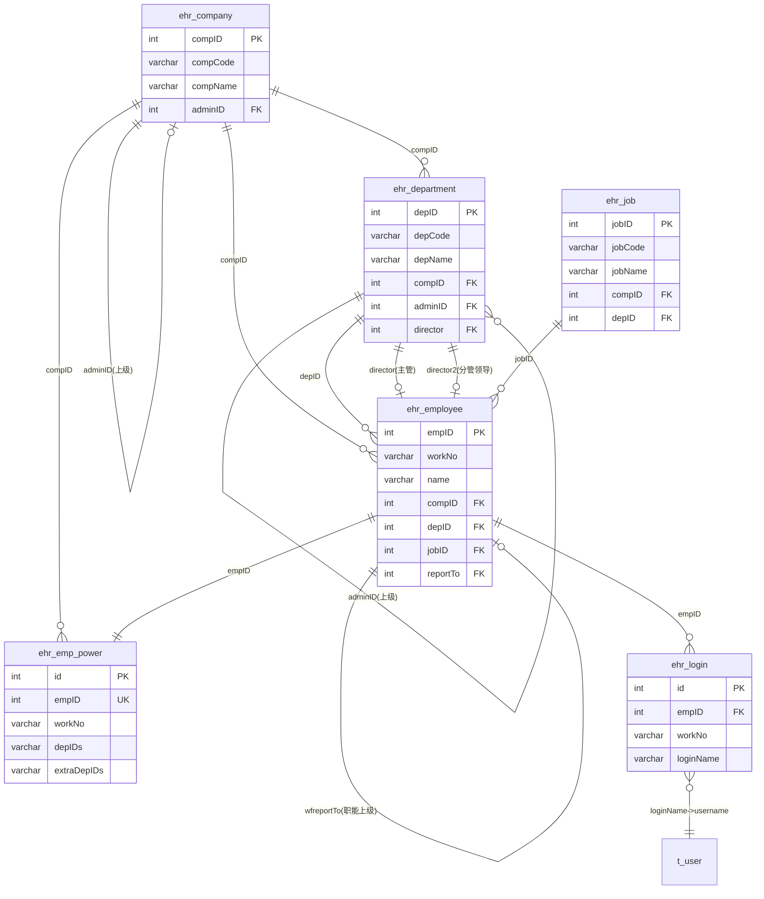

# DPPMS D365 全量数据字典 (Part 2) -- 系统支撑表

> 数据库: dppms\_d365 | 生成时间: 2026-06-12 | 数据基准: 生产环境 information\_schema 实时查询
> 业务含义来源: Java Bean 注释 + iBatis SQL映射 + 字段命名推断
> 本文档覆盖: EHR组织架构表、系统权限表、数据同步中间表、其他辅助表

***

## 目录

- [一、EHR组织架构域 (ehr\_\*)](#一ehr组织架构域-ehr_)
- [二、系统权限域 (t\_\*)](#二系统权限域-t_)
- [三、数据同步中间表域 (pm\__from_)](#三数据同步中间表域-pm__from_)
  - [3.1 ERP订单同步表](#31-erp订单同步表)
  - [3.2 SMS回款计划同步表](#32-sms回款计划同步表)
  - [3.3 OA人员同步表](#33-oa人员同步表)
  - [3.4 售前借货同步表](#34-售前借货同步表)
  - [3.5 CRM产品信息同步表](#35-crm产品信息同步表)
  - [3.6 项目属性同步表](#36-项目属性同步表)
  - [3.7 其他来源同步表](#37-其他来源同步表)
- [四、其他辅助表](#四其他辅助表)
- [附录A：数据同步流向总览](#附录a数据同步流向总览)
- [附录B：EHR组织架构ER图](#附录behr组织架构er图)
- [附录C：系统权限ER图](#附录c系统权限er图)

***

## 一、EHR组织架构域 (ehr\_\*)

EHR（Electronic Human Resource）组织架构表，从HR系统同步的组织架构基础数据，包括公司、部门、员工、岗位、权限和登录信息。是PMS系统权限控制的基础数据源。

### 1.1 ehr\_company -- EHR公司信息

| 属性   | 值                          |
| ---- | -------------------------- |
| 对象类型 | BASE TABLE                 |
| 业务含义 | 从EHR系统同步的公司组织信息，是组织架构的顶层实体 |
| 数据量  | \~3 行                      |
| 数据大小 | 16 KB                      |

**字段列表**

| 字段名          | 数据类型         | 可空  | 默认值 | 约束     | 字段描述       | 业务含义                                                                                |
| ------------ | ------------ | --- | --- | ------ | ---------- | ----------------------------------------------------------------------------------- |
| compID       | int(10)      | NO  | -   | PRI    | 公司ID，关联表外键 | 公司唯一标识，逻辑外键 -> ehr\_department.compID, ehr\_employee.compID, ehr\_emp\_power.compID |
| compCode     | varchar(10)  | YES | -   | <br /> | 公司编号       | 公司业务编码，如"01"代表总部                                                                    |
| compName     | varchar(100) | YES | -   | <br /> | 公司名称       | 公司全称                                                                                |
| compAbbr     | varchar(100) | YES | -   | <br /> | 公司简称       | 公司缩写名称                                                                              |
| adminID      | int(10)      | YES | -   | MUL    | 上级ID       | 上级公司ID，用于构建公司层级关系，逻辑外键 -> ehr\_company.compID                                       |
| compGrade    | int(10)      | YES | -   | <br /> | 公司级别       | 公司层级等级                                                                              |
| compType     | int(10)      | YES | -   | <br /> | 公司类别       | 公司类型分类                                                                              |
| compArea     | int(10)      | YES | -   | <br /> | 公司区域       | 公司所在区域编码                                                                            |
| effectDate   | datetime     | YES | -   | <br /> | 成立时间       | 公司成立日期                                                                              |
| lawyer       | varchar(50)  | YES | -   | <br /> | 法人         | 公司法人代表                                                                              |
| address      | varchar(200) | YES | -   | <br /> | 地址         | 公司办公地址                                                                              |
| regAddress   | varchar(200) | YES | -   | <br /> | 注册地址       | 公司注册地址                                                                              |
| tel          | varchar(50)  | YES | -   | <br /> | 电话         | 公司联系电话                                                                              |
| fax          | varchar(50)  | YES | -   | <br /> | 传真         | 公司传真号码                                                                              |
| postCode     | varchar(50)  | YES | -   | <br /> | 邮编         | 公司邮政编码                                                                              |
| webSite      | varchar(100) | YES | -   | <br /> | 网站         | 公司网站地址                                                                              |
| isDisabled   | bit(1)       | YES | -   | <br /> | 失效状态       | 公司是否已失效，0=正常，1=失效                                                                   |
| disabledDate | datetime     | YES | -   | <br /> | 失效时间       | 公司失效的时间戳                                                                            |
| remark       | varchar(500) | YES | -   | <br /> | 备注         | 备注信息                                                                                |

**索引列表**

| 索引名     | 索引类型  | 唯一性        | 索引字段    |
| ------- | ----- | ---------- | ------- |
| PRIMARY | BTREE | UNIQUE     | compID  |
| adminID | BTREE | NON-UNIQUE | adminID |

***

### 1.2 ehr\_department -- EHR部门信息

| 属性   | 值                           |
| ---- | --------------------------- |
| 对象类型 | BASE TABLE                  |
| 业务含义 | 从EHR系统同步的部门组织信息，构建公司-部门树形结构 |
| 数据量  | \~517 行                     |
| 数据大小 | 80 KB                       |

**字段列表**

| 字段名          | 数据类型         | 可空  | 默认值 | 约束     | 字段描述       | 业务含义                                                       |
| ------------ | ------------ | --- | --- | ------ | ---------- | ---------------------------------------------------------- |
| depID        | int(10)      | NO  | -   | PRI    | 部门ID，关联外键  | 部门唯一标识，逻辑外键 -> ehr\_employee.depID, ehr\_emp\_power.depIDs |
| depCode      | varchar(20)  | YES | -   | <br /> | 部门编码       | 部门业务编码                                                     |
| depName      | varchar(100) | YES | -   | <br /> | 部门名称       | 部门全称                                                       |
| depAbbr      | varchar(100) | YES | -   | <br /> | 部门简称       | 部门缩写名称                                                     |
| compID       | int(10)      | YES | -   | MUL    | 公司ID，外键    | 所属公司ID，逻辑外键 -> ehr\_company.compID                         |
| adminID      | int(10)      | YES | -   | MUL    | 上级ID       | 上级部门ID，用于构建部门树，逻辑外键 -> ehr\_department.depID               |
| depGrade     | int(10)      | YES | -   | <br /> | 部门级别       | 部门层级等级                                                     |
| depType      | int(10)      | YES | -   | <br /> | 部门类型       | 部门类型分类                                                     |
| depProperty  | int(10)      | YES | -   | <br /> | 部门属性       | 部门属性标记                                                     |
| depCost      | int(10)      | YES | -   | <br /> | 存在部门内分级计数用 | 部门内分级计数                                                    |
| director     | int(10)      | YES | -   | MUL    | 主管         | 部门主管员工ID，逻辑外键 -> ehr\_employee.empID                       |
| director2    | int(10)      | YES | -   | MUL    | 分管领导       | 分管领导员工ID，逻辑外键 -> ehr\_employee.empID                       |
| depEmp       | int(10)      | YES | -   | <br /> | 部门员工数      | 部门内员工计数                                                    |
| depNum       | int(10)      | YES | -   | <br /> | 部门编号       | 部门排序编号                                                     |
| effectDate   | datetime     | YES | -   | <br /> | 生效时间       | 部门生效日期                                                     |
| xOrder       | varchar(20)  | YES | -   | <br /> | 排序         | 部门显示排序值                                                    |
| isDisabled   | bit(1)       | YES | -   | <br /> | 失效状态       | 部门是否已失效                                                    |
| disabledDate | datetime     | YES | -   | <br /> | 失效时间       | 部门失效的时间戳                                                   |
| remark       | varchar(500) | YES | -   | <br /> | 备注         | 备注信息                                                       |
| depCustom1   | int(10)      | YES | -   | <br /> | 保留字段1      | 预留扩展字段                                                     |
| depCustom2   | int(10)      | YES | -   | <br /> | 保留字段2、部门秘书 | 预留扩展字段，也用于存储部门秘书信息                                         |
| depCustom3   | int(10)      | YES | -   | <br /> | 保留字段3      | 预留扩展字段                                                     |
| depCustom4   | int(10)      | YES | -   | <br /> | 保留字段4      | 预留扩展字段                                                     |
| depCustom5   | int(10)      | YES | -   | <br /> | 保留字段5      | 预留扩展字段                                                     |

**索引列表**

| 索引名       | 索引类型  | 唯一性        | 索引字段      |
| --------- | ----- | ---------- | --------- |
| PRIMARY   | BTREE | UNIQUE     | depID     |
| adminID   | BTREE | NON-UNIQUE | adminID   |
| compID    | BTREE | NON-UNIQUE | compID    |
| director  | BTREE | NON-UNIQUE | director  |
| director2 | BTREE | NON-UNIQUE | director2 |

***

### 1.3 ehr\_employee -- EHR员工信息

| 属性   | 值                               |
| ---- | ------------------------------- |
| 对象类型 | BASE TABLE                      |
| 业务含义 | 从EHR系统同步的员工基本信息，是PMS系统用户身份识别的基础 |
| 数据量  | \~4,831 行                       |
| 数据大小 | 1.5 MB                          |

**字段列表**

| 字段名           | 数据类型         | 可空  | 默认值 | 约束     | 字段描述       | 业务含义                                                   |
| ------------- | ------------ | --- | --- | ------ | ---------- | ------------------------------------------------------ |
| empID         | int(10)      | NO  | -   | PRI    | 员工ID，外键    | 员工唯一标识，逻辑外键 -> ehr\_emp\_power.empID, ehr\_login.empID |
| workNo        | varchar(100) | NO  | -   | MUL    | 工号         | 员工工号，用于系统登录和身份识别                                       |
| name          | varchar(200) | YES | -   | <br /> | 姓名         | 员工中文姓名                                                 |
| eName         | varchar(200) | YES | -   | <br /> | 英文名        | 员工英文名称                                                 |
| compID        | int(10)      | NO  | -   | MUL    | 公司ID       | 所属公司ID，逻辑外键 -> ehr\_company.compID                     |
| depID         | int(10)      | NO  | -   | MUL    | 部门ID       | 所属部门ID，逻辑外键 -> ehr\_department.depID                   |
| jobID         | int(10)      | NO  | -   | MUL    | 岗位ID       | 岗位ID，逻辑外键 -> ehr\_job.jobID                            |
| reportTo      | int(10)      | YES | -   | MUL    | 直接上级       | 直属上级员工ID，逻辑外键 -> ehr\_employee.empID                   |
| wfreportTo    | int(10)      | YES | -   | MUL    | 职能上级       | 职能上级员工ID，逻辑外键 -> ehr\_employee.empID                   |
| empStatus     | int(10)      | NO  | -   | <br /> | 员工状态       | 1=在职，2=离职                                              |
| jobStatus     | int(10)      | YES | -   | <br /> | 岗位状态       | 岗位在岗状态                                                 |
| empType       | int(10)      | YES | -   | <br /> | 聘用类型       | 1=正式，3=实习生                                             |
| joinDate      | datetime     | YES | -   | <br /> | 加入公司日期     | 员工入职日期                                                 |
| workBeginDate | datetime     | YES | -   | <br /> | 工作开始日期     | 员工开始工作日期                                               |
| jobBeginDate  | datetime     | YES | -   | <br /> | 加入公司日期（未知） | 岗位开始日期                                                 |
| pracBeginDate | datetime     | YES | -   | <br /> | 实习开始时间     | 实习期开始日期                                                |
| pracEndDate   | datetime     | YES | -   | <br /> | 实习结束时间     | 实习期结束日期                                                |
| probBeginDate | datetime     | YES | -   | <br /> | 试用期开始时间    | 试用期开始日期（推断）                                            |
| probEndDate   | datetime     | YES | -   | <br /> | 试用期结束时间    | 试用期结束日期（推断）                                            |
| leaveDate     | datetime     | YES | -   | <br /> | 离职时间       | 员工离职日期                                                 |
| gender        | int(10)      | YES | -   | <br /> | 性别         | 1=男，2=女                                                |
| email         | varchar(500) | YES | -   | <br /> | 邮箱         | 员工邮箱地址                                                 |
| mobile        | varchar(50)  | YES | -   | <br /> | 手机         | 员工手机号码                                                 |
| officePhone   | varchar(50)  | YES | -   | <br /> | 座机         | 员工办公座机号码                                               |
| remark        | varchar(100) | YES | -   | <br /> | 备注         | 备注信息                                                   |
| disabled      | int(10)      | YES | 0   | <br /> | 失效         | 员工是否失效，0=正常                                            |
| empCustom1    | int(10)      | YES | -   | <br /> | 预留字段1      | 预留扩展字段                                                 |
| empCustom2    | int(10)      | YES | -   | <br /> | 预留字段2      | 预留扩展字段                                                 |
| empCustom3    | int(10)      | YES | -   | <br /> | 预留字段3      | 预留扩展字段                                                 |
| empCustom4    | varchar(50)  | YES | -   | <br /> | 预留字段4      | 预留扩展字段                                                 |
| empCustom5    | int(10)      | YES | -   | <br /> | 预留字段5      | 预留扩展字段                                                 |

**索引列表**

| 索引名        | 索引类型  | 唯一性        | 索引字段       |
| ---------- | ----- | ---------- | ---------- |
| PRIMARY    | BTREE | UNIQUE     | empID      |
| compID     | BTREE | NON-UNIQUE | compID     |
| depID      | BTREE | NON-UNIQUE | depID      |
| jobID      | BTREE | NON-UNIQUE | jobID      |
| reportTo   | BTREE | NON-UNIQUE | reportTo   |
| wfreportTo | BTREE | NON-UNIQUE | wfreportTo |
| workNo     | BTREE | NON-UNIQUE | workNo     |

***

### 1.4 ehr\_emp\_power -- EHR员工权限

| 属性   | 值                     |
| ---- | --------------------- |
| 对象类型 | BASE TABLE            |
| 业务含义 | 员工数据权限配置，控制员工可查看的部门范围 |
| 数据量  | \~127 行               |
| 数据大小 | 64 KB                 |

**字段列表**

| 字段名         | 数据类型          | 可空  | 默认值 | 约束                   | 字段描述                | 业务含义                               |
| ----------- | ------------- | --- | --- | -------------------- | ------------------- | ---------------------------------- |
| id          | int(10)       | NO  | -   | PRI, AUTO\_INCREMENT | 主键                  | 自增主键                               |
| empID       | int(10)       | NO  | -   | UNI                  | empID               | 员工ID，逻辑外键 -> ehr\_employee.empID   |
| workNo      | varchar(25)   | NO  | ''  | MUL                  | 工号                  | 员工工号                               |
| compID      | int(10)       | NO  | -   | <br />               | 公司id                | 所属公司ID，逻辑外键 -> ehr\_company.compID |
| depIDs      | varchar(4096) | NO  | ''  | <br />               | 从ehr同步数据生成的部门权限，固定的 | 员工可访问的部门ID列表，逗号分隔                  |
| extraDepIDs | varchar(4096) | NO  | ''  | <br />               | 额外授权的部门权限           | 手动额外授权的部门ID列表                      |
| updateBy    | varchar(50)   | YES | -   | <br />               | 更新人                 | 最后修改人                              |
| updateTime  | datetime      | YES | -   | <br />               | 更新时间                | 最后修改时间                             |

**索引列表**

| 索引名     | 索引类型  | 唯一性        | 索引字段   |
| ------- | ----- | ---------- | ------ |
| PRIMARY | BTREE | UNIQUE     | id     |
| empID   | BTREE | UNIQUE     | empID  |
| workNo  | BTREE | NON-UNIQUE | workNo |

***

### 1.5 ehr\_job -- EHR岗位信息

| 属性   | 值                        |
| ---- | ------------------------ |
| 对象类型 | BASE TABLE               |
| 业务含义 | 从EHR系统同步的岗位信息，定义组织内的岗位体系 |
| 数据量  | \~245 行                  |
| 数据大小 | 48 KB                    |

**字段列表**

| 字段名          | 数据类型         | 可空  | 默认值 | 约束     | 字段描述 | 业务含义                                 |
| ------------ | ------------ | --- | --- | ------ | ---- | ------------------------------------ |
| jobID        | int(10)      | NO  | -   | PRI    | 岗位ID | 岗位唯一标识，逻辑外键 -> ehr\_employee.jobID   |
| jobCode      | varchar(20)  | YES | -   | <br /> | 岗位编码 | 岗位业务编码                               |
| jobName      | varchar(100) | YES | -   | <br /> | 岗位名称 | 岗位名称                                 |
| jobAbbr      | varchar(100) | YES | -   | <br /> | 岗位简称 | 岗位缩写                                 |
| compID       | int(10)      | YES | -   | MUL    | 公司ID | 所属公司ID，逻辑外键 -> ehr\_company.compID   |
| depID        | int(10)      | YES | -   | MUL    | 部门ID | 所属部门ID，逻辑外键 -> ehr\_department.depID |
| jobGrade     | int(10)      | YES | -   | <br /> | 岗位级别 | 岗位层级等级                               |
| jobType      | int(10)      | YES | -   | <br /> | 岗位类型 | 岗位类型分类                               |
| isDisabled   | bit(1)       | YES | -   | <br /> | 失效状态 | 岗位是否已失效                              |
| disabledDate | datetime     | YES | -   | <br /> | 失效时间 | 岗位失效的时间戳                             |
| remark       | varchar(500) | YES | -   | <br /> | 备注   | 备注信息                                 |

**索引列表**

| 索引名     | 索引类型  | 唯一性        | 索引字段   |
| ------- | ----- | ---------- | ------ |
| PRIMARY | BTREE | UNIQUE     | jobID  |
| compID  | BTREE | NON-UNIQUE | compID |
| depID   | BTREE | NON-UNIQUE | depID  |

***

### 1.6 ehr\_login -- EHR登录映射

| 属性   | 值                     |
| ---- | --------------------- |
| 对象类型 | BASE TABLE            |
| 业务含义 | EHR员工与PMS系统登录账号的映射关系表 |
| 数据量  | \~3,224 行             |
| 数据大小 | 272 KB                |

**字段列表**

| 字段名        | 数据类型         | 可空  | 默认值 | 约束                   | 字段描述 | 业务含义                                        |
| ---------- | ------------ | --- | --- | -------------------- | ---- | ------------------------------------------- |
| id         | int(10)      | NO  | -   | PRI, AUTO\_INCREMENT | 主键   | 自增主键                                        |
| empID      | int(10)      | NO  | -   | <br />               | 员工ID | 逻辑外键 -> ehr\_employee.empID                 |
| workNo     | varchar(100) | YES | -   | <br />               | 工号   | 员工工号                                        |
| loginName  | varchar(100) | YES | -   | <br />               | 登录名  | PMS系统登录用户名，逻辑外键 -> fnd\_user\_info.username |
| loginType  | int(10)      | YES | -   | <br />               | 登录类型 | 登录方式分类                                      |
| compID     | int(10)      | YES | -   | <br />               | 公司ID | 逻辑外键 -> ehr\_company.compID                 |
| depID      | int(10)      | YES | -   | <br />               | 部门ID | 逻辑外键 -> ehr\_department.depID               |
| updateBy   | varchar(50)  | YES | -   | <br />               | 更新人  | 最后修改人                                       |
| updateTime | datetime     | YES | -   | <br />               | 更新时间 | 最后修改时间                                      |

**索引列表**

| 索引名     | 索引类型  | 唯一性    | 索引字段 |
| ------- | ----- | ------ | ---- |
| PRIMARY | BTREE | UNIQUE | id   |

***

## 二、系统权限域 (t\_\*)

系统权限控制相关表，采用RBAC（基于角色的访问控制）模型，管理用户、角色、权限、菜单、资源等。注意：系统中同时存在 `t_*` 前缀表和 `fnd_*` 前缀表，`fnd_*` 为旧版基础平台表，`t_*` 为新版权限体系表。

### 2.1 t\_company -- 公司信息（权限域）

| 属性   | 值                            |
| ---- | ---------------------------- |
| 对象类型 | BASE TABLE                   |
| 业务含义 | 权限体系中的公司信息，与ehr\_company数据同步 |
| 数据量  | \~3 行                        |
| 数据大小 | 16 KB                        |

**字段列表**

| 字段名          | 数据类型         | 可空  | 默认值 | 约束     | 字段描述       | 业务含义     |
| ------------ | ------------ | --- | --- | ------ | ---------- | -------- |
| id           | int(10)      | NO  | -   | PRI    | 公司ID，关联表外键 | 公司唯一标识   |
| compCode     | varchar(10)  | NO  | ''  | MUL    | 公司编号       | 公司业务编码   |
| compName     | varchar(100) | NO  | ''  | <br /> | 公司名称       | 公司全称     |
| compAbbr     | varchar(100) | YES | ''  | <br /> | 公司简称       | 公司缩写名称   |
| compAccount  | varchar(10)  | YES | ''  | <br /> | 公司账套       | 公司财务账套编码 |
| adminID      | int(10)      | NO  | 0   | MUL    | 上级ID       | 上级公司ID   |
| compGrade    | int(10)      | YES | -   | <br /> | 公司级别       | 公司层级等级   |
| compType     | int(10)      | YES | -   | <br /> | 公司类别       | 公司类型分类   |
| compArea     | int(10)      | YES | -   | <br /> | 公司区域       | 公司所在区域   |
| effectDate   | datetime     | YES | -   | <br /> | 成立时间       | 公司成立日期   |
| lawyer       | varchar(50)  | YES | -   | <br /> | 法人         | 公司法人代表   |
| address      | varchar(200) | YES | -   | <br /> | 地址         | 公司办公地址   |
| regAddress   | varchar(200) | YES | -   | <br /> | 注册地址       | 公司注册地址   |
| tel          | varchar(50)  | YES | -   | <br /> | 电话         | 公司联系电话   |
| fax          | varchar(50)  | YES | -   | <br /> | 传真         | 公司传真号码   |
| postCode     | varchar(50)  | YES | -   | <br /> | 邮编         | 公司邮政编码   |
| webSite      | varchar(100) | YES | -   | <br /> | 网站         | 公司网站地址   |
| isDisabled   | bit(1)       | YES | -   | <br /> | 失效状态       | 公司是否已失效  |
| disabledDate | datetime     | YES | -   | <br /> | 失效时间       | 公司失效的时间戳 |
| remark       | varchar(500) | YES | -   | <br /> | 备注         | 备注信息     |

**索引列表**

| 索引名      | 索引类型  | 唯一性        | 索引字段     |
| -------- | ----- | ---------- | -------- |
| PRIMARY  | BTREE | UNIQUE     | id       |
| compCode | BTREE | NON-UNIQUE | compCode |
| adminID  | BTREE | NON-UNIQUE | adminID  |

***

### 2.2 t\_user -- 用户表

| 属性   | 值                     |
| ---- | --------------------- |
| 对象类型 | BASE TABLE            |
| 业务含义 | 系统用户账号表，存储用户登录凭证和基本信息 |
| 数据量  | \~189 行               |
| 数据大小 | 48 KB                 |

**字段列表**

| 字段名           | 数据类型         | 可空  | 默认值 | 约束                   | 字段描述   | 业务含义           |
| ------------- | ------------ | --- | --- | -------------------- | ------ | -------------- |
| id            | int(10)      | NO  | -   | PRI, AUTO\_INCREMENT | 主键     | 用户唯一标识         |
| username      | varchar(50)  | NO  | ''  | UNI                  | 用户名    | 登录用户名，唯一       |
| password      | varchar(200) | NO  | ''  | <br />               | 密码     | 加密后的登录密码       |
| email         | varchar(100) | YES | -   | <br />               | 邮箱     | 用户邮箱地址         |
| realName      | varchar(100) | YES | -   | <br />               | 真实姓名   | 用户真实姓名         |
| status        | int(10)      | YES | -   | <br />               | 状态     | 用户状态，1=启用，0=禁用 |
| roleIds       | varchar(200) | YES | -   | <br />               | 角色ID列表 | 用户关联的角色ID，分号分隔 |
| isemail       | int(10)      | YES | -   | <br />               | 是否发送邮件 | 邮件通知开关         |
| pwdoverdue    | datetime     | YES | -   | <br />               | 密码过期时间 | 密码有效期截止时间      |
| defaultPage   | varchar(200) | YES | -   | <br />               | 默认首页   | 用户登录后的默认跳转页面路径 |
| dpNo          | varchar(50)  | YES | -   | <br />               | 部门编号   | 用户所属部门编号       |
| customInfo    | text         | YES | -   | <br />               | 自定义信息  | JSON格式扩展信息     |
| createBy      | varchar(50)  | YES | -   | <br />               | 创建人    | 记录创建人          |
| createTime    | datetime     | YES | -   | <br />               | 创建时间   | 记录创建时间         |
| updateBy      | varchar(50)  | YES | -   | <br />               | 更新人    | 最后修改人          |
| updateTime    | datetime     | YES | -   | <br />               | 更新时间   | 最后修改时间         |
| effectiveFrom | datetime     | YES | -   | <br />               | 生效开始时间 | 用户有效期起始        |
| effectiveTo   | datetime     | YES | -   | <br />               | 生效结束时间 | 用户有效期截止        |

**索引列表**

| 索引名      | 索引类型  | 唯一性    | 索引字段     |
| -------- | ----- | ------ | -------- |
| PRIMARY  | BTREE | UNIQUE | id       |
| username | BTREE | UNIQUE | username |

***

### 2.3 t\_user\_info -- 用户详细信息

| 属性   | 值                     |
| ---- | --------------------- |
| 对象类型 | BASE TABLE            |
| 业务含义 | 用户扩展信息表，与t\_user一对一关联 |
| 数据量  | \~189 行               |
| 数据大小 | 64 KB                 |

**字段列表**

| 字段名           | 数据类型         | 可空  | 默认值 | 约束     | 字段描述   | 业务含义               |
| ------------- | ------------ | --- | --- | ------ | ------ | ------------------ |
| id            | int(10)      | NO  | -   | PRI    | 用户ID   | 逻辑外键 -> t\_user.id |
| username      | varchar(50)  | NO  | ''  | <br /> | 用户名    | 登录用户名              |
| password      | varchar(200) | NO  | ''  | <br /> | 密码     | 加密后的登录密码           |
| email         | varchar(100) | YES | -   | <br /> | 邮箱     | 用户邮箱地址             |
| realName      | varchar(100) | YES | -   | <br /> | 真实姓名   | 用户真实姓名             |
| status        | int(10)      | YES | -   | <br /> | 状态     | 用户状态               |
| roleIds       | varchar(200) | YES | -   | <br /> | 角色ID列表 | 关联角色ID列表           |
| isemail       | int(10)      | YES | -   | <br /> | 是否发送邮件 | 邮件通知开关             |
| pwdoverdue    | datetime     | YES | -   | <br /> | 密码过期时间 | 密码有效期截止            |
| defaultPage   | varchar(200) | YES | -   | <br /> | 默认首页   | 登录默认页面             |
| dpNo          | varchar(50)  | YES | -   | <br /> | 部门编号   | 所属部门编号             |
| customInfo    | text         | YES | -   | <br /> | 自定义信息  | JSON扩展信息           |
| createBy      | varchar(50)  | YES | -   | <br /> | 创建人    | 记录创建人              |
| createTime    | datetime     | YES | -   | <br /> | 创建时间   | 记录创建时间             |
| updateBy      | varchar(50)  | YES | -   | <br /> | 更新人    | 最后修改人              |
| updateTime    | datetime     | YES | -   | <br /> | 更新时间   | 最后修改时间             |
| effectiveFrom | datetime     | YES | -   | <br /> | 生效开始时间 | 有效期起始              |
| effectiveTo   | datetime     | YES | -   | <br /> | 生效结束时间 | 有效期截止              |

**索引列表**

| 索引名      | 索引类型  | 唯一性        | 索引字段     |
| -------- | ----- | ---------- | -------- |
| PRIMARY  | BTREE | UNIQUE     | id       |
| username | BTREE | NON-UNIQUE | username |
| dpNo     | BTREE | NON-UNIQUE | dpNo     |

***

### 2.4 t\_role -- 角色表

| 属性   | 值                   |
| ---- | ------------------- |
| 对象类型 | BASE TABLE          |
| 业务含义 | 系统角色定义，RBAC模型中的角色实体 |
| 数据量  | \~12 行              |
| 数据大小 | 16 KB               |

**字段列表**

| 字段名           | 数据类型         | 可空  | 默认值 | 约束                   | 字段描述   | 业务含义           |
| ------------- | ------------ | --- | --- | -------------------- | ------ | -------------- |
| id            | int(10)      | NO  | -   | PRI, AUTO\_INCREMENT | 主键     | 角色唯一标识         |
| roleName      | varchar(100) | NO  | ''  | <br />               | 角色名称   | 角色显示名称         |
| status        | int(10)      | YES | -   | <br />               | 状态     | 角色状态，1=启用，0=禁用 |
| defaultPage   | varchar(200) | YES | -   | <br />               | 默认首页   | 该角色用户登录后的默认页面  |
| remark        | varchar(500) | YES | -   | <br />               | 备注     | 角色描述备注         |
| createBy      | varchar(50)  | YES | -   | <br />               | 创建人    | 记录创建人          |
| createTime    | datetime     | YES | -   | <br />               | 创建时间   | 记录创建时间         |
| updateBy      | varchar(50)  | YES | -   | <br />               | 更新人    | 最后修改人          |
| updateTime    | datetime     | YES | -   | <br />               | 更新时间   | 最后修改时间         |
| effectiveFrom | datetime     | YES | -   | <br />               | 生效开始时间 | 角色有效期起始        |
| effectiveTo   | datetime     | YES | -   | <br />               | 生效结束时间 | 角色有效期截止        |

**索引列表**

| 索引名     | 索引类型  | 唯一性    | 索引字段 |
| ------- | ----- | ------ | ---- |
| PRIMARY | BTREE | UNIQUE | id   |

***

### 2.5 t\_role\_menu -- 角色菜单关联

| 属性   | 值             |
| ---- | ------------- |
| 对象类型 | BASE TABLE    |
| 业务含义 | 角色与菜单的多对多关联关系 |
| 数据量  | \~122 行       |
| 数据大小 | 16 KB         |

**字段列表**

| 字段名       | 数据类型        | 可空  | 默认值 | 约束                   | 字段描述  | 业务含义                     |
| --------- | ----------- | --- | --- | -------------------- | ----- | ------------------------ |
| id        | int(10)     | NO  | -   | PRI, AUTO\_INCREMENT | 主键    | 自增主键                     |
| roleId    | int(10)     | NO  | -   | <br />               | 角色ID  | 逻辑外键 -> t\_role.id       |
| menuCode  | varchar(50) | NO  | ''  | <br />               | 菜单编码  | 逻辑外键 -> t\_menu.menuCode |
| menuValue | int(10)     | YES | -   | <br />               | 菜单权限值 | 菜单权限值，1=有权限              |

**索引列表**

| 索引名     | 索引类型  | 唯一性    | 索引字段 |
| ------- | ----- | ------ | ---- |
| PRIMARY | BTREE | UNIQUE | id   |

***

### 2.6 t\_role\_permission -- 角色权限关联

| 属性   | 值             |
| ---- | ------------- |
| 对象类型 | BASE TABLE    |
| 业务含义 | 角色与权限的多对多关联关系 |
| 数据量  | \~613 行       |
| 数据大小 | 48 KB         |

**字段列表**

| 字段名          | 数据类型    | 可空 | 默认值 | 约束                   | 字段描述 | 业务含义                     |
| ------------ | ------- | -- | --- | -------------------- | ---- | ------------------------ |
| id           | int(10) | NO | -   | PRI, AUTO\_INCREMENT | 主键   | 自增主键                     |
| roleId       | int(10) | NO | -   | MUL                  | 角色ID | 逻辑外键 -> t\_role.id       |
| permissionId | int(10) | NO | -   | <br />               | 权限ID | 逻辑外键 -> t\_permission.id |

**索引列表**

| 索引名     | 索引类型  | 唯一性        | 索引字段   |
| ------- | ----- | ---------- | ------ |
| PRIMARY | BTREE | UNIQUE     | id     |
| roleId  | BTREE | NON-UNIQUE | roleId |

***

### 2.7 t\_user\_role -- 用户角色关联

| 属性   | 值             |
| ---- | ------------- |
| 对象类型 | BASE TABLE    |
| 业务含义 | 用户与角色的多对多关联关系 |
| 数据量  | \~551 行       |
| 数据大小 | 48 KB         |

**字段列表**

| 字段名    | 数据类型    | 可空 | 默认值 | 约束                   | 字段描述 | 业务含义               |
| ------ | ------- | -- | --- | -------------------- | ---- | ------------------ |
| id     | int(10) | NO | -   | PRI, AUTO\_INCREMENT | 主键   | 自增主键               |
| userId | int(10) | NO | -   | MUL                  | 用户ID | 逻辑外键 -> t\_user.id |
| roleId | int(10) | NO | -   | MUL                  | 角色ID | 逻辑外键 -> t\_role.id |

**索引列表**

| 索引名     | 索引类型  | 唯一性        | 索引字段   |
| ------- | ----- | ---------- | ------ |
| PRIMARY | BTREE | UNIQUE     | id     |
| userId  | BTREE | NON-UNIQUE | userId |
| roleId  | BTREE | NON-UNIQUE | roleId |

***

### 2.8 t\_menu -- 菜单表

| 属性   | 值           |
| ---- | ----------- |
| 对象类型 | BASE TABLE  |
| 业务含义 | 系统菜单定义，树形结构 |
| 数据量  | \~37 行      |
| 数据大小 | 16 KB       |

**字段列表**

| 字段名           | 数据类型         | 可空  | 默认值 | 约束                   | 字段描述   | 业务含义               |
| ------------- | ------------ | --- | --- | -------------------- | ------ | ------------------ |
| id            | int(10)      | NO  | -   | PRI, AUTO\_INCREMENT | 主键     | 菜单唯一标识             |
| menuCode      | varchar(50)  | NO  | ''  | <br />               | 菜单编码   | 菜单业务编码，唯一标识菜单项     |
| menuName      | varchar(100) | NO  | ''  | <br />               | 菜单名称   | 菜单显示名称             |
| menuLevel     | int(10)      | YES | -   | <br />               | 菜单层级   | 菜单在树中的层级           |
| superId       | int(10)      | YES | -   | <br />               | 父菜单ID  | 逻辑外键 -> t\_menu.id |
| path          | varchar(200) | YES | -   | <br />               | 菜单路径   | 菜单对应的URL路径         |
| effectiveFrom | datetime     | YES | -   | <br />               | 生效开始时间 | 菜单有效期起始            |
| effectiveTo   | datetime     | YES | -   | <br />               | 生效结束时间 | 菜单有效期截止            |

**索引列表**

| 索引名     | 索引类型  | 唯一性    | 索引字段 |
| ------- | ----- | ------ | ---- |
| PRIMARY | BTREE | UNIQUE | id   |

***

### 2.9 t\_permission -- 权限表

| 属性   | 值              |
| ---- | -------------- |
| 对象类型 | BASE TABLE     |
| 业务含义 | 系统权限定义，细粒度操作权限 |
| 数据量  | \~115 行        |
| 数据大小 | 16 KB          |

**字段列表**

| 字段名            | 数据类型         | 可空  | 默认值 | 约束                   | 字段描述 | 业务含义                   |
| -------------- | ------------ | --- | --- | -------------------- | ---- | ---------------------- |
| id             | int(10)      | NO  | -   | PRI, AUTO\_INCREMENT | 主键   | 权限唯一标识                 |
| permissionName | varchar(100) | NO  | ''  | <br />               | 权限名称 | 权限显示名称                 |
| permissionCode | varchar(100) | NO  | ''  | <br />               | 权限编码 | 权限业务编码                 |
| resourceId     | int(10)      | YES | -   | <br />               | 资源ID | 逻辑外键 -> t\_resource.id |
| permissionType | varchar(50)  | YES | -   | <br />               | 权限类型 | 权限分类                   |
| description    | varchar(500) | YES | -   | <br />               | 描述   | 权限描述信息                 |

**索引列表**

| 索引名     | 索引类型  | 唯一性    | 索引字段 |
| ------- | ----- | ------ | ---- |
| PRIMARY | BTREE | UNIQUE | id   |

***

### 2.10 t\_resource -- 资源表

| 属性   | 值                |
| ---- | ---------------- |
| 对象类型 | BASE TABLE       |
| 业务含义 | 系统资源定义，权限控制的资源对象 |
| 数据量  | \~36 行           |
| 数据大小 | 16 KB            |

**字段列表**

| 字段名          | 数据类型         | 可空  | 默认值 | 约束                   | 字段描述 | 业务含义   |
| ------------ | ------------ | --- | --- | -------------------- | ---- | ------ |
| id           | int(10)      | NO  | -   | PRI, AUTO\_INCREMENT | 主键   | 资源唯一标识 |
| resourceName | varchar(100) | NO  | ''  | <br />               | 资源名称 | 资源显示名称 |
| resourceCode | varchar(100) | NO  | ''  | <br />               | 资源编码 | 资源业务编码 |
| resourceType | varchar(50)  | YES | -   | <br />               | 资源类型 | 资源分类   |
| description  | varchar(500) | YES | -   | <br />               | 描述   | 资源描述信息 |

**索引列表**

| 索引名     | 索引类型  | 唯一性    | 索引字段 |
| ------- | ----- | ------ | ---- |
| PRIMARY | BTREE | UNIQUE | id   |

***

### 2.11 t\_data\_field\_relation -- 数据字段关系

| 属性   | 值                         |
| ---- | ------------------------- |
| 对象类型 | BASE TABLE                |
| 业务含义 | 数据字段别名映射关系，用于数据导入导出时的字段映射 |
| 数据量  | \~0 行                     |
| 数据大小 | 16 KB                     |

**字段列表**

| 字段名      | 数据类型         | 可空  | 默认值 | 约束                   | 字段描述   | 业务含义     |
| -------- | ------------ | --- | --- | -------------------- | ------ | -------- |
| id       | int(10)      | NO  | -   | PRI, AUTO\_INCREMENT | 主键     | 自增主键     |
| dataName | varchar(255) | NO  | -   | <br />               | 数据名    | 数据对象名称   |
| dataType | varchar(255) | NO  | -   | <br />               | 数据类型   | 数据对象类型   |
| dataId   | int(10)      | YES | 0   | <br />               | 数据实例ID | 数据对象实例标识 |
| field    | varchar(128) | NO  | -   | <br />               | 字段     | 原始字段名    |
| alias    | varchar(128) | YES | -   | <br />               | 别名     | 字段别名/映射名 |

**索引列表**

| 索引名     | 索引类型  | 唯一性    | 索引字段 |
| ------- | ----- | ------ | ---- |
| PRIMARY | BTREE | UNIQUE | id   |

***

### 2.12 t\_data\_operation -- 数据导入导出控制

| 属性   | 值              |
| ---- | -------------- |
| 对象类型 | BASE TABLE     |
| 表注释  | 数据的导入导出控制表     |
| 业务含义 | 控制数据导入导出操作的配置表 |
| 数据量  | \~14 行         |
| 数据大小 | 80 KB          |

**字段列表**

| 字段名           | 数据类型         | 可空  | 默认值 | 约束                   | 字段描述 | 业务含义       |
| ------------- | ------------ | --- | --- | -------------------- | ---- | ---------- |
| id            | int(10)      | NO  | -   | PRI, AUTO\_INCREMENT | 主键   | 自增主键       |
| dataName      | varchar(255) | NO  | -   | <br />               | 数据名  | 数据对象名称     |
| dataType      | varchar(255) | NO  | -   | <br />               | 数据类型 | 数据对象类型     |
| operationType | varchar(50)  | NO  | -   | <br />               | 操作类型 | 导入/导出类型标识  |
| templateFile  | varchar(500) | YES | -   | <br />               | 模板文件 | 导入导出模板文件路径 |
| description   | varchar(500) | YES | -   | <br />               | 描述   | 操作描述信息     |

**索引列表**

| 索引名     | 索引类型  | 唯一性    | 索引字段 |
| ------- | ----- | ------ | ---- |
| PRIMARY | BTREE | UNIQUE | id   |

***

### 2.13 t\_dictionary -- 数据字典

| 属性   | 值              |
| ---- | -------------- |
| 对象类型 | BASE TABLE     |
| 业务含义 | 系统数据字典，存储键值对配置 |
| 数据量  | \~4 行          |
| 数据大小 | 16 KB          |

**字段列表**

| 字段名       | 数据类型         | 可空  | 默认值 | 约束                   | 字段描述 | 业务含义   |
| --------- | ------------ | --- | --- | -------------------- | ---- | ------ |
| id        | int(10)      | NO  | -   | PRI, AUTO\_INCREMENT | 主键   | 自增主键   |
| dictCode  | varchar(100) | NO  | ''  | <br />               | 字典编码 | 字典项编码  |
| dictName  | varchar(200) | NO  | ''  | <br />               | 字典名称 | 字典项名称  |
| dictValue | text         | YES | -   | <br />               | 字典值  | 字典项值   |
| dictType  | varchar(50)  | YES | -   | <br />               | 字典类型 | 字典分类   |
| parentId  | int(10)      | YES | -   | <br />               | 父级ID | 父字典项ID |
| sort      | int(10)      | YES | -   | <br />               | 排序   | 显示排序值  |
| remark    | varchar(500) | YES | -   | <br />               | 备注   | 备注信息   |

**索引列表**

| 索引名     | 索引类型  | 唯一性    | 索引字段 |
| ------- | ----- | ------ | ---- |
| PRIMARY | BTREE | UNIQUE | id   |

***

### 2.14 t\_down\_log -- 下载日志

| 属性   | 值          |
| ---- | ---------- |
| 对象类型 | BASE TABLE |
| 业务含义 | 文件下载操作日志记录 |
| 数据量  | \~33 行     |
| 数据大小 | 16 KB      |

**字段列表**

| 字段名          | 数据类型         | 可空  | 默认值 | 约束                   | 字段描述 | 业务含义       |
| ------------ | ------------ | --- | --- | -------------------- | ---- | ---------- |
| id           | int(10)      | NO  | -   | PRI, AUTO\_INCREMENT | 主键   | 自增主键       |
| fileName     | varchar(500) | YES | -   | <br />               | 文件名  | 下载的文件名     |
| downloadUser | varchar(100) | YES | -   | <br />               | 下载用户 | 下载操作的用户名   |
| downloadTime | datetime     | YES | -   | <br />               | 下载时间 | 下载操作时间     |
| fileType     | varchar(50)  | YES | -   | <br />               | 文件类型 | 下载文件类型     |
| fileSize     | bigint(20)   | YES | -   | <br />               | 文件大小 | 下载文件大小(字节) |

**索引列表**

| 索引名     | 索引类型  | 唯一性    | 索引字段 |
| ------- | ----- | ------ | ---- |
| PRIMARY | BTREE | UNIQUE | id   |

***

### 2.15 t\_file -- 文件表

| 属性   | 值          |
| ---- | ---------- |
| 对象类型 | BASE TABLE |
| 业务含义 | 系统文件存储记录   |
| 数据量  | \~291 行    |
| 数据大小 | 1.5 MB     |

**字段列表**

| 字段名         | 数据类型         | 可空  | 默认值 | 约束                   | 字段描述   | 业务含义                     |
| ----------- | ------------ | --- | --- | -------------------- | ------ | ------------------------ |
| id          | int(10)      | NO  | -   | PRI, AUTO\_INCREMENT | 主键     | 文件唯一标识                   |
| fileName    | varchar(500) | YES | -   | <br />               | 文件名    | 原始文件名                    |
| filePath    | varchar(500) | YES | -   | <br />               | 文件路径   | 文件存储路径                   |
| fileSize    | bigint(20)   | YES | -   | <br />               | 文件大小   | 文件大小(字节)                 |
| fileType    | varchar(50)  | YES | -   | <br />               | 文件类型   | 文件MIME类型                 |
| fileTypeId  | int(10)      | YES | -   | <br />               | 文件类型ID | 逻辑外键 -> t\_file\_type.id |
| uploadUser  | varchar(100) | YES | -   | <br />               | 上传用户   | 上传操作的用户名                 |
| uploadTime  | datetime     | YES | -   | <br />               | 上传时间   | 文件上传时间                   |
| description | varchar(500) | YES | -   | <br />               | 描述     | 文件描述信息                   |

**索引列表**

| 索引名     | 索引类型  | 唯一性    | 索引字段 |
| ------- | ----- | ------ | ---- |
| PRIMARY | BTREE | UNIQUE | id   |

***

### 2.16 t\_file\_type -- 文件类型

| 属性   | 值          |
| ---- | ---------- |
| 对象类型 | BASE TABLE |
| 业务含义 | 文件类型分类定义   |
| 数据量  | \~9 行      |
| 数据大小 | 16 KB      |

**字段列表**

| 字段名         | 数据类型         | 可空  | 默认值 | 约束                   | 字段描述 | 业务含义     |
| ----------- | ------------ | --- | --- | -------------------- | ---- | -------- |
| id          | int(10)      | NO  | -   | PRI, AUTO\_INCREMENT | 主键   | 文件类型唯一标识 |
| typeName    | varchar(100) | NO  | ''  | <br />               | 类型名称 | 文件类型名称   |
| typeCode    | varchar(50)  | NO  | ''  | <br />               | 类型编码 | 文件类型编码   |
| description | varchar(500) | YES | -   | <br />               | 描述   | 类型描述信息   |

**索引列表**

| 索引名     | 索引类型  | 唯一性    | 索引字段 |
| ------- | ----- | ------ | ---- |
| PRIMARY | BTREE | UNIQUE | id   |

***

### 2.17 t\_mails -- 邮件记录

| 属性   | 值          |
| ---- | ---------- |
| 对象类型 | BASE TABLE |
| 业务含义 | 系统发送的邮件记录  |
| 数据量  | \~10,817 行 |
| 数据大小 | 32 MB      |

**字段列表**

| 字段名          | 数据类型         | 可空  | 默认值 | 约束                   | 字段描述 | 业务含义                                     |
| ------------ | ------------ | --- | --- | -------------------- | ---- | ---------------------------------------- |
| id           | int(10)      | NO  | -   | PRI, AUTO\_INCREMENT | 主键   | 邮件记录唯一标识                                 |
| mailTo       | text         | YES | -   | <br />               | 收件人  | 邮件收件人地址                                  |
| mailCc       | text         | YES | -   | <br />               | 抄送人  | 邮件抄送人地址                                  |
| mailBcc      | text         | YES | -   | <br />               | 密送人  | 邮件密送人地址                                  |
| subject      | varchar(500) | YES | -   | <br />               | 主题   | 邮件主题                                     |
| content      | longtext     | YES | -   | <br />               | 内容   | 邮件正文内容                                   |
| sendTime     | datetime     | YES | -   | <br />               | 发送时间 | 邮件发送时间                                   |
| sendStatus   | int(10)      | YES | -   | <br />               | 发送状态 | 0=待发送，1=已发送，2=发送失败                       |
| sendCount    | int(10)      | YES | -   | <br />               | 发送次数 | 邮件发送尝试次数                                 |
| mailFrom     | varchar(200) | YES | -   | <br />               | 发件人  | 邮件发件人地址                                  |
| templateCode | varchar(100) | YES | -   | <br />               | 模板编码 | 逻辑外键 -> t\_notify\_template.templateCode |
| retryTime    | datetime     | YES | -   | <br />               | 重试时间 | 最后重试发送时间                                 |

**索引列表**

| 索引名        | 索引类型  | 唯一性        | 索引字段       |
| ---------- | ----- | ---------- | ---------- |
| PRIMARY    | BTREE | UNIQUE     | id         |
| sendStatus | BTREE | NON-UNIQUE | sendStatus |

***

### 2.18 t\_notify\_template -- 通知模板

| 属性   | 值            |
| ---- | ------------ |
| 对象类型 | BASE TABLE   |
| 表注释  | 消息模板（邮件、短信等） |
| 业务含义 | 邮件和消息通知的内容模板 |
| 数据量  | \~11 行       |
| 数据大小 | 80 KB        |

**字段列表**

| 字段名                 | 数据类型         | 可空  | 默认值 | 约束                   | 字段描述   | 业务含义            |
| ------------------- | ------------ | --- | --- | -------------------- | ------ | --------------- |
| id                  | int(10)      | NO  | -   | PRI, AUTO\_INCREMENT | 主键     | 模板唯一标识          |
| templateCode        | varchar(100) | NO  | ''  | UNI                  | 模板编码   | 模板业务编码，唯一标识     |
| templateName        | varchar(200) | YES | -   | <br />               | 模板名称   | 模板显示名称          |
| notificationSubject | varchar(500) | YES | -   | <br />               | 通知主题   | 通知标题模板          |
| notificationContent | text         | YES | -   | <br />               | 通知内容   | 通知正文模板，支持变量占位符  |
| templateType        | varchar(50)  | YES | -   | <br />               | 模板类型   | 模板分类（邮件/短信/站内信） |
| effectiveFrom       | datetime     | YES | -   | <br />               | 生效开始时间 | 模板有效期起始         |
| effectiveTo         | datetime     | YES | -   | <br />               | 生效结束时间 | 模板有效期截止         |

**索引列表**

| 索引名          | 索引类型  | 唯一性    | 索引字段         |
| ------------ | ----- | ------ | ------------ |
| PRIMARY      | BTREE | UNIQUE | id           |
| templateCode | BTREE | UNIQUE | templateCode |

***

### 2.19 t\_sync\_log -- 同步日志

| 属性   | 值                         |
| ---- | ------------------------- |
| 对象类型 | BASE TABLE                |
| 业务含义 | 数据同步操作日志，记录各外部系统数据同步的执行情况 |
| 数据量  | \~7,023 行                 |
| 数据大小 | 2.5 MB                    |

**字段列表**

| 字段名          | 数据类型         | 可空  | 默认值 | 约束                   | 字段描述 | 业务含义                                        |
| ------------ | ------------ | --- | --- | -------------------- | ---- | ------------------------------------------- |
| id           | int(10)      | NO  | -   | PRI, AUTO\_INCREMENT | 主键   | 自增主键                                        |
| syncType     | varchar(100) | YES | -   | <br />               | 同步类型 | 同步操作类型（如SAP订单同步、SMS项目同步等）                   |
| syncSource   | varchar(100) | YES | -   | <br />               | 同步来源 | 数据来源系统（SAP/D365/SMS/OA/CRM/ITR/License/SSE） |
| syncTarget   | varchar(100) | YES | -   | <br />               | 同步目标 | 数据目标表名                                      |
| startTime    | datetime     | YES | -   | <br />               | 开始时间 | 同步操作开始时间                                    |
| endTime      | datetime     | YES | -   | <br />               | 结束时间 | 同步操作结束时间                                    |
| status       | int(10)      | YES | -   | <br />               | 状态   | 0=进行中，1=成功，2=失败                             |
| recordCount  | int(10)      | YES | -   | <br />               | 记录数  | 本次同步处理的记录数                                  |
| errorMessage | text         | YES | -   | <br />               | 错误信息 | 同步失败时的错误信息                                  |
| operator     | varchar(100) | YES | -   | <br />               | 操作人  | 执行同步操作的用户                                   |

**索引列表**

| 索引名     | 索引类型  | 唯一性    | 索引字段 |
| ------- | ----- | ------ | ---- |
| PRIMARY | BTREE | UNIQUE | id   |

***

### 2.20 t\_sync\_state -- 同步状态

| 属性   | 值                           |
| ---- | --------------------------- |
| 对象类型 | BASE TABLE                  |
| 表注释  | 保存增量同步时的状态，上一次同步时间，id，或者记录数 |
| 业务含义 | 增量同步状态记录，保存上次同步位置信息         |
| 数据量  | \~5 行                       |
| 数据大小 | 16 KB                       |

**字段列表**

| 字段名             | 数据类型         | 可空  | 默认值 | 约束                   | 字段描述   | 业务含义       |
| --------------- | ------------ | --- | --- | -------------------- | ------ | ---------- |
| id              | int(10)      | NO  | -   | PRI, AUTO\_INCREMENT | 主键     | 自增主键       |
| syncName        | varchar(100) | NO  | ''  | <br />               | 同步名称   | 同步任务名称标识   |
| lastSyncTime    | datetime     | YES | -   | <br />               | 上次同步时间 | 增量同步的起始时间点 |
| lastSyncId      | varchar(100) | YES | -   | <br />               | 上次同步ID | 增量同步的起始ID  |
| lastRecordCount | int(10)      | YES | -   | <br />               | 上次记录数  | 上次同步的记录数   |
| updateBy        | varchar(50)  | YES | -   | <br />               | 更新人    | 最后修改人      |
| updateTime      | datetime     | YES | -   | <br />               | 更新时间   | 最后修改时间     |

**索引列表**

| 索引名      | 索引类型  | 唯一性    | 索引字段     |
| -------- | ----- | ------ | -------- |
| PRIMARY  | BTREE | UNIQUE | id       |
| syncName | BTREE | UNIQUE | syncName |

***

### 2.21 t\_sys\_log -- 系统日志

| 属性   | 值               |
| ---- | --------------- |
| 对象类型 | BASE TABLE      |
| 业务含义 | 系统操作日志，记录用户关键操作 |
| 数据量  | \~61,733 行      |
| 数据大小 | 354 MB          |

**字段列表**

| 字段名         | 数据类型         | 可空  | 默认值 | 约束                   | 字段描述 | 业务含义        |
| ----------- | ------------ | --- | --- | -------------------- | ---- | ----------- |
| id          | bigint(20)   | NO  | -   | PRI, AUTO\_INCREMENT | 主键   | 日志唯一标识      |
| logType     | varchar(50)  | YES | -   | <br />               | 日志类型 | 操作类型分类      |
| logContent  | longtext     | YES | -   | <br />               | 日志内容 | 操作详情        |
| operator    | varchar(100) | YES | -   | <br />               | 操作人  | 执行操作的用户名    |
| operateTime | datetime     | YES | -   | <br />               | 操作时间 | 操作执行时间      |
| ipAddress   | varchar(50)  | YES | -   | <br />               | IP地址 | 操作来源IP      |
| module      | varchar(100) | YES | -   | <br />               | 模块   | 操作所属功能模块    |
| result      | varchar(50)  | YES | -   | <br />               | 结果   | 操作结果（成功/失败） |

**索引列表**

| 索引名         | 索引类型  | 唯一性        | 索引字段        |
| ----------- | ----- | ---------- | ----------- |
| PRIMARY     | BTREE | UNIQUE     | id          |
| operateTime | BTREE | NON-UNIQUE | operateTime |

***

### 2.22 t\_sys\_variable -- 系统变量

| 属性   | 值                  |
| ---- | ------------------ |
| 对象类型 | BASE TABLE         |
| 业务含义 | 系统配置变量，键值对形式存储系统参数 |
| 数据量  | \~51 行             |
| 数据大小 | 16 KB              |

**字段列表**

| 字段名         | 数据类型         | 可空  | 默认值 | 约束                   | 字段描述 | 业务含义                                   |
| ----------- | ------------ | --- | --- | -------------------- | ---- | -------------------------------------- |
| id          | int(10)      | NO  | -   | PRI, AUTO\_INCREMENT | 主键   | 自增主键                                   |
| code        | varchar(100) | NO  | ''  | UNI                  | 变量编码 | 系统变量编码，如'sys.cache.latest.refreshTime' |
| name        | varchar(200) | YES | -   | <br />               | 变量名称 | 变量显示名称                                 |
| var         | text         | YES | -   | <br />               | 变量值  | 变量的值                                   |
| varType     | varchar(50)  | YES | -   | <br />               | 变量类型 | 变量值类型（string/number/date等）             |
| description | varchar(500) | YES | -   | <br />               | 描述   | 变量描述信息                                 |

**索引列表**

| 索引名     | 索引类型  | 唯一性    | 索引字段 |
| ------- | ----- | ------ | ---- |
| PRIMARY | BTREE | UNIQUE | id   |
| code    | BTREE | UNIQUE | code |

***

### 2.23 t\_user\_login\_record -- 用户登录记录

| 属性   | 值           |
| ---- | ----------- |
| 对象类型 | BASE TABLE  |
| 业务含义 | 用户登录系统的历史记录 |
| 数据量  | \~18,952 行  |
| 数据大小 | 1.5 MB      |

**字段列表**

| 字段名        | 数据类型         | 可空  | 默认值 | 约束                   | 字段描述 | 业务含义               |
| ---------- | ------------ | --- | --- | -------------------- | ---- | ------------------ |
| id         | int(10)      | NO  | -   | PRI, AUTO\_INCREMENT | 主键   | 自增主键               |
| userId     | int(10)      | NO  | -   | <br />               | 用户ID | 逻辑外键 -> t\_user.id |
| username   | varchar(50)  | YES | -   | <br />               | 用户名  | 登录用户名              |
| loginTime  | datetime     | YES | -   | <br />               | 登录时间 | 登录操作时间             |
| loginIp    | varchar(50)  | YES | -   | <br />               | 登录IP | 登录来源IP地址           |
| loginType  | varchar(50)  | YES | -   | <br />               | 登录类型 | 登录方式（密码/SSO等）      |
| logoutTime | datetime     | YES | -   | <br />               | 登出时间 | 登出操作时间             |
| sessionId  | varchar(200) | YES | -   | <br />               | 会话ID | 登录会话标识             |

**索引列表**

| 索引名     | 索引类型  | 唯一性    | 索引字段 |
| ------- | ----- | ------ | ---- |
| PRIMARY | BTREE | UNIQUE | id   |

***

## 三、数据同步中间表域 (pm\__from_)

数据同步中间表，用于存储从外部系统（ERP/SAP/D365、SMS、OA、CRM、ITR、License、SSE）同步过来的原始数据。命名规范：`pm_<业务对象>_from_<来源系统>`。同步策略通常为全量替换（truncate + insert），部分表支持增量同步。

### 3.1 ERP订单同步表

#### 3.1.1 pm\_order\_data\_from\_erp -- ERP订单头汇总表

| 属性   | 值                          |
| ---- | -------------------------- |
| 对象类型 | BASE TABLE                 |
| 表注释  | 从ERP刷新过来的原始合同信息            |
| 业务含义 | ERP订单头汇总视图，合并SAP和D365的订单数据 |
| 数据量  | \~52,940 行                 |
| 数据大小 | 12.5 MB                    |

**字段列表**

| 字段名                 | 数据类型         | 可空  | 默认值 | 约束                   | 字段描述   | 业务含义                                            |
| ------------------- | ------------ | --- | --- | -------------------- | ------ | ----------------------------------------------- |
| id                  | int(10)      | NO  | -   | PRI, AUTO\_INCREMENT | 主键     | 自增主键                                            |
| orderNumber         | varchar(25)  | YES | -   | MUL                  | 订单号    | ERP系统中的销售订单号                                    |
| contractNo          | varchar(50)  | YES | -   | MUL                  | 合同号    | 销售合同编号，逻辑外键 -> pm\_project\_contract.contractNo |
| orderExecNumber     | varchar(50)  | YES | -   | MUL                  | 订单执行号  | 订单执行编号                                          |
| orderCreateTime     | datetime     | YES | -   | <br />               | 订单创建时间 | ERP系统中订单的创建时间                                   |
| customerRequireTime | datetime     | YES | -   | <br />               | 客户需求时间 | 客户要求的交付日期                                       |
| customerCode        | varchar(50)  | YES | -   | <br />               | 客户编码   | ERP系统中的客户编码                                     |
| customerName        | varchar(200) | YES | -   | <br />               | 客户名称   | 客户全称                                            |
| projectName         | varchar(200) | YES | -   | <br />               | 项目名称   | ERP系统中的项目名称                                     |
| orderComment        | text         | YES | -   | <br />               | 订单备注   | 订单备注信息                                          |
| orderType           | int(10)      | YES | -   | MUL                  | 订单类型   | 0=销售订单，1=退货订单(RMA)                              |
| compCode            | varchar(10)  | YES | -   | MUL                  | 公司编码   | 公司账套编码                                          |
| salesType           | varchar(50)  | YES | -   | <br />               | 销售类型   | 销售订单类型分类                                        |
| customInfo          | text         | YES | -   | <br />               | 自定义信息  | JSON格式扩展信息                                      |

**索引列表**

| 索引名             | 索引类型  | 唯一性        | 索引字段            |
| --------------- | ----- | ---------- | --------------- |
| PRIMARY         | BTREE | UNIQUE     | id              |
| orderNumber     | BTREE | NON-UNIQUE | orderNumber     |
| contractNo      | BTREE | NON-UNIQUE | contractNo      |
| orderExecNumber | BTREE | NON-UNIQUE | orderExecNumber |
| orderType       | BTREE | NON-UNIQUE | orderType       |
| compCode        | BTREE | NON-UNIQUE | compCode        |

***

#### 3.1.2 pm\_order\_data\_from\_erp\_sap -- SAP订单头数据

| 属性   | 值                                           |
| ---- | ------------------------------------------- |
| 对象类型 | BASE TABLE                                  |
| 表注释  | 从ERP刷新过来的原始合同信息                             |
| 业务含义 | 从SAP系统同步的销售订单头数据，同步策略：全量替换(truncate+insert) |
| 数据量  | \~47,708 行                                  |
| 数据大小 | 10.5 MB                                     |

**字段列表**

与 pm\_order\_data\_from\_erp 结构相同，字段包括：id, orderNumber, contractNo, orderExecNumber, orderCreateTime, customerRequireTime, customerCode, customerName, projectName, orderComment, orderType, compCode, salesType

***

#### 3.1.3 pm\_order\_data\_from\_erp\_d365 -- D365订单头数据

| 属性   | 值                                            |
| ---- | -------------------------------------------- |
| 对象类型 | BASE TABLE                                   |
| 表注释  | 从ERP刷新过来的原始合同信息                              |
| 业务含义 | 从D365系统同步的销售订单头数据，同步策略：全量替换(truncate+insert) |
| 数据量  | \~1,790 行                                    |
| 数据大小 | 448 KB                                       |

**字段列表**

与 pm\_order\_data\_from\_erp 结构基本相同，额外包含 customInfo 字段。字段包括：id, orderNumber, contractNo, orderExecNumber, orderCreateTime, customerRequireTime, customerCode, customerName, projectName, orderComment, orderType, compCode, salesType, customInfo

***

#### 3.1.4 pm\_order\_data\_from\_erp\_source -- ERP订单头源数据

| 属性   | 值                            |
| ---- | ---------------------------- |
| 对象类型 | BASE TABLE                   |
| 表注释  | 从ERP刷新过来的原始合同信息              |
| 业务含义 | ERP订单头源数据合并表，合并SAP和D365的原始数据 |
| 数据量  | \~49,054 行                   |
| 数据大小 | 12.5 MB                      |

**字段列表**

与 pm\_order\_data\_from\_erp 结构相同，额外包含 dataSource 字段标识数据来源。

| 字段名                 | 数据类型         | 可空  | 默认值 | 约束                   | 字段描述   | 业务含义               |
| ------------------- | ------------ | --- | --- | -------------------- | ------ | ------------------ |
| id                  | int(10)      | NO  | -   | PRI, AUTO\_INCREMENT | 主键     | 自增主键               |
| orderNumber         | varchar(25)  | YES | -   | MUL                  | 订单号    | ERP销售订单号           |
| contractNo          | varchar(50)  | YES | -   | MUL                  | 合同号    | 销售合同编号             |
| orderExecNumber     | varchar(50)  | YES | -   | MUL                  | 订单执行号  | 订单执行编号             |
| orderCreateTime     | datetime     | YES | -   | <br />               | 订单创建时间 | ERP订单创建时间          |
| customerRequireTime | datetime     | YES | -   | <br />               | 客户需求时间 | 客户要求交付日期           |
| customerCode        | varchar(50)  | YES | -   | <br />               | 客户编码   | ERP客户编码            |
| customerName        | varchar(200) | YES | -   | <br />               | 客户名称   | 客户全称               |
| projectName         | varchar(200) | YES | -   | <br />               | 项目名称   | ERP项目名称            |
| orderComment        | text         | YES | -   | <br />               | 订单备注   | 订单备注               |
| orderType           | int(10)      | YES | -   | MUL                  | 订单类型   | 0=销售，1=退货          |
| compCode            | varchar(10)  | YES | -   | MUL                  | 公司编码   | 公司账套编码             |
| salesType           | varchar(50)  | YES | -   | <br />               | 销售类型   | 销售类型分类             |
| customInfo          | text         | YES | -   | <br />               | 自定义信息  | JSON扩展信息           |
| dataSource          | varchar(50)  | YES | -   | MUL                  | 数据来源   | 数据来源系统标识（SAP/D365） |

***

#### 3.1.5 pm\_order\_line\_from\_erp -- ERP订单行汇总表

| 属性   | 值                           |
| ---- | --------------------------- |
| 对象类型 | BASE TABLE                  |
| 业务含义 | ERP订单行汇总视图，合并SAP和D365的订单行数据 |
| 数据量  | \~219,652 行                 |
| 数据大小 | 26.6 MB                     |

**字段列表**

| 字段名           | 数据类型         | 可空  | 默认值 | 约束                   | 字段描述   | 业务含义                                           |
| ------------- | ------------ | --- | --- | -------------------- | ------ | ---------------------------------------------- |
| id            | int(10)      | NO  | -   | PRI, AUTO\_INCREMENT | 主键     | 自增主键                                           |
| orderNumber   | varchar(25)  | YES | -   | MUL                  | 订单号    | 逻辑外键 -> pm\_order\_data\_from\_erp.orderNumber |
| lineNum       | varchar(20)  | YES | -   | <br />               | 行号     | 订单行号                                           |
| itemCode      | varchar(50)  | YES | -   | MUL                  | 物料编码   | 产品物料编码                                         |
| itemDesc      | varchar(500) | YES | -   | <br />               | 物料描述   | 产品物料描述                                         |
| orderQuantity | int(10)      | YES | 0   | <br />               | 订单数量   | 订单行订购数量                                        |
| openQuantity  | int(10)      | YES | 0   | <br />               | 未交数量   | 尚未交付的数量                                        |
| bundleCode    | varchar(50)  | YES | -   | <br />               | 捆绑父项编码 | 捆绑销售时父项物料编码                                    |
| warrantyMonth | int(10)      | YES | 0   | <br />               | 质保月数   | 产品质保期限（月）                                      |
| lineType      | int(10)      | YES | -   | MUL                  | 行类型    | 0=销售行，1=退货行                                    |
| compCode      | varchar(10)  | YES | -   | MUL                  | 公司编码   | 公司账套编码                                         |
| profitCenter  | varchar(50)  | YES | -   | <br />               | 利润中心   | ERP利润中心编码                                      |

**索引列表**

| 索引名         | 索引类型  | 唯一性        | 索引字段        |
| ----------- | ----- | ---------- | ----------- |
| PRIMARY     | BTREE | UNIQUE     | id          |
| orderNumber | BTREE | NON-UNIQUE | orderNumber |
| itemCode    | BTREE | NON-UNIQUE | itemCode    |
| lineType    | BTREE | NON-UNIQUE | lineType    |
| compCode    | BTREE | NON-UNIQUE | compCode    |

***

#### 3.1.6 pm\_order\_line\_from\_erp\_sap -- SAP订单行数据

| 属性   | 值                |
| ---- | ---------------- |
| 对象类型 | BASE TABLE       |
| 业务含义 | 从SAP系统同步的销售订单行数据 |
| 数据量  | \~208,448 行      |
| 数据大小 | 24.5 MB          |

**字段列表**

与 pm\_order\_line\_from\_erp 结构相同。

***

#### 3.1.7 pm\_order\_line\_from\_erp\_d365 -- D365订单行数据

| 属性   | 值                 |
| ---- | ----------------- |
| 对象类型 | BASE TABLE        |
| 业务含义 | 从D365系统同步的销售订单行数据 |
| 数据量  | \~7,839 行         |
| 数据大小 | 1.5 MB            |

**字段列表**

与 pm\_order\_line\_from\_erp 结构基本相同，额外包含 realOrderExecNumber 和 customInfo 字段。

| 字段名                 | 数据类型         | 可空  | 默认值 | 约束                   | 字段描述    | 业务含义         |
| ------------------- | ------------ | --- | --- | -------------------- | ------- | ------------ |
| id                  | int(10)      | NO  | -   | PRI, AUTO\_INCREMENT | 主键      | 自增主键         |
| orderNumber         | varchar(25)  | YES | -   | MUL                  | 订单号     | D365销售订单号    |
| lineNum             | varchar(20)  | YES | -   | <br />               | 行号      | 订单行号         |
| itemCode            | varchar(50)  | YES | -   | MUL                  | 物料编码    | 产品物料编码       |
| itemDesc            | varchar(500) | YES | -   | <br />               | 物料描述    | 产品物料描述       |
| orderQuantity       | int(10)      | YES | 0   | <br />               | 订单数量    | 订购数量         |
| openQuantity        | int(10)      | YES | 0   | <br />               | 未交数量    | 尚未交付数量       |
| bundleCode          | varchar(50)  | YES | -   | <br />               | 捆绑父项编码  | 捆绑销售父项编码     |
| warrantyMonth       | int(10)      | YES | 0   | <br />               | 质保月数    | 质保期限（月）      |
| lineType            | int(10)      | YES | -   | MUL                  | 行类型     | 0=销售，1=退货    |
| compCode            | varchar(10)  | YES | -   | MUL                  | 公司编码    | 公司账套编码       |
| profitCenter        | varchar(50)  | YES | -   | <br />               | 利润中心    | 利润中心编码       |
| realOrderExecNumber | varchar(50)  | YES | -   | <br />               | 实际订单执行号 | D365实际订单执行编号 |
| customInfo          | text         | YES | -   | <br />               | 自定义信息   | JSON扩展信息     |

***

#### 3.1.8 pm\_order\_line\_from\_erp\_source -- ERP订单行源数据

| 属性   | 值            |
| ---- | ------------ |
| 对象类型 | BASE TABLE   |
| 业务含义 | ERP订单行源数据合并表 |
| 数据量  | \~205,968 行  |
| 数据大小 | 26.6 MB      |

**字段列表**

与 pm\_order\_line\_from\_erp\_source 结构类似，包含 dataSource 字段标识数据来源。

***

### 3.2 SMS回款计划同步表

#### 3.2.1 pm\_pb\_plan\_from\_sms -- SMS回款计划

| 属性   | 值                     |
| ---- | --------------------- |
| 对象类型 | BASE TABLE            |
| 业务含义 | 从SMS/CRM系统同步的合同回款计划数据 |
| 数据量  | \~43,912 行            |
| 数据大小 | 6 MB                  |

**字段列表**

| 字段名                   | 数据类型         | 可空  | 默认值 | 约束                   | 字段描述     | 业务含义                                     |
| --------------------- | ------------ | --- | --- | -------------------- | -------- | ---------------------------------------- |
| id                    | int(10)      | NO  | -   | PRI, AUTO\_INCREMENT | 主键       | 自增主键                                     |
| contractNo            | varchar(50)  | YES | -   | MUL                  | 合同号      | 逻辑外键 -> pm\_project\_contract.contractNo |
| batchCode             | varchar(50)  | YES | -   | <br />               | 批次编码     | 回款批次编码                                   |
| basicDataName         | varchar(200) | YES | -   | <br />               | 款项名称     | 回款项名称                                    |
| referenceEventName    | varchar(200) | YES | -   | <br />               | 参考事件名称   | 回款参考事件                                   |
| eventPlanHappenDate   | datetime     | YES | -   | <br />               | 事件计划发生日期 | 计划回款日期                                   |
| afterDaysNum          | int(10)      | YES | -   | <br />               | 之后天数     | 参考事件后的天数                                 |
| eventActualFinishDate | datetime     | YES | -   | <br />               | 事件实际完成日期 | 实际回款日期                                   |
| marketingFeedback     | varchar(500) | YES | -   | <br />               | 市场反馈     | 回款市场反馈信息                                 |
| createBy              | varchar(50)  | YES | -   | <br />               | 创建人      | 记录创建人                                    |
| createTime            | datetime     | YES | -   | <br />               | 创建时间     | 记录创建时间                                   |
| updateBy              | varchar(50)  | YES | -   | <br />               | 更新人      | 最后修改人                                    |
| updateTime            | datetime     | YES | -   | <br />               | 更新时间     | 最后修改时间                                   |
| effectiveFrom         | datetime     | YES | -   | <br />               | 生效开始时间   | 有效期起始                                    |
| effectiveTo           | datetime     | YES | -   | <br />               | 生效结束时间   | 有效期截止                                    |
| dataSource            | varchar(50)  | YES | -   | MUL                  | 数据来源     | 数据来源系统标识                                 |

**索引列表**

| 索引名        | 索引类型  | 唯一性        | 索引字段       |
| ---------- | ----- | ---------- | ---------- |
| PRIMARY    | BTREE | UNIQUE     | id         |
| contractNo | BTREE | NON-UNIQUE | contractNo |
| dataSource | BTREE | NON-UNIQUE | dataSource |

***

#### 3.2.2 pm\_pb\_plan\_from\_sms\_history -- SMS回款计划历史

| 属性   | 值              |
| ---- | -------------- |
| 对象类型 | BASE TABLE     |
| 业务含义 | SMS回款计划的历史快照数据 |
| 数据量  | \~16,133 行     |
| 数据大小 | 2.5 MB         |

**字段列表**

与 pm\_pb\_plan\_from\_sms 结构相同。

***

### 3.3 OA人员同步表

#### 3.3.1 pm\_person\_from\_oa -- OA销售人员信息

| 属性   | 值                |
| ---- | ---------------- |
| 对象类型 | BASE TABLE       |
| 表注释  | 销售联系电话信息从OA同步    |
| 业务含义 | 从OA系统同步的销售人员联系信息 |
| 数据量  | \~1,480 行        |
| 数据大小 | 144 KB           |

**字段列表**

| 字段名          | 数据类型         | 可空  | 默认值 | 约束                   | 字段描述   | 业务含义     |
| ------------ | ------------ | --- | --- | -------------------- | ------ | -------- |
| id           | int(10)      | NO  | -   | PRI, AUTO\_INCREMENT | 主键     | 自增主键     |
| salesmanCode | varchar(50)  | YES | -   | MUL                  | 销售人员编码 | 销售人员工号   |
| salesmanName | varchar(100) | YES | -   | <br />               | 销售人员姓名 | 销售人员姓名   |
| salesmanMail | varchar(200) | YES | -   | <br />               | 销售人员邮箱 | 销售人员邮箱地址 |
| salesmanTel  | varchar(50)  | YES | -   | <br />               | 销售人员电话 | 销售人员联系电话 |
| department   | varchar(200) | YES | -   | <br />               | 部门     | 销售人员所属部门 |
| status       | int(10)      | YES | -   | <br />               | 状态     | 人员状态     |

**索引列表**

| 索引名          | 索引类型  | 唯一性        | 索引字段         |
| ------------ | ----- | ---------- | ------------ |
| PRIMARY      | BTREE | UNIQUE     | id           |
| salesmanCode | BTREE | NON-UNIQUE | salesmanCode |

***

### 3.4 售前借货同步表

售前借货数据从多个外部系统同步，包括SMS（借货信息/产品/订单/借转销/RMA）、SAP（发货核销）、OA（审批信息/明细）、CRM（借货信息/产品）。

#### 3.4.1 pm\_presales\_lend\_info\_from\_sms -- SMS借货信息

| 属性   | 值                   |
| ---- | ------------------- |
| 对象类型 | BASE TABLE          |
| 业务含义 | 从SMS系统同步的售前借货项目基本信息 |
| 数据量  | \~145 行             |
| 数据大小 | 64 KB               |

**字段列表**

| 字段名            | 数据类型         | 可空  | 默认值 | 约束                   | 字段描述   | 业务含义         |
| -------------- | ------------ | --- | --- | -------------------- | ------ | ------------ |
| id             | int(10)      | NO  | -   | PRI, AUTO\_INCREMENT | 主键     | 自增主键         |
| lendInfoId     | varchar(50)  | YES | -   | <br />               | 借货信息ID | SMS系统中的借货单ID |
| projectCode    | varchar(50)  | YES | -   | <br />               | 项目编码   | 关联的项目编码      |
| projectName    | varchar(200) | YES | -   | <br />               | 项目名称   | 项目名称         |
| dutyName       | varchar(100) | YES | -   | <br />               | 负责人    | 借货负责人        |
| dutyContactWay | varchar(100) | YES | -   | <br />               | 联系方式   | 负责人联系方式      |
| decPath        | varchar(500) | YES | -   | <br />               | 决策路径   | 审批决策路径       |
| officeCode     | varchar(50)  | YES | -   | <br />               | 办事处编码  | 办事处编码        |
| marketName     | varchar(100) | YES | -   | <br />               | 市场部    | 市场部名称        |
| systemName     | varchar(100) | YES | -   | <br />               | 系统部    | 系统部名称        |
| expendName     | varchar(100) | YES | -   | <br />               | 拓展部    | 拓展部名称        |
| industryName   | varchar(100) | YES | -   | <br />               | 行业     | 行业名称         |
| pspm           | varchar(100) | YES | -   | <br />               | 产品经理   | 产品经理标识       |
| dataSource     | varchar(50)  | YES | -   | <br />               | 数据来源   | 数据来源系统标识     |

**索引列表**

| 索引名     | 索引类型  | 唯一性    | 索引字段 |
| ------- | ----- | ------ | ---- |
| PRIMARY | BTREE | UNIQUE | id   |

***

#### 3.4.2 pm\_presales\_lend\_info\_from\_oa -- OA借货审批信息

| 属性   | 值                         |
| ---- | ------------------------- |
| 对象类型 | BASE TABLE                |
| 业务含义 | 从OA系统同步的售前借货审批信息，包含审批流程详情 |
| 数据量  | \~1,963 行                 |
| 数据大小 | 1.5 MB                    |

**字段列表**

| 字段名                   | 数据类型         | 可空  | 默认值 | 约束                   | 字段描述   | 业务含义       |
| --------------------- | ------------ | --- | --- | -------------------- | ------ | ---------- |
| id                    | int(10)      | NO  | -   | PRI, AUTO\_INCREMENT | 主键     | 自增主键       |
| projectCode           | varchar(50)  | YES | -   | <br />               | 项目编码   | 关联项目编码     |
| processStartTime      | datetime     | YES | -   | <br />               | 流程开始时间 | OA审批流程开始时间 |
| lendInfoId            | varchar(50)  | YES | -   | MUL                  | 借货信息ID | OA借货单ID    |
| processOrderNum       | varchar(50)  | YES | -   | <br />               | 流程单号   | OA审批流程编号   |
| applyUserCode         | varchar(50)  | YES | -   | <br />               | 申请人编码  | 审批申请人工号    |
| applyUserName         | varchar(100) | YES | -   | <br />               | 申请人姓名  | 审批申请人姓名    |
| marketName            | varchar(100) | YES | -   | <br />               | 市场部    | 市场部名称      |
| systemName            | varchar(100) | YES | -   | <br />               | 系统部    | 系统部名称      |
| expendName            | varchar(100) | YES | -   | <br />               | 拓展部    | 拓展部名称      |
| industryName          | varchar(100) | YES | -   | <br />               | 行业     | 行业名称       |
| applyDeptCode         | varchar(50)  | YES | -   | <br />               | 申请部门编码 | 申请人部门编码    |
| applyDeptName         | varchar(100) | YES | -   | <br />               | 申请部门名称 | 申请人部门名称    |
| applyDate             | datetime     | YES | -   | <br />               | 申请日期   | 审批申请日期     |
| projectName           | varchar(200) | YES | -   | <br />               | 项目名称   | 项目名称       |
| applyType             | varchar(50)  | YES | -   | <br />               | 申请类型   | 借货申请类型     |
| applyTypeName         | varchar(100) | YES | -   | <br />               | 申请类型名称 | 借货申请类型名称   |
| salesUserCode         | varchar(50)  | YES | -   | <br />               | 销售人员编码 | 销售人员工号     |
| salesUserName         | varchar(100) | YES | -   | <br />               | 销售人员姓名 | 销售人员姓名     |
| salesUserMobile       | varchar(50)  | YES | -   | <br />               | 销售人员手机 | 销售人员手机号    |
| productLine           | varchar(50)  | YES | -   | <br />               | 产品线    | 产品线编码      |
| productLineName       | varchar(100) | YES | -   | <br />               | 产品线名称  | 产品线名称      |
| applyCause            | text         | YES | -   | <br />               | 申请原因   | 借货申请原因     |
| followUpPlan          | text         | YES | -   | <br />               | 后续计划   | 借货后续跟进计划   |
| testStartTime         | datetime     | YES | -   | <br />               | 测试开始时间 | 现场测试开始时间   |
| testEndTime           | datetime     | YES | -   | <br />               | 测试结束时间 | 现场测试结束时间   |
| authPlanDate          | datetime     | YES | -   | <br />               | 授权计划日期 | 授权计划日期     |
| authDate              | datetime     | YES | -   | <br />               | 授权日期   | 实际授权日期     |
| resellSuccessfully    | varchar(50)  | YES | -   | <br />               | 是否转销成功 | 借转销是否成功标识  |
| useDays               | int(10)      | YES | -   | <br />               | 使用天数   | 借货使用天数     |
| resaleCertificateFile | varchar(500) | YES | -   | <br />               | 转销证明文件 | 转销证明文件路径   |
| provideAuthFile       | varchar(500) | YES | -   | <br />               | 授权文件   | 授权文件路径     |
| infoFile              | varchar(500) | YES | -   | <br />               | 信息文件   | 其他信息文件路径   |
| customInfo            | text         | YES | -   | <br />               | 自定义信息  | JSON扩展信息   |

**索引列表**

| 索引名        | 索引类型  | 唯一性        | 索引字段       |
| ---------- | ----- | ---------- | ---------- |
| PRIMARY    | BTREE | UNIQUE     | id         |
| lendInfoId | BTREE | NON-UNIQUE | lendInfoId |

***

#### 3.4.3 pm\_presales\_lend\_detail\_from\_oa -- OA借货明细

| 属性   | 值              |
| ---- | -------------- |
| 对象类型 | BASE TABLE     |
| 业务含义 | 从OA系统同步的借货设备明细 |
| 数据量  | \~3,024 行      |
| 数据大小 | 336 KB         |

**字段列表**

| 字段名             | 数据类型         | 可空  | 默认值 | 约束     | 字段描述   | 业务含义                                                  |
| --------------- | ------------ | --- | --- | ------ | ------ | ----------------------------------------------------- |
| id              | int(10)      | NO  | -   | PRI    | 主键     | 明细ID                                                  |
| infoId          | varchar(50)  | YES | -   | <br /> | 借货信息ID | 逻辑外键 -> pm\_presales\_lend\_info\_from\_oa.lendInfoId |
| contractNum     | varchar(50)  | YES | -   | <br /> | 合同号    | 关联合同编号                                                |
| deviceSerialnum | varchar(100) | YES | -   | <br /> | 设备序列号  | 借货设备序列号                                               |
| modelNum        | varchar(100) | YES | -   | <br /> | 型号编号   | 设备型号                                                  |
| applyCount      | int(10)      | YES | -   | <br /> | 申请数量   | 借货申请数量                                                |
| isSoftware      | varchar(10)  | YES | -   | <br /> | 是否软件   | 是否为软件产品                                               |
| customInfo      | text         | YES | -   | <br /> | 自定义信息  | JSON扩展信息                                              |

**索引列表**

| 索引名     | 索引类型  | 唯一性    | 索引字段 |
| ------- | ----- | ------ | ---- |
| PRIMARY | BTREE | UNIQUE | id   |

***

#### 3.4.4 pm\_presales\_lend\_product\_from\_sms -- SMS借货产品

| 属性   | 值               |
| ---- | --------------- |
| 对象类型 | BASE TABLE      |
| 业务含义 | 从SMS系统同步的借货产品明细 |
| 数据量  | \~478 行         |
| 数据大小 | 112 KB          |

**字段列表**

| 字段名              | 数据类型         | 可空  | 默认值 | 约束                   | 字段描述   | 业务含义                                                   |
| ---------------- | ------------ | --- | --- | -------------------- | ------ | ------------------------------------------------------ |
| id               | int(10)      | NO  | -   | PRI, AUTO\_INCREMENT | 主键     | 自增主键                                                   |
| lendInfoId       | varchar(50)  | YES | -   | <br />               | 借货信息ID | 逻辑外键 -> pm\_presales\_lend\_info\_from\_sms.lendInfoId |
| productFirstName | varchar(100) | YES | -   | <br />               | 产品一级   | 产品大类名称                                                 |
| productName      | varchar(200) | YES | -   | <br />               | 产品名称   | 产品名称                                                   |
| productSubCode   | varchar(50)  | YES | -   | <br />               | 产品小类编码 | 产品子类编码                                                 |
| productSubModel  | varchar(100) | YES | -   | <br />               | 产品小类型号 | 产品子类型号                                                 |
| productSubName   | varchar(200) | YES | -   | <br />               | 产品小类名称 | 产品子类名称                                                 |
| lendNum          | int(10)      | YES | 0   | <br />               | 借货数量   | 借货数量                                                   |
| memo             | varchar(500) | YES | -   | <br />               | 备注     | 备注信息                                                   |
| orderNum         | int(10)      | YES | 0   | <br />               | 订单数量   | 已下单数量                                                  |
| deliverNum       | int(10)      | YES | 0   | <br />               | 发货数量   | 已发货数量                                                  |
| hexiaoNum        | int(10)      | YES | 0   | <br />               | 核销数量   | 已核销数量                                                  |
| transferNum      | int(10)      | YES | 0   | <br />               | 转销数量   | 已转销数量                                                  |
| dataSource       | varchar(50)  | YES | -   | <br />               | 数据来源   | 数据来源系统标识                                               |

***

#### 3.4.5 pm\_presales\_lend\_2\_delivery\_off\_from\_sap -- SAP发货核销

| 属性   | 值                 |
| ---- | ----------------- |
| 对象类型 | BASE TABLE        |
| 业务含义 | 从SAP系统同步的借货发货核销数据 |
| 数据量  | \~44,530 行        |
| 数据大小 | 4.5 MB            |

**字段列表**

| 字段名          | 数据类型        | 可空  | 默认值 | 约束                   | 字段描述  | 业务含义       |
| ------------ | ----------- | --- | --- | -------------------- | ----- | ---------- |
| id           | int(10)     | NO  | -   | PRI, AUTO\_INCREMENT | 主键    | 自增主键       |
| orderNumber  | varchar(11) | YES | -   | MUL                  | 订单号   | SAP销售订单号   |
| lineId       | int(10)     | YES | -   | <br />               | 行ID   | 订单行ID      |
| itemCode     | varchar(10) | YES | -   | <br />               | 物料编码  | 产品物料编码     |
| ppliCode     | varchar(25) | YES | -   | MUL                  | 销售订单号 | SAP销售订单参考号 |
| contract     | varchar(50) | YES | -   | MUL                  | 合同号   | 销售合同编号     |
| deliveryDate | datetime    | YES | -   | <br />               | 发货日期  | 实际发货日期     |
| rmaDate      | datetime    | YES | -   | <br />               | RMA日期 | 退货日期       |
| dataSource   | varchar(50) | YES | -   | <br />               | 数据来源  | 数据来源系统标识   |

**索引列表**

| 索引名         | 索引类型  | 唯一性        | 索引字段                |
| ----------- | ----- | ---------- | ------------------- |
| PRIMARY     | BTREE | UNIQUE     | id                  |
| orderNumber | BTREE | NON-UNIQUE | orderNumber, lineId |
| ppliCode    | BTREE | NON-UNIQUE | ppliCode            |
| contract    | BTREE | NON-UNIQUE | contract            |

***

#### 3.4.6 pm\_presales\_lend\_2\_sale\_from\_sms -- SMS借转销数据

| 属性   | 值                   |
| ---- | ------------------- |
| 对象类型 | BASE TABLE          |
| 业务含义 | 从SMS系统同步的借货转销售数据    |
| 数据量  | \~0 行（当前为空，数据在历史表中） |
| 数据大小 | 16 KB               |

**字段列表**

| 字段名         | 数据类型        | 可空  | 默认值 | 约束                   | 字段描述 | 业务含义     |
| ----------- | ----------- | --- | --- | -------------------- | ---- | -------- |
| id          | int(10)     | NO  | -   | PRI, AUTO\_INCREMENT | 主键   | 自增主键     |
| projectCode | varchar(50) | YES | -   | MUL                  | 项目编码 | 关联项目编码   |
| orderNumber | varchar(50) | YES | -   | <br />               | 订单号  | 销售订单号    |
| lineId      | int(10)     | YES | -   | <br />               | 行ID  | 订单行ID    |
| contract    | varchar(50) | YES | -   | <br />               | 合同号  | 销售合同编号   |
| itemcode    | varchar(50) | YES | -   | <br />               | 物料编码 | 产品物料编码   |
| orderQty    | int(10)     | YES | 0   | <br />               | 订单数量 | 订单数量     |
| dlvQty      | int(10)     | YES | 0   | <br />               | 发货数量 | 发货数量     |
| rmaQty      | int(10)     | YES | 0   | <br />               | 核销数量 | 核销数量     |
| borrowNum   | int(10)     | YES | 0   | <br />               | 借货数量 | 借货数量     |
| dataSource  | varchar(50) | YES | -   | <br />               | 数据来源 | 数据来源系统标识 |

***

#### 3.4.7 pm\_presales\_lend\_2\_rma\_from\_sms -- SMS借货RMA数据

| 属性   | 值                    |
| ---- | -------------------- |
| 对象类型 | BASE TABLE           |
| 业务含义 | 从SMS系统同步的借货RMA(退货)数据 |
| 数据量  | \~0 行（当前为空，数据在历史表中）  |
| 数据大小 | 16 KB                |

**字段列表**

与 pm\_presales\_lend\_2\_sale\_from\_sms 结构类似。

**索引列表**

| 索引名         | 索引类型  | 唯一性        | 索引字段                |
| ----------- | ----- | ---------- | ------------------- |
| PRIMARY     | BTREE | UNIQUE     | id                  |
| orderNumber | BTREE | NON-UNIQUE | orderNumber, lineId |
| ppliCode    | BTREE | NON-UNIQUE | ppliCode, itemcode  |
| contract    | BTREE | NON-UNIQUE | contract, itemcode  |

***

#### 3.4.8 历史表

以下历史表结构与对应的当前表相同，用于存储同步前的历史快照：

| 表名                                              | 数据量        | 业务含义       |
| ----------------------------------------------- | ---------- | ---------- |
| pm\_presales\_lend\_info\_from\_sms\_history    | \~0 行      | SMS借货信息历史  |
| pm\_presales\_lend\_product\_from\_sms\_history | \~4 行      | SMS借货产品历史  |
| pm\_presales\_lend\_order\_from\_sms            | \~0 行      | SMS借货订单当前  |
| pm\_presales\_lend\_order\_from\_sms\_history   | \~20,196 行 | SMS借货订单历史  |
| pm\_presales\_lend\_2\_sale\_from\_sms\_history | \~13,535 行 | SMS借转销历史   |
| pm\_presales\_lend\_2\_rma\_from\_sms\_history  | \~35,449 行 | SMS借货RMA历史 |
| pm\_presales\_lend\_info\_from\_crm             | \~0 行      | CRM借货信息    |

***

### 3.5 CRM产品信息同步表

#### 3.5.1 pm\_product\_info\_from\_crm -- CRM产品信息

| 属性   | 值               |
| ---- | --------------- |
| 对象类型 | BASE TABLE      |
| 业务含义 | 从CRM系统同步的产品目录信息 |
| 数据量  | \~8,469 行       |
| 数据大小 | 2.5 MB          |

**字段列表**

| 字段名              | 数据类型         | 可空  | 默认值 | 约束     | 字段描述   | 业务含义     |
| ---------------- | ------------ | --- | --- | ------ | ------ | -------- |
| itemCode         | varchar(100) | YES | -   | <br /> | item编码 | 产品物料编码   |
| productCode      | varchar(100) | YES | -   | <br /> | 产品大类   | 产品大类编码   |
| productSubCode   | varchar(100) | YES | -   | <br /> | 产品小类   | 产品子类编码   |
| itemModel        | varchar(100) | YES | -   | <br /> | 产品型号   | 产品型号     |
| itemDesc         | varchar(500) | YES | -   | <br /> | 产品描述   | 产品描述信息   |
| productFirstName | varchar(200) | YES | -   | <br /> | 产品一级名称 | 产品大类名称   |
| productName      | varchar(200) | YES | -   | <br /> | 产品名称   | 产品名称     |
| productSubName   | varchar(200) | YES | -   | <br /> | 产品小类名称 | 产品子类名称   |
| productSubModel  | varchar(200) | YES | -   | <br /> | 产品小类型号 | 产品子类型号   |
| customInfo       | text         | YES | -   | <br /> | 自定义信息  | JSON扩展信息 |

***

### 3.6 项目属性同步表

#### 3.6.1 pm\_project\_property\_from\_sms -- SMS项目属性

| 属性   | 值                               |
| ---- | ------------------------------- |
| 对象类型 | BASE TABLE                      |
| 业务含义 | 从SMS/CRM系统同步的项目属性信息，包含项目销售和商务信息 |
| 数据量  | \~612 行                         |
| 数据大小 | 272 KB                          |

**字段列表**

| 字段名                 | 数据类型         | 可空  | 默认值  | 约束                   | 字段描述   | 业务含义     |
| ------------------- | ------------ | --- | ---- | -------------------- | ------ | -------- |
| id                  | int(10)      | NO  | -    | PRI, AUTO\_INCREMENT | 主键     | 自增主键     |
| orderExecNumber     | varchar(50)  | YES | -    | MUL                  | 订单执行号  | 订单执行编号   |
| projectCode         | varchar(50)  | YES | -    | MUL                  | 项目编码   | 项目业务编码   |
| projectName         | varchar(200) | YES | -    | <br />               | 项目名称   | 项目名称     |
| salesManCode        | varchar(50)  | YES | -    | <br />               | 销售人员编码 | 销售人员工号   |
| salesManName        | varchar(100) | YES | -    | <br />               | 销售人员姓名 | 销售人员姓名   |
| marketCode          | varchar(50)  | YES | -    | <br />               | 市场部编码  | 市场部编码    |
| marketName          | varchar(100) | YES | -    | <br />               | 市场部名称  | 市场部名称    |
| systemId            | int(10)      | YES | -1   | <br />               | 系统部ID  | 系统部ID    |
| systemName          | varchar(100) | YES | -    | <br />               | 系统部名称  | 系统部名称    |
| expendId            | int(10)      | YES | -1   | <br />               | 拓展部ID  | 拓展部ID    |
| expendName          | varchar(100) | YES | -    | <br />               | 拓展部名称  | 拓展部名称    |
| industryId          | int(10)      | YES | -1   | <br />               | 行业ID   | 行业ID     |
| industryName        | varchar(100) | YES | -    | <br />               | 行业名称   | 行业名称     |
| officeCode          | varchar(50)  | YES | -    | <br />               | 办事处编码  | 办事处编码    |
| officeName          | varchar(100) | YES | -    | <br />               | 办事处名称  | 办事处名称    |
| serviceTypeName     | varchar(100) | YES | -    | <br />               | 服务类型名称 | 服务类型     |
| channelName         | varchar(100) | YES | -    | <br />               | 渠道名称   | 销售渠道     |
| engineeFee          | varchar(50)  | YES | -    | <br />               | 工程费    | 工程费用     |
| objId               | int(10)      | YES | -    | <br />               | 对象ID   | 业务对象ID   |
| applyType           | varchar(50)  | YES | -    | <br />               | 申请类型   | 项目申请类型   |
| corporationCode     | varchar(10)  | YES | '01' | <br />               | 公司法人编码 | 公司法人编码   |
| customerProjectName | varchar(200) | YES | -    | <br />               | 客户项目名称 | 客户侧项目名称  |
| finalCustomerName   | varchar(200) | YES | -    | <br />               | 最终客户名称 | 最终客户名称   |
| agentName           | varchar(200) | YES | -    | <br />               | 代理商名称  | 代理商名称    |
| majorProjectLevel   | varchar(50)  | YES | -    | <br />               | 重大项目级别 | 重大项目等级   |
| projectMoney        | varchar(50)  | YES | -    | <br />               | 项目金额   | 项目金额     |
| submitTime          | datetime     | YES | -    | <br />               | 提交时间   | 项目提交时间   |
| predBidDate         | datetime     | YES | -    | <br />               | 预计投标日期 | 预计投标日期   |
| linkmanName         | varchar(100) | YES | -    | <br />               | 联系人姓名  | 项目联系人    |
| linkmanTel          | varchar(50)  | YES | -    | <br />               | 联系人电话  | 联系人电话    |
| dataSource          | varchar(50)  | YES | -    | MUL                  | 数据来源   | 数据来源系统标识 |

**索引列表**

| 索引名             | 索引类型  | 唯一性        | 索引字段            |
| --------------- | ----- | ---------- | --------------- |
| PRIMARY         | BTREE | UNIQUE     | id              |
| orderExecNumber | BTREE | NON-UNIQUE | orderExecNumber |
| projectCode     | BTREE | NON-UNIQUE | projectCode     |
| dataSource      | BTREE | NON-UNIQUE | dataSource      |

***

#### 3.6.2 pm\_project\_property\_from\_sms\_history -- SMS项目属性历史

| 属性   | 值           |
| ---- | ----------- |
| 对象类型 | BASE TABLE  |
| 业务含义 | SMS项目属性历史快照 |
| 数据量  | \~47,550 行  |
| 数据大小 | 18.5 MB     |

**字段列表**

与 pm\_project\_property\_from\_sms 结构相同。

***

#### 3.6.3 pm\_project\_property\_af\_from\_sms -- SMS项目资产属性

| 属性   | 值                 |
| ---- | ----------------- |
| 对象类型 | BASE TABLE        |
| 业务含义 | 从SMS系统同步的项目资产属性信息 |
| 数据量  | \~190 行           |
| 数据大小 | 160 KB            |

***

#### 3.6.4 pm\_project\_property\_af\_from\_sms\_history -- SMS项目资产属性历史

| 属性   | 值             |
| ---- | ------------- |
| 对象类型 | BASE TABLE    |
| 业务含义 | SMS项目资产属性历史快照 |
| 数据量  | \~129 行       |
| 数据大小 | 112 KB        |

***

#### 3.6.5 pm\_project\_real\_product\_line\_from\_sms -- SMS实际产品行

| 属性   | 值                  |
| ---- | ------------------ |
| 对象类型 | BASE TABLE         |
| 业务含义 | 从SMS系统同步的项目实际产品行数据 |
| 数据量  | \~16,140 行         |
| 数据大小 | 3.5 MB             |

***

#### 3.6.6 pm\_project\_real\_product\_line\_from\_sms\_history -- SMS实际产品行历史

| 属性   | 值            |
| ---- | ------------ |
| 对象类型 | BASE TABLE   |
| 业务含义 | SMS实际产品行历史快照 |
| 数据量  | \~5,563 行    |
| 数据大小 | 1.5 MB       |

***

#### 3.6.7 pm\_project\_product\_af\_from\_sms -- SMS产品资产

| 属性   | 值                 |
| ---- | ----------------- |
| 对象类型 | BASE TABLE        |
| 业务含义 | 从SMS系统同步的项目产品资产数据 |
| 数据量  | \~21,608 行        |
| 数据大小 | 6.5 MB            |

***

#### 3.6.8 pm\_project\_product\_af\_from\_sms\_history -- SMS产品资产历史

| 属性   | 值           |
| ---- | ----------- |
| 对象类型 | BASE TABLE  |
| 业务含义 | SMS产品资产历史快照 |
| 数据量  | \~18,054 行  |
| 数据大小 | 5.5 MB      |

***

#### 3.6.9 pm\_project\_soleagent\_lend\_from\_sms -- SMS总代借货

| 属性   | 值                    |
| ---- | -------------------- |
| 对象类型 | BASE TABLE           |
| 业务含义 | 从SMS/CRM系统同步的总代理借货信息 |
| 数据量  | \~2,583 行            |
| 数据大小 | 1.5 MB               |

**字段列表**

| 字段名                  | 数据类型         | 可空  | 默认值 | 约束                   | 字段描述   | 业务含义      |
| -------------------- | ------------ | --- | --- | -------------------- | ------ | --------- |
| id                   | int(10)      | NO  | -   | PRI, AUTO\_INCREMENT | 主键     | 自增主键      |
| soleAgentLendId      | varchar(50)  | YES | -   | <br />               | 总代借货ID | 总代借货单ID   |
| orderExecNumber      | varchar(50)  | YES | -   | MUL                  | 订单执行号  | 订单执行编号    |
| orderExecNumberShort | varchar(50)  | YES | -   | <br />               | 订单执行号短 | 去除分隔符的执行号 |
| orderCodes           | varchar(200) | YES | -   | <br />               | 订单编码   | 关联订单编码    |
| contract             | varchar(50)  | YES | -   | MUL                  | 合同号    | 销售合同编号    |
| projectName          | varchar(200) | YES | -   | <br />               | 项目名称   | 项目名称      |
| soleAgent            | varchar(100) | YES | -   | <br />               | 总代理    | 总代理名称     |
| profitCenter         | varchar(50)  | YES | -   | <br />               | 利润中心   | 利润中心编码    |
| dataSource           | varchar(50)  | YES | -   | <br />               | 数据来源   | 数据来源系统标识  |

***

#### 3.6.10 pm\_project\_soleagent\_lend\_from\_sms\_history -- SMS总代借货历史

| 属性   | 值           |
| ---- | ----------- |
| 对象类型 | BASE TABLE  |
| 业务含义 | SMS总代借货历史快照 |
| 数据量  | \~1,136 行   |
| 数据大小 | 256 KB      |

***

#### 3.6.11 pm\_project\_market\_relations\_from\_sms -- SMS市场关系

| 属性   | 值                 |
| ---- | ----------------- |
| 对象类型 | BASE TABLE        |
| 业务含义 | 从SMS系统同步的项目市场关系数据 |
| 数据量  | \~528 行           |
| 数据大小 | 80 KB             |

***

#### 3.6.12 project\_info\_from\_sms -- SMS项目信息

| 属性   | 值               |
| ---- | --------------- |
| 对象类型 | BASE TABLE      |
| 业务含义 | 从SMS系统同步的项目基本信息 |
| 数据量  | \~3,190 行       |
| 数据大小 | 1.5 MB          |

***

### 3.7 其他来源同步表

#### 3.7.1 pm\_project\_incident\_table\_from\_itr -- ITR问题单

| 属性   | 值               |
| ---- | --------------- |
| 对象类型 | BASE TABLE      |
| 业务含义 | 从ITR系统同步的问题工单数据 |
| 数据量  | \~142 行         |
| 数据大小 | 80 KB           |

**字段列表**

| 字段名            | 数据类型         | 可空  | 默认值 | 约束                   | 字段描述   | 业务含义         |
| -------------- | ------------ | --- | --- | -------------------- | ------ | ------------ |
| id             | int(10)      | NO  | -   | PRI, AUTO\_INCREMENT | 主键     | 自增主键         |
| incidentId     | varchar(50)  | YES | -   | <br />               | 问题单ID  | ITR系统中的问题单ID |
| ticketNo       | varchar(50)  | YES | -   | <br />               | 问题单号   | 工单编号         |
| status         | varchar(50)  | YES | -   | <br />               | 工单状态   | 工单状态编码       |
| statusName     | varchar(100) | YES | -   | <br />               | 工单状态名称 | 工单状态名称       |
| caseTopic      | varchar(200) | YES | -   | <br />               | 问题单主题  | 问题单主题        |
| memo           | text         | YES | -   | <br />               | 描述     | 问题描述         |
| principal      | varchar(50)  | YES | -   | <br />               | 责任人    | 责任人域账号       |
| principalName  | varchar(100) | YES | -   | <br />               | 责任人名称  | 责任人姓名        |
| accepter       | varchar(50)  | YES | -   | <br />               | 受理人    | 受理人域账号       |
| accepterName   | varchar(100) | YES | -   | <br />               | 受理人名称  | 受理人姓名        |
| processor      | varchar(50)  | YES | -   | <br />               | 处理人    | 处理人域账号       |
| processorName  | varchar(100) | YES | -   | <br />               | 处理人名称  | 处理人姓名        |
| supplied       | varchar(50)  | YES | -   | <br />               | 是否上报   | 是否已上报        |
| questionType   | varchar(100) | YES | -   | <br />               | 服务类型   | 问题服务类型       |
| questionLevel  | varchar(50)  | YES | -   | <br />               | 问题级别   | 问题严重级别       |
| title          | varchar(200) | YES | -   | <br />               | 工单标题   | 工单标题         |
| acceptTime     | datetime     | YES | -   | <br />               | 受理时间   | 受理时间         |
| productType    | varchar(100) | YES | -   | <br />               | 设备类型   | 产品设备类型       |
| productModel   | varchar(100) | YES | -   | <br />               | 设备型号   | 产品设备型号       |
| progress       | text         | YES | -   | <br />               | 处理进展   | 处理进展描述       |
| questionReason | text         | YES | -   | <br />               | 问题根因   | 问题根因分析       |
| solutionType   | varchar(100) | YES | -   | <br />               | 解决方式   | 解决方式分类       |
| solutions      | text         | YES | -   | <br />               | 解决方案   | 解决方案描述       |
| rmaNo          | varchar(50)  | YES | -   | <br />               | RMA单号  | 关联RMA单号      |
| accidentNo     | varchar(50)  | YES | -   | <br />               | 事故单号   | 关联事故单号       |
| caseType       | varchar(50)  | YES | -   | <br />               | Case类型 | Case分类       |
| reasonFstType  | varchar(100) | YES | -   | <br />               | 原因大类   | 问题原因大类       |
| reasonSndType  | varchar(100) | YES | -   | <br />               | 原因小类   | 问题原因小类       |
| projectCode    | varchar(50)  | YES | -   | <br />               | 项目编码   | 关联项目编码       |
| contractNo     | varchar(50)  | YES | -   | <br />               | 合同号    | 关联合同编号       |
| barcode        | varchar(50)  | YES | -   | <br />               | 序列号    | 设备序列号        |
| bulletinNo     | varchar(50)  | YES | -   | <br />               | 技术公告编号 | 关联技术公告编号     |
| bugNo          | varchar(50)  | YES | -   | <br />               | Bug单   | 关联Bug单号      |
| productLine    | varchar(100) | YES | -   | <br />               | 产品线    | 产品线名称        |
| url            | varchar(500) | YES | -   | <br />               | 链接     | ITR系统中问题单URL |
| customInfo     | text         | YES | -   | <br />               | 自定义信息  | JSON扩展信息     |

***

#### 3.7.2 pm\_project\_license\_info\_from\_license -- License授权信息

| 属性   | 值                  |
| ---- | ------------------ |
| 对象类型 | BASE TABLE         |
| 表注释  | License授权信息同步表     |
| 业务含义 | 从License系统同步的授权码信息 |
| 数据量  | \~71 行             |
| 数据大小 | 16 KB              |

**字段列表**

| 字段名          | 数据类型         | 可空  | 默认值 | 约束                   | 字段描述 | 业务含义       |
| ------------ | ------------ | --- | --- | -------------------- | ---- | ---------- |
| id           | int(10)      | NO  | -   | PRI, AUTO\_INCREMENT | 主键   | 自增主键       |
| licenseCode  | varchar(100) | YES | -   | <br />               | 授权码  | License授权码 |
| sn           | varchar(100) | YES | -   | <br />               | 序列号  | 设备序列号      |
| specModel    | varchar(100) | YES | -   | <br />               | 规格型号 | 产品规格型号     |
| contract     | varchar(50)  | YES | -   | <br />               | 合同号  | 关联合同编号     |
| contractType | varchar(50)  | YES | -   | <br />               | 合同类型 | 合同类型分类     |
| item         | varchar(100) | YES | -   | <br />               | 物料   | 产品物料编码     |
| status       | varchar(50)  | YES | -   | <br />               | 状态   | 授权状态       |

***

#### 3.7.3 pm\_project\_maintenance\_sectary\_from\_sse -- SSE办事处秘书

| 属性   | 值                |
| ---- | ---------------- |
| 对象类型 | BASE TABLE       |
| 业务含义 | 从SSE系统同步的办事处秘书信息 |
| 数据量  | \~160 行          |
| 数据大小 | 16 KB            |

**字段列表**

| 字段名          | 数据类型         | 可空  | 默认值 | 约束                   | 字段描述  | 业务含义                      |
| ------------ | ------------ | --- | --- | -------------------- | ----- | ------------------------- |
| id           | int(10)      | NO  | -   | PRI, AUTO\_INCREMENT | 主键    | 自增主键                      |
| depNum       | varchar(50)  | YES | -   | <br />               | 部门编码  | 办事处部门编码                   |
| depName      | varchar(100) | YES | -   | <br />               | 部门名称  | 办事处名称                     |
| pDepNum      | varchar(50)  | YES | -   | <br />               | 父部门编码 | 上级部门编码                    |
| pDepName     | varchar(100) | YES | -   | <br />               | 父部门名称 | 上级部门名称                    |
| sectary      | varchar(50)  | YES | -   | <br />               | 秘书工号  | 办事处秘书工号                   |
| sectaryName  | varchar(100) | YES | -   | <br />               | 秘书姓名  | 办事处秘书姓名（从ehr\_employee补充） |
| sectaryEmail | varchar(200) | YES | -   | <br />               | 秘书邮箱  | 办事处秘书邮箱（从ehr\_employee补充） |
| sectaryPhone | varchar(50)  | YES | -   | <br />               | 秘书电话  | 办事处秘书电话（从ehr\_employee补充） |
| status       | int(10)      | YES | -   | <br />               | 状态    | 秘书状态                      |
| updateTime   | datetime     | YES | -   | <br />               | 更新时间  | 最后更新时间                    |

**索引列表**

| 索引名     | 索引类型  | 唯一性        | 索引字段   |
| ------- | ----- | ---------- | ------ |
| PRIMARY | BTREE | UNIQUE     | id     |
| depNum  | BTREE | NON-UNIQUE | depNum |

***

#### 3.7.4 pm\_project\_product\_config\_level\_info\_from\_crm -- CRM产品配置级别

| 属性   | 值                 |
| ---- | ----------------- |
| 对象类型 | BASE TABLE        |
| 业务含义 | 从CRM系统同步的产品配置级别信息 |
| 数据量  | \~45 行            |
| 数据大小 | 48 KB             |

***

#### 3.7.5 pm\_project\_product\_lease\_line\_from\_crm -- CRM租赁产品行

| 属性   | 值                        |
| ---- | ------------------------ |
| 对象类型 | BASE TABLE               |
| 业务含义 | 从CRM系统同步的项目租赁产品行数据       |
| 数据量  | \~0 行（表结构存在但无数据行）        |
| 数据大小 | 40 MB（索引占108 MB，表结构预留空间） |

***

## 四、其他辅助表

### 4.1 dp\_act\_unify\_task -- 统一待办任务

| 属性   | 值                                 |
| ---- | --------------------------------- |
| 对象类型 | BASE TABLE                        |
| 业务含义 | 工作流统一待办任务表，聚合Activiti工作流任务和业务表单信息 |
| 数据量  | \~43,326 行                        |
| 数据大小 | 58.6 MB                           |

**字段列表**

| 字段名              | 数据类型         | 可空  | 默认值 | 约束                   | 字段描述            | 业务含义             |
| ---------------- | ------------ | --- | --- | -------------------- | --------------- | ---------------- |
| id               | int(10)      | NO  | -   | PRI, AUTO\_INCREMENT | 主键              | 自增主键             |
| taskId           | varchar(64)  | NO  | -   | MUL                  | 统一待办任务Id        | 工作流任务唯一标识        |
| originTaskId     | varchar(32)  | NO  | -   | MUL                  | Activiti源TaskId | Activiti引擎原始任务ID |
| procInstId       | varchar(64)  | NO  | ''  | MUL                  | 流程实例ID          | Activiti流程实例ID   |
| processKey       | varchar(255) | NO  | ''  | <br />               | 流程定义Key         | 流程定义标识           |
| processName      | varchar(255) | YES | -   | <br />               | 流程名称            | 流程显示名称           |
| businessId       | int(10)      | YES | -   | <br />               | 业务ID            | 关联业务表单的ID        |
| businessType     | varchar(50)  | YES | -   | <br />               | 业务类型            | 业务表单类型           |
| assignee         | varchar(50)  | YES | -   | MUL                  | 办理人             | 当前任务办理人工号        |
| assigneeName     | varchar(100) | YES | -   | <br />               | 办理人姓名           | 当前任务办理人姓名        |
| taskName         | varchar(200) | YES | -   | <br />               | 任务名称            | 当前任务节点名称         |
| taskState        | int(10)      | YES | -   | <br />               | 任务状态            | 0=待办，1=已办        |
| createTime       | datetime     | YES | -   | <br />               | 创建时间            | 任务创建时间           |
| claimTime        | datetime     | YES | -   | <br />               | 签收时间            | 任务签收时间           |
| endTime          | datetime     | YES | -   | <br />               | 结束时间            | 任务完成时间           |
| processStartTime | datetime     | YES | -   | <br />               | 流程开始时间          | 流程启动时间           |
| projectCode      | varchar(50)  | YES | -   | MUL                  | 项目编码            | 关联项目编码           |
| projectName      | varchar(200) | YES | -   | <br />               | 项目名称            | 项目名称             |
| customInfo       | text         | YES | -   | <br />               | 自定义信息           | JSON扩展信息         |

**索引列表**

| 索引名          | 索引类型  | 唯一性        | 索引字段         |
| ------------ | ----- | ---------- | ------------ |
| PRIMARY      | BTREE | UNIQUE     | id           |
| taskId       | BTREE | NON-UNIQUE | taskId       |
| originTaskId | BTREE | NON-UNIQUE | originTaskId |
| procInstId   | BTREE | NON-UNIQUE | procInstId   |
| assignee     | BTREE | NON-UNIQUE | assignee     |
| projectCode  | BTREE | NON-UNIQUE | projectCode  |

***

### 4.2 pm\_basic\_deliver\_detail -- 基础交付明细

| 属性   | 值                      |
| ---- | ---------------------- |
| 对象类型 | BASE TABLE             |
| 业务含义 | 项目交付物明细表，定义各项目类型的交付件模板 |
| 数据量  | \~68,845 行             |
| 数据大小 | 13.5 MB                |

**字段列表**

| 字段名           | 数据类型         | 可空  | 默认值 | 约束                   | 字段描述   | 业务含义                               |
| ------------- | ------------ | --- | --- | -------------------- | ------ | ---------------------------------- |
| id            | int(10)      | NO  | -   | PRI, AUTO\_INCREMENT | 主键     | 自增主键                               |
| deliverId     | int(10)      | NO  | -   | MUL                  | 交付模板ID | 逻辑外键 -> pm\_basic\_prj\_deliver.id |
| deliverName   | varchar(200) | YES | -   | <br />               | 交付件名称  | 交付件名称                              |
| deliverType   | varchar(50)  | YES | -   | <br />               | 交付件类型  | 交付件分类                              |
| isRequired    | int(10)      | YES | -   | <br />               | 是否必须   | 1=必须，0=可选                          |
| sortId        | int(10)      | YES | -   | <br />               | 排序ID   | 显示排序值                              |
| description   | varchar(500) | YES | -   | <br />               | 描述     | 交付件描述                              |
| effectiveFrom | datetime     | YES | -   | <br />               | 生效开始时间 | 有效期起始                              |
| effectiveTo   | datetime     | YES | -   | <br />               | 生效结束时间 | 有效期截止                              |

**索引列表**

| 索引名       | 索引类型  | 唯一性        | 索引字段      |
| --------- | ----- | ---------- | --------- |
| PRIMARY   | BTREE | UNIQUE     | id        |
| deliverId | BTREE | NON-UNIQUE | deliverId |

***

### 4.3 pm\_basic\_prj\_deliver -- 基础项目交付模板

| 属性   | 值                     |
| ---- | --------------------- |
| 对象类型 | BASE TABLE            |
| 业务含义 | 项目交付模板定义，按项目类型配置交付件清单 |
| 数据量  | \~86 行                |
| 数据大小 | 16 KB                 |

**字段列表**

| 字段名           | 数据类型         | 可空  | 默认值 | 约束                   | 字段描述   | 业务含义     |
| ------------- | ------------ | --- | --- | -------------------- | ------ | -------- |
| id            | int(10)      | NO  | -   | PRI, AUTO\_INCREMENT | 主键     | 交付模板唯一标识 |
| deliverName   | varchar(200) | YES | -   | <br />               | 模板名称   | 交付模板名称   |
| projectType   | varchar(50)  | YES | -   | <br />               | 项目类型   | 适用项目类型   |
| description   | varchar(500) | YES | -   | <br />               | 描述     | 模板描述     |
| effectiveFrom | datetime     | YES | -   | <br />               | 生效开始时间 | 有效期起始    |
| effectiveTo   | datetime     | YES | -   | <br />               | 生效结束时间 | 有效期截止    |

**索引列表**

| 索引名         | 索引类型  | 唯一性        | 索引字段        |
| ----------- | ----- | ---------- | ----------- |
| PRIMARY     | BTREE | UNIQUE     | id          |
| projectType | BTREE | NON-UNIQUE | projectType |

***

### 4.4 pm\_column\_of\_relationship -- 列关系映射

| 属性   | 值                       |
| ---- | ----------------------- |
| 对象类型 | BASE TABLE              |
| 业务含义 | 数据库列关系映射配置，用于数据同步时的字段映射 |
| 数据量  | \~14 行                  |
| 数据大小 | 16 KB                   |

**字段列表**

| 字段名           | 数据类型         | 可空  | 默认值 | 约束                   | 字段描述 | 业务含义   |
| ------------- | ------------ | --- | --- | -------------------- | ---- | ------ |
| id            | int(10)      | NO  | -   | PRI, AUTO\_INCREMENT | 主键   | 自增主键   |
| tableName     | varchar(100) | YES | -   | <br />               | 表名   | 数据库表名  |
| columnName    | varchar(100) | YES | -   | <br />               | 列名   | 数据库列名  |
| relationType  | varchar(50)  | YES | -   | <br />               | 关系类型 | 映射关系类型 |
| relationValue | varchar(500) | YES | -   | <br />               | 关系值  | 映射目标值  |
| description   | varchar(500) | YES | -   | <br />               | 描述   | 关系描述   |

***

### 4.5 pm\_common\_related\_data -- 公共关联数据

| 属性   | 值                    |
| ---- | -------------------- |
| 对象类型 | BASE TABLE           |
| 业务含义 | 通用关联数据表，存储业务对象间的关联关系 |
| 数据量  | \~572 行              |
| 数据大小 | 4.5 MB               |

**字段列表**

| 字段名           | 数据类型         | 可空  | 默认值 | 约束                   | 字段描述   | 业务含义     |
| ------------- | ------------ | --- | --- | -------------------- | ------ | -------- |
| id            | int(10)      | NO  | -   | PRI, AUTO\_INCREMENT | 主键     | 自增主键     |
| dataType      | varchar(50)  | YES | -   | <br />               | 数据类型   | 关联数据类型   |
| dataId        | int(10)      | YES | -   | <br />               | 数据ID   | 源数据ID    |
| relatedType   | varchar(50)  | YES | -   | <br />               | 关联类型   | 关联目标类型   |
| relatedId     | int(10)      | YES | -   | <br />               | 关联ID   | 关联目标ID   |
| relationName  | varchar(200) | YES | -   | <br />               | 关系名称   | 关系描述     |
| customInfo    | text         | YES | -   | <br />               | 自定义信息  | JSON扩展信息 |
| effectiveFrom | datetime     | YES | -   | <br />               | 生效开始时间 | 有效期起始    |
| effectiveTo   | datetime     | YES | -   | <br />               | 生效结束时间 | 有效期截止    |

**索引列表**

| 索引名      | 索引类型  | 唯一性        | 索引字段     |
| -------- | ----- | ---------- | -------- |
| PRIMARY  | BTREE | UNIQUE     | id       |
| dataType | BTREE | NON-UNIQUE | dataType |

***

### 4.6 pm\_daily\_report -- 日报

| 属性   | 值          |
| ---- | ---------- |
| 对象类型 | BASE TABLE |
| 业务含义 | 项目日报数据表    |
| 数据量  | \~11,221 行 |
| 数据大小 | 109.5 MB   |

**字段列表**

| 字段名           | 数据类型        | 可空  | 默认值 | 约束                   | 字段描述 | 业务含义                          |
| ------------- | ----------- | --- | --- | -------------------- | ---- | ----------------------------- |
| id            | int(10)     | NO  | -   | PRI, AUTO\_INCREMENT | 主键   | 自增主键                          |
| projectId     | int(10)     | YES | -   | MUL                  | 项目ID | 逻辑外键 -> pm\_project.projectId |
| reportDate    | datetime    | YES | -   | <br />               | 报告日期 | 日报日期                          |
| reportContent | longtext    | YES | -   | <br />               | 报告内容 | 日报正文内容                        |
| reportType    | varchar(50) | YES | -   | <br />               | 报告类型 | 日报类型分类                        |
| createBy      | varchar(50) | YES | -   | <br />               | 创建人  | 日报创建人                         |
| createTime    | datetime    | YES | -   | <br />               | 创建时间 | 创建时间                          |
| updateBy      | varchar(50) | YES | -   | <br />               | 更新人  | 最后修改人                         |
| updateTime    | datetime    | YES | -   | <br />               | 更新时间 | 最后修改时间                        |

**索引列表**

| 索引名       | 索引类型  | 唯一性        | 索引字段      |
| --------- | ----- | ---------- | --------- |
| PRIMARY   | BTREE | UNIQUE     | id        |
| projectId | BTREE | NON-UNIQUE | projectId |

***

### 4.7 pm\_dispatch\_project\_header -- 派遣项目头

| 属性   | 值          |
| ---- | ---------- |
| 对象类型 | BASE TABLE |
| 业务含义 | 人员派遣项目头信息  |
| 数据量  | \~328 行    |
| 数据大小 | 384 KB     |

**字段列表**

| 字段名            | 数据类型         | 可空  | 默认值 | 约束                   | 字段描述  | 业务含义                          |
| -------------- | ------------ | --- | --- | -------------------- | ----- | ----------------------------- |
| id             | int(10)      | NO  | -   | PRI, AUTO\_INCREMENT | 主键    | 自增主键                          |
| dispatchCode   | varchar(50)  | YES | -   | MUL                  | 派遣编码  | 派遣单业务编码                       |
| projectName    | varchar(200) | YES | -   | <br />               | 项目名称  | 派遣项目名称                        |
| dispatchType   | varchar(50)  | YES | -   | <br />               | 派遣类型  | 派遣类型分类                        |
| dispatchStatus | varchar(50)  | YES | -   | <br />               | 派遣状态  | 派遣单状态                         |
| companyId      | int(10)      | YES | -   | <br />               | 公司ID  | 逻辑外键 -> ehr\_company.compID   |
| departmentId   | int(10)      | YES | -   | <br />               | 部门ID  | 逻辑外键 -> ehr\_department.depID |
| startDate      | datetime     | YES | -   | <br />               | 开始日期  | 派遣开始日期                        |
| endDate        | datetime     | YES | -   | <br />               | 结束日期  | 派遣结束日期                        |
| customInfo     | text         | YES | -   | <br />               | 自定义信息 | JSON扩展信息                      |
| createBy       | varchar(50)  | YES | -   | <br />               | 创建人   | 创建人                           |
| createTime     | datetime     | YES | -   | <br />               | 创建时间  | 创建时间                          |
| updateBy       | varchar(50)  | YES | -   | <br />               | 更新人   | 最后修改人                         |
| updateTime     | datetime     | YES | -   | <br />               | 更新时间  | 最后修改时间                        |

**索引列表**

| 索引名          | 索引类型  | 唯一性        | 索引字段         |
| ------------ | ----- | ---------- | ------------ |
| PRIMARY      | BTREE | UNIQUE     | id           |
| dispatchCode | BTREE | NON-UNIQUE | dispatchCode |

***

### 4.8 pm\_dispatch\_project\_settlement -- 派遣项目结算

| 属性   | 值          |
| ---- | ---------- |
| 对象类型 | BASE TABLE |
| 业务含义 | 派遣项目结算信息   |
| 数据量  | \~72 行     |
| 数据大小 | 128 KB     |

**字段列表**

| 字段名              | 数据类型          | 可空  | 默认值 | 约束                   | 字段描述  | 业务含义                                     |
| ---------------- | ------------- | --- | --- | -------------------- | ----- | ---------------------------------------- |
| id               | int(10)       | NO  | -   | PRI, AUTO\_INCREMENT | 主键    | 自增主键                                     |
| dispatchId       | int(10)       | YES | -   | MUL                  | 派遣ID  | 逻辑外键 -> pm\_dispatch\_project\_header.id |
| settlementCode   | varchar(50)   | YES | -   | <br />               | 结算编码  | 结算单编码                                    |
| settlementAmount | decimal(15,2) | YES | -   | <br />               | 结算金额  | 结算金额                                     |
| settlementStatus | varchar(50)   | YES | -   | <br />               | 结算状态  | 结算单状态                                    |
| settlementDate   | datetime      | YES | -   | <br />               | 结算日期  | 结算日期                                     |
| customInfo       | text          | YES | -   | <br />               | 自定义信息 | JSON扩展信息                                 |
| createBy         | varchar(50)   | YES | -   | <br />               | 创建人   | 创建人                                      |
| createTime       | datetime      | YES | -   | <br />               | 创建时间  | 创建时间                                     |

**索引列表**

| 索引名        | 索引类型  | 唯一性        | 索引字段       |
| ---------- | ----- | ---------- | ---------- |
| PRIMARY    | BTREE | UNIQUE     | id         |
| dispatchId | BTREE | NON-UNIQUE | dispatchId |

***

### 4.9 pm\_dispatch\_project\_settlement\_from\_d365 -- D365派遣结算

| 属性   | 值                  |
| ---- | ------------------ |
| 对象类型 | BASE TABLE         |
| 业务含义 | 从D365系统同步的派遣项目结算数据 |
| 数据量  | \~44 行             |
| 数据大小 | 48 KB              |

**字段列表**

| 字段名              | 数据类型          | 可空  | 默认值 | 约束                   | 字段描述  | 业务含义      |
| ---------------- | ------------- | --- | --- | -------------------- | ----- | --------- |
| id               | int(10)       | NO  | -   | PRI, AUTO\_INCREMENT | 主键    | 自增主键      |
| settlementCode   | varchar(50)   | YES | -   | MUL                  | 结算编码  | D365结算单编码 |
| dispatchCode     | varchar(50)   | YES | -   | <br />               | 派遣编码  | 关联派遣单编码   |
| settlementAmount | decimal(15,2) | YES | -   | <br />               | 结算金额  | 结算金额      |
| settlementStatus | varchar(50)   | YES | -   | <br />               | 结算状态  | 结算状态      |
| settlementDate   | datetime      | YES | -   | <br />               | 结算日期  | 结算日期      |
| customInfo       | text          | YES | -   | <br />               | 自定义信息 | JSON扩展信息  |

**索引列表**

| 索引名            | 索引类型  | 唯一性        | 索引字段           |
| -------------- | ----- | ---------- | -------------- |
| PRIMARY        | BTREE | UNIQUE     | id             |
| settlementCode | BTREE | NON-UNIQUE | settlementCode |

***

### 4.10 pm\_facilitator -- 供应商

| 属性   | 值          |
| ---- | ---------- |
| 对象类型 | BASE TABLE |
| 业务含义 | 外包供应商信息表   |
| 数据量  | \~24 行     |
| 数据大小 | 16 KB      |

**字段列表**

| 字段名             | 数据类型         | 可空  | 默认值 | 约束                   | 字段描述  | 业务含义      |
| --------------- | ------------ | --- | --- | -------------------- | ----- | --------- |
| id              | int(10)      | NO  | -   | PRI, AUTO\_INCREMENT | 主键    | 自增主键      |
| facilitatorCode | varchar(50)  | YES | -   | <br />               | 供应商编码 | 供应商业务编码   |
| facilitatorName | varchar(200) | YES | -   | <br />               | 供应商名称 | 供应商全称     |
| facilitatorType | varchar(50)  | YES | -   | <br />               | 供应商类型 | 供应商分类     |
| contactPerson   | varchar(100) | YES | -   | <br />               | 联系人   | 供应商联系人    |
| contactPhone    | varchar(50)  | YES | -   | <br />               | 联系电话  | 联系电话      |
| status          | int(10)      | YES | -   | <br />               | 状态    | 1=启用，0=禁用 |
| remark          | varchar(500) | YES | -   | <br />               | 备注    | 备注信息      |

**索引列表**

| 索引名             | 索引类型  | 唯一性        | 索引字段            |
| --------------- | ----- | ---------- | --------------- |
| PRIMARY         | BTREE | UNIQUE     | id              |
| facilitatorCode | BTREE | NON-UNIQUE | facilitatorCode |

***

### 4.11 pm\_facilitator\_form\_d365 -- D365供应商

| 属性   | 值               |
| ---- | --------------- |
| 对象类型 | BASE TABLE      |
| 业务含义 | 从D365系统同步的供应商信息 |
| 数据量  | \~761 行         |
| 数据大小 | 208 KB          |

**字段列表**

| 字段名             | 数据类型         | 可空  | 默认值 | 约束                   | 字段描述  | 业务含义      |
| --------------- | ------------ | --- | --- | -------------------- | ----- | --------- |
| id              | int(10)      | NO  | -   | PRI, AUTO\_INCREMENT | 主键    | 自增主键      |
| facilitatorCode | varchar(50)  | YES | -   | MUL                  | 供应商编码 | D365供应商编码 |
| facilitatorName | varchar(200) | YES | -   | <br />               | 供应商名称 | 供应商全称     |
| facilitatorType | varchar(50)  | YES | -   | <br />               | 供应商类型 | 供应商分类     |
| contactPerson   | varchar(100) | YES | -   | <br />               | 联系人   | 联系人       |
| contactPhone    | varchar(50)  | YES | -   | <br />               | 联系电话  | 联系电话      |
| bankName        | varchar(200) | YES | -   | <br />               | 银行名称  | 开户银行      |
| bankAccount     | varchar(50)  | YES | -   | <br />               | 银行账号  | 银行账号      |
| customInfo      | text         | YES | -   | <br />               | 自定义信息 | JSON扩展信息  |

**索引列表**

| 索引名             | 索引类型  | 唯一性        | 索引字段            |
| --------------- | ----- | ---------- | --------------- |
| PRIMARY         | BTREE | UNIQUE     | id              |
| facilitatorCode | BTREE | NON-UNIQUE | facilitatorCode |

***

### 4.12 pm\_notification\_template -- 项目通知模板

| 属性   | 值                                 |
| ---- | --------------------------------- |
| 对象类型 | BASE TABLE                        |
| 表注释  | 消息模板（邮件、短信等）                      |
| 业务含义 | 项目通知消息模板，与t\_notify\_template功能类似 |
| 数据量  | \~66 行                            |
| 数据大小 | 64 KB                             |

**字段列表**

| 字段名                 | 数据类型         | 可空  | 默认值 | 约束                   | 字段描述   | 业务含义   |
| ------------------- | ------------ | --- | --- | -------------------- | ------ | ------ |
| id                  | int(10)      | NO  | -   | PRI, AUTO\_INCREMENT | 主键     | 自增主键   |
| templateCode        | varchar(100) | YES | -   | <br />               | 模板编码   | 模板业务编码 |
| templateName        | varchar(200) | YES | -   | <br />               | 模板名称   | 模板显示名称 |
| notificationSubject | varchar(500) | YES | -   | <br />               | 通知主题   | 通知标题模板 |
| notificationContent | text         | YES | -   | <br />               | 通知内容   | 通知正文模板 |
| templateType        | varchar(50)  | YES | -   | <br />               | 模板类型   | 模板分类   |
| effectiveFrom       | datetime     | YES | -   | <br />               | 生效开始时间 | 有效期起始  |
| effectiveTo         | datetime     | YES | -   | <br />               | 生效结束时间 | 有效期截止  |

***

### 4.13 pm\_report\_line\_data -- 报表行数据

| 属性   | 值                    |
| ---- | -------------------- |
| 对象类型 | BASE TABLE           |
| 业务含义 | 统计报表行数据，存储各办事处的指标统计值 |
| 数据量  | \~11,315 行           |
| 数据大小 | 1.5 MB               |

**字段列表**

| 字段名            | 数据类型         | 可空  | 默认值 | 约束                   | 字段描述    | 业务含义      |
| -------------- | ------------ | --- | --- | -------------------- | ------- | --------- |
| id             | int(10)      | NO  | -   | PRI, AUTO\_INCREMENT | 主键      | 自增主键      |
| dataTypeCode   | varchar(50)  | YES | -   | <br />               | 数据类型编码  | 统计指标编码    |
| officeCode     | varchar(50)  | YES | -   | <br />               | 办事处编码   | 统计办事处编码   |
| officeName     | varchar(100) | YES | -   | <br />               | 办事处名称   | 办事处名称     |
| conditionValue | varchar(100) | YES | -   | <br />               | 条件值     | 统计条件值     |
| totalValue     | varchar(100) | YES | -   | <br />               | 被比值     | 统计被比值     |
| specificValue  | varchar(100) | YES | -   | <br />               | 比例值     | 统计比例值     |
| settingTime    | datetime     | YES | -   | <br />               | 统计时间    | 数据统计时间    |
| settings       | varchar(50)  | YES | -   | <br />               | 统计时间字符串 | 统计时间字符串表示 |

***

### 4.14 pm\_workflow -- 工作流定义

| 属性   | 值                         |
| ---- | ------------------------- |
| 对象类型 | BASE TABLE                |
| 业务含义 | 工作流定义配置表，存储流程定义与业务表单的映射关系 |
| 数据量  | \~180 行                   |
| 数据大小 | 1.5 MB                    |

**字段列表**

| 字段名           | 数据类型         | 可空  | 默认值 | 约束                   | 字段描述    | 业务含义           |
| ------------- | ------------ | --- | --- | -------------------- | ------- | -------------- |
| id            | int(10)      | NO  | -   | PRI, AUTO\_INCREMENT | 主键      | 自增主键           |
| processKey    | varchar(100) | YES | -   | <br />               | 流程定义Key | Activiti流程定义标识 |
| processName   | varchar(200) | YES | -   | <br />               | 流程名称    | 流程显示名称         |
| businessType  | varchar(50)  | YES | -   | <br />               | 业务类型    | 关联业务表单类型       |
| businessTable | varchar(100) | YES | -   | <br />               | 业务表名    | 关联业务表名         |
| formUrl       | varchar(500) | YES | -   | <br />               | 表单URL   | 业务表单访问路径       |
| deploymentId  | varchar(50)  | YES | -   | <br />               | 部署ID    | Activiti部署ID   |
| version       | int(10)      | YES | -   | <br />               | 版本      | 流程定义版本号        |
| description   | text         | YES | -   | <br />               | 描述      | 流程描述           |
| effectiveFrom | datetime     | YES | -   | <br />               | 生效开始时间  | 有效期起始          |
| effectiveTo   | datetime     | YES | -   | <br />               | 生效结束时间  | 有效期截止          |

**索引列表**

| 索引名        | 索引类型  | 唯一性        | 索引字段       |
| ---------- | ----- | ---------- | ---------- |
| PRIMARY    | BTREE | UNIQUE     | id         |
| processKey | BTREE | NON-UNIQUE | processKey |

***

## 附录A：数据同步流向总览

```
外部系统            同步中间表                        PMS业务表
---------           ----------                        ----------
SAP ERP -----> pm_order_data_from_erp_sap -----> pm_order_data_from_erp (汇总)
           -----> pm_order_line_from_erp_sap -----> pm_order_line_from_erp (汇总)
           -----> pm_presales_lend_2_delivery_off_from_sap

D365 ERP ----> pm_order_data_from_erp_d365 -----> pm_order_data_from_erp_source (合并)
           ----> pm_order_line_from_erp_d365 -----> pm_order_line_from_erp_source (合并)
           ----> pm_dispatch_project_settlement_from_d365
           ----> pm_facilitator_form_d365

SMS      -----> pm_pb_plan_from_sms ------------> pm_project_task (更新计划日期)
           -----> pm_presales_lend_info_from_sms -> pm_presales_project_header
           -----> pm_presales_lend_product_from_sms
           -----> pm_presales_lend_order_from_sms
           -----> pm_presales_lend_2_sale_from_sms
           -----> pm_presales_lend_2_rma_from_sms
           -----> pm_project_property_from_sms ---> pm_project (更新项目属性)
           -----> pm_project_real_product_line_from_sms
           -----> pm_project_product_af_from_sms
           -----> pm_project_property_af_from_sms
           -----> pm_project_soleagent_lend_from_sms
           -----> pm_project_market_relations_from_sms
           -----> project_info_from_sms

OA       -----> pm_person_from_oa --------------> 项目成员联系方式
           -----> pm_presales_lend_info_from_oa -> pm_presales_project_header
           -----> pm_presales_lend_detail_from_oa

CRM      -----> pm_product_info_from_crm --------> 产品目录
           -----> pm_project_property_from_sms --> (复用SMS表，dataSource区分)
           -----> pm_project_soleagent_lend_from_sms (复用SMS表)
           -----> pm_project_product_config_level_info_from_crm
           -----> pm_project_product_lease_line_from_crm

ITR      -----> pm_project_incident_table_from_itr

License  -----> pm_project_license_info_from_license

SSE      -----> pm_project_maintenance_sectary_from_sse
```

## 附录B：EHR组织架构ER图



## 附录C：系统权限ER图

```mermaid
erDiagram
    t_user ||--o{ t_user_role : "userId"
    t_role ||--o{ t_user_role : "roleId"
    t_role ||--o{ t_role_menu : "roleId"
    t_role ||--o{ t_role_permission : "roleId"
    t_menu ||--o{ t_role_menu : "menuCode"
    t_permission }o--o| t_resource : "resourceId"
    t_permission ||--o{ t_role_permission : "permissionId"
    t_user ||--o| t_user_info : "id"
    t_user ||--o{ t_user_login_record : "userId"
    t_notify_template ||--o{ t_mails : "templateCode"

    t_user {
        int id PK
        varchar username UK
        varchar password
        varchar realName
        varchar roleIds
    }
    t_role {
        int id PK
        varchar roleName
        int status
    }
    t_menu {
        int id PK
        varchar menuCode
        varchar menuName
        int superId FK
    }
    t_permission {
        int id PK
        varchar permissionCode
        int resourceId FK
    }
    t_resource {
        int id PK
        varchar resourceCode
    }
    t_user_role {
        int id PK
        int user_id FK
        int role_id FK
        int comp_id FK
    }
    t_role_menu {
        int id PK
        int role_id FK
        int menu_id FK
        datetime create_time
        varchar create_by
    }
    t_role_permission {
        int id PK
        int role_id FK
        int permission_id FK
    }
    t_user_info {
        int id PK
        varchar workNo
        varchar realName
        int compID FK
        int depID FK
        int jobID FK
        int reportTo FK
        int user_id FK
    }
    t_user_login_record {
        int id PK
        varchar loginName
        datetime loginTime
        varchar loginIP
        int userId FK
    }
    t_notify_template {
        int id PK
        varchar templateCode UK
        varchar subject
        text content
    }
    t_mails {
        int id PK
        varchar subject
        text content
        text tos
        varchar templateCode FK
        bit sendFlag
    }
    t_company {
        int id PK
        varchar compCode UK
        varchar compName
        varchar compAbbr
    }
    t_dictionary {
        int id PK
        int dic_type_id
        varchar dic_key
        varchar dic_value
    }
    t_data_field_relation {
        int id PK
        varchar dataName
        varchar field
        varchar name
        int dataId
    }
    t_data_operation {
        int id PK
        varchar name
        varchar clazz
        varchar method
    }
    t_file {
        int id PK
        int typeId FK
        varchar name
        varchar path
        int dataType
        int dataId
    }
    t_file_type {
        int id PK
        varchar name
        varchar code
        varchar allowType
    }
    t_down_log {
        int id PK
        varchar fileIds FK
        varchar user FK
        datetime downloadTime
    }
    t_sync_log {
        int id PK
        varchar targetMethod
        varchar tableObject
        tinyint isSuccess
        datetime syncStartTime
    }
    t_sync_state {
        int id PK
        varchar tableObject
        varchar lastId
        datetime lastSyncTime
    }
    t_sys_log {
        int id PK
        varchar description
        varchar method
        varchar type
        varchar create_by FK
    }
    t_sys_variable {
        int id PK
        varchar code UK
        varchar var
    }

    t_user_info }o--|| t_company : "compID"
    t_user_info }o--|| t_user : "user_id"
    t_file }o--|| t_file_type : "typeId"
    t_down_log }o--|| t_file : "fileIds"
```



**关系说明：**

| 关系                                    | 类型  | 业务含义                 |
| ------------------------------------- | --- | -------------------- |
| t\_user 1:N t\_user\_role             | 一对多 | 一个用户可拥有多个角色（按公司维度分配） |
| t\_role 1:N t\_user\_role             | 一对多 | 一个角色可分配给多个用户         |
| t\_role 1:N t\_role\_menu             | 一对多 | 一个角色可关联多个菜单          |
| t\_role 1:N t\_role\_permission       | 一对多 | 一个角色可关联多个权限          |
| t\_menu 1:N t\_role\_menu             | 一对多 | 一个菜单可被多个角色引用         |
| t\_permission N:1 t\_resource         | 多对一 | 多个权限可归属同一资源          |
| t\_permission 1:N t\_role\_permission | 一对多 | 一个权限可被多个角色引用         |
| t\_user 1:1 t\_user\_info             | 一对一 | 用户基本信息扩展（EHR同步）      |
| t\_user 1:N t\_user\_login\_record    | 一对多 | 一个用户有多条登录记录          |
| t\_notify\_template 1:N t\_mails      | 一对多 | 一个通知模板可生成多封邮件        |
| t\_user\_info N:1 t\_company          | 多对一 | 用户所属公司               |
| t\_file N:1 t\_file\_type             | 多对一 | 文件归属文件类型             |
| t\_down\_log N:1 t\_file              | 多对一 | 下载日志关联文件             |

