# DPPMS_D365 数据库治理报告

> 生成时间：2026-06-12
> 基准数据源：生产数据库 dppms_d365 (MySQL)
> 对比数据源：Java ORM 模型代码、iBatis SQL 映射文件、旧文档

---

## 第一部分：数据库概览

### 1.1 总体统计

| 指标 | 数值 |
|------|------|
| 数据库总表数（含视图） | 约 190+ |
| BASE TABLE 数量 | 约 170+ |
| VIEW 数量 | 约 20+ |
| 业务核心表数量 | 87 |
| 数据库总数据量（估算） | 约 500MB+ |

### 1.2 业务表分类统计

| 业务域 | 表前缀 | 表数量 | 核心表数据量级 | 说明 |
|--------|--------|--------|----------------|------|
| 项目管理 | pm_project* | 28 | 1万~10万 | 项目全生命周期管理 |
| 回访管理 | pm_cl_* | 8 | 百~千 | 客户回访与问卷管理 |
| 售前管理 | pm_presales_project* | 5 | 千 | 售前借货项目管理 |
| 转包管理 | pm_subcontract_* | 8 | 百~千 | 转包服务商管理 |
| 问题管理 | prob_* | 9 | 千~万 | 技术公告与问题管理 |
| 基础平台 | fnd_* | 16 | 百~万 | 基础数据与文件管理 |
| EHR组织 | ehr_* | 6 | 千 | 组织架构与员工 |
| 系统权限 | t_* | 20 | 百~万 | 新版权限体系 |
| 数据同步 | pm_*_from_* | 30+ | 万~十万 | 外部系统数据同步 |
| Activiti引擎 | act_* | 27 | 万~十万 | 工作流引擎（排除分析） |
| Firebird迁移 | fb_* | 11 | 万 | 旧系统迁移数据（简化处理） |

### 1.3 数据量 TOP 10

| 表名 | 估算行数 | 数据大小 | 索引大小 |
|------|----------|----------|----------|
| fnd_mails | ~146,157 | ~46MB | ~6MB |
| fnd_act_hi_comment | ~36,824 | ~4.5MB | ~6MB |
| pm_project | ~8,827 | ~5.5MB | ~3MB |
| pm_project_soft_version | ~49,436 | ~18MB | ~8MB |
| pm_project_soft_version_history | ~49,436 | ~18MB | ~8MB |
| pm_project_shipment | ~25,866 | ~8MB | ~2MB |
| pm_project_product_line | ~18,326 | ~2MB | ~3MB |
| pm_project_member | ~15,413 | ~2MB | ~1MB |
| prob_main | ~1,647 | ~1MB | ~0.5MB |
| pm_project_maintenance | ~5,847 | ~4MB | ~2MB |

---

## 第二部分：差异报告

### 2.1 生产SQL vs ORM模型差异清单

> 本节对比基于三个维度：Java Bean类定义、iBatis SQL映射文件（resultMap/INSERT/UPDATE语句）、生产数据库表结构

#### iBatis SQL映射文件分析概要

| 映射文件 | 命名空间 | 核心表 | 映射模式 | 关键发现 |
|----------|----------|--------|----------|----------|
| sql-map-project-config.xml | business | pm_project_header(视图) | 动态SQL+多表JOIN | Project.java是"胖Bean"，30+虚拟字段来自关联查询 |
| sql-map-prob-config.xml | prob | prob_main | resultMap+动态WHERE | bitMark字段使用位运算(&)筛选，customInfo嵌套查询 |
| sql-map-maintenance-config.xml | maintenance | pm_project_maintenance | resultMap+动态INSERT | 与DB高度一致，customInfo使用VARCHAR映射 |
| sql-map-subcontract-config.xml | (默认) | pm_subcontract_project_header | resultMap+动态UPDATE | customInfo使用JSON类型处理器，更新时用JSON_MERGE_PATCH合并 |
| sql-map-presales-config.xml | (默认) | pm_presales_project_header | resultMap+多表JOIN | 虚拟字段来自pm_project_member/fnd_department/act_ru_task |
| sql-map-callback-config.xml | (默认) | pm_cl_callback | 简单映射 | instId在父类ActivityBaseBean中 |
| sql-map-activity-config.xml | (默认) | fnd_act_hi_comment | 通用审批映射 | 通用update_apply_info_byobjid支持多表 |
| sql-map-admin-config.xml | business | fnd_user_info | LRU缓存+动态查询 | 用户权限查询使用CopyLRU缓存模型 |

**关键模式发现**：

1. **customInfo更新策略差异**：
   - `pm_subcontract_project_header` 使用 `JSON_MERGE_PATCH(IFNULL(customInfo, "{}"), #customInfo:JSON#)` 实现增量合并更新
   - `pm_project_maintenance` 使用直接赋值 `#customInfo#`，为全量覆盖模式
   - 两种策略并存，需注意数据一致性风险

2. **bitMark位运算查询**（prob_main）：
   ```sql
   -- 或匹配（包含任意一个）
   t1.relatedSceneTypesMark & #relatedSceneTypesMark# > 0
   -- 同时包含多个（AND逻辑，已注释）
   -- t1.relatedSceneTypesMark & #relatedSceneTypesMark# = #relatedSceneTypesMark#
   ```

3. **项目查询的动态SQL**（sql-map-project-config.xml）：
   - 项目列表查询基于 `pm_project_header` 视图，JOIN了10+张关联表
   - 支持按成员角色（salesMan/serviceManager/projectManager）筛选
   - 维保状态(warrantyStatus)通过临时表 `temp_tb_projectContractWarrantyState` 关联
   - 条码查询(barCode)通过 `fb_shipment_barcode` 关联到合同号

#### pm_project 表 vs Project.java

| 差异类型 | 字段名 | 数据库 | Java Bean | 说明 |
|----------|--------|--------|-----------|------|
| 代码有DB无 | paramId | - | String | 虚拟字段，Base64编码的项目ID |
| 代码有DB无 | smsProjectCode | - | String | 虚拟字段，来自pm_project_group_relationship |
| 代码有DB无 | projectGroupCode | - | String | 虚拟字段，来自pm_project_group |
| 代码有DB无 | projectGroupName | - | String | 虚拟字段，来自pm_project_group |
| 代码有DB无 | contractNo | - | String | 虚拟字段，来自pm_project_contract |
| 代码有DB无 | orderNumber | - | String | 虚拟字段，来自订单数据 |
| 代码有DB无 | projectStatus | - | int | 虚拟字段，计算属性 |
| 代码有DB无 | projectStateName | - | String | 虚拟字段，状态名称翻译 |
| 代码有DB无 | marketName/systemName/expendName/industryName | - | String | 虚拟字段，来自关联查询 |
| 代码有DB无 | salesManCode/salesManName | - | String | 虚拟字段，来自pm_project_member |
| 代码有DB无 | serviceManagerCode/programManagerCode | - | String | 虚拟字段，部分存于customInfo JSON |
| 代码有DB无 | officeName | - | String | 虚拟字段，来自ehr_department |
| 代码有DB无 | compCode/compAbbr/compName | - | String | 虚拟字段，来自fnd_company |
| 代码有DB无 | warrantyStatus/warrantyGrade/wafService | - | String | 虚拟字段，来自维保数据 |
| 代码有DB无 | projectPlanState/executionState/closeProcessState | - | String | 虚拟字段，来自pm_project_state |
| 代码有DB无 | shipmentStateName | - | String | 虚拟字段，状态名称翻译 |
| 代码有DB无 | taskId | - | String | 虚拟字段，来自Activiti工作流 |
| 代码有DB无 | errCode/errMess | - | int/String | 虚拟字段，业务校验用 |
| 代码有DB无 | validateFlag | - | String | 虚拟字段，安全校验用 |
| 代码有DB无 | dataTypeCode | - | String | 虚拟字段，基础数据类型 |
| 代码有DB无 | officeCodes/username | - | String | 虚拟字段，权限查询用 |
| 代码有DB无 | barCode | - | String | 虚拟字段，序列号查询用 |
| 代码有DB无 | teamMemberCodes/teamMemberNames | - | String | 虚拟字段，团队成员列表 |
| 代码有DB无 | deliverChannel/serviceChannel/agentChannel/partnerChannel | - | String | 虚拟字段，渠道信息 |
| 代码有DB无 | channelName | - | String | 虚拟字段，渠道名称 |
| 代码有DB无 | projectCreateTime | - | Date | 虚拟字段，项目创建时间 |
| 代码有DB无 | projectTimeType | - | String | 虚拟字段，时间类型 |
| 代码有DB无 | tos/cos | - | String | 虚拟字段，邮件收件人 |
| DB有代码无 | customConfig | json | - | 数据库有此字段但Java Bean未直接映射 |
| 类型差异 | compId | int(2) | String | 数据库为int，Java为String |

**分析**：Project.java 是一个"胖Bean"，大量字段来自关联查询（pm_project_header视图），不是pm_project单表的直接映射。这是iBatis框架的典型模式——Bean承载SQL查询结果集，而非严格ORM映射。

#### pm_project_maintenance 表 vs ProjectMaintenance.java

| 差异类型 | 字段名 | 数据库 | Java Bean | 说明 |
|----------|--------|--------|-----------|------|
| 代码有DB无 | - | - | - | 无差异，字段完全匹配 |
| 类型差异 | compId | int(2) | String | 数据库为int，Java为String |

**分析**：ProjectMaintenance.java 与数据库表结构高度一致，仅compId类型有微小差异。

#### pm_project_supervision 表 vs ProjectSupervision.java

| 差异类型 | 字段名 | 数据库 | Java Bean | 说明 |
|----------|--------|--------|-----------|------|
| 完全匹配 | - | - | - | 字段完全匹配 |

#### pm_cl_callback 表 vs CallBack.java

| 差异类型 | 字段名 | 数据库 | Java Bean | 说明 |
|----------|--------|--------|-----------|------|
| 代码有DB无 | applyStateName | - | String | 虚拟字段，状态名称翻译 |
| 代码有DB无 | applyByname | - | String | 虚拟字段，申请人名称 |
| DB有代码无 | instId | varchar(25) | - | CallBack.java继承ActivityBaseBean，instId可能在父类中 |

#### pm_presales_project_header 表 vs Presales.java

| 差异类型 | 字段名 | 数据库 | Java Bean | 说明 |
|----------|--------|--------|-----------|------|
| 代码有DB无 | projectTypeName | - | String | 虚拟字段，类型名称翻译 |
| 代码有DB无 | officeName | - | String | 虚拟字段，来自ehr_department |
| 代码有DB无 | officeCodes | - | String | 虚拟字段，权限查询用 |
| 代码有DB无 | serviceManager/serviceManagerName | - | String | 虚拟字段，来自关联查询 |
| 代码有DB无 | projectManager/projectManagerName | - | String | 虚拟字段，来自关联查询 |
| 代码有DB无 | oldProjectManager | - | String | 虚拟字段，旧项目经理 |
| 代码有DB无 | quesnaireState | - | int | 虚拟字段，问卷状态 |
| 代码有DB无 | quesResultMarkList | - | List | 虚拟字段，问卷结果标记 |
| 代码有DB无 | finshedTime | - | Date | 虚拟字段，完成时间 |
| 代码有DB无 | applyStateName/applyByName | - | String | 虚拟字段，审批状态名称 |
| 代码有DB无 | applyDuration | - | String | 虚拟字段，申请耗时 |
| 代码有DB无 | searchTimeType/searchStartTime/searchEndTime | - | String/Date | 虚拟字段，查询参数 |
| 代码有DB无 | exportDetail | - | String | 虚拟字段，导出选项 |
| 代码有DB无 | questionColumns/questionResults | - | Map/String | 虚拟字段，问卷结果 |
| 代码有DB无 | projectStates | - | String | 虚拟字段，多状态查询 |

#### pm_subcontract_project_header 表 vs SubcontractProject.java

| 差异类型 | 字段名 | 数据库 | Java Bean | 说明 |
|----------|--------|--------|-----------|------|
| 代码有DB无 | parentOfficeCode | - | String | 虚拟字段，存于customInfo |
| DB有代码无 | orgId | int(2) | - | 数据库有orgId字段但Java Bean未映射 |

#### prob_main 表 vs Prob.java

| 差异类型 | 字段名 | 数据库 | Java Bean | 说明 |
|----------|--------|--------|-----------|------|
| 代码有DB无 | watchName | - | String | 虚拟字段，跟踪人名称 |
| 代码有DB无 | statusName | - | String | 虚拟字段，状态名称 |
| 代码有DB无 | priorityName | - | String | 虚拟字段，级别名称 |
| 代码有DB无 | attachmentNames | - | String | 虚拟字段，文件名称列表 |
| 代码有DB无 | affectedVersion | - | String | 虚拟字段，影响版本（可能存于customInfo） |
| 代码有DB无 | relatedSceneTypesName | - | String | 虚拟字段，场景类型名称 |
| 代码有DB无 | mitigationActionTypesName | - | String | 虚拟字段，规避方案名称 |
| 代码有DB无 | solutionActionTypesName | - | String | 虚拟字段，解决方案名称 |
| 代码有DB无 | softVersionParserList | - | List | 虚拟字段，版本解析结果 |
| 代码有DB无 | statusList | - | List | 虚拟字段，状态查询列表 |
| 代码有DB无 | reader | - | String | 虚拟字段，阅读人 |
| 代码有DB无 | readStatus | - | int | 虚拟字段，阅读状态 |
| 代码有DB无 | affectedType | - | Integer | 虚拟字段，影响版本类型 |
| DB有代码无 | relatedSceneTypesMark | bigint(20) | - | 数据库有bit标记字段，Java通过计算生成 |
| DB有代码无 | mitigationActionTypesMark | bigint(20) | - | 同上 |
| DB有代码无 | solutionActionTypesMark | bigint(20) | - | 同上 |
| 类型差异 | effectiveFrom/effectiveTo | datetime | String | 数据库为datetime，Java为String |

### 2.2 生产SQL vs 旧文档差异清单

> 对比基准：`_generated_dict.md` 中的字段描述与实际数据库结构

| 差异类型 | 表名 | 字段 | 旧文档描述 | 实际数据库 | 说明 |
|----------|------|------|------------|------------|------|
| 文档缺少 | pm_project | customConfig | 未记录 | json, 默认NULL | 新增字段未更新到文档 |
| 文档缺少 | pm_project_task | customInfo | 未记录 | json, 默认NULL | 新增字段未更新到文档 |
| 文档缺少 | pm_project_soft_version | customInfo | 未记录 | json, 默认NULL | 新增字段未更新到文档 |
| 文档缺少 | pm_project_maintenance | customInfo | 未记录 | json, 默认NULL | 新增字段未更新到文档 |
| 文档缺少 | pm_project_warranty_callback | customInfo | 未记录 | json, 默认NULL | 新增字段未更新到文档 |
| 文档缺少 | pm_subcontract_project_header | customInfo/orgId | 未记录 | json/int(2) | 新增字段未更新到文档 |
| 文档缺少 | pm_subcontract_project_callback | customInfo | 未记录 | json | 新增字段未更新到文档 |
| 文档缺少 | pm_subcontract_project_payment | customInfo | 未记录 | json | 新增字段未更新到文档 |
| 文档缺少 | prob_main | probTicketNo | 未记录 | varchar(255) | 新增字段 |
| 文档缺少 | prob_main | relatedSceneTypes/Mark | 未记录 | varchar(255)/bigint | 新增字段 |
| 文档缺少 | prob_main | mitigationActionTypes/Mark | 未记录 | varchar(255)/bigint | 新增字段 |
| 文档缺少 | prob_main | solutionActionTypes/Mark | 未记录 | varchar(255)/bigint | 新增字段 |
| 文档缺少 | prob_main | customInfo | 未记录 | json | 新增字段 |
| 文档缺少 | prob_product | customInfo | 未记录 | json | 新增字段 |
| 文档缺少 | prob_product_component | customInfo | 未记录 | json | 新增字段 |
| 文档缺少 | prob_softwares | 多个字段 | 未记录 | - | 文档可能未覆盖此表 |
| 文档缺少 | pm_cl_quesnaire_result_line | quesTypeForCB/quesEvaResult | 未记录 | varchar(10)/int(11) | 新增字段 |
| 文档缺少 | pm_cl_quesnaire_template_header | quesType/markIndexs | 未记录 | varchar(25)/varchar(45) | 新增字段 |
| 文档缺少 | pm_cl_quesnaire_template_line | questionTypeForCB | 未记录 | varchar(10) | 新增字段 |
| 文档缺少 | pm_cl_quesnaire_template_options | quesLineType | 未记录 | varchar(10) | 新增字段 |
| 文档缺少 | pm_presales_project_header | source/customInfo | 未记录 | varchar(25)/json | 新增字段 |
| 文档缺少 | pm_presales_project_product_line | source | 未记录 | varchar(25) | 新增字段 |

**总结**：旧文档 `_generated_dict.md` 主要缺少以下类型的字段更新：
1. **customInfo (JSON)** 字段——多个表新增了此字段用于存储动态扩展属性
2. **bitMark** 字段——prob_main 表新增的位标记字段用于高效筛选
3. **业务扩展字段**——如 probTicketNo、quesTypeForCB、source 等
4. **orgId** 字段——pm_subcontract_project_header 表新增的组织ID

---

## 第三部分：最新数据字典

### 3.1 项目管理核心表

#### pm_project -- 项目主表

**业务含义**：存储项目基本信息，是项目管理的核心主表。项目类型包括售后(10)和售前(20)。

**数据量**：约 8,827 行 | 数据大小：5.5MB | 索引大小：3MB

| 字段名 | 数据类型 | 可空 | 默认值 | 键 | 业务含义 |
|--------|----------|------|--------|-----|----------|
| projectId | int(11) | NO | auto_increment | PRI | 项目ID，主键自增 |
| projectType | varchar(45) | NO | '10' | MUL | 项目类型：10=售后，20=售前 |
| projectCode | varchar(45) | NO | - | MUL | 项目编码，唯一标识 |
| projectName | varchar(200) | YES | NULL | - | 项目名称 |
| projectState | varchar(11) | YES | NULL | - | 项目状态编码 |
| isback | varchar(11) | YES | '30' | - | 回退状态：30=创建项目，32=指定项目经理，34=填写渠道 |
| column001 | varchar(255) | YES | NULL | MUL | 动态字段1（客户名称） |
| column002 | varchar(255) | YES | NULL | - | 动态字段2（市场部） |
| column003 | varchar(255) | YES | NULL | - | 动态字段3（系统部） |
| column004 | varchar(255) | YES | NULL | - | 动态字段4（拓展部） |
| column005 | varchar(255) | YES | NULL | - | 动态字段5（行业） |
| column006 | varchar(255) | YES | NULL | - | 动态字段6（办事处） |
| column007 | varchar(255) | YES | NULL | - | 动态字段7（最终客户名称） |
| column008 | varchar(255) | YES | NULL | - | 动态字段8（项目描述/备注） |
| column009 | datetime | YES | NULL | - | 动态字段9（订单创建时间） |
| column010 | varchar(10) | YES | NULL | - | 动态字段10（业务含义待确认） |
| column011 | varchar(10) | YES | NULL | - | 动态字段11（业务含义待确认） |
| column012 | varchar(2) | YES | NULL | - | 动态字段12（实施方式） |
| columno12_readonly | int(2) | YES | -1 | - | 实施方式是否只读：-1=可修改，其他=不可修改 |
| column013 | varchar(255) | YES | NULL | - | 动态字段13（业务含义待确认） |
| column014 | text | YES | NULL | - | 动态字段14（业务含义待确认） |
| customerProjectName | varchar(255) | YES | NULL | - | 客户项目名称 |
| salesType | varchar(25) | YES | '01' | - | 订单类型：01=正常，02=借转销，14=销售类借货 |
| majorProjectLevel | varchar(255) | YES | NULL | - | 重大项目级别 |
| compId | int(2) | YES | 0 | - | 所属公司ID |
| createTime | datetime | YES | NULL | - | 创建时间 |
| createBy | varchar(45) | YES | NULL | - | 创建人 |
| updateTime | datetime | YES | NULL | - | 更新时间 |
| updateBy | varchar(45) | YES | NULL | - | 更新人 |
| effectiveFrom | datetime | YES | NULL | - | 生效开始时间 |
| effectiveTo | datetime | YES | NULL | - | 生效结束时间 |
| disabled | bit(1) | YES | b'0' | - | 是否禁用：0=否，1=是 |
| projectStartTime | datetime | YES | NULL | - | 项目开始时间（指定项目经理时间） |
| projectRefreshTime | datetime | YES | NULL | - | 项目数据最后刷新时间 |
| projectCloseTime | datetime | YES | NULL | - | 项目闭环时间 |
| customInfo | json | YES | NULL | - | 自定义扩展信息（JSON格式，存储动态字段如serviceManagerCode等） |
| customConfig | json | YES | NULL | - | 自定义配置信息（JSON格式） |

**索引列表**：

| 索引名 | 列 | 唯一性 | 索引类型 |
|--------|-----|--------|----------|
| PRIMARY | projectId | 是 | BTREE |
| idx_projectType | projectType | 否 | BTREE |
| idx_projectCode | projectCode | 否 | BTREE |
| idx_column001 | column001 | 否 | BTREE |

---

#### pm_project_contract -- 项目合同关联表

**业务含义**：项目与合同号的关联关系，一个项目可关联多个合同号。

**数据量**：约 6,440 行

| 字段名 | 数据类型 | 可空 | 默认值 | 键 | 业务含义 |
|--------|----------|------|--------|-----|----------|
| id | int(11) | NO | auto_increment | PRI | 主键 |
| contractNo | varchar(45) | NO | - | MUL | 合同号 |
| projectGroupCode | varchar(45) | NO | - | MUL | 项目组编码 |
| createTime | datetime | YES | NULL | - | 创建时间 |
| createBy | varchar(45) | YES | NULL | - | 创建人 |
| updateTime | datetime | YES | NULL | - | 更新时间 |
| updateBy | varchar(45) | YES | NULL | - | 更新人 |

---

#### pm_project_group -- 项目组表

**业务含义**：项目组定义，同一合同号下的多个项目归为同一项目组。

**数据量**：约 3,914 行

| 字段名 | 数据类型 | 可空 | 默认值 | 键 | 业务含义 |
|--------|----------|------|--------|-----|----------|
| id | int(11) | NO | auto_increment | PRI | 主键 |
| projectGroupCode | varchar(45) | NO | - | UNI | 项目组编码，唯一 |
| projectGroupName | varchar(45) | YES | NULL | - | 项目组名称 |
| projectType | varchar(25) | YES | '10' | - | 项目类型：10=售后，20=售前 |
| createTime | datetime | YES | NULL | - | 创建时间 |
| createBy | varchar(15) | YES | NULL | - | 创建人 |
| updateTime | datetime | YES | NULL | - | 更新时间 |
| updateBy | varchar(15) | YES | NULL | - | 更新人 |

---

#### pm_project_group_relationship -- 项目组关系表

**业务含义**：项目组与项目的关联关系，记录项目组包含哪些项目。

**数据量**：约 8,827 行

| 字段名 | 数据类型 | 可空 | 默认值 | 键 | 业务含义 |
|--------|----------|------|--------|-----|----------|
| id | int(11) | NO | auto_increment | PRI | 主键 |
| projectGroupCode | varchar(45) | NO | - | MUL | 项目组编码 |
| projectCode | varchar(45) | YES | NULL | MUL | 项目编码 |
| mergeBranchMark | varchar(45) | YES | NULL | - | 合并分支标记 |
| smsProjectCode | varchar(45) | YES | NULL | MUL | SMS系统项目编码 |
| createTime | datetime | YES | NULL | - | 创建时间 |
| createBy | varchar(45) | YES | NULL | - | 创建人 |
| updateTime | datetime | YES | NULL | - | 更新时间 |
| updateBy | varchar(45) | YES | NULL | - | 更新人 |

---

#### pm_project_member -- 项目成员表

**业务含义**：项目团队成员信息，包括服务经理、项目经理、销售人员等角色。

**数据量**：约 15,413 行

| 字段名 | 数据类型 | 可空 | 默认值 | 键 | 业务含义 |
|--------|----------|------|--------|-----|----------|
| id | int(11) | NO | auto_increment | PRI | 主键 |
| projectId | int(11) | YES | NULL | MUL | 项目ID |
| projectType | varchar(25) | YES | '10' | - | 项目类型 |
| memberRole | varchar(45) | YES | NULL | - | 成员角色（SM=服务经理，PM=项目经理等） |
| memberCode | varchar(45) | YES | NULL | MUL | 成员工号 |
| memberName | varchar(45) | YES | NULL | - | 成员姓名 |
| phoneNum | varchar(20) | YES | NULL | - | 联系电话 |
| email | varchar(45) | YES | NULL | - | 邮箱 |
| fromFlag | varchar(2) | YES | '0' | - | 来源标记：0=手动添加，1=系统同步 |
| createTime | datetime | YES | NULL | - | 创建时间 |
| createBy | varchar(45) | YES | NULL | - | 创建人 |
| updateTime | datetime | YES | NULL | - | 更新时间 |
| updateBy | varchar(15) | YES | NULL | - | 更新人 |
| effectiveTo | datetime | YES | NULL | - | 生效结束时间 |
| effectiveFrom | datetime | YES | NULL | - | 生效开始时间 |

---

#### pm_project_state -- 项目状态表

**业务含义**：项目各阶段状态跟踪，包括计划状态、发货状态、实施状态、闭环状态。

**数据量**：约 8,827 行

| 字段名 | 数据类型 | 可空 | 默认值 | 键 | 业务含义 |
|--------|----------|------|--------|-----|----------|
| projectId | int(11) | NO | - | PRI | 项目ID，主键 |
| projectPlanState | varchar(10) | YES | NULL | MUL | 工程计划状态 |
| projectplanTime | datetime | YES | NULL | - | 工程计划时间 |
| shipmentState | varchar(11) | YES | NULL | MUL | 发货状态 |
| shipmentTime | datetime | YES | NULL | - | 发货时间 |
| executionState | varchar(45) | YES | '5' | - | 项目实施状态：5=待实施 |
| executionStateTime | datetime | YES | NULL | - | 实施状态变更时间 |
| closeProcessState | varchar(45) | YES | '10' | - | 闭环流程状态：10=未闭环 |
| closeProcessStateTime | datetime | YES | NULL | - | 闭环状态变更时间 |

---

#### pm_project_task -- 项目任务表

**业务含义**：项目实施任务管理，支持多级任务树结构。

**数据量**：约 19,680 行

| 字段名 | 数据类型 | 可空 | 默认值 | 键 | 业务含义 |
|--------|----------|------|--------|-----|----------|
| taskId | int(11) | NO | auto_increment | PRI | 任务ID |
| projectId | int(11) | YES | NULL | MUL | 项目ID |
| projectType | varchar(25) | YES | '10' | MUL | 项目类型 |
| contractNo | varchar(45) | YES | NULL | - | 合同号 |
| taskTypeCode | varchar(45) | YES | NULL | MUL | 任务类型编码 |
| taskTypeId | varchar(25) | YES | NULL | - | 任务类型ID |
| taskName | varchar(255) | YES | NULL | - | 任务名称 |
| eventPlanHappenDate | datetime | YES | NULL | - | 计划发生日期 |
| eventPlanHappenDateENG | datetime | YES | NULL | - | 计划发生日期（英文版） |
| planStartTime | datetime | YES | NULL | - | 计划开始时间 |
| planEndTime | datetime | YES | NULL | - | 计划结束时间 |
| actualStartTime | datetime | YES | NULL | - | 实际开始时间 |
| eventActualFinishDate | datetime | YES | NULL | - | 实际完成日期 |
| priority | varchar(25) | YES | NULL | - | 优先级 |
| progress | int(3) | YES | 0 | - | 进度百分比 |
| progressDesc | varchar(255) | YES | NULL | - | 进度描述 |
| status | varchar(25) | YES | '0' | - | 状态：0=未开始 |
| parentId | int(11) | YES | NULL | - | 父任务ID（支持任务树） |
| remark | text | YES | NULL | - | 备注 |
| createTime | datetime | YES | NULL | - | 创建时间 |
| createBy | varchar(45) | YES | NULL | - | 创建人 |
| updateTime | datetime | YES | NULL | - | 更新时间 |
| updateBy | varchar(45) | YES | NULL | - | 更新人 |
| effectiveFrom | datetime | YES | NULL | - | 生效开始时间 |
| effectiveTo | datetime | YES | NULL | - | 生效结束时间 |
| visibleFlag | varchar(2) | YES | '1' | - | 可见标记：1=可见 |
| deliverFileIds | varchar(255) | YES | NULL | - | 交付件文件ID列表 |
| customInfo | json | YES | NULL | - | 自定义扩展信息 |

---

#### pm_project_log -- 项目操作日志表

**业务含义**：记录项目操作处理日志。

**数据量**：约 7,988 行

| 字段名 | 数据类型 | 可空 | 默认值 | 键 | 业务含义 |
|--------|----------|------|--------|-----|----------|
| id | int(11) | NO | auto_increment | PRI | 主键 |
| projectId | int(11) | YES | NULL | MUL | 项目ID |
| handleName | varchar(255) | YES | NULL | - | 处理名称 |
| handleDesc | varchar(255) | YES | NULL | - | 处理描述 |
| handleUser | varchar(45) | YES | NULL | - | 处理人 |
| taskStartTime | datetime | YES | NULL | - | 任务开始时间 |
| handleEndTime | datetime | YES | NULL | - | 处理结束时间 |
| handleState | int(11) | YES | NULL | - | 处理状态 |

---

#### pm_project_notification -- 项目通知表

**业务含义**：项目通知信息发布。

**数据量**：约 1,436 行

| 字段名 | 数据类型 | 可空 | 默认值 | 键 | 业务含义 |
|--------|----------|------|--------|-----|----------|
| id | int(11) | NO | auto_increment | PRI | 主键 |
| notifySubject | varchar(255) | YES | NULL | - | 通知主题 |
| notifyContent | text | YES | NULL | - | 通知内容 |
| projectId | int(11) | YES | NULL | MUL | 项目ID |
| createTime | datetime | YES | NULL | - | 创建时间 |
| createBy | varchar(25) | YES | NULL | - | 创建人 |

---

#### pm_project_notification_state -- 通知阅读状态表

**业务含义**：记录通知的阅读状态。

**数据量**：约 4,547 行

| 字段名 | 数据类型 | 可空 | 默认值 | 键 | 业务含义 |
|--------|----------|------|--------|-----|----------|
| id | int(11) | NO | auto_increment | PRI | 主键 |
| notifyId | int(11) | YES | NULL | MUL | 通知ID |
| notifyObject | varchar(25) | YES | NULL | - | 通知对象（工号） |
| notifyState | int(11) | YES | NULL | - | 阅读状态 |
| checkTime | datetime | YES | NULL | - | 查阅时间 |
| createTime | datetime | YES | NULL | - | 创建时间 |
| createBy | varchar(25) | YES | NULL | - | 创建人 |

---

#### pm_project_instruction -- 项目指令表

**业务含义**：项目指令/批示信息。

**数据量**：约 2,043 行

| 字段名 | 数据类型 | 可空 | 默认值 | 键 | 业务含义 |
|--------|----------|------|--------|-----|----------|
| id | int(11) | NO | auto_increment | PRI | 主键 |
| projectId | int(11) | YES | NULL | MUL | 项目ID |
| instructionsInfo | text | YES | NULL | - | 指令内容 |
| instructionsTime | datetime | YES | NULL | - | 指令时间 |
| instructionsUser | varchar(45) | YES | NULL | - | 指令人 |
| dataType | int(11) | YES | 0 | - | 数据类型：0=项目指令 |
| instructionsId | int(11) | YES | NULL | - | 指令关联ID |
| createTime | datetime | YES | NULL | - | 创建时间 |
| createBy | varchar(25) | YES | NULL | - | 创建人 |
| updateTime | datetime | YES | NULL | - | 更新时间 |
| updateBy | varchar(25) | YES | NULL | - | 更新人 |

---

#### pm_project_weekly -- 项目周报表

**业务含义**：项目周报主信息。

**数据量**：约 3,972 行

| 字段名 | 数据类型 | 可空 | 默认值 | 键 | 业务含义 |
|--------|----------|------|--------|-----|----------|
| weeklyId | int(11) | NO | auto_increment | PRI | 周报ID |
| projectId | int(11) | YES | NULL | MUL | 项目ID |
| currentTask | varchar(100) | YES | NULL | - | 当前任务 |
| taskStartTime | datetime | YES | NULL | - | 任务开始时间 |
| taskEndTime | datetime | YES | NULL | - | 任务结束时间 |
| taskDeviation | text | YES | NULL | - | 任务偏差说明 |
| remark | text | YES | NULL | - | 备注 |
| createTime | datetime | YES | NULL | - | 创建时间 |
| createBy | varchar(25) | YES | NULL | - | 创建人 |
| updateTime | datetime | YES | NULL | - | 更新时间 |
| updateBy | varchar(25) | YES | NULL | - | 更新人 |
| weeklyStartTime | datetime | YES | NULL | - | 周报起始日期 |
| weeklyEndTime | datetime | YES | NULL | - | 周报截止日期 |
| weeklyState | int(11) | YES | 0 | - | 周报状态：0=草稿 |

---

#### pm_project_weekly_content -- 周报内容表

**业务含义**：周报的具体内容条目。

**数据量**：约 7,770 行

| 字段名 | 数据类型 | 可空 | 默认值 | 键 | 业务含义 |
|--------|----------|------|--------|-----|----------|
| id | int(11) | NO | auto_increment | PRI | 主键 |
| weeklyId | int(11) | YES | NULL | MUL | 周报ID |
| optionDesc001 | text | YES | NULL | - | 内容描述1 |
| optionDesc002 | text | YES | NULL | - | 内容描述2 |
| optionType | int(11) | YES | NULL | - | 内容类型 |
| createTime | datetime | YES | NULL | - | 创建时间 |
| createBy | varchar(15) | YES | NULL | - | 创建人 |
| effectiveFrom | datetime | YES | NULL | - | 生效开始时间 |
| effectiveTo | datetime | YES | NULL | - | 生效结束时间 |

---

#### pm_project_weekly_feedback -- 周报反馈表

**业务含义**：周报的反馈/评论信息。

**数据量**：约 1,638 行

| 字段名 | 数据类型 | 可空 | 默认值 | 键 | 业务含义 |
|--------|----------|------|--------|-----|----------|
| id | int(11) | NO | auto_increment | PRI | 主键 |
| weeklyId | int(11) | YES | NULL | MUL | 周报ID |
| feedback | text | YES | NULL | - | 反馈内容 |
| feedbacker | varchar(25) | YES | NULL | - | 反馈人工号 |
| feedbackTime | datetime | YES | NULL | - | 反馈时间 |

---

#### pm_project_shipment -- 项目发货信息表

**业务含义**：项目设备发货信息，关联条码和合同号。

**数据量**：约 25,866 行

| 字段名 | 数据类型 | 可空 | 默认值 | 键 | 业务含义 |
|--------|----------|------|--------|-----|----------|
| id | int(11) | NO | auto_increment | PRI | 主键 |
| projectId | int(11) | YES | NULL | MUL | 项目ID |
| barcode | varchar(25) | YES | NULL | MUL | 设备条码/序列号 |
| itemCode | varchar(25) | YES | NULL | - | 产品编码 |
| itemModel | varchar(255) | YES | NULL | - | 产品型号 |
| itemName | varchar(255) | YES | NULL | - | 产品名称 |
| receiveName | varchar(255) | YES | NULL | - | 收货人 |
| emsNum | varchar(255) | YES | NULL | - | 快递单号 |
| emsCompany | varchar(15) | YES | NULL | - | 快递公司 |
| packdate | datetime | YES | NULL | - | 打包日期 |
| contractNo | varchar(50) | YES | NULL | MUL | 合同号 |
| installAddress | text | YES | NULL | - | 安装地址 |
| chProjectId | int(11) | YES | NULL | - | 关联的售后项目ID |
| chContractNo | varchar(50) | YES | NULL | - | 关联的售后合同号 |
| transferProjectId | int(11) | YES | NULL | - | 借转销目标项目ID |
| transferContractNo | varchar(50) | YES | NULL | - | 借转销目标合同号 |
| transferFlag | varchar(2) | YES | '-1' | - | 借转销标记：-1=未转销 |
| createTime | datetime | YES | NULL | - | 创建时间 |
| createBy | varchar(25) | YES | NULL | - | 创建人 |
| updateTime | datetime | YES | NULL | - | 更新时间 |
| updateBy | varchar(25) | YES | NULL | - | 更新人 |

---

#### pm_project_soft_version -- 项目软件版本表

**业务含义**：项目设备软件版本信息，记录组件版本变更。

**数据量**：约 49,436 行

| 字段名 | 数据类型 | 可空 | 默认值 | 键 | 业务含义 |
|--------|----------|------|--------|-----|----------|
| id | int(11) | NO | auto_increment | PRI | 主键 |
| projectId | int(11) | YES | NULL | MUL | 项目ID |
| logId | int(11) | YES | NULL | - | 关联日志ID |
| contractNo | varchar(100) | YES | NULL | - | 合同号 |
| itemCode | varchar(25) | YES | NULL | - | 产品编码 |
| barCode | varchar(25) | YES | NULL | MUL | 设备条码 |
| conp | varchar(100) | YES | NULL | MUL | 主控板版本 |
| conpType | varchar(100) | YES | NULL | - | 主控板类型 |
| conpSeries | varchar(100) | YES | NULL | - | 主控板系列 |
| conpMark | varchar(255) | YES | NULL | - | 主控板标记 |
| conpBak | varchar(255) | YES | NULL | - | 主控板备份版本 |
| conpChange | int(11) | YES | NULL | - | 主控板变更标记 |
| cpld | varchar(100) | YES | NULL | - | CPLD版本 |
| cpldBak | varchar(255) | YES | NULL | - | CPLD备份版本 |
| cpldChange | int(11) | YES | NULL | - | CPLD变更标记 |
| boot | varchar(100) | YES | NULL | - | Boot版本 |
| bootBak | varchar(255) | YES | NULL | - | Boot备份版本 |
| bootChange | int(11) | YES | NULL | - | Boot变更标记 |
| pcb | varchar(100) | YES | NULL | - | PCB版本 |
| pcbBak | varchar(255) | YES | NULL | - | PCB备份版本 |
| pcbChange | int(11) | YES | NULL | - | PCB变更标记 |
| executeTime | date | YES | NULL | - | 执行时间 |
| datastate | int(11) | YES | NULL | MUL | 数据状态 |
| createTime | datetime | YES | NULL | - | 创建时间 |
| createBy | varchar(25) | YES | NULL | - | 创建人 |
| updateTime | datetime | YES | NULL | - | 更新时间 |
| updateBy | varchar(25) | YES | NULL | - | 更新人 |
| customInfo | json | YES | NULL | - | 自定义扩展信息 |

---

#### pm_project_soft_version_history -- 软件版本历史表

**业务含义**：软件版本变更历史记录，结构与pm_project_soft_version一致。

**数据量**：约 49,436 行 | 结构同 pm_project_soft_version

---

#### pm_project_product_line -- 项目产品线表

**业务含义**：项目关联的产品线信息，记录产品数量和订单信息。

**数据量**：约 18,326 行

| 字段名 | 数据类型 | 可空 | 默认值 | 键 | 业务含义 |
|--------|----------|------|--------|-----|----------|
| id | int(11) | NO | auto_increment | MUL | 主键 |
| projectId | int(11) | YES | NULL | MUL | 项目ID |
| contractNo | varchar(45) | YES | NULL | MUL | 合同号 |
| itemCode | varchar(15) | YES | NULL | MUL | 产品编码 |
| itemName | varchar(255) | YES | NULL | - | 产品名称 |
| projectQuantity | int(11) | YES | NULL | - | 项目数量 |
| orderQuantity | int(11) | YES | NULL | - | 订单数量 |
| deliverQuantity | int(11) | YES | NULL | - | 发货数量 |
| openQuantity | int(11) | YES | NULL | - | 未交数量 |
| orderNumber | varchar(25) | YES | NULL | - | 订单号 |
| lineNum | varchar(25) | YES | NULL | - | 订单行号 |

---

#### pm_project_product_line_real -- 实际产品线表

**业务含义**：项目实际产品线明细，包含子产品信息。

**数据量**：约 17,375 行

| 字段名 | 数据类型 | 可空 | 默认值 | 键 | 业务含义 |
|--------|----------|------|--------|-----|----------|
| id | int(11) | NO | auto_increment | PRI | 主键 |
| projectId | int(11) | NO | - | MUL | 项目ID |
| contractNo | varchar(25) | NO | '' | - | 合同号 |
| projectCode | varchar(255) | NO | '' | - | 项目编码 |
| orderExecNumber | varchar(255) | NO | '' | - | 订单执行号 |
| productFirstName | varchar(255) | YES | '' | - | 产品大类名称 |
| productName | varchar(128) | YES | '' | - | 产品名称 |
| productSubCode | varchar(255) | NO | '' | - | 子产品编码 |
| productSubModel | varchar(255) | NO | '' | - | 子产品型号 |
| productSubName | varchar(255) | NO | '' | - | 子产品名称 |
| num | int(11) | YES | 0 | - | 数量 |
| memo | mediumtext | YES | NULL | - | 备注 |

---

#### pm_project_related_party -- 项目相关方表

**业务含义**：项目相关方信息，包括代理商、服务商等。

**数据量**：约 4,545 行

| 字段名 | 数据类型 | 可空 | 默认值 | 键 | 业务含义 |
|--------|----------|------|--------|-----|----------|
| id | int(11) | NO | auto_increment | PRI | 主键 |
| projectId | int(11) | YES | NULL | MUL | 项目ID |
| partyRole | varchar(45) | YES | NULL | MUL | 相关方角色 |
| partyCode | varchar(45) | YES | NULL | - | 相关方编码 |
| partyName | varchar(45) | YES | NULL | - | 相关方名称 |
| createTime | datetime | YES | NULL | - | 创建时间 |
| createBy | varchar(45) | YES | NULL | - | 创建人 |
| updateTime | datetime | YES | NULL | - | 更新时间 |
| updateBy | varchar(45) | YES | NULL | - | 更新人 |
| effectiveFrom | datetime | YES | NULL | - | 生效开始时间 |
| effectiveTo | datetime | YES | NULL | - | 生效结束时间 |

---

#### pm_project_spot_check_ignore_item -- 抽检忽略产品表

**业务含义**：抽检时忽略的产品型号列表。

**数据量**：约 12 行

| 字段名 | 数据类型 | 可空 | 默认值 | 键 | 业务含义 |
|--------|----------|------|--------|-----|----------|
| itemCode | varchar(25) | YES | NULL | MUL | 产品编码 |
| itemModel | varchar(64) | YES | NULL | - | 产品型号 |
| itemName | varchar(255) | YES | NULL | - | 产品名称 |

---

#### pm_project_supervision -- 项目督导表

**业务含义**：项目督导/巡检记录。

**数据量**：约 1,647 行

| 字段名 | 数据类型 | 可空 | 默认值 | 键 | 业务含义 |
|--------|----------|------|--------|-----|----------|
| id | int(11) | NO | auto_increment | PRI | 主键 |
| projectId | int(11) | NO | - | - | 项目ID |
| projectCode | varchar(45) | NO | - | MUL | 项目编码 |
| projectName | varchar(200) | YES | NULL | - | 项目名称 |
| channel | varchar(64) | YES | NULL | - | 代理商/服务商 |
| officeCode | varchar(25) | YES | NULL | MUL | 办事处编码 |
| type | varchar(25) | YES | NULL | - | 任务性质 |
| processTime | datetime | YES | NULL | - | 处理时间 |
| state | bit(1) | NO | b'0' | - | 是否完成：0=否，1=是 |
| isDelete | bit(1) | NO | b'0' | - | 是否删除 |
| quesnaireId | int(11) | YES | NULL | - | 问卷ID |
| deliverFileIds | varchar(255) | YES | '' | - | 交付件文件ID |
| remark | text | YES | NULL | - | 备注 |
| createTime | datetime | YES | NULL | - | 创建时间 |
| createBy | varchar(45) | YES | NULL | - | 创建人 |
| updateTime | datetime | YES | NULL | - | 更新时间 |
| updateBy | varchar(45) | YES | NULL | - | 更新人 |

---

#### pm_project_maintenance -- 项目维保表

**业务含义**：项目维保服务记录，记录售后维保任务的详细信息。

**数据量**：约 5,847 行

| 字段名 | 数据类型 | 可空 | 默认值 | 键 | 业务含义 |
|--------|----------|------|--------|-----|----------|
| id | int(11) | NO | auto_increment | PRI | 主键 |
| projectId | int(11) | NO | - | MUL | 项目ID |
| projectCode | varchar(45) | NO | '' | MUL | 项目编码 |
| projectName | varchar(200) | YES | '' | - | 项目名称 |
| projectType | int(11) | NO | 10 | MUL | 项目类型：10=售后，20=售前 |
| projectExecutionState | varchar(45) | YES | '' | - | 项目实施状态 |
| contractNo | varchar(255) | YES | '' | - | 合同号 |
| officeCode | varchar(25) | YES | NULL | MUL | 办事处编码 |
| compId | int(2) | YES | 1 | - | 所属公司ID |
| type | varchar(45) | YES | NULL | MUL | 任务性质 |
| category | varchar(45) | YES | NULL | MUL | 任务分类 |
| subCategory | varchar(45) | YES | NULL | MUL | 任务小类 |
| processTime | datetime | YES | NULL | MUL | 处理时间 |
| processDesc | varchar(1024) | YES | NULL | - | 事项描述 |
| processStep | varchar(1024) | YES | NULL | - | 解决进展 |
| remainProblem | varchar(1024) | YES | NULL | - | 遗留问题 |
| transitHour | float | YES | 0 | - | 在途耗时(h) |
| processHour | float | YES | 0 | - | 处理耗时(h) |
| itemModel | varchar(255) | YES | NULL | - | 产品型号 |
| softVersion | varchar(255) | YES | NULL | - | 在网版本 |
| enabledFeatures | varchar(255) | YES | NULL | - | 启用功能 |
| customTos | varchar(512) | YES | NULL | - | 自定义主送 |
| customCcs | varchar(512) | YES | NULL | - | 自定义抄送 |
| hasReport | bit(1) | NO | b'0' | - | 是否有巡检报告 |
| quesnaireId | int(11) | YES | NULL | - | 问卷ID |
| deliverFileIds | varchar(255) | YES | '' | - | 交付件文件ID |
| warrantyStatus | varchar(25) | YES | NULL | - | 维保状态 |
| industryName | varchar(25) | YES | NULL | - | 行业 |
| userOffice | varchar(25) | YES | NULL | - | 用户办事处 |
| year | int(4) | YES | NULL | - | 所属年度 |
| quarter | int(1) | YES | NULL | - | 所属季度 |
| month | int(2) | YES | NULL | - | 所属月份 |
| wsCount | int(2) | YES | NULL | - | 当前维保服务次数 |
| wafCount | int(2) | YES | NULL | - | 当前其他服务次数 |
| wsYearCount | int(2) | YES | NULL | - | 维保服务年次数 |
| wafYearCount | int(2) | YES | NULL | - | 其他服务年次数 |
| warrantyInfo | varchar(4096) | YES | NULL | - | 维保信息 |
| serviceInfo | varchar(2048) | YES | NULL | - | 其他服务信息 |
| remark | varchar(2048) | YES | NULL | - | 备注 |
| createTime | datetime | YES | NULL | MUL | 创建时间 |
| createBy | varchar(45) | YES | NULL | MUL | 创建人 |
| updateTime | datetime | YES | NULL | - | 更新时间 |
| updateBy | varchar(45) | YES | NULL | - | 更新人 |
| customInfo | json | YES | NULL | - | 自定义扩展信息 |

---

#### pm_project_maintenance_service_delivery -- 维保服务交付表

**业务含义**：维保服务的交付记录，按服务类型和时间维度统计。

**数据量**：约 3,920 行

| 字段名 | 数据类型 | 可空 | 默认值 | 键 | 业务含义 |
|--------|----------|------|--------|-----|----------|
| id | int(11) | NO | auto_increment | PRI | 主键 |
| maintenanceId | int(11) | NO | - | MUL | 维保ID |
| projectId | int(11) | YES | NULL | MUL | 项目ID |
| projectType | varchar(25) | YES | '10' | - | 项目类型 |
| serviceType | varchar(25) | YES | NULL | MUL | 服务类型 |
| processTime | datetime | YES | NULL | - | 处理时间 |
| year | int(4) | YES | NULL | - | 年度 |
| quarter | int(2) | YES | NULL | - | 季度 |
| month | int(2) | YES | NULL | - | 月份 |
| delivered | int(1) | YES | 0 | - | 是否已交付：0=否 |
| startDate | date | YES | NULL | - | 服务开始日期 |
| endDate | date | YES | NULL | - | 服务结束日期 |
| count | int(2) | YES | 0 | - | 当期服务次数 |
| yearCount | int(2) | YES | 0 | - | 年度服务次数 |
| remark | varchar(2048) | YES | NULL | - | 备注 |
| createBy | varchar(25) | YES | NULL | - | 创建人 |
| createTime | datetime | YES | NULL | - | 创建时间 |
| updateBy | varchar(25) | YES | NULL | - | 更新人 |
| updateTime | datetime | YES | NULL | - | 更新时间 |

---

#### pm_project_maintenance_sectary_from_sse -- 维保秘书配置表

**业务含义**：维保秘书与部门的对应关系，从SSE系统同步。

**数据量**：约 517 行

| 字段名 | 数据类型 | 可空 | 默认值 | 键 | 业务含义 |
|--------|----------|------|--------|-----|----------|
| id | int(11) | NO | auto_increment | PRI | 主键 |
| depNum | varchar(10) | NO | - | UNI | 部门编码 |
| depName | varchar(20) | NO | - | - | 部门名称 |
| pDepNum | varchar(10) | YES | NULL | - | 上级部门编码 |
| pDepName | varchar(20) | YES | NULL | - | 上级部门名称 |
| sectary | varchar(10) | YES | NULL | MUL | 秘书工号 |
| sectaryName | varchar(255) | YES | NULL | - | 秘书姓名 |
| sectaryEmail | varchar(255) | YES | NULL | - | 秘书邮箱 |
| sectaryPhone | varchar(255) | YES | NULL | - | 秘书电话 |
| status | int(4) | YES | 1 | - | 状态：1=有效 |
| updateTime | datetime | YES | NULL | - | 更新时间 |

---

#### pm_project_warranty_callback -- 质保回访表

**业务含义**：质保期内的客户回访记录。

**数据量**：约 1,966 行

| 字段名 | 数据类型 | 可空 | 默认值 | 键 | 业务含义 |
|--------|----------|------|--------|-----|----------|
| id | int(11) | NO | auto_increment | PRI | 主键 |
| projectId | int(11) | YES | NULL | MUL | 项目ID |
| instId | varchar(25) | YES | NULL | MUL | 流程实例ID |
| remark | text | YES | NULL | - | 备注 |
| applyState | int(11) | YES | NULL | - | 申请状态：-1=草稿，1=审批中，2=通过 |
| applyBy | varchar(25) | YES | NULL | - | 申请人 |
| applyTime | datetime | YES | NULL | - | 申请时间 |
| createTime | timestamp | YES | NULL | - | 创建时间 |
| createBy | varchar(25) | YES | NULL | - | 创建人 |
| updateTime | datetime | YES | NULL | - | 更新时间 |
| updateBy | varchar(25) | YES | NULL | - | 更新人 |
| effectiveFrom | datetime | YES | NULL | - | 生效开始时间 |
| effectiveTo | datetime | YES | NULL | - | 生效结束时间 |

---

#### pm_project_header_view_cache -- 项目头视图缓存表

**业务含义**：pm_project_header视图的物化缓存，提升查询性能。

**数据量**：约 8,827 行

| 字段名 | 数据类型 | 可空 | 默认值 | 键 | 业务含义 |
|--------|----------|------|--------|-----|----------|
| projectCode | varchar(45) | YES | NULL | MUL | 项目编码 |
| subProjectCode | varchar(45) | NO | - | - | 子项目编码 |
| projectName | varchar(200) | YES | NULL | - | 项目名称 |
| contractNo | varchar(45) | YES | NULL | MUL | 合同号 |
| majorProjectLevel | varchar(255) | YES | NULL | - | 重大项目级别 |
| officeName | varchar(20) | YES | NULL | - | 办事处名称 |
| customerName | varchar(255) | YES | NULL | - | 客户名称 |
| marketName | varchar(255) | YES | NULL | - | 市场部 |
| systemName | varchar(255) | YES | NULL | - | 系统部 |
| expendName | varchar(255) | YES | NULL | - | 拓展部 |
| industryName | varchar(255) | YES | NULL | - | 行业 |
| salesManCode | varchar(45) | YES | NULL | - | 销售人员编码 |
| salesManName | varchar(45) | YES | NULL | - | 销售人员姓名 |
| salesManTel | varchar(45) | YES | NULL | - | 销售人员电话 |
| salesManMail | varchar(100) | YES | NULL | - | 销售人员邮箱 |
| smCode | varchar(45) | YES | NULL | - | 服务经理编码 |
| smName | varchar(45) | YES | NULL | - | 服务经理姓名 |
| pmCode1 | varchar(45) | YES | NULL | - | 项目经理1编码 |
| pmName1 | varchar(45) | YES | NULL | - | 项目经理1姓名 |
| pmCode2 | varchar(45) | YES | NULL | - | 项目经理2编码 |
| pmName2 | varchar(45) | YES | NULL | - | 项目经理2姓名 |
| compId | int(2) | YES | NULL | - | 公司ID |
| compName | varchar(128) | YES | NULL | - | 公司名称 |
| ssfsName | varchar(255) | YES | NULL | - | 服务商名称 |
| partnerChannel | varchar(45) | YES | NULL | - | 合作伙伴渠道 |
| projectType | varchar(4) | NO | '' | MUL | 项目类型 |
| finalCustomerName | varchar(255) | YES | NULL | - | 最终客户名称 |
| customerProjectName | varchar(255) | YES | NULL | - | 客户项目名称 |

---

### 3.2 回访管理表

#### pm_cl_callback -- 回访申请表

**业务含义**：客户回访申请主表，关联项目和问卷。

**数据量**：约 1,966 行

| 字段名 | 数据类型 | 可空 | 默认值 | 键 | 业务含义 |
|--------|----------|------|--------|-----|----------|
| id | int(11) | NO | auto_increment | PRI | 主键 |
| projectId | int(11) | YES | NULL | MUL | 项目ID |
| instId | varchar(25) | YES | NULL | MUL | 流程实例ID |
| remark | text | YES | NULL | - | 备注 |
| applyState | int(11) | YES | NULL | - | 申请状态 |
| applyBy | varchar(25) | YES | NULL | - | 申请人 |
| applyTime | datetime | YES | NULL | - | 申请时间 |
| createTime | timestamp | YES | NULL | - | 创建时间 |
| createBy | varchar(25) | YES | NULL | - | 创建人 |
| updateTime | datetime | YES | NULL | - | 更新时间 |
| updateBy | varchar(25) | YES | NULL | - | 更新人 |
| effectiveFrom | datetime | YES | NULL | - | 生效开始时间 |
| effectiveTo | datetime | YES | NULL | - | 生效结束时间 |

#### pm_cl_callback_quesnaire -- 回访问卷关联表

**业务含义**：回访与问卷的关联关系。

**数据量**：约 1,966 行

| 字段名 | 数据类型 | 可空 | 默认值 | 键 | 业务含义 |
|--------|----------|------|--------|-----|----------|
| id | int(11) | NO | auto_increment | PRI | 主键 |
| callBackId | int(11) | YES | NULL | MUL | 回访ID |
| taskId | varchar(25) | YES | NULL | - | 工作流任务ID |
| quesnaireId | int(11) | YES | NULL | MUL | 问卷ID |
| quesnaireVersion | int(11) | YES | NULL | - | 问卷版本 |
| quesnaireState | int(11) | YES | NULL | - | 问卷状态 |
| createBy | varchar(25) | YES | NULL | - | 创建人 |
| createTime | datetime | YES | NULL | - | 创建时间 |
| updateBy | varchar(25) | YES | NULL | - | 更新人 |
| updateTime | datetime | YES | NULL | - | 更新时间 |
| effectiveFrom | datetime | YES | NULL | - | 生效开始时间 |
| effectiveTo | datetime | YES | NULL | - | 生效结束时间 |

#### pm_cl_evaluation_header -- 评估头表

**业务含义**：客户评估主记录。

**数据量**：约 1,453 行

| 字段名 | 数据类型 | 可空 | 默认值 | 键 | 业务含义 |
|--------|----------|------|--------|-----|----------|
| id | int(11) unsigned | NO | auto_increment | PRI | 主键 |
| projectCode | varchar(45) | NO | - | MUL | 项目编码 |
| projectId | int(11) | NO | 0 | MUL | 项目ID |
| projectName | varchar(120) | YES | NULL | - | 项目名称 |
| evaluationTime | datetime | YES | 0000-00-00 00:00:00 | - | 评估时间 |
| evaluationPeopleName | varchar(45) | YES | NULL | - | 评估人姓名 |
| evaluationScore | double | NO | 0 | - | 评估得分 |
| evaluationResult | int(11) | NO | 0 | - | 评估结果 |
| evaluationComment | text | YES | NULL | - | 评估意见 |
| evaluationType | int(11) | NO | 0 | - | 评估类型 |
| status | int(11) | NO | 0 | - | 状态 |
| createdTime | datetime | YES | 0000-00-00 00:00:00 | - | 创建时间 |
| createdPerson | varchar(25) | YES | NULL | - | 创建人 |
| updatedTime | datetime | YES | 0000-00-00 00:00:00 | - | 更新时间 |
| updatedPerson | varchar(25) | YES | NULL | - | 更新人 |
| nextAcceptPerson | varchar(25) | YES | NULL | - | 下一处理人 |
| evaluationPeopleId | varchar(25) | YES | NULL | - | 评估人ID |
| nextAcceptPersonName | varchar(25) | YES | NULL | - | 下一处理人姓名 |
| applyHeaderId | int(11) | NO | 0 | - | 关联申请头ID |

#### pm_cl_quesnaire_result_header -- 问卷结果头表

**业务含义**：问卷填写结果主记录。

**数据量**：约 1,453 行

| 字段名 | 数据类型 | 可空 | 默认值 | 键 | 业务含义 |
|--------|----------|------|--------|-----|----------|
| id | int(11) unsigned | NO | auto_increment | PRI | 主键 |
| evaluationHeaderId | int(11) | NO | - | MUL | 评估头ID |
| quesnaireTemplateHeaderId | int(11) | YES | NULL | - | 问卷模板头ID |
| quesMarkScore | double | YES | 0 | - | 问卷评分 |
| createdTime | datetime | YES | NULL | - | 创建时间 |
| createdPerson | varchar(25) | YES | NULL | - | 创建人 |
| updatedTime | datetime | YES | NULL | - | 更新时间 |
| updatedPerson | varchar(25) | YES | NULL | - | 更新人 |
| quesMarkResult | int(11) | YES | NULL | - | 问卷评分结果 |
| status | int(11) | NO | 0 | - | 状态 |

#### pm_cl_quesnaire_result_line -- 问卷结果行表

**业务含义**：问卷每道题的填写结果。

| 字段名 | 数据类型 | 可空 | 默认值 | 键 | 业务含义 |
|--------|----------|------|--------|-----|----------|
| id | int(11) unsigned | NO | auto_increment | PRI | 主键 |
| quesnaireTemplateHeaderId | int(11) | NO | - | MUL | 问卷模板头ID |
| quesnaireTemplateLineId | int(11) | NO | - | MUL | 问卷模板行ID |
| questionTemplateOptId | int(11) | YES | NULL | - | 选项ID |
| questionAnswer | text | YES | NULL | - | 问题答案 |
| questionScore | double | NO | 0 | - | 问题得分 |
| quesnaireResultHeaderId | int(11) | NO | - | MUL | 问卷结果头ID |
| createdTime | datetime | YES | NULL | - | 创建时间 |
| createdPerson | varchar(25) | YES | NULL | - | 创建人 |
| updatedTime | datetime | YES | NULL | - | 更新时间 |
| updatedPerson | varchar(25) | YES | NULL | - | 更新人 |
| quesTypeForCB | varchar(10) | YES | NULL | - | 回访问卷类型 |
| quesEvaResult | int(11) | YES | NULL | - | 问题评估结果 |

#### pm_cl_quesnaire_template_header -- 问卷模板头表

**业务含义**：问卷模板定义。

| 字段名 | 数据类型 | 可空 | 默认值 | 键 | 业务含义 |
|--------|----------|------|--------|-----|----------|
| id | int(10) unsigned | NO | auto_increment | PRI | 主键 |
| questionnaireTemplateNum | varchar(45) | NO | - | - | 模板编号 |
| questionnaireTemplateName | varchar(200) | NO | - | - | 模板名称 |
| questionnaireScore | double | NO | 0 | - | 问卷总分 |
| questionnairePassScore | double | NO | 0 | - | 问卷及格分 |
| questionnaireStatus | int(11) | NO | 0 | - | 模板状态 |
| effectiveStartTime | datetime | YES | NULL | - | 生效开始时间 |
| effectiveEndTime | datetime | YES | NULL | - | 生效结束时间 |
| createdTime | datetime | YES | NULL | - | 创建时间 |
| updatedTime | datetime | YES | NULL | - | 更新时间 |
| createdPerson | varchar(25) | YES | NULL | - | 创建人 |
| updatedPerson | varchar(25) | YES | NULL | - | 更新人 |
| quesType | varchar(25) | YES | NULL | MUL | 问卷类型 |
| markIndexs | varchar(45) | YES | NULL | - | 评分指标 |

#### pm_cl_quesnaire_template_line -- 问卷模板行表（题目定义）

**业务含义**：问卷模板中的题目定义。

| 字段名 | 数据类型 | 可空 | 默认值 | 键 | 业务含义 |
|--------|----------|------|--------|-----|----------|
| id | int(11) unsigned | NO | auto_increment | PRI | 主键 |
| questionContent | varchar(200) | NO | - | - | 题目内容 |
| questionType | int(11) | NO | - | - | 题目类型 |
| questionScore | double | NO | 0 | - | 题目分值 |
| questionRemark | varchar(200) | YES | NULL | - | 题目备注 |
| questionNum | int(11) | NO | 0 | - | 题目序号 |
| quesnaireTemplateHeaderId | int(11) | NO | 0 | MUL | 模板头ID |
| questionStatus | int(11) | YES | 0 | - | 题目状态 |
| effectiveStartTime | datetime | YES | NULL | - | 生效开始时间 |
| effectiveEndTime | datetime | YES | NULL | - | 生效结束时间 |
| createdTime | datetime | YES | NULL | - | 创建时间 |
| updatedTime | datetime | YES | NULL | - | 更新时间 |
| createdPerson | varchar(25) | YES | NULL | - | 创建人 |
| updatedPerson | varchar(25) | YES | NULL | - | 更新人 |
| questionTypeForCB | varchar(10) | YES | NULL | - | 回访题目类型 |

#### pm_cl_quesnaire_template_options -- 问卷模板选项表

**业务含义**：问卷题目的选项定义。

| 字段名 | 数据类型 | 可空 | 默认值 | 键 | 业务含义 |
|--------|----------|------|--------|-----|----------|
| id | int(11) unsigned | NO | auto_increment | PRI | 主键 |
| questionId | int(11) | NO | 0 | - | 题目ID |
| questionOptionNum | int(11) | NO | 0 | - | 选项序号 |
| questionOptionsContent | varchar(200) | NO | - | - | 选项内容 |
| questionOptionScore | double | YES | 0 | - | 选项分值 |
| quesnaireTemplateHeaderId | int(11) | NO | 0 | - | 模板头ID |
| effectiveStartTime | datetime | YES | NULL | - | 生效开始时间 |
| effectiveEndTime | datetime | YES | NULL | - | 生效结束时间 |
| createdTime | datetime | YES | NULL | - | 创建时间 |
| updatedTime | datetime | YES | NULL | - | 更新时间 |
| createdPerson | varchar(25) | YES | NULL | - | 创建人 |
| updatedPerson | varchar(25) | YES | NULL | - | 更新人 |
| quesLineType | varchar(10) | YES | NULL | - | 选项行类型 |

---

### 3.3 售前管理表

#### pm_presales_project_header -- 售前项目头表

**业务含义**：售前借货项目主表。

**数据量**：约 1,735 行

| 字段名 | 数据类型 | 可空 | 默认值 | 键 | 业务含义 |
|--------|----------|------|--------|-----|----------|
| presalesId | int(11) | NO | auto_increment | PRI | 售前项目ID |
| instId | varchar(64) | YES | NULL | MUL | 流程实例ID |
| applyState | int(11) | YES | NULL | - | 申请状态：-1=草稿，1=审批中，2=通过 |
| applyBy | varchar(25) | YES | NULL | - | 申请人 |
| applyTime | datetime | YES | NULL | - | 申请时间 |
| endTime | datetime | YES | NULL | - | 项目结束时间 |
| projectState | varchar(25) | YES | '10' | - | 项目状态：10=初始 |
| presalesCode | varchar(64) | YES | NULL | - | 售前项目编码 |
| projectCode | varchar(64) | YES | NULL | MUL | 关联项目编码 |
| projectName | varchar(255) | YES | NULL | - | 项目名称 |
| projectType | varchar(25) | YES | NULL | - | 项目类型 |
| marketName | varchar(25) | YES | NULL | - | 市场部 |
| systemName | varchar(25) | YES | NULL | - | 系统部 |
| expendName | varchar(25) | YES | NULL | - | 拓展部 |
| industryName | varchar(25) | YES | NULL | - | 行业 |
| officeCode | varchar(25) | YES | NULL | - | 办事处编码 |
| salesman | varchar(25) | YES | NULL | - | 销售人员 |
| productManager | varchar(25) | YES | NULL | - | 产品经理 |
| salesmanLink | varchar(125) | YES | NULL | - | 联系方式 |
| lendInfoId | varchar(64) | YES | NULL | MUL | SMS借货信息ID |
| lendfiles | varchar(2048) | YES | NULL | - | 借货交付件 |
| confirmFileIds | varchar(2048) | YES | NULL | - | 现场测试确认单 |
| hasRma | int(1) | YES | 0 | - | 是否有未核销数据 |
| hasTransfer | int(1) | YES | 0 | - | 是否有借转销数据 |
| closeRemark | varchar(512) | YES | NULL | - | 关闭备注 |
| createBy | varchar(25) | YES | NULL | - | 创建人 |
| createTime | datetime | YES | CURRENT_TIMESTAMP | - | 创建时间 |
| updateBy | varchar(25) | YES | NULL | - | 更新人 |
| updateTime | datetime | YES | NULL | - | 更新时间 |
| effectiveFrom | datetime | YES | NULL | - | 生效开始时间 |
| effectiveTo | datetime | YES | NULL | - | 生效结束时间 |
| source | varchar(25) | NO | 'SMS' | - | 数据来源：SMS/D365 |
| customInfo | json | YES | NULL | - | 自定义扩展信息 |

#### pm_presales_project_product_line -- 售前产品线表

**业务含义**：售前项目的产品线明细。

**数据量**：约 2,516 行

| 字段名 | 数据类型 | 可空 | 默认值 | 键 | 业务含义 |
|--------|----------|------|--------|-----|----------|
| productLineId | int(11) | NO | auto_increment | PRI | 产品线ID |
| presalesId | int(11) | YES | NULL | MUL | 售前项目ID |
| lendInfoId | varchar(64) | YES | NULL | MUL | 借货信息ID |
| productFirstName | varchar(255) | YES | NULL | - | 产品大类名称 |
| productTypeName | varchar(255) | YES | NULL | - | 产品类型名称 |
| itemCode | varchar(255) | YES | NULL | - | 产品编码 |
| itemModel | varchar(255) | YES | NULL | - | 产品型号 |
| itemDesc | text | YES | NULL | - | 产品描述 |
| price | double | YES | NULL | - | 单价 |
| productNum | int(11) | NO | 0 | - | 借货数量 |
| orderNum | int(11) | NO | 0 | - | 订单数量 |
| deliverNum | int(11) | NO | 0 | - | 发货数量 |
| hexiaoNum | int(11) | NO | 0 | - | 核销数量 |
| transferNum | int(11) | NO | 0 | - | 借转销数量 |
| remark | text | YES | NULL | - | 备注 |
| effectiveFrom | datetime | YES | NULL | - | 生效开始时间 |
| effectiveTo | datetime | YES | NULL | - | 生效结束时间 |
| source | varchar(25) | YES | 'SMS' | - | 数据来源 |

#### pm_presales_project_callback -- 售前回访表

**业务含义**：售前项目回访问卷关联。

| 字段名 | 数据类型 | 可空 | 默认值 | 键 | 业务含义 |
|--------|----------|------|--------|-----|----------|
| id | int(11) | NO | auto_increment | PRI | 主键 |
| presalesId | int(11) | YES | NULL | MUL | 售前项目ID |
| taskId | varchar(25) | YES | NULL | MUL | 工作流任务ID |
| quesnaireId | int(11) | YES | NULL | MUL | 问卷ID |
| quesnaireVersion | int(11) | YES | NULL | - | 问卷版本 |
| quesnaireState | int(11) | YES | NULL | - | 问卷状态 |
| createBy | varchar(25) | YES | NULL | - | 创建人 |
| createTime | datetime | YES | NULL | - | 创建时间 |
| updateBy | varchar(25) | YES | NULL | - | 更新人 |
| updateTime | datetime | YES | NULL | - | 更新时间 |
| effectiveFrom | datetime | YES | NULL | - | 生效开始时间 |
| effectiveTo | datetime | YES | NULL | - | 生效结束时间 |

#### pm_presales_project_duration -- 售前项目耗时表

**业务含义**：售前项目各阶段耗时统计。

| 字段名 | 数据类型 | 可空 | 默认值 | 键 | 业务含义 |
|--------|----------|------|--------|-----|----------|
| presalesId | int(11) | NO | - | PRI | 售前项目ID |
| instId | int(11) | YES | NULL | - | 流程实例ID |
| totalDuration | varchar(20) | YES | NULL | - | 总耗时 |
| serviceDuration | varchar(20) | YES | NULL | - | 服务经理指派耗时 |
| programDuration | varchar(20) | YES | NULL | - | 项目经理指派耗时 |
| testDuration | varchar(20) | YES | NULL | - | 测试跟踪耗时 |
| callbackDuration | varchar(20) | YES | NULL | - | 回访耗时 |
| serviceApproveDuration | varchar(100) | YES | NULL | - | 服务经理审批耗时 |

#### pm_presales_project_rma_info -- 售前RMA信息表

**业务含义**：售前项目的RMA（退货授权）信息。

| 字段名 | 数据类型 | 可空 | 默认值 | 键 | 业务含义 |
|--------|----------|------|--------|-----|----------|
| orderNumber | varchar(11) | YES | NULL | - | 订单号 |
| ppliCode | varchar(25) | YES | NULL | - | 产品线编码 |
| orderType | varchar(10) | YES | NULL | - | 订单类型 |
| contract | varchar(25) | YES | NULL | MUL | 合同号 |
| itemcode | varchar(10) | YES | NULL | MUL | 产品编码 |
| itemModel | varchar(255) | YES | NULL | - | 产品型号 |
| description | varchar(255) | YES | NULL | - | 描述 |
| productfirstName | varchar(255) | YES | NULL | - | 产品大类名称 |
| productName | varchar(255) | YES | NULL | - | 产品名称 |
| orderQty | decimal(32,0) | YES | NULL | - | 订单数量 |
| dlvQty | decimal(32,0) | YES | NULL | - | 发货数量 |
| rmaQty | decimal(32,0) | YES | NULL | - | RMA数量 |
| createDate | date | YES | NULL | - | 创建日期 |
| canceled | char(1) | YES | NULL | - | 是否取消 |
| deliveryDate | date | YES | NULL | - | 交货日期 |
| rmaDate | date | YES | NULL | - | RMA日期 |

---

### 3.4 转包管理表

#### pm_subcontract_project_header -- 转包项目头表

**业务含义**：转包项目主表，管理转包服务商信息。

**数据量**：约 660 行

| 字段名 | 数据类型 | 可空 | 默认值 | 键 | 业务含义 |
|--------|----------|------|--------|-----|----------|
| id | int(11) | NO | auto_increment | PRI | 主键 |
| subcontractName | varchar(512) | YES | '' | - | 转包名称 |
| subcontractNo | varchar(64) | YES | '' | MUL | 转包合同号 |
| contractNos | varchar(2048) | YES | '' | - | 关联合同号列表 |
| projectIds | varchar(1024) | YES | '' | - | 关联项目ID列表 |
| type | int(11) | YES | NULL | - | 转包类型 |
| state | int(11) | NO | 0 | - | 转包状态 |
| callbackState | int(11) | YES | NULL | - | 回访状态 |
| facilitatorId | int(11) | YES | NULL | MUL | 服务商ID |
| facilitatorName | varchar(64) | YES | '' | - | 服务商名称 |
| bankInfo | varchar(255) | YES | '' | - | 开户行信息 |
| bankAccount | varchar(64) | YES | '' | - | 银行账号 |
| officeCode | varchar(25) | YES | '' | MUL | 办事处编码 |
| profitDepCode | varchar(25) | YES | '' | MUL | 收益部门编码 |
| isAccrued | bit(1) | YES | NULL | - | 是否计提 |
| isInvoiced | bit(1) | YES | NULL | - | 是否提供发票 |
| subcontractAmount | varchar(25) | YES | '' | - | 转包金额 |
| reason | varchar(512) | YES | '' | - | 转包原因 |
| remark | varchar(512) | YES | '' | - | 备注 |
| effectiveFrom | datetime | YES | NULL | - | 生效开始时间 |
| effectiveTo | datetime | YES | NULL | - | 生效结束时间 |
| zrApproveTime | datetime | YES | NULL | - | 主任审批时间 |
| createBy | varchar(25) | YES | '' | - | 创建人 |
| createTime | datetime | YES | NULL | - | 创建时间 |
| updateBy | varchar(25) | YES | '' | - | 更新人 |
| updateTime | datetime | YES | NULL | - | 更新时间 |
| orgId | int(2) | YES | 1 | - | 组织ID |
| customInfo | json | YES | NULL | - | 自定义扩展信息 |

#### pm_subcontract_project_line -- 转包项目行表

**业务含义**：转包项目的设备明细。

**数据量**：约 2,436 行

| 字段名 | 数据类型 | 可空 | 默认值 | 键 | 业务含义 |
|--------|----------|------|--------|-----|----------|
| id | int(11) | NO | auto_increment | PRI | 主键 |
| subcontractId | int(11) | NO | - | MUL | 转包ID |
| projectId | int(11) | YES | NULL | MUL | 项目ID |
| barcode | varchar(25) | YES | NULL | MUL | 设备条码 |
| itemCode | varchar(25) | YES | NULL | MUL | 产品编码 |
| itemModel | varchar(255) | YES | NULL | - | 产品型号 |
| itemName | varchar(255) | YES | NULL | - | 产品名称 |
| contractNo | varchar(50) | YES | NULL | MUL | 合同号 |
| createTime | datetime | YES | NULL | - | 创建时间 |
| createBy | varchar(25) | YES | NULL | - | 创建人 |
| updateTime | datetime | YES | NULL | - | 更新时间 |
| updateBy | varchar(25) | YES | NULL | - | 更新人 |

#### pm_subcontract_project_callback -- 转包回访表

**业务含义**：转包项目回访问卷关联。

| 字段名 | 数据类型 | 可空 | 默认值 | 键 | 业务含义 |
|--------|----------|------|--------|-----|----------|
| id | int(11) | NO | auto_increment | PRI | 主键 |
| subcontractId | int(11) | YES | NULL | - | 转包ID |
| taskKey | varchar(25) | YES | NULL | - | 任务节点Key |
| taskId | varchar(25) | YES | NULL | - | 工作流任务ID |
| quesnaireId | int(11) | YES | NULL | - | 问卷ID |
| quesnaireVersion | int(11) | YES | NULL | - | 问卷版本 |
| quesnaireState | int(11) | YES | NULL | - | 问卷状态 |
| createBy | varchar(25) | YES | NULL | - | 创建人 |
| createTime | datetime | YES | NULL | - | 创建时间 |
| updateBy | varchar(25) | YES | NULL | - | 更新人 |
| updateTime | datetime | YES | NULL | - | 更新时间 |
| effectiveFrom | datetime | YES | NULL | - | 生效开始时间 |
| effectiveTo | datetime | YES | NULL | - | 生效结束时间 |
| customInfo | json | YES | NULL | - | 自定义扩展信息 |

#### pm_subcontract_project_payment -- 转包付款表

**业务含义**：转包项目付款记录。

| 字段名 | 数据类型 | 可空 | 默认值 | 键 | 业务含义 |
|--------|----------|------|--------|-----|----------|
| id | int(11) | NO | auto_increment | PRI | 主键 |
| subcontractId | int(11) | NO | - | MUL | 转包ID |
| ratio | varchar(10) | YES | NULL | - | 付款比例 |
| amount | varchar(25) | YES | NULL | - | 付款金额 |
| confirmTime | datetime | YES | NULL | - | 确认时间 |
| paymentTime | datetime | YES | NULL | - | 付款时间 |
| remark | varchar(512) | YES | NULL | - | 备注 |
| sseId | bigint(20) | YES | -1 | - | SSE系统ID |
| createTime | datetime | YES | NULL | - | 创建时间 |
| createBy | varchar(25) | YES | NULL | - | 创建人 |
| updateTime | datetime | YES | NULL | - | 更新时间 |
| updateBy | varchar(25) | YES | NULL | - | 更新人 |
| customInfo | json | YES | NULL | - | 自定义扩展信息 |

#### pm_subcontract_project_payment_sse -- 转包付款SSE表

**业务含义**：从SSE系统同步的转包付款信息。

| 字段名 | 数据类型 | 可空 | 默认值 | 键 | 业务含义 |
|--------|----------|------|--------|-----|----------|
| id | int(11) unsigned | YES | 0 | MUL | 主键 |
| workNo | varchar(10) | YES | NULL | MUL | 工号 |
| name | varchar(10) | YES | NULL | - | 姓名 |
| offerNum | varchar(20) | YES | NULL | - | 报价单号 |
| applyAmount | decimal(16,2) | YES | NULL | - | 申请金额 |
| receiver | varchar(255) | YES | NULL | - | 收款人 |
| bank | varchar(80) | YES | NULL | - | 开户行 |
| bankAccount | varchar(255) | YES | NULL | - | 银行账号 |
| useage | varchar(512) | YES | NULL | - | 用途 |
| paystate | varchar(25) | YES | NULL | - | 付款状态 |
| confirmTime | datetime | YES | NULL | - | 确认时间 |
| paymentTime | datetime | YES | NULL | - | 付款时间 |
| approveState | varchar(25) | NO | '' | - | 审批状态 |
| type | varchar(255) | YES | NULL | - | 类型 |
| approveAmount | decimal(16,2) | YES | NULL | - | 审批金额 |
| remark | text | YES | NULL | - | 备注 |
| subcontractNo | varchar(255) | YES | NULL | MUL | 转包合同号 |

#### pm_subcontract_project_price -- 转包价格表

**业务含义**：转包项目的价格信息。

| 字段名 | 数据类型 | 可空 | 默认值 | 键 | 业务含义 |
|--------|----------|------|--------|-----|----------|
| id | int(11) | NO | auto_increment | PRI | 主键 |
| subcontractId | int(11) | NO | - | - | 转包ID |
| contractNo | varchar(50) | YES | NULL | - | 合同号 |
| orderExecNumber | varchar(25) | YES | NULL | - | 订单执行号 |
| projectCode | varchar(25) | YES | NULL | - | 项目编码 |
| engineeFee | varchar(25) | YES | NULL | - | 工程费 |
| objId | varchar(64) | YES | NULL | - | 对象ID |
| procType | varchar(25) | YES | NULL | - | 流程类型 |
| price | varchar(25) | YES | NULL | - | 价格 |
| createTime | datetime | YES | NULL | - | 创建时间 |
| createBy | varchar(25) | YES | NULL | - | 创建人 |
| updateTime | datetime | YES | NULL | - | 更新时间 |
| updateBy | varchar(25) | YES | NULL | - | 更新人 |

#### pm_subcontract_facilitator -- 服务商表

**业务含义**：转包服务商/供应商信息。

**数据量**：约 28 行

| 字段名 | 数据类型 | 可空 | 默认值 | 键 | 业务含义 |
|--------|----------|------|--------|-----|----------|
| id | int(11) | NO | auto_increment | PRI | 主键 |
| name | varchar(64) | YES | NULL | - | 服务商名称 |
| code | varchar(64) | YES | NULL | - | 服务商编码 |
| account | varchar(64) | YES | NULL | - | 账号 |
| bankInfo | varchar(255) | YES | NULL | - | 开户行信息 |
| bankAccount | varchar(64) | YES | NULL | - | 银行账号 |
| receiver | varchar(64) | YES | NULL | - | 收款人 |
| cnapsCode | varchar(64) | YES | NULL | - | 联行号 |
| contacts | varchar(64) | YES | NULL | - | 联系人 |
| tel | varchar(64) | YES | NULL | - | 联系电话 |
| email | varchar(64) | YES | NULL | - | 邮箱 |
| state | bit(1) | YES | b'1' | - | 状态：1=有效 |
| effectiveFrom | datetime | YES | NULL | - | 生效开始时间 |
| effectiveTo | datetime | YES | NULL | - | 生效结束时间 |
| createBy | varchar(45) | YES | NULL | - | 创建人 |
| createTime | datetime | YES | NULL | - | 创建时间 |
| updateBy | varchar(45) | YES | NULL | - | 更新人 |
| updateTime | datetime | YES | NULL | - | 更新时间 |
| relateType | varchar(45) | YES | NULL | - | 关联类型 |
| customInfo | json | YES | NULL | - | 自定义扩展信息 |

#### pm_subcontract_deliver_files -- 转包交付文件表

**业务含义**：转包项目交付文件关联。

---

### 3.5 问题管理表

#### prob_main -- 技术公告主表

**业务含义**：技术公告/问题主信息，记录产品技术问题和解决方案。

**数据量**：约 1,647 行

| 字段名 | 数据类型 | 可空 | 默认值 | 键 | 业务含义 |
|--------|----------|------|--------|-----|----------|
| id | int(11) | NO | auto_increment | PRI | 主键 |
| probNum | varchar(25) | YES | NULL | MUL | 公告编号 |
| watch | varchar(10) | YES | NULL | - | 跟踪人工号 |
| theme | varchar(255) | YES | NULL | - | 主题 |
| desc | text | YES | NULL | - | 问题描述 |
| solution | text | YES | NULL | - | 解决方案 |
| status | varchar(10) | YES | NULL | - | 状态 |
| startdate | date | YES | NULL | - | 开始日期 |
| duedate | date | YES | NULL | - | 计划完成日期 |
| attachments | varchar(255) | YES | NULL | - | 附件文件ID列表 |
| priority | varchar(10) | YES | NULL | - | 严重级别 |
| productType | text | YES | NULL | - | 产品类型 |
| trackingUser | varchar(10) | YES | NULL | - | 跟踪用户 |
| visibleRange | int(1) | NO | 0 | - | 可见范围：0=全部 |
| createBy | varchar(15) | YES | NULL | - | 创建人 |
| createTime | datetime | YES | NULL | - | 创建时间 |
| updateBy | varchar(25) | YES | NULL | - | 更新人 |
| updateTime | datetime | YES | NULL | - | 更新时间 |
| effectiveFrom | datetime | YES | NULL | - | 生效开始时间 |
| effectiveTo | datetime | YES | NULL | - | 生效结束时间 |
| remark | text | YES | NULL | - | 备注 |
| customInfo | json | YES | NULL | - | 自定义扩展信息 |
| probTicketNo | varchar(255) | YES | NULL | - | 工单号 |
| relatedSceneTypes | varchar(255) | YES | NULL | - | 关联场景类型 |
| relatedSceneTypesMark | bigint(20) | YES | NULL | - | 关联场景类型位标记 |
| mitigationActionTypes | varchar(255) | YES | NULL | - | 规避方案操作类型 |
| mitigationActionTypesMark | bigint(20) | YES | NULL | - | 规避方案操作类型位标记 |
| solutionActionTypes | varchar(255) | YES | NULL | - | 解决方案操作类型 |
| solutionActionTypesMark | bigint(20) | YES | NULL | - | 解决方案操作类型位标记 |

#### prob_product -- 问题产品表

**业务含义**：技术公告关联的产品信息。

**数据量**：约 3,920 行

| 字段名 | 数据类型 | 可空 | 默认值 | 键 | 业务含义 |
|--------|----------|------|--------|-----|----------|
| id | int(11) | NO | auto_increment | PRI | 主键 |
| probId | int(11) | YES | 0 | MUL | 公告ID |
| productCode | varchar(255) | YES | '' | - | 产品编码 |
| productSubCode | varchar(255) | YES | '' | - | 子产品编码 |
| itemCode | varchar(255) | NO | '' | - | 物料编码 |
| itemModel | varchar(255) | YES | NULL | - | 产品型号 |
| itemDesc | varchar(255) | YES | NULL | - | 产品描述 |
| status | int(11) | YES | 1 | - | 状态 |
| customInfo | json | YES | NULL | - | 自定义扩展信息 |
| createBy | varchar(25) | YES | NULL | - | 创建人 |
| createTime | datetime | YES | CURRENT_TIMESTAMP | - | 创建时间 |
| updateBy | varchar(25) | YES | NULL | - | 更新人 |
| updateTime | datetime | YES | NULL | - | 更新时间 |

#### prob_product_component -- 产品组件版本表

**业务含义**：技术公告关联的产品组件版本信息。

| 字段名 | 数据类型 | 可空 | 默认值 | 键 | 业务含义 |
|--------|----------|------|--------|-----|----------|
| id | int(11) | NO | auto_increment | PRI | 主键 |
| type | varchar(100) | YES | NULL | - | 组件类型 |
| name | varchar(100) | YES | NULL | - | 组件名称 |
| version | varchar(100) | YES | NULL | - | 版本号 |
| parentId | int(11) | YES | NULL | - | 父组件ID |
| state | bit(1) | YES | b'1' | - | 状态 |
| customInfo | json | YES | NULL | - | 自定义扩展信息 |
| createBy | varchar(25) | YES | NULL | - | 创建人 |
| createTime | datetime | YES | CURRENT_TIMESTAMP | - | 创建时间 |
| updateBy | varchar(25) | YES | NULL | - | 更新人 |
| updateTime | datetime | YES | NULL | - | 更新时间 |

#### prob_read_log -- 问题阅读日志表

**业务含义**：技术公告的阅读记录，跟踪用户对公告的阅读状态。

| 字段名 | 数据类型 | 可空 | 默认值 | 键 | 业务含义 |
|--------|----------|------|--------|-----|----------|
| id | int(11) | NO | auto_increment | PRI | 主键 |
| probId | int(11) | NO | - | - | 公告ID |
| reader | varchar(25) | NO | '' | - | 阅读者用户名 |
| readTime | datetime | NO | - | - | 阅读时间 |
| status | int(1) | NO | 0 | - | 阅读状态：0=未读，1=已读 |
| firstTime | datetime | YES | NULL | - | 首次阅读时间 |
| commitTime | datetime | YES | NULL | - | 确认阅读时间 |

#### prob_restore -- 问题恢复表

**业务含义**：技术公告的恢复/修复记录。

| 字段名 | 数据类型 | 可空 | 默认值 | 键 | 业务含义 |
|--------|----------|------|--------|-----|----------|
| id | int(11) | NO | auto_increment | PRI | 主键 |
| probId | int(11) | YES | 0 | MUL | 公告ID |
| serialNum | varchar(50) | YES | NULL | MUL | 序列号 |
| itemModel | varchar(50) | YES | NULL | MUL | 产品型号 |
| processId | int(11) | YES | 0 | MUL | 处理流程ID |
| officeCode | varchar(25) | YES | NULL | - | 办事处编码 |
| conp | varchar(255) | YES | NULL | - | 主控板版本 |
| boot | varchar(100) | YES | NULL | - | Boot版本 |
| cpld | varchar(100) | YES | NULL | - | CPLD版本 |
| pcb | varchar(100) | YES | NULL | - | PCB版本 |
| projectId | int(11) | YES | 0 | MUL | 项目ID |
| projectName | varchar(255) | YES | NULL | - | 项目名称 |
| contractNo | varchar(255) | YES | NULL | - | 合同号 |
| assignee | varchar(25) | YES | NULL | - | 处理人 |
| assigneeRole | int(11) | YES | 0 | - | 处理人角色 |
| createBy | varchar(25) | YES | NULL | - | 创建人 |
| createTime | datetime | YES | NULL | - | 创建时间 |
| updateBy | varchar(25) | YES | NULL | - | 更新人 |
| updateTime | datetime | YES | NULL | - | 更新时间 |

#### prob_restore_process -- 恢复流程表

**业务含义**：问题恢复的流程记录。

| 字段名 | 数据类型 | 可空 | 默认值 | 键 | 业务含义 |
|--------|----------|------|--------|-----|----------|
| id | int(11) | NO | auto_increment | PRI | 主键 |
| probId | int(11) | YES | NULL | MUL | 公告ID |
| restoreStatus | int(11) | YES | NULL | - | 恢复状态 |
| restoreRemark | text | YES | NULL | - | 恢复备注 |
| createBy | varchar(25) | YES | NULL | - | 创建人 |
| createTime | datetime | YES | NULL | - | 创建时间 |
| updateBy | varchar(25) | YES | NULL | - | 更新人 |
| updateTime | datetime | YES | NULL | - | 更新时间 |

#### prob_restore_weekly -- 恢复周报表

**业务含义**：问题恢复的周报记录。

| 字段名 | 数据类型 | 可空 | 默认值 | 键 | 业务含义 |
|--------|----------|------|--------|-----|----------|
| id | int(11) | NO | auto_increment | PRI | 主键 |
| probId | int(11) | YES | NULL | MUL | 公告ID |
| fileId | int(11) | YES | NULL | - | 文件ID |
| createBy | varchar(25) | YES | NULL | - | 创建人 |
| createTime | datetime | YES | NULL | - | 创建时间 |
| updateBy | varchar(25) | YES | NULL | - | 更新人 |
| updateTime | datetime | YES | NULL | - | 更新时间 |

#### prob_soft_version -- 问题软件版本表

**业务含义**：技术公告关联的软件版本信息。

| 字段名 | 数据类型 | 可空 | 默认值 | 键 | 业务含义 |
|--------|----------|------|--------|-----|----------|
| id | int(11) | NO | auto_increment | PRI | 主键 |
| conp | varchar(100) | YES | NULL | MUL | 主控板版本 |
| cpld | varchar(100) | YES | NULL | - | CPLD版本 |
| boot | varchar(100) | YES | NULL | - | Boot版本 |
| pcb | varchar(100) | YES | NULL | - | PCB版本 |
| createdBy | varchar(25) | YES | NULL | - | 创建人 |
| createdTime | datetime | YES | NULL | - | 创建时间 |

#### prob_softwares -- 问题软件表

**业务含义**：技术公告关联的软件版本范围定义。

| 字段名 | 数据类型 | 可空 | 默认值 | 键 | 业务含义 |
|--------|----------|------|--------|-----|----------|
| id | int(11) | NO | auto_increment | PRI | 主键 |
| probId | int(11) | YES | 0 | MUL | 公告ID |
| conp | varchar(100) | YES | NULL | MUL | 主控板版本 |
| cpld | varchar(100) | YES | NULL | MUL | CPLD版本 |
| boot | varchar(100) | YES | NULL | MUL | Boot版本 |
| pcb | varchar(100) | YES | NULL | MUL | PCB版本 |
| manualEntry | varchar(2048) | YES | NULL | - | 手动录入版本 |
| manualEntrySub | varchar(2048) | YES | NULL | - | 手动录入子版本 |
| entryType | varchar(100) | YES | NULL | - | 录入类型 |
| entrySeries | varchar(100) | YES | NULL | - | 录入系列 |
| entryStart | varchar(255) | YES | NULL | - | 版本起始范围 |
| entryEnd | varchar(255) | YES | NULL | - | 版本结束范围 |
| markStart | varchar(255) | YES | NULL | - | 标记起始 |
| markEnd | varchar(255) | YES | NULL | - | 标记结束 |
| affectedType | int(11) | YES | 0 | MUL | 影响版本类型：0=未分类，1=盒式，2=框式 |
| groupId | bigint(11) | YES | 0 | - | 分组ID |
| splited | int(11) | YES | 0 | - | 是否已拆分 |
| datastate | int(11) | YES | 1 | MUL | 数据状态 |
| createBy | varchar(10) | YES | NULL | - | 创建人 |
| createTime | datetime | YES | NULL | - | 创建时间 |
| updateBy | varchar(10) | YES | NULL | - | 更新人 |
| updateTime | datetime | YES | NULL | - | 更新时间 |
| customInfo | json | YES | NULL | - | 自定义扩展信息 |

---

### 3.6 基础平台表（fnd_*）

#### fnd_act_hi_comment -- 审批意见表

**业务含义**：存储Activiti工作流审批意见，是工作流审批的核心记录表。

**数据量**：约 36,824 行

| 字段名 | 数据类型 | 可空 | 默认值 | 键 | 业务含义 |
|--------|----------|------|--------|-----|----------|
| id | int(11) | NO | auto_increment | PRI | 主键 |
| objId | int(11) | YES | NULL | MUL | 业务ID（关联业务表主键） |
| procdefKey | varchar(50) | YES | NULL | - | 流程类型（如CallBack、Presales等） |
| taskKey | varchar(50) | YES | NULL | - | 任务Key |
| taskId | varchar(25) | YES | NULL | MUL | Activiti任务ID |
| instId | varchar(25) | YES | NULL | MUL | 流程实例ID |
| assignee | varchar(25) | YES | NULL | MUL | 办理人 |
| assigneeTime | datetime | YES | NULL | - | 办理时间 |
| nextAssignee | varchar(25) | YES | NULL | - | 下一步办理人 |
| nextAssigneeName | varchar(64) | YES | NULL | - | 下一步办理人姓名 |
| result | int(11) | YES | NULL | - | 审批结果 |
| message | text | YES | NULL | - | 审批意见 |

#### fnd_basic_data -- 基础数据表

**业务含义**：系统通用基础数据/枚举值表，通过dataTypeCode区分不同类型。

**数据量**：约 480 行

| 字段名 | 数据类型 | 可空 | 默认值 | 键 | 业务含义 |
|--------|----------|------|--------|-----|----------|
| id | int(11) | NO | auto_increment | PRI | 主键 |
| dataTypeCode | varchar(45) | YES | NULL | MUL | 数据类型编码 |
| basicDataId | varchar(255) | YES | NULL | MUL | 基础数据ID |
| basicDataName | varchar(255) | YES | NULL | - | 基础数据名称 |
| basicDataAttri1 | varchar(255) | YES | NULL | - | 字段属性1 |
| sortId | int(11) | YES | NULL | - | 排序（数值越大越靠前） |
| createTime | datetime | YES | NULL | - | 创建时间 |
| createBy | varchar(45) | YES | NULL | - | 创建人 |
| updateTime | datetime | YES | NULL | - | 更新时间 |
| updateBy | varchar(45) | YES | NULL | - | 更新人 |
| effectiveFrom | datetime | YES | NULL | - | 生效开始时间 |
| effectiveTo | datetime | YES | NULL | - | 生效结束时间 |

**常用dataTypeCode枚举**：02=项目状态, 05=项目级别, 15=实施方式, 20=发货状态, 22=计划状态, 26=审批结果, 30=跟踪人, 31=公告状态, 32=优先级, presalesType=售前类型

#### fnd_basic_data_type -- 基础数据类型表

**业务含义**：基础数据类型定义，管理dataTypeCode的分类。

| 字段名 | 数据类型 | 可空 | 默认值 | 键 | 业务含义 |
|--------|----------|------|--------|-----|----------|
| id | int(11) | NO | auto_increment | PRI | 主键 |
| dataTypeCode | varchar(45) | YES | NULL | - | 数据类型编码 |
| dataTypeName | varchar(45) | YES | NULL | - | 数据类型名称 |
| status | int(11) | YES | NULL | - | 是否需要放在前台管理 |
| effectiveFrom/effectiveTo | datetime | YES | NULL | - | 生效时间范围 |

#### fnd_basic_prjstate -- 项目状态基础表

**业务含义**：项目状态与项目类型/类别的映射关系表。

| 字段名 | 数据类型 | 可空 | 默认值 | 键 | 业务含义 |
|--------|----------|------|--------|-----|----------|
| id | int(11) | NO | auto_increment | PRI | 主键 |
| dataTypeCode | varchar(45) | YES | NULL | MUL | 数据类型编码 |
| basicDataId | varchar(11) | YES | NULL | - | 基础数据ID |
| column010 | varchar(10) | YES | NULL | - | 项目类型 |
| column011 | varchar(10) | YES | NULL | - | 项目类别 |
| effectiveFrom/effectiveTo | datetime | YES | NULL | - | 生效时间范围 |

#### fnd_company -- 公司组织表

**业务含义**：公司/组织机构定义，树形结构。

| 字段名 | 数据类型 | 可空 | 默认值 | 键 | 业务含义 |
|--------|----------|------|--------|-----|----------|
| id | int(11) | NO | auto_increment | PRI | 主键 |
| pid | int(11) | NO | - | MUL | 父组织机构ID |
| name | varchar(128) | NO | - | - | 组织机构全名 |
| abbr | varchar(64) | NO | - | - | 组织机构简写 |
| code | varchar(25) | YES | '0' | MUL | 组织机构代码 |
| account | varchar(25) | YES | '' | - | 账套 |
| status | smallint(1) | NO | 1 | - | 有效性：1=有效，0=失效 |

#### fnd_department -- 部门表

**业务含义**：办事处/部门定义，与项目表的column001关联。

| 字段名 | 数据类型 | 可空 | 默认值 | 键 | 业务含义 |
|--------|----------|------|--------|-----|----------|
| id | int(11) | NO | auto_increment | PRI | 主键 |
| departmentNum | varchar(20) | NO | - | UNI | 部门编码（唯一） |
| departmentName | varchar(20) | NO | - | - | 部门名称 |
| isparam | int(11) | YES | 0 | - | 是否参数部门 |
| status | int(11) | NO | 1 | - | 状态 |

#### fnd_files -- 文件表

**业务含义**：系统上传文件信息管理。

| 字段名 | 数据类型 | 可空 | 默认值 | 键 | 业务含义 |
|--------|----------|------|--------|-----|----------|
| id | int(11) | NO | auto_increment | PRI | 主键 |
| fileName | varchar(255) | YES | NULL | - | 文件名称 |
| filePath | varchar(255) | YES | NULL | - | 文件路径 |
| fileType | varchar(255) | YES | NULL | - | 文件分类 |
| uploadBy | varchar(25) | YES | NULL | - | 上传用户 |
| uploadTime | datetime | YES | NULL | - | 上传时间 |

#### fnd_mails -- 邮件表

**业务含义**：系统邮件发送记录。数据量最大的表（约146,157行）。

| 字段名 | 数据类型 | 可空 | 默认值 | 键 | 业务含义 |
|--------|----------|------|--------|-----|----------|
| id | int(11) | NO | auto_increment | PRI | 主键 |
| mailSubject | varchar(255) | NO | - | - | 邮件主题 |
| mailContent | longtext | NO | - | - | 邮件正文 |
| mailTos | text | YES | NULL | - | 邮件主送 |
| mailCcs | text | YES | NULL | - | 邮件抄送 |
| mailBcc | text | YES | NULL | - | 邮件密送 |
| mailAttachFiles | text | YES | NULL | - | 邮件附件 |
| mailSendTime | datetime | YES | NULL | - | 实际发送时间 |
| mailExpectSendTime | datetime | YES | NULL | - | 期望发送时间 |
| sendFlag | int(11) | YES | 0 | - | 是否已发送：1=已发送 |
| updatteTime | datetime | YES | NULL | - | 更新时间（注意：拼写错误） |

**注意**：`updatteTime` 字段存在拼写错误（多了一个t），属于历史遗留问题。

#### fnd_user_info -- 用户信息表

**业务含义**：系统用户账号信息，与EHR员工数据同步。

| 字段名 | 数据类型 | 可空 | 默认值 | 键 | 业务含义 |
|--------|----------|------|--------|-----|----------|
| id | int(8) | NO | auto_increment | PRI | 主键 |
| username | varchar(128) | NO | - | MUL | 用户名 |
| password | varchar(32) | NO | '5416d7cd...' | - | 密码（MD5） |
| email | varchar(128) | NO | - | - | 邮箱 |
| dpNo | varchar(25) | YES | NULL | - | 部门编号 |
| realName | varchar(128) | NO | - | - | 真实姓名 |
| roleIds | varchar(64) | YES | NULL | - | 角色ID列表（逗号分隔） |
| defaultPage | varchar(255) | YES | NULL | - | 登录默认首页 |
| pwdoverdue | datetime | YES | NULL | - | 密码过期时间 |
| customInfo | json | YES | NULL | - | 自定义信息 |
| effectiveFrom/effectiveTo | datetime | YES | NULL | - | 生效时间范围 |

#### 其他fnd_*辅助表

| 表名 | 业务含义 | 核心字段 |
|------|----------|----------|
| fnd_menus | 菜单定义（树形） | id, menuCode, menuName, menuLevel, superId, path |
| fnd_roles | 角色定义 | id, roleName(UNI), defaultPage, status, roleRemark |
| fnd_role_menus | 角色菜单权限 | id, roleId, menuId, menuPower |
| fnd_user_menus | 用户菜单权限 | id, fnd_user_id, menuCode, menuValue |
| fnd_user_power | 用户区域权限 | id, fndUserId, areapower(varchar 4096) |
| fnd_sys_arg | 系统参数 | id, code, var(text) |
| fnd_spms_arg | 备件系统参数 | id, code, var(text), mark |
| fnd_data_refresh_log | 数据刷新日志 | id, refreshTaskName, dataFrom, dataTo, refreshState(0=失败,1=成功), refreshException |

---

### 3.7 EHR组织架构表（ehr_*）

#### ehr_company -- EHR公司表

**业务含义**：从EHR系统同步的公司组织架构，树形结构。

| 字段名 | 数据类型 | 可空 | 默认值 | 键 | 业务含义 |
|--------|----------|------|--------|-----|----------|
| compID | int(11) | NO | - | PRI | 公司ID |
| compCode | varchar(10) | YES | NULL | - | 公司编号 |
| compName | varchar(100) | YES | NULL | - | 公司名称 |
| compAbbr | varchar(100) | YES | NULL | - | 公司简称 |
| adminID | int(11) | YES | NULL | MUL | 上级ID |
| compGrade | int(11) | YES | NULL | - | 公司级别 |
| compType | int(11) | YES | NULL | - | 公司类别 |
| isDisabled | bit(1) | YES | NULL | - | 失效状态 |
| remark | varchar(500) | YES | NULL | - | 备注 |

#### ehr_department -- EHR部门表

**业务含义**：从EHR系统同步的部门组织架构，树形结构。

| 字段名 | 数据类型 | 可空 | 默认值 | 键 | 业务含义 |
|--------|----------|------|--------|-----|----------|
| depID | int(11) | NO | - | PRI | 部门ID |
| depCode | varchar(20) | YES | NULL | - | 部门编码 |
| depName | varchar(100) | YES | NULL | - | 部门名称 |
| compID | int(11) | YES | NULL | MUL | 公司ID（外键） |
| adminID | int(11) | YES | NULL | MUL | 上级ID |
| depGrade | int(11) | YES | NULL | - | 部门级别 |
| depType | int(11) | YES | NULL | - | 部门类型 |
| director | int(11) | YES | NULL | MUL | 主管 |
| director2 | int(11) | YES | NULL | MUL | 分管领导 |
| isDisabled | bit(1) | YES | NULL | - | 失效状态 |
| depCustom2 | int(11) | YES | NULL | - | 部门秘书 |

#### ehr_employee -- EHR员工表

**业务含义**：从EHR系统同步的员工信息，是人员数据的核心来源。

| 字段名 | 数据类型 | 可空 | 默认值 | 键 | 业务含义 |
|--------|----------|------|--------|-----|----------|
| empID | int(11) | NO | - | PRI | 员工ID |
| workNo | varchar(100) | NO | - | MUL | 工号 |
| name | varchar(200) | YES | NULL | - | 姓名 |
| compID | int(11) | NO | - | MUL | 公司ID |
| depID | int(11) | NO | - | MUL | 部门ID |
| jobID | int(11) | NO | - | MUL | 岗位ID |
| reportTo | int(11) | YES | NULL | MUL | 直接上级 |
| wfreportTo | int(11) | YES | NULL | MUL | 职能上级 |
| empStatus | int(11) | NO | - | - | 员工状态：1=在职，2=离职 |
| empType | int(11) | YES | NULL | - | 聘用类型：1=正式，3=实习生 |
| joinDate | datetime | YES | NULL | - | 加入公司日期 |
| leaveDate | datetime | YES | NULL | - | 离职时间 |
| email | varchar(500) | YES | NULL | - | 邮箱 |
| mobile | varchar(50) | YES | NULL | - | 手机 |
| disabled | int(11) | YES | 0 | - | 失效标记 |

#### ehr_emp_power -- EHR员工权限表

**业务含义**：从EHR同步生成的员工权限数据，控制可见的部门和下属范围。

| 字段名 | 数据类型 | 可空 | 默认值 | 键 | 业务含义 |
|--------|----------|------|--------|-----|----------|
| id | int(11) | NO | auto_increment | PRI | 主键 |
| empID | int(11) | NO | - | UNI | 员工ID |
| workNo | varchar(25) | NO | '' | MUL | 工号 |
| compID | int(11) | NO | - | - | 公司ID |
| depIDs | varchar(4096) | NO | '' | - | EHR同步的部门权限（固定） |
| extraDepIDs | varchar(4096) | NO | '' | - | 绩效管理附加部门权限 |
| adminDepIDs | varchar(4096) | NO | '' | - | 绩效考核管理的部门 |
| empIDs | varchar(4096) | NO | '' | - | EHR同步的下属权限（固定） |
| extraEmpIDs | varchar(4096) | NO | '' | - | 绩效管理附加下属权限 |
| state | bit(1) | NO | b'1' | - | 是否生效 |

#### 其他ehr_*辅助表

| 表名 | 业务含义 | 核心字段 |
|------|----------|----------|
| ehr_job | 岗位信息 | jobID(PRI), jobCode, jobName, depID, adminID, jobGrage, isCore, isDisabled |
| ehr_login | 登录信息 | id, account, empID, workNo, name, isDisabled |

---

### 3.8 系统权限表（t_*）

> t_* 表属于新版权限体系（基于Shiro），与fnd_*旧体系并存。

#### t_user -- 新版用户表

| 字段名 | 数据类型 | 可空 | 默认值 | 键 | 业务含义 |
|--------|----------|------|--------|-----|----------|
| user_id | int(11) | NO | auto_increment | PRI | 用户ID |
| user_name | varchar(25) | YES | '' | UNI | 用户名（唯一） |
| password | varchar(100) | YES | NULL | - | 密码 |
| status | smallint(1) | NO | 1 | - | 状态：0=失效，1=有效，2=锁定 |
| needChangePwd | bit(1) | NO | b'1' | - | 是否需要修改密码 |
| loginErrorCount | int(1) | NO | 0 | - | 密码错误次数 |
| isSysUser | smallint(1) | NO | 0 | - | 是否系统用户 |

#### t_user_info -- 新版用户信息表

| 字段名 | 数据类型 | 可空 | 默认值 | 键 | 业务含义 |
|--------|----------|------|--------|-----|----------|
| id | int(11) | NO | auto_increment | PRI | 主键 |
| workNo | varchar(25) | NO | '' | MUL | 工号 |
| realName | varchar(50) | NO | '' | - | 姓名 |
| compID | int(11) | NO | 0 | MUL | 公司ID |
| depID | int(11) | NO | 0 | MUL | 部门ID |
| jobID | int(11) | NO | 0 | MUL | 岗位ID |
| user_id | int(11) | YES | NULL | MUL | 关联t_user表 |
| custom3 | varchar(50) | YES | NULL | - | officeCode |
| custom4 | varchar(50) | YES | NULL | - | projectTypes |
| custom5 | varchar(4096) | YES | NULL | - | areaPower |

#### t_role -- 新版角色表

| 字段名 | 数据类型 | 可空 | 默认值 | 键 | 业务含义 |
|--------|----------|------|--------|-----|----------|
| role_id | int(11) | NO | auto_increment | PRI | 角色ID |
| role_name | varchar(100) | YES | '' | MUL | 角色名称 |
| home_page | varchar(100) | YES | '' | - | 角色默认主页 |
| priority | int(11) | YES | 100 | - | 角色优先级 |
| status | smallint(1) | YES | 1 | - | 有效性 |

#### t_menu -- 新版菜单表

| 字段名 | 数据类型 | 可空 | 默认值 | 键 | 业务含义 |
|--------|----------|------|--------|-----|----------|
| id | int(11) | NO | auto_increment | PRI | 主键 |
| pid | int(11) | NO | 0 | - | 父菜单ID |
| name | varchar(100) | YES | '' | - | 菜单名称 |
| url | varchar(100) | YES | '' | - | 超链接 |
| icon | varchar(64) | YES | '' | - | 菜单样式class |
| sort | int(11) | YES | 0 | - | 排序 |
| status | bit(1) | YES | b'1' | - | 是否有效 |

#### 其他t_*辅助表

| 表名 | 业务含义 | 核心字段 |
|------|----------|----------|
| t_permission | 权限字符串定义 | permission_id(PRI), permission_name |
| t_resource | URL资源权限控制 | id, url, authc(如roles[admin]), priority, status |
| t_role_menu | 角色-菜单多对多 | id, role_id, menu_id |
| t_role_permission | 角色-权限多对多 | id, role_id, permission_id |
| t_user_role | 用户-角色多对多 | id, user_id, role_id, comp_id |
| t_company | 新版公司组织 | id, compCode, compName, compAbbr, adminID, compGrade |
| t_dictionary | 新版数据字典 | id, dic_type_id, dic_key, dic_value, customInfo |
| t_file | 新版文件表 | id, typeId, name, path, ext, size, dataType, dataId, customInfo(json) |
| t_file_type | 文件分类 | id, name, limitSize, allowType, rename, cut, thumbnail, dir, code |
| t_mails | 新版邮件表 | id, subject, content, tos, ccs, bccs, isInner, sendFlag, failedCount |
| t_notify_template | 通知模板 | id, templateCode(UNI), subject, content |
| t_data_field_relation | 数据字段关系配置 | id, dataName, dataType, field, alias, name, title, render, sort, visible, required, compId |
| t_data_operation | 数据操作配置 | id, name, type(0=导出,1=导入), clazz, method, script, columns |
| t_down_log | 文件下载日志 | id, fileIds, ip, timeline, downloadTime, user |
| t_sync_log | 数据同步日志 | id, targetMethod, tableObject, syncType(0=复制,1=全量,2=增量), isSuccess, dataCount |
| t_sync_state | 数据同步状态 | id, tableObject(UNI), lastId, lastSyncTime, offset |
| t_sys_log | 新版系统日志 | id, description, method, type(0=正常,1=异常), request_ip, exception_detail, params |
| t_sys_variable | 新版系统参数 | id, code(PRI), var, remark |
| t_user_login_record | 用户登录记录 | id, loginName, loginTime, loginIP, logoutTime, logoutIP, loginSuccess, userId |

---

## 第四部分：表关系ER图

```mermaid
erDiagram
    pm_project ||--o{ pm_project_member : "projectId"
    pm_project ||--|| pm_project_state : "projectId"
    pm_project ||--o{ pm_project_task : "projectId"
    pm_project ||--o{ pm_project_log : "projectId"
    pm_project ||--o{ pm_project_notification : "projectId"
    pm_project ||--o{ pm_project_instruction : "projectId"
    pm_project ||--o{ pm_project_weekly : "projectId"
    pm_project ||--o{ pm_project_shipment : "projectId"
    pm_project ||--o{ pm_project_soft_version : "projectId"
    pm_project ||--o{ pm_project_product_line : "projectId"
    pm_project ||--o{ pm_project_product_line_real : "projectId"
    pm_project ||--o{ pm_project_related_party : "projectId"
    pm_project ||--o{ pm_project_maintenance : "projectId"
    pm_project ||--o{ pm_project_supervision : "projectId"
    pm_project ||--o{ pm_project_warranty_callback : "projectId"
    
    pm_project_group ||--o{ pm_project_group_relationship : "projectGroupCode"
    pm_project_group ||--o{ pm_project_contract : "projectGroupCode"
    pm_project_group_relationship }o--|| pm_project : "projectCode"
    
    pm_project_notification ||--o{ pm_project_notification_state : "notifyId"
    
    pm_project_weekly ||--o{ pm_project_weekly_content : "weeklyId"
    pm_project_weekly ||--o{ pm_project_weekly_feedback : "weeklyId"
    
    pm_project_maintenance ||--o{ pm_project_maintenance_service_delivery : "maintenanceId"
    
    pm_cl_callback ||--o{ pm_cl_callback_quesnaire : "callBackId"
    pm_cl_evaluation_header ||--o{ pm_cl_quesnaire_result_header : "evaluationHeaderId"
    pm_cl_quesnaire_result_header ||--o{ pm_cl_quesnaire_result_line : "quesnaireResultHeaderId"
    pm_cl_quesnaire_template_header ||--o{ pm_cl_quesnaire_template_line : "quesnaireTemplateHeaderId"
    pm_cl_quesnaire_template_line ||--o{ pm_cl_quesnaire_template_options : "questionId"
    
    pm_presales_project_header ||--o{ pm_presales_project_product_line : "presalesId"
    pm_presales_project_header ||--o{ pm_presales_project_callback : "presalesId"
    pm_presales_project_header ||--|| pm_presales_project_duration : "presalesId"
    
    pm_subcontract_project_header ||--o{ pm_subcontract_project_line : "subcontractId"
    pm_subcontract_project_header ||--o{ pm_subcontract_project_callback : "subcontractId"
    pm_subcontract_project_header ||--o{ pm_subcontract_project_payment : "subcontractId"
    pm_subcontract_project_header ||--o{ pm_subcontract_project_price : "subcontractId"
    pm_subcontract_facilitator ||--o{ pm_subcontract_project_header : "facilitatorId"
    
    prob_main ||--o{ prob_product : "probId"
    prob_main ||--o{ prob_restore : "probId"
    prob_main ||--o{ prob_restore_process : "probId"
    prob_main ||--o{ prob_restore_weekly : "probId"
    prob_main ||--o{ prob_softwares : "probId"
    prob_main ||--o{ prob_read_log : "probId"
    
    ehr_company ||--o{ ehr_department : "compID"
    ehr_department ||--o{ ehr_employee : "depID"
    ehr_employee ||--o{ ehr_login : "empID"
```



### 关系说明

| 关系 | 类型 | 业务含义 |
|------|------|----------|
| pm_project -> pm_project_member | 一对多 | 一个项目有多个团队成员（服务经理、项目经理等） |
| pm_project -> pm_project_state | 一对一 | 一个项目有唯一的状态跟踪记录 |
| pm_project -> pm_project_task | 一对多 | 一个项目有多个实施任务 |
| pm_project -> pm_project_shipment | 一对多 | 一个项目有多条发货记录 |
| pm_project -> pm_project_soft_version | 一对多 | 一个项目有多条软件版本记录 |
| pm_project_group -> pm_project | 一对多 | 一个项目组包含多个项目（通过group_relationship关联） |
| pm_project_group -> pm_project_contract | 一对多 | 一个项目组关联多个合同号 |
| pm_project_maintenance -> pm_project_maintenance_service_delivery | 一对多 | 一条维保记录有多个服务交付记录 |
| pm_cl_callback -> pm_cl_callback_quesnaire | 一对多 | 一次回访可关联多个问卷 |
| pm_cl_evaluation_header -> pm_cl_quesnaire_result_header | 一对多 | 一次评估有多个问卷结果 |
| pm_cl_quesnaire_template_header -> pm_cl_quesnaire_template_line | 一对多 | 一个问卷模板有多个题目 |
| pm_cl_quesnaire_template_line -> pm_cl_quesnaire_template_options | 一对多 | 一个题目有多个选项 |
| pm_presales_project_header -> pm_presales_project_product_line | 一对多 | 一个售前项目有多个产品线 |
| pm_subcontract_project_header -> pm_subcontract_project_line | 一对多 | 一个转包项目有多个设备明细 |
| pm_subcontract_facilitator -> pm_subcontract_project_header | 一对多 | 一个服务商有多个转包项目 |
| prob_main -> prob_product | 一对多 | 一个技术公告关联多个产品 |
| prob_main -> prob_softwares | 一对多 | 一个技术公告关联多个软件版本范围 |
| prob_main -> prob_restore | 一对多 | 一个技术公告有多条恢复记录 |
| ehr_company -> ehr_department -> ehr_employee | 层级 | 公司-部门-员工层级关系 |

---

## 第五部分：索引分析报告

### 5.1 核心表索引概览

| 表名 | 索引数量 | 主键 | 唯一索引 | 普通索引 | 评估 |
|------|----------|------|----------|----------|------|
| pm_project | 4 | projectId | - | projectType, projectCode, column001 | 覆盖基本查询场景 |
| pm_project_contract | 3 | id | - | contractNo, projectGroupCode | 合理 |
| pm_project_group | 2 | id | projectGroupCode | - | 合理 |
| pm_project_member | 3 | id | - | projectId, memberCode | 合理 |
| pm_project_state | 3 | projectId | - | projectPlanState, shipmentState | 合理 |
| pm_project_task | 4 | taskId | - | projectId, projectType, taskTypeCode | 合理 |
| pm_project_soft_version | 4 | id | - | projectId, barCode, conp, datastate | 合理 |
| pm_project_product_line | 5 | id | - | projectId, contractNo, itemCode | 索引充分 |
| pm_project_maintenance | 6 | id | - | projectId, projectCode, projectType, officeCode, type, category, createTime, createBy | 索引充分 |
| pm_project_shipment | 4 | id | - | projectId, barcode, contractNo | 合理 |
| pm_project_supervision | 2 | id | - | projectCode, officeCode | 基本合理 |
| pm_project_warranty_callback | 3 | id | - | projectId, instId | 合理 |
| pm_cl_callback | 3 | id | - | projectId, instId | 合理 |
| pm_presales_project_header | 4 | presalesId | - | instId, projectCode, lendInfoId | 合理 |
| pm_subcontract_project_header | 4 | id | - | subcontractNo, facilitatorId, officeCode, profitDepCode | 合理 |
| prob_main | 2 | id | - | probNum | 建议增加status索引 |
| prob_softwares | 5 | id | - | probId, conp, cpld, boot, pcb, affectedType, datastate | 索引充分 |

### 5.2 索引优化建议

| 优先级 | 表名 | 建议 | 原因 |
|--------|------|------|------|
| 高 | prob_main | 增加 status 字段索引 | 按状态筛选是高频查询场景 |
| 高 | pm_project_log | 增加 projectId+handleState 复合索引 | 项目操作日志按状态筛选频繁 |
| 中 | pm_project_shipment | 增加 projectId+contractNo 复合索引 | 按项目+合同查询发货信息是常见场景 |
| 中 | pm_project_product_line | 考虑 projectId+contractNo 复合索引替代单列索引 | 减少回表次数 |
| 低 | pm_project_weekly | 增加 projectId+weeklyState 复合索引 | 按项目查周报并按状态筛选 |
| 低 | pm_cl_evaluation_header | 增加 projectId 索引 | 当前缺少项目维度的索引 |

---

## 第六部分：数据流转与生命周期

### 6.1 项目管理数据流转

```
SMS系统(销售管理) ──同步──> pm_project_group_relationship
                         ──同步──> pm_project_contract
                         ──同步──> pm_project (column001~column014)
                         ──同步──> pm_project_member (fromFlag=1)
                         ──同步──> pm_project_product_line
                         ──同步──> pm_project_shipment

D365 ERP ──同步──> pm_order_data_from_erp_d365
               ──同步──> pm_project_product_line_real

PMS系统(人工) ──创建──> pm_project (isback=30)
               ──指定经理──> pm_project_member (isback=32)
               ──填写渠道──> pm_project_related_party (isback=34)
               ──实施跟踪──> pm_project_task
               ──周报──> pm_project_weekly + pm_project_weekly_content
               ──版本升级──> pm_project_soft_version + pm_project_soft_version_history
               ──闭环──> pm_project_state (closeProcessState变更)
```

### 6.2 回访管理数据流转

```
项目完成 ──触发──> pm_cl_callback (回访申请)
               ──审批──> Activiti工作流
               ──生成──> pm_cl_callback_quesnaire (关联问卷)
               ──填写──> pm_cl_evaluation_header (评估)
                       ──> pm_cl_quesnaire_result_header (结果头)
                       ──> pm_cl_quesnaire_result_line (结果行)
```

### 6.3 售前管理数据流转

```
SMS系统 ──同步──> pm_presales_project_header (source=SMS)
               ──同步──> pm_presales_project_product_line
D365系统 ──同步──> pm_presales_project_header (source=D365)

PMS系统 ──审批──> Activiti工作流
               ──耗时统计──> pm_presales_project_duration
               ──回访──> pm_presales_project_callback
               ──RMA──> pm_presales_project_rma_info (从SMS同步)
```

### 6.4 转包管理数据流转

```
PMS系统 ──创建──> pm_subcontract_project_header
               ──关联设备──> pm_subcontract_project_line
               ──审批──> Activiti工作流
               ──付款──> pm_subcontract_project_payment
SSE系统 ──同步──> pm_subcontract_project_payment_sse
               ──同步──> pm_subcontract_facilitator (服务商信息)
               ──回访──> pm_subcontract_project_callback
               ──定价──> pm_subcontract_project_price
```

### 6.5 问题管理数据流转

```
技术支持 ──创建──> prob_main (技术公告)
               ──关联产品──> prob_product
               ──关联版本──> prob_softwares (版本范围)
                           ──> prob_soft_version (版本基线)
               ──恢复跟踪──> prob_restore (设备级)
                           ──> prob_restore_process (流程级)
                           ──> prob_restore_weekly (周报)
               ──阅读──> prob_read_log
```

### 6.6 数据生命周期管理策略

| 数据类型 | 创建 | 更新 | 归档 | 删除 |
|----------|------|------|------|------|
| 项目主数据 | SMS同步/人工创建 | 项目实施过程中持续更新 | 项目闭环后只读 | 逻辑删除(disabled=1) |
| 项目状态 | 项目创建时初始化 | 状态变更时更新 | 跟随项目主数据 | 不删除 |
| 项目成员 | 项目创建/手动添加 | 人员变更时更新 | effectiveTo控制失效 | 软删除(设置effectiveTo) |
| 发货信息 | SMS同步 | 借转销时更新transferFlag | 跟随项目 | 不删除 |
| 软件版本 | 版本升级时创建 | 变更时更新 | 历史记录保留(pm_project_soft_version_history) | 不删除 |
| 回访数据 | 回访申请时创建 | 问卷填写时更新 | 跟随项目 | isDelete逻辑删除 |
| 售前数据 | SMS/D365同步 | 审批/回访时更新 | 项目关闭后只读 | 不删除 |
| 转包数据 | 人工创建 | 审批/付款时更新 | 项目完成后只读 | 不删除 |
| 技术公告 | 技术支持创建 | 方案更新时修改 | 状态为"关闭"后只读 | 不删除(可见范围控制) |
| 操作日志 | 操作时自动创建 | 不更新 | 定期归档 | 保留1年以上 |
| 邮件记录 | 发送时自动创建 | 不更新 | 定期归档 | 保留6个月以上 |
| 外部同步数据 | 定时任务同步 | 每次同步全量覆盖 | fnd_data_refresh_log记录 | 旧数据被覆盖 |

### 6.7 customInfo JSON字段使用模式

多个业务核心表引入了 `customInfo` (JSON类型) 字段，这是一种"半结构化扩展"模式：

| 表名 | customInfo中存储的典型字段 | 用途 |
|------|---------------------------|------|
| pm_project | serviceManagerCode, programManagerCode, programManagerCodeB, smsProjectAmount, salesManCode等 | 存储动态扩展的项目属性 |
| pm_project_maintenance | (继承自CustomInfoEntity) | 维保任务扩展属性 |
| pm_project_task | (待确认) | 任务扩展属性 |
| pm_subcontract_project_header | parentOfficeCode | 转包项目扩展属性 |
| pm_subcontract_project_callback | (待确认) | 回访扩展属性 |
| pm_subcontract_project_payment | (待确认) | 付款扩展属性 |
| pm_subcontract_facilitator | (待确认) | 服务商扩展属性 |
| prob_main | relatedSceneTypes, mitigationActionTypes, solutionActionTypes | 场景类型和操作类型列表 |
| prob_product | (待确认) | 产品扩展属性 |
| prob_product_component | (待确认) | 组件扩展属性 |
| prob_softwares | (待确认) | 软件版本扩展属性 |

**注意**：customInfo字段的使用使得部分业务数据不再有明确的列定义，增加了数据治理的难度。建议对customInfo中的高频字段建立文档化的字段清单。

---

## 第七部分：治理建议

### 7.1 高优先级

1. **更新旧文档**：`_generated_dict.md` 缺少大量新增字段（customInfo、bitMark等），需要重新生成
2. **customInfo字段规范化**：建立customInfo JSON字段的键值注册表，避免无序扩展
3. **prob_main索引优化**：增加status字段索引，提升查询性能
4. **customInfo更新策略统一**：当前存在两种更新策略（JSON_MERGE_PATCH增量合并 vs 全量覆盖），建议统一为JSON_MERGE_PATCH增量合并，避免全量覆盖导致数据丢失

### 7.2 中优先级

5. **pm_project动态字段语义化**：column001~column014使用通用命名，建议建立字段映射配置表
6. **数据类型一致性**：compId在部分表中为int，在Java Bean中为String，建议统一
7. **视图缓存维护**：pm_project_header_view_cache 需要定期刷新机制
8. **fnd_mails拼写错误修复**：`updatteTime` 字段存在拼写错误，建议择机修正
9. **iBatis缓存策略审查**：sql-map-admin-config.xml 使用 CopyLRU 缓存模型，需确认缓存失效策略是否合理

### 7.3 低优先级

10. **历史数据归档**：fnd_mails（14万+行）、fnd_act_hi_comment（3.6万+行）建议定期归档
11. **重复表整合**：fnd_* 和 t_* 存在功能重叠（如用户、角色、菜单、邮件、文件），建议逐步统一到新体系
12. **命名规范**：部分字段命名不一致（如createdTime vs createTime，createdPerson vs createBy）
13. **EHR数据同步验证**：ehr_* 表与t_user_info/t_company存在结构重叠，需确认数据一致性

---

*报告结束*
