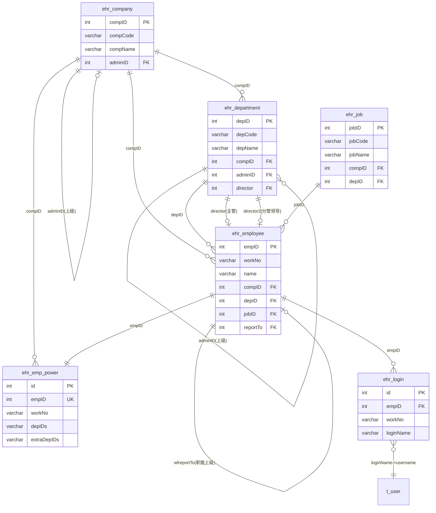

# DPPMS D365 全量数据字典

> 数据库: dppms_d365 | 更新时间: 2026-06-13 | 数据基准: 生产环境 information_schema 实时查询
> 业务含义来源: Java Bean 注释 + iBatis SQL映射 + 字段命名推断 + 数据库COMMENT
> 格式标准: 全文统一7列字段表(字段名|数据类型|可空|默认值|约束|字段描述|业务含义)、4列索引表、属性表格

---

## 数据库概览

| 统计项 | 值 |
|--------|-----|
| 数据库名称 | dppms_d365 |
| 基表数量 | 273 |
| 视图数量 | 39 |
| 总数据量 | ~33,229,114 行 |
| 总存储大小 | ~14,585.58 MB (约14.2 GB) |

### 按业务域分类统计

| 业务域 | 表数量 | 主要表前缀 | 说明 |
|--------|--------|------------|------|
| 项目管理域 | 27 | pm_project*, pm_cl_*, pm_presales_*, pm_subcontract*, prob*, fnd* | 项目/维保/回访/售前/转包/问题/基础平台 |
| 系统支撑域 | 73 | ehr_*, t_*, pm_*_from_* | EHR组织/系统权限/数据同步/辅助表 |
| 历史迁移与引擎域 | 151 | act_*, fb_*, 其他 | Activiti引擎/Firebird迁移/RMA备件/临时表/视图 |

---

## 总目录

### 第一章：项目管理域
- [1. 项目管理 (pm_project*)](#一项目管理域-pm_project)
  - pm_project, pm_project_contract, pm_project_group, pm_project_group_relationship, pm_project_member, pm_project_state, pm_project_task, pm_project_related_party, pm_project_product_line, pm_project_shipment, pm_project_maintenance, pm_project_log, pm_project_instruction, pm_project_supervision, pm_project_warranty_callback, pm_project_weekly, pm_project_weekly_content, pm_project_soft_version, pm_project_notification, pm_project_notification_state, pm_project_header_view_cache, pm_project_soft_version_history, pm_project_product_line_real, pm_project_maintenance_service_delivery, pm_project_maintenance_view, pm_project_maintenance_sectary_from_sse, pm_project_spot_check_ignore_item
- [2. 回访管理 (pm_cl*)](#二回访管理域-pm_cl)
  - pm_cl_callback, pm_cl_callback_quesnaire, pm_cl_evaluation_header, pm_cl_quesnaire_result_header, pm_cl_quesnaire_result_line, pm_cl_quesnaire_template_header, pm_cl_quesnaire_template_line, pm_cl_quesnaire_template_options
- [3. 售前管理 (pm_presales*)](#三售前管理域-pm_presales)
  - pm_presales_project_header, pm_presales_project_product_line, pm_presales_project_callback, pm_presales_project_duration, pm_presales_project_rma_info
- [4. 转包管理 (pm_subcontract*)](#四转包管理域-pm_subcontract)
  - pm_subcontract_project_header, pm_subcontract_project_line, pm_subcontract_facilitator, pm_subcontract_project_payment, pm_subcontract_deliver_files, pm_subcontract_project_payment_sse, pm_subcontract_project_price, pm_subcontract_project_callback
- [5. 问题管理 (prob*)](#五问题管理域-prob)
  - prob_main, prob_product, prob_softwares, prob_restore, prob_read_log, prob_product_component, prob_restore_process, prob_restore_weekly, prob_soft_version
- [6. 基础平台 (fnd*)](#六基础平台域-fnd)
  - fnd_act_hi_comment, fnd_basic_data, fnd_basic_data_type, fnd_company, fnd_department, fnd_user_info, fnd_files, fnd_roles, fnd_user_power, fnd_mails, fnd_data_refresh_log, fnd_sys_arg, fnd_menus, fnd_role_menus, fnd_user_menus, fnd_basic_prjstate, fnd_spms_arg
- [7. 维保管理 (warranty/spare)](#七维保管理域-warrantyspare)
- [8. 安全行业资产管理 (af_industry)](#八安全行业资产管理域-af_industry)
- [9. 项目辅助表](#九项目辅助表)

### 第二章：系统支撑域
- [1. EHR组织架构 (ehr_*)](#一ehr组织架构域-ehr_)
  - ehr_company, ehr_department, ehr_employee, ehr_emp_power, ehr_job, ehr_login
- [2. 系统权限 (t_*)](#二系统权限域-t_)
  - t_company, t_user, t_user_info, t_role, t_role_menu, t_role_permission, t_user_role, t_menu, t_permission, t_resource, t_user_login_record, t_notify_template, t_mails, t_file, t_file_type, t_down_log, t_sync_log, t_sync_state, t_sys_log, t_sys_variable
- [3. 数据同步中间表 (pm_*_from_*)](#三数据同步中间表域-pm__from_)
  - ERP订单同步、SMS回款计划同步、OA人员同步、售前借货同步、CRM产品信息同步、项目属性同步、其他来源同步
- [4. 其他辅助表](#四其他辅助表)

### 第三章：历史迁移与引擎域
- [1. Activiti工作流引擎 (act_*)](#一activiti工作流引擎表act) - 26张
- [2. Firebird迁移表 (fb_*)](#二firebird迁移表fb) - 15张
- [3. RMA/备件/仓库等业务表](#三rma备件仓库等业务表---约60张) - 约60张
- [4. 临时表 (temp_*/tmp_*)](#四临时表temp_tmptmp) - 11张
- [5. 视图 (VIEW)](#五视图view---39个) - 39个

### 附录
- [附录A: customInfo扩展字段索引](#附录a-custominfo扩展字段索引)
- [附录B: bitMark位运算模式说明](#附录b-bitmark位运算模式说明)
- [附录C: customInfo更新策略差异](#附录c-custominfo更新策略差异)
- [附录D: 数据同步流向总览](#附录d-数据同步流向总览)
- [附录E: 全局ER关系图](#附录e-全局er关系图)

---
# 第一章：项目管理域

> 覆盖范围：项目(pm_project*)、回访(pm_cl*)、售前(pm_presales*)、转包(pm_subcontract*)、问题(prob*)、基础平台(fnd*)

---


## 一、项目管理域 (pm_project)

### 1 pm_project -- 项目主表

| 属性 | 值 |
|------|-----|
| 对象类型 | BASE TABLE |
| 业务含义 | 项目主表，存储项目核心信息，是整个PMS系统的核心实体 |
| 数据量 | ~70,370 行 |
| 数据大小 | 45.6 MB |

**字段列表**

| 字段名 | 数据类型 | 可空 | 默认值 | 约束 | 字段描述 | 业务含义 |
|--------|----------|------|--------|------|----------|----------|
| projectId | int(11) | NO | - | PRI, auto_increment | 项目头信息主键 | 项目唯一标识，关联项目其他子表 |
| projectType | varchar(45) | NO | 10 | MUL | 项目数据类型 | 用服售后:10，安服售后:afss，安服先行:afxx |
| projectCode | varchar(45) | NO | - | MUL | 项目编码 | 项目唯一业务编码CRM系统生成 |
| projectName | varchar(200) | YES | - |  | 项目名称 | 项目的业务名称 |
| projectState | varchar(11) | YES | - |  | 项目状态 | 项目阶段状态，1=初始创建，0=不予跟踪，对应fnd_basic_data(dataTypeCode=02) |
| isback | varchar(11) | YES | 30 |  | 项目回退状态 | 30=创建项目，32=指定项目经理，34=填写渠道信息，40=工程管理部不予跟踪，42=项目经理选择不予跟踪 |
| column001 | varchar(255) | YES | - | MUL | 办事处编码 | 逻辑外键 -> fnd_department.departmentNum |
| column002 | varchar(255) | YES | - |  | 客户编码 | ERP系统中的客户编码 |
| column003 | varchar(255) | YES | - |  | 客户名称 | ERP系统中的客户名称 |
| column004 | varchar(255) | YES | - |  | 市场部 | 市场部 |
| column005 | varchar(255) | YES | - |  | 系统部 | 系统部 |
| column006 | varchar(255) | YES | - |  | 拓展部 | 拓展部 |
| column007 | varchar(255) | YES | - |  | 子行业 | 子行业 |
| column008 | varchar(255) | YES | - |  | 不予跟踪原因 | notGrantTailCause，项目不予跟踪的原因说明 |
| column009 | datetime | YES | - |  | 订单创建时间 | 来自SMS系统的订单创建时间 |
| column010 | varchar(10) | YES | - |  | 项目等级类型 | 逻辑外键 -> fnd_basic_data(dataTypeCode=05)，项目等级分类 |
| column011 | varchar(10) | YES | - |  | 项目业务分类 | 项目业务分类 |
| column012 | varchar(2) | YES | - |  | 实施方式 | 实施方式编码，0/1/2/3/4对应不同实施模式 |
| columno12_readonly | int(2) | YES | -1 |  | 实施方式只读标记 | 实施方式，-1=可修改，其他值=只读（来自SMS的不可修改） |
| column013 | varchar(255) | YES | - |  | 最终客户名称 | 最终客户单位名称 |
| column014 | text | YES | - |  | 回退说明 | 项目回退时的说明文字 |
| customerProjectName | varchar(255) | YES | - |  | 客户项目名称 | 客户侧的项目名称 |
| salesType | varchar(25) | YES | 01 |  | 销售类型 | 01=正常，02=借转销，14=销售类借货 |
| majorProjectLevel | varchar(255) | YES | - |  | 重大项目级别 | 重大项目等级标识 |
| compId | int(2) | YES | 0 |  | 公司ID | 逻辑外键 -> fnd_company.id |
| createTime | datetime | YES | - |  | 记录数据创建时间 | 记录创建时间（指定服务经理时间） |
| createBy | varchar(45) | YES | - |  | 记录数据创建用户 | 记录创建用户 |
| updateTime | datetime | YES | - |  | 记录数据最新更新时间 | 记录最新更新时间 |
| updateBy | varchar(45) | YES | - |  | 记录数据最新更新用户 | 记录最新更新用户 |
| effectiveFrom | datetime | YES | - |  | 数据有效性开始时间 | 数据有效性开始时间（软删除模式） |
| effectiveTo | datetime | YES | - |  | 数据有效性结束时间 | 数据有效性结束时间，NULL=当前有效 |
| disabled | bit(1) | YES | b'0' |  | 数据是否失效 | 0=有效，1=失效 |
| projectStartTime | datetime | YES | - |  | 项目开始实施时间 | 指定项目经理的时间 |
| projectRefreshTime | datetime | YES | - |  | 项目相关数据最后编辑时间 | 项目相关数据最后编辑时间 |
| projectCloseTime | datetime | YES | - |  | 项目闭环时间点 | 项目闭环的时间点 |
| customInfo | json | YES | - |  | 自定义信息 | JSON扩展字段，存储serviceManagerCode/programManagerCode/programManagerCodeB等动态属性 |
| customConfig | json | YES | - |  | 自定义配置 | JSON配置字段 |

**索引列表**

| 索引名 | 索引类型 | 唯一性 | 索引字段 |
|--------|----------|--------|----------|
| department | BTREE | NON-UNIQUE | column001 |
| PRIMARY | BTREE | UNIQUE | projectId |
| projectCode_index | BTREE | NON-UNIQUE | projectCode, projectType |
| projectType_projectId_IDX | BTREE | NON-UNIQUE | projectType, projectId |

---

### 2 pm_project_contract -- 项目对应的合同信息

| 属性 | 值 |
|------|-----|
| 对象类型 | BASE TABLE |
| 业务含义 | 项目对应的合同信息，一个项目组可关联多个合同 |
| 数据量 | ~79,021 行 |
| 数据大小 | 5.5 MB |

**字段列表**

| 字段名 | 数据类型 | 可空 | 默认值 | 约束 | 字段描述 | 业务含义 |
|--------|----------|------|--------|------|----------|----------|
| id | int(11) | NO | - | PRI, auto_increment |  | 合同记录唯一标识 |
| contractNo | varchar(45) | NO | - | MUL | 合同号 | 合同编号，逻辑外键 -> pm_project_product_line.contractNo |
| projectGroupCode | varchar(45) | NO | - | MUL | 项目组编码 | 逻辑外键 -> pm_project_group.projectGroupCode |
| createTime | datetime | YES | - |  |  | 记录创建时间 |
| createBy | varchar(45) | YES | - |  |  | 记录创建用户编码 |
| updateTime | datetime | YES | - |  |  | 记录最新更新时间 |
| updateBy | varchar(45) | YES | - |  |  | 记录最新更新用户编码 |

**索引列表**

| 索引名 | 索引类型 | 唯一性 | 索引字段 |
|--------|----------|--------|----------|
| contract_projectGroupCode_IDX | BTREE | NON-UNIQUE | contractNo, projectGroupCode |
| PRIMARY | BTREE | UNIQUE | id |
| projectGroupCode_contract_IDX | BTREE | NON-UNIQUE | projectGroupCode, contractNo |

---

### 3 pm_project_group -- 项目组信息

| 属性 | 值 |
|------|-----|
| 对象类型 | BASE TABLE |
| 业务含义 | 项目组信息，多个项目编码可归入同一项目组 |
| 数据量 | ~77,958 行 |
| 数据大小 | 4.5 MB |

**字段列表**

| 字段名 | 数据类型 | 可空 | 默认值 | 约束 | 字段描述 | 业务含义 |
|--------|----------|------|--------|------|----------|----------|
| id | int(11) | NO | - | PRI, auto_increment |  | 自增主键，项目组唯一标识 |
| projectGroupCode | varchar(45) | NO | - | UNI | 项目组组编码 | 项目组唯一编码 |
| projectGroupName | varchar(45) | YES | - |  | 项目组名称 | 项目组的业务名称 |
| projectType | varchar(25) | YES | 10 |  | 项目类型 | 用服售后:10，安服售后:afss，安服先行:afxx，默认10 |
| createTime | datetime | YES | - |  |  | 记录创建时间 |
| createBy | varchar(15) | YES | - |  |  | 记录创建用户编码 |
| updateTime | datetime | YES | - |  |  | 记录最新更新时间 |
| updateBy | varchar(15) | YES | - |  |  | 记录最新更新用户编码 |

**索引列表**

| 索引名 | 索引类型 | 唯一性 | 索引字段 |
|--------|----------|--------|----------|
| PRIMARY | BTREE | UNIQUE | id |
| projectGroupCode_UNIQUE | BTREE | UNIQUE | projectGroupCode |

---

### 4 pm_project_group_relationship -- 项目编码与项目组的关联关系

| 属性 | 值 |
|------|-----|
| 对象类型 | BASE TABLE |
| 业务含义 | 项目编码与项目组的关联关系，支持项目拆分合并 |
| 数据量 | ~77,456 行 |
| 数据大小 | 6.5 MB |

**字段列表**

| 字段名 | 数据类型 | 可空 | 默认值 | 约束 | 字段描述 | 业务含义 |
|--------|----------|------|--------|------|----------|----------|
| id | int(11) | NO | - | PRI, auto_increment |  | 自增主键，关系记录唯一标识 |
| projectGroupCode | varchar(45) | NO | - | MUL | 项目组编码 | 逻辑外键 -> pm_project_group.projectGroupCode |
| projectCode | varchar(45) | YES | - | MUL | 项目编码 | 逻辑外键 -> pm_project.projectCode |
| mergeBranchMark | varchar(45) | YES | - |  | 项目拆分合并 | 标识项目拆分/合并的业务标记 |
| smsProjectCode | varchar(45) | YES | - | MUL | 原始项目编码 | CRM原始项目编码 |
| createTime | datetime | YES | - |  |  | 记录创建时间 |
| createBy | varchar(45) | YES | - |  |  | 记录创建用户编码 |
| updateTime | datetime | YES | - |  |  | 记录最新更新时间 |
| updateBy | varchar(45) | YES | - |  |  | 记录最新更新用户编码 |

**索引列表**

| 索引名 | 索引类型 | 唯一性 | 索引字段 |
|--------|----------|--------|----------|
| PRIMARY | BTREE | UNIQUE | id |
| projectCode | BTREE | NON-UNIQUE | projectCode |
| projectGroupCode | BTREE | NON-UNIQUE | projectGroupCode |
| smsProjectCode | BTREE | NON-UNIQUE | smsProjectCode |

---

### 5 pm_project_member -- 项目相关人员信息

| 属性 | 值 |
|------|-----|
| 对象类型 | BASE TABLE |
| 业务含义 | 项目相关人员信息，通过memberRole区分角色(10=销售,20=服务经理,30=项目经理) |
| 数据量 | ~302,428 行 |
| 数据大小 | 32.6 MB |

**字段列表**

| 字段名 | 数据类型 | 可空 | 默认值 | 约束 | 字段描述 | 业务含义 |
|--------|----------|------|--------|------|----------|----------|
| id | int(11) | NO | - | PRI, auto_increment |  | 自增主键，成员记录唯一标识 |
| projectId | int(11) | YES | - | MUL |  | 逻辑外键 -> pm_project.projectId 或 pm_presales_project_header.presalesId |
| projectType | varchar(25) | YES | 10 |  | 项目类型 | 售后10/售前20，详见fnd_basic_data |
| memberRole | varchar(45) | YES | - |  | 人员角色 | 10=销售人员,20=服务经理,30=项目经理 |
| memberCode | varchar(45) | YES | - | MUL | 人员编码 | 逻辑外键 -> fnd_user_info.username，外部人员为空 |
| memberName | varchar(45) | YES | - |  | 人员名称 | 项目成员的真实姓名 |
| phoneNum | varchar(20) | YES | - |  | 电话 | 项目成员联系电话 |
| email | varchar(45) | YES | - |  | 邮箱 | 项目成员邮箱地址 |
| fromFlag | varchar(2) | YES | 0 |  | 信息来源 | 1=来源于项目信息，2=来源于成员信息 |
| createTime | datetime | YES | - |  |  | 记录创建时间 |
| createBy | varchar(45) | YES | - |  |  | 记录创建用户编码 |
| updateTime | datetime | YES | - |  |  | 记录最新更新时间 |
| updateBy | varchar(15) | YES | - |  |  | 记录最新更新用户编码 |
| effectiveTo | datetime | YES | - |  | 有效结束时间 | NULL=当前有效，非NULL=已失效 |
| effectiveFrom | datetime | YES | - |  | 有效开始时间 | 数据有效性开始时间（软删除模式） |

**索引列表**

| 索引名 | 索引类型 | 唯一性 | 索引字段 |
|--------|----------|--------|----------|
| memberCode_IDX | BTREE | NON-UNIQUE | memberCode, projectId, projectType |
| PRIMARY | BTREE | UNIQUE | id |
| projectId_role | BTREE | NON-UNIQUE | projectId, memberRole |
| projectId_type | BTREE | NON-UNIQUE | projectId, projectType |

---

### 6 pm_project_state -- 项目各维度状态信息（工程计划/发货/实施/闭环）

| 属性 | 值 |
|------|-----|
| 对象类型 | BASE TABLE |
| 业务含义 | 项目各维度状态信息（工程计划/发货/实施/闭环），以projectId为主键 |
| 数据量 | ~45,915 行 |
| 数据大小 | 2.5 MB |

**字段列表**

| 字段名 | 数据类型 | 可空 | 默认值 | 约束 | 字段描述 | 业务含义 |
|--------|----------|------|--------|------|----------|----------|
| projectId | int(11) | NO | - | PRI |  | 逻辑外键 -> pm_project.projectId |
| projectPlanState | varchar(10) | YES | - | MUL | 工程计划状态 | 逻辑外键 -> fnd_basic_data |
| projectplanTime | datetime | YES | - |  | 工程计划状态更新时间 | 工程计划状态最后变更时间 |
| shipmentState | varchar(11) | YES | - | MUL | 项目发货状态 | -1=已发货，1=未发货，2=部分发货 |
| shipmentTime | datetime | YES | - |  | 发货状态更新时间 | 发货状态最后变更时间 |
| executionState | varchar(45) | YES | 5 |  | 实施状态 | 项目实施阶段状态 |
| executionStateTime | datetime | YES | - |  | 实施状态更新时间 | 实施状态最后变更时间 |
| closeProcessState | varchar(45) | YES | 10 |  | 闭环流程状态 | 项目闭环流程阶段 |
| closeProcessStateTime | datetime | YES | - |  | 闭环流程状态更新时间 | 闭环流程状态最后变更时间 |

**索引列表**

| 索引名 | 索引类型 | 唯一性 | 索引字段 |
|--------|----------|--------|----------|
| index_projectId | BTREE | UNIQUE | projectId |
| projectPlanState | BTREE | NON-UNIQUE | projectPlanState |
| shipmentState | BTREE | NON-UNIQUE | shipmentState |

---

### 7 pm_project_task -- 项目具体任务

| 属性 | 值 |
|------|-----|
| 对象类型 | BASE TABLE |
| 业务含义 | 项目具体任务，支持树形结构(parentId)，关联Activiti工作流 |
| 数据量 | ~59,042 行 |
| 数据大小 | 8.5 MB |

**字段列表**

| 字段名 | 数据类型 | 可空 | 默认值 | 约束 | 字段描述 | 业务含义 |
|--------|----------|------|--------|------|----------|----------|
| taskId | int(11) | NO | - | PRI, auto_increment | 任务ID | 任务自增主键，任务唯一标识 |
| projectId | int(11) | YES | - | MUL |  | 逻辑外键 -> pm_project.projectId |
| projectType | varchar(25) | YES | 10 | MUL | 项目数据类型 | 默认10=售后，20=售前测试，详见fnd_basic_data |
| contractNo | varchar(45) | YES | - |  | 合同号 | 关联合同编号 |
| taskTypeCode | varchar(45) | YES | - | MUL | 任务类型编码 | 逻辑外键 -> fnd_basic_data，关联基础数据表 |
| taskTypeId | varchar(25) | YES | - |  | 任务类型ID | 如completeTest=完成测试，关联基础数据表 |
| taskName | varchar(255) | YES | - |  | 任务名 | 任务业务名称 |
| eventPlanHappenDate | datetime | YES | - |  | 款项计划发生日期 | 款项计划发生日期 |
| eventPlanHappenDateENG | datetime | YES | - |  | 工程计划发生日期 | 工程计划发生日期 |
| planStartTime | datetime | YES | - |  | 计划开始日期 | 任务计划开始时间 |
| planEndTime | datetime | YES | - |  | 计划结束日期 | 任务计划结束时间 |
| actualStartTime | datetime | YES | - |  | 实际开始日期 | 任务实际开始时间 |
| eventActualFinishDate | datetime | YES | - |  | 实际完成日期 | 任务实际完成日期 |
| priority | varchar(25) | YES | - |  | 优先级 | 任务优先级 |
| progress | int(3) | YES | 0 |  | 进度百分比 | 0-100 |
| progressDesc | varchar(255) | YES | - |  | 进度描述 | 任务进度文字描述 |
| status | varchar(25) | YES | 0 |  | 状态 | 任务状态，0=未开始 |
| parentId | int(11) | YES | - |  | 父级任务 | 支持树形任务结构 |
| remark | text | YES | - |  | 备注 | 备注说明 |
| createTime | datetime | YES | - |  | 创建时间 | 记录创建时间 |
| createBy | varchar(45) | YES | - |  | 创建人 | 记录创建用户编码 |
| updateTime | datetime | YES | - |  | 更新时间 | 记录最新更新时间 |
| updateBy | varchar(45) | YES | - |  | 更新人 | 记录最新更新用户编码 |
| effectiveFrom | datetime | YES | - |  | 数据有效性开始时间 | 数据有效性开始时间（软删除模式） |
| effectiveTo | datetime | YES | - |  | 数据有效性结束时间 | 数据有效性结束时间，NULL=当前有效 |
| visibleFlag | varchar(2) | YES | 1 |  | 是否可见 | 1=可见，2=不可见 |
| deliverFileIds | varchar(255) | YES | - |  | 上传的交付件 | 逻辑外键 -> fnd_files.id |
| customInfo | json | YES | - |  | 自定义信息 | JSON扩展字段 |

**索引列表**

| 索引名 | 索引类型 | 唯一性 | 索引字段 |
|--------|----------|--------|----------|
| PRIMARY | BTREE | UNIQUE | taskId |
| projectId | BTREE | NON-UNIQUE | projectId, projectType |
| projectType | BTREE | NON-UNIQUE | projectType, projectId |
| taskTypeCode_Id | BTREE | NON-UNIQUE | taskTypeCode, taskTypeId |

---

### 8 pm_project_related_party -- 项目相关的团体信息（渠道商、代理商、服务商等）

| 属性 | 值 |
|------|-----|
| 对象类型 | BASE TABLE |
| 业务含义 | 项目相关的团体信息（渠道商、代理商、服务商等） |
| 数据量 | ~126,864 行 |
| 数据大小 | 12.5 MB |

**字段列表**

| 字段名 | 数据类型 | 可空 | 默认值 | 约束 | 字段描述 | 业务含义 |
|--------|----------|------|--------|------|----------|----------|
| id | int(11) | NO | - | PRI, auto_increment |  | 自增主键，相关方记录唯一标识 |
| projectId | int(11) | YES | - | MUL | 项目表ID | 逻辑外键 -> pm_project.projectId |
| partyRole | varchar(45) | YES | - | MUL | 渠道类型 | 0=服务商渠道，1=代理商渠道 |
| partyCode | varchar(45) | YES | - | 代理商/服务商编码 |  | 相关方（渠道商/代理商）编码 |
| partyName | varchar(45) | YES | - |  | 代理商/服务商名称 | 相关方（渠道商/代理商）名称 |
| createTime | datetime | YES | - |  | 创建时间 | 记录创建时间 |
| createBy | varchar(45) | YES | - |  | 创建人 | 记录创建用户编码 |
| updateTime | datetime | YES | - |  | 更新时间 | 记录最新更新时间 |
| updateBy | varchar(45) | YES | - |  | 更新人 | 记录最新更新用户编码 |
| effectiveFrom | datetime | YES | - |  |  | 数据有效性开始时间（软删除模式） |
| effectiveTo | datetime | YES | - |  |  | 数据有效性结束时间，NULL=当前有效 |

**索引列表**

| 索引名 | 索引类型 | 唯一性 | 索引字段 |
|--------|----------|--------|----------|
| partyRole_parojectId | BTREE | NON-UNIQUE | partyRole, projectId |
| PRIMARY | BTREE | UNIQUE | id |
| projectId | BTREE | NON-UNIQUE | projectId |

---

### 9 pm_project_product_line -- 订单产品信息

| 属性 | 值 |
|------|-----|
| 对象类型 | BASE TABLE |
| 业务含义 | 订单产品信息，记录项目下的产品明细 |
| 数据量 | ~185,819 行 |
| 数据大小 | 25.1 MB |

**字段列表**

| 字段名 | 数据类型 | 可空 | 默认值 | 约束 | 字段描述 | 业务含义 |
|--------|----------|------|--------|------|----------|----------|
| id | int(11) | NO | - | MUL, auto_increment |  | 自增主键，产品线记录唯一标识 |
| projectId | int(11) | YES | - | MUL | 关联主表 | 逻辑外键 -> pm_project.projectId |
| contractNo | varchar(45) | YES | - | MUL | 合同号 | 逻辑外键 -> pm_project_contract.contractNo |
| itemCode | varchar(15) | YES | - | MUL | 产品编码 | ERP系统产品编码 |
| itemName | varchar(255) | YES | - |  | 产品名称 | 产品名称 |
| projectQuantity | int(11) | YES | - |  | 项目产品数量 | 项目产品总数量 |
| orderQuantity | int(11) | YES | - |  | 产品订单数量 | 已下单产品数量 |
| deliverQuantity | int(11) | YES | - |  | 已发货数量 | 已发货产品数量 |
| openQuantity | int(11) | YES | - |  | 未发货数量 | 未发货产品数量 |
| orderNumber | varchar(25) | YES | - |  | 订单号 | ERP订单号 |
| lineNum | varchar(25) | YES | - |  | 订单行号 | 订单行号 |

**索引列表**

| 索引名 | 索引类型 | 唯一性 | 索引字段 |
|--------|----------|--------|----------|
| contractNo | BTREE | NON-UNIQUE | contractNo |
| id | BTREE | NON-UNIQUE | id |
| itemCode | BTREE | NON-UNIQUE | itemCode |
| projectId | BTREE | NON-UNIQUE | projectId |

---

### 10 pm_project_shipment -- 项目发货记录

| 属性 | 值 |
|------|-----|
| 对象类型 | BASE TABLE |
| 业务含义 | 项目发货记录，支持串货转移 |
| 数据量 | ~460,132 行 |
| 数据大小 | 117.6 MB |

**字段列表**

| 字段名 | 数据类型 | 可空 | 默认值 | 约束 | 字段描述 | 业务含义 |
|--------|----------|------|--------|------|----------|----------|
| id | int(11) | NO | - | PRI, auto_increment |  | 自增主键，发货记录唯一标识 |
| projectId | int(11) | YES | - | MUL |  | 逻辑外键 -> pm_project.projectId |
| barcode | varchar(25) | YES | - | MUL | 序列号 | 设备序列号/条码 |
| itemCode | varchar(25) | YES | - |  | 产品编码 | 发货产品编码 |
| itemModel | varchar(255) | YES | - |  | 产品型号 | 产品型号 |
| itemName | varchar(255) | YES | - |  | 产品名称 | 产品名称 |
| receiveName | varchar(255) | YES | - |  | 收货人 | 收货人姓名 |
| emsNum | varchar(255) | YES | - |  | 快递单号 | 快递/物流单号 |
| emsCompany | varchar(15) | YES | - |  | 快递公司名称 | 快递/物流公司名称 |
| packdate | datetime | YES | - |  | 发货日期 | 发货日期 |
| contractNo | varchar(50) | YES | - | MUL | 合同号 | 关联合同编号 |
| installAddress | text | YES | - |  | 设备安装地址 | 设备安装地址 |
| chProjectId | int(11) | YES | - |  | 串货转移之前的projectId | 串货转移前所属项目ID |
| chContractNo | varchar(50) | YES | - |  | 串货转移之前的contractNo | 串货转移前合同编号 |
| transferProjectId | int(11) | YES | - |  | 串货转移之后的projectId | 串货转移后目标项目ID |
| transferContractNo | varchar(50) | YES | - |  | 串货转移之后的projectId | 串货转移后合同编号 |
| transferFlag | varchar(2) | YES | -1 |  | 转移标识 | -1=默认，1=转出，0=转入 |
| createTime | datetime | YES | - |  | 创建时间 | 记录创建时间 |
| createBy | varchar(25) | YES | - |  | 创建人 | 记录创建用户编码 |
| updateTime | datetime | YES | - |  | 更新时间 | 记录最新更新时间 |
| updateBy | varchar(25) | YES | - |  | 更新人 | 记录最新更新用户编码 |

**索引列表**

| 索引名 | 索引类型 | 唯一性 | 索引字段 |
|--------|----------|--------|----------|
| barcode | BTREE | NON-UNIQUE | barcode |
| contractNo | BTREE | NON-UNIQUE | contractNo, barcode |
| PRIMARY | BTREE | UNIQUE | id |
| projectId | BTREE | NON-UNIQUE | projectId |

---

### 11 pm_project_maintenance -- 项目维护/巡检记录

| 属性 | 值 |
|------|-----|
| 对象类型 | BASE TABLE |
| 业务含义 | 项目维护/巡检记录，记录售后服务的详细过程 |
| 数据量 | ~184,753 行 |
| 数据大小 | 110.6 MB |

**字段列表**

| 字段名 | 数据类型 | 可空 | 默认值 | 约束 | 字段描述 | 业务含义 |
|--------|----------|------|--------|------|----------|----------|
| id | int(11) | NO | - | PRI, auto_increment |  | 自增主键，维护记录唯一标识 |
| projectId | int(11) | NO | - | MUL | 项目头信息主键 | 逻辑外键 -> pm_project.projectId |
| projectCode | varchar(45) | NO |  | MUL | 项目编码 | 项目编码 |
| projectName | varchar(200) | YES |  |  | 项目名称 | 项目名称 |
| projectType | int(11) | NO | 10 | MUL | 项目数据类型 | 售前:20/售后:10 |
| projectExecutionState | varchar(45) | YES |  |  | 项目实施状态 | 项目当前实施状态 |
| contractNo | varchar(255) | YES |  |  | 合同号 | 关联合同编号 |
| officeCode | varchar(25) | YES | - | MUL | 办事处编码 | 逻辑外键 -> fnd_department.departmentNum |
| compId | int(2) | YES | 1 |  | 所属公司 | 逻辑外键 -> fnd_company.id |
| type | varchar(45) | YES | - | MUL | 任务性质 | 服务任务性质编码 |
| category | varchar(45) | YES | - | MUL | 任务分类 | 服务任务分类编码 |
| subCategory | varchar(45) | YES | - | MUL | 任务小类 | 服务任务小类编码 |
| processTime | datetime | YES | - | MUL | 处理时间 | 服务处理时间 |
| processDesc | varchar(1024) | YES | - |  | 事项描述 | 服务事项描述 |
| processStep | varchar(1024) | YES | - |  | 解决进展 | 问题解决进展 |
| remainProblem | varchar(1024) | YES | - |  | 遗留问题 | 遗留问题描述 |
| transitHour | float | YES | 0 |  | 在途耗时(h) | 在途耗时（小时） |
| processHour | float | YES | 0 |  | 处理耗时(h) | 处理耗时（小时） |
| itemModel | varchar(255) | YES | - |  | 产品型号 | 服务产品型号 |
| softVersion | varchar(255) | YES | - |  | 在网版本 | 设备在网软件版本 |
| enabledFeatures | varchar(255) | YES | - |  | 启用功能 | 设备启用功能列表 |
| customTos | varchar(512) | YES | - |  | 自定义主送 | 自定义邮件主送人 |
| customCcs | varchar(512) | YES | - |  | 自定义抄送 | 自定义邮件抄送人 |
| hasReport | bit(1) | NO | b'0' |  | 是否有巡检报告 | 0=无巡检报告，1=有巡检报告 |
| quesnaireId | int(11) | YES | - |  | 问卷ID | 逻辑外键 -> pm_cl_quesnaire_result_header.id |
| deliverFileIds | varchar(255) | YES |  |  | 交付件 | 逻辑外键 -> fnd_files.id |
| warrantyStatus | varchar(25) | YES | - |  | 维保状态 | 项目维保状态 |
| industryName | varchar(25) | YES | - |  | 客户所属行业 | 客户所属行业 |
| userOffice | varchar(25) | YES | - |  | 用户办事处 | 用户所属办事处 |
| year | int(4) | YES | - |  | 所属年度 | 服务记录所属年度 |
| quarter | int(1) | YES | - |  | 所属季度 | 服务记录所属季度(1-4) |
| month | int(2) | YES | - |  | 所属月份 | 服务记录所属月份(1-12) |
| wsCount | int(2) | YES | - |  | 当前维保服务次数 | 当前维保服务次数 |
| wafCount | int(2) | YES | - |  | 当前其他服务次数 | 当前其他服务次数 |
| wsYearCount | int(2) | YES | - |  | 维保服务年次数 | 年度维保服务累计次数 |
| wafYearCount | int(2) | YES | - |  | 其他服务年次数 | 年度其他服务累计次数 |
| warrantyInfo | varchar(4096) | YES | - |  | 维保信息 | 维保服务详细信息 |
| serviceInfo | varchar(2048) | YES | - |  | 其他服务信息 | 其他服务详细信息 |
| remark | varchar(2048) | YES | - |  | 备注 | 备注说明 |
| createTime | datetime | YES | - | MUL | 创建时间 | 记录创建时间 |
| createBy | varchar(45) | YES | - | MUL | 创建用户 | 记录创建用户编码 |
| updateTime | datetime | YES | - |  | 最新更新时间 | 记录最新更新时间 |
| updateBy | varchar(45) | YES | - |  | 最新更新用户 | 记录最新更新用户编码 |
| customInfo | json | YES | - |  | 自定义信息 | JSON扩展字段 |

**索引列表**

| 索引名 | 索引类型 | 唯一性 | 索引字段 |
|--------|----------|--------|----------|
| category | BTREE | NON-UNIQUE | category, subCategory |
| createBy | BTREE | NON-UNIQUE | createBy |
| createTime | BTREE | NON-UNIQUE | createTime |
| officeCode | BTREE | NON-UNIQUE | officeCode |
| PRIMARY | BTREE | UNIQUE | id |
| processTime_IDX | BTREE | NON-UNIQUE | processTime |
| projectCode | BTREE | NON-UNIQUE | projectCode |
| projectId | BTREE | NON-UNIQUE | projectId |
| projectType | BTREE | NON-UNIQUE | projectType |
| subCategory | BTREE | NON-UNIQUE | subCategory |
| type | BTREE | NON-UNIQUE | type |

---

### 12 pm_project_log -- 项目主要操作跟踪日志

| 属性 | 值 |
|------|-----|
| 对象类型 | BASE TABLE |
| 业务含义 | 项目主要操作跟踪日志 |
| 数据量 | ~6,411 行 |
| 数据大小 | 496.0 KB |

**字段列表**

| 字段名 | 数据类型 | 可空 | 默认值 | 约束 | 字段描述 | 业务含义 |
|--------|----------|------|--------|------|----------|----------|
| id | int(11) | NO | - | PRI, auto_increment |  | 自增主键，日志记录唯一标识 |
| projectId | int(11) | YES | - | MUL | 项目头信息主键 | 逻辑外键 -> pm_project.projectId |
| handleName | varchar(255) | YES | - |  | 操作名称 | 操作名称（如：指定项目经理） |
| handleDesc | varchar(255) | YES | - |  | 操作描述或原因 | 操作描述或原因说明 |
| handleUser | varchar(45) | YES | - |  | 操作用户 | 执行操作的用户编码 |
| taskStartTime | datetime | YES | - |  | 操作开始时间 | 操作开始时间 |
| handleEndTime | datetime | YES | - |  | 操作结束时间 | 操作结束时间 |
| handleState | int(11) | YES | - |  | 通知状态 | 0=无通知，1=已通知 |

**索引列表**

| 索引名 | 索引类型 | 唯一性 | 索引字段 |
|--------|----------|--------|----------|
| PRIMARY | BTREE | UNIQUE | id |
| projectId | BTREE | NON-UNIQUE | projectId |

---

### 13 pm_project_instruction -- 总部或领导对项目的批示及反馈

| 属性 | 值 |
|------|-----|
| 对象类型 | BASE TABLE |
| 业务含义 | 总部或领导对项目的批示及反馈 |
| 数据量 | ~127 行 |
| 数据大小 | 48.0 KB |

**字段列表**

| 字段名 | 数据类型 | 可空 | 默认值 | 约束 | 字段描述 | 业务含义 |
|--------|----------|------|--------|------|----------|----------|
| id | int(11) | NO | - | PRI, auto_increment |  | 自增主键，批示记录唯一标识 |
| projectId | int(11) | YES | - | MUL | 项目头关联主键 | 逻辑外键 -> pm_project.projectId |
| instructionsInfo | text | YES | - |  | 批示内容或反馈内容 | 批示/反馈的具体内容 |
| instructionsTime | datetime | YES | - |  | 批示时间或反馈时间 | 批示/反馈的时间 |
| instructionsUser | varchar(45) | YES | - |  | 批示用户或反馈用户 | 批示/反馈的用户编码 |
| dataType | int(11) | YES | 0 |  | 数据类型  0 批示信息 1 批示反馈 | 0=批示信息，1=批示反馈 |
| instructionsId | int(11) | YES | - |  | 批示ID | 反馈对应的原始批示记录ID |
| createTime | datetime | YES | - |  | 创建时间 | 记录创建时间 |
| createBy | varchar(25) | YES | - |  | 创建用户 | 记录创建用户编码 |
| updateTime | datetime | YES | - |  | 最新更新时间 | 记录最新更新时间 |
| updateBy | varchar(25) | YES | - |  | 最新更新用户 | 记录最新更新用户编码 |

**索引列表**

| 索引名 | 索引类型 | 唯一性 | 索引字段 |
|--------|----------|--------|----------|
| PRIMARY | BTREE | UNIQUE | id |
| projectId | BTREE | NON-UNIQUE | projectId |

---

### 14 pm_project_supervision -- 项目督查头信息

| 属性 | 值 |
|------|-----|
| 对象类型 | BASE TABLE |
| 业务含义 | 项目督查头信息，记录督查任务 |
| 数据量 | ~818 行 |
| 数据大小 | 192.0 KB |

**字段列表**

| 字段名 | 数据类型 | 可空 | 默认值 | 约束 | 字段描述 | 业务含义 |
|--------|----------|------|--------|------|----------|----------|
| id | int(11) | NO | - | PRI, auto_increment |  | 自增主键，督查记录唯一标识 |
| projectId | int(11) | NO | - |  | 项目头信息主键 | 逻辑外键 -> pm_project.projectId |
| projectCode | varchar(45) | NO | - | MUL | 项目名称 | 项目编码 |
| projectName | varchar(200) | YES | - |  | 项目名称 | 项目名称 |
| channel | varchar(64) | YES | - |  | 代理商/服务商 | 代理商/服务商名称 |
| officeCode | varchar(25) | YES | - | MUL | 办事处编码 | 办事处编码 |
| type | varchar(25) | YES | - |  | 任务性质 | 督查任务性质 |
| processTime | datetime | YES | - |  | 处理时间 | 督查处理时间 |
| state | bit(1) | NO | b'0' |  | 是否完成 | 0=未完成，1=已完成 |
| isDelete | bit(1) | NO | b'0' |  | 是否删除 | 0=未删除，1=已删除 |
| quesnaireId | int(11) | YES | - |  | 问卷ID | 逻辑外键 -> pm_cl_quesnaire_result_header.id |
| deliverFileIds | varchar(255) | YES |  |  | 交付件，fnd_files id | 逻辑外键 -> fnd_files.id |
| remark | text | YES | - |  | 备注 | 备注说明 |
| createTime | datetime | YES | - |  | 创建时间 | 记录创建时间 |
| createBy | varchar(45) | YES | - |  | 创建用户 | 记录创建用户编码 |
| updateTime | datetime | YES | - |  | 最新更新时间 | 记录最新更新时间 |
| updateBy | varchar(45) | YES | - |  | 最新更新用户 | 记录最新更新用户编码 |

**索引列表**

| 索引名 | 索引类型 | 唯一性 | 索引字段 |
|--------|----------|--------|----------|
| department | BTREE | NON-UNIQUE | officeCode |
| PRIMARY | BTREE | UNIQUE | id |
| projectCode_index | BTREE | NON-UNIQUE | projectCode |

---

### 15 pm_project_warranty_callback -- 项目维保回访问卷表

| 属性 | 值 |
|------|-----|
| 对象类型 | BASE TABLE |
| 业务含义 | 项目维保回访问卷表，记录维保回访详情 |
| 数据量 | ~5,588 行 |
| 数据大小 | 2.5 MB |

**字段列表**

| 字段名 | 数据类型 | 可空 | 默认值 | 约束 | 字段描述 | 业务含义 |
|--------|----------|------|--------|------|----------|----------|
| id | int(11) | NO | - | PRI, auto_increment | 项目维保回访问卷表 | 自增主键，维保回访记录唯一标识 |
| projectId | int(11) | YES | - | MUL | 项目头信息主键| 逻辑外键 -> pm_project.projectId |
| projectCode | varchar(45) | YES | - | MUL | 项目编码 | 项目编码 |
| officeCode | varchar(25) | YES | - |  | 办事处 | 办事处编码 |
| contractNos | varchar(255) | YES | - |  | 关联的合同号 | 关联合同编号（多个逗号分隔） |
| projectIds | varchar(255) | YES | - |  | 关联的项目 | 关联项目ID（多个逗号分隔） |
| projectName | varchar(255) | YES | - |  | 项目名称 | 项目名称 |
| serviceImpl | varchar(25) | YES | - |  | 实施方式 | 项目实施方式编码 |
| industryName | varchar(25) | YES | - |  | 客户所属行业 | 客户所属行业 |
| agentChannel | varchar(255) | YES | - |  | 下单代理商 | 下单代理商名称 |
| finalCustomerName | varchar(255) | YES | - |  | 最终客户单位 | 最终客户单位名称 |
| customer1 | tinytext | YES | - |  | 客户联系人1 | 客户联系人1姓名 |
| customerContact1 | tinytext | YES | - |  | 客户联系方式1 | 客户联系人1联系方式 |
| customer2 | tinytext | YES | - |  | 客户联系人2 | 客户联系人2姓名 |
| customerContact2 | tinytext | YES | - |  | 客户联系方式2 | 客户联系人2联系方式 |
| warrantyStartTime | date | YES | - |  | 维保开始日期 | 维保合同开始日期 |
| warrantyEndTime | date | YES | - |  | 维保结束日期 | 维保合同结束日期 |
| renewalIntention | int(1) | YES | - |  | 续保意向 | 续保意向，0=无，1=有，2=待定 |
| callbackTime | datetime | YES | - |  | 回访时间 | 回访时间 |
| nextCallbackTime | datetime | YES | - |  | 下次回访时间 | 下次回访时间 |
| taskId | varchar(25) | YES | - |  | 任务ID | Activiti任务ID |
| quesnaireId | int(11) | YES | - |  | 问卷ID | 逻辑外键 -> pm_cl_quesnaire_result_header.id |
| quesnaireVersion | int(11) | YES | - |  | 问卷版本 | 问卷模板版本号 |
| quesnaireState | int(11) | YES | - |  | 状态 | 状态，-1=草稿，1=已提交 |
| isDelete | bit(1) | YES | b'0' |  | 删除标记 | 0=未删除，1=已删除 |
| remark | varchar(255) | YES | - |  | 备注 | 备注说明 |
| compId | int(2) | YES | 0 |  | 所属公司 | 所属公司ID |
| createBy | varchar(25) | YES | - |  | 创建用户 | 记录创建用户编码 |
| createTime | datetime | YES | - |  | 创建时间 | 记录创建时间 |
| updateBy | varchar(25) | YES | - |  | 最新更新用户 | 记录最新更新用户编码 |
| updateTime | datetime | YES | - |  | 最新更新时间 | 记录最新更新时间 |
| customInfo | json | YES | - |  | 扩展字段 | JSON扩展字段 |

**索引列表**

| 索引名 | 索引类型 | 唯一性 | 索引字段 |
|--------|----------|--------|----------|
| PRIMARY | BTREE | UNIQUE | id |
| projectCode | BTREE | NON-UNIQUE | projectCode |
| projectId | BTREE | NON-UNIQUE | projectId |

---

### 16 pm_project_weekly -- 项目周报主表

| 属性 | 值 |
|------|-----|
| 对象类型 | BASE TABLE |
| 业务含义 | 项目周报主表 |
| 数据量 | ~932 行 |
| 数据大小 | 208.0 KB |

**字段列表**

| 字段名 | 数据类型 | 可空 | 默认值 | 约束 | 字段描述 | 业务含义 |
|--------|----------|------|--------|------|----------|----------|
| weeklyId | int(11) | NO | - | PRI, auto_increment |  | 周报自增主键 |
| projectId | int(11) | YES | - | MUL | 项目信息头ID | 逻辑外键 -> pm_project.projectId |
| currentTask | varchar(100) | YES | - |  | 当前工程阶段 | 当前工程阶段名称 |
| taskStartTime | datetime | YES | - |  | 阶段开始时间 | 当前阶段开始时间 |
| taskEndTime | datetime | YES | - |  | 阶段结束时间 | 当前阶段结束时间 |
| taskDeviation | text | YES | - |  | 偏差 | 进度偏差说明 |
| remark | text | YES | - |  | 备注 | 备注说明 |
| createTime | datetime | YES | - |  | 创建时间 | 记录创建时间 |
| createBy | varchar(25) | YES | - |  | 创建用户 | 记录创建用户编码 |
| updateTime | datetime | YES | - |  | 最新更新时间 | 记录最新更新时间 |
| updateBy | varchar(25) | YES | - |  | 最新更新用户 | 记录最新更新用户编码 |
| weeklyStartTime | datetime | YES | - |  | 报告开始时间 | 周报统计周期开始时间 |
| weeklyEndTime | datetime | YES | - |  | 报告结束时间 | 周报统计周期结束时间 |
| weeklyState | int(11) | YES | 0 |  | 周报状态 | 周报状态，0=草稿，1=已提交 |

**索引列表**

| 索引名 | 索引类型 | 唯一性 | 索引字段 |
|--------|----------|--------|----------|
| PRIMARY | BTREE | UNIQUE | weeklyId |
| projectId | BTREE | NON-UNIQUE | projectId |

---

### 17 pm_project_weekly_content -- 项目周报详细内容

| 属性 | 值 |
|------|-----|
| 对象类型 | BASE TABLE |
| 业务含义 | 项目周报详细内容 |
| 数据量 | ~12,979 行 |
| 数据大小 | 1.5 MB |

**字段列表**

| 字段名 | 数据类型 | 可空 | 默认值 | 约束 | 字段描述 | 业务含义 |
|--------|----------|------|--------|------|----------|----------|
| id | int(11) | NO | - | PRI, auto_increment |  | 自增主键，内容记录唯一标识 |
| weeklyId | int(11) | YES | - | MUL | 周报主信息ID | 逻辑外键 -> pm_project_weekly.weeklyId |
| optionDesc001 | text | YES | - |  | 工作内容 | 周报选项描述1（工作内容） |
| optionDesc002 | text | YES | - |  | 下周计划 | 周报选项描述2（下周计划） |
| optionType | int(11) | YES | - |  | 周报选项类型 | 选项类型，对应周报不同部分 |
| createTime | datetime | YES | - |  | 创建时间 | 记录创建时间 |
| createBy | varchar(15) | YES | - |  | 创建用户 | 记录创建用户编码 |
| effectiveFrom | datetime | YES | - |  | 数据有效性开始时间 | 数据有效性开始时间（软删除模式） |
| effectiveTo | datetime | YES | - |  | 数据有效性结束时间 | 数据有效性结束时间，NULL=当前有效 |

**索引列表**

| 索引名 | 索引类型 | 唯一性 | 索引字段 |
|--------|----------|--------|----------|
| PRIMARY | BTREE | UNIQUE | id |
| weeklyId | BTREE | NON-UNIQUE | weeklyId |

---

### 18 pm_project_soft_version -- 项目设备软件版本信息

| 属性 | 值 |
|------|-----|
| 对象类型 | BASE TABLE |
| 业务含义 | 项目设备软件版本信息，记录conp/cpld/boot/pcb等版本 |
| 数据量 | ~532,125 行 |
| 数据大小 | 327.8 MB |

**字段列表**

| 字段名 | 数据类型 | 可空 | 默认值 | 约束 | 字段描述 | 业务含义 |
|--------|----------|------|--------|------|----------|----------|
| id | int(11) | NO | - | PRI, auto_increment | 项目软件版本表 | 自增主键，版本记录唯一标识 |
| projectId | int(11) | YES | - | MUL | 项目头信息主键 | 逻辑外键 -> pm_project.projectId |
| logId | int(11) | YES | - |  | 软件版本变更记录ID | 逻辑外键 -> pm_project_soft_change_logs.id |
| contractNo | varchar(100) | YES | - |  | 合同号 | 关联合同编号 |
| itemCode | varchar(25) | YES | - |  | 产品编码 | 产品编码 |
| barCode | varchar(25) | YES | - | MUL | 序列号 | 设备序列号/条码 |
| conp | varchar(100) | YES | - | MUL |  | CONP软件版本号 |
| conpType | varchar(100) | YES | - |  | 版本类型 | CONP版本类型 |
| conpSeries | varchar(100) | YES | - |  | 版本系列 | CONP版本系列 |
| conpMark | varchar(255) | YES | - |  | 软件版本掩码 | 软件版本掩码，用于版本范围匹配 |
| conpBak | varchar(255) | YES | - |  | CONP备份版本号 | CONP变更前备份版本号 |
| conpChange | int(11) | YES | - |  | CONP变更标记 | 0=CONP无更新，1=CONP有更新 |
| cpld | varchar(100) | YES | - |  | CPLD版本号 | CPLD版本号 |
| cpldBak | varchar(255) | YES | - |  | CPLD备份版本号 | CPLD变更前备份版本号 |
| cpldChange | int(11) | YES | - |  | CPLD变更标记 | 0=CPLD无更新，1=CPLD有更新 |
| boot | varchar(100) | YES | - |  | Boot版本号 | Boot版本号 |
| bootBak | varchar(255) | YES | - |  | Boot备份版本号 | Boot变更前备份版本号 |
| bootChange | int(11) | YES | - |  | Boot变更标记 | 0=Boot无更新，1=Boot有更新 |
| pcb | varchar(100) | YES | - |  | PCB版本号 | PCB版本号 |
| pcbBak | varchar(255) | YES | - |  | PCB备份版本号 | PCB变更前备份版本号 |
| pcbChange | int(11) | YES | - |  | PCB变更标记 | 0=PCB无更新，1=PCB有更新 |
| executeTime | date | YES | - |  | 版本更新日期 | 版本更新执行日期 |
| datastate | int(11) | YES | - | MUL | 数据状态 | 0=失效，1=有效 |
| createTime | datetime | YES | - |  | 创建时间 | 记录创建时间 |
| createBy | varchar(25) | YES | - |  | 创建用户 | 记录创建用户编码 |
| updateTime | datetime | YES | - |  | 最新更新时间 | 记录最新更新时间 |
| updateBy | varchar(25) | YES | - |  | 最新更新用户 | 记录最新更新用户编码 |
| customInfo | json | YES | - |  | 自定义信息 | JSON扩展字段 |

**索引列表**

| 索引名 | 索引类型 | 唯一性 | 索引字段 |
|--------|----------|--------|----------|
| barcode | BTREE | NON-UNIQUE | barCode |
| idx_conp_item_query | BTREE | NON-UNIQUE | datastate, conpType, conpSeries, conpMark, itemCode, projectId |
| pm_project_soft_version_conp_IDX | BTREE | NON-UNIQUE | conp |
| PRIMARY | BTREE | UNIQUE | id |
| projectBarcodeValid | BTREE | NON-UNIQUE | projectId, barCode, datastate |

---

### 19 pm_project_notification -- 项目通知信息

| 属性 | 值 |
|------|-----|
| 对象类型 | BASE TABLE |
| 业务含义 | 项目通知信息 |
| 数据量 | ~152,161 行 |
| 数据大小 | 13.5 MB |

**字段列表**

| 字段名 | 数据类型 | 可空 | 默认值 | 约束 | 字段描述 | 业务含义 |
|--------|----------|------|--------|------|----------|----------|
| id | int(11) | NO | - | PRI, auto_increment |  | 自增主键，通知记录唯一标识 |
| notifySubject | varchar(255) | YES | - |  | 通知标题 | 通知标题 |
| notifyContent | text | YES | - |  | 通知内容 | 通知正文内容 |
| projectId | int(11) | YES | - | MUL | 相关项目ID | 逻辑外键 -> pm_project.projectId |
| createTime | datetime | YES | - |  | 创建时间 | 记录创建时间 |
| createBy | varchar(25) | YES | - |  | 创建用户 | 记录创建用户编码 |

**索引列表**

| 索引名 | 索引类型 | 唯一性 | 索引字段 |
|--------|----------|--------|----------|
| PRIMARY | BTREE | UNIQUE | id |
| projectId | BTREE | NON-UNIQUE | projectId |

---

### 20 pm_project_notification_state -- 通知的阅读状态记录

| 属性 | 值 |
|------|-----|
| 对象类型 | BASE TABLE |
| 业务含义 | 通知的阅读状态记录 |
| 数据量 | ~9,905 行 |
| 数据大小 | 1.5 MB |

**字段列表**

| 字段名 | 数据类型 | 可空 | 默认值 | 约束 | 字段描述 | 业务含义 |
|--------|----------|------|--------|------|----------|----------|
| id | int(11) | NO | - | PRI, auto_increment |  | 自增主键，状态记录唯一标识 |
| notifyId | int(11) | YES | - | MUL | 通知信息ID | 逻辑外键 -> pm_project_notification.id |
| notifyObject | varchar(25) | YES | - |  | 通知用户 | 通知接收用户编码 |
| notifyState | int(11) | YES | - |  | 通知状态，有无通知 0 无 1 有 | 通知状态，0=未读，1=已读 |
| checkTime | datetime | YES | - |  | 用户查看通知时间 | 用户查看通知的时间 |
| createTime | datetime | YES | - |  | 创建时间 | 记录创建时间 |
| createBy | varchar(25) | YES | - |  | 创建用户 | 记录创建用户编码 |

**索引列表**

| 索引名 | 索引类型 | 唯一性 | 索引字段 |
|--------|----------|--------|----------|
| notifyId | BTREE | NON-UNIQUE | notifyId |
| PRIMARY | BTREE | UNIQUE | id |

---

### 21 pm_project_header_view_cache -- pm_project_header视图的物化缓存表

| 属性 | 值 |
|------|-----|
| 对象类型 | BASE TABLE |
| 业务含义 | pm_project_header视图的物化缓存表，加速项目列表查询 |
| 数据量 | ~71,993 行 |
| 数据大小 | 31.6 MB |

**字段列表**

| 字段名 | 数据类型 | 可空 | 默认值 | 约束 | 字段描述 | 业务含义 |
|--------|----------|------|--------|------|----------|----------|
| projectCode | varchar(45) | YES | - | MUL | 原始项目编码 | 项目编码 |
| subProjectCode | varchar(45) | NO | - |  | 子项目编码 | 子项目/合同级别编码 |
| projectName | varchar(200) | YES | - |  | 项目名称 | 项目名称 |
| contractNo | varchar(45) | YES | - | MUL | 合同号 | 合同编号 |
| majorProjectLevel | varchar(255) | YES | - |  | 重大项目级别 | 重大项目级别 |
| officeName | varchar(20) | YES | - |  | 办事处名称 | 办事处名称 |
| customerName | varchar(255) | YES | - |  | 客户名称 | 客户名称 |
| marketName | varchar(255) | YES | - |  | 市场部名称 | 市场部名称 |
| systemName | varchar(255) | YES | - |  | 系统部名称 | 系统部名称 |
| expendName | varchar(255) | YES | - |  | 拓展部名称 | 拓展部名称 |
| industryName | varchar(255) | YES | - |  | 子行业名称 | 行业名称 |
| salesManCode | varchar(45) | YES | - |  | 销售人员编码 | 销售人员编码 |
| salesManName | varchar(45) | YES | - |  | 销售人员姓名 | 销售人员姓名 |
| salesManTel | varchar(45) | YES | - |  | 销售人员电话 | 销售人员电话 |
| salesManMail | varchar(100) | YES | - |  | 销售人员邮箱 | 销售人员邮箱 |
| smCode | varchar(45) | YES | - |  | 服务经理编码 | 服务经理编码 |
| smName | varchar(45) | YES | - |  | 服务经理姓名 | 服务经理姓名 |
| pmCode1 | varchar(45) | YES | - |  | 项目经理1编码 | 项目经理1编码 |
| pmName1 | varchar(45) | YES | - |  | 项目经理1姓名 | 项目经理1姓名 |
| pmCode2 | varchar(45) | YES | - |  | 项目经理2编码 | 项目经理2编码 |
| pmName2 | varchar(45) | YES | - |  | 项目经理2姓名 | 项目经理2姓名 |
| compId | int(2) | YES | - |  | 公司ID | 公司ID |
| compName | varchar(128) | YES | - |  | 公司名称 | 公司名称 |
| ssfsName | varchar(255) | YES | - |  | 实施方式名称 | 实施方式名称 |
| partnerChannel | varchar(45) | YES | - |  | 合作伙伴渠道名称 | 合作伙伴渠道名称 |
| projectType | varchar(4) | NO |  | MUL | 项目数据类型 | 项目数据类型 |
| finalCustomerName | varchar(255) | YES | - |  | 最终客户名称 | 最终客户名称 |
| customerProjectName | varchar(255) | YES | - |  | 客户项目名称 | 客户项目名称 |

**索引列表**

| 索引名 | 索引类型 | 唯一性 | 索引字段 |
|--------|----------|--------|----------|
| contractNo | BTREE | NON-UNIQUE | contractNo |
| projectCode | BTREE | NON-UNIQUE | projectCode |
| projectType | BTREE | NON-UNIQUE | projectType |


### pm_project_soft_change_logs

| 属性 | 值 |
|------|-----|
| 对象类型 | BASE TABLE |
| 存储引擎 | InnoDB |
| 数据量 | ~13,648 行 |
| 数据大小 | 1.8 MB |

**字段列表**

| 字段名 | 数据类型 | 可空 | 默认值 | 约束 | 字段描述 | 业务含义 |
|--------|----------|------|--------|------|----------|----------|
| id | int(11) | NO | - | PRI, AUTO_INCREMENT | 记录版本变更日志 | 记录版本变更日志 |
| projectId | int(11) | YES | - | MUL | 项目ID | 项目ID |
| changeVersion | varchar(10) | YES | - |  | V0001 | V0001 |
| changeRemark | varchar(255) | YES | - |  | 版本变更说明 | 版本变更说明 |
| latest | int(11) | YES | - |  | 最新状态 | 0 否 1 是 |
| createBy | varchar(25) | YES | - |  | 创建用户 | 记录创建用户编码 |
| createTime | datetime | YES | - |  | 创建时间 | 记录创建时间 |
| updateBy | varchar(25) | YES | - |  | 最新更新用户 | 记录最新更新用户编码 |
| updateTime | datetime | YES | - |  | 最新更新时间 | 记录最新更新时间 |

**约束列表**

| 约束名 | 约束类型 | 字段 | 引用表 | 引用字段 |
|--------|----------|------|--------|----------|
| PRIMARY | PRIMARY KEY | id | None | None |

**索引列表**

| 索引名 | 索引类型 | 唯一性 | 索引字段 |
|--------|----------|--------|----------|
| PRIMARY | BTREE | UNIQUE | id |
| projectId | BTREE | NON-UNIQUE | projectId |

---


### pm_project_weekly_feedback

| 属性 | 值 |
|------|-----|
| 对象类型 | BASE TABLE |
| 存储引擎 | InnoDB |
| 数据量 | ~20 行 |
| 数据大小 | 32.0 KB |

**字段列表**

| 字段名 | 数据类型 | 可空 | 默认值 | 约束 | 字段描述 | 业务含义 |
|--------|----------|------|--------|------|----------|----------|
| id | int(11) | NO | - | PRI, AUTO_INCREMENT |  | 项目周报回复内容 |
| weeklyId | int(11) | YES | - | MUL |  |  |
| feedback | text | YES | - |  |  |  |
| feedbacker | varchar(25) | YES | - |  |  |  |
| feedbackTime | datetime | YES | - |  |  |  |

**约束列表**

| 约束名 | 约束类型 | 字段 | 引用表 | 引用字段 |
|--------|----------|------|--------|----------|
| PRIMARY | PRIMARY KEY | id | None | None |

**索引列表**

| 索引名 | 索引类型 | 唯一性 | 索引字段 |
|--------|----------|--------|----------|
| PRIMARY | BTREE | UNIQUE | id |
| weeklyId | BTREE | NON-UNIQUE | weeklyId |

---

---

## 二、回访管理域 (pm_cl)

### 1 pm_cl_callback -- 运营商直签项目回访申请主表

| 属性 | 值 |
|------|-----|
| 对象类型 | BASE TABLE |
| 业务含义 | 运营商直签项目回访申请主表，关联Activiti工作流 |
| 数据量 | ~2,729 行 |
| 数据大小 | 384.0 KB |

**字段列表**

| 字段名 | 数据类型 | 可空 | 默认值 | 约束 | 字段描述 | 业务含义 |
|--------|----------|------|--------|------|----------|----------|
| id | int(11) | NO | - | PRI, auto_increment | 运营商直签项目回访申请主表 | 回访申请ID |
| projectId | int(11) | YES | - | MUL | 项目ID | 逻辑外键 -> pm_project.projectId |
| instId | varchar(25) | YES | - | MUL | 流程ID | Activiti流程实例ID |
| remark | text | YES | - |  | 回访申请备注 | 回访申请备注 |
| applyState | int(11) | YES | - |  | 回访状态 | 回访状态，-1=草稿，1=审批中，2=审批通过 |
| applyBy | varchar(25) | YES | - |  | 回访申请人 | 回访申请人编码 |
| applyTime | datetime | YES | - |  | 回访申请时间 | 回访申请时间 |
| createTime | timestamp | YES | - |  | 创建时间 | 记录创建时间 |
| createBy | varchar(25) | YES | - |  | 创建用户 | 记录创建用户编码 |
| updateTime | datetime | YES | - |  | 最新更新时间 | 记录最新更新时间 |
| updateBy | varchar(25) | YES | - |  | 最新更新用户 | 记录最新更新用户编码 |
| effectiveFrom | datetime | YES | - |  | 数据有效性开始时间 | 数据有效性开始时间（软删除模式） |
| effectiveTo | datetime | YES | - |  | 数据有效性结束时间 | 数据有效性结束时间，NULL=当前有效 |

**索引列表**

| 索引名 | 索引类型 | 唯一性 | 索引字段 |
|--------|----------|--------|----------|
| instId | BTREE | NON-UNIQUE | instId |
| PRIMARY | BTREE | UNIQUE | id |
| projectId | BTREE | NON-UNIQUE | projectId |

---

### 2 pm_cl_callback_quesnaire -- 回访与问卷的关联表

| 属性 | 值 |
|------|-----|
| 对象类型 | BASE TABLE |
| 业务含义 | 回访与问卷的关联表，一次回访可关联多个问卷版本 |
| 数据量 | ~2,855 行 |
| 数据大小 | 224.0 KB |

**字段列表**

| 字段名 | 数据类型 | 可空 | 默认值 | 约束 | 字段描述 | 业务含义 |
|--------|----------|------|--------|------|----------|----------|
| id | int(11) | NO | - | PRI, auto_increment |  | 自增主键，关联记录唯一标识 |
| callBackId | int(11) | YES | - | MUL | 回访主键主表 | 逻辑外键 -> pm_cl_callback.id |
| taskId | varchar(25) | YES | - |  | 对应任务ID | Activiti任务ID |
| quesnaireId | int(11) | YES | - | MUL | 回访问卷ID | 逻辑外键 -> pm_cl_quesnaire_result_header.id |
| quesnaireVersion | int(11) | YES | - |  | 版本号 | 问卷模板版本号 |
| quesnaireState | int(11) | YES | - |  | 回访问卷状态 | 回访问卷状态，0=未填写，1=已填写 |
| createBy | varchar(25) | YES | - |  | 创建用户 | 记录创建用户编码 |
| createTime | datetime | YES | - |  | 创建时间 | 记录创建时间 |
| updateBy | varchar(25) | YES | - |  | 最新更新用户 | 记录最新更新用户编码 |
| updateTime | datetime | YES | - |  | 最新更新时间 | 记录最新更新时间 |
| effectiveFrom | datetime | YES | - |  | 数据有效性开始时间 | 数据有效性开始时间（软删除模式） |
| effectiveTo | datetime | YES | - |  | 数据有效性结束时间 | 数据有效性结束时间，NULL=当前有效 |

**索引列表**

| 索引名 | 索引类型 | 唯一性 | 索引字段 |
|--------|----------|--------|----------|
| callBackId | BTREE | NON-UNIQUE | callBackId |
| PRIMARY | BTREE | UNIQUE | id |
| quesnaireId | BTREE | NON-UNIQUE | quesnaireId |

---

### 3 pm_cl_evaluation_header -- 客户评价表头

| 属性 | 值 |
|------|-----|
| 对象类型 | BASE TABLE |
| 业务含义 | 客户评价表头，记录评价基本信息 |
| 数据量 | ~25,911 行 |
| 数据大小 | 5.5 MB |

**字段列表**

| 字段名 | 数据类型 | 可空 | 默认值 | 约束 | 字段描述 | 业务含义 |
|--------|----------|------|--------|------|----------|----------|
| id | int(11) unsigned | NO | - | PRI, auto_increment |  | 自增主键，评价记录唯一标识 |
| projectCode | varchar(45) | NO | - | MUL | 项目编码 | 项目编码 |
| projectId | int(11) | NO | 0 | MUL | 项目ID | 项目主表ID |
| projectName | varchar(120) | YES | - |  | 项目名称 | 项目名称 |
| evaluationTime | datetime | YES | 0000-00-00 00:00:00 |  | 评价时间 | 评价时间 |
| evaluationPeopleName | varchar(45) | YES | - |  | 评价人员姓名 | 评价人员姓名 |
| evaluationScore | double | NO | 0 |  | 评测总分数 | 评测总分数 |
| evaluationResult | int(11) | NO | 0 |  | 评测结果 | 评测结果（通过/未通过） |
| evaluationComment | text | YES | - |  | 评价内容 | 评价内容（驳回时为驳回原因） |
| evaluationType | int(11) | NO | 0 |  | 评价类型 | 1=项目经理闭环申请，2=服务经理审批，3=400回访，4=工程管理部闭环评定 |
| status | int(11) | NO | 0 |  | 回访申请状态 | 回访申请状态，0=待审核，1=已审核 |
| createdTime | datetime | YES | 0000-00-00 00:00:00 |  | 创建时间 | 记录创建时间 |
| createdPerson | varchar(25) | YES | - |  | 创建用户 | 记录创建用户编码 |
| updatedTime | datetime | YES | 0000-00-00 00:00:00 |  | 录最新更新时间 | 记录最新更新时间 |
| updatedPerson | varchar(25) | YES | - |  | 最新更新用户 | 记录最新更新用户编码 |
| nextAcceptPerson | varchar(25) | YES | - |  | 下一处理人编码 | 下一处理人编码 |
| evaluationPeopleId | varchar(25) | YES | - |  | 评价人用户名 | 评价人用户名 |
| nextAcceptPersonName | varchar(25) | YES | - |  | 下一处理人姓名 | 下一处理人姓名 |
| applyHeaderId | int(11) | NO | 0 |  | 申请表Id | 申请表Id |

**索引列表**

| 索引名 | 索引类型 | 唯一性 | 索引字段 |
|--------|----------|--------|----------|
| PRIMARY | BTREE | UNIQUE | id |
| projectCode_index | BTREE | NON-UNIQUE | projectCode |
| projectId | BTREE | NON-UNIQUE | projectId |

---

### 4 pm_cl_quesnaire_result_header -- 问卷结果头表

| 属性 | 值 |
|------|-----|
| 对象类型 | BASE TABLE |
| 业务含义 | 问卷结果头表，记录一次问卷填写的结果 |
| 数据量 | ~103,363 行 |
| 数据大小 | 6.5 MB |

**字段列表**

| 字段名 | 数据类型 | 可空 | 默认值 | 约束 | 字段描述 | 业务含义 |
|--------|----------|------|--------|------|----------|----------|
| id | int(11) unsigned | NO | - | PRI, auto_increment |  | 自增主键，问卷结果唯一标识 |
| evaluationHeaderId | int(11) | NO | - | MUL | 评价记录Id | 逻辑外键 -> pm_cl_evaluation_header.id |
| quesnaireTemplateHeaderId | int(11) | YES | - |  | 问卷模板Id | 逻辑外键 -> pm_cl_quesnaire_template_header.id |
| quesMarkScore | double | YES | 0 |  | 问卷得分 | 问卷得分 |
| createdTime | datetime | YES | - |  | 创建时间 | 记录创建时间 |
| createdPerson | varchar(25) | YES | - |  | 创建用户 | 记录创建用户编码 |
| updatedTime | datetime | YES | - |  | 最新更新时间 | 记录最新更新时间 |
| updatedPerson | varchar(25) | YES | - |  | 最新更新用户 | 记录最新更新用户编码 |
| quesMarkResult | int(11) | YES | - |  | 评分结果 | 评分结果 |
| status | int(11) | NO | 0 |  | 问卷结果状态 | 问卷结果状态，0=未完成，1=已完成 |

**索引列表**

| 索引名 | 索引类型 | 唯一性 | 索引字段 |
|--------|----------|--------|----------|
| index_evaluationHeaderId | BTREE | NON-UNIQUE | evaluationHeaderId |
| PRIMARY | BTREE | UNIQUE | id |

---

### 5 pm_cl_quesnaire_result_line -- 问卷结果行表

| 属性 | 值 |
|------|-----|
| 对象类型 | BASE TABLE |
| 业务含义 | 问卷结果行表，记录每个问题的回答 |
| 数据量 | ~454,563 行 |
| 数据大小 | 28.6 MB |

**字段列表**

| 字段名 | 数据类型 | 可空 | 默认值 | 约束 | 字段描述 | 业务含义 |
|--------|----------|------|--------|------|----------|----------|
| id | int(11) unsigned | NO | - | PRI, auto_increment |  | 自增主键，结果行唯一标识 |
| quesnaireTemplateHeaderId | int(11) | NO | - | MUL | 回访问卷Id | 回访问卷Id |
| quesnaireTemplateLineId | int(11) | NO | - | MUL | 问卷中问题的Id | 逻辑外键 -> pm_cl_quesnaire_template_line.id |
| questionTemplateOptId | int(11) | YES | - |  | 选项模板id | 选中的选项模板id |
| questionAnswer | text | YES | - |  | 问题答案 | 题目答案/正确选项文本 |
| questionScore | double | NO | 0 |  | 问题得分 | 问题得分 |
| quesnaireResultHeaderId | int(11) | NO | - | MUL | 回访结果头信息Id | 逻辑外键 -> pm_cl_quesnaire_result_header.id |
| createdTime | datetime | YES | - |  | 创建时间 | 记录创建时间 |
| createdPerson | varchar(25) | YES | - |  | 创建用户编码 | 记录创建用户编码 |
| updatedTime | datetime | YES | - |  | 最新更新时间 | 记录最新更新时间 |
| updatedPerson | varchar(25) | YES | - |  | 最新更新用户 | 记录最新更新用户编码 |
| quesTypeForCB | varchar(10) | YES | - |  | 问题回访类型 | 问题回访类型 |
| quesEvaResult | int(11) | YES | - |  | 选项是否为不同选项 | 选项是否为不同选项 |

**索引列表**

| 索引名 | 索引类型 | 唯一性 | 索引字段 |
|--------|----------|--------|----------|
| PRIMARY | BTREE | UNIQUE | id |
| quesnaireResultHeaderId | BTREE | NON-UNIQUE | quesnaireResultHeaderId, quesTypeForCB |
| quesnaireTemplateHeaderId | BTREE | NON-UNIQUE | quesnaireTemplateHeaderId, quesnaireTemplateLineId |
| quesnaireTemplateLineId | BTREE | NON-UNIQUE | quesnaireTemplateLineId, questionTemplateOptId |

---

### 6 pm_cl_quesnaire_template_header -- 问卷模板定义头表

| 属性 | 值 |
|------|-----|
| 对象类型 | BASE TABLE |
| 业务含义 | 问卷模板定义头表 |
| 数据量 | ~13 行 |
| 数据大小 | 16.0 KB |

**字段列表**

| 字段名 | 数据类型 | 可空 | 默认值 | 约束 | 字段描述 | 业务含义 |
|--------|----------|------|--------|------|----------|----------|
| id | int(10) unsigned | NO | - | PRI, auto_increment |  | 自增主键，模板唯一标识 |
| questionnaireTemplateNum | varchar(45) | NO | - |  | 问卷模板编号 | 问卷模板编号 |
| questionnaireTemplateName | varchar(200) | NO | - |  | 问卷模板名称 | 问卷模板名称 |
| questionnaireScore | double | NO | 0 |  | 问卷总分数 | 问卷满分 |
| questionnairePassScore | double | NO | 0 |  | 问卷达标分数 | 问卷及格分 |
| questionnaireStatus | int(11) | NO | 0 |  | 问卷状态 | 问卷模板状态，0=禁用，1=启用 |
| effectiveStartTime | datetime | YES | - |  | 生效开始时间 | 模板生效开始时间 |
| effectiveEndTime | datetime | YES | - |  | 生效结束时间 | 模板生效结束时间 |
| createdTime | datetime | YES | - |  | 创建时间 | 模板创建时间 |
| updatedTime | datetime | YES | - |  | 最后更新时间 | 模板最后更新时间 |
| createdPerson | varchar(25) | YES | - |  | 创建人 | 模板创建人 |
| updatedPerson | varchar(25) | YES | - |  | 修改人 | 模板最后修改人 |
| quesType | varchar(25) | YES | - | MUL | 问卷业务类型 | 问卷业务类型 |
| markIndexs | varchar(45) | YES | - |  | 问卷计分规则 | 问卷计分规则的index，标记索引，用于模板配置 |

**索引列表**

| 索引名 | 索引类型 | 唯一性 | 索引字段 |
|--------|----------|--------|----------|
| PRIMARY | BTREE | UNIQUE | id |
| quesType | BTREE | NON-UNIQUE | quesType |

---

### 7 pm_cl_quesnaire_template_line -- 问卷模板题目定义

| 属性 | 值 |
|------|-----|
| 对象类型 | BASE TABLE |
| 业务含义 | 问卷模板题目定义 |
| 数据量 | ~80 行 |
| 数据大小 | 16.0 KB |

**字段列表**

| 字段名 | 数据类型 | 可空 | 默认值 | 约束 | 字段描述 | 业务含义 |
|--------|----------|------|--------|------|----------|----------|
| id | int(11) unsigned | NO | - | PRI, auto_increment |  | 自增主键，题目唯一标识 |
| questionContent | varchar(200) | NO | - |  | 题目内容 | 题目内容 |
| questionType | int(11) | NO | - |  | 题目类型 | 题目类型（单选/多选/文本） |
| questionScore | double | NO | 0 |  | 题目分数 | 题目分值 |
| questionRemark | varchar(200) | YES | - |  | 题目备注 | 题目备注 |
| questionNum | int(11) | NO | 0 |  | 问题编号 | 问题编号,表示了问卷中问题的顺序 |
| quesnaireTemplateHeaderId | int(11) | NO | 0 | MUL | 问卷模板Id | 逻辑外键 -> pm_cl_quesnaire_template_header.id |
| questionStatus | int(11) | YES | 0 |  | 题目状态 | 题目状态，0=禁用，1=启用 |
| effectiveStartTime | datetime | YES | - |  | 生效开始时间 | 生效开始时间 |
| effectiveEndTime | datetime | YES | - |  | 生效结束时间 | 生效结束时间 |
| createdTime | datetime | YES | - |  | 创建时间 | 记录创建时间 |
| updatedTime | datetime | YES | - |  | 最新更新时间 | 记录最新更新时间 |
| createdPerson | varchar(25) | YES | - |  | 创建用户 | 记录创建用户编码 |
| updatedPerson | varchar(25) | YES | - |  | 最新更新用户 | 记录最新更新用户编码 |
| questionTypeForCB | varchar(10) | YES | - |  | 回访问题类型 | 回访问题类型 |

**索引列表**

| 索引名 | 索引类型 | 唯一性 | 索引字段 |
|--------|----------|--------|----------|
| id_UNIQUE | BTREE | UNIQUE | id |
| PRIMARY | BTREE | UNIQUE | id |
| quesnaireTemplateHeaderId | BTREE | NON-UNIQUE | quesnaireTemplateHeaderId |

---

### 8 pm_cl_quesnaire_template_options -- 问卷模板题目选项

| 属性 | 值 |
|------|-----|
| 对象类型 | BASE TABLE |
| 业务含义 | 问卷模板题目选项 |
| 数据量 | ~231 行 |
| 数据大小 | 16.0 KB |

**字段列表**

| 字段名 | 数据类型 | 可空 | 默认值 | 约束 | 字段描述 | 业务含义 |
|--------|----------|------|--------|------|----------|----------|
| id | int(11) unsigned | NO | - | PRI, auto_increment |  | 自增主键，选项唯一标识 |
| questionId | int(11) | NO | 0 |  | 题目Id | 题目Id |
| questionOptionNum | int(11) | NO | 0 |  | 选项编号 | 选项编号 |
| questionOptionsContent | varchar(200) | NO | - |  | 选项内容 | 选项内容 |
| questionOptionScore | double | YES | 0 |  | 选项分数 | 选项分数 |
| quesnaireTemplateHeaderId | int(11) | NO | 0 |  | 问卷模板Id | 问卷模板Id |
| effectiveStartTime | datetime | YES | - |  | 生效开始时间 | 生效开始时间 |
| effectiveEndTime | datetime | YES | - |  | 生效结束时间 | 生效结束时间 |
| createdTime | datetime | YES | - |  | 创建时间 | 记录创建时间 |
| updatedTime | datetime | YES | - |  | 最新更新时间 | 记录最新更新时间 |
| createdPerson | varchar(25) | YES | - |  | 创建用户 | 记录创建用户编码 |
| updatedPerson | varchar(25) | YES | - |  | 最新更新用户 | 记录最新更新用户编码 |
| quesLineType | varchar(10) | YES | - |  | 问题类型 | 问题类型 |

**索引列表**

| 索引名 | 索引类型 | 唯一性 | 索引字段 |
|--------|----------|--------|----------|
| id_UNIQUE | BTREE | UNIQUE | id |
| PRIMARY | BTREE | UNIQUE | id |

---

## 三、售前管理域 (pm_presales)

### 1 pm_presales_project_header -- 售前测试项目主表

| 属性 | 值 |
|------|-----|
| 对象类型 | BASE TABLE |
| 业务含义 | 售前测试项目主表，关联Activiti工作流 |
| 数据量 | ~16,660 行 |
| 数据大小 | 6.5 MB |

**字段列表**

| 字段名 | 数据类型 | 可空 | 默认值 | 约束 | 字段描述 | 业务含义 |
|--------|----------|------|--------|------|----------|----------|
| presalesId | int(11) | NO | - | PRI, auto_increment | 售前项目主表 | 售前项目自增主键 |
| instId | varchar(64) | YES | - | MUL | 工作流流程ID | CRM Activiti流程实例ID |
| applyState | int(11) | YES | - |  | 售前测试状态 | 售前测试状态，-1=草稿，1=审批中，2=审批通过 |
| applyBy | varchar(25) | YES | - |  | 售前发起人 | 售前发起人编码 |
| applyTime | datetime | YES | - |  | 售前发起时间 | 售前发起时间 |
| endTime | datetime | YES | - |  | 申请结束时间 | 项目结束时间 |
| projectState | varchar(25) | YES | 10 |  | 项目状态 | 项目状态，10=待开始 20=直接闭环 30=已创建 31=待指派项目经理 32=项目经理跟踪 33=工程管理部回访 34=服务经理审核 100=项目闭环 |
| presalesCode | varchar(64) | YES | - |  | 售前项目编码 | 售前项目唯一编码 |
| projectCode | varchar(64) | YES | - | MUL | 项目编码 | 关联的原售后项目编码 |
| projectName | varchar(255) | YES | - |  | 项目名称 | 项目名称 |
| projectType | varchar(25) | YES | - |  | 项目数据类型 | 逻辑外键 -> fnd_basic_data(dataTypeCode=presalesType) |
| marketName | varchar(25) | YES | - |  | 市场部名称 | 市场部名称 |
| systemName | varchar(25) | YES | - |  | 系统部名称 | 系统部名称 |
| expendName | varchar(25) | YES | - |  | 拓展部名称 | 拓展部名称 |
| industryName | varchar(25) | YES | - |  | 子行业名称 | 子行业名称 |
| officeCode | varchar(25) | YES | - |  | 办事处编码 | 办事处编码，逻辑外键 -> fnd_department.departmentNum |
| salesman | varchar(25) | YES | - |  | 销售人员 | 销售人员姓名 |
| productManager | varchar(25) | YES | - |  | 产品经理 | 产品经理姓名 |
| salesmanLink | varchar(125) | YES | - |  | 销售人员联系方式 | 销售人员联系方式 |
| lendInfoId | varchar(64) | YES | - | MUL | 借货申请主键 | 借货申请数据来源主键，标识存在则不再刷新过来 |
| lendfiles | varchar(2048) | YES | - |  | 借货交付件 | 借货交付件信息 |
| confirmFileIds | varchar(2048) | YES | - |  | 现场测试服务确认单 | 现场测试服务确认单，逻辑外键 -> fnd_files.id |
| hasRma | int(1) | YES | 0 |  | 是否有未核销数据 | 是否存在未核销RMA数据 |
| hasTransfer | int(1) | YES | 0 |  | 是否发生借转销 | 是否存在借转销数据 |
| closeRemark | varchar(512) | YES | - |  | 闭环备注 | 项目关闭备注 |
| createBy | varchar(25) | YES | - |  | 创建用户 | 记录创建用户编码 |
| createTime | datetime | YES | CURRENT_TIMESTAMP |  | 创建时间 | 记录创建时间 |
| updateBy | varchar(25) | YES | - |  | 最新更新用户 | 记录最新更新用户编码 |
| updateTime | datetime | YES | - |  | 最新更新时间 | 记录最新更新时间 |
| effectiveFrom | datetime | YES | - |  | 数据有效开始时间 | 数据有效性开始时间（软删除模式） |
| effectiveTo | datetime | YES | - |  | 数据有效结束时间 | 数据有效性结束时间，NULL=当前有效 |
| source | varchar(25) | NO | SMS |  | 数据来源 | 数据来源标识 |
| customInfo | json | YES | - |  | 自定义信息 | JSON扩展字段 |

**索引列表**

| 索引名 | 索引类型 | 唯一性 | 索引字段 |
|--------|----------|--------|----------|
| instId | BTREE | NON-UNIQUE | instId |
| lendInfoId | BTREE | NON-UNIQUE | lendInfoId |
| PRIMARY | BTREE | UNIQUE | presalesId |
| projectCode | BTREE | NON-UNIQUE | projectCode |

---

### 2 pm_presales_project_product_line -- 售前项目产品明细（数据量最大的表）

| 属性 | 值 |
|------|-----|
| 对象类型 | BASE TABLE |
| 业务含义 | 售前项目产品明细（数据量最大的表） |
| 数据量 | ~4,358,185 行 |
| 数据大小 | 879.0 MB |

**字段列表**

| 字段名 | 数据类型 | 可空 | 默认值 | 约束 | 字段描述 | 业务含义 |
|--------|----------|------|--------|------|----------|----------|
| productLineId | int(11) | NO | - | PRI, auto_increment |  | 产品线自增主键 |
| presalesId | int(11) | YES | - | MUL | 售前项目ID | 逻辑外键 -> pm_presales_project_header.presalesId |
| lendInfoId | varchar(64) | YES | - | MUL | 借货主表主键 | 借货信息ID |
| productFirstName | varchar(255) | YES | - |  | 产品一级 | 产品一级分类名称 |
| productTypeName | varchar(255) | YES | - |  | 产品类别 | 产品类型名称 |
| itemCode | varchar(255) | YES | - |  | item编码 | 产品编码 |
| itemModel | varchar(255) | YES | - |  | item型号 | 产品型号 |
| itemDesc | text | YES | - |  | item描述 | 产品描述 |
| price | double | YES | - |  | 目录价 | 目录价 |
| productNum | int(11) | NO | 0 |  | 产品数量 | 借货产品数量 |
| orderNum | int(11) | NO | 0 |  | 下单数量 | 下单数量 |
| deliverNum | int(11) | NO | 0 |  | 发货数量 | 发货数量 |
| hexiaoNum | int(11) | NO | 0 |  | 核销数量 | 核销数量 |
| transferNum | int(11) | NO | 0 |  | 转销数量 | 借转销数量 |
| remark | text | YES | - |  | 备注 | 备注 |
| effectiveFrom | datetime | YES | - |  | 数据有效开始时间 | 数据有效性开始时间（软删除模式） |
| effectiveTo | datetime | YES | - |  | 数据有效结束时间 | 数据有效性结束时间，NULL=当前有效 |
| source | varchar(25) | YES | SMS |  |  | 数据来源标识，默认SMS |

**索引列表**

| 索引名 | 索引类型 | 唯一性 | 索引字段 |
|--------|----------|--------|----------|
| lendInfoId | BTREE | NON-UNIQUE | lendInfoId |
| presalesId | BTREE | NON-UNIQUE | presalesId |
| PRIMARY | BTREE | UNIQUE | productLineId |

---

### 3 pm_presales_project_callback -- 售前项目回访记录

| 属性 | 值 |
|------|-----|
| 对象类型 | BASE TABLE |
| 业务含义 | 售前项目回访记录 |
| 数据量 | ~1,865 行 |
| 数据大小 | 160.0 KB |

**字段列表**

| 字段名 | 数据类型 | 可空 | 默认值 | 约束 | 字段描述 | 业务含义 |
|--------|----------|------|--------|------|----------|----------|
| id | int(11) | NO | - | PRI, auto_increment | 售前回访问卷表 | 自增主键，回访记录唯一标识 |
| presalesId | int(11) | YES | - | MUL | 售前项目ID | 逻辑外键 -> pm_presales_project_header.presalesId |
| taskId | varchar(25) | YES | - | MUL | 任务ID | Activiti任务ID |
| quesnaireId | int(11) | YES | - | MUL | 问卷ID | 逻辑外键 -> pm_cl_quesnaire_result_header.id |
| quesnaireVersion | int(11) | YES | - |  | 问卷版本 | 问卷版本 |
| quesnaireState | int(11) | YES | - |  | 状态 -1 草稿 1已提交 | 0=未填写，1=已填写 |
| createBy | varchar(25) | YES | - |  |  | 记录创建用户编码 |
| createTime | datetime | YES | - |  |  | 记录创建时间 |
| updateBy | varchar(25) | YES | - |  |  | 记录最新更新用户编码 |
| updateTime | datetime | YES | - |  |  | 记录最新更新时间 |
| effectiveFrom | datetime | YES | - |  |  | 数据有效性开始时间（软删除模式） |
| effectiveTo | datetime | YES | - |  |  | 数据有效性结束时间，NULL=当前有效 |

**索引列表**

| 索引名 | 索引类型 | 唯一性 | 索引字段 |
|--------|----------|--------|----------|
| presalesId | BTREE | NON-UNIQUE | presalesId |
| PRIMARY | BTREE | UNIQUE | id |
| quesnaireId | BTREE | NON-UNIQUE | quesnaireId |
| taskId | BTREE | NON-UNIQUE | taskId |

---

### 4 pm_presales_project_duration -- 售前项目各阶段耗时统计

| 属性 | 值 |
|------|-----|
| 对象类型 | BASE TABLE |
| 业务含义 | 售前项目各阶段耗时统计 |
| 数据量 | ~4,320 行 |
| 数据大小 | 416.0 KB |

**字段列表**

| 字段名 | 数据类型 | 可空 | 默认值 | 约束 | 字段描述 | 业务含义 |
|--------|----------|------|--------|------|----------|----------|
| presalesId | int(11) | NO | - | PRI |  | 逻辑外键 -> pm_presales_project_header.presalesId |
| instId | int(11) | YES | - |  | 流程实例ID | 流程实例ID |
| totalDuration | varchar(20) | YES | - |  | 开始时间 | 项目开始到结束的时间间隔 |
| serviceDuration | varchar(20) | YES | - |  | 服务经理指派耗时 | 服务经理指派耗时 |
| programDuration | varchar(20) | YES | - |  | 项目经理指派耗时 | 项目经理指派耗时 |
| testDuration | varchar(20) | YES | - |  | 测试跟踪耗时间 | 测试跟踪耗时 |
| callbackDuration | varchar(20) | YES | - |  | 回访耗时 | 回访耗时 |
| serviceApproveDuration | varchar(100) | YES | - |  | 服务经理审批耗时 | 服务经理审批耗时 |

**索引列表**

| 索引名 | 索引类型 | 唯一性 | 索引字段 |
|--------|----------|--------|----------|
| PRIMARY | BTREE | UNIQUE | presalesId |

---

### 5 pm_presales_project_rma_info -- 售前项目RMA（退货授权）信息

| 属性 | 值 |
|------|-----|
| 对象类型 | BASE TABLE |
| 业务含义 | 售前项目RMA（退货授权）信息 |
| 数据量 | ~62,906 行 |
| 数据大小 | 14.5 MB |

**字段列表**

| 字段名 | 数据类型 | 可空 | 默认值 | 约束 | 字段描述 | 业务含义 |
|--------|----------|------|--------|------|----------|----------|
| orderNumber | varchar(11) | YES | - |  | 订单号 | SMS订单号 |
| ppliCode | varchar(25) | YES | - |  | 执行单 | 执行单 |
| orderType | varchar(10) | YES | - |  | 订单类型 | 订单类型 |
| contract | varchar(25) | YES | - | MUL | 合同号 | 合同号 |
| itemcode | varchar(10) | YES | - | MUL | 产品编码 | 产品编码 |
| itemModel | varchar(255) | YES | - |  | 产品型号 | 产品型号 |
| description | varchar(255) | YES | - |  | 产品描述 | 产品描述 |
| productfirstName | varchar(255) | YES | - |  | 产品一级分类 | 产品一级分类名称 |
| productName | varchar(255) | YES | - |  | 产品名称 | 产品名称 |
| orderQty | decimal(32,0) | YES | - |  | 订单数量 | 订单数量 |
| dlvQty | decimal(32,0) | YES | - |  | 已发货数量 | 已发货数量 |
| rmaQty | decimal(32,0) | YES | - |  | RMA退货数量 | RMA退货数量 |
| createDate | date | YES | - |  | 创建日期 | 订单创建日期 |
| canceled | char(1) | YES | - |  | 是否取消 | 是否取消，Y=已取消，N=未取消 |
| deliveryDate | date | YES | - |  | 发货日期 | 发货日期 |
| rmaDate | date | YES | - |  | RMA退货日期 | RMA退货日期 |

**索引列表**

| 索引名 | 索引类型 | 唯一性 | 索引字段 |
|--------|----------|--------|----------|
| contract | BTREE | NON-UNIQUE | contract |
| itemcode | BTREE | NON-UNIQUE | itemcode |

---

## 四、转包管理域 (pm_subcontract)

### 1 pm_subcontract_project_header -- 转包项目主表

| 属性 | 值 |
|------|-----|
| 对象类型 | BASE TABLE |
| 业务含义 | 转包项目主表，记录转包项目基本信息 |
| 数据量 | ~3,220 行 |
| 数据大小 | 1.5 MB |

**字段列表**

| 字段名 | 数据类型 | 可空 | 默认值 | 约束 | 字段描述 | 业务含义 |
|--------|----------|------|--------|------|----------|----------|
| id | int(11) | NO | - | PRI, auto_increment |  | 自增主键，转包项目唯一标识 |
| subcontractName | varchar(512) | YES |  |  | 转包名称 | 转包项目名称 |
| subcontractNo | varchar(64) | YES |  | MUL | 转包合同号 | 转包合同编号 |
| contractNos | varchar(2048) | YES |  |  | 项目合同号 | 关联合同编号（多个逗号分隔） |
| projectIds | varchar(1024) | YES |  |  | 转包的项目ID | 逻辑外键 -> pm_project.projectId |
| type | int(11) | YES | - |  | 转包类型 | 转包类型编码 |
| state | int(11) | NO | 0 |  | 转包状态 | 转包项目状态 |
| callbackState | int(11) | YES | - |  | 回访状态 | 回访状态 |
| facilitatorId | int(11) | YES | - | MUL | 服务商表ID | 逻辑外键 -> pm_subcontract_facilitator.id |
| facilitatorName | varchar(64) | YES |  |  | 服务商名 | 服务商名称 |
| bankInfo | varchar(255) | YES |  |  | 服务商开户地址 | 服务商开户行信息 |
| bankAccount | varchar(64) | YES |  |  | 服务商收款账户 | 服务商收款银行账号 |
| officeCode | varchar(25) | YES |  | MUL | 办事处部门 | 逻辑外键 -> fnd_department.departmentNum |
| profitDepCode | varchar(25) | YES |  | MUL | 收益部门 | 收益部门编码 |
| isAccrued | bit(1) | YES | - |  | 是否计提 | 0=未计提，1=已计提 |
| isInvoiced | bit(1) | YES | - |  | 是否提供发票 | 0=未提供发票，1=已提供发票 |
| subcontractAmount | varchar(25) | YES |  |  | 转包价 | 转包合同金额 |
| reason | varchar(512) | YES |  |  | 转包原因 | 转包原因说明 |
| remark | varchar(512) | YES |  |  | 备注 | 备注 |
| effectiveFrom | datetime | YES | - |  | 有效开始时间 | 数据有效性开始时间 |
| effectiveTo | datetime | YES | - |  | 有效结束时间 | 数据有效性结束时间 |
| zrApproveTime | datetime | YES | - |  | 最新主任审批通过时间 | 最新主任审批时间 |
| createBy | varchar(25) | YES |  |  | 创建用户 | 记录创建用户编码 |
| createTime | datetime | YES | - |  | 创建时间 | 记录创建时间 |
| updateBy | varchar(25) | YES |  |  | 最新更新用户 | 记录最新更新用户编码 |
| updateTime | datetime | YES | - |  | 最新更新时间 | 记录最新更新时间 |
| orgId | int(2) | YES | 1 |  | 所属公司 | 组织ID |
| customInfo | json | YES | - |  | 自定义信息 | JSON自定义信息 |

**索引列表**

| 索引名 | 索引类型 | 唯一性 | 索引字段 |
|--------|----------|--------|----------|
| facilitatorId | BTREE | NON-UNIQUE | facilitatorId |
| officeCode | BTREE | NON-UNIQUE | officeCode |
| PRIMARY | BTREE | UNIQUE | id |
| profitDepCode | BTREE | NON-UNIQUE | profitDepCode |
| subcontractNo | BTREE | NON-UNIQUE | subcontractNo |

---

### 2 pm_subcontract_project_line -- 转包项目明细行

| 属性 | 值 |
|------|-----|
| 对象类型 | BASE TABLE |
| 业务含义 | 转包项目明细行 |
| 数据量 | ~51,088 行 |
| 数据大小 | 8.5 MB |

**字段列表**

| 字段名 | 数据类型 | 可空 | 默认值 | 约束 | 字段描述 | 业务含义 |
|--------|----------|------|--------|------|----------|----------|
| id | int(11) | NO | - | PRI, auto_increment |  | 自增主键，转包明细唯一标识 |
| subcontractId | int(11) | NO | - | MUL | 转包项目Id | 逻辑外键 -> pm_subcontract_project_header.id |
| projectId | int(11) | YES | - | MUL | 项目Id | 项目Id |
| barcode | varchar(25) | YES | - | MUL | 设备序列号 | 设备序列号 |
| itemCode | varchar(25) | YES | - | MUL | 产品编码 | 产品编码 |
| itemModel | varchar(255) | YES | - |  | 产品型号号 | 产品型号 |
| itemName | varchar(255) | YES | - |  | 产品名称 | 产品名称 |
| contractNo | varchar(50) | YES | - | MUL | 合同号 | 合同号 |
| createTime | datetime | YES | - |  |  | 记录创建时间 |
| createBy | varchar(25) | YES | - |  |  | 记录创建用户编码 |
| updateTime | datetime | YES | - |  |  | 记录最新更新时间 |
| updateBy | varchar(25) | YES | - |  |  | 记录最新更新用户编码 |

**索引列表**

| 索引名 | 索引类型 | 唯一性 | 索引字段 |
|--------|----------|--------|----------|
| barcode | BTREE | NON-UNIQUE | barcode |
| contractNo | BTREE | NON-UNIQUE | contractNo |
| itemCode | BTREE | NON-UNIQUE | itemCode |
| PRIMARY | BTREE | UNIQUE | id |
| projectId | BTREE | NON-UNIQUE | projectId |
| unique_index | BTREE | UNIQUE | subcontractId, barcode |

---

### 3 pm_subcontract_facilitator -- 转包服务商信息

| 属性 | 值 |
|------|-----|
| 对象类型 | BASE TABLE |
| 业务含义 | 转包服务商信息 |
| 数据量 | ~174 行 |
| 数据大小 | 80.0 KB |

**字段列表**

| 字段名 | 数据类型 | 可空 | 默认值 | 约束 | 字段描述 | 业务含义 |
|--------|----------|------|--------|------|----------|----------|
| id | int(11) | NO | - | PRI, auto_increment |  | 自增主键，服务商唯一标识 |
| name | varchar(64) | YES | - |  | 服务商名 | 服务商名 |
| code | varchar(64) | YES | - |  | 服务商编号 | 服务商编号 |
| account | varchar(64) | YES | - |  | 服务商账户 | 服务商账户 |
| bankInfo | varchar(255) | YES | - |  | 开户行信息 | 开户行信息 |
| bankAccount | varchar(64) | YES | - |  | 收款账户 | 银行账号 |
| receiver | varchar(64) | YES | - |  | 邮箱收件人 | 邮箱收件人 |
| cnapsCode | varchar(64) | YES | - |  | 联行号 | 联行号 |
| contacts | varchar(64) | YES | - |  | 联系人 | 联系人 |
| tel | varchar(64) | YES | - |  | 联系电话 | 联系电话 |
| email | varchar(64) | YES | - |  | 邮箱账号 | 邮箱账号 |
| state | bit(1) | YES | b'1' |  | 状态 | 状态 |
| effectiveFrom | datetime | YES | - |  |  | 数据有效性开始时间（软删除模式） |
| effectiveTo | datetime | YES | - |  |  | 数据有效性结束时间，NULL=当前有效 |
| createBy | varchar(45) | YES | - |  |  | 记录创建用户编码 |
| createTime | datetime | YES | - |  |  | 记录创建时间 |
| updateBy | varchar(45) | YES | - |  |  | 记录最新更新用户编码 |
| updateTime | datetime | YES | - |  |  | 记录最新更新时间 |
| relateType | varchar(45) | YES | - |  | 关联类型 | 关联类型 |
| customInfo | json | YES | - |  | 自定义信息 | JSON扩展字段，存储动态属性 |

**索引列表**

| 索引名 | 索引类型 | 唯一性 | 索引字段 |
|--------|----------|--------|----------|
| PRIMARY | BTREE | UNIQUE | id |

---

### 4 pm_subcontract_project_payment -- 转包项目付款记录

| 属性 | 值 |
|------|-----|
| 对象类型 | BASE TABLE |
| 业务含义 | 转包项目付款记录 |
| 数据量 | ~3,351 行 |
| 数据大小 | 432.0 KB |

**字段列表**

| 字段名 | 数据类型 | 可空 | 默认值 | 约束 | 字段描述 | 业务含义 |
|--------|----------|------|--------|------|----------|----------|
| id | int(11) | NO | - | PRI, auto_increment |  | 自增主键，付款记录唯一标识 |
| subcontractId | int(11) | NO | - | MUL | 转包项目Id | 逻辑外键 -> pm_subcontract_project_header.id |
| ratio | varchar(10) | YES | - |  | 比例 | 比例 |
| amount | varchar(25) | YES | - |  | 付款金额 | 付款金额 |
| confirmTime | datetime | YES | - |  | 提交时间 | 提交时间 |
| paymentTime | datetime | YES | - |  | 付款时间 | 付款时间 |
| remark | varchar(512) | YES | - |  | 备注 | 备注 |
| sseId | bigint(20) | YES | -1 |  | sse报销单审批行ID,0：会进行匹配跟新 | sse报销单审批行ID,0：会进行匹配跟新 |
| createTime | datetime | YES | - |  |  | 记录创建时间 |
| createBy | varchar(25) | YES | - |  |  | 记录创建用户编码 |
| updateTime | datetime | YES | - |  |  | 记录最新更新时间 |
| updateBy | varchar(25) | YES | - |  |  | 记录最新更新用户编码 |
| customInfo | json | YES | - |  | 自定义信息 | JSON扩展字段，存储动态属性 |

**索引列表**

| 索引名 | 索引类型 | 唯一性 | 索引字段 |
|--------|----------|--------|----------|
| PRIMARY | BTREE | UNIQUE | id |
| subcontractId | BTREE | NON-UNIQUE | subcontractId |

---

### 5 pm_subcontract_deliver_files -- 转包项目交付件文件

| 属性 | 值 |
|------|-----|
| 对象类型 | BASE TABLE |
| 业务含义 | 转包项目交付件文件 |
| 数据量 | ~3,823 行 |
| 数据大小 | 1.5 MB |

**字段列表**

| 字段名 | 数据类型 | 可空 | 默认值 | 约束 | 字段描述 | 业务含义 |
|--------|----------|------|--------|------|----------|----------|
| id | int(11) | NO | - | PRI, auto_increment |  | 自增主键，交付件唯一标识 |
| subcontractId | int(11) | YES | - | MUL | 转包项目ID | 逻辑外键 -> pm_subcontract_project_header.id |
| paymentId | int(11) | YES | - |  | 转包付款ID | 逻辑外键 -> pm_subcontract_project_payment.id |
| fileName | varchar(255) | YES | - |  | 交付件名称 | 交付件文件名 |
| filePath | varchar(255) | YES | - |  | 交付件路径 | 交付件文件存储路径 |
| type | varchar(45) | YES | - |  | 交付件类型,0:用服交付合同，1：用服服务单，2：工程合同 | 0=用服交付合同，1=用服服务单，2=工程合同 |
| uploadBy | varchar(45) | YES | - |  | 上传者 | 文件上传人编码 |
| uploadTime | datetime | YES | - |  | 上传时间 | 文件上传时间 |
| effectiveFrom | datetime | YES | - |  |  | 数据有效性开始时间（软删除模式） |
| effectiveTo | datetime | YES | - |  |  | 数据有效性结束时间，NULL=当前有效 |
| customInfo | json | YES | - |  | 自定义信息 | JSON扩展字段，存储动态属性 |

**索引列表**

| 索引名 | 索引类型 | 唯一性 | 索引字段 |
|--------|----------|--------|----------|
| PRIMARY | BTREE | UNIQUE | id |
| subcontractId | BTREE | NON-UNIQUE | subcontractId |

---

## 五、问题管理域 (prob)

### 1 prob_main -- 技术公告/问题主表

| 属性 | 值 |
|------|-----|
| 对象类型 | BASE TABLE |
| 业务含义 | 技术公告/问题主表，使用bitMark位运算进行多值筛选 |
| 数据量 | ~1,080 行 |
| 数据大小 | 3.5 MB |

**字段列表**

| 字段名 | 数据类型 | 可空 | 默认值 | 约束 | 字段描述 | 业务含义 |
|--------|----------|------|--------|------|----------|----------|
| id | int(11) | NO | - | PRI, auto_increment |  | Java Bean中映射为probId |
| probNum | varchar(25) | YES | - | MUL | 编码 | 技术公告编号 |
| watch | varchar(10) | YES | - |  | 跟踪 | 逻辑外键 -> fnd_basic_data(dataTypeCode=30) |
| theme | varchar(255) | YES | - |  | 主题 | 技术公告主题 |
| desc | text | YES | - |  | 问题描述 | 问题描述详细内容 |
| solution | text | YES | - |  | 解决方案 | 问题解决方案 |
| status | varchar(10) | YES | - |  | 状态 | 逻辑外键 -> fnd_basic_data(dataTypeCode=31) |
| startdate | date | YES | - |  | 开始日期 | 问题发现/开始日期 |
| duedate | date | YES | - |  | 计划完成日期 | 问题计划完成日期 |
| attachments | varchar(255) | YES | - |  | 文件 | 附件路径 |
| priority | varchar(10) | YES | - |  | 严重级别 | 逻辑外键 -> fnd_basic_data(dataTypeCode=32) |
| productType | text | YES | - |  | 产品类型 | 产品类型 |
| trackingUser | varchar(10) | YES | - |  | 跟踪用户 | 逻辑外键 -> fnd_user_info.username |
| visibleRange | int(1) | NO | 0 |  | 可见范围，0:All, 1:对内 | 可见范围设置 |
| createBy | varchar(15) | YES | - |  |  | 记录创建用户编码 |
| createTime | datetime | YES | - |  |  | 记录创建时间 |
| updateBy | varchar(25) | YES | - |  |  | 记录最新更新用户编码 |
| updateTime | datetime | YES | - |  |  | 记录最新更新时间 |
| effectiveFrom | datetime | YES | - |  |  | 数据有效性开始时间（软删除模式） |
| effectiveTo | datetime | YES | - |  |  | 数据有效性结束时间，NULL=当前有效 |
| remark | text | YES | - |  | 审批意见 | 备注 |
| customInfo | json | YES | - |  | 自定义信息 | 存储relatedSceneTypes等动态属性 |
| probTicketNo | varchar(255) | YES | - |  | 网上问题单号 | 关联工单编号 |
| relatedSceneTypes | varchar(255) | YES | - |  | relatedSceneTypes | 逗号分隔的多值 |
| relatedSceneTypesMark | bigint(20) | YES | - |  | relatedSceneTypes的bitmark | 位运算标记，用于高效筛选 |
| mitigationActionTypes | varchar(255) | YES | - |  | mitigationActionTypes | 规避方案操作类型（逗号分隔） |
| mitigationActionTypesMark | bigint(20) | YES | - |  | mitigationActionTypes的bitmark | 规避方案操作类型位运算标记 |
| solutionActionTypes | varchar(255) | YES | - |  | solutionActionTypes | 解决方案操作类型（逗号分隔） |
| solutionActionTypesMark | bigint(20) | YES | - |  | solutionActionTypes的bitmark | 解决方案操作类型位运算标记 |

**索引列表**

| 索引名 | 索引类型 | 唯一性 | 索引字段 |
|--------|----------|--------|----------|
| PRIMARY | BTREE | UNIQUE | id |
| probNum_IDX | BTREE | NON-UNIQUE | probNum, id |

---

### 2 prob_product -- 技术公告关联的产品信息

| 属性 | 值 |
|------|-----|
| 对象类型 | BASE TABLE |
| 业务含义 | 技术公告关联的产品信息 |
| 数据量 | ~31,823 行 |
| 数据大小 | 4.5 MB |

**字段列表**

| 字段名 | 数据类型 | 可空 | 默认值 | 约束 | 字段描述 | 业务含义 |
|--------|----------|------|--------|------|----------|----------|
| id | int(11) | NO | - | PRI, auto_increment |  | 自增主键，产品关联唯一标识 |
| probId | int(11) | YES | 0 | MUL | ProbId | 逻辑外键 -> prob_main.id |
| productCode | varchar(255) | YES |  |  | 产品大类 | 产品大类 |
| productSubCode | varchar(255) | YES |  |  | 产品小类 | 产品小类 |
| itemCode | varchar(255) | NO |  |  | item编码 | item编码 |
| itemModel | varchar(255) | YES | - |  | item类型 | item类型 |
| itemDesc | varchar(255) | YES | - |  | item描述 | item描述 |
| status | int(11) | YES | 1 |  | 0 失效 1 有效 | 0 失效 1 有效 |
| customInfo | json | YES | - |  | 自定义信息 | JSON扩展字段 |
| createBy | varchar(25) | YES | - |  |  | 记录创建用户编码 |
| createTime | datetime | YES | CURRENT_TIMESTAMP |  |  | 记录创建时间 |
| updateBy | varchar(25) | YES | - |  |  | 记录最新更新用户编码 |
| updateTime | datetime | YES | - | on update CURRENT_TIMESTAMP |  | 记录最新更新时间 |

**索引列表**

| 索引名 | 索引类型 | 唯一性 | 索引字段 |
|--------|----------|--------|----------|
| PRIMARY | BTREE | UNIQUE | id |
| probId_Status_IDX | BTREE | NON-UNIQUE | probId, status |
| probId_status_item_IDX | BTREE | NON-UNIQUE | probId, status, itemCode |

---

### 3 prob_softwares -- 技术公告关联的软件版本信息

| 属性 | 值 |
|------|-----|
| 对象类型 | BASE TABLE |
| 业务含义 | 技术公告关联的软件版本信息，用于版本范围匹配 |
| 数据量 | ~11,456 行 |
| 数据大小 | 11.5 MB |

**字段列表**

| 字段名 | 数据类型 | 可空 | 默认值 | 约束 | 字段描述 | 业务含义 |
|--------|----------|------|--------|------|----------|----------|
| id | int(11) | NO | - | PRI, auto_increment | 已知问题影响的软件版本表 | 自增主键，软件版本唯一标识 |
| probId | int(11) | YES | 0 | MUL | 问题ID | 逻辑外键 -> prob_main.id |
| conp | varchar(100) | YES | - | MUL |  | 受影响主控版本号 |
| cpld | varchar(100) | YES | - | MUL |  | 受影响CPLD版本号 |
| boot | varchar(100) | YES | - | MUL |  | 受影响Boot版本号 |
| pcb | varchar(100) | YES | - | MUL |  | 受影响PCB版本号 |
| manualEntry | varchar(2048) | YES | - |  | 手工录入 | 手动录入的版本号 |
| manualEntrySub | varchar(2048) | YES | - |  | 手工录入拆解 | 手工录入拆解 |
| entryType | varchar(100) | YES | - |  | 版本类型 | 版本类型 |
| entrySeries | varchar(100) | YES | - |  | 版本系列 | 版本系列 |
| entryStart | varchar(255) | YES | - |  | 版本范围开始 | 版本范围开始 |
| entryEnd | varchar(255) | YES | - |  | 版本范围结束 | 版本范围结束 |
| markStart | varchar(255) | YES | - |  | 缺省补充版本范围开始 | 版本范围起始标记 |
| markEnd | varchar(255) | YES | - |  | 缺省补充版本范围结束 | 版本范围结束标记 |
| affectedType | int(11) | YES | 0 | MUL | 影响类型，0：所有系列，1：盒式系列，2：框式系列 | 1=盒式，2=框式 |
| groupId | bigint(11) | YES | 0 |  | 分组ID | 分组ID |
| splited | int(11) | YES | 0 |  | 是否拆解 | 是否拆解 |
| datastate | int(11) | YES | 1 | MUL | 0 失效 1 有效 | 0=失效，1=有效 |
| createBy | varchar(10) | YES | - |  |  | 记录创建用户编码 |
| createTime | datetime | YES | - |  |  | 记录创建时间 |
| updateBy | varchar(10) | YES | - |  |  | 记录最新更新用户编码 |
| updateTime | datetime | YES | - |  |  | 记录最新更新时间 |
| customInfo | json | YES | - |  | 自定义信息 | JSON扩展字段，存储动态属性 |

**索引列表**

| 索引名 | 索引类型 | 唯一性 | 索引字段 |
|--------|----------|--------|----------|
| affectedType | BTREE | NON-UNIQUE | affectedType |
| boot | BTREE | NON-UNIQUE | boot |
| conp | BTREE | NON-UNIQUE | conp |
| cpld | BTREE | NON-UNIQUE | cpld |
| datastate_entry_probId_IDX | BTREE | NON-UNIQUE | datastate, entryType, entrySeries, probId |
| pcb | BTREE | NON-UNIQUE | pcb |
| PRIMARY | BTREE | UNIQUE | id |
| probId_datastate_IDX | BTREE | NON-UNIQUE | probId, datastate |

---

### 4 prob_restore -- 技术公告恢复/修复方案记录

| 属性 | 值 |
|------|-----|
| 对象类型 | BASE TABLE |
| 业务含义 | 技术公告恢复/修复方案记录 |
| 数据量 | ~1,269 行 |
| 数据大小 | 288.0 KB |

**字段列表**

| 字段名 | 数据类型 | 可空 | 默认值 | 约束 | 字段描述 | 业务含义 |
|--------|----------|------|--------|------|----------|----------|
| id | int(11) | NO | - | PRI, auto_increment | 问题修复数据对象 | 自增主键，恢复记录唯一标识 |
| probId | int(11) | YES | 0 | MUL | 涉及到的问题ID | 逻辑外键 -> prob_main.id |
| serialNum | varchar(50) | YES | - | MUL | 序列号 | 序列号 |
| itemModel | varchar(50) | YES | - | MUL | 设备类型 | 设备类型 |
| processId | int(11) | YES | 0 | MUL | 记录任务流程过程中的相关信息 | 记录任务流程过程中的相关信息 |
| officeCode | varchar(25) | YES | - |  | 办事处编码 | 办事处编码 |
| conp | varchar(255) | YES | - |  | 任务发布时的软件版本 | 任务发布时的软件版本 |
| boot | varchar(100) | YES | - |  |  | BOOT引导程序版本号 |
| cpld | varchar(100) | YES | - |  |  | CPLD固件版本号 |
| pcb | varchar(100) | YES | - |  |  | PCB电路板版本号 |
| projectId | int(11) | YES | 0 | MUL | 涉及到的项目ID | 涉及到的项目ID |
| projectName | varchar(255) | YES | - |  | 项目名称 | 项目名称 |
| contractNo | varchar(255) | YES | - |  | 合同号 | 合同号 |
| assignee | varchar(25) | YES | - |  | 办理用户 | 办理用户 |
| assigneeRole | int(11) | YES | 0 |  | 办理角色 | 办理角色 |
| createBy | varchar(25) | YES | - |  |  | 记录创建用户编码 |
| createTime | datetime | YES | - |  |  | 记录创建时间 |
| updateBy | varchar(25) | YES | - |  |  | 记录最新更新用户编码 |
| updateTime | datetime | YES | - |  |  | 记录最新更新时间 |

**索引列表**

| 索引名 | 索引类型 | 唯一性 | 索引字段 |
|--------|----------|--------|----------|
| itemModel | BTREE | NON-UNIQUE | itemModel |
| PRIMARY | BTREE | UNIQUE | id |
| probId_serialNum_IDX | BTREE | NON-UNIQUE | probId, serialNum |
| processId | BTREE | NON-UNIQUE | processId |
| projectId | BTREE | NON-UNIQUE | projectId |
| serialNum | BTREE | NON-UNIQUE | serialNum |

---

### 5 prob_read_log -- 技术公告阅读记录

| 属性 | 值 |
|------|-----|
| 对象类型 | BASE TABLE |
| 业务含义 | 技术公告阅读记录 |
| 数据量 | ~43,284 行 |
| 数据大小 | 2.5 MB |

**字段列表**

| 字段名 | 数据类型 | 可空 | 默认值 | 约束 | 字段描述 | 业务含义 |
|--------|----------|------|--------|------|----------|----------|
| id | int(11) | NO | - | PRI, auto_increment |  | 自增主键，阅读记录唯一标识 |
| probId | int(11) | NO | - |  |  | 逻辑外键 -> prob_main.id |
| reader | varchar(25) | NO |  |  | 查阅人 | 阅读用户编码 |
| readTime | datetime | NO | - |  | 查阅时间 | 阅读时间 |
| status | int(1) | NO | 0 |  | 是否已经确认查阅 | 是否已经确认查阅 |
| firstTime | datetime | YES | - |  | 第一次查阅时间 | 第一次查阅时间 |
| commitTime | datetime | YES | - |  | 确认时间 | 确认时间 |

**索引列表**

| 索引名 | 索引类型 | 唯一性 | 索引字段 |
|--------|----------|--------|----------|
| PRIMARY | BTREE | UNIQUE | id |

---

## 六、基础平台域 (fnd)

### 1 fnd_act_hi_comment -- Activiti工作流审批意见记录

| 属性 | 值 |
|------|-----|
| 对象类型 | BASE TABLE |
| 业务含义 | Activiti工作流审批意见记录，被各业务模块共用 |
| 数据量 | ~36,824 行 |
| 数据大小 | 4.5 MB |

**字段列表**

| 字段名 | 数据类型 | 可空 | 默认值 | 约束 | 字段描述 | 业务含义 |
|--------|----------|------|--------|------|----------|----------|
| id | int(11) | NO | - | PRI, auto_increment | activity 审批意见表 | 自增主键，审批意见唯一标识 |
| objId | int(11) | YES | - | MUL | 业务ID | 关联各业务表的主键 |
| procdefKey | varchar(50) | YES | - |  | 流程类型 | 如CallBack、Presales等 |
| taskKey | varchar(50) | YES | - |  | 任务Key | Activiti任务定义Key |
| taskId | varchar(25) | YES | - | MUL | activity任务ID | Activiti任务ID |
| instId | varchar(25) | YES | - | MUL | 流程ID | Activiti流程实例ID |
| assignee | varchar(25) | YES | - | MUL | 办理人 | 逻辑外键 -> fnd_user_info.username |
| assigneeTime | datetime | YES | - |  | 办理时间 | 任务办理时间 |
| nextAssignee | varchar(25) | YES | - |  | 下一步办理人 | 下一步办理人 |
| nextAssigneeName | varchar(64) | YES | - |  | 下一步办理人姓名 | 下一步办理人姓名 |
| result | int(11) | YES | - |  | 审批结果 | 逻辑外键 -> fnd_basic_data(dataTypeCode=26) |
| message | text | YES | - |  | 审批意见 | 审批意见内容 |

**索引列表**

| 索引名 | 索引类型 | 唯一性 | 索引字段 |
|--------|----------|--------|----------|
| assignee | BTREE | NON-UNIQUE | assignee, procdefKey |
| instId | BTREE | NON-UNIQUE | instId |
| objId | BTREE | NON-UNIQUE | objId, procdefKey |
| PRIMARY | BTREE | UNIQUE | id |
| taskId | BTREE | NON-UNIQUE | taskId |

---

### 2 fnd_basic_data -- 系统基础数据字典

| 属性 | 值 |
|------|-----|
| 对象类型 | BASE TABLE |
| 业务含义 | 系统基础数据字典，通过dataTypeCode区分不同数据类型 |
| 数据量 | ~480 行 |
| 数据大小 | 64.0 KB |

**字段列表**

| 字段名 | 数据类型 | 可空 | 默认值 | 约束 | 字段描述 | 业务含义 |
|--------|----------|------|--------|------|----------|----------|
| id | int(11) | NO | - | PRI, auto_increment |  | 自增主键，基础数据唯一标识 |
| dataTypeCode | varchar(45) | YES | - | MUL |  | 逻辑外键 -> fnd_basic_data_type.dataTypeCode |
| basicDataId | varchar(255) | YES | - | MUL |  | 数据项编码 |
| basicDataName | varchar(255) | YES | - |  |  | 数据项名称 |
| basicDataAttri1 | varchar(255) | YES | - |  | 字段属性1 | 字段属性1 |
| sortId | int(11) | YES | - |  | 查询排序字段数值越大越在前 | 查询排序字段数值越大越在前 |
| createTime | datetime | YES | - |  |  | 记录创建时间 |
| createBy | varchar(45) | YES | - |  |  | 记录创建用户编码 |
| updateTime | datetime | YES | - |  |  | 记录最新更新时间 |
| updateBy | varchar(45) | YES | - |  |  | 记录最新更新用户编码 |
| effectiveFrom | datetime | YES | - |  |  | 数据有效性开始时间（软删除模式） |
| effectiveTo | datetime | YES | - |  |  | 数据有效性结束时间，NULL=当前有效 |

**索引列表**

| 索引名 | 索引类型 | 唯一性 | 索引字段 |
|--------|----------|--------|----------|
| basicDataId | BTREE | NON-UNIQUE | basicDataId |
| basicDataId_dataTypeCode | BTREE | NON-UNIQUE | dataTypeCode, basicDataId |
| PRIMARY | BTREE | UNIQUE | id |

---

### 3 fnd_basic_data_type -- 基础数据类型定义

| 属性 | 值 |
|------|-----|
| 对象类型 | BASE TABLE |
| 业务含义 | 基础数据类型定义 |
| 数据量 | ~30 行 |
| 数据大小 | 16.0 KB |

**字段列表**

| 字段名 | 数据类型 | 可空 | 默认值 | 约束 | 字段描述 | 业务含义 |
|--------|----------|------|--------|------|----------|----------|
| id | int(11) | NO | - | PRI, auto_increment |  | 自增主键，数据类型唯一标识 |
| dataTypeCode | varchar(45) | YES | - |  |  | 数据类型唯一编码 |
| dataTypeName | varchar(45) | YES | - |  |  | 数据类型名称 |
| status | int(11) | YES | - |  | 是否需要放在前台管理 | 是否需要放在前台管理 |
| createTime | datetime | YES | - |  |  | 记录创建时间 |
| createBy | varchar(45) | YES | - |  |  | 记录创建用户编码 |
| updateTime | datetime | YES | - |  |  | 记录最新更新时间 |
| updateBy | varchar(45) | YES | - |  |  | 记录最新更新用户编码 |
| effectiveFrom | datetime | YES | - |  |  | 数据有效性开始时间（软删除模式） |
| effectiveTo | datetime | YES | - |  |  | 数据有效性结束时间，NULL=当前有效 |

**索引列表**

| 索引名 | 索引类型 | 唯一性 | 索引字段 |
|--------|----------|--------|----------|
| PRIMARY | BTREE | UNIQUE | id |

---

### 4 fnd_company -- 公司/组织机构信息

| 属性 | 值 |
|------|-----|
| 对象类型 | BASE TABLE |
| 业务含义 | 公司/组织机构信息 |
| 数据量 | ~3 行 |
| 数据大小 | 16.0 KB |

**字段列表**

| 字段名 | 数据类型 | 可空 | 默认值 | 约束 | 字段描述 | 业务含义 |
|--------|----------|------|--------|------|----------|----------|
| id | int(11) | NO | - | PRI, auto_increment |  | 自增主键，公司唯一标识 |
| pid | int(11) | NO | - | MUL | 父组织机构ID | 父组织机构ID |
| name | varchar(128) | NO | - |  | 组织机构全名 | 组织机构全名 |
| abbr | varchar(64) | NO | - |  | 组织机构简写 | 组织机构简写 |
| website | varchar(128) | YES | - |  | 组织机构网址 | 组织机构网址 |
| code | varchar(25) | YES | 0 | MUL | 组织机构代码 | 组织机构代码 |
| account | varchar(25) | YES |  |  | 组织机构账套 | 组织机构账套 |
| status | smallint(1) | NO | 1 |  | 有效性（1-有效，0-失效），默认有效 | 有效性（1-有效，0-失效），默认有效 |
| createTime | datetime | YES | - |  |  | 记录创建时间 |
| createBy | varchar(32) | YES | - |  |  | 记录创建用户编码 |
| updateTime | datetime | YES | - |  |  | 记录最新更新时间 |
| updateBy | varchar(32) | YES | - |  |  | 记录最新更新用户编码 |

**索引列表**

| 索引名 | 索引类型 | 唯一性 | 索引字段 |
|--------|----------|--------|----------|
| code | BTREE | NON-UNIQUE | code |
| pid | BTREE | NON-UNIQUE | pid |
| PRIMARY | BTREE | UNIQUE | id |

---

### 5 fnd_department -- 部门/办事处信息

| 属性 | 值 |
|------|-----|
| 对象类型 | BASE TABLE |
| 业务含义 | 部门/办事处信息 |
| 数据量 | ~137 行 |
| 数据大小 | 16.0 KB |

**字段列表**

| 字段名 | 数据类型 | 可空 | 默认值 | 约束 | 字段描述 | 业务含义 |
|--------|----------|------|--------|------|----------|----------|
| id | int(11) | NO | - | PRI, auto_increment |  | 自增主键，部门唯一标识 |
| departmentNum | varchar(20) | NO | - | UNI |  | 部门编码，全局唯一 |
| departmentName | varchar(20) | NO | - |  |  | 部门名称 |
| isparam | int(11) | YES | 0 |  |  | 是否为参数部门，1=参数部门（如办事处/市场部），0=非参数部门 |
| status | int(11) | NO | 1 |  |  | 部门状态，1=启用，0=禁用 |
| createTime | datetime | YES | - |  |  | 记录创建时间 |
| effectiveFrom | datetime | YES | - |  |  | 数据有效性开始时间（软删除模式） |
| effectiveTo | datetime | YES | - |  |  | 数据有效性结束时间，NULL=当前有效 |
| updateTime | datetime | YES | - |  |  | 记录最新更新时间 |

**索引列表**

| 索引名 | 索引类型 | 唯一性 | 索引字段 |
|--------|----------|--------|----------|
| deparmentNum | BTREE | UNIQUE | departmentNum |
| PRIMARY | BTREE | UNIQUE | id |

---

### 6 fnd_user_info -- 系统用户信息

| 属性 | 值 |
|------|-----|
| 对象类型 | BASE TABLE |
| 业务含义 | 系统用户信息 |
| 数据量 | ~459 行 |
| 数据大小 | 112.0 KB |

**字段列表**

| 字段名 | 数据类型 | 可空 | 默认值 | 约束 | 字段描述 | 业务含义 |
|--------|----------|------|--------|------|----------|----------|
| id | int(8) | NO | - | PRI, auto_increment |  | 自增主键，用户唯一标识 |
| username | varchar(128) | NO | - | MUL |  | 用户登录名，全局唯一 |
| password | varchar(32) | NO | 5416d7cd6ef195a0f7622a9c56b55e84 |  |  | 加密后的用户密码 |
| email | varchar(128) | NO | - |  |  | 用户邮箱 |
| dpNo | varchar(25) | YES | - |  |  | 用户所属部门编码，逻辑外键 -> fnd_department.departmentNum |
| realName | varchar(128) | NO | - |  |  | 用户真实姓名 |
| roleIds | varchar(64) | YES | - |  | 用户角色，支持多角色 | 用户角色，支持多角色 |
| isemail | int(11) | YES | - |  |  | 是否接收邮件通知，1=接收，0=不接收 |
| status | int(1) | YES | - |  |  | 用户状态，1=启用，0=禁用 |
| defaultPage | varchar(255) | YES | - |  | 该用户登录首页 | 该用户登录首页 |
| pwdoverdue | datetime | YES | - |  |  | 密码过期时间，超过此时间需强制修改密码 |
| createBy | varchar(25) | YES | - |  |  | 记录创建用户编码 |
| createTime | datetime | YES | - |  |  | 记录创建时间 |
| updateBy | varchar(25) | YES | - |  |  | 记录最新更新用户编码 |
| updateTime | datetime | YES | - |  |  | 记录最新更新时间 |
| effectiveFrom | datetime | YES | - |  |  | 数据有效性开始时间（软删除模式） |
| effectiveTo | datetime | YES | - |  |  | 数据有效性结束时间，NULL=当前有效 |
| customInfo | json | YES | - |  | 自定义信息 | JSON扩展字段，存储动态属性 |

**索引列表**

| 索引名 | 索引类型 | 唯一性 | 索引字段 |
|--------|----------|--------|----------|
| PRIMARY | BTREE | UNIQUE | id |
| username | BTREE | NON-UNIQUE | username |

---

### 7 fnd_files -- 文件上传记录

| 属性 | 值 |
|------|-----|
| 对象类型 | BASE TABLE |
| 业务含义 | 文件上传记录 |
| 数据量 | ~9,096 行 |
| 数据大小 | 2.5 MB |

**字段列表**

| 字段名 | 数据类型 | 可空 | 默认值 | 约束 | 字段描述 | 业务含义 |
|--------|----------|------|--------|------|----------|----------|
| id | int(11) | NO | - | PRI, auto_increment | 系统上传文件信息 | 自增主键，文件唯一标识 |
| fileName | varchar(255) | YES | - |  | 文件名称 | 上传文件原始名 |
| filePath | varchar(255) | YES | - |  | 文件路径 | 文件服务器存储路径 |
| fileType | varchar(255) | YES | - |  | 文件分类 | 文件MIME类型 |
| uploadBy | varchar(25) | YES | - |  | 上传用户 | 上传用户编码 |
| uploadTime | datetime | YES | - |  | 上传时间 | 文件上传时间 |

**索引列表**

| 索引名 | 索引类型 | 唯一性 | 索引字段 |
|--------|----------|--------|----------|
| PRIMARY | BTREE | UNIQUE | id |

---

### 8 fnd_roles -- 系统角色定义

| 属性 | 值 |
|------|-----|
| 对象类型 | BASE TABLE |
| 业务含义 | 系统角色定义 |
| 数据量 | ~16 行 |
| 数据大小 | 16.0 KB |

**字段列表**

| 字段名 | 数据类型 | 可空 | 默认值 | 约束 | 字段描述 | 业务含义 |
|--------|----------|------|--------|------|----------|----------|
| id | int(6) | NO | - | PRI, auto_increment |  | 自增主键，角色唯一标识 |
| roleName | varchar(64) | NO | - | UNI |  | 角色名称 |
| defaultPage | varchar(255) | YES | - |  | 该角色登录的默认首页 | 该角色登录的默认首页 |
| status | int(1) | NO | - |  |  | 角色状态，1=启用，0=禁用 |
| effectiveFrom | datetime | YES | - |  |  | 数据有效性开始时间（软删除模式） |
| effectiveTo | datetime | YES | - |  |  | 数据有效性结束时间，NULL=当前有效 |
| createBy | varchar(25) | YES | - |  |  | 记录创建用户编码 |
| createTime | datetime | YES | - |  |  | 记录创建时间 |
| updateBy | varchar(25) | YES | - |  |  | 记录最新更新用户编码 |
| updateTime | datetime | YES | - |  |  | 记录最新更新时间 |
| roleRemark | varchar(200) | YES | - |  |  | 角色备注说明 |

**索引列表**

| 索引名 | 索引类型 | 唯一性 | 索引字段 |
|--------|----------|--------|----------|
| PRIMARY | BTREE | UNIQUE | id |
| roleName | BTREE | UNIQUE | roleName |

---

### 9 fnd_user_power -- 用户权限配置

| 属性 | 值 |
|------|-----|
| 对象类型 | BASE TABLE |
| 业务含义 | 用户权限配置 |
| 数据量 | ~442 行 |
| 数据大小 | 64.0 KB |

**字段列表**

| 字段名 | 数据类型 | 可空 | 默认值 | 约束 | 字段描述 | 业务含义 |
|--------|----------|------|--------|------|----------|----------|
| id | int(11) | NO | - | PRI, auto_increment |  | 自增主键，权限记录唯一标识 |
| fndUserId | int(11) | YES | - |  |  | 关联用户ID，逻辑外键 -> fnd_user_info.id |
| username | varchar(25) | YES | - |  |  | 逻辑外键 -> fnd_user_info.username |
| areapower | varchar(4096) | YES | - |  |  | 用户数据权限区域编码，逗号分隔的部门编码列表，-1=全部权限 |
| createTime | datetime | YES | - |  |  | 记录创建时间 |
| createBy | varchar(25) | YES | - |  |  | 记录创建用户编码 |
| updateTime | datetime | YES | - |  |  | 记录最新更新时间 |
| updateBy | varchar(25) | YES | - |  |  | 记录最新更新用户编码 |
| effectiveFrom | datetime | YES | - |  |  | 数据有效性开始时间（软删除模式） |
| effectiveTo | datetime | YES | - |  |  | 数据有效性结束时间，NULL=当前有效 |

**索引列表**

| 索引名 | 索引类型 | 唯一性 | 索引字段 |
|--------|----------|--------|----------|
| PRIMARY | BTREE | UNIQUE | id |

---

### 10 fnd_mails -- 系统发送的邮件记录

| 属性 | 值 |
|------|-----|
| 对象类型 | BASE TABLE |
| 业务含义 | 系统发送的邮件记录 |
| 数据量 | ~146,157 行 |
| 数据大小 | 440.8 MB |

**字段列表**

| 字段名 | 数据类型 | 可空 | 默认值 | 约束 | 字段描述 | 业务含义 |
|--------|----------|------|--------|------|----------|----------|
| id | int(11) | NO | - | PRI, auto_increment |  | 自增主键，邮件记录唯一标识 |
| mailSubject | varchar(255) | NO | - |  | 邮件主题 | 邮件主题 |
| mailContent | longtext | NO | - |  | 邮件正文 | 邮件正文HTML内容 |
| mailTos | text | YES | - |  | 邮件主送 | 邮件主送 |
| mailCcs | text | YES | - |  | 邮件抄送 | 邮件抄送 |
| mailBcc | text | YES | - |  | 邮件密送 | 邮件密送 |
| mailAttachFiles | text | YES | - |  | 邮件附件 以特殊符号间隔多个文件 | 邮件附件 以特殊符号间隔多个文件 |
| mailSendTime | datetime | YES | - |  | 邮件实际发送时间 | 邮件实际发送时间 |
| mailExpectSendTime | datetime | YES | - |  | 邮件期望发送时间 | 邮件期望发送时间 |
| mailServerPort | varchar(25) | YES | - |  |  | 邮件服务器端口 |
| mailServerHost | varchar(25) | YES | - |  |  | 邮件服务器地址 |
| mailUsername | varchar(25) | YES | - |  |  | 邮件服务器登录用户名 |
| mailPassword | varchar(25) | YES | - |  |  | 邮件服务器登录密码 |
| mailFromaddress | varchar(25) | YES | - |  |  | 邮件发件人地址 |
| sendFlag | int(11) | YES | 0 |  | 邮件是否发送 1 为已发送 | 邮件是否发送 1 为已发送 |
| createBy | varchar(25) | YES | - |  |  | 记录创建用户编码 |
| createTime | datetime | YES | - |  |  | 记录创建时间 |
| updateBy | varchar(25) | YES | - |  |  | 记录最新更新用户编码 |
| updatteTime | datetime | YES | - |  |  | 记录更新时间（字段名拼写错误，应为updateTime） |
| effectiveFrom | datetime | YES | - |  |  | 数据有效性开始时间（软删除模式） |
| effectiveTo | datetime | YES | - |  |  | 数据有效性结束时间，NULL=当前有效 |

**索引列表**

| 索引名 | 索引类型 | 唯一性 | 索引字段 |
|--------|----------|--------|----------|
| PRIMARY | BTREE | UNIQUE | id |

---

### 11 fnd_data_refresh_log -- 外部系统数据同步刷新日志

| 属性 | 值 |
|------|-----|
| 对象类型 | BASE TABLE |
| 业务含义 | 外部系统数据同步刷新日志 |
| 数据量 | ~16,540 行 |
| 数据大小 | 3.5 MB |

**字段列表**

| 字段名 | 数据类型 | 可空 | 默认值 | 约束 | 字段描述 | 业务含义 |
|--------|----------|------|--------|------|----------|----------|
| id | int(11) | NO | - | PRI, auto_increment |  | 自增主键，刷新日志唯一标识 |
| refreshTaskName | varchar(100) | YES | - |  |  | 刷新任务名称（Java类全限定名） |
| handleUser | varchar(15) | YES | - |  |  | 执行刷新操作的用户，通常为system |
| dataFrom | varchar(25) | YES | - |  |  | 数据来源系统标识（如SMS/CRM/Local） |
| dataTo | varchar(25) | YES | - |  |  | 数据目标系统标识 |
| refreshFrom | datetime | YES | - |  | 刷新开始时间 | 刷新开始时间 |
| refreshTo | datetime | YES | - |  | 结束时间 | 结束时间 |
| refreshState | int(11) | YES | 0 |  | 刷新成功或失败 0失败 1 成功 | 0=失败，1=成功 |
| refreshException | mediumtext | YES | - |  |  | 刷新异常堆栈信息，失败时记录完整异常 |

**索引列表**

| 索引名 | 索引类型 | 唯一性 | 索引字段 |
|--------|----------|--------|----------|
| PRIMARY | BTREE | UNIQUE | id |

---

### 12 fnd_sys_arg -- 系统参数配置

| 属性 | 值 |
|------|-----|
| 对象类型 | BASE TABLE |
| 业务含义 | 系统参数配置 |
| 数据量 | ~45 行 |
| 数据大小 | 80.0 KB |

**字段列表**

| 字段名 | 数据类型 | 可空 | 默认值 | 约束 | 字段描述 | 业务含义 |
|--------|----------|------|--------|------|----------|----------|
| id | int(11) | NO | - | PRI, auto_increment | 系统变量 | 自增主键，参数唯一标识 |
| code | varchar(64) | YES | - |  |  | 系统参数编码（唯一标识，如sys.envirment.argu） |
| var | text | YES | - |  |  | 系统参数值（支持字符串/JSON/数字等多种格式） |
| effectiveFrom | datetime | YES | - |  |  | 数据有效性开始时间（软删除模式） |
| effectiveTo | datetime | YES | - |  |  | 数据有效性结束时间，NULL=当前有效 |

**索引列表**

| 索引名 | 索引类型 | 唯一性 | 索引字段 |
|--------|----------|--------|----------|
| PRIMARY | BTREE | UNIQUE | id |

---

### 13 fnd_menus -- 系统菜单定义

| 属性 | 值 |
|------|-----|
| 对象类型 | BASE TABLE |
| 业务含义 | 系统菜单定义 |
| 数据量 | ~22 行 |
| 数据大小 | 16.0 KB |

**字段列表**

| 字段名 | 数据类型 | 可空 | 默认值 | 约束 | 字段描述 | 业务含义 |
|--------|----------|------|--------|------|----------|----------|
| id | int(11) | NO | - | PRI, auto_increment |  | 自增主键，菜单唯一标识 |
| menuCode | varchar(50) | YES | - |  | 菜单编码 | 菜单编码 |
| menuName | varchar(25) | YES | - |  | 菜单名称 | 菜单名称 |
| menuLevel | int(1) | YES | - |  | 菜单级别 | 菜单级别 |
| superId | int(11) | YES | - |  | 父菜单ID | 父菜单ID |
| path | varchar(200) | YES | - |  | 访问路径 | 访问路径 |
| effectiveFrom | datetime | YES | - |  |  | 数据有效性开始时间（软删除模式） |
| effectiveTo | datetime | YES | - |  |  | 数据有效性结束时间，NULL=当前有效 |
| createBy | varchar(25) | YES | - |  |  | 记录创建用户编码 |
| createTime | datetime | YES | - |  |  | 记录创建时间 |
| updateBy | varchar(25) | YES | - |  |  | 记录最新更新用户编码 |
| updateTime | datetime | YES | - |  |  | 记录最新更新时间 |

**索引列表**

| 索引名 | 索引类型 | 唯一性 | 索引字段 |
|--------|----------|--------|----------|
| PRIMARY | BTREE | UNIQUE | id |

---

### 14 fnd_role_menus -- 角色与菜单的关联关系

| 属性 | 值 |
|------|-----|
| 对象类型 | BASE TABLE |
| 业务含义 | 角色与菜单的关联关系 |
| 数据量 | ~58 行 |
| 数据大小 | 16.0 KB |

**字段列表**

| 字段名 | 数据类型 | 可空 | 默认值 | 约束 | 字段描述 | 业务含义 |
|--------|----------|------|--------|------|----------|----------|
| id | int(11) | NO | - | PRI, auto_increment |  | 自增主键，角色菜单关联唯一标识 |
| roleId | int(11) | NO | - |  |  | 关联角色ID，逻辑外键 -> fnd_roles.id |
| menuId | int(11) | NO | - |  |  | 关联菜单ID |
| menuPower | varchar(20) | NO | - |  | 各菜单增删改权限 | 各菜单增删改权限 |
| createTime | datetime | YES | - |  |  | 记录创建时间 |
| effectiveFrom | datetime | YES | - |  |  | 数据有效性开始时间（软删除模式） |
| effectiveTo | datetime | YES | - |  |  | 数据有效性结束时间，NULL=当前有效 |
| updateTime | datetime | YES | - |  |  | 记录最新更新时间 |

**索引列表**

| 索引名 | 索引类型 | 唯一性 | 索引字段 |
|--------|----------|--------|----------|
| PRIMARY | BTREE | UNIQUE | id |

---

### 15 fnd_user_menus -- 用户与菜单的关联关系

| 属性 | 值 |
|------|-----|
| 对象类型 | BASE TABLE |
| 业务含义 | 用户与菜单的关联关系 |
| 数据量 | ~3,044 行 |
| 数据大小 | 272.0 KB |

**字段列表**

| 字段名 | 数据类型 | 可空 | 默认值 | 约束 | 字段描述 | 业务含义 |
|--------|----------|------|--------|------|----------|----------|
| id | int(11) | NO | - | PRI, auto_increment |  | 自增主键，用户菜单关联唯一标识 |
| fnd_user_id | int(11) | YES | - |  |  | 关联用户ID，逻辑外键 -> fnd_user_info.id |
| username | varchar(128) | YES | - |  |  | 逻辑外键 -> fnd_user_info.username |
| menuCode | varchar(50) | YES | - |  |  | 逻辑外键 -> fnd_menus.menuCode |
| menuValue | int(1) | YES | - |  |  | 菜单权限值，1=有权限 |
| effectiveFrom | datetime | YES | - |  |  | 数据有效性开始时间（软删除模式） |
| effectiveTo | datetime | YES | - |  |  | 数据有效性结束时间，NULL=当前有效 |
| createdBy | varchar(25) | YES | - |  |  | 记录创建人用户编码 |
| createTime | datetime | YES | - |  |  | 记录创建时间 |
| updateBy | varchar(25) | YES | - |  |  | 记录最新更新用户编码 |
| updateTime | datetime | YES | - |  |  | 记录最新更新时间 |

**索引列表**

| 索引名 | 索引类型 | 唯一性 | 索引字段 |
|--------|----------|--------|----------|
| PRIMARY | BTREE | UNIQUE | id |

---

### 16 fnd_basic_prjstate -- 项目状态基础配置

| 属性 | 值 |
|------|-----|
| 对象类型 | BASE TABLE |
| 业务含义 | 项目状态基础配置 |
| 数据量 | ~40 行 |
| 数据大小 | 16.0 KB |

**字段列表**

| 字段名 | 数据类型 | 可空 | 默认值 | 约束 | 字段描述 | 业务含义 |
|--------|----------|------|--------|------|----------|----------|
| id | int(11) | NO | - | PRI, auto_increment |  | 自增主键，项目状态唯一标识 |
| dataTypeCode | varchar(45) | YES | - | MUL | 数据类型编码，对应fnd_basic_data | 数据类型编码，对应fnd_basic_data |
| basicDataId | varchar(11) | YES | - |  | 基础数据ID，对应fnd_basic_data | 基础数据ID，对应fnd_basic_data |
| column010 | varchar(10) | YES | - |  | 项目类型，对应pm_project_header | 项目类型，对应pm_project_header |
| column011 | varchar(10) | YES | - |  | 项目类别，对应pm_project_header | 项目类别，对应pm_project_header |
| createTime | datetime | YES | - |  | 记录数据创建时间 | 记录创建时间 |
| createBy | varchar(45) | YES | - |  | 记录数据创建用户 | 记录创建用户编码 |
| updateTime | datetime | YES | - |  | 记录数据最新更新时间 | 记录最新更新时间 |
| updateBy | varchar(45) | YES | - |  | 记录数据最新更新用户 | 记录最新更新用户编码 |
| effectiveFrom | datetime | YES | - |  | 数据有效性开始时间 | 数据有效性开始时间（软删除模式） |
| effectiveTo | datetime | YES | - |  | 数据有效性结束时间 | 数据有效性结束时间，NULL=当前有效 |

**索引列表**

| 索引名 | 索引类型 | 唯一性 | 索引字段 |
|--------|----------|--------|----------|
| dataTypeCode | BTREE | NON-UNIQUE | dataTypeCode, basicDataId |
| PRIMARY | BTREE | UNIQUE | id |

---

### 17 fnd_spms_arg -- SPMS系统参数配置

| 属性 | 值 |
|------|-----|
| 对象类型 | BASE TABLE |
| 业务含义 | SPMS系统参数配置 |
| 数据量 | ~5 行 |
| 数据大小 | 16.0 KB |

**字段列表**

| 字段名 | 数据类型 | 可空 | 默认值 | 约束 | 字段描述 | 业务含义 |
|--------|----------|------|--------|------|----------|----------|
| id | int(11) | NO | - | PRI, auto_increment | 备件系统一些特殊参数控制 如邮件等 | 自增主键，SPMS参数唯一标识 |
| code | varchar(25) | YES | - |  |  | SPMS系统参数编码（唯一标识） |
| var | text | YES | - |  |  | SPMS系统参数值（支持字符串/JSON等格式） |
| mark | varchar(255) | YES | - |  |  | SPMS系统参数说明/备注 |
| effectiveFrom | datetime | YES | - |  |  | 数据有效性开始时间（软删除模式） |
| effectiveTo | datetime | YES | - |  |  | 数据有效性结束时间，NULL=当前有效 |

**索引列表**

| 索引名 | 索引类型 | 唯一性 | 索引字段 |
|--------|----------|--------|----------|
| PRIMARY | BTREE | UNIQUE | id |

---

## 附录A: 数据量TOP 10表

| 排名 | 表名 | 行数 | 数据大小 |
|------|------|------|----------|
| 1 | pm_presales_project_product_line | 4,358,185 | 879.0 MB |
| 2 | pm_project_soft_version | 532,125 | 327.8 MB |
| 3 | pm_project_shipment | 460,132 | 117.6 MB |
| 4 | pm_cl_quesnaire_result_line | 454,563 | 28.6 MB |
| 5 | pm_project_member | 302,428 | 32.6 MB |
| 6 | pm_project_product_line | 185,819 | 25.1 MB |
| 7 | pm_project_maintenance | 184,753 | 110.6 MB |
| 8 | pm_project_notification | 152,161 | 13.5 MB |
| 9 | fnd_mails | 146,157 | 440.8 MB |
| 10 | pm_project_related_party | 126,864 | 12.5 MB |

---

## 附录B: customInfo JSON字段常用Key

以下Key存储在各表的customInfo JSON字段中：

| 表名 | Key | 含义 |
|------|-----|------|
| pm_project | serviceManagerCode | 服务经理编码 |
| pm_project | programManagerCode | 项目经理编码 |
| pm_project | programManagerCodeB | 第二项目经理编码 |
| pm_project | smsProjectAmount | SMS项目金额 |
| pm_project | salesManCode | 销售人员编码 |
| pm_subcontract_project_header | parentOfficeCode | 上级办事处编码 |
| prob_main | relatedSceneTypes | 关联场景类型列表 |
| prob_main | mitigationActionTypes | 规避方案操作类型列表 |
| prob_main | solutionActionTypes | 解决方案操作类型列表 |

---

## 附录C: bitMark位运算模式说明

prob_main表使用bitMark位运算实现多值筛选，原理如下：

- `relatedSceneTypes`: 存储逗号分隔的场景类型值（如"1,2,4"）
- `relatedSceneTypesMark`: 将场景类型值进行位或运算得到的长整型（如 1|2|4 = 7）
- 查询时使用位与运算：`relatedSceneTypesMark & #{mark} > 0` 判断是否包含指定场景

此模式同样适用于 `mitigationActionTypesMark` 和 `solutionActionTypesMark`。

---

## 附录D: customInfo更新策略差异

| 表名 | 更新策略 | SQL模式 |
|------|----------|---------|
| pm_subcontract_project_header | 增量合并 | `JSON_MERGE_PATCH(IFNULL(customInfo, "{}"), #{customInfo:JSON})` |
| pm_project | 直接赋值 | `customInfo = #{customInfo:JSON}` |
| pm_project_maintenance | 直接赋值 | `customInfo = #{customInfo:JSON}` |

注意：增量合并策略只更新传入的Key，不影响其他Key；直接赋值策略会整体替换customInfo内容。

---

---

## 补录：缺失表定义

> 以下13张表在初版文档中遗漏，现根据生产数据库实际结构补录。按业务域归类，编号衔接各域原有编号。

---

### 18 pm_project_soft_version_history -- 项目设备软件版本历史记录

| 属性 | 值 |
|------|-----|
| 对象类型 | BASE TABLE |
| 业务含义 | 项目设备软件版本的历史变更记录表，结构与pm_project_soft_version相同，用于保存版本变更的历史快照，支撑版本回溯和审计追踪 |
| 数据量 | ~1,055,447 行 |
| 数据大小 | 317.8 MB |

**字段列表**

| 字段名 | 数据类型 | 可空 | 默认值 | 约束 | 字段描述 | 业务含义 |
|--------|----------|------|--------|------|----------|----------|
| id | int(11) | NO | auto_increment | PRI, auto_increment | 主键自增ID | 历史记录唯一标识 |
| projectId | int(11) | YES | - | - | 项目ID | 逻辑外键 -> pm_project.projectId，关联项目 |
| logId | int(11) | YES | - | - | 日志ID | 逻辑外键 -> pm_project_log.id，关联操作日志 |
| contractNo | varchar(100) | YES | - | - | 合同编号 | 关联合同编号 |
| itemCode | varchar(25) | YES | - | - | 物料编码 | 设备物料编码 |
| barCode | varchar(25) | YES | - | - | 条码 | 设备唯一条码标识 |
| conp | varchar(100) | YES | - | - | 主控版本 | 主控（CONP）软件版本号 |
| conpType | varchar(100) | YES | - | - | 主控类型 | 主控组件类型 |
| conpSeries | varchar(100) | YES | - | - | 主控系列 | 主控组件系列 |
| conpMark | varchar(255) | YES | - | - | 主控标记 | 主控版本标记/备注 |
| conpBak | varchar(255) | YES | - | - | 主控备份版本 | 变更前的主控版本（用于对比） |
| conpChange | int(11) | YES | - | - | 主控变更标记 | 主控是否变更，0=未变更，1=已变更 |
| cpld | varchar(100) | YES | - | - | CPLD版本 | CPLD（复杂可编程逻辑器件）版本号 |
| cpldBak | varchar(255) | YES | - | - | CPLD备份版本 | 变更前的CPLD版本 |
| cpldChange | int(11) | YES | - | - | CPLD变更标记 | CPLD是否变更 |
| boot | varchar(100) | YES | - | - | Boot版本 | 引导程序版本号 |
| bootBak | varchar(255) | YES | - | - | Boot备份版本 | 变更前的Boot版本 |
| bootChange | int(11) | YES | - | - | Boot变更标记 | Boot是否变更 |
| pcb | varchar(100) | YES | - | - | PCB版本 | 印刷电路板版本号 |
| pcbBak | varchar(255) | YES | - | - | PCB备份版本 | 变更前的PCB版本 |
| pcbChange | int(11) | YES | - | - | PCB变更标记 | PCB是否变更 |
| executeTime | date | YES | - | - | 执行时间 | 版本变更执行日期 |
| datastate | int(11) | YES | - | - | 数据状态 | 数据有效性状态，用于逻辑删除和状态标记 |
| createTime | datetime | YES | - | - | 创建时间 | 记录创建时间 |
| createBy | varchar(25) | YES | - | - | 创建人 | 记录创建用户 |
| updateTime | datetime | YES | - | - | 更新时间 | 记录最后更新时间 |
| updateBy | varchar(25) | YES | - | - | 更新人 | 记录最后更新用户 |
| customInfo | json | YES | - | - | 自定义信息 | JSON扩展字段 |


**索引列表**

| 索引名 | 列 | 唯一性 | 索引类型 | 用途说明 |
|--------|-----|--------|----------|----------|
| PRIMARY | id | UNIQUE | BTREE | 主键索引 |
| barcode | barCode | NON-UNIQUE | BTREE | 按条码查询历史版本记录 |
| pm_project_soft_version_conp_IDX | conp | NON-UNIQUE | BTREE | 按主控版本号查询 |
| idx_conp_item_query | datastate, conpType, conpSeries, conpMark, itemCode, projectId | NON-UNIQUE | BTREE | 复合索引，支撑按主控类型/系列/标记+物料编码+项目的组合查询 |
| projectBarcodeValid | projectId, barCode, datastate | NON-UNIQUE | BTREE | 复合索引，支撑按项目+条码+有效状态查询 |

---

### 19 pm_project_product_line_real -- 项目实际产品线明细

| 属性 | 值 |
|------|-----|
| 对象类型 | BASE TABLE |
| 业务含义 | 项目实际产品线明细表，记录项目下真实的产品明细信息，与pm_project_product_line（订单产品）互补，用于区分订单产品与实际交付产品的差异 |
| 数据量 | ~3,812 行 |
| 数据大小 | 1.5 MB |

**字段列表**

| 字段名 | 数据类型 | 可空 | 默认值 | 约束 | 字段描述 | 业务含义 |
|--------|----------|------|--------|------|----------|----------|
| id | int(11) | NO | auto_increment | PRI, auto_increment | 主键自增ID | 记录唯一标识 |
| projectId | int(11) | YES | - | - | 项目ID | 逻辑外键 -> pm_project.projectId |
| contractNo | varchar(25) | YES | '' | - | 合同编号 | 关联合同编号 |
| projectCode | varchar(255) | YES | '' | - | 项目编码 | 项目业务编码 |
| orderExecNumber | varchar(255) | YES | '' | - | 订单执行编号 | ERP订单执行行号 |
| productFirstName | varchar(255) | YES | '' | - | 产品大类名称 | 产品一级分类名称 |
| productName | varchar(128) | YES | '' | - | 产品名称 | 产品名称 |
| productSubCode | varchar(255) | YES | '' | - | 产品子类编码 | 产品子类编码 |
| productSubModel | varchar(255) | YES | '' | - | 产品子类型号 | 产品子类型号 |
| productSubName | varchar(255) | YES | '' | - | 产品子类名称 | 产品子类名称 |
| num | int(11) | YES | 0 | - | 数量 | 产品数量 |
| memo | mediumtext | YES | - | - | 备注 | 备注信息 |


**索引列表**

| 索引名 | 列 | 唯一性 | 索引类型 | 用途说明 |
|--------|-----|--------|----------|----------|
| PRIMARY | id | UNIQUE | BTREE | 主键索引 |
| projectId | projectId | NON-UNIQUE | BTREE | 按项目ID查询产品明细 |

---

### 20 pm_project_maintenance_service_delivery -- 维保服务交付记录

| 属性 | 值 |
|------|-----|
| 对象类型 | BASE TABLE |
| 存储引擎 | InnoDB |
| 业务含义 | 维保服务交付记录表，记录每次维保巡检服务的交付情况，包括交付时间、周期、数量等，用于跟踪维保服务的实际交付进度和完成情况 |
| 数据量 | ~66 行 |
| 数据大小 | 64.0 KB |

**字段列表**

| 字段名 | 数据类型 | 可空 | 默认值 | 约束 | 字段描述 | 业务含义 |
|--------|----------|------|--------|------|----------|----------|
| id | int(11) | NO | - | PRI, auto_increment |  |  |
| maintenanceId | int(11) | NO | - | MUL |  |  |
| projectId | int(11) | YES | - | MUL |  |  |
| projectType | varchar(25) | YES | 10 |  |  |  |
| serviceType | varchar(25) | YES | - | MUL |  |  |
| processTime | datetime | YES | - |  |  |  |
| year | int(4) | YES | - |  |  |  |
| quarter | int(2) | YES | - |  |  |  |
| month | int(2) | YES | - |  |  |  |
| deliveried | int(1) | YES | 0 |  |  |  |
| startDate | date | YES | - |  |  |  |
| endDate | date | YES | - |  |  |  |
| count | int(2) | YES | 0 |  |  |  |
| yearCount | int(2) | YES | 0 |  |  |  |
| remark | varchar(2048) | YES | - |  |  |  |
| createBy | varchar(25) | YES | - |  |  |  |
| createTime | datetime | YES | - |  |  |  |
| updateBy | varchar(25) | YES | - |  |  |  |
| updateTime | datetime | YES | - |  |  |  |

**约束列表**

| 约束名 | 约束类型 | 字段 | 引用表 | 引用字段 |
|--------|----------|------|--------|----------|
| PRIMARY | PRIMARY KEY | id | None | None |

**索引列表**

| 索引名 | 索引类型 | 唯一性 | 索引字段 |
|--------|----------|--------|----------|
| maintenanceId | BTREE | NON-UNIQUE | maintenanceId |
| PRIMARY | BTREE | UNIQUE | id |
| projectId | BTREE | NON-UNIQUE | projectId, projectType |
| serviceType | BTREE | NON-UNIQUE | serviceType |

---

### 21 pm_project_maintenance_view -- 维保视图缓存表

| 属性 | 值 |
|------|-----|
| 对象类型 | BASE TABLE |
| 业务含义 | 维保视图缓存表，是pm_project_maintenance的宽表物化缓存，冗余了项目、组织、人员、分类等多个维度的名称字段，用于加速维保列表查询，避免多表JOIN。包含中文列名为问卷评分维度字段 |
| 数据量 | ~183,607 行 |
| 数据大小 | 122.7 MB |

**字段列表**

| 字段名 | 数据类型 | 可空 | 默认值 | 约束 | 字段描述 | 业务含义 |
|--------|----------|------|--------|------|----------|----------|
| id | int(11) | NO | 0 | PRI | 主键ID | 维保记录ID，对应pm_project_maintenance.id |
| projectId | int(11) | YES | - | - | 项目ID | 逻辑外键 -> pm_project.projectId |
| projectCode | varchar(45) | YES | '' | - | 项目编码 | 项目业务编码 |
| projectName | varchar(200) | YES | '' | - | 项目名称 | 项目业务名称 |
| projectType | int(11) | YES | 10 | - | 项目类型 | 10=用服售后，其他值对应不同类型 |
| projectExecutionState | varchar(45) | YES | '' | - | 项目执行状态 | 项目当前执行状态编码 |
| contractNo | varchar(255) | YES | '' | - | 合同编号 | 关联合同编号 |
| officeCode | varchar(25) | YES | - | - | 办事处编码 | 逻辑外键 -> fnd_department.departmentNum |
| compId | int(2) | YES | 1 | - | 公司ID | 逻辑外键 -> fnd_company.id |
| type | varchar(45) | YES | - | - | 维保类型 | 维保服务类型编码 |
| category | varchar(45) | YES | - | - | 维保分类 | 维保服务分类编码 |
| subCategory | varchar(45) | YES | - | - | 维保子分类 | 维保服务子分类编码 |
| processTime | datetime | YES | - | - | 处理时间 | 维保处理时间 |
| processDesc | varchar(1024) | YES | - | - | 处理描述 | 维保处理过程描述 |
| processStep | varchar(1024) | YES | - | - | 处理步骤 | 维保处理步骤说明 |
| remainProblem | varchar(1024) | YES | - | - | 遗留问题 | 维保后仍遗留的问题 |
| transitHour | float | YES | 0 | - | 在途时长 | 工程师在途耗时（小时） |
| processHour | float | YES | 0 | - | 处理时长 | 工程师现场处理耗时（小时） |
| itemModel | varchar(255) | YES | - | - | 设备型号 | 维保设备型号 |
| softVersion | varchar(255) | YES | - | - | 软件版本 | 维保设备软件版本 |
| enabledFeatures | varchar(255) | YES | - | - | 已启用特性 | 设备已启用的功能特性 |
| customTos | varchar(512) | YES | - | - | 客户TOS | 客户技术联系人 |
| customCcs | varchar(512) | YES | - | - | 客户CCS | 客户抄送联系人 |
| hasReport | bit(1) | NO | b'0' | - | 是否有报告 | 是否上传了维保报告，0=无，1=有 |
| quesnaireId | int(11) | YES | - | - | 问卷ID | 关联回访问卷ID |
| deliverFileIds | varchar(255) | YES | '' | - | 交付文件ID列表 | 交付件文件ID，逗号分隔 |
| warrantyStatus | varchar(25) | YES | - | - | 维保状态 | 维保状态编码 |
| industryName | varchar(25) | YES | - | - | 行业名称 | 客户所属行业名称（冗余） |
| userOffice | varchar(25) | YES | - | - | 用户办事处 | 维保人员所属办事处编码 |
| year | int(4) | YES | - | - | 年份 | 维保所属年份 |
| quarter | int(1) | YES | - | - | 季度 | 维保所属季度 |
| month | int(2) | YES | - | - | 月份 | 维保所属月份 |
| wsCount | int(2) | YES | - | - | WS次数 | 本周期维保服务次数 |
| wafCount | int(2) | YES | - | - | WAF次数 | 本周期WAF（保修期外收费）次数 |
| wsYearCount | int(2) | YES | - | - | WS年度次数 | 年度累计维保服务次数 |
| wafYearCount | int(2) | YES | - | - | WAF年度次数 | 年度累计WAF次数 |
| warrantyInfo | varchar(4096) | YES | - | - | 维保信息 | 维保详细信息 |
| serviceInfo | varchar(2048) | YES | - | - | 服务信息 | 服务详细信息 |
| remark | varchar(2048) | YES | - | - | 备注 | 备注说明 |
| createTime | datetime | YES | - | - | 创建时间 | 记录创建时间 |
| createBy | varchar(45) | YES | - | - | 创建人 | 记录创建用户 |
| updateTime | datetime | YES | - | - | 更新时间 | 记录最后更新时间 |
| updateBy | varchar(45) | YES | - | - | 更新人 | 记录最后更新用户 |
| customInfo | json | YES | - | - | 自定义信息 | JSON扩展字段 |
| officeName | varchar(20) | YES | - | - | 办事处名称 | 办事处名称（冗余自fnd_department） |
| userOfficeName | varchar(20) | YES | - | - | 用户办事处名称 | 维保人员所属办事处名称（冗余） |
| serviceManager | varchar(45) | YES | - | - | 服务经理 | 服务经理姓名（冗余自pm_project） |
| programManagerA | varchar(45) | YES | - | - | 项目经理A | 第一项目经理姓名（冗余） |
| programManagerB | varchar(45) | YES | - | - | 项目经理B | 第二项目经理姓名（冗余） |
| createUser | varchar(174) | YES | - | - | 创建用户名 | 创建人姓名（冗余，含工号+姓名拼接） |
| typeName | varchar(255) | YES | - | - | 类型名称 | 维保类型中文名称（冗余自fnd_basic_data） |
| projectExecutionStateName | varchar(255) | YES | - | - | 项目执行状态名称 | 项目执行状态中文名称（冗余） |
| categoryName | varchar(258) | YES | - | - | 分类名称 | 维保分类中文名称（冗余） |
| subCategoryName | varchar(255) | YES | - | - | 子分类名称 | 维保子分类中文名称（冗余） |
| marketName | varchar(255) | YES | - | - | 市场部名称 | 市场部名称（冗余） |
| systemName | varchar(255) | YES | - | - | 系统部名称 | 系统部名称（冗余） |
| expendName | varchar(255) | YES | - | - | 拓展部名称 | 拓展部名称（冗余） |
| industryNameN | varchar(255) | YES | - | - | 行业名称N | 子行业名称（冗余，与industryName区分） |
| finalCustomerName | varchar(255) | YES | - | - | 最终客户名称 | 最终客户名称（冗余） |
| salerName | varchar(91) | YES | - | - | 销售人员名称 | 销售人员姓名（冗余） |
| quesnaireResultHeaderId | int(11) | YES | - | - | 问卷结果头ID | 逻辑外键 -> pm_cl_quesnaire_result_header.id |
| 工程师技术能力 | longtext | YES | - | - | 工程师技术能力评分 | 问卷评分维度：工程师技术能力（中文列名） |
| 服务及时性 | longtext | YES | - | - | 服务及时性评分 | 问卷评分维度：服务及时性（中文列名） |
| 服务水平及规范性 | longtext | YES | - | - | 服务水平及规范性评分 | 问卷评分维度：服务水平及规范性（中文列名） |
| warrantyStatusName | varchar(4) | YES | - | - | 维保状态名称 | 维保状态中文名称（冗余） |
| syncTime | datetime | NO | - | - | 同步时间 | 缓存数据最后同步刷新时间 |

**约束信息**

| 约束类型 | 约束名称 | 字段 | 关联表 | 关联字段 | 说明 |
|----------|----------|------|--------|----------|------|
| - | - | - | - | - | 无显式约束（缓存表，无主键/外键） |

**索引列表**

| 索引名 | 列 | 唯一性 | 索引类型 | 用途说明 |
|--------|-----|--------|----------|----------|
| - | - | - | - | 无索引（缓存宽表，通过全表扫描或应用层控制查询） |

---

### 22 pm_project_maintenance_sectary_from_sse -- SSE维保秘书配置表

| 属性 | 值 |
|------|-----|
| 对象类型 | BASE TABLE |
| 业务含义 | 从SSE系统同步的维保秘书配置表，记录各部门对应的维保秘书信息（秘书工号、姓名、邮箱、电话），用于维保流程中的通知和分配。数据从SSE系统定期同步 |
| 数据量 | ~160 行 |
| 数据大小 | 16 KB |

**字段列表**

| 字段名 | 数据类型 | 可空 | 默认值 | 约束 | 字段描述 | 业务含义 |
|--------|----------|------|--------|------|----------|----------|
| id | int(11) | NO | auto_increment | PRI, auto_increment | 主键 | 自增主键 |
| depNum | varchar(10) | YES | - | - | 部门编号 | 部门业务编号，唯一标识，逻辑外键 -> fnd_department.departmentNum |
| depName | varchar(20) | YES | - | - | 部门名称 | 部门名称 |
| pDepNum | varchar(10) | YES | - | - | 上级部门编号 | 上级部门编号 |
| pDepName | varchar(20) | YES | - | - | 上级部门名称 | 上级部门名称 |
| sectary | varchar(10) | YES | - | - | 秘书工号 | 维保秘书工号 |
| sectaryName | varchar(255) | YES | - | - | 秘书姓名 | 维保秘书姓名 |
| sectaryEmail | varchar(255) | YES | - | - | 秘书邮箱 | 维保秘书邮箱地址 |
| sectaryPhone | varchar(255) | YES | - | - | 秘书电话 | 维保秘书联系电话 |
| status | int(4) | YES | 1 | - | 状态 | 记录状态，1=有效 |
| updateTime | datetime | YES | - | - | 更新时间 | 数据最后更新时间（同步时间） |

**约束信息**

| 约束类型 | 约束名称 | 字段 | 关联表 | 关联字段 | 说明 |
|----------|----------|------|--------|----------|------|
| PRIMARY KEY | PRIMARY | id | - | - | 主键自增 |
| UNIQUE | depNum | depNum | - | - | 部门编号唯一约束 |

**索引列表**

| 索引名 | 列 | 唯一性 | 索引类型 | 用途说明 |
|--------|-----|--------|----------|----------|
| PRIMARY | id | UNIQUE | BTREE | 主键索引 |
| depNum | depNum | UNIQUE | BTREE | 部门编号唯一索引，确保每个部门只有一条秘书配置 |
| sectary | sectary | NON-UNIQUE | BTREE | 按秘书工号查询 |

---

### 23 pm_project_spot_check_ignore_item -- 抽检忽略物料配置

| 属性 | 值 |
|------|-----|
| 对象类型 | BASE TABLE |
| 业务含义 | 抽检忽略物料配置表，配置在项目抽检中需要忽略的物料清单，被忽略的物料不参与抽检评分。当前无数据，为预留功能 |
| 数据量 | ~0 行 |
| 数据大小 | 16 KB |

**字段列表**

| 字段名 | 数据类型 | 可空 | 默认值 | 约束 | 字段描述 | 业务含义 |
|--------|----------|------|--------|------|----------|----------|
| itemCode | varchar(25) | YES | - | - | 物料编码 | 忽略的物料编码 |
| itemModel | varchar(64) | YES | - | - | 物料型号 | 忽略的物料型号 |
| itemName | varchar(255) | YES | - | - | 物料名称 | 忽略的物料名称 |

**约束信息**

| 约束类型 | 约束名称 | 字段 | 关联表 | 关联字段 | 说明 |
|----------|----------|------|--------|----------|------|
| - | - | - | - | - | 无主键约束（配置表，无自增ID） |

**索引列表**

| 索引名 | 列 | 唯一性 | 索引类型 | 用途说明 |
|--------|-----|--------|----------|----------|
| itemCode | itemCode | NON-UNIQUE | BTREE | 按物料编码查询忽略配置 |

---

### 24 pm_subcontract_project_payment_sse -- SSE转包付款同步表

| 属性 | 值 |
|------|-----|
| 对象类型 | BASE TABLE |
| 业务含义 | 从SSE系统同步的转包项目付款信息，记录转包项目的付款申请、审批和支付状态。数据从SSE系统定期同步，用于PMS中查看转包付款进度 |
| 数据量 | ~3,608 行 |
| 数据大小 | 1.5 MB |

**字段列表**

| 字段名 | 数据类型 | 可空 | 默认值 | 约束 | 字段描述 | 业务含义 |
|--------|----------|------|--------|------|----------|----------|
| id | int(11) unsigned | YES | 0 | - | 记录ID | 付款记录ID（非自增，来自SSE系统） |
| workNo | varchar(10) | YES | - | - | 工号 | 付款申请人/服务商工号 |
| name | varchar(10) | YES | - | - | 姓名 | 付款申请人/服务商姓名 |
| offerNum | varchar(20) | YES | - | - | 报价编号 | SSE系统中的报价编号 |
| applyAmount | decimal(16,2) | YES | - | - | 申请金额 | 付款申请金额 |
| receiver | varchar(255) | YES | - | - | 收款人 | 收款人名称 |
| bank | varchar(80) | YES | - | - | 开户银行 | 收款银行名称 |
| bankAccount | varchar(255) | YES | - | - | 银行账号 | 收款银行账号 |
| useage | varchar(512) | YES | - | - | 用途 | 付款用途说明 |
| paystate | varchar(25) | YES | - | - | 付款状态 | 付款状态编码 |
| confirmTime | datetime | YES | - | - | 确认时间 | 付款确认时间 |
| paymentTime | datetime | YES | - | - | 支付时间 | 实际支付时间 |
| approveState | varchar(25) | NO | '' | - | 审批状态 | 审批状态编码 |
| type | varchar(255) | YES | - | - | 类型 | 付款类型 |
| approveAmount | decimal(16,2) | YES | - | - | 审批金额 | 审批通过金额 |
| remark | text | YES | - | - | 备注 | 备注说明 |
| subcontractNo | varchar(255) | YES | - | - | 转包编号 | 逻辑外键 -> pm_subcontract_project_header.subcontractNo，关联转包项目 |

**约束信息**

| 约束类型 | 约束名称 | 字段 | 关联表 | 关联字段 | 说明 |
|----------|----------|------|--------|----------|------|
| - | - | - | - | - | 无显式主键约束（同步表，id非自增） |

**索引列表**

| 索引名 | 列 | 唯一性 | 索引类型 | 用途说明 |
|--------|-----|--------|----------|----------|
| id | id | NON-UNIQUE | BTREE | 按记录ID查询 |
| workNo | workNo | NON-UNIQUE | BTREE | 按工号查询付款记录 |
| subcontractNo | subcontractNo | NON-UNIQUE | BTREE | 按转包编号查询付款记录 |

---

### 25 pm_subcontract_project_price -- 转包项目价格信息

| 属性 | 值 |
|------|-----|
| 对象类型 | BASE TABLE |
| 业务含义 | 转包项目价格信息表，记录转包项目各订单行的工程费用和价格信息，用于转包费用核算和成本管理 |
| 数据量 | ~5,176 行 |
| 数据大小 | 1.5 MB |

**字段列表**

| 字段名 | 数据类型 | 可空 | 默认值 | 约束 | 字段描述 | 业务含义 |
|--------|----------|------|--------|------|----------|----------|
| id | int(11) | NO | auto_increment | PRI, auto_increment | 主键自增ID | 记录唯一标识 |
| subcontractId | int(11) | YES | - | - | 转包ID | 逻辑外键 -> pm_subcontract_project_header.id，关联转包项目 |
| contractNo | varchar(50) | YES | - | - | 合同编号 | 关联合同编号 |
| orderExecNumber | varchar(25) | YES | - | - | 订单执行编号 | ERP订单执行行号 |
| projectCode | varchar(25) | YES | - | - | 项目编码 | 项目业务编码 |
| engineeFee | varchar(25) | YES | - | - | 工程费用 | 工程费用金额 |
| objId | varchar(64) | YES | - | - | 对象ID | 关联对象标识 |
| procType | varchar(25) | YES | - | - | 处理类型 | 费用处理类型编码 |
| price | varchar(25) | YES | - | - | 价格 | 单价 |
| createTime | datetime | YES | - | - | 创建时间 | 记录创建时间 |
| createBy | varchar(25) | YES | - | - | 创建人 | 记录创建用户 |
| updateTime | datetime | YES | - | - | 更新时间 | 记录最后更新时间 |
| updateBy | varchar(25) | YES | - | - | 更新人 | 记录最后更新用户 |

**约束信息**

| 约束类型 | 约束名称 | 字段 | 关联表 | 关联字段 | 说明 |
|----------|----------|------|--------|----------|------|
| PRIMARY KEY | PRIMARY | id | - | - | 主键自增 |

**索引列表**

| 索引名 | 列 | 唯一性 | 索引类型 | 用途说明 |
|--------|-----|--------|----------|----------|
| PRIMARY | id | UNIQUE | BTREE | 主键索引 |

---

### 26 pm_subcontract_project_callback -- 转包项目回访记录

| 属性 | 值 |
|------|-----|
| 对象类型 | BASE TABLE |
| 业务含义 | 转包项目回访记录表，记录转包项目的回访流程信息，关联工作流任务和问卷，用于跟踪转包项目的服务质量回访 |
| 数据量 | ~416 行 |
| 数据大小 | 64 KB |

**字段列表**

| 字段名 | 数据类型 | 可空 | 默认值 | 约束 | 字段描述 | 业务含义 |
|--------|----------|------|--------|------|----------|----------|
| id | int(11) | NO | auto_increment | PRI, auto_increment | 主键自增ID | 记录唯一标识 |
| subcontractId | int(11) | YES | - | - | 转包ID | 逻辑外键 -> pm_subcontract_project_header.id，关联转包项目 |
| taskKey | varchar(25) | YES | - | - | 任务Key | Activiti工作流任务定义Key |
| taskId | varchar(25) | YES | - | - | 任务ID | Activiti工作流任务实例ID |
| quesnaireId | int(11) | YES | - | - | 问卷ID | 关联回访问卷模板ID |
| quesnaireVersion | int(11) | YES | - | - | 问卷版本 | 问卷模板版本号 |
| quesnaireState | int(11) | YES | - | - | 问卷状态 | 问卷填写状态 |
| createBy | varchar(25) | YES | - | - | 创建人 | 记录创建用户 |
| createTime | datetime | YES | - | - | 创建时间 | 记录创建时间 |
| updateBy | varchar(25) | YES | - | - | 更新人 | 记录最后更新用户 |
| updateTime | datetime | YES | - | - | 更新时间 | 记录最后更新时间 |
| effectiveFrom | datetime | YES | - | - | 有效开始时间 | 数据有效性开始时间（软删除模式） |
| effectiveTo | datetime | YES | - | - | 有效结束时间 | 数据有效性结束时间，NULL=当前有效 |
| customInfo | json | YES | - | - | 自定义信息 | JSON扩展字段 |

**约束信息**

| 约束类型 | 约束名称 | 字段 | 关联表 | 关联字段 | 说明 |
|----------|----------|------|--------|----------|------|
| PRIMARY KEY | PRIMARY | id | - | - | 主键自增 |

**索引列表**

| 索引名 | 列 | 唯一性 | 索引类型 | 用途说明 |
|--------|-----|--------|----------|----------|
| PRIMARY | id | UNIQUE | BTREE | 主键索引 |

---

### 27 prob_product_component -- 问题关联产品组件

| 属性 | 值 |
|------|-----|
| 对象类型 | BASE TABLE |
| 业务含义 | 技术公告/问题关联的产品组件表，定义产品组件的树形结构（通过parentId），用于技术公告关联到具体的产品组件而非仅到产品级别，实现更精细的组件级问题定位 |
| 数据量 | ~66 行 |
| 数据大小 | 16 KB |

**字段列表**

| 字段名 | 数据类型 | 可空 | 默认值 | 约束 | 字段描述 | 业务含义 |
|--------|----------|------|--------|------|----------|----------|
| id | int(11) | NO | auto_increment | PRI, auto_increment | 主键自增ID | 组件唯一标识 |
| type | varchar(100) | YES | - | - | 组件类型 | 产品组件类型分类 |
| name | varchar(100) | YES | - | - | 组件名称 | 产品组件名称 |
| version | varchar(100) | YES | - | - | 组件版本 | 产品组件版本号 |
| parentId | int(11) | YES | - | - | 父组件ID | 逻辑外键 -> prob_product_component.id，构建组件树形结构 |
| state | bit(1) | YES | b'1' | - | 状态 | 组件状态，1=有效，0=失效 |
| customInfo | json | YES | - | - | 自定义信息 | JSON扩展字段 |
| createBy | varchar(25) | YES | - | - | 创建人 | 记录创建用户 |
| createTime | datetime | YES | CURRENT_TIMESTAMP | - | 创建时间 | 记录创建时间，默认当前时间 |
| updateBy | varchar(25) | YES | - | - | 更新人 | 记录最后更新用户 |
| updateTime | datetime | YES | - | - | 更新时间 | 记录最后更新时间，自动更新（on update CURRENT_TIMESTAMP） |

**约束信息**

| 约束类型 | 约束名称 | 字段 | 关联表 | 关联字段 | 说明 |
|----------|----------|------|--------|----------|------|
| PRIMARY KEY | PRIMARY | id | - | - | 主键自增 |

**索引列表**

| 索引名 | 列 | 唯一性 | 索引类型 | 用途说明 |
|--------|-----|--------|----------|----------|
| PRIMARY | id | UNIQUE | BTREE | 主键索引 |

---

### 28 prob_restore_process -- 问题恢复流程记录

| 属性 | 值 |
|------|-----|
| 对象类型 | BASE TABLE |
| 业务含义 | 技术公告/问题的恢复流程记录表，记录问题恢复的流程状态和备注，与prob_restore（恢复方案）互补，侧重于恢复过程的流程跟踪而非具体方案内容 |
| 数据量 | ~9 行 |
| 数据大小 | 16 KB |

**字段列表**

| 字段名 | 数据类型 | 可空 | 默认值 | 约束 | 字段描述 | 业务含义 |
|--------|----------|------|--------|------|----------|----------|
| id | int(11) | NO | auto_increment | PRI, auto_increment | 主键自增ID | 记录唯一标识 |
| probId | int(11) | YES | - | - | 问题ID | 逻辑外键 -> prob_main.id，关联技术公告 |
| restoreStatus | int(11) | YES | - | - | 恢复状态 | 恢复流程状态编码 |
| restoreRemark | text | YES | - | - | 恢复备注 | 恢复流程备注说明 |
| createBy | varchar(25) | YES | - | - | 创建人 | 记录创建用户 |
| createTime | datetime | YES | - | - | 创建时间 | 记录创建时间 |
| updateBy | varchar(25) | YES | - | - | 更新人 | 记录最后更新用户 |
| updateTime | datetime | YES | - | - | 更新时间 | 记录最后更新时间 |

**约束信息**

| 约束类型 | 约束名称 | 字段 | 关联表 | 关联字段 | 说明 |
|----------|----------|------|--------|----------|------|
| PRIMARY KEY | PRIMARY | id | - | - | 主键自增 |

**索引列表**

| 索引名 | 列 | 唯一性 | 索引类型 | 用途说明 |
|--------|-----|--------|----------|----------|
| PRIMARY | id | UNIQUE | BTREE | 主键索引 |
| probId | probId, restoreStatus | NON-UNIQUE | BTREE | 复合索引，按问题ID+恢复状态查询 |

---

### 29 prob_restore_weekly -- 问题恢复周报

| 属性 | 值 |
|------|-----|
| 对象类型 | BASE TABLE |
| 业务含义 | 技术公告/问题的恢复周报附件表，关联问题与周报文件。当前无数据，为预留功能 |
| 数据量 | ~0 行 |
| 数据大小 | 16 KB |

**字段列表**

| 字段名 | 数据类型 | 可空 | 默认值 | 约束 | 字段描述 | 业务含义 |
|--------|----------|------|--------|------|----------|----------|
| id | int(11) | NO | auto_increment | PRI, auto_increment | 主键自增ID | 记录唯一标识 |
| probId | int(11) | YES | - | - | 问题ID | 逻辑外键 -> prob_main.id，关联技术公告 |
| fileId | int(11) | YES | - | - | 文件ID | 逻辑外键 -> fnd_files.id，关联周报文件 |
| createBy | varchar(25) | YES | - | - | 创建人 | 记录创建用户 |
| createTime | datetime | YES | - | - | 创建时间 | 记录创建时间 |
| updateBy | varchar(25) | YES | - | - | 更新人 | 记录最后更新用户 |
| updateTime | datetime | YES | - | - | 更新时间 | 记录最后更新时间 |

**约束信息**

| 约束类型 | 约束名称 | 字段 | 关联表 | 关联字段 | 说明 |
|----------|----------|------|--------|----------|------|
| PRIMARY KEY | PRIMARY | id | - | - | 主键自增 |

**索引列表**

| 索引名 | 列 | 唯一性 | 索引类型 | 用途说明 |
|--------|-----|--------|----------|----------|
| PRIMARY | id | UNIQUE | BTREE | 主键索引 |
| probId | probId | NON-UNIQUE | BTREE | 按问题ID查询周报 |

---

### 30 prob_soft_version -- 问题关联软件版本

| 属性 | 值 |
|------|-----|
| 对象类型 | BASE TABLE |
| 业务含义 | 技术公告/问题关联的软件版本组合表，定义CONP/CPLD/Boot/PCB四元组版本号，通过唯一约束确保版本组合不重复。当前无数据，为预留功能 |
| 数据量 | ~0 行 |
| 数据大小 | 16 KB |

**字段列表**

| 字段名 | 数据类型 | 可空 | 默认值 | 约束 | 字段描述 | 业务含义 |
|--------|----------|------|--------|------|----------|----------|
| id | int(11) | NO | auto_increment | PRI, auto_increment | 主键自增ID | 记录唯一标识 |
| conp | varchar(100) | YES | - | - | 主控版本 | CONP主控软件版本号 |
| cpld | varchar(100) | YES | - | - | CPLD版本 | CPLD复杂可编程逻辑器件版本号 |
| boot | varchar(100) | YES | - | - | Boot版本 | 引导程序版本号 |
| pcb | varchar(100) | YES | - | - | PCB版本 | 印刷电路板版本号 |
| createdBy | varchar(25) | YES | - | - | 创建人 | 记录创建用户 |
| createdTime | datetime | YES | - | - | 创建时间 | 记录创建时间 |

**约束信息**

| 约束类型 | 约束名称 | 字段 | 关联表 | 关联字段 | 说明 |
|----------|----------|------|--------|----------|------|
| PRIMARY KEY | PRIMARY | id | - | - | 主键自增 |
| UNIQUE | conp | conp, cpld, boot, pcb | - | - | 四字段联合唯一约束，确保版本组合不重复 |

**索引列表**

| 索引名 | 列 | 唯一性 | 索引类型 | 用途说明 |
|--------|-----|--------|----------|----------|
| PRIMARY | id | UNIQUE | BTREE | 主键索引 |
| conp | conp, cpld, boot, pcb | UNIQUE | BTREE | 四字段联合唯一索引，确保CONP+CPLD+Boot+PCB版本组合唯一 |

---


## 七、维保管理域 (warranty/spare)

> 包含维保信息、备件保障、维保视图等与项目维保管理直接相关的业务表。

---

### warranty_info --

| 属性 | 值 |
|------|-----|
| 对象类型 | BASE TABLE |
| 业务含义 | 业务含义待确认 |
| 数据量 | ~0 行 |
| 数据大小 | 16.00 KB |

**字段列表**

| 字段名 | 数据类型 | 可空 | 默认值 | 约束 | 字段描述 | 业务含义 |
|--------|----------|------|--------|------|----------|----------|
| id | int(11) | NO | - | PRI, auto_increment | - | 主键ID |
| packlistId | int(11) | YES | - | - | 标识已经同步 | 标识已经同步 |
| contractId | int(11) | YES | - | - | 标识已经同步 | 标识已经同步 |
| barCode | varchar(25) | YES | - | - | 序列号 | 序列号 |
| officeCode | varchar(25) | YES | - | - | 办事处 | 办事处 |
| projectName | varchar(255) | YES | - | - | 项目名称 | 项目名称 |
| contractNo | varchar(25) | YES | - | - | 合同号 | 合同号 |
| contractType | int(11) | YES | - | - | 合同类型 | 合同类型 |
| customerName | varchar(255) | YES | - | - | 客户名称 | 客户名称 |
| itemCode | varchar(8) | YES | - | - | 物料编码 | 物料编码 |
| itemName | varchar(255) | YES | - | - | 物料描述 | 物料描述 |
| warrantyLevel | varchar(8) | YES | - | - | 维保级别 | 维保级别 |
| warrantyStartTime | datetime | YES | - | - | 维保开始时间 | 维保开始时间 |
| warrantyEndTime | datetime | YES | - | - | 维保结束时间 | 维保结束时间 |
| warrantyLimit | int(11) | YES | - | - | 维保年限 | 维保年限 |

**索引列表**

| 索引名 | 索引类型 | 唯一性 | 索引字段 |
|--------|----------|--------|----------|
| PRIMARY | BTREE | UNIQUE | id |

---

### warranty_change_logs --

| 属性 | 值 |
|------|-----|
| 对象类型 | BASE TABLE |
| 业务含义 | 维保变更日志表/维保信息表 |
| 数据量 | ~55 行 |
| 数据大小 | 16.00 KB |

**字段列表**

| 字段名 | 数据类型 | 可空 | 默认值 | 约束 | 字段描述 | 业务含义 |
|--------|----------|------|--------|------|----------|----------|
| id | int(11) | NO | - | PRI, auto_increment | - | 主键ID |
| username | varchar(10) | NO | - | - | - | 业务含义待确认 |
| updateType | int(11) | YES | - | - | - | 业务含义待确认 |
| barcode | varchar(20) | YES | - | - | - | 业务含义待确认 |
| warrantyStartTime | datetime | YES | - | - | - | 业务含义待确认 |
| warrantyEndTime | datetime | YES | - | - | - | 业务含义待确认 |
| warrantyTimes | int(11) | YES | - | - | - | 业务含义待确认 |
| updateTime | datetime | YES | - | - | - | 业务含义待确认 |

**索引列表**

| 索引名 | 索引类型 | 唯一性 | 索引字段 |
|--------|----------|--------|----------|
| PRIMARY | BTREE | UNIQUE | id |

---

### spare_parts -- 备件 contract_sub_type(0RMA 1保障 2库存)

| 属性 | 值 |
|------|-----|
| 对象类型 | BASE TABLE |
| 业务含义 | 备件 contract_sub_type(0RMA 1保障 2库存) |
| 数据量 | ~6282 行 |
| 数据大小 | 1.52 MB |

**字段列表**

| 字段名 | 数据类型 | 可空 | 默认值 | 约束 | 字段描述 | 业务含义 |
|--------|----------|------|--------|------|----------|----------|
| id | int(10) | NO | - | PRI, auto_increment | - | 主键ID |
| bar_code | varchar(25) | YES | - | - | 备件序列号 | 备件序列号 |
| spare_code | varchar(50) | YES | - | MUL | 流水号 | 流水号 |
| action_time | varchar(50) | NO | - | - | 操作时间 | 操作时间 |
| isOK | char(1) | YES | 0 | - | 设备状态(是否核销，0为未核销，1为核销) | 设备状态(是否核销，0为未核销，1为核销) |
| isNew | char(1) | YES | y | - | 数据状态(是否是最新的数据) | 数据状态(是否是最新的数据) |
| in_time | varchar(50) | YES | - | - | 收货时间 | 收货时间 |
| out_time | varchar(50) | YES | - | - | 发货时间 | 发货时间 |
| contract_sub_type | varchar(5) | YES | - | - | 类型(0为RMA ,1为项目保障,2为库存) | 类型(0为RMA ,1为项目保障,2为库存) |
| EMS | varchar(50) | YES | - | - | 快递单号 | 快递单号 |
| EMS_company | varchar(50) | YES | - | - | 快递公司 | 快递公司 |
| item_code | varchar(50) | YES | - | - | 物料号 | 物料号 |
| item_name | varchar(200) | YES | - | - | 物料名称 | 物料名称 |
| tain_process | varchar(200) | YES |  | - | 检测报告 | 检测报告 |
| isSure | varchar(1) | YES | 0 | - | 确认(1待确认,2以确认) | 确认(1待确认,2以确认) |

**索引列表**

| 索引名 | 索引类型 | 唯一性 | 索引字段 |
|--------|----------|--------|----------|
| PRIMARY | BTREE | UNIQUE | id |
| spare_code | BTREE | NON-UNIQUE | spare_code |

---

### spare_parts_applicant -- 项目保障备件申请

| 属性 | 值 |
|------|-----|
| 对象类型 | BASE TABLE |
| 业务含义 | 项目保障备件申请 |
| 数据量 | ~4126 行 |
| 数据大小 | 1.52 MB |

**字段列表**

| 字段名 | 数据类型 | 可空 | 默认值 | 约束 | 字段描述 | 业务含义 |
|--------|----------|------|--------|------|----------|----------|
| id | int(10) | NO | - | PRI, auto_increment | 主键 | 主键 |
| applicant_person | varchar(50) | YES | - | - | 申请人 | 申请人 |
| applicant_time | datetime | YES | - | - | 申请时间 | 申请时间 |
| applicant_department | varchar(50) | YES | - | - | 申请部门 | 申请部门 |
| spare_code | varchar(50) | YES | - | UNI | 流水号 | 流水号 |
| applicant_reason | varchar(500) | YES | - | - | 申请原因 | 申请原因 |
| remark | text | YES | - | - | 备注 | 备注 |
| zip_code | varchar(50) | YES | - | - | 邮政编码 | 邮政编码 |
| isPass | varchar(1) | YES | 0 | - | 是否通过(0为未处理，1为通过，2为未通过) | 是否通过(0为未处理，1为通过，2为未通过) |
| isSend | varchar(1) | NO | 0 | - | 是否通过(0为未发货，1为已发货) | 是否通过(0为未发货，1为已发货) |
| address | varchar(200) | YES | - | - | 地址 | 地址 |
| receive_person | varchar(200) | YES | - | - | 收件人 | 收件人 |
| receive_person_tel | varchar(200) | YES | - | - | 收件人电话 | 收件人电话 |
| spare_parts_type | varchar(1) | YES | - | - | 备件类型(0为项目保障，1为库存) | 备件类型(0为项目保障，1为库存) |
| duty_person | varchar(10) | YES | - | - | 责任人 | 责任人 |
| applicant_type | varchar(1) | YES | 0 | - | 申请类型(0为普通申请，1为转移申请) | 申请类型(0为普通申请，1为转移申请) |
| isChange_duty | varchar(1) | YES | 1 | - | 转移类型(0为转移责任人，1为不转移责任人) | 转移类型(0为转移责任人，1为不转移责任人) |
| isQuit | char(1) | YES | - | - | 是否为离职原因导致责任人变更，0：否，1：是 | 是否为离职原因导致责任人变更，0：否，1：是 |
| isReceive | varchar(1) | YES | 0 | - | 是否收到(0为未收到，1为收到) | 是否收到(0为未收到，1为收到) |
| transfer_time | datetime | YES | - | - | 转移时间 | 转移时间 |
| applicant_project | varchar(255) | YES | - | - | - | 业务含义待确认 |
| start_time | date | YES | - | - | - | 业务含义待确认 |
| promise_returntime | date | YES | - | - | - | 业务含义待确认 |
| kept_place | varchar(255) | YES | - | - | - | 业务含义待确认 |
| beforeChange_spareCode | varchar(50) | YES | - | - | - | 业务含义待确认 |
| change_type | char(1) | YES | - | - | - | 业务含义待确认 |

**索引列表**

| 索引名 | 索引类型 | 唯一性 | 索引字段 |
|--------|----------|--------|----------|
| PRIMARY | BTREE | UNIQUE | id |
| spare_code | BTREE | UNIQUE | spare_code |

---

### view_warranty

| 属性 | 值 |
|------|-----|
| 对象类型 | BASE TABLE |
| 存储引擎 | MyISAM |
| 数据量 | ~2,857,552 行 |
| 数据大小 | 1342.1 MB |

**字段列表**

| 字段名 | 数据类型 | 可空 | 默认值 | 约束 | 字段描述 | 业务含义 |
|--------|----------|------|--------|------|----------|----------|
| newId | bigint(20) | NO | - | PRI, AUTO_INCREMENT |  |  |
| id | bigint(20) | YES | - |  |  |  |
| barcode | varchar(50) | YES | - | MUL |  |  |
| comBarCode | varchar(50) | YES | - | MUL |  |  |
| old_warrantyEndTime | datetime | YES | - |  |  |  |
| warrantyEndTime | datetime | YES | - | MUL |  |  |
| old_diff | int(7) | YES | - |  |  |  |
| diff | int(7) | YES | - | MUL |  |  |
| warrantyStartTime | datetime | YES | - |  |  |  |
| old_warrantyStartTime | datetime | YES | - |  |  |  |
| item | varchar(16) | YES | - | MUL |  |  |
| describe_ | varchar(255) | YES | - |  |  |  |
| itemName | varchar(255) | YES | - |  |  |  |
| gradeName | varchar(125) | YES | - |  |  |  |
| gradeCode | varchar(25) | YES | - | MUL |  |  |
| packdate | datetime | YES | - |  |  |  |
| contract_code | varchar(25) | YES | - | MUL |  |  |
| contract_type | int(11) | YES | - |  |  |  |
| contract_type_name | varchar(25) | YES | - |  |  |  |
| project_name | varchar(512) | YES | - |  |  |  |
| customer_name | varchar(512) | YES | - |  |  |  |
| office_code | varchar(25) | YES | - | MUL |  |  |
| office_name | varchar(25) | YES | - |  |  |  |
| marketCode | varchar(10) | YES | - | MUL |  |  |
| marketName | varchar(15) | YES | - |  |  |  |
| systemId | int(11) | YES | - |  |  |  |
| systemName | varchar(15) | YES | - |  |  |  |
| warranty | varchar(2) | YES | - |  |  |  |
| warrantyMonth | double | YES | - |  |  |  |
| barcode2 | varchar(50) | YES | - | MUL | 母子公司发货序列号对应关系 | 母子公司发货序列号对应关系 |
| item2 | varchar(16) | YES | - |  | 母子公司发货物料编码对应关系 | 母子公司发货物料编码对应关系 |
| describe_2 | varchar(255) | YES | - |  |  |  |
| itemName2 | varchar(255) | YES | - |  |  |  |
| agentName | varchar(500) | YES | - |  | 代理商名称 | 代理商名称 |
| finalCustomerName | varchar(255) | YES | - |  | 最终客户名称 | 最终客户名称 |

**约束列表**

| 约束名 | 约束类型 | 字段 | 引用表 | 引用字段 |
|--------|----------|------|--------|----------|
| PRIMARY | PRIMARY KEY | newId | None | None |

**索引列表**

| 索引名 | 索引类型 | 唯一性 | 索引字段 |
|--------|----------|--------|----------|
| barcode | BTREE | NON-UNIQUE | barcode |
| barcode2 | BTREE | NON-UNIQUE | barcode2 |
| comBarCode | BTREE | NON-UNIQUE | comBarCode |
| contract_barcode_IDX | BTREE | NON-UNIQUE | contract_code, barcode |
| contract_code | BTREE | NON-UNIQUE | contract_code |
| diff | BTREE | NON-UNIQUE | diff |
| gradeCode | BTREE | NON-UNIQUE | gradeCode |
| item | BTREE | NON-UNIQUE | item |
| marketCode_systemId | BTREE | NON-UNIQUE | marketCode, systemId |
| office_code_marketCode_systemId | BTREE | NON-UNIQUE | office_code, marketCode, systemId |
| PRIMARY | BTREE | UNIQUE | newId |
| warrantyEndTime | BTREE | NON-UNIQUE | warrantyEndTime |

---

### view_warranty_contract_state

| 属性 | 值 |
|------|-----|
| 对象类型 | BASE TABLE |
| 存储引擎 | InnoDB |
| 数据量 | ~66,447 行 |
| 数据大小 | 26.1 MB |

**字段列表**

| 字段名 | 数据类型 | 可空 | 默认值 | 约束 | 字段描述 | 业务含义 |
|--------|----------|------|--------|------|----------|----------|
| contractNo | varchar(25) | YES | - | MUL |  |  |
| diff | decimal(23,0) | YES | - |  |  |  |
| warrantyStatusName | varchar(4) | YES | - |  |  |  |
| warrantyStartTime | datetime | YES | - |  |  |  |
| warrantyEndTime | datetime | YES | - |  |  |  |
| warrantyGrade | int(3) | YES | - |  |  |  |
| warrantyGradeStartTime | datetime | YES | - |  |  |  |
| warrantyGradeEndTime | datetime | YES | - |  |  |  |
| gradecodes | mediumtext | YES | - |  |  |  |
| gradenames | mediumtext | YES | - |  |  |  |
| gradedesc | mediumtext | YES | - |  |  |  |
| hasRenewal | int(1) | NO | 0 |  |  |  |
| renewalDesc | mediumtext | YES | - |  |  |  |
| hasLiscense | bigint(1) | YES | - |  |  |  |
| liscenseCodes | mediumtext | YES | - |  |  |  |
| liscenseDesc | mediumtext | YES | - |  |  |  |
| wafService | bigint(1) | YES | - |  |  |  |
| wafServiceStartTime | datetime | YES | - |  |  |  |
| wafServiceEndTime | datetime | YES | - |  |  |  |
| itemCode | mediumtext | YES | - |  |  |  |
| itemDesc | mediumtext | YES | - |  |  |  |

**索引列表**

| 索引名 | 索引类型 | 唯一性 | 索引字段 |
|--------|----------|--------|----------|
| contractNo | BTREE | NON-UNIQUE | contractNo |

---

### view_warranty_temp

| 属性 | 值 |
|------|-----|
| 对象类型 | BASE TABLE |
| 存储引擎 | MyISAM |
| 数据量 | ~771,000 行 |
| 数据大小 | 435.7 MB |

**字段列表**

| 字段名 | 数据类型 | 可空 | 默认值 | 约束 | 字段描述 | 业务含义 |
|--------|----------|------|--------|------|----------|----------|
| newId | bigint(20) | NO | - | PRI, AUTO_INCREMENT |  |  |
| id | bigint(20) | YES | - |  |  |  |
| barcode | varchar(50) | YES | - | MUL |  |  |
| comBarCode | varchar(50) | YES | - | MUL |  |  |
| old_warrantyEndTime | datetime | YES | - |  |  |  |
| warrantyEndTime | datetime | YES | - | MUL |  |  |
| old_diff | int(7) | YES | - |  |  |  |
| diff | int(7) | YES | - | MUL |  |  |
| warrantyStartTime | datetime | YES | - |  |  |  |
| old_warrantyStartTime | datetime | YES | - |  |  |  |
| item | varchar(16) | YES | - | MUL |  |  |
| describe_ | varchar(255) | YES | - |  |  |  |
| itemName | varchar(255) | YES | - |  |  |  |
| gradeName | varchar(125) | YES | - |  |  |  |
| gradeCode | varchar(25) | YES | - | MUL |  |  |
| packdate | datetime | YES | - |  |  |  |
| contract_code | varchar(25) | YES | - | MUL |  |  |
| contract_type | int(11) | YES | - |  |  |  |
| contract_type_name | varchar(25) | YES | - |  |  |  |
| project_name | varchar(512) | YES | - |  |  |  |
| customer_name | varchar(512) | YES | - |  |  |  |
| office_code | varchar(25) | YES | - | MUL |  |  |
| office_name | varchar(25) | YES | - |  |  |  |
| marketCode | varchar(10) | YES | - | MUL |  |  |
| marketName | varchar(15) | YES | - |  |  |  |
| systemId | int(11) | YES | - |  |  |  |
| systemName | varchar(15) | YES | - |  |  |  |
| warranty | varchar(2) | YES | - |  |  |  |
| warrantyMonth | double | YES | - |  |  |  |
| barcode2 | varchar(50) | YES | - | MUL | 母子公司发货序列号对应关系 | 母子公司发货序列号对应关系 |
| item2 | varchar(16) | YES | - |  | 母子公司发货物料编码对应关系 | 母子公司发货物料编码对应关系 |
| syncTime | datetime | YES | - |  |  |  |
| describe_2 | varchar(255) | YES | - |  |  |  |
| itemName2 | varchar(255) | YES | - |  |  |  |
| agentName | varchar(500) | YES | - |  | 代理商名称 | 代理商名称 |
| finalCustomerName | varchar(255) | YES | - |  | 最终客户名称 | 最终客户名称 |

**约束列表**

| 约束名 | 约束类型 | 字段 | 引用表 | 引用字段 |
|--------|----------|------|--------|----------|
| PRIMARY | PRIMARY KEY | newId | None | None |

**索引列表**

| 索引名 | 索引类型 | 唯一性 | 索引字段 |
|--------|----------|--------|----------|
| barcode | BTREE | NON-UNIQUE | barcode |
| barcode2 | BTREE | NON-UNIQUE | barcode2 |
| comBarCode | BTREE | NON-UNIQUE | comBarCode |
| contract_code | BTREE | NON-UNIQUE | contract_code |
| diff | BTREE | NON-UNIQUE | diff |
| gradeCode | BTREE | NON-UNIQUE | gradeCode |
| item | BTREE | NON-UNIQUE | item |
| marketCode_systemId | BTREE | NON-UNIQUE | marketCode, systemId |
| office_code_marketCode_systemId | BTREE | NON-UNIQUE | office_code, marketCode, systemId |
| PRIMARY | BTREE | UNIQUE | newId |
| warrantyEndTime | BTREE | NON-UNIQUE | warrantyEndTime |

---

### view_warranty_with_presales

| 属性 | 值 |
|------|-----|
| 对象类型 | BASE TABLE |
| 存储引擎 | MyISAM |
| 数据量 | ~2,857,552 行 |
| 数据大小 | 1313.1 MB |

**字段列表**

| 字段名 | 数据类型 | 可空 | 默认值 | 约束 | 字段描述 | 业务含义 |
|--------|----------|------|--------|------|----------|----------|
| newId | bigint(20) | NO | - | PRI, AUTO_INCREMENT |  |  |
| id | bigint(20) | YES | - |  |  |  |
| barcode | varchar(50) | YES | - | MUL |  |  |
| comBarCode | varchar(50) | YES | - | MUL |  |  |
| old_warrantyEndTime | datetime | YES | - |  |  |  |
| warrantyEndTime | datetime | YES | - | MUL |  |  |
| old_diff | int(7) | YES | - |  |  |  |
| diff | int(7) | YES | - | MUL |  |  |
| warrantyStartTime | datetime | YES | - |  |  |  |
| old_warrantyStartTime | datetime | YES | - |  |  |  |
| item | varchar(16) | YES | - | MUL |  |  |
| describe_ | varchar(255) | YES | - |  |  |  |
| itemName | varchar(255) | YES | - |  |  |  |
| gradeName | varchar(125) | YES | - |  |  |  |
| gradeCode | varchar(25) | YES | - | MUL |  |  |
| packdate | datetime | YES | - |  |  |  |
| contract_code | varchar(25) | YES | - | MUL |  |  |
| contract_type | int(11) | YES | - |  |  |  |
| contract_type_name | varchar(25) | YES | - |  |  |  |
| project_name | varchar(512) | YES | - |  |  |  |
| customer_name | varchar(512) | YES | - |  |  |  |
| office_code | varchar(25) | YES | - | MUL |  |  |
| office_name | varchar(25) | YES | - |  |  |  |
| marketCode | varchar(10) | YES | - | MUL |  |  |
| marketName | varchar(15) | YES | - |  |  |  |
| systemId | int(11) | YES | - |  |  |  |
| systemName | varchar(15) | YES | - |  |  |  |
| warranty | varchar(2) | YES | - |  |  |  |
| warrantyMonth | double | YES | - |  |  |  |
| barcode2 | varchar(50) | YES | - | MUL | 母子公司发货序列号对应关系 | 母子公司发货序列号对应关系 |
| item2 | varchar(16) | YES | - |  | 母子公司发货物料编码对应关系 | 母子公司发货物料编码对应关系 |
| describe_2 | varchar(255) | YES | - |  |  |  |
| itemName2 | varchar(255) | YES | - |  |  |  |
| agentName | varchar(500) | YES | - |  | 代理商名称 | 代理商名称 |
| finalCustomerName | varchar(255) | YES | - |  | 最终客户名称 | 最终客户名称 |

**约束列表**

| 约束名 | 约束类型 | 字段 | 引用表 | 引用字段 |
|--------|----------|------|--------|----------|
| PRIMARY | PRIMARY KEY | newId | None | None |

**索引列表**

| 索引名 | 索引类型 | 唯一性 | 索引字段 |
|--------|----------|--------|----------|
| barcode | BTREE | NON-UNIQUE | barcode |
| barcode2 | BTREE | NON-UNIQUE | barcode2 |
| comBarCode | BTREE | NON-UNIQUE | comBarCode |
| contract_code | BTREE | NON-UNIQUE | contract_code |
| diff | BTREE | NON-UNIQUE | diff |
| gradeCode | BTREE | NON-UNIQUE | gradeCode |
| item | BTREE | NON-UNIQUE | item |
| marketCode_systemId | BTREE | NON-UNIQUE | marketCode, systemId |
| office_code_marketCode_systemId | BTREE | NON-UNIQUE | office_code, marketCode, systemId |
| PRIMARY | BTREE | UNIQUE | newId |
| warrantyEndTime | BTREE | NON-UNIQUE | warrantyEndTime |

---

### fb_warranty_grade --

| 属性 | 值 |
|------|-----|
| 对象类型 | BASE TABLE |
| 业务含义 | 从Firebird迁移的维保等级配置表 |
| 数据量 | ~11 行 |
| 数据大小 | 16.00 KB |

**字段列表**

| 字段名 | 数据类型 | 可空 | 默认值 | 约束 | 字段描述 | 业务含义 |
|--------|----------|------|--------|------|----------|----------|
| id | int(11) | NO | - | PRI, auto_increment | - | 主键ID |
| gradecode | varchar(25) | YES | - | MUL | - | 等级编码 |
| gradename | varchar(125) | YES | - | - | - | 等级名称 |
| gradestatus | int(11) | YES | 0 | - | - | 等级状态 |
| sort | int(3) | YES | 0 | - | - | 排序 |
| effectiveFrom | datetime | YES | - | - | - | 生效开始时间 |
| effectiveTo | datetime | YES | - | - | - | 生效结束时间 |

**索引列表**

| 索引名 | 索引类型 | 唯一性 | 索引字段 |
|--------|----------|--------|----------|
| gradecode | BTREE | NON-UNIQUE | gradecode |
| PRIMARY | BTREE | UNIQUE | id |

---

## 八、安全行业资产管理域 (af_industry)

> 包含安全行业资产、漏洞预警及项目关联等业务表。

---

### af_industry_asset --

| 属性 | 值 |
|------|-----|
| 对象类型 | BASE TABLE |
| 业务含义 | 行业资产表，记录工控安全领域资产信息 |
| 数据量 | ~658 行 |
| 数据大小 | 192.00 KB |

**字段列表**

| 字段名 | 数据类型 | 可空 | 默认值 | 约束 | 字段描述 | 业务含义 |
|--------|----------|------|--------|------|----------|----------|
| id | int(11) | NO | - | PRI, auto_increment | - | 主键ID |
| assetNum | varchar(255) | YES | - | - | 资产编号 | 资产编号 |
| assetName | varchar(255) | YES | - | - | 资产名称 | 资产名称 |
| assetCategory | varchar(25) | YES | - | - | 资产分类 | 资产分类 |
| assetType | varchar(25) | NO | - | - | 资产类型 | 资产类型 |
| assetHost | varchar(255) | YES | - | - | IP/URL地址/域名 | IP/URL地址/域名 |
| assetOpenPorts | varchar(255) | YES | - | - | 开放端口情况 | 开放端口情况 |
| assetDeployInfo | varchar(1024) | YES | - | - | 部署应用情况 | 部署应用情况 |
| assetUsage | varchar(255) | YES | - | - | 资产用途 | 资产用途 |
| customerName | varchar(255) | YES | - | - | 单位名称 | 单位名称 |
| industryCode | varchar(25) | YES | - | - | 所属行业 | 所属行业 |
| assetAS | varchar(25) | YES | - | - | 应用系统 | 应用系统 |
| assetASVersion | varchar(25) | YES | - | - | 应用系统版本号 | 应用系统版本号 |
| assetASIdentify | varchar(1024) | YES | - | - | 应用系统识别途径 | 应用系统识别途径 |
| assetASFramework | varchar(25) | YES | - | - | 应用系统架构 | 应用系统架构 |
| middlewareName | varchar(255) | YES | - | - | 中间件名称 | 中间件名称 |
| middlewareVersion | varchar(255) | YES | - | - | 中间件版本 | 中间件版本 |
| developerBrand | varchar(255) | YES | - | - | 开发商品牌 | 开发商品牌 |
| assetOS | varchar(25) | YES | - | - | 操作系统 | 操作系统 |
| assetOSVersion | varchar(255) | YES | - | - | 操作系统版本 | 操作系统版本 |
| assetDB | varchar(25) | YES | - | - | 数据库类型 | 数据库类型 |
| assetDBVersion | varchar(255) | YES | - | - | 数据库版本 | 数据库版本 |
| customInfo | json | YES | - | - | 自定义信息 | 自定义信息 |
| status | varchar(25) | YES | 0 | - | 状态 | 状态 |
| trackStatus | int(1) | YES | 0 | - | 入库状态 | 入库状态 |
| trackedTime | datetime | YES | - | - | 入库时间 | 入库时间 |
| disabled | bit(1) | YES | b'0' | - | 删除状态 | 删除状态 |
| createBy | varchar(25) | YES | - | - | - | 业务含义待确认 |
| createTime | datetime | YES | CURRENT_TIMESTAMP | - | - | 创建时间 |
| updateBy | varchar(25) | YES | - | - | - | 业务含义待确认 |
| updateTime | datetime | YES | - | - | - | 更新时间 |

**索引列表**

| 索引名 | 索引类型 | 唯一性 | 索引字段 |
|--------|----------|--------|----------|
| PRIMARY | BTREE | UNIQUE | id |

---

### af_industry_asset_leak_relation --

| 属性 | 值 |
|------|-----|
| 对象类型 | BASE TABLE |
| 业务含义 | 行业资产与漏洞关联表 |
| 数据量 | ~23 行 |
| 数据大小 | 16.00 KB |

**字段列表**

| 字段名 | 数据类型 | 可空 | 默认值 | 约束 | 字段描述 | 业务含义 |
|--------|----------|------|--------|------|----------|----------|
| id | int(11) | NO | - | PRI, auto_increment | - | 主键ID |
| projectId | int(11) | NO | 0 | MUL | 项目ID | 项目ID |
| assetId | int(11) | NO | - | MUL | 资产ID | 资产ID |
| leakId | int(11) | NO | - | - | 漏洞ID | 漏洞ID |
| effectiveFrom | datetime | YES | - | - | 生效时间 | 生效时间 |
| effectiveTo | datetime | YES | - | - | 失效时间 | 失效时间 |
| disabled | bit(1) | NO | b'0' | - | 删除标准 | 删除标准 |
| createBy | varchar(25) | YES | - | - | - | 业务含义待确认 |
| createTime | datetime | YES | CURRENT_TIMESTAMP | - | - | 业务含义待确认 |
| updateBy | varchar(25) | YES | - | - | - | 业务含义待确认 |
| updateTime | datetime | YES | - | - | - | 业务含义待确认 |

**索引列表**

| 索引名 | 索引类型 | 唯一性 | 索引字段 |
|--------|----------|--------|----------|
| assetId | BTREE | NON-UNIQUE | assetId |
| PRIMARY | BTREE | UNIQUE | id |
| projectId | BTREE | NON-UNIQUE | projectId |

---

### af_industry_asset_project_relation --

| 属性 | 值 |
|------|-----|
| 对象类型 | BASE TABLE |
| 业务含义 | 行业资产与项目关联表 |
| 数据量 | ~658 行 |
| 数据大小 | 64.00 KB |

**字段列表**

| 字段名 | 数据类型 | 可空 | 默认值 | 约束 | 字段描述 | 业务含义 |
|--------|----------|------|--------|------|----------|----------|
| id | int(11) | NO | - | PRI, auto_increment | - | 主键ID |
| projectId | int(11) | NO | - | MUL | 项目ID | 项目ID |
| assetId | int(11) | NO | - | MUL | 资产ID | 资产ID |
| effectiveFrom | datetime | YES | - | - | 生效时间 | 生效时间 |
| effectiveTo | datetime | YES | - | - | 失效时间 | 失效时间 |
| disabled | bit(1) | NO | b'0' | - | 删除标准 | 删除标准 |
| createBy | varchar(25) | YES | - | - | - | 业务含义待确认 |
| createTime | datetime | YES | CURRENT_TIMESTAMP | - | - | 业务含义待确认 |
| updateBy | varchar(25) | YES | - | - | - | 业务含义待确认 |
| updateTime | datetime | YES | - | - | - | 业务含义待确认 |

**索引列表**

| 索引名 | 索引类型 | 唯一性 | 索引字段 |
|--------|----------|--------|----------|
| assetId | BTREE | NON-UNIQUE | assetId |
| PRIMARY | BTREE | UNIQUE | id |
| projectId | BTREE | NON-UNIQUE | projectId |

---

### af_industry_leak --

| 属性 | 值 |
|------|-----|
| 对象类型 | BASE TABLE |
| 业务含义 | 行业漏洞表 |
| 数据量 | ~5 行 |
| 数据大小 | 16.00 KB |

**字段列表**

| 字段名 | 数据类型 | 可空 | 默认值 | 约束 | 字段描述 | 业务含义 |
|--------|----------|------|--------|------|----------|----------|
| id | int(11) | NO | - | PRI, auto_increment | - | 主键ID |
| leakCode | varchar(255) | YES | - | - | 漏洞编号 | 漏洞编号 |
| leakName | varchar(255) | YES | - | - | 漏洞名称 | 漏洞名称 |
| leakType | varchar(25) | NO |  | - | 漏洞类型 | 漏洞类型 |
| leakLevel | varchar(25) | YES | - | - | 漏洞级别 | 漏洞级别 |
| leakDesc | varchar(1024) | YES | - | - | 漏洞描述 | 漏洞描述 |
| industryCode | varchar(25) | YES | - | - | 所属行业 | 所属行业 |
| leakSourceInfo | varchar(1024) | YES | - | - | 漏洞原始数据 | 漏洞原始数据 |
| remark | varchar(1024) | YES | - | - | 备注 | 备注 |
| status | varchar(25) | YES | 0 | - | 状态 | 状态 |
| trackStatus | int(1) | YES | 0 | - | 入库状态 | 入库状态 |
| trackedTime | datetime | YES | - | - | 入库时间 | 入库时间 |
| disabled | bit(1) | YES | b'0' | - | 删除状态 | 删除状态 |
| assetIds | varchar(255) | YES | - | - | 关联的资产ID | 关联的资产ID |
| customInfo | json | YES | - | - | 自定义信息 | 自定义信息 |
| createBy | varchar(25) | YES | - | - | - | 业务含义待确认 |
| createTime | datetime | YES | CURRENT_TIMESTAMP | - | - | 创建时间 |
| updateBy | varchar(25) | YES | - | - | - | 业务含义待确认 |
| updateTime | datetime | YES | - | - | - | 更新时间 |

**索引列表**

| 索引名 | 索引类型 | 唯一性 | 索引字段 |
|--------|----------|--------|----------|
| PRIMARY | BTREE | UNIQUE | id |

---

### af_industry_leak_warning --

| 属性 | 值 |
|------|-----|
| 对象类型 | BASE TABLE |
| 业务含义 | 行业漏洞预警表 |
| 数据量 | ~2 行 |
| 数据大小 | 16.00 KB |

**字段列表**

| 字段名 | 数据类型 | 可空 | 默认值 | 约束 | 字段描述 | 业务含义 |
|--------|----------|------|--------|------|----------|----------|
| id | int(11) | NO | - | PRI, auto_increment | - | 主键ID |
| leakName | varchar(255) | YES | - | - | 漏洞名称 | 漏洞名称 |
| assetAS | varchar(25) | YES | - | - | 应用系统 | 应用系统 |
| assetASVersion | varchar(25) | YES | - | - | 应用系统版本号 | 应用系统版本号 |
| assetASIdentify | varchar(1024) | YES | - | - | 应用系统识别途径 | 应用系统识别途径 |
| assetASFramework | varchar(25) | YES | - | - | 应用系统架构 | 应用系统架构 |
| middlewareName | varchar(255) | YES | - | - | 中间件名称 | 中间件名称 |
| middlewareVersion | varchar(255) | YES | - | - | 中间件版本 | 中间件版本 |
| developerBrand | varchar(255) | YES | - | - | 开发商品牌 | 开发商品牌 |
| assetOS | varchar(25) | YES | - | - | 操作系统 | 操作系统 |
| assetOSVersion | varchar(255) | YES | - | - | 操作系统版本 | 操作系统版本 |
| assetDB | varchar(25) | YES | - | - | 数据库类型 | 数据库类型 |
| assetDBVersion | varchar(255) | YES | - | - | 数据库版本 | 数据库版本 |
| ports | varchar(255) | YES | - | - | 风险端口 | 风险端口 |
| customInfo | json | YES | - | - | 自定义信息 | 自定义信息 |
| status | int(3) | YES | - | - | 状态 | 状态 |
| trackStatus | int(1) | YES | 0 | - | 入库状态 | 入库状态 |
| trackedTime | datetime | YES | - | - | 入库时间 | 入库时间 |
| disabled | bit(1) | YES | b'0' | - | 删除状态 | 删除状态 |
| createBy | varchar(25) | YES | - | - | - | 业务含义待确认 |
| createTime | datetime | YES | CURRENT_TIMESTAMP | - | - | 创建时间 |
| updateBy | varchar(25) | YES | - | - | - | 业务含义待确认 |
| updateTime | datetime | YES | - | - | - | 更新时间 |

**索引列表**

| 索引名 | 索引类型 | 唯一性 | 索引字段 |
|--------|----------|--------|----------|
| PRIMARY | BTREE | UNIQUE | id |

---

## 九、项目辅助表

> 包含项目渠道、发货、工作流等辅助业务表。

---

### addressee_info --

| 属性 | 值 |
|------|-----|
| 对象类型 | BASE TABLE |
| 业务含义 | 收件人信息表 |
| 数据量 | ~2935 行 |
| 数据大小 | 416.00 KB |

**字段列表**

| 字段名 | 数据类型 | 可空 | 默认值 | 约束 | 字段描述 | 业务含义 |
|--------|----------|------|--------|------|----------|----------|
| addre_id | int(11) | NO | - | PRI, auto_increment | ID | ID |
| username | varchar(25) | NO | - | - | 关联用户账号 | 关联用户账号 |
| addre_name | varchar(64) | YES | - | - | 收件人姓名 | 收件人姓名 |
| addre_tel | varchar(64) | YES | - | - | 收件人电话 | 收件人电话 |
| addre_mail | varchar(64) | YES | - | - | 收件人邮箱 | 收件人邮箱 |
| addr | varchar(1024) | YES | - | - | 地址/where | 地址/where |
| zip_code | varchar(10) | YES | - | - | 邮编 | 邮编 |
| company | varchar(64) | YES | - | - | 公司 | 公司 |
| depName | varchar(25) | YES | - | - | 部门 | 部门 |
| remark | text | YES | - | - | 备注 | 备注 |
| state | int(11) | YES | 1 | - | 状态（生效或失效） | 状态（生效或失效） |

**索引列表**

| 索引名 | 索引类型 | 唯一性 | 索引字段 |
|--------|----------|--------|----------|
| PRIMARY | BTREE | UNIQUE | addre_id |

---

### agent_info --

| 属性 | 值 |
|------|-----|
| 对象类型 | BASE TABLE |
| 业务含义 | 代理商信息表 |
| 数据量 | ~35204 行 |
| 数据大小 | 3.52 MB |

**字段列表**

| 字段名 | 数据类型 | 可空 | 默认值 | 约束 | 字段描述 | 业务含义 |
|--------|----------|------|--------|------|----------|----------|
| agent_id | int(10) | NO | - | PRI, auto_increment | - | 业务含义待确认 |
| id | varchar(16) | NO | - | MUL | - | 主键ID |
| name | varchar(64) | NO | - | - | - | 名称 |
| type | int(8) | NO | - | - | - | 类型 |
| level | varchar(64) | YES | - | - | - | 业务含义待确认 |
| enable | int(8) | NO | 1 | - | - | 业务含义待确认 |
| agent_version | int(8) | NO | 0 | - | - | 业务含义待确认 |

**索引列表**

| 索引名 | 索引类型 | 唯一性 | 索引字段 |
|--------|----------|--------|----------|
| index_id | BTREE | NON-UNIQUE | id |
| PRIMARY | BTREE | UNIQUE | agent_id |

---

### back_type -- 返回类型

| 属性 | 值 |
|------|-----|
| 对象类型 | BASE TABLE |
| 业务含义 | 返回类型 |
| 数据量 | ~8 行 |
| 数据大小 | 16.00 KB |

**字段列表**

| 字段名 | 数据类型 | 可空 | 默认值 | 约束 | 字段描述 | 业务含义 |
|--------|----------|------|--------|------|----------|----------|
| id | int(11) | NO | - | PRI, auto_increment | 主键 | 主键 |
| back | varchar(10) | NO | - | MUL | - | 退回类型编码（主键） |
| back_type | varchar(50) | YES | - | - | - | 退回类型名称 |
| back_state | varchar(200) | YES | - | - | - | 业务含义待确认 |
| remark | text | YES | - | - | 备注 | 备注 |
| status | int(11) | YES | 1 | - | 有效状态0失效 1有效 | 有效状态0失效 1有效 |
| updateTime | datetime | YES | - | - | 更新时间 | 更新时间 |

**索引列表**

| 索引名 | 索引类型 | 唯一性 | 索引字段 |
|--------|----------|--------|----------|
| back_where_index | BTREE | NON-UNIQUE | back |
| PRIMARY | BTREE | UNIQUE | id |

---

### serve_type -- 服务类型

| 属性 | 值 |
|------|-----|
| 对象类型 | BASE TABLE |
| 业务含义 | 服务类型 |
| 数据量 | ~4 行 |
| 数据大小 | 16.00 KB |

**字段列表**

| 字段名 | 数据类型 | 可空 | 默认值 | 约束 | 字段描述 | 业务含义 |
|--------|----------|------|--------|------|----------|----------|
| serve | varchar(10) | NO | - | MUL | - | 服务编码 |
| serve_type | varchar(10) | YES | - | - | - | 服务类型名称 |
| remark | text | YES | - | - | 备注 | 备注 |
| id | int(11) | NO | - | PRI, auto_increment | - | 主键ID |

**索引列表**

| 索引名 | 索引类型 | 唯一性 | 索引字段 |
|--------|----------|--------|----------|
| PRIMARY | BTREE | UNIQUE | id |
| serve_where_index | BTREE | NON-UNIQUE | serve |

---

### tain_type -- 维保类型

| 属性 | 值 |
|------|-----|
| 对象类型 | BASE TABLE |
| 业务含义 | 维保类型 |
| 数据量 | ~3 行 |
| 数据大小 | 16.00 KB |

**字段列表**

| 字段名 | 数据类型 | 可空 | 默认值 | 约束 | 字段描述 | 业务含义 |
|--------|----------|------|--------|------|----------|----------|
| tain | varchar(10) | NO | - | MUL | - | 维修编码（主键） |
| id | int(11) | NO | - | PRI, auto_increment | - | 主键ID |
| tain_type | varchar(50) | YES | - | - | - | 维修类型名称 |
| remark | text | YES | - | - | 备注 | 备注 |

**索引列表**

| 索引名 | 索引类型 | 唯一性 | 索引字段 |
|--------|----------|--------|----------|
| PRIMARY | BTREE | UNIQUE | id |
| tain_where_index | BTREE | NON-UNIQUE | tain |

---

### workflow_info --

| 属性 | 值 |
|------|-----|
| 对象类型 | BASE TABLE |
| 业务含义 | 工作流信息表，关联Activiti流程与业务单据 |
| 数据量 | ~37771 行 |
| 数据大小 | 2.52 MB |

**字段列表**

| 字段名 | 数据类型 | 可空 | 默认值 | 约束 | 字段描述 | 业务含义 |
|--------|----------|------|--------|------|----------|----------|
| id | int(11) | NO | - | PRI, auto_increment | - | 主键ID |
| sheetID | varchar(10) | NO | - | - | - | 业务含义待确认 |
| sheet_type | char(1) | YES | - | - | 单据类型（0：RMA 1：借用 2：转移） | 单据类型（0：RMA 1：借用 2：转移） |
| workflow_action | char(1) | NO | - | - | 所需做的操作(1:审批选择备件 ；2：发货确认 ；3：接货确认 5：重新审批 6：RMA申请坏件替换关系确认 4：坏件返回确认 ，7.坏件核销 8 技服执行坏件返回确认) | 所需做的操作(1:审批选择备件 ；2：发货确认 ；3：接货确认 5：重新审批 6：RMA申请坏件替换关系确认 4：坏件返回确认 ，7.坏件核销 8 技服执行坏件返回确认) |
| action_people | varchar(10) | NO | - | - | 操作的用户 | 操作的用户 |
| action_state | char(1) | NO | - | - | 1:待完成 2：已完成 | 1:待完成 2：已完成 |
| node | int(11) | YES | - | - | 节点 | 节点 |

**索引列表**

| 索引名 | 索引类型 | 唯一性 | 索引字段 |
|--------|----------|--------|----------|
| PRIMARY | BTREE | UNIQUE | id |

---

### dptech_v_project_product_config_level_info

| 属性 | 值 |
|------|-----|
| 对象类型 | BASE TABLE |
| 存储引擎 | InnoDB |
| 数据大小 | 16.0 KB |

**字段列表**

| 字段名 | 数据类型 | 可空 | 默认值 | 约束 | 字段描述 | 业务含义 |
|--------|----------|------|--------|------|----------|----------|
| id | int(11) | NO | - | PRI |  |  |
| projectCode | varchar(100) | YES | - |  |  |  |
| itemGroup | decimal(23,10) | YES | - |  |  |  |
| itemCode | varchar(100) | YES | - |  |  |  |
| parentCode | varchar(1000) | YES | - |  |  |  |
| quantity | decimal(23,10) | YES | - |  |  |  |
| bomPaths | varchar(1000) | YES | - |  |  |  |
| itemModel | varchar(100) | YES | - |  |  |  |
| itemDesc | varchar(500) | YES | - |  |  |  |

**约束列表**

| 约束名 | 约束类型 | 字段 | 引用表 | 引用字段 |
|--------|----------|------|--------|----------|
| PRIMARY | PRIMARY KEY | id | None | None |

**索引列表**

| 索引名 | 索引类型 | 唯一性 | 索引字段 |
|--------|----------|--------|----------|
| PRIMARY | BTREE | UNIQUE | id |

---

### find_in_set_help

| 属性 | 值 |
|------|-----|
| 对象类型 | BASE TABLE |
| 存储引擎 | InnoDB |
| 数据量 | ~101 行 |
| 数据大小 | 16.0 KB |

**字段列表**

| 字段名 | 数据类型 | 可空 | 默认值 | 约束 | 字段描述 | 业务含义 |
|--------|----------|------|--------|------|----------|----------|
| id | int(11) | NO | - | PRI | where中FIND_IN_SET函数替代方法 | where中FIND_IN_SET函数替代方法 |

**约束列表**

| 约束名 | 约束类型 | 字段 | 引用表 | 引用字段 |
|--------|----------|------|--------|----------|
| PRIMARY | PRIMARY KEY | id | None | None |

**索引列表**

| 索引名 | 索引类型 | 唯一性 | 索引字段 |
|--------|----------|--------|----------|
| PRIMARY | BTREE | UNIQUE | id |

---

# 第二章：系统支撑域

> 覆盖范围：EHR组织架构(ehr_*)、系统权限(t_*)、数据同步中间表(pm_*_from_*)、其他辅助表

---


## 一、EHR组织架构域 (ehr_*)

EHR（Electronic Human Resource）组织架构表，从HR系统同步的组织架构基础数据，包括公司、部门、员工、岗位、权限和登录信息。是PMS系统权限控制的基础数据源。

### 1 ehr_company -- EHR公司信息

| 属性 | 值 |
|------|-----|
| 对象类型 | BASE TABLE |
| 业务含义 | 从EHR系统同步的公司组织信息，是组织架构的顶层实体 |
| 数据量 | ~3 行 |
| 数据大小 | 16 KB |

**字段列表**

| 字段名 | 数据类型 | 可空 | 默认值 | 约束 | 字段描述 | 业务含义 |
|--------|----------|------|--------|------|----------|----------|
| compID | int(10) | NO | - | PRI | 公司ID，关联表外键 | 公司唯一标识，逻辑外键 -> ehr_department.compID, ehr_employee.compID, ehr_emp_power.compID |
| compCode | varchar(10) | YES | - | | 公司编号 | 公司业务编码，如"01"代表总部 |
| compName | varchar(100) | YES | - | | 公司名称 | 公司全称 |
| compAbbr | varchar(100) | YES | - | | 公司简称 | 公司缩写名称 |
| adminID | int(10) | YES | - | MUL | 上级ID | 上级公司ID，用于构建公司层级关系，逻辑外键 -> ehr_company.compID |
| compGrade | int(10) | YES | - | | 公司级别 | 公司层级等级 |
| compType | int(10) | YES | - | | 公司类别 | 公司类型分类 |
| compArea | int(10) | YES | - | | 公司区域 | 公司所在区域编码 |
| effectDate | datetime | YES | - | | 成立时间 | 公司成立日期 |
| lawyer | varchar(50) | YES | - | | 法人 | 公司法人代表 |
| address | varchar(200) | YES | - | | 地址 | 公司办公地址 |
| regAddress | varchar(200) | YES | - | | 注册地址 | 公司注册地址 |
| tel | varchar(50) | YES | - | | 电话 | 公司联系电话 |
| fax | varchar(50) | YES | - | | 传真 | 公司传真号码 |
| postCode | varchar(50) | YES | - | | 邮编 | 公司邮政编码 |
| webSite | varchar(100) | YES | - | | 网站 | 公司网站地址 |
| isDisabled | bit(1) | YES | - | | 失效状态 | 公司是否已失效，0=正常，1=失效 |
| disabledDate | datetime | YES | - | | 失效时间 | 公司失效的时间戳 |
| remark | varchar(500) | YES | - | | 备注 | 备注信息 |

**索引列表**

| 索引名 | 索引类型 | 唯一性 | 索引字段 |
|--------|----------|--------|----------|
| PRIMARY | BTREE | UNIQUE | compID |
| adminID | BTREE | NON-UNIQUE | adminID |

---

### 2 ehr_department -- EHR部门信息

| 属性 | 值 |
|------|-----|
| 对象类型 | BASE TABLE |
| 业务含义 | 从EHR系统同步的部门组织信息，构建公司-部门树形结构 |
| 数据量 | ~517 行 |
| 数据大小 | 80 KB |

**字段列表**

| 字段名 | 数据类型 | 可空 | 默认值 | 约束 | 字段描述 | 业务含义 |
|--------|----------|------|--------|------|----------|----------|
| depID | int(10) | NO | - | PRI | 部门ID，关联外键 | 部门唯一标识，逻辑外键 -> ehr_employee.depID, ehr_emp_power.depIDs |
| depCode | varchar(20) | YES | - | | 部门编码 | 部门业务编码 |
| depName | varchar(100) | YES | - | | 部门名称 | 部门全称 |
| depAbbr | varchar(100) | YES | - | | 部门简称 | 部门缩写名称 |
| compID | int(10) | YES | - | MUL | 公司ID，外键 | 所属公司ID，逻辑外键 -> ehr_company.compID |
| adminID | int(10) | YES | - | MUL | 上级ID | 上级部门ID，用于构建部门树，逻辑外键 -> ehr_department.depID |
| depGrade | int(10) | YES | - | | 部门级别 | 部门层级等级 |
| depType | int(10) | YES | - | | 部门类型 | 部门类型分类 |
| depProperty | int(10) | YES | - | | 部门属性 | 部门属性标记 |
| depCost | int(10) | YES | - | | 存在部门内分级计数用 | 部门内分级计数 |
| director | int(10) | YES | - | MUL | 主管 | 部门主管员工ID，逻辑外键 -> ehr_employee.empID |
| director2 | int(10) | YES | - | MUL | 分管领导 | 分管领导员工ID，逻辑外键 -> ehr_employee.empID |
| depEmp | int(10) | YES | - | | 部门员工数 | 部门内员工计数 |
| depNum | int(10) | YES | - | | 部门编号 | 部门排序编号 |
| effectDate | datetime | YES | - | | 生效时间 | 部门生效日期 |
| xOrder | varchar(20) | YES | - | | 排序 | 部门显示排序值 |
| isDisabled | bit(1) | YES | - | | 失效状态 | 部门是否已失效 |
| disabledDate | datetime | YES | - | | 失效时间 | 部门失效的时间戳 |
| remark | varchar(500) | YES | - | | 备注 | 备注信息 |
| depCustom1 | int(10) | YES | - | | 保留字段1 | 预留扩展字段 |
| depCustom2 | int(10) | YES | - | | 保留字段2、部门秘书 | 预留扩展字段，也用于存储部门秘书信息 |
| depCustom3 | int(10) | YES | - | | 保留字段3 | 预留扩展字段 |
| depCustom4 | int(10) | YES | - | | 保留字段4 | 预留扩展字段 |
| depCustom5 | int(10) | YES | - | | 保留字段5 | 预留扩展字段 |

**索引列表**

| 索引名 | 索引类型 | 唯一性 | 索引字段 |
|--------|----------|--------|----------|
| PRIMARY | BTREE | UNIQUE | depID |
| adminID | BTREE | NON-UNIQUE | adminID |
| compID | BTREE | NON-UNIQUE | compID |
| director | BTREE | NON-UNIQUE | director |
| director2 | BTREE | NON-UNIQUE | director2 |

---

### 3 ehr_employee -- EHR员工信息

| 属性 | 值 |
|------|-----|
| 对象类型 | BASE TABLE |
| 业务含义 | 从EHR系统同步的员工基本信息，是PMS系统用户身份识别的基础 |
| 数据量 | ~4,831 行 |
| 数据大小 | 1.5 MB |

**字段列表**

| 字段名 | 数据类型 | 可空 | 默认值 | 约束 | 字段描述 | 业务含义 |
|--------|----------|------|--------|------|----------|----------|
| empID | int(10) | NO | - | PRI | 员工ID，外键 | 员工唯一标识，逻辑外键 -> ehr_emp_power.empID, ehr_login.empID |
| workNo | varchar(100) | NO | - | MUL | 工号 | 员工工号，用于系统登录和身份识别 |
| name | varchar(200) | YES | - | | 姓名 | 员工中文姓名 |
| eName | varchar(200) | YES | - | | 英文名 | 员工英文名称 |
| compID | int(10) | NO | - | MUL | 公司ID | 所属公司ID，逻辑外键 -> ehr_company.compID |
| depID | int(10) | NO | - | MUL | 部门ID | 所属部门ID，逻辑外键 -> ehr_department.depID |
| jobID | int(10) | NO | - | MUL | 岗位ID | 岗位ID，逻辑外键 -> ehr_job.jobID |
| reportTo | int(10) | YES | - | MUL | 直接上级 | 直属上级员工ID，逻辑外键 -> ehr_employee.empID |
| wfreportTo | int(10) | YES | - | MUL | 职能上级 | 职能上级员工ID，逻辑外键 -> ehr_employee.empID |
| empStatus | int(10) | NO | - | | 员工状态 | 1=在职，2=离职 |
| jobStatus | int(10) | YES | - | | 岗位状态 | 岗位在岗状态 |
| empType | int(10) | YES | - | | 聘用类型 | 1=正式，3=实习生 |
| joinDate | datetime | YES | - | | 加入公司日期 | 员工入职日期 |
| workBeginDate | datetime | YES | - | | 工作开始日期 | 员工开始工作日期 |
| jobBeginDate | datetime | YES | - | | 加入公司日期（未知） | 岗位开始日期 |
| pracBeginDate | datetime | YES | - | | 实习开始时间 | 实习期开始日期 |
| pracEndDate | datetime | YES | - | | 实习结束时间 | 实习期结束日期 |
| probBeginDate | datetime | YES | - | | 试用期开始时间 | 试用期开始日期（推断） |
| probEndDate | datetime | YES | - | | 试用期结束时间 | 试用期结束日期（推断） |
| leaveDate | datetime | YES | - | | 离职时间 | 员工离职日期 |
| gender | int(10) | YES | - | | 性别 | 1=男，2=女 |
| email | varchar(500) | YES | - | | 邮箱 | 员工邮箱地址 |
| mobile | varchar(50) | YES | - | | 手机 | 员工手机号码 |
| officePhone | varchar(50) | YES | - | | 座机 | 员工办公座机号码 |
| remark | varchar(100) | YES | - | | 备注 | 备注信息 |
| disabled | int(10) | YES | 0 | | 失效 | 员工是否失效，0=正常 |
| empCustom1 | int(10) | YES | - | | 预留字段1 | 预留扩展字段 |
| empCustom2 | int(10) | YES | - | | 预留字段2 | 预留扩展字段 |
| empCustom3 | int(10) | YES | - | | 预留字段3 | 预留扩展字段 |
| empCustom4 | varchar(50) | YES | - | | 预留字段4 | 预留扩展字段 |
| empCustom5 | int(10) | YES | - | | 预留字段5 | 预留扩展字段 |

**索引列表**

| 索引名 | 索引类型 | 唯一性 | 索引字段 |
|--------|----------|--------|----------|
| PRIMARY | BTREE | UNIQUE | empID |
| compID | BTREE | NON-UNIQUE | compID |
| depID | BTREE | NON-UNIQUE | depID |
| jobID | BTREE | NON-UNIQUE | jobID |
| reportTo | BTREE | NON-UNIQUE | reportTo |
| wfreportTo | BTREE | NON-UNIQUE | wfreportTo |
| workNo | BTREE | NON-UNIQUE | workNo |

---

### 4 ehr_emp_power -- EHR员工权限

| 属性 | 值 |
|------|-----|
| 对象类型 | BASE TABLE |
| 存储引擎 | InnoDB |
| 业务含义 | 员工数据权限配置，控制员工可查看的部门范围 |
| 数据量 | ~127 行 |
| 数据大小 | 96.0 KB |

**字段列表**

| 字段名 | 数据类型 | 可空 | 默认值 | 约束 | 字段描述 | 业务含义 |
|--------|----------|------|--------|------|----------|----------|
| id | int(11) | NO | - | PRI, auto_increment |  | 自增主键 |
| empID | int(11) | NO | - | UNI | empID | 员工ID，逻辑外键 -> ehr_employee.empID |
| workNo | varchar(25) | NO |  | MUL | 工号 | 员工工号 |
| compID | int(11) | NO | - |  | 公司id | 所属公司ID，逻辑外键 -> ehr_company.compID |
| depIDs | varchar(4096) | NO |  |  | 从ehr同步数据生成的部门权限，固定的 | 员工可访问的部门ID列表，逗号分隔 |
| extraDepIDs | varchar(4096) | NO |  |  | 绩效管理附加的部门权限 | 手动额外授权的部门ID列表 |
| adminDepIDs | varchar(4096) | NO |  |  | 绩效考核管理的部门 | 绩效考核管理的部门 |
| empIDs | varchar(4096) | NO |  |  | 从ehr同步数据生成的下属权限，固定的 | 从ehr同步数据生成的下属权限，固定的 |
| extraEmpIDs | varchar(4096) | NO |  |  | 绩效管理附加的下属权限 | 绩效管理附加的下属权限 |
| state | bit(1) | NO | b'1' |  | 是否生效状态 | 是否生效状态 |
| createBy | varchar(25) | NO |  |  |  |  |
| createTime | datetime | NO | CURRENT_TIMESTAMP |  |  |  |
| updateBy | varchar(25) | YES |  |  |  | 最后修改人 |
| updateTime | datetime | YES | - |  |  | 最后修改时间 |

**约束列表**

| 约束名 | 约束类型 | 字段 | 引用表 | 引用字段 |
|--------|----------|------|--------|----------|
| PRIMARY | PRIMARY KEY | id | None | None |
| empID | UNIQUE | empID | None | None |

**索引列表**

| 索引名 | 索引类型 | 唯一性 | 索引字段 |
|--------|----------|--------|----------|
| empID | BTREE | UNIQUE | empID |
| PRIMARY | BTREE | UNIQUE | id |
| workNo | BTREE | NON-UNIQUE | workNo |

---

### 5 ehr_job -- EHR岗位信息

| 属性 | 值 |
|------|-----|
| 对象类型 | BASE TABLE |
| 存储引擎 | InnoDB |
| 业务含义 | 从EHR系统同步的岗位信息，定义组织内的岗位体系 |
| 数据量 | ~245 行 |
| 数据大小 | 80.0 KB |

**字段列表**

| 字段名 | 数据类型 | 可空 | 默认值 | 约束 | 字段描述 | 业务含义 |
|--------|----------|------|--------|------|----------|----------|
| jobID | int(11) | NO | - | PRI | 岗位ID | 岗位唯一标识，逻辑外键 -> ehr_employee.jobID |
| jobCode | varchar(10) | YES | - |  | 岗位编码 | 岗位业务编码 |
| jobName | varchar(100) | YES | - |  | 岗位名称 | 岗位名称 |
| jobAbbr | varchar(100) | YES | - |  | 岗位简称 | 岗位缩写 |
| depID | int(11) | YES | - | MUL | 部门ID | 所属部门ID，逻辑外键 -> ehr_department.depID |
| adminID | int(11) | YES | - | MUL | 上级ID | 上级ID |
| jobGrage | int(11) | YES | - |  | 岗位级别 | 岗位级别 |
| jobType | int(11) | YES | - |  | 岗位类型 | 岗位类型分类 |
| jobProperty | int(11) | YES | - |  | 岗位属性 | 岗位属性 |
| jobNum | int(11) | YES | - |  |  |  |
| isCore | bit(1) | YES | b'0' |  |  |  |
| effectDate | datetime | NO | - |  | 生效时间 | 生效时间 |
| xorder | varchar(20) | YES | - |  | 排序 | 排序 |
| isDisabled | bit(1) | YES | b'0' |  | 失效状态 | 岗位是否已失效 |
| disabledDate | datetime | YES | - |  | 失效时间 | 岗位失效的时间戳 |
| remark | varchar(500) | YES | - |  | 备注 | 备注信息 |
| xType | int(11) | YES | - |  |  |  |
| jobCustom1 | int(11) | YES | - |  | 保留字段1 | 保留字段1 |
| jobCustom2 | int(11) | YES | - |  | 保留字段2 | 保留字段2 |
| jobCustom3 | int(11) | YES | - |  | 保留字段3 | 保留字段3 |
| jobCustom4 | int(11) | YES | - |  | 保留字段4 | 保留字段4 |
| jobCustom5 | int(11) | YES | - |  | 保留字段5 | 保留字段5 |

**约束列表**

| 约束名 | 约束类型 | 字段 | 引用表 | 引用字段 |
|--------|----------|------|--------|----------|
| PRIMARY | PRIMARY KEY | jobID | None | None |

**索引列表**

| 索引名 | 索引类型 | 唯一性 | 索引字段 |
|--------|----------|--------|----------|
| adminID | BTREE | NON-UNIQUE | adminID |
| depID | BTREE | NON-UNIQUE | depID |
| PRIMARY | BTREE | UNIQUE | jobID |

---

### 6 ehr_login -- EHR登录映射

| 属性 | 值 |
|------|-----|
| 对象类型 | BASE TABLE |
| 存储引擎 | InnoDB |
| 业务含义 | EHR员工与PMS系统登录账号的映射关系表 |
| 数据量 | ~3,224 行 |
| 数据大小 | 272.0 KB |

**字段列表**

| 字段名 | 数据类型 | 可空 | 默认值 | 约束 | 字段描述 | 业务含义 |
|--------|----------|------|--------|------|----------|----------|
| id | int(11) | NO | - | PRI |  | 自增主键 |
| title | varchar(255) | YES | - |  |  |  |
| account | varchar(255) | YES | - |  |  |  |
| empID | int(11) | YES | - |  |  | 逻辑外键 -> ehr_employee.empID |
| workNo | varchar(255) | YES | - |  |  | 员工工号 |
| name | varchar(255) | YES | - |  |  |  |
| isDisabled | int(11) | YES | - |  |  |  |

**约束列表**

| 约束名 | 约束类型 | 字段 | 引用表 | 引用字段 |
|--------|----------|------|--------|----------|
| PRIMARY | PRIMARY KEY | id | None | None |

**索引列表**

| 索引名 | 索引类型 | 唯一性 | 索引字段 |
|--------|----------|--------|----------|
| PRIMARY | BTREE | UNIQUE | id |

---

## 二、系统权限域 (t_*)

系统权限控制相关表，采用RBAC（基于角色的访问控制）模型，管理用户、角色、权限、菜单、资源等。注意：系统中同时存在 `t_*` 前缀表和 `fnd_*` 前缀表，`fnd_*` 为旧版基础平台表，`t_*` 为新版权限体系表。

### 1 t_company -- 公司信息（权限域）

| 属性 | 值 |
|------|-----|
| 对象类型 | BASE TABLE |
| 存储引擎 | InnoDB |
| 业务含义 | 权限体系中的公司信息，与ehr_company数据同步 |
| 数据量 | ~3 行 |
| 数据大小 | 48.0 KB |

**字段列表**

| 字段名 | 数据类型 | 可空 | 默认值 | 约束 | 字段描述 | 业务含义 |
|--------|----------|------|--------|------|----------|----------|
| id | int(11) | NO | - | PRI | 公司ID，关联表外键 | 公司唯一标识 |
| compCode | varchar(10) | NO |  | MUL | 公司编号 | 公司业务编码 |
| compName | varchar(100) | NO |  |  | 公司名称 | 公司全称 |
| compAbbr | varchar(100) | YES |  |  | 公司简称 | 公司缩写名称 |
| compAccount | varchar(10) | YES |  |  | 公司账套 | 公司财务账套编码 |
| adminID | int(11) | NO | 0 | MUL | 上级ID | 上级公司ID |
| compGrade | int(11) | YES | 1 |  | 公司级别 | 公司层级等级 |
| lawyer | varchar(50) | YES |  |  | 法人 | 公司法人代表 |
| address | varchar(200) | YES |  |  | 地址 | 公司办公地址 |
| regAddress | varchar(200) | YES |  |  | 注册地址 | 公司注册地址 |
| tel | varchar(50) | YES |  |  | 电话 | 公司联系电话 |
| fax | varchar(50) | YES |  |  | 传真 | 公司传真号码 |
| postCode | varchar(50) | YES |  |  | 邮编 | 公司邮政编码 |
| webSite | varchar(100) | YES |  |  | 网站 | 公司网站地址 |
| state | bit(1) | NO | b'1' |  | 失效状态 | 失效状态 |
| effectiveFrom | datetime | NO | CURRENT_TIMESTAMP |  | 成立时间 | 成立时间 |
| effectiveTo | datetime | YES | - |  | 结束时间 | 结束时间 |
| disabledTime | datetime | YES | - |  | 失效时间 | 失效时间 |
| remark | varchar(500) | YES |  |  | 备注 | 备注信息 |
| createBy | varchar(25) | NO |  |  |  |  |
| createTime | datetime | NO | CURRENT_TIMESTAMP |  |  |  |
| updateBy | varchar(25) | YES |  |  |  |  |
| updateTime | datetime | YES | - |  |  |  |

**约束列表**

| 约束名 | 约束类型 | 字段 | 引用表 | 引用字段 |
|--------|----------|------|--------|----------|
| PRIMARY | PRIMARY KEY | id | None | None |

**索引列表**

| 索引名 | 索引类型 | 唯一性 | 索引字段 |
|--------|----------|--------|----------|
| adminID | BTREE | NON-UNIQUE | adminID |
| compCode | BTREE | NON-UNIQUE | compCode |
| PRIMARY | BTREE | UNIQUE | id |

---

### 2 t_user -- 用户表

| 属性 | 值 |
|------|-----|
| 对象类型 | BASE TABLE |
| 存储引擎 | InnoDB |
| 业务含义 | 系统用户账号表，存储用户登录凭证和基本信息 |
| 数据量 | ~189 行 |
| 数据大小 | 64.0 KB |

**字段列表**

| 字段名 | 数据类型 | 可空 | 默认值 | 约束 | 字段描述 | 业务含义 |
|--------|----------|------|--------|------|----------|----------|
| user_id | int(11) | NO | - | PRI, auto_increment | 用户ID | 用户ID |
| user_name | varchar(25) | YES |  | UNI | 用户名称 | 用户名称 |
| password | varchar(100) | YES | - |  | 密码 | 加密后的登录密码 |
| create_by | varchar(25) | YES |  |  |  |  |
| create_time | datetime | NO | CURRENT_TIMESTAMP |  |  |  |
| update_by | varchar(25) | YES |  |  |  |  |
| update_time | datetime | YES | - |  |  |  |
| status | smallint(1) | NO | 1 |  | 用户状态，0：失效，1有效，2：锁定 | 用户状态，1=启用，0=禁用 |
| needChangePwd | bit(1) | NO | b'1' |  | 用户创建后需要修改密码判断 | 用户创建后需要修改密码判断 |
| loginErrorCount | int(1) | NO | 0 |  | 用户密码输入错误次数 | 用户密码输入错误次数 |
| isSysUser | smallint(1) | NO | 0 |  | 是否为系统用户,0为普通用户 | 是否为系统用户,0为普通用户 |
| userCustom1 | varchar(50) | YES |  |  | 用户自定义字段1 | 用户自定义字段1 |
| userCustom2 | varchar(50) | YES |  |  | 用户自定义字段2 | 用户自定义字段2 |
| userCustom3 | varchar(50) | YES |  |  | 用户自定义字段3 | 用户自定义字段3 |
| userCustom4 | int(11) | YES | 0 |  | 用户自定义字段4 | 用户自定义字段4 |
| userCustom5 | int(11) | YES | 0 |  | 用户自定义字段5 | 用户自定义字段5 |

**约束列表**

| 约束名 | 约束类型 | 字段 | 引用表 | 引用字段 |
|--------|----------|------|--------|----------|
| PRIMARY | PRIMARY KEY | user_id | None | None |
| unique_username | UNIQUE | user_name | None | None |

**索引列表**

| 索引名 | 索引类型 | 唯一性 | 索引字段 |
|--------|----------|--------|----------|
| PRIMARY | BTREE | UNIQUE | user_id |
| unique_username | BTREE | UNIQUE | user_name |

---

### 3 t_user_info -- 用户详细信息

| 属性 | 值 |
|------|-----|
| 对象类型 | BASE TABLE |
| 存储引擎 | InnoDB |
| 业务含义 | 用户扩展信息表，与t_user一对一关联 |
| 数据量 | ~189 行 |
| 数据大小 | 176.0 KB |

**字段列表**

| 字段名 | 数据类型 | 可空 | 默认值 | 约束 | 字段描述 | 业务含义 |
|--------|----------|------|--------|------|----------|----------|
| id | int(11) | NO | - | PRI, auto_increment | 用户ID | 逻辑外键 -> t_user.id |
| workNo | varchar(25) | NO |  | MUL | 工号 | 工号 |
| realName | varchar(50) | NO |  |  | 姓名 | 用户真实姓名 |
| eName | varchar(50) | YES |  |  | 英文名 | 英文名 |
| compID | int(11) | NO | 0 | MUL | 公司ID | 公司ID |
| depID | int(11) | NO | 0 | MUL | 部门ID | 部门ID |
| jobID | int(11) | NO | 0 | MUL | 岗位ID | 岗位ID |
| reportTo | int(11) | YES | - | MUL | 直接上级 | 直接上级 |
| wfreportTo | int(11) | YES | - | MUL | 职能上级 | 职能上级 |
| empStatus | int(11) | NO | 1 |  | 员工状态，1：在职，2：离职 | 员工状态，1：在职，2：离职 |
| jobStatus | int(11) | YES | - |  | 岗位状态 | 岗位状态 |
| empType | int(11) | YES | - |  | 聘用类型：1：正式，3：实习生 | 聘用类型：1：正式，3：实习生 |
| sex | smallint(1) | YES | - |  | 性别：1：男，0：女 | 性别：1：男，0：女 |
| birthday | date | YES | - |  | 生日 | 生日 |
| email | varchar(50) | YES | - |  | 邮箱 | 用户邮箱地址 |
| mobile | varchar(50) | YES | - |  | 手机 | 手机 |
| telphone | varchar(50) | YES | - |  | 座机 | 座机 |
| avatar | varchar(500) | YES | - |  | 头像 | 头像 |
| remark | varchar(100) | YES | - |  | 备注 | 备注 |
| state | int(11) | YES | 1 |  | 状态 | 状态 |
| user_id | int(11) | YES | - | MUL | userId | userId |
| custom1 | int(11) | YES | - |  | 预留字段1 | 预留字段1 |
| custom2 | int(11) | YES | - |  | 预留字段2 | 预留字段2 |
| custom3 | varchar(50) | YES | - |  | 预留字段3 officeCode | 预留字段3 officeCode |
| custom4 | varchar(50) | YES | - |  | 预留字段4 projectTypes | 预留字段4 projectTypes |
| custom5 | varchar(4096) | YES | - |  | 预留字段5 areaPower | 预留字段5 areaPower |

**约束列表**

| 约束名 | 约束类型 | 字段 | 引用表 | 引用字段 |
|--------|----------|------|--------|----------|
| fk_userInfo_userId | FOREIGN KEY | user_id | t_user | user_id |
| fk_userInfo_userId | FOREIGN KEY | user_id | None | None |
| fk_userInfo_userId | FOREIGN KEY | compID | None | None |
| PRIMARY | PRIMARY KEY | id | None | None |
| fk_userInfo_userId | UNIQUE | user_id | t_user | user_id |
| fk_userInfo_userId | UNIQUE | user_id | None | None |
| fk_userInfo_userId | UNIQUE | compID | None | None |

**索引列表**

| 索引名 | 索引类型 | 唯一性 | 索引字段 |
|--------|----------|--------|----------|
| compID | BTREE | NON-UNIQUE | compID |
| depID | BTREE | NON-UNIQUE | depID |
| fk_userInfo_userId | BTREE | UNIQUE | user_id, compID |
| jobID | BTREE | NON-UNIQUE | jobID |
| PRIMARY | BTREE | UNIQUE | id |
| reportTo | BTREE | NON-UNIQUE | reportTo |
| wfreportTo | BTREE | NON-UNIQUE | wfreportTo |
| workNo | BTREE | NON-UNIQUE | workNo |

**外键列表**

| 外键名 | 本表字段 | 引用表 | 引用字段 |
|--------|----------|--------|----------|
| fk_userInfo_userId | user_id | t_user | user_id |

---

### 4 t_role -- 角色表

| 属性 | 值 |
|------|-----|
| 对象类型 | BASE TABLE |
| 存储引擎 | InnoDB |
| 业务含义 | 系统角色定义，RBAC模型中的角色实体 |
| 数据量 | ~12 行 |
| 数据大小 | 32.0 KB |

**字段列表**

| 字段名 | 数据类型 | 可空 | 默认值 | 约束 | 字段描述 | 业务含义 |
|--------|----------|------|--------|------|----------|----------|
| role_id | int(11) | NO | - | PRI, auto_increment | 角色ID | 角色ID |
| role_name | varchar(100) | YES |  | MUL | 角色名称 | 角色名称 |
| role_name_zn | varchar(100) | YES |  |  | 中文别名 | 中文别名 |
| home_page | varchar(100) | YES |  |  | 角色默认主页 | 角色默认主页 |
| priority | int(11) | YES | 100 |  | 角色优先级，默认100，优先级最高 | 角色优先级，默认100，优先级最高 |
| status | smallint(1) | YES | 1 |  | 角色有效性，1有效，0无效 | 角色状态，1=启用，0=禁用 |
| create_by | varchar(25) | YES |  |  |  |  |
| create_time | datetime | YES | - |  |  |  |
| update_by | varchar(25) | YES |  |  |  |  |
| update_time | datetime | YES | - |  |  |  |
| remark | varchar(255) | YES |  |  | 备注说明 | 角色描述备注 |

**约束列表**

| 约束名 | 约束类型 | 字段 | 引用表 | 引用字段 |
|--------|----------|------|--------|----------|
| PRIMARY | PRIMARY KEY | role_id | None | None |

**索引列表**

| 索引名 | 索引类型 | 唯一性 | 索引字段 |
|--------|----------|--------|----------|
| PRIMARY | BTREE | UNIQUE | role_id |
| role_name | BTREE | NON-UNIQUE | role_name |

---

### 5 t_role_menu -- 角色菜单关联

| 属性 | 值 |
|------|-----|
| 对象类型 | BASE TABLE |
| 存储引擎 | InnoDB |
| 业务含义 | 角色与菜单的多对多关联关系 |
| 数据量 | ~122 行 |
| 数据大小 | 16.0 KB |

**字段列表**

| 字段名 | 数据类型 | 可空 | 默认值 | 约束 | 字段描述 | 业务含义 |
|--------|----------|------|--------|------|----------|----------|
| id | int(11) | NO | - | PRI, auto_increment | 主键 | 自增主键 |
| role_id | int(11) | YES | - |  | 角色ID | 角色ID |
| menu_id | int(11) | YES | - |  | 菜单ID | 菜单ID |
| create_time | datetime | YES | - |  | 创建时间 | 创建时间 |
| create_by | varchar(25) | YES |  |  | 创建用户 | 创建用户 |

**约束列表**

| 约束名 | 约束类型 | 字段 | 引用表 | 引用字段 |
|--------|----------|------|--------|----------|
| PRIMARY | PRIMARY KEY | id | None | None |

**索引列表**

| 索引名 | 索引类型 | 唯一性 | 索引字段 |
|--------|----------|--------|----------|
| PRIMARY | BTREE | UNIQUE | id |

---

### 6 t_role_permission -- 角色权限关联

| 属性 | 值 |
|------|-----|
| 对象类型 | BASE TABLE |
| 存储引擎 | InnoDB |
| 业务含义 | 角色与权限的多对多关联关系 |
| 数据量 | ~613 行 |
| 数据大小 | 80.0 KB |

**字段列表**

| 字段名 | 数据类型 | 可空 | 默认值 | 约束 | 字段描述 | 业务含义 |
|--------|----------|------|--------|------|----------|----------|
| id | int(11) | NO | - | PRI, auto_increment | 主键 | 自增主键 |
| role_id | int(11) | YES | - | MUL | 角色ID | 角色ID |
| permission_id | int(11) | YES | - | MUL | 权限ID | 权限ID |

**约束列表**

| 约束名 | 约束类型 | 字段 | 引用表 | 引用字段 |
|--------|----------|------|--------|----------|
| PRIMARY | PRIMARY KEY | id | None | None |
| role_id | UNIQUE | role_id | None | None |
| role_id | UNIQUE | permission_id | None | None |

**索引列表**

| 索引名 | 索引类型 | 唯一性 | 索引字段 |
|--------|----------|--------|----------|
| permission_id | BTREE | NON-UNIQUE | permission_id |
| PRIMARY | BTREE | UNIQUE | id |
| role_id | BTREE | UNIQUE | role_id, permission_id |

---

### 7 t_user_role -- 用户角色关联

| 属性 | 值 |
|------|-----|
| 对象类型 | BASE TABLE |
| 存储引擎 | InnoDB |
| 业务含义 | 用户与角色的多对多关联关系 |
| 数据量 | ~551 行 |
| 数据大小 | 96.0 KB |

**字段列表**

| 字段名 | 数据类型 | 可空 | 默认值 | 约束 | 字段描述 | 业务含义 |
|--------|----------|------|--------|------|----------|----------|
| id | int(11) | NO | - | PRI, auto_increment | 主键 | 自增主键 |
| user_id | int(11) | NO | - | MUL | 用户ID | 用户ID |
| role_id | int(11) | NO | - | MUL | 角色ID | 角色ID |
| comp_id | int(11) | YES | - |  | 公司ID | 公司ID |

**约束列表**

| 约束名 | 约束类型 | 字段 | 引用表 | 引用字段 |
|--------|----------|------|--------|----------|
| t_user_role_ibfk_1 | FOREIGN KEY | user_id | t_user | user_id |
| t_user_role_ibfk_2 | FOREIGN KEY | role_id | t_role | role_id |
| PRIMARY | PRIMARY KEY | id | None | None |
| unique_userId_roleId | UNIQUE | user_id | None | None |
| unique_userId_roleId | UNIQUE | role_id | None | None |
| unique_userId_roleId | UNIQUE | comp_id | None | None |

**索引列表**

| 索引名 | 索引类型 | 唯一性 | 索引字段 |
|--------|----------|--------|----------|
| PRIMARY | BTREE | UNIQUE | id |
| t_user_role_ibfk_2 | BTREE | NON-UNIQUE | role_id |
| unique_userId_roleId | BTREE | UNIQUE | user_id, role_id, comp_id |
| user_id | BTREE | NON-UNIQUE | user_id |

**外键列表**

| 外键名 | 本表字段 | 引用表 | 引用字段 |
|--------|----------|--------|----------|
| t_user_role_ibfk_1 | user_id | t_user | user_id |
| t_user_role_ibfk_2 | role_id | t_role | role_id |

---

### 8 t_menu -- 菜单表

| 属性 | 值 |
|------|-----|
| 对象类型 | BASE TABLE |
| 存储引擎 | InnoDB |
| 业务含义 | 系统菜单定义，树形结构 |
| 数据量 | ~37 行 |
| 数据大小 | 16.0 KB |

**字段列表**

| 字段名 | 数据类型 | 可空 | 默认值 | 约束 | 字段描述 | 业务含义 |
|--------|----------|------|--------|------|----------|----------|
| id | int(11) | NO | - | PRI, auto_increment | 主键 | 菜单唯一标识 |
| pid | int(11) | NO | 0 |  | 父菜单ID | 父菜单ID |
| name | varchar(100) | YES |  |  | 菜单名称 | 菜单名称 |
| url | varchar(100) | YES |  |  | 超链接 | 超链接 |
| icon | varchar(64) | YES |  |  | 菜单对应的class样式，会影响菜单的显示效果 | 菜单对应的class样式，会影响菜单的显示效果 |
| sort | int(11) | YES | 0 |  | 子菜单排序 | 子菜单排序 |
| status | bit(1) | YES | b'1' |  | 是否有效，1：有效，0：失效 | 是否有效，1：有效，0：失效 |
| target | varchar(15) | YES | - |  |  |  |
| remark | varchar(255) | YES |  |  | 备注说明 | 备注说明 |
| create_by | varchar(25) | YES |  |  |  |  |
| crate_time | datetime | YES | - |  |  |  |
| update_by | varchar(25) | YES |  |  |  |  |
| update_time | datetime | YES | - |  |  |  |

**约束列表**

| 约束名 | 约束类型 | 字段 | 引用表 | 引用字段 |
|--------|----------|------|--------|----------|
| PRIMARY | PRIMARY KEY | id | None | None |

**索引列表**

| 索引名 | 索引类型 | 唯一性 | 索引字段 |
|--------|----------|--------|----------|
| PRIMARY | BTREE | UNIQUE | id |

---

### 9 t_permission -- 权限表

| 属性 | 值 |
|------|-----|
| 对象类型 | BASE TABLE |
| 存储引擎 | InnoDB |
| 业务含义 | 系统权限定义，细粒度操作权限 |
| 数据量 | ~115 行 |
| 数据大小 | 32.0 KB |

**字段列表**

| 字段名 | 数据类型 | 可空 | 默认值 | 约束 | 字段描述 | 业务含义 |
|--------|----------|------|--------|------|----------|----------|
| permission_id | int(11) | NO | - | PRI, auto_increment | 权限ID | 权限ID |
| permission_name | varchar(100) | YES |  | MUL | 权限字符串 | 权限字符串 |
| create_by | varchar(25) | YES |  |  |  |  |
| create_time | datetime | YES | - |  |  |  |
| update_by | varchar(25) | YES |  |  |  |  |
| update_time | datetime | YES | - |  |  |  |

**约束列表**

| 约束名 | 约束类型 | 字段 | 引用表 | 引用字段 |
|--------|----------|------|--------|----------|
| PRIMARY | PRIMARY KEY | permission_id | None | None |

**索引列表**

| 索引名 | 索引类型 | 唯一性 | 索引字段 |
|--------|----------|--------|----------|
| permission_name | BTREE | NON-UNIQUE | permission_name |
| PRIMARY | BTREE | UNIQUE | permission_id |

---

### 10 t_resource -- 资源表

| 属性 | 值 |
|------|-----|
| 对象类型 | BASE TABLE |
| 存储引擎 | InnoDB |
| 业务含义 | 系统资源定义，权限控制的资源对象 |
| 数据量 | ~36 行 |
| 数据大小 | 16.0 KB |

**字段列表**

| 字段名 | 数据类型 | 可空 | 默认值 | 约束 | 字段描述 | 业务含义 |
|--------|----------|------|--------|------|----------|----------|
| id | int(11) | NO | - | PRI, auto_increment | 主键 | 资源唯一标识 |
| url | varchar(100) | YES | - |  | 资源请求地址 | 资源请求地址 |
| authc | varchar(255) | YES | - |  | 需要的权限控制 ， 类似于 authc,roles[admin],perms[admin:create] | 需要的权限控制 ， 类似于 authc,roles[admin],perms[admin:create] |
| priority | int(11) | YES | 0 |  | 访问资源权限排序，越低越往后排 | 访问资源权限排序，越低越往后排 |
| remark | varchar(255) | YES | - |  | 关于资源定义的备注说明 | 关于资源定义的备注说明 |
| status | int(11) | YES | 1 |  | 数据有效性0 失效 1 有效 | 数据有效性0 失效 1 有效 |
| create_by | varchar(25) | YES | - |  |  |  |
| create_time | datetime | YES | - |  |  |  |
| update_by | varchar(25) | YES | - |  |  |  |
| update_time | datetime | YES | - |  |  |  |

**约束列表**

| 约束名 | 约束类型 | 字段 | 引用表 | 引用字段 |
|--------|----------|------|--------|----------|
| PRIMARY | PRIMARY KEY | id | None | None |

**索引列表**

| 索引名 | 索引类型 | 唯一性 | 索引字段 |
|--------|----------|--------|----------|
| PRIMARY | BTREE | UNIQUE | id |

---

### 11 t_data_field_relation -- 数据字段关系

| 属性 | 值 |
|------|-----|
| 对象类型 | BASE TABLE |
| 存储引擎 | InnoDB |
| 业务含义 | 数据字段别名映射关系，用于数据导入导出时的字段映射 |
| 数据大小 | 16.0 KB |

**字段列表**

| 字段名 | 数据类型 | 可空 | 默认值 | 约束 | 字段描述 | 业务含义 |
|--------|----------|------|--------|------|----------|----------|
| id | int(11) | NO | - | PRI, auto_increment |  | 自增主键 |
| dataName | varchar(255) | NO | - |  | 数据名 | 数据对象名称 |
| dataType | varchar(255) | NO | - |  | 数据类型 | 数据对象类型 |
| dataId | int(11) | YES | 0 |  | 数据实例ID | 数据对象实例标识 |
| field | varchar(128) | NO | - |  | 字段 | 字段 |
| alias | varchar(128) | YES | - |  | 字段别名 | 字段别名/映射名 |
| name | varchar(128) | NO | - |  | 字段名 | 字段名 |
| title | varchar(255) | YES | - |  | 字段标题 | 字段标题 |
| titleKey | varchar(255) | YES | - |  | 字段标题Key | 字段标题Key |
| cssId | varchar(255) | YES | - |  | 字段CSS id | 字段CSS id |
| cssClass | varchar(255) | YES | - |  | 字段CSS class | 字段CSS class |
| cssStyle | varchar(255) | YES | - |  | 字段CSS style | 字段CSS style |
| type | varchar(255) | YES | - |  | 字段类型 | 字段类型 |
| render | varchar(4096) | YES | - |  | 字段处理 | 字段处理 |
| sort | int(11) | YES | 0 |  | 排序 | 排序 |
| orderable | bit(1) | YES | b'1' |  | 允许排序 | 允许排序 |
| searchable | bit(1) | YES | b'0' |  | 允许搜索 | 允许搜索 |
| visible | bit(1) | YES | b'1' |  | 允许可见 | 允许可见 |
| required | bit(1) | YES | b'0' |  | 必填 | 必填 |
| readonly | bit(1) | YES | b'0' |  | 只读 | 只读 |
| disabled | bit(1) | YES | b'0' |  | 组件失效 | 组件失效 |
| extData | varchar(8192) | YES | - |  | 外部数据 | 外部数据 |
| extKey | varchar(255) | YES | - |  | 外部数据key | 外部数据key |
| extValue | varchar(255) | YES | - |  | 外部数据value | 外部数据value |
| media | varchar(255) | YES | - |  | 传播媒介 | 传播媒介 |
| clazzName | varchar(255) | YES | - |  | 类名 | 类名 |
| superData | varchar(255) | YES | - |  | 父类dataName | 父类dataName |
| status | int(1) | YES | 1 |  | 状态 | 状态 |
| compId | int(11) | YES | - |  | 公司ID | 公司ID |
| isSystemField | bit(1) | YES | b'1' |  | 是否为系统字段 | 是否为系统字段 |
| createBy | varchar(25) | YES | - |  |  |  |
| createTime | datetime | YES | CURRENT_TIMESTAMP |  |  |  |
| updateBy | varchar(25) | YES | - |  |  |  |
| updateTime | datetime | YES | - |  |  |  |

**约束列表**

| 约束名 | 约束类型 | 字段 | 引用表 | 引用字段 |
|--------|----------|------|--------|----------|
| PRIMARY | PRIMARY KEY | id | None | None |

**索引列表**

| 索引名 | 索引类型 | 唯一性 | 索引字段 |
|--------|----------|--------|----------|
| PRIMARY | BTREE | UNIQUE | id |

---

### 12 t_data_operation -- 数据导入导出控制

| 属性 | 值 |
|------|-----|
| 对象类型 | BASE TABLE |
| 存储引擎 | InnoDB |
| 业务含义 | 控制数据导入导出操作的配置表 |
| 数据量 | ~14 行 |
| 数据大小 | 80.0 KB |

**字段列表**

| 字段名 | 数据类型 | 可空 | 默认值 | 约束 | 字段描述 | 业务含义 |
|--------|----------|------|--------|------|----------|----------|
| id | int(11) | NO | - | PRI, auto_increment |  | 自增主键 |
| name | varchar(25) | NO |  |  | 操作名 | 操作名 |
| description | varchar(64) | NO |  |  | 操作描述 | 操作描述信息 |
| type | int(11) | NO | -1 |  | 操作类型，导入:1，导出:0 | 操作类型，导入:1，导出:0 |
| clazz | varchar(255) | NO |  |  | 操作所在类 | 操作所在类 |
| method | varchar(64) | NO |  |  | 操作类的方法 | 操作类的方法 |
| parameterTypes | varchar(512) | NO |  |  | 方法参数类型 | 方法参数类型 |
| formHtml | text | YES | - |  | 额外表单内容 | 额外表单内容 |
| script | text | YES | - |  | 导入时的js，导出时的sql | 导入时的js，导出时的sql |
| columns | varchar(4096) | NO |  |  | 导出时的列 | 导出时的列 |
| empPower | varchar(4096) | NO |  |  | 员工权限 | 员工权限 |
| depPower | varchar(4096) | NO |  |  | 部门权限 | 部门权限 |
| state | bit(1) | NO | b'1' |  | 状态 | 状态 |
| effectiveFrom | datetime | NO | CURRENT_TIMESTAMP |  |  |  |
| effectiveTo | datetime | YES | - |  |  |  |
| createBy | varchar(25) | NO |  |  |  |  |
| createTime | datetime | NO | CURRENT_TIMESTAMP |  |  |  |
| updateBy | varchar(25) | YES |  |  |  |  |
| updateTime | datetime | YES | - |  |  |  |

**约束列表**

| 约束名 | 约束类型 | 字段 | 引用表 | 引用字段 |
|--------|----------|------|--------|----------|
| PRIMARY | PRIMARY KEY | id | None | None |

**索引列表**

| 索引名 | 索引类型 | 唯一性 | 索引字段 |
|--------|----------|--------|----------|
| PRIMARY | BTREE | UNIQUE | id |

---

### 13 t_dictionary -- 数据字典

| 属性 | 值 |
|------|-----|
| 对象类型 | BASE TABLE |
| 存储引擎 | InnoDB |
| 业务含义 | 系统数据字典，存储键值对配置 |
| 数据量 | ~4 行 |
| 数据大小 | 16.0 KB |

**字段列表**

| 字段名 | 数据类型 | 可空 | 默认值 | 约束 | 字段描述 | 业务含义 |
|--------|----------|------|--------|------|----------|----------|
| id | int(16) | NO | - | PRI, auto_increment |  | 自增主键 |
| dic_type_id | int(16) | NO | - |  | 字典类型id | 字典类型id |
| dic_type_name | varchar(32) | NO | - |  | 字典类型 | 字典类型 |
| dic_key | varchar(32) | NO | - |  | 字典key | 字典key |
| dic_value | varchar(32) | NO | - |  | 字典value | 字典value |
| customInfo | varchar(1024) | YES | - |  | 自定义属性 | 自定义属性 |
| sort | int(11) | NO | 0 |  | 排序 | 显示排序值 |
| status | int(1) | YES | 1 |  | 有效标志（1-有效，0-无效） | 有效标志（1-有效，0-无效） |
| createTime | datetime | YES | CURRENT_TIMESTAMP |  |  |  |
| updateTime | datetime | YES | CURRENT_TIMESTAMP |  |  |  |

**约束列表**

| 约束名 | 约束类型 | 字段 | 引用表 | 引用字段 |
|--------|----------|------|--------|----------|
| PRIMARY | PRIMARY KEY | id | None | None |

**索引列表**

| 索引名 | 索引类型 | 唯一性 | 索引字段 |
|--------|----------|--------|----------|
| PRIMARY | BTREE | UNIQUE | id |

---

### 14 t_down_log -- 下载日志

| 属性 | 值 |
|------|-----|
| 对象类型 | BASE TABLE |
| 存储引擎 | InnoDB |
| 业务含义 | 文件下载操作日志记录 |
| 数据量 | ~33 行 |
| 数据大小 | 16.0 KB |

**字段列表**

| 字段名 | 数据类型 | 可空 | 默认值 | 约束 | 字段描述 | 业务含义 |
|--------|----------|------|--------|------|----------|----------|
| id | int(11) | NO | - | PRI, auto_increment | 主键 | 自增主键 |
| fileIds | varchar(100) | YES | - |  | 文件对应ID | 文件对应ID |
| ip | varchar(25) | YES | - |  | 请求的IP地址 | 请求的IP地址 |
| timeline | int(11) | YES | - |  | 时间戳 | 时间戳 |
| downloadTime | datetime | YES | - |  | 下载时间 | 下载操作时间 |
| user | varchar(25) | YES | - |  | 用户名 | 用户名 |

**约束列表**

| 约束名 | 约束类型 | 字段 | 引用表 | 引用字段 |
|--------|----------|------|--------|----------|
| PRIMARY | PRIMARY KEY | id | None | None |

**索引列表**

| 索引名 | 索引类型 | 唯一性 | 索引字段 |
|--------|----------|--------|----------|
| PRIMARY | BTREE | UNIQUE | id |

---

### 15 t_file -- 文件表

| 属性 | 值 |
|------|-----|
| 对象类型 | BASE TABLE |
| 存储引擎 | InnoDB |
| 业务含义 | 系统文件存储记录 |
| 数据量 | ~291 行 |
| 数据大小 | 1.5 MB |

**字段列表**

| 字段名 | 数据类型 | 可空 | 默认值 | 约束 | 字段描述 | 业务含义 |
|--------|----------|------|--------|------|----------|----------|
| id | int(11) | NO | - | PRI, auto_increment | 主键 | 文件唯一标识 |
| typeId | int(11) | YES | - |  | 对应file_type表的主键 | 对应file_type表的主键 |
| name | varchar(255) | YES | - |  | 文件名称 | 文件名称 |
| path | varchar(500) | YES | - |  | 文件存储路径 | 文件存储路径 |
| ext | varchar(50) | YES | - |  | 文件名后缀 | 文件名后缀 |
| size | int(11) | YES | - |  | 文件大小 | 文件大小 |
| createTime | datetime | YES | CURRENT_TIMESTAMP |  |  |  |
| createBy | varchar(15) | YES | - |  |  |  |
| downloadKey | varchar(255) | YES | - |  |  |  |
| dataType | varchar(64) | YES | - |  | 关联数据类型 | 关联数据类型 |
| dataId | int(11) | YES | - |  | 关联数据ID | 关联数据ID |
| customInfo | json | YES | - |  | 自定义信息 | 自定义信息 |

**约束列表**

| 约束名 | 约束类型 | 字段 | 引用表 | 引用字段 |
|--------|----------|------|--------|----------|
| PRIMARY | PRIMARY KEY | id | None | None |

**索引列表**

| 索引名 | 索引类型 | 唯一性 | 索引字段 |
|--------|----------|--------|----------|
| PRIMARY | BTREE | UNIQUE | id |

---

### 16 t_file_type -- 文件类型

| 属性 | 值 |
|------|-----|
| 对象类型 | BASE TABLE |
| 存储引擎 | InnoDB |
| 业务含义 | 文件类型分类定义 |
| 数据量 | ~9 行 |
| 数据大小 | 16.0 KB |

**字段列表**

| 字段名 | 数据类型 | 可空 | 默认值 | 约束 | 字段描述 | 业务含义 |
|--------|----------|------|--------|------|----------|----------|
| id | int(11) | NO | - | PRI, auto_increment | 主键 | 文件类型唯一标识 |
| name | varchar(25) | YES | - |  | 分类名称 | 分类名称 |
| limitSize | int(11) | YES | - |  | 大小限制 | 大小限制 |
| allowType | varchar(255) | YES | - |  | 文件类型限制 | 文件类型限制 |
| rename | tinyint(1) | YES | - |  | 是否进行重命名 | 是否进行重命名 |
| cut | tinyint(1) | YES | - |  | 是否进行压缩 | 是否进行压缩 |
| thumbnail | tinyint(1) | YES | - |  | 是否生成缩略图 | 是否生成缩略图 |
| dir | varchar(255) | YES | - |  | 服务器保存的相对路径 | 服务器保存的相对路径 |
| uploadUrl | varchar(255) | YES | - |  | 文件上传URL | 文件上传URL |
| code | varchar(64) | YES | - |  | 前端或后端调用代码 | 前端或后端调用代码 |
| createTime | datetime | YES | - |  |  |  |
| createBy | varchar(10) | YES | - |  |  |  |
| updateTime | datetime | YES | - |  |  |  |
| updateBy | varchar(10) | YES | - |  |  |  |

**约束列表**

| 约束名 | 约束类型 | 字段 | 引用表 | 引用字段 |
|--------|----------|------|--------|----------|
| PRIMARY | PRIMARY KEY | id | None | None |

**索引列表**

| 索引名 | 索引类型 | 唯一性 | 索引字段 |
|--------|----------|--------|----------|
| PRIMARY | BTREE | UNIQUE | id |

---

### 17 t_mails -- 邮件记录

| 属性 | 值 |
|------|-----|
| 对象类型 | BASE TABLE |
| 存储引擎 | MyISAM |
| 业务含义 | 系统发送的邮件记录 |
| 数据量 | ~10,817 行 |
| 数据大小 | 32.1 MB |

**字段列表**

| 字段名 | 数据类型 | 可空 | 默认值 | 约束 | 字段描述 | 业务含义 |
|--------|----------|------|--------|------|----------|----------|
| id | int(11) | NO | - | PRI, auto_increment |  | 邮件记录唯一标识 |
| subject | varchar(255) | NO |  |  | 邮件主题 | 邮件主题 |
| content | text | NO | - |  | 邮件正文 | 邮件正文内容 |
| tos | text | YES | - |  | 邮件主送 | 邮件主送 |
| ccs | text | YES | - |  | 邮件抄送 | 邮件抄送 |
| bccs | text | YES | - |  | 邮件密送 | 邮件密送 |
| actualSendAddress | text | YES | - |  | 实际邮件发送地址 | 实际邮件发送地址 |
| attachFiles | text | YES | - |  | 邮件附件 以特殊符号间隔多个文件 | 邮件附件 以特殊符号间隔多个文件 |
| isInner | bit(1) | YES | b'0' |  | 是否为内部邮箱 | 是否为内部邮箱 |
| sendTime | datetime | YES | - |  | 邮件实际发送时间 | 邮件发送时间 |
| expectSendTime | datetime | YES | - |  | 邮件期望发送时间 | 邮件期望发送时间 |
| sendFlag | bit(1) | YES | b'0' |  | 邮件是否发送 1 为已发送 | 邮件是否发送 1 为已发送 |
| failedCount | int(2) | YES | 0 |  | 发送失败次数 | 发送失败次数 |
| createBy | varchar(25) | YES |  |  |  |  |
| createTime | datetime | YES | - |  |  |  |

**约束列表**

| 约束名 | 约束类型 | 字段 | 引用表 | 引用字段 |
|--------|----------|------|--------|----------|
| PRIMARY | PRIMARY KEY | id | None | None |

**索引列表**

| 索引名 | 索引类型 | 唯一性 | 索引字段 |
|--------|----------|--------|----------|
| PRIMARY | BTREE | UNIQUE | id |

---

### 18 t_notify_template -- 通知模板

| 属性 | 值 |
|------|-----|
| 对象类型 | BASE TABLE |
| 存储引擎 | InnoDB |
| 业务含义 | 邮件和消息通知的内容模板 |
| 数据量 | ~11 行 |
| 数据大小 | 96.0 KB |

**字段列表**

| 字段名 | 数据类型 | 可空 | 默认值 | 约束 | 字段描述 | 业务含义 |
|--------|----------|------|--------|------|----------|----------|
| id | int(11) | NO | - | PRI, auto_increment |  | 模板唯一标识 |
| templateCode | varchar(64) | YES | - | UNI |  | 模板业务编码，唯一标识 |
| subject | varchar(64) | YES | - |  | 主题 | 主题 |
| content | text | YES | - |  | 内容 | 内容 |
| createBy | varchar(45) | YES | - |  |  |  |
| createTime | datetime | YES | CURRENT_TIMESTAMP |  |  |  |
| updateBy | varchar(45) | YES | - |  |  |  |
| updateTime | datetime | YES | - |  |  |  |
| effectiveFrom | datetime | NO | CURRENT_TIMESTAMP |  |  | 模板有效期起始 |
| effectiveTo | datetime | YES | - |  |  | 模板有效期截止 |

**约束列表**

| 约束名 | 约束类型 | 字段 | 引用表 | 引用字段 |
|--------|----------|------|--------|----------|
| PRIMARY | PRIMARY KEY | id | None | None |
| templateCode | UNIQUE | templateCode | None | None |

**索引列表**

| 索引名 | 索引类型 | 唯一性 | 索引字段 |
|--------|----------|--------|----------|
| PRIMARY | BTREE | UNIQUE | id |
| templateCode | BTREE | UNIQUE | templateCode |

---

### 19 t_sync_log -- 同步日志

| 属性 | 值 |
|------|-----|
| 对象类型 | BASE TABLE |
| 存储引擎 | InnoDB |
| 业务含义 | 数据同步操作日志，记录各外部系统数据同步的执行情况 |
| 数据量 | ~7,023 行 |
| 数据大小 | 2.5 MB |

**字段列表**

| 字段名 | 数据类型 | 可空 | 默认值 | 约束 | 字段描述 | 业务含义 |
|--------|----------|------|--------|------|----------|----------|
| id | int(11) | NO | - | PRI, auto_increment |  | 自增主键 |
| targetMethod | varchar(255) | YES | - |  | 同步触发方法 | 同步触发方法 |
| tableObject | varchar(64) | NO | - |  | 同步的表实体 | 同步的表实体 |
| dataFrom | varchar(50) | YES | - |  | 同步数据源 | 同步数据源 |
| dataTo | varchar(50) | YES | - |  | 同步目标数据源 | 同步目标数据源 |
| syncParams | varchar(2048) | YES | - |  | 增量同步时的参数 | 增量同步时的参数 |
| syncStartTime | datetime | YES | - |  | 同步开始时间 | 同步开始时间 |
| syncEndTime | datetime | YES | CURRENT_TIMESTAMP |  | 同步结束时间 | 同步结束时间 |
| isSuccess | tinyint(1) | NO | 0 |  | 同步成功与否 | 同步成功与否 |
| dataCount | int(11) | YES | 0 |  | 同步记录数 | 同步记录数 |
| exception | text | YES | - |  | 同步失败异常信息 | 同步失败异常信息 |
| syncType | smallint(1) | NO | 0 |  | 0：复制，1：全量，2：增量 | 同步操作类型（如SAP订单同步、SMS项目同步等） |

**约束列表**

| 约束名 | 约束类型 | 字段 | 引用表 | 引用字段 |
|--------|----------|------|--------|----------|
| PRIMARY | PRIMARY KEY | id | None | None |

**索引列表**

| 索引名 | 索引类型 | 唯一性 | 索引字段 |
|--------|----------|--------|----------|
| PRIMARY | BTREE | UNIQUE | id |

---

### 20 t_sync_state -- 同步状态

| 属性 | 值 |
|------|-----|
| 对象类型 | BASE TABLE |
| 存储引擎 | InnoDB |
| 业务含义 | 增量同步状态记录，保存上次同步位置信息 |
| 数据量 | ~5 行 |
| 数据大小 | 32.0 KB |

**字段列表**

| 字段名 | 数据类型 | 可空 | 默认值 | 约束 | 字段描述 | 业务含义 |
|--------|----------|------|--------|------|----------|----------|
| id | int(11) | NO | - | PRI, auto_increment |  | 自增主键 |
| tableObject | varchar(25) | NO | - | UNI | 表的对象 | 表的对象 |
| lastId | varchar(25) | NO |  |  | 上一次同步的最后一个主键 | 上一次同步的最后一个主键 |
| lastSyncTime | datetime | YES | - |  | 上一次同步时间 | 增量同步的起始时间点 |
| offset | int(11) | NO | 0 |  | 上一次同步的记录数 | 上一次同步的记录数 |

**约束列表**

| 约束名 | 约束类型 | 字段 | 引用表 | 引用字段 |
|--------|----------|------|--------|----------|
| PRIMARY | PRIMARY KEY | id | None | None |
| tableObject | UNIQUE | tableObject | None | None |

**索引列表**

| 索引名 | 索引类型 | 唯一性 | 索引字段 |
|--------|----------|--------|----------|
| PRIMARY | BTREE | UNIQUE | id |
| tableObject | BTREE | UNIQUE | tableObject |

---

### 21 t_sys_log -- 系统日志

| 属性 | 值 |
|------|-----|
| 对象类型 | BASE TABLE |
| 存储引擎 | MyISAM |
| 业务含义 | 系统操作日志，记录用户关键操作 |
| 数据量 | ~61,733 行 |
| 数据大小 | 358.1 MB |

**字段列表**

| 字段名 | 数据类型 | 可空 | 默认值 | 约束 | 字段描述 | 业务含义 |
|--------|----------|------|--------|------|----------|----------|
| id | int(32) unsigned | NO | - | PRI, auto_increment |  | 日志唯一标识 |
| description | varchar(8000) | YES | - | MUL | 日志描述 | 日志描述 |
| method | varchar(200) | YES | - |  | 调用的方法 | 调用的方法 |
| type | varchar(25) | YES | - | MUL | 0-正常日志，1-异常 | 0-正常日志，1-异常 |
| request_ip | varchar(256) | YES | - |  | 请求者IP | 请求者IP |
| exception_code | varchar(256) | YES | - |  | 异常编码 | 异常编码 |
| exception_detail | mediumtext | YES | - |  | 异常详情 | 异常详情 |
| params | mediumtext | YES | - |  | 参数（json格式） | 参数（json格式） |
| create_by | varchar(256) | YES | - | MUL | 操作人 | 操作人 |
| create_date | datetime | YES | - | MUL | 操作日期 | 操作日期 |

**约束列表**

| 约束名 | 约束类型 | 字段 | 引用表 | 引用字段 |
|--------|----------|------|--------|----------|
| PRIMARY | PRIMARY KEY | id | None | None |

**索引列表**

| 索引名 | 索引类型 | 唯一性 | 索引字段 |
|--------|----------|--------|----------|
| create_by | BTREE | NON-UNIQUE | create_by |
| create_date | BTREE | NON-UNIQUE | create_date, description |
| description | BTREE | NON-UNIQUE | description |
| PRIMARY | BTREE | UNIQUE | id |
| type | BTREE | NON-UNIQUE | type, create_by |

---

### 22 t_sys_variable -- 系统变量

| 属性 | 值 |
|------|-----|
| 对象类型 | BASE TABLE |
| 存储引擎 | InnoDB |
| 业务含义 | 系统配置变量，键值对形式存储系统参数 |
| 数据量 | ~51 行 |
| 数据大小 | 32.0 KB |

**字段列表**

| 字段名 | 数据类型 | 可空 | 默认值 | 约束 | 字段描述 | 业务含义 |
|--------|----------|------|--------|------|----------|----------|
| id | int(11) | NO | - | MUL, auto_increment |  | 自增主键 |
| code | varchar(64) | NO | - | PRI | 变量编码 | 系统变量编码，如'sys.cache.latest.refreshTime' |
| var | varchar(4096) | YES | - |  | 系统参数值 | 变量的值 |
| remark | varchar(255) | YES | - |  | 备注 | 备注 |
| createBy | varchar(25) | YES | - |  |  |  |
| createTime | datetime | YES | CURRENT_TIMESTAMP |  |  |  |
| updateBy | varchar(25) | YES | - |  |  |  |
| updateTime | datetime | YES | CURRENT_TIMESTAMP |  |  |  |
| effectiveFrom | datetime | YES | - |  |  |  |
| effectiveTo | datetime | YES | - |  |  |  |

**约束列表**

| 约束名 | 约束类型 | 字段 | 引用表 | 引用字段 |
|--------|----------|------|--------|----------|
| PRIMARY | PRIMARY KEY | code | None | None |

**索引列表**

| 索引名 | 索引类型 | 唯一性 | 索引字段 |
|--------|----------|--------|----------|
| id | BTREE | NON-UNIQUE | id |
| PRIMARY | BTREE | UNIQUE | code |

---

### 23 t_user_login_record -- 用户登录记录

| 属性 | 值 |
|------|-----|
| 对象类型 | BASE TABLE |
| 存储引擎 | InnoDB |
| 业务含义 | 用户登录系统的历史记录 |
| 数据量 | ~18,952 行 |
| 数据大小 | 1.5 MB |

**字段列表**

| 字段名 | 数据类型 | 可空 | 默认值 | 约束 | 字段描述 | 业务含义 |
|--------|----------|------|--------|------|----------|----------|
| id | int(11) | NO | - | PRI, auto_increment |  | 自增主键 |
| loginName | varchar(64) | YES | - |  | 登录用户名 | 登录用户名 |
| loginTime | datetime | NO | CURRENT_TIMESTAMP |  | 登录时间 | 登录操作时间 |
| loginIP | varchar(64) | YES | - |  | 登录IP | 登录IP |
| logoutTime | datetime | YES | - |  | 登出时间 | 登出操作时间 |
| logoutIP | varchar(64) | YES | - |  | 登出IP | 登出IP |
| loginSuccess | tinyint(1) | NO | 0 |  | 登录状态 | 登录状态 |
| logoutSuccess | tinyint(1) | YES | - |  | 登出状态 | 登出状态 |
| userId | int(11) | YES | - |  | user表id | 逻辑外键 -> t_user.id |

**约束列表**

| 约束名 | 约束类型 | 字段 | 引用表 | 引用字段 |
|--------|----------|------|--------|----------|
| PRIMARY | PRIMARY KEY | id | None | None |

**索引列表**

| 索引名 | 索引类型 | 唯一性 | 索引字段 |
|--------|----------|--------|----------|
| PRIMARY | BTREE | UNIQUE | id |

---
### user_modules

| 属性 | 值 |
|------|-----|
| 对象类型 | BASE TABLE |
| 存储引擎 | InnoDB |
| 数据量 | ~23 行 |
| 数据大小 | 16.0 KB |

**字段列表**

| 字段名 | 数据类型 | 可空 | 默认值 | 约束 | 字段描述 | 业务含义 |
|--------|----------|------|--------|------|----------|----------|
| id | int(11) | NO | - | PRI, AUTO_INCREMENT |  |  |
| menuCode | varchar(50) | YES | - |  |  |  |
| menuName | varchar(50) | YES | - |  |  |  |
| menuLevel | int(11) | YES | - |  |  |  |
| superId | int(11) | YES | - |  | 父菜单ID | 父菜单ID |
| effectiveFrom | datetime | YES | - |  |  |  |
| effectiveTo | datetime | YES | - |  |  |  |
| createBy | varchar(25) | YES | - |  |  |  |
| createTime | datetime | YES | - |  |  |  |
| updateBy | varchar(25) | YES | - |  |  |  |
| updateTime | datetime | YES | - |  |  |  |

**约束列表**

| 约束名 | 约束类型 | 字段 | 引用表 | 引用字段 |
|--------|----------|------|--------|----------|
| PRIMARY | PRIMARY KEY | id | None | None |

**索引列表**

| 索引名 | 索引类型 | 唯一性 | 索引字段 |
|--------|----------|--------|----------|
| PRIMARY | BTREE | UNIQUE | id |

---


### user_permissions

| 属性 | 值 |
|------|-----|
| 对象类型 | BASE TABLE |
| 存储引擎 | InnoDB |
| 数据量 | ~2,744 行 |
| 数据大小 | 256.0 KB |

**字段列表**

| 字段名 | 数据类型 | 可空 | 默认值 | 约束 | 字段描述 | 业务含义 |
|--------|----------|------|--------|------|----------|----------|
| id | int(11) | NO | - | PRI, AUTO_INCREMENT |  |  |
| username | varchar(10) | YES | - |  |  |  |
| permissionKey | varchar(50) | YES | - |  |  |  |
| permissionValue | int(1) | YES | - |  |  |  |
| menuName | varchar(50) | YES | - |  |  |  |
| menuLevel | int(1) | YES | - |  |  |  |
| effectiveFrom | datetime | YES | - |  |  |  |
| effectiveTo | datetime | YES | - |  |  |  |
| createdBy | varchar(25) | YES | - |  |  |  |
| createdTime | datetime | YES | - |  |  |  |
| updateBy | varchar(25) | YES | - |  |  |  |
| updateTime | datetime | YES | - |  |  |  |

**约束列表**

| 约束名 | 约束类型 | 字段 | 引用表 | 引用字段 |
|--------|----------|------|--------|----------|
| PRIMARY | PRIMARY KEY | id | None | None |

**索引列表**

| 索引名 | 索引类型 | 唯一性 | 索引字段 |
|--------|----------|--------|----------|
| PRIMARY | BTREE | UNIQUE | id |

---

---

## 三、数据同步中间表域 (pm_*_from_*)

数据同步中间表，用于存储从外部系统（ERP/SAP/D365、SMS、OA、CRM、ITR、License、SSE）同步过来的原始数据。命名规范：`pm_<业务对象>_from_<来源系统>`。同步策略通常为全量替换（truncate + insert），部分表支持增量同步。

### 1 ERP订单同步表

### 2 pm_order_data_from_erp -- ERP订单头汇总表

| 属性 | 值 |
|------|-----|
| 对象类型 | BASE TABLE |
| 存储引擎 | InnoDB |
| 业务含义 | ERP订单头汇总视图，合并SAP和D365的订单数据 |
| 数据量 | ~52,940 行 |
| 数据大小 | 22.6 MB |

**字段列表**

| 字段名 | 数据类型 | 可空 | 默认值 | 约束 | 字段描述 | 业务含义 |
|--------|----------|------|--------|------|----------|----------|
| id | int(11) | NO | - | PRI, auto_increment |  |  |
| orderNumber | varchar(25) | YES | - | MUL |  |  |
| contractNo | varchar(50) | YES | - | MUL |  |  |
| orderExecNumber | varchar(50) | YES | - | MUL |  |  |
| orderCreateTime | datetime | YES | - |  |  |  |
| customerRequireTime | datetime | YES | - |  |  |  |
| customerCode | varchar(55) | YES | - |  |  |  |
| customerName | varchar(255) | YES | - |  |  |  |
| projectName | varchar(255) | YES | - |  |  |  |
| orderComment | varchar(2048) | YES | - |  |  |  |
| orderType | int(11) | YES | 0 | MUL | 0 正常销售 1 退货 | 0=销售订单，1=退货订单(RMA) |
| compCode | varchar(25) | YES | 0 |  | 公司编码 | 公司编码 |
| salesType | varchar(25) | YES | 01 |  | 销售类型,01:正常合同，02:借转销，14:销售类借货 | 销售类型,01:正常合同，02:借转销，14:销售类借货 |
| source | varchar(25) | YES | SAP |  | 数据来源，默认:SAP,D365,总代借货:SMS | 数据来源，默认:SAP,D365,总代借货:SMS |
| customInfo | json | YES | - |  | 自定义字段 | 自定义字段 |
| syncTime | datetime | YES | CURRENT_TIMESTAMP |  |  |  |

**约束列表**

| 约束名 | 约束类型 | 字段 | 引用表 | 引用字段 |
|--------|----------|------|--------|----------|
| PRIMARY | PRIMARY KEY | id | None | None |

**索引列表**

| 索引名 | 索引类型 | 唯一性 | 索引字段 |
|--------|----------|--------|----------|
| contractNo | BTREE | NON-UNIQUE | contractNo |
| orderExecNumber | BTREE | NON-UNIQUE | orderExecNumber |
| orderNumber | BTREE | NON-UNIQUE | orderNumber |
| orderType | BTREE | NON-UNIQUE | orderType, salesType |
| PRIMARY | BTREE | UNIQUE | id |

---

### 3 pm_order_data_from_erp_sap -- SAP订单头数据

| 属性 | 值 |
|------|-----|
| 对象类型 | BASE TABLE |
| 存储引擎 | InnoDB |
| 业务含义 | 从SAP系统同步的销售订单头数据，同步策略：全量替换(truncate+insert) |
| 数据量 | ~47,708 行 |
| 数据大小 | 19.1 MB |

**字段列表**

| 字段名 | 数据类型 | 可空 | 默认值 | 约束 | 字段描述 | 业务含义 |
|--------|----------|------|--------|------|----------|----------|
| id | int(11) | NO | - | PRI, auto_increment |  |  |
| orderNumber | varchar(25) | YES | - | MUL |  |  |
| contractNo | varchar(50) | YES | - | MUL |  |  |
| orderExecNumber | varchar(50) | YES | - | MUL |  |  |
| orderCreateTime | datetime | YES | - |  |  |  |
| customerRequireTime | datetime | YES | - |  |  |  |
| customerCode | varchar(55) | YES | - |  |  |  |
| customerName | varchar(255) | YES | - |  |  |  |
| projectName | varchar(255) | YES | - |  |  |  |
| orderComment | varchar(255) | YES | - |  |  |  |
| orderType | int(11) | YES | 0 |  | 0 正常销售 1 退货 | 0 正常销售 1 退货 |
| compCode | varchar(25) | YES | 0 |  | 公司编码 | 公司编码 |
| salesType | varchar(25) | YES | 01 |  | 销售类型,01:正常合同，02:借转销，14:销售类借货 | 销售类型,01:正常合同，02:借转销，14:销售类借货 |

**约束列表**

| 约束名 | 约束类型 | 字段 | 引用表 | 引用字段 |
|--------|----------|------|--------|----------|
| PRIMARY | PRIMARY KEY | id | None | None |

**索引列表**

| 索引名 | 索引类型 | 唯一性 | 索引字段 |
|--------|----------|--------|----------|
| contractNo | BTREE | NON-UNIQUE | contractNo |
| orderExecNumber | BTREE | NON-UNIQUE | orderExecNumber |
| orderNumber | BTREE | NON-UNIQUE | orderNumber |
| PRIMARY | BTREE | UNIQUE | id |

---

### 4 pm_order_data_from_erp_d365 -- D365订单头数据

| 属性 | 值 |
|------|-----|
| 对象类型 | BASE TABLE |
| 存储引擎 | InnoDB |
| 业务含义 | 从D365系统同步的销售订单头数据，同步策略：全量替换(truncate+insert) |
| 数据量 | ~1,790 行 |
| 数据大小 | 672.0 KB |

**字段列表**

| 字段名 | 数据类型 | 可空 | 默认值 | 约束 | 字段描述 | 业务含义 |
|--------|----------|------|--------|------|----------|----------|
| id | int(11) | NO | - | PRI, auto_increment |  |  |
| orderNumber | varchar(25) | YES | - | MUL |  |  |
| contractNo | varchar(50) | YES | - | MUL |  |  |
| orderExecNumber | varchar(50) | YES | - | MUL |  |  |
| orderCreateTime | datetime | YES | - |  |  |  |
| customerRequireTime | datetime | YES | - |  |  |  |
| customerCode | varchar(55) | YES | - |  |  |  |
| customerName | varchar(255) | YES | - |  |  |  |
| projectName | varchar(255) | YES | - |  |  |  |
| orderComment | varchar(2048) | YES | - |  |  |  |
| orderType | int(11) | YES | 0 |  | 0 正常销售 1 退货 | 0 正常销售 1 退货 |
| compCode | varchar(25) | YES | 0 |  | 公司编码 | 公司编码 |
| salesType | varchar(25) | YES | 01 |  | 销售类型,01:正常合同，02:借转销，14:销售类借货 | 销售类型,01:正常合同，02:借转销，14:销售类借货 |
| customInfo | json | YES | - |  | 自定义字段 | 自定义字段 |
| syncTime | datetime | YES | CURRENT_TIMESTAMP |  |  |  |

**约束列表**

| 约束名 | 约束类型 | 字段 | 引用表 | 引用字段 |
|--------|----------|------|--------|----------|
| PRIMARY | PRIMARY KEY | id | None | None |

**索引列表**

| 索引名 | 索引类型 | 唯一性 | 索引字段 |
|--------|----------|--------|----------|
| contractNo | BTREE | NON-UNIQUE | contractNo |
| orderExecNumber | BTREE | NON-UNIQUE | orderExecNumber |
| orderNumber | BTREE | NON-UNIQUE | orderNumber |
| PRIMARY | BTREE | UNIQUE | id |

---

### 5 pm_order_data_from_erp_source -- ERP订单头源数据

| 属性 | 值 |
|------|-----|
| 对象类型 | BASE TABLE |
| 存储引擎 | InnoDB |
| 业务含义 | ERP订单头源数据合并表，合并SAP和D365的原始数据 |
| 数据量 | ~49,054 行 |
| 数据大小 | 23.6 MB |

**字段列表**

| 字段名 | 数据类型 | 可空 | 默认值 | 约束 | 字段描述 | 业务含义 |
|--------|----------|------|--------|------|----------|----------|
| id | int(11) | NO | - | PRI, auto_increment |  | 表主键 |
| orderNumber | varchar(25) | YES | - | MUL |  |  |
| contractNo | varchar(50) | YES | - | MUL |  |  |
| orderExecNumber | varchar(50) | YES | - | MUL |  |  |
| orderExecNumberShort | varchar(50) | YES | - |  |  |  |
| orderCreateTime | datetime | YES | - |  |  |  |
| customerRequireTime | datetime | YES | - |  |  |  |
| customerCode | varchar(55) | YES | - |  |  |  |
| customerName | varchar(255) | YES | - |  |  |  |
| projectName | varchar(255) | YES | - |  |  |  |
| orderComment | varchar(2048) | YES | - |  |  |  |
| orderType | int(11) | YES | 0 | MUL | 0 正常销售 1 退货 | 0=销售，1=退货 |
| compCode | varchar(25) | YES | 0 |  | 公司编码 | 公司编码 |
| salesType | varchar(25) | YES | 01 |  | 销售类型,01:正常合同，02:借转销，14:销售类借货 | 销售类型,01:正常合同，02:借转销，14:销售类借货 |
| source | varchar(25) | YES | SAP |  | 数据来源，默认:SAP,D365,总代借货:SMS | 数据来源，默认:SAP,D365,总代借货:SMS |
| customInfo | json | YES | - |  | 自定义字段 | 自定义字段 |
| syncTime | datetime | YES | CURRENT_TIMESTAMP |  |  |  |

**约束列表**

| 约束名 | 约束类型 | 字段 | 引用表 | 引用字段 |
|--------|----------|------|--------|----------|
| PRIMARY | PRIMARY KEY | id | None | None |

**索引列表**

| 索引名 | 索引类型 | 唯一性 | 索引字段 |
|--------|----------|--------|----------|
| contractNo | BTREE | NON-UNIQUE | contractNo |
| orderExecNumber | BTREE | NON-UNIQUE | orderExecNumber |
| orderNumber | BTREE | NON-UNIQUE | orderNumber |
| orderType | BTREE | NON-UNIQUE | orderType, salesType |
| PRIMARY | BTREE | UNIQUE | id |

---

### 6 pm_order_line_from_erp -- ERP订单行汇总表

| 属性 | 值 |
|------|-----|
| 对象类型 | BASE TABLE |
| 存储引擎 | InnoDB |
| 数据量 | ~219,652 行 |
| 数据大小 | 37.6 MB |
| 业务含义 | ERP订单行汇总视图，合并SAP和D365的订单行数据 |

**字段列表**

| 字段名 | 数据类型 | 可空 | 默认值 | 约束 | 字段描述 | 业务含义 |
|--------|----------|------|--------|------|----------|----------|
| id | int(11) | NO | - | PRI, auto_increment |  |  |
| orderNumber | varchar(25) | YES | - | MUL |  |  |
| lineNum | varchar(25) | YES | - |  |  |  |
| itemCode | varchar(25) | YES | - | MUL |  |  |
| itemDesc | varchar(255) | YES | - |  |  |  |
| orderQuantity | int(11) | YES | - |  |  |  |
| openQuantity | int(11) | YES | - |  |  |  |
| bundleCode | varchar(25) | YES | - |  |  |  |
| warrantyMonth | int(11) | YES | - |  |  |  |
| lineType | int(11) | YES | 0 |  |  |  |
| compCode | varchar(25) | YES | 0 |  | 公司编码 | 公司编码 |
| profitCenter | varchar(25) | YES | - |  | 利润中心 | 利润中心 |
| realOrderExecNumber | varchar(25) | YES | - |  | 真实执行单号 | 真实执行单号 |
| source | varchar(25) | YES | SAP |  | 数据来源，默认:SAP,D365,总代借货:SMS | 数据来源，默认:SAP,D365,总代借货:SMS |
| customInfo | json | YES | - |  | 自定义字段 | 自定义字段 |
| syncTime | datetime | YES | CURRENT_TIMESTAMP |  |  |  |

**约束列表**

| 约束名 | 约束类型 | 字段 | 引用表 | 引用字段 |
|--------|----------|------|--------|----------|
| PRIMARY | PRIMARY KEY | id | None | None |

**索引列表**

| 索引名 | 索引类型 | 唯一性 | 索引字段 |
|--------|----------|--------|----------|
| itemCode | BTREE | NON-UNIQUE | itemCode |
| orderNumber | BTREE | NON-UNIQUE | orderNumber |
| PRIMARY | BTREE | UNIQUE | id |

---

### 7 pm_order_line_from_erp_sap -- SAP订单行数据

| 属性 | 值 |
|------|-----|
| 对象类型 | BASE TABLE |
| 存储引擎 | InnoDB |
| 数据量 | ~208,448 行 |
| 数据大小 | 40.6 MB |
| 业务含义 | 从SAP系统同步的销售订单行数据 |

**字段列表**

| 字段名 | 数据类型 | 可空 | 默认值 | 约束 | 字段描述 | 业务含义 |
|--------|----------|------|--------|------|----------|----------|
| id | int(11) | NO | - | PRI, auto_increment |  |  |
| orderNumber | varchar(25) | YES | - | MUL |  |  |
| lineNum | int(11) | YES | - |  |  |  |
| itemCode | varchar(25) | YES | - | MUL |  |  |
| itemDesc | varchar(255) | YES | - |  |  |  |
| orderQuantity | int(11) | YES | - |  |  |  |
| openQuantity | int(11) | YES | - |  |  |  |
| bundleCode | varchar(25) | YES | - |  |  |  |
| warrantyMonth | int(11) | YES | - |  |  |  |
| lineType | int(11) | YES | 0 |  |  |  |
| compCode | varchar(25) | YES | 0 |  | 公司编码 | 公司编码 |
| profitCenter | varchar(25) | YES | - |  | 利润中心 | 利润中心 |

**约束列表**

| 约束名 | 约束类型 | 字段 | 引用表 | 引用字段 |
|--------|----------|------|--------|----------|
| PRIMARY | PRIMARY KEY | id | None | None |

**索引列表**

| 索引名 | 索引类型 | 唯一性 | 索引字段 |
|--------|----------|--------|----------|
| itemCode | BTREE | NON-UNIQUE | itemCode |
| orderNumber | BTREE | NON-UNIQUE | orderNumber, lineNum |
| PRIMARY | BTREE | UNIQUE | id |

---

### 8 pm_order_line_from_erp_d365 -- D365订单行数据

| 属性 | 值 |
|------|-----|
| 对象类型 | BASE TABLE |
| 存储引擎 | InnoDB |
| 数据量 | ~7,839 行 |
| 数据大小 | 2.0 MB |
| 业务含义 | 从D365系统同步的销售订单行数据 |

**字段列表**

| 字段名 | 数据类型 | 可空 | 默认值 | 约束 | 字段描述 | 业务含义 |
|--------|----------|------|--------|------|----------|----------|
| id | int(11) | NO | - | PRI, auto_increment |  |  |
| orderNumber | varchar(25) | YES | - | MUL |  |  |
| lineNum | varchar(25) | YES | - |  |  |  |
| itemCode | varchar(25) | YES | - | MUL |  |  |
| itemDesc | varchar(255) | YES | - |  |  |  |
| orderQuantity | int(11) | YES | - |  |  |  |
| openQuantity | int(11) | YES | - |  |  |  |
| bundleCode | varchar(25) | YES | - |  |  |  |
| warrantyMonth | int(11) | YES | - |  |  |  |
| lineType | int(11) | YES | 0 |  |  |  |
| compCode | varchar(25) | YES | 0 |  | 公司编码 | 公司编码 |
| profitCenter | varchar(25) | YES | - |  | 利润中心 | 利润中心 |
| realOrderExecNumber | varchar(25) | YES | - |  | 真实执行单号 | 真实执行单号 |
| customInfo | json | YES | - |  | 自定义字段 | 自定义字段 |
| syncTime | datetime | YES | CURRENT_TIMESTAMP |  |  |  |

**约束列表**

| 约束名 | 约束类型 | 字段 | 引用表 | 引用字段 |
|--------|----------|------|--------|----------|
| PRIMARY | PRIMARY KEY | id | None | None |

**索引列表**

| 索引名 | 索引类型 | 唯一性 | 索引字段 |
|--------|----------|--------|----------|
| itemCode | BTREE | NON-UNIQUE | itemCode |
| orderNumber | BTREE | NON-UNIQUE | orderNumber, lineNum |
| PRIMARY | BTREE | UNIQUE | id |

---

### 9 pm_order_line_from_erp_source -- ERP订单行源数据

| 属性 | 值 |
|------|-----|
| 对象类型 | BASE TABLE |
| 存储引擎 | InnoDB |
| 数据量 | ~205,968 行 |
| 数据大小 | 41.6 MB |
| 业务含义 | ERP订单行源数据合并表 |

**字段列表**

| 字段名 | 数据类型 | 可空 | 默认值 | 约束 | 字段描述 | 业务含义 |
|--------|----------|------|--------|------|----------|----------|
| id | int(11) | NO | - | PRI, auto_increment |  |  |
| orderNumber | varchar(25) | YES | - | MUL |  |  |
| lineNum | varchar(25) | YES | - |  |  |  |
| itemCode | varchar(25) | YES | - | MUL |  |  |
| itemDesc | varchar(255) | YES | - |  |  |  |
| orderQuantity | int(11) | YES | - |  |  |  |
| openQuantity | int(11) | YES | - |  |  |  |
| bundleCode | varchar(25) | YES | - |  |  |  |
| warrantyMonth | int(11) | YES | - |  |  |  |
| lineType | int(11) | YES | 0 |  |  |  |
| compCode | varchar(25) | YES | 0 |  | 公司编码 | 公司编码 |
| profitCenter | varchar(25) | YES | - |  | 利润中心 | 利润中心 |
| realOrderExecNumber | varchar(25) | YES | - |  | 真实执行单号 | 真实执行单号 |
| source | varchar(25) | YES | SAP |  | 数据来源，默认:SAP,D365,总代借货:SMS | 数据来源，默认:SAP,D365,总代借货:SMS |
| customInfo | json | YES | - |  | 自定义字段 | 自定义字段 |
| syncTime | datetime | YES | CURRENT_TIMESTAMP |  |  |  |

**约束列表**

| 约束名 | 约束类型 | 字段 | 引用表 | 引用字段 |
|--------|----------|------|--------|----------|
| PRIMARY | PRIMARY KEY | id | None | None |

**索引列表**

| 索引名 | 索引类型 | 唯一性 | 索引字段 |
|--------|----------|--------|----------|
| itemCode | BTREE | NON-UNIQUE | itemCode |
| orderNumber | BTREE | NON-UNIQUE | orderNumber, lineNum |
| PRIMARY | BTREE | UNIQUE | id |

---

### 10 SMS回款计划同步表

### 11 pm_pb_plan_from_sms -- SMS回款计划

| 属性 | 值 |
|------|-----|
| 对象类型 | BASE TABLE |
| 业务含义 | 从SMS/CRM系统同步的合同回款计划数据 |
| 数据量 | ~43,912 行 |
| 数据大小 | 6 MB |

**字段列表**

| 字段名 | 数据类型 | 可空 | 默认值 | 约束 | 字段描述 | 业务含义 |
|--------|----------|------|--------|------|----------|----------|
| id | int(10) | NO | - | PRI, AUTO_INCREMENT | 主键 | 自增主键 |
| contractNo | varchar(50) | YES | - | MUL | 合同号 | 逻辑外键 -> pm_project_contract.contractNo |
| batchCode | varchar(50) | YES | - | | 批次编码 | 回款批次编码 |
| basicDataName | varchar(200) | YES | - | | 款项名称 | 回款项名称 |
| referenceEventName | varchar(200) | YES | - | | 参考事件名称 | 回款参考事件 |
| eventPlanHappenDate | datetime | YES | - | | 事件计划发生日期 | 计划回款日期 |
| afterDaysNum | int(10) | YES | - | | 之后天数 | 参考事件后的天数 |
| eventActualFinishDate | datetime | YES | - | | 事件实际完成日期 | 实际回款日期 |
| marketingFeedback | varchar(500) | YES | - | | 市场反馈 | 回款市场反馈信息 |
| createBy | varchar(50) | YES | - | | 创建人 | 记录创建人 |
| createTime | datetime | YES | - | | 创建时间 | 记录创建时间 |
| updateBy | varchar(50) | YES | - | | 更新人 | 最后修改人 |
| updateTime | datetime | YES | - | | 更新时间 | 最后修改时间 |
| effectiveFrom | datetime | YES | - | | 生效开始时间 | 有效期起始 |
| effectiveTo | datetime | YES | - | | 生效结束时间 | 有效期截止 |
| dataSource | varchar(50) | YES | - | MUL | 数据来源 | 数据来源系统标识 |

**索引列表**

| 索引名 | 索引类型 | 唯一性 | 索引字段 |
|--------|----------|--------|----------|
| PRIMARY | BTREE | UNIQUE | id |
| contractNo | BTREE | NON-UNIQUE | contractNo |
| dataSource | BTREE | NON-UNIQUE | dataSource |

---

### 12 pm_pb_plan_from_sms_history -- SMS回款计划历史

| 属性 | 值 |
|------|-----|
| 对象类型 | BASE TABLE |
| 存储引擎 | InnoDB |
| 数据量 | ~16,133 行 |
| 数据大小 | 2.9 MB |
| 业务含义 | SMS回款计划的历史快照数据 |

**字段列表**

| 字段名 | 数据类型 | 可空 | 默认值 | 约束 | 字段描述 | 业务含义 |
|--------|----------|------|--------|------|----------|----------|
| id | int(11) | NO | - | PRI, auto_increment | 主键 | 主键 |
| contractNo | varchar(25) | YES | - | MUL | 合同号 | 合同号 |
| batchCode | varchar(10) | YES | - |  | 批次信息 | 批次信息 |
| basicDataName | varchar(20) | YES | - |  | 活动（款项名称） | 活动（款项名称） |
| referenceEventName | varchar(20) | YES | - |  | 参照事件名称 | 参照事件名称 |
| eventPlanHappenDate | datetime | YES | - |  | 事件计划发生日期 | 事件计划发生日期 |
| afterDaysNum | int(11) | YES | 0 |  | 后推天数 | 后推天数 |
| eventActualFinishDate | datetime | YES | - |  | 事件实际完成日期 | 事件实际完成日期 |
| marketingFeedback | varchar(2000) | YES | - |  | 销售反馈 | 销售反馈 |
| createBy | varchar(10) | YES | - |  |  |  |
| createTime | datetime | YES | - |  |  |  |
| updateBy | varchar(10) | YES | - |  |  |  |
| updateTime | datetime | YES | - |  |  |  |
| effectiveFrom | datetime | YES | - |  |  |  |
| effectiveTo | datetime | YES | - |  |  |  |
| dataSource | varchar(25) | YES | SMS |  |  |  |

**约束列表**

| 约束名 | 约束类型 | 字段 | 引用表 | 引用字段 |
|--------|----------|------|--------|----------|
| PRIMARY | PRIMARY KEY | id | None | None |

**索引列表**

| 索引名 | 索引类型 | 唯一性 | 索引字段 |
|--------|----------|--------|----------|
| contractNo_IDX | BTREE | NON-UNIQUE | contractNo |
| PRIMARY | BTREE | UNIQUE | id |

---

### 13 OA人员同步表

### 14 pm_person_from_oa -- OA销售人员信息

| 属性 | 值 |
|------|-----|
| 对象类型 | BASE TABLE |
| 存储引擎 | InnoDB |
| 业务含义 | 从OA系统同步的销售人员联系信息 |
| 数据量 | ~1,480 行 |
| 数据大小 | 208.0 KB |

**字段列表**

| 字段名 | 数据类型 | 可空 | 默认值 | 约束 | 字段描述 | 业务含义 |
|--------|----------|------|--------|------|----------|----------|
| id | int(11) | NO | - | PRI, auto_increment |  |  |
| salesmanCode | varchar(45) | YES | - | MUL |  |  |
| salesmanTel | varchar(45) | YES | - |  |  |  |
| salesmanName | varchar(45) | YES | - |  |  |  |
| salesmanMail | varchar(100) | YES | - |  |  |  |

**约束列表**

| 约束名 | 约束类型 | 字段 | 引用表 | 引用字段 |
|--------|----------|------|--------|----------|
| PRIMARY | PRIMARY KEY | id | None | None |

**索引列表**

| 索引名 | 索引类型 | 唯一性 | 索引字段 |
|--------|----------|--------|----------|
| PRIMARY | BTREE | UNIQUE | id |
| salesmanCode1 | BTREE | NON-UNIQUE | salesmanCode |

---

### 15 售前借货同步表

售前借货数据从多个外部系统同步，包括SMS（借货信息/产品/订单/借转销/RMA）、SAP（发货核销）、OA（审批信息/明细）、CRM（借货信息/产品）。

### 16 pm_presales_lend_info_from_sms -- SMS借货信息

| 属性 | 值 |
|------|-----|
| 对象类型 | BASE TABLE |
| 业务含义 | 从SMS系统同步的售前借货项目基本信息 |
| 数据量 | ~145 行 |
| 数据大小 | 64 KB |

**字段列表**

| 字段名 | 数据类型 | 可空 | 默认值 | 约束 | 字段描述 | 业务含义 |
|--------|----------|------|--------|------|----------|----------|
| id | int(10) | NO | - | PRI, AUTO_INCREMENT | 主键 | 自增主键 |
| lendInfoId | varchar(50) | YES | - | | 借货信息ID | SMS系统中的借货单ID |
| projectCode | varchar(50) | YES | - | | 项目编码 | 关联的项目编码 |
| projectName | varchar(200) | YES | - | | 项目名称 | 项目名称 |
| dutyName | varchar(100) | YES | - | | 负责人 | 借货负责人 |
| dutyContactWay | varchar(100) | YES | - | | 联系方式 | 负责人联系方式 |
| decPath | varchar(500) | YES | - | | 决策路径 | 审批决策路径 |
| officeCode | varchar(50) | YES | - | | 办事处编码 | 办事处编码 |
| marketName | varchar(100) | YES | - | | 市场部 | 市场部名称 |
| systemName | varchar(100) | YES | - | | 系统部 | 系统部名称 |
| expendName | varchar(100) | YES | - | | 拓展部 | 拓展部名称 |
| industryName | varchar(100) | YES | - | | 行业 | 行业名称 |
| pspm | varchar(100) | YES | - | | 产品经理 | 产品经理标识 |
| dataSource | varchar(50) | YES | - | | 数据来源 | 数据来源系统标识 |

**索引列表**

| 索引名 | 索引类型 | 唯一性 | 索引字段 |
|--------|----------|--------|----------|
| PRIMARY | BTREE | UNIQUE | id |

---

### 17 pm_presales_lend_info_from_oa -- OA借货审批信息

| 属性 | 值 |
|------|-----|
| 对象类型 | BASE TABLE |
| 业务含义 | 从OA系统同步的售前借货审批信息，包含审批流程详情 |
| 数据量 | ~1,963 行 |
| 数据大小 | 1.5 MB |

**字段列表**

| 字段名 | 数据类型 | 可空 | 默认值 | 约束 | 字段描述 | 业务含义 |
|--------|----------|------|--------|------|----------|----------|
| id | int(10) | NO | - | PRI, AUTO_INCREMENT | 主键 | 自增主键 |
| projectCode | varchar(50) | YES | - | | 项目编码 | 关联项目编码 |
| processStartTime | datetime | YES | - | | 流程开始时间 | OA审批流程开始时间 |
| lendInfoId | varchar(50) | YES | - | MUL | 借货信息ID | OA借货单ID |
| processOrderNum | varchar(50) | YES | - | | 流程单号 | OA审批流程编号 |
| applyUserCode | varchar(50) | YES | - | | 申请人编码 | 审批申请人工号 |
| applyUserName | varchar(100) | YES | - | | 申请人姓名 | 审批申请人姓名 |
| marketName | varchar(100) | YES | - | | 市场部 | 市场部名称 |
| systemName | varchar(100) | YES | - | | 系统部 | 系统部名称 |
| expendName | varchar(100) | YES | - | | 拓展部 | 拓展部名称 |
| industryName | varchar(100) | YES | - | | 行业 | 行业名称 |
| applyDeptCode | varchar(50) | YES | - | | 申请部门编码 | 申请人部门编码 |
| applyDeptName | varchar(100) | YES | - | | 申请部门名称 | 申请人部门名称 |
| applyDate | datetime | YES | - | | 申请日期 | 审批申请日期 |
| projectName | varchar(200) | YES | - | | 项目名称 | 项目名称 |
| applyType | varchar(50) | YES | - | | 申请类型 | 借货申请类型 |
| applyTypeName | varchar(100) | YES | - | | 申请类型名称 | 借货申请类型名称 |
| salesUserCode | varchar(50) | YES | - | | 销售人员编码 | 销售人员工号 |
| salesUserName | varchar(100) | YES | - | | 销售人员姓名 | 销售人员姓名 |
| salesUserMobile | varchar(50) | YES | - | | 销售人员手机 | 销售人员手机号 |
| productLine | varchar(50) | YES | - | | 产品线 | 产品线编码 |
| productLineName | varchar(100) | YES | - | | 产品线名称 | 产品线名称 |
| applyCause | text | YES | - | | 申请原因 | 借货申请原因 |
| followUpPlan | text | YES | - | | 后续计划 | 借货后续跟进计划 |
| testStartTime | datetime | YES | - | | 测试开始时间 | 现场测试开始时间 |
| testEndTime | datetime | YES | - | | 测试结束时间 | 现场测试结束时间 |
| authPlanDate | datetime | YES | - | | 授权计划日期 | 授权计划日期 |
| authDate | datetime | YES | - | | 授权日期 | 实际授权日期 |
| resellSuccessfully | varchar(50) | YES | - | | 是否转销成功 | 借转销是否成功标识 |
| useDays | int(10) | YES | - | | 使用天数 | 借货使用天数 |
| resaleCertificateFile | varchar(500) | YES | - | | 转销证明文件 | 转销证明文件路径 |
| provideAuthFile | varchar(500) | YES | - | | 授权文件 | 授权文件路径 |
| infoFile | varchar(500) | YES | - | | 信息文件 | 其他信息文件路径 |
| customInfo | text | YES | - | | 自定义信息 | JSON扩展信息 |

**索引列表**

| 索引名 | 索引类型 | 唯一性 | 索引字段 |
|--------|----------|--------|----------|
| PRIMARY | BTREE | UNIQUE | id |
| lendInfoId | BTREE | NON-UNIQUE | lendInfoId |

---

### 18 pm_presales_lend_detail_from_oa -- OA借货明细

| 属性 | 值 |
|------|-----|
| 对象类型 | BASE TABLE |
| 业务含义 | 从OA系统同步的借货设备明细 |
| 数据量 | ~3,024 行 |
| 数据大小 | 336 KB |

**字段列表**

| 字段名 | 数据类型 | 可空 | 默认值 | 约束 | 字段描述 | 业务含义 |
|--------|----------|------|--------|------|----------|----------|
| id | int(10) | NO | - | PRI | 主键 | 明细ID |
| infoId | varchar(50) | YES | - | | 借货信息ID | 逻辑外键 -> pm_presales_lend_info_from_oa.lendInfoId |
| contractNum | varchar(50) | YES | - | | 合同号 | 关联合同编号 |
| deviceSerialnum | varchar(100) | YES | - | | 设备序列号 | 借货设备序列号 |
| modelNum | varchar(100) | YES | - | | 型号编号 | 设备型号 |
| applyCount | int(10) | YES | - | | 申请数量 | 借货申请数量 |
| isSoftware | varchar(10) | YES | - | | 是否软件 | 是否为软件产品 |
| customInfo | text | YES | - | | 自定义信息 | JSON扩展信息 |

**索引列表**

| 索引名 | 索引类型 | 唯一性 | 索引字段 |
|--------|----------|--------|----------|
| PRIMARY | BTREE | UNIQUE | id |

---

### 19 pm_presales_lend_product_from_sms -- SMS借货产品

| 属性 | 值 |
|------|-----|
| 对象类型 | BASE TABLE |
| 存储引擎 | InnoDB |
| 数据量 | ~478 行 |
| 数据大小 | 112.0 KB |
| 业务含义 | 从SMS系统同步的借货产品明细 |

**字段列表**

| 字段名 | 数据类型 | 可空 | 默认值 | 约束 | 字段描述 | 业务含义 |
|--------|----------|------|--------|------|----------|----------|
| id | int(11) | NO | - | PRI, auto_increment |  |  |
| lendInfoId | varchar(64) | NO | - |  |  |  |
| productfirstName | varchar(255) | YES | - |  |  |  |
| productName | varchar(128) | YES | - |  |  |  |
| productsubCode | varchar(765) | YES | - |  |  |  |
| productSubModel | varchar(765) | YES | - |  |  |  |
| productSubName | varchar(765) | YES | - |  |  |  |
| lendNum | int(11) | YES | - |  |  |  |
| memo | text | YES | - |  |  |  |
| dataSource | varchar(25) | YES | SMS |  |  |  |
| productfirstCode | varchar(64) | YES | - |  |  |  |
| productCode | varchar(64) | YES | - |  |  |  |

**约束列表**

| 约束名 | 约束类型 | 字段 | 引用表 | 引用字段 |
|--------|----------|------|--------|----------|
| PRIMARY | PRIMARY KEY | id | None | None |

**索引列表**

| 索引名 | 索引类型 | 唯一性 | 索引字段 |
|--------|----------|--------|----------|
| PRIMARY | BTREE | UNIQUE | id |

---

### 20 pm_presales_lend_2_delivery_off_from_sap -- SAP发货核销

| 属性 | 值 |
|------|-----|
| 对象类型 | BASE TABLE |
| 存储引擎 | InnoDB |
| 数据量 | ~44,530 行 |
| 数据大小 | 11.1 MB |
| 业务含义 | 从SAP系统同步的借货发货核销数据 |

**字段列表**

| 字段名 | 数据类型 | 可空 | 默认值 | 约束 | 字段描述 | 业务含义 |
|--------|----------|------|--------|------|----------|----------|
| id | int(11) | NO | - | PRI, auto_increment |  |  |
| orderNumber | varchar(11) | YES | - | MUL |  |  |
| lineId | int(11) | YES | - |  |  |  |
| itemCode | varchar(10) | YES | - |  |  |  |
| ppliCode | varchar(25) | YES | - | MUL | 借货执行单号 | SAP销售订单参考号 |
| contract | varchar(25) | YES | - | MUL |  |  |
| deliveryDate | date | YES | - |  | 发货时间 | 发货时间 |
| rmaDate | date | YES | - |  | 退货时间 | 退货时间 |

**约束列表**

| 约束名 | 约束类型 | 字段 | 引用表 | 引用字段 |
|--------|----------|------|--------|----------|
| PRIMARY | PRIMARY KEY | id | None | None |

**索引列表**

| 索引名 | 索引类型 | 唯一性 | 索引字段 |
|--------|----------|--------|----------|
| contract | BTREE | NON-UNIQUE | contract |
| orderNumber | BTREE | NON-UNIQUE | orderNumber, lineId |
| ppliCode | BTREE | NON-UNIQUE | ppliCode |
| PRIMARY | BTREE | UNIQUE | id |

---

### 21 pm_presales_lend_2_sale_from_sms -- SMS借转销数据

| 属性 | 值 |
|------|-----|
| 对象类型 | BASE TABLE |
| 存储引擎 | InnoDB |
| 数据大小 | 32.0 KB |
| 业务含义 | 从SMS系统同步的借货转销售数据 |

**字段列表**

| 字段名 | 数据类型 | 可空 | 默认值 | 约束 | 字段描述 | 业务含义 |
|--------|----------|------|--------|------|----------|----------|
| productfirstName | varchar(255) | YES | - |  |  |  |
| productName | varchar(128) | YES | - |  |  |  |
| projectCode | varchar(255) | NO | - | MUL |  |  |
| productSubCode | varchar(255) | NO | - |  |  |  |
| productSubModel | varchar(255) | YES | - |  |  |  |
| productSubName | varchar(255) | YES | - |  |  |  |
| num | int(11) | NO | - |  |  |  |
| borrowNum | int(11) | YES | - |  |  |  |
| contract | varchar(255) | YES | - |  |  |  |
| memo | text | YES | - |  |  |  |
| dataSource | varchar(25) | YES | SMS |  |  |  |

**索引列表**

| 索引名 | 索引类型 | 唯一性 | 索引字段 |
|--------|----------|--------|----------|
| projectCode | BTREE | NON-UNIQUE | projectCode |

---

### 22 pm_presales_lend_2_rma_from_sms -- SMS借货RMA数据

| 属性 | 值 |
|------|-----|
| 对象类型 | BASE TABLE |
| 存储引擎 | InnoDB |
| 数据大小 | 64.0 KB |
| 业务含义 | 从SMS系统同步的借货RMA(退货)数据 |

**字段列表**

| 字段名 | 数据类型 | 可空 | 默认值 | 约束 | 字段描述 | 业务含义 |
|--------|----------|------|--------|------|----------|----------|
| id | int(11) | NO | 0 |  |  |  |
| orderNumber | varchar(11) | YES | - | MUL |  |  |
| ppliCode | varchar(25) | YES | - | MUL | 借货执行单号 | 借货执行单号 |
| orderType | varchar(10) | YES | - |  |  |  |
| contract | varchar(25) | YES | - | MUL |  |  |
| customer | varchar(255) | YES | - |  |  |  |
| projectName | varchar(255) | YES | - |  |  |  |
| businessunit | varchar(50) | YES | - |  |  |  |
| office | varchar(20) | YES | - |  |  |  |
| dutyperson | varchar(10) | YES | - |  |  |  |
| itemcode | varchar(10) | YES | - |  |  |  |
| description | varchar(255) | YES | - |  |  |  |
| productfirstName | varchar(255) | YES | - |  |  |  |
| productName | varchar(255) | YES | - |  |  |  |
| orderQty | int(11) | YES | - |  |  |  |
| dlvQty | int(11) | YES | - |  |  |  |
| rmaQty | int(11) | YES | - |  |  |  |
| lineStatus | varchar(5) | YES | - |  |  |  |
| createDate | date | YES | - |  |  |  |
| lineId | int(11) | YES | - |  |  |  |
| systemId | int(11) | YES | - |  |  |  |
| canceled | char(1) | YES | - |  |  |  |
| dataSource | varchar(25) | YES | SMS |  |  |  |

**索引列表**

| 索引名 | 索引类型 | 唯一性 | 索引字段 |
|--------|----------|--------|----------|
| contract | BTREE | NON-UNIQUE | contract, itemcode |
| orderNumber | BTREE | NON-UNIQUE | orderNumber, lineId |
| ppliCode | BTREE | NON-UNIQUE | ppliCode, itemcode |

---

### 23 历史表

以下历史表结构与对应的当前表相同，用于存储同步前的历史快照：

| 表名 | 数据量 | 业务含义 |
|------|--------|----------|
| pm_presales_lend_info_from_sms_history | ~0 行 | SMS借货信息历史 |
| pm_presales_lend_product_from_sms_history | ~4 行 | SMS借货产品历史 |
| pm_presales_lend_order_from_sms | ~0 行 | SMS借货订单当前 |
| pm_presales_lend_order_from_sms_history | ~20,196 行 | SMS借货订单历史 |
| pm_presales_lend_2_sale_from_sms_history | ~13,535 行 | SMS借转销历史 |
| pm_presales_lend_2_rma_from_sms_history | ~35,449 行 | SMS借货RMA历史 |
| pm_presales_lend_info_from_crm | ~0 行 | CRM借货信息 |

---

### 24 CRM产品信息同步表

### 25 pm_product_info_from_crm -- CRM产品信息

| 属性 | 值 |
|------|-----|
| 对象类型 | BASE TABLE |
| 存储引擎 | InnoDB |
| 数据量 | ~8,469 行 |
| 数据大小 | 2.5 MB |
| 业务含义 | 从CRM系统同步的产品目录信息 |

**字段列表**

| 字段名 | 数据类型 | 可空 | 默认值 | 约束 | 字段描述 | 业务含义 |
|--------|----------|------|--------|------|----------|----------|
| itemCode | varchar(100) | YES | - |  | item编码 | item编码 |
| productCode | varchar(100) | YES | - |  | 产品大类 | 产品大类 |
| productSubCode | varchar(100) | YES | - |  | 产品小类 | 产品小类 |
| itemModel | varchar(100) | YES | - |  | 产品型号 | 产品型号 |
| itemDesc | varchar(500) | YES | - |  | 产品描述 | 产品描述 |
| remark | text | YES | - |  | 备注 | 备注 |
| status | int(11) | YES | - |  |  |  |
| BU | varchar(100) | YES | - |  |  |  |
| productLine | varchar(100) | YES | - |  |  |  |
| orgId | int(11) | NO | - |  |  |  |
| createTime | datetime | YES | - |  |  |  |
| updateTime | datetime | YES | - |  |  |  |
| statecode | int(11) | NO | - |  |  |  |
| statuscode | int(11) | YES | - |  |  |  |
| productStage | int(11) | YES | - |  |  |  |
| endOfSaleDate | datetime | YES | - |  | 停止销售时间 | 停止销售时间 |
| endOfSupportDate | datetime | YES | - |  | 停止支持时间 | 停止支持时间 |
| endOfLifeDate | datetime | YES | - |  | 停止生产时间 | 停止生产时间 |
| lastRenewalDate | datetime | YES | - |  | 停止续保时间 | 停止续保时间 |
| dataSource | varchar(100) | YES | - |  | 数据来源 | 数据来源 |

---

### 26 项目属性同步表

### 27 pm_project_property_from_sms -- SMS项目属性

| 属性 | 值 |
|------|-----|
| 对象类型 | BASE TABLE |
| 业务含义 | 从SMS/CRM系统同步的项目属性信息，包含项目销售和商务信息 |
| 数据量 | ~612 行 |
| 数据大小 | 272 KB |

**字段列表**

| 字段名 | 数据类型 | 可空 | 默认值 | 约束 | 字段描述 | 业务含义 |
|--------|----------|------|--------|------|----------|----------|
| id | int(10) | NO | - | PRI, AUTO_INCREMENT | 主键 | 自增主键 |
| orderExecNumber | varchar(50) | YES | - | MUL | 订单执行号 | 订单执行编号 |
| projectCode | varchar(50) | YES | - | MUL | 项目编码 | 项目业务编码 |
| projectName | varchar(200) | YES | - | | 项目名称 | 项目名称 |
| salesManCode | varchar(50) | YES | - | | 销售人员编码 | 销售人员工号 |
| salesManName | varchar(100) | YES | - | | 销售人员姓名 | 销售人员姓名 |
| marketCode | varchar(50) | YES | - | | 市场部编码 | 市场部编码 |
| marketName | varchar(100) | YES | - | | 市场部名称 | 市场部名称 |
| systemId | int(10) | YES | -1 | | 系统部ID | 系统部ID |
| systemName | varchar(100) | YES | - | | 系统部名称 | 系统部名称 |
| expendId | int(10) | YES | -1 | | 拓展部ID | 拓展部ID |
| expendName | varchar(100) | YES | - | | 拓展部名称 | 拓展部名称 |
| industryId | int(10) | YES | -1 | | 行业ID | 行业ID |
| industryName | varchar(100) | YES | - | | 行业名称 | 行业名称 |
| officeCode | varchar(50) | YES | - | | 办事处编码 | 办事处编码 |
| officeName | varchar(100) | YES | - | | 办事处名称 | 办事处名称 |
| serviceTypeName | varchar(100) | YES | - | | 服务类型名称 | 服务类型 |
| channelName | varchar(100) | YES | - | | 渠道名称 | 销售渠道 |
| engineeFee | varchar(50) | YES | - | | 工程费 | 工程费用 |
| objId | int(10) | YES | - | | 对象ID | 业务对象ID |
| applyType | varchar(50) | YES | - | | 申请类型 | 项目申请类型 |
| corporationCode | varchar(10) | YES | '01' | | 公司法人编码 | 公司法人编码 |
| customerProjectName | varchar(200) | YES | - | | 客户项目名称 | 客户侧项目名称 |
| finalCustomerName | varchar(200) | YES | - | | 最终客户名称 | 最终客户名称 |
| agentName | varchar(200) | YES | - | | 代理商名称 | 代理商名称 |
| majorProjectLevel | varchar(50) | YES | - | | 重大项目级别 | 重大项目等级 |
| projectMoney | varchar(50) | YES | - | | 项目金额 | 项目金额 |
| submitTime | datetime | YES | - | | 提交时间 | 项目提交时间 |
| predBidDate | datetime | YES | - | | 预计投标日期 | 预计投标日期 |
| linkmanName | varchar(100) | YES | - | | 联系人姓名 | 项目联系人 |
| linkmanTel | varchar(50) | YES | - | | 联系人电话 | 联系人电话 |
| dataSource | varchar(50) | YES | - | MUL | 数据来源 | 数据来源系统标识 |

**索引列表**

| 索引名 | 索引类型 | 唯一性 | 索引字段 |
|--------|----------|--------|----------|
| PRIMARY | BTREE | UNIQUE | id |
| orderExecNumber | BTREE | NON-UNIQUE | orderExecNumber |
| projectCode | BTREE | NON-UNIQUE | projectCode |
| dataSource | BTREE | NON-UNIQUE | dataSource |

---

### 28 pm_project_property_from_sms_history -- SMS项目属性历史

| 属性 | 值 |
|------|-----|
| 对象类型 | BASE TABLE |
| 存储引擎 | InnoDB |
| 数据量 | ~47,550 行 |
| 数据大小 | 25.6 MB |
| 业务含义 | SMS项目属性历史快照 |

**字段列表**

| 字段名 | 数据类型 | 可空 | 默认值 | 约束 | 字段描述 | 业务含义 |
|--------|----------|------|--------|------|----------|----------|
| id | int(11) | NO | - | PRI, auto_increment |  |  |
| orderExecNumber | varchar(25) | YES | - | MUL |  |  |
| projectCode | varchar(25) | YES | - | MUL |  |  |
| projectName | varchar(255) | YES | - |  |  |  |
| salesManCode | varchar(10) | YES | - |  |  |  |
| salesManName | varchar(10) | YES | - |  |  |  |
| marketCode | varchar(64) | YES | - |  |  |  |
| marketName | varchar(255) | YES | - |  |  |  |
| systemId | varchar(64) | YES | - |  |  |  |
| systemName | varchar(255) | YES | - |  |  |  |
| expendId | varchar(64) | YES | - |  |  |  |
| expendName | varchar(255) | YES | - |  |  |  |
| industryId | varchar(64) | YES | - |  |  |  |
| industryName | varchar(255) | YES | - |  |  |  |
| officeCode | varchar(15) | YES | - |  |  |  |
| officeName | varchar(15) | YES | - |  |  |  |
| serviceTypeName | varchar(10) | YES | - |  |  |  |
| channelName | varchar(255) | YES | - |  | 出货代理商名称 | 出货代理商名称 |
| engineeFee | varchar(25) | YES | - |  | 工程服务费 | 工程服务费 |
| objId | varchar(64) | YES | - |  | 参数1 | 参数1 |
| applyType | varchar(25) | YES | - |  | 参数2 | 参数2 |
| corporationCode | varchar(25) | YES | 01 |  | 公司编码 | 公司编码 |
| customerProjectName | varchar(255) | YES | - |  | 客户项目名称 | 客户项目名称 |
| finalCustomerName | varchar(255) | YES | - |  | 最终客户名称 | 最终客户名称 |
| agentName | varchar(500) | YES | - |  | 代理商名称 | 代理商名称 |
| projectMoney | decimal(16,2) | YES | 0.00 |  | 出货价 | 出货价 |
| submitTime | datetime | YES | - |  | 项目创建时间 | 项目创建时间 |
| majorProjectLevel | varchar(255) | YES | - |  | 重大项目级别 | 重大项目级别 |
| predBidDate | datetime | YES | - |  | 项目投标时间 | 项目投标时间 |
| linkmanName | varchar(255) | YES | - |  | 客户联系人 | 客户联系人 |
| linkmanTel | varchar(64) | YES | - |  | 客户联系方式 | 客户联系方式 |
| dataSource | varchar(25) | YES | SMS |  |  |  |

**约束列表**

| 约束名 | 约束类型 | 字段 | 引用表 | 引用字段 |
|--------|----------|------|--------|----------|
| PRIMARY | PRIMARY KEY | id | None | None |

**索引列表**

| 索引名 | 索引类型 | 唯一性 | 索引字段 |
|--------|----------|--------|----------|
| orderExecNum | BTREE | NON-UNIQUE | orderExecNumber |
| PRIMARY | BTREE | UNIQUE | id |
| projectCode | BTREE | NON-UNIQUE | projectCode |

---

### 29 pm_project_property_af_from_sms -- SMS项目资产属性

| 属性 | 值 |
|------|-----|
| 对象类型 | BASE TABLE |
| 存储引擎 | InnoDB |
| 数据量 | ~190 行 |
| 数据大小 | 160.0 KB |
| 业务含义 | 从SMS系统同步的项目资产属性信息 |

**字段列表**

| 字段名 | 数据类型 | 可空 | 默认值 | 约束 | 字段描述 | 业务含义 |
|--------|----------|------|--------|------|----------|----------|
| id | int(11) | NO | 0 |  |  |  |
| orderExecNumber | varchar(60) | YES | - |  |  |  |
| projectCode | varchar(255) | NO | - |  |  |  |
| projectName | varchar(765) | YES | - |  |  |  |
| marketCode | varchar(64) | YES | - |  |  |  |
| officeCode | varchar(765) | YES | - |  |  |  |
| expendId | varchar(64) | YES | - |  |  |  |
| marketName | varchar(255) | YES | - |  |  |  |
| officeName | varchar(128) | YES | - |  |  |  |
| systemName | varchar(255) | YES | - |  |  |  |
| salesManCode | varchar(60) | YES | - |  |  |  |
| systemId | varchar(64) | YES | - |  |  |  |
| industryId | varchar(64) | YES | - |  |  |  |
| salesManName | varchar(128) | YES | - |  |  |  |
| expendName | varchar(255) | YES | - |  |  |  |
| industryName | varchar(255) | YES | - |  |  |  |
| serviceTypeName | varchar(128) | YES | - |  |  |  |
| channelName | varchar(765) | YES | - |  |  |  |
| engineeFee | decimal(19,2) | YES | - |  | 安全服务先行类借货有值，表示出货价 | 安全服务先行类借货有值，表示出货价 |
| objId | varchar(64) | YES | - |  | 参数1 | 参数1 |
| applyType | varchar(60) | YES | - |  |  |  |
| corporationCode | varchar(10) | YES | - |  | 公司编码 | 公司编码 |
| customerProjectName | varchar(765) | YES | - |  |  |  |
| finalCustomerName | varchar(765) | YES | - |  |  |  |
| agentName | varchar(765) | YES | - |  |  |  |
| pspm | varchar(765) | YES | - |  |  |  |
| pspmName | varchar(257) | YES | - |  |  |  |
| salesMenTel | varchar(300) | YES | - |  |  |  |
| decPath | varchar(765) | YES | - |  |  |  |
| requireInDate | date | YES | - |  |  |  |
| receiveMen | varchar(450) | YES | - |  |  |  |
| reveiveContactWay | varchar(300) | YES | - |  |  |  |
| receiveAddress | varchar(765) | YES | - |  |  |  |
| lendCause | text | YES | - |  |  |  |
| projectType | varchar(4) | NO |  |  |  |  |
| projectMoney | decimal(16,2) | YES | 0.00 |  | 出货价 | 出货价 |
| afProjectMoney | decimal(16,2) | YES | 0.00 |  | 安服出货价 | 安服出货价 |
| submitTime | datetime | YES | - |  | 提交时间 | 提交时间 |
| predBidDate | datetime | YES | - |  | 项目投标时间 | 项目投标时间 |
| linkmanName | varchar(255) | YES | - |  | 客户联系人 | 客户联系人 |
| linkmanTel | varchar(64) | YES | - |  | 客户联系方式 | 客户联系方式 |
| customInfo | json | YES | - |  | 自定义信息 | 自定义信息 |
| dataSource | varchar(25) | YES | CRM |  |  |  |

---

### 30 pm_project_property_af_from_sms_history -- SMS项目资产属性历史

| 属性 | 值 |
|------|-----|
| 对象类型 | BASE TABLE |
| 存储引擎 | InnoDB |
| 数据量 | ~129 行 |
| 数据大小 | 112.0 KB |
| 业务含义 | SMS项目资产属性历史快照 |

**字段列表**

| 字段名 | 数据类型 | 可空 | 默认值 | 约束 | 字段描述 | 业务含义 |
|--------|----------|------|--------|------|----------|----------|
| id | int(11) | NO | 0 |  |  |  |
| orderExecNumber | varchar(60) | YES | - |  |  |  |
| projectCode | varchar(255) | NO | - |  |  |  |
| projectName | varchar(765) | YES | - |  |  |  |
| marketCode | varchar(64) | YES | - |  |  |  |
| officeCode | varchar(765) | YES | - |  |  |  |
| expendId | varchar(64) | YES | - |  |  |  |
| marketName | varchar(255) | YES | - |  |  |  |
| officeName | varchar(128) | YES | - |  |  |  |
| systemName | varchar(255) | YES | - |  |  |  |
| salesManCode | varchar(60) | YES | - |  |  |  |
| systemId | varchar(64) | YES | - |  |  |  |
| industryId | varchar(64) | YES | - |  |  |  |
| salesManName | varchar(128) | YES | - |  |  |  |
| expendName | varchar(255) | YES | - |  |  |  |
| industryName | varchar(255) | YES | - |  |  |  |
| serviceTypeName | varchar(128) | YES | - |  |  |  |
| channelName | varchar(765) | YES | - |  |  |  |
| engineeFee | decimal(19,2) | YES | - |  | 安全服务先行类借货有值，表示出货价 | 安全服务先行类借货有值，表示出货价 |
| objId | varchar(64) | YES | - |  | 参数1 | 参数1 |
| applyType | varchar(60) | YES | - |  |  |  |
| corporationCode | varchar(10) | YES | - |  | 公司编码 | 公司编码 |
| customerProjectName | varchar(765) | YES | - |  |  |  |
| finalCustomerName | varchar(765) | YES | - |  |  |  |
| agentName | varchar(765) | YES | - |  |  |  |
| pspm | varchar(765) | YES | - |  |  |  |
| pspmName | varchar(257) | YES | - |  |  |  |
| salesMenTel | varchar(300) | YES | - |  |  |  |
| decPath | varchar(765) | YES | - |  |  |  |
| requireInDate | date | YES | - |  |  |  |
| receiveMen | varchar(450) | YES | - |  |  |  |
| reveiveContactWay | varchar(300) | YES | - |  |  |  |
| receiveAddress | varchar(765) | YES | - |  |  |  |
| lendCause | text | YES | - |  |  |  |
| projectType | varchar(4) | NO |  |  |  |  |
| projectMoney | decimal(16,2) | YES | 0.00 |  | 出货价 | 出货价 |
| afProjectMoney | decimal(16,2) | YES | 0.00 |  | 安服出货价 | 安服出货价 |
| submitTime | datetime | YES | - |  | 提交时间 | 提交时间 |
| predBidDate | datetime | YES | - |  | 项目投标时间 | 项目投标时间 |
| linkmanName | varchar(255) | YES | - |  | 客户联系人 | 客户联系人 |
| linkmanTel | varchar(64) | YES | - |  | 客户联系方式 | 客户联系方式 |
| customInfo | json | YES | - |  | 自定义信息 | 自定义信息 |
| dataSource | varchar(25) | YES | SMS |  |  |  |

---

### 31 pm_project_real_product_line_from_sms -- SMS实际产品行

| 属性 | 值 |
|------|-----|
| 对象类型 | BASE TABLE |
| 存储引擎 | InnoDB |
| 数据量 | ~16,140 行 |
| 数据大小 | 3.5 MB |
| 业务含义 | 从SMS系统同步的项目实际产品行数据 |

**字段列表**

| 字段名 | 数据类型 | 可空 | 默认值 | 约束 | 字段描述 | 业务含义 |
|--------|----------|------|--------|------|----------|----------|
| projectCode | varchar(255) | NO |  |  | 项目编码 | 项目编码 |
| orderExecNumber | varchar(255) | YES | - |  | 执行单号 | 执行单号 |
| productFirstName | varchar(255) | NO |  |  | 产品类型 | 产品类型 |
| productName | varchar(128) | NO |  |  | 产品名 | 产品名 |
| productSubCode | varchar(255) | NO |  |  | item编码 | item编码 |
| productSubModel | varchar(255) | YES | - |  | item类型 | item类型 |
| productSubName | varchar(255) | YES | - |  | item描述 | item描述 |
| num | int(11) | NO | 0 |  | 订单数量 | 订单数量 |
| memo | mediumtext | YES | - |  | 备注 | 备注 |
| dataSource | varchar(25) | YES | SMS |  |  |  |

---

### 32 pm_project_real_product_line_from_sms_history -- SMS实际产品行历史

| 属性 | 值 |
|------|-----|
| 对象类型 | BASE TABLE |
| 存储引擎 | InnoDB |
| 数据量 | ~5,563 行 |
| 数据大小 | 1.5 MB |
| 业务含义 | SMS实际产品行历史快照 |

**字段列表**

| 字段名 | 数据类型 | 可空 | 默认值 | 约束 | 字段描述 | 业务含义 |
|--------|----------|------|--------|------|----------|----------|
| projectCode | varchar(255) | NO |  |  | 项目编码 | 项目编码 |
| orderExecNumber | varchar(255) | YES | - |  | 执行单号 | 执行单号 |
| productFirstName | varchar(255) | NO |  |  | 产品类型 | 产品类型 |
| productName | varchar(128) | NO |  |  | 产品名 | 产品名 |
| productSubCode | varchar(255) | NO |  |  | item编码 | item编码 |
| productSubModel | varchar(255) | YES | - |  | item类型 | item类型 |
| productSubName | varchar(255) | YES | - |  | item描述 | item描述 |
| num | int(11) | NO | 0 |  | 订单数量 | 订单数量 |
| memo | mediumtext | YES | - |  | 备注 | 备注 |
| dataSource | varchar(25) | YES | SMS |  |  |  |

---

### 33 pm_project_product_af_from_sms -- SMS产品资产

| 属性 | 值 |
|------|-----|
| 对象类型 | BASE TABLE |
| 存储引擎 | InnoDB |
| 数据量 | ~21,608 行 |
| 数据大小 | 6.5 MB |
| 业务含义 | 从SMS系统同步的项目产品资产数据 |

**字段列表**

| 字段名 | 数据类型 | 可空 | 默认值 | 约束 | 字段描述 | 业务含义 |
|--------|----------|------|--------|------|----------|----------|
| id | varchar(64) | NO | 0 |  |  |  |
| projectCode | varchar(255) | NO | - |  |  |  |
| orderExecNumber | varchar(255) | YES | - |  |  |  |
| corporationCode | varchar(50) | YES | - |  | 公司编码 | 公司编码 |
| ssfrId | varchar(64) | YES | - |  | 安全服务先行核销ID | 安全服务先行核销ID |
| productCode | varchar(255) | YES | - |  |  |  |
| productfirstCode | varchar(255) | YES | - |  |  |  |
| productName | varchar(128) | YES | - |  |  |  |
| productfirstName | varchar(255) | YES | - |  |  |  |
| productsubCode | varchar(255) | YES | - |  |  |  |
| productSubModel | varchar(255) | YES | - |  |  |  |
| productSubName | varchar(255) | YES | - |  |  |  |
| num | int(11) | YES | - |  |  |  |
| borrowNum | int(11) | YES | - |  |  |  |
| price | decimal(19,6) | YES | - |  |  |  |
| purchaseDiscount | decimal(19,6) | YES | - |  |  |  |
| purchasePrice | decimal(29,2) | YES | - |  |  |  |
| dataSource | varchar(25) | YES | CRM |  |  |  |
| lineType | varchar(25) | YES | orderLine |  | 行类型，orderLine:订单行，leaseLine:租赁行 | 行类型，orderLine:订单行，leaseLine:租赁行 |
| customInfo | json | YES | - |  | 自定义信息 | 自定义信息 |

---

### 34 pm_project_product_af_from_sms_history -- SMS产品资产历史

| 属性 | 值 |
|------|-----|
| 对象类型 | BASE TABLE |
| 存储引擎 | InnoDB |
| 数据量 | ~18,054 行 |
| 数据大小 | 5.5 MB |
| 业务含义 | SMS产品资产历史快照 |

**字段列表**

| 字段名 | 数据类型 | 可空 | 默认值 | 约束 | 字段描述 | 业务含义 |
|--------|----------|------|--------|------|----------|----------|
| id | int(11) | NO | 0 |  |  |  |
| projectCode | varchar(255) | NO | - |  |  |  |
| orderExecNumber | varchar(255) | YES | - |  |  |  |
| corporationCode | varchar(50) | YES | - |  | 公司编码 | 公司编码 |
| ssfrId | varchar(64) | YES | - |  | 安全服务先行核销ID | 安全服务先行核销ID |
| productCode | varchar(255) | YES | - |  |  |  |
| productfirstCode | varchar(255) | YES | - |  |  |  |
| productName | varchar(128) | YES | - |  |  |  |
| productfirstName | varchar(255) | YES | - |  |  |  |
| productsubCode | varchar(255) | YES | - |  |  |  |
| productSubModel | varchar(255) | YES | - |  |  |  |
| productSubName | varchar(255) | YES | - |  |  |  |
| num | int(11) | YES | - |  |  |  |
| borrowNum | int(11) | YES | - |  |  |  |
| price | decimal(19,6) | YES | - |  |  |  |
| purchaseDiscount | decimal(19,6) | YES | - |  |  |  |
| purchasePrice | decimal(29,2) | YES | - |  |  |  |
| dataSource | varchar(25) | YES | SMS |  |  |  |
| lineType | varchar(25) | YES | orderLine |  | 行类型，orderLine:订单行，leaseLine:租赁行 | 行类型，orderLine:订单行，leaseLine:租赁行 |
| customInfo | json | YES | - |  | 自定义信息 | 自定义信息 |

---

### 35 pm_project_soleagent_lend_from_sms -- SMS总代借货

| 属性 | 值 |
|------|-----|
| 对象类型 | BASE TABLE |
| 业务含义 | 从SMS/CRM系统同步的总代理借货信息 |
| 数据量 | ~2,583 行 |
| 数据大小 | 1.5 MB |

**字段列表**

| 字段名 | 数据类型 | 可空 | 默认值 | 约束 | 字段描述 | 业务含义 |
|--------|----------|------|--------|------|----------|----------|
| id | int(10) | NO | - | PRI, AUTO_INCREMENT | 主键 | 自增主键 |
| soleAgentLendId | varchar(50) | YES | - | | 总代借货ID | 总代借货单ID |
| orderExecNumber | varchar(50) | YES | - | MUL | 订单执行号 | 订单执行编号 |
| orderExecNumberShort | varchar(50) | YES | - | | 订单执行号短 | 去除分隔符的执行号 |
| orderCodes | varchar(200) | YES | - | | 订单编码 | 关联订单编码 |
| contract | varchar(50) | YES | - | MUL | 合同号 | 销售合同编号 |
| projectName | varchar(200) | YES | - | | 项目名称 | 项目名称 |
| soleAgent | varchar(100) | YES | - | | 总代理 | 总代理名称 |
| profitCenter | varchar(50) | YES | - | | 利润中心 | 利润中心编码 |
| dataSource | varchar(50) | YES | - | | 数据来源 | 数据来源系统标识 |

---

### 36 pm_project_soleagent_lend_from_sms_history -- SMS总代借货历史

| 属性 | 值 |
|------|-----|
| 对象类型 | BASE TABLE |
| 存储引擎 | InnoDB |
| 数据量 | ~1,136 行 |
| 数据大小 | 320.0 KB |
| 业务含义 | SMS总代借货历史快照 |

**字段列表**

| 字段名 | 数据类型 | 可空 | 默认值 | 约束 | 字段描述 | 业务含义 |
|--------|----------|------|--------|------|----------|----------|
| id | int(11) | NO | - | PRI, auto_increment |  |  |
| soleAgentLendId | int(11) | NO | 0 |  | 总代借货跟踪 | 总代借货跟踪 |
| orderExecNumber | varchar(255) | YES | - |  | 执行单号 | 执行单号 |
| orderExecNumberShort | varchar(255) | YES | - |  | 忽略版本执行单号 | 忽略版本执行单号 |
| orderCodes | varchar(255) | YES | - |  | 合并的执行单号 | 合并的执行单号 |
| contract | varchar(25) | YES | - | MUL | 合同号 | 合同号 |
| projectName | varchar(255) | YES | - |  | 由商务输入 | 由商务输入 |
| soleAgent | varchar(25) | YES | - |  | 总代名称 | 总代名称 |
| profitCenter | varchar(6) | YES | - |  |  |  |
| dataSource | varchar(25) | YES | SMS |  |  |  |

**约束列表**

| 约束名 | 约束类型 | 字段 | 引用表 | 引用字段 |
|--------|----------|------|--------|----------|
| PRIMARY | PRIMARY KEY | id | None | None |

**索引列表**

| 索引名 | 索引类型 | 唯一性 | 索引字段 |
|--------|----------|--------|----------|
| contract | BTREE | NON-UNIQUE | contract, profitCenter |
| PRIMARY | BTREE | UNIQUE | id |

---

### 37 pm_project_market_relations_from_sms -- SMS市场关系

| 属性 | 值 |
|------|-----|
| 对象类型 | BASE TABLE |
| 存储引擎 | InnoDB |
| 数据量 | ~528 行 |
| 数据大小 | 80.0 KB |
| 业务含义 | 从SMS系统同步的项目市场关系数据 |

**字段列表**

| 字段名 | 数据类型 | 可空 | 默认值 | 约束 | 字段描述 | 业务含义 |
|--------|----------|------|--------|------|----------|----------|
| id | int(11) | NO | - | PRI, auto_increment |  |  |
| marketCode | varchar(64) | YES | - |  |  |  |
| marketName | varchar(255) | YES | - |  |  |  |
| systemCode | varchar(64) | YES | - |  |  |  |
| systemName | varchar(255) | YES | - |  |  |  |
| expendCode | varchar(64) | YES | - |  |  |  |
| expendName | varchar(255) | YES | - |  |  |  |
| industryCode | varchar(64) | YES | - |  |  |  |
| industryName | varchar(255) | YES | - |  |  |  |

**约束列表**

| 约束名 | 约束类型 | 字段 | 引用表 | 引用字段 |
|--------|----------|------|--------|----------|
| PRIMARY | PRIMARY KEY | id | None | None |

**索引列表**

| 索引名 | 索引类型 | 唯一性 | 索引字段 |
|--------|----------|--------|----------|
| PRIMARY | BTREE | UNIQUE | id |

---

### 38 project_info_from_sms -- SMS项目信息

| 属性 | 值 |
|------|-----|
| 对象类型 | BASE TABLE |
| 存储引擎 | InnoDB |
| 数据量 | ~3,190 行 |
| 数据大小 | 1.8 MB |
| 业务含义 | 从SMS系统同步的项目基本信息 |

**字段列表**

| 字段名 | 数据类型 | 可空 | 默认值 | 约束 | 字段描述 | 业务含义 |
|--------|----------|------|--------|------|----------|----------|
| smsId | bigint(11) | NO | 0 |  |  |  |
| orderCode | varchar(25) | NO | - | MUL |  |  |
| predBidDate | datetime | YES | - |  |  |  |
| projectName | varchar(255) | YES | - |  |  |  |
| firstChannelCode | varchar(255) | YES | - |  |  |  |
| firstChannelName | varchar(100) | YES | - |  |  |  |
| channelCode | varchar(255) | YES | - |  |  |  |
| channelName | varchar(255) | YES | - |  |  |  |
| contractNo | varchar(25) | YES | - |  |  |  |
| marketName | varchar(25) | YES | - |  |  |  |
| systemName | varchar(25) | YES | - |  |  |  |
| expendName | varchar(25) | YES | - |  |  |  |
| industryName | varchar(25) | YES | - |  |  |  |
| industryNewName | varchar(25) | YES | - |  | 对应的子行业 | 对应的子行业 |
| totaljine | decimal(12,2) | YES | - |  |  |  |
| salesName | varchar(25) | YES | - |  |  |  |
| officeName | varchar(25) | YES | - |  |  |  |
| solutionname | varchar(1000) | YES | - |  |  |  |
| projectpropertyName | varchar(20) | YES | - |  |  |  |
| customerProjectCode | varchar(255) | YES | - |  | 客户项目编码 | 客户项目编码 |
| customerProjectName | varchar(255) | YES | - |  | 客户项目名称 | 客户项目名称 |
| username | varchar(255) | YES | - |  |  |  |
| realname | varchar(128) | YES | - |  |  |  |
| officeCode | varchar(255) | YES | - |  |  |  |
| org_id | int(11) | YES | - | MUL |  |  |
| customInfo | json | YES | - |  | 自定义信息 | 自定义信息 |
| source | varchar(25) | YES | SMS |  | 数据来源 | 数据来源 |

**索引列表**

| 索引名 | 索引类型 | 唯一性 | 索引字段 |
|--------|----------|--------|----------|
| orderCode | BTREE | NON-UNIQUE | orderCode, org_id |
| org_id | BTREE | NON-UNIQUE | org_id |

---

### 39 其他来源同步表

### 40 pm_project_incident_table_from_itr -- ITR问题单

| 属性 | 值 |
|------|-----|
| 对象类型 | BASE TABLE |
| 存储引擎 | InnoDB |
| 数据量 | ~142 行 |
| 数据大小 | 80.0 KB |
| 业务含义 | 从ITR系统同步的问题工单数据 |

**字段列表**

| 字段名 | 数据类型 | 可空 | 默认值 | 约束 | 字段描述 | 业务含义 |
|--------|----------|------|--------|------|----------|----------|
| id | int(11) | NO | - | PRI, auto_increment |  |  |
| incidentId | varchar(255) | YES | - |  | 工单ID | 工单ID |
| ticketNo | varchar(255) | YES | - |  | 问题单号 | 问题单号 |
| STATUS | varchar(255) | YES | - |  | 工单状态 | 工单状态 |
| statusName | varchar(255) | YES | - |  | 工单状态名称 | 工单状态名称 |
| caseTopic | varchar(255) | YES | - |  | 问题单主题 | 问题单主题 |
| memo | text | YES | - |  | 描述 | 描述 |
| principal | varchar(255) | YES | - |  | 责任人 | 责任人 |
| principalName | varchar(255) | YES | - |  | 责任人名称 | 责任人名称 |
| accepter | varchar(255) | YES | - |  | 受理人 | 受理人 |
| accepterName | varchar(255) | YES | - |  | 受理人名称 | 受理人名称 |
| processor | varchar(255) | YES | - |  | 处理人 | 处理人 |
| processorName | varchar(255) | YES | - |  | 处理人名称 | 处理人名称 |
| supplied | varchar(255) | YES | - |  | 是否上报 | 是否上报 |
| questionType | varchar(255) | YES | - |  | 问题类型 | 问题类型 |
| questionLevel | varchar(255) | YES | - |  | 问题级别 | 问题级别 |
| title | varchar(255) | YES | - |  | 工单标题 | 工单标题 |
| acceptTime | varchar(255) | YES | - |  | 受理时间 | 受理时间 |
| productType | varchar(255) | YES | - |  | 设备类型 | 设备类型 |
| productModel | varchar(255) | YES | - |  | 设备型号 | 设备型号 |
| progress | varchar(255) | YES | - |  | 处理进展 | 处理进展 |
| questionReason | varchar(2048) | YES | - |  | 问题根因 | 问题根因 |
| solutionType | varchar(255) | YES | - |  | 解决方式 | 解决方式 |
| solutions | varchar(2048) | YES | - |  | 解决方案 | 解决方案 |
| rmaNo | varchar(255) | YES | - |  | RMA单号 | RMA单号 |
| accidentNo | varchar(255) | YES | - |  | 事故单号 | 事故单号 |
| caseType | varchar(255) | YES | - |  | Case类型 | Case类型 |
| reasonFstType | varchar(255) | YES | - |  | 原因大类 | 原因大类 |
| reasonSndType | varchar(255) | YES | - |  | 原因小类 | 原因小类 |
| projectCode | varchar(255) | YES | - |  | 项目编码 | 项目编码 |
| contractNo | varchar(255) | YES | - |  | 合同号 | 合同号 |
| barcode | varchar(255) | YES | - |  | 序列号 | 序列号 |
| bulletinNo | varchar(255) | YES | - |  | 技术公告编号 | 技术公告编号 |
| bugNo | varchar(255) | YES | - |  | Bug单编号 | Bug单编号 |
| productLine | varchar(255) | YES | - |  | 产品线 | 产品线 |
| customInfo | json | YES | - |  | 自定义信息 | 自定义信息 |
| url | varchar(255) | YES | - |  | URL | URL |

**约束列表**

| 约束名 | 约束类型 | 字段 | 引用表 | 引用字段 |
|--------|----------|------|--------|----------|
| PRIMARY | PRIMARY KEY | id | None | None |

**索引列表**

| 索引名 | 索引类型 | 唯一性 | 索引字段 |
|--------|----------|--------|----------|
| PRIMARY | BTREE | UNIQUE | id |

---

### 41 pm_project_license_info_from_license -- License授权信息

| 属性 | 值 |
|------|-----|
| 对象类型 | BASE TABLE |
| 表注释 | License授权信息同步表 |
| 业务含义 | 从License系统同步的授权码信息 |
| 数据量 | ~71 行 |
| 数据大小 | 16 KB |

**字段列表**

| 字段名 | 数据类型 | 可空 | 默认值 | 约束 | 字段描述 | 业务含义 |
|--------|----------|------|--------|------|----------|----------|
| id | int(10) | NO | - | PRI, AUTO_INCREMENT | 主键 | 自增主键 |
| licenseCode | varchar(100) | YES | - | | 授权码 | License授权码 |
| sn | varchar(100) | YES | - | | 序列号 | 设备序列号 |
| specModel | varchar(100) | YES | - | | 规格型号 | 产品规格型号 |
| contract | varchar(50) | YES | - | | 合同号 | 关联合同编号 |
| contractType | varchar(50) | YES | - | | 合同类型 | 合同类型分类 |
| item | varchar(100) | YES | - | | 物料 | 产品物料编码 |
| status | varchar(50) | YES | - | | 状态 | 授权状态 |

---

### 42 pm_project_maintenance_sectary_from_sse -- SSE办事处秘书

| 属性 | 值 |
|------|-----|
| 对象类型 | BASE TABLE |
| 业务含义 | 从SSE系统同步的办事处秘书信息 |
| 数据量 | ~160 行 |
| 数据大小 | 16 KB |

**字段列表**

| 字段名 | 数据类型 | 可空 | 默认值 | 约束 | 字段描述 | 业务含义 |
|--------|----------|------|--------|------|----------|----------|
| id | int(10) | NO | - | PRI, AUTO_INCREMENT | 主键 | 自增主键 |
| depNum | varchar(50) | YES | - | | 部门编码 | 办事处部门编码 |
| depName | varchar(100) | YES | - | | 部门名称 | 办事处名称 |
| pDepNum | varchar(50) | YES | - | | 父部门编码 | 上级部门编码 |
| pDepName | varchar(100) | YES | - | | 父部门名称 | 上级部门名称 |
| sectary | varchar(50) | YES | - | | 秘书工号 | 办事处秘书工号 |
| sectaryName | varchar(100) | YES | - | | 秘书姓名 | 办事处秘书姓名（从ehr_employee补充） |
| sectaryEmail | varchar(200) | YES | - | | 秘书邮箱 | 办事处秘书邮箱（从ehr_employee补充） |
| sectaryPhone | varchar(50) | YES | - | | 秘书电话 | 办事处秘书电话（从ehr_employee补充） |
| status | int(10) | YES | - | | 状态 | 秘书状态 |
| updateTime | datetime | YES | - | | 更新时间 | 最后更新时间 |

**索引列表**

| 索引名 | 索引类型 | 唯一性 | 索引字段 |
|--------|----------|--------|----------|
| PRIMARY | BTREE | UNIQUE | id |
| depNum | BTREE | NON-UNIQUE | depNum |

---

### 43 pm_project_product_config_level_info_from_crm -- CRM产品配置级别

| 属性 | 值 |
|------|-----|
| 对象类型 | BASE TABLE |
| 存储引擎 | InnoDB |
| 数据量 | ~45 行 |
| 数据大小 | 48.0 KB |
| 业务含义 | 从CRM系统同步的产品配置级别信息 |

**字段列表**

| 字段名 | 数据类型 | 可空 | 默认值 | 约束 | 字段描述 | 业务含义 |
|--------|----------|------|--------|------|----------|----------|
| projectCode | varchar(100) | YES | - |  |  |  |
| orderExecNumber | varchar(255) | YES |  |  |  |  |
| itemGroup | int(11) | YES | - |  |  |  |
| itemCode | varchar(100) | YES | - |  |  |  |
| parentCode | varchar(1000) | YES | - |  |  |  |
| quantity | int(11) | YES | - |  |  |  |
| bomPaths | varchar(1000) | YES | - |  |  |  |
| itemModel | varchar(100) | YES | - |  |  |  |
| itemDesc | varchar(500) | YES | - |  |  |  |
| level | int(11) | YES | 0 |  |  |  |
| dataSource | varchar(25) | YES | CRM |  |  |  |

---

### 44 pm_project_product_lease_line_from_crm -- CRM租赁产品行

| 属性 | 值 |
|------|-----|
| 对象类型 | BASE TABLE |
| 存储引擎 | InnoDB |
| 数据大小 | 149.2 MB |
| 业务含义 | 从CRM系统同步的项目租赁产品行数据 |

**字段列表**

| 字段名 | 数据类型 | 可空 | 默认值 | 约束 | 字段描述 | 业务含义 |
|--------|----------|------|--------|------|----------|----------|
| projectCode | varchar(255) | NO |  | MUL | 项目编码 | 项目编码 |
| orderExecNumber | varchar(255) | YES | - |  | 执行单号 | 执行单号 |
| productFirstName | varchar(255) | NO |  |  | 产品类型 | 产品类型 |
| productName | varchar(128) | NO |  |  | 产品名 | 产品名 |
| productSubCode | varchar(255) | NO |  |  | item编码 | item编码 |
| productSubModel | varchar(255) | YES | - |  | item类型 | item类型 |
| productSubName | varchar(255) | YES | - |  | item描述 | item描述 |
| num | int(11) | NO | 0 |  | 订单数量 | 订单数量 |
| memo | mediumtext | YES | - |  | 备注 | 备注 |
| leaseDuration | decimal(16,2) | YES | - |  | 租赁月数 | 租赁月数 |
| dataSource | varchar(25) | YES | CRM |  |  |  |

**索引列表**

| 索引名 | 索引类型 | 唯一性 | 索引字段 |
|--------|----------|--------|----------|
| projectCode_IDX | BTREE | NON-UNIQUE | projectCode, orderExecNumber |

---
### shipment_barcode_from_spms_unique

| 属性 | 值 |
|------|-----|
| 对象类型 | BASE TABLE |
| 存储引擎 | InnoDB |
| 数据量 | ~233,076 行 |
| 数据大小 | 17.5 MB |

**字段列表**

| 字段名 | 数据类型 | 可空 | 默认值 | 约束 | 字段描述 | 业务含义 |
|--------|----------|------|--------|------|----------|----------|
| contract_code | varchar(25) | YES | - |  |  |  |
| barcode | varchar(50) | YES | - |  |  |  |
| itemCode | varchar(16) | YES | - |  |  |  |
| barcode2 | varchar(50) | YES | - |  |  |  |
| itemCode2 | varchar(16) | YES | - |  |  |  |
| rmaState | int(1) | NO | 0 |  |  |  |

---


### sms_ofst_contract_head_sap

| 属性 | 值 |
|------|-----|
| 对象类型 | BASE TABLE |
| 存储引擎 | InnoDB |
| 数据量 | ~60,264 行 |
| 数据大小 | 26.1 MB |

**字段列表**

| 字段名 | 数据类型 | 可空 | 默认值 | 约束 | 字段描述 | 业务含义 |
|--------|----------|------|--------|------|----------|----------|
| id | bigint(20) | NO | - | PRI, AUTO_INCREMENT | 表信息：从SAP刷新的合同头信息，此表信息定时刷新 | 表信息：从SAP刷新的合同头信息，此表信息定时刷新 |
| contract_num | varchar(45) | YES | - | MUL |  |  |
| batch_code | varchar(10) | YES | - |  |  |  |
| project_name | varchar(200) | YES | - |  |  |  |
| order_num | varchar(25) | YES | - |  |  |  |
| client_supplier_code | varchar(20) | YES | - |  |  |  |
| client_supplier_name | varchar(200) | YES | - |  |  |  |
| contract_money_amount | decimal(20,2) | NO | - |  |  |  |
| delivered_money_amount | decimal(20,2) | NO | - |  |  |  |
| collected_money_amount | decimal(20,2) | NO | - |  |  |  |
| collected_money_ratio | double | YES | 0 |  |  |  |
| receivables_money_amount | decimal(20,2) | YES | - |  |  |  |
| over_due_money_amount | decimal(20,2) | YES | - |  |  |  |
| maketing_department_name | varchar(40) | YES | - |  |  |  |
| office_name | varchar(20) | YES | - |  |  |  |
| industry_name | varchar(40) | YES | - |  |  |  |
| marketing_representative_name | varchar(20) | YES | - |  |  |  |
| currency_name | varchar(25) | YES | - |  | 币种 | 币种 |
| create_by | varchar(20) | YES | - |  |  |  |
| create_time | datetime | YES | - |  |  |  |
| update_by | varchar(20) | YES | - |  |  |  |
| update_time | datetime | YES | - |  |  |  |
| effective_from | datetime | YES | - |  |  |  |
| effective_to | datetime | YES | - |  |  |  |
| import_batch_num | varchar(12) | YES | - |  |  |  |
| contract_create_date | datetime | YES | - |  | SAP合同创建日期 | SAP合同创建日期 |
| projectCode | varchar(80) | YES | - |  |  |  |
| marketCode | varchar(80) | YES | - |  |  |  |
| systemId | int(11) | YES | - |  |  |  |
| industryId | int(11) | YES | - |  |  |  |
| officeCode | varchar(80) | YES | - |  |  |  |
| expendId | int(11) | YES | - |  |  |  |
| usernamec | varchar(10) | YES | - |  | 销售用户账号 | 销售用户账号 |
| latest_ship_date | datetime | YES | - |  | 交货日期 | 交货日期 |
| usernamec2 | varchar(10) | YES | - |  |  |  |
| systemid_o | int(11) | YES | - |  |  |  |
| expendid_o | int(11) | YES | - |  |  |  |
| industry_name_o | varchar(40) | YES | - |  |  |  |
| dataSource | varchar(25) | YES | CRM |  |  |  |

**约束列表**

| 约束名 | 约束类型 | 字段 | 引用表 | 引用字段 |
|--------|----------|------|--------|----------|
| PRIMARY | PRIMARY KEY | id | None | None |

**索引列表**

| 索引名 | 索引类型 | 唯一性 | 索引字段 |
|--------|----------|--------|----------|
| index_contract_num | BTREE | NON-UNIQUE | contract_num |
| PRIMARY | BTREE | UNIQUE | id |

---


### sms_ofst_contract_head_sap_history

| 属性 | 值 |
|------|-----|
| 对象类型 | BASE TABLE |
| 存储引擎 | InnoDB |
| 数据量 | ~45,355 行 |
| 数据大小 | 19.1 MB |

**字段列表**

| 字段名 | 数据类型 | 可空 | 默认值 | 约束 | 字段描述 | 业务含义 |
|--------|----------|------|--------|------|----------|----------|
| id | bigint(20) | NO | - | PRI, AUTO_INCREMENT | 表信息：从SAP刷新的合同头信息，此表信息定时刷新 | 表信息：从SAP刷新的合同头信息，此表信息定时刷新 |
| contract_num | varchar(45) | YES | - | MUL |  |  |
| batch_code | varchar(10) | YES | - |  |  |  |
| project_name | varchar(200) | YES | - |  |  |  |
| order_num | varchar(25) | YES | - |  |  |  |
| client_supplier_code | varchar(20) | YES | - |  |  |  |
| client_supplier_name | varchar(200) | YES | - |  |  |  |
| contract_money_amount | decimal(20,2) | NO | - |  |  |  |
| delivered_money_amount | decimal(20,2) | NO | - |  |  |  |
| collected_money_amount | decimal(20,2) | NO | - |  |  |  |
| collected_money_ratio | double | YES | 0 |  |  |  |
| receivables_money_amount | decimal(20,2) | YES | - |  |  |  |
| over_due_money_amount | decimal(20,2) | YES | - |  |  |  |
| maketing_department_name | varchar(40) | YES | - |  |  |  |
| office_name | varchar(20) | YES | - |  |  |  |
| industry_name | varchar(40) | YES | - |  |  |  |
| marketing_representative_name | varchar(20) | YES | - |  |  |  |
| currency_name | varchar(25) | YES | - |  | 币种 | 币种 |
| create_by | varchar(20) | YES | - |  |  |  |
| create_time | datetime | YES | - |  |  |  |
| update_by | varchar(20) | YES | - |  |  |  |
| update_time | datetime | YES | - |  |  |  |
| effective_from | datetime | YES | - |  |  |  |
| effective_to | datetime | YES | - |  |  |  |
| import_batch_num | varchar(12) | YES | - |  |  |  |
| contract_create_date | datetime | YES | - |  | SAP合同创建日期 | SAP合同创建日期 |
| projectCode | varchar(80) | YES | - |  |  |  |
| marketCode | varchar(80) | YES | - |  |  |  |
| systemId | int(11) | YES | - |  |  |  |
| industryId | int(11) | YES | - |  |  |  |
| officeCode | varchar(80) | YES | - |  |  |  |
| expendId | int(11) | YES | - |  |  |  |
| usernamec | varchar(10) | YES | - |  | 销售用户账号 | 销售用户账号 |
| latest_ship_date | datetime | YES | - |  | 交货日期 | 交货日期 |
| usernamec2 | varchar(10) | YES | - |  |  |  |
| systemid_o | int(11) | YES | - |  |  |  |
| expendid_o | int(11) | YES | - |  |  |  |
| industry_name_o | varchar(40) | YES | - |  |  |  |
| dataSource | varchar(25) | YES | SMS |  |  |  |

**约束列表**

| 约束名 | 约束类型 | 字段 | 引用表 | 引用字段 |
|--------|----------|------|--------|----------|
| PRIMARY | PRIMARY KEY | id | None | None |

**索引列表**

| 索引名 | 索引类型 | 唯一性 | 索引字段 |
|--------|----------|--------|----------|
| index_contract_num | BTREE | NON-UNIQUE | contract_num |
| PRIMARY | BTREE | UNIQUE | id |

---

---

### pm_presales_lend_2_rma_from_sms_history

| 属性 | 值 |
|------|-----|
| 对象类型 | BASE TABLE |
| 存储引擎 | InnoDB |
| 数据量 | ~35,449 行 |
| 数据大小 | 19.1 MB |

**字段列表**

| 字段名 | 数据类型 | 可空 | 默认值 | 约束 | 字段描述 | 业务含义 |
|--------|----------|------|--------|------|----------|----------|
| id | int(11) | NO | 0 |  |  |  |
| orderNumber | varchar(11) | YES | - | MUL |  |  |
| ppliCode | varchar(25) | YES | - | MUL | 借货执行单号 | 借货执行单号 |
| orderType | varchar(10) | YES | - |  |  |  |
| contract | varchar(25) | YES | - | MUL |  |  |
| customer | varchar(255) | YES | - |  |  |  |
| projectName | varchar(255) | YES | - |  |  |  |
| businessunit | varchar(50) | YES | - |  |  |  |
| office | varchar(20) | YES | - |  |  |  |
| dutyperson | varchar(10) | YES | - |  |  |  |
| itemcode | varchar(10) | YES | - |  |  |  |
| description | varchar(255) | YES | - |  |  |  |
| productfirstName | varchar(255) | YES | - |  |  |  |
| productName | varchar(255) | YES | - |  |  |  |
| orderQty | int(11) | YES | - |  |  |  |
| dlvQty | int(11) | YES | - |  |  |  |
| rmaQty | int(11) | YES | - |  |  |  |
| lineStatus | varchar(5) | YES | - |  |  |  |
| createDate | date | YES | - |  |  |  |
| lineId | int(11) | YES | - |  |  |  |
| systemId | int(11) | YES | - |  |  |  |
| canceled | char(1) | YES | - |  |  |  |
| dataSource | varchar(25) | YES | SMS |  |  |  |

**索引列表**

| 索引名 | 索引类型 | 唯一性 | 索引字段 |
|--------|----------|--------|----------|
| contract | BTREE | NON-UNIQUE | contract, itemcode |
| orderNumber | BTREE | NON-UNIQUE | orderNumber, lineId |
| ppliCode | BTREE | NON-UNIQUE | ppliCode, itemcode |

---


### pm_presales_lend_2_sale_from_sms_history

| 属性 | 值 |
|------|-----|
| 对象类型 | BASE TABLE |
| 存储引擎 | InnoDB |
| 数据量 | ~13,535 行 |
| 数据大小 | 3.9 MB |

**字段列表**

| 字段名 | 数据类型 | 可空 | 默认值 | 约束 | 字段描述 | 业务含义 |
|--------|----------|------|--------|------|----------|----------|
| productfirstName | varchar(255) | YES | - |  |  |  |
| productName | varchar(128) | YES | - |  |  |  |
| projectCode | varchar(255) | NO | - | MUL |  |  |
| productSubCode | varchar(255) | NO | - |  |  |  |
| productSubModel | varchar(255) | YES | - |  |  |  |
| productSubName | varchar(255) | YES | - |  |  |  |
| num | int(11) | NO | - |  |  |  |
| borrowNum | int(11) | YES | - |  |  |  |
| contract | varchar(255) | YES | - |  |  |  |
| memo | text | YES | - |  |  |  |
| dataSource | varchar(25) | YES | SMS |  |  |  |

**索引列表**

| 索引名 | 索引类型 | 唯一性 | 索引字段 |
|--------|----------|--------|----------|
| projectCode | BTREE | NON-UNIQUE | projectCode |

---


### pm_presales_lend_info_from_crm

| 属性 | 值 |
|------|-----|
| 对象类型 | BASE TABLE |
| 存储引擎 | InnoDB |
| 数据大小 | 16.0 KB |

**字段列表**

| 字段名 | 数据类型 | 可空 | 默认值 | 约束 | 字段描述 | 业务含义 |
|--------|----------|------|--------|------|----------|----------|
| id | int(1) | NO | - | PRI, AUTO_INCREMENT |  |  |
| lendInfoId | varchar(64) | NO | 0 |  |  |  |
| projectCode | varchar(64) | YES | - |  |  |  |
| projectName | varchar(765) | YES | - |  |  |  |
| dutyName | varchar(189) | YES | - |  |  |  |
| dutyContactWay | varchar(300) | YES | - |  |  |  |
| decPath | varchar(765) | YES | - |  |  |  |
| officeCode | varchar(765) | YES | - |  |  |  |
| marketName | varchar(255) | YES | - |  |  |  |
| systemName | varchar(128) | YES | - |  |  |  |
| expendName | varchar(255) | YES | - |  |  |  |
| industryName | varchar(128) | YES | - |  |  |  |
| pspm | varchar(257) | YES | - |  |  |  |

**约束列表**

| 约束名 | 约束类型 | 字段 | 引用表 | 引用字段 |
|--------|----------|------|--------|----------|
| PRIMARY | PRIMARY KEY | id | None | None |

**索引列表**

| 索引名 | 索引类型 | 唯一性 | 索引字段 |
|--------|----------|--------|----------|
| PRIMARY | BTREE | UNIQUE | id |

---


### pm_presales_lend_info_from_sms_history

| 属性 | 值 |
|------|-----|
| 对象类型 | BASE TABLE |
| 存储引擎 | InnoDB |
| 数据大小 | 16.0 KB |

**字段列表**

| 字段名 | 数据类型 | 可空 | 默认值 | 约束 | 字段描述 | 业务含义 |
|--------|----------|------|--------|------|----------|----------|
| id | int(1) | NO | - | PRI, AUTO_INCREMENT |  |  |
| lendInfoId | varchar(64) | NO | 0 |  |  |  |
| projectCode | varchar(64) | YES | - |  |  |  |
| projectName | varchar(765) | YES | - |  |  |  |
| dutyName | varchar(189) | YES | - |  |  |  |
| dutyContactWay | varchar(300) | YES | - |  |  |  |
| decPath | varchar(765) | YES | - |  |  |  |
| officeCode | varchar(765) | YES | - |  |  |  |
| marketName | varchar(255) | YES | - |  |  |  |
| systemName | varchar(128) | YES | - |  |  |  |
| expendName | varchar(255) | YES | - |  |  |  |
| industryName | varchar(128) | YES | - |  |  |  |
| pspm | varchar(257) | YES | - |  |  |  |
| dataSource | varchar(25) | YES | SMS |  |  |  |

**约束列表**

| 约束名 | 约束类型 | 字段 | 引用表 | 引用字段 |
|--------|----------|------|--------|----------|
| PRIMARY | PRIMARY KEY | id | None | None |

**索引列表**

| 索引名 | 索引类型 | 唯一性 | 索引字段 |
|--------|----------|--------|----------|
| PRIMARY | BTREE | UNIQUE | id |

---


### pm_presales_lend_order_from_sms

| 属性 | 值 |
|------|-----|
| 对象类型 | BASE TABLE |
| 存储引擎 | InnoDB |
| 数据大小 | 16.0 KB |

**字段列表**

| 字段名 | 数据类型 | 可空 | 默认值 | 约束 | 字段描述 | 业务含义 |
|--------|----------|------|--------|------|----------|----------|
| id | int(11) | NO | 0 |  |  |  |
| orderNumber | varchar(11) | YES | - |  |  |  |
| ppliCode | varchar(25) | YES | - |  | 借货执行单号 | 借货执行单号 |
| orderType | varchar(10) | YES | - |  |  |  |
| contract | varchar(25) | YES | - |  |  |  |
| customer | varchar(255) | YES | - |  |  |  |
| projectName | varchar(255) | YES | - |  |  |  |
| businessunit | varchar(50) | YES | - |  |  |  |
| office | varchar(10) | YES | - |  |  |  |
| dutyperson | varchar(10) | YES | - |  |  |  |
| itemcode | varchar(10) | YES | - |  |  |  |
| description | varchar(255) | YES | - |  |  |  |
| orderQty | int(11) | YES | - |  |  |  |
| dlvQty | int(11) | YES | - |  |  |  |
| rmaQty | int(11) | YES | - |  |  |  |
| lineStatus | varchar(5) | YES | - |  |  |  |
| createDate | date | YES | - |  |  |  |
| lineId | int(11) | YES | - |  |  |  |
| systemId | int(11) | YES | - |  |  |  |
| canceled | char(1) | YES | - |  |  |  |
| discountVersion | varchar(255) | YES | - |  |  |  |
| borrowNum | bigint(12) | YES | - |  |  |  |
| dataSource | varchar(25) | YES | SMS |  |  |  |

---


### pm_presales_lend_order_from_sms_history

| 属性 | 值 |
|------|-----|
| 对象类型 | BASE TABLE |
| 存储引擎 | InnoDB |
| 数据量 | ~20,196 行 |
| 数据大小 | 7.5 MB |

**字段列表**

| 字段名 | 数据类型 | 可空 | 默认值 | 约束 | 字段描述 | 业务含义 |
|--------|----------|------|--------|------|----------|----------|
| id | int(11) | NO | 0 |  |  |  |
| orderNumber | varchar(11) | YES | - |  |  |  |
| ppliCode | varchar(25) | YES | - |  | 借货执行单号 | 借货执行单号 |
| orderType | varchar(10) | YES | - |  |  |  |
| contract | varchar(25) | YES | - |  |  |  |
| customer | varchar(255) | YES | - |  |  |  |
| projectName | varchar(255) | YES | - |  |  |  |
| businessunit | varchar(50) | YES | - |  |  |  |
| office | varchar(10) | YES | - |  |  |  |
| dutyperson | varchar(10) | YES | - |  |  |  |
| itemcode | varchar(10) | YES | - |  |  |  |
| description | varchar(255) | YES | - |  |  |  |
| orderQty | int(11) | YES | - |  |  |  |
| dlvQty | int(11) | YES | - |  |  |  |
| rmaQty | int(11) | YES | - |  |  |  |
| lineStatus | varchar(5) | YES | - |  |  |  |
| createDate | date | YES | - |  |  |  |
| lineId | int(11) | YES | - |  |  |  |
| systemId | int(11) | YES | - |  |  |  |
| canceled | char(1) | YES | - |  |  |  |
| discountVersion | varchar(255) | YES | - |  |  |  |
| borrowNum | bigint(12) | YES | - |  |  |  |
| dataSource | varchar(25) | YES | SMS |  |  |  |

---


### pm_presales_lend_product_from_sms_history

| 属性 | 值 |
|------|-----|
| 对象类型 | BASE TABLE |
| 存储引擎 | InnoDB |
| 数据量 | ~4 行 |
| 数据大小 | 16.0 KB |

**字段列表**

| 字段名 | 数据类型 | 可空 | 默认值 | 约束 | 字段描述 | 业务含义 |
|--------|----------|------|--------|------|----------|----------|
| id | int(11) | NO | - | PRI, AUTO_INCREMENT |  |  |
| lendInfoId | varchar(64) | NO | - |  |  |  |
| productfirstName | varchar(255) | YES | - |  |  |  |
| productName | varchar(128) | YES | - |  |  |  |
| productsubCode | varchar(765) | YES | - |  |  |  |
| productSubModel | varchar(765) | YES | - |  |  |  |
| productSubName | varchar(765) | YES | - |  |  |  |
| lendNum | int(11) | YES | - |  |  |  |
| memo | text | YES | - |  |  |  |
| dataSource | varchar(25) | YES | SMS |  |  |  |
| productfirstCode | varchar(64) | YES | - |  |  |  |
| productCode | varchar(64) | YES | - |  |  |  |

**约束列表**

| 约束名 | 约束类型 | 字段 | 引用表 | 引用字段 |
|--------|----------|------|--------|----------|
| PRIMARY | PRIMARY KEY | id | None | None |

**索引列表**

| 索引名 | 索引类型 | 唯一性 | 索引字段 |
|--------|----------|--------|----------|
| PRIMARY | BTREE | UNIQUE | id |

---


### pm_project_property_from_sms_history_bak

| 属性 | 值 |
|------|-----|
| 对象类型 | BASE TABLE |
| 存储引擎 | InnoDB |
| 数据量 | ~46,985 行 |
| 数据大小 | 25.6 MB |

**字段列表**

| 字段名 | 数据类型 | 可空 | 默认值 | 约束 | 字段描述 | 业务含义 |
|--------|----------|------|--------|------|----------|----------|
| id | int(11) | NO | - | PRI, AUTO_INCREMENT |  |  |
| orderExecNumber | varchar(25) | YES | - | MUL |  |  |
| projectCode | varchar(25) | YES | - | MUL |  |  |
| projectName | varchar(255) | YES | - |  |  |  |
| salesManCode | varchar(10) | YES | - |  |  |  |
| salesManName | varchar(10) | YES | - |  |  |  |
| marketCode | varchar(64) | YES | - |  |  |  |
| marketName | varchar(255) | YES | - |  |  |  |
| systemId | varchar(64) | YES | - |  |  |  |
| systemName | varchar(255) | YES | - |  |  |  |
| expendId | varchar(64) | YES | - |  |  |  |
| expendName | varchar(255) | YES | - |  |  |  |
| industryId | varchar(64) | YES | - |  |  |  |
| industryName | varchar(255) | YES | - |  |  |  |
| officeCode | varchar(15) | YES | - |  |  |  |
| officeName | varchar(15) | YES | - |  |  |  |
| serviceTypeName | varchar(10) | YES | - |  |  |  |
| channelName | varchar(255) | YES | - |  | 出货代理商名称 | 出货代理商名称 |
| engineeFee | varchar(25) | YES | - |  | 工程服务费 | 工程服务费 |
| objId | varchar(64) | YES | - |  | 参数1 | 参数1 |
| applyType | varchar(25) | YES | - |  | 参数2 | 参数2 |
| corporationCode | varchar(25) | YES | 01 |  | 公司编码 | 公司编码 |
| customerProjectName | varchar(255) | YES | - |  | 客户项目名称 | 客户项目名称 |
| finalCustomerName | varchar(255) | YES | - |  | 最终客户名称 | 最终客户名称 |
| agentName | varchar(500) | YES | - |  | 代理商名称 | 代理商名称 |
| projectMoney | decimal(16,2) | YES | 0.00 |  | 出货价 | 出货价 |
| submitTime | datetime | YES | - |  | 项目创建时间 | 项目创建时间 |
| majorProjectLevel | varchar(255) | YES | - |  | 重大项目级别 | 重大项目级别 |
| predBidDate | datetime | YES | - |  | 项目投标时间 | 项目投标时间 |
| linkmanName | varchar(255) | YES | - |  | 客户联系人 | 客户联系人 |
| linkmanTel | varchar(64) | YES | - |  | 客户联系方式 | 客户联系方式 |
| dataSource | varchar(25) | YES | SMS |  |  |  |

**约束列表**

| 约束名 | 约束类型 | 字段 | 引用表 | 引用字段 |
|--------|----------|------|--------|----------|
| PRIMARY | PRIMARY KEY | id | None | None |

**索引列表**

| 索引名 | 索引类型 | 唯一性 | 索引字段 |
|--------|----------|--------|----------|
| orderExecNum | BTREE | NON-UNIQUE | orderExecNumber |
| PRIMARY | BTREE | UNIQUE | id |
| projectCode | BTREE | NON-UNIQUE | projectCode |

---


## 四、其他辅助表

### 1 dp_act_unify_task -- 统一待办任务

| 属性 | 值 |
|------|-----|
| 对象类型 | BASE TABLE |
| 存储引擎 | InnoDB |
| 业务含义 | 工作流统一待办任务表，聚合Activiti工作流任务和业务表单信息 |
| 数据量 | ~43,326 行 |
| 数据大小 | 66.1 MB |

**字段列表**

| 字段名 | 数据类型 | 可空 | 默认值 | 约束 | 字段描述 | 业务含义 |
|--------|----------|------|--------|------|----------|----------|
| id | int(11) | NO | - | PRI, auto_increment |  | 自增主键 |
| taskId | varchar(64) | NO | - | MUL | 统一待办任务Id | 工作流任务唯一标识 |
| originTaskId | varchar(32) | NO | - | MUL | Activiti源TaskId | Activiti引擎原始任务ID |
| procInstId | varchar(64) | NO |  | MUL | 流程实例ID | Activiti流程实例ID |
| processKey | varchar(255) | NO |  |  | 流程定义key | 流程定义标识 |
| taskKey | varchar(255) | NO |  |  | 任务Key | 任务Key |
| taskName | varchar(255) | YES | - |  | 任务名 | 当前任务节点名称 |
| eventType | varchar(255) | NO | - |  | 事件类型 | 事件类型 |
| title | varchar(255) | YES | - |  | 任务标题 | 任务标题 |
| assignee | varchar(255) | NO | - |  | 办理人 | 当前任务办理人工号 |
| formUrl | varchar(255) | YES | - |  | 待办链接地址 | 待办链接地址 |
| beginTime | datetime | YES | - |  | 开始时间 | 开始时间 |
| endTime | datetime | YES | - |  | 结束时间 | 任务完成时间 |
| dueTime | datetime | YES | - |  | 过期时间 | 过期时间 |
| state | varchar(25) | YES | - |  | 办理状态 | 办理状态 |
| subState | varchar(25) | YES | - |  | 办理子状态 | 办理子状态 |
| success | bit(1) | NO | b'0' |  | 推送结果 | 推送结果 |
| message | varchar(255) | YES |  |  | 推送消息 | 推送消息 |
| latest | bit(1) | NO | b'1' |  | 是否最新 | 是否最新 |
| pushSender | varchar(255) | YES | - |  | 推送发送实体类 | 推送发送实体类 |
| pushData | varchar(4096) | YES | - |  | 推送JSON内容 | 推送JSON内容 |
| createBy | varchar(45) | NO |  |  |  |  |
| createTime | timestamp | NO | CURRENT_TIMESTAMP |  |  | 任务创建时间 |
| updateBy | varchar(45) | NO |  |  |  |  |
| updateTime | datetime | YES | - |  |  |  |

**约束列表**

| 约束名 | 约束类型 | 字段 | 引用表 | 引用字段 |
|--------|----------|------|--------|----------|
| PRIMARY | PRIMARY KEY | id | None | None |

**索引列表**

| 索引名 | 索引类型 | 唯一性 | 索引字段 |
|--------|----------|--------|----------|
| originTaskId | BTREE | NON-UNIQUE | originTaskId |
| PRIMARY | BTREE | UNIQUE | id |
| procInstId | BTREE | NON-UNIQUE | procInstId |
| taskId | BTREE | NON-UNIQUE | taskId |

---

### 2 pm_basic_deliver_detail -- 基础交付明细

| 属性 | 值 |
|------|-----|
| 对象类型 | BASE TABLE |
| 存储引擎 | InnoDB |
| 业务含义 | 项目交付物明细表，定义各项目类型的交付件模板 |
| 数据量 | ~68,845 行 |
| 数据大小 | 23.1 MB |

**字段列表**

| 字段名 | 数据类型 | 可空 | 默认值 | 约束 | 字段描述 | 业务含义 |
|--------|----------|------|--------|------|----------|----------|
| id | int(11) | NO | - | PRI, auto_increment |  | 自增主键 |
| projectId | int(11) | YES | - | MUL | 项目ID | 项目ID |
| projectType | varchar(25) | YES | 10 | MUL | 项目类型 | 项目类型 |
| contractNo | varchar(25) | YES | - |  |  |  |
| taskId | int(11) | YES | - |  | TaskId | TaskId |
| deliverId | int(11) | YES | - | MUL | 交付模板ID | 逻辑外键 -> pm_basic_prj_deliver.id |
| deliverableName | varchar(255) | YES | - |  | 交付件名称 | 交付件名称 |
| deliverablePath | varchar(255) | YES | - |  | 交付件路径 | 交付件路径 |
| deliverableType | varchar(45) | YES | - |  | 交付件类型 | 交付件类型 |
| uploadUser | varchar(45) | YES | - |  | 上传者 | 上传者 |
| uploadTime | datetime | YES | - |  | 上传时间 | 上传时间 |
| effectiveFrom | datetime | YES | - |  |  | 有效期起始 |
| effectiveTo | datetime | YES | - |  |  | 有效期截止 |

**约束列表**

| 约束名 | 约束类型 | 字段 | 引用表 | 引用字段 |
|--------|----------|------|--------|----------|
| PRIMARY | PRIMARY KEY | id | None | None |

**索引列表**

| 索引名 | 索引类型 | 唯一性 | 索引字段 |
|--------|----------|--------|----------|
| deliverId | BTREE | NON-UNIQUE | deliverId |
| PRIMARY | BTREE | UNIQUE | id |
| projectId | BTREE | NON-UNIQUE | projectId |
| projectType_projectId_deliverType | BTREE | NON-UNIQUE | projectType, projectId, deliverableType |

---

### 3 pm_basic_prj_deliver -- 基础项目交付模板

| 属性 | 值 |
|------|-----|
| 对象类型 | BASE TABLE |
| 存储引擎 | InnoDB |
| 业务含义 | 项目交付模板定义，按项目类型配置交付件清单 |
| 数据量 | ~86 行 |
| 数据大小 | 48.0 KB |

**字段列表**

| 字段名 | 数据类型 | 可空 | 默认值 | 约束 | 字段描述 | 业务含义 |
|--------|----------|------|--------|------|----------|----------|
| id | int(11) | NO | - | PRI, auto_increment |  | 交付模板唯一标识 |
| column010 | varchar(25) | YES | - |  | 对应pm_project_header | 对应pm_project_header |
| column011 | varchar(25) | YES | - |  | 对应pm_project_header | 对应pm_project_header |
| dataTypeCode | varchar(45) | YES | - | MUL | 活动节点，对应fnd_basic_data表 | 活动节点，对应fnd_basic_data表 |
| basicDataId | varchar(45) | YES | - |  | 活动节点，对应fnd_basic_data表 | 活动节点，对应fnd_basic_data表 |
| dataTypeCodeSon | varchar(45) | YES | - | MUL | 交付件节点，对应fnd_basic_data表 | 交付件节点，对应fnd_basic_data表 |
| basicDataIdSon | varchar(45) | YES | - |  | 交付件节点，对应fnd_basic_data表 | 交付件节点，对应fnd_basic_data表 |
| isNeed | int(11) | YES | 0 |  | 是否必须，1表示必须，2表示分情况确定 | 是否必须，1表示必须，2表示分情况确定 |
| createTime | datetime | YES | - |  |  |  |
| createBy | varchar(45) | YES | - |  |  |  |
| updateTime | datetime | YES | - |  |  |  |
| updateBy | varchar(45) | YES | - |  |  |  |
| effectiveFrom | datetime | YES | - |  |  | 有效期起始 |
| effectiveTo | datetime | YES | - |  |  | 有效期截止 |

**约束列表**

| 约束名 | 约束类型 | 字段 | 引用表 | 引用字段 |
|--------|----------|------|--------|----------|
| PRIMARY | PRIMARY KEY | id | None | None |

**索引列表**

| 索引名 | 索引类型 | 唯一性 | 索引字段 |
|--------|----------|--------|----------|
| dataTypeCode | BTREE | NON-UNIQUE | dataTypeCode, basicDataId |
| dataTypeCodeSon | BTREE | NON-UNIQUE | dataTypeCodeSon, basicDataIdSon |
| PRIMARY | BTREE | UNIQUE | id |

---

### 4 pm_column_of_relationship -- 列关系映射

| 属性 | 值 |
|------|-----|
| 对象类型 | BASE TABLE |
| 存储引擎 | InnoDB |
| 业务含义 | 数据库列关系映射配置，用于数据同步时的字段映射 |
| 数据量 | ~14 行 |
| 数据大小 | 16.0 KB |

**字段列表**

| 字段名 | 数据类型 | 可空 | 默认值 | 约束 | 字段描述 | 业务含义 |
|--------|----------|------|--------|------|----------|----------|
| id | int(11) | NO | - | PRI, auto_increment |  | 自增主键 |
| projectType | int(11) | YES | - |  |  |  |
| columnCode | varchar(45) | YES | - |  |  |  |
| colemnName | varchar(45) | YES | - |  |  |  |
| columnDesc | varchar(45) | YES | - |  |  |  |
| createTime | datetime | YES | - |  |  |  |
| createBy | varchar(45) | YES | - |  |  |  |
| effectiveFrom | datetime | YES | - |  |  |  |
| effectiveTo | datetime | YES | - |  |  |  |

**约束列表**

| 约束名 | 约束类型 | 字段 | 引用表 | 引用字段 |
|--------|----------|------|--------|----------|
| PRIMARY | PRIMARY KEY | id | None | None |

**索引列表**

| 索引名 | 索引类型 | 唯一性 | 索引字段 |
|--------|----------|--------|----------|
| PRIMARY | BTREE | UNIQUE | id |

---

### 5 pm_common_related_data -- 公共关联数据

| 属性 | 值 |
|------|-----|
| 对象类型 | BASE TABLE |
| 存储引擎 | InnoDB |
| 业务含义 | 通用关联数据表，存储业务对象间的关联关系 |
| 数据量 | ~572 行 |
| 数据大小 | 4.6 MB |

**字段列表**

| 字段名 | 数据类型 | 可空 | 默认值 | 约束 | 字段描述 | 业务含义 |
|--------|----------|------|--------|------|----------|----------|
| id | int(11) | NO | - | PRI, auto_increment |  | 自增主键 |
| type | varchar(64) | NO | - | MUL | 数据类型 | 数据类型 |
| objType | varchar(64) | NO | - |  | 主数据类型 | 主数据类型 |
| objId | int(11) | NO | 0 |  | 主数据Id | 主数据Id |
| field1 | varchar(255) | YES | - |  |  |  |
| field2 | varchar(255) | YES | - |  |  |  |
| field3 | varchar(255) | YES | - |  |  |  |
| field4 | varchar(255) | YES | - |  |  |  |
| field5 | varchar(255) | YES | - |  |  |  |
| field6 | varchar(255) | YES | - |  |  |  |
| field7 | varchar(255) | YES | - |  |  |  |
| field8 | varchar(255) | YES | - |  |  |  |
| field9 | varchar(255) | YES | - |  |  |  |
| field10 | varchar(255) | YES | - |  |  |  |
| disabled | bit(1) | NO | b'0' |  |  |  |
| effectiveFrom | datetime | YES | - |  |  | 有效期起始 |
| effectiveTo | datetime | YES | - |  |  | 有效期截止 |
| createBy | varchar(25) | YES | - |  |  |  |
| createTime | datetime | YES | CURRENT_TIMESTAMP |  |  |  |
| updateBy | varchar(25) | YES | - |  |  |  |
| updateTime | datetime | YES | - |  |  |  |
| customInfo | json | YES | - |  |  | JSON扩展信息 |

**约束列表**

| 约束名 | 约束类型 | 字段 | 引用表 | 引用字段 |
|--------|----------|------|--------|----------|
| PRIMARY | PRIMARY KEY | id | None | None |

**索引列表**

| 索引名 | 索引类型 | 唯一性 | 索引字段 |
|--------|----------|--------|----------|
| PRIMARY | BTREE | UNIQUE | id |
| type | BTREE | NON-UNIQUE | type, objType, objId |

---

### 6 pm_daily_report -- 日报

| 属性 | 值 |
|------|-----|
| 对象类型 | BASE TABLE |
| 存储引擎 | InnoDB |
| 业务含义 | 项目日报数据表 |
| 数据量 | ~11,221 行 |
| 数据大小 | 116.3 MB |

**字段列表**

| 字段名 | 数据类型 | 可空 | 默认值 | 约束 | 字段描述 | 业务含义 |
|--------|----------|------|--------|------|----------|----------|
| id | int(11) | NO | - | PRI, auto_increment |  | 自增主键 |
| projectId | int(11) | NO | -1 | MUL | 项目ID | 逻辑外键 -> pm_project.projectId |
| projectType | varchar(45) | NO |  | MUL | 项目类型，售前:20/售后:10 | 项目类型，售前:20/售后:10 |
| projectCode | varchar(45) | NO |  | MUL | 项目名称 | 项目名称 |
| projectName | varchar(200) | YES |  |  | 项目名称 | 项目名称 |
| contractNo | varchar(255) | YES |  |  | 合同号 | 合同号 |
| officeCode | varchar(25) | YES | - | MUL | 办事处编码 | 办事处编码 |
| type | varchar(45) | YES | - | MUL | 任务性质 | 任务性质 |
| category | varchar(45) | YES | - | MUL | 任务分类 | 任务分类 |
| subCategory | varchar(45) | YES | - | MUL | 任务小类 | 任务小类 |
| processTime | datetime | YES | - |  | 处理时间 | 处理时间 |
| processDesc | varchar(1024) | YES | - |  | 事项描述 | 事项描述 |
| processStep | varchar(1024) | YES | - |  | 解决进展 | 解决进展 |
| remainProblem | varchar(1024) | YES | - |  | 遗留问题 | 遗留问题 |
| customerInteraction | varchar(1024) | YES | - |  | 客户互动情况 | 客户互动情况 |
| transitHour | float | YES | 0 |  | 在途耗时(h) | 在途耗时(h) |
| processHour | float | YES | 0 |  | 处理耗时(h) | 处理耗时(h) |
| itemModel | varchar(255) | YES | - |  | 产品型号 | 产品型号 |
| softVersion | varchar(255) | YES | - |  | 在网版本 | 在网版本 |
| enabledFeatures | varchar(255) | YES | - |  | 启用功能 | 启用功能 |
| customTos | varchar(255) | YES | - |  | 自定义主送 | 自定义主送 |
| customCcs | varchar(255) | YES | - |  | 自定义抄送 | 自定义抄送 |
| projectExecutionState | varchar(45) | YES |  |  | 项目实施状态 | 项目实施状态 |
| hasReport | bit(1) | NO | b'0' |  | 是否有巡检报告 | 是否有巡检报告 |
| quesnaireId | int(11) | YES | - |  | 问卷ID | 问卷ID |
| deliverFileIds | varchar(255) | YES |  |  | 交付件，fnd_files id | 交付件，fnd_files id |
| remark | varchar(1024) | YES | - |  | 备注 | 备注 |
| isReported | bit(1) | YES | b'0' |  | 已上报 | 已上报 |
| qualityFactor | float | YES | 0 |  | 质量系数 | 质量系数 |
| customInfo | json | YES | - |  | 自定义信息 | 自定义信息 |
| status | varchar(25) | YES | - |  | 状态 | 状态 |
| disabled | bit(1) | YES | b'0' |  | 失效标记 | 失效标记 |
| createTime | datetime | YES | - | MUL | 创建时间 | 创建时间 |
| createBy | varchar(45) | YES | - | MUL | 创建用户 | 日报创建人 |
| updateTime | datetime | YES | - |  | 最新更新时间 | 最后修改时间 |
| updateBy | varchar(45) | YES | - |  | 最新更新用户 | 最后修改人 |

**约束列表**

| 约束名 | 约束类型 | 字段 | 引用表 | 引用字段 |
|--------|----------|------|--------|----------|
| PRIMARY | PRIMARY KEY | id | None | None |

**索引列表**

| 索引名 | 索引类型 | 唯一性 | 索引字段 |
|--------|----------|--------|----------|
| category | BTREE | NON-UNIQUE | category, subCategory |
| createBy | BTREE | NON-UNIQUE | createBy |
| createTime | BTREE | NON-UNIQUE | createTime |
| officeCode | BTREE | NON-UNIQUE | officeCode |
| PRIMARY | BTREE | UNIQUE | id |
| projectCode | BTREE | NON-UNIQUE | projectCode |
| projectId | BTREE | NON-UNIQUE | projectId |
| projectType | BTREE | NON-UNIQUE | projectType |
| subCategory | BTREE | NON-UNIQUE | subCategory |
| type | BTREE | NON-UNIQUE | type |

---

### 7 pm_dispatch_project_header -- 派遣项目头

| 属性 | 值 |
|------|-----|
| 对象类型 | BASE TABLE |
| 存储引擎 | InnoDB |
| 业务含义 | 人员派遣项目头信息 |
| 数据量 | ~328 行 |
| 数据大小 | 480.0 KB |

**字段列表**

| 字段名 | 数据类型 | 可空 | 默认值 | 约束 | 字段描述 | 业务含义 |
|--------|----------|------|--------|------|----------|----------|
| id | int(11) | NO | - | PRI, auto_increment |  | 自增主键 |
| dispatchName | varchar(512) | YES |  |  | 外派名称 | 外派名称 |
| dispatchNo | varchar(64) | YES |  | MUL | 外派合同号 | 外派合同号 |
| dispatchSeq | varchar(64) | YES | - | UNI | 外派编号 | 外派编号 |
| contractNos | varchar(2048) | YES |  |  | 项目合同号 | 项目合同号 |
| projectIds | varchar(1024) | YES |  |  | 外派的项目ID | 外派的项目ID |
| type | varchar(25) | YES | - |  | 外派类型 | 外派类型 |
| state | int(11) | NO | 0 |  | 外派状态 | 外派状态 |
| peopleNum | int(11) | YES | 0 |  | 外派人数 | 外派人数 |
| callbackState | int(11) | YES | - |  | 回访状态 | 回访状态 |
| facilitatorId | int(11) | YES | - |  | 服务商ID | 服务商ID |
| facilitatorCode | varchar(25) | YES | - | MUL | 服务商编码 | 服务商编码 |
| facilitatorName | varchar(64) | YES |  |  | 服务商名 | 服务商名 |
| bankInfo | varchar(255) | YES |  |  | 服务商开户地址 | 服务商开户地址 |
| bankAccount | varchar(64) | YES |  |  | 服务商收款账户 | 服务商收款账户 |
| officeCode | varchar(25) | YES |  | MUL | 办事处部门 | 办事处部门 |
| profitDepCode | varchar(25) | YES |  | MUL | 收益部门 | 收益部门 |
| dutyPerson | varchar(25) | YES | - |  | 项目总接口人 | 项目总接口人 |
| officeDutyPerson | varchar(25) | YES | - |  | 办事处接口人 | 办事处接口人 |
| isAccrued | bit(1) | YES | - |  | 是否计提 | 是否计提 |
| isInvoiced | bit(1) | YES | - |  | 是否提供发票 | 是否提供发票 |
| dispatchAmount | varchar(25) | YES |  |  | 外派价 | 外派价 |
| prepaidInfo | varchar(255) | YES |  |  | 预付信息（比例、金额） | 预付信息（比例、金额） |
| prepaidRule | varchar(255) | YES |  |  | 预付遵循原则 | 预付遵循原则 |
| acceptanceInfo | varchar(255) | YES |  |  | 验收要求 | 验收要求 |
| reason | varchar(512) | YES |  |  | 外派原因 | 外派原因 |
| remark | varchar(512) | YES |  |  | 备注 | 备注 |
| dispatchTime | datetime | YES | - |  | 派单时间 | 派单时间 |
| smsProjectCode | varchar(255) | YES |  | MUL | SMS项目编码 | SMS项目编码 |
| smsSubmitTime | datetime | YES | - |  | SMS项目提交时间 | SMS项目提交时间 |
| smsProjectAmount | varchar(25) | YES |  |  | SMS项目金额 | SMS项目金额 |
| smsAfProjectAmount | varchar(25) | YES |  |  | 安服项目金额 | 安服项目金额 |
| effectiveFrom | datetime | YES | - |  | 有效开始时间 | 有效开始时间 |
| effectiveTo | datetime | YES | - |  | 有效结束时间 | 有效结束时间 |
| disabled | bit(1) | YES | b'0' |  | 删除状态 | 删除状态 |
| dispatched | bit(1) | YES | b'0' |  | 派单状态 | 派单状态 |
| settled | bit(1) | YES | b'0' |  | 结算状态 | 结算状态 |
| createBy | varchar(25) | YES |  |  |  | 创建人 |
| createTime | datetime | YES | - |  |  | 创建时间 |
| updateBy | varchar(25) | YES |  |  |  | 最后修改人 |
| updateTime | datetime | YES | - |  |  | 最后修改时间 |
| customInfo | json | YES | - |  | 自定义信息 | JSON扩展信息 |

**约束列表**

| 约束名 | 约束类型 | 字段 | 引用表 | 引用字段 |
|--------|----------|------|--------|----------|
| PRIMARY | PRIMARY KEY | id | None | None |
| UNIQUE_dispatchSeq | UNIQUE | dispatchSeq | None | None |

**索引列表**

| 索引名 | 索引类型 | 唯一性 | 索引字段 |
|--------|----------|--------|----------|
| facilitatorId | BTREE | NON-UNIQUE | facilitatorCode |
| officeCode | BTREE | NON-UNIQUE | officeCode |
| PRIMARY | BTREE | UNIQUE | id |
| profitDepCode | BTREE | NON-UNIQUE | profitDepCode |
| smsProjectCode | BTREE | NON-UNIQUE | smsProjectCode |
| subcontractNo | BTREE | NON-UNIQUE | dispatchNo |
| UNIQUE_dispatchSeq | BTREE | UNIQUE | dispatchSeq |

---

### 8 pm_dispatch_project_settlement -- 派遣项目结算

| 属性 | 值 |
|------|-----|
| 对象类型 | BASE TABLE |
| 存储引擎 | InnoDB |
| 业务含义 | 派遣项目结算信息 |
| 数据量 | ~72 行 |
| 数据大小 | 160.0 KB |

**字段列表**

| 字段名 | 数据类型 | 可空 | 默认值 | 约束 | 字段描述 | 业务含义 |
|--------|----------|------|--------|------|----------|----------|
| id | int(11) | NO | - | PRI, auto_increment |  | 自增主键 |
| settleSeq | varchar(512) | YES | - |  | 结算编号 | 结算编号 |
| dispatchId | int(11) | NO | - | MUL | 派遣ID | 逻辑外键 -> pm_dispatch_project_header.id |
| dispatchSeq | varchar(25) | NO | - | MUL | 派单编号 | 派单编号 |
| progressDesc | varchar(1024) | YES | - |  | 实施进展 | 实施进展 |
| progressRatio | float(3,2) | YES | - |  | 实施比例 | 实施比例 |
| acceptanceDesc | varchar(1024) | YES | - |  | 验收进度 | 验收进度 |
| acceptanceRatio | varchar(10) | YES | - |  | 验收比例 | 验收比例 |
| ratio | varchar(10) | YES | - |  | 此次付款比例 | 此次付款比例 |
| amount | varchar(25) | YES | - |  | 此次付款金额 | 此次付款金额 |
| memo | varchar(512) | YES | - |  | 此次付款说明 | 此次付款说明 |
| confirmTime | datetime | YES | - |  | 提交时间 | 提交时间 |
| paymentTime | datetime | YES | - |  | 付款时间 | 付款时间 |
| remark | varchar(512) | YES | - |  | 备注 | 备注 |
| state | int(1) | YES | 0 |  | 状态 | 状态 |
| disabled | bit(1) | YES | b'0' |  | 删除标记 | 删除标记 |
| quarter | int(4) | YES | - |  | 结算季度 | 结算季度 |
| month | int(2) | YES | - |  | 结算月份 | 结算月份 |
| customInfo | json | YES | - |  | 自定义信息 | JSON扩展信息 |
| sseId | bigint(20) | YES | -1 |  | sse报销单审批行ID,0：会进行匹配跟新 | sse报销单审批行ID,0：会进行匹配跟新 |
| createTime | datetime | YES | - |  |  | 创建时间 |
| createBy | varchar(25) | YES | - |  |  | 创建人 |
| updateTime | datetime | YES | - |  |  |  |
| updateBy | varchar(25) | YES | - |  |  |  |
| settled | bit(1) | YES | b'0' |  | 结算状态 | 结算状态 |
| year | int(4) | YES | - |  | 结算年份 | 结算年份 |

**约束列表**

| 约束名 | 约束类型 | 字段 | 引用表 | 引用字段 |
|--------|----------|------|--------|----------|
| PRIMARY | PRIMARY KEY | id | None | None |

**索引列表**

| 索引名 | 索引类型 | 唯一性 | 索引字段 |
|--------|----------|--------|----------|
| dispatchId | BTREE | NON-UNIQUE | dispatchId |
| dispatchSeq | BTREE | NON-UNIQUE | dispatchSeq |
| PRIMARY | BTREE | UNIQUE | id |

---

### 9 pm_dispatch_project_settlement_from_d365 -- D365派遣结算

| 属性 | 值 |
|------|-----|
| 对象类型 | BASE TABLE |
| 存储引擎 | InnoDB |
| 业务含义 | 从D365系统同步的派遣项目结算数据 |
| 数据量 | ~44 行 |
| 数据大小 | 96.0 KB |

**字段列表**

| 字段名 | 数据类型 | 可空 | 默认值 | 约束 | 字段描述 | 业务含义 |
|--------|----------|------|--------|------|----------|----------|
| slipId | bigint(20) | YES | - | MUL |  |  |
| inventTransId | varchar(20) | YES | - |  |  |  |
| vendAccount | varchar(20) | YES | - |  |  |  |
| innerInvoiceId | varchar(20) | YES | - |  |  |  |
| invoiceDate | timestamp | YES | - |  |  |  |
| invoiceId | varchar(20) | YES | - |  |  |  |
| purchId | varchar(20) | YES | - | MUL |  |  |
| purchName | varchar(255) | YES | - |  |  |  |
| purchPoolId | varchar(10) | YES | - |  |  |  |
| packingSlipId | varchar(20) | YES | - | MUL |  |  |
| packingSlipRemark | varchar(255) | YES | - |  |  |  |
| slipQty | decimal(32,6) | YES | - |  |  |  |
| receiveQty | decimal(32,6) | YES | - |  |  |  |
| invoiceQty | decimal(32,6) | YES | - |  |  |  |
| price | decimal(32,6) | YES | - |  |  |  |
| invoicePrice | decimal(32,6) | YES | - |  |  |  |
| receiveAmount | decimal(38,6) | YES | - |  |  |  |
| invoiceAmount | decimal(38,6) | YES | - |  |  |  |
| settleQty | decimal(38,6) | YES | - |  |  |  |
| lineAmount | decimal(38,6) | YES | - |  |  |  |
| invoiceAmountTotal | decimal(32,6) | YES | - |  |  |  |
| settleAmountTotal | decimal(38,6) | YES | - |  |  |  |
| settleAmount | decimal(38,6) | YES | - |  |  |  |
| confirmTime | timestamp | YES | - |  |  |  |
| settleTime | timestamp | YES | - |  |  |  |
| projectProgress | varchar(64) | YES | - |  |  |  |
| otherSysNum | varchar(20) | YES | - |  |  |  |
| partition | bigint(20) | YES | - |  |  |  |
| dataAreaId | varchar(4) | YES | - |  |  |  |
| settleId | bigint(20) | YES | - |  |  |  |

**索引列表**

| 索引名 | 索引类型 | 唯一性 | 索引字段 |
|--------|----------|--------|----------|
| packingSlipId | BTREE | NON-UNIQUE | packingSlipId |
| purchId | BTREE | NON-UNIQUE | purchId |
| slipId | BTREE | NON-UNIQUE | slipId |

---

### 10 pm_facilitator -- 供应商

| 属性 | 值 |
|------|-----|
| 对象类型 | BASE TABLE |
| 存储引擎 | InnoDB |
| 业务含义 | 外包供应商信息表 |
| 数据量 | ~24 行 |
| 数据大小 | 48.0 KB |

**字段列表**

| 字段名 | 数据类型 | 可空 | 默认值 | 约束 | 字段描述 | 业务含义 |
|--------|----------|------|--------|------|----------|----------|
| id | int(11) | NO | - | PRI, auto_increment |  | 自增主键 |
| code | varchar(25) | YES | - | UNI | 服务商编号 | 服务商编号 |
| account | varchar(25) | YES | - | MUL | 服务商账号 | 服务商账号 |
| name | varchar(64) | YES | - |  | 服务商名 | 服务商名 |
| type | varchar(64) | YES | - |  | 合作类型 | 合作类型 |
| bankInfo | varchar(255) | YES | - |  | 开户行信息 | 开户行信息 |
| bankAccount | varchar(64) | YES | - |  | 收款账户 | 收款账户 |
| cnapsCode | varchar(25) | YES | - |  | 联行号 | 联行号 |
| contacts | varchar(64) | YES | - |  | 联系人 | 联系人 |
| tel | varchar(64) | YES | - |  | 联系电话 | 联系电话 |
| email | varchar(64) | YES | - |  | 联系邮箱 | 联系邮箱 |
| state | bit(1) | YES | b'1' |  | 状态 | 状态 |
| needApprove | bit(1) | YES | b'0' |  | 是否评审 | 是否评审 |
| approveStatus | int(1) | YES | 0 |  | 审批结果 | 审批结果 |
| deliveryIds | varchar(25) | YES | - |  | 附件材料 | 附件材料 |
| relateType | varchar(25) | YES | - |  | 关联类型 | 关联类型 |
| effectiveFrom | datetime | YES | - |  |  |  |
| effectiveTo | datetime | YES | - |  |  |  |
| createBy | varchar(45) | YES | - |  |  |  |
| createTime | datetime | YES | - |  |  |  |
| updateBy | varchar(45) | YES | - |  |  |  |
| updateTime | datetime | YES | - |  |  |  |
| customInfo | json | YES | - |  | 自定义信息 | 自定义信息 |

**约束列表**

| 约束名 | 约束类型 | 字段 | 引用表 | 引用字段 |
|--------|----------|------|--------|----------|
| PRIMARY | PRIMARY KEY | id | None | None |
| account | UNIQUE | account | None | None |
| account | UNIQUE | state | None | None |
| code | UNIQUE | code | None | None |

**索引列表**

| 索引名 | 索引类型 | 唯一性 | 索引字段 |
|--------|----------|--------|----------|
| account | BTREE | UNIQUE | account, state |
| code | BTREE | UNIQUE | code |
| PRIMARY | BTREE | UNIQUE | id |

---

### 11 pm_facilitator_form_d365 -- D365供应商

| 属性 | 值 |
|------|-----|
| 对象类型 | BASE TABLE |
| 存储引擎 | InnoDB |
| 业务含义 | 从D365系统同步的供应商信息 |
| 数据量 | ~761 行 |
| 数据大小 | 240.0 KB |

**字段列表**

| 字段名 | 数据类型 | 可空 | 默认值 | 约束 | 字段描述 | 业务含义 |
|--------|----------|------|--------|------|----------|----------|
| id | int(11) | NO | - | PRI, auto_increment |  | 自增主键 |
| code | varchar(25) | YES | - | UNI | 服务商编号 | 服务商编号 |
| account | varchar(25) | YES | - | MUL | 服务商账号 | 服务商账号 |
| name | varchar(64) | YES | - |  | 服务商名 | 服务商名 |
| type | varchar(64) | YES | - |  | 合作类型 | 合作类型 |
| bankInfo | varchar(255) | YES | - |  | 开户行信息 | 开户行信息 |
| bankAccount | varchar(64) | YES | - |  | 收款账户 | 银行账号 |
| cnapsCode | varchar(25) | YES | - |  | 联行号 | 联行号 |
| contacts | varchar(64) | YES | - |  | 联系人 | 联系人 |
| tel | varchar(64) | YES | - |  | 联系电话 | 联系电话 |
| email | varchar(64) | YES | - |  | 联系邮箱 | 联系邮箱 |
| state | bit(1) | YES | b'1' |  | 状态 | 状态 |
| needApprove | bit(1) | YES | b'0' |  | 是否评审 | 是否评审 |
| approveStatus | int(1) | YES | 0 |  | 审批结果 | 审批结果 |
| deliveryIds | varchar(25) | YES | - |  | 附件材料 | 附件材料 |
| relateType | varchar(25) | YES | - |  | 关联类型 | 关联类型 |
| effectiveFrom | datetime | YES | - |  |  |  |
| effectiveTo | datetime | YES | - |  |  |  |
| createBy | varchar(45) | YES | - |  |  |  |
| createTime | datetime | YES | - |  |  |  |
| updateBy | varchar(45) | YES | - |  |  |  |
| updateTime | datetime | YES | - |  |  |  |
| customInfo | json | YES | - |  | 自定义信息 | JSON扩展信息 |

**约束列表**

| 约束名 | 约束类型 | 字段 | 引用表 | 引用字段 |
|--------|----------|------|--------|----------|
| PRIMARY | PRIMARY KEY | id | None | None |
| account | UNIQUE | account | None | None |
| account | UNIQUE | code | None | None |
| code | UNIQUE | code | None | None |

**索引列表**

| 索引名 | 索引类型 | 唯一性 | 索引字段 |
|--------|----------|--------|----------|
| account | BTREE | UNIQUE | account, code |
| code | BTREE | UNIQUE | code |
| PRIMARY | BTREE | UNIQUE | id |

---

### 12 pm_notification_template -- 项目通知模板

| 属性 | 值 |
|------|-----|
| 对象类型 | BASE TABLE |
| 存储引擎 | InnoDB |
| 业务含义 | 项目通知消息模板，与t_notify_template功能类似 |
| 数据量 | ~66 行 |
| 数据大小 | 64.0 KB |

**字段列表**

| 字段名 | 数据类型 | 可空 | 默认值 | 约束 | 字段描述 | 业务含义 |
|--------|----------|------|--------|------|----------|----------|
| id | int(11) | NO | - | PRI, auto_increment |  | 自增主键 |
| templateCode | varchar(45) | YES | - |  |  | 模板业务编码 |
| notificationObject | varchar(45) | YES | - |  | 主题 | 主题 |
| notificationContent | text | YES | - |  | 内容 | 通知正文模板 |
| createTime | datetime | YES | - |  |  |  |
| createBy | varchar(45) | YES | - |  |  |  |
| effectiveFrom | datetime | YES | - |  |  | 有效期起始 |
| effectiveTo | datetime | YES | - |  |  | 有效期截止 |

**约束列表**

| 约束名 | 约束类型 | 字段 | 引用表 | 引用字段 |
|--------|----------|------|--------|----------|
| PRIMARY | PRIMARY KEY | id | None | None |

**索引列表**

| 索引名 | 索引类型 | 唯一性 | 索引字段 |
|--------|----------|--------|----------|
| PRIMARY | BTREE | UNIQUE | id |

---

### 13 pm_report_line_data -- 报表行数据

| 属性 | 值 |
|------|-----|
| 对象类型 | BASE TABLE |
| 存储引擎 | InnoDB |
| 业务含义 | 统计报表行数据，存储各办事处的指标统计值 |
| 数据量 | ~11,315 行 |
| 数据大小 | 1.5 MB |

**字段列表**

| 字段名 | 数据类型 | 可空 | 默认值 | 约束 | 字段描述 | 业务含义 |
|--------|----------|------|--------|------|----------|----------|
| id | int(11) | NO | - | PRI, auto_increment | 主键 | 自增主键 |
| dataTypeCode | varchar(15) | YES | - |  | 区分统计的哪种数据 | 统计指标编码 |
| officeCode | varchar(25) | YES | - |  | 办事处 | 统计办事处编码 |
| conditionValue | varchar(25) | YES | - |  | 条件值 | 统计条件值 |
| totalValue | varchar(25) | YES | - |  | 总值 | 统计被比值 |
| specificValue | varchar(25) | YES | - |  | 比值 | 统计比例值 |
| settingTime | datetime | YES | - |  | 数据固化时间 | 数据统计时间 |
| createBy | varchar(25) | YES | - |  |  |  |
| createTime | datetime | YES | - |  |  |  |
| effectiveFrom | datetime | YES | - |  |  |  |
| effectiveTo | datetime | YES | - |  |  |  |

**约束列表**

| 约束名 | 约束类型 | 字段 | 引用表 | 引用字段 |
|--------|----------|------|--------|----------|
| PRIMARY | PRIMARY KEY | id | None | None |

**索引列表**

| 索引名 | 索引类型 | 唯一性 | 索引字段 |
|--------|----------|--------|----------|
| PRIMARY | BTREE | UNIQUE | id |

---

### 14 pm_workflow -- 工作流定义

| 属性 | 值 |
|------|-----|
| 对象类型 | BASE TABLE |
| 存储引擎 | InnoDB |
| 业务含义 | 工作流定义配置表，存储流程定义与业务表单的映射关系 |
| 数据量 | ~180 行 |
| 数据大小 | 1.6 MB |

**字段列表**

| 字段名 | 数据类型 | 可空 | 默认值 | 约束 | 字段描述 | 业务含义 |
|--------|----------|------|--------|------|----------|----------|
| id | int(11) | NO | - | PRI, auto_increment |  | 自增主键 |
| processKey | varchar(25) | NO |  |  | 流程定义key | Activiti流程定义标识 |
| taskKey | varchar(25) | YES |  |  | 任务Key | 任务Key |
| applyTime | datetime | YES | - |  | 申请时间 | 申请时间 |
| beginTime | datetime | YES | - |  | 开始时间 | 开始时间 |
| endTime | datetime | YES | - |  | 结束时间 | 结束时间 |
| dueTime | datetime | YES | - |  | 过期时间 | 过期时间 |
| procInstId | varchar(64) | YES |  | MUL | 流程实例ID | 流程实例ID |
| message | varchar(255) | YES |  |  | 处理消息 | 处理消息 |
| status | varchar(255) | NO | PENDING |  | 状态 | 状态 |
| userId | int(11) | NO | 0 |  | userinfo表ID | userinfo表ID |
| objType | varchar(25) | NO |  | MUL | 对象类型 | 对象类型 |
| objId | int(11) | NO | 0 | MUL | 对象Id | 对象Id |
| dataType | varchar(25) | NO |  |  | 数据类型 | 数据类型 |
| dataId | int(11) | NO | 0 |  | 数据Id | 数据Id |
| createBy | varchar(45) | NO |  |  |  |  |
| createTime | datetime | NO | CURRENT_TIMESTAMP |  |  |  |
| updateBy | varchar(45) | NO |  |  |  |  |
| updateTime | datetime | YES | - |  |  |  |
| orgId | int(2) | YES | 0 |  | 组织ID | 组织ID |
| customInfo | json | YES | - |  | 自定义信息 | 自定义信息 |

**约束列表**

| 约束名 | 约束类型 | 字段 | 引用表 | 引用字段 |
|--------|----------|------|--------|----------|
| PRIMARY | PRIMARY KEY | id | None | None |

**索引列表**

| 索引名 | 索引类型 | 唯一性 | 索引字段 |
|--------|----------|--------|----------|
| objDataKey | BTREE | NON-UNIQUE | objType, objId, dataType, dataId |
| PRIMARY | BTREE | UNIQUE | id |
| procInstId | BTREE | NON-UNIQUE | procInstId |
| worfFlow_objId | BTREE | NON-UNIQUE | objId |

---
### data_field_relation

| 属性 | 值 |
|------|-----|
| 对象类型 | BASE TABLE |
| 存储引擎 | InnoDB |
| 数据量 | ~962 行 |
| 数据大小 | 400.0 KB |

**字段列表**

| 字段名 | 数据类型 | 可空 | 默认值 | 约束 | 字段描述 | 业务含义 |
|--------|----------|------|--------|------|----------|----------|
| id | int(11) | NO | - | PRI, AUTO_INCREMENT |  |  |
| dataName | varchar(255) | NO | - |  | 数据名 | 数据名 |
| dataType | varchar(255) | NO | - |  | 数据类型 | 数据类型 |
| dataId | int(11) | YES | 0 |  | 数据实例ID | 数据实例ID |
| field | varchar(128) | NO | - |  | 字段 | 字段 |
| alias | varchar(128) | YES | - |  | 字段别名 | 字段别名 |
| name | varchar(128) | NO | - |  | 字段名 | 字段名 |
| title | varchar(255) | YES | - |  | 字段标题 | 字段标题 |
| titleKey | varchar(255) | YES | - |  | 字段标题Key | 字段标题Key |
| cssId | varchar(255) | YES | - |  | 字段CSS id | 字段CSS id |
| cssClass | varchar(255) | YES | - |  | 字段CSS class | 字段CSS class |
| cssStyle | varchar(255) | YES | - |  | 字段CSS style | 字段CSS style |
| type | varchar(255) | YES | - |  | 字段类型 | 字段类型 |
| render | varchar(4096) | YES | - |  | 字段处理 | 字段处理 |
| sort | int(11) | YES | 0 |  | 排序 | 排序 |
| orderable | bit(1) | YES | b'1' |  | 允许排序 | 允许排序 |
| searchable | bit(1) | YES | b'0' |  | 允许搜索 | 允许搜索 |
| visible | bit(1) | YES | b'1' |  | 允许可见 | 允许可见 |
| required | bit(1) | YES | b'0' |  | 必填 | 必填 |
| readonly | bit(1) | YES | b'0' |  | 只读 | 只读 |
| disabled | bit(1) | YES | b'0' |  | 组件失效 | 组件失效 |
| extData | varchar(8192) | YES | - |  | 外部数据 | 外部数据 |
| extKey | varchar(255) | YES | - |  | 外部数据key | 外部数据key |
| extValue | varchar(255) | YES | - |  | 外部数据value | 外部数据value |
| media | varchar(255) | YES | - |  | 传播媒介 | 传播媒介 |
| clazzName | varchar(255) | YES | - |  | 类名 | 类名 |
| superData | varchar(255) | YES | - |  | 父类dataName | 父类dataName |
| status | int(1) | YES | 1 |  | 状态 | 状态 |
| compId | int(11) | YES | - |  | 公司ID | 公司ID |
| isSystemField | bit(1) | YES | b'1' |  | 是否为系统字段 | 是否为系统字段 |
| createBy | varchar(25) | YES | - |  |  |  |
| createTime | datetime | YES | CURRENT_TIMESTAMP |  |  |  |
| updateBy | varchar(25) | YES | - |  |  |  |
| updateTime | datetime | YES | - |  |  |  |

**约束列表**

| 约束名 | 约束类型 | 字段 | 引用表 | 引用字段 |
|--------|----------|------|--------|----------|
| PRIMARY | PRIMARY KEY | id | None | None |

**索引列表**

| 索引名 | 索引类型 | 唯一性 | 索引字段 |
|--------|----------|--------|----------|
| PRIMARY | BTREE | UNIQUE | id |

---


### hexiao

| 属性 | 值 |
|------|-----|
| 对象类型 | BASE TABLE |
| 存储引擎 | InnoDB |
| 数据量 | ~83 行 |
| 数据大小 | 48.0 KB |

**字段列表**

| 字段名 | 数据类型 | 可空 | 默认值 | 约束 | 字段描述 | 业务含义 |
|--------|----------|------|--------|------|----------|----------|
| 单据编号 | double | YES | - |  |  |  |
| 过帐日期 | timestamp | YES | - |  |  |  |
| 物料代码 | varchar(255) | YES | - |  |  |  |
| 物料/服务描述 | varchar(255) | YES | - |  |  |  |
| 未核销数量 | double | YES | - |  |  |  |
| 设备序列号 | varchar(255) | YES | - |  |  |  |
| 注释 | varchar(255) | YES | - |  |  |  |
| 合同号 | varchar(255) | YES | - |  |  |  |
| 责任部门 | varchar(255) | YES | - |  |  |  |

---


### transnum

| 属性 | 值 |
|------|-----|
| 对象类型 | BASE TABLE |
| 存储引擎 | InnoDB |
| 数据大小 | 16.0 KB |

**字段列表**

| 字段名 | 数据类型 | 可空 | 默认值 | 约束 | 字段描述 | 业务含义 |
|--------|----------|------|--------|------|----------|----------|
| transNum | int(50) | YES | - |  |  |  |

---

---

## 附录A：数据同步流向总览

```
外部系统            同步中间表                        PMS业务表
---------           ----------                        ----------
SAP ERP -----> pm_order_data_from_erp_sap -----> pm_order_data_from_erp (汇总)
           -----> pm_order_line_from_erp_sap -----> pm_order_line_from_erp (汇总)
           -----> pm_presales_lend_2_delivery_off_from_sap

D365 ERP ----> pm_order_data_from_erp_d365 -----> pm_order_data_from_erp_source (合并)
           ----> pm_order_line_from_erp_d365 -----> pm_order_line_from_erp_source (合并)
           ----> pm_dispatch_project_settlement_from_d365
           ----> pm_facilitator_form_d365

SMS      -----> pm_pb_plan_from_sms ------------> pm_project_task (更新计划日期)
           -----> pm_presales_lend_info_from_sms -> pm_presales_project_header
           -----> pm_presales_lend_product_from_sms
           -----> pm_presales_lend_order_from_sms
           -----> pm_presales_lend_2_sale_from_sms
           -----> pm_presales_lend_2_rma_from_sms
           -----> pm_project_property_from_sms ---> pm_project (更新项目属性)
           -----> pm_project_real_product_line_from_sms
           -----> pm_project_product_af_from_sms
           -----> pm_project_property_af_from_sms
           -----> pm_project_soleagent_lend_from_sms
           -----> pm_project_market_relations_from_sms
           -----> project_info_from_sms

OA       -----> pm_person_from_oa --------------> 项目成员联系方式
           -----> pm_presales_lend_info_from_oa -> pm_presales_project_header
           -----> pm_presales_lend_detail_from_oa

CRM      -----> pm_product_info_from_crm --------> 产品目录
           -----> pm_project_property_from_sms --> (复用SMS表，dataSource区分)
           -----> pm_project_soleagent_lend_from_sms (复用SMS表)
           -----> pm_project_product_config_level_info_from_crm
           -----> pm_project_product_lease_line_from_crm

ITR      -----> pm_project_incident_table_from_itr

License  -----> pm_project_license_info_from_license

SSE      -----> pm_project_maintenance_sectary_from_sse
```

## 附录B：EHR组织架构ER图



## 附录C：系统权限ER图

```mermaid
erDiagram
    t_user ||--o{ t_user_role : "userId"
    t_role ||--o{ t_user_role : "roleId"
    t_role ||--o{ t_role_menu : "roleId"
    t_role ||--o{ t_role_permission : "roleId"
    t_menu ||--o{ t_role_menu : "menuCode"
    t_permission }o--o| t_resource : "resourceId"
    t_permission ||--o{ t_role_permission : "permissionId"
    t_user ||--o| t_user_info : "id"
    t_user ||--o{ t_user_login_record : "userId"
    t_notify_template ||--o{ t_mails : "templateCode"

    t_user {
        int id PK
        varchar username UK
        varchar password
        varchar realName
        varchar roleIds
    }
    t_role {
        int id PK
        varchar roleName
        int status
    }
    t_menu {
        int id PK
        varchar menuCode
        varchar menuName
        int superId FK
    }
    t_permission {
        int id PK
        varchar permissionCode
        int resourceId FK
    }
    t_resource {
        int id PK
        varchar resourceCode
    }
    t_user_role {
        int id PK
        int user_id FK
        int role_id FK
        int comp_id FK
    }
    t_role_menu {
        int id PK
        int role_id FK
        int menu_id FK
        datetime create_time
        varchar create_by
    }
    t_role_permission {
        int id PK
        int role_id FK
        int permission_id FK
    }
    t_user_info {
        int id PK
        varchar workNo
        varchar realName
        int compID FK
        int depID FK
        int jobID FK
        int reportTo FK
        int user_id FK
    }
    t_user_login_record {
        int id PK
        varchar loginName
        datetime loginTime
        varchar loginIP
        int userId FK
    }
    t_notify_template {
        int id PK
        varchar templateCode UK
        varchar subject
        text content
    }
    t_mails {
        int id PK
        varchar subject
        text content
        text tos
        varchar templateCode FK
        bit sendFlag
    }
    t_company {
        int id PK
        varchar compCode UK
        varchar compName
        varchar compAbbr
    }
    t_dictionary {
        int id PK
        int dic_type_id
        varchar dic_key
        varchar dic_value
    }
    t_data_field_relation {
        int id PK
        varchar dataName
        varchar field
        varchar name
        int dataId
    }
    t_data_operation {
        int id PK
        varchar name
        varchar clazz
        varchar method
    }
    t_file {
        int id PK
        int typeId FK
        varchar name
        varchar path
        int dataType
        int dataId
    }
    t_file_type {
        int id PK
        varchar name
        varchar code
        varchar allowType
    }
    t_down_log {
        int id PK
        varchar fileIds FK
        varchar user FK
        datetime downloadTime
    }
    t_sync_log {
        int id PK
        varchar targetMethod
        varchar tableObject
        tinyint isSuccess
        datetime syncStartTime
    }
    t_sync_state {
        int id PK
        varchar tableObject
        varchar lastId
        datetime lastSyncTime
    }
    t_sys_log {
        int id PK
        varchar description
        varchar method
        varchar type
        varchar create_by FK
    }
    t_sys_variable {
        int id PK
        varchar code UK
        varchar var
    }

    t_user_info }o--|| t_company : "compID"
    t_user_info }o--|| t_user : "user_id"
    t_file }o--|| t_file_type : "typeId"
    t_down_log }o--|| t_file : "fileIds"
```



**关系说明：**

| 关系 | 类型 | 业务含义 |
|------|------|----------|
| t_user 1:N t_user_role | 一对多 | 一个用户可拥有多个角色（按公司维度分配） |
| t_role 1:N t_user_role | 一对多 | 一个角色可分配给多个用户 |
| t_role 1:N t_role_menu | 一对多 | 一个角色可关联多个菜单 |
| t_role 1:N t_role_permission | 一对多 | 一个角色可关联多个权限 |
| t_menu 1:N t_role_menu | 一对多 | 一个菜单可被多个角色引用 |
| t_permission N:1 t_resource | 多对一 | 多个权限可归属同一资源 |
| t_permission 1:N t_role_permission | 一对多 | 一个权限可被多个角色引用 |
| t_user 1:1 t_user_info | 一对一 | 用户基本信息扩展（EHR同步） |
| t_user 1:N t_user_login_record | 一对多 | 一个用户有多条登录记录 |
| t_notify_template 1:N t_mails | 一对多 | 一个通知模板可生成多封邮件 |
| t_user_info N:1 t_company | 多对一 | 用户所属公司 |
| t_file N:1 t_file_type | 多对一 | 文件归属文件类型 |
| t_down_log N:1 t_file | 多对一 | 下载日志关联文件 |


# 第三章：历史迁移与引擎域

> 覆盖范围：Activiti工作流引擎(act_*)、Firebird迁移表(fb_*)、RMA/备件/仓库业务表、临时表(temp_*/tmp_*)、视图(VIEW)
> 格式标准：与第一章、第二章保持完全一致（7列字段表、4列索引表、属性表格）

---

# 一、Activiti工作流引擎表（act_*）

> Activiti引擎标准表，支撑PMS系统的审批工作流。表结构遵循Activiti 5.x/6.x标准设计。
> 外键关系概览：act_ge_bytearray -> act_re_deployment; act_id_membership -> act_id_group, act_id_user; act_re_model -> act_ge_bytearray, act_re_deployment; act_ru_execution -> act_re_procdef; act_ru_identitylink -> act_ru_execution, act_ru_task, act_re_procdef; act_ru_task -> act_ru_execution, act_re_procdef; act_ru_variable -> act_ge_bytearray, act_ru_execution

---

### 1 act_evt_log -- Activiti事件日志表，记录流程引擎产生的事件日志

| 属性 | 值 |
|------|-----|
| 对象类型 | BASE TABLE |
| 业务含义 | Activiti事件日志表，记录流程引擎产生的事件日志 |
| 数据量 | ~6398 行 |
| 数据大小 | 17.52 MB |

**字段列表**

| 字段名 | 数据类型 | 可空 | 默认值 | 约束 | 字段描述 | 业务含义 |
|--------|----------|------|--------|------|----------|----------|
| LOG_NR_ | bigint(20) | NO | - | PRI, auto_increment |  | 日志编号（自增主键） |
| TYPE_ | varchar(64) | YES | NULL | - |  | 事件类型（如process-start, task-create等） |
| PROC_DEF_ID_ | varchar(64) | YES | NULL | - |  | 流程定义ID，关联act_re_procdef |
| PROC_INST_ID_ | varchar(64) | YES | NULL | - |  | 流程实例ID，关联act_ru_execution |
| EXECUTION_ID_ | varchar(64) | YES | NULL | - |  | 执行实例ID，关联act_ru_execution |
| TASK_ID_ | varchar(64) | YES | NULL | - |  | 任务ID，关联act_ru_task |
| TIME_STAMP_ | timestamp(3) | NO | CURRENT_TIMESTAMP(3) | - |  | 事件时间戳 |
| USER_ID_ | varchar(255) | YES | NULL | - |  | 用户ID |
| DATA_ | longblob | YES | NULL | - |  | 事件数据（二进制序列化） |
| LOCK_OWNER_ | varchar(255) | YES | NULL | - |  | 事件处理锁拥有者 |
| LOCK_TIME_ | timestamp(3) | YES | NULL | - |  | 事件处理锁获取时间 |
| IS_PROCESSED_ | tinyint(4) | YES | 0 | - |  | 是否已处理（0:未处理 1:已处理） |

**索引列表**

| 索引名 | 索引类型 | 唯一性 | 索引字段 |
|--------|----------|--------|----------|
| PRIMARY | BTREE | UNIQUE | LOG_NR_ |

---

### 2 act_ge_bytearray -- Activiti通用字节数组表，存储流程定义资源文件、序列化数据等二进制内容

| 属性 | 值 |
|------|-----|
| 对象类型 | BASE TABLE |
| 业务含义 | Activiti通用字节数组表，存储流程定义资源文件、序列化数据等二进制内容 |
| 数据量 | ~1210 行 |
| 数据大小 | 6.55 MB |

**字段列表**

| 字段名 | 数据类型 | 可空 | 默认值 | 约束 | 字段描述 | 业务含义 |
|--------|----------|------|--------|------|----------|----------|
| ID_ | varchar(64) | NO | '' | PRI |  | 主键ID |
| REV_ | int(11) | YES | NULL | - |  | 乐观锁版本号，用于并发控制 |
| NAME_ | varchar(255) | YES | NULL | - |  | 名称 |
| DEPLOYMENT_ID_ | varchar(64) | YES | NULL | MUL, FK |  | 部署ID，关联act_re_deployment |
| BYTES_ | longblob | YES | NULL | - |  | 二进制数据内容 |
| GENERATED_ | tinyint(4) | YES | NULL | - |  | 是否自动生成（0:否 1:是） |

**索引列表**

| 索引名 | 索引类型 | 唯一性 | 索引字段 |
|--------|----------|--------|----------|
| PRIMARY | BTREE | UNIQUE | ID_ |
| ACT_FK_BYTEARR_DEPL | BTREE | NON-UNIQUE | DEPLOYMENT_ID_ |

**外键列表**

| 外键名 | 本表字段 | 引用表 | 引用字段 |
|--------|----------|--------|----------|
| ACT_FK_BYTEARR_DEPL | DEPLOYMENT_ID_ | act_re_deployment | ID_ |

---

### 3 act_ge_property -- Activiti通用属性表，存储引擎级别的属性键值对（如版本号等）

| 属性 | 值 |
|------|-----|
| 对象类型 | BASE TABLE |
| 业务含义 | Activiti通用属性表，存储引擎级别的属性键值对（如版本号等） |
| 数据量 | ~3 行 |
| 数据大小 | 16.00 KB |

**字段列表**

| 字段名 | 数据类型 | 可空 | 默认值 | 约束 | 字段描述 | 业务含义 |
|--------|----------|------|--------|------|----------|----------|
| NAME_ | varchar(64) | NO | '' | PRI |  | 名称 |
| VALUE_ | varchar(300) | YES | NULL | - |  | 值 |
| REV_ | int(11) | YES | NULL | - |  | 乐观锁版本号，用于并发控制 |

**索引列表**

| 索引名 | 索引类型 | 唯一性 | 索引字段 |
|--------|----------|--------|----------|
| PRIMARY | BTREE | UNIQUE | NAME_ |

---

### 4 act_hi_actinst -- Activiti历史活动实例表，记录流程中每个活动（节点）的执行历史

| 属性 | 值 |
|------|-----|
| 对象类型 | BASE TABLE |
| 业务含义 | Activiti历史活动实例表，记录流程中每个活动（节点）的执行历史 |
| 数据量 | ~155861 行 |
| 数据大小 | 39.64 MB |

**字段列表**

| 字段名 | 数据类型 | 可空 | 默认值 | 约束 | 字段描述 | 业务含义 |
|--------|----------|------|--------|------|----------|----------|
| ID_ | varchar(64) | NO | - | PRI |  | 主键ID |
| PROC_DEF_ID_ | varchar(64) | NO | - | - |  | 流程定义ID，关联act_re_procdef |
| PROC_INST_ID_ | varchar(64) | NO | - | MUL |  | 流程实例ID，关联act_ru_execution |
| EXECUTION_ID_ | varchar(64) | NO | - | MUL |  | 执行实例ID，关联act_ru_execution |
| ACT_ID_ | varchar(255) | NO | - | - |  | 活动节点ID（BPMN中的节点标识） |
| TASK_ID_ | varchar(64) | YES | NULL | - |  | 任务ID，关联act_ru_task |
| CALL_PROC_INST_ID_ | varchar(64) | YES | NULL | - |  | 调用子流程实例ID |
| ACT_NAME_ | varchar(255) | YES | NULL | - |  | 活动节点名称 |
| ACT_TYPE_ | varchar(255) | NO | - | - |  | 活动节点类型（如userTask, startEvent等） |
| ASSIGNEE_ | varchar(255) | YES | NULL | - |  | 任务受理人/办理人 |
| DURATION_ | bigint(20) | YES | NULL | - |  | 持续时间（毫秒） |
| TENANT_ID_ | varchar(255) | YES | '' | - |  | 租户ID，多租户隔离 |
| START_TIME_ | datetime(3) | NO | - | - |  | 开始时间 |
| END_TIME_ | datetime(3) | YES | NULL | - |  | 结束时间 |

**索引列表**

| 索引名 | 索引类型 | 唯一性 | 索引字段 |
|--------|----------|--------|----------|
| PRIMARY | BTREE | UNIQUE | ID_ |
| ACT_IDX_HI_ACT_INST_PROCINST | BTREE | NON-UNIQUE | PROC_INST_ID_, ACT_ID_ |
| ACT_IDX_HI_ACT_INST_EXEC | BTREE | NON-UNIQUE | EXECUTION_ID_, ACT_ID_ |

---

### 5 act_hi_attachment -- Activiti历史附件表，记录流程实例或任务的附件信息

| 属性 | 值 |
|------|-----|
| 对象类型 | BASE TABLE |
| 业务含义 | Activiti历史附件表，记录流程实例或任务的附件信息 |
| 数据量 | ~0 行 |
| 数据大小 | 16.00 KB |

**字段列表**

| 字段名 | 数据类型 | 可空 | 默认值 | 约束 | 字段描述 | 业务含义 |
|--------|----------|------|--------|------|----------|----------|
| ID_ | varchar(64) | NO | - | PRI |  | 主键ID |
| REV_ | int(11) | YES | NULL | - |  | 乐观锁版本号，用于并发控制 |
| USER_ID_ | varchar(255) | YES | NULL | - |  | 用户ID |
| NAME_ | varchar(255) | YES | NULL | - |  | 名称 |
| DESCRIPTION_ | varchar(4000) | YES | NULL | - |  | 描述 |
| TYPE_ | varchar(255) | YES | NULL | - |  | 附件类型 |
| TASK_ID_ | varchar(64) | YES | NULL | - |  | 任务ID，关联act_ru_task |
| PROC_INST_ID_ | varchar(64) | YES | NULL | - |  | 流程实例ID，关联act_ru_execution |
| URL_ | varchar(4000) | YES | NULL | - |  | 附件URL地址 |
| CONTENT_ID_ | varchar(64) | YES | NULL | - |  | 内容ID，关联act_ge_bytearray |
| TIME_ | datetime(3) | YES | NULL | - |  | 附件创建时间 |

**索引列表**

| 索引名 | 索引类型 | 唯一性 | 索引字段 |
|--------|----------|--------|----------|
| PRIMARY | BTREE | UNIQUE | ID_ |

---

### 6 act_hi_comment -- Activiti历史评论表，记录流程实例或任务的审批意见/评论

| 属性 | 值 |
|------|-----|
| 对象类型 | BASE TABLE |
| 业务含义 | Activiti历史评论表，记录流程实例或任务的审批意见/评论 |
| 数据量 | ~66552 行 |
| 数据大小 | 7.52 MB |

**字段列表**

| 字段名 | 数据类型 | 可空 | 默认值 | 约束 | 字段描述 | 业务含义 |
|--------|----------|------|--------|------|----------|----------|
| ID_ | varchar(64) | NO | - | PRI |  | 主键ID |
| TYPE_ | varchar(255) | YES | NULL | - |  | 评论类型（如comment, event等） |
| USER_ID_ | varchar(255) | YES | NULL | - |  | 用户ID |
| TASK_ID_ | varchar(64) | YES | NULL | - |  | 任务ID，关联act_ru_task |
| PROC_INST_ID_ | varchar(64) | YES | NULL | - |  | 流程实例ID，关联act_ru_execution |
| ACTION_ | varchar(255) | YES | NULL | - |  | 评论动作（如AddComment, AddAttachment等） |
| MESSAGE_ | varchar(4000) | YES | NULL | - |  | 评论内容 |
| FULL_MSG_ | longblob | YES | NULL | - |  | 完整消息内容（二进制） |
| TIME_ | datetime(3) | NO | - | - |  | 评论时间 |

**索引列表**

| 索引名 | 索引类型 | 唯一性 | 索引字段 |
|--------|----------|--------|----------|
| PRIMARY | BTREE | UNIQUE | ID_ |

---

### 7 act_hi_detail -- Activiti历史详情表，记录流程变量的变更历史详情

| 属性 | 值 |
|------|-----|
| 对象类型 | BASE TABLE |
| 业务含义 | Activiti历史详情表，记录流程变量的变更历史详情 |
| 数据量 | ~0 行 |
| 数据大小 | 80.00 KB |

**字段列表**

| 字段名 | 数据类型 | 可空 | 默认值 | 约束 | 字段描述 | 业务含义 |
|--------|----------|------|--------|------|----------|----------|
| ID_ | varchar(64) | NO | - | PRI |  | 主键ID |
| TYPE_ | varchar(255) | NO | - | - |  | 详情类型（如VariableUpdate, FormProperty等） |
| PROC_INST_ID_ | varchar(64) | YES | NULL | MUL |  | 流程实例ID，关联act_ru_execution |
| EXECUTION_ID_ | varchar(64) | YES | NULL | - |  | 执行实例ID，关联act_ru_execution |
| TASK_ID_ | varchar(64) | YES | NULL | MUL |  | 任务ID，关联act_ru_task |
| ACT_INST_ID_ | varchar(64) | YES | NULL | MUL |  | 活动实例ID，关联act_hi_actinst |
| NAME_ | varchar(255) | NO | - | MUL |  | 名称 |
| VAR_TYPE_ | varchar(255) | YES | NULL | - |  | 变量类型 |
| REV_ | int(11) | YES | NULL | - |  | 乐观锁版本号，用于并发控制 |
| BYTEARRAY_ID_ | varchar(64) | YES | NULL | - |  | 字节数组ID，关联act_ge_bytearray |
| DOUBLE_ | double | YES | NULL | - |  | 双精度浮点值 |
| LONG_ | bigint(20) | YES | NULL | - |  | 长整型值 |
| TEXT_ | varchar(4000) | YES | NULL | - |  | 文本值 |
| TEXT2_ | varchar(4000) | YES | NULL | - |  | 文本值2（存储长文本的第二部分） |
| TIME_ | datetime(3) | NO | - | - |  | 变量变更时间 |

**索引列表**

| 索引名 | 索引类型 | 唯一性 | 索引字段 |
|--------|----------|--------|----------|
| PRIMARY | BTREE | UNIQUE | ID_ |
| ACT_IDX_HI_DETAIL_PROC_INST | BTREE | NON-UNIQUE | PROC_INST_ID_ |
| ACT_IDX_HI_DETAIL_ACT_INST | BTREE | NON-UNIQUE | ACT_INST_ID_ |
| ACT_IDX_HI_DETAIL_NAME | BTREE | NON-UNIQUE | NAME_ |
| ACT_IDX_HI_DETAIL_TASK_ID | BTREE | NON-UNIQUE | TASK_ID_ |

---

### 8 act_hi_identitylink -- Activiti历史参与者关系表，记录流程实例或任务的历史参与者信息

| 属性 | 值 |
|------|-----|
| 对象类型 | BASE TABLE |
| 业务含义 | Activiti历史参与者关系表，记录流程实例或任务的历史参与者信息 |
| 数据量 | ~143081 行 |
| 数据大小 | 21.06 MB |

**字段列表**

| 字段名 | 数据类型 | 可空 | 默认值 | 约束 | 字段描述 | 业务含义 |
|--------|----------|------|--------|------|----------|----------|
| ID_ | varchar(64) | NO | '' | PRI |  | 主键ID |
| GROUP_ID_ | varchar(255) | YES | NULL | - |  | 组ID |
| TYPE_ | varchar(255) | YES | NULL | - |  | 参与者关系类型（如candidate, participant, assignee等） |
| USER_ID_ | varchar(255) | YES | NULL | MUL |  | 用户ID |
| TASK_ID_ | varchar(64) | YES | NULL | MUL |  | 任务ID，关联act_ru_task |
| PROC_INST_ID_ | varchar(64) | YES | NULL | MUL |  | 流程实例ID，关联act_ru_execution |

**索引列表**

| 索引名 | 索引类型 | 唯一性 | 索引字段 |
|--------|----------|--------|----------|
| PRIMARY | BTREE | UNIQUE | ID_ |
| ACT_IDX_HI_IDENT_LNK_USER | BTREE | NON-UNIQUE | USER_ID_ |
| ACT_IDX_HI_IDENT_LNK_TASK | BTREE | NON-UNIQUE | TASK_ID_ |
| ACT_IDX_HI_IDENT_LNK_PROCINST | BTREE | NON-UNIQUE | PROC_INST_ID_ |

---

### 9 act_hi_procinst -- Activiti历史流程实例表，记录已完成的流程实例信息

| 属性 | 值 |
|------|-----|
| 对象类型 | BASE TABLE |
| 业务含义 | Activiti历史流程实例表，记录已完成的流程实例信息 |
| 数据量 | ~18833 行 |
| 数据大小 | 4.41 MB |

**字段列表**

| 字段名 | 数据类型 | 可空 | 默认值 | 约束 | 字段描述 | 业务含义 |
|--------|----------|------|--------|------|----------|----------|
| ID_ | varchar(64) | NO | - | PRI |  | 主键ID |
| PROC_INST_ID_ | varchar(64) | NO | - | UNI |  | 流程实例ID，关联act_ru_execution |
| BUSINESS_KEY_ | varchar(255) | YES | NULL | MUL |  | 业务主键 |
| PROC_DEF_ID_ | varchar(64) | NO | - | - |  | 流程定义ID，关联act_re_procdef |
| DURATION_ | bigint(20) | YES | NULL | - |  | 持续时间（毫秒） |
| START_USER_ID_ | varchar(255) | YES | NULL | - |  | 流程发起人ID |
| START_ACT_ID_ | varchar(255) | YES | NULL | - |  | 开始活动节点ID |
| END_ACT_ID_ | varchar(255) | YES | NULL | - |  | 结束活动节点ID |
| SUPER_PROCESS_INSTANCE_ID_ | varchar(64) | YES | NULL | - |  | 父流程实例ID |
| DELETE_REASON_ | varchar(4000) | YES | NULL | - |  | 删除原因 |
| TENANT_ID_ | varchar(255) | YES | '' | - |  | 租户ID，多租户隔离 |
| START_TIME_ | datetime(3) | NO | - | - |  | 开始时间 |
| END_TIME_ | datetime(3) | YES | NULL | - |  | 结束时间 |
| NAME_ | varchar(255) | YES | NULL | - |  | 名称 |

**索引列表**

| 索引名 | 索引类型 | 唯一性 | 索引字段 |
|--------|----------|--------|----------|
| PRIMARY | BTREE | UNIQUE | ID_ |
| PROC_INST_ID_ | BTREE | UNIQUE | PROC_INST_ID_ |
| ACT_IDX_HI_PRO_I_BUSKEY | BTREE | NON-UNIQUE | BUSINESS_KEY_ |

---

### 10 act_hi_taskinst -- Activiti历史任务实例表，记录已完成/已删除的任务实例信息

| 属性 | 值 |
|------|-----|
| 对象类型 | BASE TABLE |
| 业务含义 | Activiti历史任务实例表，记录已完成/已删除的任务实例信息 |
| 数据量 | ~67984 行 |
| 数据大小 | 13.03 MB |

**字段列表**

| 字段名 | 数据类型 | 可空 | 默认值 | 约束 | 字段描述 | 业务含义 |
|--------|----------|------|--------|------|----------|----------|
| ID_ | varchar(64) | NO | - | PRI |  | 主键ID |
| PROC_DEF_ID_ | varchar(64) | YES | NULL | - |  | 流程定义ID，关联act_re_procdef |
| TASK_DEF_KEY_ | varchar(255) | YES | NULL | - |  | 任务定义Key（BPMN中的任务标识） |
| PROC_INST_ID_ | varchar(64) | YES | NULL | MUL |  | 流程实例ID，关联act_ru_execution |
| EXECUTION_ID_ | varchar(64) | YES | NULL | - |  | 执行实例ID，关联act_ru_execution |
| NAME_ | varchar(255) | YES | NULL | - |  | 名称 |
| PARENT_TASK_ID_ | varchar(64) | YES | NULL | - |  | 父任务ID |
| DESCRIPTION_ | varchar(4000) | YES | NULL | - |  | 描述 |
| OWNER_ | varchar(255) | YES | NULL | - |  | 任务拥有者（委托前的原受理人） |
| ASSIGNEE_ | varchar(255) | YES | NULL | - |  | 任务受理人/办理人 |
| DURATION_ | bigint(20) | YES | NULL | - |  | 持续时间（毫秒） |
| DELETE_REASON_ | varchar(4000) | YES | NULL | - |  | 删除原因 |
| PRIORITY_ | int(11) | YES | NULL | - |  | 优先级 |
| FORM_KEY_ | varchar(255) | YES | NULL | - |  | 表单Key，关联表单标识 |
| CATEGORY_ | varchar(255) | YES | NULL | - |  | 分类 |
| TENANT_ID_ | varchar(255) | YES | '' | - |  | 租户ID，多租户隔离 |
| START_TIME_ | datetime(3) | NO | - | - |  | 开始时间 |
| CLAIM_TIME_ | datetime(3) | YES | NULL | - |  | 任务签收/认领时间 |
| END_TIME_ | datetime(3) | YES | NULL | - |  | 结束时间 |
| DUE_DATE_ | datetime(3) | YES | NULL | - |  | 到期日期 |

**索引列表**

| 索引名 | 索引类型 | 唯一性 | 索引字段 |
|--------|----------|--------|----------|
| PRIMARY | BTREE | UNIQUE | ID_ |
| ACT_IDX_HI_TASK_INST_PROCINST | BTREE | NON-UNIQUE | PROC_INST_ID_ |

---

### 11 act_hi_varinst -- Activiti历史变量实例表，记录流程变量的历史值

| 属性 | 值 |
|------|-----|
| 对象类型 | BASE TABLE |
| 业务含义 | Activiti历史变量实例表，记录流程变量的历史值 |
| 数据量 | ~204674 行 |
| 数据大小 | 41.12 MB |

**字段列表**

| 字段名 | 数据类型 | 可空 | 默认值 | 约束 | 字段描述 | 业务含义 |
|--------|----------|------|--------|------|----------|----------|
| ID_ | varchar(64) | NO | - | PRI |  | 主键ID |
| PROC_INST_ID_ | varchar(64) | YES | NULL | MUL |  | 流程实例ID，关联act_ru_execution |
| EXECUTION_ID_ | varchar(64) | YES | NULL | - |  | 执行实例ID，关联act_ru_execution |
| TASK_ID_ | varchar(64) | YES | NULL | MUL |  | 任务ID，关联act_ru_task |
| NAME_ | varchar(255) | NO | - | MUL |  | 名称 |
| VAR_TYPE_ | varchar(100) | YES | NULL | - |  | 变量类型 |
| REV_ | int(11) | YES | NULL | - |  | 乐观锁版本号，用于并发控制 |
| BYTEARRAY_ID_ | varchar(64) | YES | NULL | - |  | 字节数组ID，关联act_ge_bytearray |
| DOUBLE_ | double | YES | NULL | - |  | 双精度浮点值 |
| LONG_ | bigint(20) | YES | NULL | - |  | 长整型值 |
| TEXT_ | varchar(4000) | YES | NULL | - |  | 文本值 |
| TEXT2_ | varchar(4000) | YES | NULL | - |  | 文本值2（存储长文本的第二部分） |
| CREATE_TIME_ | datetime(3) | YES | NULL | - |  | 创建时间 |
| LAST_UPDATED_TIME_ | datetime(3) | YES | NULL | - |  | 最后更新时间 |

**索引列表**

| 索引名 | 索引类型 | 唯一性 | 索引字段 |
|--------|----------|--------|----------|
| PRIMARY | BTREE | UNIQUE | ID_ |
| ACT_IDX_HI_PROCVAR_PROC_INST | BTREE | NON-UNIQUE | PROC_INST_ID_ |
| ACT_IDX_HI_PROCVAR_NAME_TYPE | BTREE | NON-UNIQUE | NAME_, VAR_TYPE_ |
| ACT_IDX_HI_PROCVAR_TASK_ID | BTREE | NON-UNIQUE | TASK_ID_ |

---

### 12 act_id_group -- Activiti身份-组表，存储用户组（角色）信息

| 属性 | 值 |
|------|-----|
| 对象类型 | BASE TABLE |
| 业务含义 | Activiti身份-组表，存储用户组（角色）信息 |
| 数据量 | ~12 行 |
| 数据大小 | 16.00 KB |

**字段列表**

| 字段名 | 数据类型 | 可空 | 默认值 | 约束 | 字段描述 | 业务含义 |
|--------|----------|------|--------|------|----------|----------|
| ID_ | varchar(64) | NO | '' | PRI |  | 主键ID |
| REV_ | int(11) | YES | NULL | - |  | 乐观锁版本号，用于并发控制 |
| NAME_ | varchar(255) | YES | NULL | - |  | 名称 |
| TYPE_ | varchar(255) | YES | NULL | - |  | 组类型（如assignment, security-role等） |

**索引列表**

| 索引名 | 索引类型 | 唯一性 | 索引字段 |
|--------|----------|--------|----------|
| PRIMARY | BTREE | UNIQUE | ID_ |

---

### 13 act_id_info -- Activiti身份-信息表，存储用户的扩展信息

| 属性 | 值 |
|------|-----|
| 对象类型 | BASE TABLE |
| 业务含义 | Activiti身份-信息表，存储用户的扩展信息 |
| 数据量 | ~0 行 |
| 数据大小 | 16.00 KB |

**字段列表**

| 字段名 | 数据类型 | 可空 | 默认值 | 约束 | 字段描述 | 业务含义 |
|--------|----------|------|--------|------|----------|----------|
| ID_ | varchar(64) | NO | '' | PRI |  | 主键ID |
| REV_ | int(11) | YES | NULL | - |  | 乐观锁版本号，用于并发控制 |
| USER_ID_ | varchar(64) | YES | NULL | - |  | 用户ID |
| TYPE_ | varchar(64) | YES | NULL | - |  | 信息类型（如account, userinfo等） |
| KEY_ | varchar(255) | YES | NULL | - |  | 信息键名 |
| VALUE_ | varchar(255) | YES | NULL | - |  | 值 |
| PASSWORD_ | longblob | YES | NULL | - |  | 密码 |
| PARENT_ID_ | varchar(255) | YES | NULL | - |  | 父信息ID |

**索引列表**

| 索引名 | 索引类型 | 唯一性 | 索引字段 |
|--------|----------|--------|----------|
| PRIMARY | BTREE | UNIQUE | ID_ |

---

### 14 act_id_membership -- Activiti身份-成员关系表，存储用户与组的关联关系

| 属性 | 值 |
|------|-----|
| 对象类型 | BASE TABLE |
| 业务含义 | Activiti身份-成员关系表，存储用户与组的关联关系 |
| 数据量 | ~548 行 |
| 数据大小 | 64.00 KB |

**字段列表**

| 字段名 | 数据类型 | 可空 | 默认值 | 约束 | 字段描述 | 业务含义 |
|--------|----------|------|--------|------|----------|----------|
| USER_ID_ | varchar(64) | NO | '' | PRI, FK |  | 用户ID |
| GROUP_ID_ | varchar(64) | NO | '' | PRI, FK |  | 组ID |

**索引列表**

| 索引名 | 索引类型 | 唯一性 | 索引字段 |
|--------|----------|--------|----------|
| PRIMARY | BTREE | UNIQUE | USER_ID_, GROUP_ID_ |
| ACT_FK_MEMB_GROUP | BTREE | NON-UNIQUE | GROUP_ID_ |

**外键列表**

| 外键名 | 本表字段 | 引用表 | 引用字段 |
|--------|----------|--------|----------|
| ACT_FK_MEMB_GROUP | GROUP_ID_ | act_id_group | ID_ |
| ACT_FK_MEMB_USER | USER_ID_ | act_id_user | ID_ |

---

### 15 act_id_user -- Activiti身份-用户表，存储用户基本信息

| 属性 | 值 |
|------|-----|
| 对象类型 | BASE TABLE |
| 业务含义 | Activiti身份-用户表，存储用户基本信息 |
| 数据量 | ~201 行 |
| 数据大小 | 48.00 KB |

**字段列表**

| 字段名 | 数据类型 | 可空 | 默认值 | 约束 | 字段描述 | 业务含义 |
|--------|----------|------|--------|------|----------|----------|
| ID_ | varchar(64) | NO | '' | PRI |  | 主键ID |
| REV_ | int(11) | YES | NULL | - |  | 乐观锁版本号，用于并发控制 |
| FIRST_ | varchar(255) | YES | NULL | - |  | 名 |
| LAST_ | varchar(255) | YES | NULL | - |  | 姓 |
| EMAIL_ | varchar(255) | YES | NULL | - |  | 邮箱 |
| PWD_ | varchar(255) | YES | NULL | - |  | 用户密码 |
| PICTURE_ID_ | varchar(64) | YES | NULL | - |  | 头像资源ID，关联act_ge_bytearray |

**索引列表**

| 索引名 | 索引类型 | 唯一性 | 索引字段 |
|--------|----------|--------|----------|
| PRIMARY | BTREE | UNIQUE | ID_ |

---

### 16 act_procdef_info -- Activiti流程定义信息表，存储流程定义的动态信息（如版本更新状态）

| 属性 | 值 |
|------|-----|
| 对象类型 | BASE TABLE |
| 业务含义 | Activiti流程定义信息表，存储流程定义的动态信息（如版本更新状态） |
| 数据量 | ~0 行 |
| 数据大小 | 64.00 KB |

**字段列表**

| 字段名 | 数据类型 | 可空 | 默认值 | 约束 | 字段描述 | 业务含义 |
|--------|----------|------|--------|------|----------|----------|
| ID_ | varchar(64) | NO | - | PRI |  | 主键ID |
| PROC_DEF_ID_ | varchar(64) | NO | - | UNI, FK |  | 流程定义ID，关联act_re_procdef |
| REV_ | int(11) | YES | NULL | - |  | 乐观锁版本号，用于并发控制 |
| INFO_JSON_ID_ | varchar(64) | YES | NULL | MUL, FK |  | 信息JSON数据ID，关联act_ge_bytearray |

**索引列表**

| 索引名 | 索引类型 | 唯一性 | 索引字段 |
|--------|----------|--------|----------|
| PRIMARY | BTREE | UNIQUE | ID_ |
| ACT_UNIQ_INFO_PROCDEF | BTREE | UNIQUE | PROC_DEF_ID_ |
| ACT_IDX_INFO_PROCDEF | BTREE | NON-UNIQUE | PROC_DEF_ID_ |
| ACT_FK_INFO_JSON_BA | BTREE | NON-UNIQUE | INFO_JSON_ID_ |

**外键列表**

| 外键名 | 本表字段 | 引用表 | 引用字段 |
|--------|----------|--------|----------|
| ACT_FK_INFO_JSON_BA | INFO_JSON_ID_ | act_ge_bytearray | ID_ |
| ACT_FK_INFO_PROCDEF | PROC_DEF_ID_ | act_re_procdef | ID_ |

---

### 17 act_re_deployment -- Activiti仓库-部署表，记录流程部署操作信息

| 属性 | 值 |
|------|-----|
| 对象类型 | BASE TABLE |
| 业务含义 | Activiti仓库-部署表，记录流程部署操作信息 |
| 数据量 | ~27 行 |
| 数据大小 | 16.00 KB |

**字段列表**

| 字段名 | 数据类型 | 可空 | 默认值 | 约束 | 字段描述 | 业务含义 |
|--------|----------|------|--------|------|----------|----------|
| ID_ | varchar(64) | NO | '' | PRI |  | 主键ID |
| NAME_ | varchar(255) | YES | NULL | - |  | 名称 |
| CATEGORY_ | varchar(255) | YES | NULL | - |  | 分类 |
| TENANT_ID_ | varchar(255) | YES | '' | - |  | 租户ID，多租户隔离 |
| DEPLOY_TIME_ | timestamp(3) | YES | NULL | - |  | 部署时间 |

**索引列表**

| 索引名 | 索引类型 | 唯一性 | 索引字段 |
|--------|----------|--------|----------|
| PRIMARY | BTREE | UNIQUE | ID_ |

---

### 18 act_re_model -- Activiti仓库-模型表，存储流程模型设计器中创建的模型信息

| 属性 | 值 |
|------|-----|
| 对象类型 | BASE TABLE |
| 业务含义 | Activiti仓库-模型表，存储流程模型设计器中创建的模型信息 |
| 数据量 | ~6 行 |
| 数据大小 | 64.00 KB |

**字段列表**

| 字段名 | 数据类型 | 可空 | 默认值 | 约束 | 字段描述 | 业务含义 |
|--------|----------|------|--------|------|----------|----------|
| ID_ | varchar(64) | NO | - | PRI |  | 主键ID |
| REV_ | int(11) | YES | NULL | - |  | 乐观锁版本号，用于并发控制 |
| NAME_ | varchar(255) | YES | NULL | - |  | 名称 |
| KEY_ | varchar(255) | YES | NULL | - |  | 模型标识Key |
| CATEGORY_ | varchar(255) | YES | NULL | - |  | 分类 |
| VERSION_ | int(11) | YES | NULL | - |  | 版本号 |
| META_INFO_ | varchar(4000) | YES | NULL | - |  | 元信息（JSON格式） |
| DEPLOYMENT_ID_ | varchar(64) | YES | NULL | MUL, FK |  | 部署ID，关联act_re_deployment |
| EDITOR_SOURCE_VALUE_ID_ | varchar(64) | YES | NULL | MUL, FK |  | 编辑器源数据ID，关联act_ge_bytearray |
| EDITOR_SOURCE_EXTRA_VALUE_ID_ | varchar(64) | YES | NULL | MUL, FK |  | 编辑器扩展源数据ID，关联act_ge_bytearray |
| TENANT_ID_ | varchar(255) | YES | '' | - |  | 租户ID，多租户隔离 |
| CREATE_TIME_ | timestamp(3) | YES | NULL | - |  | 创建时间 |
| LAST_UPDATE_TIME_ | timestamp(3) | YES | NULL | - |  | 最后更新时间 |

**索引列表**

| 索引名 | 索引类型 | 唯一性 | 索引字段 |
|--------|----------|--------|----------|
| PRIMARY | BTREE | UNIQUE | ID_ |
| ACT_FK_MODEL_SOURCE | BTREE | NON-UNIQUE | EDITOR_SOURCE_VALUE_ID_ |
| ACT_FK_MODEL_SOURCE_EXTRA | BTREE | NON-UNIQUE | EDITOR_SOURCE_EXTRA_VALUE_ID_ |
| ACT_FK_MODEL_DEPLOYMENT | BTREE | NON-UNIQUE | DEPLOYMENT_ID_ |

**外键列表**

| 外键名 | 本表字段 | 引用表 | 引用字段 |
|--------|----------|--------|----------|
| ACT_FK_MODEL_DEPLOYMENT | DEPLOYMENT_ID_ | act_re_deployment | ID_ |
| ACT_FK_MODEL_SOURCE | EDITOR_SOURCE_VALUE_ID_ | act_ge_bytearray | ID_ |
| ACT_FK_MODEL_SOURCE_EXTRA | EDITOR_SOURCE_EXTRA_VALUE_ID_ | act_ge_bytearray | ID_ |

---

### 19 act_re_procdef -- Activiti仓库-流程定义表，存储已部署的流程定义信息

| 属性 | 值 |
|------|-----|
| 对象类型 | BASE TABLE |
| 业务含义 | Activiti仓库-流程定义表，存储已部署的流程定义信息 |
| 数据量 | ~27 行 |
| 数据大小 | 32.00 KB |

**字段列表**

| 字段名 | 数据类型 | 可空 | 默认值 | 约束 | 字段描述 | 业务含义 |
|--------|----------|------|--------|------|----------|----------|
| ID_ | varchar(64) | NO | - | PRI |  | 主键ID |
| REV_ | int(11) | YES | NULL | - |  | 乐观锁版本号，用于并发控制 |
| CATEGORY_ | varchar(255) | YES | NULL | - |  | 分类 |
| NAME_ | varchar(255) | YES | NULL | - |  | 名称 |
| KEY_ | varchar(255) | NO | - | MUL |  | 流程定义Key（BPMN中的process id） |
| VERSION_ | int(11) | NO | - | - |  | 版本号 |
| DEPLOYMENT_ID_ | varchar(64) | YES | NULL | - |  | 部署ID，关联act_re_deployment |
| RESOURCE_NAME_ | varchar(4000) | YES | NULL | - |  | 资源文件名 |
| DGRM_RESOURCE_NAME_ | varchar(4000) | YES | NULL | - |  | 流程图资源文件名 |
| DESCRIPTION_ | varchar(4000) | YES | NULL | - |  | 描述 |
| HAS_START_FORM_KEY_ | tinyint(4) | YES | NULL | - |  | 是否有开始表单Key（0:否 1:是） |
| SUSPENSION_STATE_ | int(11) | YES | NULL | - |  | 挂起状态（1:激活 2:挂起） |
| TENANT_ID_ | varchar(255) | YES | '' | - |  | 租户ID，多租户隔离 |
| HAS_GRAPHICAL_NOTATION_ | tinyint(4) | YES | NULL | - |  | 是否有图形化标记（0:否 1:是） |

**索引列表**

| 索引名 | 索引类型 | 唯一性 | 索引字段 |
|--------|----------|--------|----------|
| PRIMARY | BTREE | UNIQUE | ID_ |
| ACT_UNIQ_PROCDEF | BTREE | UNIQUE | KEY_, VERSION_, TENANT_ID_ |

---

### 20 act_ru_event_subscr -- Activiti运行时-事件订阅表，记录运行时的事件订阅（如信号/消息事件）

| 属性 | 值 |
|------|-----|
| 对象类型 | BASE TABLE |
| 业务含义 | Activiti运行时-事件订阅表，记录运行时的事件订阅（如信号/消息事件） |
| 数据量 | ~0 行 |
| 数据大小 | 48.00 KB |

**字段列表**

| 字段名 | 数据类型 | 可空 | 默认值 | 约束 | 字段描述 | 业务含义 |
|--------|----------|------|--------|------|----------|----------|
| ID_ | varchar(64) | NO | - | PRI |  | 主键ID |
| REV_ | int(11) | YES | NULL | - |  | 乐观锁版本号，用于并发控制 |
| EVENT_TYPE_ | varchar(255) | NO | - | - |  | 事件类型（如message, signal等） |
| EVENT_NAME_ | varchar(255) | YES | NULL | - |  | 事件名称 |
| EXECUTION_ID_ | varchar(64) | YES | NULL | MUL, FK |  | 执行实例ID，关联act_ru_execution |
| PROC_INST_ID_ | varchar(64) | YES | NULL | - |  | 流程实例ID，关联act_ru_execution |
| ACTIVITY_ID_ | varchar(64) | YES | NULL | - |  | 关联活动节点ID |
| CONFIGURATION_ | varchar(255) | YES | NULL | MUL |  | 配置信息 |
| TENANT_ID_ | varchar(255) | YES | '' | - |  | 租户ID，多租户隔离 |
| PROC_DEF_ID_ | varchar(64) | YES | NULL | - |  | 流程定义ID，关联act_re_procdef |
| CREATED_ | timestamp(3) | NO | CURRENT_TIMESTAMP(3) | - |  | 订阅创建时间 |

**索引列表**

| 索引名 | 索引类型 | 唯一性 | 索引字段 |
|--------|----------|--------|----------|
| PRIMARY | BTREE | UNIQUE | ID_ |
| ACT_IDX_EVENT_SUBSCR_CONFIG_ | BTREE | NON-UNIQUE | CONFIGURATION_ |
| ACT_FK_EVENT_EXEC | BTREE | NON-UNIQUE | EXECUTION_ID_ |

**外键列表**

| 外键名 | 本表字段 | 引用表 | 引用字段 |
|--------|----------|--------|----------|
| ACT_FK_EVENT_EXEC | EXECUTION_ID_ | act_ru_execution | ID_ |

---

### 21 act_ru_execution -- Activiti运行时-执行实例表，记录流程执行路径信息

| 属性 | 值 |
|------|-----|
| 对象类型 | BASE TABLE |
| 业务含义 | Activiti运行时-执行实例表，记录流程执行路径信息 |
| 数据量 | ~3554 行 |
| 数据大小 | 1.09 MB |

**字段列表**

| 字段名 | 数据类型 | 可空 | 默认值 | 约束 | 字段描述 | 业务含义 |
|--------|----------|------|--------|------|----------|----------|
| ID_ | varchar(64) | NO | '' | PRI |  | 主键ID |
| REV_ | int(11) | YES | NULL | - |  | 乐观锁版本号，用于并发控制 |
| PROC_INST_ID_ | varchar(64) | YES | NULL | MUL, FK |  | 流程实例ID，关联act_ru_execution |
| BUSINESS_KEY_ | varchar(255) | YES | NULL | MUL |  | 业务主键 |
| PARENT_ID_ | varchar(64) | YES | NULL | MUL, FK |  | 父执行实例ID |
| PROC_DEF_ID_ | varchar(64) | YES | NULL | MUL, FK |  | 流程定义ID，关联act_re_procdef |
| SUPER_EXEC_ | varchar(64) | YES | NULL | MUL, FK |  | 父流程执行实例ID |
| ACT_ID_ | varchar(255) | YES | NULL | - |  | 当前活动节点ID |
| IS_ACTIVE_ | tinyint(4) | YES | NULL | - |  | 是否激活（0:否 1:是） |
| IS_CONCURRENT_ | tinyint(4) | YES | NULL | - |  | 是否并发（0:否 1:是） |
| IS_SCOPE_ | tinyint(4) | YES | NULL | - |  | 是否作用域（0:否 1:是） |
| IS_EVENT_SCOPE_ | tinyint(4) | YES | NULL | - |  | 是否事件作用域（0:否 1:是） |
| SUSPENSION_STATE_ | int(11) | YES | NULL | - |  | 挂起状态（1:激活 2:挂起） |
| CACHED_ENT_STATE_ | int(11) | YES | NULL | - |  | 缓存实体状态位掩码 |
| TENANT_ID_ | varchar(255) | YES | '' | - |  | 租户ID，多租户隔离 |
| NAME_ | varchar(255) | YES | NULL | - |  | 名称 |
| LOCK_TIME_ | timestamp(3) | YES | NULL | - |  | 流程实例锁定时间 |

**索引列表**

| 索引名 | 索引类型 | 唯一性 | 索引字段 |
|--------|----------|--------|----------|
| PRIMARY | BTREE | UNIQUE | ID_ |
| ACT_IDX_EXEC_BUSKEY | BTREE | NON-UNIQUE | BUSINESS_KEY_ |
| ACT_FK_EXE_PROCINST | BTREE | NON-UNIQUE | PROC_INST_ID_ |
| ACT_FK_EXE_PARENT | BTREE | NON-UNIQUE | PARENT_ID_ |
| ACT_FK_EXE_SUPER | BTREE | NON-UNIQUE | SUPER_EXEC_ |
| ACT_FK_EXE_PROCDEF | BTREE | NON-UNIQUE | PROC_DEF_ID_ |

**外键列表**

| 外键名 | 本表字段 | 引用表 | 引用字段 |
|--------|----------|--------|----------|
| ACT_FK_EXE_PARENT | PARENT_ID_ | act_ru_execution | ID_ |
| ACT_FK_EXE_PROCDEF | PROC_DEF_ID_ | act_re_procdef | ID_ |
| ACT_FK_EXE_PROCINST | PROC_INST_ID_ | act_ru_execution | ID_ |
| ACT_FK_EXE_SUPER | SUPER_EXEC_ | act_ru_execution | ID_ |

---

### 22 act_ru_identitylink -- Activiti运行时-参与者关系表，记录当前运行流程/任务的参与者

| 属性 | 值 |
|------|-----|
| 对象类型 | BASE TABLE |
| 业务含义 | Activiti运行时-参与者关系表，记录当前运行流程/任务的参与者 |
| 数据量 | ~23219 行 |
| 数据大小 | 5.62 MB |

**字段列表**

| 字段名 | 数据类型 | 可空 | 默认值 | 约束 | 字段描述 | 业务含义 |
|--------|----------|------|--------|------|----------|----------|
| ID_ | varchar(64) | NO | '' | PRI |  | 主键ID |
| REV_ | int(11) | YES | NULL | - |  | 乐观锁版本号，用于并发控制 |
| GROUP_ID_ | varchar(255) | YES | NULL | MUL |  | 组ID |
| TYPE_ | varchar(255) | YES | NULL | - |  | 参与者关系类型（如candidate, participant, assignee等） |
| USER_ID_ | varchar(255) | YES | NULL | MUL |  | 用户ID |
| TASK_ID_ | varchar(64) | YES | NULL | MUL, FK |  | 任务ID，关联act_ru_task |
| PROC_INST_ID_ | varchar(64) | YES | NULL | MUL, FK |  | 流程实例ID，关联act_ru_execution |
| PROC_DEF_ID_ | varchar(64) | YES | NULL | MUL, FK |  | 流程定义ID，关联act_re_procdef |

**索引列表**

| 索引名 | 索引类型 | 唯一性 | 索引字段 |
|--------|----------|--------|----------|
| PRIMARY | BTREE | UNIQUE | ID_ |
| ACT_IDX_IDENT_LNK_USER | BTREE | NON-UNIQUE | USER_ID_ |
| ACT_IDX_IDENT_LNK_GROUP | BTREE | NON-UNIQUE | GROUP_ID_ |
| ACT_IDX_ATHRZ_PROCEDEF | BTREE | NON-UNIQUE | PROC_DEF_ID_ |
| ACT_FK_TSKASS_TASK | BTREE | NON-UNIQUE | TASK_ID_ |
| ACT_FK_IDL_PROCINST | BTREE | NON-UNIQUE | PROC_INST_ID_ |

**外键列表**

| 外键名 | 本表字段 | 引用表 | 引用字段 |
|--------|----------|--------|----------|
| ACT_FK_ATHRZ_PROCEDEF | PROC_DEF_ID_ | act_re_procdef | ID_ |
| ACT_FK_IDL_PROCINST | PROC_INST_ID_ | act_ru_execution | ID_ |
| ACT_FK_TSKASS_TASK | TASK_ID_ | act_ru_task | ID_ |

---

### 23 act_ru_job -- Activiti运行时-作业表，记录定时器、异步操作等作业信息

| 属性 | 值 |
|------|-----|
| 对象类型 | BASE TABLE |
| 业务含义 | Activiti运行时-作业表，记录定时器、异步操作等作业信息 |
| 数据量 | ~0 行 |
| 数据大小 | 32.00 KB |

**字段列表**

| 字段名 | 数据类型 | 可空 | 默认值 | 约束 | 字段描述 | 业务含义 |
|--------|----------|------|--------|------|----------|----------|
| ID_ | varchar(64) | NO | - | PRI |  | 主键ID |
| REV_ | int(11) | YES | NULL | - |  | 乐观锁版本号，用于并发控制 |
| TYPE_ | varchar(255) | NO | - | - |  | 作业类型（如timer, message等） |
| LOCK_OWNER_ | varchar(255) | YES | NULL | - |  | 锁拥有者 |
| EXCLUSIVE_ | tinyint(1) | YES | NULL | - |  | 是否独占执行（0:否 1:是） |
| EXECUTION_ID_ | varchar(64) | YES | NULL | - |  | 执行实例ID，关联act_ru_execution |
| PROCESS_INSTANCE_ID_ | varchar(64) | YES | NULL | - |  | 流程实例ID |
| PROC_DEF_ID_ | varchar(64) | YES | NULL | - |  | 流程定义ID，关联act_re_procdef |
| RETRIES_ | int(11) | YES | NULL | - |  | 重试次数 |
| EXCEPTION_STACK_ID_ | varchar(64) | YES | NULL | MUL, FK |  | 异常堆栈ID，关联act_ge_bytearray |
| EXCEPTION_MSG_ | varchar(4000) | YES | NULL | - |  | 异常消息 |
| REPEAT_ | varchar(255) | YES | NULL | - |  | 重复执行表达式（如定时器的cron表达式） |
| HANDLER_TYPE_ | varchar(255) | YES | NULL | - |  | 处理器类型 |
| HANDLER_CFG_ | varchar(4000) | YES | NULL | - |  | 处理器配置 |
| TENANT_ID_ | varchar(255) | YES | '' | - |  | 租户ID，多租户隔离 |
| LOCK_EXP_TIME_ | timestamp(3) | YES | NULL | - |  | 锁过期时间 |
| DUEDATE_ | timestamp(3) | YES | NULL | - |  | 到期执行时间 |

**索引列表**

| 索引名 | 索引类型 | 唯一性 | 索引字段 |
|--------|----------|--------|----------|
| PRIMARY | BTREE | UNIQUE | ID_ |
| ACT_FK_JOB_EXCEPTION | BTREE | NON-UNIQUE | EXCEPTION_STACK_ID_ |

**外键列表**

| 外键名 | 本表字段 | 引用表 | 引用字段 |
|--------|----------|--------|----------|
| ACT_FK_JOB_EXCEPTION | EXCEPTION_STACK_ID_ | act_ge_bytearray | ID_ |

---

### 24 act_ru_task -- Activiti运行时-任务表，记录当前待办任务信息

| 属性 | 值 |
|------|-----|
| 对象类型 | BASE TABLE |
| 业务含义 | Activiti运行时-任务表，记录当前待办任务信息 |
| 数据量 | ~3400 行 |
| 数据大小 | 1.00 MB |

**字段列表**

| 字段名 | 数据类型 | 可空 | 默认值 | 约束 | 字段描述 | 业务含义 |
|--------|----------|------|--------|------|----------|----------|
| ID_ | varchar(64) | NO | '' | PRI |  | 主键ID |
| REV_ | int(11) | YES | NULL | - |  | 乐观锁版本号，用于并发控制 |
| EXECUTION_ID_ | varchar(64) | YES | NULL | MUL, FK |  | 执行实例ID，关联act_ru_execution |
| PROC_INST_ID_ | varchar(64) | YES | NULL | MUL, FK |  | 流程实例ID，关联act_ru_execution |
| PROC_DEF_ID_ | varchar(64) | YES | NULL | MUL, FK |  | 流程定义ID，关联act_re_procdef |
| NAME_ | varchar(255) | YES | NULL | - |  | 名称 |
| PARENT_TASK_ID_ | varchar(64) | YES | NULL | - |  | 父任务ID |
| DESCRIPTION_ | varchar(4000) | YES | NULL | - |  | 描述 |
| TASK_DEF_KEY_ | varchar(255) | YES | NULL | - |  | 任务定义Key（BPMN中的任务标识） |
| OWNER_ | varchar(255) | YES | NULL | - |  | 任务拥有者（委托前的原受理人） |
| ASSIGNEE_ | varchar(255) | YES | NULL | MUL |  | 任务受理人/办理人 |
| DELEGATION_ | varchar(64) | YES | NULL | - |  | 委托状态（PENDING:待委托 RESOLVED:已委托） |
| PRIORITY_ | int(11) | YES | NULL | - |  | 优先级 |
| SUSPENSION_STATE_ | int(11) | YES | NULL | - |  | 挂起状态（1:激活 2:挂起） |
| CATEGORY_ | varchar(255) | YES | NULL | - |  | 分类 |
| TENANT_ID_ | varchar(255) | YES | '' | - |  | 租户ID，多租户隔离 |
| CREATE_TIME_ | timestamp(3) | YES | NULL | - |  | 创建时间 |
| DUE_DATE_ | datetime(3) | YES | NULL | - |  | 到期日期 |
| FORM_KEY_ | varchar(255) | YES | NULL | - |  | 表单Key，关联表单标识 |

**索引列表**

| 索引名 | 索引类型 | 唯一性 | 索引字段 |
|--------|----------|--------|----------|
| PRIMARY | BTREE | UNIQUE | ID_ |
| ACT_FK_TASK_EXE | BTREE | NON-UNIQUE | EXECUTION_ID_ |
| ACT_FK_TASK_PROCINST | BTREE | NON-UNIQUE | PROC_INST_ID_ |
| ACT_FK_TASK_PROCDEF | BTREE | NON-UNIQUE | PROC_DEF_ID_ |
| ACT_IDX_ASSIGNEE | BTREE | NON-UNIQUE | ASSIGNEE_ |

**外键列表**

| 外键名 | 本表字段 | 引用表 | 引用字段 |
|--------|----------|--------|----------|
| ACT_FK_TASK_EXE | EXECUTION_ID_ | act_ru_execution | ID_ |
| ACT_FK_TASK_PROCDEF | PROC_DEF_ID_ | act_re_procdef | ID_ |
| ACT_FK_TASK_PROCINST | PROC_INST_ID_ | act_ru_execution | ID_ |

---

### 25 act_ru_task_callback_task_w04649 -- Activiti运行时-任务回调扩展表，自定义扩展的任务回调信息表（业务定制）

| 属性 | 值 |
|------|-----|
| 对象类型 | BASE TABLE |
| 业务含义 | Activiti运行时-任务回调扩展表，自定义扩展的任务回调信息表（业务定制） |
| 数据量 | ~0 行 |
| 数据大小 | 16.00 KB |

**字段列表**

| 字段名 | 数据类型 | 可空 | 默认值 | 约束 | 字段描述 | 业务含义 |
|--------|----------|------|--------|------|----------|----------|
| ID_ | varchar(64) | NO | '' | - |  | 主键ID |
| REV_ | int(11) | YES | NULL | - |  | 乐观锁版本号，用于并发控制 |
| EXECUTION_ID_ | varchar(64) | YES | NULL | - |  | 执行实例ID，关联act_ru_execution |
| PROC_INST_ID_ | varchar(64) | YES | NULL | - |  | 流程实例ID，关联act_ru_execution |
| PROC_DEF_ID_ | varchar(64) | YES | NULL | - |  | 流程定义ID，关联act_re_procdef |
| NAME_ | varchar(255) | YES | NULL | - |  | 名称 |
| PARENT_TASK_ID_ | varchar(64) | YES | NULL | - |  | 父任务ID |
| DESCRIPTION_ | varchar(4000) | YES | NULL | - |  | 描述 |
| TASK_DEF_KEY_ | varchar(255) | YES | NULL | - |  | 任务定义Key（BPMN中的任务标识） |
| OWNER_ | varchar(255) | YES | NULL | - |  | 任务拥有者（委托前的原受理人） |
| ASSIGNEE_ | varchar(255) | YES | NULL | - |  | 任务受理人/办理人 |
| DELEGATION_ | varchar(64) | YES | NULL | - |  | 委托状态（PENDING:待委托 RESOLVED:已委托） |
| PRIORITY_ | int(11) | YES | NULL | - |  | 优先级 |
| SUSPENSION_STATE_ | int(11) | YES | NULL | - |  | 挂起状态（1:激活 2:挂起） |
| CATEGORY_ | varchar(255) | YES | NULL | - |  | 分类 |
| TENANT_ID_ | varchar(255) | YES | '' | - |  | 租户ID，多租户隔离 |
| CREATE_TIME_ | timestamp(3) | YES | NULL | - |  | 创建时间 |
| DUE_DATE_ | datetime(3) | YES | NULL | - |  | 到期日期 |
| FORM_KEY_ | varchar(255) | YES | NULL | - |  | 表单Key，关联表单标识 |
| varId | varchar(64) | YES | NULL | - |  | 变量ID（自定义扩展字段） |
| linkId | varchar(64) | YES | '' | - |  | 关联ID（自定义扩展字段） |

**索引列表**

| 索引名 | 索引类型 | 唯一性 | 索引字段 |
|--------|----------|--------|----------|
| - | - | - | - |

---

### 26 act_ru_variable -- Activiti运行时-变量表，记录当前运行流程实例的变量值

| 属性 | 值 |
|------|-----|
| 对象类型 | BASE TABLE |
| 业务含义 | Activiti运行时-变量表，记录当前运行流程实例的变量值 |
| 数据量 | ~42152 行 |
| 数据大小 | 12.53 MB |

**字段列表**

| 字段名 | 数据类型 | 可空 | 默认值 | 约束 | 字段描述 | 业务含义 |
|--------|----------|------|--------|------|----------|----------|
| ID_ | varchar(64) | NO | - | PRI |  | 主键ID |
| REV_ | int(11) | YES | NULL | - |  | 乐观锁版本号，用于并发控制 |
| TYPE_ | varchar(255) | NO | - | - |  | 变量类型（如string, integer, boolean等） |
| NAME_ | varchar(255) | NO | - | - |  | 名称 |
| EXECUTION_ID_ | varchar(64) | YES | NULL | MUL, FK |  | 执行实例ID，关联act_ru_execution |
| PROC_INST_ID_ | varchar(64) | YES | NULL | MUL, FK |  | 流程实例ID，关联act_ru_execution |
| TASK_ID_ | varchar(64) | YES | NULL | MUL |  | 任务ID，关联act_ru_task |
| BYTEARRAY_ID_ | varchar(64) | YES | NULL | MUL, FK |  | 字节数组ID，关联act_ge_bytearray |
| DOUBLE_ | double | YES | NULL | - |  | 双精度浮点值 |
| LONG_ | bigint(20) | YES | NULL | - |  | 长整型值 |
| TEXT_ | varchar(4000) | YES | NULL | - |  | 文本值 |
| TEXT2_ | varchar(4000) | YES | NULL | - |  | 文本值2（存储长文本的第二部分） |

**索引列表**

| 索引名 | 索引类型 | 唯一性 | 索引字段 |
|--------|----------|--------|----------|
| PRIMARY | BTREE | UNIQUE | ID_ |
| ACT_IDX_VARIABLE_TASK_ID | BTREE | NON-UNIQUE | TASK_ID_ |
| ACT_FK_VAR_EXE | BTREE | NON-UNIQUE | EXECUTION_ID_ |
| ACT_FK_VAR_PROCINST | BTREE | NON-UNIQUE | PROC_INST_ID_ |
| ACT_FK_VAR_BYTEARRAY | BTREE | NON-UNIQUE | BYTEARRAY_ID_ |

**外键列表**

| 外键名 | 本表字段 | 引用表 | 引用字段 |
|--------|----------|--------|----------|
| ACT_FK_VAR_BYTEARRAY | BYTEARRAY_ID_ | act_ge_bytearray | ID_ |
| ACT_FK_VAR_EXE | EXECUTION_ID_ | act_ru_execution | ID_ |
| ACT_FK_VAR_PROCINST | PROC_INST_ID_ | act_ru_execution | ID_ |

---


# 二、Firebird迁移表（fb_*）

> 从Firebird发货系统迁移的数据表，包含合同、发货、条码、物料、维保等历史业务数据。
> fb_shipment_barcode 相关三张表合计约1.5GB，是全库数据量最大的部分。

---

### 1 fb_contract --

| 属性 | 值 |
|------|-----|
| 对象类型 | BASE TABLE |
| 业务含义 | 从Firebird旧系统迁移的合同数据表，存储历史合同完整信息 |
| 数据量 | ~104743 行 |
| 数据大小 | 23.56 MB |

**字段列表**

| 字段名 | 数据类型 | 可空 | 默认值 | 约束 | 字段描述 | 业务含义 |
|--------|----------|------|--------|------|----------|----------|
| contract_id | varchar(64) | YES | - | MUL | - | 合同内部ID（Firebird系统主键） |
| contract_code | varchar(25) | YES | - | MUL | - | 合同号（业务编号） |
| office_code | varchar(15) | YES | - | MUL | - | 办事处编码 |
| contract_type | int(11) | YES | - | MUL | - | 合同类型（0销售合同/11维修合同等） |
| customer_name | varchar(512) | YES | - | - | - | 客户名称 |
| project_name | varchar(512) | YES | - | - | - | 项目名称 |
| warranty | varchar(2) | YES | - | - | - | 维保年限 |
| marketCode | varchar(10) | YES | - | - | - | 市场编码 |
| marketName | varchar(15) | YES | - | - | - | 市场名称 |
| systemId | int(11) | YES | - | - | - | 体系ID |
| systemName | varchar(15) | YES | - | - | - | 体系名称 |
| remark | varchar(4096) | YES | - | - | - | 备注 |

**索引列表**

| 索引名 | 索引类型 | 唯一性 | 索引字段 |
|--------|----------|--------|----------|
| contract_code | BTREE | NON-UNIQUE | contract_code |
| contract_type | BTREE | NON-UNIQUE | contract_type |
| fb_contract_contract_id_IDX | BTREE | NON-UNIQUE | contract_id,office_code |
| office_code_IDX | BTREE | NON-UNIQUE | office_code,contract_id |

---

---
### 2 fb_ft_result1 --

| 属性 | 值 |
|------|-----|
| 对象类型 | BASE TABLE |
| 业务含义 | 从Firebird迁移的出厂测试结果一级数据 |
| 数据量 | ~193752 行 |
| 数据大小 | 10.52 MB |

**字段列表**

| 字段名 | 数据类型 | 可空 | 默认值 | 约束 | 字段描述 | 业务含义 |
|--------|----------|------|--------|------|----------|----------|
| item_id | int(11) | YES | - | MUL | - | 测试项ID |
| serial_number | varchar(100) | YES | - | - | - | 设备序列号 |

**索引列表**

| 索引名 | 索引类型 | 唯一性 | 索引字段 |
|--------|----------|--------|----------|
| item_id | BTREE | NON-UNIQUE | item_id |

---

---
### 3 fb_ft_result2 --

| 属性 | 值 |
|------|-----|
| 对象类型 | BASE TABLE |
| 业务含义 | 从Firebird迁移的出厂测试结果二级数据，含软件版本信息 |
| 数据量 | ~496626 行 |
| 数据大小 | 298.83 MB |

**字段列表**

| 字段名 | 数据类型 | 可空 | 默认值 | 约束 | 字段描述 | 业务含义 |
|--------|----------|------|--------|------|----------|----------|
| result1_id | int(11) | YES | - | MUL | - | 关联一级测试结果ID |
| result_desc | text | YES | - | - | - | 测试结果描述（含release/cpld/boot/pcb版本信息） |

**索引列表**

| 索引名 | 索引类型 | 唯一性 | 索引字段 |
|--------|----------|--------|----------|
| result1_id | BTREE | NON-UNIQUE | result1_id |

---

---
### 4 fb_items --

| 属性 | 值 |
|------|-----|
| 对象类型 | BASE TABLE |
| 业务含义 | 从Firebird迁移的物料主数据表 |
| 数据量 | ~32188 行 |
| 数据大小 | 3.52 MB |

**字段列表**

| 字段名 | 数据类型 | 可空 | 默认值 | 约束 | 字段描述 | 业务含义 |
|--------|----------|------|--------|------|----------|----------|
| id | int(11) | YES | - | - | - | 主键ID |
| item | varchar(25) | YES | - | MUL | - | 物料编码 |
| describe_ | varchar(255) | YES | - | - | - | 物料描述 |
| itemname | varchar(255) | YES | - | MUL | - | 物料型号名称 |

**索引列表**

| 索引名 | 索引类型 | 唯一性 | 索引字段 |
|--------|----------|--------|----------|
| cover_index | BTREE | NON-UNIQUE | item,itemname,describe_ |
| itemname | BTREE | NON-UNIQUE | itemname |

---

---
### 5 fb_items2 --

| 属性 | 值 |
|------|-----|
| 对象类型 | BASE TABLE |
| 业务含义 | 从Firebird迁移的物料编码对照表（母子公司物料编码映射） |
| 数据量 | ~19357 行 |
| 数据大小 | 2.52 MB |

**字段列表**

| 字段名 | 数据类型 | 可空 | 默认值 | 约束 | 字段描述 | 业务含义 |
|--------|----------|------|--------|------|----------|----------|
| id | int(11) | YES | - | - | - | 主键ID |
| item | varchar(15) | YES | - | - | - | 子公司物料编码 |
| describe_ | varchar(150) | YES | - | - | - | 物料描述 |
| itemname | varchar(255) | YES | - | - | - | 物料型号名称 |

**索引列表**

| 索引名 | 索引类型 | 唯一性 | 索引字段 |
|--------|----------|--------|----------|

---

---
### 6 fb_market_system --

| 属性 | 值 |
|------|-----|
| 对象类型 | BASE TABLE |
| 业务含义 | 从Firebird迁移的市场体系配置表 |
| 数据量 | ~14 行 |
| 数据大小 | 16.00 KB |

**字段列表**

| 字段名 | 数据类型 | 可空 | 默认值 | 约束 | 字段描述 | 业务含义 |
|--------|----------|------|--------|------|----------|----------|
| marketCode | varchar(10) | YES | - | - | - | 市场编码 |
| marketName | varchar(15) | YES | - | - | - | 市场名称 |
| systemId | int(11) | YES | - | - | - | 体系ID |
| systemName | varchar(15) | YES | - | - | - | 体系名称 |

**索引列表**

| 索引名 | 索引类型 | 唯一性 | 索引字段 |
|--------|----------|--------|----------|

---

---
### 7 fb_office_relationship --

| 属性 | 值 |
|------|-----|
| 对象类型 | BASE TABLE |
| 业务含义 | 从Firebird迁移的合同-办事处关系表 |
| 数据量 | ~659 行 |
| 数据大小 | 64.00 KB |

**字段列表**

| 字段名 | 数据类型 | 可空 | 默认值 | 约束 | 字段描述 | 业务含义 |
|--------|----------|------|--------|------|----------|----------|
| id | int(11) | NO | - | PRI, auto_increment | 表记录历史数据中合同号与办事处的关系 | 表记录历史数据中合同号与办事处的关系 |
| contractNo | varchar(100) | YES | - | MUL | 合同号 | 合同号 |
| officeCode | varchar(25) | YES | - | - | 办事处编码 | 办事处编码 |

**索引列表**

| 索引名 | 索引类型 | 唯一性 | 索引字段 |
|--------|----------|--------|----------|
| contractNo | BTREE | NON-UNIQUE | contractNo |
| PRIMARY | BTREE | UNIQUE | id |

---

---
### 8 fb_service --

| 属性 | 值 |
|------|-----|
| 对象类型 | BASE TABLE |
| 业务含义 | 从Firebird迁移的维保服务记录表，记录设备延保/续保信息 |
| 数据量 | ~95878 行 |
| 数据大小 | 12.52 MB |

**字段列表**

| 字段名 | 数据类型 | 可空 | 默认值 | 约束 | 字段描述 | 业务含义 |
|--------|----------|------|--------|------|----------|----------|
| id | varchar(64) | YES | - | MUL | - | 主键ID |
| con_xb | varchar(25) | YES | - | MUL | - | 续保合同编号 |
| barcode | varchar(50) | YES | - | MUL | - | 设备序列号 |
| grade | varchar(15) | YES | - | - | - | 维保等级编码 |
| begin_date | datetime | YES | - | - | - | 服务开始日期 |
| end_date | datetime | YES | - | - | - | 服务结束日期 |
| warranty | char(1) | YES | - | - | - | 维保标识 |
| remark | text | YES | - | - | - | 备注 |
| isyb | int(11) | YES | 1 | - | 1 延保 0 其他数据 | 1 延保 0 其他数据 |
| state | int(11) | YES | - | - | 针对多条续保，保留最新数据 | 针对多条续保，保留最新数据 |

**索引列表**

| 索引名 | 索引类型 | 唯一性 | 索引字段 |
|--------|----------|--------|----------|
| barcode_ | BTREE | NON-UNIQUE | barcode |
| con_xb | BTREE | NON-UNIQUE | con_xb |
| id | BTREE | NON-UNIQUE | id |

---

---
### 9 fb_shipment --

| 属性 | 值 |
|------|-----|
| 对象类型 | BASE TABLE |
| 业务含义 | 从Firebird迁移的发货单表，记录装箱单发货信息 |
| 数据量 | ~140962 行 |
| 数据大小 | 17.55 MB |

**字段列表**

| 字段名 | 数据类型 | 可空 | 默认值 | 约束 | 字段描述 | 业务含义 |
|--------|----------|------|--------|------|----------|----------|
| packlist_id | varchar(64) | YES | - | MUL | - | 装箱单ID |
| con_id | varchar(64) | YES | - | MUL | - | 关联合同ID |
| packdate | datetime | YES | - | MUL | - | 发货日期 |
| warrantyStartTime | datetime | YES | - | - | - | 维保开始时间 |
| warrantyEndTime | datetime | YES | - | - | - | 维保结束时间 |
| receiveName | text | YES | - | - | 收件人 | 收件人 |
| emsNum | text | YES | - | - | 快递单号 | 快递单号 |
| emsCompany | text | YES | - | - | 快递公司 | 快递公司 |

**索引列表**

| 索引名 | 索引类型 | 唯一性 | 索引字段 |
|--------|----------|--------|----------|
| fb_shipment_con_id_IDX | BTREE | NON-UNIQUE | con_id,packlist_id |
| fb_shipment_packdate_IDX | BTREE | NON-UNIQUE | packdate,con_id,packlist_id |
| fb_shipment_packlist_id_IDX | BTREE | NON-UNIQUE | packlist_id,con_id |

---

---
### 10 fb_shipment_barcode --

| 属性 | 值 |
|------|-----|
| 对象类型 | BASE TABLE |
| 业务含义 | 从Firebird迁移的发货条码明细表，维保计算核心数据源 |
| 数据量 | ~3541100 行 |
| 数据大小 | 612.00 MB |

**字段列表**

| 字段名 | 数据类型 | 可空 | 默认值 | 约束 | 字段描述 | 业务含义 |
|--------|----------|------|--------|------|----------|----------|
| id | bigint(20) | NO | - | PRI, auto_increment | - | 主键ID |
| pack_id | varchar(64) | YES | - | MUL | - | 装箱单ID |
| item | varchar(16) | YES | - | MUL | - | 物料编码 |
| barcode | varchar(50) | YES | - | MUL | - | 设备序列号 |
| com_barcode | varchar(50) | YES | - | - | - | 公司内部序列号 |
| rma_no | varchar(64) | YES | - | - | - | RMA单号 |
| isRMA | int(11) | YES | - | - | 标注是RMA替换添加的记录 | 标注是RMA替换添加的记录 |
| item2 | varchar(16) | YES | - | MUL | 母子公司发货物料编码对应关系 | 母子公司发货物料编码对应关系 |
| barcode2 | varchar(50) | YES | - | MUL | 母子公司发货序列号对应关系 | 母子公司发货序列号对应关系 |
| orderNumber | varchar(32) | YES | - | - | 订单号 | 订单号 |
| lineNum | int(11) | YES | - | - | 订单行号 | 订单行号 |
| profitCenter | varchar(32) | YES | - | - | 利润中心 | 利润中心 |
| soleAgentSuffix | varchar(32) | YES | - | - | 总代orderNumber后缀 | 总代orderNumber后缀 |
| warrantyStartDate | date | YES | - | - | 维保开始时间，为空默认装箱单发货日期+90天 | 维保开始时间，为空默认装箱单发货日期+90天 |
| warrantyMonth | int(11) | YES | - | - | 维保月数 | 维保月数 |
| rmaBarcode | varchar(50) | YES | - | - | RMA逆向序列号（维保替换的序列号） | RMA逆向序列号（维保替换的序列号） |
| updateTime | datetime | YES | - | - | - | 更新时间 |
| syncTime | datetime | YES | CURRENT_TIMESTAMP | - | - | 同步时间 |
| uuid | varchar(64) | YES | - | UNI | - | 唯一标识UUID |

**索引列表**

| 索引名 | 索引类型 | 唯一性 | 索引字段 |
|--------|----------|--------|----------|
| barcode2 | BTREE | NON-UNIQUE | barcode2 |
| barcode_pack_rma_IDX | BTREE | NON-UNIQUE | barcode,pack_id,rma_no |
| barcode_rma_pack_IDX | BTREE | NON-UNIQUE | barcode,rma_no,pack_id |
| item | BTREE | NON-UNIQUE | item |
| item2 | BTREE | NON-UNIQUE | item2 |
| pack_barcode_IDX | BTREE | NON-UNIQUE | pack_id,barcode,rma_no |
| pack_item_IDX | BTREE | NON-UNIQUE | pack_id,item,rma_no |
| PRIMARY | BTREE | UNIQUE | id |
| uuid | BTREE | UNIQUE | uuid |

---

---
### 11 fb_shipment_barcode_change_log --

| 属性 | 值 |
|------|-----|
| 对象类型 | BASE TABLE |
| 业务含义 | 从Firebird迁移的发货条码变更日志表 |
| 数据量 | ~528607 行 |
| 数据大小 | 547.00 MB |

**字段列表**

| 字段名 | 数据类型 | 可空 | 默认值 | 约束 | 字段描述 | 业务含义 |
|--------|----------|------|--------|------|----------|----------|
| logID | bigint(20) | NO | - | PRI, auto_increment | - | 日志ID |
| tableName | varchar(128) | YES | - | - | - | 变更表名 |
| operation | varchar(50) | YES | - | - | - | 操作类型（INSERT/UPDATE/DELETE） |
| changedBy | varchar(128) | YES | - | - | - | 变更操作人 |
| changeTime | datetime | YES | - | - | - | 变更时间 |
| dataId | varchar(128) | YES | - | MUL | - | 数据记录ID |
| barCode | varchar(128) | YES | - | - | - | 设备序列号 |
| lasted | smallint(6) | YES | - | MUL | - | 是否最新记录标记 |
| oldValues | longtext | YES | - | - | - | 变更前值（JSON） |
| newValues | longtext | YES | - | - | - | 变更后值（JSON） |
| syncTime | datetime | YES | CURRENT_TIMESTAMP | - | - | 同步时间 |
| syncFlag | smallint(6) | YES | 0 | MUL | 同步标记，0待处理，1已处理，主要用于数据同步后更新发货记录使用 | 同步标记，0待处理，1已处理，主要用于数据同步后更新发货记录使用 |

**索引列表**

| 索引名 | 索引类型 | 唯一性 | 索引字段 |
|--------|----------|--------|----------|
| idx_dataid_lasted_logid | BTREE | NON-UNIQUE | dataId,lasted,logID |
| idx_lasted_dataid_logid | BTREE | NON-UNIQUE | lasted,dataId,logID |
| idx_syncFlag_lasted | BTREE | NON-UNIQUE | syncFlag,lasted |
| PRIMARY | BTREE | UNIQUE | logID |

---

---
### 12 fb_shipment_barcode_order_line --

| 属性 | 值 |
|------|-----|
| 对象类型 | BASE TABLE |
| 业务含义 | 从Firebird迁移的发货条码订单行关联表 |
| 数据量 | ~2576429 行 |
| 数据大小 | 372.94 MB |

**字段列表**

| 字段名 | 数据类型 | 可空 | 默认值 | 约束 | 字段描述 | 业务含义 |
|--------|----------|------|--------|------|----------|----------|
| pack_id | varchar(64) | YES | - | MUL | - | 装箱单ID |
| packlist_no | varchar(64) | YES | - | - | - | 装箱单编号 |
| barcode | varchar(50) | YES | - | MUL | - | 设备序列号 |
| contractNo | varchar(50) | YES | - | - | - | 合同号 |
| orderNumber | varchar(32) | YES | - | MUL | - | SAP订单号 |
| lineNum | int(11) | YES | - | - | - | 订单行号 |
| orderQty | int(11) | YES | - | - | - | 订单数量 |
| deliveredQty | int(11) | YES | - | - | - | 已发货数量 |
| profitCenter | varchar(32) | YES | - | - | 利润中心 | 利润中心 |
| orderExecNumber | varchar(50) | YES | - | - | 执行单号 | 执行单号 |
| soleAgentSuffix | varchar(32) | YES | - | - | 总代orderNumber后缀 | 总代orderNumber后缀 |
| warrantyMonth | int(11) | YES | 0 | - | 维保月限 | 维保月限 |

**索引列表**

| 索引名 | 索引类型 | 唯一性 | 索引字段 |
|--------|----------|--------|----------|
| barcode | BTREE | NON-UNIQUE | barcode |
| orderNumber | BTREE | NON-UNIQUE | orderNumber,lineNum |
| pack_id | BTREE | NON-UNIQUE | pack_id,barcode |

---

---
### 13 fb_shipment_barcode_relation --

| 属性 | 值 |
|------|-----|
| 对象类型 | BASE TABLE |
| 业务含义 | 从Firebird迁移的发货条码关联关系表 |
| 数据量 | ~55130 行 |
| 数据大小 | 7.52 MB |

**字段列表**

| 字段名 | 数据类型 | 可空 | 默认值 | 约束 | 字段描述 | 业务含义 |
|--------|----------|------|--------|------|----------|----------|
| id | int(11) | NO | - | PRI | - | 主键ID |
| sn1 | varchar(50) | YES | - | MUL | - | 序列号1 |
| item1 | varchar(15) | YES | - | MUL | - | 物料编码1 |
| sn2 | varchar(50) | YES | - | MUL | - | 序列号2 |
| item2 | varchar(15) | YES | - | MUL | - | 物料编码2 |
| contract | varchar(25) | YES | - | MUL | - | 合同号 |
| createtime | varchar(50) | YES | - | - | - | 创建时间 |
| updatetime | varchar(50) | YES | - | - | - | 更新时间 |

**索引列表**

| 索引名 | 索引类型 | 唯一性 | 索引字段 |
|--------|----------|--------|----------|
| contract_sn1_IDX | BTREE | NON-UNIQUE | contract,sn1 |
| item1 | BTREE | NON-UNIQUE | item1 |
| item2 | BTREE | NON-UNIQUE | item2 |
| PRIMARY | BTREE | UNIQUE | id |
| sn1 | BTREE | NON-UNIQUE | sn1 |
| sn2 | BTREE | NON-UNIQUE | sn2 |

---

---
### 14 fb_soft_version --

| 属性 | 值 |
|------|-----|
| 对象类型 | BASE TABLE |
| 业务含义 | 从Firebird迁移的设备软件版本表 |
| 数据量 | ~161015 行 |
| 数据大小 | 13.52 MB |

**字段列表**

| 字段名 | 数据类型 | 可空 | 默认值 | 约束 | 字段描述 | 业务含义 |
|--------|----------|------|--------|------|----------|----------|
| serial_number | varchar(100) | YES | - | MUL | - | 设备序列号 |
| conp | varchar(100) | YES | - | MUL | - | 主程序版本（release版本） |
| cpld | varchar(100) | YES | - | MUL | - | CPLD版本 |
| boot | varchar(100) | YES | - | MUL | - | BOOT版本 |
| pcb | varchar(100) | YES | - | MUL | - | PCB版本 |

**索引列表**

| 索引名 | 索引类型 | 唯一性 | 索引字段 |
|--------|----------|--------|----------|
| boot | BTREE | NON-UNIQUE | boot |
| conp | BTREE | NON-UNIQUE | conp |
| cpld | BTREE | NON-UNIQUE | cpld |
| pcb | BTREE | NON-UNIQUE | pcb |
| serial_number | BTREE | NON-UNIQUE | serial_number |

---

---

---


# 三、RMA/备件/仓库等业务表

> 包含RMA返修、备件管理、仓库管理、维保信息、系统日志等业务表。
> 部分表（如user、role、department）为旧版系统遗留表，与fnd_*、t_*系列表存在功能重叠。

---

---

---

---

---

---

---

---
### 8 app_accessory_info --

| 属性 | 值 |
|------|-----|
| 对象类型 | BASE TABLE |
| 业务含义 | 配件信息表 |
| 数据量 | ~680 行 |
| 数据大小 | 144.00 KB |

**字段列表**

| 字段名 | 数据类型 | 可空 | 默认值 | 约束 | 字段描述 | 业务含义 |
|--------|----------|------|--------|------|----------|----------|
| id | int(11) | NO | - | PRI, auto_increment | - | 主键ID |
| sheetID | varchar(25) | YES | - | - | 流水号 | 流水号 |
| accessoryName | varchar(255) | YES | - | - | 附件名称 | 附件名称 |
| uploader | varchar(10) | YES | - | - | 上传者 | 上传者 |
| uploadTime | datetime | YES | - | - | 上传时间 | 上传时间 |
| accessoryType | int(11) | YES | - | - | 附件类型  1 发货信息  -1 坏件返回信息 | 附件类型  1 发货信息  -1 坏件返回信息 |
| accessoryPath | varchar(100) | YES | - | - | 上传路径 | 上传路径 |
| data_creater | varchar(10) | YES | - | - | - | 业务含义待确认 |
| data_creatime | datetime | YES | - | - | - | 业务含义待确认 |
| data_updater | varchar(10) | YES | - | - | - | 业务含义待确认 |
| data_updatime | datetime | YES | - | - | - | 业务含义待确认 |
| data_from | datetime | YES | - | - | - | 业务含义待确认 |
| data_to | datetime | YES | - | - | - | 业务含义待确认 |

**索引列表**

| 索引名 | 索引类型 | 唯一性 | 索引字段 |
|--------|----------|--------|----------|
| PRIMARY | BTREE | UNIQUE | id |

---

---
### 9 app_comment --

| 属性 | 值 |
|------|-----|
| 对象类型 | BASE TABLE |
| 业务含义 | 审批意见表 |
| 数据量 | ~23016 行 |
| 数据大小 | 1.52 MB |

**字段列表**

| 字段名 | 数据类型 | 可空 | 默认值 | 约束 | 字段描述 | 业务含义 |
|--------|----------|------|--------|------|----------|----------|
| id | int(11) | NO | - | PRI, auto_increment | - | 主键ID |
| sheetID | varchar(10) | YES | - | MUL | 单据代码 | 单据代码 |
| is_pass | varchar(2) | YES | - | - | 是否通过审批(0为未处理，1为通过，2为未通过 , -1 作废处理)  | 是否通过审批(0为未处理，1为通过，2为未通过 , -1 作废处理)  |
| opinion | text | YES | - | - | 意见 | 意见 |
| approve_time | datetime | YES | - | - | 审批时间 | 审批时间 |
| approver | varchar(10) | YES | - | - | 审批人 | 审批人 |
| state | char(1) | YES | - | - | (1:为最新审批结果；0：为旧审批结果) | (1:为最新审批结果；0：为旧审批结果) |
| take_place | varchar(15) | YES | 0 | - | 0:未选择 1:供应链 2：库存 | 0:未选择 1:供应链 2：库存 |
| isUnion | int(11) | YES | - | - | 是否联合供应链发货 | 是否联合供应链发货 |

**索引列表**

| 索引名 | 索引类型 | 唯一性 | 索引字段 |
|--------|----------|--------|----------|
| PRIMARY | BTREE | UNIQUE | id |
| sheetID | BTREE | NON-UNIQUE | sheetID |

---

---
### 10 app_spare_part --

| 属性 | 值 |
|------|-----|
| 对象类型 | BASE TABLE |
| 业务含义 | 备件申请明细表 |
| 数据量 | ~47262 行 |
| 数据大小 | 6.52 MB |

**字段列表**

| 字段名 | 数据类型 | 可空 | 默认值 | 约束 | 字段描述 | 业务含义 |
|--------|----------|------|--------|------|----------|----------|
| id | int(11) | NO | - | PRI, auto_increment | - | 主键ID |
| tx_id | int(11) | YES | - | UNI | - | 关联tx_info的tx_id |
| action_time | datetime | YES | - | - | 操作时间 | 操作时间 |
| isOK | char(1) | YES | - | - | 是否核销(是否核销，0为未核销，1为核销) | 是否核销(是否核销，0为未核销，1为核销) |
| hexiao_time | datetime | YES | - | - | 核销时间 | 核销时间 |
| hexiao_remark | text | YES | - | - | 核销说明 | 核销说明 |
| isNew | char(1) | YES | - | - | 数据状态(0:历史数据；1：最新数据 2:转移申请被转移状态) | 数据状态(0:历史数据；1：最新数据 2:转移申请被转移状态) |
| contract_sub_type | char(1) | YES | - | - | 发货类型（0为RMA ,1为项目保障,2为库存,null:转移申请 3:借用申请) | 发货类型（0为RMA ,1为项目保障,2为库存,null:转移申请 3:借用申请) |
| item_code | varchar(25) | YES | - | - | 物料号 | 物料号 |
| item_name | varchar(255) | YES | - | - | 物料名称 | 物料名称 |
| tain_process | varchar(255) | YES | - | - | 检测报告 | 检测报告 |
| isReceive | char(1) | YES | 0 | - | 0：已发货待确认接收 1：已确认接货 2：待发货确认 | 0：已发货待确认接收 1：已确认接货 2：待发货确认 |

**索引列表**

| 索引名 | 索引类型 | 唯一性 | 索引字段 |
|--------|----------|--------|----------|
| PRIMARY | BTREE | UNIQUE | id |
| tx_id | BTREE | UNIQUE | tx_id |

---

---

---
### 12 bar -- PPS设备

| 属性 | 值 |
|------|-----|
| 对象类型 | BASE TABLE |
| 业务含义 | PPS设备 |
| 数据量 | ~1349 行 |
| 数据大小 | 192.00 KB |

**字段列表**

| 字段名 | 数据类型 | 可空 | 默认值 | 约束 | 字段描述 | 业务含义 |
|--------|----------|------|--------|------|----------|----------|
| id | int(10) | NO | - | PRI, auto_increment | 主键 | 主键 |
| spare_id | int(10) | NO | - | MUL | pps的主键 | pps的主键 |
| bar_code | varchar(50) | YES | - | - | 设备编码 | 设备编码 |
| bar_model | varchar(1000) | YES | - | - | 设备型号 | 设备型号 |
| bar_num | varchar(50) | YES | - | - | 数量 | 数量 |
| remark | text | YES | - | - | 备注 | 备注 |
| serial_number | varchar(50) | YES | - | - | 序列号 | 序列号 |
| spare_code | varchar(15) | YES | - | - | - | 业务含义待确认 |

**索引列表**

| 索引名 | 索引类型 | 唯一性 | 索引字段 |
|--------|----------|--------|----------|
| PRIMARY | BTREE | UNIQUE | id |
| spare_id | BTREE | NON-UNIQUE | spare_id |

---

---
### 13 brw_app_info --

| 属性 | 值 |
|------|-----|
| 对象类型 | BASE TABLE |
| 业务含义 | 借用申请信息表 |
| 数据量 | ~16207 行 |
| 数据大小 | 4.52 MB |

**字段列表**

| 字段名 | 数据类型 | 可空 | 默认值 | 约束 | 字段描述 | 业务含义 |
|--------|----------|------|--------|------|----------|----------|
| id | int(11) | NO | - | PRI, auto_increment | - | 主键ID |
| sheetID | varchar(15) | YES | - | UNI | 单据代码 | 单据代码 |
| applicant | varchar(25) | YES | - | - | 申请人 | 申请人 |
| app_time | datetime | YES | - | - | 申请时间 | 申请时间 |
| app_dptNo | varchar(10) | YES | - | - | 申请办事处名称 | 申请办事处名称 |
| contractNo | varchar(25) | YES | - | - | 合同号 | 合同号 |
| prt_name | varchar(255) | YES | - | - | 项目名称 | 项目名称 |
| app_reason | text | YES | - | - | 申请原因 | 申请原因 |
| duty_person | varchar(10) | YES | - | - | 负责人 | 负责人 |
| start_use_time | datetime | YES | - | - | 开始使用时间 | 开始使用时间 |
| kept_place | varchar(10) | YES | - | - | 备件存放地 | 备件存放地 |
| promise_returntime | datetime | YES | - | - | 承诺备件归还时间 | 承诺备件归还时间 |
| extend_returntime | datetime | YES | - | - | 延长归还时间 | 延长归还时间 |
| demand_type | varchar(25) | YES | - | - | 需求类型（维护在sys_state_or_type） | 需求类型（维护在sys_state_or_type） |
| trade_classify | varchar(100) | YES | - | - | 行业分类（手动填写） | 行业分类（手动填写） |
| signing_state | char(1) | YES | - | - | 签单状态（0：已签单；1：未签单） 废弃字段 | 签单状态（0：已签单；1：未签单） 废弃字段 |
| app_type | char(1) | YES | - | - | 申请类型（0：借用申请；1：转移申请;2:历史数据） | 申请类型（0：借用申请；1：转移申请;2:历史数据） |
| addre_id | int(11) | YES | - | - | 关联收件人表ID | 关联收件人表ID |
| his_addre | varchar(64) | YES | - | - | 收件人 | 收件人 |
| his_addre_tel | varchar(64) | YES | - | - | 联系电话 | 联系电话 |
| his_addr | varchar(1024) | YES | - | - | 地址/where | 地址/where |
| his_zipCode | varchar(25) | YES | - | - | 邮编 | 邮编 |
| ischange_duty | char(1) | YES | - | - | 是否转移责任人（0:转移；1：不转移） | 是否转移责任人（0:转移；1：不转移） |
| isQuit | char(1) | YES | - | - | 是否为离职原因导致责任人变更，0：否，1：是 | 是否为离职原因导致责任人变更，0：否，1：是 |
| change_type | char(1) | YES | - | - | 转移类型 | 转移类型 |
| remark | text | YES | - | - | 备注 | 备注 |
| data_state | char(1) | YES | - | - | 数据状态（0：历史；1：最新） | 数据状态（0：历史；1：最新） |
| isSend | char(1) | YES | - | - | 是否发货(0:待发货确认 1：待收货确认) | 是否发货(0:待发货确认 1：待收货确认) |
| isReceive | char(1) | YES | 0 | - | 是否收货(1:已接受 0：未接受) | 是否收货(1:已接受 0：未接受) |
| beforeChange_sheetID | varchar(15) | YES | - | - | 发起转移申请之前的备件所涉及的单据号，此字段是为了保持备件经过转移流转后涉及单据号不变 | 发起转移申请之前的备件所涉及的单据号，此字段是为了保持备件经过转移流转后涉及单据号不变 |
| change_time | datetime | YES | - | - | 备件转移时间 | 备件转移时间 |
| version_no | int(11) | YES | 0 | - | 库存发货配置的版本号 | 库存发货配置的版本号 |

**索引列表**

| 索引名 | 索引类型 | 唯一性 | 索引字段 |
|--------|----------|--------|----------|
| PRIMARY | BTREE | UNIQUE | id |
| sheetID | BTREE | UNIQUE | sheetID |

---

---
### 14 brw_spare_info --

| 属性 | 值 |
|------|-----|
| 对象类型 | BASE TABLE |
| 业务含义 | 借用备件明细表 |
| 数据量 | ~5846 行 |
| 数据大小 | 1.52 MB |

**字段列表**

| 字段名 | 数据类型 | 可空 | 默认值 | 约束 | 字段描述 | 业务含义 |
|--------|----------|------|--------|------|----------|----------|
| id | int(11) | NO | - | PRI, auto_increment | - | 主键ID |
| sheetID | varchar(10) | YES | - | MUL | 单据代码 | 单据代码 |
| item_code | varchar(10) | YES | - | - | 物料编码 | 物料编码 |
| item_name | varchar(255) | YES | - | - | 物料名称 | 物料名称 |
| quantity | int(11) | YES | - | - | 数量 | 数量 |
| remark | text | YES | - | - | 备注 | 备注 |
| state | char(1) | YES | 1 | - | 状态（0：历史数据；1：有效数据） | 状态（0：历史数据；1：有效数据） |

**索引列表**

| 索引名 | 索引类型 | 唯一性 | 索引字段 |
|--------|----------|--------|----------|
| PRIMARY | BTREE | UNIQUE | id |
| sheetID | BTREE | NON-UNIQUE | sheetID |

---

---
### 15 department --

| 属性 | 值 |
|------|-----|
| 对象类型 | BASE TABLE |
| 业务含义 | 旧版部门信息表（Firebird迁移），与fnd_department有重叠 |
| 数据量 | ~122 行 |
| 数据大小 | 16.00 KB |

**字段列表**

| 字段名 | 数据类型 | 可空 | 默认值 | 约束 | 字段描述 | 业务含义 |
|--------|----------|------|--------|------|----------|----------|
| id | int(11) | NO | - | PRI, auto_increment | - | 主键ID |
| ocrCode | varchar(25) | NO | - | MUL | - | 办事处编码（主键） |
| ocrName | varchar(25) | NO | - | - | - | 办事处名称 |
| isparam | int(11) | YES | - | - | - | 是否参数化 |

**索引列表**

| 索引名 | 索引类型 | 唯一性 | 索引字段 |
|--------|----------|--------|----------|
| ocrCode | BTREE | NON-UNIQUE | ocrCode |
| PRIMARY | BTREE | UNIQUE | id |

---

---
### 16 dp_erp_purchase_order_header --

| 属性 | 值 |
|------|-----|
| 对象类型 | BASE TABLE |
| 业务含义 | ERP采购订单头表（D365同步） |
| 数据量 | ~150 行 |
| 数据大小 | 96.00 KB |

**字段列表**

| 字段名 | 数据类型 | 可空 | 默认值 | 约束 | 字段描述 | 业务含义 |
|--------|----------|------|--------|------|----------|----------|
| id | int(11) | NO | - | PRI, auto_increment | - | 主键ID |
| sourceType | varchar(25) | YES | - | - | 源数据类型 | 源数据类型 |
| sourceId | int(11) | YES | - | - | 源数据ID | 源数据ID |
| purchPoolId | varchar(25) | YES | - | - | 采购订单池 | 采购订单池 |
| purchId | varchar(25) | YES | - | - | 采购订单号 | 采购订单号 |
| vendAccount | varchar(25) | YES | - | - | 供应商账号 | 供应商账号 |
| purchName | varchar(255) | YES | - | - | 采购事项 | 采购事项 |
| purContract | varchar(25) | YES | - | - | 采购合同号 | 采购合同号 |
| salesContract | varchar(2048) | YES | - | - | 销售合同号 | 销售合同号 |
| contractAmount | varchar(25) | YES | - | - | 总金额 | 总金额 |
| workerPurchPlacer | varchar(25) | YES | - | - | 订货人 | 订货人 |
| applicant | varchar(25) | YES | - | - | 申请人 | 申请人 |
| inventLocationId | varchar(25) | YES | - | - | 仓库 | 仓库 |
| deliveryDate | date | YES | - | - | 交货日期 | 交货日期 |
| dlvMode | varchar(25) | YES | - | - | 交货模式 | 交货模式 |
| dlvTerm | varchar(25) | YES | - | - | 交货条款 | 交货条款 |
| payment | varchar(255) | YES | - | - | 付款条款 | 付款条款 |
| paymMode | varchar(25) | YES | - | - | 付款方式 | 付款方式 |
| remark | varchar(4096) | YES | - | - | 整单备注 | 整单备注 |
| otherSysNum | varchar(25) | YES | - | - | 外部系统编号 | 外部系统编号 |
| projectName | varchar(255) | YES | - | - | 项目名称 | 项目名称 |
| projectProgress | varchar(25) | YES | - | - | 项目进度 | 项目进度 |
| subcontractType | varchar(25) | YES | - | - | 转包类型 | 转包类型 |
| subcontStartDate | varchar(25) | YES | - | - | 转包开始日期 | 转包开始日期 |
| subcontEndDate | varchar(25) | YES | - | - | 转包结束日期 | 转包结束日期 |
| dataAreaId | varchar(25) | YES | - | - | 账套 | 账套 |
| customInfo | json | YES | - | - | 自定义信息 | 自定义信息 |
| createBy | varchar(25) | YES | - | - | - | 业务含义待确认 |
| createTime | datetime | YES | CURRENT_TIMESTAMP | - | - | 业务含义待确认 |
| updateBy | varchar(25) | YES | - | - | - | 业务含义待确认 |
| updateTime | datetime | YES | - | - | - | 业务含义待确认 |

**索引列表**

| 索引名 | 索引类型 | 唯一性 | 索引字段 |
|--------|----------|--------|----------|
| PRIMARY | BTREE | UNIQUE | id |

---

---
### 17 dp_erp_purchase_order_line --

| 属性 | 值 |
|------|-----|
| 对象类型 | BASE TABLE |
| 业务含义 | ERP采购订单行表（D365同步） |
| 数据量 | ~150 行 |
| 数据大小 | 64.00 KB |

**字段列表**

| 字段名 | 数据类型 | 可空 | 默认值 | 约束 | 字段描述 | 业务含义 |
|--------|----------|------|--------|------|----------|----------|
| id | int(11) | NO | - | PRI, auto_increment | - | 主键ID |
| headerId | int(11) | YES | - | - | 采购订单HeaderId | 采购订单HeaderId |
| purchId | varchar(25) | YES | - | - | 采购订单号 | 采购订单号 |
| lineNum | varchar(25) | YES | - | - | 采购订单行号（可指定） | 采购订单行号（可指定） |
| itemId | varchar(25) | YES | - | - | 物料编码 | 物料编码 |
| purchQty | decimal(25,2) | YES | - | - | 采购数量 | 采购数量 |
| purchPrice | decimal(25,2) | YES | - | - | 采购价 | 采购价 |
| taxItemGroup | varchar(25) | YES | - | - | 税收组 | 税收组 |
| inventSerialId | varchar(25) | YES | - | - | 厂商型号（复用D365序列号字段） | 厂商型号（复用D365序列号字段） |
| inventSiteId | varchar(25) | YES | - | - | 站点 | 站点 |
| inventLocationId | varchar(25) | YES | - | - | 仓库 | 仓库 |
| wmsLocationId | varchar(25) | YES | - | - | 库位 | 库位 |
| inventTransId | varchar(25) | YES | - | - | 批次号 | 批次号 |
| officeCode | varchar(25) | YES | - | - | 办事处 | 办事处 |
| deliveryDate | date | YES | - | - | 交货日期 | 交货日期 |
| remark | varchar(4096) | YES | - | - | 行备注 | 行备注 |
| multiDimID | varchar(25) | YES | - | - | 行多维度ID | 行多维度ID |
| investmentProject | varchar(255) | YES | - | - | 募投项目 | 募投项目 |
| dimBankAccount | varchar(25) | YES | - | - | 维度-银行账户 | 维度-银行账户 |
| dimCustomer | varchar(25) | YES | - | - | 维度-客户 | 维度-客户 |
| dimVendor | varchar(25) | YES | - | - | 维度-供应商 | 维度-供应商 |
| dimEmployee | varchar(25) | YES | - | - | 维度-员工 | 维度-员工 |
| dimContract | varchar(25) | YES | - | - | 维度-合同号 | 维度-合同号 |
| dimDepartment | varchar(25) | YES | - | - | 维度-部门 | 维度-部门 |
| dimBU | varchar(25) | YES | - | - | 维度-BU | 维度-BU |
| dimProductLine | varchar(25) | YES | - | - | 维度-产品线 | 维度-产品线 |
| dimTerritory | varchar(25) | YES | - | - | 维度-区域 | 维度-区域 |
| dimIndustry | varchar(25) | YES | - | - | 维度-行业 | 维度-行业 |
| dimMultiDimID | varchar(25) | YES | - | - | 维度-多维度ID | 维度-多维度ID |
| dataAreaId | varchar(25) | YES | - | - | 账套 | 账套 |
| customInfo | json | YES | - | - | 自定义信息 | 自定义信息 |
| createBy | varchar(25) | YES | - | - | - | 业务含义待确认 |
| createTime | datetime | YES | CURRENT_TIMESTAMP | - | - | 业务含义待确认 |
| updateBy | varchar(25) | YES | - | - | - | 业务含义待确认 |
| updateTime | datetime | YES | - | - | - | 业务含义待确认 |

**索引列表**

| 索引名 | 索引类型 | 唯一性 | 索引字段 |
|--------|----------|--------|----------|
| PRIMARY | BTREE | UNIQUE | id |

---

---
### 18 dp_erp_purchase_receipt_header --

| 属性 | 值 |
|------|-----|
| 对象类型 | BASE TABLE |
| 业务含义 | ERP采购收货头/行表（D365同步） |
| 数据量 | ~36 行 |
| 数据大小 | 16.00 KB |

**字段列表**

| 字段名 | 数据类型 | 可空 | 默认值 | 约束 | 字段描述 | 业务含义 |
|--------|----------|------|--------|------|----------|----------|
| id | int(11) | NO | - | PRI, auto_increment | - | 主键ID |
| sourceOrderType | varchar(25) | YES | - | - | 订单源数据类型（Subcontract,Dispatch） | 订单源数据类型（Subcontract,Dispatch） |
| sourceOrderId | int(11) | YES | - | - | 订单源数据ID | 订单源数据ID |
| sourceReceiptType | varchar(25) | YES | - | - | 订单源收货类型（SubcontractPayment, DispatchSettlement） | 订单源收货类型（SubcontractPayment, DispatchSettlement） |
| sourceReceiptId | int(11) | YES | - | - | 订单源收货ID | 订单源收货ID |
| purchId | varchar(25) | YES | - | - | 采购订单号 | 采购订单号 |
| deliveryDate | date | YES | - | - | 交货日期 | 交货日期 |
| documentDate | date | YES | - | - | - | 业务含义待确认 |
| packingSlipId | varchar(512) | YES | - | - | 采购收货单号 | 采购收货单号 |
| packingSlipRemark | varchar(1024) | YES | - | - | 采购收货备注 | 采购收货备注 |
| projectProgress | varchar(1024) | YES | - | - | 项目进度 | 项目进度 |
| dataAreaId | varchar(1024) | YES | - | - | 账套 | 账套 |
| customInfo | json | YES | - | - | - | 业务含义待确认 |
| createBy | varchar(25) | YES | - | - | - | 业务含义待确认 |
| createTime | datetime | YES | CURRENT_TIMESTAMP | - | - | 业务含义待确认 |
| updateBy | varchar(25) | YES | - | - | - | 业务含义待确认 |
| updateTime | datetime | YES | - | - | - | 业务含义待确认 |

**索引列表**

| 索引名 | 索引类型 | 唯一性 | 索引字段 |
|--------|----------|--------|----------|
| PRIMARY | BTREE | UNIQUE | id |

---

---
### 19 dp_erp_purchase_receipt_line --

| 属性 | 值 |
|------|-----|
| 对象类型 | BASE TABLE |
| 业务含义 | 业务含义待确认 |
| 数据量 | ~36 行 |
| 数据大小 | 16.00 KB |

**字段列表**

| 字段名 | 数据类型 | 可空 | 默认值 | 约束 | 字段描述 | 业务含义 |
|--------|----------|------|--------|------|----------|----------|
| id | int(11) | NO | - | PRI, auto_increment | - | 主键ID |
| receiptId | int(11) | YES | - | - | 采购订单收货ID | 采购订单收货ID |
| purchId | varchar(25) | YES | - | - | 采购订单号 | 采购订单号 |
| inventSiteId | varchar(25) | YES | - | - | 站点 | 站点 |
| inventLocationId | varchar(25) | YES | - | - | 仓库 | 仓库 |
| wmsLocationId | varchar(25) | YES | - | - | 库位 | 库位 |
| inventTransId | varchar(25) | YES | - | - | 批次号 | 批次号 |
| lineNum | varchar(25) | YES | - | - | 采购订单行号（与批次号二选一，有批次号按批次号收货） | 采购订单行号（与批次号二选一，有批次号按批次号收货） |
| qty | decimal(25,2) | YES | - | - | 收货数量 | 收货数量 |
| price | decimal(25,2) | YES | - | - | 收货单价 | 收货单价 |
| amount | decimal(25,2) | YES | - | - | 收货金额 | 收货金额 |
| dataAreaId | varchar(25) | YES | - | - | 账套 | 账套 |
| customInfo | json | YES | - | - | 自定义信息 | 自定义信息 |
| createBy | varchar(25) | YES | - | - | - | 业务含义待确认 |
| createTime | datetime | YES | CURRENT_TIMESTAMP | - | - | 业务含义待确认 |
| updateBy | varchar(25) | YES | - | - | - | 业务含义待确认 |
| updateTime | datetime | YES | - | - | - | 业务含义待确认 |

**索引列表**

| 索引名 | 索引类型 | 唯一性 | 索引字段 |
|--------|----------|--------|----------|
| PRIMARY | BTREE | UNIQUE | id |

---

---
### 20 fnd_company -- 组织机构表

| 属性 | 值 |
|------|-----|
| 对象类型 | BASE TABLE |
| 业务含义 | 组织机构表 |
| 数据量 | ~3 行 |
| 数据大小 | 16.00 KB |

**字段列表**

| 字段名 | 数据类型 | 可空 | 默认值 | 约束 | 字段描述 | 业务含义 |
|--------|----------|------|--------|------|----------|----------|
| id | int(11) | NO | - | PRI, auto_increment | - | 主键ID |
| pid | int(11) | NO | - | MUL | 父组织机构ID | 父组织机构ID |
| name | varchar(128) | NO | - | - | 组织机构全名 | 组织机构全名 |
| abbr | varchar(64) | NO | - | - | 组织机构简写 | 组织机构简写 |
| website | varchar(128) | YES | - | - | 组织机构网址 | 组织机构网址 |
| code | varchar(25) | YES | 0 | MUL | 组织机构代码 | 组织机构代码 |
| account | varchar(25) | YES |  | - | 组织机构账套 | 组织机构账套 |
| status | smallint(1) | NO | 1 | - | 有效性（1-有效，0-失效），默认有效 | 有效性（1-有效，0-失效），默认有效 |
| createTime | datetime | YES | - | - | - | 业务含义待确认 |
| createBy | varchar(32) | YES | - | - | - | 业务含义待确认 |
| updateTime | datetime | YES | - | - | - | 业务含义待确认 |
| updateBy | varchar(32) | YES | - | - | - | 业务含义待确认 |

**索引列表**

| 索引名 | 索引类型 | 唯一性 | 索引字段 |
|--------|----------|--------|----------|
| code | BTREE | NON-UNIQUE | code |
| pid | BTREE | NON-UNIQUE | pid |
| PRIMARY | BTREE | UNIQUE | id |

---

---
### 21 firebird_operation_log -- 发货系统Firebird数据库更改日志

| 属性 | 值 |
|------|-----|
| 对象类型 | BASE TABLE |
| 业务含义 | 发货系统Firebird数据库更改日志 |
| 数据量 | ~72066 行 |
| 数据大小 | 29.56 MB |

**字段列表**

| 字段名 | 数据类型 | 可空 | 默认值 | 约束 | 字段描述 | 业务含义 |
|--------|----------|------|--------|------|----------|----------|
| id | int(10) unsigned | NO | - | PRI, auto_increment | ID | ID |
| sheetId | varchar(25) | YES |  | MUL | 流水号SheetId | 流水号SheetId |
| txId | int(11) | YES | - | - | tx_info的tx_id | tx_info的tx_id |
| contractNo | varchar(45) | YES |  | MUL | 合同号 | 合同号 |
| barCode | varchar(25) | YES |  | MUL | 设备序列号 | 设备序列号 |
| insteadOfNum | varchar(25) | YES |  | MUL | RMA申请被替代的设备序列号 | RMA申请被替代的设备序列号 |
| changeTable | varchar(45) | YES |  | - | 操作的表 | 操作的表 |
| operatTime | timestamp | NO | CURRENT_TIMESTAMP | - | 操作时间 | 操作时间 |
| sqlText | text | YES | - | - | 操作表的sql语句 | 操作表的sql语句 |
| remark | varchar(45) | YES |  | - | 备注 | 备注 |

**索引列表**

| 索引名 | 索引类型 | 唯一性 | 索引字段 |
|--------|----------|--------|----------|
| barCode | BTREE | NON-UNIQUE | barCode |
| contractNo | BTREE | NON-UNIQUE | contractNo |
| insteadOfNum | BTREE | NON-UNIQUE | insteadOfNum |
| PRIMARY | BTREE | UNIQUE | id |
| sheetId | BTREE | NON-UNIQUE | sheetId |

---

---
### 22 rma_applicant -- RMA申请

| 属性 | 值 |
|------|-----|
| 对象类型 | BASE TABLE |
| 业务含义 | RMA申请 |
| 数据量 | ~858 行 |
| 数据大小 | 256.00 KB |

**字段列表**

| 字段名 | 数据类型 | 可空 | 默认值 | 约束 | 字段描述 | 业务含义 |
|--------|----------|------|--------|------|----------|----------|
| id | int(11) | NO | - | PRI, auto_increment | - | 主键ID |
| spare_code | varchar(8) | YES | - | UNI | 流水号 | 流水号 |
| product_code | varchar(50) | YES | - | - | 产品号 | 产品号 |
| product_name | varchar(200) | YES | - | - | 产品名称 | 产品名称 |
| username | varchar(50) | YES | - | - | 用户名称 | 用户名称 |
| project_name | varchar(200) | YES | - | - | 项目名称/申请原因 | 项目名称/申请原因 |
| old_bar_code | varchar(20) | YES | - | - | 旧设备序列号 | 旧设备序列号 |
| user_linkman | varchar(50) | YES | - | - | 用户联系人 | 用户联系人 |
| back_type | varchar(1) | YES | - | - | 返回类型('1'为"开坏箱",'2'为"开局坏",'3'为“网上运行坏”,'4'为"备件发货坏",'5'为"其他") | 返回类型('1'为"开坏箱",'2'为"开局坏",'3'为“网上运行坏”,'4'为"备件发货坏",'5'为"其他") |
| back_state | varchar(200) | YES | - | - | 返回类型说明 | 返回类型说明 |
| back_num | varchar(11) | YES | - | - | 返回数量 | 返回数量 |
| user_linkman_telephone | varchar(50) | YES | - | - | 用户联系人电话 | 用户联系人电话 |
| applicant_time | datetime | YES | - | - | 申请时间 | 申请时间 |
| problem_description | text | YES | - | - | 问题描述 | 问题描述 |
| analysis_process | varchar(1000) | YES | - | - | 现场分析过程(上传) | 现场分析过程(上传) |
| duty_person | varchar(50) | YES | - | - | 代理公司和负责人 | 代理公司和负责人 |
| start_first_time | varchar(50) | YES | - | - | 初次运行时间 | 初次运行时间 |
| problem_first_time | varchar(50) | YES | - | - | 故障发生时间 | 故障发生时间 |
| applicant_person | varchar(50) | YES | - | - | 申请人 | 申请人 |
| take_place | varchar(1) | YES | 1 | - | 取处(1为供应链部门，2为库存) | 取处(1为供应链部门，2为库存) |
| os_id | varchar(1000) | YES |  | - | 库存id | 库存id |
| address | text | YES | - | - | 地址 | 地址 |
| zip_code | varchar(50) | YES | - | - | 邮政编码 | 邮政编码 |
| tain_type | varchar(1) | YES | - | - | 维保类型(‘1’为“服务合同”,'2'为"项目订单") | 维保类型(‘1’为“服务合同”,'2'为"项目订单") |
| project_code | varchar(50) | YES | - | - | 项目订单号(针对维保类型为项目订单) | 项目订单号(针对维保类型为项目订单) |
| serve_type | varchar(1) | YES | - | - | 服务类型('1'为“坏件先退”,'2'为“好件先行”) | 服务类型('1'为“坏件先退”,'2'为“好件先行”) |
| remark | text | YES | - | - | 备注 | 备注 |
| isPass | varchar(1) | YES | 0 | - | 是否通过(0为未处理，1为通过，2为未通过) | 是否通过(0为未处理，1为通过，2为未通过) |
| isSend | varchar(1) | YES | 0 | - | 是否发货(0为未发货，1为已发货) | 是否发货(0为未发货，1为已发货) |
| rma_type | varchar(1) | YES | 0 | - | 备件类型(0为显示，1为不显示) | 备件类型(0为显示，1为不显示) |
| isNew | varchar(1) | YES | y | - | - | 业务含义待确认 |
| isChange_duty | varchar(1) | YES | n | - | - | 业务含义待确认 |
| opinion | text | YES | - | - | - | 业务含义待确认 |

**索引列表**

| 索引名 | 索引类型 | 唯一性 | 索引字段 |
|--------|----------|--------|----------|
| id | BTREE | UNIQUE | id |
| PRIMARY | BTREE | UNIQUE | id |
| spare_code | BTREE | UNIQUE | spare_code |

---

---
### 23 rma_app_info --

| 属性 | 值 |
|------|-----|
| 对象类型 | BASE TABLE |
| 业务含义 | RMA申请信息表 |
| 数据量 | ~5507 行 |
| 数据大小 | 2.52 MB |

**字段列表**

| 字段名 | 数据类型 | 可空 | 默认值 | 约束 | 字段描述 | 业务含义 |
|--------|----------|------|--------|------|----------|----------|
| id | int(11) | NO | - | PRI, auto_increment | - | 主键ID |
| sheetID | varchar(25) | NO | - | UNI | RMA申请单据代码 | RMA申请单据代码 |
| applicant | varchar(10) | YES | - | - | 申请发起人 | 申请发起人 |
| officeCode | varchar(25) | YES | - | - | 办事处或部门编码 | 办事处或部门编码 |
| customer_name | varchar(255) | YES | - | - | 客户名称 | 客户名称 |
| project_name | varchar(255) | YES | - | - | 项目名称 | 项目名称 |
| addreID | int(11) | YES | - | - | 收件人ID，关联addressee_info表 | 收件人ID，关联addressee_info表 |
| application_time | datetime | YES | - | - | 申请发起时间 | 申请发起时间 |
| back | varchar(10) | YES | - | - | 返回类型 | 返回类型 |
| tain | varchar(10) | YES | - | - | 维保类型 | 维保类型 |
| serve | varchar(10) | YES | - | - | 服务类型 | 服务类型 |
| duty_person | varchar(10) | YES | - | - | 负责人 | 负责人 |
| isSend | char(1) | YES | 0 | - | 申请备件状态（0：未发货；1：已发货 2：已接货） | 申请备件状态（0：未发货；1：已发货 2：已接货） |
| isReceive | char(1) | YES | 0 | - | 是否接收(0:未接受 1：已接收) | 是否接收(0:未接受 1：已接收) |
| take_place | char(1) | YES | 0 | - | 备件出处(0:未选择 1:供应链；2：库存) 此时的备件出处只是记录临时的状态，但也可算真实的状态，根据系统设定已不可更改，只需等审批确定后 | 备件出处(0:未选择 1:供应链；2：库存) 此时的备件出处只是记录临时的状态，但也可算真实的状态，根据系统设定已不可更改，只需等审批确定后 |
| isUnion | int(11) | YES | - | - | 是否联合供应链发货 | 是否联合供应链发货 |
| remark | text | YES | - | - | 备注 | 备注 |
| data_state | char(1) | YES | 0 | - | 数据状态（0：最新；1：历史数据） | 数据状态（0：最新；1：历史数据） |
| his_addre | varchar(64) | YES | - | - | 处理历史数据 | 处理历史数据 |
| his_zipCode | varchar(10) | YES | - | - | 处理历史数据 | 处理历史数据 |
| his_addr | varchar(1024) | YES | - | - | 处理历史数据 | 处理历史数据 |
| his_addre_tel | varchar(25) | YES | - | - | 处理历史数据 | 处理历史数据 |
| version_no | int(11) | YES | 0 | - | 发货配置版本号 | 发货配置版本号 |
| insteadState | int(11) | YES | 0 | - | - | 业务含义待确认 |
| rma_back_time | datetime | YES | - | - | 技服执行坏件返回时间 | 技服执行坏件返回时间 |
| rmaRoleIsPass | int(11) | YES | - | - | 故障审核是否通过 0否1是 | 故障审核是否通过 0否1是 |
| rmaRoleOpinion | varchar(255) | YES | - | - | 故障审核审批意见 | 故障审核审批意见 |
| rmaRoleAuditTime | datetime | YES | - | - | 故障审核时间 | 故障审核时间 |
| rmaRoleAuditUser | varchar(25) | YES | - | - | 故障审核用户 | 故障审核用户 |
| qaRoleIsPass | int(11) | YES | - | - | 质量审核是否通过 | 质量审核是否通过 |
| qaRoleOpinion | varchar(255) | YES | - | - | 质量审核审批意见 | 质量审核审批意见 |
| qaRoleAuditTime | datetime | YES | - | - | 质量审核时间 | 质量审核时间 |
| qaRoleAuditUser | varchar(25) | YES | - | - | 质量审核用户 | 质量审核用户 |
| insteadLicense | int(11) | YES | 0 | - | 授权License变更，1:需要，-1:不需要 | 授权License变更，1:需要，-1:不需要 |
| insteadLicenseMail | varchar(255) | YES | - | - | 授权License接收邮箱 | 授权License接收邮箱 |
| licenseMailTime | datetime | YES | - | - | 授权License邮件发送时间 | 授权License邮件发送时间 |
| customInfo | json | YES | - | - | 自定义信息 | 自定义信息 |

**索引列表**

| 索引名 | 索引类型 | 唯一性 | 索引字段 |
|--------|----------|--------|----------|
| PRIMARY | BTREE | UNIQUE | id |
| sheetID | BTREE | UNIQUE | sheetID |

---

---
### 24 rma_bar --

| 属性 | 值 |
|------|-----|
| 对象类型 | BASE TABLE |
| 业务含义 | 业务含义待确认 |
| 数据量 | ~1454 行 |
| 数据大小 | 1.52 MB |

**字段列表**

| 字段名 | 数据类型 | 可空 | 默认值 | 约束 | 字段描述 | 业务含义 |
|--------|----------|------|--------|------|----------|----------|
| id | int(10) | NO | - | PRI, auto_increment | - | 主键ID |
| rma_id | int(10) | YES | - | MUL | - | 业务含义待确认 |
| old_bar_code | varchar(50) | YES | - | - | - | 业务含义待确认 |
| item_code | varchar(50) | YES | - | - | - | 业务含义待确认 |
| item_name | varchar(1000) | YES | - | - | - | 业务含义待确认 |
| project_code | varchar(50) | YES | - | - | - | 业务含义待确认 |
| project_name | varchar(50) | YES | - | - | - | 业务含义待确认 |
| problem_description | text | YES | - | - | - | 业务含义待确认 |
| back_state | varchar(50) | YES | - | - | - | 业务含义待确认 |
| start_first_time | varchar(50) | YES | - | - | - | 业务含义待确认 |
| problem_first_time | varchar(50) | YES | - | - | - | 业务含义待确认 |
| analysis_process | varchar(200) | YES | - | - | - | 业务含义待确认 |
| tain_process | varchar(200) | YES | - | - | - | 业务含义待确认 |
| isOK | varchar(1) | YES | 0 | - | 是否核销(0为未核销 1为已核销) | 是否核销(0为未核销 1为已核销) |
| hexiao_time | datetime | YES | - | - | 核销时间 | 核销时间 |
| isBack | varchar(1) | YES | 0 | - | 是否返回(0为未返回1为已返回) | 是否返回(0为未返回1为已返回) |
| back_time | datetime | YES | - | - | 返回时间 | 返回时间 |
| EMS | varchar(20) | YES |  | - | 快递单号 | 快递单号 |
| EMS_company | varchar(20) | YES |  | - | 快递公司 | 快递公司 |
| receive_person | varchar(10) | YES |  | - | 收件人 | 收件人 |
| back_type | varchar(50) | YES | - | - | - | 业务含义待确认 |
| tain_type | varchar(50) | YES | - | - | - | 业务含义待确认 |
| serve_type | varchar(50) | YES | - | - | - | 业务含义待确认 |
| spare_code | varchar(15) | YES | - | - | - | 业务含义待确认 |

**索引列表**

| 索引名 | 索引类型 | 唯一性 | 索引字段 |
|--------|----------|--------|----------|
| PRIMARY | BTREE | UNIQUE | id |
| rma_id | BTREE | NON-UNIQUE | rma_id |

---

---
### 25 rma_info2mes_result --

| 属性 | 值 |
|------|-----|
| 对象类型 | BASE TABLE |
| 业务含义 | 业务含义待确认 |
| 数据量 | ~3020 行 |
| 数据大小 | 6.52 MB |

**字段列表**

| 字段名 | 数据类型 | 可空 | 默认值 | 约束 | 字段描述 | 业务含义 |
|--------|----------|------|--------|------|----------|----------|
| id | int(11) | NO | - | PRI, auto_increment | - | 主键ID |
| sheetID | varchar(15) | NO | - | MUL | RMA申请流水号，多个合同号_n | RMA申请流水号，多个合同号_n |
| type | varchar(1) | NO | - | - | 接口上传结果，S、E | 接口上传结果，S、E |
| message | varchar(255) | NO | - | - | 上传结果信息 | 上传结果信息 |
| xmlStr | text | YES | - | - | 上传的xml：rmaInfoHeader | 上传的xml：rmaInfoHeader |
| xmlStr1 | text | YES | - | - | 上传的xml：rmaInfoDeatil | 上传的xml：rmaInfoDeatil |
| createTime | datetime | YES | - | - | 上传时间 | 上传时间 |

**索引列表**

| 索引名 | 索引类型 | 唯一性 | 索引字段 |
|--------|----------|--------|----------|
| PRIMARY | BTREE | UNIQUE | id |
| sheetID | BTREE | NON-UNIQUE | sheetID |

---

---
### 26 rma_repair_report_from_mes --

| 属性 | 值 |
|------|-----|
| 对象类型 | BASE TABLE |
| 业务含义 | 业务含义待确认 |
| 数据量 | ~2166 行 |
| 数据大小 | 480.00 KB |

**字段列表**

| 字段名 | 数据类型 | 可空 | 默认值 | 约束 | 字段描述 | 业务含义 |
|--------|----------|------|--------|------|----------|----------|
| id | int(11) | NO | - | PRI, auto_increment | - | 主键ID |
| sheetId | varchar(25) | YES | - | MUL | - | 业务含义待确认 |
| barCode | varchar(50) | YES | - | - | - | 业务含义待确认 |
| contractNo | varchar(25) | YES | - | - | - | 业务含义待确认 |
| result | tinytext | YES | - | - | - | 业务含义待确认 |
| path | varchar(255) | YES | - | - | - | 业务含义待确认 |

**索引列表**

| 索引名 | 索引类型 | 唯一性 | 索引字段 |
|--------|----------|--------|----------|
| PRIMARY | BTREE | UNIQUE | id |
| sheetId_where_index | BTREE | NON-UNIQUE | sheetId |

---

---
### 27 rma_spare_info --

| 属性 | 值 |
|------|-----|
| 对象类型 | BASE TABLE |
| 业务含义 | RMA备件明细表 |
| 数据量 | ~13881 行 |
| 数据大小 | 4.52 MB |

**字段列表**

| 字段名 | 数据类型 | 可空 | 默认值 | 约束 | 字段描述 | 业务含义 |
|--------|----------|------|--------|------|----------|----------|
| id | int(11) | NO | - | PRI, auto_increment | - | 主键ID |
| tx_id | int(11) | YES | - | MUL | 交易号(关联application_transInfo表） | 交易号(关联application_transInfo表） |
| item_code | varchar(15) | YES | - | - | 物料号 | 物料号 |
| item_name | varchar(255) | YES | - | - | 物料名称 | 物料名称 |
| contractNo | varchar(25) | YES | - | - | 合同号 | 合同号 |
| contractRemark | varchar(4096) | YES | - | - | 合同备注 | 合同备注 |
| project_name | varchar(255) | YES | - | - | 项目名称 | 项目名称 |
| problem_desc | text | YES | - | - | 问题描述 | 问题描述 |
| first_working_time | varchar(25) | YES | - | - | 第一次运行时间 | 第一次运行时间 |
| conk_out_time | varchar(25) | YES | - | - | 故障发生时间 | 故障发生时间 |
| doa_path | varchar(100) | YES | - | - | doa故障分析单（下载路径） | doa故障分析单（下载路径） |
| check_path | varchar(100) | YES | - | - | 检测报告(下载路径) | 检测报告(下载路径) |
| repair_state | char(1) | YES | - | - | 维修状态（保留字段） | 维修状态（保留字段） |
| isBack | char(1) | YES | 0 | - | 坏件是否返回（0：未返回;1:已返回） | 坏件是否返回（0：未返回;1:已返回） |
| back_time | datetime | YES | - | - | 返回时间 | 返回时间 |
| isOK | char(1) | YES | 0 | - | 核销状态(0:未核销；1:已核销) | 核销状态(0:未核销；1:已核销) |
| hexiao_time | datetime | YES | - | - | 核销时间 | 核销时间 |
| analysis_state | int(11) | YES | - | - | 坏件故障分析状态  -1 未分析  1 已分析 | 坏件故障分析状态  -1 未分析  1 已分析 |
| insteadLicense | int(11) | YES | 0 | - | 授权License变更，1:需要，-1:不需要 | 授权License变更，1:需要，-1:不需要 |
| insteadLicenseMail | varchar(255) | YES | - | - | 授权License接收邮箱 | 授权License接收邮箱 |
| licenseMailTime | datetime | YES | - | - | 授权License邮件发送时间 | 授权License邮件发送时间 |

**索引列表**

| 索引名 | 索引类型 | 唯一性 | 索引字段 |
|--------|----------|--------|----------|
| PRIMARY | BTREE | UNIQUE | id |
| tx_id | BTREE | NON-UNIQUE | tx_id |

---

---
### 28 role --

| 属性 | 值 |
|------|-----|
| 对象类型 | BASE TABLE |
| 业务含义 | 旧版角色表（已被t_role替代） |
| 数据量 | ~7 行 |
| 数据大小 | 16.00 KB |

**字段列表**

| 字段名 | 数据类型 | 可空 | 默认值 | 约束 | 字段描述 | 业务含义 |
|--------|----------|------|--------|------|----------|----------|
| id | int(11) | NO | - | PRI, auto_increment | - | 主键ID |
| roleId | int(11) | NO | - | - | - | 业务含义待确认 |
| roleName | varchar(10) | NO | - | - | - | 业务含义待确认 |
| status | int(11) | YES | - | - | - | 状态 |
| mark | text | YES | - | - | - | 业务含义待确认 |

**索引列表**

| 索引名 | 索引类型 | 唯一性 | 索引字段 |
|--------|----------|--------|----------|
| PRIMARY | BTREE | UNIQUE | id |

---

---

---

---

---
### 32 sys_state_or_type --

| 属性 | 值 |
|------|-----|
| 对象类型 | BASE TABLE |
| 业务含义 | 系统状态/类型字典表 |
| 数据量 | ~30 行 |
| 数据大小 | 16.00 KB |

**字段列表**

| 字段名 | 数据类型 | 可空 | 默认值 | 约束 | 字段描述 | 业务含义 |
|--------|----------|------|--------|------|----------|----------|
| id | int(11) | NO | - | PRI, auto_increment | - | 主键ID |
| stCode | varchar(25) | YES | - | MUL | - | 状态/类型分类编码 |
| stName | varchar(25) | YES | - | - | - | 业务含义待确认 |
| resolveCode | varchar(10) | YES | - | MUL | - | 解析编码 |
| resolveName | varchar(25) | YES | - | - | - | 解析名称 |
| validity | int(11) | YES | 1 | - | 1有效 0 无效 | 1有效 0 无效 |
| remark | varchar(100) | YES | - | - | 说明 | 说明 |

**索引列表**

| 索引名 | 索引类型 | 唯一性 | 索引字段 |
|--------|----------|--------|----------|
| PRIMARY | BTREE | UNIQUE | id |
| st | BTREE | NON-UNIQUE | resolveCode |
| stCode | BTREE | NON-UNIQUE | stCode |

---

---

---
### 34 tb_sys_log --

| 属性 | 值 |
|------|-----|
| 对象类型 | BASE TABLE |
| 业务含义 | 业务含义待确认 |
| 数据量 | ~3183362 行 |
| 数据大小 | 164.25 MB |

**字段列表**

| 字段名 | 数据类型 | 可空 | 默认值 | 约束 | 字段描述 | 业务含义 |
|--------|----------|------|--------|------|----------|----------|
| ID | int(32) unsigned | NO | - | PRI, auto_increment | - | 主键ID |
| USER_NAME | varchar(80) | NO |  | MUL | - | 业务含义待确认 |
| IP | char(20) | NO | 0 | - | - | 业务含义待确认 |
| ACTION | varchar(1024) | NO |  | - | - | 业务含义待确认 |
| RESULT | int(32) unsigned | NO | 0 | - | - | 业务含义待确认 |
| INFO | varchar(20000) | NO |  | - | - | 业务含义待确认 |
| TIME | int(32) | NO | - | - | - | 业务含义待确认 |

**索引列表**

| 索引名 | 索引类型 | 唯一性 | 索引字段 |
|--------|----------|--------|----------|
| PRIMARY | BTREE | UNIQUE | ID |
| USER_NAME | BTREE | NON-UNIQUE | USER_NAME |

---

---
### 35 tx_info --

| 属性 | 值 |
|------|-----|
| 对象类型 | BASE TABLE |
| 业务含义 | 物流/调拨信息表 |
| 数据量 | ~60939 行 |
| 数据大小 | 7.52 MB |

**字段列表**

| 字段名 | 数据类型 | 可空 | 默认值 | 约束 | 字段描述 | 业务含义 |
|--------|----------|------|--------|------|----------|----------|
| tx_id | int(11) | NO | - | PRI, auto_increment | - | 调拨ID（主键） |
| sheetID | varchar(10) | YES | - | MUL | 单据代码 | 单据代码 |
| tx_type | int(1) | YES | - | - | 单据类型(0:RMA单据;1:借用申请 2：转移) | 单据类型(0:RMA单据;1:借用申请 2：转移) |
| spare_serialNum | varchar(50) | YES | - | - | 备件序列号 | 备件序列号 |
| sendout_place | char(1) | YES | - | - | 历史记录（1：供应链；2：库存） | 历史记录（1：供应链；2：库存） |
| sendout_whsCode | varchar(10) | YES | - | - | 备件发出库房 | 备件发出库房 |
| send_time | datetime | YES | - | - | 出库时间 | 出库时间 |
| receving_place | varchar(50) | YES | - | - | 备件接受地 | 备件接受地 |
| receving_whsCode | varchar(10) | YES | - | - | 备件接收库房 | 备件接收库房 |
| receive_time | datetime | YES | - | - | 收货时间 | 收货时间 |
| quantity | int(11) | YES | 1 | - | 数量 | 数量 |
| EMS_num | varchar(255) | YES | - | - | 快递单号 | 快递单号 |
| EMS_company | varchar(255) | YES | - | - | 快递公司 | 快递公司 |
| addressee | varchar(25) | YES | - | - | 收件人 | 收件人 |
| isRMA | char(1) | YES | 0 | - | 是否是RMA的坏件返回（1：是;0:好件） | 是否是RMA的坏件返回（1：是;0:好件） |
| version_no | int(11) | YES | 0 | - | 版本号  -1时为历史选择的数据 | 版本号  -1时为历史选择的数据 |
| detail_id | int(11) | YES | - | - | 库存表中的id | 库存表中的id |
| instead_of_num | varchar(25) | YES | - | - | 好件替换坏件关系 | 好件替换坏件关系 |
| shiftimes | int(11) | YES | - | - | 备件经过转移次数 | 备件经过转移次数 |
| turnovertimes | int(11) | YES | - | - | - | 翻转次数 |
| allottimes | int(11) | YES | - | - | - | 分配次数 |
| instead_time | datetime | YES | - | - | - | 业务含义待确认 |
| datastate | int(1) | YES | 1 | - | 保持历史数据有效性 0 失效 1 有效 | 保持历史数据有效性 0 失效 1 有效 |

**索引列表**

| 索引名 | 索引类型 | 唯一性 | 索引字段 |
|--------|----------|--------|----------|
| PRIMARY | BTREE | UNIQUE | tx_id |
| sheetID | BTREE | NON-UNIQUE | sheetID |

---

---
### 36 user -- 用户

| 属性 | 值 |
|------|-----|
| 对象类型 | BASE TABLE |
| 业务含义 | 用户 |
| 数据量 | ~72 行 |
| 数据大小 | 16.00 KB |

**字段列表**

| 字段名 | 数据类型 | 可空 | 默认值 | 约束 | 字段描述 | 业务含义 |
|--------|----------|------|--------|------|----------|----------|
| id | int(8) | NO | - | PRI, auto_increment | - | 主键ID |
| username | varchar(20) | YES | - | UNI | 工号 | 工号 |
| password | varchar(32) | YES | - | - | 密码 | 密码 |
| role | int(1) | YES | - | - | 4：超级管理员；3管理员；1：普通用户 | 4：超级管理员；3管理员；1：普通用户 |
| mail | varchar(100) | YES | - | - | 邮箱 | 邮箱 |
| lastLogin | datetime | YES | - | - | 上次登陆时间 | 上次登陆时间 |
| department | varchar(50) | YES | - | - | 部门 | 部门 |
| name | varchar(50) | YES | - | - | 姓名 | 姓名 |
| tel | varchar(50) | YES | - | - | 电话 | 电话 |

**索引列表**

| 索引名 | 索引类型 | 唯一性 | 索引字段 |
|--------|----------|--------|----------|
| PRIMARY | BTREE | UNIQUE | id |
| username | BTREE | UNIQUE | username |

---

---
### 37 user_info -- 用户

| 属性 | 值 |
|------|-----|
| 对象类型 | BASE TABLE |
| 业务含义 | 用户 |
| 数据量 | ~190 行 |
| 数据大小 | 80.00 KB |

**字段列表**

| 字段名 | 数据类型 | 可空 | 默认值 | 约束 | 字段描述 | 业务含义 |
|--------|----------|------|--------|------|----------|----------|
| id | int(8) | NO | - | PRI, auto_increment | - | 主键ID |
| username | varchar(20) | YES | - | UNI | 工号 | 工号 |
| password | varchar(32) | YES | - | - | 密码 | 密码 |
| role | int(1) | YES | - | - | 1：普通用户；2：07库；3：技服；4：管理员 5：供应链 | 1：普通用户；2：07库；3：技服；4：管理员 5：供应链 |
| mail | varchar(100) | YES | - | - | 邮箱 | 邮箱 |
| lastLogin | datetime | YES | - | - | 上次登陆时间 | 上次登陆时间 |
| department | varchar(50) | YES | - | - | 部门 | 部门 |
| realname | varchar(50) | YES | - | - | 姓名 | 姓名 |
| tel | varchar(50) | YES | - | - | 手机 | 手机 |
| state | int(1) | YES | 1 | - | 用户有效性 | 用户有效性 |
| title | varchar(25) | YES | - | - | 职称 | 职称 |
| office | varchar(25) | YES | - | - | 所在区域办事处 | 所在区域办事处 |
| office_addr | text | YES | - | - | 办事处地址 | 办事处地址 |
| guhua | varchar(15) | YES | - | - | 固话 | 固话 |
| fax | varchar(25) | YES | - | - | 传真 | 传真 |
| whs_code | varchar(255) | YES | - | - | 库房信息 | 库房信息 |
| pwd_over_due_date | datetime | YES | - | - | 密码修改记录 | 密码修改记录 |
| teams | varchar(255) | YES | - | - | 所属团队 | 所属团队 |
| teamRole | varchar(255) | YES | - | - | 团队角色 | 团队角色 |
| province | varchar(255) | YES | - | - | 省份/直辖市 | 省份/直辖市 |
| city | varchar(255) | YES | - | - | 市 | 市 |
| district | varchar(255) | YES | - | - | 区 | 区 |

**索引列表**

| 索引名 | 索引类型 | 唯一性 | 索引字段 |
|--------|----------|--------|----------|
| PRIMARY | BTREE | UNIQUE | id |
| username | BTREE | UNIQUE | username |

---

---
### 38 user_team --

| 属性 | 值 |
|------|-----|
| 对象类型 | BASE TABLE |
| 业务含义 | 业务含义待确认 |
| 数据量 | ~34 行 |
| 数据大小 | 16.00 KB |

**字段列表**

| 字段名 | 数据类型 | 可空 | 默认值 | 约束 | 字段描述 | 业务含义 |
|--------|----------|------|--------|------|----------|----------|
| realname | varchar(255) | YES | - | - | - | 业务含义待确认 |
| teamRole | varchar(255) | YES | - | - | - | 业务含义待确认 |
| mail | varchar(255) | YES | - | - | - | 业务含义待确认 |
| tel | varchar(255) | YES | - | - | - | 业务含义待确认 |
| department | varchar(255) | YES | - | - | - | 业务含义待确认 |
| province | varchar(255) | YES | - | - | - | 业务含义待确认 |
| addr | varchar(255) | YES | - | - | - | 业务含义待确认 |

**索引列表**

| 索引名 | 索引类型 | 唯一性 | 索引字段 |
|--------|----------|--------|----------|

---

---
### 39 warehouse --

| 属性 | 值 |
|------|-----|
| 对象类型 | BASE TABLE |
| 业务含义 | 仓库信息表/仓库明细表 |
| 数据量 | ~36 行 |
| 数据大小 | 16.00 KB |

**字段列表**

| 字段名 | 数据类型 | 可空 | 默认值 | 约束 | 字段描述 | 业务含义 |
|--------|----------|------|--------|------|----------|----------|
| whs_id | int(11) | NO | - | PRI, auto_increment | - | 业务含义待确认 |
| whs_code | varchar(10) | YES | - | MUL | 库房编码 | 库房编码 |
| whs_name | varchar(25) | YES | - | - | 库房名称 | 库房名称 |
| whs_addr | varchar(255) | YES | - | - | 库房地址 | 库房地址 |
| username | varchar(10) | YES | - | - | 负责人工号 | 负责人工号 |
| department | varchar(25) | YES | - | - | - | 业务含义待确认 |
| contact_tel | varchar(15) | YES | - | - | 联系电话 | 联系电话 |
| contact_mail | varchar(50) | YES | - | - | 联系邮箱 | 联系邮箱 |
| remark | text | YES | - | - | 备注 | 备注 |
| whs_state | char(1) | YES | 1 | - | 1:有效 | 1:有效 |

**索引列表**

| 索引名 | 索引类型 | 唯一性 | 索引字段 |
|--------|----------|--------|----------|
| PRIMARY | BTREE | UNIQUE | whs_id |
| whs_code | BTREE | NON-UNIQUE | whs_code |

---

---
### 40 warehouse_info --

| 属性 | 值 |
|------|-----|
| 对象类型 | BASE TABLE |
| 业务含义 | 业务含义待确认 |
| 数据量 | ~11561 行 |
| 数据大小 | 1.52 MB |

**字段列表**

| 字段名 | 数据类型 | 可空 | 默认值 | 约束 | 字段描述 | 业务含义 |
|--------|----------|------|--------|------|----------|----------|
| info_id | int(11) | NO | - | PRI, auto_increment | - | 业务含义待确认 |
| item_code | varchar(10) | YES | - | - | - | 业务含义待确认 |
| item_name | varchar(100) | YES | - | - | - | 业务含义待确认 |
| whs_code | varchar(10) | YES | - | - | - | 业务含义待确认 |
| quantity | int(11) | YES | - | - | - | 业务含义待确认 |
| item_state | char(1) | YES | - | - | 0:坏件 1：好件 | 0:坏件 1：好件 |

**索引列表**

| 索引名 | 索引类型 | 唯一性 | 索引字段 |
|--------|----------|--------|----------|
| PRIMARY | BTREE | UNIQUE | info_id |

---

---
### 41 warehouse_info_detail --

| 属性 | 值 |
|------|-----|
| 对象类型 | BASE TABLE |
| 业务含义 | 业务含义待确认 |
| 数据量 | ~58033 行 |
| 数据大小 | 4.52 MB |

**字段列表**

| 字段名 | 数据类型 | 可空 | 默认值 | 约束 | 字段描述 | 业务含义 |
|--------|----------|------|--------|------|----------|----------|
| id | int(11) | NO | - | PRI, auto_increment | - | 主键ID |
| info_id | int(11) | YES | - | MUL | - | 业务含义待确认 |
| spare_serialNum | varchar(25) | YES | - | - | - | 业务含义待确认 |
| demand_type | varchar(25) | YES | - | - | 状态维护在sys_state_or_type | 状态维护在sys_state_or_type |
| tx_id | int(11) | YES | - | - | - | 业务含义待确认 |
| state | varchar(2) | YES | - | - | 1：在库 2：客户 3：被申请 | 1：在库 2：客户 3：被申请 |
| data_state | char(1) | YES | 1 | - | 0:历史 1：最新 | 0:历史 1：最新 |
| in_time | datetime | YES | - | - | 入库时间 | 入库时间 |
| finance_in_time | datetime | YES | - | - | 财务入库时间 | 财务入库时间 |
| analyse_in_time | datetime | YES | - | - | - | 业务含义待确认 |
| analyse_out_time | datetime | YES | - | - | - | 业务含义待确认 |
| gaizhi_in_time | datetime | YES | - | - | - | 业务含义待确认 |
| gaizhi_out_time | datetime | YES | - | - | - | 业务含义待确认 |
| remark | text | YES | - | - | - | 备注 |

**索引列表**

| 索引名 | 索引类型 | 唯一性 | 索引字段 |
|--------|----------|--------|----------|
| info_id | BTREE | NON-UNIQUE | info_id |
| PRIMARY | BTREE | UNIQUE | id |

---

---

---

---


### mes_oqc_info -- OQC检验记录

| 属性 | 值 |
|------|-----|
| 对象类型 | BASE TABLE |
| 存储引擎 | InnoDB |
| 业务含义 | OQC检验记录 |
| 数据量 | ~1,411,475 行 |
| 数据大小 | 239.4 MB |

**字段列表**

| 字段名 | 数据类型 | 可空 | 默认值 | 约束 | 字段描述 | 业务含义 |
|--------|----------|------|--------|------|----------|----------|
| id | int(11) | NO | - | PRI, AUTO_INCREMENT |  |  |
| packNo | varchar(64) | YES | - |  | 装箱单号 | 装箱单号 |
| contractNo | varchar(64) | YES | - |  | 合同号 | 合同号 |
| itemCode | varchar(25) | YES | - |  | 物料号 | 物料号 |
| barcode | varchar(64) | YES | - | MUL | 设备序列号 | 设备序列号 |
| itemNo | varchar(25) | YES | - |  | 装箱销售明细行号 | 装箱销售明细行号 |
| workNo | varchar(25) | YES | - |  | 工号 | 工号 |
| inspectUser | varchar(25) | YES | - |  | 检验人 | 检验人 |
| inspectTime | datetime | YES | - |  | 检验时间 | 检验时间 |

**约束列表**

| 约束名 | 约束类型 | 字段 | 引用表 | 引用字段 |
|--------|----------|------|--------|----------|
| PRIMARY | PRIMARY KEY | id | None | None |

**索引列表**

| 索引名 | 索引类型 | 唯一性 | 索引字段 |
|--------|----------|--------|----------|
| barcode | BTREE | NON-UNIQUE | barcode |
| PRIMARY | BTREE | UNIQUE | id |

---


### mes_seal_info -- 印章登记表

| 属性 | 值 |
|------|-----|
| 对象类型 | BASE TABLE |
| 存储引擎 | InnoDB |
| 业务含义 | 印章登记表 |
| 数据量 | ~60 行 |
| 数据大小 | 32.0 KB |

**字段列表**

| 字段名 | 数据类型 | 可空 | 默认值 | 约束 | 字段描述 | 业务含义 |
|--------|----------|------|--------|------|----------|----------|
| id | varchar(255) | YES | - |  |  |  |
| name | varchar(255) | YES | - |  | 印章名称 | 印章名称 |
| info | varchar(255) | YES | - |  | 印记 | 印记 |
| description | varchar(255) | YES | - |  | 用途 | 用途 |
| user | varchar(255) | YES | - | MUL | 领用人 | 领用人 |
| takeTime | datetime | YES | - |  | 领用时间 | 领用时间 |
| backTime | datetime | YES | - |  | 归还时间 | 归还时间 |
| remark | varchar(255) | YES | - |  | 备注 | 备注 |
| uploadBy | varchar(255) | YES | - |  | 上传人 | 上传人 |
| uploadTime | datetime | YES | - |  | 上传时间 | 上传时间 |

**索引列表**

| 索引名 | 索引类型 | 唯一性 | 索引字段 |
|--------|----------|--------|----------|
| user | BTREE | NON-UNIQUE | user |

---

---


# 四、临时表（temp_*/tmp_*）

> 查询优化用临时表，用于报表查询性能提升。部分临时表是对应视图的数据物化缓存。
> 注意：临时表应定期清理，避免占用过多存储空间。

---

### 1 temp_contract_market_system -- 

| 属性 | 值 |
|------|-----|
| 对象类型 | BASE TABLE |
| 业务含义 | 临时合同-市场体系关联表 |
| 数据量 | ~59320 行 |
| 数据大小 | 4.52 MB |

**字段列表**

| 字段名 | 数据类型 | 可空 | 默认值 | 约束 | 字段描述 | 业务含义 |
|--------|----------|------|--------|------|----------|----------|
| contract_code | varchar(25) | YES | - | MUL | - | 合同号 |
| marketCode | varchar(10) | YES | - | - | - | 市场编码 |
| marketName | varchar(15) | YES | - | - | - | 市场名称 |
| systemId | int(11) | YES | - | - | - | 体系ID |
| systemName | varchar(15) | YES | - | - | - | 体系名称 |

**索引列表**

| 索引名 | 索引类型 | 唯一性 | 索引字段 |
|--------|----------|--------|----------|
| contract_code | BTREE | NON-UNIQUE | contract_code |

---

---
### 2 temp_max_ppfs -- 

| 属性 | 值 |
|------|-----|
| 对象类型 | BASE TABLE |
| 业务含义 | 临时项目属性最大值表 |
| 数据量 | ~41086 行 |
| 数据大小 | 8.52 MB |

**字段列表**

| 字段名 | 数据类型 | 可空 | 默认值 | 约束 | 字段描述 | 业务含义 |
|--------|----------|------|--------|------|----------|----------|
| id | int(11) | NO | 0 | MUL | - | 主键ID |
| projectCode | varchar(25) | YES | - | MUL | - | 项目编码 |
| orderExecNumber | varchar(25) | YES | - | - | - | 订单执行单号 |
| serviceTypeName | varchar(10) | YES | - | - | - | 业务含义待确认 |
| channelName | varchar(255) | YES | - | - | 出货代理商名称 | 出货代理商名称 |
| agentName | varchar(500) | YES | - | - | 代理商名称 | 代理商名称 |
| salesManCode | varchar(10) | YES | - | - | - | 销售人员编码 |
| salesManName | varchar(10) | YES | - | - | - | 销售人员姓名 |
| corporationCode | varchar(25) | YES | 01 | - | 公司编码 | 公司编码 |
| customerProjectName | varchar(255) | YES | - | - | 客户项目名称 | 客户项目名称 |
| finalCustomerName | varchar(255) | YES | - | - | 最终客户名称 | 最终客户名称 |
| majorProjectLevel | varchar(255) | YES | - | - | 重大项目级别 | 重大项目级别 |

**索引列表**

| 索引名 | 索引类型 | 唯一性 | 索引字段 |
|--------|----------|--------|----------|
| id | BTREE | NON-UNIQUE | id |
| projectCode | BTREE | NON-UNIQUE | projectCode |

---

---
### 3 temp_project_sales_change -- 

| 属性 | 值 |
|------|-----|
| 对象类型 | BASE TABLE |
| 业务含义 | 临时项目销售变更表 |
| 数据量 | ~191073 行 |
| 数据大小 | 10.52 MB |

**字段列表**

| 字段名 | 数据类型 | 可空 | 默认值 | 约束 | 字段描述 | 业务含义 |
|--------|----------|------|--------|------|----------|----------|
| projectId | varchar(11) | NO | 0 | - | 项目头信息主键,跟项目其他具体信息关联 | 项目头信息主键,跟项目其他具体信息关联 |
| memberRole | varchar(2) | NO | 0 | - | - | 业务含义待确认 |
| memberCode | varchar(10) | YES | - | - | - | 业务含义待确认 |
| memberName | varchar(10) | YES | - | - | - | 业务含义待确认 |
| phoneNum | varchar(45) | YES | - | - | - | 业务含义待确认 |
| email | varchar(100) | YES | - | - | - | 业务含义待确认 |
| fromFlag | int(1) | NO | 0 | - | - | 业务含义待确认 |
| createTime | datetime | NO | - | - | - | 业务含义待确认 |
| effectiveFrom | datetime | NO | - | - | - | 业务含义待确认 |

**索引列表**

| 索引名 | 索引类型 | 唯一性 | 索引字段 |
|--------|----------|--------|----------|

---

---
### 4 temp_query_shipment -- 

| 属性 | 值 |
|------|-----|
| 对象类型 | BASE TABLE |
| 业务含义 | 临时发货查询结果表 |
| 数据量 | ~145128 行 |
| 数据大小 | 13.52 MB |

**字段列表**

| 字段名 | 数据类型 | 可空 | 默认值 | 约束 | 字段描述 | 业务含义 |
|--------|----------|------|--------|------|----------|----------|
| packlist_id | varchar(64) | YES | - | - | - | 装箱单ID |
| con_id | varchar(64) | YES | - | MUL | - | 合同ID |
| period | varchar(6) | YES | - | MUL | - | 期间 |

**索引列表**

| 索引名 | 索引类型 | 唯一性 | 索引字段 |
|--------|----------|--------|----------|
| period | BTREE | NON-UNIQUE | period,con_id,packlist_id |
| period2 | BTREE | NON-UNIQUE | con_id,packlist_id,period |

---

---
### 5 temp_query_shipment_barcode -- 

| 属性 | 值 |
|------|-----|
| 对象类型 | BASE TABLE |
| 业务含义 | 临时发货条码查询结果表 |
| 数据量 | ~335062 行 |
| 数据大小 | 28.56 MB |

**字段列表**

| 字段名 | 数据类型 | 可空 | 默认值 | 约束 | 字段描述 | 业务含义 |
|--------|----------|------|--------|------|----------|----------|
| pack_id | varchar(64) | YES | - | MUL | - | 装箱单ID |
| item | varchar(16) | YES | - | - | - | 物料编码 |
| count | bigint(21) | NO | 0 | - | - | 数量 |

**索引列表**

| 索引名 | 索引类型 | 唯一性 | 索引字段 |
|--------|----------|--------|----------|
| packItem | BTREE | NON-UNIQUE | pack_id,item,count |

---

---
### 6 tmp_tb_contract_shipment -- 

| 属性 | 值 |
|------|-----|
| 对象类型 | BASE TABLE |
| 业务含义 | 临时合同发货汇总表 |
| 数据量 | ~406052 行 |
| 数据大小 | 161.72 MB |

**字段列表**

| 字段名 | 数据类型 | 可空 | 默认值 | 约束 | 字段描述 | 业务含义 |
|--------|----------|------|--------|------|----------|----------|
| projectId | int(11) | NO | 0 | - | 项目头信息主键,跟项目其他具体信息关联 | 项目头信息主键,跟项目其他具体信息关联 |
| projectName | varchar(246) | YES | - | - | - | 业务含义待确认 |
| contractNos | text | YES | - | - | - | 业务含义待确认 |
| officeName | varchar(20) | YES | - | - | - | 业务含义待确认 |
| ssfsName | varchar(255) | YES | - | - | - | 业务含义待确认 |
| rank | varchar(255) | YES | - | - | - | 业务含义待确认 |
| majorProjectLevel | varchar(255) | YES | - | - | 重大项目级别 | 重大项目级别 |
| salesManName | varchar(45) | YES | - | - | 人员名称 | 人员名称 |
| serviceManagerName | varchar(45) | YES | - | - | 人员名称 | 人员名称 |
| projectStartTime | datetime | YES | - | - | 项目开始实施时间 | 项目开始实施时间 |
| executionStateName | varchar(255) | YES | - | - | - | 业务含义待确认 |
| closeProcessStateName | varchar(255) | YES | - | - | - | 业务含义待确认 |
| shipmentStateName | varchar(255) | YES | - | - | - | 业务含义待确认 |
| finalCustomerName | varchar(255) | YES | - | - | 最终客户名称 | 最终客户名称 |
| contractNo | varchar(25) | YES | - | MUL | - | 合同号 |
| barCode | varchar(50) | YES | - | - | - | 业务含义待确认 |
| itemCode | varchar(25) | YES | - | - | - | 业务含义待确认 |
| itemModel | varchar(255) | YES | - | - | - | 业务含义待确认 |
| itemName | varchar(255) | YES | - | - | - | 业务含义待确认 |
| receiveName | text | YES | - | - | 收件人 | 收件人 |
| emsNum | text | YES | - | - | 快递单号 | 快递单号 |
| packdate | datetime | YES | - | - | - | 业务含义待确认 |
| emsCompany | varchar(255) | YES | - | - | - | 业务含义待确认 |
| installAddress | binary(0) | YES | - | - | - | 业务含义待确认 |
| chProjectId | binary(0) | YES | - | - | - | 业务含义待确认 |
| chContractNo | binary(0) | YES | - | - | - | 业务含义待确认 |
| transferProjectId | binary(0) | YES | - | - | - | 业务含义待确认 |
| transferContractNo | binary(0) | YES | - | - | - | 业务含义待确认 |
| transferFlag | int(2) | NO | 0 | - | - | 业务含义待确认 |
| barCode2 | varchar(50) | YES | - | - | 母子公司发货序列号对应关系 | 母子公司发货序列号对应关系 |
| itemCode2 | varchar(25) | YES | - | - | - | 业务含义待确认 |
| itemModel2 | varchar(255) | YES | - | - | - | 业务含义待确认 |
| itemName2 | varchar(255) | YES | - | - | - | 业务含义待确认 |
| profitCenter | varchar(32) | YES | - | - | 利润中心 | 利润中心 |

**索引列表**

| 索引名 | 索引类型 | 唯一性 | 索引字段 |
|--------|----------|--------|----------|
| contractNo | BTREE | NON-UNIQUE | contractNo,projectId |

---

---
### 7 tmp_tb_project_contract -- 

| 属性 | 值 |
|------|-----|
| 对象类型 | BASE TABLE |
| 业务含义 | 临时项目合同关联表 |
| 数据量 | ~27312 行 |
| 数据大小 | 15.55 MB |

**字段列表**

| 字段名 | 数据类型 | 可空 | 默认值 | 约束 | 字段描述 | 业务含义 |
|--------|----------|------|--------|------|----------|----------|
| projectId | int(11) | NO | 0 | - | 项目头信息主键,跟项目其他具体信息关联 | 项目头信息主键,跟项目其他具体信息关联 |
| projectCode | varchar(45) | NO | - | - | 项目名称 | 项目名称 |
| rank | varchar(255) | YES | - | - | - | 业务含义待确认 |
| projectName | varchar(246) | YES | - | - | - | 业务含义待确认 |
| majorProjectLevel | varchar(255) | YES | - | - | 重大项目级别 | 重大项目级别 |
| projectStateName | varchar(255) | YES | - | - | - | 业务含义待确认 |
| projectState | varchar(11) | YES | - | - | 对应项目阶段中的不同状态 ，默认1为初始创建状态，0为不予跟踪状态 | 对应项目阶段中的不同状态 ，默认1为初始创建状态，0为不予跟踪状态 |
| contractNos | text | YES | - | - | - | 业务含义待确认 |
| systemName | varchar(255) | YES | - | - | 系统部ID | 系统部ID |
| compId | int(2) | YES | - | - | 公司ID | 公司ID |
| officeCode | varchar(255) | YES | - | - | 办事处编码 | 办事处编码 |
| officeName | varchar(20) | YES | - | - | - | 业务含义待确认 |
| salesManCode | varchar(45) | YES | - | - | 人员编码,外部人员为空 | 人员编码,外部人员为空 |
| salesManName | varchar(45) | YES | - | - | 人员名称 | 人员名称 |
| serviceManager | varchar(45) | YES | - | - | 人员编码,外部人员为空 | 人员编码,外部人员为空 |
| serviceManagerName | varchar(45) | YES | - | - | 人员名称 | 人员名称 |
| projectManager | varchar(45) | YES | - | - | 人员编码,外部人员为空 | 人员编码,外部人员为空 |
| projectManagerName | varchar(45) | YES | - | - | 人员名称 | 人员名称 |
| groupMember | varchar(45) | YES | - | - | 人员编码,外部人员为空 | 人员编码,外部人员为空 |
| groupMemberName | varchar(45) | YES | - | - | 人员名称 | 人员名称 |
| teamMemberCodes | text | YES | - | - | - | 业务含义待确认 |
| teamMemberNames | text | YES | - | - | - | 业务含义待确认 |
| shipmentStateName | varchar(255) | YES | - | - | - | 业务含义待确认 |
| shipmentState | varchar(11) | YES | - | - | 项目发货状态 -1 已发货 1 未发货 2部分发货 | 项目发货状态 -1 已发货 1 未发货 2部分发货 |
| planStateName | varchar(255) | YES | - | - | - | 业务含义待确认 |
| projectPlanState | varchar(10) | YES | - | - | 工程计划状态 | 工程计划状态 |
| executionStateName | varchar(255) | YES | - | - | - | 业务含义待确认 |
| executionState | varchar(45) | YES | 5 | - | 实施状态 | 实施状态 |
| closeProcessStateName | varchar(255) | YES | - | - | - | 业务含义待确认 |
| closeProcessState | varchar(45) | YES | 10 | - | 闭环流程状态 | 闭环流程状态 |
| projectStartTime | datetime | YES | - | - | 项目开始实施时间 | 项目开始实施时间 |
| projectCreateTime | datetime | YES | - | - | 记录数据创建时间 | 记录数据创建时间 |
| projectRefreshTime | datetime | YES | - | - | 项目相关数据最后编辑时间 | 项目相关数据最后编辑时间 |
| projectCloseTime | datetime | YES | - | - | 项目闭环时间点 | 项目闭环时间点 |
| ssfs | varchar(11) | YES | - | - | - | 业务含义待确认 |
| ssfsName | varchar(255) | YES | - | - | - | 业务含义待确认 |
| partnerChannel | varchar(91) | YES | - | - | - | 业务含义待确认 |
| serviceChannel | varchar(45) | YES | - | - | - | 业务含义待确认 |
| agentChannel | varchar(45) | YES | - | - | - | 业务含义待确认 |
| warrantyStatus | binary(0) | YES | - | - | - | 业务含义待确认 |
| warrantyStatusName | binary(0) | YES | - | - | - | 业务含义待确认 |
| warrantyGrade | binary(0) | YES | - | - | - | 业务含义待确认 |
| warrantyGradeName | binary(0) | YES | - | - | - | 业务含义待确认 |
| wafService | binary(0) | YES | - | - | - | 业务含义待确认 |
| wafServiceName | binary(0) | YES | - | - | - | 业务含义待确认 |
| finalCustomerName | varchar(255) | YES | - | - | 最终客户名称 | 最终客户名称 |
| salesType | varchar(25) | YES | - | - | 销售类型 | 销售类型 |
| compName | varchar(64) | YES | - | - | 组织机构简写 | 组织机构简写 |
| smsProjectCode | varchar(45) | YES | - | - | 原SMS项目编码 | 原SMS项目编码 |
| contractNo | varchar(45) | YES | - | MUL | 合同号 | 合同号 |
| sourceContractNo | varchar(45) | YES | - | MUL | - | 来源合同号 |
| profitCenter | varchar(255) | YES | - | - | 办事处编码 | 办事处编码 |

**索引列表**

| 索引名 | 索引类型 | 唯一性 | 索引字段 |
|--------|----------|--------|----------|
| contractNo | BTREE | NON-UNIQUE | contractNo,projectId |
| sourceContractNo | BTREE | NON-UNIQUE | sourceContractNo,projectId |

---

---
### 8 tmp_tb_project_filtered -- 

| 属性 | 值 |
|------|-----|
| 对象类型 | BASE TABLE |
| 业务含义 | 临时项目过滤结果表 |
| 数据量 | ~27778 行 |
| 数据大小 | 13.55 MB |

**字段列表**

| 字段名 | 数据类型 | 可空 | 默认值 | 约束 | 字段描述 | 业务含义 |
|--------|----------|------|--------|------|----------|----------|
| projectId | int(11) | NO | 0 | - | 项目头信息主键,跟项目其他具体信息关联 | 项目头信息主键,跟项目其他具体信息关联 |
| projectCode | varchar(45) | NO | - | - | 项目名称 | 项目名称 |
| rank | varchar(255) | YES | - | - | - | 业务含义待确认 |
| projectName | varchar(246) | YES | - | - | - | 项目名称 |
| majorProjectLevel | varchar(255) | YES | - | - | 重大项目级别 | 重大项目级别 |
| projectStateName | varchar(255) | YES | - | - | - | 业务含义待确认 |
| projectState | varchar(11) | YES | - | - | 对应项目阶段中的不同状态 ，默认1为初始创建状态，0为不予跟踪状态 | 对应项目阶段中的不同状态 ，默认1为初始创建状态，0为不予跟踪状态 |
| contractNos | text | YES | - | - | - | 业务含义待确认 |
| systemName | varchar(255) | YES | - | - | 系统部ID | 系统部ID |
| compId | int(2) | YES | - | - | 公司ID | 公司ID |
| officeCode | varchar(255) | YES | - | - | 办事处编码 | 办事处编码 |
| officeName | varchar(20) | YES | - | - | - | 业务含义待确认 |
| salesManCode | varchar(45) | YES | - | - | 人员编码,外部人员为空 | 人员编码,外部人员为空 |
| salesManName | varchar(45) | YES | - | - | 人员名称 | 人员名称 |
| serviceManager | varchar(45) | YES | - | - | 人员编码,外部人员为空 | 人员编码,外部人员为空 |
| serviceManagerName | varchar(45) | YES | - | - | 人员名称 | 人员名称 |
| projectManager | varchar(45) | YES | - | - | 人员编码,外部人员为空 | 人员编码,外部人员为空 |
| projectManagerName | varchar(45) | YES | - | - | 人员名称 | 人员名称 |
| groupMember | varchar(45) | YES | - | - | 人员编码,外部人员为空 | 人员编码,外部人员为空 |
| groupMemberName | varchar(45) | YES | - | - | 人员名称 | 人员名称 |
| teamMemberCodes | text | YES | - | - | - | 业务含义待确认 |
| teamMemberNames | text | YES | - | - | - | 业务含义待确认 |
| shipmentStateName | varchar(255) | YES | - | - | - | 业务含义待确认 |
| shipmentState | varchar(11) | YES | - | - | 项目发货状态 -1 已发货 1 未发货 2部分发货 | 项目发货状态 -1 已发货 1 未发货 2部分发货 |
| planStateName | varchar(255) | YES | - | - | - | 业务含义待确认 |
| projectPlanState | varchar(10) | YES | - | - | 工程计划状态 | 工程计划状态 |
| executionStateName | varchar(255) | YES | - | - | - | 业务含义待确认 |
| executionState | varchar(45) | YES | 5 | - | 实施状态 | 实施状态 |
| closeProcessStateName | varchar(255) | YES | - | - | - | 业务含义待确认 |
| closeProcessState | varchar(45) | YES | 10 | - | 闭环流程状态 | 闭环流程状态 |
| projectStartTime | datetime | YES | - | - | 项目开始实施时间 | 项目开始实施时间 |
| projectCreateTime | datetime | YES | - | - | 记录数据创建时间 | 记录数据创建时间 |
| projectRefreshTime | datetime | YES | - | - | 项目相关数据最后编辑时间 | 项目相关数据最后编辑时间 |
| projectCloseTime | datetime | YES | - | - | 项目闭环时间点 | 项目闭环时间点 |
| ssfs | varchar(11) | YES | - | - | - | 业务含义待确认 |
| ssfsName | varchar(255) | YES | - | - | - | 业务含义待确认 |
| partnerChannel | varchar(91) | YES | - | - | - | 业务含义待确认 |
| serviceChannel | varchar(45) | YES | - | - | - | 业务含义待确认 |
| agentChannel | varchar(45) | YES | - | - | - | 业务含义待确认 |
| warrantyStatus | binary(0) | YES | - | - | - | 业务含义待确认 |
| warrantyStatusName | binary(0) | YES | - | - | - | 业务含义待确认 |
| warrantyGrade | binary(0) | YES | - | - | - | 业务含义待确认 |
| warrantyGradeName | binary(0) | YES | - | - | - | 业务含义待确认 |
| wafService | binary(0) | YES | - | - | - | 业务含义待确认 |
| wafServiceName | binary(0) | YES | - | - | - | 业务含义待确认 |
| finalCustomerName | varchar(255) | YES | - | - | 最终客户名称 | 最终客户名称 |
| salesType | varchar(25) | YES | - | - | 销售类型 | 销售类型 |
| compName | varchar(64) | YES | - | - | 组织机构简写 | 组织机构简写 |

**索引列表**

| 索引名 | 索引类型 | 唯一性 | 索引字段 |
|--------|----------|--------|----------|

---

---
### 9 tmp_tb_project_shipment -- 

| 属性 | 值 |
|------|-----|
| 对象类型 | BASE TABLE |
| 业务含义 | 临时项目发货汇总表 |
| 数据量 | ~410536 行 |
| 数据大小 | 167.73 MB |

**字段列表**

| 字段名 | 数据类型 | 可空 | 默认值 | 约束 | 字段描述 | 业务含义 |
|--------|----------|------|--------|------|----------|----------|
| projectId | int(11) | NO | 0 | - | - | 业务含义待确认 |
| 项目名称 | varchar(246) | YES | - | - | - | 业务含义待确认 |
| 合同号 | mediumtext | YES | - | - | - | 业务含义待确认 |
| 办事处 | varchar(20) | YES | - | - | - | 业务含义待确认 |
| 实施方式 | varchar(255) | YES | - | - | - | 业务含义待确认 |
| 项目类型 | varchar(255) | YES | - | - | - | 业务含义待确认 |
| 重大项目级别 | varchar(255) | YES | - | - | - | 业务含义待确认 |
| 销售代表 | varchar(45) | YES | - | - | - | 业务含义待确认 |
| 服务经理 | varchar(45) | YES | - | - | - | 业务含义待确认 |
| 项目开始时间 | datetime | YES | - | - | - | 业务含义待确认 |
| 实施状态 | varchar(255) | YES | - | - | - | 业务含义待确认 |
| 流程状态 | varchar(255) | YES | - | - | - | 业务含义待确认 |
| 发货状态 | varchar(255) | YES | - | - | - | 业务含义待确认 |
| 最终客户单位 | varchar(255) | YES | - | - | - | 业务含义待确认 |
| 发货合同号 | varchar(50) | YES | - | MUL | - | 业务含义待确认 |
| 序列号 | varchar(50) | YES | - | - | - | 设备序列号 |
| 产品编码 | varchar(25) | YES | - | - | - | 业务含义待确认 |
| 产品型号 | varchar(255) | YES | - | - | - | 业务含义待确认 |
| 产品名称 | varchar(255) | YES | - | - | - | 业务含义待确认 |
| 收件人 | mediumtext | YES | - | - | - | 业务含义待确认 |
| 快递单号 | mediumtext | YES | - | - | - | 业务含义待确认 |
| 发货时间 | datetime | YES | - | - | - | 业务含义待确认 |
| 快递公司 | varchar(255) | YES | - | - | - | 业务含义待确认 |
| 安装地址 | mediumtext | YES | - | - | - | 业务含义待确认 |
| 序列号2 | varchar(50) | YES | - | - | - | 业务含义待确认 |
| 产品编码2 | varchar(25) | YES | - | - | - | 业务含义待确认 |
| 产品型号2 | varchar(255) | YES | - | - | - | 业务含义待确认 |
| 产品名称2 | varchar(255) | YES | - | - | - | 业务含义待确认 |

**索引列表**

| 索引名 | 索引类型 | 唯一性 | 索引字段 |
|--------|----------|--------|----------|
| contractNo | BTREE | NON-UNIQUE | 发货合同号,序列号 |

---

---
### 10 tmp_tb_view_shipment_ems_4_pm -- 

| 属性 | 值 |
|------|-----|
| 对象类型 | BASE TABLE |
| 业务含义 | 临时发货快递信息表（PM用） |
| 数据量 | ~92528 行 |
| 数据大小 | 8.52 MB |

**字段列表**

| 字段名 | 数据类型 | 可空 | 默认值 | 约束 | 字段描述 | 业务含义 |
|--------|----------|------|--------|------|----------|----------|
| contract_code | varchar(25) | YES | - | MUL | - | 合同号 |
| receiveName | text | YES | - | - | 收件人 | 收件人 |
| emsNum | text | YES | - | - | 快递单号 | 快递单号 |
| packdate | datetime | YES | - | - | - | 发货日期 |
| emsCompany | mediumtext | YES | - | - | - | 快递公司 |
| packId | varchar(64) | YES | - | - | - | 装箱单ID |

**索引列表**

| 索引名 | 索引类型 | 唯一性 | 索引字段 |
|--------|----------|--------|----------|
| contractNo | BTREE | NON-UNIQUE | contract_code,packId |

---

---
### 11 tmp_tb_view_shipment_info_4_pm -- 

| 属性 | 值 |
|------|-----|
| 对象类型 | BASE TABLE |
| 业务含义 | 临时发货明细信息表（PM用） |
| 数据量 | ~386195 行 |
| 数据大小 | 311.98 MB |

**字段列表**

| 字段名 | 数据类型 | 可空 | 默认值 | 约束 | 字段描述 | 业务含义 |
|--------|----------|------|--------|------|----------|----------|
| contract_code | varchar(25) | YES | - | MUL | - | 合同号 |
| itemCode | varchar(16) | YES | - | - | - | 物料编码 |
| itemModel | varchar(255) | YES | - | - | - | 业务含义待确认 |
| itemName | varchar(255) | YES | - | - | - | 业务含义待确认 |
| barcode | varchar(50) | YES | - | - | - | 设备序列号 |
| comBarcode | varchar(50) | YES | - | - | - | 业务含义待确认 |
| packId | varchar(64) | YES | - | - | - | 装箱单ID |
| itemCode2 | varchar(16) | YES | - | - | 母子公司发货物料编码对应关系 | 母子公司发货物料编码对应关系 |
| itemModel2 | varchar(255) | YES | - | - | - | 业务含义待确认 |
| itemName2 | varchar(255) | YES | - | - | - | 业务含义待确认 |
| barcode2 | varchar(50) | YES | - | - | 母子公司发货序列号对应关系 | 母子公司发货序列号对应关系 |
| profitCenter | varchar(32) | YES | - | - | 利润中心 | 利润中心 |
| projectId | int(11) | NO | 0 | - | 项目头信息主键,跟项目其他具体信息关联 | 项目头信息主键,跟项目其他具体信息关联 |
| projectCode | varchar(45) | NO | - | - | 项目名称 | 项目名称 |
| rank | varchar(255) | YES | - | - | - | 业务含义待确认 |
| projectName | varchar(246) | YES | - | - | - | 业务含义待确认 |
| majorProjectLevel | varchar(255) | YES | - | - | 重大项目级别 | 重大项目级别 |
| projectStateName | varchar(255) | YES | - | - | - | 业务含义待确认 |
| projectState | varchar(11) | YES | - | - | 对应项目阶段中的不同状态 ，默认1为初始创建状态，0为不予跟踪状态 | 对应项目阶段中的不同状态 ，默认1为初始创建状态，0为不予跟踪状态 |
| contractNos | text | YES | - | - | - | 业务含义待确认 |
| systemName | varchar(255) | YES | - | - | 系统部ID | 系统部ID |
| compId | int(2) | YES | - | - | 公司ID | 公司ID |
| officeCode | varchar(255) | YES | - | - | 办事处编码 | 办事处编码 |
| officeName | varchar(20) | YES | - | - | - | 业务含义待确认 |
| salesManCode | varchar(45) | YES | - | - | 人员编码,外部人员为空 | 人员编码,外部人员为空 |
| salesManName | varchar(45) | YES | - | - | 人员名称 | 人员名称 |
| serviceManager | varchar(45) | YES | - | - | 人员编码,外部人员为空 | 人员编码,外部人员为空 |
| serviceManagerName | varchar(45) | YES | - | - | 人员名称 | 人员名称 |
| projectManager | varchar(45) | YES | - | - | 人员编码,外部人员为空 | 人员编码,外部人员为空 |
| projectManagerName | varchar(45) | YES | - | - | 人员名称 | 人员名称 |
| groupMember | varchar(45) | YES | - | - | 人员编码,外部人员为空 | 人员编码,外部人员为空 |
| groupMemberName | varchar(45) | YES | - | - | 人员名称 | 人员名称 |
| teamMemberCodes | text | YES | - | - | - | 业务含义待确认 |
| teamMemberNames | text | YES | - | - | - | 业务含义待确认 |
| shipmentStateName | varchar(255) | YES | - | - | - | 业务含义待确认 |
| shipmentState | varchar(11) | YES | - | - | 项目发货状态 -1 已发货 1 未发货 2部分发货 | 项目发货状态 -1 已发货 1 未发货 2部分发货 |
| planStateName | varchar(255) | YES | - | - | - | 业务含义待确认 |
| projectPlanState | varchar(10) | YES | - | - | 工程计划状态 | 工程计划状态 |
| executionStateName | varchar(255) | YES | - | - | - | 业务含义待确认 |
| executionState | varchar(45) | YES | 5 | - | 实施状态 | 实施状态 |
| closeProcessStateName | varchar(255) | YES | - | - | - | 业务含义待确认 |
| closeProcessState | varchar(45) | YES | 10 | - | 闭环流程状态 | 闭环流程状态 |
| projectStartTime | datetime | YES | - | - | 项目开始实施时间 | 项目开始实施时间 |
| projectCreateTime | datetime | YES | - | - | 记录数据创建时间 | 记录数据创建时间 |
| projectRefreshTime | datetime | YES | - | - | 项目相关数据最后编辑时间 | 项目相关数据最后编辑时间 |
| projectCloseTime | datetime | YES | - | - | 项目闭环时间点 | 项目闭环时间点 |
| ssfs | varchar(11) | YES | - | - | - | 业务含义待确认 |
| ssfsName | varchar(255) | YES | - | - | - | 业务含义待确认 |
| partnerChannel | varchar(91) | YES | - | - | - | 业务含义待确认 |
| serviceChannel | varchar(45) | YES | - | - | - | 业务含义待确认 |
| agentChannel | varchar(45) | YES | - | - | - | 业务含义待确认 |
| warrantyStatus | binary(0) | YES | - | - | - | 业务含义待确认 |
| warrantyStatusName | binary(0) | YES | - | - | - | 业务含义待确认 |
| warrantyGrade | binary(0) | YES | - | - | - | 业务含义待确认 |
| warrantyGradeName | binary(0) | YES | - | - | - | 业务含义待确认 |
| wafService | binary(0) | YES | - | - | - | 业务含义待确认 |
| wafServiceName | binary(0) | YES | - | - | - | 业务含义待确认 |
| finalCustomerName | varchar(255) | YES | - | - | 最终客户名称 | 最终客户名称 |
| compName | varchar(64) | YES | - | - | 组织机构简写 | 组织机构简写 |
| smsProjectCode | varchar(45) | YES | - | - | 原SMS项目编码 | 原SMS项目编码 |
| contractNo | varchar(45) | YES | - | - | 合同号 | 合同号 |

**索引列表**

| 索引名 | 索引类型 | 唯一性 | 索引字段 |
|--------|----------|--------|----------|
| contractNo | BTREE | NON-UNIQUE | contract_code,packId |

---

---


# 五、视图（VIEW）

> 数据库视图，提供对基础表的查询封装，简化业务查询逻辑。
> 视图字段的可空、默认值、约束、字段描述列以"-"填充（视图无物理约束）。

---

### 1 dp_v_spms_department

| 属性 | 值 |
|------|-----|
| 对象类型 | VIEW |
| 业务含义 | SPMS部门视图，从department表提取办事处编码、名称、参数化标识 |
| 数据量 | - |
| 数据大小 | - |

**字段列表**

| 字段名 | 数据类型 | 可空 | 默认值 | 约束 | 字段描述 | 业务含义 |
|--------|----------|------|--------|------|----------|----------|
| ocrCode | varchar(25) | - | - | - | - | 办事处编码 |
| ocrName | varchar(25) | - | - | - | - | 办事处名称 |
| isparam | int(11) | - | - | - | - | 是否参数化 |

**查询逻辑**

```sql
CREATE ALGORITHM=UNDEFINED DEFINER=`root`@`localhost` SQL SECURITY DEFINER VIEW `dp_v_spms_department` AS (select `department`.`ocrCode` AS `ocrCode`,`department`.`ocrName` AS `ocrName`,`department`.`isparam` AS `isparam` from `department`)
```
---
### 2 dp_v_spms_item_basic_info

| 属性 | 值 |
|------|-----|
| 对象类型 | VIEW |
| 业务含义 | SPMS物料基本信息视图，从fb_items提取物料编码和名称 |
| 数据量 | - |
| 数据大小 | - |

**字段列表**

| 字段名 | 数据类型 | 可空 | 默认值 | 约束 | 字段描述 | 业务含义 |
|--------|----------|------|--------|------|----------|----------|
| itemCode | varchar(25) | - | - | - | - | 物料编码 |
| itemName | varchar(255) | - | - | - | - | 物料描述 |

**查询逻辑**

```sql
CREATE ALGORITHM=UNDEFINED DEFINER=`root`@`localhost` SQL SECURITY DEFINER VIEW `dp_v_spms_item_basic_info` AS (select `fb_items`.`item` AS `itemCode`,`fb_items`.`describe_` AS `itemName` from `fb_items`)
```
---
### 3 dp_v_spms_rma_remind

| 属性 | 值 |
|------|-----|
| 对象类型 | VIEW |
| 业务含义 | RMA提醒视图，查询昨日审批通过的RMA备件归还提醒 |
| 数据量 | - |
| 数据大小 | - |

**字段列表**

| 字段名 | 数据类型 | 可空 | 默认值 | 约束 | 字段描述 | 业务含义 |
|--------|----------|------|--------|------|----------|----------|
| spare_serialNum | varchar(50) | - | - | - | - | 备件序列号 |
| sheetID | varchar(25) | - | - | - | - | RMA申请单据代码 |
| back_type | varchar(50) | - | - | - | - | 退回类型 |
| item_name | varchar(255) | - | - | - | - | 物料名称 |
| project_name | varchar(255) | - | - | - | - | 项目名称 |
| problem_desc | text | - | - | - | - | 故障描述 |
| conk_out_time | varchar(25) | - | - | - | - | 故障时间 |
| approve_time | datetime | - | - | - | - | 审批时间 |

**查询逻辑**

```sql
CREATE ALGORITHM=UNDEFINED DEFINER=`g01339`@`10.102.0.201` SQL SECURITY DEFINER VIEW `dp_v_spms_rma_remind` AS select `t1`.`spare_serialNum` AS `spare_serialNum`,`t2`.`sheetID` AS `sheetID`,`t5`.`back_type` AS `back_type`,`t3`.`item_name` AS `item_name`,`t3`.`project_name` AS `project_name`,`t3`.`problem_desc` AS `problem_desc`,`t3`.`conk_out_time` AS `conk_out_time`,`t4`.`approve_time` AS `approve_time` from ((((`tx_info` `t1` join `rma_spare_info` `t3` on((`t1`.`tx_id` = `t3`.`tx_id`))) left join `rma_app_info` `t2` on((`t1`.`sheetID` = `t2`.`sheetID`))) left join `app_comment` `t4` on((`t2`.`sheetID` = `t4`.`sheetID`))) left join `back_type` `t5` on((`t2`.`back` = `t5`.`back`))) where (((to_days(now()) - to_days(`t4`.`approve_time`)) = 1) and (`t1`.`datastate` = 1) and (`t4`.`is_pass` = 1))
```
---
### 4 pm_order_data_from_sap

| 属性 | 值 |
|------|-----|
| 对象类型 | VIEW |
| 业务含义 | SAP订单数据视图（含来源区分），从pm_order_data_from_erp表查询 |
| 数据量 | - |
| 数据大小 | - |

**字段列表**

| 字段名 | 数据类型 | 可空 | 默认值 | 约束 | 字段描述 | 业务含义 |
|--------|----------|------|--------|------|----------|----------|
| id | int(11) | - | - | - | - | - |
| orderNumber | varchar(25) | - | - | - | - | - |
| contractNo | varchar(50) | - | - | - | - | - |
| orderExecNumber | varchar(50) | - | - | - | - | - |
| orderCreateTime | datetime | - | - | - | - | - |
| customerRequireTime | datetime | - | - | - | - | - |
| customerCode | varchar(55) | - | - | - | - | - |
| customerName | varchar(255) | - | - | - | - | - |
| projectName | varchar(255) | - | - | - | - | - |
| orderComment | varchar(2048) | - | - | - | - | - |
| orderType | int(11) | - | - | - | - | - |
| compCode | varchar(25) | - | - | - | - | - |
| salesType | varchar(25) | - | - | - | - | - |
| source | varchar(25) | - | - | - | - | - |
| customInfo | json | - | - | - | - | - |
| syncTime | datetime | - | - | - | - | - |

**查询逻辑**

```sql
CREATE ALGORITHM=UNDEFINED DEFINER=`root`@`localhost` SQL SECURITY DEFINER VIEW `pm_order_data_from_sap` AS select `pod`.`id` AS `id`,`pod`.`orderNumber` AS `orderNumber`,`pod`.`contractNo` AS `contractNo`,`pod`.`orderExecNumber` AS `orderExecNumber`,`pod`.`orderCreateTime` AS `orderCreateTime`,`pod`.`customerRequireTime` AS `customerRequireTime`,`pod`.`customerCode` AS `customerCode`,`pod`.`customerName` AS `customerName`,`pod`.`projectName` AS `projectName`,`pod`.`orderComment` AS `orderComment`,`pod`.`orderType` AS `orderType`,`pod`.`compCode` AS `compCode`,`pod`.`salesType` AS `salesType`,`pod`.`source` AS `source`,`pod`.`customInfo` AS `customInfo`,`pod`.`syncTime` AS `syncTime` from `pm_order_data_from_erp` `pod`
```
---
### 5 pm_order_data_from_sap_source

| 属性 | 值 |
|------|-----|
| 对象类型 | VIEW |
| 业务含义 |  |
| 数据量 | - |
| 数据大小 | - |

**字段列表**

| 字段名 | 数据类型 | 可空 | 默认值 | 约束 | 字段描述 | 业务含义 |
|--------|----------|------|--------|------|----------|----------|
| id | int(11) | - | - | - | - | - |
| orderNumber | varchar(25) | - | - | - | - | - |
| contractNo | varchar(50) | - | - | - | - | - |
| orderExecNumber | varchar(50) | - | - | - | - | - |
| orderExecNumberShort | varchar(50) | - | - | - | - | - |
| orderCreateTime | datetime | - | - | - | - | - |
| customerRequireTime | datetime | - | - | - | - | - |
| customerCode | varchar(55) | - | - | - | - | - |
| customerName | varchar(255) | - | - | - | - | - |
| projectName | varchar(255) | - | - | - | - | - |
| orderComment | varchar(2048) | - | - | - | - | - |
| orderType | int(11) | - | - | - | - | - |
| compCode | varchar(25) | - | - | - | - | - |
| salesType | varchar(25) | - | - | - | - | - |
| source | varchar(25) | - | - | - | - | - |
| customInfo | json | - | - | - | - | - |
| syncTime | datetime | - | - | - | - | - |

**查询逻辑**

```sql
CREATE ALGORITHM=UNDEFINED DEFINER=`root`@`localhost` SQL SECURITY DEFINER VIEW `pm_order_data_from_sap_source` AS select `pol`.`id` AS `id`,`pol`.`orderNumber` AS `orderNumber`,`pol`.`contractNo` AS `contractNo`,`pol`.`orderExecNumber` AS `orderExecNumber`,`pol`.`orderExecNumberShort` AS `orderExecNumberShort`,`pol`.`orderCreateTime` AS `orderCreateTime`,`pol`.`customerRequireTime` AS `customerRequireTime`,`pol`.`customerCode` AS `customerCode`,`pol`.`customerName` AS `customerName`,`pol`.`projectName` AS `projectName`,`pol`.`orderComment` AS `orderComment`,`pol`.`orderType` AS `orderType`,`pol`.`compCode` AS `compCode`,`pol`.`salesType` AS `salesType`,`pol`.`source` AS `source`,`pol`.`customInfo` AS `customInfo`,`pol`.`syncTime` AS `syncTime` from `pm_order_data_from_erp_source` `pol`
```
---
### 6 pm_order_line_from_sap

| 属性 | 值 |
|------|-----|
| 对象类型 | VIEW |
| 业务含义 | SAP订单行视图（含来源区分），从pm_order_line_from_erp表查询 |
| 数据量 | - |
| 数据大小 | - |

**字段列表**

| 字段名 | 数据类型 | 可空 | 默认值 | 约束 | 字段描述 | 业务含义 |
|--------|----------|------|--------|------|----------|----------|
| id | int(11) | - | - | - | - | - |
| orderNumber | varchar(25) | - | - | - | - | - |
| lineNum | varchar(25) | - | - | - | - | - |
| itemCode | varchar(25) | - | - | - | - | - |
| itemDesc | varchar(255) | - | - | - | - | - |
| orderQuantity | int(11) | - | - | - | - | - |
| openQuantity | int(11) | - | - | - | - | - |
| bundleCode | varchar(25) | - | - | - | - | - |
| warrantyMonth | int(11) | - | - | - | - | - |
| lineType | int(11) | - | - | - | - | - |
| compCode | varchar(25) | - | - | - | - | - |
| profitCenter | varchar(25) | - | - | - | - | - |
| realOrderExecNumber | varchar(25) | - | - | - | - | - |
| source | varchar(25) | - | - | - | - | - |
| customInfo | json | - | - | - | - | - |
| syncTime | datetime | - | - | - | - | - |

**查询逻辑**

```sql
CREATE ALGORITHM=UNDEFINED DEFINER=`root`@`localhost` SQL SECURITY DEFINER VIEW `pm_order_line_from_sap` AS select `pol`.`id` AS `id`,`pol`.`orderNumber` AS `orderNumber`,`pol`.`lineNum` AS `lineNum`,`pol`.`itemCode` AS `itemCode`,`pol`.`itemDesc` AS `itemDesc`,`pol`.`orderQuantity` AS `orderQuantity`,`pol`.`openQuantity` AS `openQuantity`,`pol`.`bundleCode` AS `bundleCode`,`pol`.`warrantyMonth` AS `warrantyMonth`,`pol`.`lineType` AS `lineType`,`pol`.`compCode` AS `compCode`,`pol`.`profitCenter` AS `profitCenter`,`pol`.`realOrderExecNumber` AS `realOrderExecNumber`,`pol`.`source` AS `source`,`pol`.`customInfo` AS `customInfo`,`pol`.`syncTime` AS `syncTime` from `pm_order_line_from_erp` `pol`
```
---
### 7 pm_order_line_from_sap_source

| 属性 | 值 |
|------|-----|
| 对象类型 | VIEW |
| 业务含义 |  |
| 数据量 | - |
| 数据大小 | - |

**字段列表**

| 字段名 | 数据类型 | 可空 | 默认值 | 约束 | 字段描述 | 业务含义 |
|--------|----------|------|--------|------|----------|----------|
| id | int(11) | - | - | - | - | - |
| orderNumber | varchar(25) | - | - | - | - | - |
| lineNum | varchar(25) | - | - | - | - | - |
| itemCode | varchar(25) | - | - | - | - | - |
| itemDesc | varchar(255) | - | - | - | - | - |
| orderQuantity | int(11) | - | - | - | - | - |
| openQuantity | int(11) | - | - | - | - | - |
| bundleCode | varchar(25) | - | - | - | - | - |
| warrantyMonth | int(11) | - | - | - | - | - |
| lineType | int(11) | - | - | - | - | - |
| compCode | varchar(25) | - | - | - | - | - |
| profitCenter | varchar(25) | - | - | - | - | - |
| realOrderExecNumber | varchar(25) | - | - | - | - | - |
| source | varchar(25) | - | - | - | - | - |
| customInfo | json | - | - | - | - | - |
| syncTime | datetime | - | - | - | - | - |

**查询逻辑**

```sql
CREATE ALGORITHM=UNDEFINED DEFINER=`root`@`localhost` SQL SECURITY DEFINER VIEW `pm_order_line_from_sap_source` AS select `pod`.`id` AS `id`,`pod`.`orderNumber` AS `orderNumber`,`pod`.`lineNum` AS `lineNum`,`pod`.`itemCode` AS `itemCode`,`pod`.`itemDesc` AS `itemDesc`,`pod`.`orderQuantity` AS `orderQuantity`,`pod`.`openQuantity` AS `openQuantity`,`pod`.`bundleCode` AS `bundleCode`,`pod`.`warrantyMonth` AS `warrantyMonth`,`pod`.`lineType` AS `lineType`,`pod`.`compCode` AS `compCode`,`pod`.`profitCenter` AS `profitCenter`,`pod`.`realOrderExecNumber` AS `realOrderExecNumber`,`pod`.`source` AS `source`,`pod`.`customInfo` AS `customInfo`,`pod`.`syncTime` AS `syncTime` from `pm_order_line_from_erp_source` `pod`
```
---
### 8 pm_project_header

| 属性 | 值 |
|------|-----|
| 对象类型 | VIEW |
| 业务含义 | 项目头视图，筛选projectType='10'的售后项目 |
| 数据量 | - |
| 数据大小 | - |

**字段列表**

| 字段名 | 数据类型 | 可空 | 默认值 | 约束 | 字段描述 | 业务含义 |
|--------|----------|------|--------|------|----------|----------|
| projectId | int(11) | - | - | - | - | - |
| projectType | varchar(45) | - | - | - | - | - |
| projectCode | varchar(45) | - | - | - | - | - |
| projectName | varchar(200) | - | - | - | - | - |
| projectState | varchar(11) | - | - | - | - | - |
| isback | varchar(11) | - | - | - | - | - |
| column001 | varchar(255) | - | - | - | - | - |
| column002 | varchar(255) | - | - | - | - | - |
| column003 | varchar(255) | - | - | - | - | - |
| column004 | varchar(255) | - | - | - | - | - |
| column005 | varchar(255) | - | - | - | - | - |
| column006 | varchar(255) | - | - | - | - | - |
| column007 | varchar(255) | - | - | - | - | - |
| column008 | varchar(255) | - | - | - | - | - |
| column009 | datetime | - | - | - | - | - |
| column010 | varchar(10) | - | - | - | - | - |
| column011 | varchar(10) | - | - | - | - | - |
| column012 | varchar(2) | - | - | - | - | - |
| columno12_readonly | int(2) | - | - | - | - | - |
| column013 | varchar(255) | - | - | - | - | - |
| column014 | text | - | - | - | - | - |
| customerProjectName | varchar(255) | - | - | - | - | - |
| salesType | varchar(25) | - | - | - | - | - |
| majorProjectLevel | varchar(255) | - | - | - | - | - |
| compId | int(2) | - | - | - | - | - |
| createTime | datetime | - | - | - | - | - |
| createBy | varchar(45) | - | - | - | - | - |
| updateTime | datetime | - | - | - | - | - |
| updateBy | varchar(45) | - | - | - | - | - |
| effectiveFrom | datetime | - | - | - | - | - |
| effectiveTo | datetime | - | - | - | - | - |
| disabled | bit(1) | - | - | - | - | - |
| projectStartTime | datetime | - | - | - | - | - |
| projectRefreshTime | datetime | - | - | - | - | - |
| projectCloseTime | datetime | - | - | - | - | - |
| customInfo | json | - | - | - | - | - |
| customConfig | json | - | - | - | - | - |

**查询逻辑**

```sql
CREATE ALGORITHM=UNDEFINED DEFINER=`g01339`@`10.102.0.201` SQL SECURITY DEFINER VIEW `pm_project_header` AS select `pm_project`.`projectId` AS `projectId`,`pm_project`.`projectType` AS `projectType`,`pm_project`.`projectCode` AS `projectCode`,`pm_project`.`projectName` AS `projectName`,`pm_project`.`projectState` AS `projectState`,`pm_project`.`isback` AS `isback`,`pm_project`.`column001` AS `column001`,`pm_project`.`column002` AS `column002`,`pm_project`.`column003` AS `column003`,`pm_project`.`column004` AS `column004`,`pm_project`.`column005` AS `column005`,`pm_project`.`column006` AS `column006`,`pm_project`.`column007` AS `column007`,`pm_project`.`column008` AS `column008`,`pm_project`.`column009` AS `column009`,`pm_project`.`column010` AS `column010`,`pm_project`.`column011` AS `column011`,`pm_project`.`column012` AS `column012`,`pm_project`.`columno12_readonly` AS `columno12_readonly`,`pm_project`.`column013` AS `column013`,`pm_project`.`column014` AS `column014`,`pm_project`.`customerProjectName` AS `customerProjectName`,`pm_project`.`salesType` AS `salesType`,`pm_project`.`majorProjectLevel` AS `majorProjectLevel`,`pm_project`.`compId` AS `compId`,`pm_project`.`createTime` AS `createTime`,`pm_project`.`createBy` AS `createBy`,`pm_project`.`updateTime` AS `updateTime`,`pm_project`.`updateBy` AS `updateBy`,`pm_project`.`effectiveFrom` AS `effectiveFrom`,`pm_project`.`effectiveTo` AS `effectiveTo`,`pm_project`.`disabled` AS `disabled`,`pm_project`.`projectStartTime` AS `projectStartTime`,`pm_project`.`projectRefreshTime` AS `projectRefreshTime`,`pm_project`.`projectCloseTime` AS `projectCloseTime`,`pm_project`.`customInfo` AS `customInfo`,`pm_project`.`customConfig` AS `customConfig` from `pm_project` where (`pm_project`.`projectType` = '10')
```
---
### 9 view_contract_collection_plan_4_crm

| 属性 | 值 |
|------|-----|
| 对象类型 | VIEW |
| 业务含义 | CRM合同回款计划视图，关联项目任务/合同/基础数据，查询回款事件及实际完成日期 |
| 数据量 | - |
| 数据大小 | - |

**字段列表**

| 字段名 | 数据类型 | 可空 | 默认值 | 约束 | 字段描述 | 业务含义 |
|--------|----------|------|--------|------|----------|----------|
| contractNo | varchar(45) | - | - | - | - | - |
| referenceEventName | varchar(255) | - | - | - | - | - |
| referenceEvent | varchar(255) | - | - | - | - | - |
| eventPlanHappenDate | datetime | - | - | - | - | - |
| eventPlanHappenDateENG | datetime | - | - | - | - | - |
| eventActualFinishDate | datetime | - | - | - | - | - |

**查询逻辑**

```sql
CREATE ALGORITHM=UNDEFINED DEFINER=`root`@`localhost` SQL SECURITY DEFINER VIEW `view_contract_collection_plan_4_crm` AS select `pc`.`contractNo` AS `contractNo`,`bd`.`basicDataName` AS `referenceEventName`,`bd`.`basicDataAttri1` AS `referenceEvent`,`pt`.`eventPlanHappenDate` AS `eventPlanHappenDate`,`pt`.`eventPlanHappenDateENG` AS `eventPlanHappenDateENG`,min(`pt`.`eventActualFinishDate`) AS `eventActualFinishDate` from (((((`pm_project_task` `pt` left join `pm_project_header` `ph` on(((`pt`.`projectId` = `ph`.`projectId`) and (`pt`.`projectType` = `ph`.`projectType`) and isnull(`ph`.`effectiveTo`)))) left join `pm_project_group_relationship` `pgr` on((`pgr`.`projectCode` = `ph`.`projectCode`))) left join `pm_project_group` `pg` on(((`pg`.`projectGroupCode` = `pgr`.`projectGroupCode`) and (`pg`.`projectType` = `ph`.`projectType`)))) left join `pm_project_contract` `pc` on((`pc`.`projectGroupCode` = `pg`.`projectGroupCode`))) join `fnd_basic_data` `bd` on(((`bd`.`dataTypeCode` = 'crmReferenceEvent') and (`bd`.`basicDataId` = `pt`.`taskTypeId`)))) where (isnull(`pt`.`effectiveTo`) and isnull(`ph`.`effectiveTo`) and (`pt`.`eventPlanHappenDate` is not null) and (`pt`.`eventActualFinishDate` is not null) and (`pc`.`contractNo` is not null)) group by `pc`.`contractNo`,`referenceEvent`
```
---
### 10 view_current_task

| 属性 | 值 |
|------|-----|
| 对象类型 | VIEW |
| 业务含义 | 当前任务视图，查询每个项目当前待办的最小任务类型ID |
| 数据量 | - |
| 数据大小 | - |

**字段列表**

| 字段名 | 数据类型 | 可空 | 默认值 | 约束 | 字段描述 | 业务含义 |
|--------|----------|------|--------|------|----------|----------|
| taskTypeId | varchar(25) | - | - | - | - | - |
| projectId | int(11) | - | - | - | - | - |
| taskTypeCode | varchar(45) | - | - | - | - | - |

**查询逻辑**

```sql
CREATE ALGORITHM=UNDEFINED DEFINER=`g01339`@`10.102.0.201` SQL SECURITY DEFINER VIEW `view_current_task` AS (select min(`pm_project_task`.`taskTypeId`) AS `taskTypeId`,`pm_project_task`.`projectId` AS `projectId`,`pm_project_task`.`taskTypeCode` AS `taskTypeCode` from `pm_project_task` where ((`pm_project_task`.`effectiveFrom` < now()) and (isnull(`pm_project_task`.`effectiveTo`) or (`pm_project_task`.`effectiveTo` > now())) and isnull(`pm_project_task`.`eventActualFinishDate`)) group by `pm_project_task`.`projectId` order by min(`pm_project_task`.`taskTypeId`))
```
---
### 11 view_distinct_contract

| 属性 | 值 |
|------|-----|
| 对象类型 | VIEW |
| 业务含义 | 去重合同视图，按合同号分组取最新订单创建时间 |
| 数据量 | - |
| 数据大小 | - |

**字段列表**

| 字段名 | 数据类型 | 可空 | 默认值 | 约束 | 字段描述 | 业务含义 |
|--------|----------|------|--------|------|----------|----------|
| contractNo | varchar(50) | - | - | - | - | - |
| orderCreateTime | datetime | - | - | - | - | - |
| id | int(11) | - | - | - | - | - |

**查询逻辑**

```sql
CREATE ALGORITHM=UNDEFINED DEFINER=`g01339`@`10.102.0.201` SQL SECURITY DEFINER VIEW `view_distinct_contract` AS (select `pm_order_data_from_sap`.`contractNo` AS `contractNo`,max(`pm_order_data_from_sap`.`orderCreateTime`) AS `orderCreateTime`,max(`pm_order_data_from_sap`.`id`) AS `id` from `pm_order_data_from_sap` where ((`pm_order_data_from_sap`.`contractNo` is not null) and (`pm_order_data_from_sap`.`orderType` = 0)) group by `pm_order_data_from_sap`.`contractNo`)
```
---
### 12 view_ehr_department

| 属性 | 值 |
|------|-----|
| 对象类型 | VIEW |
| 业务含义 | EHR部门/部门结构/员工视图，关联ehr_department/ehr_company/ehr_employee/ehr_job表，展开部门层级结构 |
| 数据量 | - |
| 数据大小 | - |

**字段列表**

| 字段名 | 数据类型 | 可空 | 默认值 | 约束 | 字段描述 | 业务含义 |
|--------|----------|------|--------|------|----------|----------|
| depID | int(11) | - | - | - | - | - |
| depCode | varchar(20) | - | - | - | - | - |
| depName | varchar(100) | - | - | - | - | - |
| depAbbr | varchar(100) | - | - | - | - | - |
| compID | int(11) | - | - | - | - | - |
| adminID | int(11) | - | - | - | - | - |
| depGrade | int(11) | - | - | - | - | - |
| depType | int(11) | - | - | - | - | - |
| depProperty | int(11) | - | - | - | - | - |
| depCost | int(11) | - | - | - | - | - |
| director | int(11) | - | - | - | - | - |
| director2 | int(11) | - | - | - | - | - |
| depEmp | int(11) | - | - | - | - | - |
| depNum | int(11) | - | - | - | - | - |
| effectDate | datetime | - | - | - | - | - |
| xOrder | varchar(20) | - | - | - | - | - |
| isDisabled | bit(1) | - | - | - | - | - |
| disabledDate | datetime | - | - | - | - | - |
| remark | varchar(500) | - | - | - | - | - |
| depCustom1 | int(11) | - | - | - | - | - |
| depCustom2 | int(11) | - | - | - | - | - |
| depCustom3 | int(11) | - | - | - | - | - |
| depCustom4 | int(11) | - | - | - | - | - |
| depCustom5 | int(11) | - | - | - | - | - |
| directorWorkNo | varchar(100) | - | - | - | - | - |
| directorName | varchar(200) | - | - | - | - | - |
| directorJobID | int(11) | - | - | - | - | - |
| directorWorkNo2 | varchar(100) | - | - | - | - | - |
| directorName2 | varchar(200) | - | - | - | - | - |
| directorJobID2 | int(11) | - | - | - | - | - |
| depLV1ID | bigint(11) | - | - | - | - | - |
| depLV1Code | varchar(20) | - | - | - | - | - |
| depLV1Name | varchar(100) | - | - | - | - | - |
| depLV2ID | bigint(11) | - | - | - | - | - |
| depLV2Code | varchar(20) | - | - | - | - | - |
| depLV2Name | varchar(100) | - | - | - | - | - |
| depLV3ID | bigint(11) | - | - | - | - | - |
| depLV3Code | varchar(20) | - | - | - | - | - |
| depLV3Name | varchar(100) | - | - | - | - | - |
| depAllName | varchar(304) | - | - | - | - | - |
| compName | varchar(100) | - | - | - | - | - |

**查询逻辑**

```sql
CREATE ALGORITHM=UNDEFINED DEFINER=`g01339`@`10.102.0.201` SQL SECURITY DEFINER VIEW `view_ehr_department` AS select `dep`.`depID` AS `depID`,`dep`.`depCode` AS `depCode`,`dep`.`depName` AS `depName`,`dep`.`depAbbr` AS `depAbbr`,`dep`.`compID` AS `compID`,`dep`.`adminID` AS `adminID`,`dep`.`depGrade` AS `depGrade`,`dep`.`depType` AS `depType`,`dep`.`depProperty` AS `depProperty`,`dep`.`depCost` AS `depCost`,`dep`.`director` AS `director`,`dep`.`director2` AS `director2`,`dep`.`depEmp` AS `depEmp`,`dep`.`depNum` AS `depNum`,`dep`.`effectDate` AS `effectDate`,`dep`.`xOrder` AS `xOrder`,`dep`.`isDisabled` AS `isDisabled`,`dep`.`disabledDate` AS `disabledDate`,`dep`.`remark` AS `remark`,`dep`.`depCustom1` AS `depCustom1`,`dep`.`depCustom2` AS `depCustom2`,`dep`.`depCustom3` AS `depCustom3`,`dep`.`depCustom4` AS `depCustom4`,`dep`.`depCustom5` AS `depCustom5`,`emp1`.`workNo` AS `directorWorkNo`,`emp1`.`name` AS `directorName`,`emp1`.`jobID` AS `directorJobID`,`emp2`.`workNo` AS `directorWorkNo2`,`emp2`.`name` AS `directorName2`,`emp2`.`jobID` AS `directorJobID2`,(case when (`dep`.`depGrade` = 1) then `dep`.`depID` when (`dep1`.`depGrade` = 1) then `dep1`.`depID` else `dep2`.`depID` end) AS `depLV1ID`,(case when (`dep`.`depGrade` = 1) then `dep`.`depCode` when (`dep1`.`depGrade` = 1) then `dep1`.`depCode` else `dep2`.`depCode` end) AS `depLV1Code`,(case when (`dep`.`depGrade` = 1) then `dep`.`depName` when (`dep1`.`depGrade` = 1) then `dep1`.`depName` else `dep2`.`depName` end) AS `depLV1Name`,(case when (`dep`.`depGrade` = 2) then `dep`.`depID` when (`dep1`.`depGrade` = 2) then `dep1`.`depID` else `dep2`.`depID` end) AS `depLV2ID`,(case when (`dep`.`depGrade` = 2) then `dep`.`depCode` when (`dep1`.`depGrade` = 2) then `dep1`.`depCode` else `dep2`.`depCode` end) AS `depLV2Code`,(case when (`dep`.`depGrade` = 2) then `dep`.`depName` when (`dep1`.`depGrade` = 2) then `dep1`.`depName` else `dep2`.`depName` end) AS `depLV2Name`,(case when (`dep`.`depGrade` = 3) then `dep`.`depID` when (`dep1`.`depGrade` = 3) then `dep1`.`depID` else `dep2`.`depID` end) AS `depLV3ID`,(case when (`dep`.`depGrade` = 3) then `dep`.`depCode` when (`dep1`.`depGrade` = 2) then `dep1`.`depCode` else `dep2`.`depCode` end) AS `depLV3Code`,(case when (`dep`.`depGrade` = 3) then `dep`.`depName` when (`dep1`.`depGrade` = 3) then `dep1`.`depName` else `dep2`.`depName` end) AS `depLV3Name`,(case when (`dep2`.`depName` is not null) then concat(`dep2`.`depName`,'--',`dep1`.`depName`,'--',`dep`.`depName`) when (`dep1`.`depName` is not null) then concat(`dep1`.`depName`,'--',`dep`.`depName`) else `dep`.`depName` end) AS `depAllName`,`comp`.`compName` AS `compName` from (((((`ehr_department` `dep` left join `ehr_company` `comp` on((`dep`.`compID` = `comp`.`compID`))) left join `ehr_employee` `emp1` on((`dep`.`director` = `emp1`.`empID`))) left join `ehr_employee` `emp2` on((`dep`.`director2` = `emp2`.`empID`))) left join `ehr_department` `dep1` on((`dep`.`adminID` = `dep1`.`depID`))) left join `ehr_department` `dep2` on((`dep1`.`adminID` = `dep2`.`depID`)))
```
---
### 13 view_ehr_department_struct

| 属性 | 值 |
|------|-----|
| 对象类型 | VIEW |
| 业务含义 |  |
| 数据量 | - |
| 数据大小 | - |

**字段列表**

| 字段名 | 数据类型 | 可空 | 默认值 | 约束 | 字段描述 | 业务含义 |
|--------|----------|------|--------|------|----------|----------|
| depID | int(11) | - | - | - | - | - |
| depName | varchar(100) | - | - | - | - | - |
| depGrade | int(11) | - | - | - | - | - |
| depLV1ID | bigint(11) | - | - | - | - | - |
| depLV1Code | varchar(20) | - | - | - | - | - |
| depLV1Name | varchar(100) | - | - | - | - | - |
| depLV2ID | bigint(11) | - | - | - | - | - |
| depLV2Code | varchar(20) | - | - | - | - | - |
| depLV2Name | varchar(100) | - | - | - | - | - |
| depLV3ID | bigint(11) | - | - | - | - | - |
| depLV3Code | varchar(20) | - | - | - | - | - |
| depLV3Name | varchar(100) | - | - | - | - | - |
| depLV4ID | bigint(11) | - | - | - | - | - |
| depLV4Code | varchar(20) | - | - | - | - | - |
| depLV4Name | varchar(100) | - | - | - | - | - |
| depAllName | varchar(406) | - | - | - | - | - |

**查询逻辑**

```sql
CREATE ALGORITHM=UNDEFINED DEFINER=`root`@`localhost` SQL SECURITY DEFINER VIEW `view_ehr_department_struct` AS select `dep`.`depID` AS `depID`,`dep`.`depName` AS `depName`,`dep`.`depGrade` AS `depGrade`,(case when (`dep`.`depGrade` = 1) then `dep`.`depID` when (`dep1`.`depGrade` = 1) then `dep1`.`depID` when (`dep2`.`depGrade` = 1) then `dep2`.`depID` else `dep3`.`depID` end) AS `depLV1ID`,(case when (`dep`.`depGrade` = 1) then `dep`.`depCode` when (`dep1`.`depGrade` = 1) then `dep1`.`depCode` when (`dep2`.`depGrade` = 1) then `dep2`.`depCode` else `dep3`.`depCode` end) AS `depLV1Code`,(case when (`dep`.`depGrade` = 1) then `dep`.`depName` when (`dep1`.`depGrade` = 1) then `dep1`.`depName` when (`dep2`.`depGrade` = 1) then `dep2`.`depName` else `dep3`.`depName` end) AS `depLV1Name`,(case when (`dep`.`depGrade` = 2) then `dep`.`depID` when (`dep1`.`depGrade` = 2) then `dep1`.`depID` when (`dep2`.`depGrade` = 2) then `dep2`.`depID` else `dep3`.`depID` end) AS `depLV2ID`,(case when (`dep`.`depGrade` = 2) then `dep`.`depCode` when (`dep1`.`depGrade` = 2) then `dep1`.`depCode` when (`dep2`.`depGrade` = 2) then `dep2`.`depCode` else `dep3`.`depCode` end) AS `depLV2Code`,(case when (`dep`.`depGrade` = 2) then `dep`.`depName` when (`dep1`.`depGrade` = 2) then `dep1`.`depName` when (`dep2`.`depGrade` = 2) then `dep2`.`depName` else `dep3`.`depName` end) AS `depLV2Name`,(case when (`dep`.`depGrade` = 3) then `dep`.`depID` when (`dep1`.`depGrade` = 3) then `dep1`.`depID` when (`dep2`.`depGrade` = 3) then `dep2`.`depID` else `dep3`.`depID` end) AS `depLV3ID`,(case when (`dep`.`depGrade` = 3) then `dep`.`depCode` when (`dep1`.`depGrade` = 3) then `dep1`.`depCode` when (`dep2`.`depGrade` = 3) then `dep2`.`depCode` else `dep3`.`depCode` end) AS `depLV3Code`,(case when (`dep`.`depGrade` = 3) then `dep`.`depName` when (`dep1`.`depGrade` = 3) then `dep1`.`depName` when (`dep2`.`depGrade` = 3) then `dep2`.`depName` else `dep3`.`depName` end) AS `depLV3Name`,(case when (`dep`.`depGrade` = 4) then `dep`.`depID` when (`dep1`.`depGrade` = 4) then `dep1`.`depID` when (`dep2`.`depGrade` = 4) then `dep2`.`depID` else `dep3`.`depID` end) AS `depLV4ID`,(case when (`dep`.`depGrade` = 4) then `dep`.`depCode` when (`dep1`.`depGrade` = 4) then `dep1`.`depCode` when (`dep2`.`depGrade` = 4) then `dep2`.`depCode` else `dep3`.`depCode` end) AS `depLV4Code`,(case when (`dep`.`depGrade` = 4) then `dep`.`depName` when (`dep1`.`depGrade` = 4) then `dep1`.`depName` when (`dep2`.`depGrade` = 4) then `dep2`.`depName` else `dep3`.`depName` end) AS `depLV4Name`,(case when (`dep3`.`depName` is not null) then concat(`dep3`.`depName`,'--',`dep2`.`depName`,'--',`dep1`.`depName`,'--',`dep`.`depName`) when (`dep2`.`depName` is not null) then concat(`dep2`.`depName`,'--',`dep1`.`depName`,'--',`dep`.`depName`) when (`dep1`.`depName` is not null) then concat(`dep1`.`depName`,'--',`dep`.`depName`) else `dep`.`depName` end) AS `depAllName` from (((`ehr_department` `dep` left join `ehr_department` `dep1` on((`dep`.`adminID` = `dep1`.`depID`))) left join `ehr_department` `dep2` on((`dep1`.`adminID` = `dep2`.`depID`))) left join `ehr_department` `dep3` on((`dep2`.`adminID` = `dep3`.`depID`)))
```
---
### 14 view_ehr_employee

| 属性 | 值 |
|------|-----|
| 对象类型 | VIEW |
| 业务含义 |  |
| 数据量 | - |
| 数据大小 | - |

**字段列表**

| 字段名 | 数据类型 | 可空 | 默认值 | 约束 | 字段描述 | 业务含义 |
|--------|----------|------|--------|------|----------|----------|
| empID | int(11) | - | - | - | - | - |
| workNo | varchar(100) | - | - | - | - | - |
| name | varchar(200) | - | - | - | - | - |
| eName | varchar(200) | - | - | - | - | - |
| compID | int(11) | - | - | - | - | - |
| depID | int(11) | - | - | - | - | - |
| jobID | int(11) | - | - | - | - | - |
| reportTo | int(11) | - | - | - | - | - |
| wfreportTo | int(11) | - | - | - | - | - |
| empStatus | int(11) | - | - | - | - | - |
| jobStatus | int(11) | - | - | - | - | - |
| empType | int(11) | - | - | - | - | - |
| joinDate | datetime | - | - | - | - | - |
| workBeginDate | datetime | - | - | - | - | - |
| jobBeginDate | datetime | - | - | - | - | - |
| pracBeginDate | datetime | - | - | - | - | - |
| pracEndDate | datetime | - | - | - | - | - |
| probBeginDate | datetime | - | - | - | - | - |
| probEndDate | datetime | - | - | - | - | - |
| leaveDate | datetime | - | - | - | - | - |
| gender | int(11) | - | - | - | - | - |
| email | varchar(500) | - | - | - | - | - |
| mobile | varchar(50) | - | - | - | - | - |
| officePhone | varchar(50) | - | - | - | - | - |
| remark | varchar(100) | - | - | - | - | - |
| disabled | int(11) | - | - | - | - | - |
| empCustom1 | int(11) | - | - | - | - | - |
| empCustom2 | int(11) | - | - | - | - | - |
| empCustom3 | int(11) | - | - | - | - | - |
| empCustom4 | varchar(50) | - | - | - | - | - |
| empCustom5 | int(11) | - | - | - | - | - |
| reportToWorkNo | varchar(100) | - | - | - | - | - |
| reportToName | varchar(200) | - | - | - | - | - |
| wfreportToWorkNo | varchar(100) | - | - | - | - | - |
| wfreportToName | varchar(200) | - | - | - | - | - |
| depGrade | int(11) | - | - | - | - | - |
| depCode | varchar(20) | - | - | - | - | - |
| depName | varchar(100) | - | - | - | - | - |
| jobCode | varchar(10) | - | - | - | - | - |
| jobName | varchar(100) | - | - | - | - | - |
| depLV1ID | bigint(11) | - | - | - | - | - |
| depLV1Code | varchar(20) | - | - | - | - | - |
| depLV1Name | varchar(100) | - | - | - | - | - |
| depLV2ID | bigint(11) | - | - | - | - | - |
| depLV2Code | varchar(20) | - | - | - | - | - |
| depLV2Name | varchar(100) | - | - | - | - | - |
| depLV3ID | bigint(11) | - | - | - | - | - |
| depLV3Code | varchar(20) | - | - | - | - | - |
| depLV3Name | varchar(100) | - | - | - | - | - |
| depAllName | varchar(304) | - | - | - | - | - |
| compName | varchar(100) | - | - | - | - | - |

**查询逻辑**

```sql
CREATE ALGORITHM=UNDEFINED DEFINER=`g01339`@`10.102.0.201` SQL SECURITY DEFINER VIEW `view_ehr_employee` AS select `emp`.`empID` AS `empID`,`emp`.`workNo` AS `workNo`,`emp`.`name` AS `name`,`emp`.`eName` AS `eName`,`emp`.`compID` AS `compID`,`emp`.`depID` AS `depID`,`emp`.`jobID` AS `jobID`,`emp`.`reportTo` AS `reportTo`,`emp`.`wfreportTo` AS `wfreportTo`,`emp`.`empStatus` AS `empStatus`,`emp`.`jobStatus` AS `jobStatus`,`emp`.`empType` AS `empType`,`emp`.`joinDate` AS `joinDate`,`emp`.`workBeginDate` AS `workBeginDate`,`emp`.`jobBeginDate` AS `jobBeginDate`,`emp`.`pracBeginDate` AS `pracBeginDate`,`emp`.`pracEndDate` AS `pracEndDate`,`emp`.`probBeginDate` AS `probBeginDate`,`emp`.`probEndDate` AS `probEndDate`,`emp`.`leaveDate` AS `leaveDate`,`emp`.`gender` AS `gender`,`emp`.`email` AS `email`,`emp`.`mobile` AS `mobile`,`emp`.`officePhone` AS `officePhone`,`emp`.`remark` AS `remark`,`emp`.`disabled` AS `disabled`,`emp`.`empCustom1` AS `empCustom1`,`emp`.`empCustom2` AS `empCustom2`,`emp`.`empCustom3` AS `empCustom3`,`emp`.`empCustom4` AS `empCustom4`,`emp`.`empCustom5` AS `empCustom5`,`emp1`.`workNo` AS `reportToWorkNo`,`emp1`.`name` AS `reportToName`,`emp2`.`workNo` AS `wfreportToWorkNo`,`emp2`.`name` AS `wfreportToName`,`dep`.`depGrade` AS `depGrade`,`dep`.`depCode` AS `depCode`,`dep`.`depName` AS `depName`,`job`.`jobCode` AS `jobCode`,`job`.`jobName` AS `jobName`,(case when (`dep`.`depGrade` = 1) then `dep`.`depID` when (`dep1`.`depGrade` = 1) then `dep1`.`depID` else `dep2`.`depID` end) AS `depLV1ID`,(case when (`dep`.`depGrade` = 1) then `dep`.`depCode` when (`dep1`.`depGrade` = 1) then `dep1`.`depCode` else `dep2`.`depCode` end) AS `depLV1Code`,(case when (`dep`.`depGrade` = 1) then `dep`.`depName` when (`dep1`.`depGrade` = 1) then `dep1`.`depName` else `dep2`.`depName` end) AS `depLV1Name`,(case when (`dep`.`depGrade` = 2) then `dep`.`depID` when (`dep1`.`depGrade` = 2) then `dep1`.`depID` else `dep2`.`depID` end) AS `depLV2ID`,(case when (`dep`.`depGrade` = 2) then `dep`.`depCode` when (`dep1`.`depGrade` = 2) then `dep1`.`depCode` else `dep2`.`depCode` end) AS `depLV2Code`,(case when (`dep`.`depGrade` = 2) then `dep`.`depName` when (`dep1`.`depGrade` = 2) then `dep1`.`depName` else `dep2`.`depName` end) AS `depLV2Name`,(case when (`dep`.`depGrade` = 3) then `dep`.`depID` when (`dep1`.`depGrade` = 3) then `dep1`.`depID` else `dep2`.`depID` end) AS `depLV3ID`,(case when (`dep`.`depGrade` = 3) then `dep`.`depCode` when (`dep1`.`depGrade` = 2) then `dep1`.`depCode` else `dep2`.`depCode` end) AS `depLV3Code`,(case when (`dep`.`depGrade` = 3) then `dep`.`depName` when (`dep1`.`depGrade` = 3) then `dep1`.`depName` else `dep2`.`depName` end) AS `depLV3Name`,(case when (`dep2`.`depName` is not null) then concat(`dep2`.`depName`,'--',`dep1`.`depName`,'--',`dep`.`depName`) when (`dep1`.`depName` is not null) then concat(`dep1`.`depName`,'--',`dep`.`depName`) else `dep`.`depName` end) AS `depAllName`,`comp`.`compName` AS `compName` from (((((((`ehr_employee` `emp` left join `ehr_department` `dep` on((`emp`.`depID` = `dep`.`depID`))) left join `ehr_department` `dep1` on((`dep1`.`depID` = `dep`.`adminID`))) left join `ehr_department` `dep2` on((`dep2`.`depID` = `dep1`.`adminID`))) left join `ehr_company` `comp` on((`emp`.`compID` = `comp`.`compID`))) left join `ehr_job` `job` on((`emp`.`jobID` = `job`.`jobID`))) left join `ehr_employee` `emp1` on((`emp`.`reportTo` = `emp1`.`empID`))) left join `ehr_employee` `emp2` on((`emp`.`wfreportTo` = `emp2`.`empID`)))
```
---
### 15 view_ems_info_4_pm

| 属性 | 值 |
|------|-----|
| 对象类型 | VIEW |
| 业务含义 | PM快递信息视图，关联合同和发货表获取快递信息 |
| 数据量 | - |
| 数据大小 | - |

**字段列表**

| 字段名 | 数据类型 | 可空 | 默认值 | 约束 | 字段描述 | 业务含义 |
|--------|----------|------|--------|------|----------|----------|
| contract_code | varchar(25) | - | - | - | - | 合同号 |
| emsNum | mediumtext | - | - | - | - | 快递单号 |
| receiveName | mediumtext | - | - | - | - | 收件人 |
| emsCompany | mediumtext | - | - | - | - | 快递公司 |

**查询逻辑**

```sql
CREATE ALGORITHM=UNDEFINED DEFINER=`g01339`@`10.102.0.201` SQL SECURITY DEFINER VIEW `view_ems_info_4_pm` AS (select `c`.`contract_code` AS `contract_code`,(case when (`s`.`emsNum` = 'null') then NULL else `s`.`emsNum` end) AS `emsNum`,(case when (`s`.`receiveName` = 'null') then NULL else `s`.`receiveName` end) AS `receiveName`,(case when (`s`.`emsCompany` = 'null') then NULL else `s`.`emsCompany` end) AS `emsCompany` from (`fb_contract` `c` left join `fb_shipment` `s` on((`c`.`contract_id` = `s`.`con_id`))))
```
---
### 16 view_pm_deliverable_4_sms

| 属性 | 值 |
|------|-----|
| 对象类型 | VIEW |
| 业务含义 | SMS交付物视图，关联交付明细/项目交付/基础数据/用户信息 |
| 数据量 | - |
| 数据大小 | - |

**字段列表**

| 字段名 | 数据类型 | 可空 | 默认值 | 约束 | 字段描述 | 业务含义 |
|--------|----------|------|--------|------|----------|----------|
| contractNo | varchar(25) | - | - | - | - | - |
| deliverableName | varchar(255) | - | - | - | - | - |
| deliverablePath | varchar(255) | - | - | - | - | - |
| smsDeliverType | varchar(255) | - | - | - | - | - |
| uploadUser | varchar(174) | - | - | - | - | - |
| uploadTime | datetime | - | - | - | - | - |

**查询逻辑**

```sql
CREATE ALGORITHM=UNDEFINED DEFINER=`g01339`@`10.102.0.201` SQL SECURITY DEFINER VIEW `view_pm_deliverable_4_sms` AS (select `a`.`contractNo` AS `contractNo`,`a`.`deliverableName` AS `deliverableName`,`a`.`deliverablePath` AS `deliverablePath`,`d`.`basicDataName` AS `smsDeliverType`,concat(`a`.`uploadUser`,'-',`e`.`realName`) AS `uploadUser`,`a`.`uploadTime` AS `uploadTime` from ((((`pm_basic_deliver_detail` `a` left join `pm_basic_prj_deliver` `b` on((`a`.`deliverId` = `b`.`id`))) left join `fnd_basic_data` `c` on(((`b`.`dataTypeCodeSon` = `c`.`dataTypeCode`) and (`b`.`basicDataIdSon` = `c`.`basicDataId`)))) join `fnd_basic_data` `d` on(((`d`.`dataTypeCode` = '19') and (`b`.`basicDataIdSon` = `d`.`basicDataId`)))) left join `fnd_user_info` `e` on((`e`.`username` = `a`.`uploadUser`))) where (`a`.`contractNo` is not null))
```
---
### 17 view_presales_project_duration

| 属性 | 值 |
|------|-----|
| 对象类型 | VIEW |
| 业务含义 | 售前项目时长视图，计算售前项目各阶段（申请/服务/方案/测试/回访/审批）的时长 |
| 数据量 | - |
| 数据大小 | - |

**字段列表**

| 字段名 | 数据类型 | 可空 | 默认值 | 约束 | 字段描述 | 业务含义 |
|--------|----------|------|--------|------|----------|----------|
| presalesId | int(11) | - | - | - | - | - |
| instId | varchar(64) | - | - | - | - | - |
| applyDuration | varchar(128) | - | - | - | - | - |
| totalDuration | varchar(216) | - | - | - | - | - |
| serviceDuration | varchar(216) | - | - | - | - | - |
| programDuration | varchar(216) | - | - | - | - | - |
| testDuration | varchar(216) | - | - | - | - | - |
| callbackDuration | varchar(216) | - | - | - | - | - |
| serviceApproveDuration | varchar(216) | - | - | - | - | - |

**查询逻辑**

```sql
CREATE ALGORITHM=UNDEFINED DEFINER=`root`@`localhost` SQL SECURITY DEFINER VIEW `view_presales_project_duration` AS select `t`.`presalesId` AS `presalesId`,`t`.`instId` AS `instId`,replace(replace(replace(replace(concat('已',truncate((`t`.`applyDuration` / 86400000),0),'天',truncate(((`t`.`applyDuration` - (truncate((`t`.`applyDuration` / 86400000),0) * 86400000)) / 3600000),0),'时',truncate(((`t`.`applyDuration` - (truncate((`t`.`applyDuration` / 3600000),0) * 3600000)) / 60000),0),'分',truncate(((`t`.`applyDuration` - (truncate((`t`.`applyDuration` / 60000),0) * 60000)) / 1000),0),'秒'),'已0天0时0分',''),'已0天0时',''),'已0天',''),'已','') AS `applyDuration`,replace(replace(replace(replace(ifnull(concat('已',truncate((`t`.`totalDuration` / 86400000),0),'天',truncate(((`t`.`totalDuration` - (truncate((`t`.`totalDuration` / 86400000),0) * 86400000)) / 3600000),0),'时',truncate(((`t`.`totalDuration` - (truncate((`t`.`totalDuration` / 3600000),0) * 3600000)) / 60000),0),'分',truncate(((`t`.`totalDuration` - (truncate((`t`.`totalDuration` / 60000),0) * 60000)) / 1000),0),'秒'),concat('已',truncate((`t`.`allDuration` / 86400000),0),'天',truncate(((`t`.`allDuration` - (truncate((`t`.`allDuration` / 86400000),0) * 86400000)) / 3600000),0),'时',truncate(((`t`.`allDuration` - (truncate((`t`.`allDuration` / 3600000),0) * 3600000)) / 60000),0),'分',truncate(((`t`.`allDuration` - (truncate((`t`.`allDuration` / 60000),0) * 60000)) / 1000),0),'秒')),'已0天0时0分',''),'已0天0时',''),'已0天',''),'已','') AS `totalDuration`,replace(replace(replace(replace(concat('已',truncate((`t`.`serviceDuration` / 86400000),0),'天',truncate(((`t`.`serviceDuration` - (truncate((`t`.`serviceDuration` / 86400000),0) * 86400000)) / 3600000),0),'时',truncate(((`t`.`serviceDuration` - (truncate((`t`.`serviceDuration` / 3600000),0) * 3600000)) / 60000),0),'分',truncate(((`t`.`serviceDuration` - (truncate((`t`.`serviceDuration` / 60000),0) * 60000)) / 1000),0),'秒'),'已0天0时0分',''),'已0天0时',''),'已0天',''),'已','') AS `serviceDuration`,replace(replace(replace(replace(concat('已',truncate((`t`.`programDuration` / 86400000),0),'天',truncate(((`t`.`programDuration` - (truncate((`t`.`programDuration` / 86400000),0) * 86400000)) / 3600000),0),'时',truncate(((`t`.`programDuration` - (truncate((`t`.`programDuration` / 3600000),0) * 3600000)) / 60000),0),'分',truncate(((`t`.`programDuration` - (truncate((`t`.`programDuration` / 60000),0) * 60000)) / 1000),0),'秒'),'已0天0时0分',''),'已0天0时',''),'已0天',''),'已','') AS `programDuration`,replace(replace(replace(replace(concat('已',truncate((`t`.`testDuration` / 86400000),0),'天',truncate(((`t`.`testDuration` - (truncate((`t`.`testDuration` / 86400000),0) * 86400000)) / 3600000),0),'时',truncate(((`t`.`testDuration` - (truncate((`t`.`testDuration` / 3600000),0) * 3600000)) / 60000),0),'分',truncate(((`t`.`testDuration` - (truncate((`t`.`testDuration` / 60000),0) * 60000)) / 1000),0),'秒'),'已0天0时0分',''),'已0天0时',''),'已0天',''),'已','') AS `testDuration`,replace(replace(replace(replace(concat('已',truncate((`t`.`callbackDuration` / 86400000),0),'天',truncate(((`t`.`callbackDuration` - (truncate((`t`.`callbackDuration` / 86400000),0) * 86400000)) / 3600000),0),'时',truncate(((`t`.`callbackDuration` - (truncate((`t`.`callbackDuration` / 3600000),0) * 3600000)) / 60000),0),'分',truncate(((`t`.`callbackDuration` - (truncate((`t`.`callbackDuration` / 60000),0) * 60000)) / 1000),0),'秒'),'已0天0时0分',''),'已0天0时',''),'已0天',''),'已','') AS `callbackDuration`,replace(replace(replace(replace(concat('已',truncate((`t`.`serviceApproveDuration` / 86400000),0),'天',truncate(((`t`.`serviceApproveDuration` - (truncate((`t`.`serviceApproveDuration` / 86400000),0) * 86400000)) / 3600000),0),'时',truncate(((`t`.`serviceApproveDuration` - (truncate((`t`.`serviceApproveDuration` / 3600000),0) * 3600000)) / 60000),0),'分',truncate(((`t`.`serviceApproveDuration` - (truncate((`t`.`serviceApproveDuration` / 60000),0) * 60000)) / 1000),0),'秒'),'已0天0时0分',''),'已0天0时',''),'已0天',''),'已','') AS `serviceApproveDuration` from `view_presales_project_duration_temp` `t`
```
---
### 18 view_presales_project_duration_temp

| 属性 | 值 |
|------|-----|
| 对象类型 | VIEW |
| 业务含义 |  |
| 数据量 | - |
| 数据大小 | - |

**字段列表**

| 字段名 | 数据类型 | 可空 | 默认值 | 约束 | 字段描述 | 业务含义 |
|--------|----------|------|--------|------|----------|----------|
| presalesId | int(11) | - | - | - | - | - |
| instId | varchar(64) | - | - | - | - | - |
| applyDuration | bigint(25) | - | - | - | - | - |
| totalDuration | bigint(26) | - | - | - | - | - |
| allDuration | decimal(46,0) | - | - | - | - | - |
| serviceDuration | decimal(46,0) | - | - | - | - | - |
| programDuration | decimal(46,0) | - | - | - | - | - |
| testDuration | decimal(46,0) | - | - | - | - | - |
| callbackDuration | decimal(46,0) | - | - | - | - | - |
| serviceApproveDuration | decimal(46,0) | - | - | - | - | - |

**查询逻辑**

```sql
CREATE ALGORITHM=UNDEFINED DEFINER=`root`@`localhost` SQL SECURITY DEFINER VIEW `view_presales_project_duration_temp` AS select `pph`.`presalesId` AS `presalesId`,`pph`.`instId` AS `instId`,(timestampdiff(SECOND,if((cast(`pph`.`effectiveFrom` as date) = cast(`pph`.`applyTime` as date)),if((timestampdiff(MINUTE,cast(`pph`.`effectiveFrom` as date),`pph`.`effectiveFrom`) < ((8 * 60) + 30)),(cast(`pph`.`effectiveFrom` as date) + interval ((8 * 60) + 30) minute),`pph`.`effectiveFrom`),if((timestampdiff(MINUTE,cast(`pph`.`effectiveFrom` as date),`pph`.`effectiveFrom`) > (18 * 60)),(cast(`pph`.`effectiveFrom` as date) + interval ((32 * 60) + 30) minute),if((timestampdiff(MINUTE,cast(`pph`.`effectiveFrom` as date),`pph`.`effectiveFrom`) < ((8 * 60) + 30)),(cast(`pph`.`effectiveFrom` as date) + interval ((8 * 60) + 30) minute),`pph`.`effectiveFrom`))),`pph`.`applyTime`) * 1000) AS `applyDuration`,((if((`pph`.`applyTime` > `pph`.`endTime`),-(1),1) * timestampdiff(SECOND,`pph`.`applyTime`,ifnull(`pph`.`endTime`,now()))) * 1000) AS `totalDuration`,sum(ifnull(`aht`.`DURATION_`,(timestampdiff(SECOND,`aht`.`START_TIME_`,now()) * 1000))) AS `allDuration`,sum(if((`aht`.`TASK_DEF_KEY_` = 'usertask1'),ifnull(`aht`.`DURATION_`,(timestampdiff(SECOND,`aht`.`START_TIME_`,now()) * 1000)),NULL)) AS `serviceDuration`,sum(if((`aht`.`TASK_DEF_KEY_` = 'usertask2'),ifnull(`aht`.`DURATION_`,(timestampdiff(SECOND,`aht`.`START_TIME_`,now()) * 1000)),NULL)) AS `programDuration`,sum(if((`aht`.`TASK_DEF_KEY_` = 'usertask3'),ifnull(`aht`.`DURATION_`,(timestampdiff(SECOND,`aht`.`START_TIME_`,now()) * 1000)),NULL)) AS `testDuration`,sum(if((`aht`.`TASK_DEF_KEY_` = 'usertask4'),ifnull(`aht`.`DURATION_`,(timestampdiff(SECOND,`aht`.`START_TIME_`,now()) * 1000)),NULL)) AS `callbackDuration`,sum(if((`aht`.`TASK_DEF_KEY_` = 'serviceApprove'),ifnull(`aht`.`DURATION_`,(timestampdiff(SECOND,`aht`.`START_TIME_`,now()) * 1000)),NULL)) AS `serviceApproveDuration` from (`pm_presales_project_header` `pph` left join `act_hi_taskinst` `aht` on((`aht`.`PROC_INST_ID_` = `pph`.`instId`))) where (`pph`.`instId` is not null) group by `pph`.`presalesId`
```
---
### 19 view_prj_is_has_plan

| 属性 | 值 |
|------|-----|
| 对象类型 | VIEW |
| 业务含义 | 项目是否有计划视图，查询已制定计划的项目ID |
| 数据量 | - |
| 数据大小 | - |

**字段列表**

| 字段名 | 数据类型 | 可空 | 默认值 | 约束 | 字段描述 | 业务含义 |
|--------|----------|------|--------|------|----------|----------|
| projectId | int(11) | - | - | - | - | - |

**查询逻辑**

```sql
CREATE ALGORITHM=UNDEFINED DEFINER=`g01339`@`10.102.0.201` SQL SECURITY DEFINER VIEW `view_prj_is_has_plan` AS (select `pm_project_task`.`projectId` AS `projectId` from `pm_project_task` where ((`pm_project_task`.`effectiveFrom` <= now()) and (isnull(`pm_project_task`.`effectiveTo`) or (`pm_project_task`.`effectiveTo` > now()))) group by `pm_project_task`.`projectId`)
```
---
### 20 view_project_created_list

| 属性 | 值 |
|------|-----|
| 对象类型 | VIEW |
| 业务含义 | 项目创建列表/项目信息列表/项目等待列表视图，综合查询项目信息、合同、成员、当前任务等 |
| 数据量 | - |
| 数据大小 | - |

**字段列表**

| 字段名 | 数据类型 | 可空 | 默认值 | 约束 | 字段描述 | 业务含义 |
|--------|----------|------|--------|------|----------|----------|
| projectId | int(11) | - | - | - | - | - |
| projectCode | varchar(45) | - | - | - | - | - |
| rank | varchar(255) | - | - | - | - | - |
| projectName | varchar(246) | - | - | - | - | - |
| projectStateName | varchar(255) | - | - | - | - | - |
| projectState | varchar(11) | - | - | - | - | - |
| contractNo | text | - | - | - | - | - |
| officeCode | varchar(255) | - | - | - | - | - |
| officeName | varchar(20) | - | - | - | - | - |
| salesManCode | varchar(45) | - | - | - | - | - |
| salesManName | varchar(45) | - | - | - | - | - |
| orderCreateTime | datetime | - | - | - | - | - |
| serviceManager | varchar(45) | - | - | - | - | - |
| serviceManagerName | varchar(45) | - | - | - | - | - |
| projectManager | varchar(45) | - | - | - | - | - |
| projectManagerName | varchar(45) | - | - | - | - | - |
| currentTask | varchar(255) | - | - | - | - | - |

**查询逻辑**

```sql
CREATE ALGORITHM=UNDEFINED DEFINER=`g01339`@`10.102.0.201` SQL SECURITY DEFINER VIEW `view_project_created_list` AS (select `ph`.`projectId` AS `projectId`,`ph`.`projectCode` AS `projectCode`,`rank`.`basicDataName` AS `rank`,(case when (`pr`.`mergeBranchMark` is not null) then concat(`ph`.`projectName`,'-',`pr`.`mergeBranchMark`) else `ph`.`projectName` end) AS `projectName`,`fd`.`basicDataName` AS `projectStateName`,`ph`.`projectState` AS `projectState`,group_concat(`pc`.`contractNo` separator ',') AS `contractNo`,`ph`.`column001` AS `officeCode`,`d`.`departmentName` AS `officeName`,`pm`.`memberCode` AS `salesManCode`,`pm`.`memberName` AS `salesManName`,`pm3`.`createTime` AS `orderCreateTime`,`pm2`.`memberCode` AS `serviceManager`,`pm2`.`memberName` AS `serviceManagerName`,`pm3`.`memberCode` AS `projectManager`,`pm3`.`memberName` AS `projectManagerName`,(case when (`plan`.`projectId` is not null) then (case when isnull(`t`.`projectId`) then (case when (`ph`.`projectState` = '100') then '项目闭环' else '闭环申请' end) else `task`.`basicDataName` end) else '尚未制定计划' end) AS `currentTask` from ((((((((((((`pm_project_header` `ph` left join `pm_project_group_relationship` `pr` on((`ph`.`projectCode` = `pr`.`projectCode`))) left join `pm_project_contract` `pc` on((`pr`.`projectGroupCode` = `pc`.`projectGroupCode`))) left join `pm_project_group` `pg` on(((`pr`.`projectGroupCode` = `pg`.`projectGroupCode`) and (`pg`.`projectType` = '10')))) left join `fnd_basic_data` `fd` on(((`fd`.`basicDataId` = `ph`.`projectState`) and (`fd`.`dataTypeCode` = '02') and (`fd`.`effectiveFrom` < now()) and ((`fd`.`effectiveTo` > now()) or isnull(`fd`.`effectiveTo`))))) left join `fnd_basic_data` `rank` on(((`ph`.`column010` = `rank`.`basicDataId`) and (`rank`.`dataTypeCode` = '05') and (`rank`.`effectiveFrom` <= now()) and ((`rank`.`effectiveTo` > now()) or isnull(`rank`.`effectiveTo`))))) left join `fnd_department` `d` on((`d`.`departmentNum` = `ph`.`column001`))) left join `pm_project_member` `pm` on(((`ph`.`projectId` = `pm`.`projectId`) and (`pm`.`memberRole` = '10') and (`pm`.`effectiveFrom` < now()) and ((`pm`.`effectiveTo` > now()) or isnull(`pm`.`effectiveTo`))))) left join `pm_project_member` `pm2` on(((`ph`.`projectId` = `pm2`.`projectId`) and (`pm2`.`memberRole` = '20') and (`pm2`.`effectiveFrom` < now()) and ((`pm2`.`effectiveTo` > now()) or isnull(`pm2`.`effectiveTo`))))) left join `pm_project_member` `pm3` on(((`ph`.`projectId` = `pm3`.`projectId`) and (`pm3`.`memberRole` = '30') and (`pm3`.`effectiveFrom` < now()) and ((`pm3`.`effectiveTo` > now()) or isnull(`pm3`.`effectiveTo`))))) left join `view_current_task` `t` on((`t`.`projectId` = `ph`.`projectId`))) left join `fnd_basic_data` `task` on(((`t`.`taskTypeId` = `task`.`basicDataId`) and (`task`.`dataTypeCode` = `t`.`taskTypeCode`)))) left join `view_prj_is_has_plan` `plan` on((`ph`.`projectId` = `plan`.`projectId`))) where ((`ph`.`projectState` is not null) and (`ph`.`effectiveFrom` <= now()) and ((`ph`.`effectiveTo` > now()) or isnull(`ph`.`effectiveTo`))) group by `pc`.`projectGroupCode`,`ph`.`projectCode`)
```
---
### 21 view_project_info_4_ts

| 属性 | 值 |
|------|-----|
| 对象类型 | VIEW |
| 业务含义 | TS项目信息视图，联合查询售后项目和售前项目的综合信息 |
| 数据量 | - |
| 数据大小 | - |

**字段列表**

| 字段名 | 数据类型 | 可空 | 默认值 | 约束 | 字段描述 | 业务含义 |
|--------|----------|------|--------|------|----------|----------|
| projectCode | varchar(64) | - | - | - | - | - |
| projectName | varchar(255) | - | - | - | - | - |
| contractNo | varchar(341) | - | - | - | - | - |
| officeName | varchar(20) | - | - | - | - | - |
| customerName | varchar(255) | - | - | - | - | - |
| marketName | varchar(255) | - | - | - | - | - |
| systemName | varchar(255) | - | - | - | - | - |
| expendName | varchar(255) | - | - | - | - | - |
| industryName | varchar(255) | - | - | - | - | - |
| salesManCode | varchar(45) | - | - | - | - | - |
| salesManName | varchar(68) | - | - | - | - | - |
| salesManTel | varchar(45) | - | - | - | - | - |
| salesManMail | varchar(100) | - | - | - | - | - |
| smCode | varchar(45) | - | - | - | - | - |
| smName | varchar(45) | - | - | - | - | - |
| pmCode1 | varchar(45) | - | - | - | - | - |
| pmName1 | varchar(45) | - | - | - | - | - |
| pmCode2 | varchar(45) | - | - | - | - | - |
| pmName2 | varchar(45) | - | - | - | - | - |
| compId | int(11) | - | - | - | - | - |
| compName | varchar(128) | - | - | - | - | - |
| ssfsName | varchar(255) | - | - | - | - | - |
| partnerChannel | varchar(45) | - | - | - | - | - |
| projectType | varchar(4) | - | - | - | - | - |
| finalCustomerName | varchar(255) | - | - | - | - | - |
| customerProjectName | varchar(255) | - | - | - | - | - |

**查询逻辑**

```sql
CREATE ALGORITHM=UNDEFINED DEFINER=`root`@`localhost` SQL SECURITY DEFINER VIEW `view_project_info_4_ts` AS select `ph`.`projectCode` AS `projectCode`,`ph`.`projectName` AS `projectName`,group_concat(distinct `pc`.`contractNo` separator ',') AS `contractNo`,`fd`.`departmentName` AS `officeName`,`ph`.`column003` AS `customerName`,`ph`.`column004` AS `marketName`,`ph`.`column005` AS `systemName`,`ph`.`column006` AS `expendName`,`ph`.`column007` AS `industryName`,ifnull(`s`.`memberCode`,`oa`.`salesmanCode`) AS `salesManCode`,ifnull(`s`.`memberName`,`oa`.`salesmanName`) AS `salesManName`,ifnull(`s`.`phoneNum`,`oa`.`salesmanTel`) AS `salesManTel`,ifnull(`s`.`email`,`oa`.`salesmanMail`) AS `salesManMail`,`sm`.`memberCode` AS `smCode`,`sm`.`memberName` AS `smName`,`pm1`.`memberCode` AS `pmCode1`,`pm1`.`memberName` AS `pmName1`,`pm2`.`memberCode` AS `pmCode2`,`pm2`.`memberName` AS `pmName2`,`ph`.`compId` AS `compId`,`c`.`name` AS `compName`,(case when (isnull(`ph`.`column012`) and (`ph`.`columno12_readonly` = -(1))) then '未指定' when (`ph`.`column012` is not null) then `ssfs1`.`basicDataName` else `ssfs2`.`basicDataName` end) AS `ssfsName`,(case when ((case when (isnull(`ph`.`column012`) and (`ph`.`columno12_readonly` = -(1))) then `ph`.`column012` when (`ph`.`column012` is not null) then `ph`.`column012` else `ph`.`columno12_readonly` end) in (0,4)) then `prp1`.`partyName` else (case when ((case when (isnull(`ph`.`column012`) and (`ph`.`columno12_readonly` = -(1))) then `ph`.`column012` when (`ph`.`column012` is not null) then `ph`.`column012` else `ph`.`columno12_readonly` end) in (1,3)) then `prp2`.`partyName` else NULL end) end) AS `partnerChannel`,'售后项目' AS `projectType`,`ph`.`column013` AS `finalCustomerName`,`ph`.`customerProjectName` AS `customerProjectName` from ((((((((((((((`pm_project_header` `ph` left join `pm_project_group_relationship` `pgr` on((`ph`.`projectCode` = `pgr`.`projectCode`))) left join `pm_project_contract` `pc` on((`pgr`.`projectGroupCode` = `pc`.`projectGroupCode`))) left join `pm_project_member` `s` on(((`s`.`projectId` = `ph`.`projectId`) and (`s`.`memberRole` = '10') and isnull(`s`.`effectiveTo`)))) left join `pm_project_member` `sm` on(((`sm`.`projectId` = `ph`.`projectId`) and (`sm`.`memberRole` = '20') and isnull(`sm`.`effectiveTo`)))) left join `pm_project_member` `pm1` on(((`pm1`.`projectId` = `ph`.`projectId`) and (`pm1`.`memberRole` = '30') and isnull(`pm1`.`effectiveTo`) and (`pm1`.`fromFlag` = 1)))) left join `pm_project_member` `pm2` on(((`pm2`.`projectId` = `ph`.`projectId`) and (`pm2`.`memberRole` = '30') and isnull(`pm2`.`effectiveTo`) and (`pm2`.`fromFlag` = 2)))) left join `fnd_department` `fd` on((`fd`.`departmentNum` = `ph`.`column001`))) left join `pm_project_property_from_sms` `ppfs` on((`ppfs`.`projectCode` = `pgr`.`smsProjectCode`))) left join `pm_project_related_party` `prp1` on(((`prp1`.`partyRole` = '20') and (`prp1`.`projectId` = `ph`.`projectId`) and isnull(`prp1`.`effectiveTo`)))) left join `pm_project_related_party` `prp2` on(((`prp2`.`partyRole` = '30') and (`prp2`.`projectId` = `ph`.`projectId`) and isnull(`prp2`.`effectiveTo`)))) left join `fnd_basic_data` `ssfs1` on(((`ssfs1`.`dataTypeCode` = '15') and (`ssfs1`.`basicDataId` = `ph`.`column012`) and isnull(`ssfs1`.`effectiveTo`)))) left join `fnd_basic_data` `ssfs2` on(((`ssfs2`.`dataTypeCode` = '15') and (`ssfs2`.`basicDataId` = `ph`.`columno12_readonly`) and isnull(`ssfs2`.`effectiveTo`)))) left join `pm_person_from_oa` `oa` on((`oa`.`salesmanCode` = right(`ppfs`.`salesManCode`,5)))) left join `fnd_company` `c` on((`c`.`id` = `ph`.`compId`))) where isnull(`ph`.`effectiveTo`) group by `ph`.`projectCode` union select `ph`.`projectCode` AS `projectCode`,`ph`.`projectName` AS `projectName`,`ph`.`projectCode` AS `contractNo`,`fd`.`departmentName` AS `officeName`,NULL AS `customerName`,`ph`.`marketName` AS `marketName`,`ph`.`systemName` AS `systemName`,`ph`.`expendName` AS `expendName`,`ph`.`industryName` AS `industryName`,ifnull(`oa`.`salesmanCode`,substr(`ph`.`salesman`,2,5)) AS `salesManCode`,ifnull(`oa`.`salesmanName`,substr(`ph`.`salesman`,8)) AS `salesManName`,ifnull(`s`.`phoneNum`,`oa`.`salesmanTel`) AS `salesManTel`,ifnull(`s`.`email`,`oa`.`salesmanMail`) AS `salesManMail`,`sm`.`memberCode` AS `smCode`,`sm`.`memberName` AS `smName`,`pm1`.`memberCode` AS `pmCode1`,`pm1`.`memberName` AS `pmName1`,`pm2`.`memberCode` AS `pmCode2`,`pm2`.`memberName` AS `pmName2`,NULL AS `compId`,NULL AS `compName`,NULL AS `ssfsName`,NULL AS `partnerChannel`,'售前测试' AS `projectType`,NULL AS `finalCustomerName`,NULL AS `customerProjectName` from ((((((`pm_presales_project_header` `ph` left join `fnd_department` `fd` on((`fd`.`departmentNum` = `ph`.`officeCode`))) left join `pm_project_member` `s` on(((`s`.`projectId` = `ph`.`presalesId`) and (`s`.`memberRole` = '10') and isnull(`s`.`effectiveTo`)))) left join `pm_project_member` `sm` on(((`sm`.`projectId` = `ph`.`presalesId`) and (`sm`.`memberRole` = '20') and isnull(`sm`.`effectiveTo`)))) left join `pm_project_member` `pm1` on(((`pm1`.`projectId` = `ph`.`presalesId`) and (`pm1`.`memberRole` = '30') and isnull(`pm1`.`effectiveTo`) and (`pm1`.`fromFlag` = 1)))) left join `pm_project_member` `pm2` on(((`pm2`.`projectId` = `ph`.`presalesId`) and (`pm2`.`memberRole` = '30') and isnull(`pm2`.`effectiveTo`) and (`pm2`.`fromFlag` = 2)))) left join `pm_person_from_oa` `oa` on((`oa`.`salesmanCode` = substr(`ph`.`salesman`,2,5)))) where (`ph`.`projectCode` > '')
```
---
### 22 view_project_info_list

| 属性 | 值 |
|------|-----|
| 对象类型 | VIEW |
| 业务含义 |  |
| 数据量 | - |
| 数据大小 | - |

**字段列表**

| 字段名 | 数据类型 | 可空 | 默认值 | 约束 | 字段描述 | 业务含义 |
|--------|----------|------|--------|------|----------|----------|
| projectId | int(11) | - | - | - | - | - |
| projectCode | varchar(45) | - | - | - | - | - |
| rank | varchar(255) | - | - | - | - | - |
| projectName | varchar(255) | - | - | - | - | - |
| projectStateName | varchar(255) | - | - | - | - | - |
| projectState | varchar(255) | - | - | - | - | - |
| contractNo | varchar(341) | - | - | - | - | - |
| officeCode | varchar(255) | - | - | - | - | - |
| officeName | varchar(20) | - | - | - | - | - |
| salesManCode | varchar(45) | - | - | - | - | - |
| salesManName | varchar(45) | - | - | - | - | - |
| orderCreateTime | datetime | - | - | - | - | - |
| systemName | varchar(255) | - | - | - | - | - |
| serviceManager | varchar(45) | - | - | - | - | - |
| serviceManagerName | varchar(45) | - | - | - | - | - |
| projectManager | varchar(45) | - | - | - | - | - |
| projectManagerName | varchar(45) | - | - | - | - | - |
| currentTask | varchar(255) | - | - | - | - | - |

**查询逻辑**

```sql
CREATE ALGORITHM=UNDEFINED DEFINER=`g01339`@`10.102.0.201` SQL SECURITY DEFINER VIEW `view_project_info_list` AS select `ph`.`projectId` AS `projectId`,`ph`.`projectCode` AS `projectCode`,`rank`.`basicDataName` AS `rank`,(case when (`pr`.`mergeBranchMark` is not null) then concat(`ph`.`projectName`,'-',`pr`.`mergeBranchMark`) else `ph`.`projectName` end) AS `projectName`,`fd`.`basicDataName` AS `projectStateName`,`ph`.`projectState` AS `projectState`,group_concat(`pc`.`contractNo` separator ',') AS `contractNo`,`ph`.`column001` AS `officeCode`,`d`.`departmentName` AS `officeName`,`pm`.`memberCode` AS `salesManCode`,`pm`.`memberName` AS `salesManName`,`pm3`.`createTime` AS `orderCreateTime`,`ph`.`column005` AS `systemName`,`pm2`.`memberCode` AS `serviceManager`,`pm2`.`memberName` AS `serviceManagerName`,`pm3`.`memberCode` AS `projectManager`,`pm3`.`memberName` AS `projectManagerName`,(case when (`plan`.`projectId` is not null) then (case when isnull(`t`.`projectId`) then (case when (`ph`.`projectState` = '100') then '项目闭环' else '闭环申请' end) else `task`.`basicDataName` end) else '尚未制定计划' end) AS `currentTask` from ((((((((((((`pm_project_header` `ph` left join `pm_project_group_relationship` `pr` on((`ph`.`projectCode` = `pr`.`projectCode`))) left join `pm_project_contract` `pc` on((`pr`.`projectGroupCode` = `pc`.`projectGroupCode`))) left join `pm_project_group` `pg` on(((`pr`.`projectGroupCode` = `pg`.`projectGroupCode`) and (`pg`.`projectType` = '10')))) left join `fnd_basic_data` `fd` on(((`fd`.`basicDataId` = `ph`.`projectState`) and (`fd`.`dataTypeCode` = '02') and (`fd`.`effectiveFrom` < now()) and ((`fd`.`effectiveTo` > now()) or isnull(`fd`.`effectiveTo`))))) left join `fnd_basic_data` `rank` on(((`ph`.`column010` = `rank`.`basicDataId`) and (`rank`.`dataTypeCode` = '05') and (`rank`.`effectiveFrom` <= now()) and ((`rank`.`effectiveTo` > now()) or isnull(`rank`.`effectiveTo`))))) left join `fnd_department` `d` on((`d`.`departmentNum` = `ph`.`column001`))) left join `pm_project_member` `pm` on(((`ph`.`projectId` = `pm`.`projectId`) and (`pm`.`memberRole` = '10') and (`pm`.`effectiveFrom` < now()) and ((`pm`.`effectiveTo` > now()) or isnull(`pm`.`effectiveTo`))))) left join `pm_project_member` `pm2` on(((`ph`.`projectId` = `pm2`.`projectId`) and (`pm2`.`memberRole` = '20') and (`pm2`.`effectiveFrom` < now()) and ((`pm2`.`effectiveTo` > now()) or isnull(`pm2`.`effectiveTo`))))) left join `pm_project_member` `pm3` on(((`ph`.`projectId` = `pm3`.`projectId`) and (`pm3`.`memberRole` = '30') and (`pm3`.`effectiveFrom` < now()) and ((`pm3`.`effectiveTo` > now()) or isnull(`pm3`.`effectiveTo`))))) left join `view_current_task` `t` on((`t`.`projectId` = `ph`.`projectId`))) left join `fnd_basic_data` `task` on(((`t`.`taskTypeId` = `task`.`basicDataId`) and (`task`.`dataTypeCode` = `t`.`taskTypeCode`)))) left join `view_prj_is_has_plan` `plan` on((`ph`.`projectId` = `plan`.`projectId`))) where ((`ph`.`projectState` is not null) and (`ph`.`effectiveFrom` <= now()) and ((`ph`.`effectiveTo` > now()) or isnull(`ph`.`effectiveTo`))) group by `pc`.`projectGroupCode`,`ph`.`projectCode` union all select distinct NULL AS `projectId`,NULL AS `projectCode`,NULL AS `rank`,`p`.`projectName` AS `projectName`,`fd`.`basicDataName` AS `projectStateName`,`fd`.`basicDataId` AS `projectState`,`p`.`contractNo` AS `contractNo`,`pp`.`officeCode` AS `officeCode`,`d`.`departmentName` AS `officeName`,`pp`.`salesManCode` AS `salesManCode`,`pp`.`salesManName` AS `salesManName`,`v`.`orderCreateTime` AS `orderCreateTime`,`pp`.`systemName` AS `systemName`,NULL AS `serviceManager`,NULL AS `serviceManagerName`,NULL AS `projectManager`,NULL AS `projectManagerName`,NULL AS `currentTask` from (`view_distinct_contract` `v` left join (((`pm_order_data_from_sap` `p` left join `pm_project_property_from_sms` `pp` on((`p`.`orderExecNumber` = `pp`.`orderExecNumber`))) left join `fnd_department` `d` on((`pp`.`officeCode` = `d`.`departmentNum`))) left join `fnd_basic_data` `fd` on(((`fd`.`basicDataId` = '10') and (`fd`.`dataTypeCode` = '02') and (`fd`.`effectiveFrom` < now()) and ((`fd`.`effectiveTo` > now()) or isnull(`fd`.`effectiveTo`))))) on((`v`.`id` = `p`.`id`))) where (not(exists(select 1 from ((`pm_project_contract` `t1` join `pm_project_group_relationship` `t2` on((`t1`.`projectGroupCode` = `t2`.`projectGroupCode`))) join `pm_project_header` `t3` on(((`t2`.`projectCode` = `t3`.`projectCode`) and (`t3`.`effectiveFrom` <= now()) and ((`t3`.`effectiveTo` > now()) or isnull(`t3`.`effectiveTo`))))) where (`p`.`contractNo` = `t1`.`contractNo`)))) order by `orderCreateTime` desc
```
---
### 23 view_project_maintenance_4_ts

| 属性 | 值 |
|------|-----|
| 对象类型 | VIEW |
| 业务含义 | TS项目维护视图，映射pm_project_maintenance_view |
| 数据量 | - |
| 数据大小 | - |

**字段列表**

| 字段名 | 数据类型 | 可空 | 默认值 | 约束 | 字段描述 | 业务含义 |
|--------|----------|------|--------|------|----------|----------|
| id | int(11) | - | - | - | - | - |
| projectId | int(11) | - | - | - | - | - |
| projectCode | varchar(45) | - | - | - | - | - |
| projectName | varchar(200) | - | - | - | - | - |
| projectType | int(11) | - | - | - | - | - |
| projectExecutionState | varchar(45) | - | - | - | - | - |
| contractNo | varchar(255) | - | - | - | - | - |
| officeCode | varchar(25) | - | - | - | - | - |
| type | varchar(45) | - | - | - | - | - |
| category | varchar(45) | - | - | - | - | - |
| subCategory | varchar(45) | - | - | - | - | - |
| processTime | datetime | - | - | - | - | - |
| processDesc | varchar(1024) | - | - | - | - | - |
| processStep | varchar(1024) | - | - | - | - | - |
| remainProblem | varchar(1024) | - | - | - | - | - |
| transitHour | float | - | - | - | - | - |
| processHour | float | - | - | - | - | - |
| itemModel | varchar(255) | - | - | - | - | - |
| softVersion | varchar(255) | - | - | - | - | - |
| enabledFeatures | varchar(255) | - | - | - | - | - |
| customTos | varchar(512) | - | - | - | - | - |
| customCcs | varchar(512) | - | - | - | - | - |
| hasReport | bit(1) | - | - | - | - | - |
| quesnaireId | int(11) | - | - | - | - | - |
| deliverFileIds | varchar(255) | - | - | - | - | - |
| warrantyStatus | varchar(25) | - | - | - | - | - |
| industryName | varchar(25) | - | - | - | - | - |
| userOffice | varchar(25) | - | - | - | - | - |
| remark | varchar(2048) | - | - | - | - | - |
| createTime | datetime | - | - | - | - | - |
| createBy | varchar(45) | - | - | - | - | - |
| updateTime | datetime | - | - | - | - | - |
| updateBy | varchar(45) | - | - | - | - | - |
| officeName | varchar(20) | - | - | - | - | - |
| userOfficeName | varchar(20) | - | - | - | - | - |
| serviceManager | varchar(45) | - | - | - | - | - |
| programManagerA | varchar(45) | - | - | - | - | - |
| programManagerB | varchar(45) | - | - | - | - | - |
| createUser | varchar(174) | - | - | - | - | - |
| typeName | varchar(255) | - | - | - | - | - |
| projectExecutionStateName | varchar(255) | - | - | - | - | - |
| categoryName | varchar(258) | - | - | - | - | - |
| subCategoryName | varchar(255) | - | - | - | - | - |
| marketName | varchar(255) | - | - | - | - | - |
| systemName | varchar(255) | - | - | - | - | - |
| expendName | varchar(255) | - | - | - | - | - |
| industryNameN | varchar(255) | - | - | - | - | - |
| finalCustomerName | varchar(255) | - | - | - | - | - |
| salerName | varchar(91) | - | - | - | - | - |
| quesnaireResultHeaderId | int(11) | - | - | - | - | - |
| 工程师技术能力 | longtext | - | - | - | - | - |
| 服务水平及规范性 | longtext | - | - | - | - | - |
| 服务及时性 | longtext | - | - | - | - | - |
| warrantyStatusName | varchar(4) | - | - | - | - | - |
| syncTime | datetime | - | - | - | - | - |

**查询逻辑**

```sql
CREATE ALGORITHM=UNDEFINED DEFINER=`g01339`@`10.102.0.201` SQL SECURITY DEFINER VIEW `view_project_maintenance_4_ts` AS select `pm_project_maintenance_view`.`id` AS `id`,`pm_project_maintenance_view`.`projectId` AS `projectId`,`pm_project_maintenance_view`.`projectCode` AS `projectCode`,`pm_project_maintenance_view`.`projectName` AS `projectName`,`pm_project_maintenance_view`.`projectType` AS `projectType`,`pm_project_maintenance_view`.`projectExecutionState` AS `projectExecutionState`,`pm_project_maintenance_view`.`contractNo` AS `contractNo`,`pm_project_maintenance_view`.`officeCode` AS `officeCode`,`pm_project_maintenance_view`.`type` AS `type`,`pm_project_maintenance_view`.`category` AS `category`,`pm_project_maintenance_view`.`subCategory` AS `subCategory`,`pm_project_maintenance_view`.`processTime` AS `processTime`,`pm_project_maintenance_view`.`processDesc` AS `processDesc`,`pm_project_maintenance_view`.`processStep` AS `processStep`,`pm_project_maintenance_view`.`remainProblem` AS `remainProblem`,`pm_project_maintenance_view`.`transitHour` AS `transitHour`,`pm_project_maintenance_view`.`processHour` AS `processHour`,`pm_project_maintenance_view`.`itemModel` AS `itemModel`,`pm_project_maintenance_view`.`softVersion` AS `softVersion`,`pm_project_maintenance_view`.`enabledFeatures` AS `enabledFeatures`,`pm_project_maintenance_view`.`customTos` AS `customTos`,`pm_project_maintenance_view`.`customCcs` AS `customCcs`,`pm_project_maintenance_view`.`hasReport` AS `hasReport`,`pm_project_maintenance_view`.`quesnaireId` AS `quesnaireId`,`pm_project_maintenance_view`.`deliverFileIds` AS `deliverFileIds`,`pm_project_maintenance_view`.`warrantyStatus` AS `warrantyStatus`,`pm_project_maintenance_view`.`industryName` AS `industryName`,`pm_project_maintenance_view`.`userOffice` AS `userOffice`,`pm_project_maintenance_view`.`remark` AS `remark`,`pm_project_maintenance_view`.`createTime` AS `createTime`,`pm_project_maintenance_view`.`createBy` AS `createBy`,`pm_project_maintenance_view`.`updateTime` AS `updateTime`,`pm_project_maintenance_view`.`updateBy` AS `updateBy`,`pm_project_maintenance_view`.`officeName` AS `officeName`,`pm_project_maintenance_view`.`userOfficeName` AS `userOfficeName`,`pm_project_maintenance_view`.`serviceManager` AS `serviceManager`,`pm_project_maintenance_view`.`programManagerA` AS `programManagerA`,`pm_project_maintenance_view`.`programManagerB` AS `programManagerB`,`pm_project_maintenance_view`.`createUser` AS `createUser`,`pm_project_maintenance_view`.`typeName` AS `typeName`,`pm_project_maintenance_view`.`projectExecutionStateName` AS `projectExecutionStateName`,`pm_project_maintenance_view`.`categoryName` AS `categoryName`,`pm_project_maintenance_view`.`subCategoryName` AS `subCategoryName`,`pm_project_maintenance_view`.`marketName` AS `marketName`,`pm_project_maintenance_view`.`systemName` AS `systemName`,`pm_project_maintenance_view`.`expendName` AS `expendName`,`pm_project_maintenance_view`.`industryNameN` AS `industryNameN`,`pm_project_maintenance_view`.`finalCustomerName` AS `finalCustomerName`,`pm_project_maintenance_view`.`salerName` AS `salerName`,`pm_project_maintenance_view`.`quesnaireResultHeaderId` AS `quesnaireResultHeaderId`,`pm_project_maintenance_view`.`工程师技术能力` AS `工程师技术能力`,`pm_project_maintenance_view`.`服务水平及规范性` AS `服务水平及规范性`,`pm_project_maintenance_view`.`服务及时性` AS `服务及时性`,`pm_project_maintenance_view`.`warrantyStatusName` AS `warrantyStatusName`,`pm_project_maintenance_view`.`syncTime` AS `syncTime` from `pm_project_maintenance_view`
```
---
### 24 view_project_shipment_4_license

| 属性 | 值 |
|------|-----|
| 对象类型 | VIEW |
| 业务含义 | 授权项目发货视图，查询5301开头的设备发货信息 |
| 数据量 | - |
| 数据大小 | - |

**字段列表**

| 字段名 | 数据类型 | 可空 | 默认值 | 约束 | 字段描述 | 业务含义 |
|--------|----------|------|--------|------|----------|----------|
| barcode | varchar(50) | - | - | - | - | - |
| contract_code | varchar(25) | - | - | - | - | - |
| contract_type | varchar(25) | - | - | - | - | - |
| project_num | varchar(25) | - | - | - | - | - |
| project_name | varchar(512) | - | - | - | - | - |
| custom_name | varchar(512) | - | - | - | - | - |
| final_customer | varchar(512) | - | - | - | - | - |
| office_name | varchar(25) | - | - | - | - | - |
| delivery_time | bigint(11) | - | - | - | - | - |
| order_num | varchar(32) | - | - | - | - | - |

**查询逻辑**

```sql
<<<<<<< HEAD
CREATE ALGORITHM=UNDEFINED DEFINER=`dpdba`@`172.31.0.130` SQL SECURITY DEFINER VIEW `view_project_shipment_4_license` AS select distinct `sb`.`barcode` AS `barcode`,`c`.`contract_code` AS `contract_code`,`st`.`resolveName` AS `contract_type`,ifnull(`ppfs`.`projectCode`,`c`.`contract_code`) AS `project_num`,ifnull(`ppfs`.`projectName`,`c`.`project_name`) AS `project_name`,`c`.`customer_name` AS `custom_name`,ifnull(`ppfs`.`finalCustomerName`,`c`.`customer_name`) AS `final_customer`,`d`.`ocrName` AS `office_name`,unix_timestamp(`s`.`packdate`) AS `delivery_time`,`sb`.`orderNumber` AS `order_num` from ((((((((((select `sb`.`barcode` AS `barcode`,max(`s`.`packdate`) AS `packdate`,max(ifnull(`sb`.`orderNumber`,0)) AS `orderNumber` from (`dppms_d365`.`fb_shipment_barcode` `sb` left join `dppms_d365`.`fb_shipment` `s` on((`s`.`packlist_id` = `sb`.`pack_id`))) where ((`sb`.`barcode` is not null) and ((`sb`.`barcode` like '5301%') or (`sb`.`barcode` like '995301%')) and (isnull(`sb`.`rma_no`) or (`sb`.`rma_no` = '') or (`sb`.`rma_no` = 'null'))) group by `sb`.`barcode` order by NULL)) `msb` left join `dppms_d365`.`fb_shipment_barcode` `sb` on(((`msb`.`barcode` = `sb`.`barcode`) and (`msb`.`orderNumber` = ifnull(`sb`.`orderNumber`,0))))) left join `dppms_d365`.`fb_shipment` `s` on(((`s`.`packlist_id` = `sb`.`pack_id`) and (`msb`.`packdate` = `s`.`packdate`)))) left join `dppms_d365`.`fb_contract` `c` on((`c`.`contract_id` = `s`.`con_id`))) left join `dppms_d365`.`pm_project_contract` `pc` on((`pc`.`contractNo` = `c`.`contract_code`))) left join `dppms_d365`.`pm_project_group_relationship` `pgr` on((`pgr`.`projectGroupCode` = `pc`.`projectGroupCode`))) left join (select `ppfs`.`id` AS `id`,`ppfs`.`orderExecNumber` AS `orderExecNumber`,`ppfs`.`projectCode` AS `projectCode`,`ppfs`.`projectName` AS `projectName`,`ppfs`.`salesManCode` AS `salesManCode`,`ppfs`.`salesManName` AS `salesManName`,`ppfs`.`marketCode` AS `marketCode`,`ppfs`.`marketName` AS `marketName`,`ppfs`.`systemId` AS `systemId`,`ppfs`.`systemName` AS `systemName`,`ppfs`.`expendId` AS `expendId`,`ppfs`.`expendName` AS `expendName`,`ppfs`.`industryId` AS `industryId`,`ppfs`.`industryName` AS `industryName`,`ppfs`.`officeCode` AS `officeCode`,`ppfs`.`officeName` AS `officeName`,`ppfs`.`serviceTypeName` AS `serviceTypeName`,`ppfs`.`channelName` AS `channelName`,`ppfs`.`engineeFee` AS `engineeFee`,`ppfs`.`objId` AS `objId`,`ppfs`.`applyType` AS `applyType`,`ppfs`.`corporationCode` AS `corporationCode`,`ppfs`.`customerProjectName` AS `customerProjectName`,`ppfs`.`finalCustomerName` AS `finalCustomerName`,`ppfs`.`agentName` AS `agentName`,`ppfs`.`projectMoney` AS `projectMoney`,`ppfs`.`submitTime` AS `submitTime`,`ppfs`.`majorProjectLevel` AS `majorProjectLevel`,`ppfs`.`predBidDate` AS `predBidDate`,`ppfs`.`linkmanName` AS `linkmanName`,`ppfs`.`linkmanTel` AS `linkmanTel` from (`dppms_d365`.`pm_project_property_from_sms` `ppfs` join (select `dppms_d365`.`pm_project_property_from_sms`.`projectCode` AS `projectCode`,max(`dppms_d365`.`pm_project_property_from_sms`.`orderExecNumber`) AS `orderExecNumber` from `dppms_d365`.`pm_project_property_from_sms` group by `dppms_d365`.`pm_project_property_from_sms`.`projectCode`) `mppfs` on(((`mppfs`.`projectCode` = `ppfs`.`projectCode`) and (`mppfs`.`orderExecNumber` = `ppfs`.`orderExecNumber`))))) `ppfs` on((`ppfs`.`projectCode` = `pgr`.`smsProjectCode`))) left join `dppms_d365`.`department` `d` on((`d`.`ocrCode` = `c`.`office_code`))) left join `dppms_d365`.`sys_state_or_type` `st` on(((`st`.`resolveCode` = `c`.`contract_type`) and (`st`.`stCode` = '01')))) where ((`sb`.`barcode` is not null) and ((`sb`.`barcode` like '5301%') or (`sb`.`barcode` like '995301%')) and (isnull(`sb`.`rma_no`) or (`sb`.`rma_no` = '') or (`sb`.`rma_no` = 'null')))
=======
CREATE ALGORITHM=UNDEFINED DEFINER=`dpdba`@`172.31.0.130` SQL SECURITY DEFINER VIEW `view_project_shipment_4_license` AS select distinct `sb`.`barcode` AS `barcode`,`c`.`contract_code` AS `contract_code`,`st`.`resolveName` AS `contract_type`,ifnull(`ppfs`.`projectCode`,`c`.`contract_code`) AS `project_num`,ifnull(`ppfs`.`projectName`,`c`.`project_name`) AS `project_name`,`c`.`customer_name` AS `custom_name`,ifnull(`ppfs`.`finalCustomerName`,`c`.`customer_name`) AS `final_customer`,`d`.`ocrName` AS `office_name`,unix_timestamp(`s`.`packdate`) AS `delivery_time`,`sb`.`orderNumber` AS `order_num` from ((((((((((select `sb`.`barcode` AS `barcode`,max(`s`.`packdate`) AS `packdate`,max(ifnull(`sb`.`orderNumber`,0)) AS `orderNumber` from (`dpspms`.`fb_shipment_barcode` `sb` left join `dpspms`.`fb_shipment` `s` on((`s`.`packlist_id` = `sb`.`pack_id`))) where ((`sb`.`barcode` is not null) and ((`sb`.`barcode` like '5301%') or (`sb`.`barcode` like '995301%')) and (isnull(`sb`.`rma_no`) or (`sb`.`rma_no` = '') or (`sb`.`rma_no` = 'null'))) group by `sb`.`barcode` order by NULL)) `msb` left join `dpspms`.`fb_shipment_barcode` `sb` on(((`msb`.`barcode` = `sb`.`barcode`) and (`msb`.`orderNumber` = ifnull(`sb`.`orderNumber`,0))))) left join `dpspms`.`fb_shipment` `s` on(((`s`.`packlist_id` = `sb`.`pack_id`) and (`msb`.`packdate` = `s`.`packdate`)))) left join `dpspms`.`fb_contract` `c` on((`c`.`contract_id` = `s`.`con_id`))) left join `dpspms`.`pm_project_contract` `pc` on((`pc`.`contractNo` = `c`.`contract_code`))) left join `dpspms`.`pm_project_group_relationship` `pgr` on((`pgr`.`projectGroupCode` = `pc`.`projectGroupCode`))) left join (select `ppfs`.`id` AS `id`,`ppfs`.`orderExecNumber` AS `orderExecNumber`,`ppfs`.`projectCode` AS `projectCode`,`ppfs`.`projectName` AS `projectName`,`ppfs`.`salesManCode` AS `salesManCode`,`ppfs`.`salesManName` AS `salesManName`,`ppfs`.`marketCode` AS `marketCode`,`ppfs`.`marketName` AS `marketName`,`ppfs`.`systemId` AS `systemId`,`ppfs`.`systemName` AS `systemName`,`ppfs`.`expendId` AS `expendId`,`ppfs`.`expendName` AS `expendName`,`ppfs`.`industryId` AS `industryId`,`ppfs`.`industryName` AS `industryName`,`ppfs`.`officeCode` AS `officeCode`,`ppfs`.`officeName` AS `officeName`,`ppfs`.`serviceTypeName` AS `serviceTypeName`,`ppfs`.`channelName` AS `channelName`,`ppfs`.`engineeFee` AS `engineeFee`,`ppfs`.`objId` AS `objId`,`ppfs`.`applyType` AS `applyType`,`ppfs`.`corporationCode` AS `corporationCode`,`ppfs`.`customerProjectName` AS `customerProjectName`,`ppfs`.`finalCustomerName` AS `finalCustomerName`,`ppfs`.`agentName` AS `agentName`,`ppfs`.`projectMoney` AS `projectMoney`,`ppfs`.`submitTime` AS `submitTime`,`ppfs`.`majorProjectLevel` AS `majorProjectLevel`,`ppfs`.`predBidDate` AS `predBidDate`,`ppfs`.`linkmanName` AS `linkmanName`,`ppfs`.`linkmanTel` AS `linkmanTel` from (`dpspms`.`pm_project_property_from_sms` `ppfs` join (select `dpspms`.`pm_project_property_from_sms`.`projectCode` AS `projectCode`,max(`dpspms`.`pm_project_property_from_sms`.`orderExecNumber`) AS `orderExecNumber` from `dpspms`.`pm_project_property_from_sms` group by `dpspms`.`pm_project_property_from_sms`.`projectCode`) `mppfs` on(((`mppfs`.`projectCode` = `ppfs`.`projectCode`) and (`mppfs`.`orderExecNumber` = `ppfs`.`orderExecNumber`))))) `ppfs` on((`ppfs`.`projectCode` = `pgr`.`smsProjectCode`))) left join `dpspms`.`department` `d` on((`d`.`ocrCode` = `c`.`office_code`))) left join `dpspms`.`sys_state_or_type` `st` on(((`st`.`resolveCode` = `c`.`contract_type`) and (`st`.`stCode` = '01')))) where ((`sb`.`barcode` is not null) and ((`sb`.`barcode` like '5301%') or (`sb`.`barcode` like '995301%')) and (isnull(`sb`.`rma_no`) or (`sb`.`rma_no` = '') or (`sb`.`rma_no` = 'null')))
>>>>>>> cfb09fe3c09bfc11415a492e8001c97b140fddf0
```
---
### 25 view_project_task_4_oss

| 属性 | 值 |
|------|-----|
| 对象类型 | VIEW |
| 业务含义 | OSS项目任务视图/默认任务视图，查询项目任务节点信息 |
| 数据量 | - |
| 数据大小 | - |

**字段列表**

| 字段名 | 数据类型 | 可空 | 默认值 | 约束 | 字段描述 | 业务含义 |
|--------|----------|------|--------|------|----------|----------|
| taskId | int(11) | - | - | - | - | - |
| projectCode | varchar(45) | - | - | - | - | - |
| executeId | binary(0) | - | - | - | - | - |
| contractId | varchar(45) | - | - | - | - | - |
| nodeTypeCode | varchar(25) | - | - | - | - | - |
| nodeBeginTime | datetime | - | - | - | - | - |
| nodeEndTime | datetime | - | - | - | - | - |
| dataUpdateTime | binary(0) | - | - | - | - | - |
| nodeAttached | varchar(11) | - | - | - | - | - |
| nodeRemark | varchar(255) | - | - | - | - | - |
| updateTime | datetime | - | - | - | - | - |
| effectiveTo | datetime | - | - | - | - | - |

**查询逻辑**

```sql
CREATE ALGORITHM=UNDEFINED DEFINER=`g01339`@`10.102.0.201` SQL SECURITY DEFINER VIEW `view_project_task_4_oss` AS select distinct `pt`.`taskId` AS `taskId`,`ph`.`projectCode` AS `projectCode`,NULL AS `executeId`,`pc`.`contractNo` AS `contractId`,`pt`.`taskTypeId` AS `nodeTypeCode`,`pt`.`eventPlanHappenDateENG` AS `nodeBeginTime`,`pt`.`eventActualFinishDate` AS `nodeEndTime`,NULL AS `dataUpdateTime`,`ph`.`projectState` AS `nodeAttached`,`ph`.`column008` AS `nodeRemark`,`pt`.`updateTime` AS `updateTime`,(case when (`ph`.`effectiveTo` is not null) then `ph`.`effectiveTo` else `pt`.`effectiveTo` end) AS `effectiveTo` from (`pm_project_task` `pt` left join (((`pm_project_contract` `pc` left join `pm_project_group` `pg` on((`pc`.`projectGroupCode` = `pg`.`projectGroupCode`))) left join `pm_project_group_relationship` `pgr` on((`pg`.`projectGroupCode` = `pgr`.`projectGroupCode`))) left join `pm_project_header` `ph` on((`ph`.`projectCode` = `pgr`.`projectCode`))) on(((`ph`.`projectId` = `pt`.`projectId`) and (`pc`.`contractNo` = `pt`.`contractNo`))))
```
---
### 26 view_project_task_default_4_oss

| 属性 | 值 |
|------|-----|
| 对象类型 | VIEW |
| 业务含义 |  |
| 数据量 | - |
| 数据大小 | - |

**字段列表**

| 字段名 | 数据类型 | 可空 | 默认值 | 约束 | 字段描述 | 业务含义 |
|--------|----------|------|--------|------|----------|----------|
| taskId | binary(0) | - | - | - | - | - |
| projectCode | varchar(45) | - | - | - | - | - |
| executeId | binary(0) | - | - | - | - | - |
| contractId | varchar(45) | - | - | - | - | - |
| nodeTypeCode | varchar(11) | - | - | - | - | - |
| nodeBeginTime | binary(0) | - | - | - | - | - |
| nodeEndTime | binary(0) | - | - | - | - | - |
| dataUpdateTime | binary(0) | - | - | - | - | - |
| nodeAttached | varchar(11) | - | - | - | - | - |
| nodeRemark | varchar(255) | - | - | - | - | - |
| updateTime | binary(0) | - | - | - | - | - |
| effectiveTo | binary(0) | - | - | - | - | - |

**查询逻辑**

```sql
CREATE ALGORITHM=UNDEFINED DEFINER=`g01339`@`10.102.0.201` SQL SECURITY DEFINER VIEW `view_project_task_default_4_oss` AS select distinct NULL AS `taskId`,`ph`.`projectCode` AS `projectCode`,NULL AS `executeId`,`pc`.`contractNo` AS `contractId`,`fbp`.`basicDataId` AS `nodeTypeCode`,NULL AS `nodeBeginTime`,NULL AS `nodeEndTime`,NULL AS `dataUpdateTime`,`ph`.`projectState` AS `nodeAttached`,`ph`.`column008` AS `nodeRemark`,NULL AS `updateTime`,NULL AS `effectiveTo` from (((((`pm_project_contract` `pc` left join `pm_project_group` `pg` on((`pc`.`projectGroupCode` = `pg`.`projectGroupCode`))) left join `pm_project_group_relationship` `pgr` on((`pg`.`projectGroupCode` = `pgr`.`projectGroupCode`))) left join `pm_project_header` `ph` on((`ph`.`projectCode` = `pgr`.`projectCode`))) left join `fnd_basic_prjstate` `fbp` on(((`ph`.`column010` = `fbp`.`column010`) and (`ph`.`column011` = `fbp`.`column011`)))) left join `fnd_basic_data` `fbd` on(((`fbd`.`dataTypeCode` = `fbp`.`dataTypeCode`) and (`fbd`.`basicDataId` = `fbp`.`basicDataId`)))) where ((`fbd`.`effectiveFrom` <= now()) and ((`fbd`.`effectiveTo` > now()) or isnull(`fbd`.`effectiveTo`)) and (not(`ph`.`projectId` in (select `pt`.`projectId` from `pm_project_task` `pt` where isnull(`pt`.`effectiveTo`)))))
```
---
### 27 view_project_waiting_list

| 属性 | 值 |
|------|-----|
| 对象类型 | VIEW |
| 业务含义 |  |
| 数据量 | - |
| 数据大小 | - |

**字段列表**

| 字段名 | 数据类型 | 可空 | 默认值 | 约束 | 字段描述 | 业务含义 |
|--------|----------|------|--------|------|----------|----------|
| projectName | varchar(255) | - | - | - | - | - |
| projectStateName | varchar(255) | - | - | - | - | - |
| projectState | varchar(255) | - | - | - | - | - |
| contractNo | varchar(50) | - | - | - | - | - |
| officeCode | varchar(15) | - | - | - | - | - |
| officeName | varchar(20) | - | - | - | - | - |
| salesManCode | varchar(45) | - | - | - | - | - |
| salesManName | varchar(45) | - | - | - | - | - |
| orderCreateTime | datetime | - | - | - | - | - |
| systemName | varchar(255) | - | - | - | - | - |

**查询逻辑**

```sql
CREATE ALGORITHM=UNDEFINED DEFINER=`g01339`@`10.102.0.201` SQL SECURITY DEFINER VIEW `view_project_waiting_list` AS (select distinct `p`.`projectName` AS `projectName`,`fd`.`basicDataName` AS `projectStateName`,`fd`.`basicDataId` AS `projectState`,`p`.`contractNo` AS `contractNo`,`pp`.`officeCode` AS `officeCode`,`d`.`departmentName` AS `officeName`,`pp`.`salesManCode` AS `salesManCode`,`pp`.`salesManName` AS `salesManName`,`v`.`orderCreateTime` AS `orderCreateTime`,`pp`.`systemName` AS `systemName` from (`view_distinct_contract` `v` left join (((`pm_order_data_from_sap` `p` left join `pm_project_property_from_sms` `pp` on((`p`.`orderExecNumber` = `pp`.`orderExecNumber`))) left join `fnd_department` `d` on((`pp`.`officeCode` = `d`.`departmentNum`))) left join `fnd_basic_data` `fd` on(((`fd`.`basicDataId` = '10') and (`fd`.`dataTypeCode` = '02') and (`fd`.`effectiveFrom` < now()) and ((`fd`.`effectiveTo` > now()) or isnull(`fd`.`effectiveTo`))))) on((`v`.`id` = `p`.`id`))) where (not(exists(select 1 from ((`pm_project_contract` `t1` join `pm_project_group_relationship` `t2` on((`t1`.`projectGroupCode` = `t2`.`projectGroupCode`))) join `pm_project_header` `t3` on(((`t2`.`projectCode` = `t3`.`projectCode`) and (`t3`.`effectiveFrom` <= now()) and ((`t3`.`effectiveTo` > now()) or isnull(`t3`.`effectiveTo`))))) where (`p`.`contractNo` = `t1`.`contractNo`)))) order by `v`.`orderCreateTime` desc)
```
---
### 28 view_relation4contractno_marketcode

| 属性 | 值 |
|------|-----|
| 对象类型 | VIEW |
| 业务含义 | 合同号与市场编码关系视图，关联SAP订单和SMS项目属性 |
| 数据量 | - |
| 数据大小 | - |

**字段列表**

| 字段名 | 数据类型 | 可空 | 默认值 | 约束 | 字段描述 | 业务含义 |
|--------|----------|------|--------|------|----------|----------|
| contractNo | varchar(50) | - | - | - | - | - |
| marketCode | varchar(64) | - | - | - | - | - |
| marketName | varchar(255) | - | - | - | - | - |
| systemId | varchar(64) | - | - | - | - | - |
| systemName | varchar(255) | - | - | - | - | - |

**查询逻辑**

```sql
CREATE ALGORITHM=UNDEFINED DEFINER=`g01339`@`10.102.0.201` SQL SECURITY DEFINER VIEW `view_relation4contractno_marketcode` AS select distinct `sap`.`contractNo` AS `contractNo`,`sms`.`marketCode` AS `marketCode`,`sms`.`marketName` AS `marketName`,`sms`.`systemId` AS `systemId`,`sms`.`systemName` AS `systemName` from (`pm_order_data_from_sap` `sap` join `pm_project_property_from_sms` `sms` on((`sms`.`orderExecNumber` = `sap`.`orderExecNumber`)))
```
---
### 29 view_rma_txinfo

| 属性 | 值 |
|------|-----|
| 对象类型 | VIEW |
| 业务含义 | RMA物流信息视图，关联tx_info/rma_spare_info/rma_app_info/app_comment/user_info |
| 数据量 | - |
| 数据大小 | - |

**字段列表**

| 字段名 | 数据类型 | 可空 | 默认值 | 约束 | 字段描述 | 业务含义 |
|--------|----------|------|--------|------|----------|----------|
| sheetID | varchar(25) | - | - | - | - | - |
| spare_serialNum | varchar(50) | - | - | - | - | - |
| instead_of_num | varchar(25) | - | - | - | - | - |
| item_code | varchar(15) | - | - | - | - | - |
| item_name | varchar(255) | - | - | - | - | - |
| customer_name | varchar(255) | - | - | - | - | - |
| contractNo | varchar(25) | - | - | - | - | - |
| contractRemark | varchar(4096) | - | - | - | - | - |
| project_name | varchar(255) | - | - | - | - | - |
| back | varchar(10) | - | - | - | - | - |
| serve | varchar(10) | - | - | - | - | - |
| tain | varchar(10) | - | - | - | - | - |
| data_state | char(1) | - | - | - | - | - |
| department | varchar(50) | - | - | - | - | - |
| application_time | datetime | - | - | - | - | - |
| approve_time | datetime | - | - | - | - | - |
| is_pass | varchar(2) | - | - | - | - | - |
| applicant | varchar(10) | - | - | - | - | - |
| EMS_num | varchar(255) | - | - | - | - | - |
| EMS_company | varchar(255) | - | - | - | - | - |
| addressee | varchar(25) | - | - | - | - | - |
| send_time | datetime | - | - | - | - | - |
| isBack | char(1) | - | - | - | - | - |
| back_time | datetime | - | - | - | - | - |
| doa_path | varchar(100) | - | - | - | - | - |
| check_path | varchar(100) | - | - | - | - | - |
| duty_person | varchar(10) | - | - | - | - | - |
| isOK | char(1) | - | - | - | - | - |
| hexiao_time | datetime | - | - | - | - | - |
| problem_desc | text | - | - | - | - | - |
| tx_id | int(11) | - | - | - | - | - |

**查询逻辑**

```sql
CREATE ALGORITHM=UNDEFINED DEFINER=`g01339`@`10.102.0.201` SQL SECURITY DEFINER VIEW `view_rma_txinfo` AS (select `rai`.`sheetID` AS `sheetID`,`ti`.`spare_serialNum` AS `spare_serialNum`,`ti`.`instead_of_num` AS `instead_of_num`,`rsi`.`item_code` AS `item_code`,`rsi`.`item_name` AS `item_name`,`rai`.`customer_name` AS `customer_name`,`rsi`.`contractNo` AS `contractNo`,`rsi`.`contractRemark` AS `contractRemark`,`rsi`.`project_name` AS `project_name`,`rai`.`back` AS `back`,`rai`.`serve` AS `serve`,`rai`.`tain` AS `tain`,`rai`.`data_state` AS `data_state`,(case when isnull(`rai`.`officeCode`) then `ui`.`department` else `rai`.`officeCode` end) AS `department`,`rai`.`application_time` AS `application_time`,`ac`.`approve_time` AS `approve_time`,`ac`.`is_pass` AS `is_pass`,`rai`.`applicant` AS `applicant`,`ti`.`EMS_num` AS `EMS_num`,`ti`.`EMS_company` AS `EMS_company`,`ti`.`addressee` AS `addressee`,`ti`.`send_time` AS `send_time`,`rsi`.`isBack` AS `isBack`,`rsi`.`back_time` AS `back_time`,`rsi`.`doa_path` AS `doa_path`,`rsi`.`check_path` AS `check_path`,`rai`.`duty_person` AS `duty_person`,`rsi`.`isOK` AS `isOK`,`rsi`.`hexiao_time` AS `hexiao_time`,`rsi`.`problem_desc` AS `problem_desc`,`ti`.`tx_id` AS `tx_id` from ((((`tx_info` `ti` join `rma_spare_info` `rsi`) join `rma_app_info` `rai`) join `app_comment` `ac`) join `user_info` `ui`) where ((`ti`.`tx_id` = `rsi`.`tx_id`) and (`ti`.`sheetID` = `rai`.`sheetID`) and (`rai`.`sheetID` = `ac`.`sheetID`) and (`rai`.`applicant` = `ui`.`username`)))
```
---
### 30 view_service

| 属性 | 值 |
|------|-----|
| 对象类型 | VIEW |
| 业务含义 | 维保服务视图/最大结束日期视图，查询每个序列号最新的维保服务记录 |
| 数据量 | - |
| 数据大小 | - |

**字段列表**

| 字段名 | 数据类型 | 可空 | 默认值 | 约束 | 字段描述 | 业务含义 |
|--------|----------|------|--------|------|----------|----------|
| id | varchar(64) | - | - | - | - | - |
| barcode | varchar(50) | - | - | - | - | - |
| end_date | datetime | - | - | - | - | - |

**查询逻辑**

```sql
CREATE ALGORITHM=UNDEFINED DEFINER=`g01339`@`10.102.0.201` SQL SECURITY DEFINER VIEW `view_service` AS (select `s`.`id` AS `id`,`s`.`barcode` AS `barcode`,`s`.`end_date` AS `end_date` from (`fb_service` `s` join `view_service_max` `t` on(((`s`.`barcode` = `t`.`barcode`) and (`t`.`maxEndDate` = `s`.`end_date`)))))
```
---
### 31 view_service_max

| 属性 | 值 |
|------|-----|
| 对象类型 | VIEW |
| 业务含义 |  |
| 数据量 | - |
| 数据大小 | - |

**字段列表**

| 字段名 | 数据类型 | 可空 | 默认值 | 约束 | 字段描述 | 业务含义 |
|--------|----------|------|--------|------|----------|----------|
| barcode | varchar(50) | - | - | - | - | - |
| maxEndDate | datetime | - | - | - | - | - |

**查询逻辑**

```sql
CREATE ALGORITHM=UNDEFINED DEFINER=`g01339`@`10.102.0.201` SQL SECURITY DEFINER VIEW `view_service_max` AS (select `fb_service`.`barcode` AS `barcode`,max(`fb_service`.`end_date`) AS `maxEndDate` from `fb_service` group by `fb_service`.`barcode`)
```
---
### 32 view_shipment_4_sms

| 属性 | 值 |
|------|-----|
| 对象类型 | VIEW |
| 业务含义 | SMS发货视图，查询销售合同（contract_type=0）的发货条码信息 |
| 数据量 | - |
| 数据大小 | - |

**字段列表**

| 字段名 | 数据类型 | 可空 | 默认值 | 约束 | 字段描述 | 业务含义 |
|--------|----------|------|--------|------|----------|----------|
| contract_code | varchar(25) | - | - | - | - | - |
| itemCode | varchar(16) | - | - | - | - | - |
| barcode | varchar(50) | - | - | - | - | - |
| itemCode2 | varchar(16) | - | - | - | - | - |
| barcode2 | varchar(50) | - | - | - | - | - |

**查询逻辑**

```sql
CREATE ALGORITHM=UNDEFINED DEFINER=`g01339`@`10.102.0.201` SQL SECURITY DEFINER VIEW `view_shipment_4_sms` AS select `c`.`contract_code` AS `contract_code`,`sb`.`item` AS `itemCode`,`sb`.`barcode` AS `barcode`,`sb`.`item2` AS `itemCode2`,`sb`.`barcode2` AS `barcode2` from ((`fb_contract` `c` left join `fb_shipment` `s` on((`c`.`contract_id` = `s`.`con_id`))) left join `fb_shipment_barcode` `sb` on((`s`.`packlist_id` = `sb`.`pack_id`))) where ((((`sb`.`barcode` is not null) and isnull(`sb`.`rma_no`)) or (`sb`.`rma_no` = '') or (`sb`.`rma_no` = 'null')) and (`c`.`contract_type` = 0))
```
---
### 33 view_shipment_ems_4_pm

| 属性 | 值 |
|------|-----|
| 对象类型 | VIEW |
| 业务含义 | PM发货快递视图/发货明细视图，关联合同/发货/条码/物料表 |
| 数据量 | - |
| 数据大小 | - |

**字段列表**

| 字段名 | 数据类型 | 可空 | 默认值 | 约束 | 字段描述 | 业务含义 |
|--------|----------|------|--------|------|----------|----------|
| contract_code | varchar(25) | - | - | - | - | - |
| receiveName | text | - | - | - | - | - |
| emsNum | text | - | - | - | - | - |
| packdate | datetime | - | - | - | - | - |
| emsCompany | mediumtext | - | - | - | - | - |
| packId | varchar(64) | - | - | - | - | - |

**查询逻辑**

```sql
CREATE ALGORITHM=UNDEFINED DEFINER=`g01339`@`10.102.0.201` SQL SECURITY DEFINER VIEW `view_shipment_ems_4_pm` AS (select `fc`.`contract_code` AS `contract_code`,`fs`.`receiveName` AS `receiveName`,`fs`.`emsNum` AS `emsNum`,`fs`.`packdate` AS `packdate`,(case when isnull(`fd`.`basicDataName`) then `fs`.`emsCompany` else `fd`.`basicDataName` end) AS `emsCompany`,`fs`.`packlist_id` AS `packId` from ((`fb_contract` `fc` left join `fb_shipment` `fs` on((`fc`.`contract_id` = `fs`.`con_id`))) left join `fnd_basic_data` `fd` on(((`fs`.`emsCompany` = `fd`.`basicDataId`) and (`fd`.`dataTypeCode` = '01')))))
```
---
### 34 view_shipment_info_4_pm

| 属性 | 值 |
|------|-----|
| 对象类型 | VIEW |
| 业务含义 |  |
| 数据量 | - |
| 数据大小 | - |

**字段列表**

| 字段名 | 数据类型 | 可空 | 默认值 | 约束 | 字段描述 | 业务含义 |
|--------|----------|------|--------|------|----------|----------|
| contract_code | varchar(25) | - | - | - | - | - |
| itemCode | varchar(16) | - | - | - | - | - |
| itemModel | varchar(255) | - | - | - | - | - |
| itemName | varchar(255) | - | - | - | - | - |
| barcode | varchar(50) | - | - | - | - | - |
| comBarcode | varchar(50) | - | - | - | - | - |
| packId | varchar(64) | - | - | - | - | - |
| itemCode2 | varchar(16) | - | - | - | - | - |
| itemModel2 | varchar(255) | - | - | - | - | - |
| itemName2 | varchar(255) | - | - | - | - | - |
| barcode2 | varchar(50) | - | - | - | - | - |
| profitCenter | varchar(32) | - | - | - | - | - |

**查询逻辑**

```sql
CREATE ALGORITHM=UNDEFINED DEFINER=`root`@`localhost` SQL SECURITY DEFINER VIEW `view_shipment_info_4_pm` AS select `c`.`contract_code` AS `contract_code`,`sb`.`item` AS `itemCode`,`fi`.`itemname` AS `itemModel`,`fi`.`describe_` AS `itemName`,`sb`.`barcode` AS `barcode`,`sb`.`com_barcode` AS `comBarcode`,`s`.`packlist_id` AS `packId`,`sb`.`item2` AS `itemCode2`,`fi2`.`itemname` AS `itemModel2`,`fi2`.`describe_` AS `itemName2`,`sb`.`barcode2` AS `barcode2`,`sb`.`profitCenter` AS `profitCenter` from ((((`fb_contract` `c` left join `fb_shipment` `s` on((`c`.`contract_id` = `s`.`con_id`))) left join `fb_shipment_barcode` `sb` on((`s`.`packlist_id` = `sb`.`pack_id`))) left join `fb_items` `fi` on((`sb`.`item` = `fi`.`item`))) left join `fb_items` `fi2` on((`sb`.`item2` = `fi2`.`item`))) where ((`sb`.`barcode` is not null) and (isnull(`sb`.`rma_no`) or (`sb`.`rma_no` = '') or (`sb`.`rma_no` = 'null')))
```
---
### 35 view_soft_version

| 属性 | 值 |
|------|-----|
| 对象类型 | VIEW |
| 业务含义 | 软件版本视图，从fb_ft_result1/fb_ft_result2解析出CONP/CPLD/BOOT/PCB版本 |
| 数据量 | - |
| 数据大小 | - |

**字段列表**

| 字段名 | 数据类型 | 可空 | 默认值 | 约束 | 字段描述 | 业务含义 |
|--------|----------|------|--------|------|----------|----------|
| serial_number | varchar(100) | - | - | - | - | - |
| conp | mediumtext | - | - | - | - | - |
| cpld | mediumtext | - | - | - | - | - |
| boot | mediumtext | - | - | - | - | - |
| pcb | mediumtext | - | - | - | - | - |

**查询逻辑**

```sql
CREATE ALGORITHM=UNDEFINED DEFINER=`g01339`@`10.102.0.201` SQL SECURITY DEFINER VIEW `view_soft_version` AS (select `t2`.`serial_number` AS `serial_number`,substr(`t1`.`result_desc`,(locate('release',`t1`.`result_desc`) + 7),((locate('\r',`t1`.`result_desc`,locate('release',`t1`.`result_desc`)) - locate('release',`t1`.`result_desc`)) - 7)) AS `conp`,substr(`t1`.`result_desc`,(locate('cpldversion',`t1`.`result_desc`) + 12),((locate('\r',`t1`.`result_desc`,locate('cpldversion',`t1`.`result_desc`)) - locate('cpldversion',`t1`.`result_desc`)) - 12)) AS `cpld`,(case when (locate('BOOTVERSIONIS',`t1`.`result_desc`) <> 0) then substr(`t1`.`result_desc`,(locate('BOOTVERSIONIS',`t1`.`result_desc`) + 14),((locate('\r',`t1`.`result_desc`,locate('BOOTVERSIONIS',`t1`.`result_desc`)) - locate('BOOTVERSIONIS',`t1`.`result_desc`)) - 14)) else substr(`t1`.`result_desc`,(locate('BOOTVERSION',`t1`.`result_desc`) + 12),((locate('\r',`t1`.`result_desc`,locate('BOOTVERSION',`t1`.`result_desc`)) - locate('BOOTVERSION',`t1`.`result_desc`)) - 12)) end) AS `boot`,(case when (locate('PCBVERSIONIS',`t1`.`result_desc`) <> 0) then substr(`t1`.`result_desc`,(locate('PCBVERSIONIS',`t1`.`result_desc`) + 13),((locate('\r',`t1`.`result_desc`,locate('PCBVERSIONIS',`t1`.`result_desc`)) - locate('PCBVERSIONIS',`t1`.`result_desc`)) - 13)) else substr(`t1`.`result_desc`,(locate('PCBVERSION',`t1`.`result_desc`) + 11),((locate('\r',`t1`.`result_desc`,locate('PCBVERSION',`t1`.`result_desc`)) - locate('PCBVERSION',`t1`.`result_desc`)) - 11)) end) AS `pcb` from (`fb_ft_result2` `t1` left join `fb_ft_result1` `t2` on((`t1`.`result1_id` = `t2`.`item_id`))) where ((locate('release',`t1`.`result_desc`) <> 0) and (`t2`.`serial_number` is not null)))
```
---
### 36 view_subcontract_project_4_sse

| 属性 | 值 |
|------|-----|
| 对象类型 | VIEW |
| 业务含义 | 分包项目视图，查询分包项目的详细信息及回访状态 |
| 数据量 | - |
| 数据大小 | - |

**字段列表**

| 字段名 | 数据类型 | 可空 | 默认值 | 约束 | 字段描述 | 业务含义 |
|--------|----------|------|--------|------|----------|----------|
| id | int(11) | - | - | - | - | - |
| subcontractName | varchar(512) | - | - | - | - | - |
| subcontractNo | varchar(64) | - | - | - | - | - |
| contractNos | varchar(2048) | - | - | - | - | - |
| projectIds | varchar(1024) | - | - | - | - | - |
| type | int(11) | - | - | - | - | - |
| state | int(11) | - | - | - | - | - |
| callbackState | int(11) | - | - | - | - | - |
| facilitatorId | int(11) | - | - | - | - | - |
| facilitatorName | varchar(64) | - | - | - | - | - |
| bankInfo | varchar(255) | - | - | - | - | - |
| bankAccount | varchar(64) | - | - | - | - | - |
| officeCode | varchar(25) | - | - | - | - | - |
| profitDepCode | varchar(25) | - | - | - | - | - |
| isAccrued | bit(1) | - | - | - | - | - |
| isInvoiced | bit(1) | - | - | - | - | - |
| subcontractAmount | varchar(25) | - | - | - | - | - |
| reason | varchar(512) | - | - | - | - | - |
| remark | varchar(512) | - | - | - | - | - |
| effectiveForm | datetime | - | - | - | - | - |
| effectiveTo | datetime | - | - | - | - | - |
| zrApproveTime | datetime | - | - | - | - | - |
| createBy | varchar(25) | - | - | - | - | - |
| createTime | datetime | - | - | - | - | - |
| updateBy | varchar(25) | - | - | - | - | - |
| updateTime | datetime | - | - | - | - | - |
| stateName | varchar(255) | - | - | - | - | - |
| callbackStateName | varchar(255) | - | - | - | - | - |
| createName | varchar(154) | - | - | - | - | - |
| officeName | varchar(20) | - | - | - | - | - |
| profitDepName | varchar(20) | - | - | - | - | - |
| typeName | varchar(255) | - | - | - | - | - |

**查询逻辑**

```sql
<<<<<<< HEAD
CREATE ALGORITHM=UNDEFINED DEFINER=`g01339`@`10.102.0.201` SQL SECURITY DEFINER VIEW `view_subcontract_project_4_sse` AS select `sph`.`id` AS `id`,`sph`.`subcontractName` AS `subcontractName`,`sph`.`subcontractNo` AS `subcontractNo`,`sph`.`contractNos` AS `contractNos`,`sph`.`projectIds` AS `projectIds`,`sph`.`type` AS `type`,`sph`.`state` AS `state`,`sph`.`callbackState` AS `callbackState`,`sph`.`facilitatorId` AS `facilitatorId`,`sph`.`facilitatorName` AS `facilitatorName`,`sph`.`bankInfo` AS `bankInfo`,`sph`.`bankAccount` AS `bankAccount`,`sph`.`officeCode` AS `officeCode`,`sph`.`profitDepCode` AS `profitDepCode`,`sph`.`isAccrued` AS `isAccrued`,`sph`.`isInvoiced` AS `isInvoiced`,`sph`.`subcontractAmount` AS `subcontractAmount`,`sph`.`reason` AS `reason`,`sph`.`remark` AS `remark`,`sph`.`effectiveFrom` AS `effectiveForm`,`sph`.`effectiveTo` AS `effectiveTo`,`sph`.`zrApproveTime` AS `zrApproveTime`,`sph`.`createBy` AS `createBy`,`sph`.`createTime` AS `createTime`,`sph`.`updateBy` AS `updateBy`,`sph`.`updateTime` AS `updateTime`,`bd`.`basicDataName` AS `stateName`,ifnull(if((`sph`.`type` = 30),`bd1`.`basicDataName`,convert(if((`sph`.`type` = 10),ifnull(`t`.`callbackStateName`,`tt`.`callbackStateName`),'无需回访') using utf8)),'未回访') AS `callbackStateName`,concat(`sph`.`createBy`,'-',`ui`.`realName`) AS `createName`,`d`.`departmentName` AS `officeName`,`d2`.`departmentName` AS `profitDepName`,`bd2`.`basicDataName` AS `typeName` from ((((((((`dppms_d365`.`pm_subcontract_project_header` `sph` left join (select `a`.`subcontractNo` AS `subcontractNo`,if((`aa`.`evaluationResult` = 1),'回访通过',if((`aa`.`evaluationResult` = -(1)),'回访不通过','未回访')) AS `callbackStateName`,`a`.`times` AS `times` from (((select `sph`.`subcontractNo` AS `subcontractNo`,max(`aa`.`id`) AS `id`,count(`aa`.`id`) AS `times` from (`dppms_d365`.`pm_subcontract_project_header` `sph` left join `dppms_d365`.`pm_cl_evaluation_header` `aa` on(find_in_set(`aa`.`projectId`,`sph`.`projectIds`))) where ((`aa`.`evaluationType` = 3) and (`aa`.`status` = 1) and (`sph`.`subcontractNo` > '') and (`sph`.`type` = 10)) group by `sph`.`subcontractNo`)) `a` left join `dppms_d365`.`pm_cl_evaluation_header` `aa` on((`aa`.`id` = `a`.`id`)))) `t` on(((`t`.`subcontractNo` = `sph`.`subcontractNo`) and (`sph`.`type` = 10)))) left join (select `a`.`subcontractNo` AS `subcontractNo`,if((`a`.`applyState` = 2),'回访通过',if((`a`.`applyState` = -(2)),'回访不通过','未回访')) AS `callbackStateName`,`a`.`times` AS `times` from (((select `sph`.`subcontractNo` AS `subcontractNo`,`cb`.`projectId` AS `projectId`,`cb`.`applyState` AS `applyState`,`cb`.`instId` AS `instId`,`cbq`.`id` AS `id`,`cbq`.`callBackId` AS `callBackId`,`cbq`.`taskId` AS `taskId`,`cbq`.`quesnaireId` AS `quesnaireId`,`cbq`.`quesnaireVersion` AS `quesnaireVersion`,`cbq`.`quesnaireState` AS `quesnaireState`,`cbq`.`createBy` AS `createBy`,`cbq`.`createTime` AS `createTime`,`cbq`.`updateBy` AS `updateBy`,`cbq`.`updateTime` AS `updateTime`,`cbq`.`effectiveFrom` AS `effectiveFrom`,`cbq`.`effectiveTo` AS `effectiveTo`,`cbq`.`quesnaireVersion` AS `times` from ((`dppms_d365`.`pm_subcontract_project_header` `sph` left join `dppms_d365`.`pm_cl_callback` `cb` on(find_in_set(`cb`.`projectId`,`sph`.`projectIds`))) left join (select `dppms_d365`.`pm_cl_callback_quesnaire`.`id` AS `id`,`dppms_d365`.`pm_cl_callback_quesnaire`.`callBackId` AS `callBackId`,`dppms_d365`.`pm_cl_callback_quesnaire`.`taskId` AS `taskId`,`dppms_d365`.`pm_cl_callback_quesnaire`.`quesnaireId` AS `quesnaireId`,`dppms_d365`.`pm_cl_callback_quesnaire`.`quesnaireVersion` AS `quesnaireVersion`,`dppms_d365`.`pm_cl_callback_quesnaire`.`quesnaireState` AS `quesnaireState`,`dppms_d365`.`pm_cl_callback_quesnaire`.`createBy` AS `createBy`,`dppms_d365`.`pm_cl_callback_quesnaire`.`createTime` AS `createTime`,`dppms_d365`.`pm_cl_callback_quesnaire`.`updateBy` AS `updateBy`,`dppms_d365`.`pm_cl_callback_quesnaire`.`updateTime` AS `updateTime`,`dppms_d365`.`pm_cl_callback_quesnaire`.`effectiveFrom` AS `effectiveFrom`,`dppms_d365`.`pm_cl_callback_quesnaire`.`effectiveTo` AS `effectiveTo` from `dppms_d365`.`pm_cl_callback_quesnaire` where ((`dppms_d365`.`pm_cl_callback_quesnaire`.`quesnaireState` = 1) and `dppms_d365`.`pm_cl_callback_quesnaire`.`id` in (select max(`dppms_d365`.`pm_cl_callback_quesnaire`.`id`) from `dppms_d365`.`pm_cl_callback_quesnaire` group by `dppms_d365`.`pm_cl_callback_quesnaire`.`callBackId`))) `cbq` on(((`cb`.`id` = `cbq`.`callBackId`) and (`cbq`.`quesnaireState` = 1)))) where ((`cb`.`applyState` <> -(1)) and (`cbq`.`quesnaireId` is not null) and (not(`cb`.`projectId` in (select distinct `dppms_d365`.`pm_cl_evaluation_header`.`projectId` from `dppms_d365`.`pm_cl_evaluation_header`)))) order by `cbq`.`createTime` desc)) `a` join (select `sph`.`subcontractNo` AS `subcontractNo`,`cb`.`projectId` AS `projectId`,max(`cbq`.`createTime`) AS `createTime` from ((`dppms_d365`.`pm_subcontract_project_header` `sph` left join `dppms_d365`.`pm_cl_callback` `cb` on(find_in_set(`cb`.`projectId`,`sph`.`projectIds`))) left join (select `dppms_d365`.`pm_cl_callback_quesnaire`.`id` AS `id`,`dppms_d365`.`pm_cl_callback_quesnaire`.`callBackId` AS `callBackId`,`dppms_d365`.`pm_cl_callback_quesnaire`.`taskId` AS `taskId`,`dppms_d365`.`pm_cl_callback_quesnaire`.`quesnaireId` AS `quesnaireId`,`dppms_d365`.`pm_cl_callback_quesnaire`.`quesnaireVersion` AS `quesnaireVersion`,`dppms_d365`.`pm_cl_callback_quesnaire`.`quesnaireState` AS `quesnaireState`,`dppms_d365`.`pm_cl_callback_quesnaire`.`createBy` AS `createBy`,`dppms_d365`.`pm_cl_callback_quesnaire`.`createTime` AS `createTime`,`dppms_d365`.`pm_cl_callback_quesnaire`.`updateBy` AS `updateBy`,`dppms_d365`.`pm_cl_callback_quesnaire`.`updateTime` AS `updateTime`,`dppms_d365`.`pm_cl_callback_quesnaire`.`effectiveFrom` AS `effectiveFrom`,`dppms_d365`.`pm_cl_callback_quesnaire`.`effectiveTo` AS `effectiveTo` from `dppms_d365`.`pm_cl_callback_quesnaire` where ((`dppms_d365`.`pm_cl_callback_quesnaire`.`quesnaireState` = 1) and `dppms_d365`.`pm_cl_callback_quesnaire`.`id` in (select max(`dppms_d365`.`pm_cl_callback_quesnaire`.`id`) from `dppms_d365`.`pm_cl_callback_quesnaire` group by `dppms_d365`.`pm_cl_callback_quesnaire`.`callBackId`))) `cbq` on(((`cb`.`id` = `cbq`.`callBackId`) and (`cbq`.`quesnaireState` = 1)))) where ((`cb`.`applyState` <> -(1)) and (`cbq`.`quesnaireId` is not null) and (not(`cb`.`projectId` in (select distinct `dppms_d365`.`pm_cl_evaluation_header`.`projectId` from `dppms_d365`.`pm_cl_evaluation_header`)))) group by `sph`.`subcontractNo`) `ma` on(((`ma`.`createTime` = `a`.`createTime`) and (`ma`.`subcontractNo` = `a`.`subcontractNo`))))) `tt` on(((`tt`.`subcontractNo` = `sph`.`subcontractNo`) and (`sph`.`type` = 10)))) left join `dppms_d365`.`fnd_department` `d` on((`sph`.`officeCode` = `d`.`departmentNum`))) left join `dppms_d365`.`fnd_department` `d2` on((`sph`.`profitDepCode` = `d2`.`departmentNum`))) left join `dppms_d365`.`fnd_basic_data` `bd` on(((`bd`.`basicDataId` = `sph`.`state`) and (`bd`.`dataTypeCode` = 'subcontractState')))) left join `dppms_d365`.`fnd_basic_data` `bd1` on(((`bd1`.`basicDataId` = `sph`.`callbackState`) and (`bd1`.`dataTypeCode` = 'subcontractCbState')))) left join `dppms_d365`.`fnd_basic_data` `bd2` on(((`sph`.`type` = `bd2`.`basicDataId`) and (`bd2`.`dataTypeCode` = 'subcontractType')))) left join `dppms_d365`.`fnd_user_info` `ui` on((`ui`.`username` = `sph`.`createBy`))) where (`sph`.`subcontractNo` > '')
=======
CREATE ALGORITHM=UNDEFINED DEFINER=`g01339`@`10.102.0.201` SQL SECURITY DEFINER VIEW `view_subcontract_project_4_sse` AS select `sph`.`id` AS `id`,`sph`.`subcontractName` AS `subcontractName`,`sph`.`subcontractNo` AS `subcontractNo`,`sph`.`contractNos` AS `contractNos`,`sph`.`projectIds` AS `projectIds`,`sph`.`type` AS `type`,`sph`.`state` AS `state`,`sph`.`callbackState` AS `callbackState`,`sph`.`facilitatorId` AS `facilitatorId`,`sph`.`facilitatorName` AS `facilitatorName`,`sph`.`bankInfo` AS `bankInfo`,`sph`.`bankAccount` AS `bankAccount`,`sph`.`officeCode` AS `officeCode`,`sph`.`profitDepCode` AS `profitDepCode`,`sph`.`isAccrued` AS `isAccrued`,`sph`.`isInvoiced` AS `isInvoiced`,`sph`.`subcontractAmount` AS `subcontractAmount`,`sph`.`reason` AS `reason`,`sph`.`remark` AS `remark`,`sph`.`effectiveFrom` AS `effectiveForm`,`sph`.`effectiveTo` AS `effectiveTo`,`sph`.`zrApproveTime` AS `zrApproveTime`,`sph`.`createBy` AS `createBy`,`sph`.`createTime` AS `createTime`,`sph`.`updateBy` AS `updateBy`,`sph`.`updateTime` AS `updateTime`,`bd`.`basicDataName` AS `stateName`,ifnull(if((`sph`.`type` = 30),`bd1`.`basicDataName`,convert(if((`sph`.`type` = 10),ifnull(`t`.`callbackStateName`,`tt`.`callbackStateName`),'无需回访') using utf8)),'未回访') AS `callbackStateName`,concat(`sph`.`createBy`,'-',`ui`.`realName`) AS `createName`,`d`.`departmentName` AS `officeName`,`d2`.`departmentName` AS `profitDepName`,`bd2`.`basicDataName` AS `typeName` from ((((((((`dpspms`.`pm_subcontract_project_header` `sph` left join (select `a`.`subcontractNo` AS `subcontractNo`,if((`aa`.`evaluationResult` = 1),'回访通过',if((`aa`.`evaluationResult` = -(1)),'回访不通过','未回访')) AS `callbackStateName`,`a`.`times` AS `times` from (((select `sph`.`subcontractNo` AS `subcontractNo`,max(`aa`.`id`) AS `id`,count(`aa`.`id`) AS `times` from (`dpspms`.`pm_subcontract_project_header` `sph` left join `dpspms`.`pm_cl_evaluation_header` `aa` on(find_in_set(`aa`.`projectId`,`sph`.`projectIds`))) where ((`aa`.`evaluationType` = 3) and (`aa`.`status` = 1) and (`sph`.`subcontractNo` > '') and (`sph`.`type` = 10)) group by `sph`.`subcontractNo`)) `a` left join `dpspms`.`pm_cl_evaluation_header` `aa` on((`aa`.`id` = `a`.`id`)))) `t` on(((`t`.`subcontractNo` = `sph`.`subcontractNo`) and (`sph`.`type` = 10)))) left join (select `a`.`subcontractNo` AS `subcontractNo`,if((`a`.`applyState` = 2),'回访通过',if((`a`.`applyState` = -(2)),'回访不通过','未回访')) AS `callbackStateName`,`a`.`times` AS `times` from (((select `sph`.`subcontractNo` AS `subcontractNo`,`cb`.`projectId` AS `projectId`,`cb`.`applyState` AS `applyState`,`cb`.`instId` AS `instId`,`cbq`.`id` AS `id`,`cbq`.`callBackId` AS `callBackId`,`cbq`.`taskId` AS `taskId`,`cbq`.`quesnaireId` AS `quesnaireId`,`cbq`.`quesnaireVersion` AS `quesnaireVersion`,`cbq`.`quesnaireState` AS `quesnaireState`,`cbq`.`createBy` AS `createBy`,`cbq`.`createTime` AS `createTime`,`cbq`.`updateBy` AS `updateBy`,`cbq`.`updateTime` AS `updateTime`,`cbq`.`effectiveFrom` AS `effectiveFrom`,`cbq`.`effectiveTo` AS `effectiveTo`,`cbq`.`quesnaireVersion` AS `times` from ((`dpspms`.`pm_subcontract_project_header` `sph` left join `dpspms`.`pm_cl_callback` `cb` on(find_in_set(`cb`.`projectId`,`sph`.`projectIds`))) left join (select `dpspms`.`pm_cl_callback_quesnaire`.`id` AS `id`,`dpspms`.`pm_cl_callback_quesnaire`.`callBackId` AS `callBackId`,`dpspms`.`pm_cl_callback_quesnaire`.`taskId` AS `taskId`,`dpspms`.`pm_cl_callback_quesnaire`.`quesnaireId` AS `quesnaireId`,`dpspms`.`pm_cl_callback_quesnaire`.`quesnaireVersion` AS `quesnaireVersion`,`dpspms`.`pm_cl_callback_quesnaire`.`quesnaireState` AS `quesnaireState`,`dpspms`.`pm_cl_callback_quesnaire`.`createBy` AS `createBy`,`dpspms`.`pm_cl_callback_quesnaire`.`createTime` AS `createTime`,`dpspms`.`pm_cl_callback_quesnaire`.`updateBy` AS `updateBy`,`dpspms`.`pm_cl_callback_quesnaire`.`updateTime` AS `updateTime`,`dpspms`.`pm_cl_callback_quesnaire`.`effectiveFrom` AS `effectiveFrom`,`dpspms`.`pm_cl_callback_quesnaire`.`effectiveTo` AS `effectiveTo` from `dpspms`.`pm_cl_callback_quesnaire` where ((`dpspms`.`pm_cl_callback_quesnaire`.`quesnaireState` = 1) and `dpspms`.`pm_cl_callback_quesnaire`.`id` in (select max(`dpspms`.`pm_cl_callback_quesnaire`.`id`) from `dpspms`.`pm_cl_callback_quesnaire` group by `dpspms`.`pm_cl_callback_quesnaire`.`callBackId`))) `cbq` on(((`cb`.`id` = `cbq`.`callBackId`) and (`cbq`.`quesnaireState` = 1)))) where ((`cb`.`applyState` <> -(1)) and (`cbq`.`quesnaireId` is not null) and (not(`cb`.`projectId` in (select distinct `dpspms`.`pm_cl_evaluation_header`.`projectId` from `dpspms`.`pm_cl_evaluation_header`)))) order by `cbq`.`createTime` desc)) `a` join (select `sph`.`subcontractNo` AS `subcontractNo`,`cb`.`projectId` AS `projectId`,max(`cbq`.`createTime`) AS `createTime` from ((`dpspms`.`pm_subcontract_project_header` `sph` left join `dpspms`.`pm_cl_callback` `cb` on(find_in_set(`cb`.`projectId`,`sph`.`projectIds`))) left join (select `dpspms`.`pm_cl_callback_quesnaire`.`id` AS `id`,`dpspms`.`pm_cl_callback_quesnaire`.`callBackId` AS `callBackId`,`dpspms`.`pm_cl_callback_quesnaire`.`taskId` AS `taskId`,`dpspms`.`pm_cl_callback_quesnaire`.`quesnaireId` AS `quesnaireId`,`dpspms`.`pm_cl_callback_quesnaire`.`quesnaireVersion` AS `quesnaireVersion`,`dpspms`.`pm_cl_callback_quesnaire`.`quesnaireState` AS `quesnaireState`,`dpspms`.`pm_cl_callback_quesnaire`.`createBy` AS `createBy`,`dpspms`.`pm_cl_callback_quesnaire`.`createTime` AS `createTime`,`dpspms`.`pm_cl_callback_quesnaire`.`updateBy` AS `updateBy`,`dpspms`.`pm_cl_callback_quesnaire`.`updateTime` AS `updateTime`,`dpspms`.`pm_cl_callback_quesnaire`.`effectiveFrom` AS `effectiveFrom`,`dpspms`.`pm_cl_callback_quesnaire`.`effectiveTo` AS `effectiveTo` from `dpspms`.`pm_cl_callback_quesnaire` where ((`dpspms`.`pm_cl_callback_quesnaire`.`quesnaireState` = 1) and `dpspms`.`pm_cl_callback_quesnaire`.`id` in (select max(`dpspms`.`pm_cl_callback_quesnaire`.`id`) from `dpspms`.`pm_cl_callback_quesnaire` group by `dpspms`.`pm_cl_callback_quesnaire`.`callBackId`))) `cbq` on(((`cb`.`id` = `cbq`.`callBackId`) and (`cbq`.`quesnaireState` = 1)))) where ((`cb`.`applyState` <> -(1)) and (`cbq`.`quesnaireId` is not null) and (not(`cb`.`projectId` in (select distinct `dpspms`.`pm_cl_evaluation_header`.`projectId` from `dpspms`.`pm_cl_evaluation_header`)))) group by `sph`.`subcontractNo`) `ma` on(((`ma`.`createTime` = `a`.`createTime`) and (`ma`.`subcontractNo` = `a`.`subcontractNo`))))) `tt` on(((`tt`.`subcontractNo` = `sph`.`subcontractNo`) and (`sph`.`type` = 10)))) left join `dpspms`.`fnd_department` `d` on((`sph`.`officeCode` = `d`.`departmentNum`))) left join `dpspms`.`fnd_department` `d2` on((`sph`.`profitDepCode` = `d2`.`departmentNum`))) left join `dpspms`.`fnd_basic_data` `bd` on(((`bd`.`basicDataId` = `sph`.`state`) and (`bd`.`dataTypeCode` = 'subcontractState')))) left join `dpspms`.`fnd_basic_data` `bd1` on(((`bd1`.`basicDataId` = `sph`.`callbackState`) and (`bd1`.`dataTypeCode` = 'subcontractCbState')))) left join `dpspms`.`fnd_basic_data` `bd2` on(((`sph`.`type` = `bd2`.`basicDataId`) and (`bd2`.`dataTypeCode` = 'subcontractType')))) left join `dpspms`.`fnd_user_info` `ui` on((`ui`.`username` = `sph`.`createBy`))) where (`sph`.`subcontractNo` > '')
>>>>>>> cfb09fe3c09bfc11415a492e8001c97b140fddf0
```
---
### 37 view_txinfo

| 属性 | 值 |
|------|-----|
| 对象类型 | VIEW |
| 业务含义 | 借用物流信息视图，关联tx_info/app_spare_part/brw_app_info/app_comment/user_info |
| 数据量 | - |
| 数据大小 | - |

**字段列表**

| 字段名 | 数据类型 | 可空 | 默认值 | 约束 | 字段描述 | 业务含义 |
|--------|----------|------|--------|------|----------|----------|
| sheetID | varchar(15) | - | - | - | - | - |
| beforeChange_sheetID | varchar(15) | - | - | - | - | - |
| applicant | varchar(25) | - | - | - | - | - |
| app_time | datetime | - | - | - | - | - |
| app_dptNo | varchar(10) | - | - | - | - | - |
| prt_name | varchar(255) | - | - | - | - | - |
| app_reason | text | - | - | - | - | - |
| promise_returntime | datetime | - | - | - | - | - |
| trade_classify | varchar(100) | - | - | - | - | - |
| signing_state | char(1) | - | - | - | - | - |
| kept_place | varchar(10) | - | - | - | - | - |
| demand_type | varchar(8) | - | - | - | - | - |
| his_zipCode | varchar(25) | - | - | - | - | - |
| his_addr | varchar(1024) | - | - | - | - | - |
| addre_id | int(11) | - | - | - | - | - |
| duty_person | varchar(10) | - | - | - | - | - |
| spare_serialNum | varchar(50) | - | - | - | - | - |
| start_use_time | datetime | - | - | - | - | - |
| send_time | datetime | - | - | - | - | - |
| EMS_num | varchar(255) | - | - | - | - | - |
| EMS_company | varchar(255) | - | - | - | - | - |
| item_code | varchar(25) | - | - | - | - | - |
| item_name | varchar(255) | - | - | - | - | - |
| isOK | char(1) | - | - | - | - | - |
| remark | text | - | - | - | - | - |
| tx_id | int(11) | - | - | - | - | - |
| action_time | datetime | - | - | - | - | - |
| shiftimes | int(11) | - | - | - | - | - |
| turnovertimes | int(11) | - | - | - | - | - |
| allottimes | int(11) | - | - | - | - | - |
| take_place | varchar(15) | - | - | - | - | - |
| approve_time | datetime | - | - | - | - | - |
| receive_time | datetime | - | - | - | - | - |
| sendout_whsCode | varchar(10) | - | - | - | - | - |
| isNew | char(1) | - | - | - | - | - |
| extend_returntime | datetime | - | - | - | - | - |
| hexiao_time | datetime | - | - | - | - | - |
| isUnion | int(11) | - | - | - | - | - |

**查询逻辑**

```sql
CREATE ALGORITHM=UNDEFINED DEFINER=`g01339`@`10.102.0.201` SQL SECURITY DEFINER VIEW `view_txinfo` AS (select `bai`.`sheetID` AS `sheetID`,`bai`.`beforeChange_sheetID` AS `beforeChange_sheetID`,`bai`.`applicant` AS `applicant`,`bai`.`app_time` AS `app_time`,`bai`.`app_dptNo` AS `app_dptNo`,`bai`.`prt_name` AS `prt_name`,`bai`.`app_reason` AS `app_reason`,`bai`.`promise_returntime` AS `promise_returntime`,`bai`.`trade_classify` AS `trade_classify`,`bai`.`signing_state` AS `signing_state`,`bai`.`kept_place` AS `kept_place`,(case when (`bai`.`demand_type` = '1') then '储备申请' when (`bai`.`demand_type` = '2') then '补库申请' when (`bai`.`demand_type` = '3') then '其他' when (`bai`.`demand_type` = '4') then '开局保障' when (`bai`.`demand_type` = '5') then '问题跟踪保障' when (`bai`.`demand_type` = '6') then '高端价值客户保障' end) AS `demand_type`,`bai`.`his_zipCode` AS `his_zipCode`,`bai`.`his_addr` AS `his_addr`,`bai`.`addre_id` AS `addre_id`,`bai`.`duty_person` AS `duty_person`,`ti`.`spare_serialNum` AS `spare_serialNum`,`bai`.`start_use_time` AS `start_use_time`,`ti`.`send_time` AS `send_time`,`ti`.`EMS_num` AS `EMS_num`,`ti`.`EMS_company` AS `EMS_company`,`asp`.`item_code` AS `item_code`,`asp`.`item_name` AS `item_name`,`asp`.`isOK` AS `isOK`,`bai`.`remark` AS `remark`,`ti`.`tx_id` AS `tx_id`,`asp`.`action_time` AS `action_time`,`ti`.`shiftimes` AS `shiftimes`,`ti`.`turnovertimes` AS `turnovertimes`,`ti`.`allottimes` AS `allottimes`,`ac`.`take_place` AS `take_place`,`ac`.`approve_time` AS `approve_time`,`ti`.`receive_time` AS `receive_time`,`ti`.`sendout_whsCode` AS `sendout_whsCode`,`asp`.`isNew` AS `isNew`,`bai`.`extend_returntime` AS `extend_returntime`,`asp`.`hexiao_time` AS `hexiao_time`,`ac`.`isUnion` AS `isUnion` from ((((`tx_info` `ti` join `app_spare_part` `asp`) join `brw_app_info` `bai`) join `app_comment` `ac`) join `user_info` `u`) where ((`ti`.`tx_id` = `asp`.`tx_id`) and (`ti`.`sheetID` = `bai`.`sheetID`) and (`bai`.`sheetID` = `ac`.`sheetID`) and (`bai`.`applicant` = `u`.`username`) and (`ti`.`version_no` = `bai`.`version_no`) and (`ac`.`is_pass` = '1') and ((`ti`.`tx_type` = 1) or (`ti`.`tx_type` = 2))))
```
---
### 38 view_warranty_info_4_ts

| 属性 | 值 |
|------|-----|
| 对象类型 | VIEW |
| 业务含义 | TS维保信息视图，映射view_warranty的维保数据 |
| 数据量 | - |
| 数据大小 | - |

**字段列表**

| 字段名 | 数据类型 | 可空 | 默认值 | 约束 | 字段描述 | 业务含义 |
|--------|----------|------|--------|------|----------|----------|
| id | bigint(20) | - | - | - | - | - |
| projectName | varchar(512) | - | - | - | - | - |
| contractNo | varchar(25) | - | - | - | - | - |
| barcode | varchar(50) | - | - | - | - | - |
| item | varchar(16) | - | - | - | - | - |
| itemName | varchar(255) | - | - | - | - | - |
| itemDesc | varchar(255) | - | - | - | - | - |
| barcode2 | varchar(50) | - | - | - | - | - |
| item2 | varchar(16) | - | - | - | - | - |
| itemName2 | varchar(255) | - | - | - | - | - |
| itemDesc2 | varchar(255) | - | - | - | - | - |
| gradeName | varchar(125) | - | - | - | - | - |
| warranty | varchar(2) | - | - | - | - | - |
| warrantyStartTime | datetime | - | - | - | - | - |
| warrantyEndTime | datetime | - | - | - | - | - |
| diff | int(7) | - | - | - | - | - |

**查询逻辑**

```sql
CREATE ALGORITHM=UNDEFINED DEFINER=`root`@`localhost` SQL SECURITY DEFINER VIEW `view_warranty_info_4_ts` AS select `view_warranty`.`id` AS `id`,`view_warranty`.`project_name` AS `projectName`,`view_warranty`.`contract_code` AS `contractNo`,`view_warranty`.`barcode` AS `barcode`,`view_warranty`.`item` AS `item`,`view_warranty`.`itemName` AS `itemName`,`view_warranty`.`describe_` AS `itemDesc`,`view_warranty`.`barcode2` AS `barcode2`,`view_warranty`.`item2` AS `item2`,`view_warranty`.`itemName2` AS `itemName2`,`view_warranty`.`describe_2` AS `itemDesc2`,`view_warranty`.`gradeName` AS `gradeName`,`view_warranty`.`warranty` AS `warranty`,`view_warranty`.`warrantyStartTime` AS `warrantyStartTime`,`view_warranty`.`warrantyEndTime` AS `warrantyEndTime`,`view_warranty`.`diff` AS `diff` from `view_warranty`
```
---
### 39 view_warranty_source

| 属性 | 值 |
|------|-----|
| 对象类型 | VIEW |
| 业务含义 | 维保来源视图，综合计算设备维保起止时间，关联合同/发货/条码/物料/服务/等级/部门/状态表 |
| 数据量 | - |
| 数据大小 | - |

**字段列表**

| 字段名 | 数据类型 | 可空 | 默认值 | 约束 | 字段描述 | 业务含义 |
|--------|----------|------|--------|------|----------|----------|
| id | bigint(20) | - | - | - | - | - |
| barcode | varchar(50) | - | - | - | - | - |
| comBarCode | varchar(50) | - | - | - | - | - |
| old_warrantyEndTime | datetime | - | - | - | - | - |
| warrantyEndTime | datetime | - | - | - | - | - |
| old_diff | int(7) | - | - | - | - | - |
| diff | int(7) | - | - | - | - | - |
| warrantyStartTime | datetime | - | - | - | - | - |
| old_warrantyStartTime | datetime | - | - | - | - | - |
| item | varchar(16) | - | - | - | - | - |
| describe_ | varchar(255) | - | - | - | - | - |
| itemName | varchar(255) | - | - | - | - | - |
| gradeName | varchar(125) | - | - | - | - | - |
| gradeCode | varchar(25) | - | - | - | - | - |
| packdate | datetime | - | - | - | - | - |
| contract_code | varchar(25) | - | - | - | - | - |
| contract_type | int(11) | - | - | - | - | - |
| contract_type_name | varchar(25) | - | - | - | - | - |
| project_name | varchar(512) | - | - | - | - | - |
| customer_name | varchar(512) | - | - | - | - | - |
| office_code | varchar(25) | - | - | - | - | - |
| office_name | varchar(25) | - | - | - | - | - |
| marketCode | varchar(10) | - | - | - | - | - |
| marketName | varchar(15) | - | - | - | - | - |
| systemId | int(11) | - | - | - | - | - |
| systemName | varchar(15) | - | - | - | - | - |
| warranty | varchar(2) | - | - | - | - | - |
| warrantyMonth | double | - | - | - | - | - |
| barcode2 | varchar(50) | - | - | - | - | - |
| item2 | varchar(16) | - | - | - | - | - |
| syncTime | datetime | - | - | - | - | - |

**查询逻辑**

```sql
CREATE ALGORITHM=UNDEFINED DEFINER=`root`@`localhost` SQL SECURITY DEFINER VIEW `view_warranty_source` AS select `sb`.`id` AS `id`,`sb`.`barcode` AS `barcode`,`sb`.`com_barcode` AS `comBarCode`,(case when isnull(`fs`.`end_date`) then (`s`.`warrantyEndTime` - interval 1 day) else `fs`.`end_date` end) AS `old_warrantyEndTime`,(case when isnull(`fs`.`end_date`) then (ifnull((ifnull(`sb`.`warrantyStartDate`,`s`.`warrantyStartTime`) + interval if((ifnull(`sb`.`warrantyMonth`,0) = 0),(`c`.`warranty` * 12),`sb`.`warrantyMonth`) month),`s`.`warrantyEndTime`) - interval 1 day) else `fs`.`end_date` end) AS `warrantyEndTime`,(to_days(now()) - to_days((case when isnull(`fs`.`end_date`) then (`s`.`warrantyEndTime` - interval 1 day) else `fs`.`end_date` end))) AS `old_diff`,(to_days(now()) - to_days((case when isnull(`fs`.`end_date`) then (ifnull((ifnull(`sb`.`warrantyStartDate`,`s`.`warrantyStartTime`) + interval if((ifnull(`sb`.`warrantyMonth`,0) = 0),(`c`.`warranty` * 12),`sb`.`warrantyMonth`) month),`s`.`warrantyEndTime`) - interval 1 day) else `fs`.`end_date` end))) AS `diff`,ifnull(`sb`.`warrantyStartDate`,`s`.`warrantyStartTime`) AS `warrantyStartTime`,`s`.`warrantyStartTime` AS `old_warrantyStartTime`,`sb`.`item` AS `item`,`f`.`describe_` AS `describe_`,`f`.`itemname` AS `itemName`,(case when isnull(`grade`.`gradename`) then 'DPtech 维保服务,基本维保 5x10xNBD发出' else `grade`.`gradename` end) AS `gradeName`,(case when isnull(`grade`.`gradecode`) then '53030001' else `grade`.`gradecode` end) AS `gradeCode`,`s`.`packdate` AS `packdate`,`c`.`contract_code` AS `contract_code`,`c`.`contract_type` AS `contract_type`,`st`.`resolveName` AS `contract_type_name`,`c`.`project_name` AS `project_name`,`c`.`customer_name` AS `customer_name`,(case when (`t`.`officeCode` is not null) then `t`.`officeCode` else `c`.`office_code` end) AS `office_code`,(case when (`t`.`officeCode` is not null) then `t1`.`ocrName` else `d`.`ocrName` end) AS `office_name`,`c`.`marketCode` AS `marketCode`,`c`.`marketName` AS `marketName`,`c`.`systemId` AS `systemId`,`c`.`systemName` AS `systemName`,`c`.`warranty` AS `warranty`,if((ifnull(`sb`.`warrantyMonth`,0) > 0),`sb`.`warrantyMonth`,(`c`.`warranty` * 12)) AS `warrantyMonth`,`sb`.`barcode2` AS `barcode2`,`sb`.`item2` AS `item2`,`sb`.`syncTime` AS `syncTime` from (((((((((`fb_contract` `c` left join `fb_office_relationship` `t` on((`c`.`contract_code` = `t`.`contractNo`))) left join `department` `t1` on((`t`.`officeCode` = `t1`.`ocrCode`))) left join `fb_shipment` `s` on((`c`.`contract_id` = `s`.`con_id`))) left join `fb_shipment_barcode` `sb` on((`s`.`packlist_id` = `sb`.`pack_id`))) left join `fb_items` `f` on((`sb`.`item` = `f`.`item`))) left join `fb_service` `fs` on(((`sb`.`barcode` = `fs`.`barcode`) and (`s`.`packdate` < `fs`.`end_date`) and (`fs`.`state` = 1)))) left join `fb_warranty_grade` `grade` on((`fs`.`grade` = `grade`.`gradecode`))) left join `department` `d` on((`d`.`ocrCode` = `c`.`office_code`))) left join `sys_state_or_type` `st` on(((`st`.`resolveCode` = `c`.`contract_type`) and (`st`.`stCode` = '01')))) where ((`c`.`contract_type` in (0,11)) and (`sb`.`barcode` is not null) and (isnull(`sb`.`rma_no`) or (`sb`.`rma_no` = '') or (`sb`.`rma_no` = 'null')))
```
---