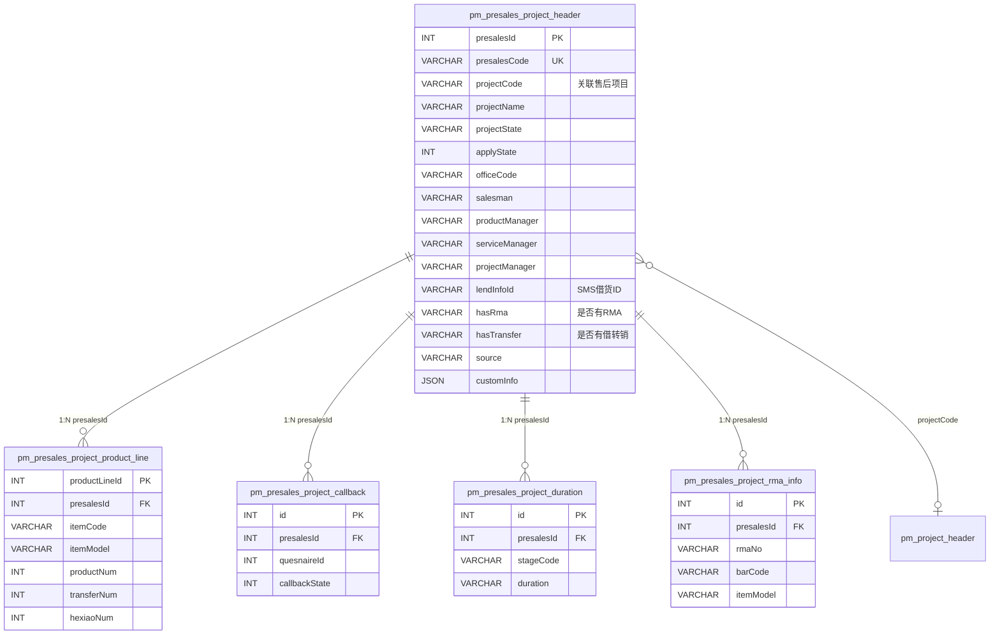
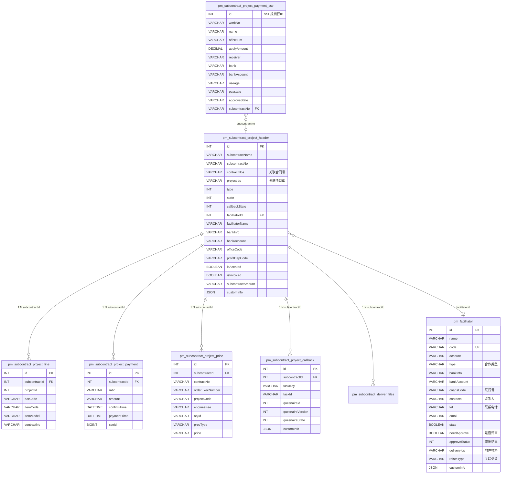
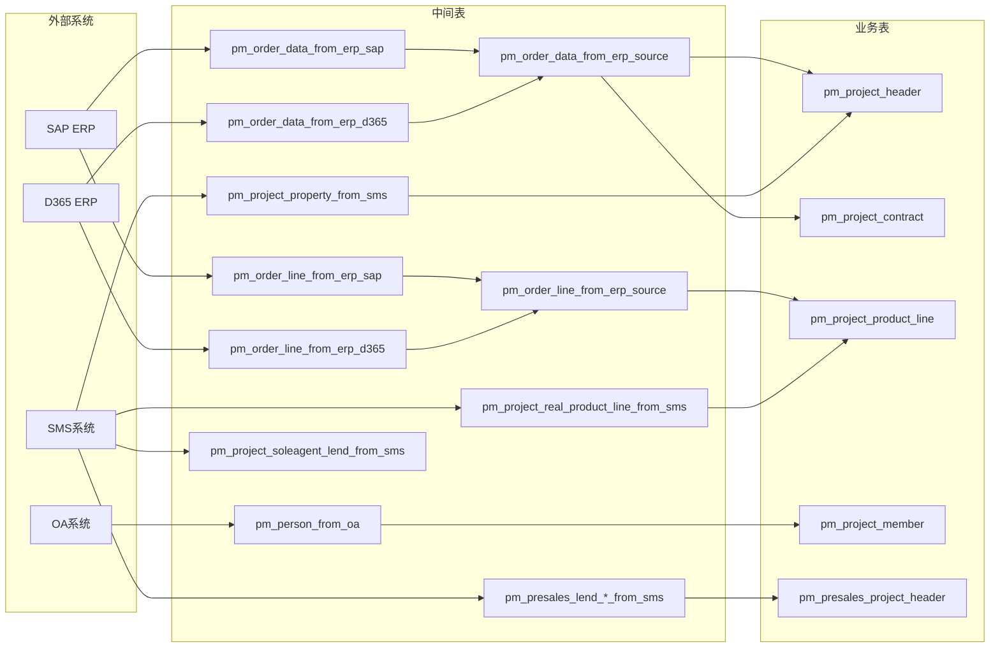
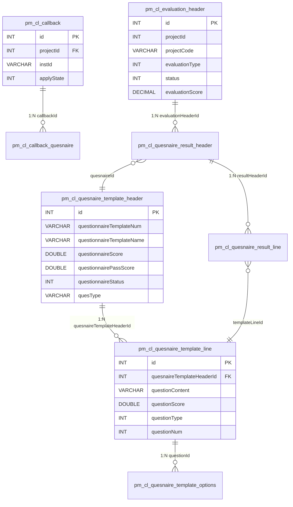
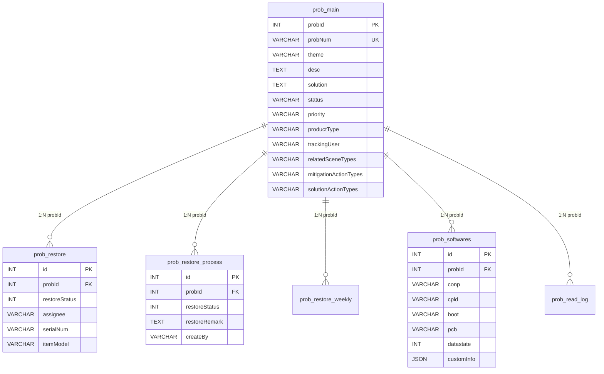

# ER关系图

> 数据库：dppms_d365 (MySQL)  
> 使用 Mermaid 语法绘制核心ER关系图

---

## 1. 项目核心关系网

```mermaid
erDiagram
    pm_project_header ||--o{ pm_project_member : "1:N projectId"
    pm_project_header ||--|| pm_project_state : "1:1 projectId"
    pm_project_header ||--o{ pm_project_product_line : "1:N projectId"
    pm_project_header ||--o{ pm_project_soft_version : "1:N projectId"
    pm_project_header ||--o{ pm_project_weekly : "1:N projectId"
    pm_project_header ||--o{ pm_project_log : "1:N projectId"
    pm_project_header ||--o{ pm_project_task : "1:N projectId"
    pm_project_header ||--o{ pm_project_instruction : "1:N projectId"
    pm_project_header ||--o{ pm_project_related_party : "1:N projectId"
    pm_project_header ||--o{ pm_project_maintenance : "1:N projectId"
    pm_project_header ||--o{ pm_project_supervision : "1:N projectId"
    pm_project_header ||--o{ pm_project_warranty_callback : "1:N projectId"

    pm_project_header {
        INT projectId PK
        VARCHAR projectType
        VARCHAR projectCode MUL
        VARCHAR projectName
        VARCHAR projectState
        VARCHAR column001 "办事处编码"
        VARCHAR column005 "系统部"
        VARCHAR column010 "项目等级"
        VARCHAR column012 "服务方式"
        VARCHAR compId "公司编码"
        JSON customInfo
    }

    pm_project_member {
        INT id PK
        INT projectId FK
        VARCHAR memberRole "10=项目经理/15=副项目经理/20=项目成员/30=技术负责人/40=质量负责人/50=安全负责人/60=远程支持/71=驻场工程师/80=其他"
        VARCHAR memberCode
        VARCHAR memberName
        DATETIME effectiveFrom
        DATETIME effectiveTo
    }

    pm_project_state {
        INT projectId PK_FK
        VARCHAR projectPlanState
        VARCHAR shipmentState
        VARCHAR executionState
        VARCHAR closeProcessState
    }

    pm_project_soft_version {
        INT id PK
        INT projectId FK
        VARCHAR contractNo
        VARCHAR barCode
        VARCHAR conp "App版本"
        VARCHAR cpld "驱动版本"
        VARCHAR boot "Boot版本"
        VARCHAR pcb "硬件版本"
    }

    pm_project_product_line {
        INT id PK
        INT projectId FK
        VARCHAR contractNo
        VARCHAR itemCode
        VARCHAR itemName
    }

    pm_project_weekly {
        INT id PK
        INT projectId FK
        VARCHAR weeklyName
        DATETIME weeklyDate
    }

    pm_project_maintenance {
        INT id PK
        INT projectId FK
        VARCHAR type "任务性质"
        VARCHAR processDesc "事项描述"
        VARCHAR itemModel "产品型号"
    }
```

---

## 2. 项目组-合同关系

```mermaid
erDiagram
    pm_project_header }o--|| pm_project_group_relationship : "projectCode"
    pm_project_group_relationship }o--|| pm_project_group : "projectGroupCode"
    pm_project_contract }o--|| pm_project_group : "projectGroupCode"

    pm_project_header {
        INT projectId PK
        VARCHAR projectCode MUL
        VARCHAR projectName
    }

    pm_project_group_relationship {
        INT id PK
        VARCHAR projectGroupCode FK
        VARCHAR projectCode FK
        VARCHAR mergeBranchMark
    }

    pm_project_group {
        INT id PK
        VARCHAR projectGroupCode UK
        VARCHAR projectGroupName
        VARCHAR projectType
    }

    pm_project_contract {
        INT id PK
        VARCHAR contractNo
        VARCHAR projectGroupCode FK
    }
```

---

## 3. 售前项目关联关系



---

## 4. 转包项目关联关系



---

## 5. 用户-角色-部门多对多关系

```mermaid
erDiagram
    fnd_user_info }o--o{ fnd_roles : "roleIds逗号分隔"
    fnd_user_info }o--o| fnd_department : "dpNo"
    fnd_user_info ||--o{ fnd_user_menus : "id→fnd_user_id"
    fnd_user_info ||--o{ fnd_user_power : "id→fndUserId"
    fnd_roles ||--o{ fnd_role_menus : "id→roleId"
    fnd_menus ||--o{ fnd_role_menus : "menuCode"
    fnd_menus ||--o{ fnd_user_menus : "menuCode"

    fnd_user_info {
        INT id PK
        VARCHAR username UK
        VARCHAR password
        VARCHAR email
        VARCHAR dpNo FK "部门编号"
        VARCHAR realName
        VARCHAR roleIds "角色ID列表"
        INT status
        VARCHAR defaultPage
        DATETIME pwdoverdue
        JSON customInfo
    }

    fnd_roles {
        INT id PK
        VARCHAR roleName
        VARCHAR defaultPage
        INT status
    }

    fnd_department {
        INT id PK
        VARCHAR departmentNum MUL
        VARCHAR departmentName
        INT status
    }

    fnd_menus {
        INT id PK
        VARCHAR menuCode MUL
        VARCHAR menuName
        INT menuLevel
        INT superId
        VARCHAR path
    }

    fnd_user_menus {
        INT id PK
        INT fnd_user_id FK
        VARCHAR menuCode FK
        INT menuValue
    }

    fnd_role_menus {
        INT id PK
        INT roleId FK
        VARCHAR menuCode FK
        VARCHAR menuPower
    }

    fnd_user_power {
        INT id PK
        INT fndUserId FK
        VARCHAR areapower "区域权限"
    }
```

---

## 6. 数据同步流向



---

## 7. 回访/问卷关系



---

## 8. 技术公告关系


