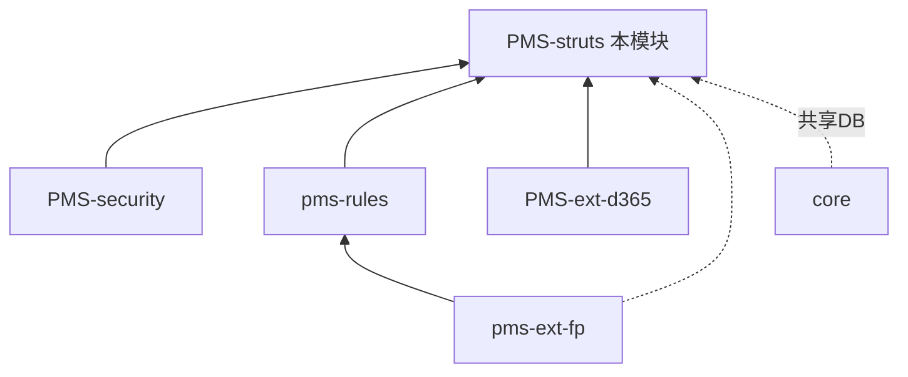

# PMS-struts 模块知识库

> DPtech PMS **核心业务主干模块**（Struts2 技术栈）。承载项目管理全生命周期业务，是 PMS 体系中功能最完整、数据量最大的模块。本知识库独立维护。

---

## 模块定位

| 项 | 值 |
|----|----|
| 目录 | `PMS/PMS-struts/` |
| artifactId | `pms-struts` |
| 基础包 | `com.dp.plat`（action/service/dao/data/extend 等） |
| 技术栈 | **Struts2 2.3.35** + Spring + **iBATIS（遗留）+ MyBatis 3.5.9（双栈）** + Shiro |
| 源码目录 | **非标准**：`src/`（非 `src/main/java`），配置在 `config/`（非 `src/main/resources`） |
| JDK | 1.8 |
| 规模 | 25 Action（主 action 包）/ 38 Service / 37 DAO（含子模块包另有 6 Action） |
| 管辖数据库 | `dppms_d365` 项目管理域（pm_project*/pm_cl*/pm_presales*/pm_subcontract*/prob*/fnd*） |

### 关键陷阱（构建/维护必读）

- ⚠️ 源码目录是 `src/` 而非 `src/main/java`；资源在 `config/` 而非 `src/main/resources`
- ⚠️ 本模块用 **Struts2 2.3.35**，而 PMS-springmvc 用 **2.5.30**——版本体系独立
- ⚠️ **iBATIS 与 MyBatis 并存**：遗留业务用 iBATIS（`<sqlMap>`），新业务用 MyBatis（`<mapper>`）
- ⚠️ `echarts-utils` 为 system 作用域依赖，位于 `WebContent/WEB-INF/lib/Utils-v0.1.jar`
- ⚠️ MyBatis XML 映射与 Java 同目录：`com/dp/plat/**/mapping/*.xml`
- ⚠️ Spring 为 **XML 配置**（非注解驱动），查 `applicationContext*.xml`、`spring*.xml`

### 依赖关系

> PMS-struts 依赖 PMS-security（安全）、pms-rules（规则）、PMS-ext-d365（D365集成）、pms-ext-fp；与 core 通过共用数据库 `dppms_d365` 关联（非 Maven 直接依赖）。

---

## 功能模块一览

| 功能模块 | 文档 | 核心Action | 主要表 |
|----------|------|-----------|--------|
| 项目管理 | [project-management.md](02-modules/project-management.md) | ProjectAction, PmClosedLoopAction | pm_project* |
| 售前管理 | [presales.md](02-modules/presales.md) | PresalesAction | pm_presales* |
| 转包管理 | [subcontract.md](02-modules/subcontract.md) | (ProjectAction扩展) | pm_subcontract* |
| 回访管理 | [callback.md](02-modules/callback.md) | CallBackAction | pm_cl* |
| 维保管理 | [maintenance.md](02-modules/maintenance.md) | (ProjectAction扩展) | pm_project_maintenance* |
| 问题管理 | [prob.md](02-modules/prob.md) | (extend) | prob* |
| 系统管理 | [system-management.md](02-modules/system-management.md) | UserManageAction, RoleManageAction, DepartmentManageAction, BasicDataManageAction | fnd* |
| 报表分析 | [report-analysis.md](02-modules/report-analysis.md) | ReportAction, DataAnalysisAction | 各业务表聚合 |
| 工作流 | [workflow.md](02-modules/workflow.md) | WorkFlowAction | act_* |
| 辅助模块 | [auxiliary-modules.md](02-modules/auxiliary-modules.md) | UploadAction, OperateLogAction, ProjectFileAction 等 | fnd_files 等 |

### Action/Service/方法级参考
- [Action 方法全量参考](02-modules/action-methods-reference.md)（2019行）
- [Service 方法全量参考](02-modules/service-methods-reference.md)（2254行）

---

## 文档目录

| 章节 | 内容 |
|------|------|
| [01-architecture](01-architecture/) | 系统架构、Struts/Spring 配置、多数据源、安全架构、过滤器 |
| [02-modules](02-modules/) | 各功能模块功能说明文档（标准模板：职责/类映射/流程/接口/Service/数据/异常） |
| [03-database](03-database/) | **权威全量数据字典** [database_dict final.md](03-database/database_dict%20final.md)（13337行，数据基准 2026-06-13 时点 273 表+39 视图；2026-06-29 实测 286 表+43 视图）+ ER图 + 索引分析 + 同步表。详见 [03-database/README.md](03-database/README.md) |
| [04-mapping](04-mapping/) | 功能-表 CRUD 矩阵 + 数据流程图 |
| [05-standards](05-standards/) | 编码规范、性能优化、安全实践、故障排查 |
| [06-reference](06-reference/) | 代码示例、数据字典、错误码、术语表、接口模板 |
| [audit](audit/) | 7 份质量审核报告 |
| [migration](migration/) | 功能点清单 |
| [performance](performance/) | 报表优化 |

---

## 快速导航

**新成员**：[系统架构](01-architecture/system-architecture.md) → [项目管理](02-modules/project-management.md) → [数据字典](03-database/database_dict%20final.md)

**开发者**：[编码规范](05-standards/coding-standards.md) → [接口模板](06-reference/interface-template.md) → [Action方法参考](02-modules/action-methods-reference.md)

**DBA/数据**：[全量数据字典](03-database/database_dict%20final.md) → [ER图](03-database/er-diagram.md) → [索引分析](03-database/index-analysis.md)

**排障**：[故障排查](05-standards/troubleshooting.md) → [审核报告](audit/final-verification-report.md)

---

## 跨库知识共享

- 共用数据库全量字典即本库 [database_dict final.md](03-database/database_dict%20final.md)，SPMS 共用此库
- 安全组件：[PMS-security](../../PMS-security/docs/02-modules/security-components.md)
- D365 集成：[PMS-ext-d365](../../PMS-ext-d365/docs/02-modules/d365-integration.md)
- 规则引擎：[pms-rules](../../pms-rules/docs/02-modules/rules-engine.md)
- 基础框架：[core](../../core/docs/README.md)
- EHR 组织：[PMS-springmvc](../../PMS-springmvc/docs/03-database/complete-data-dictionary.md)

---

## 文档维护

- 业务功能变更须同步 [02-modules](02-modules/) 对应文档 + [04-mapping CRUD矩阵](04-mapping/crud-matrix.md)
- 表结构变更须同步 [database_dict final.md](03-database/database_dict%20final.md)
- 修改后对照 [审核标准](../../../docs/知识库质量审核标准.md) 自检
