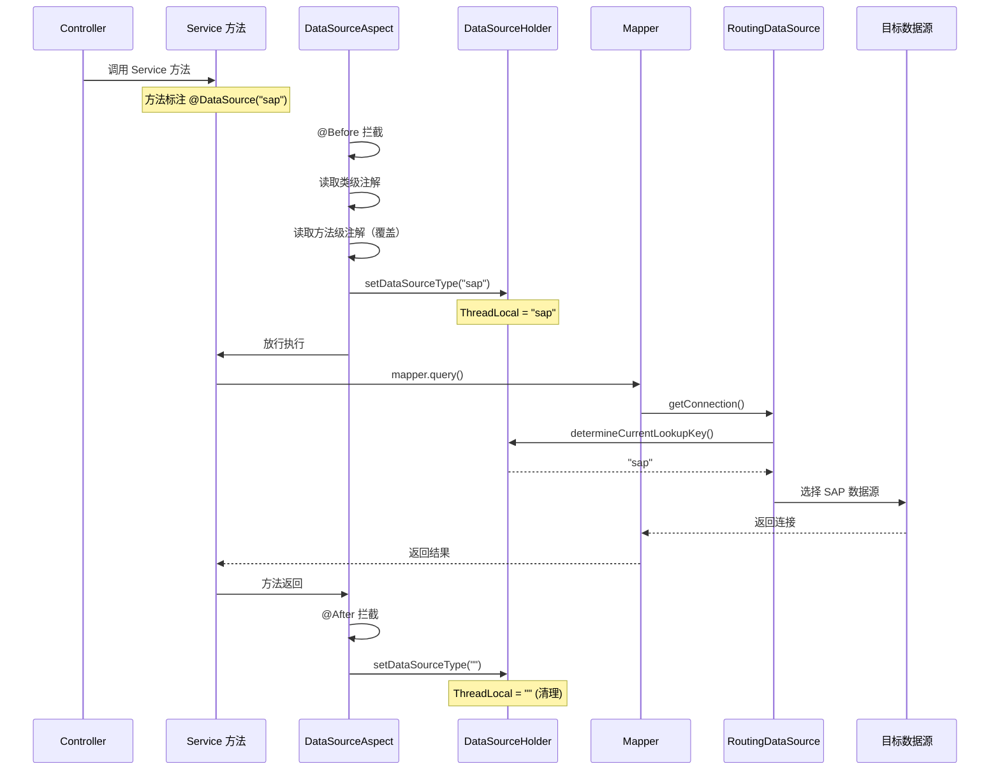

# core 模块多数据源架构

> 本文档详解 core 模块的多数据源动态路由机制，涵盖 RoutingDataSource、DataSourceHolder、DataSourceAspect 与数据源配置。
> 源码基准：`com.dp.plat.core.config`、`com.dp.plat.core.aop`、`com.dp.plat.core.annotation`。

---

## 1. 多数据源架构总览

core 基于 **Spring `AbstractRoutingDataSource` + ThreadLocal + AOP 注解** 实现多数据源动态切换，支持运行时按注解路由到不同数据库。

```mermaid
graph TB
    subgraph "多数据源架构"
        ANNO["@DataSource('key')<br/>注解标注"]
        ASP[DataSourceAspect<br/>@Before/@After]
        HOL[DataSourceHolder<br/>ThreadLocal]
        RD[RoutingDataSource<br/>AbstractRoutingDataSource]
        DS1[dataSourceLocal<br/>MySQL 主库]
        DS2[dataSourceSMS<br/>SMS 库 - 注释]
        DS3[dataSourceSAP<br/>SAP 库 - 注释]
    end

    ANNO --> ASP
    ASP -->|@Before setDataSourceType| HOL
    HOL -->|ThreadLocal| RD
    RD -->|determineCurrentLookupKey| HOL
    RD -->|targetDataSources| DS1
    RD -->|targetDataSources| DS2
    RD -->|targetDataSources| DS3
    ASP -->|@After setDataSourceType('')| HOL
```

---

## 2. 三要素详解

### 2.1 @DataSource 注解

```java
@Target({ElementType.METHOD, ElementType.TYPE})
@Retention(RetentionPolicy.RUNTIME)
public @interface DataSource {
    String value() default "";
}
```

- 标注在 Service 类或方法上；
- `value()` 指定数据源 Key（如 `"Local"`、`"SMS"`、`"SAP"`）；
- 方法级注解优先于类级注解。

### 2.2 DataSourceHolder（ThreadLocal 持有）

```java
public class DataSourceHolder {
    private static final ThreadLocal<String> contextHolder = new ThreadLocal<String>();

    public static void setDataSourceType(String dataSourceType) {
        contextHolder.set(dataSourceType);
    }

    public static String getDataSourceType() {
        return contextHolder.get();
    }

    public static void clearDataSourceType() {
        contextHolder.remove();
    }
}
```

| 方法 | 职责 |
|------|------|
| `setDataSourceType` | 写入当前线程的数据源 Key |
| `getDataSourceType` | 读取当前线程的数据源 Key |
| `clearDataSourceType` | 清除当前线程的数据源 Key |

> **ThreadLocal 原理**：每个线程独立持有数据源 Key，线程间隔离，避免并发串号。

### 2.3 RoutingDataSource（动态路由）

```java
public class RoutingDataSource extends AbstractRoutingDataSource {
    @Override
    protected Object determineCurrentLookupKey() {
        return DataSourceHolder.getDataSourceType();
    }
}
```

- 继承 Spring `AbstractRoutingDataSource`；
- `determineCurrentLookupKey()` 返回 ThreadLocal 中的 Key；
- Spring 根据返回的 Key 从 `targetDataSources` 中选择目标数据源。

### 2.4 DataSourceAspect（AOP 切面）

```java
@Aspect
@Component
public class DataSourceAspect {

    @Pointcut("@within(com.dp.plat.core.annotation.DataSource) || @annotation(com.dp.plat.core.annotation.DataSource)")
    public void serviceAspect() {}

    @Before("serviceAspect()")
    public void doBefore(JoinPoint joinPoint) {
        Class<?> targetClass = joinPoint.getTarget().getClass();
        String dataSource = "";
        // 1. 先读类级注解
        if (targetClass.isAnnotationPresent(DataSource.class)) {
            dataSource = targetClass.getAnnotation(DataSource.class).value();
        }
        // 2. 再读方法级注解，若不同则覆盖
        String methodDataSource = getMethodAnnotationValue(joinPoint);
        if (methodDataSource != null && !methodDataSource.equals(dataSource)) {
            dataSource = methodDataSource;
        }
        DataSourceHolder.setDataSourceType(dataSource);
    }

    @After("serviceAspect()")
    public void doAfter(JoinPoint joinPoint) {
        DataSourceHolder.setDataSourceType("");  // 清理 ThreadLocal
    }
}
```

**切点**：`@within(DataSource) || @annotation(DataSource)` — 类级或方法级注解均拦截。

**优先级**：方法级注解 > 类级注解（方法注解值不同时覆盖类注解）。

---

## 3. 数据源配置

### 3.1 spring.xml 中的数据源配置

```xml
<!-- 主数据源（Druid） -->
<bean id="dataSourceLocal" class="com.alibaba.druid.pool.DruidDataSource" destroy-method="close">
    <property name="driverClassName" value="${jdbc.driver}"/>
    <property name="url" value="${jdbc.url}"/>
    <!-- ... 连接池参数 -->
</bean>

<!-- 动态路由数据源 -->
<bean id="dataSource" class="com.dp.plat.core.config.RoutingDataSource">
    <property name="targetDataSources">
        <map key-type="java.lang.String">
            <entry key="${jdbc.key1}" value-ref="dataSourceLocal"/>
            <!-- 扩展点（当前注释）:
            <entry key="${jdbc.key2}" value-ref="dataSourceSMS"/>
            <entry key="${jdbc.key3}" value-ref="dataSourceOFS"/>
            <entry key="${jdbc.key4}" value-ref="dataSourcePMS"/>
            <entry key="${jdbc.key5}" value-ref="dataSourceTMS"/>
            <entry key="${jdbc.key6}" value-ref="dataSourceSAP"/>
            -->
        </map>
    </property>
    <property name="defaultTargetDataSource" ref="dataSourceLocal"/>
</bean>
```

### 3.2 数据源 Key 映射

| Key | 数据源 Bean | 数据库 | 状态 |
|-----|------------|--------|------|
| `Local` (jdbc.key1) | `dataSourceLocal` | MySQL (dppms_d365) | ✓ 启用 |
| `SMS` (jdbc.key2) | `dataSourceSMS` | MySQL (dpsms) | ✗ 注释 |
| `OFS` (jdbc.key3) | `dataSourceOFS` | - | ✗ 注释 |
| `PMS` (jdbc.key4) | `dataSourcePMS` | - | ✗ 注释 |
| `TMS` (jdbc.key5) | `dataSourceTMS` | - | ✗ 注释 |
| `SAP` (jdbc.key6) | `dataSourceSAP` | SQL Server | ✗ 注释 |

> **当前状态**：仅启用 `Local`（主库 MySQL），其余数据源已注释。需要时取消注释并配置对应 Bean。

### 3.3 jdbc.properties 配置

```properties
jdbc.key1=Local
#jdbc.key2=SMS
#jdbc.key3=OFS
#jdbc.key4=PMS
#jdbc.key5=TMS
#jdbc.key6=SAP

# 主库 MySQL
jdbc.url=jdbc:mysql://10.102.0.106:3306/dppms_d365?useUnicode=true&characterEncoding=UTF-8&useSSL=false&serverTimezone=GMT%2B8
jdbc.driver=com.mysql.jdbc.Driver
jdbc.username=root
jdbc.password=!Q@W3e4r
```

---

## 4. 工作流程

### 4.1 完整调用时序



### 4.2 注解优先级示例

```java
// 类级注解：默认走 Local
@DataSource("Local")
@Service
public class OrderServiceImpl {

    // 方法级注解：覆盖类级，走 SAP
    @DataSource("sap")
    public List<Order> querySapOrders() {
        return sapMapper.selectOrders();
    }

    // 无方法级注解：使用类级 Local
    public List<Order> queryLocalOrders() {
        return localMapper.selectOrders();
    }
}
```

---

## 5. 与 PMS-struts 多数据源对比

| 维度 | core | PMS-struts |
|------|------|-----------|
| 实现方式 | `AbstractRoutingDataSource` + ThreadLocal + AOP | iBatis 多 `SqlMapClientTemplate` + `BaseDao` 多属性 |
| 切换方式 | `@DataSource` 注解（声明式） | 注入不同 `SqlMapClientTemplate`（编程式） |
| 数据源类型 | Druid 连接池 | DBCP + DriverManagerDataSource |
| 事务边界 | Spring `@Transactional` | `TransactionProxyFactoryBean`（ServiceAgent） |
| 跨库能力 | 同一事务内不能切换 | 各 SqlMapClient 独立事务 |
| 集群支持 | ThreadLocal 单机 | 单机 |

> **core 优势**：声明式切换，业务代码无感知；**PMS-struts 优势**：可在同一方法内访问多库（多 Template）。

---

## 6. 并发与线程安全

### 6.1 ThreadLocal 串号风险

```mermaid
flowchart TD
    subgraph "线程池复用场景"
        REQ1[请求1 @DataSource('sap')] --> TH1[线程A]
        TH1 --> SET1[ThreadLocal='sap']
        SET1 --> EXEC1[执行 SAP 查询]
        EXEC1 --> CLR1[ThreadLocal='' 清理]
        CLR1 --> RETURN1[线程A 归还池]

        REQ2[请求2 无注解] --> TH2[线程A 复用]
        TH2 --> CHECK{ThreadLocal?}
        CHECK -->|未清理| WRONG[读到 'sap' 错误数据源!]
        CHECK -->|已清理| RIGHT[读 '' 走默认 Local]
    end
```

### 6.2 防护措施

| 措施 | 实现 | 说明 |
|------|------|------|
| `@After` 清理 | `DataSourceAspect.doAfter` | 方法返回后置空 ThreadLocal |
| `ContextCopyingDecorator` | `concurrent` 包 | 异步线程传递上下文 |
| `RequestThreadPoolExecutor` | `concurrent` 包 | 带上下文传递的线程池 |

### 6.3 异步线程正确用法

```java
// 错误：异步线程中 ThreadLocal 未传递
executor.submit(() -> {
    service.crossDbQuery();  // ThreadLocal 为空，走默认数据源
});

// 正确：使用 ContextCopyingDecorator 传递上下文
executor.submit(ContextCopyingDecorator.decorate(() -> {
    service.crossDbQuery();  // ThreadLocal 已复制，数据源切换正确
}));
```

---

## 7. 数据源扩展

### 7.1 新增数据源步骤

1. **jdbc.properties 添加 Key**：
```properties
jdbc.key7=D365
```

2. **spring.xml 配置数据源 Bean**：
```xml
<bean id="dataSourceD365" class="com.alibaba.druid.pool.DruidDataSource" destroy-method="close">
    <property name="driverClassName" value="${d365.driver}"/>
    <property name="url" value="${d365.url}"/>
    <property name="username" value="${d365.username}"/>
    <property name="password" value="${d365.password}"/>
</bean>
```

3. **RoutingDataSource 注册**：
```xml
<bean id="dataSource" class="com.dp.plat.core.config.RoutingDataSource">
    <property name="targetDataSources">
        <map key-type="java.lang.String">
            <entry key="${jdbc.key1}" value-ref="dataSourceLocal"/>
            <entry key="${jdbc.key7}" value-ref="dataSourceD365"/>
        </map>
    </property>
    <property name="defaultTargetDataSource" ref="dataSourceLocal"/>
</bean>
```

4. **Service 使用注解**：
```java
@DataSource("D365")
public List<D365Order> queryD365Orders() {
    return d365Mapper.selectOrders();
}
```

### 7.2 数据源配置表

建议维护数据源配置表，记录各数据源信息：

| Key | Bean | 数据库类型 | 用途 | 连接池 |
|-----|------|----------|------|--------|
| `Local` | `dataSourceLocal` | MySQL | 主库 | Druid |
| `SMS` | `dataSourceSMS` | MySQL | 短信系统 | Druid |
| `SAP` | `dataSourceSAP` | SQL Server | SAP ERP | Druid |
| `D365` | `dataSourceD365` | SQL Server | Dynamics 365 | Druid |

---

## 8. 限制与避坑

### 8.1 已知限制

| 限制 | 说明 | 解决方案 |
|------|------|---------|
| 同一事务内不能切换数据源 | 事务开始时连接已绑定 | 跨库操作拆分为独立事务 |
| 跨库 JOIN 不支持 | 不同数据源的表无法 JOIN | 应用层组装或数据同步到同库 |
| ThreadLocal 不传递到异步线程 | 子线程 ThreadLocal 为空 | 使用 `ContextCopyingDecorator` |
| 集群 ThreadLocal 不共享 | 各节点独立 | 改用请求参数传递数据源 Key |

### 8.2 常见避坑

| 场景 | 问题 | 解决 |
|------|------|------|
| `@After` 未清理 | 线程池复用读错库 | 确认 `DataSourceAspect.doAfter` 正常执行 |
| 注解打在 Controller | 切点仅拦截 Service | 注解必须打在 Service 类/方法 |
| `@DataSource` + `@Transactional` | 事务内切换无效 | 数据源切换在事务外完成 |
| 异步线程未传递上下文 | 读默认库 | 使用 `ContextCopyingDecorator` |

---

## 9. 相关文档

- [Spring 配置详解](spring-configuration.md) — 数据源 Bean 配置
- [MyBatis 配置](mybatis-configuration.md) — SqlSessionFactory 绑定
- [05-standards 性能优化](../05-standards/performance-optimization.md) — ThreadLocal 优化
- [05-standards 故障排查](../05-standards/troubleshooting.md) — ThreadLocal 串号排查
- 对比参考：[PMS-struts 多数据源](../../PMS-struts/docs/01-architecture/multi-datasource.md)
