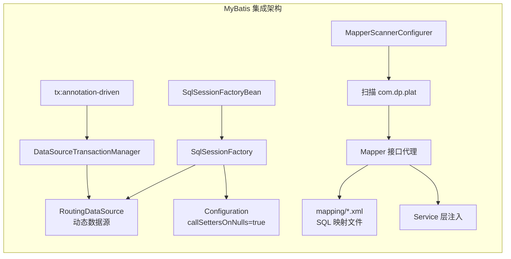
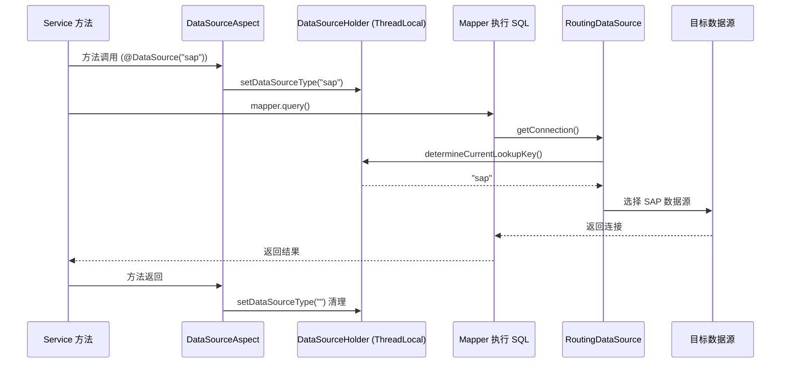

# core 模块 MyBatis 配置

> 本文档详解 core 模块的 MyBatis 集成配置，涵盖 SqlSessionFactory、Mapper 扫描、类型别名、插件与数据源路由。
> 源码基准：`spring-mybatis.xml`、`com.dp.plat.core.dao`、`com.dp.plat.core.mapping`。

---

## 1. MyBatis 集成概述

core 使用 **MyBatis 3.5.9** + `mybatis-spring` 作为持久层框架，通过 `SqlSessionFactoryBean` 与 Spring 集成。



---

## 2. SqlSessionFactory 配置

```xml
<bean id="sqlSessionFactory" class="org.mybatis.spring.SqlSessionFactoryBean">
    <property name="dataSource" ref="dataSource"/>
    <property name="mapperLocations">
        <array>
            <value>classpath*:com/dp/plat/**/mapping/*.xml</value>
            <value>classpath*:com/dp/plat/**/mapping/**/*.xml</value>
        </array>
    </property>
    <property name="configuration">
        <bean class="org.apache.ibatis.session.Configuration">
            <property name="callSettersOnNulls" value="true"/>
        </bean>
    </property>
</bean>
```

### 2.1 配置项说明

| 配置项 | 值 | 说明 |
|-------|-----|------|
| `dataSource` | `dataSource` (RoutingDataSource) | 绑定动态数据源，支持运行时切换 |
| `mapperLocations` | `classpath*:com/dp/plat/**/mapping/*.xml` | 自动扫描所有模块的 MyBatis XML |
| `callSettersOnNulls` | `true` | 查询结果含 null 时仍调用 setter |

### 2.2 callSettersOnNulls 详解

`callSettersOnNulls=true` 解决了一个常见问题：当查询结果某列为 NULL 时，MyBatis 默认不调用 setter，导致 Map 中缺失该字段。

```java
// 关闭时（默认）：Map 中无 null 字段
{"id": 1, "name": "张三"}  // age 为 null 时缺失

// 开启时（core 配置）：Map 中保留 null 字段
{"id": 1, "name": "张三", "age": null}
```

> **使用场景**：core 的 `MapParam` 与动态表单依赖 Map 中字段存在性，需开启此项。

### 2.3 与 PMS-struts 的对比

| 项 | core | PMS-struts |
|----|------|-----------|
| 框架 | MyBatis 3.5.9 | iBatis 2.x + MyBatis 3.5.9 共存 |
| 配置 | `spring-mybatis.xml` | `spring-extend-mybatis.xml` |
| 扫描范围 | `com.dp.plat` | `com.dp.plat.pms.**.dao` |
| 数据源 | RoutingDataSource（动态） | 固定 dataSource |
| 二级缓存 | 未显式启用 | `cacheEnabled=true` |
| 类型处理器 | 未显式配置 | `FastjsonTypeHandler` |

---

## 3. Mapper 接口扫描

```xml
<bean class="org.mybatis.spring.mapper.MapperScannerConfigurer">
    <property name="basePackage" value="com.dp.plat"/>
    <property name="sqlSessionFactoryBeanName" value="sqlSessionFactory"/>
</bean>
```

### 3.1 扫描规则

- 扫描 `com.dp.plat` 下所有 Mapper 接口（含 core/security/support 子包）；
- 接口自动注册为 Spring Bean，Bean ID 为接口首字母小写的类名；
- 绑定 `sqlSessionFactory`，与主数据源共享连接。

### 3.2 core 模块 Mapper 清单

| Mapper | 接口 | 对应表 | 说明 |
|--------|------|--------|------|
| `UserMapper` | `com.dp.plat.core.dao.UserMapper` | `t_user` | 用户 CRUD + 登录查询 |
| `UserInfoMapper` | `com.dp.plat.core.dao.UserInfoMapper` | `t_user_info` | 用户信息 |
| `UserRoleMapper` | `com.dp.plat.core.dao.UserRoleMapper` | `t_user_role` | 用户-角色 |
| `UserLoginRecordMapper` | `com.dp.plat.core.dao.UserLoginRecordMapper` | `t_user_login_record` | 登录记录 |
| `RoleMapper` | `com.dp.plat.core.dao.RoleMapper` | `t_role` | 角色（继承 AbstractBaseMapper） |
| `RoleMenuMapper` | `com.dp.plat.core.dao.RoleMenuMapper` | `t_role_menu` | 角色-菜单 |
| `RolePermissionMapper` | `com.dp.plat.core.dao.RolePermissionMapper` | `t_role_permission` | 角色-权限 |
| `MenuMapper` | `com.dp.plat.core.dao.MenuMapper` | `t_menu` | 菜单 |
| `PermissionMapper` | `com.dp.plat.core.dao.PermissionMapper` | `t_permission` | 权限 |
| `ResourceMapper` | `com.dp.plat.core.dao.ResourceMapper` | `t_resource` | URL 资源 |
| `DepartmentMapper` | `com.dp.plat.core.dao.DepartmentMapper` | `t_department` | 部门 |
| `CompanyMapper` | `com.dp.plat.core.dao.CompanyMapper` | `t_company` | 公司 |
| `DictionaryMapper` | `com.dp.plat.core.dao.DictionaryMapper` | `t_dictionary` | 字典 |
| `FileInfoMapper` | `com.dp.plat.core.dao.FileInfoMapper` | `t_file` | 文件 |
| `SysLogMapper` | `com.dp.plat.core.dao.SysLogMapper` | `t_sys_log` | 系统日志 |
| `SyncLogMapper` | `com.dp.plat.core.dao.SyncLogMapper` | `t_sync_log` | 同步日志 |
| `SynchronizeMapper` | `com.dp.plat.core.dao.SynchronizeMapper` | `t_sync_log/t_sync_state` | 同步 |
| `MailInfoMapper` | `com.dp.plat.core.dao.MailInfoMapper` | `t_mails` | 邮件 |
| `NotifyTemplateMapper` | `com.dp.plat.core.dao.NotifyTemplateMapper` | `t_notify_template` | 通知模板 |
| `SystemVariableMapper` | `com.dp.plat.core.dao.SystemVariableMapper` | `t_sys_variable` | 系统变量 |
| `DataOperationMapper` | `com.dp.plat.core.dao.DataOperationMapper` | 通用 | 数据操作 |
| `DataExportMapper` | `com.dp.plat.core.dao.DataExportMapper` | 通用 | 数据导出 |

---

## 4. AbstractBaseMapper 基类

core 定义了泛型化的 CRUD 基类，所有 Mapper 可继承获得标准 CRUD：

```java
public interface AbstractBaseMapper<T> {
    int deleteByPrimaryKey(Object pk);
    int insert(T t);
    int insertSelective(T t);
    T selectByPrimaryKey(Object pk);
    int updateByPrimaryKey(T t);
    int updateByPrimaryKeySelective(T t);
    long countBySelective(T t);
    long countBySelectivePageable(PageParam pageParam);
    List<T> selectBySelective(T t);
    List<T> selectBySelectivePageable(PageParam pageParam);
}
```

### 4.1 方法说明

| 方法 | 说明 |
|------|------|
| `deleteByPrimaryKey` | 按主键删除 |
| `insert` | 全字段插入 |
| `insertSelective` | 选择性插入（null 字段跳过） |
| `selectByPrimaryKey` | 按主键查询 |
| `updateByPrimaryKey` | 全字段更新 |
| `updateByPrimaryKeySelective` | 选择性更新（null 字段跳过） |
| `countBySelective` | 条件计数 |
| `countBySelectivePageable` | 分页计数 |
| `selectBySelective` | 条件查询 |
| `selectBySelectivePageable` | 分页查询 |

### 4.2 继承示例

```java
// RoleMapper 继承 AbstractBaseMapper，自动获得 CRUD
public interface RoleMapper extends AbstractBaseMapper<Role> {
    // 仅声明自定义方法
    List<Role> selectAllRole();
    Role selectRoleByRoleName(String roleName);
    List<Role> selectRolesByRoleNames(String roleNames);
}
```

> **注意**：`UserMapper` 和 `MenuMapper` 未继承 `AbstractBaseMapper`，手动声明了所有方法。新实体建议继承基类以减少样板代码。

---

## 5. Mapper XML 映射

### 5.1 XML 位置约定

MyBatis XML 与 Java 接口同目录：`com/dp/plat/**/mapping/*.xml`

```
com/dp/plat/core/
├── dao/
│   ├── UserMapper.java
│   ├── RoleMapper.java
│   └── MenuMapper.java
└── mapping/
    ├── UserMapper.xml      # SQL 映射
    ├── RoleMapper.xml
    └── MenuMapper.xml
```

### 5.2 resultMap 映射规则

core 表列存在驼峰与下划线混用，需显式映射：

```xml
<resultMap id="BaseResultMap" type="com.dp.plat.core.pojo.User">
    <id column="user_id" property="userId" jdbcType="INTEGER"/>
    <result column="user_name" property="userName" jdbcType="VARCHAR"/>
    <result column="needChangePwd" property="needChangePwd" jdbcType="BIT"/>
    <result column="isSysUser" property="isSysUser" jdbcType="SMALLINT"/>
</resultMap>
```

| 列名风格 | 示例 | property |
|---------|------|---------|
| 下划线 | `user_id` | `userId` |
| 驼峰 | `needChangePwd` | `needChangePwd` |
| 混合 | `loginErrorCount` | `loginErrorCount` |

> **避坑**：新表统一用下划线列名，旧表（t_user 等）保留混合命名，修改需同步更新 resultMap。

---

## 6. 数据源路由与 MyBatis

### 6.1 动态数据源绑定

MyBatis 的 `SqlSessionFactory` 绑定 `RoutingDataSource`，SQL 执行时按 ThreadLocal 选择数据源：



### 6.2 多数据源限制

| 限制 | 说明 |
|------|------|
| 同一事务内不能切换数据源 | 事务开始时连接已绑定，切换无效 |
| 跨库 JOIN 不支持 | 不同数据源的表无法 JOIN |
| 异步线程需传递上下文 | ThreadLocal 不自动传递，需用 `ContextCopyingDecorator` |

> 详见 [multi-datasource.md](multi-datasource.md)。

---

## 7. 事务管理

```xml
<bean id="transactionManager"
    class="org.springframework.jdbc.datasource.DataSourceTransactionManager">
    <property name="dataSource" ref="dataSource"/>
</bean>
<tx:annotation-driven transaction-manager="transactionManager" proxy-target-class="true"/>
```

### 7.1 事务特性

| 项 | 值 | 说明 |
|----|-----|------|
| 事务管理器 | `DataSourceTransactionManager` | 绑定 RoutingDataSource |
| 驱动方式 | `@Transactional` 注解 | 声明式事务 |
| 代理方式 | CGLIB（`proxy-target-class=true`） | 基于类继承 |
| 传播行为 | `REQUIRED`（默认） | 支持当前事务，无则新建 |
| 隔离级别 | 数据库默认 | MySQL 默认 REPEATABLE_READ |

### 7.2 事务使用规范

```java
@Service
public class UserServiceImpl extends AbstractBaseService<User> implements IUserService {

    @Transactional
    public void createUser(User user, UserRole userRole) {
        // 同一事务内操作多表
        mapper.insertSelective(user);
        userRoleMapper.insertSelective(userRole);
    }

    @DataSource("sap")  // 数据源切换（事务外）
    public List<SapOrder> querySapOrders() {
        return sapMapper.selectOrders();
    }
}
```

> **避坑**：`@DataSource` 与 `@Transactional` 同时使用时，数据源切换在事务开始前生效。事务内切换数据源无效。

---

## 8. 分页机制

### 8.1 PageParam 分页参数

core 使用 `PageParam<T>` 封装分页参数：

```java
public class PageParam<T> {
    private int pageNum;    // 页码
    private int pageSize;   // 每页大小
    private T param;        // 查询条件
    // getter/setter...
}
```

### 8.2 分页查询模式

```java
// Service 层
public PageResult<User> queryUsersByPage(UserParam param) {
    PageParam<UserDetail> pageParam = new PageParam<>();
    pageParam.setPageNum(param.getPageNum());
    pageParam.setPageSize(param.getPageSize());
    pageParam.setParam(param);

    long total = mapper.countBySelectivePageable(pageParam);
    List<UserDetail> list = mapper.selectBySelectivePageable(pageParam);
    return new PageResult<>(list, total);
}
```

```xml
<!-- Mapper XML -->
<select id="selectBySelectivePageable" resultType="UserDetail">
    SELECT * FROM t_user
    <where>
        <if test="param.userName != null">AND user_name LIKE #{param.userName}</if>
    </where>
    LIMIT #{pageNum}, #{pageSize}
</select>
```

> **注意**：core 使用 MySQL `LIMIT` 物理分页，未使用 PageHelper 等插件。SQL Server 数据源需改用 `OFFSET ... FETCH`。

---

## 9. 相关文档

- [Spring 配置详解](spring-configuration.md) — MyBatis Bean 配置
- [多数据源架构](multi-datasource.md) — RoutingDataSource 详解
- [03-database DAO/SQL 参考](../03-database/dao-sql-reference.md) — Mapper SQL 映射
- [02-modules 公共组件](../02-modules/common-components.md) — Service/Mapper 清单
- [06-reference 代码示例](../06-reference/code-examples.md) — 新增实体套路
