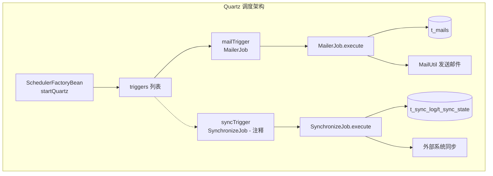
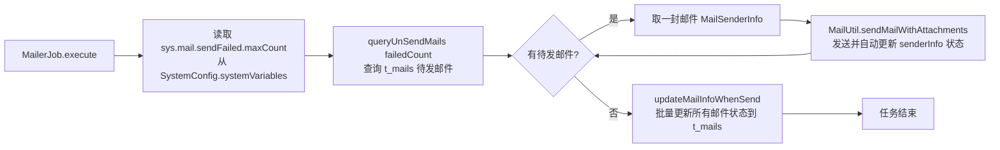
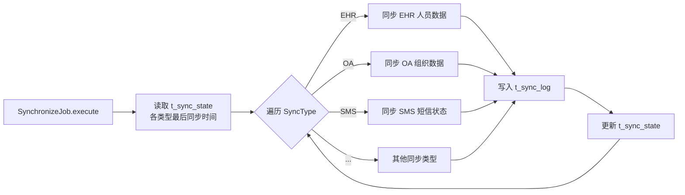

# core 模块 Quartz 定时任务配置

> 本文档详解 core 模块的 Quartz 定时任务配置，涵盖 beans-quartz.xml、MailerJob 邮件发送、SynchronizeJob 数据同步。
> 源码基准：`com.dp.plat.core.schedule`。

---

## 1. Quartz 配置概述

core 使用 **Spring 集成 Quartz**（`spring-context-support`）管理定时任务，通过 `beans-quartz.xml` 配置。



---

## 2. beans-quartz.xml 配置

### 2.1 完整配置

```xml
<beans>
    <!-- 1. 任务类 -->
    <bean id="mailJob" class="com.dp.plat.core.schedule.MailerJob"/>

    <!-- 2. 任务详情（调用对象+方法） -->
    <bean id="mailTask"
        class="org.springframework.scheduling.quartz.MethodInvokingJobDetailFactoryBean">
        <property name="targetObject" ref="mailJob"/>
        <property name="targetMethod" value="execute"/>
        <property name="concurrent" value="false"/>
    </bean>

    <!-- 3. 触发器（Cron 表达式） -->
    <bean id="mailTrigger" class="org.springframework.scheduling.quartz.CronTriggerFactoryBean">
        <property name="jobDetail" ref="mailTask"/>
        <property name="cronExpression" value="0 0/5 8-20 * * ?"/>
    </bean>

    <!-- 4. 调度器 -->
    <bean id="startQuartz" lazy-init="false" autowire="no"
        class="org.springframework.scheduling.quartz.SchedulerFactoryBean">
        <property name="triggers">
            <list>
                <!-- 当前触发器列表为空（mailTrigger 已注释） -->
            </list>
        </property>
    </bean>
</beans>
```

### 2.2 配置项说明

| 配置项 | 值 | 说明 |
|-------|-----|------|
| `mailJob` | `MailerJob` | 邮件发送任务类 |
| `targetMethod` | `execute` | 调用方法名 |
| `concurrent` | `false` | 禁止并发执行（上次未完成不启动下次） |
| `cronExpression` | `0 0/5 8-20 * * ?` | 每天 8:00-20:00 每 5 分钟执行 |
| `lazy-init` | `false` | 容器启动即开始调度 |
| `autowire` | `no` | 禁止自动装配 |

### 2.3 当前状态

> **注意**：`startQuartz` 的 `triggers` 列表当前为空（`mailTrigger` 已注释），邮件定时任务**未启用**。需要时取消注释即可激活。

---

## 3. Cron 表达式

### 3.1 表达式格式

Quartz Cron 表达式格式：`秒 分 时 日 月 周 [年]`

```
0 0/5 8-20 * * ?
│ │  │  │  │ │
│ │  │  │  │ └─ 周（? 表示不限制）
│ │  │  │  └─── 月（* 每月）
│ │  │  └────── 日（* 每日）
│ │  └───────── 时（8-20 即 8点到20点）
│ └──────────── 分（0/5 即每5分钟）
└────────────── 秒（0 即第0秒）
```

### 3.2 mailTrigger 表达式解析

`0 0/5 8-20 * * ?`：

| 字段 | 值 | 含义 |
|------|-----|------|
| 秒 | 0 | 第 0 秒 |
| 分 | 0/5 | 从 0 分开始，每 5 分钟 |
| 时 | 8-20 | 8 点到 20 点 |
| 日 | * | 每天 |
| 月 | * | 每月 |
| 周 | ? | 不限制 |

**执行时间**：每天 8:00、8:05、8:10 ... 20:55，共 169 次/天。

### 3.3 常用 Cron 表达式示例

| 表达式 | 含义 |
|--------|------|
| `0 0/5 8-20 * * ?` | 工作时间每 5 分钟 |
| `0 0 0 * * ?` | 每天凌晨 0 点 |
| `0 0 1 * * ?` | 每天凌晨 1 点 |
| `0 0 12 * * ?` | 每天中午 12 点 |
| `0 0/30 * * * ?` | 每 30 分钟 |
| `0 0 0 ? * MON` | 每周一凌晨 |
| `0 0 0 1 * ?` | 每月 1 号凌晨 |

---

## 4. MailerJob 邮件发送任务

### 4.1 任务职责

`MailerJob.execute()` 扫描 `t_mails` 表待发邮件，调用 `MailUtil.sendMailWithAttachments` 发送：



### 4.2 邮件发送流程

| 步骤 | 操作 | 涉及表/方法 |
|------|------|--------|
| 1 | 读取最大失败重试次数 | `SystemConfig.systemVariables.get("sys.mail.sendFailed.maxCount")` |
| 2 | 查询待发邮件 | `IMailInfoService.queryUnSendMails(Integer)` |
| 3 | 循环发送邮件 | `MailUtil.sendMailWithAttachments(MailSenderInfo)` |
| 4 | 发送异常记录到日志表 | `ExceptionHandler.insertException(e)` |
| 5 | 批量更新邮件状态 | `IMailInfoService.updateMailInfoWhenSend(List<MailInfo>)` |

> **说明**：`sendMailWithAttachments` 内部会修改 `MailSenderInfo` 的 `sendTime`、`sendFlag`、`failedCount`、`failedMessage` 等字段；`MailerJob` 在循环结束后统一调用 `updateMailInfoWhenSend` 一次性持久化，而非每封邮件单独更新。

### 4.3 邮件配置

> **重要更正**：经源码核对（`MailConfig.java`、`MailUtil.java`、`config.properties`），core 模块**未**使用 `config.properties` 中的 `mail.host`/`mail.port` 等键。邮件参数实际存储在 **`t_sys_variable` 系统变量表**中，由 `SystemConfig.systemVariables` 加载到内存，`MailConfig.getMailVariables()` 直接读取 `SystemConfig.systemVariables`。

**`MailerJob.execute()` 实际流程**（源码 `MailerJob.java`）：
1. 从 `SystemConfig.systemVariables` 读取 `sys.mail.sendFailed.maxCount`（默认 3）；
2. 调用 `mailInfoService.queryUnSendMails(failedCount)` 查询失败次数未超阈值的待发邮件；
3. 循环调用 `MailUtil.sendMailWithAttachments(senderInfo)` 发送；
4. 发送完成后统一调用 `mailInfoService.updateMailInfoWhenSend(Arrays.asList(senderInfos))` 一次性更新邮件状态。

**邮件相关系统变量 Key**（存储在 `t_sys_variable`，由 `MailUtil.completeMailServerVariables` 读取）：

| Key | 说明 |
|------|------|
| `sys.mail.server.host` | 外网 SMTP 服务器地址 |
| `sys.mail.server.port` | 外网 SMTP 端口 |
| `sys.mail.server.username` | 外网发件账号 |
| `sys.mail.server.password` | 外网发件密码 |
| `sys.mail.server.fromAddress` | 外网发件地址 |
| `sys.innerMail.server.host` | 内网 SMTP 服务器地址 |
| `sys.innerMail.server.port` | 内网 SMTP 端口 |
| `sys.innerMail.server.username` | 内网发件账号 |
| `sys.innerMail.server.password` | 内网发件密码 |
| `sys.innerMail.server.fromAddress` | 内网发件地址 |
| `sys.mail.defaultNick` | 发件人默认昵称 |
| `sys.mail.develop.receiveAddress` | 测试环境兜底收件地址 |
| `sys.mail.sendFailed.maxCount` | 最大失败重试次数（默认 3） |
| `sys.mail.domain.distribute.enable` | 是否内外网邮箱分开发送（默认 true） |
| `sys.envirment.argu` | 环境标识：`1`/`2` 正式环境、`0` 测试环境 |

> 内外网邮箱通过收件域名 `@dp.com` 区分（`MailUtil.INNERMAIL_DOMAIN`），分别使用 `sys.innerMail.server.*` 与 `sys.mail.server.*` 配置发送。

---

## 5. SynchronizeJob 数据同步任务

### 5.1 任务职责

`SynchronizeJob.execute()` 从外部系统（EHR/OA/SMS 等）同步数据到本地中间表：



### 5.2 SyncType 同步类型枚举

`SyncType` 枚举定义支持的同步类型：

| 同步类型 | 源系统 | 目标表 | 说明 |
|---------|--------|--------|------|
| EHR | EHR (SQL Server) | `t_user_info` | 人员信息同步 |
| OA | OA (SQL Server) | `t_department` | 组织架构同步 |
| SMS | SMS (MySQL) | 业务表 | 短信状态回传 |
| ... | ... | ... | 其他同步 |

### 5.3 同步日志

每次同步写入 `t_sync_log` 记录：

| 字段 | 说明 |
|------|------|
| `syncType` | 同步类型 |
| `startTime` / `endTime` | 同步起止时间 |
| `status` | 同步状态（成功/失败） |
| `recordCount` | 同步记录数 |
| `errorMsg` | 错误信息 |

`t_sync_state` 记录各类型最后同步状态，用于增量同步。

---

## 6. 并发控制

### 6.1 concurrent=false

```xml
<property name="concurrent" value="false"/>
```

- 禁止并发执行：上次任务未完成时，下次任务不启动；
- 防止数据同步重复执行导致数据不一致；
- 适用于耗时较长的同步任务。

### 6.2 集群部署问题

| 问题 | 说明 | 解决方案 |
|------|------|---------|
| 多节点同时执行 | 各节点独立调度，任务重复执行 | 使用 Quartz 集群模式（数据库锁） |
| 数据竞争 | 多节点同时写同一数据 | 分布式锁或任务分片 |

> **避坑**：当前 `SchedulerFactoryBean` 未配置集群模式，集群部署时需配置 `quartz.properties` 启用数据库锁。

---

## 7. 任务启停管理

### 7.1 启用任务

取消 `startQuartz` 中 trigger 的注释：

```xml
<bean id="startQuartz" lazy-init="false" autowire="no"
    class="org.springframework.scheduling.quartz.SchedulerFactoryBean">
    <property name="triggers">
        <list>
            <ref bean="mailTrigger"/>  <!-- 取消注释启用 -->
        </list>
    </property>
</bean>
```

### 7.2 禁用任务

注释 trigger 引用或从 list 中移除：

```xml
<property name="triggers">
    <list>
        <!-- <ref bean="mailTrigger"/> -->  <!-- 注释禁用 -->
    </list>
</property>
```

### 7.3 新增任务

1. 创建任务类（继承现有 Job 模式）：
```java
public class MyJob {
    public void execute() {
        // 任务逻辑
    }
}
```

2. 配置 JobDetail + Trigger + 注册到 Scheduler：
```xml
<bean id="myJob" class="com.dp.plat.core.schedule.MyJob"/>
<bean id="myTask" class="org.springframework.scheduling.quartz.MethodInvokingJobDetailFactoryBean">
    <property name="targetObject" ref="myJob"/>
    <property name="targetMethod" value="execute"/>
    <property name="concurrent" value="false"/>
</bean>
<bean id="myTrigger" class="org.springframework.scheduling.quartz.CronTriggerFactoryBean">
    <property name="jobDetail" ref="myTask"/>
    <property name="cronExpression" value="0 0 1 * * ?"/>
</bean>
```

3. 添加到 Scheduler triggers 列表。

---

## 8. 监控与排障

### 8.1 任务执行监控

| 监控点 | 检查方式 | 说明 |
|--------|---------|------|
| 任务是否执行 | 查 `t_sync_log` / `t_mails` 状态 | 有新记录说明任务在运行 |
| 执行频率 | 查日志时间戳 | 与 Cron 表达式一致 |
| 执行耗时 | 查 `t_sync_log.endTime - startTime` | 超长需优化 |
| 失败率 | 查 `t_sync_log.status=失败` 比例 | 高失败率需排查 |

### 8.2 常见问题

| 问题 | 原因 | 解决 |
|------|------|------|
| 任务不执行 | trigger 未注册到 Scheduler | 检查 `startQuartz.triggers` 列表 |
| 任务执行两次 | 集群多节点同时调度 | 配置 Quartz 集群模式 |
| 任务卡死 | `concurrent=false` + 上次未完成 | 检查任务逻辑是否有死循环 |
| 邮件未发送 | `MailerJob` 未启用或 SMTP 配置错误 | 检查 trigger 注册 + `config.properties` |
| 同步数据缺失 | 外部系统连接失败 | 查 `t_sync_log.errorMsg` + 网络连通性 |

---

## 9. 相关文档

- [Spring 配置详解](spring-configuration.md) — beans-quartz.xml 加载
- [02-modules 公共组件](../02-modules/common-components.md) — 定时任务组件
- [03-database 数据字典](../03-database/complete-data-dictionary.md) — t_mails/t_sync_log 表
- [05-standards 故障排查](../05-standards/troubleshooting.md) — Quartz 任务不执行排查
