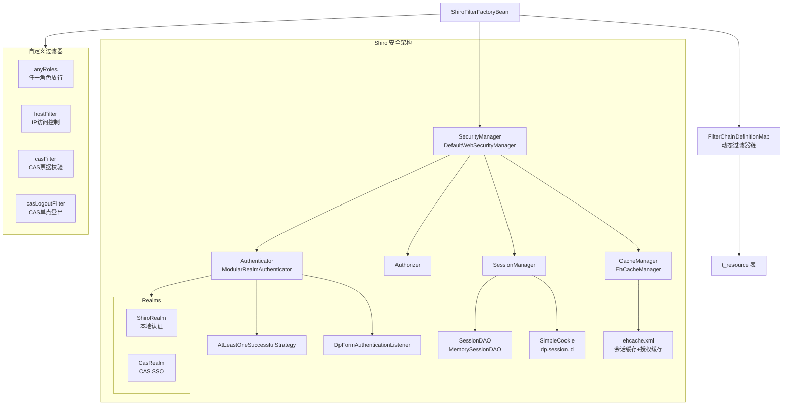
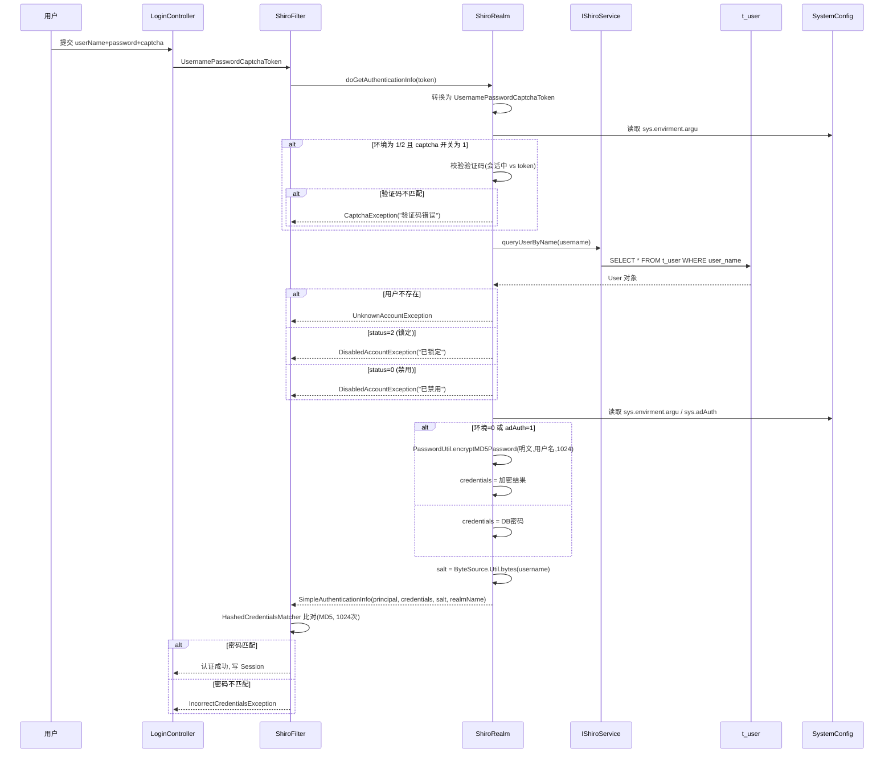
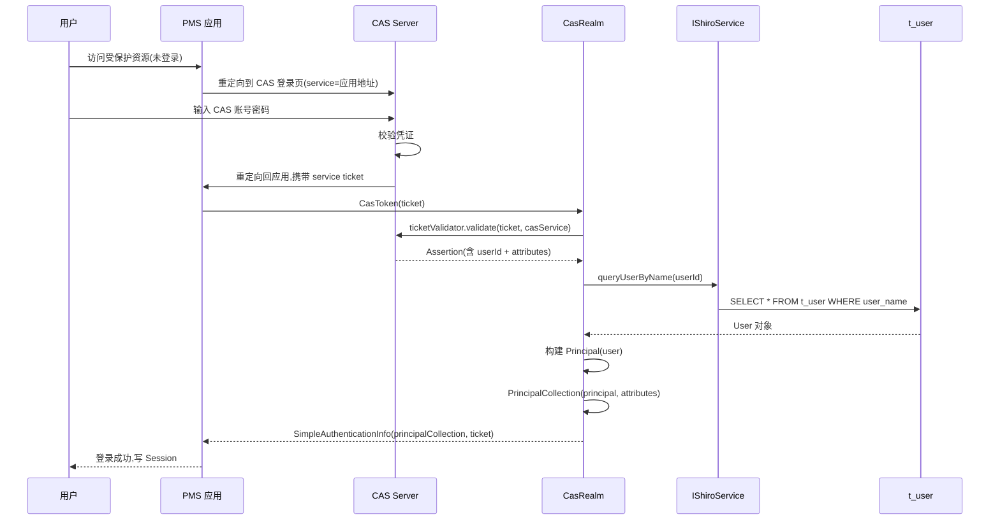
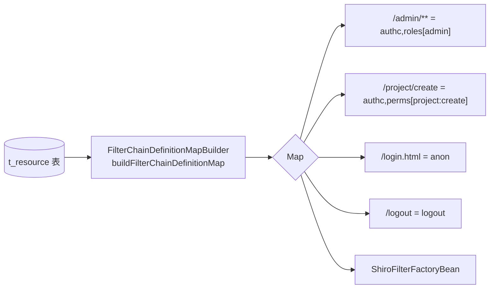
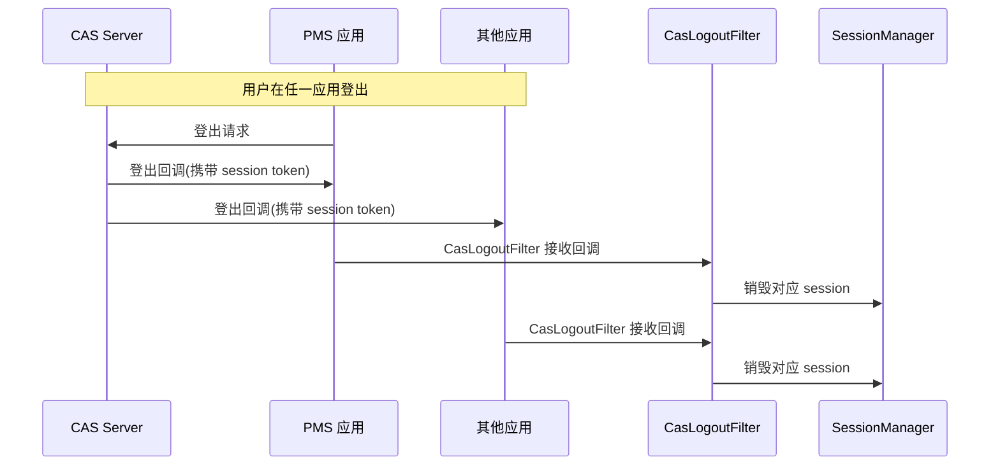
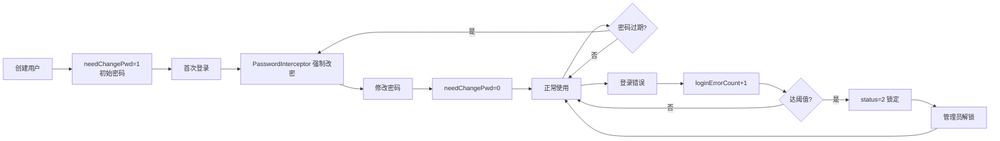

# core 模块 Shiro 安全架构

> 本文档详解 core 模块的认证授权架构，涵盖 ShiroRealm 本地认证、CasRealm 单点登录、授权机制、缓存策略、过滤器链与密码加密。
> 源码基准：`com.dp.plat.core.realms`、`com.dp.plat.core.filter`、`com.dp.plat.core.factory`、`com.dp.plat.core.listener`。

---

## 1. Shiro 架构总览

core 基于 **Apache Shiro 1.8.0** 构建安全体系，支持本地认证与 CAS 单点登录双模式。



---

## 2. 认证流程

### 2.1 本地认证流程（ShiroRealm）

`ShiroRealm.doGetAuthenticationInfo` 实现本地账号密码认证：



**认证关键逻辑**（`ShiroRealm.java`）：

```java
// 验证码校验（环境 1/2 且开关开启时）
if ("1".equals(SystemConfig.systemVariables.get("sys.envirment.argu"))
        || "2".equals(SystemConfig.systemVariables.get("sys.envirment.argu"))) {
    String checkCaptcha = SystemConfig.systemVariables.getOrDefault("sys.login.check.captcha", "1");
    if ("1".equals(checkCaptcha) && (null == captcha || !captcha.equalsIgnoreCase(exitCode))) {
        throw new CaptchaException("验证码错误！");
    }
}

// 密码加密判断（环境 0 或 AD 认证开启时走 MD5 加密）
if ("0".equals(SystemConfig.systemVariables.get("sys.envirment.argu"))
        || "1".equals(SystemConfig.systemVariables.getOrDefault("sys.adAuth", "0"))) {
    credentials = PasswordUtil.encryptMD5Password(new String(token.getPassword()), token.getUsername(), 1024);
}

// 盐值 = 用户名
ByteSource credentialsSalt = ByteSource.Util.bytes(username);
info = new SimpleAuthenticationInfo(principal, credentials, credentialsSalt, realmName);
```

### 2.2 CAS 单点登录流程（CasRealm）

`CasRealm.doGetAuthenticationInfo` 实现 CAS 票据校验：



**CAS 认证关键逻辑**（`CasRealm.java`）：

```java
// 向 CAS Server 校验服务票据
Assertion casAssertion = ticketValidator.validate(ticket, getCasService());
AttributePrincipal casPrincipal = casAssertion.getPrincipal();
String userId = casPrincipal.getName();

// 查询本地用户，构建 Principal
User user = shiroService.queryUserByName(userId);
Principal principal = new Principal(user);
List<Object> principals = CollectionUtils.asList(principal, attributes);
PrincipalCollection principalCollection = new SimplePrincipalCollection(principals, getName());
return new SimpleAuthenticationInfo(principalCollection, ticket);
```

> **CAS 与本地认证差异**：CAS 模式下密码由 CAS Server 校验，PMS 仅校验票据；本地模式下 PMS 直接校验密码。

---

## 3. 授权机制

### 3.1 授权流程

`ShiroRealm.doGetAuthorizationInfo` / `CasRealm.doGetAuthorizationInfo` 实现授权：

```mermaid
flowchart TD
    START[授权触发<br/>@RequiresPermissions/hasPermission] --> PRIN[获取 Principal]
    PRIN --> SYS{isSysUser != 0?}
    SYS -->|是 系统用户| COMP1[compId = -1<br/>跨公司全权限]
    SYS -->|否 普通用户| COMP2[compId = principal.compId<br/>按公司隔离]
    COMP1 --> ROLE[queryUserRoleByNameAndCompId<br/>查询角色集合]
    COMP2 --> ROLE
    ROLE --> PERM[queryPermissionByUsernameAndCompId<br/>查询权限字符串集合]
    PERM --> MAXR[selectRoleByRoleName<br/>查询最高优先级角色]
    MAXR --> INFO[SimpleAuthorizationInfo<br/>addRoles + addStringPermissions]
    INFO --> UPDATE[更新 Principal<br/>roles/permissions/maxRole]
    UPDATE --> CACHE[缓存到 EhCache<br/>10分钟过期]
```

**授权关键逻辑**（`ShiroRealm.java`）：

```java
// 公司隔离：系统用户用 compId=-1（全公司），普通用户用自身 compId
Integer compId = principal.getIsSysUser() != 0 ? -1 : principal.getCompId();
Set<String> roles = shiroService.queryUserRoleByNameAndCompId(principal.getUserName(), compId);
Set<String> permissions = shiroService.queryPermissionByUsernameAndCompId(principal.getUserName(), compId);

SimpleAuthorizationInfo info = new SimpleAuthorizationInfo();
info.addRoles(roles);
info.addStringPermissions(permissions);

// 更新 Principal
principal.setRoles(roles);
principal.setPermissions(permissions);
principal.setMaxRole(maxRole);
```

### 3.2 公司隔离机制

core 的授权按**公司隔离**，同一用户在不同公司可有不同角色：

| 用户类型 | isSysUser | compId | 权限范围 |
|---------|-----------|--------|---------|
| 系统用户 | 1 | -1 | 跨公司全权限（管理员） |
| 普通用户 | 0 | 自身 compId | 仅本公司数据 |

- `t_user_role.comp_id` 实现"同人不同公司不同角色"；
- `BaseEntity.orgId` 在数据层自动按公司过滤（`getOrgId()` 缺省取 `UserContext.getOrgId()`）。

### 3.3 权限字符串约定

权限字符串格式为 `模块:操作`，存储在 `t_permission.permission_name`：

| 权限串 | 含义 | 使用方式 |
|--------|------|---------|
| `user:read` | 用户查看 | `@RequiresPermissions("user:read")` |
| `user:create` | 用户创建 | `@RequiresPermissions("user:create")` |
| `project:approve` | 项目审批 | `@RequiresPermissions("project:approve")` |
| `admin:*` | 管理员全部权限 | `@RequiresPermissions("admin:*")` |

JSP 中使用 Shiro 标签库：

```jsp
<shiro:hasPermission name="user:create">
    <button>新增用户</button>
</shiro:hasPermission>
<shiro:hasRole name="admin">
    <a href="/admin">管理后台</a>
</shiro:hasRole>
```

---

## 4. Realm 实现详解

### 4.1 ShiroRealm（本地认证）

| 项 | 说明 |
|----|------|
| 类 | `com.dp.plat.core.realms.ShiroRealm` |
| 继承 | `org.apache.shiro.realm.AuthorizingRealm` |
| 注入 | `IShiroService shiroService`、`IRoleService roleService` |
| 认证方法 | `doGetAuthenticationInfo` — 账号密码 + 验证码 |
| 授权方法 | `doGetAuthorizationInfo` — 按公司查询角色/权限 |
| 密码匹配 | `HashedCredentialsMatcher`（MD5, 1024 次迭代） |
| 盐值 | 用户名（`ByteSource.Util.bytes(username)`） |

### 4.2 CasRealm（CAS 单点登录）

| 项 | 说明 |
|----|------|
| 类 | `com.dp.plat.core.realms.CasRealm` |
| 继承 | `org.apache.shiro.cas.CasRealm` |
| 注入 | `IShiroService shiroService`、`IRoleService roleService` |
| 认证方法 | `doGetAuthenticationInfo` — CAS 票据校验 |
| 授权方法 | `doGetAuthorizationInfo` — 同 ShiroRealm（按公司） |
| 菜单加载 | 授权时按 contextPath 加载用户菜单（`MenuUtil.drow`） |

> **CasRealm 额外逻辑**：授权时检查 `principal.getMenus()` 是否已包含当前 contextPath，未包含则重新查询菜单并渲染。这是为多应用部署设计的菜单上下文隔离。

### 4.3 Principal（认证主体）

`Principal` 封装登录用户的核心信息，存储在 Session 中：

| 字段 | 类型 | 说明 |
|------|------|------|
| `userId` | Integer | 用户 ID |
| `userName` | String | 登录用户名 |
| `status` | Short | 用户状态 |
| `compId` | Integer | 公司 ID |
| `compName` | String | 公司名称 |
| `isSysUser` | Short | 是否系统用户 |
| `userInfoId` | Integer | 用户信息 ID |
| `realName` | String | 真实姓名 |
| `mobile`/`telphone`/`email` | String | 联系方式 |
| `avatar` | String | 头像 URL |
| `menus` | String | 渲染后的菜单 HTML |
| `homePage` | String | 角色默认主页 |
| `roles` | Collection<String> | 角色集合 |
| `permissions` | Collection<String> | 权限字符串集合 |
| `maxRole` | Role | 最高优先级角色 |
| `needChangePwd` | Boolean | 是否需改密码 |
| `loginErrorCount` | Integer | 登录错误次数 |
| `userCustom1~5` | - | 用户自定义字段 |

---

## 5. 缓存策略

### 5.1 EhCache 缓存配置

Shiro 使用 EhCache 管理会话与授权缓存（`ehcache.xml`）：

| 缓存名 | 容量 | 过期策略 | 用途 |
|--------|------|---------|------|
| `shiro-activeSessionCache` | 10000 | eternal=true（永不过期） | 活跃会话存储 |
| `org.apache.shiro.realm.SimpleAccountRealm.authorization` | 10000 | 600s TTL | 授权信息缓存 |

### 5.2 缓存失效场景

| 场景 | 缓存影响 | 处理方式 |
|------|---------|---------|
| 修改用户角色 | 授权缓存未更新，10 分钟内仍用旧权限 | 调用 `doClearCache` 主动清除 |
| 修改用户权限 | 同上 | 同上 |
| 修改菜单 | 菜单缓存在 Principal.menus，需重新登录 | 用户重新登录或刷新 Session |
| 集群部署 | MemorySessionDAO + 内存 EhCache 不共享 | 替换为 Redis SessionDAO + RedisCache |

> **避坑**：授权缓存 10 分钟过期是常见排障点。修改权限后用户反馈"权限没变"，需确认是否缓存未清除。

---

## 6. 过滤器链

### 6.1 动态过滤器链构建

`FilterChainDefinitionMapBuilder` 从 `t_resource` 表读取 URL-权限映射，动态构建过滤器链：



- 修改 `t_resource` 表后刷新即可生效，无需重启；
- `t_resource.authc` 字段存储 Shiro 权限控制串（如 `authc,roles[admin],perms[admin:create]`）；
- `t_resource.priority` 控制匹配优先级（值越小越先匹配）。

### 6.2 Shiro 过滤器一览

| 过滤器 | 说明 | core 是否使用 |
|--------|------|-------------|
| `anon` | 匿名访问 | ✓（登录页） |
| `authc` | 必须认证 | ✓（受保护资源） |
| `logout` | 登出 | ✓ |
| `roles` | 角色校验（全部满足） | ✓ |
| `perms` | 权限校验（全部满足） | ✓ |
| `anyRoles` | 任一角色满足即放行（自定义） | ✓ |
| `hostFilter` | IP/主机访问控制（自定义） | ✓ |
| `casFilter` | CAS 票据校验（自定义） | CAS 模式 |
| `casLogoutFilter` | CAS 单点登出（自定义） | CAS 模式 |

### 6.3 自定义过滤器

#### AnyRolesAuthorizationFilter

```java
// 任一角色满足即放行（Shiro 默认 roles 过滤器要求全部满足）
public class AnyRolesAuthorizationFilter extends RolesAuthorizationFilter {
    @Override
    public boolean isAccessAllowed(ServletRequest request, ServletResponse response, Object mappedValue) {
        Subject subject = getSubject(request, response);
        String[] rolesArray = (String[]) mappedValue;
        if (rolesArray == null || rolesArray.length == 0) {
            return true;
        }
        for (String role : rolesArray) {
            if (subject.hasRole(role)) {
                return true;
            }
        }
        return false;
    }
}
```

#### HostFilter

- 基于 IP/主机名的访问控制；
- 配合 `IpUtil` 解析客户端 IP；
- 可限制特定 IP 段访问管理后台。

#### CasFilter

```java
// 接收 CAS 回调的服务票据，交给 CasRealm 校验
public class CasFilter extends AuthenticatingFilter {
    // failureUrl: 票据校验失败跳转
    // successUrl: 校验成功跳转
}
```

---

## 7. CAS 单点登录组件

### 7.1 单点登出机制



### 7.2 CAS 组件清单

| 组件 | 包 | 职责 |
|------|----|------|
| `CasRealm` | `core.realms` | CAS 票据校验 + 本地 Principal 构建 |
| `CasFilter` | `core.filter` | 接收 CAS 回调，触发认证 |
| `CasLogoutFilter` | `core.cas` | 处理 CAS 单点登出回调 |
| `MySingleSignOutFilter` | `core.filter` | CAS 单点登出过滤器 |
| `SingleSignOutHandler` | `core.cas` | 维护会话映射，处理登出通知 |
| `HashMapBackedSessionMappingStorage` | `core.cas` | 会话 ID ⇄ CAS token 内存映射 |
| `CasSubjectFactory` | `org.apache.shiro.cas` | CAS Subject 工厂 |

> **集群避坑**：`HashMapBackedSessionMappingStorage` 为内存存储，集群部署时各节点独立维护映射，CAS 登出回调只能命中一个节点。需替换为 Redis 共享存储实现全集群登出。

---

## 8. 密码安全

### 8.1 密码加密算法

core 使用 **MD5 + 用户名盐 + 1024 次迭代** 加密密码（`PasswordUtil.encryptMD5Password`）：

```java
public static String encryptMD5Password(String plainPassword, String salt, int iterations) {
    // MD5(plainPassword + salt) 迭代 1024 次
    // 盐值 = 用户名
}
```

| 项 | 值 | 说明 |
|----|-----|------|
| 算法 | MD5 | 哈希算法 |
| 盐值 | 用户名 | 每个用户盐值不同 |
| 迭代次数 | 1024 | 增加破解成本 |
| 匹配器 | `HashedCredentialsMatcher` | Shiro 自动比对 |

### 8.2 密码生命周期



### 8.3 密码相关组件

| 组件 | 职责 |
|------|------|
| `PasswordUtil` | 密码 MD5 加密（盐+1024迭代） |
| `UsernamePasswordCaptchaToken` | 扩展 Token，携带验证码 |
| `PasswordInterceptor` | 密码过期校验拦截器 |
| `PasswordController` | 修改密码、密码重置 |
| `HashedCredentialsMatcher` | Shiro 密码匹配器 |

---

## 9. 认证监听与日志

### 9.1 DpFormAuthenticationListener

`DpFormAuthenticationListener` 实现认证监听，记录登录日志：

```java
public class DpFormAuthenticationListener implements AuthenticationListener {
    @Override
    public void onSuccess(AuthenticationToken token, AuthenticationInfo info) {
        // 登录成功：写入 t_user_login_record、t_sys_log
    }

    @Override
    public void onFailure(AuthenticationToken token, AuthenticationException ae) {
        // 登录失败：累加 loginErrorCount、写入日志
    }

    @Override
    public void onLogout(PrincipalCollection principals) {
        // 登出：更新登出时间/IP
    }
}
```

### 9.2 登录记录表（t_user_login_record）

每次登录/登出写入记录，用于安全审计：

| 字段 | 说明 |
|------|------|
| `loginName` | 登录账号 |
| `loginTime` / `logoutTime` | 登录/登出时间 |
| `loginIP` / `logoutIP` | 登录/登出 IP |
| `loginSuccess` / `logoutSuccess` | 是否成功 |
| `userId` | 用户 ID |

---

## 10. 安全防护总览

| 防护点 | 实现 | 说明 |
|--------|------|------|
| 密码存储 | MD5 + 用户名盐 + 1024 迭代 | 不可逆，防彩虹表 |
| 验证码 | `UsernamePasswordCaptchaToken` | 防暴力破解，按环境开关 |
| 账号锁定 | `loginErrorCount` + `status=2` | 错误达阈值自动锁 |
| 会话管理 | Shiro Session + EhCache | 会话超时、单点登录 |
| URL 权限 | `t_resource` + 动态过滤器链 | URL 级访问控制 |
| 权限串 | `@RequiresPermissions` / Shiro 标签 | 操作级访问控制 |
| 公司隔离 | `comp_id` + `isSysUser` | 数据级访问控制 |
| CSRF | `CsrfInterceptor` + Token | 跨站请求伪造防护 |
| XSS | `JsoupUtil` + `XssFilter` | 跨站脚本防护 |
| 单点登出 | `CasLogoutFilter` | CAS 全应用登出 |

> XSS/CSRF 细化组件位于 `com.dp.plat.security` 子包，详见 PMS-security 模块知识库。

---

## 11. 相关文档

- [Spring 配置详解](spring-configuration.md) — Shiro Bean 配置
- [系统架构](system-architecture.md) — 整体架构
- [02-modules 公共组件](../02-modules/common-components.md) — 认证组件清单
- [05-standards 安全实践](../05-standards/security-practices.md) — 安全防护详解
- [05-standards 故障排查](../05-standards/troubleshooting.md) — Shiro 常见问题
- 安全细化组件：[PMS-security](../../PMS-security/docs/02-modules/security-components.md)
