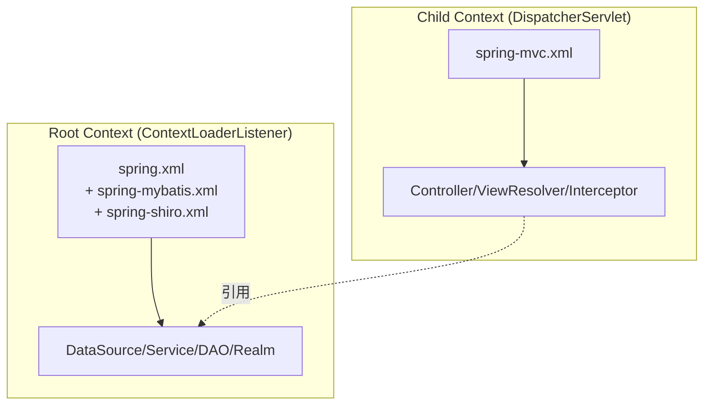

# core 模块 Spring 配置详解

> 本文档基于 `core/src/main/resources/` 下的实际配置文件编写，覆盖 Spring IoC/AOP、Spring MVC、MyBatis、Shiro、CAS、Quartz、EhCache 的配置项分析。
> core 采用 **Spring XML + 注解混合配置**模式，与 PMS-struts 的纯 XML 配置不同。

---

## 1. 配置文件加载链

core 模块的 Spring 配置以 `spring.xml` 为入口，通过 `<import>` 逐层导入形成层次结构。Web 容器启动时由 `web.xml` 中的 `ContextLoaderListener` 加载。

### 1.1 导入关系图

```
spring.xml (入口)
│
├── jdbc.properties (PropertyPlaceholderConfigurer 加载)
│
├── dataSourceLocal (Druid 主数据源)
│
├── dataSource (RoutingDataSource 动态路由)
│   └── targetDataSources: { Local → dataSourceLocal }
│
├── <import> spring-mybatis.xml
│   ├── sqlSessionFactory (MyBatis 会话工厂)
│   ├── MapperScannerConfigurer (Mapper 接口扫描)
│   └── transactionManager (DataSourceTransactionManager)
│
└── <import> spring-shiro.xml  (或 spring-shiro-cas.xml)
    ├── securityManager (DefaultWebSecurityManager)
    ├── sessionManager (DefaultWebSessionManager)
    ├── cacheManager (EhCacheManager)
    ├── jdbcRealm (ShiroRealm) / casRealm (CasRealm)
    ├── shiroFilter (ShiroFilterFactoryBean)
    └── filterChainDefinitionMap (动态过滤器链)

spring-mvc.xml (DispatcherServlet 加载，独立于 spring.xml)
│
├── component-scan (com.dp.plat)
├── mvc:annotation-driven (JSON 转换 + 日期转换)
├── ContentNegotiatingViewResolver (多视图协商)
│   ├── BeanNameViewResolver
│   ├── InternalResourceViewResolver (/WEB-INF/jsp/*.jsp)
│   └── defaultViews: MappingJackson2JsonView, ExcelView, ExcelView4XLSX
├── mvc:interceptors
│   ├── LocaleChangeInterceptor (国际化)
│   ├── CsrfInterceptor (CSRF 防护)
│   └── PasswordInterceptor (密码过期校验)
└── multipartResolver (CommonsMultipartResolver)

beans-quartz.xml (定时任务，独立加载)
│
└── startQuartz (SchedulerFactoryBean)
    └── triggers: [mailTrigger] (MailerJob, cron: 0 0/5 8-20 * * ?)
```

### 1.2 各配置文件职责

| 配置文件 | 职责 | 关键内容 |
|---------|------|---------|
| `spring.xml` | 根配置，数据源与导入 | Druid 主数据源、RoutingDataSource、import mybatis/shiro |
| `spring-mvc.xml` | Spring MVC 表现层 | 组件扫描、视图解析、拦截器、文件上传、AOP 代理 |
| `spring-mybatis.xml` | MyBatis 持久层 | SqlSessionFactory、MapperScanner、事务管理 |
| `spring-shiro.xml` | Shiro 本地认证 | ShiroRealm、SessionManager、EhCache、过滤器链 |
| `spring-shiro-cas.xml` | Shiro + CAS 单点登录 | CasRealm、CasFilter、CasLogoutFilter、CasSubjectFactory |
| `beans-quartz.xml` | Quartz 定时任务 | MailerJob 邮件发送调度 |
| `ehcache.xml` | EhCache 缓存配置 | Shiro 会话缓存、授权缓存 |
| `jdbc.properties` | 数据库连接参数 | 主库 MySQL 连接、连接池参数 |
| `config.properties` | 系统配置参数 | CAS、邮件等参数 |
| `spring-cas.properties` | CAS 单点登录参数 | CAS Server 地址、服务地址 |
| `logback.xml` | 日志配置 | Logback 日志级别与输出 |

### 1.3 双 Spring 容器架构

core 运行于**双 Spring 容器**模式（Root + Child），由 `web.xml` 配置：



- **Root Context**：由 `ContextLoaderListener` 加载 `spring.xml`，管理 Service/DAO/DataSource/Realm 等业务 Bean；
- **Child Context**：由 `DispatcherServlet` 加载 `spring-mvc.xml`，管理 Controller/ViewResolver/Interceptor；
- Controller 从父容器引用 Service，子容器不能访问父容器的 Bean 定义，但父容器的 Bean 对子容器可见。

> **避坑**：两个 `spring-mvc.xml` 和 `spring-mybatis.xml` 都配置了 `<context:component-scan base-package="com.dp.plat" />`，会导致 Controller 被 Root 容器也扫描一次。建议 Root 容器扫描时排除 `@Controller`，避免重复实例化。

---

## 2. spring.xml — 根配置

### 2.1 属性占位符

```xml
<bean id="propertyConfigurer"
    class="org.springframework.beans.factory.config.PropertyPlaceholderConfigurer">
    <property name="locations">
        <list>
            <value>classpath:jdbc.properties</value>
        </list>
    </property>
</bean>
```

- 加载 `jdbc.properties`，通过 `${jdbc.xxx}` 占位符注入数据源参数；
- 仅加载一个配置文件，CAS/邮件参数由 `spring-cas.properties`/`config.properties` 单独管理。

### 2.2 主数据源（Druid）

core 使用 **Druid 1.2.8** 连接池（与 PMS-struts 的 DBCP 不同）：

```xml
<bean id="dataSourceLocal" class="com.alibaba.druid.pool.DruidDataSource" destroy-method="close">
    <property name="driverClassName" value="${jdbc.driver}"/>
    <property name="url" value="${jdbc.url}"/>
    <property name="username" value="${jdbc.username}"/>
    <property name="password" value="${jdbc.password}"/>
    <property name="initialSize" value="${jdbc.initialSize}"/>
    <property name="maxActive" value="${jdbc.maxActive}"/>
    <property name="maxIdle" value="${jdbc.maxIdle}"/>
    <property name="minIdle" value="${jdbc.minIdle}"/>
    <property name="logAbandoned" value="${jdbc.logAbandoned}"/>
    <property name="removeAbandoned" value="${jdbc.removeAbandoned}"/>
    <property name="removeAbandonedTimeout" value="${jdbc.removeAbandonedTimeout}"/>
    <property name="maxWait" value="${jdbc.maxWait}"/>
    <property name="testOnBorrow" value="${jdbc.testOnBorrowFalse}"/>
    <property name="validationQuery" value="${jdbc.validationQuery}"/>
    <property name="testWhileIdle" value="${jdbc.testWhileIdle}"/>
    <property name="timeBetweenEvictionRunsMillis" value="${jdbc.timeBetweenEvictionRunsMillis}"/>
    <property name="minEvictableIdleTimeMillis" value="${jdbc.minEvictableIdleTimeMillis}"/>
    <property name="numTestsPerEvictionRun" value="${jdbc.numTestsPerEvictionRun}"/>
    <property name="filters" value="stat"/>
</bean>
```

**连接池参数（jdbc.properties 默认值）**：

| 参数 | 默认值 | 说明 |
|------|--------|------|
| `initialSize` | 5 | 池启动时创建的初始连接数 |
| `maxActive` | 300 | 同一时间可分配的最大连接数 |
| `maxIdle` | 50 | 池中最大空闲连接数 |
| `minIdle` | 5 | 池中最小空闲连接数 |
| `maxWait` | 10000ms | 获取连接超时等待时间 |
| `removeAbandoned` | true | 是否自动回收超时连接 |
| `removeAbandonedTimeout` | 180s | 连接超时回收时间 |
| `logAbandoned` | true | 回收时是否打印日志 |
| `testOnBorrow` | false | 获取连接时是否验证（关闭以提升性能） |
| `testWhileIdle` | true | 空闲时是否验证连接有效性 |
| `validationQuery` | SELECT 1 | 连接验证 SQL |
| `timeBetweenEvictionRunsMillis` | 300000ms | 空闲连接检测间隔（5分钟） |
| `minEvictableIdleTimeMillis` | 900000ms | 连接最小空闲时间（15分钟） |
| `filters` | stat | Druid 监控统计过滤器 |

> **Druid 监控**：`filters=stat` 启用 SQL 监控统计，可通过 `/druid/*` 路径访问监控面板（需在 web.xml 配置 `StatViewServlet`）。

### 2.3 动态数据源路由

```xml
<bean id="dataSource" class="com.dp.plat.core.config.RoutingDataSource">
    <property name="targetDataSources">
        <map key-type="java.lang.String">
            <entry key="${jdbc.key1}" value-ref="dataSourceLocal"/>
            <!-- 多数据源扩展点（当前注释）:
            <entry key="${jdbc.key2}" value-ref="dataSourceSMS"/>
            <entry key="${jdbc.key3}" value-ref="dataSourceOFS"/>
            <entry key="${jdbc.key4}" value-ref="dataSourcePMS"/>
            <entry key="${jdbc.key5}" value-ref="dataSourceTMS"/>
            <entry key="${jdbc.key6}" value-ref="dataSourceSAP"/>
            -->
        </map>
    </property>
    <property name="defaultTargetDataSource" ref="dataSourceLocal"/>
</bean>
```

- `RoutingDataSource` 继承 `AbstractRoutingDataSource`，按 ThreadLocal 中的 Key 路由到目标数据源；
- 当前仅启用 `Local`（主库 MySQL），其余数据源（SMS/OFS/PMS/TMS/SAP）已注释，需要时取消注释并配置对应 Bean；
- `defaultTargetDataSource` 为 `dataSourceLocal`，未指定数据源时默认走主库。

> **与 PMS-struts 的差异**：PMS-struts 通过 iBatis 多 `SqlMapClientTemplate` + `BaseDao` 多属性实现多数据源；core 通过 `AbstractRoutingDataSource` + AOP 注解实现，更符合 Spring 规范。详见 [multi-datasource.md](multi-datasource.md)。

---

## 3. spring-mvc.xml — Spring MVC 配置

### 3.1 组件扫描与注解驱动

```xml
<context:component-scan base-package="com.dp.plat" />

<mvc:annotation-driven enable-matrix-variables="true" conversion-service="conversionService">
    <mvc:message-converters>
        <ref bean="mappingJacksonHttpMessageConverter" />
    </mvc:message-converters>
    <mvc:path-matching suffix-pattern="true"/>
</mvc:annotation-driven>
```

- 扫描 `com.dp.plat` 下所有组件（含 core/security/support 子包）；
- `enable-matrix-variables="true"` 启用矩阵变量支持；
- `suffix-pattern="true"` 启用后缀模式匹配（如 `/user.json` 和 `/user.html` 映射同一方法）；
- JSON 转换器配置 `text/html;charset=UTF-8`，避免 IE 下载 JSON 文件。

### 3.2 类型转换器

```xml
<bean id="dateConvert" class="com.dp.plat.core.converter.DateConverter"/>
<bean id="conversionService" class="org.springframework.format.support.FormattingConversionServiceFactoryBean">
    <property name="converters">
        <set>
            <ref bean="dateConvert"/>
            <bean class="com.dp.plat.core.converter.DecimalConverter"/>
        </set>
    </property>
</bean>
```

| 转换器 | 类 | 职责 |
|--------|----|------|
| `DateConverter` | `com.dp.plat.core.converter.DateConverter` | 日期字符串 → Date，支持多种格式 |
| `DecimalConverter` | `com.dp.plat.core.converter.DecimalConverter` | 货币/小数格式转换 |

### 3.3 视图解析器（多内容协商）

core 采用 `ContentNegotiatingViewResolver` 实现按扩展名/参数返回不同格式（HTML/JSON/Excel）：

```xml
<bean class="org.springframework.web.servlet.view.ContentNegotiatingViewResolver">
    <property name="order" value="1"/>
    <property name="contentNegotiationManager" ref="contentNegotiationManager"/>
    <property name="viewResolvers">
        <list>
            <bean class="org.springframework.web.servlet.view.BeanNameViewResolver"/>
            <bean class="org.springframework.web.servlet.view.InternalResourceViewResolver">
                <property name="prefix" value="/WEB-INF/jsp/"/>
                <property name="suffix" value=".jsp"/>
            </bean>
        </list>
    </property>
    <property name="defaultViews">
        <list>
            <bean class="org.springframework.web.servlet.view.json.MappingJackson2JsonView"/>
            <bean class="com.dp.plat.core.view.ExcelView"/>
            <bean class="com.dp.plat.core.view.ExcelView4XLSX"/>
        </list>
    </property>
</bean>
```

**内容协商策略**（`contentNegotiationManager`）：

| 扩展名/参数 | MIME 类型 | 返回视图 |
|------------|----------|---------|
| `.html` 或默认 | text/html | InternalResourceViewResolver → JSP |
| `.json` 或 `?type=json` | application/json | MappingJackson2JsonView |
| `.excel` 或 `?type=excel` | application/vnd.openxmlformats-officedocument.spreadsheetml.sheet | ExcelView4XLSX |

> **Excel 导出机制**：Controller 返回 `ModelAndView("excelView", model)`，`ContentNegotiatingViewResolver` 根据 `.excel` 扩展名选择 `ExcelView`/`ExcelView4XLSX` 渲染。详见 [02-modules 公共组件](../02-modules/common-components.md)。

### 3.4 拦截器链

```xml
<mvc:interceptors>
    <!-- 国际化 -->
    <mvc:interceptor>
        <mvc:mapping path="/**"/>
        <bean class="org.springframework.web.servlet.i18n.LocaleChangeInterceptor">
            <property name="paramName" value="lang"/>
        </bean>
    </mvc:interceptor>
    <!-- CSRF 防护 -->
    <mvc:interceptor>
        <mvc:mapping path="/**"/>
        <mvc:exclude-mapping path="/sys/login.json"/>
        <bean class="com.dp.plat.security.csrf.CsrfInterceptor"/>
    </mvc:interceptor>
    <!-- 密码过期校验 -->
    <mvc:interceptor>
        <mvc:mapping path="/**"/>
        <mvc:exclude-mapping path="/password.*"/>
        <mvc:exclude-mapping path="/modifyPassword.*"/>
        <bean class="com.dp.plat.core.interceptor.PasswordInterceptor">
            <property name="redirect" value="/password.html?needChangePwd=true"/>
        </bean>
    </mvc:interceptor>
</mvc:interceptors>
```

| 拦截器 | 拦截范围 | 排除路径 | 职责 |
|--------|---------|---------|------|
| `LocaleChangeInterceptor` | `/**` | 无 | 按 `?lang=xx` 切换语言 |
| `CsrfInterceptor` | `/**` | `/sys/login.json` | 校验 CSRF Token |
| `PasswordInterceptor` | `/**` | `/password.*`、`/modifyPassword.*` | 密码过期强制改密 |

### 3.5 文件上传

```xml
<bean id="multipartResolver"
    class="org.springframework.web.multipart.commons.CommonsMultipartResolver">
    <property name="defaultEncoding" value="utf-8"/>
    <property name="maxUploadSize" value="10485760000"/>
    <property name="maxInMemorySize" value="40960"/>
</bean>
```

- 最大上传大小：约 10GB（`10485760000` 字节）；
- 内存缓冲阈值：40KB。

### 3.6 Shiro 注解支持与 Druid 监控 AOP

```xml
<bean class="org.springframework.aop.framework.autoproxy.DefaultAdvisorAutoProxyCreator"/>
<bean class="org.apache.shiro.spring.security.interceptor.AuthorizationAttributeSourceAdvisor">
    <property name="securityManager" ref="securityManager"/>
</bean>

<bean id="druid-stat-interceptor" class="com.alibaba.druid.support.spring.stat.DruidStatInterceptor"/>
<bean id="druid-stat-pointcut" class="org.springframework.aop.support.JdkRegexpMethodPointcut" scope="prototype">
    <property name="patterns">
        <list>
            <value>com.dp.plat.service.*</value>
            <value>com.dp.plat.dao.*</value>
        </list>
    </property>
</bean>
<aop:config proxy-target-class="true">
    <aop:advisor advice-ref="druid-stat-interceptor" pointcut-ref="druid-stat-pointcut"/>
</aop:config>
<aop:aspectj-autoproxy/>
```

- `DefaultAdvisorAutoProxyCreator` + `AuthorizationAttributeSourceAdvisor`：启用 `@RequiresRoles`/`@RequiresPermissions` 注解；
- `DruidStatInterceptor`：对 `com.dp.plat.service.*` 和 `com.dp.plat.dao.*` 进行 Druid SQL 监控；
- `proxy-target-class="true"`：使用 CGLIB 代理（基于类继承）。

---

## 4. spring-mybatis.xml — MyBatis 配置

### 4.1 SqlSessionFactory

```xml
<bean id="sqlSessionFactory" class="org.mybatis.spring.SqlSessionFactoryBean">
    <property name="dataSource" ref="dataSource"/>
    <property name="mapperLocations">
        <array>
            <value>classpath*:com/dp/plat/**/mapping/*.xml</value>
            <value>classpath*:com/dp/plat/**/mapping/**/*.xml</value>
        </array>
    </property>
    <property name="configuration">
        <bean class="org.apache.ibatis.session.Configuration">
            <property name="callSettersOnNulls" value="true"/>
        </bean>
    </property>
</bean>
```

| 配置项 | 值 | 说明 |
|-------|-----|------|
| `dataSource` | `dataSource` | 绑定 RoutingDataSource，支持动态切换 |
| `mapperLocations` | `classpath*:com/dp/plat/**/mapping/*.xml` | 自动扫描所有模块的 MyBatis XML |
| `callSettersOnNulls` | `true` | 查询结果含 null 时仍调用 setter（避免 Map 缺失字段） |

> **Mapper XML 位置约定**：XML 与 Java 接口同目录（`com/dp/plat/**/mapping/*.xml`），这是 PMS 体系的通用约定。

### 4.2 Mapper 接口扫描

```xml
<bean class="org.mybatis.spring.mapper.MapperScannerConfigurer">
    <property name="basePackage" value="com.dp.plat"/>
    <property name="sqlSessionFactoryBeanName" value="sqlSessionFactory"/>
</bean>
```

- 扫描 `com.dp.plat` 下所有 Mapper 接口（含 core/security/support 子包）；
- 接口自动注册为 Spring Bean，Bean ID 为接口首字母小写的类名；
- 绑定 `sqlSessionFactory`，与主数据源共享连接。

> **与 PMS-struts 的差异**：PMS-struts 的 MyBatis 扫描范围为 `com.dp.plat.pms.**.dao`（仅 PMS 模块）；core 扫描范围为 `com.dp.plat`（全包），覆盖更广。

### 4.3 事务管理

```xml
<bean id="transactionManager"
    class="org.springframework.jdbc.datasource.DataSourceTransactionManager">
    <property name="dataSource" ref="dataSource"/>
</bean>
<tx:annotation-driven transaction-manager="transactionManager" proxy-target-class="true"/>
```

- 事务管理器绑定 `RoutingDataSource`，事务内数据源切换需在事务开始前完成；
- `@Transactional` 注解驱动事务，`proxy-target-class="true"` 使用 CGLIB 代理；
- 事务传播行为默认 `REQUIRED`，隔离级别默认数据库默认值。

> **避坑**：多数据源 + 声明式事务存在已知限制——同一事务内不能切换数据源（连接已绑定）。跨库操作需拆分为独立事务或使用分布式事务方案。

---

## 5. spring-shiro.xml — Shiro 本地认证配置

### 5.1 SecurityManager

```xml
<bean id="securityManager" class="org.apache.shiro.web.mgt.DefaultWebSecurityManager">
    <property name="cacheManager" ref="cacheManager"/>
    <property name="sessionManager" ref="sessionManager"/>
    <property name="authenticator" ref="authenticator"/>
    <property name="realms">
        <list>
            <ref bean="jdbcRealm"/>
        </list>
    </property>
</bean>
```

- 仅注册 `jdbcRealm`（ShiroRealm），用于本地账号密码认证；
- CAS 模式下替换为 `spring-shiro-cas.xml`，额外注册 `casRealm`。

### 5.2 SessionManager

```xml
<bean id="sessionDAO" class="org.apache.shiro.session.mgt.eis.MemorySessionDAO"/>
<bean id="sessionIdCookie" class="org.apache.shiro.web.servlet.SimpleCookie">
    <constructor-arg name="name" value="dp.session.id"/>
</bean>
<bean id="sessionManager" class="org.apache.shiro.web.session.mgt.DefaultWebSessionManager">
    <property name="sessionDAO" ref="sessionDAO"/>
    <property name="sessionIdCookieEnabled" value="true"/>
    <property name="sessionIdCookie" ref="sessionIdCookie"/>
</bean>
```

| 配置项 | 值 | 说明 |
|-------|-----|------|
| `sessionDAO` | `MemorySessionDAO` | 内存存储会话（集群需替换为 Redis） |
| Cookie 名 | `dp.session.id` | 会话 Cookie 名称 |
| `sessionIdCookieEnabled` | `true` | 启用 Cookie 传递会话 ID |

> **CAS 模式差异**：`spring-shiro-cas.xml` 中 `sessionManager` 额外配置 `globalSessionTimeout=7200000`（2小时）。

### 5.3 CacheManager（EhCache）

```xml
<bean id="cacheManager" class="org.apache.shiro.cache.ehcache.EhCacheManager">
    <property name="cacheManagerConfigFile" value="classpath:ehcache.xml"/>
</bean>
```

EhCache 配置（`ehcache.xml`）定义两个缓存：

| 缓存名 | maxEntriesLocalHeap | eternal | timeToLiveSeconds | 用途 |
|--------|---------------------|---------|-------------------|------|
| `shiro-activeSessionCache` | 10000 | true | - | 活跃会话缓存（Shiro 管理过期） |
| `org.apache.shiro.realm.SimpleAccountRealm.authorization` | 10000 | false | 600s | 授权信息缓存（10分钟过期） |

> **避坑**：授权缓存 10 分钟过期，修改用户角色/权限后需等待缓存过期或手动调用 `doClearCache` 才能生效。

### 5.4 Authenticator 与认证策略

```xml
<bean id="authenticator" class="org.apache.shiro.authc.pam.ModularRealmAuthenticator">
    <property name="authenticationStrategy">
        <bean class="org.apache.shiro.authc.pam.AtLeastOneSuccessfulStrategy"/>
    </property>
    <property name="authenticationListeners">
        <list>
            <bean class="com.dp.plat.core.listener.DpFormAuthenticationListener"/>
        </list>
    </property>
</bean>
```

- 认证策略：`AtLeastOneSuccessfulStrategy`（至少一个 Realm 成功即通过，适用于多 Realm 场景）；
- 认证监听器：`DpFormAuthenticationListener` 记录登录日志。

### 5.5 ShiroRealm 配置

```xml
<bean id="jdbcRealm" class="com.dp.plat.core.realms.ShiroRealm">
    <property name="credentialsMatcher">
        <bean class="org.apache.shiro.authc.credential.HashedCredentialsMatcher">
            <property name="hashAlgorithmName" value="MD5"/>
            <property name="hashIterations" value="1024"/>
        </bean>
    </property>
</bean>
```

- 密码匹配器：MD5 算法，1024 次迭代；
- 盐值由 `ShiroRealm.doGetAuthenticationInfo` 中 `ByteSource.Util.bytes(username)` 提供（用户名作盐）。

### 5.6 ShiroFilter 与过滤器链

```xml
<bean id="shiroFilter" class="org.apache.shiro.spring.web.ShiroFilterFactoryBean">
    <property name="securityManager" ref="securityManager"/>
    <property name="loginUrl" value="/sys/login.html"/>
    <property name="unauthorizedUrl" value="/unauthorized.html"/>
    <property name="filterChainDefinitionMap" ref="filterChainDefinitionMap"/>
    <property name="filters">
        <map>
            <entry key="anyRoles" value-ref="anyRoles"/>
            <entry key="hostFilter" value-ref="hostFilter"/>
        </map>
    </property>
</bean>

<bean id="filterChainDefinitionMap"
    factory-bean="filterChainDefinitionMapBuilder" factory-method="buildFilterChainDefinitionMap"/>
<bean id="filterChainDefinitionMapBuilder" class="com.dp.plat.core.factory.FilterChainDefinitionMapBuilder"/>
```

- 过滤器链由 `FilterChainDefinitionMapBuilder` 动态构建（从 `t_resource` 表读取 URL-权限映射）；
- 自定义过滤器：`anyRoles`（任一角色放行）、`hostFilter`（IP 访问控制）；
- `loginUrl` 为 `/sys/login.html`，未认证请求重定向到此。

### 5.7 InvalidRequestFilter（Shiro 1.6+）

```xml
<bean id="invalidRequest" class="org.apache.shiro.web.filter.InvalidRequestFilter">
    <property name="enabled" value="false"/>
    <property name="blockBackslash" value="false"/>
    <property name="blockSemicolon" value="false"/>
    <property name="blockNonAscii" value="false"/>
</bean>
```

- 全部禁用：允许 URL 中包含 `\`、`;`、非 ASCII 字符（中文路径）；
- 原因：PMS 系统 URL 含中文菜单名与 JSESSIONID，需放宽限制。

---

## 6. spring-shiro-cas.xml — CAS 单点登录配置

CAS 模式与本地模式的差异：

| 配置项 | 本地模式 (spring-shiro.xml) | CAS 模式 (spring-shiro-cas.xml) |
|--------|---------------------------|-------------------------------|
| Realms | `jdbcRealm` (ShiroRealm) | `casRealm` (CasRealm) + `jdbcRealm` |
| SubjectFactory | 默认 | `CasSubjectFactory` |
| loginUrl | `/sys/login.html` | `${shiro.loginUrl}`（CAS Server） |
| 额外过滤器 | `anyRoles`, `hostFilter` | `casFilter`, `casLogoutFilter`, `logoutFilter` |
| globalSessionTimeout | 默认（30分钟） | 7200000（2小时） |

### 6.1 CasRealm

```xml
<bean id="casRealm" class="com.dp.plat.core.realms.CasRealm">
    <property name="casServerUrlPrefix" value="${shiro.cas.serverUrlPrefix}"/>
    <property name="casService" value="${shiro.cas.service}"/>
</bean>
```

- `casServerUrlPrefix`：CAS Server 地址前缀（如 `https://cas.dptech.com/cas`）；
- `casService`：应用服务地址，用于接收 CAS 票据回调。

### 6.2 CAS 过滤器

```xml
<bean id="casFilter" class="com.dp.plat.core.filter.CasFilter">
    <property name="failureUrl" value="${shiro.failureUrl}"/>
    <property name="successUrl" value="${shiro.successUrl}"/>
</bean>

<bean id="casLogoutFilter" class="com.dp.plat.core.cas.CasLogoutFilter">
    <property name="sessionManager" ref="sessionManager"/>
</bean>

<bean id="logoutFilter" class="org.apache.shiro.web.filter.authc.LogoutFilter">
    <property name="redirectUrl" value="${shiro.logoutUrl}"/>
</bean>
```

| 过滤器 | 职责 |
|--------|------|
| `casFilter` | 接收 CAS 回调的服务票据，校验后登录 |
| `casLogoutFilter` | 处理 CAS 单点登出回调，销毁本地会话 |
| `logoutFilter` | 本地登出，重定向到 CAS 登出页 |

### 6.3 CAS 配置参数（spring-cas.properties）

| 参数 | 说明 |
|------|------|
| `shiro.cas.serverUrlPrefix` | CAS Server 地址前缀 |
| `shiro.cas.service` | 应用服务地址（接收票据） |
| `shiro.loginUrl` | 登录地址（重定向到 CAS） |
| `shiro.logoutUrl` | 登出地址（重定向到 CAS 登出） |
| `shiro.successUrl` | 登录成功后跳转地址 |
| `shiro.failureUrl` | 登录失败跳转地址 |

> **CAS 单点登出避坑**：`CasLogoutFilter` 依赖内存会话映射（`HashMapBackedSessionMappingStorage`），集群部署时需替换为 Redis 共享存储，否则登出只能在单节点生效。

---

## 7. beans-quartz.xml — Quartz 定时任务

```xml
<bean id="mailJob" class="com.dp.plat.core.schedule.MailerJob"/>

<bean id="mailTask"
    class="org.springframework.scheduling.quartz.MethodInvokingJobDetailFactoryBean">
    <property name="targetObject" ref="mailJob"/>
    <property name="targetMethod" value="execute"/>
    <property name="concurrent" value="false"/>
</bean>

<bean id="mailTrigger" class="org.springframework.scheduling.quartz.CronTriggerFactoryBean">
    <property name="jobDetail" ref="mailTask"/>
    <property name="cronExpression" value="0 0/5 8-20 * * ?"/>
</bean>

<bean id="startQuartz" lazy-init="false" autowire="no"
    class="org.springframework.scheduling.quartz.SchedulerFactoryBean">
    <property name="triggers">
        <list>
            <!-- 当前触发器列表为空（mailTrigger 已注释） -->
        </list>
    </property>
</bean>
```

| 配置项 | 值 | 说明 |
|-------|-----|------|
| `mailJob` | `MailerJob` | 邮件发送任务类 |
| `targetMethod` | `execute` | 调用方法 |
| `concurrent` | `false` | 禁止并发执行（上次未完成不启动下次） |
| `cronExpression` | `0 0/5 8-20 * * ?` | 每天 8:00-20:00 每 5 分钟执行一次 |
| `lazy-init` | `false` | 容器启动即开始调度 |

> **当前状态**：`startQuartz` 的 triggers 列表为空（`mailTrigger` 已注释），邮件定时任务未启用。需要时取消注释即可激活。详见 [quartz-configuration.md](quartz-configuration.md)。

---

## 8. 配置切换与环境隔离

### 8.1 Profile 配置文件

core 通过 Maven Profile 管理不同环境的配置：

| 环境 | jdbc 配置 | 说明 |
|------|----------|------|
| dev（默认） | `jdbc.properties` / `jdbc_dev.properties` | 开发环境 |
| release | `jdbc_release.properties` | 生产环境 |

### 8.2 CAS 与本地认证切换

通过替换 `spring.xml` 中的 import 实现认证模式切换：

```xml
<!-- 本地认证模式 -->
<import resource="spring-shiro.xml"/>

<!-- CAS 单点登录模式 -->
<import resource="spring-shiro-cas.xml"/>
```

> 实际部署中通过 Maven Profile 或手动修改 import 实现切换，两者互斥。

---

## 9. 相关文档

- [系统架构](system-architecture.md) — 整体架构与分层
- [Shiro 安全架构](shiro-architecture.md) — 认证授权流程详解
- [MyBatis 配置](mybatis-configuration.md) — Mapper 扫描与数据源路由
- [多数据源架构](multi-datasource.md) — RoutingDataSource 详解
- [Quartz 定时任务](quartz-configuration.md) — 调度配置
- [02-modules 公共组件](../02-modules/common-components.md)
- 对比参考：[PMS-struts Spring 配置](../../PMS-struts/docs/01-architecture/spring-configuration.md)
