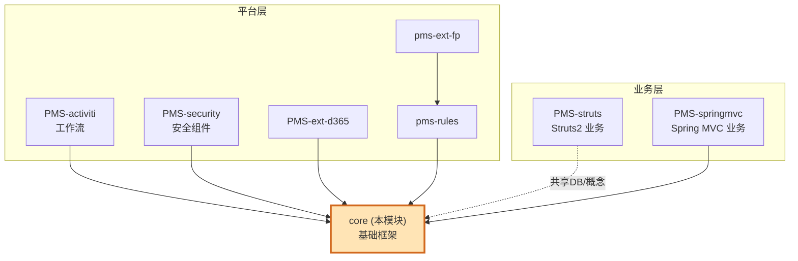
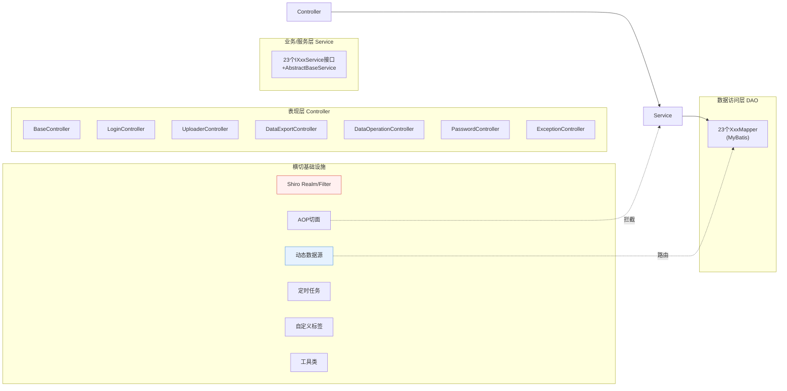
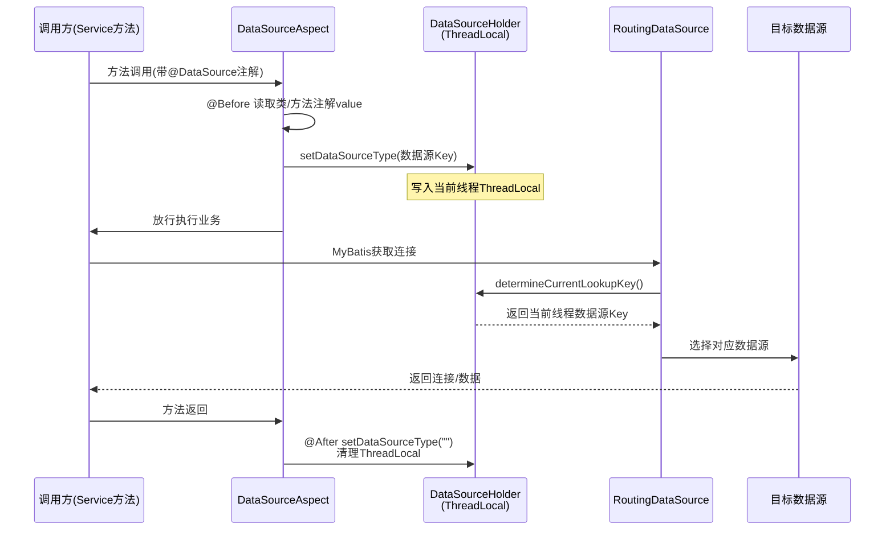
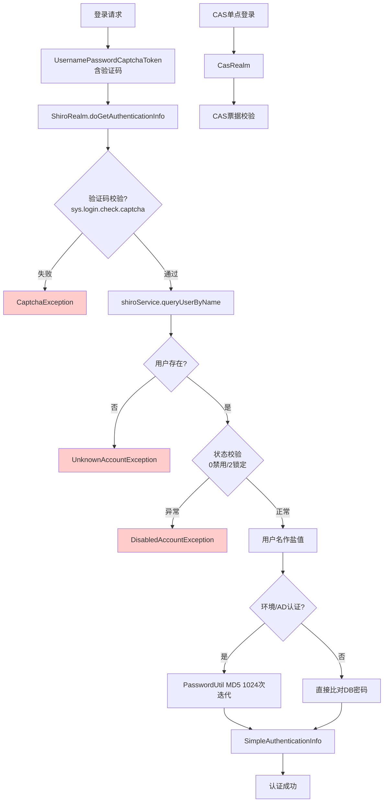
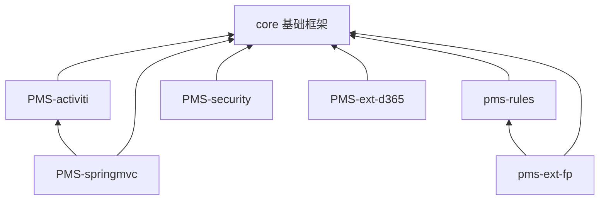

# core 模块系统架构

> 模块定位：DPtech PMS 体系的**底层基础框架模块**（artifactId: `pms-mvc-core` / 目录 `core`）。为上层所有业务模块（PMS-struts、PMS-springmvc、PMS-activiti、PMS-security、PMS-ext-d365、pms-rules、pms-ext-fp）提供通用基础设施，本身不含业务逻辑。

---

## 1. 模块概述

`core` 是整个 PMS 多模块体系的"地基"。它基于 **Spring（IoC/AOP）+ Spring MVC + MyBatis + Shiro** 技术栈，封装了认证授权、多数据源路由、统一异常处理、日志切面、定时调度、Excel 导出、文件上传、系统参数等横切关注点（cross-cutting concerns）。

| 维度 | 说明 |
|------|------|
| 技术栈 | Spring 5.x、Spring MVC、MyBatis 3.5.x、Shiro 1.8.0、CAS 3.2.2（SSO） |
| 基础包 | `com.dp.plat.core`（框架核心）、`com.dp.plat.security`（安全工具）、`com.dp.plat.support`（邮件等支撑） |
| 角色 | 被依赖方（无对外业务接口），为上层模块提供 Bean、工具类、切面、Realm |
| JDK | 1.8 |
| 依赖关系 | 不依赖任何 PMS 业务模块；被 PMS-springmvc、PMS-activiti 等上层模块依赖 |

### 在整体架构中的位置



> 说明：PMS-struts 是 Struts2 技术栈、相对独立的历史主干，与 core 的 Spring MVC 栈并存；二者通过共用基础概念关联，而非 Maven 直接依赖。core 的 Spring MVC 体系主要服务于 PMS-springmvc 等新模块。
>
> **数据库说明**：core 主数据源由 `jdbc.properties` 中的 `jdbc.url` 配置（dev 环境指向 MySQL `dppms_d365`，release 环境指向 `dppms_d365`），通过 `RoutingDataSource` 路由。PMS-struts 历史主干使用 `dppms_d365` 数据库（见 `pms.url` 配置项）。各环境数据库名以 `jdbc*.properties` 实际配置为准。

---

## 2. 技术栈与分层架构

core 采用经典的四层架构，自身聚焦于基础设施层与公共能力层：



### 关键技术点

| 技术点 | 实现类 | 说明 |
|--------|--------|------|
| 认证授权 | `ShiroRealm` / `CasRealm` | Shiro 自定义 Realm，支持本地认证与 CAS 单点登录双模式 |
| 验证码 | `UsernamePasswordCaptchaToken` | 扩展 Shiro Token，登录时校验图形验证码 |
| 多数据源 | `RoutingDataSource` + `DataSourceHolder` + `DataSourceAspect` | 基于 `AbstractRoutingDataSource` + ThreadLocal + AOP 注解的动态路由 |
| 异常处理 | `ExceptionController` + `ExceptionAspect` | 统一异常拦截，转 JSON/页面 |
| 日志 | `SystemLogAspect` + `@SystemControllerLog`/`@SystemServiceLog` | AOP 自动记录操作日志 |
| Excel 导出 | `ExcelView` / `ExcelView4XLSX` | 基于 POI 的报表导出视图 |
| 定时任务 | `SynchronizeJob` / `MailerJob` | 外部系统数据同步、邮件发送 |
| 并发 | `RequestThreadPoolExecutor` | 带请求上下文传递的线程池 |

---

## 3. 多数据源动态路由（核心机制）

core 最关键的架构能力是**多数据源动态切换**，支持 PMS 体系连接 MySQL、SQL Server（SAP/D365/MES）等多种数据源。

### 工作原理



### 三要素职责

| 组件 | 职责 |
|------|------|
| `@DataSource` 注解 | 标注在 Service 类或方法上，`value()` 指定数据源 Key（如 `"mysql"`、`"sap"`） |
| `DataSourceHolder` | 用 `ThreadLocal<String>` 持有当前线程的数据源 Key，提供 set/get/clear |
| `RoutingDataSource` | 继承 `AbstractRoutingDataSource`，`determineCurrentLookupKey()` 返回 ThreadLocal 值 |
| `DataSourceAspect` | `@Aspect`，在 `@Before` 读取注解写入 ThreadLocal，`@After` 清空，防止线程池串号 |

### 避坑要点

- **方法级注解优先于类级注解**：`DataSourceAspect` 先读类注解，若方法注解值不同则覆盖（见 `doBefore` 逻辑）。
- **必须清理 ThreadLocal**：`@After` 置空，否则在 Tomcat 线程池复用场景下会**串数据源**，导致读错库。这是动态数据源最常见的线上事故。
- **注解必须打在 Service 层**：切点为 `@within` / `@annotation(DataSource)`，事务边界与数据源切换需配合，避免同一事务内跨库。

---

## 4. 认证授权架构（Shiro + CAS）

core 提供双模式认证：本地账号密码登录 与 CAS 单点登录。



### 授权流程

认证通过后，`doGetAuthorizationInfo` 按 **公司隔离** 查询权限：
- 系统用户（`isSysUser != 0`）使用 `compId = -1`（跨公司全权限）；
- 普通用户按所属公司 `compId` 查询角色与权限字符串。
- 权限结果写入 `Principal`，并缓存到当前会话。

### 安全组件一览

| 组件 | 包 | 职责 |
|------|----|------|
| `ShiroRealm` | `core.realms` | 本地账号密码认证、权限加载 |
| `CasRealm` | `core.realms` | CAS 票据认证 |
| `CasFilter` / `MySingleSignOutFilter` | `core.filter` | CAS 单点登录过滤器、单点登出 |
| `AnyRolesAuthorizationFilter` | `core.filter` | 多角色任一满足即放行 |
| `HostFilter` | `core.filter` | 主机/IP 访问控制 |
| `DpFormAuthenticationListener` | `core.listener` | 表单认证监听（登录日志） |
| `FilterChainDefinitionMapBuilder` | `core.factory` | 动态构建 Shiro 过滤器链 |

> 安全防护（XSS/CSRF）的细化组件位于 `com.dp.plat.security` 子包，详见 PMS-security 模块知识库。

---

## 5. 包结构总览

```
com.dp.plat.core
├── annotation/      # @DataSource、@SystemControllerLog、@SystemServiceLog 自定义注解
├── aop/             # DataSourceAspect、SystemLogAspect、ExceptionAspect、SystemCoreFunctionAspect
├── cas/             # CAS 单点登出：CasLogoutFilter、SingleSignOutHandler
├── concurrent/      # RequestThreadPoolExecutor（上下文传递线程池）、ContextCopyingDecorator
├── config/          # RoutingDataSource、DataSourceHolder、SystemConfig（系统参数加载）
├── context/         # HttpContext、SpringContext（BeanFactory）、UserContext（当前用户上下文）
├── controller/      # BaseController 等 7 个通用 Controller
├── converter/       # DateConverter、DecimalConverter（Spring 类型转换）
├── dao/             # 23 个 MyBatis Mapper（用户/角色/菜单/部门/字典/文件/邮件/日志/同步等）
├── entity/          # BaseEntity（公共字段）、DataOperation
├── exception/       # CaptchaException、UploadException、ExcelImportException 等
├── factory/         # FilterChainDefinitionMapBuilder
├── filter/          # CasFilter、HostFilter、AnyRolesAuthorizationFilter 等
├── interceptor/     # PasswordInterceptor（密码校验拦截）
├── listener/        # DpFormAuthenticationListener、JdbcUnregisterListener
├── mapping/         # MyBatis 映射资源
├── param/           # Consts、RoleConstant 常量
├── pojo/            # 24 个实体（User/Role/Menu/Department/Company/Dictionary...）
├── realms/          # ShiroRealm、CasRealm、Principal（认证主体）
├── schedule/        # MailerJob、SynchronizeJob、SyncType（定时同步）
├── serializer/      # DateSerializer、JsonSerializer（JSON 序列化）
├── service/         # 23 个 IXxxService 接口 + AbstractBaseService
├── tags/            # 11 个自定义 JSP 标签（菜单/CSRF/文件上传等）
├── util/            # 19 个工具类（DateUtil、DESSecurityUtils、UploadUtils、SQLParser...）
├── view/            # ExcelView/ExcelView4XLSX（POI 导出）、视图解析器
└── vo/              # Result/ResultCode/PageParam/TreeNode 等值对象

com.dp.plat.security   # 注解/AOP/CSRF/XSS 安全工具（与 PMS-security 模块互补）
com.dp.plat.support    # 邮件等支撑组件
```

---

## 6. 配置与启动

| 配置项 | 说明 |
|--------|------|
| `SystemConfig` | `@Configuration @Order(1)`，启动时通过 `ISystemVariableService` 加载系统参数到静态 `HashMap systemVariables`，供全局读取（如 `sys.envirment.argu` 环境标识、`sys.login.check.captcha` 验证码开关、`sys.adAuth` AD 认证开关） |
| 数据源路由 | 通过 `@DataSource("key")` 注解驱动，Key 对应 Spring 配置中注册的数据源 Bean |
| Shiro 过滤器链 | `FilterChainDefinitionMapBuilder` 动态构建，支持从 DB 读取 URL-权限映射 |

### 环境参数约定（`systemVariables` 常用 Key）

| Key | 含义 |
|-----|------|
| `sys.envirment.argu` | 环境标识：`0`=开发、`1`/`2`=需校验验证码 |
| `sys.login.check.captcha` | 登录验证码开关：`1`=开启 |
| `sys.adAuth` | AD 域认证开关：`1`=开启（密码走 MD5 1024 次迭代比对） |

---

## 7. 与其他模块的知识共享（依赖关系）

core 是依赖图的根，以下模块直接或间接依赖 core：



- 上层模块复用 core 的：`BaseController`/`AbstractBaseService`/`AbstractBaseMapper` 基类、`Result`/`ResultCode` 统一返回、`PageParam` 分页、`ShiroRealm` 认证、`@DataSource` 多数据源、`ExcelView` 导出、工具类。
- 数据库层面，core 管理的是**系统支撑域**表（`t_user`、`t_role`、`t_menu`、`t_permission`、`t_resource`、`t_department`、`t_company`、`t_sys_log`、`t_file`、`t_mails`、同步日志表等），详见 [03-database 数据字典](../03-database/complete-data-dictionary.md)。

---

## 8. 相关文档

- [02-modules 公共组件功能说明](../02-modules/common-components.md)
- [03-database 数据字典（系统支撑域）](../03-database/complete-data-dictionary.md)
- [04-mapping 功能-数据映射](../04-mapping/crud-matrix.md)
- [05-standards 编码规范](../05-standards/coding-standards.md)
- [06-reference 代码示例与术语](../06-reference/code-examples.md)
- 上游知识共享：[PMS-security 安全组件](../../PMS-security/docs/02-modules/security-components.md)
