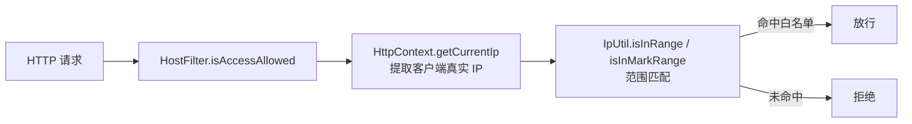
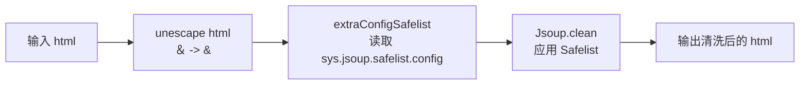
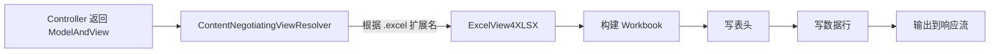
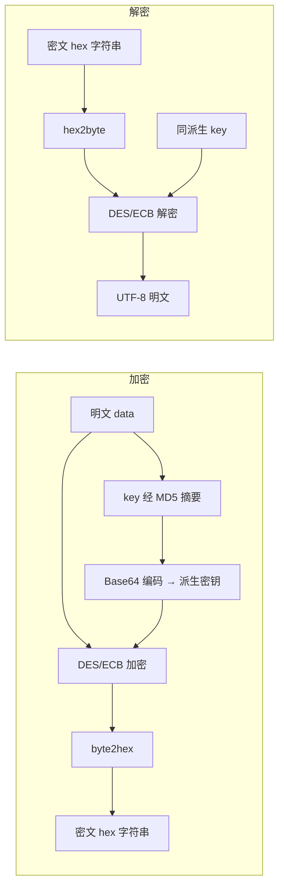
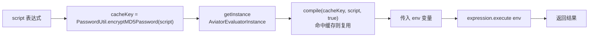

# core 模块 — 公共工具类

> 本文档详解 core 模块的公共工具类，涵盖 DateUtil、IpUtil、JsoupUtil、SQLParser、ExcelView 等。
> 源码基准：`com.dp.plat.core.util`、`com.dp.plat.core.view`。

---

## 1. 工具类总览

core 提供 19 个工具类，覆盖日期、文件、安全、SQL、导出等场景。

| 工具类 | 包 | 职责 |
|--------|----|------|
| `DateUtil` | `core.util` | 日期格式化/计算 |
| `IpUtil` | `core.util` | IP/CIDR 范围计算（不提取客户端 IP） |
| `JsoupUtil` | `core.util` | HTML 清洗（XSS 过滤） |
| `SQLParser` | `core.util` | SQL 解析（表名提取/白名单匹配/变量填充，基于 Druid） |
| `FileUtil` | `core.util` | 文件读写 |
| `UploadUtils` | `core.util` | 文件上传 |
| `DownloadUtils` | `core.util` | 文件下载 |
| `ExportUtils` | `core.util` | Excel 导出组装 |
| `PasswordUtil` | `core.util` | 密码加密（Shiro SimpleHash + SHA1+MD5 两段式） |
| `DESSecurityUtils` | `core.util` | DES 对称加解密（双参数，需 key） |
| `UUIDGenerator` | `core.util` | UUID 生成 |
| `MenuUtil` | `core.util` | 菜单树构建 |
| `AviatorUtils` | `core.util` | Aviator 表达式引擎（方法名 `exceute`） |
| `MessageUtils` | `core.util` | 国际化消息 |
| `PropertyUtil` | `core.util` | 配置文件读取 |
| `SystemLogUtil` | `core.util` | 日志工具 |
| `LinkedHashMapSort` | `core.util` | Map 排序 |
| `JdbcConnectionUtil` | `core.util` | 原生 JDBC 连接 |
| `JDBCPropertiesUtil` | `core.util` | JDBC 配置读取 |

---

## 2. DateUtil 日期工具

### 2.1 核心方法

| 方法 | 说明 |
|------|------|
| `format(Date, pattern)` | 格式化日期为字符串 |
| `parse(String, pattern)` | 解析字符串为日期 |
| `addDays(Date, int)` | 日期加减天数 |
| `addMonths(Date, int)` | 日期加减月数 |
| `diffDays(Date, Date)` | 计算天数差 |
| `getCurrentTime()` | 获取当前时间字符串 |
| `getFirstDayOfMonth(Date)` | 获取月首 |
| `getLastDayOfMonth(Date)` | 获取月末 |

### 2.2 使用示例

```java
// 格式化日期
String dateStr = DateUtil.format(new Date(), "yyyy-MM-dd HH:mm:ss");

// 解析日期
Date date = DateUtil.parse("2026-06-25", "yyyy-MM-dd");

// 日期计算
Date tomorrow = DateUtil.addDays(new Date(), 1);
```

---

## 3. IpUtil IP 工具

> ⚠️ **避坑提示**：`IpUtil` 是纯 IP/CIDR 范围计算工具，**不接收 `HttpServletRequest`，不负责客户端 IP 提取**。客户端真实 IP 提取由 [`HttpContext.getCurrentIp(HttpServletRequest)`](../01-architecture/system-architecture.md) 负责。`HostFilter` 用 `HttpContext.getCurrentIp` 取 IP 后，再用 `IpUtil.isInRange/isInMarkRange` 做范围匹配。

### 3.1 核心方法

| 方法 | 说明 |
|------|------|
| `isInMarkRange(String ip, String cidr)` | 判断 IP 是否属于 CIDR 网段（如 `10.2.0.0` 是否在 `10.3.0.0/17` 内） |
| `isInRange(String ip, String ipRange)` | 判断 IP 是否在 IP 范围内（如 `192.168.9.3` 是否在 `192.168.9.1-192.168.9.10` 内） |
| `isIP(String str)` | 校验字符串是否为合法 IPv4 格式 |
| `parseIpMaskRange(String ip, String mask)` | 根据 IP 和掩码位返回该网段所有 IP（IP 过多会内存溢出） |
| `parseIpRange(String ipfrom, String ipto)` | 返回两个 IP 之间的所有 IP 列表 |
| `getBeginIpStr(String ip, String maskBit)` | 根据 `ip/掩码位` 计算起始 IP（含网络地址） |
| `getEndIpStr(String ip, String maskBit)` | 根据 `ip/掩码位` 计算终止 IP（含广播地址） |
| `getIpCount(String mask)` | 根据掩码位返回 IP 总数 |
| `ipToDouble(String ip)` | 把 IP 转换为数字（对应 MySQL `inet_aton()`） |
| `getIpFromString(String ip)` | 把 `xx.xx.xx.xx` 转换为 long |
| `getIpFromLong(Long ip)` | 把 long 转换为 `xx.xx.xx.xx` |
| `getMaskByMaskBit(String maskBit)` | 根据掩码位（1-32）返回子网掩码字符串 |
| `getNetMask(String netmarks)` | 根据子网掩码（如 `255.255.255.252`）反推掩码位 |

### 3.2 使用示例

```java
// 判断 IP 是否属于 CIDR 网段
boolean inCidr = IpUtil.isInMarkRange("10.2.0.0", "10.3.0.0/17");

// 判断 IP 是否在 IP 范围内（用于 IP 白名单/黑名单匹配）
boolean inRange = IpUtil.isInRange("192.168.9.3", "192.168.9.1-192.168.9.10");

// 校验 IP 格式
boolean valid = IpUtil.isIP("192.168.1.0");

// 计算网段起始/终止 IP
String startIp = IpUtil.getBeginIpStr("10.102.0.106", "26");
String endIp = IpUtil.getEndIpStr("10.102.0.106", "26");
```

### 3.3 与 HostFilter 的协作关系



---

## 4. JsoupUtil HTML 清洗工具

> ⚠️ **避坑提示**：源码中**不存在** `cleanRichText(String)` 方法。请使用 4 个 `clean` 重载之一。默认 Safelist 是 `Safelist.relaxed()`（**不是** `basic()`），且额外扩展了 `style/title/width/height/align/valign` + 表格属性，比 `basic` 宽松得多。

### 4.1 核心方法

| 方法 | 说明 |
|------|------|
| `clean(String html)` | 使用默认规则清洗 HTML（baseUri 取自 `HttpContext.baseUri()`） |
| `clean(String html, String baseUri)` | 使用默认规则清洗 HTML，显式传入 baseUri（生效相对路径） |
| `clean(String html, Safelist safelist)` | 使用自定义 Safelist 清洗（baseUri 取自 `HttpContext.baseUri()`） |
| `clean(String html, String baseUri, Safelist safelist)` | 使用自定义 Safelist + baseUri 清洗（最底层实现） |
| `getFormSafelist()` | 返回表单专用 Safelist（含 `input/select/label/option` 标签及属性） |
| `escape(String html)` | HTML 转义（基于 Spring `HtmlUtils.htmlEscape`） |
| `unescape(String html)` | HTML 反转义；**额外将全角 `＆` 转回半角 `&`**（与 XssFilter 全角字符配套） |
| `extraConfigSafelist(Safelist, String type)` | 从 `SystemConfig.systemVariables["sys.jsoup.safelist.config"]` 读取额外标签/属性配置并应用 |

### 4.2 默认 Safelist 配置

```java
// clean(html) / clean(html, baseUri) 的默认 Safelist
Safelist.relaxed()
    .addAttributes(":all", "style", "title", "width", "height", "align", "valign")
    .addAttributes("table", "cellpadding", "cellspacing", "rule", "border")
    .preserveRelativeLinks(true);
```

### 4.3 clean 执行流程



- 先 `unescape`：处理历史数据中全角 `＆` 字符（XssFilter 将 `&` 转为 `＆` 防绕过，清洗时需还原）；
- 再 `extraConfigSafelist`：从 `SystemConfig.systemVariables` 读取 JSON 配置，支持 `addTags` / `addAttributes`，可运行时扩展白名单（无需改代码）；
- 最后 `Jsoup.clean`：基于 Jsoup 库移除 `<script>`、`<iframe>`、`on*` 事件属性等 XSS 载荷。

### 4.4 使用示例

```java
// 使用默认规则清洗富文本
String safe = JsoupUtil.clean(html);

// 使用表单专用 Safelist（含 input/select）
String formSafe = JsoupUtil.clean(html, JsoupUtil.getFormSafelist());

// HTML 转义/反转义
String escaped = JsoupUtil.escape("<script>alert(1)</script>");
String unescaped = JsoupUtil.unescape("a＆b");
```

> **使用场景**：富文本编辑器内容（技术公告、通知模板、邮件模板）入库前清洗；表单内容（含 input/select）入库前清洗。

---

## 5. SQLParser SQL 解析工具

> ⚠️ **避坑提示**：`SQLParser` **不提供** `parsePage` / `parseCount` / `validateSql` 方法。真实职责为「SQL 表名提取 + 表名正则白/黑名单匹配 + SQL 变量解析填充」，底层基于 **Druid SQL 解析器**（`com.alibaba.druid.sql.SQLUtils`）。SQL 注入防护实际由 MyBatis `#{}` 参数化 + 表名白名单（`matcherSqlTables`）共同实现，**不靠关键字黑名单校验**。

### 5.1 核心方法

| 方法 | 说明 |
|------|------|
| `parseStatements(String sql, DbType dbType)` | 格式化 SQL 并解析为 `List<SQLStatement>`（Druid） |
| `parseSingleStatement(String sql, DbType dbType)` | 解析单条 SQL 语句 |
| `parseStatementsVisitors(String sql, DbType dbType)` | 解析 SQL 并返回 `List<SchemaStatVisitor>`（含表名/字段信息） |
| `parseStatementsVisitor(String sql, DbType dbType)` | 解析单条 SQL 的 Visitor |
| `parseTables(String sql, DbType dbType)` | **提取 SQL 涉及的所有表名**（`Set<String>`，自动重试 `select * from (sql) t` 包装） |
| `parseTables(String sql)` | 同上，dbType 为 null |
| `matcherAll(String sql, String regex)` | 表名全部匹配正则则返回 true（白名单校验） |
| `matcherAll(String sql, String regex, DbType dbType)` | 同上，指定 dbType |
| `matcherSqlTables(String sql, String regex)` | 返回 `SqlParserResult`（含未匹配表名集合，白名单校验） |
| `unMatcherAll(String sql, String regex)` | 表名全部不匹配则返回 true（黑名单校验） |
| `unMatcherSqlTables(String sql, String regex)` | 返回 `SqlParserResult`（含命中黑名单的表名） |
| `parseSqlParams(String sql)` | 解析 SQL 中的 `${}`/`#{}`/`$ $`/`# #` 变量占位符 |
| `fillSqlParams(String sql, Map values)` | 用 `values` 填充 SQL 中的变量占位符 |
| `getCurrentDbType(DataSource dataSource)` | 通过 DataSource 连接获取 `DbType` |
| `parseObjectValue(Map param, Map values)` | 解析 `user.username` 形式的字段引用 |

### 5.2 SqlParserResult 内部类

```java
public static class SqlParserResult {
    private boolean valid;          // 表名是否全部匹配/全部不匹配
    private Set<String> matchTables; // 未匹配（白名单场景）或命中（黑名单场景）的表名集合
    // isValid() / getMatchTables()
}
```

### 5.3 表名提取示例

```java
// 提取 SQL 涉及的表名
String sql = "SELECT * FROM pm_project p LEFT JOIN t_user u ON p.creator = u.id";
Set<String> tables = SQLParser.parseTables(sql);
// 结果: [pm_project, t_user]

// 提取多表查询的表名
String sql2 = "select * from pm_project, t_user";
Set<String> tables2 = SQLParser.parseTables(sql2);
// 结果: [pm_project, t_user]
```

### 5.4 表名白名单校验示例

```java
// 业务场景：动态 SQL 拼接后校验是否只访问了允许的表
String dynamicSql = "..."; // 业务拼接的 SQL
String allowedTablePattern = "(pm_project|pm_project_task|t_user)"; // 白名单正则

SQLParser.SqlParserResult result = SQLParser.matcherSqlTables(dynamicSql, allowedTablePattern);
if (!result.isValid()) {
    // result.getMatchTables() 返回不在白名单中的表名
    throw new SecurityException("非法表访问：" + result.getMatchTables());
}
```

### 5.5 SQL 变量填充示例

```java
// 业务场景：将 ${var} 形式的变量替换为实际值
String sql = "SELECT * FROM ${tableName} WHERE id = #{id} AND code = $code$";
Map<String, Object> values = new HashMap<>();
values.put("tableName", "pm_project");
values.put("id", 123);
values.put("code", "P001");

String filled = SQLParser.fillSqlParams(sql, values);
// 结果: SELECT * FROM pm_project WHERE id = '123' AND code = 'P001'
// 注意：#{...} 与 $...$ 默认带单引号（quote="'"），${...} 不带引号
```

### 5.6 SQL 注入防护机制

```mermaid
flowchart LR
    A[业务拼接 SQL] --> B[SQLParser.parseTables<br/>提取表名]
    B --> C[matcherSqlTables<br/>白名单正则匹配]
    C -->|valid=true| D[允许执行]
    C -->|valid=false| E[拒绝<br/>返回非法表名]
    F[MyBatis #{} 参数化] --> G[Prevent 注入]
    D --> G
```

- **表名防护**：通过 `parseTables` + `matcherSqlTables` 实现表名白名单，防止动态表名注入；
- **值防护**：由 MyBatis `#{}` 参数化预处理完成；
- **历史变量填充**：`fillSqlParams` 用于遗留的 `${var}` / `#{var}` / `$var$` / `#var#` 变量占位符填充，默认变量占位符配置见 `DEFALUE_SQL_PARAMS_PARTS` 常量。

---

## 6. ExcelView 导出视图

### 6.1 类说明

| 类 | 说明 |
|----|------|
| `ExcelView` | 基于 Apache POI 渲染 Excel（.xls） |
| `ExcelView4XLSX` | 基于 Apache POI 渲染 Excel（.xlsx） |
| `AbstractExcelView` | Excel 视图基类 |
| `ExportUtils` | 导出数据组装工具 |

### 6.2 导出流程



### 6.3 使用示例

```java
@RequestMapping("/export")
public ModelAndView export() {
    List<User> users = userService.selectAllUser();
    Map<String, Object> model = new HashMap<>();
    model.put("users", users);
    model.put("fileName", "用户列表");
    return new ModelAndView("excelView", model);
}
```

---

## 7. PasswordUtil 密码工具

> ⚠️ **避坑提示**：`PasswordUtil` 不使用 `MessageDigest` + 字符串拼接 salt 的手工实现，而是基于 **Shiro `SimpleHash`**，盐以 `ByteSource.Util.bytes(saltSource)` 注入（非字符串拼接）。登录流程实际调用 `encryptPassword(saltSource, credentials)`，该方法**先做 1 次 SHA1 加盐，再对结果做 1024 次 MD5 加盐**（两段式），而非单纯的「MD5 迭代 1024 次」。

### 7.1 核心方法

| 方法 | 说明 |
|------|------|
| `encryptPassword(String saltSource, String credentials)` | **登录密码加密**：SHA1(1 次) → MD5(1024 次) 两段式（实际入口） |
| `encryptMD5Password(String credentials)` | MD5 无盐 1 次 |
| `encryptMD5Password(String credentials, String saltSource)` | MD5 加盐 1 次 |
| `encryptMD5Password(String credentials, String saltSource, int hashIterations)` | MD5 加盐 + 指定迭代次数 |
| `encryptSHA1Password(String credentials)` | SHA1 无盐 1 次 |
| `encryptSHA1Password(String credentials, String saltSource)` | SHA1 加盐 1 次 |
| `encryptSHA1Password(String credentials, String saltSource, int hashIterations)` | SHA1 加盐 + 指定迭代次数 |
| `encrypt(String hashAlgorithmName, String credentials, String saltSource, int hashIterations)` | 通用底层：基于 Shiro `SimpleHash` |
| `createRandomPassword(int... pwdLength)` | 生成随机密码（默认 8 位，仅当传入参数 > 8 才生效） |

### 7.2 真实加密算法（两段式）

`encryptPassword(saltSource, credentials)` 是登录流程的真实入口：

```java
public static String encryptPassword(String saltSource, String credentials) {
    // 第一段：SHA1 加盐 1 次
    String sha1Hash = encryptSHA1Password(credentials, saltSource, 1);
    // 第二段：对 SHA1 结果做 MD5 加盐 1024 次
    return encryptMD5Password(sha1Hash, saltSource, 1024);
}
```

底层 `encrypt` 实现（基于 Shiro `SimpleHash`）：

```java
public static String encrypt(String hashAlgorithmName, String credentials,
                              String saltSource, int hashIterations) {
    ByteSource salt = saltSource != null ? ByteSource.Util.bytes(saltSource) : null;
    SimpleHash simpleHash = new SimpleHash(hashAlgorithmName, credentials, salt, hashIterations);
    return simpleHash.toString();
}
```

### 7.3 加密参数表

| 项 | 第一段（SHA1） | 第二段（MD5） |
|----|-----------------|----------------|
| 算法 | SHA1 | MD5 |
| 输入 | 用户明文密码 | 第一段 SHA1 输出 |
| 盐值 | 用户名（`ByteSource` 注入，非字符串拼接） | 用户名（同第一段） |
| 迭代次数 | 1 | 1024 |
| 输出 | 十六进制字符串 | 十六进制字符串（最终入库） |

### 7.4 调用入口

- **登录认证**：`ShiroRealm.doGetAuthenticationInfo` 调用 `encryptMD5Password(credentials, saltSource, 1024)`（仅第二段，对应第一段已由前端或调用方完成时的场景）；
- **密码修改/重置**：`PasswordController` 调用 `encryptPassword(userName, plainPassword)`（两段式完整流程）；
- **随机密码生成**：`PasswordController` 调用 `createRandomPassword(8)`（默认 8 位，包含大小写字母、数字及 `~!@#$%^&*_-.` 符号）。

详见 [05-standards 安全实践](../05-standards/security-practices.md#2-密码安全)。

---

## 8. DESSecurityUtils 加解密工具

> ⚠️ **避坑提示**：`encrypt` / `decrypt` 方法签名为**双参数** `(String data, String key)`，**必须传入 key**，无单参数重载。key 不会直接使用，会先经 **MD5 摘要 + Base64 编码**生成派生密钥，再做 DES/ECB 加解密。加密输出为**十六进制字符串**（非 Base64）。**DES/ECB 已不推荐用于新场景**（同 `ASEUtil` 的 ECB 避坑），建议新代码使用 `ASEUtil`（AES）。

### 8.1 核心方法

| 方法 | 说明 |
|------|------|
| `encrypt(String data, String key)` | DES 加密：key 经 MD5+Base64 派生 → DES/ECB 加密 → 输出十六进制字符串 |
| `decrypt(String data, String key)` | DES 解密：hex 解码 → 用派生 key 做 DES/ECB 解密 → 输出 UTF-8 字符串 |

### 8.2 加解密流程



### 8.3 使用示例

```java
String key = "mySecretKey";
String plain = "敏感数据";

// 加密
String cipher = DESSecurityUtils.encrypt(plain, key);
// 输出: 大写十六进制字符串，如 "3F8A1B..."

// 解密
String decrypted = DESSecurityUtils.decrypt(cipher, key);
// 输出: "敏感数据"
```

### 8.4 使用场景

- **遗留场景**：URL 参数中的 ID 加密、数据库连接密码加密存储；
- **新场景**：建议改用 `ASEUtil`（AES），避免 DES/ECB 模式已知弱点；
- **注意**：`sun.misc.BASE64Encoder` 在 JDK 9+ 已不可用，迁移时需替换为 `java.util.Base64`。

---

## 9. MenuUtil 菜单工具

### 9.1 核心方法

| 方法 | 说明 |
|------|------|
| `buildMenuTree(List<Menu>)` | 构建菜单树 |
| `drow(List<Menu>, String contextPath)` | 渲染菜单 HTML |

详见 [菜单管理](menu-management.md)。

---

## 10. AviatorUtils 表达式引擎

> ⚠️ **避坑提示**：`AviatorUtils` **不提供** `eval` / `compile` 静态方法。真实执行方法为 **`exceute(String script, Map env)`**（**源码拼写为 `exceute`，非 `execute`**，注意拼写）。底层使用 Aviator 表达式引擎，默认启用 LRU 表达式缓存（cacheSize=100），缓存 key 基于 `PasswordUtil.encryptMD5Password(script)` 生成。

### 10.1 核心方法

| 方法 | 说明 |
|------|------|
| `exceute(String script, Map<String, Object> env)` | **执行 Aviator 表达式**（源码拼写 `exceute` 非 `execute`） |
| `getInstance()` | 获取单例 `AviatorEvaluatorInstance`（静态内部类 `StaticHolder` 持有） |
| `getCacheSize()` | 获取当前 LRU 表达式缓存大小（默认 100） |
| `setCacheSize(int cacheSize)` | 修改缓存大小并重新初始化 LRU 缓存 |
| `resetAviator()` | 清空当前实例缓存并重建单例（释放内存） |

### 10.2 执行流程



### 10.3 使用示例

```java
// 示例：计算规则表达式（注意方法名拼写为 exceute）
Map<String, Object> env = new HashMap<>();
env.put("amount", 1000);
env.put("rate", 0.1);
Object result = AviatorUtils.exceute("amount * rate", env);
// result = 100.0

// 示例：逻辑判断
Map<String, Object> env2 = new HashMap<>();
env2.put("score", 85);
Object pass = AviatorUtils.exceute("score >= 60 ? '及格' : '不及格'", env2);
// pass = "及格"
```

### 10.4 缓存机制

- **缓存实例**：单例 `AviatorEvaluatorInstance`，由 `StaticHolder` 内部类懒加载持有；
- **缓存策略**：LRU 表达式缓存，默认大小 100（`useLRUExpressionCache(100)`），默认开启 `setCachedExpressionByDefault(true)`；
- **缓存 key**：`PasswordUtil.encryptMD5Password(script)`，保证相同表达式复用编译结果；
- **方法缺失回调**：注册 `JavaMethodReflectionFunctionMissing.getInstance()`，允许在表达式中调用 Java 静态方法；
- **重置**：`resetAviator()` 先 `clearExpressionCache()` 清空缓存，再用 `StaticHolder.newInstance()` 重建单例（注意会丢失所有已编译表达式）。

### 10.5 使用场景

- 配合 `pms-rules` 模块实现动态规则计算（如审批条件、折扣规则）；
- 业务规则引擎表达式执行（替代硬编码 if-else）；
- 动态脚本计算（如报表口径、阈值判断）。

---

## 11. MessageUtils 国际化工具

### 11.1 核心方法

| 方法 | 说明 |
|------|------|
| `getMessage(String key)` | 获取国际化消息 |
| `getMessage(String key, Object[] args)` | 获取带参数的国际化消息 |

### 11.2 国际化配置

- 配置文件：`messages_zh_CN.properties`、`messages_en_US.properties`；
- 通过 `?lang=xx` 参数切换语言（`LocaleChangeInterceptor`）。

---

## 12. 其他工具类

### 12.1 UUIDGenerator

```java
String uuid = UUIDGenerator.generate();  // 生成唯一 UUID
```

### 12.2 PropertyUtil

```java
String value = PropertyUtil.getProperty("config.properties", "key");
```

### 12.3 LinkedHashMapSort

```java
Map<String, String> sorted = LinkedHashMapSort.sortByValue(map);
```

### 12.4 JdbcConnectionUtil

- 原生 JDBC 连接工具（绕过连接池）；
- 用于外部系统直连场景。

---

## 13. 相关文档

- [02-modules 公共组件](common-components.md) — 工具类清单
- [file-management 文件管理](file-management.md) — FileUtil/UploadUtils
- [menu-management 菜单管理](menu-management.md) — MenuUtil
- [05-standards 安全实践](../05-standards/security-practices.md) — JsoupUtil/SQLParser
