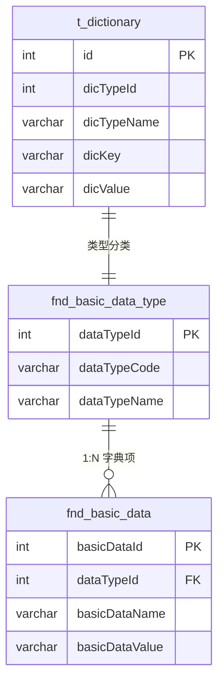

# core 模块 — 数据字典管理

> 本文档详解 core 模块的数据字典管理功能，涵盖 Dictionary 实体与 IDictionaryService。
> 源码基准：`com.dp.plat.core.pojo.Dictionary`、`com.dp.plat.core.service.IDictionaryService`、`com.dp.plat.core.dao.DictionaryMapper`。

---

## 1. 数据字典概述

core 的数据字典用于管理下拉选项、枚举映射等通用键值数据，配合 `fnd_basic_data` / `fnd_basic_data_type` 使用。



---

## 2. Dictionary 实体

### 2.1 字段说明

> 源码基准：`com.dp.plat.core.pojo.Dictionary`（未继承 BaseEntity，独立实体）

| 字段 | 类型 | 说明 |
|------|------|------|
| `id` | Integer | 字典 ID（主键） |
| `dicTypeId` | Integer | 字典类型 ID |
| `dicTypeName` | String | 字典类型名称 |
| `dicKey` | String | 字典 key |
| `dicValue` | String | 字典 value |
| `custominfo` | String | 自定义属性（对应列 `customInfo`） |
| `sort` | Integer | 排序 |
| `status` | Integer | 有效标志（1-有效，0-无效） |
| `createtime` | Date | 创建时间（对应列 `createTime`） |
| `updatetime` | Date | 更新时间（对应列 `updateTime`） |

### 2.2 字典用途

| 用途 | 示例 |
|------|------|
| 下拉选项 | 性别（男/女）、状态（有效/无效） |
| 枚举映射 | 项目类型、优先级 |
| 系统配置 | 参数键值对 |

---

## 3. IDictionaryService 方法参考

### 3.1 CRUD 方法

| 方法 | 说明 |
|------|------|
| `deleteByPrimaryKey(Integer id)` | 按主键删除字典 |
| `insert(Dictionary record)` | 全字段插入 |
| `insertSelective(Dictionary record)` | 选择性插入 |
| `selectByPrimaryKey(Integer id)` | 按主键查询 |
| `updateByPrimaryKey(Dictionary record)` | 全字段更新 |
| `updateByPrimaryKeySelective(Dictionary record)` | 选择性更新 |

### 3.2 业务方法

| 方法 | 说明 |
|------|------|
| `selectBySelective(PageParam<Dictionary> pageParam)` | 条件分页查询（含模糊搜索、排序、分页） |
| `countBySelective(PageParam<Dictionary> pageParam)` | 条件计数 |
| `selectByDicTypeId(int dicTypeId)` | 按字典类型 ID 查询字典项列表 |

---

## 4. DictionaryMapper 方法参考

> 源码基准：`com.dp.plat.core.dao.DictionaryMapper`（对应 `mapping/DictionaryMapper.xml`，表 `t_dictionary`）

| 方法 | 说明 |
|------|------|
| `deleteByPrimaryKey(Integer id)` | 按主键删除 |
| `insert(Dictionary record)` | 全字段插入 |
| `insertSelective(Dictionary record)` | 选择性插入 |
| `selectByPrimaryKey(Integer id)` | 按主键查询 |
| `updateByPrimaryKey(Dictionary record)` | 全字段更新 |
| `updateByPrimaryKeySelective(Dictionary record)` | 选择性更新 |
| `countBySelective(PageParam<Dictionary> pageParam)` | 条件计数 |
| `selectBySelective(PageParam<Dictionary> pageParam)` | 条件分页查询 |
| `selectDicTypeIdByDicTypeName(@Param("dicTypeName") String dicTypeName)` | 按类型名查类型 ID（limit 1） |
| `selectMaxDicTypeId()` | 查询最大字典类型 ID |
| `selectByDicTypeId(int dicTypeId)` | 按类型 ID 查询字典项（按 dic_key 排序） |

---

## 5. 字典管理 Controller

### 5.1 DictionaryController

> 源码基准：`com.dp.plat.core.controller.admin.DictionaryController`，`@RequestMapping(Consts.URLPath.SYSTEM_MANAGER + "dictionary")`，其中 `SYSTEM_MANAGER = "/sys/"`。

| 路径 | 方法 | 功能 |
|------|------|------|
| `/sys/dictionary` | GET | 字典列表视图页（`listView`，加载 dicMap） |
| `/sys/dictionary/list` | GET | 字典分页数据（`getContractData`，支持模糊搜索） |
| `/sys/dictionary/add` | GET | 新增字典页（`add`） |
| `/sys/dictionary/{id}` | GET | 查询单条字典详情（`findOne`） |
| `/sys/dictionary/detail` | POST | 新增字典（`create`，`@SystemControllerLog`） |
| `/sys/dictionary/{id}` | PUT | 修改字典（`update`，`@SystemControllerLog`） |
| `/sys/dictionary/{id}` | DELETE | 删除字典（`delete`，`@SystemControllerLog`） |

---

## 6. 字典加载与缓存

### 6.1 字典加载流程


### 6.2 字典使用示例

**JSP 中使用字典**：

```jsp
<select name="status">
    <c:forEach items="${dictionaries}" var="dict">
        <option value="${dict.dicValue}">${dict.dicTypeName}</option>
    </c:forEach>
</select>
```

**JavaScript 中使用字典**：

```javascript
// 通过 AJAX 获取字典
$.get('/sys/dictionary/list?type=status', function(data) {
    $.each(data, function(i, dict) {
        $('#status').append('<option value="' + dict.dicValue + '">' + dict.dicTypeName + '</option>');
    });
});
```

---

## 7. 与 fnd_basic_data 的关系

core 的 `t_dictionary` 与 PMS-struts 的 `fnd_basic_data` / `fnd_basic_data_type` 配合使用：

| 表 | 用途 | 管理模块 |
|----|------|---------|
| `t_dictionary` | core 通用字典 | core 模块 |
| `fnd_basic_data_type` | 字典类型分类 | PMS-struts |
| `fnd_basic_data` | 字典项明细 | PMS-struts |

> **说明**：`fnd_` 前缀表为 PMS 体系的基础数据表，由 PMS-struts 模块管理，core 通过查询使用。

---

## 8. 相关文档

- [02-modules 公共组件](common-components.md) — 字典组件
- [03-database 数据字典](../03-database/complete-data-dictionary.md) — t_dictionary 表
- [04-mapping 数据流](../04-mapping/data-flow.md) — 字典加载流程
