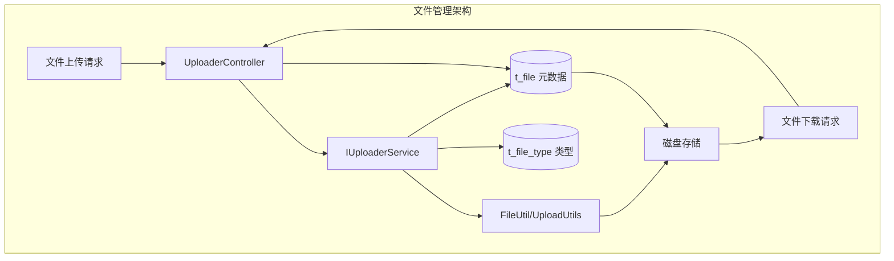
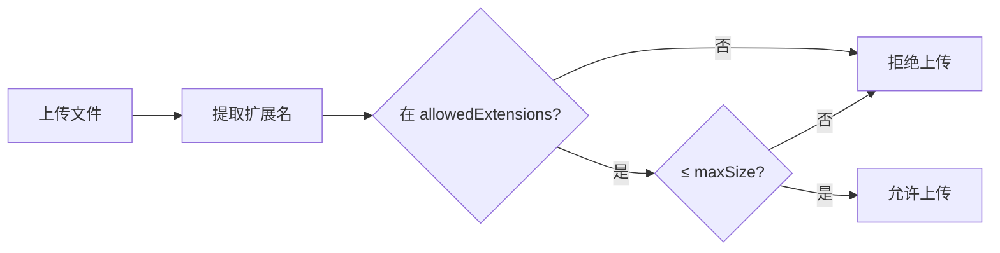
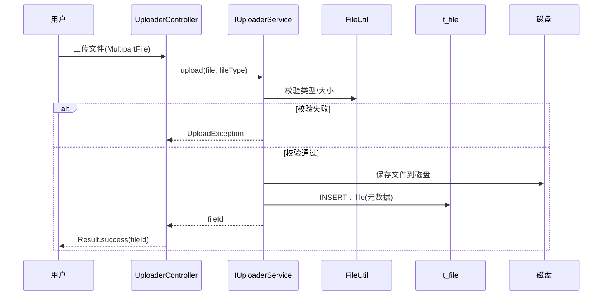

# core 模块 — 文件管理

> 本文档详解 core 模块的文件管理功能，涵盖 FileInfo、FileType、FileUtil、UploaderController。
> 源码基准：`com.dp.plat.core.pojo.FileInfo/FileType`、`com.dp.plat.core.util.FileUtil`、`com.dp.plat.core.controller.UploaderController`。

---

## 1. 文件管理概述

core 提供文件上传/下载/管理功能，文件元数据存储在 `t_file` 表，文件类型分类存储在 `t_file_type` 表。



---

## 2. FileInfo 实体

### 2.1 字段说明

| 字段 | 类型 | 说明 |
|------|------|------|
| `id` | Integer | 文件 ID（主键） |
| `fileName` | String | 原始文件名 |
| `filePath` | String | 存储路径 |
| `fileSize` | Long | 文件大小（字节） |
| `fileType` | String | 文件类型 |
| `fileTypeId` | Integer | 文件类型 ID（关联 t_file_type） |
| `uploadBy` | String | 上传人 |
| `uploadTime` | Date | 上传时间 |
| `downloadCount` | Integer | 下载次数 |
| `remark` | String | 备注 |

### 2.2 文件存储

- 文件存储在磁盘（`upload/` 目录）；
- `t_file` 表存储文件元数据（路径、大小、类型等）；
- `filePath` 为相对路径，拼接配置的根目录得到绝对路径。

---

## 3. FileType 实体

### 3.1 字段说明

| 字段 | 类型 | 说明 |
|------|------|------|
| `id` | Integer | 类型 ID（主键） |
| `typeName` | String | 类型名称 |
| `typeCode` | String | 类型编码 |
| `allowedExtensions` | String | 允许的扩展名（逗号分隔） |
| `maxSize` | Long | 最大文件大小 |
| `status` | Short | 状态：1=有效，0=无效 |

### 3.2 文件类型校验



---

## 4. UploaderController

### 4.1 接口清单

| 路径 | 方法 | 功能 |
|------|------|------|
| `/upload` | POST | 文件上传 |
| `/upload/delete` | POST | 文件删除 |
| `/upload/download` | GET | 文件下载 |
| `/upload/list` | GET | 文件列表 |

### 4.2 上传流程



### 4.3 上传配置

`spring-mvc.xml` 中的文件上传配置：

```xml
<bean id="multipartResolver"
    class="org.springframework.web.multipart.commons.CommonsMultipartResolver">
    <property name="defaultEncoding" value="utf-8"/>
    <property name="maxUploadSize" value="10485760000"/>
    <property name="maxInMemorySize" value="40960"/>
</bean>
```

| 参数 | 值 | 说明 |
|------|-----|------|
| `defaultEncoding` | utf-8 | 默认编码 |
| `maxUploadSize` | 10485760000（约10GB） | 最大上传大小 |
| `maxInMemorySize` | 40960（40KB） | 内存缓冲阈值 |

---

## 5. IFileInfoService 方法参考

### 5.1 CRUD 方法

| 方法 | 说明 |
|------|------|
| `deleteByPrimaryKey(Integer id)` | 按主键删除文件记录 |
| `insert(FileInfo record)` | 全字段插入 |
| `insertSelective(FileInfo record)` | 选择性插入 |
| `selectByPrimaryKey(Integer id)` | 按主键查询 |
| `updateByPrimaryKeySelective(FileInfo record)` | 选择性更新 |

### 5.2 业务方法

| 方法 | 说明 |
|------|------|
| `selectAll()` | 查询所有文件 |
| `selectBySelective(FileInfo)` | 条件查询 |

---

## 6. FileUtil 工具类

### 6.1 核心方法

| 方法 | 说明 |
|------|------|
| `saveFile(MultipartFile, path)` | 保存文件到磁盘 |
| `deleteFile(filePath)` | 删除磁盘文件 |
| `getFileExtension(fileName)` | 获取文件扩展名 |
| `getFileSize(filePath)` | 获取文件大小 |
| `generateFileName(originalName)` | 生成唯一文件名 |

### 6.2 UploadUtils 工具类

| 方法 | 说明 |
|------|------|
| `upload(MultipartFile, fileType)` | 上传文件（含校验） |
| `download(filePath, response)` | 下载文件 |
| `validateFile(file, fileType)` | 校验文件类型/大小 |

---

## 7. 文件下载日志

文件下载记录到 `t_down_log` 表：

| 字段 | 说明 |
|------|------|
| `fileId` | 文件 ID |
| `downloadBy` | 下载人 |
| `downloadTime` | 下载时间 |
| `downloadIP` | 下载 IP |

---

## 8. 文件管理异常

| 异常 | 触发场景 |
|------|---------|
| `UploadException` | 文件上传失败（类型不允许/大小超限/磁盘写入失败） |
| `FileNotFoundException` | 下载文件不存在 |

异常由 `ExceptionController` 统一处理，转为 `Result` 返回前端。

---

## 9. 相关文档

- [02-modules 公共组件](common-components.md) — 文件组件
- [common-utils 公共工具类](common-utils.md) — FileUtil/UploadUtils
- [03-database 数据字典](../03-database/complete-data-dictionary.md) — t_file 表族
- [06-reference 代码示例](../06-reference/code-examples.md) — 文件上传示例
