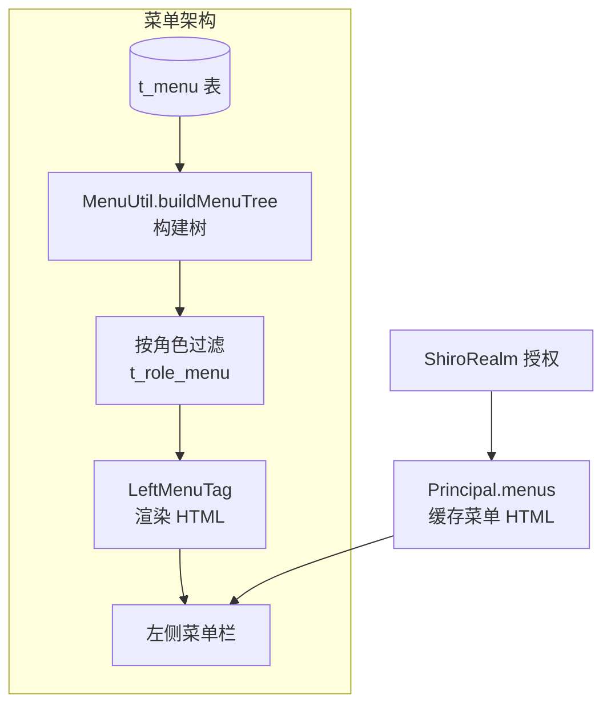
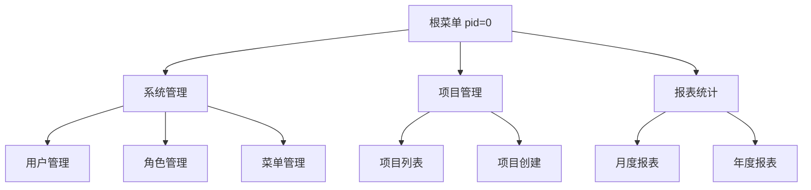
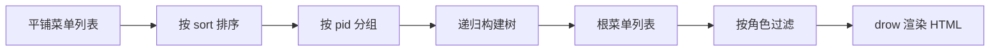
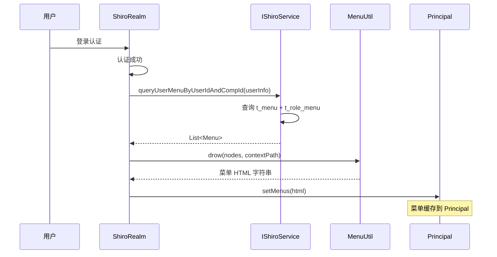
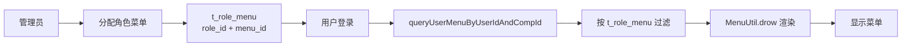

# core 模块 — 菜单管理

> 本文档详解 core 模块的菜单管理功能，涵盖 Menu 树结构、MenuUtil 菜单构建、LeftMenuTag 渲染。
> 源码基准：`com.dp.plat.core.pojo.Menu`、`com.dp.plat.core.util.MenuUtil`、`com.dp.plat.core.tags.LeftMenuTag`。

---

## 1. 菜单管理概述

core 的菜单采用 **树形结构**，按角色过滤可见菜单，通过 `LeftMenuTag` 渲染到 JSP 页面。



---

## 2. Menu 实体

### 2.1 字段说明

| 字段 | 类型 | 说明 |
|------|------|------|
| `id` | Integer | 菜单 ID（主键） |
| `pid` | Integer | 父菜单 ID（0=根） |
| `name` | String | 菜单名称 |
| `url` | String | 超链接 |
| `icon` | String | 图标 class 样式 |
| `sort` | Integer | 子菜单排序 |
| `status` | Boolean | 是否有效：1=有效，0=失效 |
| `target` | String | 链接打开方式 |
| `remark` | String | 备注 |
| `createBy`/`createTime` | - | 创建审计 |
| `updateBy`/`updateTime` | - | 更新审计 |

> **注意**：`t_menu` 表中 `crate_time` 为历史拼写错误（非 `create_time`），已固化在数据库中，修改需同步更新 resultMap。

### 2.2 树形结构



- `pid=0` 为根菜单；
- `sort` 控制同级菜单排序（值越小越靠前）；
- `status=0` 的菜单不显示。

---

## 3. MenuUtil 菜单工具类

### 3.1 核心方法

| 方法 | 说明 |
|------|------|
| `buildMenuTree(List<Menu>)` | 将平铺菜单列表构建为树形结构 |
| `drow(List<Menu>, String contextPath)` | 渲染菜单为 HTML 字符串 |

### 3.2 菜单树构建流程



### 3.3 drow 方法渲染逻辑

`MenuUtil.drow(nodes, contextPath)` 将菜单树渲染为 HTML：

```java
// 渲染逻辑（简化）
public static String drow(List<Menu> nodes, String contextPath) {
    StringBuilder html = new StringBuilder();
    for (Menu node : nodes) {
        if (node.getUrl() != null) {
            html.append("<li><a href='")
                .append(contextPath).append(node.getUrl())
                .append("'>").append(node.getName()).append("</a></li>");
        }
        if (node.getChildren() != null && !node.getChildren().isEmpty()) {
            html.append("<ul>");
            html.append(drow(node.getChildren(), contextPath));
            html.append("</ul>");
        }
    }
    return html.toString();
}
```

- `contextPath` 为应用上下文路径，确保链接正确；
- 渲染结果缓存到 `Principal.menus`，避免重复渲染。

---

## 4. 菜单加载流程

### 4.1 登录时菜单加载



### 4.2 CasRealm 菜单上下文隔离

CasRealm 授权时检查菜单是否包含当前 contextPath：

```java
// CasRealm.doGetAuthorizationInfo
String menus = principal.getMenus();
if (!menus.contains("href='" + httpRequest.getContextPath())) {
    // 菜单未包含当前 contextPath，重新查询并渲染
    List<Menu> nodes = shiroService.queryUserMenuByUserIdAndCompId(userInfo);
    principal.setMenus(MenuUtil.drow(nodes, httpRequest.getContextPath()));
}
```

> **设计目的**：多应用部署时，同一用户访问不同应用，菜单链接需包含各自 contextPath。

---

## 5. LeftMenuTag 标签

### 5.1 标签职责

`LeftMenuTag` 是自定义 JSP 标签，从 `Principal.menus` 读取菜单 HTML 并输出：

```java
public class LeftMenuTag extends SimpleTagSupport {
    @Override
    public void doTag() throws JspException, IOException {
        Principal principal = (Principal) SecurityUtils.getSubject().getPrincipal();
        if (principal != null && principal.getMenus() != null) {
            getJspContext().getWriter().write(principal.getMenus());
        }
    }
}
```

### 5.2 JSP 使用

```jsp
<%@ taglib prefix="dp" uri="/WEB-INF/dp.tld" %>
<dp:leftMenu/>
```

---

## 6. IMenuService 方法参考

### 6.1 CRUD 方法

| 方法 | 说明 |
|------|------|
| `deleteByPrimaryKey(Integer id)` | 按主键删除菜单 |
| `insert(Menu record)` | 全字段插入 |
| `insertSelective(Menu record)` | 选择性插入 |
| `selectByPrimaryKey(Integer id)` | 按主键查询 |
| `updateByPrimaryKey(Menu record)` | 全字段更新 |
| `updateByPrimaryKeySelective(Menu record)` | 选择性更新 |

### 6.2 业务方法

| 方法 | 说明 |
|------|------|
| `selectAll()` | 查询所有菜单 |
| `selectBySelective(Menu menu)` | 条件查询 |
| `getTreeData()` | 获取树形数据（返回 `List<TreeNode>`） |

---

## 7. MenuMapper 方法参考

| 方法 | 说明 |
|------|------|
| `deleteByPrimaryKey(Integer id)` | 按主键删除 |
| `insert(Menu record)` | 全字段插入 |
| `insertSelective(Menu record)` | 选择性插入 |
| `selectByPrimaryKey(Integer id)` | 按主键查询 |
| `updateByPrimaryKey(Menu record)` | 全字段更新 |
| `updateByPrimaryKeySelective(Menu record)` | 选择性更新 |
| `selectAll()` | 查询所有菜单 |
| `selectBySelective(Menu menu)` | 条件查询 |

---

## 8. 菜单管理 Controller

### 8.1 MenuController

| 路径 | 方法 | 功能 |
|------|------|------|
| `/admin/menu/list` | GET | 菜单列表页 |
| `/admin/menu/detail` | GET | 菜单详情 |
| `/admin/menu/create` | POST | 创建菜单 |
| `/admin/menu/update` | POST | 更新菜单 |
| `/admin/menu/delete` | POST | 删除菜单 |
| `/admin/menu/tree` | GET | 菜单树数据（JSON） |

---

## 9. 菜单与角色关系

### 9.1 角色-菜单分配



### 9.2 菜单可见性规则

| 条件 | 可见性 |
|------|--------|
| `t_menu.status=1` 且在 `t_role_menu` 中 | 可见 |
| `t_menu.status=0` | 不可见 |
| 不在 `t_role_menu` 中 | 不可见 |
| 系统用户（`isSysUser=1`） | 可见全部有效菜单 |

---

## 10. 相关文档

- [用户管理](user-management.md) — User/UserRole 详解
- [角色权限管理](role-permission.md) — Role/Permission 详解
- [01-architecture Shiro 架构](../01-architecture/shiro-architecture.md) — 菜单加载流程
- [03-database 数据字典](../03-database/complete-data-dictionary.md) — t_menu 表
