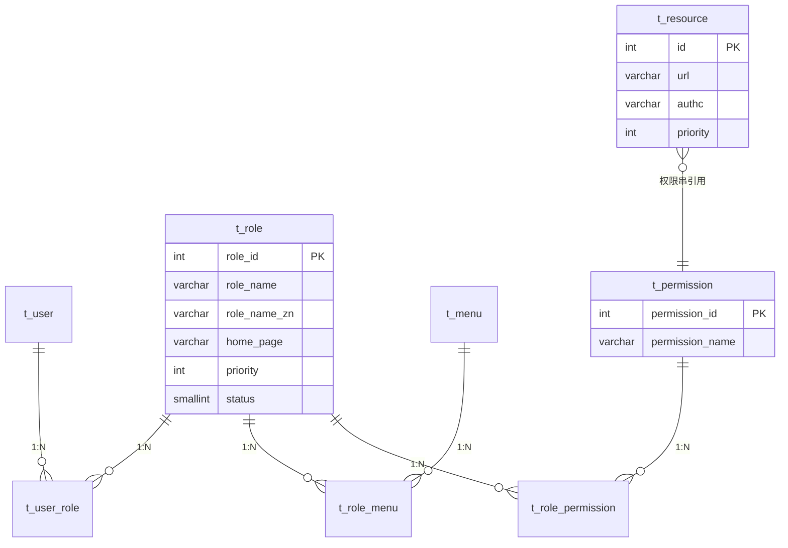
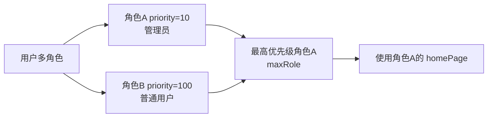
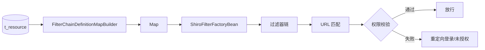

# core 模块 — 角色权限管理

> 本文档详解 core 模块的角色权限管理，涵盖 Role、Resource、Menu、Permission 的关系与操作。
> 源码基准：`com.dp.plat.core.pojo.Role/Resource/Permission`、`com.dp.plat.core.service.IRoleService`。

---

## 1. 角色权限模型

core 采用 **RBAC（基于角色的访问控制）** 模型，通过角色关联用户与权限。



---

## 2. Role 实体（角色）

### 2.1 字段说明

| 字段 | 类型 | 说明 |
|------|------|------|
| `roleId` | Integer | 角色 ID（主键） |
| `roleName` | String | 角色名称（英文标识，权限串用） |
| `roleNameZn` | String | 中文别名（展示用） |
| `homePage` | String | 角色默认主页 |
| `priority` | Integer | 优先级（值越小越高，多角色取最高权） |
| `status` | Short | 有效性：1=有效，0=无效 |
| `remark` | String | 备注 |
| `createBy`/`createTime` | - | 创建审计 |
| `updateBy`/`updateTime` | - | 更新审计 |

### 2.2 角色优先级机制



- 用户有多个角色时，取 `priority` 最小的角色作为 `maxRole`；
- `maxRole.homePage` 作为用户登录后的默认主页；
- `ShiroRealm` 授权时查询 `selectRoleByRoleName` 获取 maxRole。

---

## 3. Permission 实体（权限）

### 3.1 字段说明

| 字段 | 类型 | 说明 |
|------|------|------|
| `permissionId` | Integer | 权限 ID（主键） |
| `permissionName` | String | 权限字符串（如 `project:create`） |
| `createBy`/`createTime` | - | 创建审计 |
| `updateBy`/`updateTime` | - | 更新审计 |

### 3.2 权限字符串约定

格式：`模块:操作`

| 权限串 | 含义 | 使用方式 |
|--------|------|---------|
| `user:read` | 用户查看 | `@RequiresPermissions("user:read")` |
| `user:create` | 用户创建 | `@RequiresPermissions("user:create")` |
| `user:update` | 用户更新 | `@RequiresPermissions("user:update")` |
| `user:delete` | 用户删除 | `@RequiresPermissions("user:delete")` |
| `project:approve` | 项目审批 | `@RequiresPermissions("project:approve")` |
| `admin:*` | 管理员全部 | `@RequiresPermissions("admin:*")` |

### 3.3 权限使用方式

**注解方式**（Controller/Service）：

```java
@RequiresPermissions("user:create")
@RequestMapping(value = "/create", method = RequestMethod.POST)
@ResponseBody
public Result create(User user) { ... }

@RequiresRoles("admin")
@RequestMapping("/admin/**")
public Result adminAction() { ... }
```

**JSP 标签方式**：

```jsp
<shiro:hasPermission name="user:create">
    <button class="btn btn-primary">新增用户</button>
</shiro:hasPermission>

<shiro:hasRole name="admin">
    <a href="/admin">管理后台</a>
</shiro:hasRole>

<shiro:lacksPermission name="user:delete">
    <span>无删除权限</span>
</shiro:lacksPermission>
```

---

## 4. Resource 实体（URL 资源）

### 4.1 字段说明

| 字段 | 类型 | 说明 |
|------|------|------|
| `id` | Integer | 资源 ID（主键） |
| `url` | String | 资源请求地址 |
| `authc` | String | Shiro 权限控制串 |
| `priority` | Integer | 优先级（越低越先匹配） |
| `remark` | String | 备注 |

### 4.2 权限控制串格式

`authc` 字段存储 Shiro 过滤器链配置：

| 控制串 | 含义 |
|--------|------|
| `anon` | 匿名访问 |
| `authc` | 必须认证 |
| `authc,roles[admin]` | 认证 + admin 角色 |
| `authc,perms[user:create]` | 认证 + user:create 权限 |
| `authc,anyRoles[admin,manager]` | 认证 + 任一角色 |

### 4.3 动态过滤器链

`FilterChainDefinitionMapBuilder` 读取 `t_resource` 构建过滤器链：



- 修改 `t_resource` 后刷新即生效，无需重启；
- `priority` 控制匹配顺序（值越小越先匹配）。

---

## 5. 角色权限关系

### 5.1 关联表

| 表 | 关系 | 说明 |
|----|------|------|
| `t_role_menu` | 角色 ↔ 菜单 | 角色可见的菜单 |
| `t_role_permission` | 角色 ↔ 权限 | 角色拥有的权限 |

### 5.2 权限继承链

```mermaid
graph TD
    USER[用户] -->|t_user_role| ROLE[角色]
    ROLE -->|t_role_permission| PERM[权限字符串]
    ROLE -->|t_role_menu| MENU[菜单]
    PERM -->|@RequiresPermissions| CTRL[Controller 方法]
    MENU -->|LeftMenuTag| JSP[菜单渲染]
    RESOURCE[t_resource] -->|url→authc| FILTER[Shiro 过滤器]
```

---

## 6. IRoleService 方法参考

### 6.1 CRUD 方法

| 方法 | 说明 |
|------|------|
| `deleteByPrimaryKey(Integer roleId)` | 按主键删除角色 |
| `insert(Role role)` | 全字段插入 |
| `insertSelective(Role role)` | 选择性插入 |
| `selectByPrimaryKey(Integer roleId)` | 按主键查询 |
| `updateByPrimaryKey(Role role)` | 全字段更新 |
| `updateByPrimaryKeySelective(Role role)` | 选择性更新 |

### 6.2 业务方法

| 方法 | 说明 |
|------|------|
| `selectAllRole()` | 查询所有角色 |
| `selectBySelective(Role, RoleParam)` | 条件查询 |
| `selectBySelective(RoleParam)` | 分页查询 |
| `countBySelective(RoleParam)` | 分页计数 |
| `selectRolesByRoleNames(String roleNames)` | 按角色名集合查询 |
| `selectRoleByRoleName(String roleName)` | 按角色名查询单个角色 |

---

## 7. 角色管理 Controller

### 7.1 RoleController

| 路径 | 方法 | 功能 |
|------|------|------|
| `/admin/role/list` | GET | 角色列表页 |
| `/admin/role/detail` | GET | 角色详情 |
| `/admin/role/create` | POST | 创建角色 |
| `/admin/role/update` | POST | 更新角色 |
| `/admin/role/delete` | POST | 删除角色 |

### 7.2 RoleMenuController

| 路径 | 方法 | 功能 |
|------|------|------|
| `/admin/roleMenu/list` | GET | 角色菜单列表 |
| `/admin/roleMenu/assign` | POST | 分配菜单 |
| `/admin/roleMenu/remove` | POST | 移除菜单 |

---

## 8. 权限缓存与失效

### 8.1 缓存机制

Shiro 授权结果缓存到 EhCache（`org.apache.shiro.realm.SimpleAccountRealm.authorization`），10 分钟过期。

### 8.2 缓存失效场景

| 场景 | 影响 | 处理 |
|------|------|------|
| 修改用户角色 | 10 分钟内仍用旧权限 | 调用 `doClearCache` |
| 修改角色权限 | 同上 | 同上 |
| 修改 t_resource | 过滤器链未刷新 | 重启或刷新 FilterChainDefinitionMap |

> **避坑**：修改权限后用户反馈"权限没变"，需确认缓存是否清除。详见 [05-standards 故障排查](../05-standards/troubleshooting.md)。

---

## 9. 相关文档

- [用户管理](user-management.md) — User/UserInfo 详解
- [菜单管理](menu-management.md) — Menu 树结构
- [01-architecture Shiro 架构](../01-architecture/shiro-architecture.md) — 授权流程
- [03-database 数据字典](../03-database/complete-data-dictionary.md) — 角色权限表族
