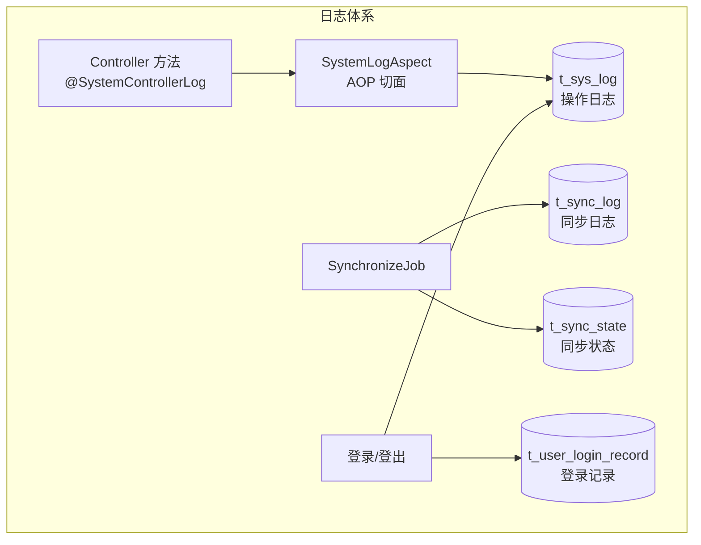
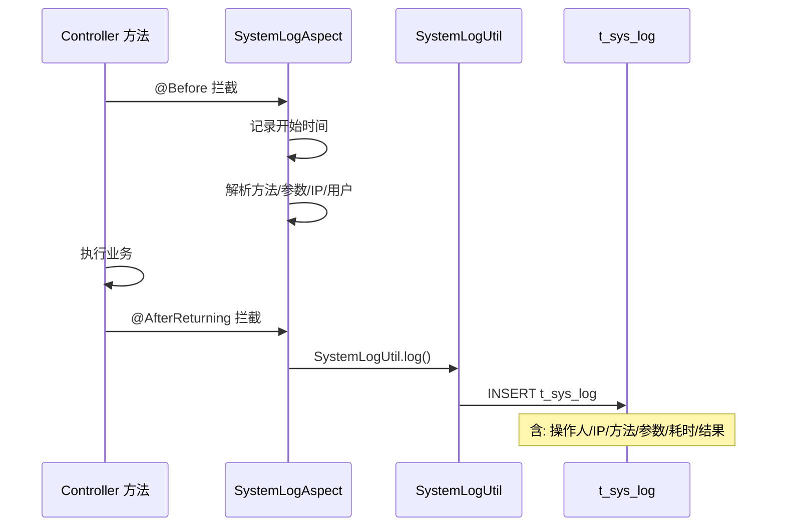
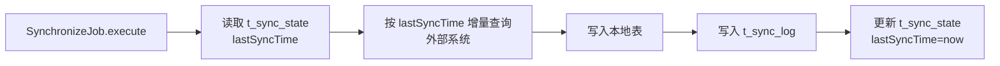
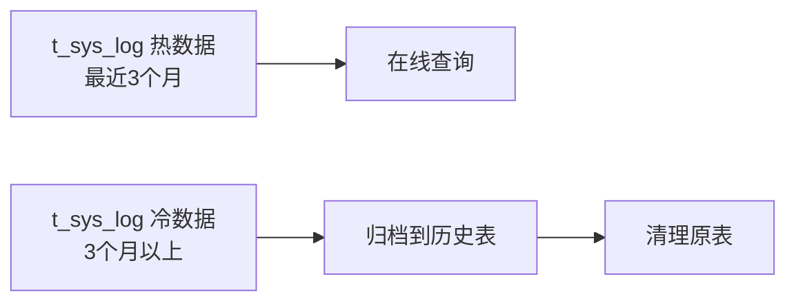

# core 模块 — 系统日志

> 本文档详解 core 模块的系统日志功能，涵盖 SysLog 操作日志、SyncLog 同步日志。
> 源码基准：`com.dp.plat.core.pojo.SysLog/SyncLog/SyncState`、`com.dp.plat.core.aop.SystemLogAspect`。

---

## 1. 系统日志概述

core 提供两类日志：操作日志（SysLog）与同步日志（SyncLog），分别记录用户操作与数据同步。



---

## 2. SysLog 实体（操作日志）

### 2.1 字段说明

| 字段 | 类型 | 说明 |
|------|------|------|
| `id` | Integer | 日志 ID（主键） |
| `description` | String | 操作描述 |
| `userId` | Integer | 操作人 ID |
| `userName` | String | 操作人用户名 |
| `realName` | String | 操作人姓名 |
| `method` | String | 调用方法 |
| `params` | String | 请求参数 |
| `ip` | String | 操作 IP |
| `costTime` | Long | 耗时（毫秒） |
| `operationTime` | Date | 操作时间 |
| `result` | String | 操作结果 |

### 2.2 日志写入机制

通过 `@SystemControllerLog` / `@SystemServiceLog` 注解 + AOP 自动记录：



### 2.3 注解使用

```java
@Controller
@RequestMapping("/project")
public class ProjectController {

    @SystemControllerLog(description = "创建项目")
    @RequestMapping(value = "/create", method = RequestMethod.POST)
    @ResponseBody
    public Result create(Project p) {
        service.insert(p);
        return Result.success(p.getId());
    }

    @SystemControllerLog(description = "删除项目")
    @RequestMapping(value = "/delete", method = RequestMethod.POST)
    @ResponseBody
    public Result delete(Integer id) {
        service.deleteByPrimaryKey(id);
        return Result.success();
    }
}
```

### 2.4 SystemLogAspect 切面

| 切点 | 注解 | 说明 |
|------|------|------|
| `@Before` | `@SystemControllerLog` / `@SystemServiceLog` | 记录开始时间、解析方法信息 |
| `@AfterReturning` | 同上 | 记录耗时、写入 t_sys_log |
| `@AfterThrowing` | 同上 | 记录异常信息 |

**记录的信息**：

| 信息 | 来源 |
|------|------|
| 操作描述 | 注解 `description` 属性 |
| 操作人 | `SecurityUtils.getSubject().getPrincipal()` |
| IP | `IpUtil.getIp(request)` |
| 方法 | `joinPoint.getSignature()` |
| 参数 | `joinPoint.getArgs()` |
| 耗时 | `endTime - startTime` |

---

## 3. SyncLog 实体（同步日志）

### 3.1 字段说明

| 字段 | 类型 | 说明 |
|------|------|------|
| `id` | Integer | 日志 ID（主键） |
| `syncType` | String | 同步类型（SyncType 枚举） |
| `startTime` | Date | 同步开始时间 |
| `endTime` | Date | 同步结束时间 |
| `status` | String | 同步状态（成功/失败） |
| `recordCount` | Integer | 同步记录数 |
| `errorMsg` | String | 错误信息 |
| `createBy`/`createTime` | - | 创建审计 |

### 3.2 SyncType 同步类型

`SyncType` 枚举定义支持的同步类型：

| 同步类型 | 源系统 | 目标 | 说明 |
|---------|--------|------|------|
| EHR | EHR (SQL Server) | `t_user_info` | 人员信息同步 |
| OA | OA (SQL Server) | `t_department` | 组织架构同步 |
| SMS | SMS (MySQL) | 业务表 | 短信状态回传 |
| D365 | D365 (SQL Server) | 业务表 | D365 数据同步 |
| SAP | SAP (SQL Server) | 业务表 | SAP 数据同步 |

---

## 4. SyncState 实体（同步状态）

### 4.1 字段说明

| 字段 | 类型 | 说明 |
|------|------|------|
| `id` | Integer | 主键 |
| `syncType` | String | 同步类型 |
| `lastSyncTime` | Date | 最后同步时间 |
| `lastSyncStatus` | String | 最后同步状态 |
| `lastSyncCount` | Integer | 最后同步记录数 |

### 4.2 增量同步机制



- `t_sync_state` 记录各类型最后同步时间，用于增量同步；
- 每次同步成功后更新 `lastSyncTime`。

---

## 5. ISysLogService 方法参考

### 5.1 CRUD 方法

| 方法 | 说明 |
|------|------|
| `deleteByPrimaryKey(Integer id)` | 按主键删除日志 |
| `insert(SysLog record)` | 全字段插入 |
| `insertSelective(SysLog record)` | 选择性插入 |
| `selectByPrimaryKey(Integer id)` | 按主键查询 |
| `updateByPrimaryKeySelective(SysLog record)` | 选择性更新 |

### 5.2 业务方法

| 方法 | 说明 |
|------|------|
| `selectAll()` | 查询所有日志 |
| `selectBySelective(SysLog)` | 条件查询 |
| `countBySelective(SysLog)` | 条件计数 |

---

## 6. ISyncLogService 方法参考

| 方法 | 说明 |
|------|------|
| `deleteByPrimaryKey(Integer id)` | 按主键删除 |
| `insert(SyncLog record)` | 全字段插入 |
| `selectByPrimaryKey(Integer id)` | 按主键查询 |
| `selectBySelective(SyncLog)` | 条件查询 |

---

## 7. 日志管理 Controller

### 7.1 SysLogController

| 路径 | 方法 | 功能 |
|------|------|------|
| `/admin/sysLog/list` | GET | 操作日志列表 |
| `/admin/sysLog/detail` | GET | 日志详情 |
| `/admin/sysLog/disk` | GET | 日志磁盘查看 |

### 7.2 SyncLogController

| 路径 | 方法 | 功能 |
|------|------|------|
| `/admin/syncLog/list` | GET | 同步日志列表 |
| `/admin/syncLog/detail` | GET | 同步日志详情 |

---

## 8. 日志归档与清理

### 8.1 日志增长

| 日志表 | 增长速度 | 量级 |
|--------|---------|------|
| `t_sys_log` | 高（每次操作一条） | 大（>1万/月） |
| `t_user_login_record` | 高（每次登录一条） | 大（>1万/月） |
| `t_sync_log` | 中（每次同步一条） | 中（千/月） |

### 8.2 归档策略



| 策略 | 说明 |
|------|------|
| 按时间归档 | 3 个月以上数据迁移到 `t_sys_log_archive` |
| 定期清理 | 归档后删除原表历史数据 |
| 索引优化 | `operationTime` 建索引加速查询 |

> **避坑**：日志表只增不删，长期运行会膨胀拖慢查询，需定期归档。

---

## 9. 相关文档

- [02-modules 公共组件](common-components.md) — AOP 切面
- [01-architecture Quartz 配置](../01-architecture/quartz-configuration.md) — SynchronizeJob
- [03-database 数据字典](../03-database/complete-data-dictionary.md) — 日志表族
- [05-standards 性能优化](../05-standards/performance-optimization.md) — 日志归档
