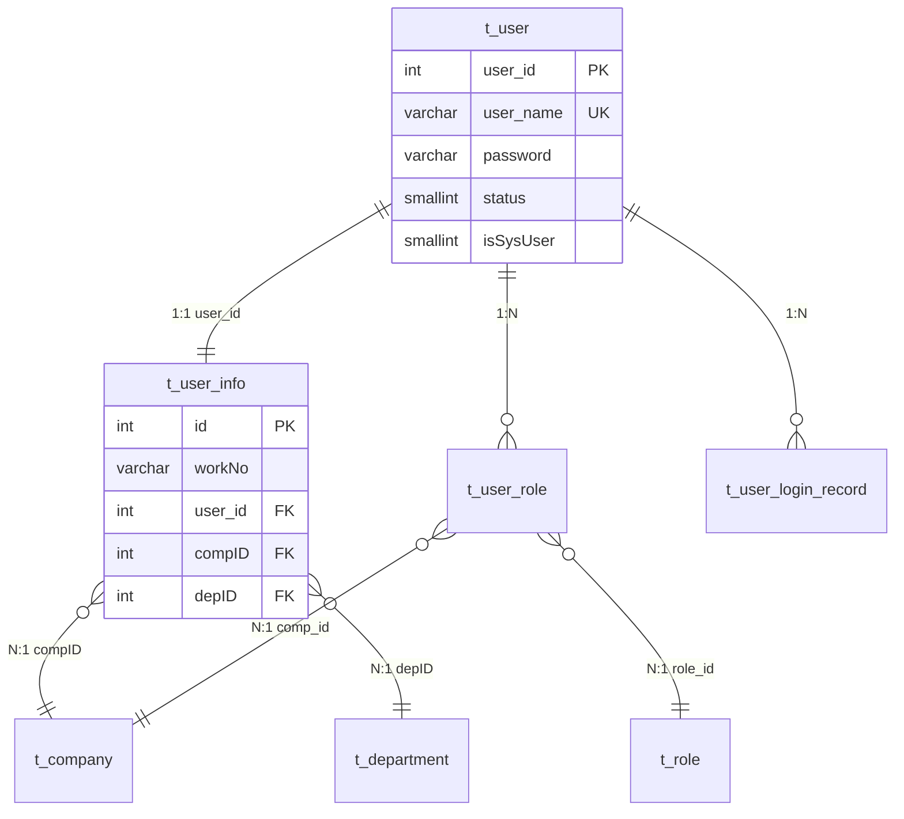
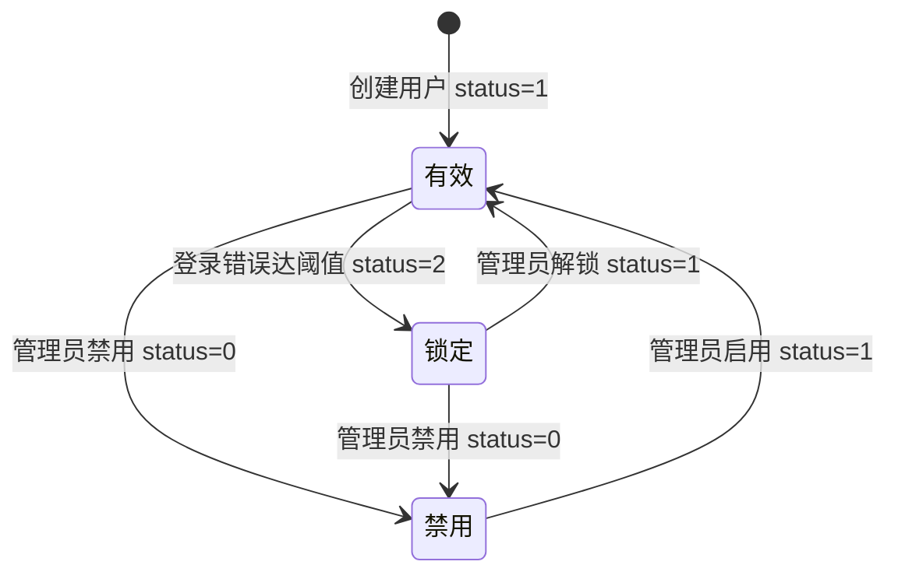
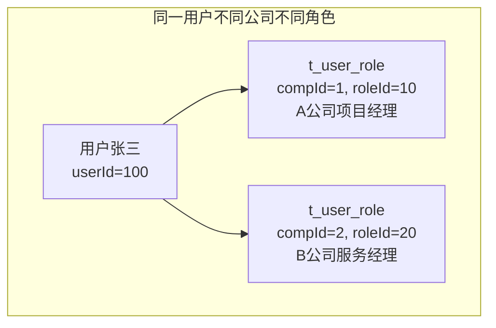
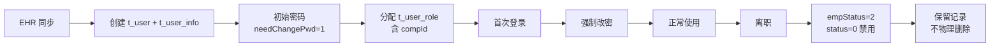

# core 模块 — 用户管理

> 本文档详解 core 模块的用户管理功能，涵盖 User、UserInfo、UserRole、UserLoginRecord 的 CRUD 与业务逻辑。
> 源码基准：`com.dp.plat.core.pojo.User/UserInfo/UserRole`、`com.dp.plat.core.service.IUserService`、`com.dp.plat.core.dao.UserMapper`。

---

## 1. 用户管理概述

core 的用户管理采用 **账号 + 信息分离** 设计：`t_user` 存储登录凭证，`t_user_info` 存储人员信息，通过 `user_id` 一对一关联。

---

## 2. User 实体（登录账号）

### 2.1 字段说明

| 字段 | 类型 | 说明 |
|------|------|------|
| `userId` | Integer | 用户 ID（主键，自增） |
| `userName` | String | 登录用户名（唯一） |
| `password` | String | 密码（MD5+盐+1024迭代） |
| `status` | Short | 状态：0=禁用，1=有效，2=锁定 |
| `needChangePwd` | Boolean | 是否需改密码（首次登录） |
| `loginErrorCount` | Integer | 登录错误次数 |
| `isSysUser` | Short | 是否系统用户（0=普通，1=系统） |
| `createBy`/`createTime` | String/Date | 创建审计 |
| `updateBy`/`updateTime` | String/Date | 更新审计 |
| `userCustom1~5` | - | 自定义扩展字段 |

### 2.2 状态机

### 2.3 业务规则

| 规则 | 说明 |
|------|------|
| 用户名唯一 | `t_user.user_name` UNIQUE 约束 |
| 密码加密 | MD5 + 用户名盐 + 1024 次迭代 |
| 首次登录改密 | `needChangePwd=1` 时强制改密 |
| 错误锁定 | `loginErrorCount` 达阈值置 `status=2` |
| 系统用户 | `isSysUser=1` 授权时 `compId=-1`（跨公司全权限） |

---

## 3. UserInfo 实体（人员信息）

### 3.1 字段说明

| 字段 | 类型 | 说明 |
|------|------|------|
| `id` | Integer | 员工 ID（主键） |
| `workNo` | String | 工号 |
| `realName` | String | 姓名 |
| `eName` | String | 英文名 |
| `compID` | Integer | 公司 ID |
| `depID` | Integer | 部门 ID |
| `jobID` | Integer | 岗位 ID |
| `reportTo` | Integer | 直接上级（用户 ID） |
| `wfreportTo` | Integer | 职能上级（工作流审批） |
| `empStatus` | Integer | 员工状态：1=在职，2=离职 |
| `empType` | Integer | 聘用类型：1=正式，3=实习 |
| `sex` | Short | 性别：1=男，0=女 |
| `email`/`mobile`/`telphone` | String | 联系方式 |
| `avatar` | String | 头像 URL |
| `userId` | Integer | 关联 `t_user.user_id` |
| `custom1~5` | - | 预留字段（见下表） |

### 3.2 预留字段业务含义

| 字段 | 实际用途 | 说明 |
|------|---------|------|
| `custom1` | 预留 | - |
| `custom2` | 预留 | - |
| `custom3` | officeCode | 办事处编码 |
| `custom4` | projectTypes | 可处理项目类型 |
| `custom5` | areaPower | 区域权限范围（逗号分隔） |

> **避坑**：`custom3/4/5` 虽命名"预留"，实则承载关键业务，修改需谨慎。

---

## 4. UserRole 实体（用户-角色关联）

### 4.1 字段说明

| 字段 | 类型 | 说明 |
|------|------|------|
| `id` | Integer | 主键 |
| `userId` | Integer | 用户 ID |
| `roleId` | Integer | 角色 ID |
| `compId` | Integer | 公司 ID（多公司隔离核心） |

### 4.2 多公司隔离机制

- 同一用户可在不同公司有不同角色；
- `ShiroRealm` 授权时按当前 `compId` 查询角色；
- 系统用户（`isSysUser=1`）用 `compId=-1` 跨公司全权限。

---

## 5. UserLoginRecord 实体（登录记录）

### 5.1 字段说明

| 字段 | 类型 | 说明 |
|------|------|------|
| `id` | Integer | 主键 |
| `loginName` | String | 登录账号 |
| `loginTime` | Date | 登录时间 |
| `loginIP` | String | 登录 IP |
| `logoutTime` | Date | 登出时间 |
| `logoutIP` | String | 登出 IP |
| `loginSuccess` | Boolean | 登录是否成功 |
| `logoutSuccess` | Boolean | 登出是否成功 |
| `userId` | Integer | 用户 ID |

### 5.2 安全审计用途

- 异常登录检测（异地/高频失败）；
- 会话时长统计；
- 并发登录检测。

---

## 6. IUserService 方法参考

### 6.1 CRUD 方法

| 方法 | 说明 |
|------|------|
| `deleteByPrimaryKey(Integer userId)` | 按主键删除用户 |
| `insert(User record)` | 全字段插入 |
| `insertSelective(User record)` | 选择性插入（null 跳过） |
| `selectByPrimaryKey(Integer userId)` | 按主键查询 |
| `updateByPrimaryKey(User record)` | 全字段更新 |
| `updateByPrimaryKeySelective(User user)` | 选择性更新 |

### 6.2 业务方法

| 方法 | 说明 |
|------|------|
| `selectAllUser()` | 查询所有可用用户 |
| `selectByUserName(String username)` | 按用户名查询 |
| `updateLoginInfoByUserName(User user)` | 更新登录信息 |
| `updateByUsername(User user)` | 按用户名更新 |
| `updateUserErrorCount(String username)` | 错误次数 +1 |
| `checkUniqueUserName(String userName)` | 检查用户名唯一 |
| `insertOrUpdateSelective(User user)` | 插入或更新 |
| `queryMaxRoleHomePageByUserId(Integer userId)` | 查询角色主页 |
| `queryMaxRoleHomePageByUserIdAndCompId(UserInfo)` | 按公司查询角色主页 |
| `countBySelective(PageParam)` | 分页计数 |
| `selectBySelective(PageParam)` | 分页查询 |
| `findUserByParam(Map)` | 按参数查询 |

---

## 7. 用户管理 Controller

### 7.1 UserController

| 路径 | 方法 | 功能 |
|------|------|------|
| `/admin/user/list` | GET | 用户列表页 |
| `/admin/user/detail` | GET | 用户详情 |
| `/admin/user/create` | POST | 创建用户 |
| `/admin/user/update` | POST | 更新用户 |
| `/admin/user/delete` | POST | 删除用户 |
| `/admin/user/resetPassword` | POST | 重置密码 |

### 7.2 UserRoleController

| 路径 | 方法 | 功能 |
|------|------|------|
| `/admin/userRole/list` | GET | 用户角色列表 |
| `/admin/userRole/assign` | POST | 分配角色 |
| `/admin/userRole/remove` | POST | 移除角色 |

---

## 8. 用户生命周期

> **数据保留**：用户离职后不物理删除，仅置 `empStatus=2` + `status=0`，保留历史关联数据。

---

## 9. 相关文档

- [角色权限管理](role-permission.md) — Role/Permission 详解
- [菜单管理](menu-management.md) — Menu 树结构
- [01-architecture Shiro 架构](../01-architecture/shiro-architecture.md) — 认证授权流程
- [03-database 数据字典](../03-database/complete-data-dictionary.md) — t_user 表族
