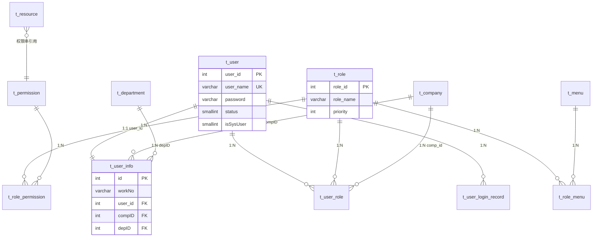
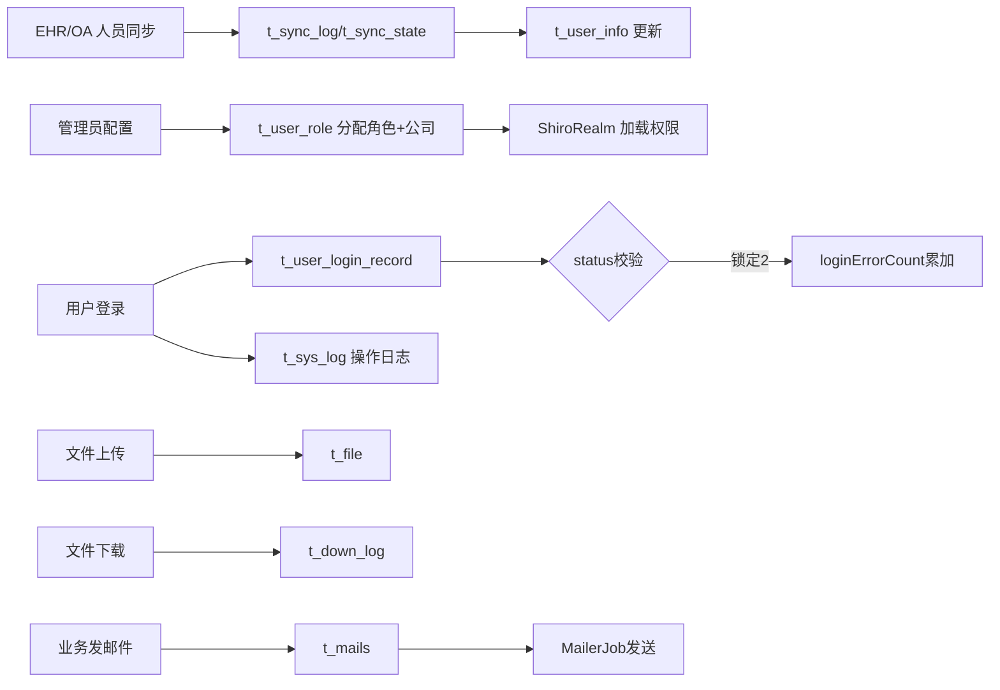

# core 模块数据字典 — 系统支撑域（t_* 表族）

> 数据库：core 主数据源由 `jdbc.properties` 的 `jdbc.url` 配置（dev=`dppms_d365`，release=`dppms_d365`）；PMS-struts 历史主干使用 `dppms_d365`（见 `pms.url`）。各环境数据库名以 `jdbc*.properties` 实际配置为准。 | 数据来源：MyBatis Mapper XML + Java Bean 注释 + 实际源码映射
> 本文档覆盖 core 模块管理的**系统支撑域**表（`t_*` 前缀，权限/组织/资源/日志/文件/邮件/同步）。
> 业务表（pm_project*、prob* 等）见 PMS-struts 数据字典；EHR 表（ehr_*）见 PMS-springmvc 数据字典。

---

## 数据库概览（core 管辖范围）

| 统计项 | 值 |
|--------|-----|
| 管辖表族 | `t_*` 前缀表 |
| 核心表数量 | 17 张 |
| 主要职责 | 用户/角色/权限/菜单/资源/部门/公司/字典/文件/邮件/日志/同步 |

### 表清单

| 业务分组 | 表名 | 说明 |
|----------|------|------|
| 用户 | `t_user` | 系统用户账号（登录凭证） |
| 用户 | `t_user_info` | 用户扩展信息（工号/姓名/组织/联系方式） |
| 用户 | `t_user_role` | 用户-角色关联（含公司隔离 comp_id） |
| 用户 | `t_user_login_record` | 用户登录记录 |
| 角色 | `t_role` | 角色定义 |
| 角色 | `t_role_menu` | 角色-菜单关联 |
| 角色 | `t_role_permission` | 角色-权限关联 |
| 权限 | `t_permission` | 权限字符串定义 |
| 菜单 | `t_menu` | 系统菜单（树形） |
| 资源 | `t_resource` | URL 资源-权限映射 |
| 组织 | `t_department` | 部门/办事处 |
| 组织 | `t_company` | 公司/组织机构 |
| 字典 | `t_dictionary` | 数据字典 |
| 日志 | `t_sys_log` | 系统操作日志 |
| 文件 | `t_file` | 文件上传记录 |
| 文件 | `t_file_type` | 文件类型 |
| 文件 | `t_down_log` | 文件下载日志 |
| 邮件 | `t_mails` | 邮件发送记录 |
| 通知 | `t_notify_template` | 通知模板 |
| 同步 | `t_sync_log` | 外部系统数据同步日志 |
| 同步 | `t_sync_state` | 同步状态 |
| 变量 | `t_sys_variable` | 系统参数变量 |

---

## 一、用户表族

### 1.1 t_user — 系统用户账号

存储登录账号与凭证，与 `t_user_info` 一对一（通过 `user_id` 关联）。

| 字段名 | 数据类型 | 可空 | 默认值 | 键 | 业务含义 |
|--------|----------|------|--------|----|----------|
| user_id | int(11) | NO | - | PRI, 自增 | 用户ID，主键 |
| user_name | varchar(25) | YES | - | UNI | 登录用户名，唯一 |
| password | varchar(100) | YES | - | | 密码（MD5+盐+1024迭代存储） |
| create_by | varchar(25) | YES | - | | 创建人 |
| create_time | datetime | NO | CURRENT_TIMESTAMP | | 创建时间 |
| update_by | varchar(25) | YES | - | | 更新人 |
| update_time | datetime | YES | - (on update) | | 更新时间 |
| status | smallint(1) | NO | 1 | | 用户状态：0=失效，1=有效，2=锁定 |
| needChangePwd | bit(1) | NO | b'1' | | 创建后是否需改密码：1=是 |
| loginErrorCount | int(1) | NO | 0 | | 密码错误次数（达阈值锁定） |
| isSysUser | smallint(1) | NO | 0 | | 是否系统用户：0=普通，1=系统（跨公司全权限） |
| userCustom1 | varchar(50) | YES | - | | 自定义字段1 |
| userCustom2 | varchar(50) | YES | - | | 自定义字段2 |
| userCustom3 | varchar(50) | YES | - | | 自定义字段3 |
| userCustom4 | int(11) | YES | 0 | | 自定义字段4 |
| userCustom5 | int(11) | YES | 0 | | 自定义字段5 |

**索引**：`PRIMARY`(user_id)、`user_name`(UNIQUE)

**业务规则**：
- 登录失败累加 `loginErrorCount`，达上限置 `status=2`（锁定），需管理员解锁。
- `isSysUser=1` 的用户在 `ShiroRealm` 授权时使用 `compId=-1`，可访问全部公司数据。
- `needChangePwd` 默认为 1，首次登录强制改密（`PasswordController` 校验）。

### 1.2 t_user_info — 用户扩展信息

| 字段名 | 数据类型 | 可空 | 默认值 | 键 | 业务含义 |
|--------|----------|------|--------|----|----------|
| id | int(11) | NO | - | PRI, 自增 | 员工ID（外键→t_user.user_id） |
| workNo | varchar(25) | NO | - | MUL | 工号 |
| realName | varchar(50) | NO | - | | 姓名 |
| eName | varchar(50) | YES | - | | 英文名 |
| compID | int(11) | NO | 0 | MUL | 公司ID（→t_company.id） |
| depID | int(11) | NO | 0 | MUL | 部门ID（→t_department.id） |
| jobID | int(11) | NO | 0 | MUL | 岗位ID |
| reportTo | int(11) | YES | - | MUL | 直接上级（用户ID） |
| wfreportTo | int(11) | YES | - | MUL | 职能上级（用户ID，工作流审批用） |
| empStatus | int(11) | NO | 1 | | 员工状态：1=在职，2=离职 |
| jobStatus | int(11) | YES | - | | 岗位状态 |
| empType | int(11) | YES | - | | 聘用类型：1=正式，3=实习生 |
| sex | smallint(1) | YES | - | | 性别：1=男，0=女 |
| birthday | date | YES | - | | 生日 |
| email | varchar(50) | YES | - | | 邮箱 |
| mobile | varchar(50) | YES | - | | 手机 |
| telphone | varchar(50) | YES | - | | 座机 |
| avatar | varchar(500) | YES | - | | 头像URL |
| remark | varchar(100) | YES | - | | 备注 |
| state | int(11) | YES | 1 | | 状态 |
| user_id | int(11) | YES | - | MUL | 关联 t_user.user_id |
| custom1 | int(11) | YES | - | | 预留字段1 |
| custom2 | int(11) | YES | - | | 预留字段2 |
| custom3 | varchar(50) | YES | - | | 预留：officeCode（办事处编码） |
| custom4 | varchar(50) | YES | - | | 预留：projectTypes（可处理项目类型） |
| custom5 | varchar(4096) | YES | - | | 预留：areaPower（区域权限范围） |

**索引**：`PRIMARY`(id)、workNo(MUL)、compID(MUL)、depID(MUL)、jobID(MUL)、reportTo(MUL)、wfreportTo(MUL)、user_id(MUL)

> **避坑**：`custom3/4/5` 虽命名"预留"，实则承载关键业务（办事处、项目类型、区域权限），修改需谨慎；`areaPower` 为 4096 长度，可能存逗号分隔的多区域编码。

### 1.3 t_user_role — 用户-角色关联

| 字段名 | 数据类型 | 可空 | 键 | 业务含义 |
|--------|----------|------|----|----------|
| id | int(11) | NO | PRI, 自增 | 主键 |
| user_id | int(11) | NO | MUL | 用户ID |
| role_id | int(11) | NO | MUL | 角色ID |
| comp_id | int(11) | YES | | 公司ID（实现同一用户在不同公司有不同角色） |

**索引**：`PRIMARY`(id)、user_id(MUL)、role_id(MUL)

> `comp_id` 是**多公司数据隔离**的核心：同一人可在 A 公司是项目经理、在 B 公司是服务经理。

### 1.4 t_user_login_record — 登录记录

记录每次登录/登出的 IP、时间、结果，用于安全审计与异常登录检测。

| 字段名 | 数据类型 | 可空 | 默认值 | 键 | 业务含义 |
|--------|----------|------|--------|----|----------|
| id | int(11) | NO | - | PRI, 自增 | 主键 |
| loginName | varchar(64) | YES | - | | 登录账号名 |
| loginTime | datetime | NO | CURRENT_TIMESTAMP | | 登录时间 |
| loginIP | varchar(64) | YES | - | | 登录IP |
| logoutTime | datetime | YES | - | | 登出时间 |
| logoutIP | varchar(64) | YES | - | | 登出IP |
| loginSuccess | tinyint(1) | NO | 0 | | 登录是否成功：1=成功，0=失败 |
| logoutSuccess | tinyint(1) | YES | - | | 登出是否成功 |
| userId | int(11) | YES | - | | 用户ID（→t_user.user_id） |

**索引**：`PRIMARY`(id)

> **安全审计用途**：通过本表可分析异常登录（异地/高频失败）、会话时长、并发登录。字段采用驼峰命名（loginName/loginIP/loginSuccess），与 t_user 的混合命名风格一致——这是 core 表族的既有约定。

---

## 二、角色权限表族

### 2.1 t_role — 角色定义

| 字段名 | 数据类型 | 可空 | 默认值 | 键 | 业务含义 |
|--------|----------|------|--------|----|----------|
| role_id | int(11) | NO | - | PRI, 自增 | 角色ID |
| role_name | varchar(100) | YES | - | MUL | 角色名称（英文标识，权限串用） |
| role_name_zn | varchar(100) | YES | - | | 中文别名（展示用） |
| home_page | varchar(100) | YES | - | | 角色默认主页 |
| priority | int(11) | YES | 100 | | 角色优先级（值越小优先级越高，用于多角色取最高权） |
| status | smallint(1) | YES | 1 | | 有效性：1=有效，0=无效 |
| create_by/create_time/update_by/update_time | - | - | - | | 审计字段 |
| remark | varchar(255) | YES | - | | 备注 |

**索引**：`PRIMARY`(role_id)、role_name(MUL)

### 2.2 t_role_menu — 角色-菜单

| 字段名 | 数据类型 | 键 | 业务含义 |
|--------|----------|----|----------|
| id | int(11) | PRI, 自增 | 主键 |
| role_id | int(11) | | 角色ID |
| menu_id | int(11) | | 菜单ID |
| create_time/create_by | - | | 审计 |

**索引**：`PRIMARY`(id)

### 2.3 t_role_permission — 角色-权限（多对多）

| 字段名 | 数据类型 | 键 | 业务含义 |
|--------|----------|----|----------|
| id | int(11) | PRI, 自增 | 主键 |
| role_id | int(11) | MUL | 角色ID |
| permission_id | int(11) | MUL | 权限ID |

**索引**：`PRIMARY`(id)、role_id(MUL)、permission_id(MUL)、(role_id,permission_id)(UNIQUE)

### 2.4 t_permission — 权限定义

| 字段名 | 数据类型 | 键 | 业务含义 |
|--------|----------|----|----------|
| permission_id | int(11) | PRI, 自增 | 权限ID |
| permission_name | varchar(100) | MUL | 权限字符串（如 `project:create`） |
| create_by/create_time/update_by/update_time | - | | 审计 |

**索引**：`PRIMARY`(permission_id)、permission_name(MUL)

> 权限串格式约定为 `模块:操作`（如 `user:read`、`project:approve`），供 Shiro 的 `@RequiresPermissions` 或 JSP `<shiro:hasPermission>` 使用。

---

## 三、菜单与资源

### 3.1 t_menu — 系统菜单（树形）

| 字段名 | 数据类型 | 可空 | 默认值 | 业务含义 |
|--------|----------|------|--------|----------|
| id | int(11) | NO | - (PRI,自增) | 菜单ID |
| pid | int(11) | NO | 0 | 父菜单ID（0=根） |
| name | varchar(100) | YES | - | 菜单名称 |
| url | varchar(100) | YES | - | 超链接 |
| icon | varchar(64) | YES | - | 图标 class 样式 |
| sort | int(11) | YES | 0 | 子菜单排序 |
| status | bit(1) | YES | b'1' | 是否有效：1=有效，0=失效 |
| target | varchar(15) | YES | - | 链接打开方式 |
| remark | varchar(255) | YES | - | 备注 |
| create_by/crate_time/update_by/update_time | - | - | - | 审计（注意源码中 `crate_time` 为历史拼写） |

**索引**：`PRIMARY`(id)

> 菜单树由 `MenuUtil.buildMenuTree` 构建，按当前用户角色过滤可见菜单（`LeftMenuTag` 渲染）。

### 3.2 t_resource — URL 资源-权限映射

| 字段名 | 数据类型 | 可空 | 默认值 | 业务含义 |
|--------|----------|------|--------|----------|
| id | int(11) | NO | - (PRI) | 资源ID |
| url | varchar(100) | YES | - | 资源请求地址 |
| authc | varchar(255) | YES | - | Shiro 权限控制串（如 `authc,roles[admin],perms[admin:create]`） |
| priority | int(11) | YES | 0 | 优先级（越低越靠后匹配） |
| remark | varchar(255) | YES | - | 备注 |

**索引**：`PRIMARY`(id)

> `FilterChainDefinitionMapBuilder` 读取本表，动态构建 Shiro 过滤器链，实现 URL 级权限控制（无需重启即可调整权限）。

---

## 四、组织与字典

### 4.1 t_company — 公司/组织机构

字段含：id(PRI)、companyName、compCode(MUL,索引)、adminID(MUL,管理员)、create/update 审计等。`ShiroRealm` 授权按 compId 隔离数据。

**索引**：`PRIMARY`(id)、compCode(MUL)、adminID(MUL)

### 4.2 t_department — 部门/办事处

树形结构，含 parent_id、departmentName、departmentNum（编码，与 pm_project.column001 逻辑外键关联）。

### 4.3 t_dictionary — 数据字典

通用键值字典，配合 `fnd_basic_data`/`fnd_basic_data_type` 使用，供下拉选项、枚举映射。

---

## 五、日志、文件、邮件、同步

| 表 | 主键索引 | 说明 |
|----|----------|------|
| `t_sys_log` | PRIMARY(id) | 操作日志：`@SystemControllerLog` 切面写入，含用户/IP/方法/参数/耗时 |
| `t_file` | PRIMARY(id) | 上传文件元数据（`UploaderController` 写入） |
| `t_file_type` | PRIMARY(id) | 文件类型分类 |
| `t_down_log` | PRIMARY(id) | 文件下载日志 |
| `t_mails` | PRIMARY(id) | 待发/已发邮件（`MailerJob` 扫描发送） |
| `t_notify_template` | PRIMARY(id)、templateCode(UNIQUE) | 通知模板（按 code 唯一） |
| `t_sync_log` | PRIMARY(id) | 外部系统同步日志（`SynchronizeJob` 写入） |
| `t_sync_state` | PRIMARY(id) | 同步状态（记录各同步类型最后同步时间/状态） |
| `t_sys_variable` | PRIMARY(id) | 系统参数（启动时加载到 `SystemConfig.systemVariables`） |

---

## 六、ER 关系图（core 系统支撑域）

> **关联方式说明**：core 的关联多为**逻辑外键**（无物理 FK 约束，靠应用层 `comp_id`/`user_id` 维护），这是 PMS 体系的通用约定——便于数据迁移与外部同步写入。

---

## 七、数据流转与生命周期

**生命周期**：
- `t_user`/`t_user_info`：随员工入职创建，离职置 `empStatus=2` 但**不物理删除**（保留历史关联）。
- 日志类（`t_sys_log`/`t_user_login_record`/`t_sync_log`/`t_down_log`）：只增不删，需定期归档（按时间分区/迁移历史库），避免膨胀拖慢查询。
- `t_mails`：发送成功后置已发状态，可定期清理。

---

## 相关文档

- [01-architecture 系统架构](../01-architecture/system-architecture.md)
- [02-modules 公共组件](../02-modules/common-components.md)
- [04-mapping 功能-数据映射](../04-mapping/crud-matrix.md)
- 全量业务数据字典：[PMS-struts/03-database/database_dict final.md](../../PMS-struts/docs/03-database/database_dict%20final.md)
- EHR 组织表：[PMS-springmvc/03-database](../../PMS-springmvc/docs/03-database/complete-data-dictionary.md)
