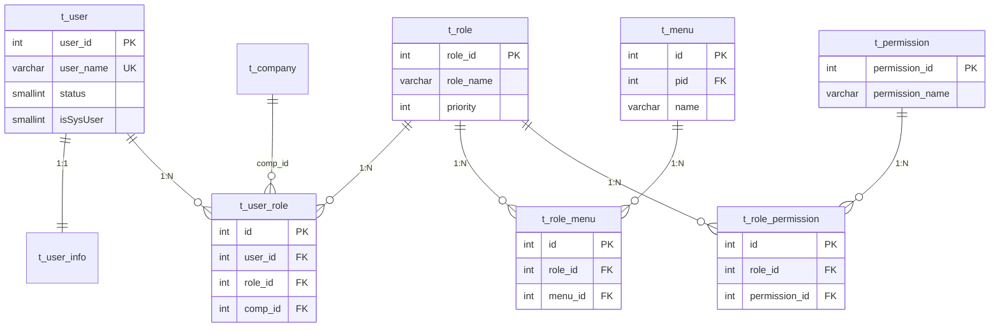
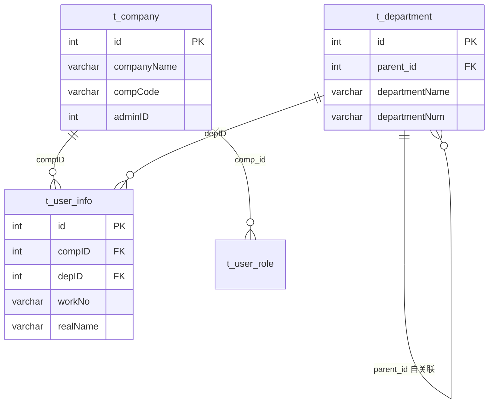
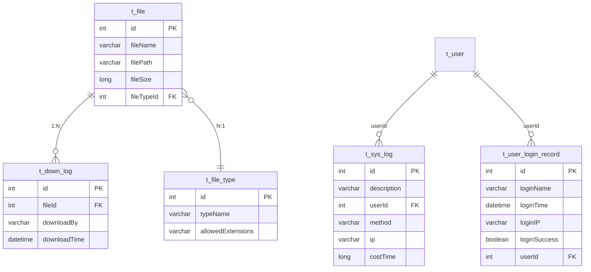
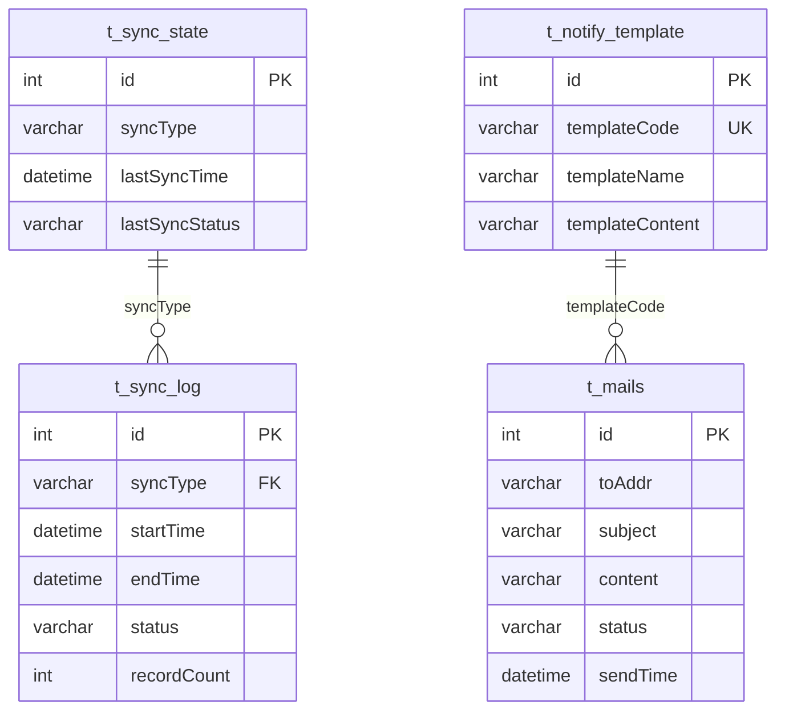

# core 模块 — ER 关系图

> 本文档使用 Mermaid erDiagram 绘制 core 模块管理的系统支撑域表关系图。
> 数据库：core 主数据源由 `jdbc.properties` 配置（dev=`dppms_d365`，release=`dppms_d365`） | 表前缀：`t_`（系统支撑域）

---

## 1. 完整 ER 图（系统支撑域）

```mermaid
erDiagram
    t_user ||--|| t_user_info : "1:1 user_id"
    t_user ||--o{ t_user_role : "1:N"
    t_user ||--o{ t_user_login_record : "1:N"
    t_role ||--o{ t_user_role : "1:N"
    t_role ||--o{ t_role_menu : "1:N"
    t_role ||--o{ t_role_permission : "1:N"
    t_menu ||--o{ t_role_menu : "1:N"
    t_permission ||--o{ t_role_permission : "1:N"
    t_company ||--o{ t_user_info : "1:N compID"
    t_company ||--o{ t_user_role : "1:N comp_id"
    t_department ||--o{ t_user_info : "1:N depID"
    t_resource }o--|| t_permission : "权限串引用"
    t_file ||--o{ t_down_log : "1:N"
    t_file }o--|| t_file_type : "N:1"
    t_notify_template ||--o{ t_mails : "1:N templateCode"

    t_user {
        int user_id PK
        varchar user_name UK
        varchar password
        smallint status
        smallint isSysUser
        boolean needChangePwd
        int loginErrorCount
    }
    t_user_info {
        int id PK
        varchar workNo
        int user_id FK
        int compID FK
        int depID FK
        int jobID
        int reportTo
        varchar realName
        varchar email
        varchar mobile
    }
    t_user_role {
        int id PK
        int user_id FK
        int role_id FK
        int comp_id FK
    }
    t_user_login_record {
        int id PK
        varchar loginName
        datetime loginTime
        varchar loginIP
        datetime logoutTime
        boolean loginSuccess
        int userId FK
    }
    t_role {
        int role_id PK
        varchar role_name
        varchar role_name_zn
        varchar home_page
        int priority
        smallint status
    }
    t_role_menu {
        int id PK
        int role_id FK
        int menu_id FK
    }
    t_role_permission {
        int id PK
        int role_id FK
        int permission_id FK
    }
    t_permission {
        int permission_id PK
        varchar permission_name
    }
    t_menu {
        int id PK
        int pid FK
        varchar name
        varchar url
        varchar icon
        int sort
        boolean status
    }
    t_resource {
        int id PK
        varchar url
        varchar authc
        int priority
    }
    t_company {
        int id PK
        varchar companyName
        varchar compCode
        int adminID
    }
    t_department {
        int id PK
        int parent_id FK
        varchar departmentName
        varchar departmentNum
    }
    t_dictionary {
        int id PK
        varchar code
        varchar name
        varchar value
    }
    t_sys_log {
        int id PK
        varchar description
        int userId
        varchar method
        varchar params
        varchar ip
        long costTime
        datetime operationTime
    }
    t_file {
        int id PK
        varchar fileName
        varchar filePath
        long fileSize
        int fileTypeId FK
        varchar uploadBy
        datetime uploadTime
    }
    t_file_type {
        int id PK
        varchar typeName
        varchar typeCode
        varchar allowedExtensions
        long maxSize
    }
    t_down_log {
        int id PK
        int fileId FK
        varchar downloadBy
        datetime downloadTime
        varchar downloadIP
    }
    t_mails {
        int id PK
        varchar toAddr
        varchar subject
        varchar content
        varchar status
        datetime sendTime
    }
    t_notify_template {
        int id PK
        varchar templateCode UK
        varchar templateName
        varchar templateContent
    }
    t_sync_log {
        int id PK
        varchar syncType
        datetime startTime
        datetime endTime
        varchar status
        int recordCount
        varchar errorMsg
    }
    t_sync_state {
        int id PK
        varchar syncType
        datetime lastSyncTime
        varchar lastSyncStatus
        int lastSyncCount
    }
    t_sys_variable {
        int id PK
        varchar variableKey
        varchar variableValue
        varchar remark
    }
```

---

## 2. 用户权限域 ER 图

**关系说明**：
- `t_user` ↔ `t_user_info`：一对一（通过 `user_id`）
- `t_user` ↔ `t_role`：多对多（通过 `t_user_role`，含 `comp_id` 公司隔离）
- `t_role` ↔ `t_permission`：多对多（通过 `t_role_permission`）
- `t_role` ↔ `t_menu`：多对多（通过 `t_role_menu`）

---

## 3. 组织架构域 ER 图

**关系说明**：
- `t_company` → `t_user_info`：一对多（一个公司多个员工）
- `t_department` → `t_user_info`：一对多（一个部门多个员工）
- `t_department` 自关联：树形结构（`parent_id`）

---

## 4. 日志文件域 ER 图

---

## 5. 同步邮件域 ER 图

---

## 6. 关联方式说明

> **重要约定**：core 的关联多为**逻辑外键**（无物理 FK 约束），靠应用层维护。

| 关联类型 | 说明 | 示例 |
|---------|------|------|
| 逻辑外键 | 无物理约束，应用层维护 | `t_user_role.user_id` → `t_user.user_id` |
| 物理外键 | 有 FK 约束 | 无（core 表族均无物理 FK） |
| 自关联 | 树形结构 | `t_department.parent_id` → `t_department.id` |

**逻辑外键的原因**：
1. 便于数据迁移（无约束限制）
2. 便于外部同步写入（EHR/OA 同步）
3. 避免约束影响批量操作性能

---

## 7. 相关文档

- [03-database 数据字典](complete-data-dictionary.md) — 字段详情
- [index-analysis 索引分析](index-analysis.md) — 索引策略
- [02-modules 用户管理](../02-modules/user-management.md) — 用户表族
- [02-modules 角色权限](../02-modules/role-permission.md) — 角色权限表族
