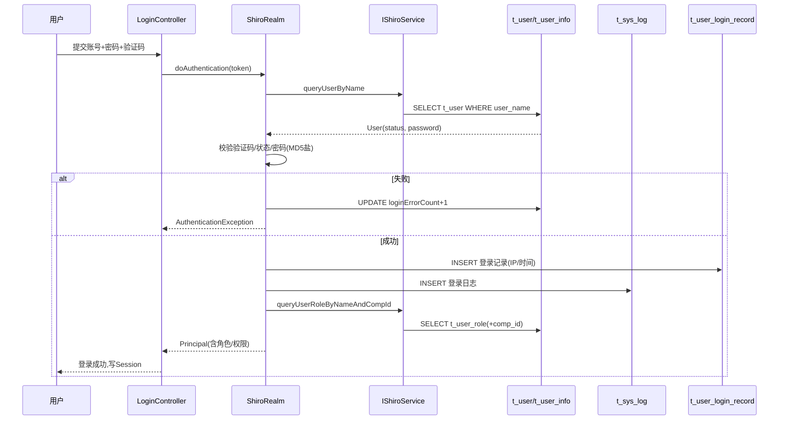

# core 模块 — 功能-数据 CRUD 映射矩阵

> C=创建 R=读取 U=更新 D=删除 | 频率：高(>100/天)/中(10-100)/低(<10) | 量级：大(>1万)/中(千-万)/小(<千)
> core 为框架模块，CRUD 主要由通用 Controller 与 Shiro 认证触发。

---

## 1. 组件-表 CRUD 矩阵

| 组件 | 操作表 | C | R | U | D | 频率 | 量级 | 触发场景 |
|------|--------|---|---|---|---|------|------|----------|
| LoginController / ShiroRealm | t_user | | ✓ | ✓ | | 高 | 小 | 登录认证、错误次数更新 |
| LoginController | t_user_login_record | ✓ | ✓ | | | 高 | 大 | 每次登录写入 |
| LoginController | t_sys_log | ✓ | | | | 高 | 大 | 登录/登出日志 |
| PasswordController | t_user | | ✓ | ✓ | | 中 | 小 | 改密、重置 |
| UploaderController | t_file | ✓ | ✓ | | ✓ | 中 | 大 | 文件上传/删除 |
| DataExportController | (各业务表) | | ✓ | | | 中 | - | Excel 导出读取 |
| DataOperationController | (通用) | ✓ | ✓ | ✓ | ✓ | 中 | - | 批量数据操作 |
| SystemLogAspect | t_sys_log | ✓ | | | | 高 | 大 | 所有 @SystemControllerLog 方法 |
| SynchronizeJob | t_sync_log, t_sync_state | ✓✓ | ✓ | ✓ | | 中 | 大 | 定时同步外部数据 |
| MailerJob | t_mails | | ✓ | ✓ | | 中 | 中 | 扫描发送邮件 |
| SystemConfig(启动) | t_sys_variable | | ✓ | | | 低(启动1次) | 小 | 加载系统参数 |
| 权限授权(ShiroRealm) | t_user_role, t_role, t_role_permission, t_permission | | ✓✓ | | | 高(缓存) | 小 | 授权时读取 |
| 菜单渲染(LeftMenuTag) | t_menu, t_role_menu | | ✓ | | | 高 | 小 | 每次页面加载 |
| 资源权限(过滤器链) | t_resource | | ✓ | | | 低(启动) | 小 | 构建 Shiro 链 |
| 用户/角色管理(BaseController上游) | t_user, t_user_info, t_user_role, t_role, t_role_menu, t_company, t_department | ✓ | ✓ | ✓ | ✓ | 中 | 中 | 管理后台 CRUD |

---

## 2. 关键数据流程

### 2.1 登录认证数据流



### 2.2 多数据源切换数据流

```mermaid
flowchart LR
    REQ[HTTP请求] --> CTRL[Controller]
    CTRL --> SVC["Service方法<br/>@DataSource('sap')"]
    ASP[DataSourceAspect] -->|@Before| TH[ThreadLocal='sap']
    SVC --> MAP[Mapper执行SQL]
    MAP --> RD[RoutingDataSource]
    RD -->|读ThreadLocal| DS_SAP[SAP数据源]
    DS_SAP --> RESULT[结果]
    ASP -->|@After| CLR[ThreadLocal清空]
```

### 2.3 操作日志写入流程

```mermaid
flowchart LR
    M[业务Controller方法<br/>@SystemControllerLog] --> ASP[SystemLogAspect]
    ASP -->|@Before 记录开始时间| P[解析方法/参数/IP/用户]
    M --> EXEC[执行业务]
    EXEC --> ASP2[Aspect @AfterReturning]
    ASP2 --> UTIL[SystemLogUtil]
    UTIL --> LOG[(t_sys_log INSERT)]
    LOG --> CONTAINS[含: 操作人/IP/模块/方法/参数/耗时/结果]
```

---

## 3. 数据校验机制

| 场景 | 校验点 | 实现 |
|------|--------|------|
| 登录 | 用户名非空、验证码、状态、密码 | ShiroRealm 抛标准异常 |
| 用户名唯一 | t_user.user_name UNIQUE | DB 约束 + Service 预检 |
| 密码强度 | 长度/复杂度 | PasswordInterceptor |
| 文件上传 | 类型/大小 | UploaderController + t_file_type |
| 数据范围 | 公司隔离 | BaseEntity.orgId + UserContext |

---

## 相关文档

- [01-architecture 系统架构](../01-architecture/system-architecture.md)
- [02-modules 公共组件](../02-modules/common-components.md)
- [03-database 数据字典](../03-database/complete-data-dictionary.md)
