# core 模块 — 数据流向图

> 本文档描述 core 模块关键场景的端到端数据流向，包括用户登录、权限校验、菜单加载、数据字典加载、多数据源切换、操作日志、文件上传、定时任务等场景的组件交互、数据转换规则与异常处理路径。
> 与 [crud-matrix.md](crud-matrix.md) 互补：CRUD 矩阵呈现"组件×表"的静态映射，本文档呈现"请求→响应"的动态流向。

---

## 1. 用户登录认证数据流

### 1.1 本地账号登录（ShiroRealm）

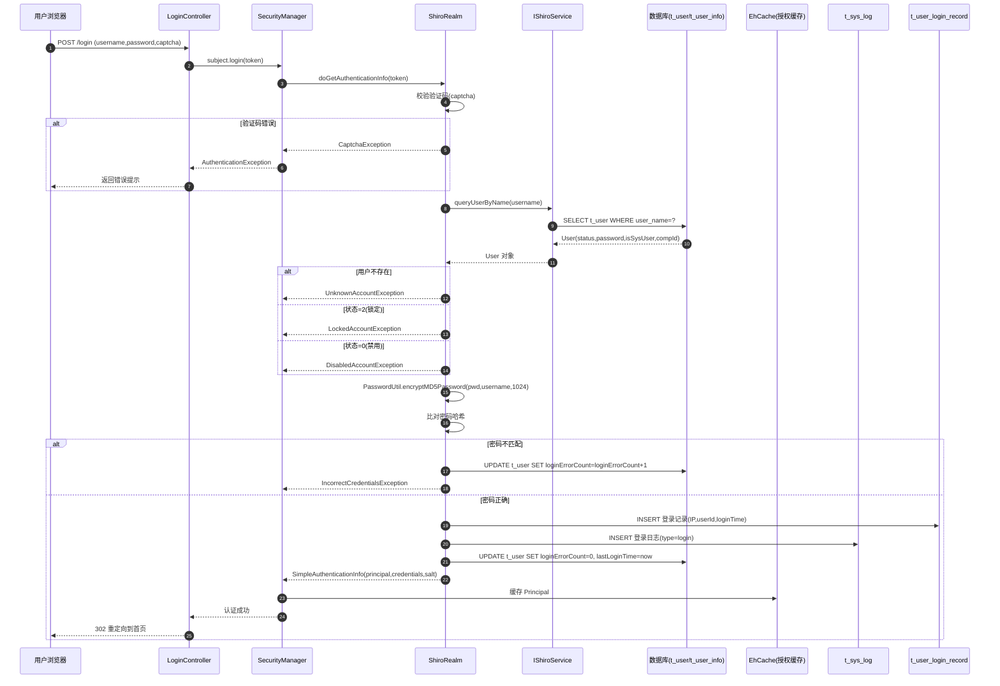

### 1.2 CAS 单点登录（CasRealm）

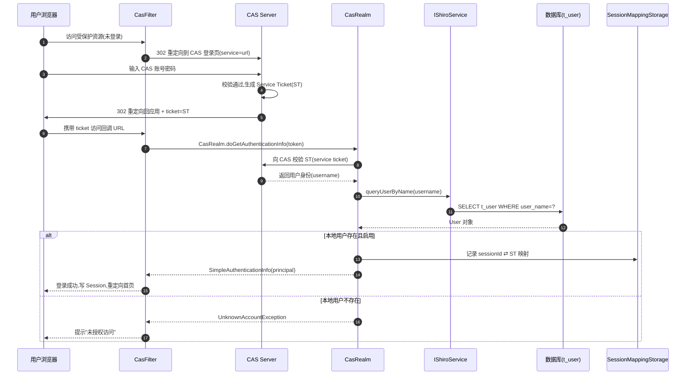

### 1.3 登录数据转换规则

| 输入字段 | 转换规则 | 输出字段 | 落库表 |
|----------|----------|----------|--------|
| `username` | 直接使用 | `user_name` | t_user |
| `password` | MD5(username + password) 迭代 1024 次 | `password` | t_user（仅比对，不存储明文） |
| `captcha` | 与 Session 中 `captcha` 比对 | — | — |
| 客户端 IP | 从 `request.getRemoteAddr()` | `login_ip` | t_user_login_record |
| 当前时间 | `new Date()` | `login_time` | t_user_login_record |
| `isSysUser` | 1→compId=-1（全公司）；0→自身 compId | `compId` | Principal |

### 1.4 登录异常处理路径

| 异常类型 | 触发条件 | 用户提示 | 数据副作用 |
|----------|----------|----------|------------|
| `CaptchaException` | 验证码错误或过期 | "验证码错误" | 无 |
| `UnknownAccountException` | 用户名不存在 | "用户名或密码错误" | 无（不暴露用户是否存在） |
| `LockedAccountException` | t_user.status=2 | "账号已锁定，请联系管理员" | 无 |
| `DisabledAccountException` | t_user.status=0 | "账号已禁用" | 无 |
| `IncorrectCredentialsException` | 密码比对失败 | "用户名或密码错误" | loginErrorCount+1 |
| `ExcessiveAttemptsException` | 失败次数超阈值 | "登录失败次数过多，请稍后再试" | 锁定账号 |

---

## 2. 权限校验数据流

### 2.1 授权信息加载流程

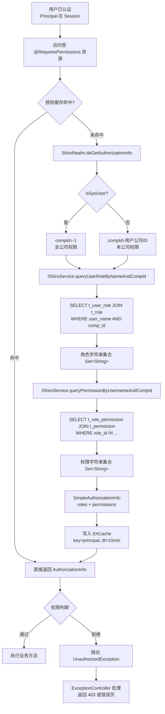

### 2.2 权限字符串格式

| 权限类型 | 格式 | 示例 | 含义 |
|----------|------|------|------|
| 菜单权限 | `menu:menuCode` | `menu:user-mgmt` | 访问某菜单页面 |
| 操作权限 | `module:action` | `user:create`、`user:delete` | 模块操作权限 |
| 角色 | `ROLE_XXX` | `ROLE_ADMIN`、`ROLE_SM` | 角色标识（角色字符串） |

### 2.3 公司隔离规则

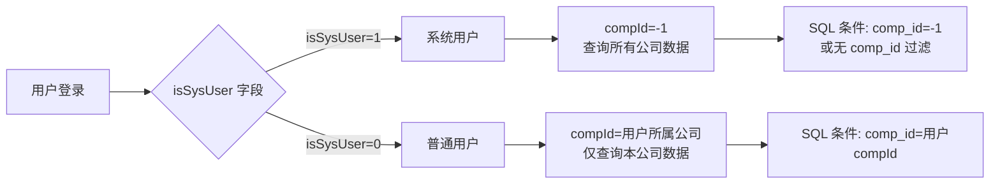

> **避坑**：`isSysUser` 字段决定数据范围，新增业务表必须包含 `comp_id` 字段以支持公司隔离，否则系统用户与普通用户看到的数据相同。

---

## 3. 菜单加载数据流

### 3.1 菜单渲染流程

```mermaid
sequenceDiagram
    autonumber
    participant U as 用户浏览器
    participant LMT as LeftMenuTag
    participant SS as IShiroService
    participant MU as MenuUtil
    participant DB as 数据库(t_menu/t_role_menu)
    participant EH as EhCache

    U->>LMT: 加载首页(含 leftMenu 标签)
    LMT->>SS: queryUserMenuByUsername(username)
    SS->>DB: SELECT t_menu JOIN t_role_menu<br/>JOIN t_user_role WHERE user_name=?
    DB-->>SS: List&lt;Menu&gt;(扁平结构)
    SS-->>LMT: 用户菜单列表
    LMT->>MU: buildMenuTree(扁平列表)
    MU->>MU: 按 parentId 递归构建树
    MU->>MU: 按 sortOrder 排序
    MU-->>LMT: 菜单树根节点列表
    LMT->>LMT: 渲染 HTML(ul/li 嵌套)
    LMT-->>U: 返回带菜单的页面 HTML
```

### 3.2 菜单数据结构转换

**数据库扁平结构 → 内存树结构**：

```
数据库 t_menu（扁平）:
  menuId | parentId | menuName | menuUrl | sortOrder | menuType
  1      | 0        | 系统管理  | #       | 1         | 1
  11     | 1        | 用户管理  | /user   | 1         | 2
  12     | 1        | 角色管理  | /role   | 2         | 2

内存树结构（MenuUtil.buildMenuTree）:
  系统管理(menuId=1)
    ├── 用户管理(menuId=11)
    └── 角色管理(menuId=12)
```

| 字段 | 来源 | 用途 |
|------|------|------|
| `menuId` | t_menu.menu_id | 唯一标识 |
| `parentId` | t_menu.parent_id | 构建父子关系，0=根 |
| `menuName` | t_menu.menu_name | 显示文本 |
| `menuUrl` | t_menu.menu_url | 点击跳转 URL |
| `sortOrder` | t_menu.sort_order | 同级排序 |
| `menuType` | t_menu.menu_type | 1=目录 2=菜单 3=按钮 |

### 3.3 菜单权限过滤规则

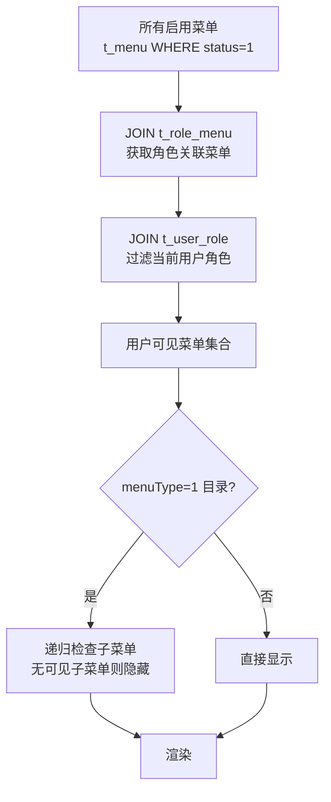

> **避坑**：菜单数据每次页面加载都会查询数据库（无缓存），高并发场景建议在 `LeftMenuTag` 中加入 Session 级缓存，避免重复查询。

---

## 4. 数据字典加载数据流

### 4.1 字典加载流程

```mermaid
sequenceDiagram
    autonumber
    participant JSP as JSP 页面
    participant DS as IDictionaryService
    participant DM as DictionaryMapper
    participant DB as 数据库(t_dictionary/t_dictionary_type)
    participant SC as SystemConfig

    JSP->>DS: selectByDicTypeId(dicTypeId)
    DS->>DM: selectByDicTypeId
    DM->>DB: SELECT t_dictionary WHERE dic_type_id=? AND status=1 ORDER BY sort_order
    DB-->>DM: List&lt;Dictionary&gt;
    DM-->>DS: 字典项列表
    DS-->>JSP: 字典数据
    JSP->>JSP: 渲染下拉框/单选/多选
```

### 4.2 字典数据结构

```
t_dictionary_type（字典类型）:
  dicTypeId | dicTypeName | dicTypeCode
  1         | 性别        | gender
  2         | 项目状态    | projectState

t_dictionary（字典项）:
  dicId | dicTypeId | dicName | dicValue | sortOrder | status
  101   | 1         | 男      | 1        | 1         | 1
  102   | 1         | 女      | 2        | 2         | 1
  201   | 2         | 待启动  | 10       | 1         | 1
  202   | 2         | 进行中  | 30       | 2         | 1
```

### 4.3 字典加载场景

| 场景 | 触发时机 | 加载方式 | 性能影响 |
|------|----------|----------|----------|
| 表单下拉框 | 页面渲染 | 同步查询 | 每个下拉框一次 DB 查询 |
| 列表翻译 | 数据展示 | Service 层批量翻译 | 一次查询翻译全部 |
| 系统参数 | 应用启动 | SystemConfig 一次性加载 | 启动时加载，运行时读内存 |

> **避坑**：`t_dictionary` 查询无缓存，列表页含多个字典字段时会产生 N+1 查询问题。建议在 Service 层增加 Map 缓存或使用 `selectByDicTypeId` 批量预加载。

---

## 5. 多数据源切换数据流

### 5.1 注解驱动的数据源切换

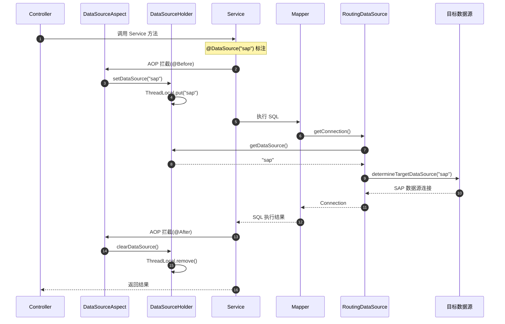

### 5.2 数据源切换规则

| 注解位置 | 作用范围 | 优先级 | 示例 |
|----------|----------|--------|------|
| 类级 `@DataSource("sap")` | 类所有方法 | 低 | 整个 Service 走 SAP 库 |
| 方法级 `@DataSource("d365")` | 单个方法 | 高（覆盖类级） | 单个方法走 D365 库 |
| 无注解 | 默认数据源 | — | 走 `defaultTargetDataSource`（mysql） |

### 5.3 线程池场景的上下文传递

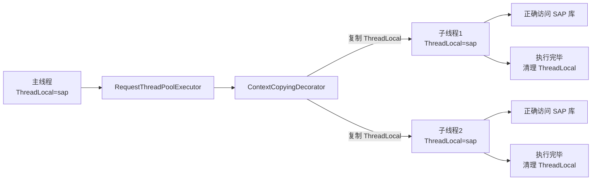

> **避坑**：异步任务必须使用 `ContextCopyingDecorator.decorate(runnable)` 包装，否则子线程 ThreadLocal 为空，会回退到默认数据源，导致查错库。

---

## 6. 操作日志写入数据流

### 6.1 AOP 自动日志流程

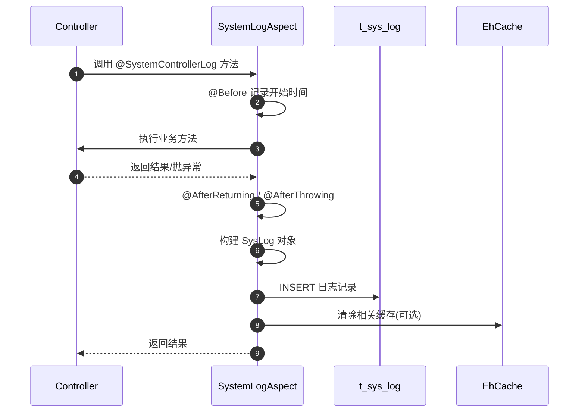

### 6.2 日志字段映射

| SysLog 字段 | 数据来源 | 说明 |
|-------------|----------|------|
| `description` | `@SystemControllerLog.description` | 注解描述 |
| `method` | `joinPoint.getSignature()` | 方法签名 |
| `params` | `joinPoint.getArgs()` 序列化 | 入参 JSON |
| `result` | 返回值序列化 | 出参 JSON（成功时） |
| `exception` | 异常堆栈 | 失败时记录 |
| `userId` | Principal | 当前用户 ID |
| `userName` | Principal | 当前用户名 |
| `ip` | request.getRemoteAddr | 客户端 IP |
| `operationTime` | System.currentTimeMillis | 操作时间戳 |
| `costTime` | 结束-开始 | 耗时(ms) |

---

## 7. 文件上传数据流

### 7.1 上传流程

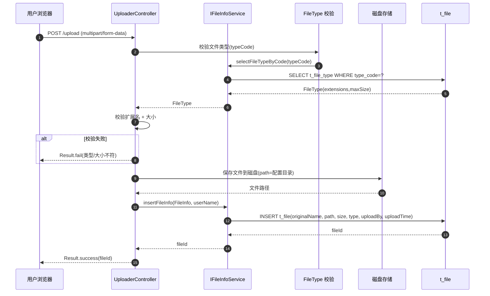

### 7.2 文件下载流程

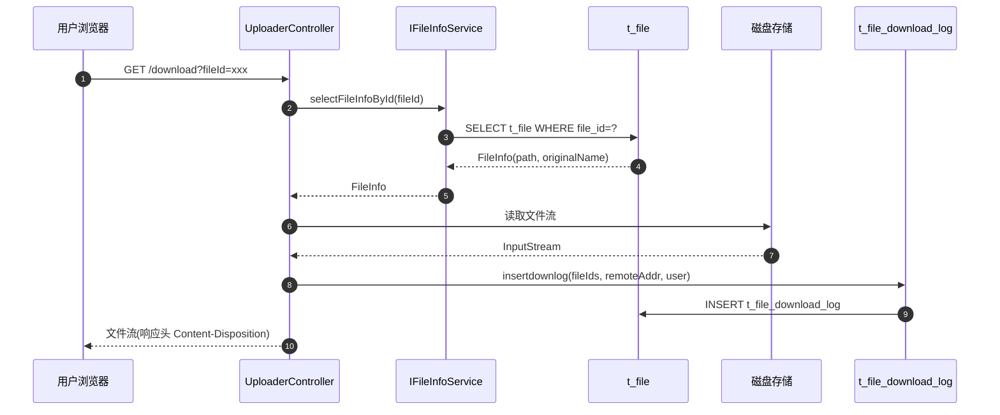

---

## 8. 定时任务数据流

### 8.1 邮件发送任务（MailerJob）

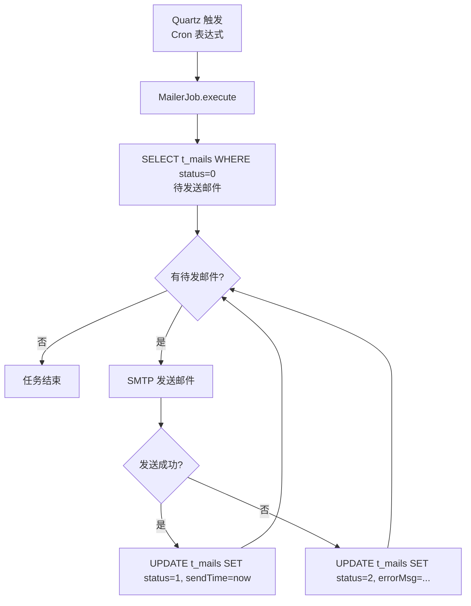

### 8.2 数据同步任务（SynchronizeJob）

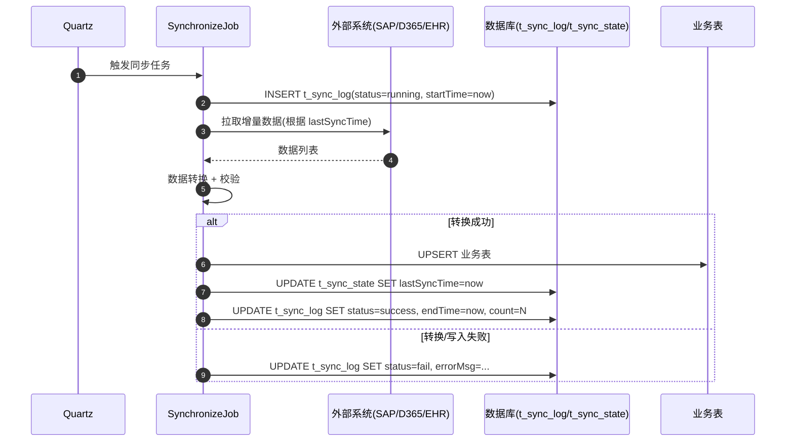

### 8.3 同步状态机

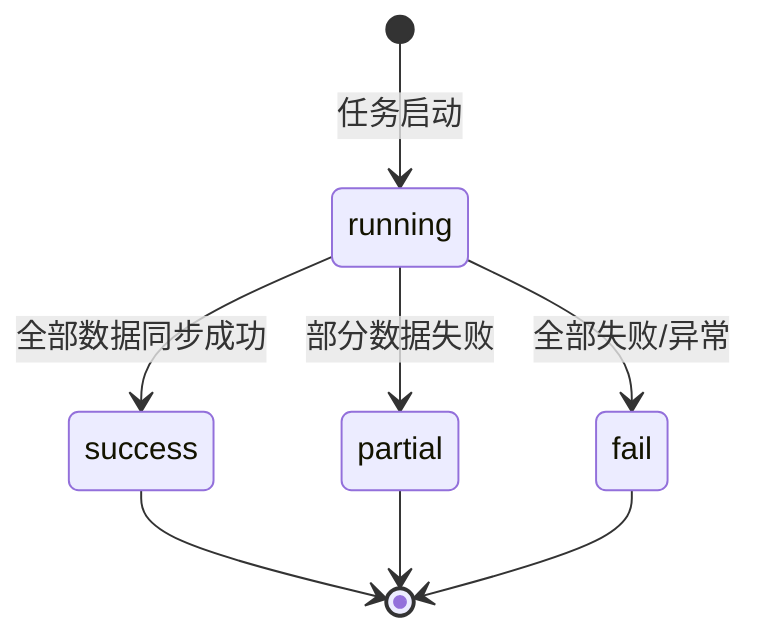

---

## 9. 系统启动初始化数据流

### 9.1 启动加载流程

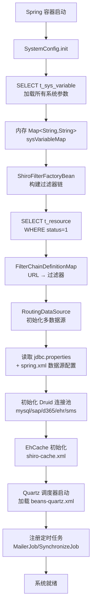

### 9.2 启动加载的关键数据

| 组件 | 数据来源 | 加载时机 | 缓存位置 |
|------|----------|----------|----------|
| SystemConfig | t_sys_variable | 应用启动（一次） | 内存 Map |
| Shiro 过滤器链 | t_resource | 应用启动（一次） | FilterChainDefinitionMap |
| 多数据源 | jdbc.properties + spring.xml | 应用启动（一次） | RoutingDataSource |
| EhCache 配置 | ehcache.xml | 应用启动（一次） | CacheManager |
| Quartz 任务 | beans-quartz.xml | 应用启动（一次） | Scheduler |

> **避坑**：`t_resource` 表变更后必须重启应用才能生效（无热加载），生产环境调整 URL 权限需规划重启窗口。

---

## 10. 异步请求上下文传递数据流

### 10.1 异步任务执行流程

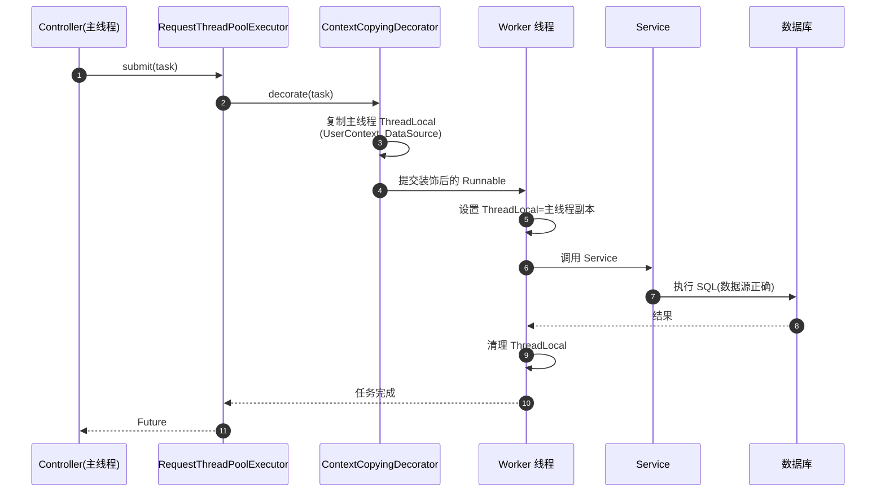

### 10.2 上下文传递的关键字段

| ThreadLocal 字段 | 来源 | 用途 |
|------------------|------|------|
| `UserContext` | Session | 用户身份、权限、公司 |
| `DataSourceHolder.dataSource` | `@DataSource` 注解 | 数据源路由 |
| `RequestAttributes` | RequestContext | 请求属性 |
| `Locale` | Request | 国际化语言 |

> **避坑**：未使用 `ContextCopyingDecorator` 的普通线程池（如 `Executors.newFixedThreadPool`）无法传递上下文，子线程会丢失用户身份和数据源，导致权限校验失败或查错库。

---

## 11. 数据流异常处理汇总

### 11.1 异常处理链路

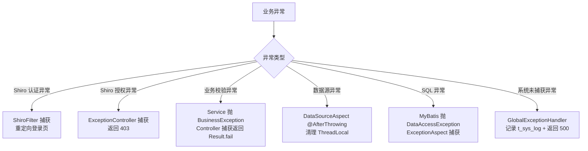

### 11.2 异常处理优先级

| 优先级 | 处理器 | 异常类型 | 处理方式 |
|--------|--------|----------|----------|
| 1 | ShiroFilter | AuthenticationException | 重定向登录页 |
| 2 | ExceptionController | UnauthorizedException | 返回 403 页面 |
| 3 | ExceptionAspect | DataAccessException | 记录日志 + 包装为 BusinessException |
| 4 | Controller | BusinessException | 返回 Result.fail(code, msg) |
| 5 | GlobalExceptionHandler | Throwable | 记录 t_sys_log + 返回 500 页面 |

---

## 12. 相关文档

- [CRUD 矩阵](crud-matrix.md) — 组件×表静态 CRUD 映射
- [系统架构](../01-architecture/system-architecture.md) — 分层架构与多数据源机制
- [Shiro 架构](../01-architecture/shiro-architecture.md) — 认证授权详细流程
- [多数据源](../01-architecture/multi-datasource.md) — 数据源切换原理
- [用户管理](../02-modules/user-management.md) — 用户/登录相关组件
- [菜单管理](../02-modules/menu-management.md) — 菜单树构建与渲染
- [系统日志](../02-modules/system-log.md) — 日志组件与 AOP
- [文件管理](../02-modules/file-management.md) — 文件上传下载
- [故障排查](../05-standards/troubleshooting.md) — 数据流相关故障案例
