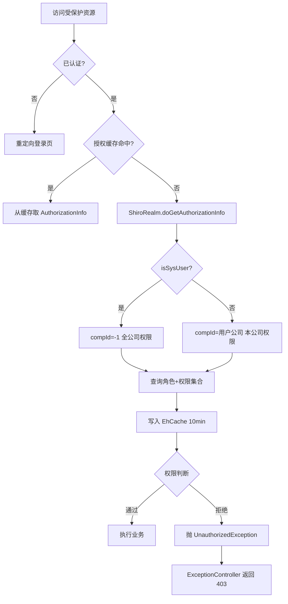
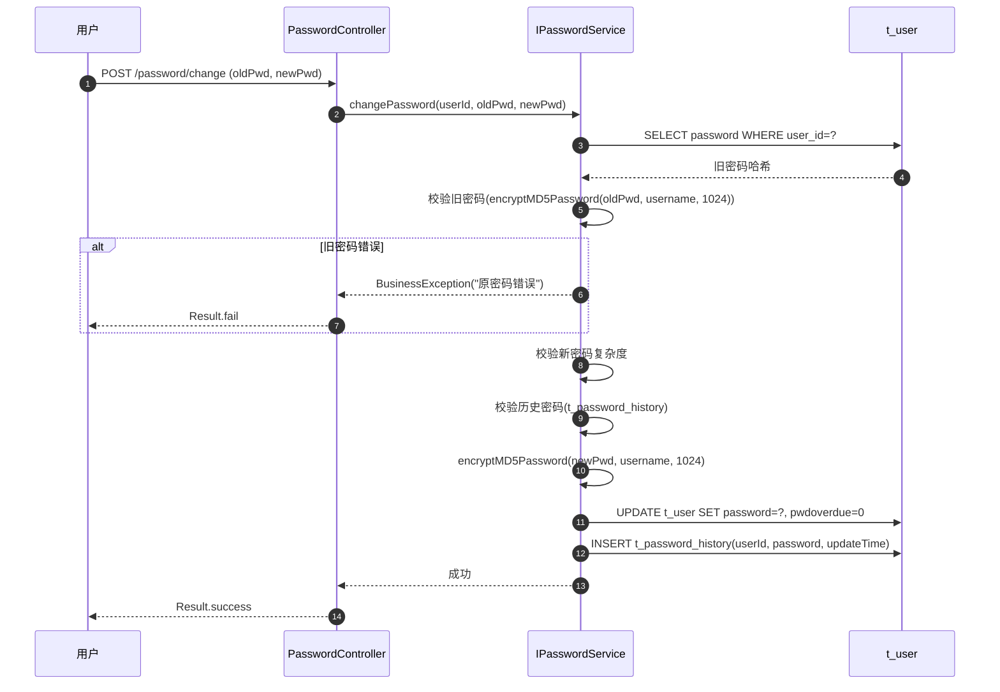
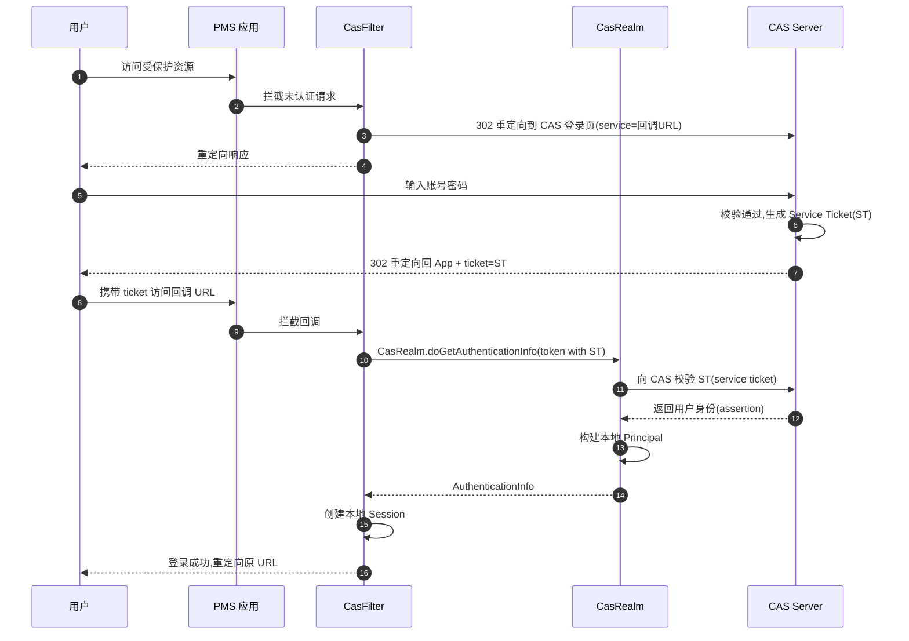
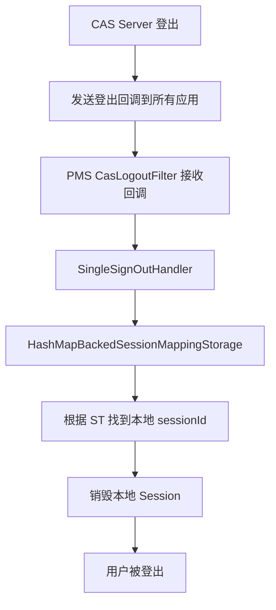
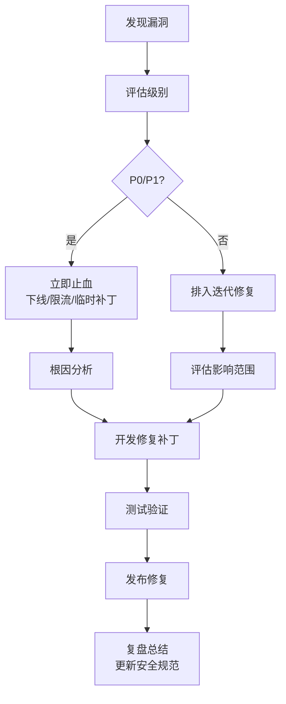

# core 模块 — 安全防护实践

> 本文档详细描述 core 模块的安全防护体系，包括 Shiro 认证授权、密码加密、CAS 单点登录、SQL 注入防护、XSS 防护、CSRF 防护、会话安全、文件上传安全与安全审计。
> core 作为框架模块，其安全机制被所有上层业务模块复用，安全配置变更需评估全局影响。

---

## 1. Shiro 认证授权安全

### 1.1 认证流程安全

core 通过 `ShiroRealm` 实现本地认证，关键安全点：

| 安全点 | 实现方式 | 配置位置 |
|--------|----------|----------|
| 验证码校验 | `UsernamePasswordCaptchaToken` + Session 比对 | `ShiroRealm.doGetAuthenticationInfo` |
| 用户状态校验 | status=0(禁用)/2(锁定) 抛对应异常 | `ShiroRealm` L80-95 |
| 密码加密比对 | MD5 + 用户名盐 + 1024 次迭代 | `PasswordUtil.encryptMD5Password` |
| 登录失败计数 | `loginErrorCount` 累加，超阈值锁定 | `ShiroRealm` + `t_user` |
| 会话固定防护 | 登录成功后调用 `subject.getSession().setAttribute` 重置 | `LoginController` |

### 1.2 授权流程安全



### 1.3 授权粒度控制

| 粒度 | 注解 | 示例 | 适用场景 |
|------|------|------|----------|
| 角色级 | `@RequiresRoles("admin")` | 仅 admin 角色可访问 | 系统管理功能 |
| 权限级 | `@RequiresPermissions("user:create")` | 拥有 user:create 权限 | 细粒度操作控制 |
| 用户级 | `@RequiresUser` | 已登录用户 | 通用登录校验 |
| 认证级 | `@RequiresAuthentication` | 已认证用户 | 强制重新认证 |

### 1.4 公司数据隔离

```java
// ShiroRealm 授权时根据 isSysUser 设置 compId
protected AuthorizationInfo doGetAuthorizationInfo(PrincipalCollection principals) {
    Principal principal = (Principal) principals.getPrimaryPrincipal();
    Integer compId;
    if (principal.getIsSysUser() != null && principal.getIsSysUser() == 1) {
        compId = -1;  // 系统用户：全公司
    } else {
        compId = principal.getCompId();  // 普通用户：本公司
    }
    Set<String> roles = shiroService.queryUserRoleByNameAndCompId(principal.getUsername(), compId);
    Set<String> permissions = shiroService.queryPermissionByUsernameAndCompId(principal.getUsername(), compId);
    SimpleAuthorizationInfo info = new SimpleAuthorizationInfo(roles);
    info.setStringPermissions(permissions);
    return info;
}
```

> **避坑**：业务 SQL 必须显式加 `comp_id` 条件，Shiro 仅控制权限字符串，不自动过滤数据。新增业务表必须包含 `comp_id` 字段。

---

## 2. 密码加密安全

### 2.1 加密算法

core 使用 `PasswordUtil.encryptMD5Password` 进行密码加密：

```java
public static String encryptMD5Password(String password, String salt, int iterations) {
    MessageDigest digest = MessageDigest.getInstance("MD5");
    String input = salt + password;  // 用户名作盐
    byte[] hash = digest.digest(input.getBytes("UTF-8"));
    for (int i = 1; i < iterations; i++) {  // 1024 次迭代
        hash = digest.digest(hash);
    }
    return Hex.encode(hash);
}
```

| 参数 | 值 | 说明 |
|------|-----|------|
| 算法 | MD5 | 基础哈希算法 |
| 盐值 | username | 用户名作盐，防止彩虹表攻击 |
| 迭代次数 | 1024 | 增加计算成本，抵御暴力破解 |
| 输出 | 32 位十六进制 | 标准十六进制字符串 |

### 2.2 密码安全策略

| 策略 | 配置项 | 默认值 | 说明 |
|------|--------|--------|------|
| 最小长度 | `sys.password.minLength` | 8 | 至少 8 位 |
| 复杂度 | `sys.password.complexity` | 中 | 大小写+数字+特殊字符 |
| 有效期 | `sys.password.expireDays` | 90 | 90 天强制修改 |
| 历史密码 | `sys.password.historyCount` | 5 | 不能与最近 5 次相同 |
| 失败锁定 | `sys.login.maxFailCount` | 5 | 失败 5 次锁定账号 |
| 锁定时长 | `sys.login.lockMinutes` | 30 | 锁定 30 分钟 |

### 2.3 密码修改流程



### 2.4 密码重置安全

```java
// 管理员重置密码：生成随机密码 + 强制首次登录修改
public Result resetPassword(Integer userId) {
    String tempPassword = generateRandomPassword(12);  // 随机密码
    String encrypted = PasswordUtil.encryptMD5Password(tempPassword, username, 1024);
    userMapper.updatePassword(userId, encrypted);
    userMapper.updateNeedChangePwd(userId, true);  // 标记需修改密码
    // 记录操作日志
    sysLogService.insert(new SysLog("重置用户密码", userId));
    return Result.success(tempPassword);  // 返回临时密码给管理员
}
```

> **避坑**：重置密码后必须设置 `needChangePwd=true`，强制用户首次登录修改，避免管理员知晓用户密码。

---

## 3. CAS 单点登录安全

### 3.1 CAS 认证流程



### 3.2 CAS 安全配置

| 配置项 | 说明 | 安全建议 |
|--------|------|----------|
| `casServerUrlPrefix` | CAS Server 地址 | 使用 HTTPS |
| `casService` | 本应用回调地址 | 必须与注册的 service 一致 |
| `casServerLoginUrl` | CAS 登录地址 | 使用 HTTPS |
| `casServerLogoutUrl` | CAS 登出地址 | 配置单点登出 |
| `singleSignOutEnabled` | 启用单点登出 | true |

### 3.3 单点登出安全



> **避坑**：`HashMapBackedSessionMappingStorage` 是内存存储，集群部署时单点登出只能在当前节点生效。生产环境需替换为 Redis 共享存储：

```java
// 集群方案：自定义 RedisBackedSessionMappingStorage
public class RedisBackedSessionMappingStorage implements SessionMappingStorage {
    @Override
    public void addSessionById(String token, HttpSession session) {
        redisTemplate.opsForValue().set("cas:session:" + token, session.getId(), 30, TimeUnit.MINUTES);
    }

    @Override
    public void removeBySessionById(String sessionId) {
        // 根据 sessionId 找到 token 并删除
    }
}
```

### 3.4 CAS 票据安全

| 票据类型 | 有效期 | 用途 | 安全要求 |
|----------|--------|------|----------|
| TGT (Ticket Granting Ticket) | 2-8 小时 | CAS Server 上的会话 | 仅存于 CAS Server |
| ST (Service Ticket) | 10 秒 | 单次访问应用的凭证 | 一次性使用，HTTPS 传输 |
| PT (Proxy Ticket) | 10 秒 | 代理应用访问 | 仅代理场景使用 |

---

## 4. SQL 注入防护

### 4.1 MyBatis 参数化查询

core 使用 MyBatis，所有 SQL 默认使用 `#{}` 参数化，防止 SQL 注入：

```xml
<!-- 正确：#{} 参数化，防注入 -->
<select id="selectByName" parameterType="string" resultMap="BaseResultMap">
    SELECT * FROM t_user WHERE user_name = #{userName}
</select>

<!-- 错误：${} 字符串拼接，有注入风险 -->
<select id="selectByName" parameterType="string" resultMap="BaseResultMap">
    SELECT * FROM t_user WHERE user_name = '${userName}'
</select>
```

### 4.2 `${}` 安全使用场景

`${}` 仅用于动态表名、列名、ORDER BY 等无法参数化的场景，且必须做白名单校验：

```java
// 安全：动态表名 + 白名单校验
public List<Map<String, Object>> queryByTable(String tableName, Map<String, Object> params) {
    if (!ALLOWED_TABLES.contains(tableName)) {  // 白名单校验
        throw new IllegalArgumentException("非法表名: " + tableName);
    }
    return dataOperationMapper.selectByTable(tableName, params);
}

private static final Set<String> ALLOWED_TABLES = new HashSet<>(Arrays.asList(
    "t_user", "t_role", "t_menu", "t_dictionary"
));
```

### 4.3 LIKE 查询防注入

```xml
<!-- 错误：直接拼接，有注入风险 -->
<select id="searchByName">
    SELECT * FROM t_user WHERE user_name LIKE '%${keyword}%'
</select>

<!-- 正确：使用 CONCAT 函数 -->
<select id="searchByName">
    SELECT * FROM t_user WHERE user_name LIKE CONCAT('%', #{keyword}, '%')
</select>
```

### 4.4 IN 查询防注入

```xml
<!-- 正确：使用 foreach -->
<select id="selectByIds" resultMap="BaseResultMap">
    SELECT * FROM t_user WHERE user_id IN
    <foreach collection="ids" item="id" open="(" close=")" separator=",">
        #{id}
    </foreach>
</select>
```

### 4.5 动态 SQL 安全

```xml
<!-- 安全：使用 OGNL 表达式判断，不拼接用户输入 -->
<select id="selectBySelective" resultMap="BaseResultMap">
    SELECT * FROM t_user
    <where>
        <if test="userName != null and userName != ''">
            AND user_name = #{userName}
        </if>
        <if test="status != null">
            AND status = #{status}
        </if>
    </where>
</select>
```

---

## 5. XSS 防护

### 5.1 输入过滤

core 通过 Spring MVC 的 `@InitBinder` 进行输入过滤：

```java
@ControllerAdvice
public class GlobalBindingInitializer {
    @InitBinder
    public void initBinder(WebDataBinder binder) {
        // 注册 XSS 过滤编辑器
        binder.registerCustomEditor(String.class, new StringTrimmerEditor(true) {
            @Override
            public void setAsText(String text) {
                super.setAsText(XssUtil.clean(text));  // HTML 清理
            }
        });
    }
}
```

### 5.2 输出编码

JSP 页面使用 `<c:out>` 标签进行 HTML 编码：

```jsp
<!-- 正确：使用 c:out 编码 -->
<c:out value="${user.userName}"/>

<!-- 错误：直接输出，有 XSS 风险 -->
${user.userName}
```

### 5.3 富文本处理

富文本字段（如技术公告内容）使用 HTML Cleaner 清理危险标签：

```java
public class XssUtil {
    private static final Set<String> DANGEROUS_TAGS = new HashSet<>(Arrays.asList(
        "script", "iframe", "object", "embed", "applet", "meta", "link", "style"
    ));

    private static final Set<String> DANGEROUS_ATTRS = new HashSet<>(Arrays.asList(
        "onerror", "onclick", "onload", "onmouseover", "onmouseout", "onfocus", "onblur"
    ));

    public static String clean(String html) {
        // 1. 移除危险标签
        // 2. 移除危险属性
        // 3. 移除 javascript: 协议
        // 4. 保留安全 HTML 标签
    }
}
```

### 5.4 XSS 防护策略表

| 字段类型 | 防护策略 | 实现方式 |
|----------|----------|----------|
| 普通文本 | HTML 编码 | `<c:out>` 或 `HtmlUtils.htmlEscape` |
| 富文本 | HTML 清理 | `XssUtil.clean` 移除危险标签 |
| URL | URL 编码 + 白名单协议 | 校验 `http://`、`https://` 开头 |
| JSON | JSON 编码 | `JsonSerializer` 转义特殊字符 |
| 数字 | 类型校验 | `Integer.parseInt` / `Double.parseDouble` |

---

## 6. CSRF 防护

### 6.1 Token 机制

core 通过 Shiro 的 CSRF 过滤器或自定义 Token 校验：

```java
@Controller
public class BaseController {
    @ModelAttribute
    public void generateCsrfToken(Model model, HttpServletRequest request) {
        HttpSession session = request.getSession();
        String token = (String) session.getAttribute("CSRF_TOKEN");
        if (token == null) {
            token = UUID.randomUUID().toString();
            session.setAttribute("CSRF_TOKEN", token);
        }
        model.addAttribute("csrfToken", token);
    }

    protected void validateCsrfToken(HttpServletRequest request) {
        String sessionToken = (String) request.getSession().getAttribute("CSRF_TOKEN");
        String requestToken = request.getParameter("csrfToken");
        if (sessionToken == null || !sessionToken.equals(requestToken)) {
            throw new BusinessException("CSRF 校验失败");
        }
    }
}
```

### 6.2 表单嵌入

```jsp
<form action="/user/save" method="post">
    <input type="hidden" name="csrfToken" value="${csrfToken}"/>
    <!-- 其他字段 -->
</form>
```

### 6.3 AJAX 请求

```javascript
// 在请求头中携带 CSRF Token
$.ajaxSetup({
    beforeSend: function(xhr) {
        xhr.setRequestHeader('X-CSRF-Token', '${csrfToken}');
    }
});
```

### 6.4 SameSite Cookie

```java
// Spring Session 配置 SameSite
@Bean
public CookieSerializer cookieSerializer() {
    DefaultCookieSerializer serializer = new DefaultCookieSerializer();
    serializer.setSameSite("Lax");  // 或 Strict
    return serializer;
}
```

---

## 7. 会话安全

### 7.1 会话配置

| 配置项 | 值 | 说明 |
|--------|-----|------|
| 会话超时 | 30min | `session.setTimeout(1800000)` |
| 会话缓存 | EhCache | `shiro-activeSessionCache` |
| 会话 ID 生成 | Java UUID | 防止猜测 |
| Cookie HttpOnly | true | 防止 JS 读取 |
| Cookie Secure | HTTPS 时 true | 仅 HTTPS 传输 |

### 7.2 会话固定防护

```java
// 登录成功后重置 Session，防止会话固定攻击
public Result login(UsernamePasswordCaptchaToken token) {
    Subject subject = SecurityUtils.getSubject();
    Session oldSession = subject.getSession(false);
    if (oldSession != null) {
        // 保留必要属性
        Object captcha = oldSession.getAttribute("captcha");
        oldSession.stop();  // 销毁旧会话
    }
    subject.login(token);
    Session newSession = subject.getSession();
    // 新会话 ID 已自动生成
    return Result.success();
}
```

### 7.3 并发登录控制

```xml
<!-- spring-shiro.xml 配置并发登录控制 -->
<bean id="sessionValidationScheduler" class="org.apache.shiro.session.mgt.ExecutorServiceSessionValidationScheduler">
    <property name="interval" value="60000"/>  <!-- 每分钟校验一次 -->
</bean>

<bean id="sessionManager" class="org.apache.shiro.web.session.mgt.DefaultWebSessionManager">
    <property name="sessionDAO" ref="sessionDAO"/>
    <property name="sessionValidationScheduler" ref="sessionValidationScheduler"/>
    <property name="globalSessionTimeout" value="1800000"/>
</bean>
```

### 7.4 会话审计

```java
// 监听会话事件，记录登录/登出日志
public class SessionEventListener implements SessionListener {
    @Override
    public void onStart(Session session) {
        // 记录登录日志
        SysLog log = new SysLog();
        log.setDescription("会话创建");
        log.setSessionId(session.getId().toString());
        sysLogService.insert(log);
    }

    @Override
    public void onStop(Session session) {
        // 记录登出日志
    }

    @Override
    public void onExpiration(Session session) {
        // 记录会话过期
    }
}
```

---

## 8. 文件上传安全

### 8.1 文件类型白名单

```java
public class FileTypeValidator {
    private static final Map<String, Set<String>> ALLOWED_EXTENSIONS = new HashMap<>();

    static {
        ALLOWED_EXTENSIONS.put("image", new HashSet<>(Arrays.asList("jpg", "jpeg", "png", "gif", "bmp")));
        ALLOWED_EXTENSIONS.put("document", new HashSet<>(Arrays.asList("pdf", "doc", "docx", "xls", "xlsx", "ppt", "pptx")));
        ALLOWED_EXTENSIONS.put("archive", new HashSet<>(Arrays.asList("zip", "rar", "7z")));
    }

    public static boolean validate(String typeCode, String filename) {
        String ext = FilenameUtils.getExtension(filename).toLowerCase();
        Set<String> allowed = ALLOWED_EXTENSIONS.get(typeCode);
        return allowed != null && allowed.contains(ext);
    }
}
```

### 8.2 文件大小限制

```properties
# jdbc.properties 或 sys_variable
sys.upload.maxSize=10485760  # 10MB
sys.upload.imageMaxSize=5242880  # 5MB
```

### 8.3 文件存储安全

```java
// 安全：重命名文件，避免使用用户原始文件名
public String storeFile(MultipartFile file, String typeCode) {
    String originalName = file.getOriginalFilename();
    String ext = FilenameUtils.getExtension(originalName).toLowerCase();

    // 1. 校验类型
    if (!FileTypeValidator.validate(typeCode, originalName)) {
        throw new BusinessException("文件类型不支持");
    }

    // 2. 校验大小
    if (file.getSize() > getMaxSize(typeCode)) {
        throw new BusinessException("文件大小超限");
    }

    // 3. 生成安全文件名（UUID + 扩展名）
    String safeName = UUID.randomUUID().toString() + "." + ext;

    // 4. 存储到非 Web 目录（防止直接访问）
    String storagePath = "/data/uploads/" + typeCode + "/" + safeName;
    file.transferTo(new File(storagePath));

    return safeName;
}
```

### 8.4 文件下载安全

```java
// 安全：校验权限 + 防止路径穿越
public ResponseEntity<Resource> download(Integer fileId, HttpServletRequest request) {
    // 1. 校验文件权限
    FileInfo fileInfo = fileInfoService.selectFileInfoById(fileId);
    if (fileInfo == null) {
        throw new BusinessException("文件不存在");
    }

    // 2. 防止路径穿越
    String filePath = fileInfo.getPath();
    if (filePath.contains("..") || filePath.contains("%2e%2e")) {
        throw new BusinessException("非法文件路径");
    }

    // 3. 记录下载日志
    fileInfoService.insertdownlog(fileId.toString(), request.getRemoteAddr(), getCurrentUsername());

    // 4. 返回文件流
    Resource resource = new FileSystemResource(filePath);
    return ResponseEntity.ok()
        .header(HttpHeaders.CONTENT_DISPOSITION, "attachment; filename=\"" + fileInfo.getOriginalName() + "\"")
        .body(resource);
}
```

---

## 9. 安全审计

### 9.1 操作日志审计

core 通过 `SystemLogAspect` AOP 自动记录操作日志：

```java
@Aspect
@Component
public class SystemLogAspect {
    @AfterReturning(pointcut = "@annotation(log)", returning = "result")
    public void afterReturning(JoinPoint joinPoint, SystemControllerLog log, Object result) {
        SysLog sysLog = new SysLog();
        sysLog.setDescription(log.description());
        sysLog.setMethod(joinPoint.getSignature().getDeclaringTypeName() + "." + joinPoint.getSignature().getName());
        sysLog.setParams(JSON.toJSONString(joinPoint.getArgs()));
        sysLog.setUserId(getCurrentUserId());
        sysLog.setUserName(getCurrentUsername());
        sysLog.setIp(getClientIp());
        sysLog.setOperationTime(new Date());
        sysLog.setResult(JSON.toJSONString(result));
        sysLogService.insert(sysLog);
    }

    @AfterThrowing(pointcut = "@annotation(log)", throwing = "ex")
    public void afterThrowing(JoinPoint joinPoint, SystemControllerLog log, Exception ex) {
        SysLog sysLog = new SysLog();
        sysLog.setDescription(log.description() + " [异常]");
        sysLog.setException(ExceptionUtils.getStackTrace(ex));
        // ... 其他字段
        sysLogService.insert(sysLog);
    }
}
```

### 9.2 审计日志字段

| 字段 | 说明 | 用途 |
|------|------|------|
| `description` | 操作描述 | 业务行为 |
| `method` | 方法签名 | 定位代码 |
| `params` | 入参 JSON | 操作参数 |
| `result` | 返回值 JSON | 操作结果 |
| `exception` | 异常堆栈 | 失败原因 |
| `userId` | 用户 ID | 责任人 |
| `userName` | 用户名 | 责任人 |
| `ip` | 客户端 IP | 来源 |
| `operationTime` | 操作时间 | 时间线 |
| `costTime` | 耗时(ms) | 性能分析 |

### 9.3 敏感操作审计清单

| 操作类型 | 审计要求 | 日志保留 |
|----------|----------|----------|
| 用户登录/登出 | 必须记录 | 1 年 |
| 密码修改/重置 | 必须记录 | 2 年 |
| 用户创建/删除 | 必须记录 | 2 年 |
| 角色权限变更 | 必须记录 | 2 年 |
| 数据导出 | 必须记录 | 1 年 |
| 文件上传/下载 | 必须记录 | 1 年 |
| 系统参数修改 | 必须记录 | 2 年 |
| 普通业务操作 | 按需记录 | 6 个月 |

### 9.4 日志安全存储

```java
// 日志表 t_sys_log 设计要点
// 1. 日志一旦写入不允许修改/删除（应用层不提供 update 接口）
// 2. 定期归档到历史表，避免主表过大影响查询
// 3. 日志表加索引：operation_time, user_id, method
// 4. 敏感字段（如密码）脱敏后记录
public String desensitize(String params) {
    // 移除 password、oldPwd、newPwd 等字段
    return params.replaceAll("\"(password|oldPwd|newPwd)\"\\s*:\\s*\"[^\"]*\"", "\"$1\":\"***\"");
}
```

---

## 10. 安全配置检查清单

### 10.1 开发阶段检查

- [ ] 所有 SQL 使用 `#{}` 参数化，`${}` 需白名单校验
- [ ] 用户输入经过 XSS 过滤（`XssUtil.clean`）
- [ ] 富文本字段使用 HTML Cleaner 清理危险标签
- [ ] 表单包含 CSRF Token
- [ ] 文件上传校验类型、大小、重命名
- [ ] 文件下载校验权限、防路径穿越
- [ ] 敏感操作加 `@SystemControllerLog` 审计
- [ ] 密码字段脱敏后记录日志
- [ ] 异常信息不暴露给前端（统一包装为友好提示）

### 10.2 上线前检查

- [ ] CAS 配置使用 HTTPS
- [ ] Cookie 配置 HttpOnly + Secure
- [ ] 会话超时设置合理（30min）
- [ ] 密码策略配置生效（长度、复杂度、有效期）
- [ ] 登录失败锁定配置生效
- [ ] Druid 监控页面配置密码保护
- [ ] 错误页面不暴露堆栈信息
- [ ] HTTP 响应头配置安全头（X-Frame-Options、X-Content-Type-Options）

### 10.3 运维阶段检查

- [ ] 定期审计操作日志（每周）
- [ ] 定期检查异常登录（异地、非工作时间）
- [ ] 定期清理过期会话
- [ ] 定期更新密码策略（根据安全要求）
- [ ] 定期评估权限分配合理性
- [ ] 定期备份审计日志

### 10.4 安全响应头配置

```xml
<!-- web.xml 配置安全响应头 -->
<filter>
    <filter-name>securityHeadersFilter</filter-name>
    <filter-class>com.dp.plat.core.filter.SecurityHeadersFilter</filter-class>
</filter>

<!-- SecurityHeadersFilter 实现 -->
public class SecurityHeadersFilter implements Filter {
    @Override
    public void doFilter(ServletRequest req, ServletResponse res, FilterChain chain) {
        HttpServletResponse response = (HttpServletResponse) res;
        response.setHeader("X-Frame-Options", "SAMEORIGIN");        // 防点击劫持
        response.setHeader("X-Content-Type-Options", "nosniff");     // 防 MIME 嗅探
        response.setHeader("X-XSS-Protection", "1; mode=block");     // XSS 过滤
        response.setHeader("Strict-Transport-Security", "max-age=31536000");  // HSTS
        response.setHeader("Content-Security-Policy", "default-src 'self'");   // CSP
        chain.doFilter(req, res);
    }
}
```

---

## 11. 安全漏洞应急响应

### 11.1 漏洞分级

| 级别 | 描述 | 响应时间 | 示例 |
|------|------|----------|------|
| P0 | 严重漏洞，可被远程利用 | 2 小时内修复 | SQL 注入、RCE |
| P1 | 高危漏洞，需特定条件 | 24 小时内修复 | XSS、CSRF、越权 |
| P2 | 中危漏洞，影响有限 | 1 周内修复 | 会话固定、信息泄露 |
| P3 | 低危漏洞，难以利用 | 1 月内修复 | 弱密码策略、日志缺失 |

### 11.2 应急响应流程



### 11.3 常见漏洞修复指引

| 漏洞类型 | 修复方案 | 验证方式 |
|----------|----------|----------|
| SQL 注入 | `${}` 改 `#{}` + 白名单 | 渗透测试 + 代码扫描 |
| XSS | 输入过滤 + 输出编码 | OWASP ZAP 扫描 |
| CSRF | 增加 Token 校验 | 手工测试 |
| 越权访问 | 增加 `@RequiresPermissions` | 权限矩阵测试 |
| 文件上传漏洞 | 类型白名单 + 重命名 | 上传恶意文件测试 |
| 会话固定 | 登录后重置 Session | 手工测试 Session ID 变化 |

---

## 12. 相关文档

- [Shiro 架构](../01-architecture/shiro-architecture.md) — 认证授权详细原理
- [Spring 配置](../01-architecture/spring-configuration.md) — Shiro/CAS 配置
- [用户管理](../02-modules/user-management.md) — 用户/密码相关组件
- [系统日志](../02-modules/system-log.md) — 审计日志组件
- [文件管理](../02-modules/file-management.md) — 文件上传下载
- [故障排查](troubleshooting.md) — 安全相关故障案例
- [PMS-security 模块](../../PMS-security/docs/02-modules/security-components.md) — 细化安全组件
