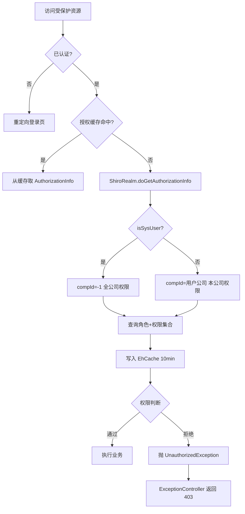
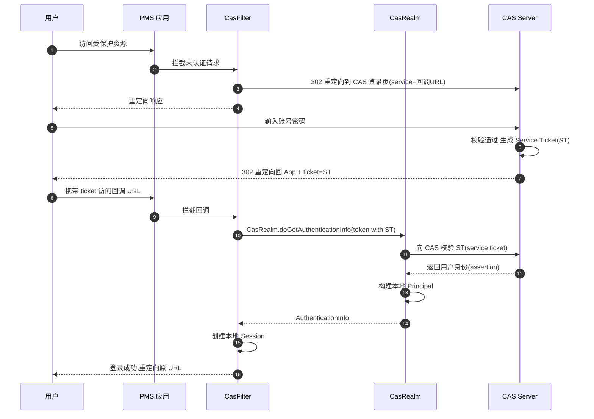
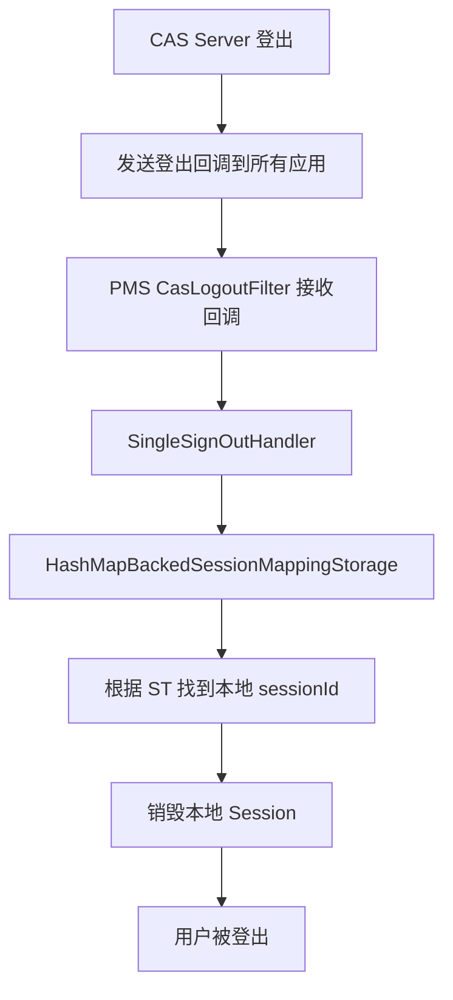
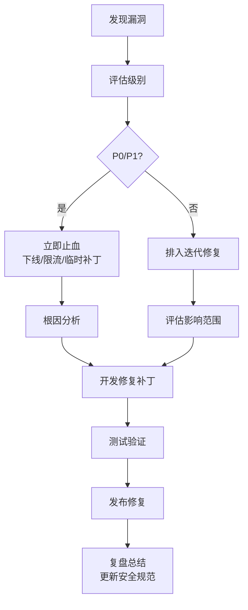

# core 模块 — 安全防护实践

> 本文档详细描述 core 模块的安全防护体系，包括 Shiro 认证授权、密码加密、CAS 单点登录、SQL 注入防护、XSS 防护、CSRF 防护、会话安全、文件上传安全与安全审计。
> core 作为框架模块，其安全机制被所有上层业务模块复用，安全配置变更需评估全局影响。

---

## 1. Shiro 认证授权安全

### 1.1 认证流程安全

core 通过 `ShiroRealm` 实现本地认证，关键安全点：

| 安全点 | 实现方式 | 配置位置 |
|--------|----------|----------|
| 验证码校验 | `UsernamePasswordCaptchaToken` + Session 比对 | `ShiroRealm.doGetAuthenticationInfo` |
| 用户状态校验 | status=0(禁用)/2(锁定) 抛对应异常 | `ShiroRealm` L80-95 |
| 密码加密比对 | MD5 + 用户名盐 + 1024 次迭代 | `PasswordUtil.encryptMD5Password` |
| 登录失败计数 | `loginErrorCount` 累加，超阈值锁定 | `ShiroRealm` + `t_user` |
| 会话固定防护 | 登录成功后调用 `subject.getSession().setAttribute` 重置 | `LoginController` |

### 1.2 授权流程安全



### 1.3 授权粒度控制

| 粒度 | 注解 | 示例 | 适用场景 |
|------|------|------|----------|
| 角色级 | `@RequiresRoles("admin")` | 仅 admin 角色可访问 | 系统管理功能 |
| 权限级 | `@RequiresPermissions("user:create")` | 拥有 user:create 权限 | 细粒度操作控制 |
| 用户级 | `@RequiresUser` | 已登录用户 | 通用登录校验 |
| 认证级 | `@RequiresAuthentication` | 已认证用户 | 强制重新认证 |

### 1.4 公司数据隔离

```java
// ShiroRealm 授权时根据 isSysUser 设置 compId
protected AuthorizationInfo doGetAuthorizationInfo(PrincipalCollection principals) {
    Principal principal = (Principal) principals.getPrimaryPrincipal();
    Integer compId;
    if (principal.getIsSysUser() != null && principal.getIsSysUser() == 1) {
        compId = -1;  // 系统用户：全公司
    } else {
        compId = principal.getCompId();  // 普通用户：本公司
    }
    Set<String> roles = shiroService.queryUserRoleByNameAndCompId(principal.getUsername(), compId);
    Set<String> permissions = shiroService.queryPermissionByUsernameAndCompId(principal.getUsername(), compId);
    SimpleAuthorizationInfo info = new SimpleAuthorizationInfo(roles);
    info.setStringPermissions(permissions);
    return info;
}
```

> **避坑**：业务 SQL 必须显式加 `comp_id` 条件，Shiro 仅控制权限字符串，不自动过滤数据。新增业务表必须包含 `comp_id` 字段。

---

## 2. 密码加密安全

### 2.1 加密算法

core 使用 `PasswordUtil.encryptMD5Password` 进行密码加密：

```java
public static String encryptMD5Password(String password, String salt, int iterations) {
    MessageDigest digest = MessageDigest.getInstance("MD5");
    String input = salt + password;  // 用户名作盐
    byte[] hash = digest.digest(input.getBytes("UTF-8"));
    for (int i = 1; i < iterations; i++) {  // 1024 次迭代
        hash = digest.digest(hash);
    }
    return Hex.encode(hash);
}
```

| 参数 | 值 | 说明 |
|------|-----|------|
| 算法 | MD5 | 基础哈希算法 |
| 盐值 | username | 用户名作盐，防止彩虹表攻击 |
| 迭代次数 | 1024 | 增加计算成本，抵御暴力破解 |
| 输出 | 32 位十六进制 | 标准十六进制字符串 |

### 2.2 密码安全策略

| 策略 | 配置项 | 默认值 | 说明 |
|------|--------|--------|------|
| 最小长度 | `sys.password.minLength` | 8 | 至少 8 位 |
| 复杂度 | `sys.password.complexity` | 中 | 大小写+数字+特殊字符 |
| 有效期 | `sys.password.expireDays` | 90 | 90 天强制修改 |
| 历史密码 | `sys.password.historyCount` | 5 | 不能与最近 5 次相同 |
| 失败锁定 | `sys.login.maxFailCount` | 5 | 失败 5 次锁定账号 |
| 锁定时长 | `sys.login.lockMinutes` | 30 | 锁定 30 分钟 |

### 2.3 密码修改流程


### 2.4 密码重置安全

```java
// 管理员重置密码：生成随机密码 + 强制首次登录修改
public Result resetPassword(Integer userId) {
    String tempPassword = generateRandomPassword(12);  // 随机密码
    String encrypted = PasswordUtil.encryptMD5Password(tempPassword, username, 1024);
    userMapper.updatePassword(userId, encrypted);
    userMapper.updateNeedChangePwd(userId, true);  // 标记需修改密码
    // 记录操作日志
    sysLogService.insert(new SysLog("重置用户密码", userId));
    return Result.success(tempPassword);  // 返回临时密码给管理员
}
```

> **避坑**：重置密码后必须设置 `needChangePwd=true`，强制用户首次登录修改，避免管理员知晓用户密码。

---

## 3. CAS 单点登录安全

### 3.1 CAS 认证流程



### 3.2 CAS 安全配置

| 配置项 | 说明 | 安全建议 |
|--------|------|----------|
| `casServerUrlPrefix` | CAS Server 地址 | 使用 HTTPS |
| `casService` | 本应用回调地址 | 必须与注册的 service 一致 |
| `casServerLoginUrl` | CAS 登录地址 | 使用 HTTPS |
| `casServerLogoutUrl` | CAS 登出地址 | 配置单点登出 |
| `singleSignOutEnabled` | 启用单点登出 | true |

### 3.3 单点登出安全



> **避坑**：`HashMapBackedSessionMappingStorage` 是内存存储，集群部署时单点登出只能在当前节点生效。生产环境需替换为 Redis 共享存储：

```java
// 集群方案：自定义 RedisBackedSessionMappingStorage
public class RedisBackedSessionMappingStorage implements SessionMappingStorage {
    @Override
    public void addSessionById(String token, HttpSession session) {
        redisTemplate.opsForValue().set("cas:session:" + token, session.getId(), 30, TimeUnit.MINUTES);
    }

    @Override
    public void removeBySessionById(String sessionId) {
        // 根据 sessionId 找到 token 并删除
    }
}
```

### 3.4 CAS 票据安全

| 票据类型 | 有效期 | 用途 | 安全要求 |
|----------|--------|------|----------|
| TGT (Ticket Granting Ticket) | 2-8 小时 | CAS Server 上的会话 | 仅存于 CAS Server |
| ST (Service Ticket) | 10 秒 | 单次访问应用的凭证 | 一次性使用，HTTPS 传输 |
| PT (Proxy Ticket) | 10 秒 | 代理应用访问 | 仅代理场景使用 |

---

## 4. SQL 注入防护

### 4.1 MyBatis 参数化查询

core 使用 MyBatis，所有 SQL 默认使用 `#{}` 参数化，防止 SQL 注入：

```xml
<!-- 正确：#{} 参数化，防注入 -->
<select id="selectByName" parameterType="string" resultMap="BaseResultMap">
    SELECT * FROM t_user WHERE user_name = #{userName}
</select>

<!-- 错误：${} 字符串拼接，有注入风险 -->
<select id="selectByName" parameterType="string" resultMap="BaseResultMap">
    SELECT * FROM t_user WHERE user_name = '${userName}'
</select>
```

### 4.2 `${}` 安全使用场景

`${}` 仅用于动态表名、列名、ORDER BY 等无法参数化的场景，且必须做白名单校验：

```java
// 安全：动态表名 + 白名单校验
public List<Map<String, Object>> queryByTable(String tableName, Map<String, Object> params) {
    if (!ALLOWED_TABLES.contains(tableName)) {  // 白名单校验
        throw new IllegalArgumentException("非法表名: " + tableName);
    }
    return dataOperationMapper.selectByTable(tableName, params);
}

private static final Set<String> ALLOWED_TABLES = new HashSet<>(Arrays.asList(
    "t_user", "t_role", "t_menu", "t_dictionary"
));
```

### 4.3 LIKE 查询防注入

```xml
<!-- 错误：直接拼接，有注入风险 -->
<select id="searchByName">
    SELECT * FROM t_user WHERE user_name LIKE '%${keyword}%'
</select>

<!-- 正确：使用 CONCAT 函数 -->
<select id="searchByName">
    SELECT * FROM t_user WHERE user_name LIKE CONCAT('%', #{keyword}, '%')
</select>
```

### 4.4 IN 查询防注入

```xml
<!-- 正确：使用 foreach -->
<select id="selectByIds" resultMap="BaseResultMap">
    SELECT * FROM t_user WHERE user_id IN
    <foreach collection="ids" item="id" open="(" close=")" separator=",">
        #{id}
    </foreach>
</select>
```

### 4.5 动态 SQL 安全

```xml
<!-- 安全：使用 OGNL 表达式判断，不拼接用户输入 -->
<select id="selectBySelective" resultMap="BaseResultMap">
    SELECT * FROM t_user
    <where>
        <if test="userName != null and userName != ''">
            AND user_name = #{userName}
        </if>
        <if test="status != null">
            AND status = #{status}
        </if>
    </where>
</select>
```

---

## 5. XSS 防护

### 5.1 整体架构

core 通过 Servlet Filter + HttpServletRequestWrapper 模式实现 XSS 防护，组件位于 `com.dp.plat.security.xss` 包：

```
HTTP 请求
  ↓
XssFilter (Filter 接口)
  ├─ 读取 excludePattern，匹配则跳过
  └─ 包装 request 为 XssRequestBodyHttpServletRequestWrapper
        ↓
Controller 通过 getParameter/getParameterValues/getInputStream
读取已被 escapeHtml 处理的参数值
```

### 5.2 XssFilter — 入口过滤器

`XssFilter.java:15` 实现 `javax.servlet.Filter`，核心逻辑：

```java
public void doFilter(ServletRequest request, ServletResponse response, FilterChain chain)
        throws IOException, ServletException {
    String servletPath = ((HttpServletRequest) request).getServletPath();
    if (filterConfig != null) {
        String excludePattern = filterConfig.getInitParameter("excludePattern");
        if (StringUtils.isNotBlank(excludePattern) && servletPath.matches(excludePattern)) {
            chain.doFilter(request, response);  // 排除路径直通
            return;
        }
    }
    request = new XssRequestBodyHttpServletRequestWrapper((HttpServletRequest) request);
    chain.doFilter(request, response);
}
```

> **避坑**：旧版本 `XssHttpServletRequestWrapper` 和 `XssPostHttpServletRequestWrapper` 在 `XssFilter.java:37-39` 中已被注释掉，当前生效的是 `XssRequestBodyHttpServletRequestWrapper`。

### 5.3 escapeHtml 字符替换策略

四个 Wrapper 类共享相同的 `escapeHtml` 实现（自定义重写，避免 commons-text 的中文问题）：

```java
// XssHttpServletRequestWrapper.java:55-81
private String escapeHtml(String s) {
    if (s == null || s.isEmpty()) {
        return "";
    }
    StringBuilder sb = new StringBuilder("");
    for (int i = 0; i < s.length(); i++) {
        char c = s.charAt(i);
        switch (c) {
            case '>': sb.append("&gt;"); break;
            case '<': sb.append("&lt;"); break;
            case '&': sb.append('＆'); break;   // 全角＆，避免 &amp; 二次转义
            default:  sb.append(c); break;
        }
    }
    return sb.toString();
}
```

| 原字符 | 转义后 | 说明 |
|--------|--------|------|
| `>` | `&gt;` | 标准实体 |
| `<` | `&lt;` | 标准实体 |
| `&` | `＆`（U+FF06 全角） | **非标准**，避免与已有实体冲突 |
| 其他 | 不变 | 中文字符不被过滤（关键避坑点） |

> **避坑**：`&` 被替换为**全角**字符 `＆`，而非 `&amp;`。这意味着包含 `&` 的合法内容（如 URL 参数）会被破坏。如有富文本或 URL 入参，需在 Controller 层解码或单独处理。

### 5.4 四个 Wrapper 类对比

| Wrapper 类 | 继承 | 状态 | 适用场景 | 关键实现 |
|-----------|------|------|----------|----------|
| `XssHttpServletRequestWrapper` | `HttpServletRequestWrapper` | `@deprecated` | 表单 + GET，无法处理 `@RequestBody` JSON | 重写 getParameter/getParameterValues，逐字符 escapeHtml |
| `XssPostHttpServletRequestWrapper` | `HttpServletRequestWrapper` | 已弃用 | POST 表单 + JSON | 缓存 body 到 `byte[]`，重写 getInputStream 返回缓存 |
| `XssRequestBodyHttpServletRequestWrapper` | `HttpServletRequestWrapper` | **当前使用** | POST JSON + multipart 表单 | 使用 `CommonsMultipartResolver`，支持 multipart 字段过滤，`JSONValidator` 校验 |
| `XssRequestBodyHttpServletRequestWrapper1` | `HttpServletRequestWrapper` | 备用版本 | POST JSON（非 multipart） | 使用 `contentType.startsWith("multipart")` 判断，`JSON.parseObject` 重新序列化 |

### 5.5 password 字段豁免

所有 Wrapper 在 `getParameter` / `getParameterValues` 中均对 `password` 参数名豁免，返回原值：

```java
// XssHttpServletRequestWrapper.java:42-44
if ("password".equals(parameter)) {
    return value;  // 密码不转义，避免破坏加密结果
}
```

> **避坑**：如新增其他加密字段（如 `oldPwd`、`newPwd`），需同步加入豁免列表，否则 escapeHtml 会破坏加密内容。

### 5.6 multipart 表单处理

`XssRequestBodyHttpServletRequestWrapper.java:258-316` 中处理 multipart 表单：

1. 通过 `CommonsMultipartResolver.resolveMultipart(this)` 解析 multipart
2. 使用 `ServletFileUpload.parseRequest(this)` 获取 `List<FileItem>`
3. 通过 `ByteUtils.indexOf(requestBody, currentHeader)` 定位字段在 body 中的偏移
4. 仅对 `isFormField()=true` 的字段内容执行 escapeHtml
5. 重新组装 `requestBody` byte 数组

### 5.7 富文本处理

富文本字段（如邮件模板内容）使用 `JsoupUtil` + `org.jsoup.safety.Safelist` 清理：

```java
// NotifyTemplateController.java:14, 25 引用
import org.jsoup.safety.Safelist;
import com.dp.plat.core.util.JsoupUtil;
```

> 富文本字段不经过 `XssFilter`（通过 excludePattern 排除），由 Jsoup 在 Controller/Service 层按白名单清理。

---

## 6. CSRF 防护

### 6.1 组件架构

core 通过 `CsrfInterceptor`（Spring MVC 拦截器）+ `CSRFTokenManager`（Token 管理器）实现 CSRF 防护，组件位于 `com.dp.plat.security.csrf` 包：

```
HTTP 请求
  ↓
CsrfInterceptor.preHandle
  ├─ 从 Shiro Session 读取 CSRF_TOKEN_FOR_SESSION_ATTR_NAME
  ├─ 若 Session 中无 token，调用 CSRFTokenManager.getTokenForSession 生成
  └─ POST/PUT/DELETE 请求校验：
        ├─ 从 request parameter 或 header 读取 __RequestVerificationToken
        ├─ 与 Session 中 token 比较
        └─ 不一致抛 CsrfValidateFailedException
  ↓
Controller 处理
  ↓
CsrfInterceptor.postHandle
  └─ 将 token 写入 ModelAndView model + response header
```

### 6.2 CSRFTokenManager — Token 管理器

`CSRFTokenManager.java:16` 是 `public final class`，私有构造器（不可实例化），提供两个静态常量与两个静态方法：

```java
public final class CSRFTokenManager {

    /** Token 参数名（前端必须使用此名称） */
    public static final String CSRF_PARAM_NAME = "__RequestVerificationToken";

    /** Session 中存储 token 的 attribute 名 */
    public static final String CSRF_TOKEN_FOR_SESSION_ATTR_NAME =
            CSRFTokenManager.class.getName() + ".tokenval";
            // 实际值："com.dp.plat.security.csrf.CSRFTokenManager.tokenval"

    /** 从 Shiro Session 获取（或生成）token */
    public static String getTokenForSession(Session session) {
        synchronized (session) {  // 并发安全：防止两个请求同时初始化
            String token = (String) session.getAttribute(CSRF_TOKEN_FOR_SESSION_ATTR_NAME);
            if (null == token) {
                token = UUID.randomUUID().toString();
                session.setAttribute(CSRF_TOKEN_FOR_SESSION_ATTR_NAME, token);
            }
            return token;
        }
    }

    /** 从 request 中提取 token（先 parameter，后 header） */
    public static String getTokenFromRequest(HttpServletRequest request) {
        String csrfToken = request.getParameter(CSRF_PARAM_NAME);
        if (StringUtils.isEmpty(csrfToken)) {
            csrfToken = request.getHeader(CSRF_PARAM_NAME);  // 支持 AJAX header
        }
        return csrfToken;
    }
}
```

> **避坑**：
> - 前端必须使用参数名 `__RequestVerificationToken`（不是 `csrfToken`）
> - Session attribute 名是动态生成的 `CSRFTokenManager.class.getName() + ".tokenval"`，不能硬编码
> - Token 使用 `java.util.UUID.randomUUID()`，128 位随机

### 6.3 CsrfInterceptor — 拦截器

`CsrfInterceptor.java:20` 继承 `HandlerInterceptorAdapter`，实现 `preHandle` + `postHandle`：

```java
// CsrfInterceptor.java:35-54
public boolean preHandle(HttpServletRequest request, HttpServletResponse response, Object handler)
        throws Exception {
    String method = request.getMethod();
    Session session = SecurityUtils.getSubject().getSession();

    String serverCsrfToken = (String) session.getAttribute(CSRFTokenManager.CSRF_TOKEN_FOR_SESSION_ATTR_NAME);

    if (StringUtils.isEmpty(serverCsrfToken)) {
        // Session 中无 token，初始化（首次访问）
        CSRFTokenManager.getTokenForSession(SecurityUtils.getSubject().getSession());
    } else {
        if (isNeedValidatorCsrfToken(method)) {  // POST/PUT/DELETE 才校验
            String clientCsrfToken = CSRFTokenManager.getTokenFromRequest(request);
            if (StringUtils.isEmpty(clientCsrfToken) || !clientCsrfToken.equals(serverCsrfToken)) {
                throw new CsrfValidateFailedException("csrf token validate failed");
            }
        }
    }
    return super.preHandle(request, response, handler);
}

private boolean isNeedValidatorCsrfToken(String method) {
    return "POST".equals(method) || "DELETE".equals(method) || "PUT".equals(method);
}
```

```java
// CsrfInterceptor.java:23-32
public void postHandle(HttpServletRequest request, HttpServletResponse response, Object handler,
        ModelAndView modelAndView) throws Exception {
    if (modelAndView != null) {
        Map<String, Object> model = modelAndView.getModel();
        String token = CSRFTokenManager.getTokenForSession(SecurityUtils.getSubject().getSession());
        model.put(CSRFTokenManager.CSRF_PARAM_NAME, token);          // 写入 Model（JSP 可用 ${__RequestVerificationToken}）
        response.addHeader(CSRFTokenManager.CSRF_PARAM_NAME, token); // 写入 response header
    }
    super.postHandle(request, response, handler, modelAndView);
}
```

### 6.4 CsrfValidateFailedException

`CsrfValidateFailedException.java:3` 继承 `RuntimeException`，字段：

```java
public class CsrfValidateFailedException extends RuntimeException {
    private static final long serialVersionUID = 1L;
    private String message;

    public CsrfValidateFailedException(String message) {
        super();
        this.message = message;
    }
    // getter/setter...
}
```

> **避坑**：该异常继承 `RuntimeException` 而非 `CustomRuntimeException`，且未调用 `super(message)`，故 `getMessage()` 与 `super.getMessage()` 行为不同。全局异常处理器需显式捕获此类。

### 6.5 表单嵌入

JSP 表单必须使用 `${__RequestVerificationToken}` 隐藏字段：

```jsp
<form action="/user/save" method="post">
    <input type="hidden" name="__RequestVerificationToken"
           value="${__RequestVerificationToken}"/>
    <!-- 其他字段 -->
</form>
```

### 6.6 AJAX 请求

前端 JS 通过 response header 读取 token，并在后续请求中通过 header 携带：

```javascript
// 首次页面加载后，从 response header 读取 token
var csrfToken = response.getResponseHeader('__RequestVerificationToken');

// 后续 AJAX 请求在 header 中携带
$.ajaxSetup({
    beforeSend: function(xhr) {
        xhr.setRequestHeader('__RequestVerificationToken', csrfToken);
    }
});
```

---

## 7. 会话安全

### 7.1 会话配置

| 配置项 | 值 | 说明 |
|--------|-----|------|
| 会话超时 | 30min | `session.setTimeout(1800000)` |
| 会话缓存 | EhCache | `shiro-activeSessionCache` |
| 会话 ID 生成 | Java UUID | 防止猜测 |
| Cookie HttpOnly | true | 防止 JS 读取 |
| Cookie Secure | HTTPS 时 true | 仅 HTTPS 传输 |

### 7.2 会话固定防护

```java
// 登录成功后重置 Session，防止会话固定攻击
public Result login(UsernamePasswordCaptchaToken token) {
    Subject subject = SecurityUtils.getSubject();
    Session oldSession = subject.getSession(false);
    if (oldSession != null) {
        // 保留必要属性
        Object captcha = oldSession.getAttribute("captcha");
        oldSession.stop();  // 销毁旧会话
    }
    subject.login(token);
    Session newSession = subject.getSession();
    // 新会话 ID 已自动生成
    return Result.success();
}
```

### 7.3 并发登录控制

```xml
<!-- spring-shiro.xml 配置并发登录控制 -->
<bean id="sessionValidationScheduler" class="org.apache.shiro.session.mgt.ExecutorServiceSessionValidationScheduler">
    <property name="interval" value="60000"/>  <!-- 每分钟校验一次 -->
</bean>

<bean id="sessionManager" class="org.apache.shiro.web.session.mgt.DefaultWebSessionManager">
    <property name="sessionDAO" ref="sessionDAO"/>
    <property name="sessionValidationScheduler" ref="sessionValidationScheduler"/>
    <property name="globalSessionTimeout" value="1800000"/>
</bean>
```

### 7.4 会话审计

```java
// 监听会话事件，记录登录/登出日志
public class SessionEventListener implements SessionListener {
    @Override
    public void onStart(Session session) {
        // 记录登录日志
        SysLog log = new SysLog();
        log.setDescription("会话创建");
        log.setSessionId(session.getId().toString());
        sysLogService.insert(log);
    }

    @Override
    public void onStop(Session session) {
        // 记录登出日志
    }

    @Override
    public void onExpiration(Session session) {
        // 记录会话过期
    }
}
```

---

## 8. 文件上传安全

### 8.1 文件类型白名单

```java
public class FileTypeValidator {
    private static final Map<String, Set<String>> ALLOWED_EXTENSIONS = new HashMap<>();

    static {
        ALLOWED_EXTENSIONS.put("image", new HashSet<>(Arrays.asList("jpg", "jpeg", "png", "gif", "bmp")));
        ALLOWED_EXTENSIONS.put("document", new HashSet<>(Arrays.asList("pdf", "doc", "docx", "xls", "xlsx", "ppt", "pptx")));
        ALLOWED_EXTENSIONS.put("archive", new HashSet<>(Arrays.asList("zip", "rar", "7z")));
    }

    public static boolean validate(String typeCode, String filename) {
        String ext = FilenameUtils.getExtension(filename).toLowerCase();
        Set<String> allowed = ALLOWED_EXTENSIONS.get(typeCode);
        return allowed != null && allowed.contains(ext);
    }
}
```

### 8.2 文件大小限制

```properties
# jdbc.properties 或 sys_variable
sys.upload.maxSize=10485760  # 10MB
sys.upload.imageMaxSize=5242880  # 5MB
```

### 8.3 文件存储安全

```java
// 安全：重命名文件，避免使用用户原始文件名
public String storeFile(MultipartFile file, String typeCode) {
    String originalName = file.getOriginalFilename();
    String ext = FilenameUtils.getExtension(originalName).toLowerCase();

    // 1. 校验类型
    if (!FileTypeValidator.validate(typeCode, originalName)) {
        throw new CustomRuntimeException("文件类型不支持");
    }

    // 2. 校验大小
    if (file.getSize() > getMaxSize(typeCode)) {
        throw new CustomRuntimeException("文件大小超限");
    }

    // 3. 生成安全文件名（UUID + 扩展名）
    String safeName = UUID.randomUUID().toString() + "." + ext;

    // 4. 存储到非 Web 目录（防止直接访问）
    String storagePath = "/data/uploads/" + typeCode + "/" + safeName;
    file.transferTo(new File(storagePath));

    return safeName;
}
```

### 8.4 文件下载安全

```java
// 安全：校验权限 + 防止路径穿越
public ResponseEntity<Resource> download(Integer fileId, HttpServletRequest request) {
    // 1. 校验文件权限
    FileInfo fileInfo = fileInfoService.selectFileInfoById(fileId);
    if (fileInfo == null) {
        throw new CustomRuntimeException("文件不存在");
    }

    // 2. 防止路径穿越
    String filePath = fileInfo.getPath();
    if (filePath.contains("..") || filePath.contains("%2e%2e")) {
        throw new CustomRuntimeException("非法文件路径");
    }

    // 3. 记录下载日志
    fileInfoService.insertdownlog(fileId.toString(), request.getRemoteAddr(), getCurrentUsername());

    // 4. 返回文件流
    Resource resource = new FileSystemResource(filePath);
    return ResponseEntity.ok()
        .header(HttpHeaders.CONTENT_DISPOSITION, "attachment; filename=\"" + fileInfo.getOriginalName() + "\"")
        .body(resource);
}
```

---

## 9. 安全审计

### 9.1 操作日志审计

core 通过 `SystemLogAspect` AOP 自动记录操作日志：

```java
@Aspect
@Component
public class SystemLogAspect {
    @AfterReturning(pointcut = "@annotation(log)", returning = "result")
    public void afterReturning(JoinPoint joinPoint, SystemControllerLog log, Object result) {
        SysLog sysLog = new SysLog();
        sysLog.setDescription(log.description());
        sysLog.setMethod(joinPoint.getSignature().getDeclaringTypeName() + "." + joinPoint.getSignature().getName());
        sysLog.setParams(JSON.toJSONString(joinPoint.getArgs()));
        sysLog.setUserId(getCurrentUserId());
        sysLog.setUserName(getCurrentUsername());
        sysLog.setIp(getClientIp());
        sysLog.setOperationTime(new Date());
        sysLog.setResult(JSON.toJSONString(result));
        sysLogService.insert(sysLog);
    }

    @AfterThrowing(pointcut = "@annotation(log)", throwing = "ex")
    public void afterThrowing(JoinPoint joinPoint, SystemControllerLog log, Exception ex) {
        SysLog sysLog = new SysLog();
        sysLog.setDescription(log.description() + " [异常]");
        sysLog.setException(ExceptionUtils.getStackTrace(ex));
        // ... 其他字段
        sysLogService.insert(sysLog);
    }
}
```

### 9.2 审计日志字段

| 字段 | 说明 | 用途 |
|------|------|------|
| `description` | 操作描述 | 业务行为 |
| `method` | 方法签名 | 定位代码 |
| `params` | 入参 JSON | 操作参数 |
| `result` | 返回值 JSON | 操作结果 |
| `exception` | 异常堆栈 | 失败原因 |
| `userId` | 用户 ID | 责任人 |
| `userName` | 用户名 | 责任人 |
| `ip` | 客户端 IP | 来源 |
| `operationTime` | 操作时间 | 时间线 |
| `costTime` | 耗时(ms) | 性能分析 |

### 9.3 敏感操作审计清单

| 操作类型 | 审计要求 | 日志保留 |
|----------|----------|----------|
| 用户登录/登出 | 必须记录 | 1 年 |
| 密码修改/重置 | 必须记录 | 2 年 |
| 用户创建/删除 | 必须记录 | 2 年 |
| 角色权限变更 | 必须记录 | 2 年 |
| 数据导出 | 必须记录 | 1 年 |
| 文件上传/下载 | 必须记录 | 1 年 |
| 系统参数修改 | 必须记录 | 2 年 |
| 普通业务操作 | 按需记录 | 6 个月 |

### 9.4 日志安全存储

```java
// 日志表 t_sys_log 设计要点
// 1. 日志一旦写入不允许修改/删除（应用层不提供 update 接口）
// 2. 定期归档到历史表，避免主表过大影响查询
// 3. 日志表加索引：operation_time, user_id, method
// 4. 敏感字段（如密码）脱敏后记录
public String desensitize(String params) {
    // 移除 password、oldPwd、newPwd 等字段
    return params.replaceAll("\"(password|oldPwd|newPwd)\"\\s*:\\s*\"[^\"]*\"", "\"$1\":\"***\"");
}
```

---

## 10. 安全配置检查清单

### 10.1 开发阶段检查

- [ ] 所有 SQL 使用 `#{}` 参数化，`${}` 需白名单校验
- [ ] 用户输入经过 XSS 过滤（`XssFilter` + `XssRequestBodyHttpServletRequestWrapper.escapeHtml`）
- [ ] 富文本字段使用 HTML Cleaner 清理危险标签
- [ ] 表单包含 CSRF Token
- [ ] 文件上传校验类型、大小、重命名
- [ ] 文件下载校验权限、防路径穿越
- [ ] 敏感操作加 `@SystemControllerLog` 审计
- [ ] 密码字段脱敏后记录日志
- [ ] 异常信息不暴露给前端（统一包装为友好提示）

### 10.2 上线前检查

- [ ] CAS 配置使用 HTTPS
- [ ] Cookie 配置 HttpOnly + Secure
- [ ] 会话超时设置合理（30min）
- [ ] 密码策略配置生效（长度、复杂度、有效期）
- [ ] 登录失败锁定配置生效
- [ ] Druid 监控页面配置密码保护
- [ ] 错误页面不暴露堆栈信息
- [ ] HTTP 响应头配置安全头（X-Frame-Options、X-Content-Type-Options）

### 10.3 运维阶段检查

- [ ] 定期审计操作日志（每周）
- [ ] 定期检查异常登录（异地、非工作时间）
- [ ] 定期清理过期会话
- [ ] 定期更新密码策略（根据安全要求）
- [ ] 定期评估权限分配合理性
- [ ] 定期备份审计日志

### 10.4 安全响应头配置

```xml
<!-- web.xml 配置安全响应头 -->
<filter>
    <filter-name>securityHeadersFilter</filter-name>
    <filter-class>com.dp.plat.core.filter.SecurityHeadersFilter</filter-class>
</filter>

<!-- SecurityHeadersFilter 实现 -->
public class SecurityHeadersFilter implements Filter {
    @Override
    public void doFilter(ServletRequest req, ServletResponse res, FilterChain chain) {
        HttpServletResponse response = (HttpServletResponse) res;
        response.setHeader("X-Frame-Options", "SAMEORIGIN");        // 防点击劫持
        response.setHeader("X-Content-Type-Options", "nosniff");     // 防 MIME 嗅探
        response.setHeader("X-XSS-Protection", "1; mode=block");     // XSS 过滤
        response.setHeader("Strict-Transport-Security", "max-age=31536000");  // HSTS
        response.setHeader("Content-Security-Policy", "default-src 'self'");   // CSP
        chain.doFilter(req, res);
    }
}
```

---

## 11. 安全漏洞应急响应

### 11.1 漏洞分级

| 级别 | 描述 | 响应时间 | 示例 |
|------|------|----------|------|
| P0 | 严重漏洞，可被远程利用 | 2 小时内修复 | SQL 注入、RCE |
| P1 | 高危漏洞，需特定条件 | 24 小时内修复 | XSS、CSRF、越权 |
| P2 | 中危漏洞，影响有限 | 1 周内修复 | 会话固定、信息泄露 |
| P3 | 低危漏洞，难以利用 | 1 月内修复 | 弱密码策略、日志缺失 |

### 11.2 应急响应流程



### 11.3 常见漏洞修复指引

| 漏洞类型 | 修复方案 | 验证方式 |
|----------|----------|----------|
| SQL 注入 | `${}` 改 `#{}` + 白名单 | 渗透测试 + 代码扫描 |
| XSS | 输入过滤 + 输出编码 | OWASP ZAP 扫描 |
| CSRF | 增加 Token 校验 | 手工测试 |
| 越权访问 | 增加 `@RequiresPermissions` | 权限矩阵测试 |
| 文件上传漏洞 | 类型白名单 + 重命名 | 上传恶意文件测试 |
| 会话固定 | 登录后重置 Session | 手工测试 Session ID 变化 |

---

## 12. 字段加解密（DAO 层 AOP）

### 12.1 组件架构

core 通过 Spring AOP 在 DAO 层透明加解密敏感字段，组件位于 `com.dp.plat.security` 包：

```
Service 调用 dao.insert(encryptEntity) / dao.select(...)
  ↓
EncryptFieldAOP.around() 拦截
  ├─ handleEncrypt(args[])：入参中带 @EncryptEntity 的对象，
  │   遍历字段，对 @EncryptField 字段执行 ASEUtil.encrypt(plaintext, secretKey)
  └─ handleDecrypt(responseObj)：返回值中带 @EncryptEntity 的对象，
      遍历字段，对 @EncryptField 字段执行 ASEUtil.decrypt(ciphertext, secretKey)
  ↓
MyBatis 执行 SQL（数据库中存储的是密文）
```

### 12.2 EncryptFieldAOP — 加解密切面

`EncryptFieldAOP.java:31` 是 `@Aspect @Component`，最高优先级：

```java
@Order(Ordered.HIGHEST_PRECEDENCE)
@Aspect
@Component
public class EncryptFieldAOP {

    @Value("${secretkey}")  // 从配置文件读取 AES 密钥
    private String secretKey;

    // 切点：com.dp.plat 包（含子包）下所有 dao 包（含子包）的所有方法
    @Pointcut("execution(* com.dp.plat..*.dao..*.*(..)) || within(com.dp.plat..*.dao..*)")
    public void annotationPointCut() {
    }

    @Around("annotationPointCut()")
    public Object around(ProceedingJoinPoint joinPoint) throws Throwable {
        Object[] args = joinPoint.getArgs();
        for (int i = 0; i < args.length; i++) {
            args[i] = handleEncrypt(args[i]);  // 加密入参
        }
        Object responseObj = joinPoint.proceed();  // 执行原方法
        handleDecrypt(responseObj);                // 解密返回值
        return responseObj;
    }
}
```

> **避坑**：切点同时匹配 `execution(...)` 和 `within(...)`，避免代理失效。`@Order(Ordered.HIGHEST_PRECEDENCE)` 确保在其他切面之前执行加解密。

### 12.3 注解体系

| 注解 | 位置 | 作用 |
|------|------|------|
| `@EncryptEntity` | 类（TYPE） | 标记实体类包含需加密字段，触发 AOP 处理 |
| `@EncryptField` | 字段（FIELD） | 标记具体需加密的字段 |

```java
// EncryptEntity.java:24 — 类级注解
@Documented
@Target({ ElementType.TYPE })
@Inherited                          // 子类继承
@Retention(RetentionPolicy.RUNTIME)
@Order(Ordered.HIGHEST_PRECEDENCE)
public @interface EncryptEntity {
}

// EncryptField.java:24 — 字段级注解
@Documented
@Target({ ElementType.FIELD })
@Inherited
@Retention(RetentionPolicy.RUNTIME)
@Order(Ordered.HIGHEST_PRECEDENCE)
public @interface EncryptField {
}
```

### 12.4 加解密流程详解

```java
// EncryptFieldAOP.java:68-89 — handleEncrypt
private Object handleEncrypt(Object requestObj) throws IllegalAccessException {
    if (Objects.isNull(requestObj)) return requestObj;

    if (requestObj instanceof Collection) {
        // 集合：递归处理每个元素
        for (Object obj : (Collection) requestObj) {
            handleEncrypt(obj);
        }
    } else if (requestObj.getClass().isAnnotationPresent(EncryptEntity.class)) {
        // 实体：遍历所有字段（含父类）
        List<Field> fields = getAllDeclaredFields(requestObj.getClass());
        for (Field field : fields) {
            if (field.isAnnotationPresent(EncryptField.class)) {
                field.setAccessible(true);
                String plaintextValue = (String) field.get(requestObj);
                String encryptValue = ASEUtil.encrypt(plaintextValue, secretKey);
                field.set(requestObj, encryptValue);  // 写入密文
            }
        }
    }
    return requestObj;
}
```

`handleDecrypt` 与 `handleEncrypt` 结构对称，区别仅在调用 `ASEUtil.decrypt` 与字段值方向。

### 12.5 ASEUtil — AES 加密工具

> **注意类名拼写**：源码类名是 `ASEUtil`（非 `AESUtil`），意为 "ASE 加密"（推测作者笔误），实际算法是 AES。

`ASEUtil.java:19` 提供静态方法 `encrypt` / `decrypt`：

```java
public class ASEUtil {
    private static final String KEY_ALGORITHM = "AES";
    private static final String DEFAULT_CIPHER_ALGORITHM = "AES/ECB/PKCS5Padding";
    private static final String DEFAULT_SECRET_PASSWORD = "DP_SECRET";  // 默认密钥

    public static String encrypt(String content, String password) {
        if (content == null) return content;  // null 不加密
        Cipher cipher = Cipher.getInstance(DEFAULT_CIPHER_ALGORITHM);
        cipher.init(Cipher.ENCRYPT_MODE, getSecretKey(password));
        byte[] result = cipher.doFinal(content.getBytes("utf-8"));
        return Base64Utils.encodeToString(result);  // Base64 输出
    }

    public static String decrypt(String content, String password) {
        if (content == null) return content;
        Cipher cipher = Cipher.getInstance(DEFAULT_CIPHER_ALGORITHM);
        cipher.init(Cipher.DECRYPT_MODE, getSecretKey(password));
        byte[] result = cipher.doFinal(Base64Utils.decodeFromString(content));
        return new String(result, "utf-8");
    }
}
```

### 12.6 密钥生成与配置

```java
// ASEUtil.java:81-100 — 使用 SHA1PRNG 派生密钥
private static SecretKeySpec getSecretKey(final String password) {
    final String secretKeyPassword = password != null ? password : DEFAULT_SECRET_PASSWORD;
    KeyGenerator kg = KeyGenerator.getInstance(KEY_ALGORITHM);
    SecureRandom secureRandom = SecureRandom.getInstance("SHA1PRNG");
    secureRandom.setSeed(secretKeyPassword.getBytes());
    kg.init(128, secureRandom);  // 128 位密钥
    SecretKey secretKey = kg.generateKey();
    return new SecretKeySpec(secretKey.getEncoded(), KEY_ALGORITHM);
}
```

| 配置项 | 值 | 说明 |
|--------|-----|------|
| 算法 | AES/ECB/PKCS5Padding | ECB 模式（**不推荐生产**，无 IV 防重放） |
| 密钥长度 | 128 位 | 通过 `KeyGenerator.init(128, SecureRandom)` 生成 |
| 随机数算法 | SHA1PRNG | 平台无关（注释指出 Windows 限制） |
| 密钥来源 | `${secretkey}` 配置项 | EncryptFieldAOP 通过 `@Value` 注入 |
| 默认密钥 | `DP_SECRET` | 当 password 为 null 时使用 |
| 输出编码 | Base64 | 字符串存储友好 |

> **避坑**：
> - ECB 模式相同明文产生相同密文，易被模式分析。如安全要求高，应迁移到 CBC/GCM。
> - 不同 JDK 实现的 `SHA1PRNG` 行为可能不一致，导致跨平台解密失败。
> - `SystemVariableController.java:64` 中调用 `ASEUtil.encrypt(variable.getVar(), "SystemVariable")`，使用业务字符串作为 password — 此处 password 是密钥派生种子，不是用户密码。

### 12.7 典型用法

```java
@EncryptEntity  // 类级注解
public class SensitiveData {
    private String name;

    @EncryptField  // 字段级注解
    private String idCard;  // 身份证号加密存储

    @EncryptField
    private String phone;  // 手机号加密存储
    // getter/setter...
}

// DAO 自动触发加解密（无需业务代码感知）
public interface SensitiveDataDao {
    int insert(SensitiveData data);            // AOP 加密入参
    List<SensitiveData> selectBySelective(...); // AOP 解密返回值
}
```

---

## 13. 验证码（CaptchaServlet）

### 13.1 组件架构

core 通过 `CaptchaServlet` 生成图形验证码，组件位于 `com.dp.plat.support` 包：

```
浏览器请求 GET /captcha (假设)
  ↓
CaptchaServlet.doGet
  ├─ 生成 BufferedImage（图片）
  ├─ 将验证码字符串写入 Session（key: SE_KEY_MM_CODE）
  └─ 将图片以 image/png 输出到 response
  ↓
浏览器显示图片
  ↓
用户提交登录表单（含验证码）
  ↓
ShiroRealm.doGetAuthenticationInfo 校验 Session 中 SE_KEY_MM_CODE 与表单验证码
```

### 13.2 CaptchaServlet 实现

`CaptchaServlet.java:17` 继承 `HttpServlet`，重写 `doGet`：

```java
public class CaptchaServlet extends HttpServlet {
    private static final long serialVersionUID = -124247581620199710L;

    public static final String KEY_CAPTCHA = "SE_KEY_MM_CODE";  // Session attribute 名

    @Override
    protected void doGet(HttpServletRequest req, HttpServletResponse resp)
            throws ServletException, IOException {
        resp.setContentType("image/png");
        resp.setHeader("Pragma", "No-cache");        // 不缓存
        resp.setHeader("Cache-Control", "no-cache");
        resp.setDateHeader("Expire", 0);
        try {
            HttpSession session = req.getSession();
            CaptchaUtil tool = new CaptchaUtil();
            StringBuffer code = new StringBuffer();
            BufferedImage image = tool.genRandomCodeImage(code);  // 生成图片与验证码
            session.removeAttribute(KEY_CAPTCHA);                  // 先移除旧值
            session.setAttribute(KEY_CAPTCHA, code.toString());   // 写入新验证码
            ImageIO.write(image, "png", resp.getOutputStream());  // 输出图片
            resp.getOutputStream().close();
        } catch (Exception e) {
            e.printStackTrace();
        }
    }

    @Override
    protected void doPost(HttpServletRequest req, HttpServletResponse resp)
            throws ServletException, IOException {
        doGet(req, resp);  // POST 也走 doGet
    }
}
```

### 13.3 关键常量与依赖

| 常量/字段 | 值 | 说明 |
|----------|-----|------|
| `KEY_CAPTCHA` | `"SE_KEY_MM_CODE"` | Session attribute 名（业务侧校验时必须使用此名） |
| Content-Type | `image/png` | PNG 图片 |
| Pragma / Cache-Control | `No-cache` / `no-cache` | 浏览器不缓存验证码图片 |
| `CaptchaUtil` | core 内部类 | 生成 `BufferedImage` 与验证码字符串 |

> **避坑**：
> - Session attribute 名是 `SE_KEY_MM_CODE`（业务侧如 ShiroRealm 需读取此 key）
> - `genRandomCodeImage(code)` 将验证码字符串写入传入的 StringBuffer，再由 Servlet 写入 Session
> - 验证码图片**不缓存**，每次请求都生成新图片，并**覆盖** Session 中的旧验证码
> - `doPost` 直接调用 `doGet`，故 POST 请求也可获取验证码图片

### 13.4 业务侧校验

业务侧（如 ShiroRealm 或 LoginController）校验验证码时读取 Session：

```java
// 伪代码：业务侧校验验证码
HttpSession session = request.getSession();
String expectedCode = (String) session.getAttribute(CaptchaServlet.KEY_CAPTCHA);
String userInput = request.getParameter("captcha");
if (expectedCode == null || !expectedCode.equalsIgnoreCase(userInput)) {
    throw new CustomRuntimeException("验证码错误");
}
session.removeAttribute(CaptchaServlet.KEY_CAPTCHA);  // 用后即焚，防止重放
```

---

## 14. Controller 清单（admin/cluster/support 包）

### 14.1 admin 包 Controller

| Controller | 路径前缀 | 功能 | 关键方法 |
|-----------|----------|------|----------|
| `SystemVariableController` | `/system/sysVariable` | 系统变量管理 | `listView` / `findAll(PageParam, SystemVariable)` / `{id}` CRUD |
| `ResourceController` | `/system/resource` | 资源管理 | `list` / `findOne(id)` / `create(Resource)` / `update(id, Resource)` / `delete(id)` / `reorder(List<Resource>)` |
| `NotifyTemplateController` | `/system/notifyTemplate` | 通知模板管理 | `listView` / `findAll(PageParam, NotifyTemplate)` / `findOne(id)` / `create` / `/detail POST` |
| `SubModalController` | `/system/modals` | 系统模态框页面 | `avatar` / `iconSelector` / `userRoleSelect` / `roleDetail` / `resourceDetail` / `modifyPassword` / `sysVariableDetail` / `notifyTemplateDetail` / `dataOperationDetail` |
| `MailInfoController`（`controller/admin/`） | `/system/mailInfo` | **死代码**（整文件注释，已弃用） | 无（所有代码被注释掉） |

### 14.2 cluster 包 Controller

#### ClusterController — 集群核心功能刷新

`ClusterController.java:17` 路径 `/cluster`：

```java
@RequestMapping("/cluster")
@Controller
public class ClusterController {

    @Autowired
    private SystemCoreFunctionAspect systemCoreFunctionAspect;

    @PostMapping("/refreshCore")
    public void refreshSystemCoreFunction(Model model) {
        if (!UserContext.hasRole(RoleConstant.ROLE_ADMIN)) {
            model.addAllAttributes(new Result(false, "没有权限访问该功能！").getMap());
        } else {
            systemCoreFunctionAspect.updateActiveUserMenu(null);          // 刷新活跃用户菜单
            systemCoreFunctionAspect.updateFilterChainDefinitionMap();     // 刷新 Shiro 过滤器链
            systemCoreFunctionAspect.updateSystemVariables(null);         // 刷新系统变量
            model.addAllAttributes(new Result(true, "刷新成功！").getMap());
        }
    }
}
```

**用途**：集群部署时，管理员通过 `POST /cluster/refreshCore` 触发本节点重新加载菜单/过滤器链/系统变量，无需重启应用。

### 14.3 SystemVariableController 的特殊加解密

`SystemVariableController.java:64` 中调用 `ASEUtil.encrypt` 加密系统变量值：

```java
// SystemVariableController.java:60-66
HttpSession currentSession = HttpContext.getCurrentSession();
if (!(currentSession != null && Boolean.TRUE.equals(
        HttpContext.getCurrentSession().getAttribute("isSC")))) {
    // 非系统配置（isSC）权限用户：返回加密后的 var 值
    for (Iterator<Object> iterator = dataList.iterator(); iterator.hasNext();) {
        SystemVariable variable = (SystemVariable) iterator.next();
        variable.setVar(ASEUtil.encrypt(variable.getVar(), "SystemVariable"));
    }
}
```

> **避坑**：此处 password 参数为字符串 `"SystemVariable"`（业务名称），作为 AES 密钥派生种子。这是与 `EncryptFieldAOP` 不同的手动加解密场景，不走 AOP。

### 14.4 NotifyTemplateController 的富文本处理

`NotifyTemplateController.java:14, 25` 引入 `JsoupUtil` + `Safelist`，用于邮件模板内容的 HTML 清理：

```java
import org.jsoup.safety.Safelist;
import com.dp.plat.core.util.JsoupUtil;
```

模板内容字段（`content`）在保存时通过 Jsoup 白名单过滤，移除 `<script>`、`<iframe>` 等危险标签，保留业务所需的格式化 HTML。

### 14.5 SubModalController — 纯页面跳转

`SubModalController.java:19` 是典型的"瘦 Controller"，仅做页面跳转，无业务逻辑：

```java
@RequestMapping(Consts.URLPath.SYSTEM_MANAGER + "modals")
@Controller
public class SubModalController {

    @RequestMapping("/avatar")
    public String avatar(User user) {
        return Consts.URLPath.SYSTEM_MANAGER + "modals/user_avatar";
    }

    @RequestMapping("/icon_selector")
    public String iconSelector(String iconName, Model model) {
        model.addAttribute("iconName", iconName);
        return Consts.URLPath.SYSTEM_MANAGER + "modals/icon_selector";
    }
    // ... 共 9 个跳转方法，每个返回对应的 JSP 路径
}
```

### 14.6 MailInfoController（弃用）

`controller/admin/MailInfoController.java` 整文件被注释（line 1-50+ 全为 `//`），是历史死代码。**实际生效的 MailInfoController 在 `support/mail/controller/MailInfoController.java`**，路径前缀相同（`/system/mailInfo`）。

> **避坑**：不要将 `controller/admin/MailInfoController.java` 误认为活动代码。如需修改邮件管理功能，应修改 `support/mail/controller/MailInfoController.java`。

---

## 15. 相关文档

- [Shiro 架构](../01-architecture/shiro-architecture.md) — 认证授权详细原理
- [Spring 配置](../01-architecture/spring-configuration.md) — Shiro/CAS 配置
- [用户管理](../02-modules/user-management.md) — 用户/密码相关组件
- [系统日志](../02-modules/system-log.md) — 审计日志组件
- [文件管理](../02-modules/file-management.md) — 文件上传下载
- [故障排查](troubleshooting.md) — 安全相关故障案例
- [PMS-security 模块](../../PMS-security/docs/02-modules/security-components.md) — 细化安全组件
